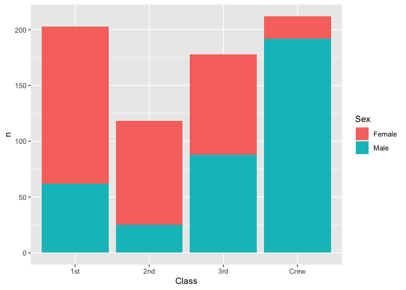
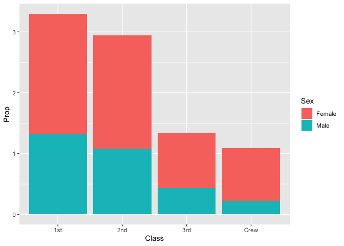
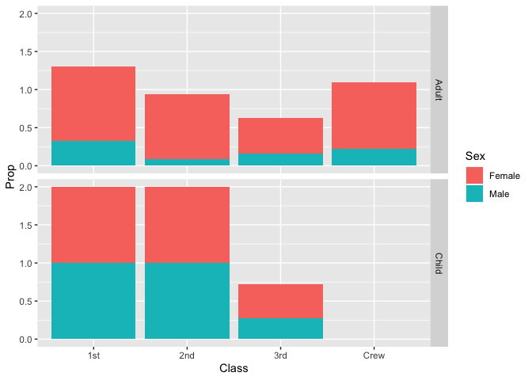

RMS Titanic
================
(Your name here)
2020-

- [Grading Rubric](#grading-rubric)
  - [Individual](#individual)
  - [Due Date](#due-date)
- [First Look](#first-look)
  - [**q1** Perform a glimpse of `df_titanic`. What variables are in
    this
    dataset?](#q1-perform-a-glimpse-of-df_titanic-what-variables-are-in-this-dataset)
  - [**q2** Skim the Wikipedia article on the RMS Titanic, and look for
    a total count of souls aboard. Compare against the total computed
    below. Are there any differences? Are those differences large or
    small? What might account for those
    differences?](#q2-skim-the-wikipedia-article-on-the-rms-titanic-and-look-for-a-total-count-of-souls-aboard-compare-against-the-total-computed-below-are-there-any-differences-are-those-differences-large-or-small-what-might-account-for-those-differences)
  - [**q3** Create a plot showing the count of persons who *did*
    survive, along with aesthetics for `Class` and `Sex`. Document your
    observations
    below.](#q3-create-a-plot-showing-the-count-of-persons-who-did-survive-along-with-aesthetics-for-class-and-sex-document-your-observations-below)
- [Deeper Look](#deeper-look)
  - [**q4** Replicate your visual from q3, but display `Prop` in place
    of `n`. Document your observations, and note any new/different
    observations you make in comparison with q3. Is there anything
    *fishy* in your
    plot?](#q4-replicate-your-visual-from-q3-but-display-prop-in-place-of-n-document-your-observations-and-note-any-newdifferent-observations-you-make-in-comparison-with-q3-is-there-anything-fishy-in-your-plot)
  - [**q5** Create a plot showing the group-proportion of occupants who
    *did* survive, along with aesthetics for `Class`, `Sex`, *and*
    `Age`. Document your observations
    below.](#q5-create-a-plot-showing-the-group-proportion-of-occupants-who-did-survive-along-with-aesthetics-for-class-sex-and-age-document-your-observations-below)
- [Notes](#notes)

*Purpose*: Most datasets have at least a few variables. Part of our task
in analyzing a dataset is to understand trends as they vary across these
different variables. Unless we’re careful and thorough, we can easily
miss these patterns. In this challenge you’ll analyze a dataset with a
small number of categorical variables and try to find differences among
the groups.

*Reading*: (Optional) [Wikipedia
article](https://en.wikipedia.org/wiki/RMS_Titanic) on the RMS Titanic.

<!-- include-rubric -->

# Grading Rubric

<!-- -------------------------------------------------- -->

Unlike exercises, **challenges will be graded**. The following rubrics
define how you will be graded, both on an individual and team basis.

## Individual

<!-- ------------------------- -->

| Category    | Needs Improvement                                                                                                | Satisfactory                                                                                                               |
|-------------|------------------------------------------------------------------------------------------------------------------|----------------------------------------------------------------------------------------------------------------------------|
| Effort      | Some task **q**’s left unattempted                                                                               | All task **q**’s attempted                                                                                                 |
| Observed    | Did not document observations, or observations incorrect                                                         | Documented correct observations based on analysis                                                                          |
| Supported   | Some observations not clearly supported by analysis                                                              | All observations clearly supported by analysis (table, graph, etc.)                                                        |
| Assessed    | Observations include claims not supported by the data, or reflect a level of certainty not warranted by the data | Observations are appropriately qualified by the quality & relevance of the data and (in)conclusiveness of the support      |
| Specified   | Uses the phrase “more data are necessary” without clarification                                                  | Any statement that “more data are necessary” specifies which *specific* data are needed to answer what *specific* question |
| Code Styled | Violations of the [style guide](https://style.tidyverse.org/) hinder readability                                 | Code sufficiently close to the [style guide](https://style.tidyverse.org/)                                                 |

## Due Date

<!-- ------------------------- -->

All the deliverables stated in the rubrics above are due **at midnight**
before the day of the class discussion of the challenge. See the
[Syllabus](https://docs.google.com/document/d/1qeP6DUS8Djq_A0HMllMqsSqX3a9dbcx1/edit?usp=sharing&ouid=110386251748498665069&rtpof=true&sd=true)
for more information.

``` r
library(tidyverse)
```

    ## ── Attaching packages ─────────────────────────────────────── tidyverse 1.3.2 ──
    ## ✔ ggplot2 3.4.0      ✔ purrr   1.0.1 
    ## ✔ tibble  3.1.8      ✔ dplyr   1.0.10
    ## ✔ tidyr   1.2.1      ✔ stringr 1.5.0 
    ## ✔ readr   2.1.3      ✔ forcats 0.5.2 
    ## ── Conflicts ────────────────────────────────────────── tidyverse_conflicts() ──
    ## ✖ dplyr::filter() masks stats::filter()
    ## ✖ dplyr::lag()    masks stats::lag()

``` r
df_titanic <- as_tibble(Titanic)
```

*Background*: The RMS Titanic sank on its maiden voyage in 1912; about
67% of its passengers died.

# First Look

<!-- -------------------------------------------------- -->

### **q1** Perform a glimpse of `df_titanic`. What variables are in this dataset?

``` r
glimpse(df_titanic)
```

    ## Rows: 32
    ## Columns: 5
    ## $ Class    <chr> "1st", "2nd", "3rd", "Crew", "1st", "2nd", "3rd", "Crew", "1s…
    ## $ Sex      <chr> "Male", "Male", "Male", "Male", "Female", "Female", "Female",…
    ## $ Age      <chr> "Child", "Child", "Child", "Child", "Child", "Child", "Child"…
    ## $ Survived <chr> "No", "No", "No", "No", "No", "No", "No", "No", "No", "No", "…
    ## $ n        <dbl> 0, 0, 35, 0, 0, 0, 17, 0, 118, 154, 387, 670, 4, 13, 89, 3, 5…

**Observations**:

- Class, Sex, Age Survived, n

### **q2** Skim the [Wikipedia article](https://en.wikipedia.org/wiki/RMS_Titanic) on the RMS Titanic, and look for a total count of souls aboard. Compare against the total computed below. Are there any differences? Are those differences large or small? What might account for those differences?

``` r
## NOTE: No need to edit! We'll cover how to
## do this calculation in a later exercise.
df_titanic %>% summarize(total = sum(n))
```

    ## # A tibble: 1 × 1
    ##   total
    ##   <dbl>
    ## 1  2201

**Observations**:

- Write your observations here
- Are there any differences?
  - We’re short 8 people, I added up the maiden voyage’s passengers and
    crew and got 2209, but here there is only 2201.
- If yes, what might account for those differences?
  - Maybe they were going off of tickets sold and some people decided
    not to go or weren’t able to make it. It is also possible a few of
    the crew members were out sick, someone like a waiter or janitor
    where the ship would run fine without them so they weren’t replaced
    and the ship cast off anyway. Another possibility is there was
    simply a mistake in the Wikipedia article’s count of the number of
    passengers and crew.
  - …

### **q3** Create a plot showing the count of persons who *did* survive, along with aesthetics for `Class` and `Sex`. Document your observations below.

*Note*: There are many ways to do this.

``` r
df_titanic %>% as_tibble() %>% filter(Survived == "Yes") %>% ggplot() + geom_col(mapping = aes(fill = Sex, x = Class, y = n))
```

<!-- -->

**Observations**:

- The crew and the first class survived at the highest rates, second
  class had the least survivors, and third class was almost as high as
  first and the crew. However we cannot draw complete conclusions on
  survival rate based on class without knowing how many total were in
  each class

# Deeper Look

<!-- -------------------------------------------------- -->

Raw counts give us a sense of totals, but they are not as useful for
understanding differences between groups. This is because the
differences we see in counts could be due to either the relative size of
the group OR differences in outcomes for those groups. To make
comparisons between groups, we should also consider *proportions*.\[1\]

The following code computes proportions within each `Class, Sex, Age`
group.

``` r
## NOTE: No need to edit! We'll cover how to
## do this calculation in a later exercise.
df_prop <-
  df_titanic %>%
  group_by(Class, Sex, Age) %>%
  mutate(
    Total = sum(n),
    Prop = n / Total
  ) %>%
  ungroup()
df_prop
```

    ## # A tibble: 32 × 7
    ##    Class Sex    Age   Survived     n Total    Prop
    ##    <chr> <chr>  <chr> <chr>    <dbl> <dbl>   <dbl>
    ##  1 1st   Male   Child No           0     5   0    
    ##  2 2nd   Male   Child No           0    11   0    
    ##  3 3rd   Male   Child No          35    48   0.729
    ##  4 Crew  Male   Child No           0     0 NaN    
    ##  5 1st   Female Child No           0     1   0    
    ##  6 2nd   Female Child No           0    13   0    
    ##  7 3rd   Female Child No          17    31   0.548
    ##  8 Crew  Female Child No           0     0 NaN    
    ##  9 1st   Male   Adult No         118   175   0.674
    ## 10 2nd   Male   Adult No         154   168   0.917
    ## # … with 22 more rows

### **q4** Replicate your visual from q3, but display `Prop` in place of `n`. Document your observations, and note any new/different observations you make in comparison with q3. Is there anything *fishy* in your plot?

``` r
df_prop %>% as_tibble() %>% filter(Survived == "Yes") %>% ggplot() + geom_col(mapping = aes(fill = Sex, x = Class, y = Prop))
```

    ## Warning: Removed 2 rows containing missing values (`position_stack()`).

<!-- -->

**Observations**:

- Write your observations here.
- Is there anything *fishy* going on in your plot?
  - 1st class and 2nd class have way higher survival rates than 3rd
    class and the crew. I would suspect that this means they were more
    easily able to escape, maybe by being on higher decks but this is
    speculation. Regardless, the higher the status the more they
    survive, the most seemingly reasonable conclusion is that the higher
    classes were able to escape more easily. On the surface a
    disproportionate number of women survived but I need to investigate
    further to be certain.

### **q5** Create a plot showing the group-proportion of occupants who *did* survive, along with aesthetics for `Class`, `Sex`, *and* `Age`. Document your observations below.

*Hint*: Don’t forget that you can use `facet_grid` to help consider
additional variables!

``` r
df_prop %>% as_tibble() %>% filter(Survived == "Yes") %>% ggplot() + geom_col(mapping = aes(fill = Sex, x = Class, y = Prop)) + facet_grid(rows = vars(Age))
```

    ## Warning: Removed 2 rows containing missing values (`position_stack()`).

<!-- -->

**Observations**:

- (Write your observations here.)
- If you saw something *fishy* in q4 above, use your new plot to explain
  the fishy-ness.
  - This seals the deal, there are an overwhelming number of women who
    survive and overall children fare better than adults, but the sex
    bias is lessened. The only thing I can think of in this case is
    chivalry, the men saving women and children before other men and at
    risk to themselves. This explanation seems to explain the data best
    based on how I have presented it.

# Notes

<!-- -------------------------------------------------- -->

\[1\] This is basically the same idea as [Dimensional
Analysis](https://en.wikipedia.org/wiki/Dimensional_analysis); computing
proportions is akin to non-dimensionalizing a quantity.
