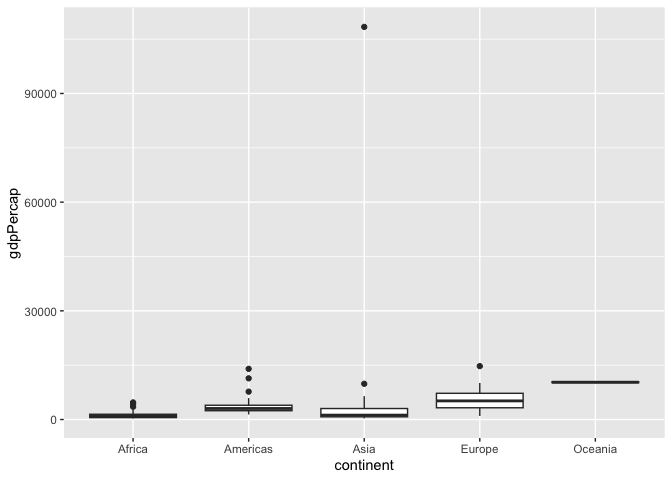
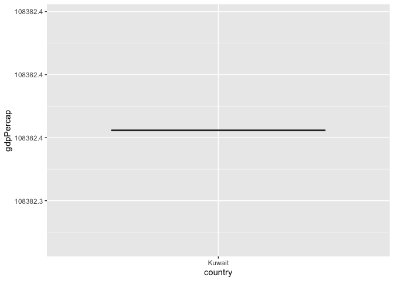
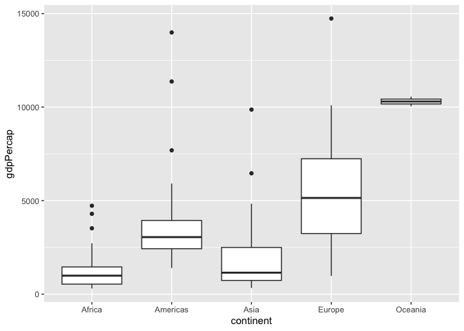
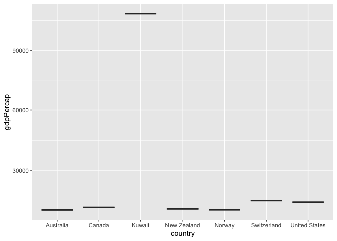
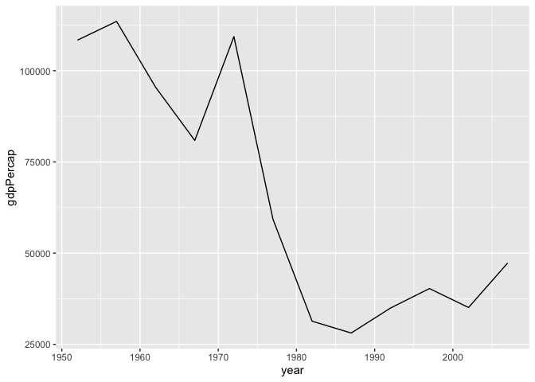
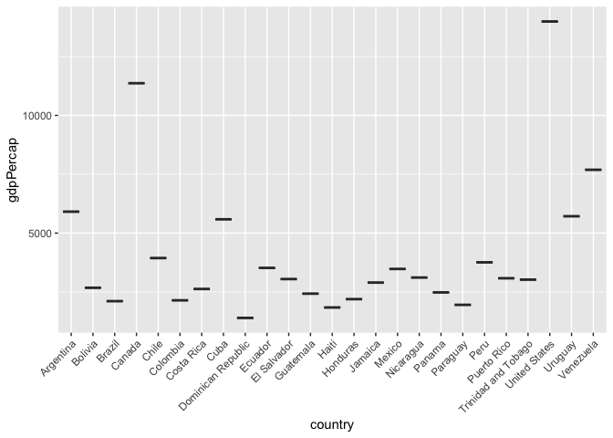
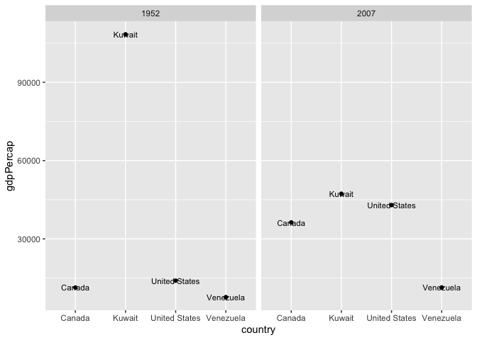
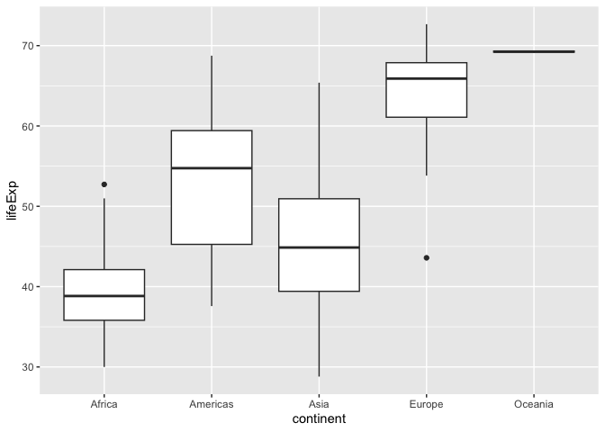
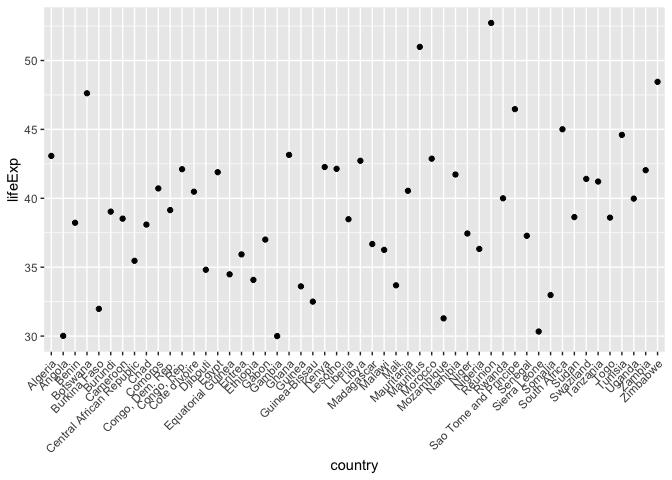
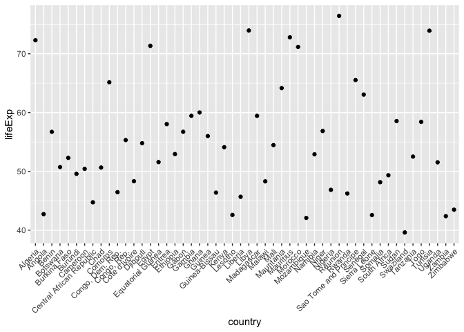

Gapminder
================
Daniel
02/26/2023

- [Grading Rubric](#grading-rubric)
  - [Individual](#individual)
  - [Due Date](#due-date)
- [Guided EDA](#guided-eda)
  - [**q0** Perform your “first checks” on the dataset. What variables
    are in
    this](#q0-perform-your-first-checks-on-the-dataset-what-variables-are-in-this)
  - [**q1** Determine the most and least recent years in the `gapminder`
    dataset.](#q1-determine-the-most-and-least-recent-years-in-the-gapminder-dataset)
  - [**q2** Filter on years matching `year_min`, and make a plot of the
    GDP per capita against continent. Choose an appropriate `geom_` to
    visualize the data. What observations can you
    make?](#q2-filter-on-years-matching-year_min-and-make-a-plot-of-the-gdp-per-capita-against-continent-choose-an-appropriate-geom_-to-visualize-the-data-what-observations-can-you-make)
  - [**q4** Create a plot similar to yours from q2 studying both
    `year_min` and `year_max`. Find a way to highlight the outliers from
    q3 on your plot *in a way that lets you identify which country is
    which*. Compare the patterns between `year_min` and
    `year_max`.](#q4-create-a-plot-similar-to-yours-from-q2-studying-both-year_min-and-year_max-find-a-way-to-highlight-the-outliers-from-q3-on-your-plot-in-a-way-that-lets-you-identify-which-country-is-which-compare-the-patterns-between-year_min-and-year_max)
- [Your Own EDA](#your-own-eda)
  - [**q5** Create *at least* three new figures below. With each figure,
    try to pose new questions about the
    data.](#q5-create-at-least-three-new-figures-below-with-each-figure-try-to-pose-new-questions-about-the-data)

*Purpose*: Learning to do EDA well takes practice! In this challenge
you’ll further practice EDA by first completing a guided exploration,
then by conducting your own investigation. This challenge will also give
you a chance to use the wide variety of visual tools we’ve been
learning.

<!-- include-rubric -->

# Grading Rubric

<!-- -------------------------------------------------- -->

Unlike exercises, **challenges will be graded**. The following rubrics
define how you will be graded, both on an individual and team basis.

## Individual

<!-- ------------------------- -->

| Category    | Needs Improvement                                                                                                | Satisfactory                                                                                                               |
|-------------|------------------------------------------------------------------------------------------------------------------|----------------------------------------------------------------------------------------------------------------------------|
| Effort      | Some task **q**’s left unattempted                                                                               | All task **q**’s attempted                                                                                                 |
| Observed    | Did not document observations, or observations incorrect                                                         | Documented correct observations based on analysis                                                                          |
| Supported   | Some observations not clearly supported by analysis                                                              | All observations clearly supported by analysis (table, graph, etc.)                                                        |
| Assessed    | Observations include claims not supported by the data, or reflect a level of certainty not warranted by the data | Observations are appropriately qualified by the quality & relevance of the data and (in)conclusiveness of the support      |
| Specified   | Uses the phrase “more data are necessary” without clarification                                                  | Any statement that “more data are necessary” specifies which *specific* data are needed to answer what *specific* question |
| Code Styled | Violations of the [style guide](https://style.tidyverse.org/) hinder readability                                 | Code sufficiently close to the [style guide](https://style.tidyverse.org/)                                                 |

## Due Date

<!-- ------------------------- -->

All the deliverables stated in the rubrics above are due **at midnight**
before the day of the class discussion of the challenge. See the
[Syllabus](https://docs.google.com/document/d/1qeP6DUS8Djq_A0HMllMqsSqX3a9dbcx1/edit?usp=sharing&ouid=110386251748498665069&rtpof=true&sd=true)
for more information.

``` r
library(tidyverse)
```

    ## ── Attaching packages ─────────────────────────────────────── tidyverse 1.3.2 ──
    ## ✔ ggplot2 3.4.0      ✔ purrr   1.0.1 
    ## ✔ tibble  3.1.8      ✔ dplyr   1.0.10
    ## ✔ tidyr   1.2.1      ✔ stringr 1.5.0 
    ## ✔ readr   2.1.3      ✔ forcats 0.5.2 
    ## ── Conflicts ────────────────────────────────────────── tidyverse_conflicts() ──
    ## ✖ dplyr::filter() masks stats::filter()
    ## ✖ dplyr::lag()    masks stats::lag()

``` r
library(gapminder)
```

*Background*: [Gapminder](https://www.gapminder.org/about-gapminder/) is
an independent organization that seeks to educate people about the state
of the world. They seek to counteract the worldview constructed by a
hype-driven media cycle, and promote a “fact-based worldview” by
focusing on data. The dataset we’ll study in this challenge is from
Gapminder.

# Guided EDA

<!-- -------------------------------------------------- -->

First, we’ll go through a round of *guided EDA*. Try to pay attention to
the high-level process we’re going through—after this guided round
you’ll be responsible for doing another cycle of EDA on your own!

### **q0** Perform your “first checks” on the dataset. What variables are in this

dataset?

``` r
## TASK: Do your "first checks" here!
gapminder %>% summary()
```

    ##         country        continent        year         lifeExp     
    ##  Afghanistan:  12   Africa  :624   Min.   :1952   Min.   :23.60  
    ##  Albania    :  12   Americas:300   1st Qu.:1966   1st Qu.:48.20  
    ##  Algeria    :  12   Asia    :396   Median :1980   Median :60.71  
    ##  Angola     :  12   Europe  :360   Mean   :1980   Mean   :59.47  
    ##  Argentina  :  12   Oceania : 24   3rd Qu.:1993   3rd Qu.:70.85  
    ##  Australia  :  12                  Max.   :2007   Max.   :82.60  
    ##  (Other)    :1632                                                
    ##       pop              gdpPercap       
    ##  Min.   :6.001e+04   Min.   :   241.2  
    ##  1st Qu.:2.794e+06   1st Qu.:  1202.1  
    ##  Median :7.024e+06   Median :  3531.8  
    ##  Mean   :2.960e+07   Mean   :  7215.3  
    ##  3rd Qu.:1.959e+07   3rd Qu.:  9325.5  
    ##  Max.   :1.319e+09   Max.   :113523.1  
    ## 

``` r
gapminder %>% head()
```

    ## # A tibble: 6 × 6
    ##   country     continent  year lifeExp      pop gdpPercap
    ##   <fct>       <fct>     <int>   <dbl>    <int>     <dbl>
    ## 1 Afghanistan Asia       1952    28.8  8425333      779.
    ## 2 Afghanistan Asia       1957    30.3  9240934      821.
    ## 3 Afghanistan Asia       1962    32.0 10267083      853.
    ## 4 Afghanistan Asia       1967    34.0 11537966      836.
    ## 5 Afghanistan Asia       1972    36.1 13079460      740.
    ## 6 Afghanistan Asia       1977    38.4 14880372      786.

**Observations**:

- country, continent, year, lifeExp, pop, gdpPercap

### **q1** Determine the most and least recent years in the `gapminder` dataset.

*Hint*: Use the `pull()` function to get a vector out of a tibble.
(Rather than the `$` notation of base R.)

``` r
## TASK: Find the largest and smallest values of `year` in `gapminder`
year_max <- gapminder %>% pull(year) %>% max()
year_min <- gapminder %>% pull(year) %>% min()
```

Use the following test to check your work.

``` r
## NOTE: No need to change this
assertthat::assert_that(year_max %% 7 == 5)
```

    ## [1] TRUE

``` r
assertthat::assert_that(year_max %% 3 == 0)
```

    ## [1] TRUE

``` r
assertthat::assert_that(year_min %% 7 == 6)
```

    ## [1] TRUE

``` r
assertthat::assert_that(year_min %% 3 == 2)
```

    ## [1] TRUE

``` r
if (is_tibble(year_max)) {
  print("year_max is a tibble; try using `pull()` to get a vector")
  assertthat::assert_that(False)
}

print("Nice!")
```

    ## [1] "Nice!"

### **q2** Filter on years matching `year_min`, and make a plot of the GDP per capita against continent. Choose an appropriate `geom_` to visualize the data. What observations can you make?

You may encounter difficulties in visualizing these data; if so document
your challenges and attempt to produce the most informative visual you
can.

``` r
## TASK: Create a visual of gdpPercap vs continent
gapminder %>% 
  filter(year == year_min) %>% 
  ggplot() + 
  geom_boxplot(aes(x = continent, y = gdpPercap))
```

<!-- --> I
immediately noticed a crazy outlier way beyond any other country. I was
especially intrigued by the fact that it wasn’t in Europe which ruled
out Switzerland (later proved to be the much lesser Europe outlier)

``` r
gapminder %>% 
  filter(year == year_min, gdpPercap > 30000) %>% 
  ggplot() + 
  geom_boxplot(aes(x = country, y = gdpPercap))
```

<!-- -->
I filtered the data and found out it was Kuwait, I did a bit of research
and it turns out Kuwait had recently started oil production only a few
years prior.

``` r
gapminder %>% 
  filter(year == year_min, gdpPercap < 30000) %>% 
  ggplot() + 
  geom_boxplot(aes(x = continent, y = gdpPercap))
```

<!-- -->
The rest of the world by continent, much more readable.

``` r
gapminder %>% 
  filter(year == year_min, gdpPercap > 10000) %>% 
  ggplot() + 
  geom_boxplot(aes(x = country, y = gdpPercap))
```

<!-- -->
These are the top earning countries, you can see America, Canada, and
Switzerland are high, but Kuwait is far and away the highest.

``` r
gapminder %>% filter(country == 'Kuwait', gdpPercap > 15000) %>% ggplot() +  geom_line(aes(x = year, y = gdpPercap))
```

<!-- -->
I wondered if it was just a mistake, so I graphed Kuwait over time.
Apparently Kuwait stayed rich for a while before plummeting. I suspect
based on the timing and Kuwait’s economy this was due to the 1973 Oil
Crisis.

``` r
gapminder %>% 
  filter(year == year_min, continent == 'Americas') %>% 
  ggplot() + 
  geom_boxplot(aes(x = country, y = gdpPercap)) +
  theme(axis.text.x = element_text(angle = 45, hjust = 1))
```

<!-- -->
Moving on from Kuwait, I was curious about the Americas, so I graphed
them and saw this, the US and Canada led as I expected, but my
suspicions were confirmed seeing Venezuela substantially above the rest
of South America

**Observations**:

- First thing I noticed is there was a massive outlier in Asia, nowhere
  else was even a quarter of the value. It turned out to be Kuwait. I
  filtered it out using a cutoff. Canada, America, and Switzerland were
  the next highest, but they were nowhere close to Kuwait. I was curious
  if this was just an aberration, so I plotted Kuwait’s GDP over time
  and it stayed high until 1972, after which it plummeted. This lines up
  with the 1970s energy crisis, specifically the 1973 oil crisis. Within
  the Americas, the United States and Canada are at the top, although
  excluding those two, Venezuela beats all the other countries in the
  Americas by a significant margin. I’ve looked into this and I believe
  it has to do with the fact that Venezuela is sitting on the largest
  oil reserve in the world, even larger than Saudi Arabia’s.

**Difficulties & Approaches**:

- It wasn’t that hard, aside from there being so much going on in the
  data. I needed to make 4 plots with different filters and quantities.
  I based the filters on isolating outliers from earlier graphs, with a
  special focus on Kuwait and the other wealthy countries to compare
  them.

- Identify the outlier countries from q2

  - America, Canada, Switzerland, Kuwait, and Venezuela. See above for
    details and supporting plots.

*Hint*: For the next task, it’s helpful to know a ggplot trick we’ll
learn in an upcoming exercise: You can use the `data` argument inside
any `geom_*` to modify the data that will be plotted *by that geom
only*. For instance, you can use this trick to filter a set of points to
label:

``` r
## NOTE: No need to edit, use ideas from this in q4 below
gapminder %>%
  filter(year == max(year)) %>%
  ggplot(aes(continent, lifeExp)) +
  geom_boxplot() +
  geom_point(
    data = . %>% filter(country %in% c("United Kingdom", "Japan", "Zambia")),
    mapping = aes(color = country),
    size = 2
  )
```

<!-- -->

### **q4** Create a plot similar to yours from q2 studying both `year_min` and `year_max`. Find a way to highlight the outliers from q3 on your plot *in a way that lets you identify which country is which*. Compare the patterns between `year_min` and `year_max`.

*Hint*: We’ve learned a lot of different ways to show multiple
variables; think about using different aesthetics or facets.

``` r
gapminder %>%
  filter(year %in% c(year_min, year_max)) %>%
  filter(country %in% c("United States", "Canada", "Venezuela", "Kuwait")) %>%
  ggplot(aes(x = country, y = gdpPercap)) +
  geom_point() +
  facet_wrap(vars(year)) +
  geom_text(aes(label = country), size = 3)
```

<!-- -->

**Observations**:

- Kuwait is stil the highest in 2007, although not by much. Venezuela
  has seen minimal growth compared to the United States and Canada.

# Your Own EDA

<!-- -------------------------------------------------- -->

Now it’s your turn! We just went through guided EDA considering the GDP
per capita at two time points. You can continue looking at outliers,
consider different years, repeat the exercise with `lifeExp`, consider
the relationship between variables, or something else entirely.

### **q5** Create *at least* three new figures below. With each figure, try to pose new questions about the data.

``` r
## TASK: Your first graph
gapminder %>% 
  filter(year == year_min) %>% 
  ggplot() + 
  geom_boxplot(aes(x = continent, y = lifeExp))
```

<!-- -->

- Africa as a continent has the lowest average lifespan by far, with the
  median across countries being below 40. I am interested in which
  country has the highest lifespan.

``` r
## TASK: Your second graph
gapminder %>% 
  filter(year == year_min, continent == "Africa") %>% 
  ggplot() + 
  geom_point(aes(x = country, y = lifeExp)) +
  theme(axis.text.x = element_text(angle = 45, hjust = 1))
```

<!-- -->

- The vast majority of the continent has an average lifespan below 45,
  only 2 countries have an average lifespan above 50. Reunion has the
  highest average lifespan in 1952, followed by Mauritius. I found out
  that they are both small islands under French rule.

``` r
## TASK: Your third graph
gapminder %>% 
  filter(year == year_max, continent == "Africa") %>% 
  ggplot() + 
  geom_point(aes(x = country, y = lifeExp)) +
  theme(axis.text.x = element_text(angle = 45, hjust = 1))
```

<!-- -->

- In 2007 Reunion is still the highest, although now the majority of
  African countries have average lifespans at least as high as Reunion’s
  in 1952. Mauritius is no longer \#2, but is still quite close to the
  top. Both countries have an average lifespan of over 70.
