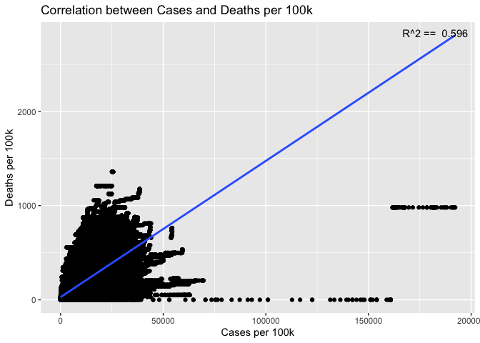

COVID-19
================
Daniel Heitz
03/19/2023

- [Grading Rubric](#grading-rubric)
  - [Individual](#individual)
  - [Due Date](#due-date)
- [The Big Picture](#the-big-picture)
- [Get the Data](#get-the-data)
  - [Navigating the Census Bureau](#navigating-the-census-bureau)
    - [**q1** Load Table `B01003` into the following tibble. Make sure
      the column names are
      `id, Geographic Area Name, Estimate!!Total, Margin of Error!!Total`.](#q1-load-table-b01003-into-the-following-tibble-make-sure-the-column-names-are-id-geographic-area-name-estimatetotal-margin-of-errortotal)
  - [Automated Download of NYT Data](#automated-download-of-nyt-data)
    - [**q2** Visit the NYT GitHub repo and find the URL for the **raw**
      US County-level data. Assign that URL as a string to the variable
      below.](#q2-visit-the-nyt-github-repo-and-find-the-url-for-the-raw-us-county-level-data-assign-that-url-as-a-string-to-the-variable-below)
- [Join the Data](#join-the-data)
  - [**q3** Process the `id` column of `df_pop` to create a `fips`
    column.](#q3-process-the-id-column-of-df_pop-to-create-a-fips-column)
  - [**q4** Join `df_covid` with `df_q3` by the `fips` column. Use the
    proper type of join to preserve *only* the rows in
    `df_covid`.](#q4-join-df_covid-with-df_q3-by-the-fips-column-use-the-proper-type-of-join-to-preserve-only-the-rows-in-df_covid)
- [Analyze](#analyze)
  - [Normalize](#normalize)
    - [**q5** Use the `population` estimates in `df_data` to normalize
      `cases` and `deaths` to produce per 100,000 counts \[3\]. Store
      these values in the columns `cases_per100k` and
      `deaths_per100k`.](#q5-use-the-population-estimates-in-df_data-to-normalize-cases-and-deaths-to-produce-per-100000-counts-3-store-these-values-in-the-columns-cases_per100k-and-deaths_per100k)
  - [Guided EDA](#guided-eda)
    - [**q6** Compute the mean and standard deviation for
      `cases_per100k` and
      `deaths_per100k`.](#q6-compute-the-mean-and-standard-deviation-for-cases_per100k-and-deaths_per100k)
    - [**q7** Find the top 10 counties in terms of `cases_per100k`, and
      the top 10 in terms of `deaths_per100k`. Report the population of
      each county along with the per-100,000 counts. Compare the counts
      against the mean values you found in q6. Note any
      observations.](#q7-find-the-top-10-counties-in-terms-of-cases_per100k-and-the-top-10-in-terms-of-deaths_per100k-report-the-population-of-each-county-along-with-the-per-100000-counts-compare-the-counts-against-the-mean-values-you-found-in-q6-note-any-observations)
  - [Self-directed EDA](#self-directed-eda)
    - [**q8** Drive your own ship: You’ve just put together a very rich
      dataset; you now get to explore! Pick your own direction and
      generate at least one punchline figure to document an interesting
      finding. I give a couple tips & ideas
      below:](#q8-drive-your-own-ship-youve-just-put-together-a-very-rich-dataset-you-now-get-to-explore-pick-your-own-direction-and-generate-at-least-one-punchline-figure-to-document-an-interesting-finding-i-give-a-couple-tips--ideas-below)
    - [Ideas](#ideas)
    - [Aside: Some visualization
      tricks](#aside-some-visualization-tricks)
    - [Geographic exceptions](#geographic-exceptions)
- [Notes](#notes)

*Purpose*: In this challenge, you’ll learn how to navigate the U.S.
Census Bureau website, programmatically download data from the internet,
and perform a county-level population-weighted analysis of current
COVID-19 trends. This will give you the base for a very deep
investigation of COVID-19, which we’ll build upon for Project 1.

<!-- include-rubric -->

# Grading Rubric

<!-- -------------------------------------------------- -->

Unlike exercises, **challenges will be graded**. The following rubrics
define how you will be graded, both on an individual and team basis.

## Individual

<!-- ------------------------- -->

| Category    | Needs Improvement                                                                                                | Satisfactory                                                                                                               |
|-------------|------------------------------------------------------------------------------------------------------------------|----------------------------------------------------------------------------------------------------------------------------|
| Effort      | Some task **q**’s left unattempted                                                                               | All task **q**’s attempted                                                                                                 |
| Observed    | Did not document observations, or observations incorrect                                                         | Documented correct observations based on analysis                                                                          |
| Supported   | Some observations not clearly supported by analysis                                                              | All observations clearly supported by analysis (table, graph, etc.)                                                        |
| Assessed    | Observations include claims not supported by the data, or reflect a level of certainty not warranted by the data | Observations are appropriately qualified by the quality & relevance of the data and (in)conclusiveness of the support      |
| Specified   | Uses the phrase “more data are necessary” without clarification                                                  | Any statement that “more data are necessary” specifies which *specific* data are needed to answer what *specific* question |
| Code Styled | Violations of the [style guide](https://style.tidyverse.org/) hinder readability                                 | Code sufficiently close to the [style guide](https://style.tidyverse.org/)                                                 |

## Due Date

<!-- ------------------------- -->

All the deliverables stated in the rubrics above are due **at midnight**
before the day of the class discussion of the challenge. See the
[Syllabus](https://docs.google.com/document/d/1qeP6DUS8Djq_A0HMllMqsSqX3a9dbcx1/edit?usp=sharing&ouid=110386251748498665069&rtpof=true&sd=true)
for more information.

``` r
library(tidyverse)
```

    ## ── Attaching packages ─────────────────────────────────────── tidyverse 1.3.2 ──
    ## ✔ ggplot2 3.4.0      ✔ purrr   1.0.1 
    ## ✔ tibble  3.1.8      ✔ dplyr   1.0.10
    ## ✔ tidyr   1.2.1      ✔ stringr 1.5.0 
    ## ✔ readr   2.1.3      ✔ forcats 0.5.2 
    ## ── Conflicts ────────────────────────────────────────── tidyverse_conflicts() ──
    ## ✖ dplyr::filter() masks stats::filter()
    ## ✖ dplyr::lag()    masks stats::lag()

*Background*:
[COVID-19](https://en.wikipedia.org/wiki/Coronavirus_disease_2019) is
the disease caused by the virus SARS-CoV-2. In 2020 it became a global
pandemic, leading to huge loss of life and tremendous disruption to
society. The New York Times (as of writing) publishes up-to-date data on
the progression of the pandemic across the United States—we will study
these data in this challenge.

*Optional Readings*: I’ve found this [ProPublica
piece](https://www.propublica.org/article/how-to-understand-covid-19-numbers)
on “How to understand COVID-19 numbers” to be very informative!

# The Big Picture

<!-- -------------------------------------------------- -->

We’re about to go through *a lot* of weird steps, so let’s first fix the
big picture firmly in mind:

We want to study COVID-19 in terms of data: both case counts (number of
infections) and deaths. We’re going to do a county-level analysis in
order to get a high-resolution view of the pandemic. Since US counties
can vary widely in terms of their population, we’ll need population
estimates in order to compute infection rates (think back to the
`Titanic` challenge).

That’s the high-level view; now let’s dig into the details.

# Get the Data

<!-- -------------------------------------------------- -->

1.  County-level population estimates (Census Bureau)
2.  County-level COVID-19 counts (New York Times)

## Navigating the Census Bureau

<!-- ------------------------- -->

**Steps**: Our objective is to find the 2018 American Community
Survey\[1\] (ACS) Total Population estimates, disaggregated by counties.
To check your results, this is Table `B01003`.

1.  Go to [data.census.gov](data.census.gov).
2.  Scroll down and click `View Tables`.
3.  Apply filters to find the ACS **Total Population** estimates,
    disaggregated by counties. I used the filters:

- `Topics > Populations and People > Counts, Estimates, and Projections > Population Total`
- `Geography > County > All counties in United States`

5.  Select the **Total Population** table and click the `Download`
    button to download the data; make sure to select the 2018 5-year
    estimates.
6.  Unzip and move the data to your `challenges/data` folder.

- Note that the data will have a crazy-long filename like
  `ACSDT5Y2018.B01003_data_with_overlays_2020-07-26T094857.csv`. That’s
  because metadata is stored in the filename, such as the year of the
  estimate (`Y2018`) and my access date (`2020-07-26`). **Your filename
  will vary based on when you download the data**, so make sure to copy
  the filename that corresponds to what you downloaded!

### **q1** Load Table `B01003` into the following tibble. Make sure the column names are `id, Geographic Area Name, Estimate!!Total, Margin of Error!!Total`.

*Hint*: You will need to use the `skip` keyword when loading these data!

``` r
## TASK: Load the census bureau data with the following tibble name.
df_pop <- read_csv("ACSDT5Y2018.B01003-Data.csv")
```

    ## New names:
    ## Rows: 3220 Columns: 7
    ## ── Column specification
    ## ──────────────────────────────────────────────────────── Delimiter: "," chr
    ## (5): Geography, Geographic Area Name, Annotation of Estimate!!Total, Mar... dbl
    ## (1): Estimate!!Total lgl (1): ...7
    ## ℹ Use `spec()` to retrieve the full column specification for this data. ℹ
    ## Specify the column types or set `show_col_types = FALSE` to quiet this message.
    ## • `` -> `...7`

*Note*: You can find information on 1-year, 3-year, and 5-year estimates
[here](https://www.census.gov/programs-surveys/acs/guidance/estimates.html).
The punchline is that 5-year estimates are more reliable but less
current.

## Automated Download of NYT Data

<!-- ------------------------- -->

ACS 5-year estimates don’t change all that often, but the COVID-19 data
are changing rapidly. To that end, it would be nice to be able to
*programmatically* download the most recent data for analysis; that way
we can update our analysis whenever we want simply by re-running our
notebook. This next problem will have you set up such a pipeline.

The New York Times is publishing up-to-date data on COVID-19 on
[GitHub](https://github.com/nytimes/covid-19-data).

### **q2** Visit the NYT [GitHub](https://github.com/nytimes/covid-19-data) repo and find the URL for the **raw** US County-level data. Assign that URL as a string to the variable below.

``` r
## TASK: Find the URL for the NYT covid-19 county-level data
url_counties <- "https://github.com/nytimes/covid-19-data/raw/master/us-counties.csv"
```

Once you have the url, the following code will download a local copy of
the data, then load the data into R.

``` r
## NOTE: No need to change this; just execute
## Set the filename of the data to download
filename_nyt <- "./data/nyt_counties.csv"

## Download the data locally
curl::curl_download(
        url_counties,
        destfile = filename_nyt
      )

## Loads the downloaded csv
df_covid <- read_csv(filename_nyt)
```

    ## Rows: 2502832 Columns: 6
    ## ── Column specification ────────────────────────────────────────────────────────
    ## Delimiter: ","
    ## chr  (3): county, state, fips
    ## dbl  (2): cases, deaths
    ## date (1): date
    ## 
    ## ℹ Use `spec()` to retrieve the full column specification for this data.
    ## ℹ Specify the column types or set `show_col_types = FALSE` to quiet this message.

You can now re-run the chunk above (or the entire notebook) to pull the
most recent version of the data. Thus you can periodically re-run this
notebook to check in on the pandemic as it evolves.

*Note*: You should feel free to copy-paste the code above for your own
future projects!

# Join the Data

<!-- -------------------------------------------------- -->

To get a sense of our task, let’s take a glimpse at our two data
sources.

``` r
## NOTE: No need to change this just execute
df_pop
```

    ## # A tibble: 3,220 × 7
    ##    Geography      `Geographic Area Name`   Estim…¹ Annot…² Margi…³ Annot…⁴ ...7 
    ##    <chr>          <chr>                      <dbl> <chr>   <chr>   <chr>   <lgl>
    ##  1 0500000US01001 Autauga County, Alabama    55200 null    *****   *****   NA   
    ##  2 0500000US01003 Baldwin County, Alabama   208107 null    *****   *****   NA   
    ##  3 0500000US01005 Barbour County, Alabama    25782 null    *****   *****   NA   
    ##  4 0500000US01007 Bibb County, Alabama       22527 null    *****   *****   NA   
    ##  5 0500000US01009 Blount County, Alabama     57645 null    *****   *****   NA   
    ##  6 0500000US01011 Bullock County, Alabama    10352 null    *****   *****   NA   
    ##  7 0500000US01013 Butler County, Alabama     20025 null    *****   *****   NA   
    ##  8 0500000US01015 Calhoun County, Alabama   115098 null    *****   *****   NA   
    ##  9 0500000US01017 Chambers County, Alabama   33826 null    *****   *****   NA   
    ## 10 0500000US01019 Cherokee County, Alabama   25853 null    *****   *****   NA   
    ## # … with 3,210 more rows, and abbreviated variable names ¹​`Estimate!!Total`,
    ## #   ²​`Annotation of Estimate!!Total`, ³​`Margin of Error!!Total`,
    ## #   ⁴​`Annotation of Margin of Error!!Total`

``` r
df_covid
```

    ## # A tibble: 2,502,832 × 6
    ##    date       county      state      fips  cases deaths
    ##    <date>     <chr>       <chr>      <chr> <dbl>  <dbl>
    ##  1 2020-01-21 Snohomish   Washington 53061     1      0
    ##  2 2020-01-22 Snohomish   Washington 53061     1      0
    ##  3 2020-01-23 Snohomish   Washington 53061     1      0
    ##  4 2020-01-24 Cook        Illinois   17031     1      0
    ##  5 2020-01-24 Snohomish   Washington 53061     1      0
    ##  6 2020-01-25 Orange      California 06059     1      0
    ##  7 2020-01-25 Cook        Illinois   17031     1      0
    ##  8 2020-01-25 Snohomish   Washington 53061     1      0
    ##  9 2020-01-26 Maricopa    Arizona    04013     1      0
    ## 10 2020-01-26 Los Angeles California 06037     1      0
    ## # … with 2,502,822 more rows

To join these datasets, we’ll need to use [FIPS county
codes](https://en.wikipedia.org/wiki/FIPS_county_code).\[2\] The last
`5` digits of the `id` column in `df_pop` is the FIPS county code, while
the NYT data `df_covid` already contains the `fips`.

### **q3** Process the `id` column of `df_pop` to create a `fips` column.

``` r
## TASK: Create a `fips` column by extracting the county code
df_q3 <- 
  df_pop %>% 
  mutate(fips = substr(Geography, nchar(Geography) - 4, nchar(Geography)))
df_q3
```

    ## # A tibble: 3,220 × 8
    ##    Geography      Geographic Area …¹ Estim…² Annot…³ Margi…⁴ Annot…⁵ ...7  fips 
    ##    <chr>          <chr>                <dbl> <chr>   <chr>   <chr>   <lgl> <chr>
    ##  1 0500000US01001 Autauga County, A…   55200 null    *****   *****   NA    01001
    ##  2 0500000US01003 Baldwin County, A…  208107 null    *****   *****   NA    01003
    ##  3 0500000US01005 Barbour County, A…   25782 null    *****   *****   NA    01005
    ##  4 0500000US01007 Bibb County, Alab…   22527 null    *****   *****   NA    01007
    ##  5 0500000US01009 Blount County, Al…   57645 null    *****   *****   NA    01009
    ##  6 0500000US01011 Bullock County, A…   10352 null    *****   *****   NA    01011
    ##  7 0500000US01013 Butler County, Al…   20025 null    *****   *****   NA    01013
    ##  8 0500000US01015 Calhoun County, A…  115098 null    *****   *****   NA    01015
    ##  9 0500000US01017 Chambers County, …   33826 null    *****   *****   NA    01017
    ## 10 0500000US01019 Cherokee County, …   25853 null    *****   *****   NA    01019
    ## # … with 3,210 more rows, and abbreviated variable names
    ## #   ¹​`Geographic Area Name`, ²​`Estimate!!Total`,
    ## #   ³​`Annotation of Estimate!!Total`, ⁴​`Margin of Error!!Total`,
    ## #   ⁵​`Annotation of Margin of Error!!Total`

Use the following test to check your answer.

``` r
## NOTE: No need to change this
## Check known county
assertthat::assert_that(
              (df_q3 %>%
              filter(str_detect(`Geographic Area Name`, "Autauga County")) %>%
              pull(fips)) == "01001"
            )
```

    ## [1] TRUE

``` r
print("Very good!")
```

    ## [1] "Very good!"

### **q4** Join `df_covid` with `df_q3` by the `fips` column. Use the proper type of join to preserve *only* the rows in `df_covid`.

``` r
## TASK: Join df_covid and df_q3 by fips.
# Left join might be the way
df_q4 <- merge(df_covid, df_q3, by = "fips", all.x = TRUE)
```

For convenience, I down-select some columns and produce more convenient
column names.

``` r
## NOTE: No need to change; run this to produce a more convenient tibble
df_data <-
  df_q4 %>%
  select(
    date,
    county,
    state,
    fips,
    cases,
    deaths,
    population = `Estimate!!Total`
  )
df_data <-
  df_data[complete.cases(df_data), ]
```

# Analyze

<!-- -------------------------------------------------- -->

Now that we’ve done the hard work of loading and wrangling the data, we
can finally start our analysis. Our first step will be to produce county
population-normalized cases and death counts. Then we will explore the
data.

## Normalize

<!-- ------------------------- -->

### **q5** Use the `population` estimates in `df_data` to normalize `cases` and `deaths` to produce per 100,000 counts \[3\]. Store these values in the columns `cases_per100k` and `deaths_per100k`.

``` r
## TASK: Normalize cases and deaths
df_normalized <- 
  df_data %>% 
  mutate(cases_per100k = 100000 * cases / population,
         deaths_per100k = 100000 * deaths / population)
```

You may use the following test to check your work.

``` r
## NOTE: No need to change this
## Check known county data
if (any(df_normalized %>% pull(date) %>% str_detect(., "2020-01-21"))) {
  assertthat::assert_that(TRUE)
} else {
  print(str_c(
    "Date 2020-01-21 not found; did you download the historical data (correct),",
    "or just the most recent data (incorrect)?",
    sep = " "
  ))
  assertthat::assert_that(FALSE)
}
```

    ## [1] TRUE

``` r
assertthat::assert_that(
              abs(df_normalized %>%
               filter(
                 str_detect(county, "Snohomish"),
                 date == "2020-01-21"
               ) %>%
              pull(cases_per100k) - 0.127) < 1e-3
            )
```

    ## [1] TRUE

``` r
assertthat::assert_that(
              abs(df_normalized %>%
               filter(
                 str_detect(county, "Snohomish"),
                 date == "2020-01-21"
               ) %>%
              pull(deaths_per100k) - 0) < 1e-3
            )
```

    ## [1] TRUE

``` r
print("Excellent!")
```

    ## [1] "Excellent!"

## Guided EDA

<!-- ------------------------- -->

Before turning you loose, let’s complete a couple guided EDA tasks.

### **q6** Compute the mean and standard deviation for `cases_per100k` and `deaths_per100k`.

``` r
mean_and_sd <-
  df_normalized %>% 
  summarize(
    mean_cases = mean(cases_per100k),
    sd_cases = sd(cases_per100k),
    mean_deaths = mean(deaths_per100k),
    sd_deaths = sd(deaths_per100k)
  )
mean_and_sd
```

    ##   mean_cases sd_cases mean_deaths sd_deaths
    ## 1   10093.54 8483.639    174.3095  158.9641

### **q7** Find the top 10 counties in terms of `cases_per100k`, and the top 10 in terms of `deaths_per100k`. Report the population of each county along with the per-100,000 counts. Compare the counts against the mean values you found in q6. Note any observations.

``` r
## TASK: Find the top 10 max cases_per100k counties; report populations as well
top_cases <-
  df_normalized %>% 
  group_by(county, state) %>% 
  summarize(max_cases_per100k = max(cases_per100k),
            population = unique(population)) %>% 
  ungroup() %>% 
  arrange(desc(max_cases_per100k)) %>%
  # These next two lines skip the first line and take the next 10 due to the 
  # top county having more cases on that day than people, hinting at an error.
  slice_head(n = 11) %>% 
  slice_tail(n = 10)
```

    ## `summarise()` has grouped output by 'county'. You can override using the
    ## `.groups` argument.

``` r
top_cases
```

    ## # A tibble: 10 × 4
    ##    county                   state        max_cases_per100k population
    ##    <chr>                    <chr>                    <dbl>      <dbl>
    ##  1 Chattahoochee            Georgia                 69527.      10767
    ##  2 Nome Census Area         Alaska                  62922.       9925
    ##  3 Northwest Arctic Borough Alaska                  62542.       7734
    ##  4 Crowley                  Colorado                59449.       5630
    ##  5 Bethel Census Area       Alaska                  57439.      18040
    ##  6 Dewey                    South Dakota            54317.       5779
    ##  7 Dimmit                   Texas                   54019.      10663
    ##  8 Jim Hogg                 Texas                   50133.       5282
    ##  9 Kusilvak Census Area     Alaska                  49817.       8198
    ## 10 North Slope Borough      Alaska                  45606.       9797

``` r
## TASK: Find the top 10 deaths_per100k counties; report populations as well
top_deaths <-
  df_normalized %>% 
  group_by(county, state) %>% 
  summarize(max_deaths_per100k = max(deaths_per100k),
            population = unique(population)) %>% 
  ungroup() %>% 
  arrange(desc(max_deaths_per100k)) %>%
  slice_head(n = 10)
```

    ## `summarise()` has grouped output by 'county'. You can override using the
    ## `.groups` argument.

``` r
top_deaths
```

    ## # A tibble: 10 × 4
    ##    county            state        max_deaths_per100k population
    ##    <chr>             <chr>                     <dbl>      <dbl>
    ##  1 McMullen          Texas                     1360.        662
    ##  2 Galax city        Virginia                  1175.       6638
    ##  3 Motley            Texas                     1125.       1156
    ##  4 Hancock           Georgia                   1054.       8535
    ##  5 Emporia city      Virginia                  1022.       5381
    ##  6 Towns             Georgia                   1016.      11417
    ##  7 Jerauld           South Dakota               986.       2029
    ##  8 Loving            Texas                      980.        102
    ##  9 Robertson         Kentucky                   980.       2143
    ## 10 Martinsville city Virginia                   946.      13101

**Observations**:

- I’ve noticed there is no real overlap between top 10 cases per 100K
  and top 10 deaths per 100K. Also, the counties with the most deaths
  per 100K are all from the south except for Jerauld County, South
  Dakota. This is unfortunately isn’t super surprising given the
  attitude towards COVID-19 safety measures prevalent in the south, but
  it is interesting to see that non-compliance had a very meaningful
  impact. There are is a surprising number of counties from Alaska in
  the top_cases tibble, this is odd and I suspect it has to do with
  Alaska’s remote location, but I am not sure why.

## Self-directed EDA

<!-- ------------------------- -->

### **q8** Drive your own ship: You’ve just put together a very rich dataset; you now get to explore! Pick your own direction and generate at least one punchline figure to document an interesting finding. I give a couple tips & ideas below:

### Ideas

<!-- ------------------------- -->

- Look for outliers.
- Try web searching for news stories in some of the outlier counties.
- Investigate relationships between county population and counts.
- Do a deep-dive on counties that are important to you (e.g. where you
  or your family live).
- Fix the *geographic exceptions* noted below to study New York City.
- Your own idea!

**DO YOUR OWN ANALYSIS HERE**

### Aside: Some visualization tricks

<!-- ------------------------- -->

``` r
df_normalized %>%
  group_by(county, state) %>% 
  summarize(max_deaths_per100k = max(deaths_per100k),
            population = unique(population)) %>% 
  ungroup() %>% 
  arrange(desc(max_deaths_per100k)) %>%
  slice_head(n = 10) %>% 
  ggplot(aes(x = county, y = max_deaths_per100k)) +
  geom_col(aes(fill = population)) +
  scale_fill_gradient(low = "blue", high = "red") +
  xlab("County") +
  ylab("Deaths per 100k") +
  theme(axis.text.x = element_text(angle = 45, hjust = 1))
```

    ## `summarise()` has grouped output by 'county'. You can override using the
    ## `.groups` argument.

<!-- -->
These data get a little busy, so it’s helpful to know a few `ggplot`
tricks to help with the visualization. Here’s an example focused on
Massachusetts.

``` r
## NOTE: No need to change this; just an example
df_normalized %>%
  filter(state == "Massachusetts") %>%

  ggplot(
    aes(date, cases_per100k, color = fct_reorder2(county, date, cases_per100k))
  ) +
  geom_line() +
  scale_y_log10(labels = scales::label_number_si()) +
  scale_color_discrete(name = "County") +
  theme_minimal() +
  labs(
    x = "Date",
    y = "Cases (per 100,000 persons)"
  )
```

    ## Warning: `label_number_si()` was deprecated in scales 1.2.0.
    ## ℹ Please use the `scale_cut` argument of `label_number()` instead.

<!-- -->
I’m curious how close to linear cases and deaths are, so I plot them,
the results are shocking, I was not expecting such a bad fit, but that’s
what makes this interesting so I included it in the presentation.

``` r
df_normalized %>%
  ggplot(aes(x = cases_per100k, y = deaths_per100k)) +
  geom_point() +
  geom_smooth(method = "lm", se = FALSE) +
  labs(x = "Cases per 100k", y = "Deaths per 100k", title = "Correlation between Cases and Deaths per 100k") +
  annotate("text", x = Inf, y = Inf,
           label = paste("R^2 == ", round(summary(lm(deaths_per100k ~ cases_per100k, data = df_normalized))$r.squared, digits=3)),
           hjust=1.1,vjust=2)
```

    ## `geom_smooth()` using formula = 'y ~ x'

<!-- -->

``` r
df_normalized %>%
  filter(state == "Virginia") %>%
  ggplot(aes(date, cases_per100k, color = fct_reorder2(county, date, cases_per100k))) +
  geom_line() +
  theme_minimal() +
  theme(legend.position="none") +
  labs(x = "Date", y = "Cases (per 100,000 persons)")
```

<!-- -->

``` r
most_infected_county <- df_normalized %>%
  filter(state == "Virginia") %>%
  group_by(county) %>%
  summarize(total_cases_per100k = sum(cases_per100k)) %>%
  slice_max(total_cases_per100k) %>%
  pull(county)

least_infected_county <- df_normalized %>%
  filter(state == "Virginia") %>%
  group_by(county) %>%
  summarize(total_cases_per100k = sum(cases_per100k)) %>%
  slice_min(total_cases_per100k) %>%
  pull(county)

df_normalized %>%
  filter(state == "Virginia") %>%
  mutate(
    county = case_when(
      county == "Fairfax" ~ "Fairfax",
      county %in% most_infected_county ~ most_infected_county,
      county %in% least_infected_county ~ least_infected_county,
      TRUE ~ "Other"
    )
  ) %>%
  group_by(date, county) %>%
  summarize(cases_per100k = mean(cases_per100k)) %>%
  ggplot(aes(date, cases_per100k, color = county)) +
  geom_line() +
  scale_color_discrete(name = "County") +
  theme_minimal() +
  labs(x = "Date", y = "Cases (per 100,000 persons)")
```

    ## `summarise()` has grouped output by 'date'. You can override using the
    ## `.groups` argument.

<!-- -->
*Observations*: I compared Fairfax County, which is where I live, to
Galax City, which is the second highest in the country in terms of Covid
deaths. Strangely, Galax city is not anywhere on the top 10 counties by
cases per 100k, in fact nowhere in Virginia is. Fairfax county has far
less cases, by a factor of roughly 2.5. Curiously, Fairfax city has the
lowests COVID-19 cases per 100k in the state, with Fairfax County having
the 2nd lowest rate. I was baffled when I first saw this graph as it
seemed like it was showing me the same graph twice, but then I did some
digging and found out that Fairfax County and Fairfax City are two
different counties. Fairfax City is a small enclave completely
surrounded by Fairfax County and has its own local government. I did
some digging and they are starkly different. Galax city has a median
income of \$39,808 versus Fairfax County’s \$124,831. In terms of crime
Fairfax county has a crime rate of 12 per 1000 residents in a year vs
Galax city’s rate of 38 per 1000 residents. In terms of healthcare which
is most relevant here, Fairfax is consistently one of the top five
healthiest counties in Virginia while Galax city is among the five in
poorest health, overall compared to the rest of the state, Galax city
seems like a hellhole while Fairfax is extremely well off, and these
stark differences were mirrored during the COVID-19 pandemic. In
addition to topping the state in COVID-19 case rates, Galax city was
sadly second in the country in terms of COVID-19 deaths per 100k, which
reflects the strong link between wealth and health in America.

*Tricks*:

- I use `fct_reorder2` to *re-order* the color labels such that the
  color in the legend on the right is ordered the same as the vertical
  order of rightmost points on the curves. This makes it easier to
  reference the legend.
- I manually set the `name` of the color scale in order to avoid
  reporting the `fct_reorder2` call.
- I use `scales::label_number_si` to make the vertical labels more
  readable.
- I use `theme_minimal()` to clean up the theme a bit.
- I use `labs()` to give manual labels.

### Geographic exceptions

<!-- ------------------------- -->

The NYT repo documents some [geographic
exceptions](https://github.com/nytimes/covid-19-data#geographic-exceptions);
the data for New York, Kings, Queens, Bronx and Richmond counties are
consolidated under “New York City” *without* a fips code. Thus the
normalized counts in `df_normalized` are `NA`. To fix this, you would
need to merge the population data from the New York City counties, and
manually normalize the data.

# Notes

<!-- -------------------------------------------------- -->

\[1\] The census used to have many, many questions, but the ACS was
created in 2010 to remove some questions and shorten the census. You can
learn more in [this wonderful visual
history](https://pudding.cool/2020/03/census-history/) of the census.

\[2\] FIPS stands for [Federal Information Processing
Standards](https://en.wikipedia.org/wiki/Federal_Information_Processing_Standards);
these are computer standards issued by NIST for things such as
government data.

\[3\] Demographers often report statistics not in percentages (per 100
people), but rather in per 100,000 persons. This is [not always the
case](https://stats.stackexchange.com/questions/12810/why-do-demographers-give-rates-per-100-000-people)
though!
