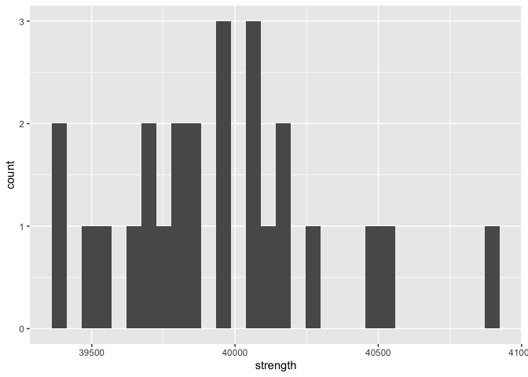

Structural Safety
================
Daniel Heitz
2023-04-02

- [Grading Rubric](#grading-rubric)
  - [Individual](#individual)
  - [Due Date](#due-date)
- [Setup](#setup)
  - [**q1** Visualize the strength data with a histogram. Answer the
    questions
    below.](#q1-visualize-the-strength-data-with-a-histogram-answer-the-questions-below)
- [Assessing Structural Safety](#assessing-structural-safety)
  - [Structural model](#structural-model)
    - [**q2** Using the observations in `df_samples` and the structural
      model `g_break()`, estimate the probability of
      failure.](#q2-using-the-observations-in-df_samples-and-the-structural-model-g_break-estimate-the-probability-of-failure)
  - [Material property model](#material-property-model)
    - [**q3** Fit a lognormal distribution to the strength data using
      the `fitdistr()`
      function.](#q3-fit-a-lognormal-distribution-to-the-strength-data-using-the-fitdistr-function)
    - [**q4** Complete the code below by 1. choosing a Monte Carlo
      sample size `n_monte_carlo`, 2. extracting the estimated
      parameters from q3, and 3. computing the limit state value
      `g = g_break()`. Answer the questions under *observations*
      below.](#q4-complete-the-code-below-by-1-choosing-a-monte-carlo-sample-size-n_monte_carlo-2-extracting-the-estimated-parameters-from-q3-and-3-computing-the-limit-state-value-g--g_break-answer-the-questions-under-observations-below)
  - [A different way to compute the
    POF](#a-different-way-to-compute-the-pof)
    - [**q5** Finish the following function by computing the POF with
      `plnorm()`. Answer the questions under *observations*
      below.](#q5-finish-the-following-function-by-computing-the-pof-with-plnorm-answer-the-questions-under-observations-below)
  - [Quantifying sampling
    uncertainty](#quantifying-sampling-uncertainty)
    - [**q6** The code below estimates a bootstrap CI on your POF
      estimate. Answer the questions under *observations*
      below.](#q6-the-code-below-estimates-a-bootstrap-ci-on-your-pof-estimate-answer-the-questions-under-observations-below)

*Purpose*: Most real problems have multiple sources of uncertainty mixed
together. Untangling these different sources can be challenging, even on
a conceptual level. In this challenge we’ll study a simple problem of
structural safety, and use this small case study to untangle sources of
sampling and Monte Carlo uncertainty.

*Note*: In this challenge I provide a lot of stub-code; you won’t have
to do too much coding. This is because I want you to *focus on answering
the conceptual questions*. The most important questions in this
challenge are: *What sources of uncertainty are you accounting for? What
sources are you not accounting for? Are those sources real or induced?*

<!-- include-rubric -->

# Grading Rubric

<!-- -------------------------------------------------- -->

Unlike exercises, **challenges will be graded**. The following rubrics
define how you will be graded, both on an individual and team basis.

## Individual

<!-- ------------------------- -->

| Category    | Needs Improvement                                                                                                | Satisfactory                                                                                                               |
|-------------|------------------------------------------------------------------------------------------------------------------|----------------------------------------------------------------------------------------------------------------------------|
| Effort      | Some task **q**’s left unattempted                                                                               | All task **q**’s attempted                                                                                                 |
| Observed    | Did not document observations, or observations incorrect                                                         | Documented correct observations based on analysis                                                                          |
| Supported   | Some observations not clearly supported by analysis                                                              | All observations clearly supported by analysis (table, graph, etc.)                                                        |
| Assessed    | Observations include claims not supported by the data, or reflect a level of certainty not warranted by the data | Observations are appropriately qualified by the quality & relevance of the data and (in)conclusiveness of the support      |
| Specified   | Uses the phrase “more data are necessary” without clarification                                                  | Any statement that “more data are necessary” specifies which *specific* data are needed to answer what *specific* question |
| Code Styled | Violations of the [style guide](https://style.tidyverse.org/) hinder readability                                 | Code sufficiently close to the [style guide](https://style.tidyverse.org/)                                                 |

## Due Date

<!-- ------------------------- -->

All the deliverables stated in the rubrics above are due **at midnight**
before the day of the class discussion of the challenge. See the
[Syllabus](https://docs.google.com/document/d/1qeP6DUS8Djq_A0HMllMqsSqX3a9dbcx1/edit?usp=sharing&ouid=110386251748498665069&rtpof=true&sd=true)
for more information.

# Setup

<!-- ----------------------------------------------------------------------- -->

``` r
library(MASS)
library(rsample)
library(broom)
library(tidyverse)
```

    ## ── Attaching packages ─────────────────────────────────────── tidyverse 1.3.2 ──
    ## ✔ ggplot2 3.4.0      ✔ purrr   1.0.1 
    ## ✔ tibble  3.1.8      ✔ dplyr   1.0.10
    ## ✔ tidyr   1.2.1      ✔ stringr 1.5.0 
    ## ✔ readr   2.1.3      ✔ forcats 0.5.2 
    ## ── Conflicts ────────────────────────────────────────── tidyverse_conflicts() ──
    ## ✖ dplyr::filter() masks stats::filter()
    ## ✖ dplyr::lag()    masks stats::lag()
    ## ✖ dplyr::select() masks MASS::select()

``` r
filename_samples <- "./data/al_samples.csv"
```

*Background*: The
[strength](https://en.wikipedia.org/wiki/Ultimate_tensile_strength) of a
material is the amount of mechanical stress it can survive before
breaking. To illustrate: Stresses are internal forces that hold an
object together when we try to squeeze, stretch, or otherwise deform a
solid object. For instance, if we pull on a rectangular bar of material,
internal stresses $\sigma$ work to keep the bar together.

<figure>

<figcaption aria-hidden="true">Stress</figcaption>
</figure>

By Jorge Stolfi - Own work, CC BY-SA 3.0,
<https://commons.wikimedia.org/w/index.php?curid=24499456>

*Strength* is a measure of how much internal stress an object can
survive: A higher strength means a stronger material. This challenge’s
data are very simple: They are (synthetic) observations of ultimate
tensile strength (UTS) on individual samples of the same aluminum alloy.
The experiments were carried out following the higest standards of
experimental rigor, so you should consider these values to be the “true”
breaking strength for each sample.

``` r
## NOTE: No need to edit; load data
df_samples <- read_csv(filename_samples)
```

    ## Rows: 25 Columns: 1
    ## ── Column specification ────────────────────────────────────────────────────────
    ## Delimiter: ","
    ## dbl (1): strength
    ## 
    ## ℹ Use `spec()` to retrieve the full column specification for this data.
    ## ℹ Specify the column types or set `show_col_types = FALSE` to quiet this message.

``` r
df_samples
```

    ## # A tibble: 25 × 1
    ##    strength
    ##       <dbl>
    ##  1   39484.
    ##  2   39812.
    ##  3   40052.
    ##  4   40519.
    ##  5   40045.
    ##  6   40160.
    ##  7   40094.
    ##  8   39674.
    ##  9   40144.
    ## 10   39865.
    ## # … with 15 more rows

Data Dictionary:

| Quantity       | Units |
|----------------|-------|
| Strength (UTS) | psi   |

### **q1** Visualize the strength data with a histogram. Answer the questions below.

``` r
df_samples %>% 
  ggplot(aes(x = strength)) +
  geom_histogram()
```

    ## `stat_bin()` using `bins = 30`. Pick better value with `binwidth`.

<!-- -->

**Observations**:

- What is the mean strength of the material, approximately?
  - Just under 40000 psi.
- To what extent can you tell what shape the distribution of the data
  has?
  - I can sort of tell, it somewhat looks like a left-leaning normal
    distribution but with this little data the resemblance is weak
- Assuming the scopus is the strength of an individual part made from
  this aluminum alloy, is the observed variability real or induced?
  - I would say that this is real because it is mentioned to assume
    these are true strength values, therefore this variability would be
    by definition real since there is an actual difference.

# Assessing Structural Safety

<!-- ----------------------------------------------------------------------- -->

*Objective*: In this challenge you are going to study a structure and
assess its *probability of failure* (POF). A higher POF corresponds to a
more unsafe structure. Ultimately, we want

$$\text{POF} < 0.03.$$

Your job is to assess a given structure using the data provided and
determine whether you can *confidently* conclude that `POF < 0.03`.

## Structural model

<!-- --------------------------------------- -->

The following code chunk sets up a structural model: We are considering
a rectangular bar under uniaxial tensile load (as pictured above). A
larger cross-sectional area `A` is capable of surviving a greater load
`L`, but a larger `A` is a heavier (more expensive) structure. The
internal stress is approximately `sigma = L / A`—we simply compare this
quantity against the strength.

I pick particular values for `A, L` and package all the information in
the *limit state function* `g_break`:

``` r
## NOTE: No need to edit; model setup
A <- 0.0255 # Cross-sectional area
L <- 1000 # Applied load (lbs)

g_break <- function(strength) {
  strength - L / A
}
```

The *probability of failure* (POF) is then defined in terms of the limit
state $g$ via:

$$\text{POF} \equiv \mathbb{P}[g \leq 0].$$

### **q2** Using the observations in `df_samples` and the structural model `g_break()`, estimate the probability of failure.

*Hint*: In `c07-monte-carlo` you learned how to estimate a probability
as the `mean()` of an indicator. Use the same strategy here.

``` r
## TODO: Estimate the probability of failure; i.e. POF = Pr[g <= 0]
df_samples %>% 
  g_break() %>% 
  mutate(breaks = strength <= 0) %>% 
  summarize(g = mean(breaks))
```

    ##   g
    ## 1 0

**Observations**:

- Does this estimate satisfy `POF < 0.03`?
  - Yes it does, it is zero.
- Is this estimate of the probability of failure trustworthy? Why or why
  not?
  - Not fully, with this few samples there could be unlikely points that
    would fail that didn’t make it into the dataset, there are only 25
    entries. Personally I would want bare minimum 100 entries so I at
    least have a true percentage, preferably more.
- Can you confidently conclude that `POF < 0.03`? Why or why not.
  - I can’t, there are so few entries that it could just be a lack of
    variance in the samples.

## Material property model

<!-- --------------------------------------- -->

Since we have so few physical samples, we will fit a distribution to
model the material property. This will give us the means to draw
“virtual samples” and use those to estimate the POF.

### **q3** Fit a lognormal distribution to the strength data using the `fitdistr()` function.

*Note*: In this challenge I generated the `strength` data from a
`lognormal` distribution; if you didn’t know that fact, then the choice
of distribution would be an *additional* source of uncertainty!

*Hint 1*: We learned how to do this in `e-stat08-fit-dist`.

*Hint 2*: The `fitdistr` function uses `densfun = "lognormal"` to
specify a lognormal distribution.

``` r
## TODO:
df_fit <-
  df_samples %>% 
  pull(strength) %>% 
  fitdistr(densfun="lognormal")
df_fit
```

    ##      meanlog         sdlog    
    ##   10.595117912    0.008750493 
    ##  ( 0.001750099) ( 0.001237507)

Once you’ve successfully fit a model for the strength, you can estimate
the probability of failure by drawing samples from the fitted
distribution.

### **q4** Complete the code below by 1. choosing a Monte Carlo sample size `n_monte_carlo`, 2. extracting the estimated parameters from q3, and 3. computing the limit state value `g = g_break()`. Answer the questions under *observations* below.

*Hint 1*: You will need to combine ideas from `c07-monte-carlo` and
`e-stat08-fit-dist` in order to complete this task.

*Hint 2*: The function `rlnorm()` will allow you to draw samples from a
lognormal distribution.

``` r
## TODO 1: Choose Monte Carlo sample size
n_monte_carlo <- 100000

## TODO 2: Extract parameter estimates from df_fit
# Extract the estimated parameters
params <- df_fit$estimate %>% 
  as.list() %>% 
  set_names(c("meanlog", "sdlog"))

# Define individual variables for meanlog and sdlog
strength_meanlog <- params$meanlog
strength_sdlog <- params$sdlog


# Generate samples
df_norm_sim <-
  tibble(strength = rlnorm(n_monte_carlo, strength_meanlog, strength_sdlog)) %>%
## TODO 3: Compute structural response
  g_break() %>% 
  mutate(g = strength <= 0)

## NOTE: The following code estimates the POF and a 95% confidence interval
df_norm_pof <-
  df_norm_sim %>%
  mutate(stat = g > 0) %>%
  summarize(
    pof_est = mean(stat),
    se = sd(stat) / sqrt(n_monte_carlo)
  ) %>%
  mutate(
    pof_lo = pof_est - 1.96 * se,
    pof_hi = pof_est + 1.96 * se
  ) %>%
  dplyr::select(pof_lo, pof_est, pof_hi)

df_norm_pof
```

    ##       pof_lo pof_est     pof_hi
    ## 1 0.01798753 0.01883 0.01967247

- Assuming your scopus is the probability of failure `POF` defined
  above, does your estimate exhibit real variability, induced
  variability, or both?
  - I would say both. Before we had real variability and by using this
    random function we have accepted a degree of induced variability. We
    try to smooth it over with lots of samples in the monte carlo method
    but we can’t erase it
- Does this confidence interval imply that `POF < 0.03`?
  - Yes, the confidence interval is completely below POF 0.03
- Compare this probability with your estimate from q2; is it more or
  less trustworthy?
  - I would say this is more trustworthy as we have fit a curve to the
    data that has tails, so if we run a lot of realizations we have some
    sense of likely edge behavior.
- Does the confidence interval above account for uncertainty arising
  from the *Monte Carlo approximation*? Why or why not?
  - It does. The confidence interval operates based on the variance in
    the data and our monte carlo approximation is calibrated based on
    the real data and by extension its own variance is related.
- Does the confidence interval above account for uncertainty arising
  from *limited physical tests* (`df_samples`)? Why or why not?
  - No, it assumes that is the true distribution but we don’t know if
    that is a probabilistic aberration that is in fact very unlikely, we
    assume it is representative of the true distribution.
- What could you do to tighten up the confidence interval?
  - More samples in the inital dataset would help reduce overall
    variance, which could possibly reduce our confidence interval. What
    would definitely make a big difference would be increasing the
    samples in the monte carlo simulation.
- Can you *confidently* conclude that `POF < 0.03`? Why or why not?
  - No, while that is likely, there is an unknown chance that the
    original data was in fact skewed and our samples don’t actually even
    represent the type of distribution we used. We know this as a fact
    since we were told in the instructions but realistically this is not
    gauranteed.

## A different way to compute the POF

<!-- --------------------------------------- -->

Monte Carlo is a *general* way to estimate probabilities, but it
introduces approximation error. It turns out that, for the simple
problem we’re studying, we can compute the probability directly using
the CDF. Note that for our structural safety problem, we have

$$\text{POF} = \mathbb{P}[g \leq 0] = \mathbb{P}[S \leq L / A] = \text{CDF}_S(L/A).$$

Since
`S = rlnorm(n, meanlog = strength_meanlog, sdlog = strength_sdlog)`, we
can use `plnorm` to compute the probability of failure without Monte
Carlo as
`POF = plnorm(L/A, meanlog = strength_meanlog, sdlog = strength_sdlog)`.
Let’s combine this idea with the fitted distribution to estimate the
POF.

### **q5** Finish the following function by computing the POF with `plnorm()`. Answer the questions under *observations* below.

``` r
## TODO: Complete the function below;
##       note that you only need to edit the TODO section

estimate_pof <- function(df) {
  ## Fit the distribution
  df_fit <-
    df %>%
    pull(strength) %>%
    fitdistr(densfun = "lognormal") %>%
    tidy()

  ## Extract the parameters
  strength_meanlog <-
    df_fit %>%
    filter(term == "meanlog") %>%
    pull(estimate)
  strength_sdlog <-
    df_fit %>%
    filter(term == "sdlog") %>%
    pull(estimate)

## TODO: Estimate the probability of failure using plnorm
  pof_estimate <- plnorm(L/A, meanlog = strength_meanlog, sdlog = strength_sdlog)

  ## NOTE: No need to edit; this last line returns your pof_estimate
  pof_estimate
}

## NOTE: No need to edit; test your function
df_samples %>% estimate_pof()
```

    ## [1] 0.01832289

**Observations**:

- How does this estimate compare with your Monte Carlo estimate above?
  - It is very similar, they are almost the same. Here it never changes
    though while the Monte Carlo estimate changes slightly run to run.
- Does this estimate have any uncertainty due to *Monte Carlo
  approximation*? Why or why not?
  - No, it is unrelated and as I have observed deterministic
- With the scopus as the `POF`, would uncertainty due to *Monte Carlo
  approximation* be induced or real?
  - Real. We are using the monte carlo method to generate data and
    taking that data almost as fact. That uncertainty is innate to the
    data.
- Does this estimate have any uncertainty due to *limited physical
  tests*? Why or why not?
  - Yes, it draws on the original dataset to make the estimate so that
    uncertainty carries through, we cannot just remove it entirely.
- With the scopus as the `POF`, would uncertainty due to *limited
  physical tests* be induced or real?
  - Real. The limited physical tests are our core data. We assume their
    values are correct based on the pretext of this challenge, and
    therefore it must be real (given that assumption/knowledge).

## Quantifying sampling uncertainty

<!-- --------------------------------------- -->

Using `plnorm()` gets rid of Monte Carlo error, but we still have
uncertainty due to limited physical testing. Often we can use a CLT
approximation to construct a confidence interval. However, with
`plnorm()` we can’t use a CLT approximation because it does not follow
the assumptions of the central limit theorem (it’s not a sum of iid
random variables). Instead, we can use the *bootstrap* to approximate a
confidence interval via resampling.

### **q6** The code below estimates a bootstrap CI on your POF estimate. Answer the questions under *observations* below.

``` r
## NOTE: No need to edit; run and inspect
tidycustom <- function(est) {tibble(term = "pof", estimate = est)}

df_samples %>%
  bootstraps(times = 1000) %>%
  mutate(
    estimates = map(
      splits,
      ~ analysis(.x) %>% estimate_pof() %>% tidycustom()
    )
  ) %>%
  int_pctl(estimates)
```

    ## # A tibble: 1 × 6
    ##   term   .lower .estimate .upper .alpha .method   
    ##   <chr>   <dbl>     <dbl>  <dbl>  <dbl> <chr>     
    ## 1 pof   0.00116    0.0183 0.0495   0.05 percentile

**Observations**:

- Does the confidence interval above account for uncertainty arising
  from *Monte Carlo approximation* of the POF? Why or why not?
  - Yes, the uncertainty is taken from the generated data which includes
    the uncertainty caused by the monte carlo approximation.
- Does the confidence interval above account for uncertainty arising
  from *limited physical tests* (`df_samples`)? Why or why not?
  - Yes, the uncertainty due to the limited physical tests is reflected
    in the samples generated which the confidence interval is
    subsequently drawn from.
- Can you confidently conclude that `POF < 0.03`? Why or why not?
  - No, the upper bound of the confidence interval is above 0.03, which
    means we cannot safely conclude that the POF \< 0.03 because our
    confidence interval straddles that value.
