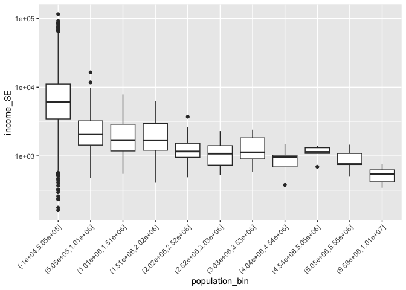

US Income
================
Daniel Heitz
2023-04-09

- [Grading Rubric](#grading-rubric)
  - [Individual](#individual)
  - [Due Date](#due-date)
- [Setup](#setup)
  - [**q1** Load the population data from c06; simply replace
    `filename_pop`
    below.](#q1-load-the-population-data-from-c06-simply-replace-filename_pop-below)
  - [**q2** Obtain median income data from the Census
    Bureau:](#q2-obtain-median-income-data-from-the-census-bureau)
  - [**q3** Tidy the `df_income` dataset by completing the code below.
    Pivot and rename the columns to arrive at the column names
    `id, geographic_area_name, category, income_estimate, income_moe`.](#q3-tidy-the-df_income-dataset-by-completing-the-code-below-pivot-and-rename-the-columns-to-arrive-at-the-column-names-id-geographic_area_name-category-income_estimate-income_moe)
  - [**q4** Convert the margin of error to standard error. Additionally,
    compute a 99% confidence interval on income, and normalize the
    standard error to `income_CV = income_SE / income_estimate`. Provide
    these columns with the names
    `income_SE, income_lo, income_hi, income_CV`.](#q4-convert-the-margin-of-error-to-standard-error-additionally-compute-a-99-confidence-interval-on-income-and-normalize-the-standard-error-to-income_cv--income_se--income_estimate-provide-these-columns-with-the-names-income_se-income_lo-income_hi-income_cv)
  - [**q5** Join `df_q4` and `df_pop`.](#q5-join-df_q4-and-df_pop)
- [Analysis](#analysis)
  - [**q6** Study the following graph, making sure to note what you can
    *and can’t* conclude based on the estimates and confidence
    intervals. Document your observations below and answer the
    questions.](#q6-study-the-following-graph-making-sure-to-note-what-you-can-and-cant-conclude-based-on-the-estimates-and-confidence-intervals-document-your-observations-below-and-answer-the-questions)
  - [**q7** Plot the standard error against population for all counties.
    Create a visual that effectively highlights the trends in the data.
    Answer the questions under *observations*
    below.](#q7-plot-the-standard-error-against-population-for-all-counties-create-a-visual-that-effectively-highlights-the-trends-in-the-data-answer-the-questions-under-observations-below)
- [Going Further](#going-further)
  - [**q8** Pose your own question about the data. Create a
    visualization (or table) here, and document your
    observations.](#q8-pose-your-own-question-about-the-data-create-a-visualization-or-table-here-and-document-your-observations)
- [References](#references)

*Purpose*: We’ve been learning how to quantify uncertainty in estimates
through the exercises; now its time to put those skills to use studying
real data. In this challenge we’ll use concepts like confidence
intervals to help us make sense of census data.

*Reading*: - [Using ACS Estimates and Margin of
Error](https://www.census.gov/programs-surveys/acs/guidance/training-presentations/acs-moe.html)
(Optional) - [Patterns and Causes of Uncertainty in the American
Community
Survey](https://www.sciencedirect.com/science/article/pii/S0143622813002518?casa_token=VddzQ1-spHMAAAAA:FTq92LXgiPVloJUVjnHs8Ma1HwvPigisAYtzfqaGbbRRwoknNq56Y2IzszmGgIGH4JAPzQN0)
(Optional, particularly the *Uncertainty in surveys* section under the
Introduction.)

<!-- include-rubric -->

# Grading Rubric

<!-- -------------------------------------------------- -->

Unlike exercises, **challenges will be graded**. The following rubrics
define how you will be graded, both on an individual and team basis.

## Individual

<!-- ------------------------- -->

| Category    | Needs Improvement                                                                                                | Satisfactory                                                                                                               |
|-------------|------------------------------------------------------------------------------------------------------------------|----------------------------------------------------------------------------------------------------------------------------|
| Effort      | Some task **q**’s left unattempted                                                                               | All task **q**’s attempted                                                                                                 |
| Observed    | Did not document observations, or observations incorrect                                                         | Documented correct observations based on analysis                                                                          |
| Supported   | Some observations not clearly supported by analysis                                                              | All observations clearly supported by analysis (table, graph, etc.)                                                        |
| Assessed    | Observations include claims not supported by the data, or reflect a level of certainty not warranted by the data | Observations are appropriately qualified by the quality & relevance of the data and (in)conclusiveness of the support      |
| Specified   | Uses the phrase “more data are necessary” without clarification                                                  | Any statement that “more data are necessary” specifies which *specific* data are needed to answer what *specific* question |
| Code Styled | Violations of the [style guide](https://style.tidyverse.org/) hinder readability                                 | Code sufficiently close to the [style guide](https://style.tidyverse.org/)                                                 |

## Due Date

<!-- ------------------------- -->

All the deliverables stated in the rubrics above are due **at midnight**
before the day of the class discussion of the challenge. See the
[Syllabus](https://docs.google.com/document/d/1qeP6DUS8Djq_A0HMllMqsSqX3a9dbcx1/edit?usp=sharing&ouid=110386251748498665069&rtpof=true&sd=true)
for more information.

# Setup

<!-- ----------------------------------------------------------------------- -->

``` r
library(tidyverse)
```

    ## ── Attaching packages ─────────────────────────────────────── tidyverse 1.3.2 ──
    ## ✔ ggplot2 3.4.0      ✔ purrr   1.0.1 
    ## ✔ tibble  3.1.8      ✔ dplyr   1.0.10
    ## ✔ tidyr   1.2.1      ✔ stringr 1.5.0 
    ## ✔ readr   2.1.3      ✔ forcats 0.5.2 
    ## ── Conflicts ────────────────────────────────────────── tidyverse_conflicts() ──
    ## ✖ dplyr::filter() masks stats::filter()
    ## ✖ dplyr::lag()    masks stats::lag()

### **q1** Load the population data from c06; simply replace `filename_pop` below.

``` r
## TODO: Give the filename for your copy of Table B01003
filename_pop <- "ACSDT5Y2018.B01003-Data.csv"

## NOTE: No need to edit
df_pop <-
  read_csv(
    filename_pop,
    skip = 2,
    col_names = c(
      "id",
      "geographic_area_name",
      "population_estimate",
      "population_moe"
    )
  )
```

    ## Rows: 3219 Columns: 7
    ## ── Column specification ────────────────────────────────────────────────────────
    ## Delimiter: ","
    ## chr (5): id, geographic_area_name, population_moe, X5, X6
    ## dbl (1): population_estimate
    ## lgl (1): X7
    ## 
    ## ℹ Use `spec()` to retrieve the full column specification for this data.
    ## ℹ Specify the column types or set `show_col_types = FALSE` to quiet this message.

``` r
df_pop
```

    ## # A tibble: 3,219 × 7
    ##    id             geographic_area_name     populatio…¹ popul…² X5    X6    X7   
    ##    <chr>          <chr>                          <dbl> <chr>   <chr> <chr> <lgl>
    ##  1 0500000US01003 Baldwin County, Alabama       208107 null    ***** ***** NA   
    ##  2 0500000US01005 Barbour County, Alabama        25782 null    ***** ***** NA   
    ##  3 0500000US01007 Bibb County, Alabama           22527 null    ***** ***** NA   
    ##  4 0500000US01009 Blount County, Alabama         57645 null    ***** ***** NA   
    ##  5 0500000US01011 Bullock County, Alabama        10352 null    ***** ***** NA   
    ##  6 0500000US01013 Butler County, Alabama         20025 null    ***** ***** NA   
    ##  7 0500000US01015 Calhoun County, Alabama       115098 null    ***** ***** NA   
    ##  8 0500000US01017 Chambers County, Alabama       33826 null    ***** ***** NA   
    ##  9 0500000US01019 Cherokee County, Alabama       25853 null    ***** ***** NA   
    ## 10 0500000US01021 Chilton County, Alabama        43930 null    ***** ***** NA   
    ## # … with 3,209 more rows, and abbreviated variable names ¹​population_estimate,
    ## #   ²​population_moe

You might wonder why the `Margin of Error` in the population estimates
is listed as `*****`. From the [documentation (PDF
link)](https://www.google.com/url?sa=t&rct=j&q=&esrc=s&source=web&cd=&cad=rja&uact=8&ved=2ahUKEwj81Omy16TrAhXsguAKHTzKDQEQFjABegQIBxAB&url=https%3A%2F%2Fwww2.census.gov%2Fprograms-surveys%2Facs%2Ftech_docs%2Faccuracy%2FMultiyearACSAccuracyofData2018.pdf%3F&usg=AOvVaw2TOrVuBDlkDI2gde6ugce_)
for the ACS:

> If the margin of error is displayed as ‘\*\*\*\*\*’ (five asterisks),
> the estimate has been controlled to be equal to a fixed value and so
> it has no sampling error. A standard error of zero should be used for
> these controlled estimates when completing calculations, such as those
> in the following section.

This means that for cases listed as `*****` the US Census Bureau
recommends treating the margin of error (and thus standard error) as
zero.

### **q2** Obtain median income data from the Census Bureau:

- `Filter > Topics > Income and Poverty > Income and Poverty`
- `Filter > Geography > County > All counties in United States`
- Look for `Median Income in the Past 12 Months` (Table S1903)
- Download the 2018 5-year ACS estimates; save to your `data` folder and
  add the filename below.

``` r
## TODO: Give the filename for your copy of Table S1903
filename_income <- "ACSST5Y2018.S1903-Data.csv"

## NOTE: No need to edit
df_income <-
  read_csv(filename_income, skip = 1) %>% 
  rename(id = Geography) %>% 
  select(-matches("Annotation of"))
```

    ## New names:
    ## • `` -> `...483`

    ## Warning: One or more parsing issues, call `problems()` on your data frame for details,
    ## e.g.:
    ##   dat <- vroom(...)
    ##   problems(dat)

    ## Rows: 3220 Columns: 483
    ## ── Column specification ────────────────────────────────────────────────────────
    ## Delimiter: ","
    ## chr (306): Geography, Geographic Area Name, Annotation of Margin of Error!!N...
    ## dbl (176): Estimate!!Number!!HOUSEHOLD INCOME BY RACE AND HISPANIC OR LATINO...
    ## lgl   (1): ...483
    ## 
    ## ℹ Use `spec()` to retrieve the full column specification for this data.
    ## ℹ Specify the column types or set `show_col_types = FALSE` to quiet this message.

``` r
df_income
```

    ## # A tibble: 3,220 × 243
    ##    id    Geogr…¹ Estim…² Margi…³ Estim…⁴ Margi…⁵ Estim…⁶ Margi…⁷ Estim…⁸ Margi…⁹
    ##    <chr> <chr>     <dbl>   <dbl>   <dbl>   <dbl>   <dbl>   <dbl>   <dbl>   <dbl>
    ##  1 0500… Autaug…   21115     383   16585     363    4085     205      34      33
    ##  2 0500… Baldwi…   78622    1183   69544    1042    6425     500     460     171
    ##  3 0500… Barbou…    9186     280    4729     211    4135     248       9      16
    ##  4 0500… Bibb C…    6840     321    5588     346    1172     200       0      22
    ##  5 0500… Blount…   20600     396   20054     417     190      98      24      27
    ##  6 0500… Bulloc…    3609     196     881     119    2681     212      44      52
    ##  7 0500… Butler…    6708     274    3821     173    2752     207       2       4
    ##  8 0500… Calhou…   45033     683   33820     559    9514     435     152      64
    ##  9 0500… Chambe…   13516     372    7953     296    5268     235      54      42
    ## 10 0500… Cherok…   10606     370    9953     356     477      90      33      32
    ## # … with 3,210 more rows, 233 more variables:
    ## #   `Estimate!!Number!!HOUSEHOLD INCOME BY RACE AND HISPANIC OR LATINO ORIGIN OF HOUSEHOLDER!!Households!!One race--!!Asian` <dbl>,
    ## #   `Margin of Error!!Number MOE!!HOUSEHOLD INCOME BY RACE AND HISPANIC OR LATINO ORIGIN OF HOUSEHOLDER!!Households!!One race--!!Asian` <dbl>,
    ## #   `Estimate!!Number!!HOUSEHOLD INCOME BY RACE AND HISPANIC OR LATINO ORIGIN OF HOUSEHOLDER!!Households!!One race--!!Native Hawaiian and Other Pacific Islander` <dbl>,
    ## #   `Margin of Error!!Number MOE!!HOUSEHOLD INCOME BY RACE AND HISPANIC OR LATINO ORIGIN OF HOUSEHOLDER!!Households!!One race--!!Native Hawaiian and Other Pacific Islander` <dbl>,
    ## #   `Estimate!!Number!!HOUSEHOLD INCOME BY RACE AND HISPANIC OR LATINO ORIGIN OF HOUSEHOLDER!!Households!!One race--!!Some other race` <dbl>,
    ## #   `Margin of Error!!Number MOE!!HOUSEHOLD INCOME BY RACE AND HISPANIC OR LATINO ORIGIN OF HOUSEHOLDER!!Households!!One race--!!Some other race` <dbl>, …

Use the following test to check that you downloaded the correct file:

``` r
## NOTE: No need to edit, use to check you got the right file.
assertthat::assert_that(
  df_income %>%
    filter(id == "0500000US01001") %>%
    pull(`Estimate!!Percent Distribution!!FAMILY INCOME BY FAMILY SIZE!!2-person families`)
  == 45.6
)
```

    ## [1] TRUE

``` r
print("Well done!")
```

    ## [1] "Well done!"

This dataset is in desperate need of some *tidying*. To simplify the
task, we’ll start by considering the `\\d-person families` columns
first.

### **q3** Tidy the `df_income` dataset by completing the code below. Pivot and rename the columns to arrive at the column names `id, geographic_area_name, category, income_estimate, income_moe`.

*Hint*: You can do this in a single pivot using the `".value"` argument
and a `names_pattern` using capture groups `"()"`. Remember that you can
use an OR operator `|` in a regex to allow for multiple possibilities in
a capture group, for example `"(Estimate|Margin of Error)"`.

``` r
df_q3 <- 
  df_income %>% 
  select(
    id,
    contains("Geographic"),
    contains("median") & matches("\\d-person families")
  ) %>% 
  mutate(across(contains("median"), as.numeric)) %>% 
  pivot_longer(names_pattern = "(Estimate|Margin of Error).*(\\d-person families).*",
               names_to = c(".value", "category"),
               cols = matches("(Estimate|Margin of Error)")) %>% 
  rename("income_estimate" = "Estimate",
         "income_moe" = "Margin of Error",
         "geographic_area_name" = "Geographic Area Name")
```

    ## Warning in mask$eval_all_mutate(quo): NAs introduced by coercion

    ## Warning in mask$eval_all_mutate(quo): NAs introduced by coercion

    ## Warning in mask$eval_all_mutate(quo): NAs introduced by coercion

    ## Warning in mask$eval_all_mutate(quo): NAs introduced by coercion

    ## Warning in mask$eval_all_mutate(quo): NAs introduced by coercion

    ## Warning in mask$eval_all_mutate(quo): NAs introduced by coercion

    ## Warning in mask$eval_all_mutate(quo): NAs introduced by coercion

    ## Warning in mask$eval_all_mutate(quo): NAs introduced by coercion

``` r
df_q3
```

    ## # A tibble: 16,100 × 5
    ##    id             geographic_area_name    category          income_est…¹ incom…²
    ##    <chr>          <chr>                   <chr>                    <dbl>   <dbl>
    ##  1 0500000US01001 Autauga County, Alabama 2-person families        64947    6663
    ##  2 0500000US01001 Autauga County, Alabama 3-person families        80172   14181
    ##  3 0500000US01001 Autauga County, Alabama 4-person families        85455   10692
    ##  4 0500000US01001 Autauga County, Alabama 5-person families        88601   20739
    ##  5 0500000US01001 Autauga County, Alabama 6-person families       103787   12387
    ##  6 0500000US01003 Baldwin County, Alabama 2-person families        63975    2297
    ##  7 0500000US01003 Baldwin County, Alabama 3-person families        79390    8851
    ##  8 0500000US01003 Baldwin County, Alabama 4-person families        88458    5199
    ##  9 0500000US01003 Baldwin County, Alabama 5-person families        91259    7011
    ## 10 0500000US01003 Baldwin County, Alabama 6-person families        69609   23175
    ## # … with 16,090 more rows, and abbreviated variable names ¹​income_estimate,
    ## #   ²​income_moe

Use the following tests to check your work:

``` r
## NOTE: No need to edit
assertthat::assert_that(setequal(
  names(df_q3),
  c("id", "geographic_area_name", "category", "income_estimate", "income_moe")
))
```

    ## [1] TRUE

``` r
assertthat::assert_that(
  df_q3 %>%
    filter(id == "0500000US01001", category == "2-person families") %>%
    pull(income_moe)
  == 6663
)
```

    ## [1] TRUE

``` r
print("Nice!")
```

    ## [1] "Nice!"

The data gives finite values for the Margin of Error, which is closely
related to the Standard Error. The Census Bureau documentation gives the
following relationship between Margin of Error and Standard Error:

$$\text{MOE} = 1.645 \times \text{SE}.$$

### **q4** Convert the margin of error to standard error. Additionally, compute a 99% confidence interval on income, and normalize the standard error to `income_CV = income_SE / income_estimate`. Provide these columns with the names `income_SE, income_lo, income_hi, income_CV`.

``` r
confidence <- 0.99
q99 <- qnorm(1 - (1 - confidence) / 2)

df_q4 <- 
  df_q3 %>% 
  mutate(income_SE = income_moe / 1.645,
         income_lo = income_estimate - q99 * income_SE,
         income_hi = income_estimate + q99 * income_SE,
         income_CV = income_SE / income_estimate)
```

Use the following tests to check your work:

``` r
## NOTE: No need to edit
assertthat::assert_that(setequal(
  names(df_q4),
  c("id", "geographic_area_name", "category", "income_estimate", "income_moe",
    "income_SE", "income_lo", "income_hi", "income_CV")
))
```

    ## [1] TRUE

``` r
assertthat::assert_that(
  abs(
    df_q4 %>%
    filter(id == "0500000US01001", category == "2-person families") %>%
    pull(income_SE) - 4050.456
  ) / 4050.456 < 1e-3
)
```

    ## [1] TRUE

``` r
assertthat::assert_that(
  abs(
    df_q4 %>%
    filter(id == "0500000US01001", category == "2-person families") %>%
    pull(income_lo) - 54513.72
  ) / 54513.72 < 1e-3
)
```

    ## [1] TRUE

``` r
assertthat::assert_that(
  abs(
    df_q4 %>%
    filter(id == "0500000US01001", category == "2-person families") %>%
    pull(income_hi) - 75380.28
  ) / 75380.28 < 1e-3
)
```

    ## [1] TRUE

``` r
assertthat::assert_that(
  abs(
    df_q4 %>%
    filter(id == "0500000US01001", category == "2-person families") %>%
    pull(income_CV) - 0.06236556
  ) / 0.06236556 < 1e-3
)
```

    ## [1] TRUE

``` r
print("Nice!")
```

    ## [1] "Nice!"

One last wrangling step: We need to join the two datasets so we can
compare population with income.

### **q5** Join `df_q4` and `df_pop`.

``` r
## TODO: Join df_q4 and df_pop by the appropriate column

df_data <-
  merge(df_q4, df_pop, by = c("geographic_area_name", "id"), all.x = TRUE)
df_data
```

    ##                            geographic_area_name             id
    ## 1              Abbeville County, South Carolina 0500000US45001
    ## 2              Abbeville County, South Carolina 0500000US45001
    ## 3              Abbeville County, South Carolina 0500000US45001
    ## 4              Abbeville County, South Carolina 0500000US45001
    ## 5              Abbeville County, South Carolina 0500000US45001
    ## 6                      Acadia Parish, Louisiana 0500000US22001
    ## 7                      Acadia Parish, Louisiana 0500000US22001
    ## 8                      Acadia Parish, Louisiana 0500000US22001
    ## 9                      Acadia Parish, Louisiana 0500000US22001
    ## 10                     Acadia Parish, Louisiana 0500000US22001
    ## 11                    Accomack County, Virginia 0500000US51001
    ## 12                    Accomack County, Virginia 0500000US51001
    ## 13                    Accomack County, Virginia 0500000US51001
    ## 14                    Accomack County, Virginia 0500000US51001
    ## 15                    Accomack County, Virginia 0500000US51001
    ## 16                            Ada County, Idaho 0500000US16001
    ## 17                            Ada County, Idaho 0500000US16001
    ## 18                            Ada County, Idaho 0500000US16001
    ## 19                            Ada County, Idaho 0500000US16001
    ## 20                            Ada County, Idaho 0500000US16001
    ## 21                           Adair County, Iowa 0500000US19001
    ## 22                           Adair County, Iowa 0500000US19001
    ## 23                           Adair County, Iowa 0500000US19001
    ## 24                           Adair County, Iowa 0500000US19001
    ## 25                           Adair County, Iowa 0500000US19001
    ## 26                       Adair County, Kentucky 0500000US21001
    ## 27                       Adair County, Kentucky 0500000US21001
    ## 28                       Adair County, Kentucky 0500000US21001
    ## 29                       Adair County, Kentucky 0500000US21001
    ## 30                       Adair County, Kentucky 0500000US21001
    ## 31                       Adair County, Missouri 0500000US29001
    ## 32                       Adair County, Missouri 0500000US29001
    ## 33                       Adair County, Missouri 0500000US29001
    ## 34                       Adair County, Missouri 0500000US29001
    ## 35                       Adair County, Missouri 0500000US29001
    ## 36                       Adair County, Oklahoma 0500000US40001
    ## 37                       Adair County, Oklahoma 0500000US40001
    ## 38                       Adair County, Oklahoma 0500000US40001
    ## 39                       Adair County, Oklahoma 0500000US40001
    ## 40                       Adair County, Oklahoma 0500000US40001
    ## 41                       Adams County, Colorado 0500000US08001
    ## 42                       Adams County, Colorado 0500000US08001
    ## 43                       Adams County, Colorado 0500000US08001
    ## 44                       Adams County, Colorado 0500000US08001
    ## 45                       Adams County, Colorado 0500000US08001
    ## 46                          Adams County, Idaho 0500000US16003
    ## 47                          Adams County, Idaho 0500000US16003
    ## 48                          Adams County, Idaho 0500000US16003
    ## 49                          Adams County, Idaho 0500000US16003
    ## 50                          Adams County, Idaho 0500000US16003
    ## 51                       Adams County, Illinois 0500000US17001
    ## 52                       Adams County, Illinois 0500000US17001
    ## 53                       Adams County, Illinois 0500000US17001
    ## 54                       Adams County, Illinois 0500000US17001
    ## 55                       Adams County, Illinois 0500000US17001
    ## 56                        Adams County, Indiana 0500000US18001
    ## 57                        Adams County, Indiana 0500000US18001
    ## 58                        Adams County, Indiana 0500000US18001
    ## 59                        Adams County, Indiana 0500000US18001
    ## 60                        Adams County, Indiana 0500000US18001
    ## 61                           Adams County, Iowa 0500000US19003
    ## 62                           Adams County, Iowa 0500000US19003
    ## 63                           Adams County, Iowa 0500000US19003
    ## 64                           Adams County, Iowa 0500000US19003
    ## 65                           Adams County, Iowa 0500000US19003
    ## 66                    Adams County, Mississippi 0500000US28001
    ## 67                    Adams County, Mississippi 0500000US28001
    ## 68                    Adams County, Mississippi 0500000US28001
    ## 69                    Adams County, Mississippi 0500000US28001
    ## 70                    Adams County, Mississippi 0500000US28001
    ## 71                       Adams County, Nebraska 0500000US31001
    ## 72                       Adams County, Nebraska 0500000US31001
    ## 73                       Adams County, Nebraska 0500000US31001
    ## 74                       Adams County, Nebraska 0500000US31001
    ## 75                       Adams County, Nebraska 0500000US31001
    ## 76                   Adams County, North Dakota 0500000US38001
    ## 77                   Adams County, North Dakota 0500000US38001
    ## 78                   Adams County, North Dakota 0500000US38001
    ## 79                   Adams County, North Dakota 0500000US38001
    ## 80                   Adams County, North Dakota 0500000US38001
    ## 81                           Adams County, Ohio 0500000US39001
    ## 82                           Adams County, Ohio 0500000US39001
    ## 83                           Adams County, Ohio 0500000US39001
    ## 84                           Adams County, Ohio 0500000US39001
    ## 85                           Adams County, Ohio 0500000US39001
    ## 86                   Adams County, Pennsylvania 0500000US42001
    ## 87                   Adams County, Pennsylvania 0500000US42001
    ## 88                   Adams County, Pennsylvania 0500000US42001
    ## 89                   Adams County, Pennsylvania 0500000US42001
    ## 90                   Adams County, Pennsylvania 0500000US42001
    ## 91                     Adams County, Washington 0500000US53001
    ## 92                     Adams County, Washington 0500000US53001
    ## 93                     Adams County, Washington 0500000US53001
    ## 94                     Adams County, Washington 0500000US53001
    ## 95                     Adams County, Washington 0500000US53001
    ## 96                      Adams County, Wisconsin 0500000US55001
    ## 97                      Adams County, Wisconsin 0500000US55001
    ## 98                      Adams County, Wisconsin 0500000US55001
    ## 99                      Adams County, Wisconsin 0500000US55001
    ## 100                     Adams County, Wisconsin 0500000US55001
    ## 101                     Addison County, Vermont 0500000US50001
    ## 102                     Addison County, Vermont 0500000US50001
    ## 103                     Addison County, Vermont 0500000US50001
    ## 104                     Addison County, Vermont 0500000US50001
    ## 105                     Addison County, Vermont 0500000US50001
    ## 106             Adjuntas Municipio, Puerto Rico 0500000US72001
    ## 107             Adjuntas Municipio, Puerto Rico 0500000US72001
    ## 108             Adjuntas Municipio, Puerto Rico 0500000US72001
    ## 109             Adjuntas Municipio, Puerto Rico 0500000US72001
    ## 110             Adjuntas Municipio, Puerto Rico 0500000US72001
    ## 111               Aguada Municipio, Puerto Rico 0500000US72003
    ## 112               Aguada Municipio, Puerto Rico 0500000US72003
    ## 113               Aguada Municipio, Puerto Rico 0500000US72003
    ## 114               Aguada Municipio, Puerto Rico 0500000US72003
    ## 115               Aguada Municipio, Puerto Rico 0500000US72003
    ## 116            Aguadilla Municipio, Puerto Rico 0500000US72005
    ## 117            Aguadilla Municipio, Puerto Rico 0500000US72005
    ## 118            Aguadilla Municipio, Puerto Rico 0500000US72005
    ## 119            Aguadilla Municipio, Puerto Rico 0500000US72005
    ## 120            Aguadilla Municipio, Puerto Rico 0500000US72005
    ## 121         Aguas Buenas Municipio, Puerto Rico 0500000US72007
    ## 122         Aguas Buenas Municipio, Puerto Rico 0500000US72007
    ## 123         Aguas Buenas Municipio, Puerto Rico 0500000US72007
    ## 124         Aguas Buenas Municipio, Puerto Rico 0500000US72007
    ## 125         Aguas Buenas Municipio, Puerto Rico 0500000US72007
    ## 126             Aibonito Municipio, Puerto Rico 0500000US72009
    ## 127             Aibonito Municipio, Puerto Rico 0500000US72009
    ## 128             Aibonito Municipio, Puerto Rico 0500000US72009
    ## 129             Aibonito Municipio, Puerto Rico 0500000US72009
    ## 130             Aibonito Municipio, Puerto Rico 0500000US72009
    ## 131                Aiken County, South Carolina 0500000US45003
    ## 132                Aiken County, South Carolina 0500000US45003
    ## 133                Aiken County, South Carolina 0500000US45003
    ## 134                Aiken County, South Carolina 0500000US45003
    ## 135                Aiken County, South Carolina 0500000US45003
    ## 136                    Aitkin County, Minnesota 0500000US27001
    ## 137                    Aitkin County, Minnesota 0500000US27001
    ## 138                    Aitkin County, Minnesota 0500000US27001
    ## 139                    Aitkin County, Minnesota 0500000US27001
    ## 140                    Aitkin County, Minnesota 0500000US27001
    ## 141                     Alachua County, Florida 0500000US12001
    ## 142                     Alachua County, Florida 0500000US12001
    ## 143                     Alachua County, Florida 0500000US12001
    ## 144                     Alachua County, Florida 0500000US12001
    ## 145                     Alachua County, Florida 0500000US12001
    ## 146             Alamance County, North Carolina 0500000US37001
    ## 147             Alamance County, North Carolina 0500000US37001
    ## 148             Alamance County, North Carolina 0500000US37001
    ## 149             Alamance County, North Carolina 0500000US37001
    ## 150             Alamance County, North Carolina 0500000US37001
    ## 151                  Alameda County, California 0500000US06001
    ## 152                  Alameda County, California 0500000US06001
    ## 153                  Alameda County, California 0500000US06001
    ## 154                  Alameda County, California 0500000US06001
    ## 155                  Alameda County, California 0500000US06001
    ## 156                    Alamosa County, Colorado 0500000US08003
    ## 157                    Alamosa County, Colorado 0500000US08003
    ## 158                    Alamosa County, Colorado 0500000US08003
    ## 159                    Alamosa County, Colorado 0500000US08003
    ## 160                    Alamosa County, Colorado 0500000US08003
    ## 161                     Albany County, New York 0500000US36001
    ## 162                     Albany County, New York 0500000US36001
    ## 163                     Albany County, New York 0500000US36001
    ## 164                     Albany County, New York 0500000US36001
    ## 165                     Albany County, New York 0500000US36001
    ## 166                      Albany County, Wyoming 0500000US56001
    ## 167                      Albany County, Wyoming 0500000US56001
    ## 168                      Albany County, Wyoming 0500000US56001
    ## 169                      Albany County, Wyoming 0500000US56001
    ## 170                      Albany County, Wyoming 0500000US56001
    ## 171                  Albemarle County, Virginia 0500000US51003
    ## 172                  Albemarle County, Virginia 0500000US51003
    ## 173                  Albemarle County, Virginia 0500000US51003
    ## 174                  Albemarle County, Virginia 0500000US51003
    ## 175                  Albemarle County, Virginia 0500000US51003
    ## 176                     Alcona County, Michigan 0500000US26001
    ## 177                     Alcona County, Michigan 0500000US26001
    ## 178                     Alcona County, Michigan 0500000US26001
    ## 179                     Alcona County, Michigan 0500000US26001
    ## 180                     Alcona County, Michigan 0500000US26001
    ## 181                  Alcorn County, Mississippi 0500000US28003
    ## 182                  Alcorn County, Mississippi 0500000US28003
    ## 183                  Alcorn County, Mississippi 0500000US28003
    ## 184                  Alcorn County, Mississippi 0500000US28003
    ## 185                  Alcorn County, Mississippi 0500000US28003
    ## 186              Aleutians East Borough, Alaska 0500000US02013
    ## 187              Aleutians East Borough, Alaska 0500000US02013
    ## 188              Aleutians East Borough, Alaska 0500000US02013
    ## 189              Aleutians East Borough, Alaska 0500000US02013
    ## 190              Aleutians East Borough, Alaska 0500000US02013
    ## 191          Aleutians West Census Area, Alaska 0500000US02016
    ## 192          Aleutians West Census Area, Alaska 0500000US02016
    ## 193          Aleutians West Census Area, Alaska 0500000US02016
    ## 194          Aleutians West Census Area, Alaska 0500000US02016
    ## 195          Aleutians West Census Area, Alaska 0500000US02016
    ## 196                  Alexander County, Illinois 0500000US17003
    ## 197                  Alexander County, Illinois 0500000US17003
    ## 198                  Alexander County, Illinois 0500000US17003
    ## 199                  Alexander County, Illinois 0500000US17003
    ## 200                  Alexander County, Illinois 0500000US17003
    ## 201            Alexander County, North Carolina 0500000US37003
    ## 202            Alexander County, North Carolina 0500000US37003
    ## 203            Alexander County, North Carolina 0500000US37003
    ## 204            Alexander County, North Carolina 0500000US37003
    ## 205            Alexander County, North Carolina 0500000US37003
    ## 206                   Alexandria city, Virginia 0500000US51510
    ## 207                   Alexandria city, Virginia 0500000US51510
    ## 208                   Alexandria city, Virginia 0500000US51510
    ## 209                   Alexandria city, Virginia 0500000US51510
    ## 210                   Alexandria city, Virginia 0500000US51510
    ## 211                    Alfalfa County, Oklahoma 0500000US40003
    ## 212                    Alfalfa County, Oklahoma 0500000US40003
    ## 213                    Alfalfa County, Oklahoma 0500000US40003
    ## 214                    Alfalfa County, Oklahoma 0500000US40003
    ## 215                    Alfalfa County, Oklahoma 0500000US40003
    ## 216                      Alger County, Michigan 0500000US26003
    ## 217                      Alger County, Michigan 0500000US26003
    ## 218                      Alger County, Michigan 0500000US26003
    ## 219                      Alger County, Michigan 0500000US26003
    ## 220                      Alger County, Michigan 0500000US26003
    ## 221                      Allamakee County, Iowa 0500000US19005
    ## 222                      Allamakee County, Iowa 0500000US19005
    ## 223                      Allamakee County, Iowa 0500000US19005
    ## 224                      Allamakee County, Iowa 0500000US19005
    ## 225                      Allamakee County, Iowa 0500000US19005
    ## 226                    Allegan County, Michigan 0500000US26005
    ## 227                    Allegan County, Michigan 0500000US26005
    ## 228                    Allegan County, Michigan 0500000US26005
    ## 229                    Allegan County, Michigan 0500000US26005
    ## 230                    Allegan County, Michigan 0500000US26005
    ## 231                   Allegany County, Maryland 0500000US24001
    ## 232                   Allegany County, Maryland 0500000US24001
    ## 233                   Allegany County, Maryland 0500000US24001
    ## 234                   Allegany County, Maryland 0500000US24001
    ## 235                   Allegany County, Maryland 0500000US24001
    ## 236                   Allegany County, New York 0500000US36003
    ## 237                   Allegany County, New York 0500000US36003
    ## 238                   Allegany County, New York 0500000US36003
    ## 239                   Allegany County, New York 0500000US36003
    ## 240                   Allegany County, New York 0500000US36003
    ## 241            Alleghany County, North Carolina 0500000US37005
    ## 242            Alleghany County, North Carolina 0500000US37005
    ## 243            Alleghany County, North Carolina 0500000US37005
    ## 244            Alleghany County, North Carolina 0500000US37005
    ## 245            Alleghany County, North Carolina 0500000US37005
    ## 246                  Alleghany County, Virginia 0500000US51005
    ## 247                  Alleghany County, Virginia 0500000US51005
    ## 248                  Alleghany County, Virginia 0500000US51005
    ## 249                  Alleghany County, Virginia 0500000US51005
    ## 250                  Alleghany County, Virginia 0500000US51005
    ## 251              Allegheny County, Pennsylvania 0500000US42003
    ## 252              Allegheny County, Pennsylvania 0500000US42003
    ## 253              Allegheny County, Pennsylvania 0500000US42003
    ## 254              Allegheny County, Pennsylvania 0500000US42003
    ## 255              Allegheny County, Pennsylvania 0500000US42003
    ## 256                       Allen County, Indiana 0500000US18003
    ## 257                       Allen County, Indiana 0500000US18003
    ## 258                       Allen County, Indiana 0500000US18003
    ## 259                       Allen County, Indiana 0500000US18003
    ## 260                       Allen County, Indiana 0500000US18003
    ## 261                        Allen County, Kansas 0500000US20001
    ## 262                        Allen County, Kansas 0500000US20001
    ## 263                        Allen County, Kansas 0500000US20001
    ## 264                        Allen County, Kansas 0500000US20001
    ## 265                        Allen County, Kansas 0500000US20001
    ## 266                      Allen County, Kentucky 0500000US21003
    ## 267                      Allen County, Kentucky 0500000US21003
    ## 268                      Allen County, Kentucky 0500000US21003
    ## 269                      Allen County, Kentucky 0500000US21003
    ## 270                      Allen County, Kentucky 0500000US21003
    ## 271                          Allen County, Ohio 0500000US39003
    ## 272                          Allen County, Ohio 0500000US39003
    ## 273                          Allen County, Ohio 0500000US39003
    ## 274                          Allen County, Ohio 0500000US39003
    ## 275                          Allen County, Ohio 0500000US39003
    ## 276                     Allen Parish, Louisiana 0500000US22003
    ## 277                     Allen Parish, Louisiana 0500000US22003
    ## 278                     Allen Parish, Louisiana 0500000US22003
    ## 279                     Allen Parish, Louisiana 0500000US22003
    ## 280                     Allen Parish, Louisiana 0500000US22003
    ## 281            Allendale County, South Carolina 0500000US45005
    ## 282            Allendale County, South Carolina 0500000US45005
    ## 283            Allendale County, South Carolina 0500000US45005
    ## 284            Allendale County, South Carolina 0500000US45005
    ## 285            Allendale County, South Carolina 0500000US45005
    ## 286                     Alpena County, Michigan 0500000US26007
    ## 287                     Alpena County, Michigan 0500000US26007
    ## 288                     Alpena County, Michigan 0500000US26007
    ## 289                     Alpena County, Michigan 0500000US26007
    ## 290                     Alpena County, Michigan 0500000US26007
    ## 291                   Alpine County, California 0500000US06003
    ## 292                   Alpine County, California 0500000US06003
    ## 293                   Alpine County, California 0500000US06003
    ## 294                   Alpine County, California 0500000US06003
    ## 295                   Alpine County, California 0500000US06003
    ## 296                   Amador County, California 0500000US06005
    ## 297                   Amador County, California 0500000US06005
    ## 298                   Amador County, California 0500000US06005
    ## 299                   Amador County, California 0500000US06005
    ## 300                   Amador County, California 0500000US06005
    ## 301                     Amelia County, Virginia 0500000US51007
    ## 302                     Amelia County, Virginia 0500000US51007
    ## 303                     Amelia County, Virginia 0500000US51007
    ## 304                     Amelia County, Virginia 0500000US51007
    ## 305                     Amelia County, Virginia 0500000US51007
    ## 306                    Amherst County, Virginia 0500000US51009
    ## 307                    Amherst County, Virginia 0500000US51009
    ## 308                    Amherst County, Virginia 0500000US51009
    ## 309                    Amherst County, Virginia 0500000US51009
    ## 310                    Amherst County, Virginia 0500000US51009
    ## 311                   Amite County, Mississippi 0500000US28005
    ## 312                   Amite County, Mississippi 0500000US28005
    ## 313                   Amite County, Mississippi 0500000US28005
    ## 314                   Amite County, Mississippi 0500000US28005
    ## 315                   Amite County, Mississippi 0500000US28005
    ## 316               Añasco Municipio, Puerto Rico 0500000US72011
    ## 317               Añasco Municipio, Puerto Rico 0500000US72011
    ## 318               Añasco Municipio, Puerto Rico 0500000US72011
    ## 319               Añasco Municipio, Puerto Rico 0500000US72011
    ## 320               Añasco Municipio, Puerto Rico 0500000US72011
    ## 321              Anchorage Municipality, Alaska 0500000US02020
    ## 322              Anchorage Municipality, Alaska 0500000US02020
    ## 323              Anchorage Municipality, Alaska 0500000US02020
    ## 324              Anchorage Municipality, Alaska 0500000US02020
    ## 325              Anchorage Municipality, Alaska 0500000US02020
    ## 326                     Anderson County, Kansas 0500000US20003
    ## 327                     Anderson County, Kansas 0500000US20003
    ## 328                     Anderson County, Kansas 0500000US20003
    ## 329                     Anderson County, Kansas 0500000US20003
    ## 330                     Anderson County, Kansas 0500000US20003
    ## 331                   Anderson County, Kentucky 0500000US21005
    ## 332                   Anderson County, Kentucky 0500000US21005
    ## 333                   Anderson County, Kentucky 0500000US21005
    ## 334                   Anderson County, Kentucky 0500000US21005
    ## 335                   Anderson County, Kentucky 0500000US21005
    ## 336             Anderson County, South Carolina 0500000US45007
    ## 337             Anderson County, South Carolina 0500000US45007
    ## 338             Anderson County, South Carolina 0500000US45007
    ## 339             Anderson County, South Carolina 0500000US45007
    ## 340             Anderson County, South Carolina 0500000US45007
    ## 341                  Anderson County, Tennessee 0500000US47001
    ## 342                  Anderson County, Tennessee 0500000US47001
    ## 343                  Anderson County, Tennessee 0500000US47001
    ## 344                  Anderson County, Tennessee 0500000US47001
    ## 345                  Anderson County, Tennessee 0500000US47001
    ## 346                      Anderson County, Texas 0500000US48001
    ## 347                      Anderson County, Texas 0500000US48001
    ## 348                      Anderson County, Texas 0500000US48001
    ## 349                      Anderson County, Texas 0500000US48001
    ## 350                      Anderson County, Texas 0500000US48001
    ## 351                     Andrew County, Missouri 0500000US29003
    ## 352                     Andrew County, Missouri 0500000US29003
    ## 353                     Andrew County, Missouri 0500000US29003
    ## 354                     Andrew County, Missouri 0500000US29003
    ## 355                     Andrew County, Missouri 0500000US29003
    ## 356                       Andrews County, Texas 0500000US48003
    ## 357                       Andrews County, Texas 0500000US48003
    ## 358                       Andrews County, Texas 0500000US48003
    ## 359                       Andrews County, Texas 0500000US48003
    ## 360                       Andrews County, Texas 0500000US48003
    ## 361                  Androscoggin County, Maine 0500000US23001
    ## 362                  Androscoggin County, Maine 0500000US23001
    ## 363                  Androscoggin County, Maine 0500000US23001
    ## 364                  Androscoggin County, Maine 0500000US23001
    ## 365                  Androscoggin County, Maine 0500000US23001
    ## 366                      Angelina County, Texas 0500000US48005
    ## 367                      Angelina County, Texas 0500000US48005
    ## 368                      Angelina County, Texas 0500000US48005
    ## 369                      Angelina County, Texas 0500000US48005
    ## 370                      Angelina County, Texas 0500000US48005
    ## 371               Anne Arundel County, Maryland 0500000US24003
    ## 372               Anne Arundel County, Maryland 0500000US24003
    ## 373               Anne Arundel County, Maryland 0500000US24003
    ## 374               Anne Arundel County, Maryland 0500000US24003
    ## 375               Anne Arundel County, Maryland 0500000US24003
    ## 376                     Anoka County, Minnesota 0500000US27003
    ## 377                     Anoka County, Minnesota 0500000US27003
    ## 378                     Anoka County, Minnesota 0500000US27003
    ## 379                     Anoka County, Minnesota 0500000US27003
    ## 380                     Anoka County, Minnesota 0500000US27003
    ## 381                Anson County, North Carolina 0500000US37007
    ## 382                Anson County, North Carolina 0500000US37007
    ## 383                Anson County, North Carolina 0500000US37007
    ## 384                Anson County, North Carolina 0500000US37007
    ## 385                Anson County, North Carolina 0500000US37007
    ## 386                   Antelope County, Nebraska 0500000US31003
    ## 387                   Antelope County, Nebraska 0500000US31003
    ## 388                   Antelope County, Nebraska 0500000US31003
    ## 389                   Antelope County, Nebraska 0500000US31003
    ## 390                   Antelope County, Nebraska 0500000US31003
    ## 391                     Antrim County, Michigan 0500000US26009
    ## 392                     Antrim County, Michigan 0500000US26009
    ## 393                     Antrim County, Michigan 0500000US26009
    ## 394                     Antrim County, Michigan 0500000US26009
    ## 395                     Antrim County, Michigan 0500000US26009
    ## 396                      Apache County, Arizona 0500000US04001
    ## 397                      Apache County, Arizona 0500000US04001
    ## 398                      Apache County, Arizona 0500000US04001
    ## 399                      Apache County, Arizona 0500000US04001
    ## 400                      Apache County, Arizona 0500000US04001
    ## 401                      Appanoose County, Iowa 0500000US19007
    ## 402                      Appanoose County, Iowa 0500000US19007
    ## 403                      Appanoose County, Iowa 0500000US19007
    ## 404                      Appanoose County, Iowa 0500000US19007
    ## 405                      Appanoose County, Iowa 0500000US19007
    ## 406                     Appling County, Georgia 0500000US13001
    ## 407                     Appling County, Georgia 0500000US13001
    ## 408                     Appling County, Georgia 0500000US13001
    ## 409                     Appling County, Georgia 0500000US13001
    ## 410                     Appling County, Georgia 0500000US13001
    ## 411                 Appomattox County, Virginia 0500000US51011
    ## 412                 Appomattox County, Virginia 0500000US51011
    ## 413                 Appomattox County, Virginia 0500000US51011
    ## 414                 Appomattox County, Virginia 0500000US51011
    ## 415                 Appomattox County, Virginia 0500000US51011
    ## 416                       Aransas County, Texas 0500000US48007
    ## 417                       Aransas County, Texas 0500000US48007
    ## 418                       Aransas County, Texas 0500000US48007
    ## 419                       Aransas County, Texas 0500000US48007
    ## 420                       Aransas County, Texas 0500000US48007
    ## 421                   Arapahoe County, Colorado 0500000US08005
    ## 422                   Arapahoe County, Colorado 0500000US08005
    ## 423                   Arapahoe County, Colorado 0500000US08005
    ## 424                   Arapahoe County, Colorado 0500000US08005
    ## 425                   Arapahoe County, Colorado 0500000US08005
    ## 426                        Archer County, Texas 0500000US48009
    ## 427                        Archer County, Texas 0500000US48009
    ## 428                        Archer County, Texas 0500000US48009
    ## 429                        Archer County, Texas 0500000US48009
    ## 430                        Archer County, Texas 0500000US48009
    ## 431                  Archuleta County, Colorado 0500000US08007
    ## 432                  Archuleta County, Colorado 0500000US08007
    ## 433                  Archuleta County, Colorado 0500000US08007
    ## 434                  Archuleta County, Colorado 0500000US08007
    ## 435                  Archuleta County, Colorado 0500000US08007
    ## 436              Arecibo Municipio, Puerto Rico 0500000US72013
    ## 437              Arecibo Municipio, Puerto Rico 0500000US72013
    ## 438              Arecibo Municipio, Puerto Rico 0500000US72013
    ## 439              Arecibo Municipio, Puerto Rico 0500000US72013
    ## 440              Arecibo Municipio, Puerto Rico 0500000US72013
    ## 441                     Arenac County, Michigan 0500000US26011
    ## 442                     Arenac County, Michigan 0500000US26011
    ## 443                     Arenac County, Michigan 0500000US26011
    ## 444                     Arenac County, Michigan 0500000US26011
    ## 445                     Arenac County, Michigan 0500000US26011
    ## 446                   Arkansas County, Arkansas 0500000US05001
    ## 447                   Arkansas County, Arkansas 0500000US05001
    ## 448                   Arkansas County, Arkansas 0500000US05001
    ## 449                   Arkansas County, Arkansas 0500000US05001
    ## 450                   Arkansas County, Arkansas 0500000US05001
    ## 451                  Arlington County, Virginia 0500000US51013
    ## 452                  Arlington County, Virginia 0500000US51013
    ## 453                  Arlington County, Virginia 0500000US51013
    ## 454                  Arlington County, Virginia 0500000US51013
    ## 455                  Arlington County, Virginia 0500000US51013
    ## 456              Armstrong County, Pennsylvania 0500000US42005
    ## 457              Armstrong County, Pennsylvania 0500000US42005
    ## 458              Armstrong County, Pennsylvania 0500000US42005
    ## 459              Armstrong County, Pennsylvania 0500000US42005
    ## 460              Armstrong County, Pennsylvania 0500000US42005
    ## 461                     Armstrong County, Texas 0500000US48011
    ## 462                     Armstrong County, Texas 0500000US48011
    ## 463                     Armstrong County, Texas 0500000US48011
    ## 464                     Armstrong County, Texas 0500000US48011
    ## 465                     Armstrong County, Texas 0500000US48011
    ## 466                     Aroostook County, Maine 0500000US23003
    ## 467                     Aroostook County, Maine 0500000US23003
    ## 468                     Aroostook County, Maine 0500000US23003
    ## 469                     Aroostook County, Maine 0500000US23003
    ## 470                     Aroostook County, Maine 0500000US23003
    ## 471               Arroyo Municipio, Puerto Rico 0500000US72015
    ## 472               Arroyo Municipio, Puerto Rico 0500000US72015
    ## 473               Arroyo Municipio, Puerto Rico 0500000US72015
    ## 474               Arroyo Municipio, Puerto Rico 0500000US72015
    ## 475               Arroyo Municipio, Puerto Rico 0500000US72015
    ## 476                     Arthur County, Nebraska 0500000US31005
    ## 477                     Arthur County, Nebraska 0500000US31005
    ## 478                     Arthur County, Nebraska 0500000US31005
    ## 479                     Arthur County, Nebraska 0500000US31005
    ## 480                     Arthur County, Nebraska 0500000US31005
    ## 481                 Ascension Parish, Louisiana 0500000US22005
    ## 482                 Ascension Parish, Louisiana 0500000US22005
    ## 483                 Ascension Parish, Louisiana 0500000US22005
    ## 484                 Ascension Parish, Louisiana 0500000US22005
    ## 485                 Ascension Parish, Louisiana 0500000US22005
    ## 486                 Ashe County, North Carolina 0500000US37009
    ## 487                 Ashe County, North Carolina 0500000US37009
    ## 488                 Ashe County, North Carolina 0500000US37009
    ## 489                 Ashe County, North Carolina 0500000US37009
    ## 490                 Ashe County, North Carolina 0500000US37009
    ## 491                        Ashland County, Ohio 0500000US39005
    ## 492                        Ashland County, Ohio 0500000US39005
    ## 493                        Ashland County, Ohio 0500000US39005
    ## 494                        Ashland County, Ohio 0500000US39005
    ## 495                        Ashland County, Ohio 0500000US39005
    ## 496                   Ashland County, Wisconsin 0500000US55003
    ## 497                   Ashland County, Wisconsin 0500000US55003
    ## 498                   Ashland County, Wisconsin 0500000US55003
    ## 499                   Ashland County, Wisconsin 0500000US55003
    ## 500                   Ashland County, Wisconsin 0500000US55003
    ## 501                     Ashley County, Arkansas 0500000US05003
    ## 502                     Ashley County, Arkansas 0500000US05003
    ## 503                     Ashley County, Arkansas 0500000US05003
    ## 504                     Ashley County, Arkansas 0500000US05003
    ## 505                     Ashley County, Arkansas 0500000US05003
    ## 506                      Ashtabula County, Ohio 0500000US39007
    ## 507                      Ashtabula County, Ohio 0500000US39007
    ## 508                      Ashtabula County, Ohio 0500000US39007
    ## 509                      Ashtabula County, Ohio 0500000US39007
    ## 510                      Ashtabula County, Ohio 0500000US39007
    ## 511                   Asotin County, Washington 0500000US53003
    ## 512                   Asotin County, Washington 0500000US53003
    ## 513                   Asotin County, Washington 0500000US53003
    ## 514                   Asotin County, Washington 0500000US53003
    ## 515                   Asotin County, Washington 0500000US53003
    ## 516                Assumption Parish, Louisiana 0500000US22007
    ## 517                Assumption Parish, Louisiana 0500000US22007
    ## 518                Assumption Parish, Louisiana 0500000US22007
    ## 519                Assumption Parish, Louisiana 0500000US22007
    ## 520                Assumption Parish, Louisiana 0500000US22007
    ## 521                      Atascosa County, Texas 0500000US48013
    ## 522                      Atascosa County, Texas 0500000US48013
    ## 523                      Atascosa County, Texas 0500000US48013
    ## 524                      Atascosa County, Texas 0500000US48013
    ## 525                      Atascosa County, Texas 0500000US48013
    ## 526                     Atchison County, Kansas 0500000US20005
    ## 527                     Atchison County, Kansas 0500000US20005
    ## 528                     Atchison County, Kansas 0500000US20005
    ## 529                     Atchison County, Kansas 0500000US20005
    ## 530                     Atchison County, Kansas 0500000US20005
    ## 531                   Atchison County, Missouri 0500000US29005
    ## 532                   Atchison County, Missouri 0500000US29005
    ## 533                   Atchison County, Missouri 0500000US29005
    ## 534                   Atchison County, Missouri 0500000US29005
    ## 535                   Atchison County, Missouri 0500000US29005
    ## 536                         Athens County, Ohio 0500000US39009
    ## 537                         Athens County, Ohio 0500000US39009
    ## 538                         Athens County, Ohio 0500000US39009
    ## 539                         Athens County, Ohio 0500000US39009
    ## 540                         Athens County, Ohio 0500000US39009
    ## 541                    Atkinson County, Georgia 0500000US13003
    ## 542                    Atkinson County, Georgia 0500000US13003
    ## 543                    Atkinson County, Georgia 0500000US13003
    ## 544                    Atkinson County, Georgia 0500000US13003
    ## 545                    Atkinson County, Georgia 0500000US13003
    ## 546                 Atlantic County, New Jersey 0500000US34001
    ## 547                 Atlantic County, New Jersey 0500000US34001
    ## 548                 Atlantic County, New Jersey 0500000US34001
    ## 549                 Atlantic County, New Jersey 0500000US34001
    ## 550                 Atlantic County, New Jersey 0500000US34001
    ## 551                      Atoka County, Oklahoma 0500000US40005
    ## 552                      Atoka County, Oklahoma 0500000US40005
    ## 553                      Atoka County, Oklahoma 0500000US40005
    ## 554                      Atoka County, Oklahoma 0500000US40005
    ## 555                      Atoka County, Oklahoma 0500000US40005
    ## 556                  Attala County, Mississippi 0500000US28007
    ## 557                  Attala County, Mississippi 0500000US28007
    ## 558                  Attala County, Mississippi 0500000US28007
    ## 559                  Attala County, Mississippi 0500000US28007
    ## 560                  Attala County, Mississippi 0500000US28007
    ## 561                    Audrain County, Missouri 0500000US29007
    ## 562                    Audrain County, Missouri 0500000US29007
    ## 563                    Audrain County, Missouri 0500000US29007
    ## 564                    Audrain County, Missouri 0500000US29007
    ## 565                    Audrain County, Missouri 0500000US29007
    ## 566                        Audubon County, Iowa 0500000US19009
    ## 567                        Audubon County, Iowa 0500000US19009
    ## 568                        Audubon County, Iowa 0500000US19009
    ## 569                        Audubon County, Iowa 0500000US19009
    ## 570                        Audubon County, Iowa 0500000US19009
    ## 571                       Auglaize County, Ohio 0500000US39011
    ## 572                       Auglaize County, Ohio 0500000US39011
    ## 573                       Auglaize County, Ohio 0500000US39011
    ## 574                       Auglaize County, Ohio 0500000US39011
    ## 575                       Auglaize County, Ohio 0500000US39011
    ## 576                    Augusta County, Virginia 0500000US51015
    ## 577                    Augusta County, Virginia 0500000US51015
    ## 578                    Augusta County, Virginia 0500000US51015
    ## 579                    Augusta County, Virginia 0500000US51015
    ## 580                    Augusta County, Virginia 0500000US51015
    ## 581                 Aurora County, South Dakota 0500000US46003
    ## 582                 Aurora County, South Dakota 0500000US46003
    ## 583                 Aurora County, South Dakota 0500000US46003
    ## 584                 Aurora County, South Dakota 0500000US46003
    ## 585                 Aurora County, South Dakota 0500000US46003
    ## 586                        Austin County, Texas 0500000US48015
    ## 587                        Austin County, Texas 0500000US48015
    ## 588                        Austin County, Texas 0500000US48015
    ## 589                        Austin County, Texas 0500000US48015
    ## 590                        Austin County, Texas 0500000US48015
    ## 591                     Autauga County, Alabama 0500000US01001
    ## 592                     Autauga County, Alabama 0500000US01001
    ## 593                     Autauga County, Alabama 0500000US01001
    ## 594                     Autauga County, Alabama 0500000US01001
    ## 595                     Autauga County, Alabama 0500000US01001
    ## 596                Avery County, North Carolina 0500000US37011
    ## 597                Avery County, North Carolina 0500000US37011
    ## 598                Avery County, North Carolina 0500000US37011
    ## 599                Avery County, North Carolina 0500000US37011
    ## 600                Avery County, North Carolina 0500000US37011
    ## 601                 Avoyelles Parish, Louisiana 0500000US22009
    ## 602                 Avoyelles Parish, Louisiana 0500000US22009
    ## 603                 Avoyelles Parish, Louisiana 0500000US22009
    ## 604                 Avoyelles Parish, Louisiana 0500000US22009
    ## 605                 Avoyelles Parish, Louisiana 0500000US22009
    ## 606                       Baca County, Colorado 0500000US08009
    ## 607                       Baca County, Colorado 0500000US08009
    ## 608                       Baca County, Colorado 0500000US08009
    ## 609                       Baca County, Colorado 0500000US08009
    ## 610                       Baca County, Colorado 0500000US08009
    ## 611                       Bacon County, Georgia 0500000US13005
    ## 612                       Bacon County, Georgia 0500000US13005
    ## 613                       Bacon County, Georgia 0500000US13005
    ## 614                       Bacon County, Georgia 0500000US13005
    ## 615                       Bacon County, Georgia 0500000US13005
    ## 616                        Bailey County, Texas 0500000US48017
    ## 617                        Bailey County, Texas 0500000US48017
    ## 618                        Bailey County, Texas 0500000US48017
    ## 619                        Bailey County, Texas 0500000US48017
    ## 620                        Bailey County, Texas 0500000US48017
    ## 621                       Baker County, Florida 0500000US12003
    ## 622                       Baker County, Florida 0500000US12003
    ## 623                       Baker County, Florida 0500000US12003
    ## 624                       Baker County, Florida 0500000US12003
    ## 625                       Baker County, Florida 0500000US12003
    ## 626                       Baker County, Georgia 0500000US13007
    ## 627                       Baker County, Georgia 0500000US13007
    ## 628                       Baker County, Georgia 0500000US13007
    ## 629                       Baker County, Georgia 0500000US13007
    ## 630                       Baker County, Georgia 0500000US13007
    ## 631                        Baker County, Oregon 0500000US41001
    ## 632                        Baker County, Oregon 0500000US41001
    ## 633                        Baker County, Oregon 0500000US41001
    ## 634                        Baker County, Oregon 0500000US41001
    ## 635                        Baker County, Oregon 0500000US41001
    ## 636                     Baldwin County, Alabama 0500000US01003
    ## 637                     Baldwin County, Alabama 0500000US01003
    ## 638                     Baldwin County, Alabama 0500000US01003
    ## 639                     Baldwin County, Alabama 0500000US01003
    ## 640                     Baldwin County, Alabama 0500000US01003
    ## 641                     Baldwin County, Georgia 0500000US13009
    ## 642                     Baldwin County, Georgia 0500000US13009
    ## 643                     Baldwin County, Georgia 0500000US13009
    ## 644                     Baldwin County, Georgia 0500000US13009
    ## 645                     Baldwin County, Georgia 0500000US13009
    ## 646                    Ballard County, Kentucky 0500000US21007
    ## 647                    Ballard County, Kentucky 0500000US21007
    ## 648                    Ballard County, Kentucky 0500000US21007
    ## 649                    Ballard County, Kentucky 0500000US21007
    ## 650                    Ballard County, Kentucky 0500000US21007
    ## 651                    Baltimore city, Maryland 0500000US24510
    ## 652                    Baltimore city, Maryland 0500000US24510
    ## 653                    Baltimore city, Maryland 0500000US24510
    ## 654                    Baltimore city, Maryland 0500000US24510
    ## 655                    Baltimore city, Maryland 0500000US24510
    ## 656                  Baltimore County, Maryland 0500000US24005
    ## 657                  Baltimore County, Maryland 0500000US24005
    ## 658                  Baltimore County, Maryland 0500000US24005
    ## 659                  Baltimore County, Maryland 0500000US24005
    ## 660                  Baltimore County, Maryland 0500000US24005
    ## 661              Bamberg County, South Carolina 0500000US45009
    ## 662              Bamberg County, South Carolina 0500000US45009
    ## 663              Bamberg County, South Carolina 0500000US45009
    ## 664              Bamberg County, South Carolina 0500000US45009
    ## 665              Bamberg County, South Carolina 0500000US45009
    ## 666                       Bandera County, Texas 0500000US48019
    ## 667                       Bandera County, Texas 0500000US48019
    ## 668                       Bandera County, Texas 0500000US48019
    ## 669                       Bandera County, Texas 0500000US48019
    ## 670                       Bandera County, Texas 0500000US48019
    ## 671                       Banks County, Georgia 0500000US13011
    ## 672                       Banks County, Georgia 0500000US13011
    ## 673                       Banks County, Georgia 0500000US13011
    ## 674                       Banks County, Georgia 0500000US13011
    ## 675                       Banks County, Georgia 0500000US13011
    ## 676                     Banner County, Nebraska 0500000US31007
    ## 677                     Banner County, Nebraska 0500000US31007
    ## 678                     Banner County, Nebraska 0500000US31007
    ## 679                     Banner County, Nebraska 0500000US31007
    ## 680                     Banner County, Nebraska 0500000US31007
    ## 681                       Bannock County, Idaho 0500000US16005
    ## 682                       Bannock County, Idaho 0500000US16005
    ## 683                       Bannock County, Idaho 0500000US16005
    ## 684                       Bannock County, Idaho 0500000US16005
    ## 685                       Bannock County, Idaho 0500000US16005
    ## 686                     Baraga County, Michigan 0500000US26013
    ## 687                     Baraga County, Michigan 0500000US26013
    ## 688                     Baraga County, Michigan 0500000US26013
    ## 689                     Baraga County, Michigan 0500000US26013
    ## 690                     Baraga County, Michigan 0500000US26013
    ## 691                       Barber County, Kansas 0500000US20007
    ## 692                       Barber County, Kansas 0500000US20007
    ## 693                       Barber County, Kansas 0500000US20007
    ## 694                       Barber County, Kansas 0500000US20007
    ## 695                       Barber County, Kansas 0500000US20007
    ## 696                     Barbour County, Alabama 0500000US01005
    ## 697                     Barbour County, Alabama 0500000US01005
    ## 698                     Barbour County, Alabama 0500000US01005
    ## 699                     Barbour County, Alabama 0500000US01005
    ## 700                     Barbour County, Alabama 0500000US01005
    ## 701               Barbour County, West Virginia 0500000US54001
    ## 702               Barbour County, West Virginia 0500000US54001
    ## 703               Barbour County, West Virginia 0500000US54001
    ## 704               Barbour County, West Virginia 0500000US54001
    ## 705               Barbour County, West Virginia 0500000US54001
    ## 706          Barceloneta Municipio, Puerto Rico 0500000US72017
    ## 707          Barceloneta Municipio, Puerto Rico 0500000US72017
    ## 708          Barceloneta Municipio, Puerto Rico 0500000US72017
    ## 709          Barceloneta Municipio, Puerto Rico 0500000US72017
    ## 710          Barceloneta Municipio, Puerto Rico 0500000US72017
    ## 711                 Barnes County, North Dakota 0500000US38003
    ## 712                 Barnes County, North Dakota 0500000US38003
    ## 713                 Barnes County, North Dakota 0500000US38003
    ## 714                 Barnes County, North Dakota 0500000US38003
    ## 715                 Barnes County, North Dakota 0500000US38003
    ## 716            Barnstable County, Massachusetts 0500000US25001
    ## 717            Barnstable County, Massachusetts 0500000US25001
    ## 718            Barnstable County, Massachusetts 0500000US25001
    ## 719            Barnstable County, Massachusetts 0500000US25001
    ## 720            Barnstable County, Massachusetts 0500000US25001
    ## 721             Barnwell County, South Carolina 0500000US45011
    ## 722             Barnwell County, South Carolina 0500000US45011
    ## 723             Barnwell County, South Carolina 0500000US45011
    ## 724             Barnwell County, South Carolina 0500000US45011
    ## 725             Barnwell County, South Carolina 0500000US45011
    ## 726         Barranquitas Municipio, Puerto Rico 0500000US72019
    ## 727         Barranquitas Municipio, Puerto Rico 0500000US72019
    ## 728         Barranquitas Municipio, Puerto Rico 0500000US72019
    ## 729         Barranquitas Municipio, Puerto Rico 0500000US72019
    ## 730         Barranquitas Municipio, Puerto Rico 0500000US72019
    ## 731                     Barren County, Kentucky 0500000US21009
    ## 732                     Barren County, Kentucky 0500000US21009
    ## 733                     Barren County, Kentucky 0500000US21009
    ## 734                     Barren County, Kentucky 0500000US21009
    ## 735                     Barren County, Kentucky 0500000US21009
    ## 736                    Barron County, Wisconsin 0500000US55005
    ## 737                    Barron County, Wisconsin 0500000US55005
    ## 738                    Barron County, Wisconsin 0500000US55005
    ## 739                    Barron County, Wisconsin 0500000US55005
    ## 740                    Barron County, Wisconsin 0500000US55005
    ## 741                      Barrow County, Georgia 0500000US13013
    ## 742                      Barrow County, Georgia 0500000US13013
    ## 743                      Barrow County, Georgia 0500000US13013
    ## 744                      Barrow County, Georgia 0500000US13013
    ## 745                      Barrow County, Georgia 0500000US13013
    ## 746                      Barry County, Michigan 0500000US26015
    ## 747                      Barry County, Michigan 0500000US26015
    ## 748                      Barry County, Michigan 0500000US26015
    ## 749                      Barry County, Michigan 0500000US26015
    ## 750                      Barry County, Michigan 0500000US26015
    ## 751                      Barry County, Missouri 0500000US29009
    ## 752                      Barry County, Missouri 0500000US29009
    ## 753                      Barry County, Missouri 0500000US29009
    ## 754                      Barry County, Missouri 0500000US29009
    ## 755                      Barry County, Missouri 0500000US29009
    ## 756                 Bartholomew County, Indiana 0500000US18005
    ## 757                 Bartholomew County, Indiana 0500000US18005
    ## 758                 Bartholomew County, Indiana 0500000US18005
    ## 759                 Bartholomew County, Indiana 0500000US18005
    ## 760                 Bartholomew County, Indiana 0500000US18005
    ## 761                       Barton County, Kansas 0500000US20009
    ## 762                       Barton County, Kansas 0500000US20009
    ## 763                       Barton County, Kansas 0500000US20009
    ## 764                       Barton County, Kansas 0500000US20009
    ## 765                       Barton County, Kansas 0500000US20009
    ## 766                     Barton County, Missouri 0500000US29011
    ## 767                     Barton County, Missouri 0500000US29011
    ## 768                     Barton County, Missouri 0500000US29011
    ## 769                     Barton County, Missouri 0500000US29011
    ## 770                     Barton County, Missouri 0500000US29011
    ## 771                      Bartow County, Georgia 0500000US13015
    ## 772                      Bartow County, Georgia 0500000US13015
    ## 773                      Bartow County, Georgia 0500000US13015
    ## 774                      Bartow County, Georgia 0500000US13015
    ## 775                      Bartow County, Georgia 0500000US13015
    ## 776                       Bastrop County, Texas 0500000US48021
    ## 777                       Bastrop County, Texas 0500000US48021
    ## 778                       Bastrop County, Texas 0500000US48021
    ## 779                       Bastrop County, Texas 0500000US48021
    ## 780                       Bastrop County, Texas 0500000US48021
    ## 781                      Bates County, Missouri 0500000US29013
    ## 782                      Bates County, Missouri 0500000US29013
    ## 783                      Bates County, Missouri 0500000US29013
    ## 784                      Bates County, Missouri 0500000US29013
    ## 785                      Bates County, Missouri 0500000US29013
    ## 786                       Bath County, Kentucky 0500000US21011
    ## 787                       Bath County, Kentucky 0500000US21011
    ## 788                       Bath County, Kentucky 0500000US21011
    ## 789                       Bath County, Kentucky 0500000US21011
    ## 790                       Bath County, Kentucky 0500000US21011
    ## 791                       Bath County, Virginia 0500000US51017
    ## 792                       Bath County, Virginia 0500000US51017
    ## 793                       Bath County, Virginia 0500000US51017
    ## 794                       Bath County, Virginia 0500000US51017
    ## 795                       Bath County, Virginia 0500000US51017
    ## 796                     Baxter County, Arkansas 0500000US05005
    ## 797                     Baxter County, Arkansas 0500000US05005
    ## 798                     Baxter County, Arkansas 0500000US05005
    ## 799                     Baxter County, Arkansas 0500000US05005
    ## 800                     Baxter County, Arkansas 0500000US05005
    ## 801                         Bay County, Florida 0500000US12005
    ## 802                         Bay County, Florida 0500000US12005
    ## 803                         Bay County, Florida 0500000US12005
    ## 804                         Bay County, Florida 0500000US12005
    ## 805                         Bay County, Florida 0500000US12005
    ## 806                        Bay County, Michigan 0500000US26017
    ## 807                        Bay County, Michigan 0500000US26017
    ## 808                        Bay County, Michigan 0500000US26017
    ## 809                        Bay County, Michigan 0500000US26017
    ## 810                        Bay County, Michigan 0500000US26017
    ## 811              Bayamón Municipio, Puerto Rico 0500000US72021
    ## 812              Bayamón Municipio, Puerto Rico 0500000US72021
    ## 813              Bayamón Municipio, Puerto Rico 0500000US72021
    ## 814              Bayamón Municipio, Puerto Rico 0500000US72021
    ## 815              Bayamón Municipio, Puerto Rico 0500000US72021
    ## 816                  Bayfield County, Wisconsin 0500000US55007
    ## 817                  Bayfield County, Wisconsin 0500000US55007
    ## 818                  Bayfield County, Wisconsin 0500000US55007
    ## 819                  Bayfield County, Wisconsin 0500000US55007
    ## 820                  Bayfield County, Wisconsin 0500000US55007
    ## 821                        Baylor County, Texas 0500000US48023
    ## 822                        Baylor County, Texas 0500000US48023
    ## 823                        Baylor County, Texas 0500000US48023
    ## 824                        Baylor County, Texas 0500000US48023
    ## 825                        Baylor County, Texas 0500000US48023
    ## 826                 Beadle County, South Dakota 0500000US46005
    ## 827                 Beadle County, South Dakota 0500000US46005
    ## 828                 Beadle County, South Dakota 0500000US46005
    ## 829                 Beadle County, South Dakota 0500000US46005
    ## 830                 Beadle County, South Dakota 0500000US46005
    ## 831                     Bear Lake County, Idaho 0500000US16007
    ## 832                     Bear Lake County, Idaho 0500000US16007
    ## 833                     Bear Lake County, Idaho 0500000US16007
    ## 834                     Bear Lake County, Idaho 0500000US16007
    ## 835                     Bear Lake County, Idaho 0500000US16007
    ## 836             Beaufort County, North Carolina 0500000US37013
    ## 837             Beaufort County, North Carolina 0500000US37013
    ## 838             Beaufort County, North Carolina 0500000US37013
    ## 839             Beaufort County, North Carolina 0500000US37013
    ## 840             Beaufort County, North Carolina 0500000US37013
    ## 841             Beaufort County, South Carolina 0500000US45013
    ## 842             Beaufort County, South Carolina 0500000US45013
    ## 843             Beaufort County, South Carolina 0500000US45013
    ## 844             Beaufort County, South Carolina 0500000US45013
    ## 845             Beaufort County, South Carolina 0500000US45013
    ## 846                Beauregard Parish, Louisiana 0500000US22011
    ## 847                Beauregard Parish, Louisiana 0500000US22011
    ## 848                Beauregard Parish, Louisiana 0500000US22011
    ## 849                Beauregard Parish, Louisiana 0500000US22011
    ## 850                Beauregard Parish, Louisiana 0500000US22011
    ## 851                     Beaver County, Oklahoma 0500000US40007
    ## 852                     Beaver County, Oklahoma 0500000US40007
    ## 853                     Beaver County, Oklahoma 0500000US40007
    ## 854                     Beaver County, Oklahoma 0500000US40007
    ## 855                     Beaver County, Oklahoma 0500000US40007
    ## 856                 Beaver County, Pennsylvania 0500000US42007
    ## 857                 Beaver County, Pennsylvania 0500000US42007
    ## 858                 Beaver County, Pennsylvania 0500000US42007
    ## 859                 Beaver County, Pennsylvania 0500000US42007
    ## 860                 Beaver County, Pennsylvania 0500000US42007
    ## 861                         Beaver County, Utah 0500000US49001
    ## 862                         Beaver County, Utah 0500000US49001
    ## 863                         Beaver County, Utah 0500000US49001
    ## 864                         Beaver County, Utah 0500000US49001
    ## 865                         Beaver County, Utah 0500000US49001
    ## 866                  Beaverhead County, Montana 0500000US30001
    ## 867                  Beaverhead County, Montana 0500000US30001
    ## 868                  Beaverhead County, Montana 0500000US30001
    ## 869                  Beaverhead County, Montana 0500000US30001
    ## 870                  Beaverhead County, Montana 0500000US30001
    ## 871                    Becker County, Minnesota 0500000US27005
    ## 872                    Becker County, Minnesota 0500000US27005
    ## 873                    Becker County, Minnesota 0500000US27005
    ## 874                    Becker County, Minnesota 0500000US27005
    ## 875                    Becker County, Minnesota 0500000US27005
    ## 876                    Beckham County, Oklahoma 0500000US40009
    ## 877                    Beckham County, Oklahoma 0500000US40009
    ## 878                    Beckham County, Oklahoma 0500000US40009
    ## 879                    Beckham County, Oklahoma 0500000US40009
    ## 880                    Beckham County, Oklahoma 0500000US40009
    ## 881                Bedford County, Pennsylvania 0500000US42009
    ## 882                Bedford County, Pennsylvania 0500000US42009
    ## 883                Bedford County, Pennsylvania 0500000US42009
    ## 884                Bedford County, Pennsylvania 0500000US42009
    ## 885                Bedford County, Pennsylvania 0500000US42009
    ## 886                   Bedford County, Tennessee 0500000US47003
    ## 887                   Bedford County, Tennessee 0500000US47003
    ## 888                   Bedford County, Tennessee 0500000US47003
    ## 889                   Bedford County, Tennessee 0500000US47003
    ## 890                   Bedford County, Tennessee 0500000US47003
    ## 891                    Bedford County, Virginia 0500000US51019
    ## 892                    Bedford County, Virginia 0500000US51019
    ## 893                    Bedford County, Virginia 0500000US51019
    ## 894                    Bedford County, Virginia 0500000US51019
    ## 895                    Bedford County, Virginia 0500000US51019
    ## 896                           Bee County, Texas 0500000US48025
    ## 897                           Bee County, Texas 0500000US48025
    ## 898                           Bee County, Texas 0500000US48025
    ## 899                           Bee County, Texas 0500000US48025
    ## 900                           Bee County, Texas 0500000US48025
    ## 901               Belknap County, New Hampshire 0500000US33001
    ## 902               Belknap County, New Hampshire 0500000US33001
    ## 903               Belknap County, New Hampshire 0500000US33001
    ## 904               Belknap County, New Hampshire 0500000US33001
    ## 905               Belknap County, New Hampshire 0500000US33001
    ## 906                       Bell County, Kentucky 0500000US21013
    ## 907                       Bell County, Kentucky 0500000US21013
    ## 908                       Bell County, Kentucky 0500000US21013
    ## 909                       Bell County, Kentucky 0500000US21013
    ## 910                       Bell County, Kentucky 0500000US21013
    ## 911                          Bell County, Texas 0500000US48027
    ## 912                          Bell County, Texas 0500000US48027
    ## 913                          Bell County, Texas 0500000US48027
    ## 914                          Bell County, Texas 0500000US48027
    ## 915                          Bell County, Texas 0500000US48027
    ## 916                        Belmont County, Ohio 0500000US39013
    ## 917                        Belmont County, Ohio 0500000US39013
    ## 918                        Belmont County, Ohio 0500000US39013
    ## 919                        Belmont County, Ohio 0500000US39013
    ## 920                        Belmont County, Ohio 0500000US39013
    ## 921                  Beltrami County, Minnesota 0500000US27007
    ## 922                  Beltrami County, Minnesota 0500000US27007
    ## 923                  Beltrami County, Minnesota 0500000US27007
    ## 924                  Beltrami County, Minnesota 0500000US27007
    ## 925                  Beltrami County, Minnesota 0500000US27007
    ## 926                    Ben Hill County, Georgia 0500000US13017
    ## 927                    Ben Hill County, Georgia 0500000US13017
    ## 928                    Ben Hill County, Georgia 0500000US13017
    ## 929                    Ben Hill County, Georgia 0500000US13017
    ## 930                    Ben Hill County, Georgia 0500000US13017
    ## 931                       Benewah County, Idaho 0500000US16009
    ## 932                       Benewah County, Idaho 0500000US16009
    ## 933                       Benewah County, Idaho 0500000US16009
    ## 934                       Benewah County, Idaho 0500000US16009
    ## 935                       Benewah County, Idaho 0500000US16009
    ## 936                Bennett County, South Dakota 0500000US46007
    ## 937                Bennett County, South Dakota 0500000US46007
    ## 938                Bennett County, South Dakota 0500000US46007
    ## 939                Bennett County, South Dakota 0500000US46007
    ## 940                Bennett County, South Dakota 0500000US46007
    ## 941                  Bennington County, Vermont 0500000US50003
    ## 942                  Bennington County, Vermont 0500000US50003
    ## 943                  Bennington County, Vermont 0500000US50003
    ## 944                  Bennington County, Vermont 0500000US50003
    ## 945                  Bennington County, Vermont 0500000US50003
    ## 946                 Benson County, North Dakota 0500000US38005
    ## 947                 Benson County, North Dakota 0500000US38005
    ## 948                 Benson County, North Dakota 0500000US38005
    ## 949                 Benson County, North Dakota 0500000US38005
    ## 950                 Benson County, North Dakota 0500000US38005
    ## 951                       Bent County, Colorado 0500000US08011
    ## 952                       Bent County, Colorado 0500000US08011
    ## 953                       Bent County, Colorado 0500000US08011
    ## 954                       Bent County, Colorado 0500000US08011
    ## 955                       Bent County, Colorado 0500000US08011
    ## 956                     Benton County, Arkansas 0500000US05007
    ## 957                     Benton County, Arkansas 0500000US05007
    ## 958                     Benton County, Arkansas 0500000US05007
    ## 959                     Benton County, Arkansas 0500000US05007
    ## 960                     Benton County, Arkansas 0500000US05007
    ## 961                      Benton County, Indiana 0500000US18007
    ## 962                      Benton County, Indiana 0500000US18007
    ## 963                      Benton County, Indiana 0500000US18007
    ## 964                      Benton County, Indiana 0500000US18007
    ## 965                      Benton County, Indiana 0500000US18007
    ## 966                         Benton County, Iowa 0500000US19011
    ## 967                         Benton County, Iowa 0500000US19011
    ## 968                         Benton County, Iowa 0500000US19011
    ## 969                         Benton County, Iowa 0500000US19011
    ## 970                         Benton County, Iowa 0500000US19011
    ## 971                    Benton County, Minnesota 0500000US27009
    ## 972                    Benton County, Minnesota 0500000US27009
    ## 973                    Benton County, Minnesota 0500000US27009
    ## 974                    Benton County, Minnesota 0500000US27009
    ## 975                    Benton County, Minnesota 0500000US27009
    ## 976                  Benton County, Mississippi 0500000US28009
    ## 977                  Benton County, Mississippi 0500000US28009
    ## 978                  Benton County, Mississippi 0500000US28009
    ## 979                  Benton County, Mississippi 0500000US28009
    ## 980                  Benton County, Mississippi 0500000US28009
    ## 981                     Benton County, Missouri 0500000US29015
    ## 982                     Benton County, Missouri 0500000US29015
    ## 983                     Benton County, Missouri 0500000US29015
    ## 984                     Benton County, Missouri 0500000US29015
    ## 985                     Benton County, Missouri 0500000US29015
    ## 986                       Benton County, Oregon 0500000US41003
    ## 987                       Benton County, Oregon 0500000US41003
    ## 988                       Benton County, Oregon 0500000US41003
    ## 989                       Benton County, Oregon 0500000US41003
    ## 990                       Benton County, Oregon 0500000US41003
    ## 991                    Benton County, Tennessee 0500000US47005
    ## 992                    Benton County, Tennessee 0500000US47005
    ## 993                    Benton County, Tennessee 0500000US47005
    ## 994                    Benton County, Tennessee 0500000US47005
    ## 995                    Benton County, Tennessee 0500000US47005
    ## 996                   Benton County, Washington 0500000US53005
    ## 997                   Benton County, Washington 0500000US53005
    ## 998                   Benton County, Washington 0500000US53005
    ## 999                   Benton County, Washington 0500000US53005
    ## 1000                  Benton County, Washington 0500000US53005
    ## 1001                    Benzie County, Michigan 0500000US26019
    ## 1002                    Benzie County, Michigan 0500000US26019
    ## 1003                    Benzie County, Michigan 0500000US26019
    ## 1004                    Benzie County, Michigan 0500000US26019
    ## 1005                    Benzie County, Michigan 0500000US26019
    ## 1006                  Bergen County, New Jersey 0500000US34003
    ## 1007                  Bergen County, New Jersey 0500000US34003
    ## 1008                  Bergen County, New Jersey 0500000US34003
    ## 1009                  Bergen County, New Jersey 0500000US34003
    ## 1010                  Bergen County, New Jersey 0500000US34003
    ## 1011            Berkeley County, South Carolina 0500000US45015
    ## 1012            Berkeley County, South Carolina 0500000US45015
    ## 1013            Berkeley County, South Carolina 0500000US45015
    ## 1014            Berkeley County, South Carolina 0500000US45015
    ## 1015            Berkeley County, South Carolina 0500000US45015
    ## 1016             Berkeley County, West Virginia 0500000US54003
    ## 1017             Berkeley County, West Virginia 0500000US54003
    ## 1018             Berkeley County, West Virginia 0500000US54003
    ## 1019             Berkeley County, West Virginia 0500000US54003
    ## 1020             Berkeley County, West Virginia 0500000US54003
    ## 1021                 Berks County, Pennsylvania 0500000US42011
    ## 1022                 Berks County, Pennsylvania 0500000US42011
    ## 1023                 Berks County, Pennsylvania 0500000US42011
    ## 1024                 Berks County, Pennsylvania 0500000US42011
    ## 1025                 Berks County, Pennsylvania 0500000US42011
    ## 1026            Berkshire County, Massachusetts 0500000US25003
    ## 1027            Berkshire County, Massachusetts 0500000US25003
    ## 1028            Berkshire County, Massachusetts 0500000US25003
    ## 1029            Berkshire County, Massachusetts 0500000US25003
    ## 1030            Berkshire County, Massachusetts 0500000US25003
    ## 1031              Bernalillo County, New Mexico 0500000US35001
    ## 1032              Bernalillo County, New Mexico 0500000US35001
    ## 1033              Bernalillo County, New Mexico 0500000US35001
    ## 1034              Bernalillo County, New Mexico 0500000US35001
    ## 1035              Bernalillo County, New Mexico 0500000US35001
    ## 1036                    Berrien County, Georgia 0500000US13019
    ## 1037                    Berrien County, Georgia 0500000US13019
    ## 1038                    Berrien County, Georgia 0500000US13019
    ## 1039                    Berrien County, Georgia 0500000US13019
    ## 1040                    Berrien County, Georgia 0500000US13019
    ## 1041                   Berrien County, Michigan 0500000US26021
    ## 1042                   Berrien County, Michigan 0500000US26021
    ## 1043                   Berrien County, Michigan 0500000US26021
    ## 1044                   Berrien County, Michigan 0500000US26021
    ## 1045                   Berrien County, Michigan 0500000US26021
    ## 1046              Bertie County, North Carolina 0500000US37015
    ## 1047              Bertie County, North Carolina 0500000US37015
    ## 1048              Bertie County, North Carolina 0500000US37015
    ## 1049              Bertie County, North Carolina 0500000US37015
    ## 1050              Bertie County, North Carolina 0500000US37015
    ## 1051                 Bethel Census Area, Alaska 0500000US02050
    ## 1052                 Bethel Census Area, Alaska 0500000US02050
    ## 1053                 Bethel Census Area, Alaska 0500000US02050
    ## 1054                 Bethel Census Area, Alaska 0500000US02050
    ## 1055                 Bethel Census Area, Alaska 0500000US02050
    ## 1056                        Bexar County, Texas 0500000US48029
    ## 1057                        Bexar County, Texas 0500000US48029
    ## 1058                        Bexar County, Texas 0500000US48029
    ## 1059                        Bexar County, Texas 0500000US48029
    ## 1060                        Bexar County, Texas 0500000US48029
    ## 1061                       Bibb County, Alabama 0500000US01007
    ## 1062                       Bibb County, Alabama 0500000US01007
    ## 1063                       Bibb County, Alabama 0500000US01007
    ## 1064                       Bibb County, Alabama 0500000US01007
    ## 1065                       Bibb County, Alabama 0500000US01007
    ## 1066                       Bibb County, Georgia 0500000US13021
    ## 1067                       Bibb County, Georgia 0500000US13021
    ## 1068                       Bibb County, Georgia 0500000US13021
    ## 1069                       Bibb County, Georgia 0500000US13021
    ## 1070                       Bibb County, Georgia 0500000US13021
    ## 1071                Bienville Parish, Louisiana 0500000US22013
    ## 1072                Bienville Parish, Louisiana 0500000US22013
    ## 1073                Bienville Parish, Louisiana 0500000US22013
    ## 1074                Bienville Parish, Louisiana 0500000US22013
    ## 1075                Bienville Parish, Louisiana 0500000US22013
    ## 1076                   Big Horn County, Montana 0500000US30003
    ## 1077                   Big Horn County, Montana 0500000US30003
    ## 1078                   Big Horn County, Montana 0500000US30003
    ## 1079                   Big Horn County, Montana 0500000US30003
    ## 1080                   Big Horn County, Montana 0500000US30003
    ## 1081                   Big Horn County, Wyoming 0500000US56003
    ## 1082                   Big Horn County, Wyoming 0500000US56003
    ## 1083                   Big Horn County, Wyoming 0500000US56003
    ## 1084                   Big Horn County, Wyoming 0500000US56003
    ## 1085                   Big Horn County, Wyoming 0500000US56003
    ## 1086                Big Stone County, Minnesota 0500000US27011
    ## 1087                Big Stone County, Minnesota 0500000US27011
    ## 1088                Big Stone County, Minnesota 0500000US27011
    ## 1089                Big Stone County, Minnesota 0500000US27011
    ## 1090                Big Stone County, Minnesota 0500000US27011
    ## 1091              Billings County, North Dakota 0500000US38007
    ## 1092              Billings County, North Dakota 0500000US38007
    ## 1093              Billings County, North Dakota 0500000US38007
    ## 1094              Billings County, North Dakota 0500000US38007
    ## 1095              Billings County, North Dakota 0500000US38007
    ## 1096                      Bingham County, Idaho 0500000US16011
    ## 1097                      Bingham County, Idaho 0500000US16011
    ## 1098                      Bingham County, Idaho 0500000US16011
    ## 1099                      Bingham County, Idaho 0500000US16011
    ## 1100                      Bingham County, Idaho 0500000US16011
    ## 1101                    Black Hawk County, Iowa 0500000US19013
    ## 1102                    Black Hawk County, Iowa 0500000US19013
    ## 1103                    Black Hawk County, Iowa 0500000US19013
    ## 1104                    Black Hawk County, Iowa 0500000US19013
    ## 1105                    Black Hawk County, Iowa 0500000US19013
    ## 1106                  Blackford County, Indiana 0500000US18009
    ## 1107                  Blackford County, Indiana 0500000US18009
    ## 1108                  Blackford County, Indiana 0500000US18009
    ## 1109                  Blackford County, Indiana 0500000US18009
    ## 1110                  Blackford County, Indiana 0500000US18009
    ## 1111              Bladen County, North Carolina 0500000US37017
    ## 1112              Bladen County, North Carolina 0500000US37017
    ## 1113              Bladen County, North Carolina 0500000US37017
    ## 1114              Bladen County, North Carolina 0500000US37017
    ## 1115              Bladen County, North Carolina 0500000US37017
    ## 1116                       Blaine County, Idaho 0500000US16013
    ## 1117                       Blaine County, Idaho 0500000US16013
    ## 1118                       Blaine County, Idaho 0500000US16013
    ## 1119                       Blaine County, Idaho 0500000US16013
    ## 1120                       Blaine County, Idaho 0500000US16013
    ## 1121                     Blaine County, Montana 0500000US30005
    ## 1122                     Blaine County, Montana 0500000US30005
    ## 1123                     Blaine County, Montana 0500000US30005
    ## 1124                     Blaine County, Montana 0500000US30005
    ## 1125                     Blaine County, Montana 0500000US30005
    ## 1126                    Blaine County, Nebraska 0500000US31009
    ## 1127                    Blaine County, Nebraska 0500000US31009
    ## 1128                    Blaine County, Nebraska 0500000US31009
    ## 1129                    Blaine County, Nebraska 0500000US31009
    ## 1130                    Blaine County, Nebraska 0500000US31009
    ## 1131                    Blaine County, Oklahoma 0500000US40011
    ## 1132                    Blaine County, Oklahoma 0500000US40011
    ## 1133                    Blaine County, Oklahoma 0500000US40011
    ## 1134                    Blaine County, Oklahoma 0500000US40011
    ## 1135                    Blaine County, Oklahoma 0500000US40011
    ## 1136                 Blair County, Pennsylvania 0500000US42013
    ## 1137                 Blair County, Pennsylvania 0500000US42013
    ## 1138                 Blair County, Pennsylvania 0500000US42013
    ## 1139                 Blair County, Pennsylvania 0500000US42013
    ## 1140                 Blair County, Pennsylvania 0500000US42013
    ## 1141                       Blanco County, Texas 0500000US48031
    ## 1142                       Blanco County, Texas 0500000US48031
    ## 1143                       Blanco County, Texas 0500000US48031
    ## 1144                       Blanco County, Texas 0500000US48031
    ## 1145                       Blanco County, Texas 0500000US48031
    ## 1146                     Bland County, Virginia 0500000US51021
    ## 1147                     Bland County, Virginia 0500000US51021
    ## 1148                     Bland County, Virginia 0500000US51021
    ## 1149                     Bland County, Virginia 0500000US51021
    ## 1150                     Bland County, Virginia 0500000US51021
    ## 1151                   Bleckley County, Georgia 0500000US13023
    ## 1152                   Bleckley County, Georgia 0500000US13023
    ## 1153                   Bleckley County, Georgia 0500000US13023
    ## 1154                   Bleckley County, Georgia 0500000US13023
    ## 1155                   Bleckley County, Georgia 0500000US13023
    ## 1156                  Bledsoe County, Tennessee 0500000US47007
    ## 1157                  Bledsoe County, Tennessee 0500000US47007
    ## 1158                  Bledsoe County, Tennessee 0500000US47007
    ## 1159                  Bledsoe County, Tennessee 0500000US47007
    ## 1160                  Bledsoe County, Tennessee 0500000US47007
    ## 1161                     Blount County, Alabama 0500000US01009
    ## 1162                     Blount County, Alabama 0500000US01009
    ## 1163                     Blount County, Alabama 0500000US01009
    ## 1164                     Blount County, Alabama 0500000US01009
    ## 1165                     Blount County, Alabama 0500000US01009
    ## 1166                   Blount County, Tennessee 0500000US47009
    ## 1167                   Blount County, Tennessee 0500000US47009
    ## 1168                   Blount County, Tennessee 0500000US47009
    ## 1169                   Blount County, Tennessee 0500000US47009
    ## 1170                   Blount County, Tennessee 0500000US47009
    ## 1171               Blue Earth County, Minnesota 0500000US27013
    ## 1172               Blue Earth County, Minnesota 0500000US27013
    ## 1173               Blue Earth County, Minnesota 0500000US27013
    ## 1174               Blue Earth County, Minnesota 0500000US27013
    ## 1175               Blue Earth County, Minnesota 0500000US27013
    ## 1176                        Boise County, Idaho 0500000US16015
    ## 1177                        Boise County, Idaho 0500000US16015
    ## 1178                        Boise County, Idaho 0500000US16015
    ## 1179                        Boise County, Idaho 0500000US16015
    ## 1180                        Boise County, Idaho 0500000US16015
    ## 1181                Bolivar County, Mississippi 0500000US28011
    ## 1182                Bolivar County, Mississippi 0500000US28011
    ## 1183                Bolivar County, Mississippi 0500000US28011
    ## 1184                Bolivar County, Mississippi 0500000US28011
    ## 1185                Bolivar County, Mississippi 0500000US28011
    ## 1186                 Bollinger County, Missouri 0500000US29017
    ## 1187                 Bollinger County, Missouri 0500000US29017
    ## 1188                 Bollinger County, Missouri 0500000US29017
    ## 1189                 Bollinger County, Missouri 0500000US29017
    ## 1190                 Bollinger County, Missouri 0500000US29017
    ## 1191             Bon Homme County, South Dakota 0500000US46009
    ## 1192             Bon Homme County, South Dakota 0500000US46009
    ## 1193             Bon Homme County, South Dakota 0500000US46009
    ## 1194             Bon Homme County, South Dakota 0500000US46009
    ## 1195             Bon Homme County, South Dakota 0500000US46009
    ## 1196                      Bond County, Illinois 0500000US17005
    ## 1197                      Bond County, Illinois 0500000US17005
    ## 1198                      Bond County, Illinois 0500000US17005
    ## 1199                      Bond County, Illinois 0500000US17005
    ## 1200                      Bond County, Illinois 0500000US17005
    ## 1201                       Bonner County, Idaho 0500000US16017
    ## 1202                       Bonner County, Idaho 0500000US16017
    ## 1203                       Bonner County, Idaho 0500000US16017
    ## 1204                       Bonner County, Idaho 0500000US16017
    ## 1205                       Bonner County, Idaho 0500000US16017
    ## 1206                   Bonneville County, Idaho 0500000US16019
    ## 1207                   Bonneville County, Idaho 0500000US16019
    ## 1208                   Bonneville County, Idaho 0500000US16019
    ## 1209                   Bonneville County, Idaho 0500000US16019
    ## 1210                   Bonneville County, Idaho 0500000US16019
    ## 1211                     Boone County, Arkansas 0500000US05009
    ## 1212                     Boone County, Arkansas 0500000US05009
    ## 1213                     Boone County, Arkansas 0500000US05009
    ## 1214                     Boone County, Arkansas 0500000US05009
    ## 1215                     Boone County, Arkansas 0500000US05009
    ## 1216                     Boone County, Illinois 0500000US17007
    ## 1217                     Boone County, Illinois 0500000US17007
    ## 1218                     Boone County, Illinois 0500000US17007
    ## 1219                     Boone County, Illinois 0500000US17007
    ## 1220                     Boone County, Illinois 0500000US17007
    ## 1221                      Boone County, Indiana 0500000US18011
    ## 1222                      Boone County, Indiana 0500000US18011
    ## 1223                      Boone County, Indiana 0500000US18011
    ## 1224                      Boone County, Indiana 0500000US18011
    ## 1225                      Boone County, Indiana 0500000US18011
    ## 1226                         Boone County, Iowa 0500000US19015
    ## 1227                         Boone County, Iowa 0500000US19015
    ## 1228                         Boone County, Iowa 0500000US19015
    ## 1229                         Boone County, Iowa 0500000US19015
    ## 1230                         Boone County, Iowa 0500000US19015
    ## 1231                     Boone County, Kentucky 0500000US21015
    ## 1232                     Boone County, Kentucky 0500000US21015
    ## 1233                     Boone County, Kentucky 0500000US21015
    ## 1234                     Boone County, Kentucky 0500000US21015
    ## 1235                     Boone County, Kentucky 0500000US21015
    ## 1236                     Boone County, Missouri 0500000US29019
    ## 1237                     Boone County, Missouri 0500000US29019
    ## 1238                     Boone County, Missouri 0500000US29019
    ## 1239                     Boone County, Missouri 0500000US29019
    ## 1240                     Boone County, Missouri 0500000US29019
    ## 1241                     Boone County, Nebraska 0500000US31011
    ## 1242                     Boone County, Nebraska 0500000US31011
    ## 1243                     Boone County, Nebraska 0500000US31011
    ## 1244                     Boone County, Nebraska 0500000US31011
    ## 1245                     Boone County, Nebraska 0500000US31011
    ## 1246                Boone County, West Virginia 0500000US54005
    ## 1247                Boone County, West Virginia 0500000US54005
    ## 1248                Boone County, West Virginia 0500000US54005
    ## 1249                Boone County, West Virginia 0500000US54005
    ## 1250                Boone County, West Virginia 0500000US54005
    ## 1251                       Borden County, Texas 0500000US48033
    ## 1252                       Borden County, Texas 0500000US48033
    ## 1253                       Borden County, Texas 0500000US48033
    ## 1254                       Borden County, Texas 0500000US48033
    ## 1255                       Borden County, Texas 0500000US48033
    ## 1256                       Bosque County, Texas 0500000US48035
    ## 1257                       Bosque County, Texas 0500000US48035
    ## 1258                       Bosque County, Texas 0500000US48035
    ## 1259                       Bosque County, Texas 0500000US48035
    ## 1260                       Bosque County, Texas 0500000US48035
    ## 1261                  Bossier Parish, Louisiana 0500000US22015
    ## 1262                  Bossier Parish, Louisiana 0500000US22015
    ## 1263                  Bossier Parish, Louisiana 0500000US22015
    ## 1264                  Bossier Parish, Louisiana 0500000US22015
    ## 1265                  Bossier Parish, Louisiana 0500000US22015
    ## 1266                 Botetourt County, Virginia 0500000US51023
    ## 1267                 Botetourt County, Virginia 0500000US51023
    ## 1268                 Botetourt County, Virginia 0500000US51023
    ## 1269                 Botetourt County, Virginia 0500000US51023
    ## 1270                 Botetourt County, Virginia 0500000US51023
    ## 1271             Bottineau County, North Dakota 0500000US38009
    ## 1272             Bottineau County, North Dakota 0500000US38009
    ## 1273             Bottineau County, North Dakota 0500000US38009
    ## 1274             Bottineau County, North Dakota 0500000US38009
    ## 1275             Bottineau County, North Dakota 0500000US38009
    ## 1276                   Boulder County, Colorado 0500000US08013
    ## 1277                   Boulder County, Colorado 0500000US08013
    ## 1278                   Boulder County, Colorado 0500000US08013
    ## 1279                   Boulder County, Colorado 0500000US08013
    ## 1280                   Boulder County, Colorado 0500000US08013
    ## 1281                     Boundary County, Idaho 0500000US16021
    ## 1282                     Boundary County, Idaho 0500000US16021
    ## 1283                     Boundary County, Idaho 0500000US16021
    ## 1284                     Boundary County, Idaho 0500000US16021
    ## 1285                     Boundary County, Idaho 0500000US16021
    ## 1286                     Bourbon County, Kansas 0500000US20011
    ## 1287                     Bourbon County, Kansas 0500000US20011
    ## 1288                     Bourbon County, Kansas 0500000US20011
    ## 1289                     Bourbon County, Kansas 0500000US20011
    ## 1290                     Bourbon County, Kansas 0500000US20011
    ## 1291                   Bourbon County, Kentucky 0500000US21017
    ## 1292                   Bourbon County, Kentucky 0500000US21017
    ## 1293                   Bourbon County, Kentucky 0500000US21017
    ## 1294                   Bourbon County, Kentucky 0500000US21017
    ## 1295                   Bourbon County, Kentucky 0500000US21017
    ## 1296                        Bowie County, Texas 0500000US48037
    ## 1297                        Bowie County, Texas 0500000US48037
    ## 1298                        Bowie County, Texas 0500000US48037
    ## 1299                        Bowie County, Texas 0500000US48037
    ## 1300                        Bowie County, Texas 0500000US48037
    ## 1301                Bowman County, North Dakota 0500000US38011
    ## 1302                Bowman County, North Dakota 0500000US38011
    ## 1303                Bowman County, North Dakota 0500000US38011
    ## 1304                Bowman County, North Dakota 0500000US38011
    ## 1305                Bowman County, North Dakota 0500000US38011
    ## 1306                 Box Butte County, Nebraska 0500000US31013
    ## 1307                 Box Butte County, Nebraska 0500000US31013
    ## 1308                 Box Butte County, Nebraska 0500000US31013
    ## 1309                 Box Butte County, Nebraska 0500000US31013
    ## 1310                 Box Butte County, Nebraska 0500000US31013
    ## 1311                     Box Elder County, Utah 0500000US49003
    ## 1312                     Box Elder County, Utah 0500000US49003
    ## 1313                     Box Elder County, Utah 0500000US49003
    ## 1314                     Box Elder County, Utah 0500000US49003
    ## 1315                     Box Elder County, Utah 0500000US49003
    ## 1316                      Boyd County, Kentucky 0500000US21019
    ## 1317                      Boyd County, Kentucky 0500000US21019
    ## 1318                      Boyd County, Kentucky 0500000US21019
    ## 1319                      Boyd County, Kentucky 0500000US21019
    ## 1320                      Boyd County, Kentucky 0500000US21019
    ## 1321                      Boyd County, Nebraska 0500000US31015
    ## 1322                      Boyd County, Nebraska 0500000US31015
    ## 1323                      Boyd County, Nebraska 0500000US31015
    ## 1324                      Boyd County, Nebraska 0500000US31015
    ## 1325                      Boyd County, Nebraska 0500000US31015
    ## 1326                     Boyle County, Kentucky 0500000US21021
    ## 1327                     Boyle County, Kentucky 0500000US21021
    ## 1328                     Boyle County, Kentucky 0500000US21021
    ## 1329                     Boyle County, Kentucky 0500000US21021
    ## 1330                     Boyle County, Kentucky 0500000US21021
    ## 1331                   Bracken County, Kentucky 0500000US21023
    ## 1332                   Bracken County, Kentucky 0500000US21023
    ## 1333                   Bracken County, Kentucky 0500000US21023
    ## 1334                   Bracken County, Kentucky 0500000US21023
    ## 1335                   Bracken County, Kentucky 0500000US21023
    ## 1336                   Bradford County, Florida 0500000US12007
    ## 1337                   Bradford County, Florida 0500000US12007
    ## 1338                   Bradford County, Florida 0500000US12007
    ## 1339                   Bradford County, Florida 0500000US12007
    ## 1340                   Bradford County, Florida 0500000US12007
    ## 1341              Bradford County, Pennsylvania 0500000US42015
    ## 1342              Bradford County, Pennsylvania 0500000US42015
    ## 1343              Bradford County, Pennsylvania 0500000US42015
    ## 1344              Bradford County, Pennsylvania 0500000US42015
    ## 1345              Bradford County, Pennsylvania 0500000US42015
    ## 1346                   Bradley County, Arkansas 0500000US05011
    ## 1347                   Bradley County, Arkansas 0500000US05011
    ## 1348                   Bradley County, Arkansas 0500000US05011
    ## 1349                   Bradley County, Arkansas 0500000US05011
    ## 1350                   Bradley County, Arkansas 0500000US05011
    ## 1351                  Bradley County, Tennessee 0500000US47011
    ## 1352                  Bradley County, Tennessee 0500000US47011
    ## 1353                  Bradley County, Tennessee 0500000US47011
    ## 1354                  Bradley County, Tennessee 0500000US47011
    ## 1355                  Bradley County, Tennessee 0500000US47011
    ## 1356                    Branch County, Michigan 0500000US26023
    ## 1357                    Branch County, Michigan 0500000US26023
    ## 1358                    Branch County, Michigan 0500000US26023
    ## 1359                    Branch County, Michigan 0500000US26023
    ## 1360                    Branch County, Michigan 0500000US26023
    ## 1361                   Brantley County, Georgia 0500000US13025
    ## 1362                   Brantley County, Georgia 0500000US13025
    ## 1363                   Brantley County, Georgia 0500000US13025
    ## 1364                   Brantley County, Georgia 0500000US13025
    ## 1365                   Brantley County, Georgia 0500000US13025
    ## 1366              Braxton County, West Virginia 0500000US54007
    ## 1367              Braxton County, West Virginia 0500000US54007
    ## 1368              Braxton County, West Virginia 0500000US54007
    ## 1369              Braxton County, West Virginia 0500000US54007
    ## 1370              Braxton County, West Virginia 0500000US54007
    ## 1371                     Brazoria County, Texas 0500000US48039
    ## 1372                     Brazoria County, Texas 0500000US48039
    ## 1373                     Brazoria County, Texas 0500000US48039
    ## 1374                     Brazoria County, Texas 0500000US48039
    ## 1375                     Brazoria County, Texas 0500000US48039
    ## 1376                       Brazos County, Texas 0500000US48041
    ## 1377                       Brazos County, Texas 0500000US48041
    ## 1378                       Brazos County, Texas 0500000US48041
    ## 1379                       Brazos County, Texas 0500000US48041
    ## 1380                       Brazos County, Texas 0500000US48041
    ## 1381                 Breathitt County, Kentucky 0500000US21025
    ## 1382                 Breathitt County, Kentucky 0500000US21025
    ## 1383                 Breathitt County, Kentucky 0500000US21025
    ## 1384                 Breathitt County, Kentucky 0500000US21025
    ## 1385                 Breathitt County, Kentucky 0500000US21025
    ## 1386              Breckinridge County, Kentucky 0500000US21027
    ## 1387              Breckinridge County, Kentucky 0500000US21027
    ## 1388              Breckinridge County, Kentucky 0500000US21027
    ## 1389              Breckinridge County, Kentucky 0500000US21027
    ## 1390              Breckinridge County, Kentucky 0500000US21027
    ## 1391                        Bremer County, Iowa 0500000US19017
    ## 1392                        Bremer County, Iowa 0500000US19017
    ## 1393                        Bremer County, Iowa 0500000US19017
    ## 1394                        Bremer County, Iowa 0500000US19017
    ## 1395                        Bremer County, Iowa 0500000US19017
    ## 1396                    Brevard County, Florida 0500000US12009
    ## 1397                    Brevard County, Florida 0500000US12009
    ## 1398                    Brevard County, Florida 0500000US12009
    ## 1399                    Brevard County, Florida 0500000US12009
    ## 1400                    Brevard County, Florida 0500000US12009
    ## 1401                     Brewster County, Texas 0500000US48043
    ## 1402                     Brewster County, Texas 0500000US48043
    ## 1403                     Brewster County, Texas 0500000US48043
    ## 1404                     Brewster County, Texas 0500000US48043
    ## 1405                     Brewster County, Texas 0500000US48043
    ## 1406                      Briscoe County, Texas 0500000US48045
    ## 1407                      Briscoe County, Texas 0500000US48045
    ## 1408                      Briscoe County, Texas 0500000US48045
    ## 1409                      Briscoe County, Texas 0500000US48045
    ## 1410                      Briscoe County, Texas 0500000US48045
    ## 1411                Bristol Bay Borough, Alaska 0500000US02060
    ## 1412                Bristol Bay Borough, Alaska 0500000US02060
    ## 1413                Bristol Bay Borough, Alaska 0500000US02060
    ## 1414                Bristol Bay Borough, Alaska 0500000US02060
    ## 1415                Bristol Bay Borough, Alaska 0500000US02060
    ## 1416                     Bristol city, Virginia 0500000US51520
    ## 1417                     Bristol city, Virginia 0500000US51520
    ## 1418                     Bristol city, Virginia 0500000US51520
    ## 1419                     Bristol city, Virginia 0500000US51520
    ## 1420                     Bristol city, Virginia 0500000US51520
    ## 1421              Bristol County, Massachusetts 0500000US25005
    ## 1422              Bristol County, Massachusetts 0500000US25005
    ## 1423              Bristol County, Massachusetts 0500000US25005
    ## 1424              Bristol County, Massachusetts 0500000US25005
    ## 1425              Bristol County, Massachusetts 0500000US25005
    ## 1426               Bristol County, Rhode Island 0500000US44001
    ## 1427               Bristol County, Rhode Island 0500000US44001
    ## 1428               Bristol County, Rhode Island 0500000US44001
    ## 1429               Bristol County, Rhode Island 0500000US44001
    ## 1430               Bristol County, Rhode Island 0500000US44001
    ## 1431                 Broadwater County, Montana 0500000US30007
    ## 1432                 Broadwater County, Montana 0500000US30007
    ## 1433                 Broadwater County, Montana 0500000US30007
    ## 1434                 Broadwater County, Montana 0500000US30007
    ## 1435                 Broadwater County, Montana 0500000US30007
    ## 1436                     Bronx County, New York 0500000US36005
    ## 1437                     Bronx County, New York 0500000US36005
    ## 1438                     Bronx County, New York 0500000US36005
    ## 1439                     Bronx County, New York 0500000US36005
    ## 1440                     Bronx County, New York 0500000US36005
    ## 1441               Brooke County, West Virginia 0500000US54009
    ## 1442               Brooke County, West Virginia 0500000US54009
    ## 1443               Brooke County, West Virginia 0500000US54009
    ## 1444               Brooke County, West Virginia 0500000US54009
    ## 1445               Brooke County, West Virginia 0500000US54009
    ## 1446             Brookings County, South Dakota 0500000US46011
    ## 1447             Brookings County, South Dakota 0500000US46011
    ## 1448             Brookings County, South Dakota 0500000US46011
    ## 1449             Brookings County, South Dakota 0500000US46011
    ## 1450             Brookings County, South Dakota 0500000US46011
    ## 1451                     Brooks County, Georgia 0500000US13027
    ## 1452                     Brooks County, Georgia 0500000US13027
    ## 1453                     Brooks County, Georgia 0500000US13027
    ## 1454                     Brooks County, Georgia 0500000US13027
    ## 1455                     Brooks County, Georgia 0500000US13027
    ## 1456                       Brooks County, Texas 0500000US48047
    ## 1457                       Brooks County, Texas 0500000US48047
    ## 1458                       Brooks County, Texas 0500000US48047
    ## 1459                       Brooks County, Texas 0500000US48047
    ## 1460                       Brooks County, Texas 0500000US48047
    ## 1461                    Broome County, New York 0500000US36007
    ## 1462                    Broome County, New York 0500000US36007
    ## 1463                    Broome County, New York 0500000US36007
    ## 1464                    Broome County, New York 0500000US36007
    ## 1465                    Broome County, New York 0500000US36007
    ## 1466                Broomfield County, Colorado 0500000US08014
    ## 1467                Broomfield County, Colorado 0500000US08014
    ## 1468                Broomfield County, Colorado 0500000US08014
    ## 1469                Broomfield County, Colorado 0500000US08014
    ## 1470                Broomfield County, Colorado 0500000US08014
    ## 1471                    Broward County, Florida 0500000US12011
    ## 1472                    Broward County, Florida 0500000US12011
    ## 1473                    Broward County, Florida 0500000US12011
    ## 1474                    Broward County, Florida 0500000US12011
    ## 1475                    Broward County, Florida 0500000US12011
    ## 1476                     Brown County, Illinois 0500000US17009
    ## 1477                     Brown County, Illinois 0500000US17009
    ## 1478                     Brown County, Illinois 0500000US17009
    ## 1479                     Brown County, Illinois 0500000US17009
    ## 1480                     Brown County, Illinois 0500000US17009
    ## 1481                      Brown County, Indiana 0500000US18013
    ## 1482                      Brown County, Indiana 0500000US18013
    ## 1483                      Brown County, Indiana 0500000US18013
    ## 1484                      Brown County, Indiana 0500000US18013
    ## 1485                      Brown County, Indiana 0500000US18013
    ## 1486                       Brown County, Kansas 0500000US20013
    ## 1487                       Brown County, Kansas 0500000US20013
    ## 1488                       Brown County, Kansas 0500000US20013
    ## 1489                       Brown County, Kansas 0500000US20013
    ## 1490                       Brown County, Kansas 0500000US20013
    ## 1491                    Brown County, Minnesota 0500000US27015
    ## 1492                    Brown County, Minnesota 0500000US27015
    ## 1493                    Brown County, Minnesota 0500000US27015
    ## 1494                    Brown County, Minnesota 0500000US27015
    ## 1495                    Brown County, Minnesota 0500000US27015
    ## 1496                     Brown County, Nebraska 0500000US31017
    ## 1497                     Brown County, Nebraska 0500000US31017
    ## 1498                     Brown County, Nebraska 0500000US31017
    ## 1499                     Brown County, Nebraska 0500000US31017
    ## 1500                     Brown County, Nebraska 0500000US31017
    ## 1501                         Brown County, Ohio 0500000US39015
    ## 1502                         Brown County, Ohio 0500000US39015
    ## 1503                         Brown County, Ohio 0500000US39015
    ## 1504                         Brown County, Ohio 0500000US39015
    ## 1505                         Brown County, Ohio 0500000US39015
    ## 1506                 Brown County, South Dakota 0500000US46013
    ## 1507                 Brown County, South Dakota 0500000US46013
    ## 1508                 Brown County, South Dakota 0500000US46013
    ## 1509                 Brown County, South Dakota 0500000US46013
    ## 1510                 Brown County, South Dakota 0500000US46013
    ## 1511                        Brown County, Texas 0500000US48049
    ## 1512                        Brown County, Texas 0500000US48049
    ## 1513                        Brown County, Texas 0500000US48049
    ## 1514                        Brown County, Texas 0500000US48049
    ## 1515                        Brown County, Texas 0500000US48049
    ## 1516                    Brown County, Wisconsin 0500000US55009
    ## 1517                    Brown County, Wisconsin 0500000US55009
    ## 1518                    Brown County, Wisconsin 0500000US55009
    ## 1519                    Brown County, Wisconsin 0500000US55009
    ## 1520                    Brown County, Wisconsin 0500000US55009
    ## 1521                 Brule County, South Dakota 0500000US46015
    ## 1522                 Brule County, South Dakota 0500000US46015
    ## 1523                 Brule County, South Dakota 0500000US46015
    ## 1524                 Brule County, South Dakota 0500000US46015
    ## 1525                 Brule County, South Dakota 0500000US46015
    ## 1526           Brunswick County, North Carolina 0500000US37019
    ## 1527           Brunswick County, North Carolina 0500000US37019
    ## 1528           Brunswick County, North Carolina 0500000US37019
    ## 1529           Brunswick County, North Carolina 0500000US37019
    ## 1530           Brunswick County, North Carolina 0500000US37019
    ## 1531                 Brunswick County, Virginia 0500000US51025
    ## 1532                 Brunswick County, Virginia 0500000US51025
    ## 1533                 Brunswick County, Virginia 0500000US51025
    ## 1534                 Brunswick County, Virginia 0500000US51025
    ## 1535                 Brunswick County, Virginia 0500000US51025
    ## 1536                      Bryan County, Georgia 0500000US13029
    ## 1537                      Bryan County, Georgia 0500000US13029
    ## 1538                      Bryan County, Georgia 0500000US13029
    ## 1539                      Bryan County, Georgia 0500000US13029
    ## 1540                      Bryan County, Georgia 0500000US13029
    ## 1541                     Bryan County, Oklahoma 0500000US40013
    ## 1542                     Bryan County, Oklahoma 0500000US40013
    ## 1543                     Bryan County, Oklahoma 0500000US40013
    ## 1544                     Bryan County, Oklahoma 0500000US40013
    ## 1545                     Bryan County, Oklahoma 0500000US40013
    ## 1546                      Buchanan County, Iowa 0500000US19019
    ## 1547                      Buchanan County, Iowa 0500000US19019
    ## 1548                      Buchanan County, Iowa 0500000US19019
    ## 1549                      Buchanan County, Iowa 0500000US19019
    ## 1550                      Buchanan County, Iowa 0500000US19019
    ## 1551                  Buchanan County, Missouri 0500000US29021
    ## 1552                  Buchanan County, Missouri 0500000US29021
    ## 1553                  Buchanan County, Missouri 0500000US29021
    ## 1554                  Buchanan County, Missouri 0500000US29021
    ## 1555                  Buchanan County, Missouri 0500000US29021
    ## 1556                  Buchanan County, Virginia 0500000US51027
    ## 1557                  Buchanan County, Virginia 0500000US51027
    ## 1558                  Buchanan County, Virginia 0500000US51027
    ## 1559                  Buchanan County, Virginia 0500000US51027
    ## 1560                  Buchanan County, Virginia 0500000US51027
    ## 1561                Buckingham County, Virginia 0500000US51029
    ## 1562                Buckingham County, Virginia 0500000US51029
    ## 1563                Buckingham County, Virginia 0500000US51029
    ## 1564                Buckingham County, Virginia 0500000US51029
    ## 1565                Buckingham County, Virginia 0500000US51029
    ## 1566                 Bucks County, Pennsylvania 0500000US42017
    ## 1567                 Bucks County, Pennsylvania 0500000US42017
    ## 1568                 Bucks County, Pennsylvania 0500000US42017
    ## 1569                 Bucks County, Pennsylvania 0500000US42017
    ## 1570                 Bucks County, Pennsylvania 0500000US42017
    ## 1571                 Buena Vista city, Virginia 0500000US51530
    ## 1572                 Buena Vista city, Virginia 0500000US51530
    ## 1573                 Buena Vista city, Virginia 0500000US51530
    ## 1574                 Buena Vista city, Virginia 0500000US51530
    ## 1575                 Buena Vista city, Virginia 0500000US51530
    ## 1576                   Buena Vista County, Iowa 0500000US19021
    ## 1577                   Buena Vista County, Iowa 0500000US19021
    ## 1578                   Buena Vista County, Iowa 0500000US19021
    ## 1579                   Buena Vista County, Iowa 0500000US19021
    ## 1580                   Buena Vista County, Iowa 0500000US19021
    ## 1581                   Buffalo County, Nebraska 0500000US31019
    ## 1582                   Buffalo County, Nebraska 0500000US31019
    ## 1583                   Buffalo County, Nebraska 0500000US31019
    ## 1584                   Buffalo County, Nebraska 0500000US31019
    ## 1585                   Buffalo County, Nebraska 0500000US31019
    ## 1586               Buffalo County, South Dakota 0500000US46017
    ## 1587               Buffalo County, South Dakota 0500000US46017
    ## 1588               Buffalo County, South Dakota 0500000US46017
    ## 1589               Buffalo County, South Dakota 0500000US46017
    ## 1590               Buffalo County, South Dakota 0500000US46017
    ## 1591                  Buffalo County, Wisconsin 0500000US55011
    ## 1592                  Buffalo County, Wisconsin 0500000US55011
    ## 1593                  Buffalo County, Wisconsin 0500000US55011
    ## 1594                  Buffalo County, Wisconsin 0500000US55011
    ## 1595                  Buffalo County, Wisconsin 0500000US55011
    ## 1596                   Bullitt County, Kentucky 0500000US21029
    ## 1597                   Bullitt County, Kentucky 0500000US21029
    ## 1598                   Bullitt County, Kentucky 0500000US21029
    ## 1599                   Bullitt County, Kentucky 0500000US21029
    ## 1600                   Bullitt County, Kentucky 0500000US21029
    ## 1601                    Bulloch County, Georgia 0500000US13031
    ## 1602                    Bulloch County, Georgia 0500000US13031
    ## 1603                    Bulloch County, Georgia 0500000US13031
    ## 1604                    Bulloch County, Georgia 0500000US13031
    ## 1605                    Bulloch County, Georgia 0500000US13031
    ## 1606                    Bullock County, Alabama 0500000US01011
    ## 1607                    Bullock County, Alabama 0500000US01011
    ## 1608                    Bullock County, Alabama 0500000US01011
    ## 1609                    Bullock County, Alabama 0500000US01011
    ## 1610                    Bullock County, Alabama 0500000US01011
    ## 1611            Buncombe County, North Carolina 0500000US37021
    ## 1612            Buncombe County, North Carolina 0500000US37021
    ## 1613            Buncombe County, North Carolina 0500000US37021
    ## 1614            Buncombe County, North Carolina 0500000US37021
    ## 1615            Buncombe County, North Carolina 0500000US37021
    ## 1616                    Bureau County, Illinois 0500000US17011
    ## 1617                    Bureau County, Illinois 0500000US17011
    ## 1618                    Bureau County, Illinois 0500000US17011
    ## 1619                    Bureau County, Illinois 0500000US17011
    ## 1620                    Bureau County, Illinois 0500000US17011
    ## 1621                      Burke County, Georgia 0500000US13033
    ## 1622                      Burke County, Georgia 0500000US13033
    ## 1623                      Burke County, Georgia 0500000US13033
    ## 1624                      Burke County, Georgia 0500000US13033
    ## 1625                      Burke County, Georgia 0500000US13033
    ## 1626               Burke County, North Carolina 0500000US37023
    ## 1627               Burke County, North Carolina 0500000US37023
    ## 1628               Burke County, North Carolina 0500000US37023
    ## 1629               Burke County, North Carolina 0500000US37023
    ## 1630               Burke County, North Carolina 0500000US37023
    ## 1631                 Burke County, North Dakota 0500000US38013
    ## 1632                 Burke County, North Dakota 0500000US38013
    ## 1633                 Burke County, North Dakota 0500000US38013
    ## 1634                 Burke County, North Dakota 0500000US38013
    ## 1635                 Burke County, North Dakota 0500000US38013
    ## 1636              Burleigh County, North Dakota 0500000US38015
    ## 1637              Burleigh County, North Dakota 0500000US38015
    ## 1638              Burleigh County, North Dakota 0500000US38015
    ## 1639              Burleigh County, North Dakota 0500000US38015
    ## 1640              Burleigh County, North Dakota 0500000US38015
    ## 1641                     Burleson County, Texas 0500000US48051
    ## 1642                     Burleson County, Texas 0500000US48051
    ## 1643                     Burleson County, Texas 0500000US48051
    ## 1644                     Burleson County, Texas 0500000US48051
    ## 1645                     Burleson County, Texas 0500000US48051
    ## 1646              Burlington County, New Jersey 0500000US34005
    ## 1647              Burlington County, New Jersey 0500000US34005
    ## 1648              Burlington County, New Jersey 0500000US34005
    ## 1649              Burlington County, New Jersey 0500000US34005
    ## 1650              Burlington County, New Jersey 0500000US34005
    ## 1651                       Burnet County, Texas 0500000US48053
    ## 1652                       Burnet County, Texas 0500000US48053
    ## 1653                       Burnet County, Texas 0500000US48053
    ## 1654                       Burnet County, Texas 0500000US48053
    ## 1655                       Burnet County, Texas 0500000US48053
    ## 1656                  Burnett County, Wisconsin 0500000US55013
    ## 1657                  Burnett County, Wisconsin 0500000US55013
    ## 1658                  Burnett County, Wisconsin 0500000US55013
    ## 1659                  Burnett County, Wisconsin 0500000US55013
    ## 1660                  Burnett County, Wisconsin 0500000US55013
    ## 1661                      Burt County, Nebraska 0500000US31021
    ## 1662                      Burt County, Nebraska 0500000US31021
    ## 1663                      Burt County, Nebraska 0500000US31021
    ## 1664                      Burt County, Nebraska 0500000US31021
    ## 1665                      Burt County, Nebraska 0500000US31021
    ## 1666                     Butler County, Alabama 0500000US01013
    ## 1667                     Butler County, Alabama 0500000US01013
    ## 1668                     Butler County, Alabama 0500000US01013
    ## 1669                     Butler County, Alabama 0500000US01013
    ## 1670                     Butler County, Alabama 0500000US01013
    ## 1671                        Butler County, Iowa 0500000US19023
    ## 1672                        Butler County, Iowa 0500000US19023
    ## 1673                        Butler County, Iowa 0500000US19023
    ## 1674                        Butler County, Iowa 0500000US19023
    ## 1675                        Butler County, Iowa 0500000US19023
    ## 1676                      Butler County, Kansas 0500000US20015
    ## 1677                      Butler County, Kansas 0500000US20015
    ## 1678                      Butler County, Kansas 0500000US20015
    ## 1679                      Butler County, Kansas 0500000US20015
    ## 1680                      Butler County, Kansas 0500000US20015
    ## 1681                    Butler County, Kentucky 0500000US21031
    ## 1682                    Butler County, Kentucky 0500000US21031
    ## 1683                    Butler County, Kentucky 0500000US21031
    ## 1684                    Butler County, Kentucky 0500000US21031
    ## 1685                    Butler County, Kentucky 0500000US21031
    ## 1686                    Butler County, Missouri 0500000US29023
    ## 1687                    Butler County, Missouri 0500000US29023
    ## 1688                    Butler County, Missouri 0500000US29023
    ## 1689                    Butler County, Missouri 0500000US29023
    ## 1690                    Butler County, Missouri 0500000US29023
    ## 1691                    Butler County, Nebraska 0500000US31023
    ## 1692                    Butler County, Nebraska 0500000US31023
    ## 1693                    Butler County, Nebraska 0500000US31023
    ## 1694                    Butler County, Nebraska 0500000US31023
    ## 1695                    Butler County, Nebraska 0500000US31023
    ## 1696                        Butler County, Ohio 0500000US39017
    ## 1697                        Butler County, Ohio 0500000US39017
    ## 1698                        Butler County, Ohio 0500000US39017
    ## 1699                        Butler County, Ohio 0500000US39017
    ## 1700                        Butler County, Ohio 0500000US39017
    ## 1701                Butler County, Pennsylvania 0500000US42019
    ## 1702                Butler County, Pennsylvania 0500000US42019
    ## 1703                Butler County, Pennsylvania 0500000US42019
    ## 1704                Butler County, Pennsylvania 0500000US42019
    ## 1705                Butler County, Pennsylvania 0500000US42019
    ## 1706                   Butte County, California 0500000US06007
    ## 1707                   Butte County, California 0500000US06007
    ## 1708                   Butte County, California 0500000US06007
    ## 1709                   Butte County, California 0500000US06007
    ## 1710                   Butte County, California 0500000US06007
    ## 1711                        Butte County, Idaho 0500000US16023
    ## 1712                        Butte County, Idaho 0500000US16023
    ## 1713                        Butte County, Idaho 0500000US16023
    ## 1714                        Butte County, Idaho 0500000US16023
    ## 1715                        Butte County, Idaho 0500000US16023
    ## 1716                 Butte County, South Dakota 0500000US46019
    ## 1717                 Butte County, South Dakota 0500000US46019
    ## 1718                 Butte County, South Dakota 0500000US46019
    ## 1719                 Butte County, South Dakota 0500000US46019
    ## 1720                 Butte County, South Dakota 0500000US46019
    ## 1721                      Butts County, Georgia 0500000US13035
    ## 1722                      Butts County, Georgia 0500000US13035
    ## 1723                      Butts County, Georgia 0500000US13035
    ## 1724                      Butts County, Georgia 0500000US13035
    ## 1725                      Butts County, Georgia 0500000US13035
    ## 1726            Cabarrus County, North Carolina 0500000US37025
    ## 1727            Cabarrus County, North Carolina 0500000US37025
    ## 1728            Cabarrus County, North Carolina 0500000US37025
    ## 1729            Cabarrus County, North Carolina 0500000US37025
    ## 1730            Cabarrus County, North Carolina 0500000US37025
    ## 1731               Cabell County, West Virginia 0500000US54011
    ## 1732               Cabell County, West Virginia 0500000US54011
    ## 1733               Cabell County, West Virginia 0500000US54011
    ## 1734               Cabell County, West Virginia 0500000US54011
    ## 1735               Cabell County, West Virginia 0500000US54011
    ## 1736           Cabo Rojo Municipio, Puerto Rico 0500000US72023
    ## 1737           Cabo Rojo Municipio, Puerto Rico 0500000US72023
    ## 1738           Cabo Rojo Municipio, Puerto Rico 0500000US72023
    ## 1739           Cabo Rojo Municipio, Puerto Rico 0500000US72023
    ## 1740           Cabo Rojo Municipio, Puerto Rico 0500000US72023
    ## 1741                         Cache County, Utah 0500000US49005
    ## 1742                         Cache County, Utah 0500000US49005
    ## 1743                         Cache County, Utah 0500000US49005
    ## 1744                         Cache County, Utah 0500000US49005
    ## 1745                         Cache County, Utah 0500000US49005
    ## 1746                     Caddo County, Oklahoma 0500000US40015
    ## 1747                     Caddo County, Oklahoma 0500000US40015
    ## 1748                     Caddo County, Oklahoma 0500000US40015
    ## 1749                     Caddo County, Oklahoma 0500000US40015
    ## 1750                     Caddo County, Oklahoma 0500000US40015
    ## 1751                    Caddo Parish, Louisiana 0500000US22017
    ## 1752                    Caddo Parish, Louisiana 0500000US22017
    ## 1753                    Caddo Parish, Louisiana 0500000US22017
    ## 1754                    Caddo Parish, Louisiana 0500000US22017
    ## 1755                    Caddo Parish, Louisiana 0500000US22017
    ## 1756              Caguas Municipio, Puerto Rico 0500000US72025
    ## 1757              Caguas Municipio, Puerto Rico 0500000US72025
    ## 1758              Caguas Municipio, Puerto Rico 0500000US72025
    ## 1759              Caguas Municipio, Puerto Rico 0500000US72025
    ## 1760              Caguas Municipio, Puerto Rico 0500000US72025
    ## 1761               Calaveras County, California 0500000US06009
    ## 1762               Calaveras County, California 0500000US06009
    ## 1763               Calaveras County, California 0500000US06009
    ## 1764               Calaveras County, California 0500000US06009
    ## 1765               Calaveras County, California 0500000US06009
    ## 1766                Calcasieu Parish, Louisiana 0500000US22019
    ## 1767                Calcasieu Parish, Louisiana 0500000US22019
    ## 1768                Calcasieu Parish, Louisiana 0500000US22019
    ## 1769                Calcasieu Parish, Louisiana 0500000US22019
    ## 1770                Calcasieu Parish, Louisiana 0500000US22019
    ## 1771                  Caldwell County, Kentucky 0500000US21033
    ## 1772                  Caldwell County, Kentucky 0500000US21033
    ## 1773                  Caldwell County, Kentucky 0500000US21033
    ## 1774                  Caldwell County, Kentucky 0500000US21033
    ## 1775                  Caldwell County, Kentucky 0500000US21033
    ## 1776                  Caldwell County, Missouri 0500000US29025
    ## 1777                  Caldwell County, Missouri 0500000US29025
    ## 1778                  Caldwell County, Missouri 0500000US29025
    ## 1779                  Caldwell County, Missouri 0500000US29025
    ## 1780                  Caldwell County, Missouri 0500000US29025
    ## 1781            Caldwell County, North Carolina 0500000US37027
    ## 1782            Caldwell County, North Carolina 0500000US37027
    ## 1783            Caldwell County, North Carolina 0500000US37027
    ## 1784            Caldwell County, North Carolina 0500000US37027
    ## 1785            Caldwell County, North Carolina 0500000US37027
    ## 1786                     Caldwell County, Texas 0500000US48055
    ## 1787                     Caldwell County, Texas 0500000US48055
    ## 1788                     Caldwell County, Texas 0500000US48055
    ## 1789                     Caldwell County, Texas 0500000US48055
    ## 1790                     Caldwell County, Texas 0500000US48055
    ## 1791                 Caldwell Parish, Louisiana 0500000US22021
    ## 1792                 Caldwell Parish, Louisiana 0500000US22021
    ## 1793                 Caldwell Parish, Louisiana 0500000US22021
    ## 1794                 Caldwell Parish, Louisiana 0500000US22021
    ## 1795                 Caldwell Parish, Louisiana 0500000US22021
    ## 1796                  Caledonia County, Vermont 0500000US50005
    ## 1797                  Caledonia County, Vermont 0500000US50005
    ## 1798                  Caledonia County, Vermont 0500000US50005
    ## 1799                  Caledonia County, Vermont 0500000US50005
    ## 1800                  Caledonia County, Vermont 0500000US50005
    ## 1801                    Calhoun County, Alabama 0500000US01015
    ## 1802                    Calhoun County, Alabama 0500000US01015
    ## 1803                    Calhoun County, Alabama 0500000US01015
    ## 1804                    Calhoun County, Alabama 0500000US01015
    ## 1805                    Calhoun County, Alabama 0500000US01015
    ## 1806                   Calhoun County, Arkansas 0500000US05013
    ## 1807                   Calhoun County, Arkansas 0500000US05013
    ## 1808                   Calhoun County, Arkansas 0500000US05013
    ## 1809                   Calhoun County, Arkansas 0500000US05013
    ## 1810                   Calhoun County, Arkansas 0500000US05013
    ## 1811                    Calhoun County, Florida 0500000US12013
    ## 1812                    Calhoun County, Florida 0500000US12013
    ## 1813                    Calhoun County, Florida 0500000US12013
    ## 1814                    Calhoun County, Florida 0500000US12013
    ## 1815                    Calhoun County, Florida 0500000US12013
    ## 1816                    Calhoun County, Georgia 0500000US13037
    ## 1817                    Calhoun County, Georgia 0500000US13037
    ## 1818                    Calhoun County, Georgia 0500000US13037
    ## 1819                    Calhoun County, Georgia 0500000US13037
    ## 1820                    Calhoun County, Georgia 0500000US13037
    ## 1821                   Calhoun County, Illinois 0500000US17013
    ## 1822                   Calhoun County, Illinois 0500000US17013
    ## 1823                   Calhoun County, Illinois 0500000US17013
    ## 1824                   Calhoun County, Illinois 0500000US17013
    ## 1825                   Calhoun County, Illinois 0500000US17013
    ## 1826                       Calhoun County, Iowa 0500000US19025
    ## 1827                       Calhoun County, Iowa 0500000US19025
    ## 1828                       Calhoun County, Iowa 0500000US19025
    ## 1829                       Calhoun County, Iowa 0500000US19025
    ## 1830                       Calhoun County, Iowa 0500000US19025
    ## 1831                   Calhoun County, Michigan 0500000US26025
    ## 1832                   Calhoun County, Michigan 0500000US26025
    ## 1833                   Calhoun County, Michigan 0500000US26025
    ## 1834                   Calhoun County, Michigan 0500000US26025
    ## 1835                   Calhoun County, Michigan 0500000US26025
    ## 1836                Calhoun County, Mississippi 0500000US28013
    ## 1837                Calhoun County, Mississippi 0500000US28013
    ## 1838                Calhoun County, Mississippi 0500000US28013
    ## 1839                Calhoun County, Mississippi 0500000US28013
    ## 1840                Calhoun County, Mississippi 0500000US28013
    ## 1841             Calhoun County, South Carolina 0500000US45017
    ## 1842             Calhoun County, South Carolina 0500000US45017
    ## 1843             Calhoun County, South Carolina 0500000US45017
    ## 1844             Calhoun County, South Carolina 0500000US45017
    ## 1845             Calhoun County, South Carolina 0500000US45017
    ## 1846                      Calhoun County, Texas 0500000US48057
    ## 1847                      Calhoun County, Texas 0500000US48057
    ## 1848                      Calhoun County, Texas 0500000US48057
    ## 1849                      Calhoun County, Texas 0500000US48057
    ## 1850                      Calhoun County, Texas 0500000US48057
    ## 1851              Calhoun County, West Virginia 0500000US54013
    ## 1852              Calhoun County, West Virginia 0500000US54013
    ## 1853              Calhoun County, West Virginia 0500000US54013
    ## 1854              Calhoun County, West Virginia 0500000US54013
    ## 1855              Calhoun County, West Virginia 0500000US54013
    ## 1856                     Callahan County, Texas 0500000US48059
    ## 1857                     Callahan County, Texas 0500000US48059
    ## 1858                     Callahan County, Texas 0500000US48059
    ## 1859                     Callahan County, Texas 0500000US48059
    ## 1860                     Callahan County, Texas 0500000US48059
    ## 1861                  Callaway County, Missouri 0500000US29027
    ## 1862                  Callaway County, Missouri 0500000US29027
    ## 1863                  Callaway County, Missouri 0500000US29027
    ## 1864                  Callaway County, Missouri 0500000US29027
    ## 1865                  Callaway County, Missouri 0500000US29027
    ## 1866                  Calloway County, Kentucky 0500000US21035
    ## 1867                  Calloway County, Kentucky 0500000US21035
    ## 1868                  Calloway County, Kentucky 0500000US21035
    ## 1869                  Calloway County, Kentucky 0500000US21035
    ## 1870                  Calloway County, Kentucky 0500000US21035
    ## 1871                  Calumet County, Wisconsin 0500000US55015
    ## 1872                  Calumet County, Wisconsin 0500000US55015
    ## 1873                  Calumet County, Wisconsin 0500000US55015
    ## 1874                  Calumet County, Wisconsin 0500000US55015
    ## 1875                  Calumet County, Wisconsin 0500000US55015
    ## 1876                   Calvert County, Maryland 0500000US24009
    ## 1877                   Calvert County, Maryland 0500000US24009
    ## 1878                   Calvert County, Maryland 0500000US24009
    ## 1879                   Calvert County, Maryland 0500000US24009
    ## 1880                   Calvert County, Maryland 0500000US24009
    ## 1881                        Camas County, Idaho 0500000US16025
    ## 1882                        Camas County, Idaho 0500000US16025
    ## 1883                        Camas County, Idaho 0500000US16025
    ## 1884                        Camas County, Idaho 0500000US16025
    ## 1885                        Camas County, Idaho 0500000US16025
    ## 1886               Cambria County, Pennsylvania 0500000US42021
    ## 1887               Cambria County, Pennsylvania 0500000US42021
    ## 1888               Cambria County, Pennsylvania 0500000US42021
    ## 1889               Cambria County, Pennsylvania 0500000US42021
    ## 1890               Cambria County, Pennsylvania 0500000US42021
    ## 1891                     Camden County, Georgia 0500000US13039
    ## 1892                     Camden County, Georgia 0500000US13039
    ## 1893                     Camden County, Georgia 0500000US13039
    ## 1894                     Camden County, Georgia 0500000US13039
    ## 1895                     Camden County, Georgia 0500000US13039
    ## 1896                    Camden County, Missouri 0500000US29029
    ## 1897                    Camden County, Missouri 0500000US29029
    ## 1898                    Camden County, Missouri 0500000US29029
    ## 1899                    Camden County, Missouri 0500000US29029
    ## 1900                    Camden County, Missouri 0500000US29029
    ## 1901                  Camden County, New Jersey 0500000US34007
    ## 1902                  Camden County, New Jersey 0500000US34007
    ## 1903                  Camden County, New Jersey 0500000US34007
    ## 1904                  Camden County, New Jersey 0500000US34007
    ## 1905                  Camden County, New Jersey 0500000US34007
    ## 1906              Camden County, North Carolina 0500000US37029
    ## 1907              Camden County, North Carolina 0500000US37029
    ## 1908              Camden County, North Carolina 0500000US37029
    ## 1909              Camden County, North Carolina 0500000US37029
    ## 1910              Camden County, North Carolina 0500000US37029
    ## 1911               Cameron County, Pennsylvania 0500000US42023
    ## 1912               Cameron County, Pennsylvania 0500000US42023
    ## 1913               Cameron County, Pennsylvania 0500000US42023
    ## 1914               Cameron County, Pennsylvania 0500000US42023
    ## 1915               Cameron County, Pennsylvania 0500000US42023
    ## 1916                      Cameron County, Texas 0500000US48061
    ## 1917                      Cameron County, Texas 0500000US48061
    ## 1918                      Cameron County, Texas 0500000US48061
    ## 1919                      Cameron County, Texas 0500000US48061
    ## 1920                      Cameron County, Texas 0500000US48061
    ## 1921                  Cameron Parish, Louisiana 0500000US22023
    ## 1922                  Cameron Parish, Louisiana 0500000US22023
    ## 1923                  Cameron Parish, Louisiana 0500000US22023
    ## 1924                  Cameron Parish, Louisiana 0500000US22023
    ## 1925                  Cameron Parish, Louisiana 0500000US22023
    ## 1926                         Camp County, Texas 0500000US48063
    ## 1927                         Camp County, Texas 0500000US48063
    ## 1928                         Camp County, Texas 0500000US48063
    ## 1929                         Camp County, Texas 0500000US48063
    ## 1930                         Camp County, Texas 0500000US48063
    ## 1931                  Campbell County, Kentucky 0500000US21037
    ## 1932                  Campbell County, Kentucky 0500000US21037
    ## 1933                  Campbell County, Kentucky 0500000US21037
    ## 1934                  Campbell County, Kentucky 0500000US21037
    ## 1935                  Campbell County, Kentucky 0500000US21037
    ## 1936              Campbell County, South Dakota 0500000US46021
    ## 1937              Campbell County, South Dakota 0500000US46021
    ## 1938              Campbell County, South Dakota 0500000US46021
    ## 1939              Campbell County, South Dakota 0500000US46021
    ## 1940              Campbell County, South Dakota 0500000US46021
    ## 1941                 Campbell County, Tennessee 0500000US47013
    ## 1942                 Campbell County, Tennessee 0500000US47013
    ## 1943                 Campbell County, Tennessee 0500000US47013
    ## 1944                 Campbell County, Tennessee 0500000US47013
    ## 1945                 Campbell County, Tennessee 0500000US47013
    ## 1946                  Campbell County, Virginia 0500000US51031
    ## 1947                  Campbell County, Virginia 0500000US51031
    ## 1948                  Campbell County, Virginia 0500000US51031
    ## 1949                  Campbell County, Virginia 0500000US51031
    ## 1950                  Campbell County, Virginia 0500000US51031
    ## 1951                   Campbell County, Wyoming 0500000US56005
    ## 1952                   Campbell County, Wyoming 0500000US56005
    ## 1953                   Campbell County, Wyoming 0500000US56005
    ## 1954                   Campbell County, Wyoming 0500000US56005
    ## 1955                   Campbell County, Wyoming 0500000US56005
    ## 1956               Camuy Municipio, Puerto Rico 0500000US72027
    ## 1957               Camuy Municipio, Puerto Rico 0500000US72027
    ## 1958               Camuy Municipio, Puerto Rico 0500000US72027
    ## 1959               Camuy Municipio, Puerto Rico 0500000US72027
    ## 1960               Camuy Municipio, Puerto Rico 0500000US72027
    ## 1961                  Canadian County, Oklahoma 0500000US40017
    ## 1962                  Canadian County, Oklahoma 0500000US40017
    ## 1963                  Canadian County, Oklahoma 0500000US40017
    ## 1964                  Canadian County, Oklahoma 0500000US40017
    ## 1965                  Canadian County, Oklahoma 0500000US40017
    ## 1966                    Candler County, Georgia 0500000US13043
    ## 1967                    Candler County, Georgia 0500000US13043
    ## 1968                    Candler County, Georgia 0500000US13043
    ## 1969                    Candler County, Georgia 0500000US13043
    ## 1970                    Candler County, Georgia 0500000US13043
    ## 1971                   Cannon County, Tennessee 0500000US47015
    ## 1972                   Cannon County, Tennessee 0500000US47015
    ## 1973                   Cannon County, Tennessee 0500000US47015
    ## 1974                   Cannon County, Tennessee 0500000US47015
    ## 1975                   Cannon County, Tennessee 0500000US47015
    ## 1976           Canóvanas Municipio, Puerto Rico 0500000US72029
    ## 1977           Canóvanas Municipio, Puerto Rico 0500000US72029
    ## 1978           Canóvanas Municipio, Puerto Rico 0500000US72029
    ## 1979           Canóvanas Municipio, Puerto Rico 0500000US72029
    ## 1980           Canóvanas Municipio, Puerto Rico 0500000US72029
    ## 1981                       Canyon County, Idaho 0500000US16027
    ## 1982                       Canyon County, Idaho 0500000US16027
    ## 1983                       Canyon County, Idaho 0500000US16027
    ## 1984                       Canyon County, Idaho 0500000US16027
    ## 1985                       Canyon County, Idaho 0500000US16027
    ## 1986            Cape Girardeau County, Missouri 0500000US29031
    ## 1987            Cape Girardeau County, Missouri 0500000US29031
    ## 1988            Cape Girardeau County, Missouri 0500000US29031
    ## 1989            Cape Girardeau County, Missouri 0500000US29031
    ## 1990            Cape Girardeau County, Missouri 0500000US29031
    ## 1991                Cape May County, New Jersey 0500000US34009
    ## 1992                Cape May County, New Jersey 0500000US34009
    ## 1993                Cape May County, New Jersey 0500000US34009
    ## 1994                Cape May County, New Jersey 0500000US34009
    ## 1995                Cape May County, New Jersey 0500000US34009
    ## 1996                     Carbon County, Montana 0500000US30009
    ## 1997                     Carbon County, Montana 0500000US30009
    ## 1998                     Carbon County, Montana 0500000US30009
    ## 1999                     Carbon County, Montana 0500000US30009
    ## 2000                     Carbon County, Montana 0500000US30009
    ## 2001                Carbon County, Pennsylvania 0500000US42025
    ## 2002                Carbon County, Pennsylvania 0500000US42025
    ## 2003                Carbon County, Pennsylvania 0500000US42025
    ## 2004                Carbon County, Pennsylvania 0500000US42025
    ## 2005                Carbon County, Pennsylvania 0500000US42025
    ## 2006                        Carbon County, Utah 0500000US49007
    ## 2007                        Carbon County, Utah 0500000US49007
    ## 2008                        Carbon County, Utah 0500000US49007
    ## 2009                        Carbon County, Utah 0500000US49007
    ## 2010                        Carbon County, Utah 0500000US49007
    ## 2011                     Carbon County, Wyoming 0500000US56007
    ## 2012                     Carbon County, Wyoming 0500000US56007
    ## 2013                     Carbon County, Wyoming 0500000US56007
    ## 2014                     Carbon County, Wyoming 0500000US56007
    ## 2015                     Carbon County, Wyoming 0500000US56007
    ## 2016                      Caribou County, Idaho 0500000US16029
    ## 2017                      Caribou County, Idaho 0500000US16029
    ## 2018                      Caribou County, Idaho 0500000US16029
    ## 2019                      Caribou County, Idaho 0500000US16029
    ## 2020                      Caribou County, Idaho 0500000US16029
    ## 2021                  Carlisle County, Kentucky 0500000US21039
    ## 2022                  Carlisle County, Kentucky 0500000US21039
    ## 2023                  Carlisle County, Kentucky 0500000US21039
    ## 2024                  Carlisle County, Kentucky 0500000US21039
    ## 2025                  Carlisle County, Kentucky 0500000US21039
    ## 2026                  Carlton County, Minnesota 0500000US27017
    ## 2027                  Carlton County, Minnesota 0500000US27017
    ## 2028                  Carlton County, Minnesota 0500000US27017
    ## 2029                  Carlton County, Minnesota 0500000US27017
    ## 2030                  Carlton County, Minnesota 0500000US27017
    ## 2031            Carolina Municipio, Puerto Rico 0500000US72031
    ## 2032            Carolina Municipio, Puerto Rico 0500000US72031
    ## 2033            Carolina Municipio, Puerto Rico 0500000US72031
    ## 2034            Carolina Municipio, Puerto Rico 0500000US72031
    ## 2035            Carolina Municipio, Puerto Rico 0500000US72031
    ## 2036                  Caroline County, Maryland 0500000US24011
    ## 2037                  Caroline County, Maryland 0500000US24011
    ## 2038                  Caroline County, Maryland 0500000US24011
    ## 2039                  Caroline County, Maryland 0500000US24011
    ## 2040                  Caroline County, Maryland 0500000US24011
    ## 2041                  Caroline County, Virginia 0500000US51033
    ## 2042                  Caroline County, Virginia 0500000US51033
    ## 2043                  Caroline County, Virginia 0500000US51033
    ## 2044                  Caroline County, Virginia 0500000US51033
    ## 2045                  Caroline County, Virginia 0500000US51033
    ## 2046                   Carroll County, Arkansas 0500000US05015
    ## 2047                   Carroll County, Arkansas 0500000US05015
    ## 2048                   Carroll County, Arkansas 0500000US05015
    ## 2049                   Carroll County, Arkansas 0500000US05015
    ## 2050                   Carroll County, Arkansas 0500000US05015
    ## 2051                    Carroll County, Georgia 0500000US13045
    ## 2052                    Carroll County, Georgia 0500000US13045
    ## 2053                    Carroll County, Georgia 0500000US13045
    ## 2054                    Carroll County, Georgia 0500000US13045
    ## 2055                    Carroll County, Georgia 0500000US13045
    ## 2056                   Carroll County, Illinois 0500000US17015
    ## 2057                   Carroll County, Illinois 0500000US17015
    ## 2058                   Carroll County, Illinois 0500000US17015
    ## 2059                   Carroll County, Illinois 0500000US17015
    ## 2060                   Carroll County, Illinois 0500000US17015
    ## 2061                    Carroll County, Indiana 0500000US18015
    ## 2062                    Carroll County, Indiana 0500000US18015
    ## 2063                    Carroll County, Indiana 0500000US18015
    ## 2064                    Carroll County, Indiana 0500000US18015
    ## 2065                    Carroll County, Indiana 0500000US18015
    ## 2066                       Carroll County, Iowa 0500000US19027
    ## 2067                       Carroll County, Iowa 0500000US19027
    ## 2068                       Carroll County, Iowa 0500000US19027
    ## 2069                       Carroll County, Iowa 0500000US19027
    ## 2070                       Carroll County, Iowa 0500000US19027
    ## 2071                   Carroll County, Kentucky 0500000US21041
    ## 2072                   Carroll County, Kentucky 0500000US21041
    ## 2073                   Carroll County, Kentucky 0500000US21041
    ## 2074                   Carroll County, Kentucky 0500000US21041
    ## 2075                   Carroll County, Kentucky 0500000US21041
    ## 2076                   Carroll County, Maryland 0500000US24013
    ## 2077                   Carroll County, Maryland 0500000US24013
    ## 2078                   Carroll County, Maryland 0500000US24013
    ## 2079                   Carroll County, Maryland 0500000US24013
    ## 2080                   Carroll County, Maryland 0500000US24013
    ## 2081                Carroll County, Mississippi 0500000US28015
    ## 2082                Carroll County, Mississippi 0500000US28015
    ## 2083                Carroll County, Mississippi 0500000US28015
    ## 2084                Carroll County, Mississippi 0500000US28015
    ## 2085                Carroll County, Mississippi 0500000US28015
    ## 2086                   Carroll County, Missouri 0500000US29033
    ## 2087                   Carroll County, Missouri 0500000US29033
    ## 2088                   Carroll County, Missouri 0500000US29033
    ## 2089                   Carroll County, Missouri 0500000US29033
    ## 2090                   Carroll County, Missouri 0500000US29033
    ## 2091              Carroll County, New Hampshire 0500000US33003
    ## 2092              Carroll County, New Hampshire 0500000US33003
    ## 2093              Carroll County, New Hampshire 0500000US33003
    ## 2094              Carroll County, New Hampshire 0500000US33003
    ## 2095              Carroll County, New Hampshire 0500000US33003
    ## 2096                       Carroll County, Ohio 0500000US39019
    ## 2097                       Carroll County, Ohio 0500000US39019
    ## 2098                       Carroll County, Ohio 0500000US39019
    ## 2099                       Carroll County, Ohio 0500000US39019
    ## 2100                       Carroll County, Ohio 0500000US39019
    ## 2101                  Carroll County, Tennessee 0500000US47017
    ## 2102                  Carroll County, Tennessee 0500000US47017
    ## 2103                  Carroll County, Tennessee 0500000US47017
    ## 2104                  Carroll County, Tennessee 0500000US47017
    ## 2105                  Carroll County, Tennessee 0500000US47017
    ## 2106                   Carroll County, Virginia 0500000US51035
    ## 2107                   Carroll County, Virginia 0500000US51035
    ## 2108                   Carroll County, Virginia 0500000US51035
    ## 2109                   Carroll County, Virginia 0500000US51035
    ## 2110                   Carroll County, Virginia 0500000US51035
    ## 2111                        Carson City, Nevada 0500000US32510
    ## 2112                        Carson City, Nevada 0500000US32510
    ## 2113                        Carson City, Nevada 0500000US32510
    ## 2114                        Carson City, Nevada 0500000US32510
    ## 2115                        Carson City, Nevada 0500000US32510
    ## 2116                       Carson County, Texas 0500000US48065
    ## 2117                       Carson County, Texas 0500000US48065
    ## 2118                       Carson County, Texas 0500000US48065
    ## 2119                       Carson County, Texas 0500000US48065
    ## 2120                       Carson County, Texas 0500000US48065
    ## 2121                    Carter County, Kentucky 0500000US21043
    ## 2122                    Carter County, Kentucky 0500000US21043
    ## 2123                    Carter County, Kentucky 0500000US21043
    ## 2124                    Carter County, Kentucky 0500000US21043
    ## 2125                    Carter County, Kentucky 0500000US21043
    ## 2126                    Carter County, Missouri 0500000US29035
    ## 2127                    Carter County, Missouri 0500000US29035
    ## 2128                    Carter County, Missouri 0500000US29035
    ## 2129                    Carter County, Missouri 0500000US29035
    ## 2130                    Carter County, Missouri 0500000US29035
    ## 2131                     Carter County, Montana 0500000US30011
    ## 2132                     Carter County, Montana 0500000US30011
    ## 2133                     Carter County, Montana 0500000US30011
    ## 2134                     Carter County, Montana 0500000US30011
    ## 2135                     Carter County, Montana 0500000US30011
    ## 2136                    Carter County, Oklahoma 0500000US40019
    ## 2137                    Carter County, Oklahoma 0500000US40019
    ## 2138                    Carter County, Oklahoma 0500000US40019
    ## 2139                    Carter County, Oklahoma 0500000US40019
    ## 2140                    Carter County, Oklahoma 0500000US40019
    ## 2141                   Carter County, Tennessee 0500000US47019
    ## 2142                   Carter County, Tennessee 0500000US47019
    ## 2143                   Carter County, Tennessee 0500000US47019
    ## 2144                   Carter County, Tennessee 0500000US47019
    ## 2145                   Carter County, Tennessee 0500000US47019
    ## 2146            Carteret County, North Carolina 0500000US37031
    ## 2147            Carteret County, North Carolina 0500000US37031
    ## 2148            Carteret County, North Carolina 0500000US37031
    ## 2149            Carteret County, North Carolina 0500000US37031
    ## 2150            Carteret County, North Carolina 0500000US37031
    ## 2151                   Carver County, Minnesota 0500000US27019
    ## 2152                   Carver County, Minnesota 0500000US27019
    ## 2153                   Carver County, Minnesota 0500000US27019
    ## 2154                   Carver County, Minnesota 0500000US27019
    ## 2155                   Carver County, Minnesota 0500000US27019
    ## 2156                    Cascade County, Montana 0500000US30013
    ## 2157                    Cascade County, Montana 0500000US30013
    ## 2158                    Cascade County, Montana 0500000US30013
    ## 2159                    Cascade County, Montana 0500000US30013
    ## 2160                    Cascade County, Montana 0500000US30013
    ## 2161                     Casey County, Kentucky 0500000US21045
    ## 2162                     Casey County, Kentucky 0500000US21045
    ## 2163                     Casey County, Kentucky 0500000US21045
    ## 2164                     Casey County, Kentucky 0500000US21045
    ## 2165                     Casey County, Kentucky 0500000US21045
    ## 2166                      Cass County, Illinois 0500000US17017
    ## 2167                      Cass County, Illinois 0500000US17017
    ## 2168                      Cass County, Illinois 0500000US17017
    ## 2169                      Cass County, Illinois 0500000US17017
    ## 2170                      Cass County, Illinois 0500000US17017
    ## 2171                       Cass County, Indiana 0500000US18017
    ## 2172                       Cass County, Indiana 0500000US18017
    ## 2173                       Cass County, Indiana 0500000US18017
    ## 2174                       Cass County, Indiana 0500000US18017
    ## 2175                       Cass County, Indiana 0500000US18017
    ## 2176                          Cass County, Iowa 0500000US19029
    ## 2177                          Cass County, Iowa 0500000US19029
    ## 2178                          Cass County, Iowa 0500000US19029
    ## 2179                          Cass County, Iowa 0500000US19029
    ## 2180                          Cass County, Iowa 0500000US19029
    ## 2181                      Cass County, Michigan 0500000US26027
    ## 2182                      Cass County, Michigan 0500000US26027
    ## 2183                      Cass County, Michigan 0500000US26027
    ## 2184                      Cass County, Michigan 0500000US26027
    ## 2185                      Cass County, Michigan 0500000US26027
    ## 2186                     Cass County, Minnesota 0500000US27021
    ## 2187                     Cass County, Minnesota 0500000US27021
    ## 2188                     Cass County, Minnesota 0500000US27021
    ## 2189                     Cass County, Minnesota 0500000US27021
    ## 2190                     Cass County, Minnesota 0500000US27021
    ## 2191                      Cass County, Missouri 0500000US29037
    ## 2192                      Cass County, Missouri 0500000US29037
    ## 2193                      Cass County, Missouri 0500000US29037
    ## 2194                      Cass County, Missouri 0500000US29037
    ## 2195                      Cass County, Missouri 0500000US29037
    ## 2196                      Cass County, Nebraska 0500000US31025
    ## 2197                      Cass County, Nebraska 0500000US31025
    ## 2198                      Cass County, Nebraska 0500000US31025
    ## 2199                      Cass County, Nebraska 0500000US31025
    ## 2200                      Cass County, Nebraska 0500000US31025
    ## 2201                  Cass County, North Dakota 0500000US38017
    ## 2202                  Cass County, North Dakota 0500000US38017
    ## 2203                  Cass County, North Dakota 0500000US38017
    ## 2204                  Cass County, North Dakota 0500000US38017
    ## 2205                  Cass County, North Dakota 0500000US38017
    ## 2206                         Cass County, Texas 0500000US48067
    ## 2207                         Cass County, Texas 0500000US48067
    ## 2208                         Cass County, Texas 0500000US48067
    ## 2209                         Cass County, Texas 0500000US48067
    ## 2210                         Cass County, Texas 0500000US48067
    ## 2211                       Cassia County, Idaho 0500000US16031
    ## 2212                       Cassia County, Idaho 0500000US16031
    ## 2213                       Cassia County, Idaho 0500000US16031
    ## 2214                       Cassia County, Idaho 0500000US16031
    ## 2215                       Cassia County, Idaho 0500000US16031
    ## 2216                       Castro County, Texas 0500000US48069
    ## 2217                       Castro County, Texas 0500000US48069
    ## 2218                       Castro County, Texas 0500000US48069
    ## 2219                       Castro County, Texas 0500000US48069
    ## 2220                       Castro County, Texas 0500000US48069
    ## 2221             Caswell County, North Carolina 0500000US37033
    ## 2222             Caswell County, North Carolina 0500000US37033
    ## 2223             Caswell County, North Carolina 0500000US37033
    ## 2224             Caswell County, North Carolina 0500000US37033
    ## 2225             Caswell County, North Carolina 0500000US37033
    ## 2226                Catahoula Parish, Louisiana 0500000US22025
    ## 2227                Catahoula Parish, Louisiana 0500000US22025
    ## 2228                Catahoula Parish, Louisiana 0500000US22025
    ## 2229                Catahoula Parish, Louisiana 0500000US22025
    ## 2230                Catahoula Parish, Louisiana 0500000US22025
    ## 2231              Cataño Municipio, Puerto Rico 0500000US72033
    ## 2232              Cataño Municipio, Puerto Rico 0500000US72033
    ## 2233              Cataño Municipio, Puerto Rico 0500000US72033
    ## 2234              Cataño Municipio, Puerto Rico 0500000US72033
    ## 2235              Cataño Municipio, Puerto Rico 0500000US72033
    ## 2236             Catawba County, North Carolina 0500000US37035
    ## 2237             Catawba County, North Carolina 0500000US37035
    ## 2238             Catawba County, North Carolina 0500000US37035
    ## 2239             Catawba County, North Carolina 0500000US37035
    ## 2240             Catawba County, North Carolina 0500000US37035
    ## 2241                    Catoosa County, Georgia 0500000US13047
    ## 2242                    Catoosa County, Georgia 0500000US13047
    ## 2243                    Catoosa County, Georgia 0500000US13047
    ## 2244                    Catoosa County, Georgia 0500000US13047
    ## 2245                    Catoosa County, Georgia 0500000US13047
    ## 2246                  Catron County, New Mexico 0500000US35003
    ## 2247                  Catron County, New Mexico 0500000US35003
    ## 2248                  Catron County, New Mexico 0500000US35003
    ## 2249                  Catron County, New Mexico 0500000US35003
    ## 2250                  Catron County, New Mexico 0500000US35003
    ## 2251               Cattaraugus County, New York 0500000US36009
    ## 2252               Cattaraugus County, New York 0500000US36009
    ## 2253               Cattaraugus County, New York 0500000US36009
    ## 2254               Cattaraugus County, New York 0500000US36009
    ## 2255               Cattaraugus County, New York 0500000US36009
    ## 2256              Cavalier County, North Dakota 0500000US38019
    ## 2257              Cavalier County, North Dakota 0500000US38019
    ## 2258              Cavalier County, North Dakota 0500000US38019
    ## 2259              Cavalier County, North Dakota 0500000US38019
    ## 2260              Cavalier County, North Dakota 0500000US38019
    ## 2261               Cayey Municipio, Puerto Rico 0500000US72035
    ## 2262               Cayey Municipio, Puerto Rico 0500000US72035
    ## 2263               Cayey Municipio, Puerto Rico 0500000US72035
    ## 2264               Cayey Municipio, Puerto Rico 0500000US72035
    ## 2265               Cayey Municipio, Puerto Rico 0500000US72035
    ## 2266                    Cayuga County, New York 0500000US36011
    ## 2267                    Cayuga County, New York 0500000US36011
    ## 2268                    Cayuga County, New York 0500000US36011
    ## 2269                    Cayuga County, New York 0500000US36011
    ## 2270                    Cayuga County, New York 0500000US36011
    ## 2271                     Cecil County, Maryland 0500000US24015
    ## 2272                     Cecil County, Maryland 0500000US24015
    ## 2273                     Cecil County, Maryland 0500000US24015
    ## 2274                     Cecil County, Maryland 0500000US24015
    ## 2275                     Cecil County, Maryland 0500000US24015
    ## 2276                         Cedar County, Iowa 0500000US19031
    ## 2277                         Cedar County, Iowa 0500000US19031
    ## 2278                         Cedar County, Iowa 0500000US19031
    ## 2279                         Cedar County, Iowa 0500000US19031
    ## 2280                         Cedar County, Iowa 0500000US19031
    ## 2281                     Cedar County, Missouri 0500000US29039
    ## 2282                     Cedar County, Missouri 0500000US29039
    ## 2283                     Cedar County, Missouri 0500000US29039
    ## 2284                     Cedar County, Missouri 0500000US29039
    ## 2285                     Cedar County, Missouri 0500000US29039
    ## 2286                     Cedar County, Nebraska 0500000US31027
    ## 2287                     Cedar County, Nebraska 0500000US31027
    ## 2288                     Cedar County, Nebraska 0500000US31027
    ## 2289                     Cedar County, Nebraska 0500000US31027
    ## 2290                     Cedar County, Nebraska 0500000US31027
    ## 2291               Ceiba Municipio, Puerto Rico 0500000US72037
    ## 2292               Ceiba Municipio, Puerto Rico 0500000US72037
    ## 2293               Ceiba Municipio, Puerto Rico 0500000US72037
    ## 2294               Ceiba Municipio, Puerto Rico 0500000US72037
    ## 2295               Ceiba Municipio, Puerto Rico 0500000US72037
    ## 2296                Centre County, Pennsylvania 0500000US42027
    ## 2297                Centre County, Pennsylvania 0500000US42027
    ## 2298                Centre County, Pennsylvania 0500000US42027
    ## 2299                Centre County, Pennsylvania 0500000US42027
    ## 2300                Centre County, Pennsylvania 0500000US42027
    ## 2301                   Cerro Gordo County, Iowa 0500000US19033
    ## 2302                   Cerro Gordo County, Iowa 0500000US19033
    ## 2303                   Cerro Gordo County, Iowa 0500000US19033
    ## 2304                   Cerro Gordo County, Iowa 0500000US19033
    ## 2305                   Cerro Gordo County, Iowa 0500000US19033
    ## 2306                   Chaffee County, Colorado 0500000US08015
    ## 2307                   Chaffee County, Colorado 0500000US08015
    ## 2308                   Chaffee County, Colorado 0500000US08015
    ## 2309                   Chaffee County, Colorado 0500000US08015
    ## 2310                   Chaffee County, Colorado 0500000US08015
    ## 2311                   Chambers County, Alabama 0500000US01017
    ## 2312                   Chambers County, Alabama 0500000US01017
    ## 2313                   Chambers County, Alabama 0500000US01017
    ## 2314                   Chambers County, Alabama 0500000US01017
    ## 2315                   Chambers County, Alabama 0500000US01017
    ## 2316                     Chambers County, Texas 0500000US48071
    ## 2317                     Chambers County, Texas 0500000US48071
    ## 2318                     Chambers County, Texas 0500000US48071
    ## 2319                     Chambers County, Texas 0500000US48071
    ## 2320                     Chambers County, Texas 0500000US48071
    ## 2321                 Champaign County, Illinois 0500000US17019
    ## 2322                 Champaign County, Illinois 0500000US17019
    ## 2323                 Champaign County, Illinois 0500000US17019
    ## 2324                 Champaign County, Illinois 0500000US17019
    ## 2325                 Champaign County, Illinois 0500000US17019
    ## 2326                     Champaign County, Ohio 0500000US39021
    ## 2327                     Champaign County, Ohio 0500000US39021
    ## 2328                     Champaign County, Ohio 0500000US39021
    ## 2329                     Champaign County, Ohio 0500000US39021
    ## 2330                     Champaign County, Ohio 0500000US39021
    ## 2331                  Chariton County, Missouri 0500000US29041
    ## 2332                  Chariton County, Missouri 0500000US29041
    ## 2333                  Chariton County, Missouri 0500000US29041
    ## 2334                  Chariton County, Missouri 0500000US29041
    ## 2335                  Chariton County, Missouri 0500000US29041
    ## 2336              Charles City County, Virginia 0500000US51036
    ## 2337              Charles City County, Virginia 0500000US51036
    ## 2338              Charles City County, Virginia 0500000US51036
    ## 2339              Charles City County, Virginia 0500000US51036
    ## 2340              Charles City County, Virginia 0500000US51036
    ## 2341                   Charles County, Maryland 0500000US24017
    ## 2342                   Charles County, Maryland 0500000US24017
    ## 2343                   Charles County, Maryland 0500000US24017
    ## 2344                   Charles County, Maryland 0500000US24017
    ## 2345                   Charles County, Maryland 0500000US24017
    ## 2346           Charles Mix County, South Dakota 0500000US46023
    ## 2347           Charles Mix County, South Dakota 0500000US46023
    ## 2348           Charles Mix County, South Dakota 0500000US46023
    ## 2349           Charles Mix County, South Dakota 0500000US46023
    ## 2350           Charles Mix County, South Dakota 0500000US46023
    ## 2351          Charleston County, South Carolina 0500000US45019
    ## 2352          Charleston County, South Carolina 0500000US45019
    ## 2353          Charleston County, South Carolina 0500000US45019
    ## 2354          Charleston County, South Carolina 0500000US45019
    ## 2355          Charleston County, South Carolina 0500000US45019
    ## 2356                Charlevoix County, Michigan 0500000US26029
    ## 2357                Charlevoix County, Michigan 0500000US26029
    ## 2358                Charlevoix County, Michigan 0500000US26029
    ## 2359                Charlevoix County, Michigan 0500000US26029
    ## 2360                Charlevoix County, Michigan 0500000US26029
    ## 2361                  Charlotte County, Florida 0500000US12015
    ## 2362                  Charlotte County, Florida 0500000US12015
    ## 2363                  Charlotte County, Florida 0500000US12015
    ## 2364                  Charlotte County, Florida 0500000US12015
    ## 2365                  Charlotte County, Florida 0500000US12015
    ## 2366                 Charlotte County, Virginia 0500000US51037
    ## 2367                 Charlotte County, Virginia 0500000US51037
    ## 2368                 Charlotte County, Virginia 0500000US51037
    ## 2369                 Charlotte County, Virginia 0500000US51037
    ## 2370                 Charlotte County, Virginia 0500000US51037
    ## 2371             Charlottesville city, Virginia 0500000US51540
    ## 2372             Charlottesville city, Virginia 0500000US51540
    ## 2373             Charlottesville city, Virginia 0500000US51540
    ## 2374             Charlottesville city, Virginia 0500000US51540
    ## 2375             Charlottesville city, Virginia 0500000US51540
    ## 2376                   Charlton County, Georgia 0500000US13049
    ## 2377                   Charlton County, Georgia 0500000US13049
    ## 2378                   Charlton County, Georgia 0500000US13049
    ## 2379                   Charlton County, Georgia 0500000US13049
    ## 2380                   Charlton County, Georgia 0500000US13049
    ## 2381                       Chase County, Kansas 0500000US20017
    ## 2382                       Chase County, Kansas 0500000US20017
    ## 2383                       Chase County, Kansas 0500000US20017
    ## 2384                       Chase County, Kansas 0500000US20017
    ## 2385                       Chase County, Kansas 0500000US20017
    ## 2386                     Chase County, Nebraska 0500000US31029
    ## 2387                     Chase County, Nebraska 0500000US31029
    ## 2388                     Chase County, Nebraska 0500000US31029
    ## 2389                     Chase County, Nebraska 0500000US31029
    ## 2390                     Chase County, Nebraska 0500000US31029
    ## 2391                    Chatham County, Georgia 0500000US13051
    ## 2392                    Chatham County, Georgia 0500000US13051
    ## 2393                    Chatham County, Georgia 0500000US13051
    ## 2394                    Chatham County, Georgia 0500000US13051
    ## 2395                    Chatham County, Georgia 0500000US13051
    ## 2396             Chatham County, North Carolina 0500000US37037
    ## 2397             Chatham County, North Carolina 0500000US37037
    ## 2398             Chatham County, North Carolina 0500000US37037
    ## 2399             Chatham County, North Carolina 0500000US37037
    ## 2400             Chatham County, North Carolina 0500000US37037
    ## 2401              Chattahoochee County, Georgia 0500000US13053
    ## 2402              Chattahoochee County, Georgia 0500000US13053
    ## 2403              Chattahoochee County, Georgia 0500000US13053
    ## 2404              Chattahoochee County, Georgia 0500000US13053
    ## 2405              Chattahoochee County, Georgia 0500000US13053
    ## 2406                  Chattooga County, Georgia 0500000US13055
    ## 2407                  Chattooga County, Georgia 0500000US13055
    ## 2408                  Chattooga County, Georgia 0500000US13055
    ## 2409                  Chattooga County, Georgia 0500000US13055
    ## 2410                  Chattooga County, Georgia 0500000US13055
    ## 2411                  Chautauqua County, Kansas 0500000US20019
    ## 2412                  Chautauqua County, Kansas 0500000US20019
    ## 2413                  Chautauqua County, Kansas 0500000US20019
    ## 2414                  Chautauqua County, Kansas 0500000US20019
    ## 2415                  Chautauqua County, Kansas 0500000US20019
    ## 2416                Chautauqua County, New York 0500000US36013
    ## 2417                Chautauqua County, New York 0500000US36013
    ## 2418                Chautauqua County, New York 0500000US36013
    ## 2419                Chautauqua County, New York 0500000US36013
    ## 2420                Chautauqua County, New York 0500000US36013
    ## 2421                  Chaves County, New Mexico 0500000US35005
    ## 2422                  Chaves County, New Mexico 0500000US35005
    ## 2423                  Chaves County, New Mexico 0500000US35005
    ## 2424                  Chaves County, New Mexico 0500000US35005
    ## 2425                  Chaves County, New Mexico 0500000US35005
    ## 2426                 Cheatham County, Tennessee 0500000US47021
    ## 2427                 Cheatham County, Tennessee 0500000US47021
    ## 2428                 Cheatham County, Tennessee 0500000US47021
    ## 2429                 Cheatham County, Tennessee 0500000US47021
    ## 2430                 Cheatham County, Tennessee 0500000US47021
    ## 2431                 Cheboygan County, Michigan 0500000US26031
    ## 2432                 Cheboygan County, Michigan 0500000US26031
    ## 2433                 Cheboygan County, Michigan 0500000US26031
    ## 2434                 Cheboygan County, Michigan 0500000US26031
    ## 2435                 Cheboygan County, Michigan 0500000US26031
    ## 2436                  Chelan County, Washington 0500000US53007
    ## 2437                  Chelan County, Washington 0500000US53007
    ## 2438                  Chelan County, Washington 0500000US53007
    ## 2439                  Chelan County, Washington 0500000US53007
    ## 2440                  Chelan County, Washington 0500000US53007
    ## 2441                   Chemung County, New York 0500000US36015
    ## 2442                   Chemung County, New York 0500000US36015
    ## 2443                   Chemung County, New York 0500000US36015
    ## 2444                   Chemung County, New York 0500000US36015
    ## 2445                   Chemung County, New York 0500000US36015
    ## 2446                  Chenango County, New York 0500000US36017
    ## 2447                  Chenango County, New York 0500000US36017
    ## 2448                  Chenango County, New York 0500000US36017
    ## 2449                  Chenango County, New York 0500000US36017
    ## 2450                  Chenango County, New York 0500000US36017
    ## 2451                   Cherokee County, Alabama 0500000US01019
    ## 2452                   Cherokee County, Alabama 0500000US01019
    ## 2453                   Cherokee County, Alabama 0500000US01019
    ## 2454                   Cherokee County, Alabama 0500000US01019
    ## 2455                   Cherokee County, Alabama 0500000US01019
    ## 2456                   Cherokee County, Georgia 0500000US13057
    ## 2457                   Cherokee County, Georgia 0500000US13057
    ## 2458                   Cherokee County, Georgia 0500000US13057
    ## 2459                   Cherokee County, Georgia 0500000US13057
    ## 2460                   Cherokee County, Georgia 0500000US13057
    ## 2461                      Cherokee County, Iowa 0500000US19035
    ## 2462                      Cherokee County, Iowa 0500000US19035
    ## 2463                      Cherokee County, Iowa 0500000US19035
    ## 2464                      Cherokee County, Iowa 0500000US19035
    ## 2465                      Cherokee County, Iowa 0500000US19035
    ## 2466                    Cherokee County, Kansas 0500000US20021
    ## 2467                    Cherokee County, Kansas 0500000US20021
    ## 2468                    Cherokee County, Kansas 0500000US20021
    ## 2469                    Cherokee County, Kansas 0500000US20021
    ## 2470                    Cherokee County, Kansas 0500000US20021
    ## 2471            Cherokee County, North Carolina 0500000US37039
    ## 2472            Cherokee County, North Carolina 0500000US37039
    ## 2473            Cherokee County, North Carolina 0500000US37039
    ## 2474            Cherokee County, North Carolina 0500000US37039
    ## 2475            Cherokee County, North Carolina 0500000US37039
    ## 2476                  Cherokee County, Oklahoma 0500000US40021
    ## 2477                  Cherokee County, Oklahoma 0500000US40021
    ## 2478                  Cherokee County, Oklahoma 0500000US40021
    ## 2479                  Cherokee County, Oklahoma 0500000US40021
    ## 2480                  Cherokee County, Oklahoma 0500000US40021
    ## 2481            Cherokee County, South Carolina 0500000US45021
    ## 2482            Cherokee County, South Carolina 0500000US45021
    ## 2483            Cherokee County, South Carolina 0500000US45021
    ## 2484            Cherokee County, South Carolina 0500000US45021
    ## 2485            Cherokee County, South Carolina 0500000US45021
    ## 2486                     Cherokee County, Texas 0500000US48073
    ## 2487                     Cherokee County, Texas 0500000US48073
    ## 2488                     Cherokee County, Texas 0500000US48073
    ## 2489                     Cherokee County, Texas 0500000US48073
    ## 2490                     Cherokee County, Texas 0500000US48073
    ## 2491                    Cherry County, Nebraska 0500000US31031
    ## 2492                    Cherry County, Nebraska 0500000US31031
    ## 2493                    Cherry County, Nebraska 0500000US31031
    ## 2494                    Cherry County, Nebraska 0500000US31031
    ## 2495                    Cherry County, Nebraska 0500000US31031
    ## 2496                  Chesapeake city, Virginia 0500000US51550
    ## 2497                  Chesapeake city, Virginia 0500000US51550
    ## 2498                  Chesapeake city, Virginia 0500000US51550
    ## 2499                  Chesapeake city, Virginia 0500000US51550
    ## 2500                  Chesapeake city, Virginia 0500000US51550
    ## 2501             Cheshire County, New Hampshire 0500000US33005
    ## 2502             Cheshire County, New Hampshire 0500000US33005
    ## 2503             Cheshire County, New Hampshire 0500000US33005
    ## 2504             Cheshire County, New Hampshire 0500000US33005
    ## 2505             Cheshire County, New Hampshire 0500000US33005
    ## 2506               Chester County, Pennsylvania 0500000US42029
    ## 2507               Chester County, Pennsylvania 0500000US42029
    ## 2508               Chester County, Pennsylvania 0500000US42029
    ## 2509               Chester County, Pennsylvania 0500000US42029
    ## 2510               Chester County, Pennsylvania 0500000US42029
    ## 2511             Chester County, South Carolina 0500000US45023
    ## 2512             Chester County, South Carolina 0500000US45023
    ## 2513             Chester County, South Carolina 0500000US45023
    ## 2514             Chester County, South Carolina 0500000US45023
    ## 2515             Chester County, South Carolina 0500000US45023
    ## 2516                  Chester County, Tennessee 0500000US47023
    ## 2517                  Chester County, Tennessee 0500000US47023
    ## 2518                  Chester County, Tennessee 0500000US47023
    ## 2519                  Chester County, Tennessee 0500000US47023
    ## 2520                  Chester County, Tennessee 0500000US47023
    ## 2521        Chesterfield County, South Carolina 0500000US45025
    ## 2522        Chesterfield County, South Carolina 0500000US45025
    ## 2523        Chesterfield County, South Carolina 0500000US45025
    ## 2524        Chesterfield County, South Carolina 0500000US45025
    ## 2525        Chesterfield County, South Carolina 0500000US45025
    ## 2526              Chesterfield County, Virginia 0500000US51041
    ## 2527              Chesterfield County, Virginia 0500000US51041
    ## 2528              Chesterfield County, Virginia 0500000US51041
    ## 2529              Chesterfield County, Virginia 0500000US51041
    ## 2530              Chesterfield County, Virginia 0500000US51041
    ## 2531                  Cheyenne County, Colorado 0500000US08017
    ## 2532                  Cheyenne County, Colorado 0500000US08017
    ## 2533                  Cheyenne County, Colorado 0500000US08017
    ## 2534                  Cheyenne County, Colorado 0500000US08017
    ## 2535                  Cheyenne County, Colorado 0500000US08017
    ## 2536                    Cheyenne County, Kansas 0500000US20023
    ## 2537                    Cheyenne County, Kansas 0500000US20023
    ## 2538                    Cheyenne County, Kansas 0500000US20023
    ## 2539                    Cheyenne County, Kansas 0500000US20023
    ## 2540                    Cheyenne County, Kansas 0500000US20023
    ## 2541                  Cheyenne County, Nebraska 0500000US31033
    ## 2542                  Cheyenne County, Nebraska 0500000US31033
    ## 2543                  Cheyenne County, Nebraska 0500000US31033
    ## 2544                  Cheyenne County, Nebraska 0500000US31033
    ## 2545                  Cheyenne County, Nebraska 0500000US31033
    ## 2546                     Chickasaw County, Iowa 0500000US19037
    ## 2547                     Chickasaw County, Iowa 0500000US19037
    ## 2548                     Chickasaw County, Iowa 0500000US19037
    ## 2549                     Chickasaw County, Iowa 0500000US19037
    ## 2550                     Chickasaw County, Iowa 0500000US19037
    ## 2551              Chickasaw County, Mississippi 0500000US28017
    ## 2552              Chickasaw County, Mississippi 0500000US28017
    ## 2553              Chickasaw County, Mississippi 0500000US28017
    ## 2554              Chickasaw County, Mississippi 0500000US28017
    ## 2555              Chickasaw County, Mississippi 0500000US28017
    ## 2556                    Chicot County, Arkansas 0500000US05017
    ## 2557                    Chicot County, Arkansas 0500000US05017
    ## 2558                    Chicot County, Arkansas 0500000US05017
    ## 2559                    Chicot County, Arkansas 0500000US05017
    ## 2560                    Chicot County, Arkansas 0500000US05017
    ## 2561                    Childress County, Texas 0500000US48075
    ## 2562                    Childress County, Texas 0500000US48075
    ## 2563                    Childress County, Texas 0500000US48075
    ## 2564                    Childress County, Texas 0500000US48075
    ## 2565                    Childress County, Texas 0500000US48075
    ## 2566                    Chilton County, Alabama 0500000US01021
    ## 2567                    Chilton County, Alabama 0500000US01021
    ## 2568                    Chilton County, Alabama 0500000US01021
    ## 2569                    Chilton County, Alabama 0500000US01021
    ## 2570                    Chilton County, Alabama 0500000US01021
    ## 2571                  Chippewa County, Michigan 0500000US26033
    ## 2572                  Chippewa County, Michigan 0500000US26033
    ## 2573                  Chippewa County, Michigan 0500000US26033
    ## 2574                  Chippewa County, Michigan 0500000US26033
    ## 2575                  Chippewa County, Michigan 0500000US26033
    ## 2576                 Chippewa County, Minnesota 0500000US27023
    ## 2577                 Chippewa County, Minnesota 0500000US27023
    ## 2578                 Chippewa County, Minnesota 0500000US27023
    ## 2579                 Chippewa County, Minnesota 0500000US27023
    ## 2580                 Chippewa County, Minnesota 0500000US27023
    ## 2581                 Chippewa County, Wisconsin 0500000US55017
    ## 2582                 Chippewa County, Wisconsin 0500000US55017
    ## 2583                 Chippewa County, Wisconsin 0500000US55017
    ## 2584                 Chippewa County, Wisconsin 0500000US55017
    ## 2585                 Chippewa County, Wisconsin 0500000US55017
    ## 2586                  Chisago County, Minnesota 0500000US27025
    ## 2587                  Chisago County, Minnesota 0500000US27025
    ## 2588                  Chisago County, Minnesota 0500000US27025
    ## 2589                  Chisago County, Minnesota 0500000US27025
    ## 2590                  Chisago County, Minnesota 0500000US27025
    ## 2591                 Chittenden County, Vermont 0500000US50007
    ## 2592                 Chittenden County, Vermont 0500000US50007
    ## 2593                 Chittenden County, Vermont 0500000US50007
    ## 2594                 Chittenden County, Vermont 0500000US50007
    ## 2595                 Chittenden County, Vermont 0500000US50007
    ## 2596                    Choctaw County, Alabama 0500000US01023
    ## 2597                    Choctaw County, Alabama 0500000US01023
    ## 2598                    Choctaw County, Alabama 0500000US01023
    ## 2599                    Choctaw County, Alabama 0500000US01023
    ## 2600                    Choctaw County, Alabama 0500000US01023
    ## 2601                Choctaw County, Mississippi 0500000US28019
    ## 2602                Choctaw County, Mississippi 0500000US28019
    ## 2603                Choctaw County, Mississippi 0500000US28019
    ## 2604                Choctaw County, Mississippi 0500000US28019
    ## 2605                Choctaw County, Mississippi 0500000US28019
    ## 2606                   Choctaw County, Oklahoma 0500000US40023
    ## 2607                   Choctaw County, Oklahoma 0500000US40023
    ## 2608                   Choctaw County, Oklahoma 0500000US40023
    ## 2609                   Choctaw County, Oklahoma 0500000US40023
    ## 2610                   Choctaw County, Oklahoma 0500000US40023
    ## 2611                   Chouteau County, Montana 0500000US30015
    ## 2612                   Chouteau County, Montana 0500000US30015
    ## 2613                   Chouteau County, Montana 0500000US30015
    ## 2614                   Chouteau County, Montana 0500000US30015
    ## 2615                   Chouteau County, Montana 0500000US30015
    ## 2616              Chowan County, North Carolina 0500000US37041
    ## 2617              Chowan County, North Carolina 0500000US37041
    ## 2618              Chowan County, North Carolina 0500000US37041
    ## 2619              Chowan County, North Carolina 0500000US37041
    ## 2620              Chowan County, North Carolina 0500000US37041
    ## 2621                 Christian County, Illinois 0500000US17021
    ## 2622                 Christian County, Illinois 0500000US17021
    ## 2623                 Christian County, Illinois 0500000US17021
    ## 2624                 Christian County, Illinois 0500000US17021
    ## 2625                 Christian County, Illinois 0500000US17021
    ## 2626                 Christian County, Kentucky 0500000US21047
    ## 2627                 Christian County, Kentucky 0500000US21047
    ## 2628                 Christian County, Kentucky 0500000US21047
    ## 2629                 Christian County, Kentucky 0500000US21047
    ## 2630                 Christian County, Kentucky 0500000US21047
    ## 2631                 Christian County, Missouri 0500000US29043
    ## 2632                 Christian County, Missouri 0500000US29043
    ## 2633                 Christian County, Missouri 0500000US29043
    ## 2634                 Christian County, Missouri 0500000US29043
    ## 2635                 Christian County, Missouri 0500000US29043
    ## 2636                   Churchill County, Nevada 0500000US32001
    ## 2637                   Churchill County, Nevada 0500000US32001
    ## 2638                   Churchill County, Nevada 0500000US32001
    ## 2639                   Churchill County, Nevada 0500000US32001
    ## 2640                   Churchill County, Nevada 0500000US32001
    ## 2641              Ciales Municipio, Puerto Rico 0500000US72039
    ## 2642              Ciales Municipio, Puerto Rico 0500000US72039
    ## 2643              Ciales Municipio, Puerto Rico 0500000US72039
    ## 2644              Ciales Municipio, Puerto Rico 0500000US72039
    ## 2645              Ciales Municipio, Puerto Rico 0500000US72039
    ## 2646                  Cibola County, New Mexico 0500000US35006
    ## 2647                  Cibola County, New Mexico 0500000US35006
    ## 2648                  Cibola County, New Mexico 0500000US35006
    ## 2649                  Cibola County, New Mexico 0500000US35006
    ## 2650                  Cibola County, New Mexico 0500000US35006
    ## 2651               Cidra Municipio, Puerto Rico 0500000US72041
    ## 2652               Cidra Municipio, Puerto Rico 0500000US72041
    ## 2653               Cidra Municipio, Puerto Rico 0500000US72041
    ## 2654               Cidra Municipio, Puerto Rico 0500000US72041
    ## 2655               Cidra Municipio, Puerto Rico 0500000US72041
    ## 2656                  Cimarron County, Oklahoma 0500000US40025
    ## 2657                  Cimarron County, Oklahoma 0500000US40025
    ## 2658                  Cimarron County, Oklahoma 0500000US40025
    ## 2659                  Cimarron County, Oklahoma 0500000US40025
    ## 2660                  Cimarron County, Oklahoma 0500000US40025
    ## 2661                     Citrus County, Florida 0500000US12017
    ## 2662                     Citrus County, Florida 0500000US12017
    ## 2663                     Citrus County, Florida 0500000US12017
    ## 2664                     Citrus County, Florida 0500000US12017
    ## 2665                     Citrus County, Florida 0500000US12017
    ## 2666                   Clackamas County, Oregon 0500000US41005
    ## 2667                   Clackamas County, Oregon 0500000US41005
    ## 2668                   Clackamas County, Oregon 0500000US41005
    ## 2669                   Clackamas County, Oregon 0500000US41005
    ## 2670                   Clackamas County, Oregon 0500000US41005
    ## 2671              Claiborne County, Mississippi 0500000US28021
    ## 2672              Claiborne County, Mississippi 0500000US28021
    ## 2673              Claiborne County, Mississippi 0500000US28021
    ## 2674              Claiborne County, Mississippi 0500000US28021
    ## 2675              Claiborne County, Mississippi 0500000US28021
    ## 2676                Claiborne County, Tennessee 0500000US47025
    ## 2677                Claiborne County, Tennessee 0500000US47025
    ## 2678                Claiborne County, Tennessee 0500000US47025
    ## 2679                Claiborne County, Tennessee 0500000US47025
    ## 2680                Claiborne County, Tennessee 0500000US47025
    ## 2681                Claiborne Parish, Louisiana 0500000US22027
    ## 2682                Claiborne Parish, Louisiana 0500000US22027
    ## 2683                Claiborne Parish, Louisiana 0500000US22027
    ## 2684                Claiborne Parish, Louisiana 0500000US22027
    ## 2685                Claiborne Parish, Louisiana 0500000US22027
    ## 2686                 Clallam County, Washington 0500000US53009
    ## 2687                 Clallam County, Washington 0500000US53009
    ## 2688                 Clallam County, Washington 0500000US53009
    ## 2689                 Clallam County, Washington 0500000US53009
    ## 2690                 Clallam County, Washington 0500000US53009
    ## 2691                     Clare County, Michigan 0500000US26035
    ## 2692                     Clare County, Michigan 0500000US26035
    ## 2693                     Clare County, Michigan 0500000US26035
    ## 2694                     Clare County, Michigan 0500000US26035
    ## 2695                     Clare County, Michigan 0500000US26035
    ## 2696           Clarendon County, South Carolina 0500000US45027
    ## 2697           Clarendon County, South Carolina 0500000US45027
    ## 2698           Clarendon County, South Carolina 0500000US45027
    ## 2699           Clarendon County, South Carolina 0500000US45027
    ## 2700           Clarendon County, South Carolina 0500000US45027
    ## 2701               Clarion County, Pennsylvania 0500000US42031
    ## 2702               Clarion County, Pennsylvania 0500000US42031
    ## 2703               Clarion County, Pennsylvania 0500000US42031
    ## 2704               Clarion County, Pennsylvania 0500000US42031
    ## 2705               Clarion County, Pennsylvania 0500000US42031
    ## 2706                     Clark County, Arkansas 0500000US05019
    ## 2707                     Clark County, Arkansas 0500000US05019
    ## 2708                     Clark County, Arkansas 0500000US05019
    ## 2709                     Clark County, Arkansas 0500000US05019
    ## 2710                     Clark County, Arkansas 0500000US05019
    ## 2711                        Clark County, Idaho 0500000US16033
    ## 2712                        Clark County, Idaho 0500000US16033
    ## 2713                        Clark County, Idaho 0500000US16033
    ## 2714                        Clark County, Idaho 0500000US16033
    ## 2715                        Clark County, Idaho 0500000US16033
    ## 2716                     Clark County, Illinois 0500000US17023
    ## 2717                     Clark County, Illinois 0500000US17023
    ## 2718                     Clark County, Illinois 0500000US17023
    ## 2719                     Clark County, Illinois 0500000US17023
    ## 2720                     Clark County, Illinois 0500000US17023
    ## 2721                      Clark County, Indiana 0500000US18019
    ## 2722                      Clark County, Indiana 0500000US18019
    ## 2723                      Clark County, Indiana 0500000US18019
    ## 2724                      Clark County, Indiana 0500000US18019
    ## 2725                      Clark County, Indiana 0500000US18019
    ## 2726                       Clark County, Kansas 0500000US20025
    ## 2727                       Clark County, Kansas 0500000US20025
    ## 2728                       Clark County, Kansas 0500000US20025
    ## 2729                       Clark County, Kansas 0500000US20025
    ## 2730                       Clark County, Kansas 0500000US20025
    ## 2731                     Clark County, Kentucky 0500000US21049
    ## 2732                     Clark County, Kentucky 0500000US21049
    ## 2733                     Clark County, Kentucky 0500000US21049
    ## 2734                     Clark County, Kentucky 0500000US21049
    ## 2735                     Clark County, Kentucky 0500000US21049
    ## 2736                     Clark County, Missouri 0500000US29045
    ## 2737                     Clark County, Missouri 0500000US29045
    ## 2738                     Clark County, Missouri 0500000US29045
    ## 2739                     Clark County, Missouri 0500000US29045
    ## 2740                     Clark County, Missouri 0500000US29045
    ## 2741                       Clark County, Nevada 0500000US32003
    ## 2742                       Clark County, Nevada 0500000US32003
    ## 2743                       Clark County, Nevada 0500000US32003
    ## 2744                       Clark County, Nevada 0500000US32003
    ## 2745                       Clark County, Nevada 0500000US32003
    ## 2746                         Clark County, Ohio 0500000US39023
    ## 2747                         Clark County, Ohio 0500000US39023
    ## 2748                         Clark County, Ohio 0500000US39023
    ## 2749                         Clark County, Ohio 0500000US39023
    ## 2750                         Clark County, Ohio 0500000US39023
    ## 2751                 Clark County, South Dakota 0500000US46025
    ## 2752                 Clark County, South Dakota 0500000US46025
    ## 2753                 Clark County, South Dakota 0500000US46025
    ## 2754                 Clark County, South Dakota 0500000US46025
    ## 2755                 Clark County, South Dakota 0500000US46025
    ## 2756                   Clark County, Washington 0500000US53011
    ## 2757                   Clark County, Washington 0500000US53011
    ## 2758                   Clark County, Washington 0500000US53011
    ## 2759                   Clark County, Washington 0500000US53011
    ## 2760                   Clark County, Washington 0500000US53011
    ## 2761                    Clark County, Wisconsin 0500000US55019
    ## 2762                    Clark County, Wisconsin 0500000US55019
    ## 2763                    Clark County, Wisconsin 0500000US55019
    ## 2764                    Clark County, Wisconsin 0500000US55019
    ## 2765                    Clark County, Wisconsin 0500000US55019
    ## 2766                     Clarke County, Alabama 0500000US01025
    ## 2767                     Clarke County, Alabama 0500000US01025
    ## 2768                     Clarke County, Alabama 0500000US01025
    ## 2769                     Clarke County, Alabama 0500000US01025
    ## 2770                     Clarke County, Alabama 0500000US01025
    ## 2771                     Clarke County, Georgia 0500000US13059
    ## 2772                     Clarke County, Georgia 0500000US13059
    ## 2773                     Clarke County, Georgia 0500000US13059
    ## 2774                     Clarke County, Georgia 0500000US13059
    ## 2775                     Clarke County, Georgia 0500000US13059
    ## 2776                        Clarke County, Iowa 0500000US19039
    ## 2777                        Clarke County, Iowa 0500000US19039
    ## 2778                        Clarke County, Iowa 0500000US19039
    ## 2779                        Clarke County, Iowa 0500000US19039
    ## 2780                        Clarke County, Iowa 0500000US19039
    ## 2781                 Clarke County, Mississippi 0500000US28023
    ## 2782                 Clarke County, Mississippi 0500000US28023
    ## 2783                 Clarke County, Mississippi 0500000US28023
    ## 2784                 Clarke County, Mississippi 0500000US28023
    ## 2785                 Clarke County, Mississippi 0500000US28023
    ## 2786                    Clarke County, Virginia 0500000US51043
    ## 2787                    Clarke County, Virginia 0500000US51043
    ## 2788                    Clarke County, Virginia 0500000US51043
    ## 2789                    Clarke County, Virginia 0500000US51043
    ## 2790                    Clarke County, Virginia 0500000US51043
    ## 2791                     Clatsop County, Oregon 0500000US41007
    ## 2792                     Clatsop County, Oregon 0500000US41007
    ## 2793                     Clatsop County, Oregon 0500000US41007
    ## 2794                     Clatsop County, Oregon 0500000US41007
    ## 2795                     Clatsop County, Oregon 0500000US41007
    ## 2796                       Clay County, Alabama 0500000US01027
    ## 2797                       Clay County, Alabama 0500000US01027
    ## 2798                       Clay County, Alabama 0500000US01027
    ## 2799                       Clay County, Alabama 0500000US01027
    ## 2800                       Clay County, Alabama 0500000US01027
    ## 2801                      Clay County, Arkansas 0500000US05021
    ## 2802                      Clay County, Arkansas 0500000US05021
    ## 2803                      Clay County, Arkansas 0500000US05021
    ## 2804                      Clay County, Arkansas 0500000US05021
    ## 2805                      Clay County, Arkansas 0500000US05021
    ## 2806                       Clay County, Florida 0500000US12019
    ## 2807                       Clay County, Florida 0500000US12019
    ## 2808                       Clay County, Florida 0500000US12019
    ## 2809                       Clay County, Florida 0500000US12019
    ## 2810                       Clay County, Florida 0500000US12019
    ## 2811                       Clay County, Georgia 0500000US13061
    ## 2812                       Clay County, Georgia 0500000US13061
    ## 2813                       Clay County, Georgia 0500000US13061
    ## 2814                       Clay County, Georgia 0500000US13061
    ## 2815                       Clay County, Georgia 0500000US13061
    ## 2816                      Clay County, Illinois 0500000US17025
    ## 2817                      Clay County, Illinois 0500000US17025
    ## 2818                      Clay County, Illinois 0500000US17025
    ## 2819                      Clay County, Illinois 0500000US17025
    ## 2820                      Clay County, Illinois 0500000US17025
    ## 2821                       Clay County, Indiana 0500000US18021
    ## 2822                       Clay County, Indiana 0500000US18021
    ## 2823                       Clay County, Indiana 0500000US18021
    ## 2824                       Clay County, Indiana 0500000US18021
    ## 2825                       Clay County, Indiana 0500000US18021
    ## 2826                          Clay County, Iowa 0500000US19041
    ## 2827                          Clay County, Iowa 0500000US19041
    ## 2828                          Clay County, Iowa 0500000US19041
    ## 2829                          Clay County, Iowa 0500000US19041
    ## 2830                          Clay County, Iowa 0500000US19041
    ## 2831                        Clay County, Kansas 0500000US20027
    ## 2832                        Clay County, Kansas 0500000US20027
    ## 2833                        Clay County, Kansas 0500000US20027
    ## 2834                        Clay County, Kansas 0500000US20027
    ## 2835                        Clay County, Kansas 0500000US20027
    ## 2836                      Clay County, Kentucky 0500000US21051
    ## 2837                      Clay County, Kentucky 0500000US21051
    ## 2838                      Clay County, Kentucky 0500000US21051
    ## 2839                      Clay County, Kentucky 0500000US21051
    ## 2840                      Clay County, Kentucky 0500000US21051
    ## 2841                     Clay County, Minnesota 0500000US27027
    ## 2842                     Clay County, Minnesota 0500000US27027
    ## 2843                     Clay County, Minnesota 0500000US27027
    ## 2844                     Clay County, Minnesota 0500000US27027
    ## 2845                     Clay County, Minnesota 0500000US27027
    ## 2846                   Clay County, Mississippi 0500000US28025
    ## 2847                   Clay County, Mississippi 0500000US28025
    ## 2848                   Clay County, Mississippi 0500000US28025
    ## 2849                   Clay County, Mississippi 0500000US28025
    ## 2850                   Clay County, Mississippi 0500000US28025
    ## 2851                      Clay County, Missouri 0500000US29047
    ## 2852                      Clay County, Missouri 0500000US29047
    ## 2853                      Clay County, Missouri 0500000US29047
    ## 2854                      Clay County, Missouri 0500000US29047
    ## 2855                      Clay County, Missouri 0500000US29047
    ## 2856                      Clay County, Nebraska 0500000US31035
    ## 2857                      Clay County, Nebraska 0500000US31035
    ## 2858                      Clay County, Nebraska 0500000US31035
    ## 2859                      Clay County, Nebraska 0500000US31035
    ## 2860                      Clay County, Nebraska 0500000US31035
    ## 2861                Clay County, North Carolina 0500000US37043
    ## 2862                Clay County, North Carolina 0500000US37043
    ## 2863                Clay County, North Carolina 0500000US37043
    ## 2864                Clay County, North Carolina 0500000US37043
    ## 2865                Clay County, North Carolina 0500000US37043
    ## 2866                  Clay County, South Dakota 0500000US46027
    ## 2867                  Clay County, South Dakota 0500000US46027
    ## 2868                  Clay County, South Dakota 0500000US46027
    ## 2869                  Clay County, South Dakota 0500000US46027
    ## 2870                  Clay County, South Dakota 0500000US46027
    ## 2871                     Clay County, Tennessee 0500000US47027
    ## 2872                     Clay County, Tennessee 0500000US47027
    ## 2873                     Clay County, Tennessee 0500000US47027
    ## 2874                     Clay County, Tennessee 0500000US47027
    ## 2875                     Clay County, Tennessee 0500000US47027
    ## 2876                         Clay County, Texas 0500000US48077
    ## 2877                         Clay County, Texas 0500000US48077
    ## 2878                         Clay County, Texas 0500000US48077
    ## 2879                         Clay County, Texas 0500000US48077
    ## 2880                         Clay County, Texas 0500000US48077
    ## 2881                 Clay County, West Virginia 0500000US54015
    ## 2882                 Clay County, West Virginia 0500000US54015
    ## 2883                 Clay County, West Virginia 0500000US54015
    ## 2884                 Clay County, West Virginia 0500000US54015
    ## 2885                 Clay County, West Virginia 0500000US54015
    ## 2886                    Clayton County, Georgia 0500000US13063
    ## 2887                    Clayton County, Georgia 0500000US13063
    ## 2888                    Clayton County, Georgia 0500000US13063
    ## 2889                    Clayton County, Georgia 0500000US13063
    ## 2890                    Clayton County, Georgia 0500000US13063
    ## 2891                       Clayton County, Iowa 0500000US19043
    ## 2892                       Clayton County, Iowa 0500000US19043
    ## 2893                       Clayton County, Iowa 0500000US19043
    ## 2894                       Clayton County, Iowa 0500000US19043
    ## 2895                       Clayton County, Iowa 0500000US19043
    ## 2896               Clear Creek County, Colorado 0500000US08019
    ## 2897               Clear Creek County, Colorado 0500000US08019
    ## 2898               Clear Creek County, Colorado 0500000US08019
    ## 2899               Clear Creek County, Colorado 0500000US08019
    ## 2900               Clear Creek County, Colorado 0500000US08019
    ## 2901            Clearfield County, Pennsylvania 0500000US42033
    ## 2902            Clearfield County, Pennsylvania 0500000US42033
    ## 2903            Clearfield County, Pennsylvania 0500000US42033
    ## 2904            Clearfield County, Pennsylvania 0500000US42033
    ## 2905            Clearfield County, Pennsylvania 0500000US42033
    ## 2906                   Clearwater County, Idaho 0500000US16035
    ## 2907                   Clearwater County, Idaho 0500000US16035
    ## 2908                   Clearwater County, Idaho 0500000US16035
    ## 2909                   Clearwater County, Idaho 0500000US16035
    ## 2910                   Clearwater County, Idaho 0500000US16035
    ## 2911               Clearwater County, Minnesota 0500000US27029
    ## 2912               Clearwater County, Minnesota 0500000US27029
    ## 2913               Clearwater County, Minnesota 0500000US27029
    ## 2914               Clearwater County, Minnesota 0500000US27029
    ## 2915               Clearwater County, Minnesota 0500000US27029
    ## 2916                   Cleburne County, Alabama 0500000US01029
    ## 2917                   Cleburne County, Alabama 0500000US01029
    ## 2918                   Cleburne County, Alabama 0500000US01029
    ## 2919                   Cleburne County, Alabama 0500000US01029
    ## 2920                   Cleburne County, Alabama 0500000US01029
    ## 2921                  Cleburne County, Arkansas 0500000US05023
    ## 2922                  Cleburne County, Arkansas 0500000US05023
    ## 2923                  Cleburne County, Arkansas 0500000US05023
    ## 2924                  Cleburne County, Arkansas 0500000US05023
    ## 2925                  Cleburne County, Arkansas 0500000US05023
    ## 2926                      Clermont County, Ohio 0500000US39025
    ## 2927                      Clermont County, Ohio 0500000US39025
    ## 2928                      Clermont County, Ohio 0500000US39025
    ## 2929                      Clermont County, Ohio 0500000US39025
    ## 2930                      Clermont County, Ohio 0500000US39025
    ## 2931                 Cleveland County, Arkansas 0500000US05025
    ## 2932                 Cleveland County, Arkansas 0500000US05025
    ## 2933                 Cleveland County, Arkansas 0500000US05025
    ## 2934                 Cleveland County, Arkansas 0500000US05025
    ## 2935                 Cleveland County, Arkansas 0500000US05025
    ## 2936           Cleveland County, North Carolina 0500000US37045
    ## 2937           Cleveland County, North Carolina 0500000US37045
    ## 2938           Cleveland County, North Carolina 0500000US37045
    ## 2939           Cleveland County, North Carolina 0500000US37045
    ## 2940           Cleveland County, North Carolina 0500000US37045
    ## 2941                 Cleveland County, Oklahoma 0500000US40027
    ## 2942                 Cleveland County, Oklahoma 0500000US40027
    ## 2943                 Cleveland County, Oklahoma 0500000US40027
    ## 2944                 Cleveland County, Oklahoma 0500000US40027
    ## 2945                 Cleveland County, Oklahoma 0500000US40027
    ## 2946                     Clinch County, Georgia 0500000US13065
    ## 2947                     Clinch County, Georgia 0500000US13065
    ## 2948                     Clinch County, Georgia 0500000US13065
    ## 2949                     Clinch County, Georgia 0500000US13065
    ## 2950                     Clinch County, Georgia 0500000US13065
    ## 2951                   Clinton County, Illinois 0500000US17027
    ## 2952                   Clinton County, Illinois 0500000US17027
    ## 2953                   Clinton County, Illinois 0500000US17027
    ## 2954                   Clinton County, Illinois 0500000US17027
    ## 2955                   Clinton County, Illinois 0500000US17027
    ## 2956                    Clinton County, Indiana 0500000US18023
    ## 2957                    Clinton County, Indiana 0500000US18023
    ## 2958                    Clinton County, Indiana 0500000US18023
    ## 2959                    Clinton County, Indiana 0500000US18023
    ## 2960                    Clinton County, Indiana 0500000US18023
    ## 2961                       Clinton County, Iowa 0500000US19045
    ## 2962                       Clinton County, Iowa 0500000US19045
    ## 2963                       Clinton County, Iowa 0500000US19045
    ## 2964                       Clinton County, Iowa 0500000US19045
    ## 2965                       Clinton County, Iowa 0500000US19045
    ## 2966                   Clinton County, Kentucky 0500000US21053
    ## 2967                   Clinton County, Kentucky 0500000US21053
    ## 2968                   Clinton County, Kentucky 0500000US21053
    ## 2969                   Clinton County, Kentucky 0500000US21053
    ## 2970                   Clinton County, Kentucky 0500000US21053
    ## 2971                   Clinton County, Michigan 0500000US26037
    ## 2972                   Clinton County, Michigan 0500000US26037
    ## 2973                   Clinton County, Michigan 0500000US26037
    ## 2974                   Clinton County, Michigan 0500000US26037
    ## 2975                   Clinton County, Michigan 0500000US26037
    ## 2976                   Clinton County, Missouri 0500000US29049
    ## 2977                   Clinton County, Missouri 0500000US29049
    ## 2978                   Clinton County, Missouri 0500000US29049
    ## 2979                   Clinton County, Missouri 0500000US29049
    ## 2980                   Clinton County, Missouri 0500000US29049
    ## 2981                   Clinton County, New York 0500000US36019
    ## 2982                   Clinton County, New York 0500000US36019
    ## 2983                   Clinton County, New York 0500000US36019
    ## 2984                   Clinton County, New York 0500000US36019
    ## 2985                   Clinton County, New York 0500000US36019
    ## 2986                       Clinton County, Ohio 0500000US39027
    ## 2987                       Clinton County, Ohio 0500000US39027
    ## 2988                       Clinton County, Ohio 0500000US39027
    ## 2989                       Clinton County, Ohio 0500000US39027
    ## 2990                       Clinton County, Ohio 0500000US39027
    ## 2991               Clinton County, Pennsylvania 0500000US42035
    ## 2992               Clinton County, Pennsylvania 0500000US42035
    ## 2993               Clinton County, Pennsylvania 0500000US42035
    ## 2994               Clinton County, Pennsylvania 0500000US42035
    ## 2995               Clinton County, Pennsylvania 0500000US42035
    ## 2996                       Cloud County, Kansas 0500000US20029
    ## 2997                       Cloud County, Kansas 0500000US20029
    ## 2998                       Cloud County, Kansas 0500000US20029
    ## 2999                       Cloud County, Kansas 0500000US20029
    ## 3000                       Cloud County, Kansas 0500000US20029
    ## 3001                Coahoma County, Mississippi 0500000US28027
    ## 3002                Coahoma County, Mississippi 0500000US28027
    ## 3003                Coahoma County, Mississippi 0500000US28027
    ## 3004                Coahoma County, Mississippi 0500000US28027
    ## 3005                Coahoma County, Mississippi 0500000US28027
    ## 3006                      Coal County, Oklahoma 0500000US40029
    ## 3007                      Coal County, Oklahoma 0500000US40029
    ## 3008                      Coal County, Oklahoma 0500000US40029
    ## 3009                      Coal County, Oklahoma 0500000US40029
    ## 3010                      Coal County, Oklahoma 0500000US40029
    ## 3011               Coamo Municipio, Puerto Rico 0500000US72043
    ## 3012               Coamo Municipio, Puerto Rico 0500000US72043
    ## 3013               Coamo Municipio, Puerto Rico 0500000US72043
    ## 3014               Coamo Municipio, Puerto Rico 0500000US72043
    ## 3015               Coamo Municipio, Puerto Rico 0500000US72043
    ## 3016                       Cobb County, Georgia 0500000US13067
    ## 3017                       Cobb County, Georgia 0500000US13067
    ## 3018                       Cobb County, Georgia 0500000US13067
    ## 3019                       Cobb County, Georgia 0500000US13067
    ## 3020                       Cobb County, Georgia 0500000US13067
    ## 3021                    Cochise County, Arizona 0500000US04003
    ## 3022                    Cochise County, Arizona 0500000US04003
    ## 3023                    Cochise County, Arizona 0500000US04003
    ## 3024                    Cochise County, Arizona 0500000US04003
    ## 3025                    Cochise County, Arizona 0500000US04003
    ## 3026                      Cochran County, Texas 0500000US48079
    ## 3027                      Cochran County, Texas 0500000US48079
    ## 3028                      Cochran County, Texas 0500000US48079
    ## 3029                      Cochran County, Texas 0500000US48079
    ## 3030                      Cochran County, Texas 0500000US48079
    ## 3031                    Cocke County, Tennessee 0500000US47029
    ## 3032                    Cocke County, Tennessee 0500000US47029
    ## 3033                    Cocke County, Tennessee 0500000US47029
    ## 3034                    Cocke County, Tennessee 0500000US47029
    ## 3035                    Cocke County, Tennessee 0500000US47029
    ## 3036                   Coconino County, Arizona 0500000US04005
    ## 3037                   Coconino County, Arizona 0500000US04005
    ## 3038                   Coconino County, Arizona 0500000US04005
    ## 3039                   Coconino County, Arizona 0500000US04005
    ## 3040                   Coconino County, Arizona 0500000US04005
    ## 3041             Codington County, South Dakota 0500000US46029
    ## 3042             Codington County, South Dakota 0500000US46029
    ## 3043             Codington County, South Dakota 0500000US46029
    ## 3044             Codington County, South Dakota 0500000US46029
    ## 3045             Codington County, South Dakota 0500000US46029
    ## 3046                     Coffee County, Alabama 0500000US01031
    ## 3047                     Coffee County, Alabama 0500000US01031
    ## 3048                     Coffee County, Alabama 0500000US01031
    ## 3049                     Coffee County, Alabama 0500000US01031
    ## 3050                     Coffee County, Alabama 0500000US01031
    ## 3051                     Coffee County, Georgia 0500000US13069
    ## 3052                     Coffee County, Georgia 0500000US13069
    ## 3053                     Coffee County, Georgia 0500000US13069
    ## 3054                     Coffee County, Georgia 0500000US13069
    ## 3055                     Coffee County, Georgia 0500000US13069
    ## 3056                   Coffee County, Tennessee 0500000US47031
    ## 3057                   Coffee County, Tennessee 0500000US47031
    ## 3058                   Coffee County, Tennessee 0500000US47031
    ## 3059                   Coffee County, Tennessee 0500000US47031
    ## 3060                   Coffee County, Tennessee 0500000US47031
    ## 3061                      Coffey County, Kansas 0500000US20031
    ## 3062                      Coffey County, Kansas 0500000US20031
    ## 3063                      Coffey County, Kansas 0500000US20031
    ## 3064                      Coffey County, Kansas 0500000US20031
    ## 3065                      Coffey County, Kansas 0500000US20031
    ## 3066                         Coke County, Texas 0500000US48081
    ## 3067                         Coke County, Texas 0500000US48081
    ## 3068                         Coke County, Texas 0500000US48081
    ## 3069                         Coke County, Texas 0500000US48081
    ## 3070                         Coke County, Texas 0500000US48081
    ## 3071                    Colbert County, Alabama 0500000US01033
    ## 3072                    Colbert County, Alabama 0500000US01033
    ## 3073                    Colbert County, Alabama 0500000US01033
    ## 3074                    Colbert County, Alabama 0500000US01033
    ## 3075                    Colbert County, Alabama 0500000US01033
    ## 3076                      Cole County, Missouri 0500000US29051
    ## 3077                      Cole County, Missouri 0500000US29051
    ## 3078                      Cole County, Missouri 0500000US29051
    ## 3079                      Cole County, Missouri 0500000US29051
    ## 3080                      Cole County, Missouri 0500000US29051
    ## 3081                      Coleman County, Texas 0500000US48083
    ## 3082                      Coleman County, Texas 0500000US48083
    ## 3083                      Coleman County, Texas 0500000US48083
    ## 3084                      Coleman County, Texas 0500000US48083
    ## 3085                      Coleman County, Texas 0500000US48083
    ## 3086                     Coles County, Illinois 0500000US17029
    ## 3087                     Coles County, Illinois 0500000US17029
    ## 3088                     Coles County, Illinois 0500000US17029
    ## 3089                     Coles County, Illinois 0500000US17029
    ## 3090                     Coles County, Illinois 0500000US17029
    ## 3091                    Colfax County, Nebraska 0500000US31037
    ## 3092                    Colfax County, Nebraska 0500000US31037
    ## 3093                    Colfax County, Nebraska 0500000US31037
    ## 3094                    Colfax County, Nebraska 0500000US31037
    ## 3095                    Colfax County, Nebraska 0500000US31037
    ## 3096                  Colfax County, New Mexico 0500000US35007
    ## 3097                  Colfax County, New Mexico 0500000US35007
    ## 3098                  Colfax County, New Mexico 0500000US35007
    ## 3099                  Colfax County, New Mexico 0500000US35007
    ## 3100                  Colfax County, New Mexico 0500000US35007
    ## 3101            Colleton County, South Carolina 0500000US45029
    ## 3102            Colleton County, South Carolina 0500000US45029
    ## 3103            Colleton County, South Carolina 0500000US45029
    ## 3104            Colleton County, South Carolina 0500000US45029
    ## 3105            Colleton County, South Carolina 0500000US45029
    ## 3106                    Collier County, Florida 0500000US12021
    ## 3107                    Collier County, Florida 0500000US12021
    ## 3108                    Collier County, Florida 0500000US12021
    ## 3109                    Collier County, Florida 0500000US12021
    ## 3110                    Collier County, Florida 0500000US12021
    ## 3111                       Collin County, Texas 0500000US48085
    ## 3112                       Collin County, Texas 0500000US48085
    ## 3113                       Collin County, Texas 0500000US48085
    ## 3114                       Collin County, Texas 0500000US48085
    ## 3115                       Collin County, Texas 0500000US48085
    ## 3116                Collingsworth County, Texas 0500000US48087
    ## 3117                Collingsworth County, Texas 0500000US48087
    ## 3118                Collingsworth County, Texas 0500000US48087
    ## 3119                Collingsworth County, Texas 0500000US48087
    ## 3120                Collingsworth County, Texas 0500000US48087
    ## 3121            Colonial Heights city, Virginia 0500000US51570
    ## 3122            Colonial Heights city, Virginia 0500000US51570
    ## 3123            Colonial Heights city, Virginia 0500000US51570
    ## 3124            Colonial Heights city, Virginia 0500000US51570
    ## 3125            Colonial Heights city, Virginia 0500000US51570
    ## 3126                     Colorado County, Texas 0500000US48089
    ## 3127                     Colorado County, Texas 0500000US48089
    ## 3128                     Colorado County, Texas 0500000US48089
    ## 3129                     Colorado County, Texas 0500000US48089
    ## 3130                     Colorado County, Texas 0500000US48089
    ## 3131                   Colquitt County, Georgia 0500000US13071
    ## 3132                   Colquitt County, Georgia 0500000US13071
    ## 3133                   Colquitt County, Georgia 0500000US13071
    ## 3134                   Colquitt County, Georgia 0500000US13071
    ## 3135                   Colquitt County, Georgia 0500000US13071
    ## 3136                  Columbia County, Arkansas 0500000US05027
    ## 3137                  Columbia County, Arkansas 0500000US05027
    ## 3138                  Columbia County, Arkansas 0500000US05027
    ## 3139                  Columbia County, Arkansas 0500000US05027
    ## 3140                  Columbia County, Arkansas 0500000US05027
    ## 3141                   Columbia County, Florida 0500000US12023
    ## 3142                   Columbia County, Florida 0500000US12023
    ## 3143                   Columbia County, Florida 0500000US12023
    ## 3144                   Columbia County, Florida 0500000US12023
    ## 3145                   Columbia County, Florida 0500000US12023
    ## 3146                   Columbia County, Georgia 0500000US13073
    ## 3147                   Columbia County, Georgia 0500000US13073
    ## 3148                   Columbia County, Georgia 0500000US13073
    ## 3149                   Columbia County, Georgia 0500000US13073
    ## 3150                   Columbia County, Georgia 0500000US13073
    ## 3151                  Columbia County, New York 0500000US36021
    ## 3152                  Columbia County, New York 0500000US36021
    ## 3153                  Columbia County, New York 0500000US36021
    ## 3154                  Columbia County, New York 0500000US36021
    ## 3155                  Columbia County, New York 0500000US36021
    ## 3156                    Columbia County, Oregon 0500000US41009
    ## 3157                    Columbia County, Oregon 0500000US41009
    ## 3158                    Columbia County, Oregon 0500000US41009
    ## 3159                    Columbia County, Oregon 0500000US41009
    ## 3160                    Columbia County, Oregon 0500000US41009
    ## 3161              Columbia County, Pennsylvania 0500000US42037
    ## 3162              Columbia County, Pennsylvania 0500000US42037
    ## 3163              Columbia County, Pennsylvania 0500000US42037
    ## 3164              Columbia County, Pennsylvania 0500000US42037
    ## 3165              Columbia County, Pennsylvania 0500000US42037
    ## 3166                Columbia County, Washington 0500000US53013
    ## 3167                Columbia County, Washington 0500000US53013
    ## 3168                Columbia County, Washington 0500000US53013
    ## 3169                Columbia County, Washington 0500000US53013
    ## 3170                Columbia County, Washington 0500000US53013
    ## 3171                 Columbia County, Wisconsin 0500000US55021
    ## 3172                 Columbia County, Wisconsin 0500000US55021
    ## 3173                 Columbia County, Wisconsin 0500000US55021
    ## 3174                 Columbia County, Wisconsin 0500000US55021
    ## 3175                 Columbia County, Wisconsin 0500000US55021
    ## 3176                    Columbiana County, Ohio 0500000US39029
    ## 3177                    Columbiana County, Ohio 0500000US39029
    ## 3178                    Columbiana County, Ohio 0500000US39029
    ## 3179                    Columbiana County, Ohio 0500000US39029
    ## 3180                    Columbiana County, Ohio 0500000US39029
    ## 3181            Columbus County, North Carolina 0500000US37047
    ## 3182            Columbus County, North Carolina 0500000US37047
    ## 3183            Columbus County, North Carolina 0500000US37047
    ## 3184            Columbus County, North Carolina 0500000US37047
    ## 3185            Columbus County, North Carolina 0500000US37047
    ## 3186                  Colusa County, California 0500000US06011
    ## 3187                  Colusa County, California 0500000US06011
    ## 3188                  Colusa County, California 0500000US06011
    ## 3189                  Colusa County, California 0500000US06011
    ## 3190                  Colusa County, California 0500000US06011
    ## 3191                        Comal County, Texas 0500000US48091
    ## 3192                        Comal County, Texas 0500000US48091
    ## 3193                        Comal County, Texas 0500000US48091
    ## 3194                        Comal County, Texas 0500000US48091
    ## 3195                        Comal County, Texas 0500000US48091
    ## 3196                    Comanche County, Kansas 0500000US20033
    ## 3197                    Comanche County, Kansas 0500000US20033
    ## 3198                    Comanche County, Kansas 0500000US20033
    ## 3199                    Comanche County, Kansas 0500000US20033
    ## 3200                    Comanche County, Kansas 0500000US20033
    ## 3201                  Comanche County, Oklahoma 0500000US40031
    ## 3202                  Comanche County, Oklahoma 0500000US40031
    ## 3203                  Comanche County, Oklahoma 0500000US40031
    ## 3204                  Comanche County, Oklahoma 0500000US40031
    ## 3205                  Comanche County, Oklahoma 0500000US40031
    ## 3206                     Comanche County, Texas 0500000US48093
    ## 3207                     Comanche County, Texas 0500000US48093
    ## 3208                     Comanche County, Texas 0500000US48093
    ## 3209                     Comanche County, Texas 0500000US48093
    ## 3210                     Comanche County, Texas 0500000US48093
    ## 3211             Comerío Municipio, Puerto Rico 0500000US72045
    ## 3212             Comerío Municipio, Puerto Rico 0500000US72045
    ## 3213             Comerío Municipio, Puerto Rico 0500000US72045
    ## 3214             Comerío Municipio, Puerto Rico 0500000US72045
    ## 3215             Comerío Municipio, Puerto Rico 0500000US72045
    ## 3216                       Concho County, Texas 0500000US48095
    ## 3217                       Concho County, Texas 0500000US48095
    ## 3218                       Concho County, Texas 0500000US48095
    ## 3219                       Concho County, Texas 0500000US48095
    ## 3220                       Concho County, Texas 0500000US48095
    ## 3221                Concordia Parish, Louisiana 0500000US22029
    ## 3222                Concordia Parish, Louisiana 0500000US22029
    ## 3223                Concordia Parish, Louisiana 0500000US22029
    ## 3224                Concordia Parish, Louisiana 0500000US22029
    ## 3225                Concordia Parish, Louisiana 0500000US22029
    ## 3226                    Conecuh County, Alabama 0500000US01035
    ## 3227                    Conecuh County, Alabama 0500000US01035
    ## 3228                    Conecuh County, Alabama 0500000US01035
    ## 3229                    Conecuh County, Alabama 0500000US01035
    ## 3230                    Conecuh County, Alabama 0500000US01035
    ## 3231                   Conejos County, Colorado 0500000US08021
    ## 3232                   Conejos County, Colorado 0500000US08021
    ## 3233                   Conejos County, Colorado 0500000US08021
    ## 3234                   Conejos County, Colorado 0500000US08021
    ## 3235                   Conejos County, Colorado 0500000US08021
    ## 3236            Contra Costa County, California 0500000US06013
    ## 3237            Contra Costa County, California 0500000US06013
    ## 3238            Contra Costa County, California 0500000US06013
    ## 3239            Contra Costa County, California 0500000US06013
    ## 3240            Contra Costa County, California 0500000US06013
    ## 3241                   Converse County, Wyoming 0500000US56009
    ## 3242                   Converse County, Wyoming 0500000US56009
    ## 3243                   Converse County, Wyoming 0500000US56009
    ## 3244                   Converse County, Wyoming 0500000US56009
    ## 3245                   Converse County, Wyoming 0500000US56009
    ## 3246                    Conway County, Arkansas 0500000US05029
    ## 3247                    Conway County, Arkansas 0500000US05029
    ## 3248                    Conway County, Arkansas 0500000US05029
    ## 3249                    Conway County, Arkansas 0500000US05029
    ## 3250                    Conway County, Arkansas 0500000US05029
    ## 3251                       Cook County, Georgia 0500000US13075
    ## 3252                       Cook County, Georgia 0500000US13075
    ## 3253                       Cook County, Georgia 0500000US13075
    ## 3254                       Cook County, Georgia 0500000US13075
    ## 3255                       Cook County, Georgia 0500000US13075
    ## 3256                      Cook County, Illinois 0500000US17031
    ## 3257                      Cook County, Illinois 0500000US17031
    ## 3258                      Cook County, Illinois 0500000US17031
    ## 3259                      Cook County, Illinois 0500000US17031
    ## 3260                      Cook County, Illinois 0500000US17031
    ## 3261                     Cook County, Minnesota 0500000US27031
    ## 3262                     Cook County, Minnesota 0500000US27031
    ## 3263                     Cook County, Minnesota 0500000US27031
    ## 3264                     Cook County, Minnesota 0500000US27031
    ## 3265                     Cook County, Minnesota 0500000US27031
    ## 3266                        Cooke County, Texas 0500000US48097
    ## 3267                        Cooke County, Texas 0500000US48097
    ## 3268                        Cooke County, Texas 0500000US48097
    ## 3269                        Cooke County, Texas 0500000US48097
    ## 3270                        Cooke County, Texas 0500000US48097
    ## 3271                    Cooper County, Missouri 0500000US29053
    ## 3272                    Cooper County, Missouri 0500000US29053
    ## 3273                    Cooper County, Missouri 0500000US29053
    ## 3274                    Cooper County, Missouri 0500000US29053
    ## 3275                    Cooper County, Missouri 0500000US29053
    ## 3276                 Coos County, New Hampshire 0500000US33007
    ## 3277                 Coos County, New Hampshire 0500000US33007
    ## 3278                 Coos County, New Hampshire 0500000US33007
    ## 3279                 Coos County, New Hampshire 0500000US33007
    ## 3280                 Coos County, New Hampshire 0500000US33007
    ## 3281                        Coos County, Oregon 0500000US41011
    ## 3282                        Coos County, Oregon 0500000US41011
    ## 3283                        Coos County, Oregon 0500000US41011
    ## 3284                        Coos County, Oregon 0500000US41011
    ## 3285                        Coos County, Oregon 0500000US41011
    ## 3286                      Coosa County, Alabama 0500000US01037
    ## 3287                      Coosa County, Alabama 0500000US01037
    ## 3288                      Coosa County, Alabama 0500000US01037
    ## 3289                      Coosa County, Alabama 0500000US01037
    ## 3290                      Coosa County, Alabama 0500000US01037
    ## 3291                 Copiah County, Mississippi 0500000US28029
    ## 3292                 Copiah County, Mississippi 0500000US28029
    ## 3293                 Copiah County, Mississippi 0500000US28029
    ## 3294                 Copiah County, Mississippi 0500000US28029
    ## 3295                 Copiah County, Mississippi 0500000US28029
    ## 3296             Corozal Municipio, Puerto Rico 0500000US72047
    ## 3297             Corozal Municipio, Puerto Rico 0500000US72047
    ## 3298             Corozal Municipio, Puerto Rico 0500000US72047
    ## 3299             Corozal Municipio, Puerto Rico 0500000US72047
    ## 3300             Corozal Municipio, Puerto Rico 0500000US72047
    ## 3301                Corson County, South Dakota 0500000US46031
    ## 3302                Corson County, South Dakota 0500000US46031
    ## 3303                Corson County, South Dakota 0500000US46031
    ## 3304                Corson County, South Dakota 0500000US46031
    ## 3305                Corson County, South Dakota 0500000US46031
    ## 3306                  Cortland County, New York 0500000US36023
    ## 3307                  Cortland County, New York 0500000US36023
    ## 3308                  Cortland County, New York 0500000US36023
    ## 3309                  Cortland County, New York 0500000US36023
    ## 3310                  Cortland County, New York 0500000US36023
    ## 3311                      Coryell County, Texas 0500000US48099
    ## 3312                      Coryell County, Texas 0500000US48099
    ## 3313                      Coryell County, Texas 0500000US48099
    ## 3314                      Coryell County, Texas 0500000US48099
    ## 3315                      Coryell County, Texas 0500000US48099
    ## 3316                     Coshocton County, Ohio 0500000US39031
    ## 3317                     Coshocton County, Ohio 0500000US39031
    ## 3318                     Coshocton County, Ohio 0500000US39031
    ## 3319                     Coshocton County, Ohio 0500000US39031
    ## 3320                     Coshocton County, Ohio 0500000US39031
    ## 3321                  Costilla County, Colorado 0500000US08023
    ## 3322                  Costilla County, Colorado 0500000US08023
    ## 3323                  Costilla County, Colorado 0500000US08023
    ## 3324                  Costilla County, Colorado 0500000US08023
    ## 3325                  Costilla County, Colorado 0500000US08023
    ## 3326                       Cottle County, Texas 0500000US48101
    ## 3327                       Cottle County, Texas 0500000US48101
    ## 3328                       Cottle County, Texas 0500000US48101
    ## 3329                       Cottle County, Texas 0500000US48101
    ## 3330                       Cottle County, Texas 0500000US48101
    ## 3331                    Cotton County, Oklahoma 0500000US40033
    ## 3332                    Cotton County, Oklahoma 0500000US40033
    ## 3333                    Cotton County, Oklahoma 0500000US40033
    ## 3334                    Cotton County, Oklahoma 0500000US40033
    ## 3335                    Cotton County, Oklahoma 0500000US40033
    ## 3336               Cottonwood County, Minnesota 0500000US27033
    ## 3337               Cottonwood County, Minnesota 0500000US27033
    ## 3338               Cottonwood County, Minnesota 0500000US27033
    ## 3339               Cottonwood County, Minnesota 0500000US27033
    ## 3340               Cottonwood County, Minnesota 0500000US27033
    ## 3341                   Covington city, Virginia 0500000US51580
    ## 3342                   Covington city, Virginia 0500000US51580
    ## 3343                   Covington city, Virginia 0500000US51580
    ## 3344                   Covington city, Virginia 0500000US51580
    ## 3345                   Covington city, Virginia 0500000US51580
    ## 3346                  Covington County, Alabama 0500000US01039
    ## 3347                  Covington County, Alabama 0500000US01039
    ## 3348                  Covington County, Alabama 0500000US01039
    ## 3349                  Covington County, Alabama 0500000US01039
    ## 3350                  Covington County, Alabama 0500000US01039
    ## 3351              Covington County, Mississippi 0500000US28031
    ## 3352              Covington County, Mississippi 0500000US28031
    ## 3353              Covington County, Mississippi 0500000US28031
    ## 3354              Covington County, Mississippi 0500000US28031
    ## 3355              Covington County, Mississippi 0500000US28031
    ## 3356                     Coweta County, Georgia 0500000US13077
    ## 3357                     Coweta County, Georgia 0500000US13077
    ## 3358                     Coweta County, Georgia 0500000US13077
    ## 3359                     Coweta County, Georgia 0500000US13077
    ## 3360                     Coweta County, Georgia 0500000US13077
    ## 3361                      Cowley County, Kansas 0500000US20035
    ## 3362                      Cowley County, Kansas 0500000US20035
    ## 3363                      Cowley County, Kansas 0500000US20035
    ## 3364                      Cowley County, Kansas 0500000US20035
    ## 3365                      Cowley County, Kansas 0500000US20035
    ## 3366                 Cowlitz County, Washington 0500000US53015
    ## 3367                 Cowlitz County, Washington 0500000US53015
    ## 3368                 Cowlitz County, Washington 0500000US53015
    ## 3369                 Cowlitz County, Washington 0500000US53015
    ## 3370                 Cowlitz County, Washington 0500000US53015
    ## 3371                     Craig County, Oklahoma 0500000US40035
    ## 3372                     Craig County, Oklahoma 0500000US40035
    ## 3373                     Craig County, Oklahoma 0500000US40035
    ## 3374                     Craig County, Oklahoma 0500000US40035
    ## 3375                     Craig County, Oklahoma 0500000US40035
    ## 3376                     Craig County, Virginia 0500000US51045
    ## 3377                     Craig County, Virginia 0500000US51045
    ## 3378                     Craig County, Virginia 0500000US51045
    ## 3379                     Craig County, Virginia 0500000US51045
    ## 3380                     Craig County, Virginia 0500000US51045
    ## 3381                 Craighead County, Arkansas 0500000US05031
    ## 3382                 Craighead County, Arkansas 0500000US05031
    ## 3383                 Craighead County, Arkansas 0500000US05031
    ## 3384                 Craighead County, Arkansas 0500000US05031
    ## 3385                 Craighead County, Arkansas 0500000US05031
    ## 3386                        Crane County, Texas 0500000US48103
    ## 3387                        Crane County, Texas 0500000US48103
    ## 3388                        Crane County, Texas 0500000US48103
    ## 3389                        Crane County, Texas 0500000US48103
    ## 3390                        Crane County, Texas 0500000US48103
    ## 3391              Craven County, North Carolina 0500000US37049
    ## 3392              Craven County, North Carolina 0500000US37049
    ## 3393              Craven County, North Carolina 0500000US37049
    ## 3394              Craven County, North Carolina 0500000US37049
    ## 3395              Craven County, North Carolina 0500000US37049
    ## 3396                  Crawford County, Arkansas 0500000US05033
    ## 3397                  Crawford County, Arkansas 0500000US05033
    ## 3398                  Crawford County, Arkansas 0500000US05033
    ## 3399                  Crawford County, Arkansas 0500000US05033
    ## 3400                  Crawford County, Arkansas 0500000US05033
    ## 3401                   Crawford County, Georgia 0500000US13079
    ## 3402                   Crawford County, Georgia 0500000US13079
    ## 3403                   Crawford County, Georgia 0500000US13079
    ## 3404                   Crawford County, Georgia 0500000US13079
    ## 3405                   Crawford County, Georgia 0500000US13079
    ## 3406                  Crawford County, Illinois 0500000US17033
    ## 3407                  Crawford County, Illinois 0500000US17033
    ## 3408                  Crawford County, Illinois 0500000US17033
    ## 3409                  Crawford County, Illinois 0500000US17033
    ## 3410                  Crawford County, Illinois 0500000US17033
    ## 3411                   Crawford County, Indiana 0500000US18025
    ## 3412                   Crawford County, Indiana 0500000US18025
    ## 3413                   Crawford County, Indiana 0500000US18025
    ## 3414                   Crawford County, Indiana 0500000US18025
    ## 3415                   Crawford County, Indiana 0500000US18025
    ## 3416                      Crawford County, Iowa 0500000US19047
    ## 3417                      Crawford County, Iowa 0500000US19047
    ## 3418                      Crawford County, Iowa 0500000US19047
    ## 3419                      Crawford County, Iowa 0500000US19047
    ## 3420                      Crawford County, Iowa 0500000US19047
    ## 3421                    Crawford County, Kansas 0500000US20037
    ## 3422                    Crawford County, Kansas 0500000US20037
    ## 3423                    Crawford County, Kansas 0500000US20037
    ## 3424                    Crawford County, Kansas 0500000US20037
    ## 3425                    Crawford County, Kansas 0500000US20037
    ## 3426                  Crawford County, Michigan 0500000US26039
    ## 3427                  Crawford County, Michigan 0500000US26039
    ## 3428                  Crawford County, Michigan 0500000US26039
    ## 3429                  Crawford County, Michigan 0500000US26039
    ## 3430                  Crawford County, Michigan 0500000US26039
    ## 3431                  Crawford County, Missouri 0500000US29055
    ## 3432                  Crawford County, Missouri 0500000US29055
    ## 3433                  Crawford County, Missouri 0500000US29055
    ## 3434                  Crawford County, Missouri 0500000US29055
    ## 3435                  Crawford County, Missouri 0500000US29055
    ## 3436                      Crawford County, Ohio 0500000US39033
    ## 3437                      Crawford County, Ohio 0500000US39033
    ## 3438                      Crawford County, Ohio 0500000US39033
    ## 3439                      Crawford County, Ohio 0500000US39033
    ## 3440                      Crawford County, Ohio 0500000US39033
    ## 3441              Crawford County, Pennsylvania 0500000US42039
    ## 3442              Crawford County, Pennsylvania 0500000US42039
    ## 3443              Crawford County, Pennsylvania 0500000US42039
    ## 3444              Crawford County, Pennsylvania 0500000US42039
    ## 3445              Crawford County, Pennsylvania 0500000US42039
    ## 3446                 Crawford County, Wisconsin 0500000US55023
    ## 3447                 Crawford County, Wisconsin 0500000US55023
    ## 3448                 Crawford County, Wisconsin 0500000US55023
    ## 3449                 Crawford County, Wisconsin 0500000US55023
    ## 3450                 Crawford County, Wisconsin 0500000US55023
    ## 3451                     Creek County, Oklahoma 0500000US40037
    ## 3452                     Creek County, Oklahoma 0500000US40037
    ## 3453                     Creek County, Oklahoma 0500000US40037
    ## 3454                     Creek County, Oklahoma 0500000US40037
    ## 3455                     Creek County, Oklahoma 0500000US40037
    ## 3456                   Crenshaw County, Alabama 0500000US01041
    ## 3457                   Crenshaw County, Alabama 0500000US01041
    ## 3458                   Crenshaw County, Alabama 0500000US01041
    ## 3459                   Crenshaw County, Alabama 0500000US01041
    ## 3460                   Crenshaw County, Alabama 0500000US01041
    ## 3461                      Crisp County, Georgia 0500000US13081
    ## 3462                      Crisp County, Georgia 0500000US13081
    ## 3463                      Crisp County, Georgia 0500000US13081
    ## 3464                      Crisp County, Georgia 0500000US13081
    ## 3465                      Crisp County, Georgia 0500000US13081
    ## 3466                Crittenden County, Arkansas 0500000US05035
    ## 3467                Crittenden County, Arkansas 0500000US05035
    ## 3468                Crittenden County, Arkansas 0500000US05035
    ## 3469                Crittenden County, Arkansas 0500000US05035
    ## 3470                Crittenden County, Arkansas 0500000US05035
    ## 3471                Crittenden County, Kentucky 0500000US21055
    ## 3472                Crittenden County, Kentucky 0500000US21055
    ## 3473                Crittenden County, Kentucky 0500000US21055
    ## 3474                Crittenden County, Kentucky 0500000US21055
    ## 3475                Crittenden County, Kentucky 0500000US21055
    ## 3476                 Crockett County, Tennessee 0500000US47033
    ## 3477                 Crockett County, Tennessee 0500000US47033
    ## 3478                 Crockett County, Tennessee 0500000US47033
    ## 3479                 Crockett County, Tennessee 0500000US47033
    ## 3480                 Crockett County, Tennessee 0500000US47033
    ## 3481                     Crockett County, Texas 0500000US48105
    ## 3482                     Crockett County, Texas 0500000US48105
    ## 3483                     Crockett County, Texas 0500000US48105
    ## 3484                     Crockett County, Texas 0500000US48105
    ## 3485                     Crockett County, Texas 0500000US48105
    ## 3486                       Crook County, Oregon 0500000US41013
    ## 3487                       Crook County, Oregon 0500000US41013
    ## 3488                       Crook County, Oregon 0500000US41013
    ## 3489                       Crook County, Oregon 0500000US41013
    ## 3490                       Crook County, Oregon 0500000US41013
    ## 3491                      Crook County, Wyoming 0500000US56011
    ## 3492                      Crook County, Wyoming 0500000US56011
    ## 3493                      Crook County, Wyoming 0500000US56011
    ## 3494                      Crook County, Wyoming 0500000US56011
    ## 3495                      Crook County, Wyoming 0500000US56011
    ## 3496                       Crosby County, Texas 0500000US48107
    ## 3497                       Crosby County, Texas 0500000US48107
    ## 3498                       Crosby County, Texas 0500000US48107
    ## 3499                       Crosby County, Texas 0500000US48107
    ## 3500                       Crosby County, Texas 0500000US48107
    ## 3501                     Cross County, Arkansas 0500000US05037
    ## 3502                     Cross County, Arkansas 0500000US05037
    ## 3503                     Cross County, Arkansas 0500000US05037
    ## 3504                     Cross County, Arkansas 0500000US05037
    ## 3505                     Cross County, Arkansas 0500000US05037
    ## 3506                Crow Wing County, Minnesota 0500000US27035
    ## 3507                Crow Wing County, Minnesota 0500000US27035
    ## 3508                Crow Wing County, Minnesota 0500000US27035
    ## 3509                Crow Wing County, Minnesota 0500000US27035
    ## 3510                Crow Wing County, Minnesota 0500000US27035
    ## 3511                   Crowley County, Colorado 0500000US08025
    ## 3512                   Crowley County, Colorado 0500000US08025
    ## 3513                   Crowley County, Colorado 0500000US08025
    ## 3514                   Crowley County, Colorado 0500000US08025
    ## 3515                   Crowley County, Colorado 0500000US08025
    ## 3516                    Culberson County, Texas 0500000US48109
    ## 3517                    Culberson County, Texas 0500000US48109
    ## 3518                    Culberson County, Texas 0500000US48109
    ## 3519                    Culberson County, Texas 0500000US48109
    ## 3520                    Culberson County, Texas 0500000US48109
    ## 3521             Culebra Municipio, Puerto Rico 0500000US72049
    ## 3522             Culebra Municipio, Puerto Rico 0500000US72049
    ## 3523             Culebra Municipio, Puerto Rico 0500000US72049
    ## 3524             Culebra Municipio, Puerto Rico 0500000US72049
    ## 3525             Culebra Municipio, Puerto Rico 0500000US72049
    ## 3526                    Cullman County, Alabama 0500000US01043
    ## 3527                    Cullman County, Alabama 0500000US01043
    ## 3528                    Cullman County, Alabama 0500000US01043
    ## 3529                    Cullman County, Alabama 0500000US01043
    ## 3530                    Cullman County, Alabama 0500000US01043
    ## 3531                  Culpeper County, Virginia 0500000US51047
    ## 3532                  Culpeper County, Virginia 0500000US51047
    ## 3533                  Culpeper County, Virginia 0500000US51047
    ## 3534                  Culpeper County, Virginia 0500000US51047
    ## 3535                  Culpeper County, Virginia 0500000US51047
    ## 3536                Cumberland County, Illinois 0500000US17035
    ## 3537                Cumberland County, Illinois 0500000US17035
    ## 3538                Cumberland County, Illinois 0500000US17035
    ## 3539                Cumberland County, Illinois 0500000US17035
    ## 3540                Cumberland County, Illinois 0500000US17035
    ## 3541                Cumberland County, Kentucky 0500000US21057
    ## 3542                Cumberland County, Kentucky 0500000US21057
    ## 3543                Cumberland County, Kentucky 0500000US21057
    ## 3544                Cumberland County, Kentucky 0500000US21057
    ## 3545                Cumberland County, Kentucky 0500000US21057
    ## 3546                   Cumberland County, Maine 0500000US23005
    ## 3547                   Cumberland County, Maine 0500000US23005
    ## 3548                   Cumberland County, Maine 0500000US23005
    ## 3549                   Cumberland County, Maine 0500000US23005
    ## 3550                   Cumberland County, Maine 0500000US23005
    ## 3551              Cumberland County, New Jersey 0500000US34011
    ## 3552              Cumberland County, New Jersey 0500000US34011
    ## 3553              Cumberland County, New Jersey 0500000US34011
    ## 3554              Cumberland County, New Jersey 0500000US34011
    ## 3555              Cumberland County, New Jersey 0500000US34011
    ## 3556          Cumberland County, North Carolina 0500000US37051
    ## 3557          Cumberland County, North Carolina 0500000US37051
    ## 3558          Cumberland County, North Carolina 0500000US37051
    ## 3559          Cumberland County, North Carolina 0500000US37051
    ## 3560          Cumberland County, North Carolina 0500000US37051
    ## 3561            Cumberland County, Pennsylvania 0500000US42041
    ## 3562            Cumberland County, Pennsylvania 0500000US42041
    ## 3563            Cumberland County, Pennsylvania 0500000US42041
    ## 3564            Cumberland County, Pennsylvania 0500000US42041
    ## 3565            Cumberland County, Pennsylvania 0500000US42041
    ## 3566               Cumberland County, Tennessee 0500000US47035
    ## 3567               Cumberland County, Tennessee 0500000US47035
    ## 3568               Cumberland County, Tennessee 0500000US47035
    ## 3569               Cumberland County, Tennessee 0500000US47035
    ## 3570               Cumberland County, Tennessee 0500000US47035
    ## 3571                Cumberland County, Virginia 0500000US51049
    ## 3572                Cumberland County, Virginia 0500000US51049
    ## 3573                Cumberland County, Virginia 0500000US51049
    ## 3574                Cumberland County, Virginia 0500000US51049
    ## 3575                Cumberland County, Virginia 0500000US51049
    ## 3576                    Cuming County, Nebraska 0500000US31039
    ## 3577                    Cuming County, Nebraska 0500000US31039
    ## 3578                    Cuming County, Nebraska 0500000US31039
    ## 3579                    Cuming County, Nebraska 0500000US31039
    ## 3580                    Cuming County, Nebraska 0500000US31039
    ## 3581           Currituck County, North Carolina 0500000US37053
    ## 3582           Currituck County, North Carolina 0500000US37053
    ## 3583           Currituck County, North Carolina 0500000US37053
    ## 3584           Currituck County, North Carolina 0500000US37053
    ## 3585           Currituck County, North Carolina 0500000US37053
    ## 3586                   Curry County, New Mexico 0500000US35009
    ## 3587                   Curry County, New Mexico 0500000US35009
    ## 3588                   Curry County, New Mexico 0500000US35009
    ## 3589                   Curry County, New Mexico 0500000US35009
    ## 3590                   Curry County, New Mexico 0500000US35009
    ## 3591                       Curry County, Oregon 0500000US41015
    ## 3592                       Curry County, Oregon 0500000US41015
    ## 3593                       Curry County, Oregon 0500000US41015
    ## 3594                       Curry County, Oregon 0500000US41015
    ## 3595                       Curry County, Oregon 0500000US41015
    ## 3596                    Custer County, Colorado 0500000US08027
    ## 3597                    Custer County, Colorado 0500000US08027
    ## 3598                    Custer County, Colorado 0500000US08027
    ## 3599                    Custer County, Colorado 0500000US08027
    ## 3600                    Custer County, Colorado 0500000US08027
    ## 3601                       Custer County, Idaho 0500000US16037
    ## 3602                       Custer County, Idaho 0500000US16037
    ## 3603                       Custer County, Idaho 0500000US16037
    ## 3604                       Custer County, Idaho 0500000US16037
    ## 3605                       Custer County, Idaho 0500000US16037
    ## 3606                     Custer County, Montana 0500000US30017
    ## 3607                     Custer County, Montana 0500000US30017
    ## 3608                     Custer County, Montana 0500000US30017
    ## 3609                     Custer County, Montana 0500000US30017
    ## 3610                     Custer County, Montana 0500000US30017
    ## 3611                    Custer County, Nebraska 0500000US31041
    ## 3612                    Custer County, Nebraska 0500000US31041
    ## 3613                    Custer County, Nebraska 0500000US31041
    ## 3614                    Custer County, Nebraska 0500000US31041
    ## 3615                    Custer County, Nebraska 0500000US31041
    ## 3616                    Custer County, Oklahoma 0500000US40039
    ## 3617                    Custer County, Oklahoma 0500000US40039
    ## 3618                    Custer County, Oklahoma 0500000US40039
    ## 3619                    Custer County, Oklahoma 0500000US40039
    ## 3620                    Custer County, Oklahoma 0500000US40039
    ## 3621                Custer County, South Dakota 0500000US46033
    ## 3622                Custer County, South Dakota 0500000US46033
    ## 3623                Custer County, South Dakota 0500000US46033
    ## 3624                Custer County, South Dakota 0500000US46033
    ## 3625                Custer County, South Dakota 0500000US46033
    ## 3626                      Cuyahoga County, Ohio 0500000US39035
    ## 3627                      Cuyahoga County, Ohio 0500000US39035
    ## 3628                      Cuyahoga County, Ohio 0500000US39035
    ## 3629                      Cuyahoga County, Ohio 0500000US39035
    ## 3630                      Cuyahoga County, Ohio 0500000US39035
    ## 3631                       Dade County, Georgia 0500000US13083
    ## 3632                       Dade County, Georgia 0500000US13083
    ## 3633                       Dade County, Georgia 0500000US13083
    ## 3634                       Dade County, Georgia 0500000US13083
    ## 3635                       Dade County, Georgia 0500000US13083
    ## 3636                      Dade County, Missouri 0500000US29057
    ## 3637                      Dade County, Missouri 0500000US29057
    ## 3638                      Dade County, Missouri 0500000US29057
    ## 3639                      Dade County, Missouri 0500000US29057
    ## 3640                      Dade County, Missouri 0500000US29057
    ## 3641                       Daggett County, Utah 0500000US49009
    ## 3642                       Daggett County, Utah 0500000US49009
    ## 3643                       Daggett County, Utah 0500000US49009
    ## 3644                       Daggett County, Utah 0500000US49009
    ## 3645                       Daggett County, Utah 0500000US49009
    ## 3646                   Dakota County, Minnesota 0500000US27037
    ## 3647                   Dakota County, Minnesota 0500000US27037
    ## 3648                   Dakota County, Minnesota 0500000US27037
    ## 3649                   Dakota County, Minnesota 0500000US27037
    ## 3650                   Dakota County, Minnesota 0500000US27037
    ## 3651                    Dakota County, Nebraska 0500000US31043
    ## 3652                    Dakota County, Nebraska 0500000US31043
    ## 3653                    Dakota County, Nebraska 0500000US31043
    ## 3654                    Dakota County, Nebraska 0500000US31043
    ## 3655                    Dakota County, Nebraska 0500000US31043
    ## 3656                       Dale County, Alabama 0500000US01045
    ## 3657                       Dale County, Alabama 0500000US01045
    ## 3658                       Dale County, Alabama 0500000US01045
    ## 3659                       Dale County, Alabama 0500000US01045
    ## 3660                       Dale County, Alabama 0500000US01045
    ## 3661                       Dallam County, Texas 0500000US48111
    ## 3662                       Dallam County, Texas 0500000US48111
    ## 3663                       Dallam County, Texas 0500000US48111
    ## 3664                       Dallam County, Texas 0500000US48111
    ## 3665                       Dallam County, Texas 0500000US48111
    ## 3666                     Dallas County, Alabama 0500000US01047
    ## 3667                     Dallas County, Alabama 0500000US01047
    ## 3668                     Dallas County, Alabama 0500000US01047
    ## 3669                     Dallas County, Alabama 0500000US01047
    ## 3670                     Dallas County, Alabama 0500000US01047
    ## 3671                    Dallas County, Arkansas 0500000US05039
    ## 3672                    Dallas County, Arkansas 0500000US05039
    ## 3673                    Dallas County, Arkansas 0500000US05039
    ## 3674                    Dallas County, Arkansas 0500000US05039
    ## 3675                    Dallas County, Arkansas 0500000US05039
    ## 3676                        Dallas County, Iowa 0500000US19049
    ## 3677                        Dallas County, Iowa 0500000US19049
    ## 3678                        Dallas County, Iowa 0500000US19049
    ## 3679                        Dallas County, Iowa 0500000US19049
    ## 3680                        Dallas County, Iowa 0500000US19049
    ## 3681                    Dallas County, Missouri 0500000US29059
    ## 3682                    Dallas County, Missouri 0500000US29059
    ## 3683                    Dallas County, Missouri 0500000US29059
    ## 3684                    Dallas County, Missouri 0500000US29059
    ## 3685                    Dallas County, Missouri 0500000US29059
    ## 3686                       Dallas County, Texas 0500000US48113
    ## 3687                       Dallas County, Texas 0500000US48113
    ## 3688                       Dallas County, Texas 0500000US48113
    ## 3689                       Dallas County, Texas 0500000US48113
    ## 3690                       Dallas County, Texas 0500000US48113
    ## 3691                     Dane County, Wisconsin 0500000US55025
    ## 3692                     Dane County, Wisconsin 0500000US55025
    ## 3693                     Dane County, Wisconsin 0500000US55025
    ## 3694                     Dane County, Wisconsin 0500000US55025
    ## 3695                     Dane County, Wisconsin 0500000US55025
    ## 3696                    Daniels County, Montana 0500000US30019
    ## 3697                    Daniels County, Montana 0500000US30019
    ## 3698                    Daniels County, Montana 0500000US30019
    ## 3699                    Daniels County, Montana 0500000US30019
    ## 3700                    Daniels County, Montana 0500000US30019
    ## 3701                    Danville city, Virginia 0500000US51590
    ## 3702                    Danville city, Virginia 0500000US51590
    ## 3703                    Danville city, Virginia 0500000US51590
    ## 3704                    Danville city, Virginia 0500000US51590
    ## 3705                    Danville city, Virginia 0500000US51590
    ## 3706                Dare County, North Carolina 0500000US37055
    ## 3707                Dare County, North Carolina 0500000US37055
    ## 3708                Dare County, North Carolina 0500000US37055
    ## 3709                Dare County, North Carolina 0500000US37055
    ## 3710                Dare County, North Carolina 0500000US37055
    ## 3711                         Darke County, Ohio 0500000US39037
    ## 3712                         Darke County, Ohio 0500000US39037
    ## 3713                         Darke County, Ohio 0500000US39037
    ## 3714                         Darke County, Ohio 0500000US39037
    ## 3715                         Darke County, Ohio 0500000US39037
    ## 3716          Darlington County, South Carolina 0500000US45031
    ## 3717          Darlington County, South Carolina 0500000US45031
    ## 3718          Darlington County, South Carolina 0500000US45031
    ## 3719          Darlington County, South Carolina 0500000US45031
    ## 3720          Darlington County, South Carolina 0500000US45031
    ## 3721               Dauphin County, Pennsylvania 0500000US42043
    ## 3722               Dauphin County, Pennsylvania 0500000US42043
    ## 3723               Dauphin County, Pennsylvania 0500000US42043
    ## 3724               Dauphin County, Pennsylvania 0500000US42043
    ## 3725               Dauphin County, Pennsylvania 0500000US42043
    ## 3726            Davidson County, North Carolina 0500000US37057
    ## 3727            Davidson County, North Carolina 0500000US37057
    ## 3728            Davidson County, North Carolina 0500000US37057
    ## 3729            Davidson County, North Carolina 0500000US37057
    ## 3730            Davidson County, North Carolina 0500000US37057
    ## 3731                 Davidson County, Tennessee 0500000US47037
    ## 3732                 Davidson County, Tennessee 0500000US47037
    ## 3733                 Davidson County, Tennessee 0500000US47037
    ## 3734                 Davidson County, Tennessee 0500000US47037
    ## 3735                 Davidson County, Tennessee 0500000US47037
    ## 3736               Davie County, North Carolina 0500000US37059
    ## 3737               Davie County, North Carolina 0500000US37059
    ## 3738               Davie County, North Carolina 0500000US37059
    ## 3739               Davie County, North Carolina 0500000US37059
    ## 3740               Davie County, North Carolina 0500000US37059
    ## 3741                    Daviess County, Indiana 0500000US18027
    ## 3742                    Daviess County, Indiana 0500000US18027
    ## 3743                    Daviess County, Indiana 0500000US18027
    ## 3744                    Daviess County, Indiana 0500000US18027
    ## 3745                    Daviess County, Indiana 0500000US18027
    ## 3746                   Daviess County, Kentucky 0500000US21059
    ## 3747                   Daviess County, Kentucky 0500000US21059
    ## 3748                   Daviess County, Kentucky 0500000US21059
    ## 3749                   Daviess County, Kentucky 0500000US21059
    ## 3750                   Daviess County, Kentucky 0500000US21059
    ## 3751                   Daviess County, Missouri 0500000US29061
    ## 3752                   Daviess County, Missouri 0500000US29061
    ## 3753                   Daviess County, Missouri 0500000US29061
    ## 3754                   Daviess County, Missouri 0500000US29061
    ## 3755                   Daviess County, Missouri 0500000US29061
    ## 3756                         Davis County, Iowa 0500000US19051
    ## 3757                         Davis County, Iowa 0500000US19051
    ## 3758                         Davis County, Iowa 0500000US19051
    ## 3759                         Davis County, Iowa 0500000US19051
    ## 3760                         Davis County, Iowa 0500000US19051
    ## 3761                         Davis County, Utah 0500000US49011
    ## 3762                         Davis County, Utah 0500000US49011
    ## 3763                         Davis County, Utah 0500000US49011
    ## 3764                         Davis County, Utah 0500000US49011
    ## 3765                         Davis County, Utah 0500000US49011
    ## 3766               Davison County, South Dakota 0500000US46035
    ## 3767               Davison County, South Dakota 0500000US46035
    ## 3768               Davison County, South Dakota 0500000US46035
    ## 3769               Davison County, South Dakota 0500000US46035
    ## 3770               Davison County, South Dakota 0500000US46035
    ## 3771                     Dawes County, Nebraska 0500000US31045
    ## 3772                     Dawes County, Nebraska 0500000US31045
    ## 3773                     Dawes County, Nebraska 0500000US31045
    ## 3774                     Dawes County, Nebraska 0500000US31045
    ## 3775                     Dawes County, Nebraska 0500000US31045
    ## 3776                     Dawson County, Georgia 0500000US13085
    ## 3777                     Dawson County, Georgia 0500000US13085
    ## 3778                     Dawson County, Georgia 0500000US13085
    ## 3779                     Dawson County, Georgia 0500000US13085
    ## 3780                     Dawson County, Georgia 0500000US13085
    ## 3781                     Dawson County, Montana 0500000US30021
    ## 3782                     Dawson County, Montana 0500000US30021
    ## 3783                     Dawson County, Montana 0500000US30021
    ## 3784                     Dawson County, Montana 0500000US30021
    ## 3785                     Dawson County, Montana 0500000US30021
    ## 3786                    Dawson County, Nebraska 0500000US31047
    ## 3787                    Dawson County, Nebraska 0500000US31047
    ## 3788                    Dawson County, Nebraska 0500000US31047
    ## 3789                    Dawson County, Nebraska 0500000US31047
    ## 3790                    Dawson County, Nebraska 0500000US31047
    ## 3791                       Dawson County, Texas 0500000US48115
    ## 3792                       Dawson County, Texas 0500000US48115
    ## 3793                       Dawson County, Texas 0500000US48115
    ## 3794                       Dawson County, Texas 0500000US48115
    ## 3795                       Dawson County, Texas 0500000US48115
    ## 3796                   Day County, South Dakota 0500000US46037
    ## 3797                   Day County, South Dakota 0500000US46037
    ## 3798                   Day County, South Dakota 0500000US46037
    ## 3799                   Day County, South Dakota 0500000US46037
    ## 3800                   Day County, South Dakota 0500000US46037
    ## 3801                 De Baca County, New Mexico 0500000US35011
    ## 3802                 De Baca County, New Mexico 0500000US35011
    ## 3803                 De Baca County, New Mexico 0500000US35011
    ## 3804                 De Baca County, New Mexico 0500000US35011
    ## 3805                 De Baca County, New Mexico 0500000US35011
    ## 3806                  De Soto Parish, Louisiana 0500000US22031
    ## 3807                  De Soto Parish, Louisiana 0500000US22031
    ## 3808                  De Soto Parish, Louisiana 0500000US22031
    ## 3809                  De Soto Parish, Louisiana 0500000US22031
    ## 3810                  De Soto Parish, Louisiana 0500000US22031
    ## 3811                   De Witt County, Illinois 0500000US17039
    ## 3812                   De Witt County, Illinois 0500000US17039
    ## 3813                   De Witt County, Illinois 0500000US17039
    ## 3814                   De Witt County, Illinois 0500000US17039
    ## 3815                   De Witt County, Illinois 0500000US17039
    ## 3816                   Deaf Smith County, Texas 0500000US48117
    ## 3817                   Deaf Smith County, Texas 0500000US48117
    ## 3818                   Deaf Smith County, Texas 0500000US48117
    ## 3819                   Deaf Smith County, Texas 0500000US48117
    ## 3820                   Deaf Smith County, Texas 0500000US48117
    ## 3821                   Dearborn County, Indiana 0500000US18029
    ## 3822                   Dearborn County, Indiana 0500000US18029
    ## 3823                   Dearborn County, Indiana 0500000US18029
    ## 3824                   Dearborn County, Indiana 0500000US18029
    ## 3825                   Dearborn County, Indiana 0500000US18029
    ## 3826                    Decatur County, Georgia 0500000US13087
    ## 3827                    Decatur County, Georgia 0500000US13087
    ## 3828                    Decatur County, Georgia 0500000US13087
    ## 3829                    Decatur County, Georgia 0500000US13087
    ## 3830                    Decatur County, Georgia 0500000US13087
    ## 3831                    Decatur County, Indiana 0500000US18031
    ## 3832                    Decatur County, Indiana 0500000US18031
    ## 3833                    Decatur County, Indiana 0500000US18031
    ## 3834                    Decatur County, Indiana 0500000US18031
    ## 3835                    Decatur County, Indiana 0500000US18031
    ## 3836                       Decatur County, Iowa 0500000US19053
    ## 3837                       Decatur County, Iowa 0500000US19053
    ## 3838                       Decatur County, Iowa 0500000US19053
    ## 3839                       Decatur County, Iowa 0500000US19053
    ## 3840                       Decatur County, Iowa 0500000US19053
    ## 3841                     Decatur County, Kansas 0500000US20039
    ## 3842                     Decatur County, Kansas 0500000US20039
    ## 3843                     Decatur County, Kansas 0500000US20039
    ## 3844                     Decatur County, Kansas 0500000US20039
    ## 3845                     Decatur County, Kansas 0500000US20039
    ## 3846                  Decatur County, Tennessee 0500000US47039
    ## 3847                  Decatur County, Tennessee 0500000US47039
    ## 3848                  Decatur County, Tennessee 0500000US47039
    ## 3849                  Decatur County, Tennessee 0500000US47039
    ## 3850                  Decatur County, Tennessee 0500000US47039
    ## 3851                 Deer Lodge County, Montana 0500000US30023
    ## 3852                 Deer Lodge County, Montana 0500000US30023
    ## 3853                 Deer Lodge County, Montana 0500000US30023
    ## 3854                 Deer Lodge County, Montana 0500000US30023
    ## 3855                 Deer Lodge County, Montana 0500000US30023
    ## 3856                      Defiance County, Ohio 0500000US39039
    ## 3857                      Defiance County, Ohio 0500000US39039
    ## 3858                      Defiance County, Ohio 0500000US39039
    ## 3859                      Defiance County, Ohio 0500000US39039
    ## 3860                      Defiance County, Ohio 0500000US39039
    ## 3861                     DeKalb County, Alabama 0500000US01049
    ## 3862                     DeKalb County, Alabama 0500000US01049
    ## 3863                     DeKalb County, Alabama 0500000US01049
    ## 3864                     DeKalb County, Alabama 0500000US01049
    ## 3865                     DeKalb County, Alabama 0500000US01049
    ## 3866                     DeKalb County, Georgia 0500000US13089
    ## 3867                     DeKalb County, Georgia 0500000US13089
    ## 3868                     DeKalb County, Georgia 0500000US13089
    ## 3869                     DeKalb County, Georgia 0500000US13089
    ## 3870                     DeKalb County, Georgia 0500000US13089
    ## 3871                    DeKalb County, Illinois 0500000US17037
    ## 3872                    DeKalb County, Illinois 0500000US17037
    ## 3873                    DeKalb County, Illinois 0500000US17037
    ## 3874                    DeKalb County, Illinois 0500000US17037
    ## 3875                    DeKalb County, Illinois 0500000US17037
    ## 3876                     DeKalb County, Indiana 0500000US18033
    ## 3877                     DeKalb County, Indiana 0500000US18033
    ## 3878                     DeKalb County, Indiana 0500000US18033
    ## 3879                     DeKalb County, Indiana 0500000US18033
    ## 3880                     DeKalb County, Indiana 0500000US18033
    ## 3881                    DeKalb County, Missouri 0500000US29063
    ## 3882                    DeKalb County, Missouri 0500000US29063
    ## 3883                    DeKalb County, Missouri 0500000US29063
    ## 3884                    DeKalb County, Missouri 0500000US29063
    ## 3885                    DeKalb County, Missouri 0500000US29063
    ## 3886                   DeKalb County, Tennessee 0500000US47041
    ## 3887                   DeKalb County, Tennessee 0500000US47041
    ## 3888                   DeKalb County, Tennessee 0500000US47041
    ## 3889                   DeKalb County, Tennessee 0500000US47041
    ## 3890                   DeKalb County, Tennessee 0500000US47041
    ## 3891               Del Norte County, California 0500000US06015
    ## 3892               Del Norte County, California 0500000US06015
    ## 3893               Del Norte County, California 0500000US06015
    ## 3894               Del Norte County, California 0500000US06015
    ## 3895               Del Norte County, California 0500000US06015
    ## 3896                   Delaware County, Indiana 0500000US18035
    ## 3897                   Delaware County, Indiana 0500000US18035
    ## 3898                   Delaware County, Indiana 0500000US18035
    ## 3899                   Delaware County, Indiana 0500000US18035
    ## 3900                   Delaware County, Indiana 0500000US18035
    ## 3901                      Delaware County, Iowa 0500000US19055
    ## 3902                      Delaware County, Iowa 0500000US19055
    ## 3903                      Delaware County, Iowa 0500000US19055
    ## 3904                      Delaware County, Iowa 0500000US19055
    ## 3905                      Delaware County, Iowa 0500000US19055
    ## 3906                  Delaware County, New York 0500000US36025
    ## 3907                  Delaware County, New York 0500000US36025
    ## 3908                  Delaware County, New York 0500000US36025
    ## 3909                  Delaware County, New York 0500000US36025
    ## 3910                  Delaware County, New York 0500000US36025
    ## 3911                      Delaware County, Ohio 0500000US39041
    ## 3912                      Delaware County, Ohio 0500000US39041
    ## 3913                      Delaware County, Ohio 0500000US39041
    ## 3914                      Delaware County, Ohio 0500000US39041
    ## 3915                      Delaware County, Ohio 0500000US39041
    ## 3916                  Delaware County, Oklahoma 0500000US40041
    ## 3917                  Delaware County, Oklahoma 0500000US40041
    ## 3918                  Delaware County, Oklahoma 0500000US40041
    ## 3919                  Delaware County, Oklahoma 0500000US40041
    ## 3920                  Delaware County, Oklahoma 0500000US40041
    ## 3921              Delaware County, Pennsylvania 0500000US42045
    ## 3922              Delaware County, Pennsylvania 0500000US42045
    ## 3923              Delaware County, Pennsylvania 0500000US42045
    ## 3924              Delaware County, Pennsylvania 0500000US42045
    ## 3925              Delaware County, Pennsylvania 0500000US42045
    ## 3926                     Delta County, Colorado 0500000US08029
    ## 3927                     Delta County, Colorado 0500000US08029
    ## 3928                     Delta County, Colorado 0500000US08029
    ## 3929                     Delta County, Colorado 0500000US08029
    ## 3930                     Delta County, Colorado 0500000US08029
    ## 3931                     Delta County, Michigan 0500000US26041
    ## 3932                     Delta County, Michigan 0500000US26041
    ## 3933                     Delta County, Michigan 0500000US26041
    ## 3934                     Delta County, Michigan 0500000US26041
    ## 3935                     Delta County, Michigan 0500000US26041
    ## 3936                        Delta County, Texas 0500000US48119
    ## 3937                        Delta County, Texas 0500000US48119
    ## 3938                        Delta County, Texas 0500000US48119
    ## 3939                        Delta County, Texas 0500000US48119
    ## 3940                        Delta County, Texas 0500000US48119
    ## 3941                     Denali Borough, Alaska 0500000US02068
    ## 3942                     Denali Borough, Alaska 0500000US02068
    ## 3943                     Denali Borough, Alaska 0500000US02068
    ## 3944                     Denali Borough, Alaska 0500000US02068
    ## 3945                     Denali Borough, Alaska 0500000US02068
    ## 3946                      Dent County, Missouri 0500000US29065
    ## 3947                      Dent County, Missouri 0500000US29065
    ## 3948                      Dent County, Missouri 0500000US29065
    ## 3949                      Dent County, Missouri 0500000US29065
    ## 3950                      Dent County, Missouri 0500000US29065
    ## 3951                       Denton County, Texas 0500000US48121
    ## 3952                       Denton County, Texas 0500000US48121
    ## 3953                       Denton County, Texas 0500000US48121
    ## 3954                       Denton County, Texas 0500000US48121
    ## 3955                       Denton County, Texas 0500000US48121
    ## 3956                    Denver County, Colorado 0500000US08031
    ## 3957                    Denver County, Colorado 0500000US08031
    ## 3958                    Denver County, Colorado 0500000US08031
    ## 3959                    Denver County, Colorado 0500000US08031
    ## 3960                    Denver County, Colorado 0500000US08031
    ## 3961                    Des Moines County, Iowa 0500000US19057
    ## 3962                    Des Moines County, Iowa 0500000US19057
    ## 3963                    Des Moines County, Iowa 0500000US19057
    ## 3964                    Des Moines County, Iowa 0500000US19057
    ## 3965                    Des Moines County, Iowa 0500000US19057
    ## 3966                   Deschutes County, Oregon 0500000US41017
    ## 3967                   Deschutes County, Oregon 0500000US41017
    ## 3968                   Deschutes County, Oregon 0500000US41017
    ## 3969                   Deschutes County, Oregon 0500000US41017
    ## 3970                   Deschutes County, Oregon 0500000US41017
    ## 3971                     Desha County, Arkansas 0500000US05041
    ## 3972                     Desha County, Arkansas 0500000US05041
    ## 3973                     Desha County, Arkansas 0500000US05041
    ## 3974                     Desha County, Arkansas 0500000US05041
    ## 3975                     Desha County, Arkansas 0500000US05041
    ## 3976                     DeSoto County, Florida 0500000US12027
    ## 3977                     DeSoto County, Florida 0500000US12027
    ## 3978                     DeSoto County, Florida 0500000US12027
    ## 3979                     DeSoto County, Florida 0500000US12027
    ## 3980                     DeSoto County, Florida 0500000US12027
    ## 3981                 DeSoto County, Mississippi 0500000US28033
    ## 3982                 DeSoto County, Mississippi 0500000US28033
    ## 3983                 DeSoto County, Mississippi 0500000US28033
    ## 3984                 DeSoto County, Mississippi 0500000US28033
    ## 3985                 DeSoto County, Mississippi 0500000US28033
    ## 3986                     Deuel County, Nebraska 0500000US31049
    ## 3987                     Deuel County, Nebraska 0500000US31049
    ## 3988                     Deuel County, Nebraska 0500000US31049
    ## 3989                     Deuel County, Nebraska 0500000US31049
    ## 3990                     Deuel County, Nebraska 0500000US31049
    ## 3991                 Deuel County, South Dakota 0500000US46039
    ## 3992                 Deuel County, South Dakota 0500000US46039
    ## 3993                 Deuel County, South Dakota 0500000US46039
    ## 3994                 Deuel County, South Dakota 0500000US46039
    ## 3995                 Deuel County, South Dakota 0500000US46039
    ## 3996                     Dewey County, Oklahoma 0500000US40043
    ## 3997                     Dewey County, Oklahoma 0500000US40043
    ## 3998                     Dewey County, Oklahoma 0500000US40043
    ## 3999                     Dewey County, Oklahoma 0500000US40043
    ## 4000                     Dewey County, Oklahoma 0500000US40043
    ## 4001                 Dewey County, South Dakota 0500000US46041
    ## 4002                 Dewey County, South Dakota 0500000US46041
    ## 4003                 Dewey County, South Dakota 0500000US46041
    ## 4004                 Dewey County, South Dakota 0500000US46041
    ## 4005                 Dewey County, South Dakota 0500000US46041
    ## 4006                       DeWitt County, Texas 0500000US48123
    ## 4007                       DeWitt County, Texas 0500000US48123
    ## 4008                       DeWitt County, Texas 0500000US48123
    ## 4009                       DeWitt County, Texas 0500000US48123
    ## 4010                       DeWitt County, Texas 0500000US48123
    ## 4011                      Dickens County, Texas 0500000US48125
    ## 4012                      Dickens County, Texas 0500000US48125
    ## 4013                      Dickens County, Texas 0500000US48125
    ## 4014                      Dickens County, Texas 0500000US48125
    ## 4015                      Dickens County, Texas 0500000US48125
    ## 4016                 Dickenson County, Virginia 0500000US51051
    ## 4017                 Dickenson County, Virginia 0500000US51051
    ## 4018                 Dickenson County, Virginia 0500000US51051
    ## 4019                 Dickenson County, Virginia 0500000US51051
    ## 4020                 Dickenson County, Virginia 0500000US51051
    ## 4021                Dickey County, North Dakota 0500000US38021
    ## 4022                Dickey County, North Dakota 0500000US38021
    ## 4023                Dickey County, North Dakota 0500000US38021
    ## 4024                Dickey County, North Dakota 0500000US38021
    ## 4025                Dickey County, North Dakota 0500000US38021
    ## 4026                     Dickinson County, Iowa 0500000US19059
    ## 4027                     Dickinson County, Iowa 0500000US19059
    ## 4028                     Dickinson County, Iowa 0500000US19059
    ## 4029                     Dickinson County, Iowa 0500000US19059
    ## 4030                     Dickinson County, Iowa 0500000US19059
    ## 4031                   Dickinson County, Kansas 0500000US20041
    ## 4032                   Dickinson County, Kansas 0500000US20041
    ## 4033                   Dickinson County, Kansas 0500000US20041
    ## 4034                   Dickinson County, Kansas 0500000US20041
    ## 4035                   Dickinson County, Kansas 0500000US20041
    ## 4036                 Dickinson County, Michigan 0500000US26043
    ## 4037                 Dickinson County, Michigan 0500000US26043
    ## 4038                 Dickinson County, Michigan 0500000US26043
    ## 4039                 Dickinson County, Michigan 0500000US26043
    ## 4040                 Dickinson County, Michigan 0500000US26043
    ## 4041                  Dickson County, Tennessee 0500000US47043
    ## 4042                  Dickson County, Tennessee 0500000US47043
    ## 4043                  Dickson County, Tennessee 0500000US47043
    ## 4044                  Dickson County, Tennessee 0500000US47043
    ## 4045                  Dickson County, Tennessee 0500000US47043
    ## 4046             Dillingham Census Area, Alaska 0500000US02070
    ## 4047             Dillingham Census Area, Alaska 0500000US02070
    ## 4048             Dillingham Census Area, Alaska 0500000US02070
    ## 4049             Dillingham Census Area, Alaska 0500000US02070
    ## 4050             Dillingham Census Area, Alaska 0500000US02070
    ## 4051              Dillon County, South Carolina 0500000US45033
    ## 4052              Dillon County, South Carolina 0500000US45033
    ## 4053              Dillon County, South Carolina 0500000US45033
    ## 4054              Dillon County, South Carolina 0500000US45033
    ## 4055              Dillon County, South Carolina 0500000US45033
    ## 4056                       Dimmit County, Texas 0500000US48127
    ## 4057                       Dimmit County, Texas 0500000US48127
    ## 4058                       Dimmit County, Texas 0500000US48127
    ## 4059                       Dimmit County, Texas 0500000US48127
    ## 4060                       Dimmit County, Texas 0500000US48127
    ## 4061                 Dinwiddie County, Virginia 0500000US51053
    ## 4062                 Dinwiddie County, Virginia 0500000US51053
    ## 4063                 Dinwiddie County, Virginia 0500000US51053
    ## 4064                 Dinwiddie County, Virginia 0500000US51053
    ## 4065                 Dinwiddie County, Virginia 0500000US51053
    ## 4066 District of Columbia, District of Columbia 0500000US11001
    ## 4067 District of Columbia, District of Columbia 0500000US11001
    ## 4068 District of Columbia, District of Columbia 0500000US11001
    ## 4069 District of Columbia, District of Columbia 0500000US11001
    ## 4070 District of Columbia, District of Columbia 0500000US11001
    ## 4071                Divide County, North Dakota 0500000US38023
    ## 4072                Divide County, North Dakota 0500000US38023
    ## 4073                Divide County, North Dakota 0500000US38023
    ## 4074                Divide County, North Dakota 0500000US38023
    ## 4075                Divide County, North Dakota 0500000US38023
    ## 4076                      Dixie County, Florida 0500000US12029
    ## 4077                      Dixie County, Florida 0500000US12029
    ## 4078                      Dixie County, Florida 0500000US12029
    ## 4079                      Dixie County, Florida 0500000US12029
    ## 4080                      Dixie County, Florida 0500000US12029
    ## 4081                     Dixon County, Nebraska 0500000US31051
    ## 4082                     Dixon County, Nebraska 0500000US31051
    ## 4083                     Dixon County, Nebraska 0500000US31051
    ## 4084                     Dixon County, Nebraska 0500000US31051
    ## 4085                     Dixon County, Nebraska 0500000US31051
    ## 4086            Doddridge County, West Virginia 0500000US54017
    ## 4087            Doddridge County, West Virginia 0500000US54017
    ## 4088            Doddridge County, West Virginia 0500000US54017
    ## 4089            Doddridge County, West Virginia 0500000US54017
    ## 4090            Doddridge County, West Virginia 0500000US54017
    ## 4091                      Dodge County, Georgia 0500000US13091
    ## 4092                      Dodge County, Georgia 0500000US13091
    ## 4093                      Dodge County, Georgia 0500000US13091
    ## 4094                      Dodge County, Georgia 0500000US13091
    ## 4095                      Dodge County, Georgia 0500000US13091
    ## 4096                    Dodge County, Minnesota 0500000US27039
    ## 4097                    Dodge County, Minnesota 0500000US27039
    ## 4098                    Dodge County, Minnesota 0500000US27039
    ## 4099                    Dodge County, Minnesota 0500000US27039
    ## 4100                    Dodge County, Minnesota 0500000US27039
    ## 4101                     Dodge County, Nebraska 0500000US31053
    ## 4102                     Dodge County, Nebraska 0500000US31053
    ## 4103                     Dodge County, Nebraska 0500000US31053
    ## 4104                     Dodge County, Nebraska 0500000US31053
    ## 4105                     Dodge County, Nebraska 0500000US31053
    ## 4106                    Dodge County, Wisconsin 0500000US55027
    ## 4107                    Dodge County, Wisconsin 0500000US55027
    ## 4108                    Dodge County, Wisconsin 0500000US55027
    ## 4109                    Dodge County, Wisconsin 0500000US55027
    ## 4110                    Dodge County, Wisconsin 0500000US55027
    ## 4111                   Dolores County, Colorado 0500000US08033
    ## 4112                   Dolores County, Colorado 0500000US08033
    ## 4113                   Dolores County, Colorado 0500000US08033
    ## 4114                   Dolores County, Colorado 0500000US08033
    ## 4115                   Dolores County, Colorado 0500000US08033
    ## 4116                Doña Ana County, New Mexico 0500000US35013
    ## 4117                Doña Ana County, New Mexico 0500000US35013
    ## 4118                Doña Ana County, New Mexico 0500000US35013
    ## 4119                Doña Ana County, New Mexico 0500000US35013
    ## 4120                Doña Ana County, New Mexico 0500000US35013
    ## 4121                    Doniphan County, Kansas 0500000US20043
    ## 4122                    Doniphan County, Kansas 0500000US20043
    ## 4123                    Doniphan County, Kansas 0500000US20043
    ## 4124                    Doniphan County, Kansas 0500000US20043
    ## 4125                    Doniphan County, Kansas 0500000US20043
    ## 4126                       Donley County, Texas 0500000US48129
    ## 4127                       Donley County, Texas 0500000US48129
    ## 4128                       Donley County, Texas 0500000US48129
    ## 4129                       Donley County, Texas 0500000US48129
    ## 4130                       Donley County, Texas 0500000US48129
    ## 4131                      Dooly County, Georgia 0500000US13093
    ## 4132                      Dooly County, Georgia 0500000US13093
    ## 4133                      Dooly County, Georgia 0500000US13093
    ## 4134                      Dooly County, Georgia 0500000US13093
    ## 4135                      Dooly County, Georgia 0500000US13093
    ## 4136                     Door County, Wisconsin 0500000US55029
    ## 4137                     Door County, Wisconsin 0500000US55029
    ## 4138                     Door County, Wisconsin 0500000US55029
    ## 4139                     Door County, Wisconsin 0500000US55029
    ## 4140                     Door County, Wisconsin 0500000US55029
    ## 4141              Dorado Municipio, Puerto Rico 0500000US72051
    ## 4142              Dorado Municipio, Puerto Rico 0500000US72051
    ## 4143              Dorado Municipio, Puerto Rico 0500000US72051
    ## 4144              Dorado Municipio, Puerto Rico 0500000US72051
    ## 4145              Dorado Municipio, Puerto Rico 0500000US72051
    ## 4146                Dorchester County, Maryland 0500000US24019
    ## 4147                Dorchester County, Maryland 0500000US24019
    ## 4148                Dorchester County, Maryland 0500000US24019
    ## 4149                Dorchester County, Maryland 0500000US24019
    ## 4150                Dorchester County, Maryland 0500000US24019
    ## 4151          Dorchester County, South Carolina 0500000US45035
    ## 4152          Dorchester County, South Carolina 0500000US45035
    ## 4153          Dorchester County, South Carolina 0500000US45035
    ## 4154          Dorchester County, South Carolina 0500000US45035
    ## 4155          Dorchester County, South Carolina 0500000US45035
    ## 4156                  Dougherty County, Georgia 0500000US13095
    ## 4157                  Dougherty County, Georgia 0500000US13095
    ## 4158                  Dougherty County, Georgia 0500000US13095
    ## 4159                  Dougherty County, Georgia 0500000US13095
    ## 4160                  Dougherty County, Georgia 0500000US13095
    ## 4161                   Douglas County, Colorado 0500000US08035
    ## 4162                   Douglas County, Colorado 0500000US08035
    ## 4163                   Douglas County, Colorado 0500000US08035
    ## 4164                   Douglas County, Colorado 0500000US08035
    ## 4165                   Douglas County, Colorado 0500000US08035
    ## 4166                    Douglas County, Georgia 0500000US13097
    ## 4167                    Douglas County, Georgia 0500000US13097
    ## 4168                    Douglas County, Georgia 0500000US13097
    ## 4169                    Douglas County, Georgia 0500000US13097
    ## 4170                    Douglas County, Georgia 0500000US13097
    ## 4171                   Douglas County, Illinois 0500000US17041
    ## 4172                   Douglas County, Illinois 0500000US17041
    ## 4173                   Douglas County, Illinois 0500000US17041
    ## 4174                   Douglas County, Illinois 0500000US17041
    ## 4175                   Douglas County, Illinois 0500000US17041
    ## 4176                     Douglas County, Kansas 0500000US20045
    ## 4177                     Douglas County, Kansas 0500000US20045
    ## 4178                     Douglas County, Kansas 0500000US20045
    ## 4179                     Douglas County, Kansas 0500000US20045
    ## 4180                     Douglas County, Kansas 0500000US20045
    ## 4181                  Douglas County, Minnesota 0500000US27041
    ## 4182                  Douglas County, Minnesota 0500000US27041
    ## 4183                  Douglas County, Minnesota 0500000US27041
    ## 4184                  Douglas County, Minnesota 0500000US27041
    ## 4185                  Douglas County, Minnesota 0500000US27041
    ## 4186                   Douglas County, Missouri 0500000US29067
    ## 4187                   Douglas County, Missouri 0500000US29067
    ## 4188                   Douglas County, Missouri 0500000US29067
    ## 4189                   Douglas County, Missouri 0500000US29067
    ## 4190                   Douglas County, Missouri 0500000US29067
    ## 4191                   Douglas County, Nebraska 0500000US31055
    ## 4192                   Douglas County, Nebraska 0500000US31055
    ## 4193                   Douglas County, Nebraska 0500000US31055
    ## 4194                   Douglas County, Nebraska 0500000US31055
    ## 4195                   Douglas County, Nebraska 0500000US31055
    ## 4196                     Douglas County, Nevada 0500000US32005
    ## 4197                     Douglas County, Nevada 0500000US32005
    ## 4198                     Douglas County, Nevada 0500000US32005
    ## 4199                     Douglas County, Nevada 0500000US32005
    ## 4200                     Douglas County, Nevada 0500000US32005
    ## 4201                     Douglas County, Oregon 0500000US41019
    ## 4202                     Douglas County, Oregon 0500000US41019
    ## 4203                     Douglas County, Oregon 0500000US41019
    ## 4204                     Douglas County, Oregon 0500000US41019
    ## 4205                     Douglas County, Oregon 0500000US41019
    ## 4206               Douglas County, South Dakota 0500000US46043
    ## 4207               Douglas County, South Dakota 0500000US46043
    ## 4208               Douglas County, South Dakota 0500000US46043
    ## 4209               Douglas County, South Dakota 0500000US46043
    ## 4210               Douglas County, South Dakota 0500000US46043
    ## 4211                 Douglas County, Washington 0500000US53017
    ## 4212                 Douglas County, Washington 0500000US53017
    ## 4213                 Douglas County, Washington 0500000US53017
    ## 4214                 Douglas County, Washington 0500000US53017
    ## 4215                 Douglas County, Washington 0500000US53017
    ## 4216                  Douglas County, Wisconsin 0500000US55031
    ## 4217                  Douglas County, Wisconsin 0500000US55031
    ## 4218                  Douglas County, Wisconsin 0500000US55031
    ## 4219                  Douglas County, Wisconsin 0500000US55031
    ## 4220                  Douglas County, Wisconsin 0500000US55031
    ## 4221                      Drew County, Arkansas 0500000US05043
    ## 4222                      Drew County, Arkansas 0500000US05043
    ## 4223                      Drew County, Arkansas 0500000US05043
    ## 4224                      Drew County, Arkansas 0500000US05043
    ## 4225                      Drew County, Arkansas 0500000US05043
    ## 4226                     Dubois County, Indiana 0500000US18037
    ## 4227                     Dubois County, Indiana 0500000US18037
    ## 4228                     Dubois County, Indiana 0500000US18037
    ## 4229                     Dubois County, Indiana 0500000US18037
    ## 4230                     Dubois County, Indiana 0500000US18037
    ## 4231                       Dubuque County, Iowa 0500000US19061
    ## 4232                       Dubuque County, Iowa 0500000US19061
    ## 4233                       Dubuque County, Iowa 0500000US19061
    ## 4234                       Dubuque County, Iowa 0500000US19061
    ## 4235                       Dubuque County, Iowa 0500000US19061
    ## 4236                      Duchesne County, Utah 0500000US49013
    ## 4237                      Duchesne County, Utah 0500000US49013
    ## 4238                      Duchesne County, Utah 0500000US49013
    ## 4239                      Duchesne County, Utah 0500000US49013
    ## 4240                      Duchesne County, Utah 0500000US49013
    ## 4241                Dukes County, Massachusetts 0500000US25007
    ## 4242                Dukes County, Massachusetts 0500000US25007
    ## 4243                Dukes County, Massachusetts 0500000US25007
    ## 4244                Dukes County, Massachusetts 0500000US25007
    ## 4245                Dukes County, Massachusetts 0500000US25007
    ## 4246                     Dundy County, Nebraska 0500000US31057
    ## 4247                     Dundy County, Nebraska 0500000US31057
    ## 4248                     Dundy County, Nebraska 0500000US31057
    ## 4249                     Dundy County, Nebraska 0500000US31057
    ## 4250                     Dundy County, Nebraska 0500000US31057
    ## 4251                   Dunklin County, Missouri 0500000US29069
    ## 4252                   Dunklin County, Missouri 0500000US29069
    ## 4253                   Dunklin County, Missouri 0500000US29069
    ## 4254                   Dunklin County, Missouri 0500000US29069
    ## 4255                   Dunklin County, Missouri 0500000US29069
    ## 4256                  Dunn County, North Dakota 0500000US38025
    ## 4257                  Dunn County, North Dakota 0500000US38025
    ## 4258                  Dunn County, North Dakota 0500000US38025
    ## 4259                  Dunn County, North Dakota 0500000US38025
    ## 4260                  Dunn County, North Dakota 0500000US38025
    ## 4261                     Dunn County, Wisconsin 0500000US55033
    ## 4262                     Dunn County, Wisconsin 0500000US55033
    ## 4263                     Dunn County, Wisconsin 0500000US55033
    ## 4264                     Dunn County, Wisconsin 0500000US55033
    ## 4265                     Dunn County, Wisconsin 0500000US55033
    ## 4266                    DuPage County, Illinois 0500000US17043
    ## 4267                    DuPage County, Illinois 0500000US17043
    ## 4268                    DuPage County, Illinois 0500000US17043
    ## 4269                    DuPage County, Illinois 0500000US17043
    ## 4270                    DuPage County, Illinois 0500000US17043
    ## 4271              Duplin County, North Carolina 0500000US37061
    ## 4272              Duplin County, North Carolina 0500000US37061
    ## 4273              Duplin County, North Carolina 0500000US37061
    ## 4274              Duplin County, North Carolina 0500000US37061
    ## 4275              Duplin County, North Carolina 0500000US37061
    ## 4276              Durham County, North Carolina 0500000US37063
    ## 4277              Durham County, North Carolina 0500000US37063
    ## 4278              Durham County, North Carolina 0500000US37063
    ## 4279              Durham County, North Carolina 0500000US37063
    ## 4280              Durham County, North Carolina 0500000US37063
    ## 4281                  Dutchess County, New York 0500000US36027
    ## 4282                  Dutchess County, New York 0500000US36027
    ## 4283                  Dutchess County, New York 0500000US36027
    ## 4284                  Dutchess County, New York 0500000US36027
    ## 4285                  Dutchess County, New York 0500000US36027
    ## 4286                      Duval County, Florida 0500000US12031
    ## 4287                      Duval County, Florida 0500000US12031
    ## 4288                      Duval County, Florida 0500000US12031
    ## 4289                      Duval County, Florida 0500000US12031
    ## 4290                      Duval County, Florida 0500000US12031
    ## 4291                        Duval County, Texas 0500000US48131
    ## 4292                        Duval County, Texas 0500000US48131
    ## 4293                        Duval County, Texas 0500000US48131
    ## 4294                        Duval County, Texas 0500000US48131
    ## 4295                        Duval County, Texas 0500000US48131
    ## 4296                     Dyer County, Tennessee 0500000US47045
    ## 4297                     Dyer County, Tennessee 0500000US47045
    ## 4298                     Dyer County, Tennessee 0500000US47045
    ## 4299                     Dyer County, Tennessee 0500000US47045
    ## 4300                     Dyer County, Tennessee 0500000US47045
    ## 4301                     Eagle County, Colorado 0500000US08037
    ## 4302                     Eagle County, Colorado 0500000US08037
    ## 4303                     Eagle County, Colorado 0500000US08037
    ## 4304                     Eagle County, Colorado 0500000US08037
    ## 4305                     Eagle County, Colorado 0500000US08037
    ## 4306                      Early County, Georgia 0500000US13099
    ## 4307                      Early County, Georgia 0500000US13099
    ## 4308                      Early County, Georgia 0500000US13099
    ## 4309                      Early County, Georgia 0500000US13099
    ## 4310                      Early County, Georgia 0500000US13099
    ## 4311         East Baton Rouge Parish, Louisiana 0500000US22033
    ## 4312         East Baton Rouge Parish, Louisiana 0500000US22033
    ## 4313         East Baton Rouge Parish, Louisiana 0500000US22033
    ## 4314         East Baton Rouge Parish, Louisiana 0500000US22033
    ## 4315         East Baton Rouge Parish, Louisiana 0500000US22033
    ## 4316             East Carroll Parish, Louisiana 0500000US22035
    ## 4317             East Carroll Parish, Louisiana 0500000US22035
    ## 4318             East Carroll Parish, Louisiana 0500000US22035
    ## 4319             East Carroll Parish, Louisiana 0500000US22035
    ## 4320             East Carroll Parish, Louisiana 0500000US22035
    ## 4321           East Feliciana Parish, Louisiana 0500000US22037
    ## 4322           East Feliciana Parish, Louisiana 0500000US22037
    ## 4323           East Feliciana Parish, Louisiana 0500000US22037
    ## 4324           East Feliciana Parish, Louisiana 0500000US22037
    ## 4325           East Feliciana Parish, Louisiana 0500000US22037
    ## 4326                     Eastland County, Texas 0500000US48133
    ## 4327                     Eastland County, Texas 0500000US48133
    ## 4328                     Eastland County, Texas 0500000US48133
    ## 4329                     Eastland County, Texas 0500000US48133
    ## 4330                     Eastland County, Texas 0500000US48133
    ## 4331                     Eaton County, Michigan 0500000US26045
    ## 4332                     Eaton County, Michigan 0500000US26045
    ## 4333                     Eaton County, Michigan 0500000US26045
    ## 4334                     Eaton County, Michigan 0500000US26045
    ## 4335                     Eaton County, Michigan 0500000US26045
    ## 4336               Eau Claire County, Wisconsin 0500000US55035
    ## 4337               Eau Claire County, Wisconsin 0500000US55035
    ## 4338               Eau Claire County, Wisconsin 0500000US55035
    ## 4339               Eau Claire County, Wisconsin 0500000US55035
    ## 4340               Eau Claire County, Wisconsin 0500000US55035
    ## 4341                     Echols County, Georgia 0500000US13101
    ## 4342                     Echols County, Georgia 0500000US13101
    ## 4343                     Echols County, Georgia 0500000US13101
    ## 4344                     Echols County, Georgia 0500000US13101
    ## 4345                     Echols County, Georgia 0500000US13101
    ## 4346                        Ector County, Texas 0500000US48135
    ## 4347                        Ector County, Texas 0500000US48135
    ## 4348                        Ector County, Texas 0500000US48135
    ## 4349                        Ector County, Texas 0500000US48135
    ## 4350                        Ector County, Texas 0500000US48135
    ## 4351                    Eddy County, New Mexico 0500000US35015
    ## 4352                    Eddy County, New Mexico 0500000US35015
    ## 4353                    Eddy County, New Mexico 0500000US35015
    ## 4354                    Eddy County, New Mexico 0500000US35015
    ## 4355                    Eddy County, New Mexico 0500000US35015
    ## 4356                  Eddy County, North Dakota 0500000US38027
    ## 4357                  Eddy County, North Dakota 0500000US38027
    ## 4358                  Eddy County, North Dakota 0500000US38027
    ## 4359                  Eddy County, North Dakota 0500000US38027
    ## 4360                  Eddy County, North Dakota 0500000US38027
    ## 4361                     Edgar County, Illinois 0500000US17045
    ## 4362                     Edgar County, Illinois 0500000US17045
    ## 4363                     Edgar County, Illinois 0500000US17045
    ## 4364                     Edgar County, Illinois 0500000US17045
    ## 4365                     Edgar County, Illinois 0500000US17045
    ## 4366           Edgecombe County, North Carolina 0500000US37065
    ## 4367           Edgecombe County, North Carolina 0500000US37065
    ## 4368           Edgecombe County, North Carolina 0500000US37065
    ## 4369           Edgecombe County, North Carolina 0500000US37065
    ## 4370           Edgecombe County, North Carolina 0500000US37065
    ## 4371           Edgefield County, South Carolina 0500000US45037
    ## 4372           Edgefield County, South Carolina 0500000US45037
    ## 4373           Edgefield County, South Carolina 0500000US45037
    ## 4374           Edgefield County, South Carolina 0500000US45037
    ## 4375           Edgefield County, South Carolina 0500000US45037
    ## 4376                  Edmonson County, Kentucky 0500000US21061
    ## 4377                  Edmonson County, Kentucky 0500000US21061
    ## 4378                  Edmonson County, Kentucky 0500000US21061
    ## 4379                  Edmonson County, Kentucky 0500000US21061
    ## 4380                  Edmonson County, Kentucky 0500000US21061
    ## 4381               Edmunds County, South Dakota 0500000US46045
    ## 4382               Edmunds County, South Dakota 0500000US46045
    ## 4383               Edmunds County, South Dakota 0500000US46045
    ## 4384               Edmunds County, South Dakota 0500000US46045
    ## 4385               Edmunds County, South Dakota 0500000US46045
    ## 4386                   Edwards County, Illinois 0500000US17047
    ## 4387                   Edwards County, Illinois 0500000US17047
    ## 4388                   Edwards County, Illinois 0500000US17047
    ## 4389                   Edwards County, Illinois 0500000US17047
    ## 4390                   Edwards County, Illinois 0500000US17047
    ## 4391                     Edwards County, Kansas 0500000US20047
    ## 4392                     Edwards County, Kansas 0500000US20047
    ## 4393                     Edwards County, Kansas 0500000US20047
    ## 4394                     Edwards County, Kansas 0500000US20047
    ## 4395                     Edwards County, Kansas 0500000US20047
    ## 4396                      Edwards County, Texas 0500000US48137
    ## 4397                      Edwards County, Texas 0500000US48137
    ## 4398                      Edwards County, Texas 0500000US48137
    ## 4399                      Edwards County, Texas 0500000US48137
    ## 4400                      Edwards County, Texas 0500000US48137
    ## 4401                  Effingham County, Georgia 0500000US13103
    ## 4402                  Effingham County, Georgia 0500000US13103
    ## 4403                  Effingham County, Georgia 0500000US13103
    ## 4404                  Effingham County, Georgia 0500000US13103
    ## 4405                  Effingham County, Georgia 0500000US13103
    ## 4406                 Effingham County, Illinois 0500000US17049
    ## 4407                 Effingham County, Illinois 0500000US17049
    ## 4408                 Effingham County, Illinois 0500000US17049
    ## 4409                 Effingham County, Illinois 0500000US17049
    ## 4410                 Effingham County, Illinois 0500000US17049
    ## 4411               El Dorado County, California 0500000US06017
    ## 4412               El Dorado County, California 0500000US06017
    ## 4413               El Dorado County, California 0500000US06017
    ## 4414               El Dorado County, California 0500000US06017
    ## 4415               El Dorado County, California 0500000US06017
    ## 4416                   El Paso County, Colorado 0500000US08041
    ## 4417                   El Paso County, Colorado 0500000US08041
    ## 4418                   El Paso County, Colorado 0500000US08041
    ## 4419                   El Paso County, Colorado 0500000US08041
    ## 4420                   El Paso County, Colorado 0500000US08041
    ## 4421                      El Paso County, Texas 0500000US48141
    ## 4422                      El Paso County, Texas 0500000US48141
    ## 4423                      El Paso County, Texas 0500000US48141
    ## 4424                      El Paso County, Texas 0500000US48141
    ## 4425                      El Paso County, Texas 0500000US48141
    ## 4426                    Elbert County, Colorado 0500000US08039
    ## 4427                    Elbert County, Colorado 0500000US08039
    ## 4428                    Elbert County, Colorado 0500000US08039
    ## 4429                    Elbert County, Colorado 0500000US08039
    ## 4430                    Elbert County, Colorado 0500000US08039
    ## 4431                     Elbert County, Georgia 0500000US13105
    ## 4432                     Elbert County, Georgia 0500000US13105
    ## 4433                     Elbert County, Georgia 0500000US13105
    ## 4434                     Elbert County, Georgia 0500000US13105
    ## 4435                     Elbert County, Georgia 0500000US13105
    ## 4436                         Elk County, Kansas 0500000US20049
    ## 4437                         Elk County, Kansas 0500000US20049
    ## 4438                         Elk County, Kansas 0500000US20049
    ## 4439                         Elk County, Kansas 0500000US20049
    ## 4440                         Elk County, Kansas 0500000US20049
    ## 4441                   Elk County, Pennsylvania 0500000US42047
    ## 4442                   Elk County, Pennsylvania 0500000US42047
    ## 4443                   Elk County, Pennsylvania 0500000US42047
    ## 4444                   Elk County, Pennsylvania 0500000US42047
    ## 4445                   Elk County, Pennsylvania 0500000US42047
    ## 4446                    Elkhart County, Indiana 0500000US18039
    ## 4447                    Elkhart County, Indiana 0500000US18039
    ## 4448                    Elkhart County, Indiana 0500000US18039
    ## 4449                    Elkhart County, Indiana 0500000US18039
    ## 4450                    Elkhart County, Indiana 0500000US18039
    ## 4451                        Elko County, Nevada 0500000US32007
    ## 4452                        Elko County, Nevada 0500000US32007
    ## 4453                        Elko County, Nevada 0500000US32007
    ## 4454                        Elko County, Nevada 0500000US32007
    ## 4455                        Elko County, Nevada 0500000US32007
    ## 4456                   Elliott County, Kentucky 0500000US21063
    ## 4457                   Elliott County, Kentucky 0500000US21063
    ## 4458                   Elliott County, Kentucky 0500000US21063
    ## 4459                   Elliott County, Kentucky 0500000US21063
    ## 4460                   Elliott County, Kentucky 0500000US21063
    ## 4461                       Ellis County, Kansas 0500000US20051
    ## 4462                       Ellis County, Kansas 0500000US20051
    ## 4463                       Ellis County, Kansas 0500000US20051
    ## 4464                       Ellis County, Kansas 0500000US20051
    ## 4465                       Ellis County, Kansas 0500000US20051
    ## 4466                     Ellis County, Oklahoma 0500000US40045
    ## 4467                     Ellis County, Oklahoma 0500000US40045
    ## 4468                     Ellis County, Oklahoma 0500000US40045
    ## 4469                     Ellis County, Oklahoma 0500000US40045
    ## 4470                     Ellis County, Oklahoma 0500000US40045
    ## 4471                        Ellis County, Texas 0500000US48139
    ## 4472                        Ellis County, Texas 0500000US48139
    ## 4473                        Ellis County, Texas 0500000US48139
    ## 4474                        Ellis County, Texas 0500000US48139
    ## 4475                        Ellis County, Texas 0500000US48139
    ## 4476                   Ellsworth County, Kansas 0500000US20053
    ## 4477                   Ellsworth County, Kansas 0500000US20053
    ## 4478                   Ellsworth County, Kansas 0500000US20053
    ## 4479                   Ellsworth County, Kansas 0500000US20053
    ## 4480                   Ellsworth County, Kansas 0500000US20053
    ## 4481                     Elmore County, Alabama 0500000US01051
    ## 4482                     Elmore County, Alabama 0500000US01051
    ## 4483                     Elmore County, Alabama 0500000US01051
    ## 4484                     Elmore County, Alabama 0500000US01051
    ## 4485                     Elmore County, Alabama 0500000US01051
    ## 4486                       Elmore County, Idaho 0500000US16039
    ## 4487                       Elmore County, Idaho 0500000US16039
    ## 4488                       Elmore County, Idaho 0500000US16039
    ## 4489                       Elmore County, Idaho 0500000US16039
    ## 4490                       Elmore County, Idaho 0500000US16039
    ## 4491                    Emanuel County, Georgia 0500000US13107
    ## 4492                    Emanuel County, Georgia 0500000US13107
    ## 4493                    Emanuel County, Georgia 0500000US13107
    ## 4494                    Emanuel County, Georgia 0500000US13107
    ## 4495                    Emanuel County, Georgia 0500000US13107
    ## 4496                         Emery County, Utah 0500000US49015
    ## 4497                         Emery County, Utah 0500000US49015
    ## 4498                         Emery County, Utah 0500000US49015
    ## 4499                         Emery County, Utah 0500000US49015
    ## 4500                         Emery County, Utah 0500000US49015
    ## 4501                         Emmet County, Iowa 0500000US19063
    ## 4502                         Emmet County, Iowa 0500000US19063
    ## 4503                         Emmet County, Iowa 0500000US19063
    ## 4504                         Emmet County, Iowa 0500000US19063
    ## 4505                         Emmet County, Iowa 0500000US19063
    ## 4506                     Emmet County, Michigan 0500000US26047
    ## 4507                     Emmet County, Michigan 0500000US26047
    ## 4508                     Emmet County, Michigan 0500000US26047
    ## 4509                     Emmet County, Michigan 0500000US26047
    ## 4510                     Emmet County, Michigan 0500000US26047
    ## 4511                Emmons County, North Dakota 0500000US38029
    ## 4512                Emmons County, North Dakota 0500000US38029
    ## 4513                Emmons County, North Dakota 0500000US38029
    ## 4514                Emmons County, North Dakota 0500000US38029
    ## 4515                Emmons County, North Dakota 0500000US38029
    ## 4516                     Emporia city, Virginia 0500000US51595
    ## 4517                     Emporia city, Virginia 0500000US51595
    ## 4518                     Emporia city, Virginia 0500000US51595
    ## 4519                     Emporia city, Virginia 0500000US51595
    ## 4520                     Emporia city, Virginia 0500000US51595
    ## 4521                        Erath County, Texas 0500000US48143
    ## 4522                        Erath County, Texas 0500000US48143
    ## 4523                        Erath County, Texas 0500000US48143
    ## 4524                        Erath County, Texas 0500000US48143
    ## 4525                        Erath County, Texas 0500000US48143
    ## 4526                      Erie County, New York 0500000US36029
    ## 4527                      Erie County, New York 0500000US36029
    ## 4528                      Erie County, New York 0500000US36029
    ## 4529                      Erie County, New York 0500000US36029
    ## 4530                      Erie County, New York 0500000US36029
    ## 4531                          Erie County, Ohio 0500000US39043
    ## 4532                          Erie County, Ohio 0500000US39043
    ## 4533                          Erie County, Ohio 0500000US39043
    ## 4534                          Erie County, Ohio 0500000US39043
    ## 4535                          Erie County, Ohio 0500000US39043
    ## 4536                  Erie County, Pennsylvania 0500000US42049
    ## 4537                  Erie County, Pennsylvania 0500000US42049
    ## 4538                  Erie County, Pennsylvania 0500000US42049
    ## 4539                  Erie County, Pennsylvania 0500000US42049
    ## 4540                  Erie County, Pennsylvania 0500000US42049
    ## 4541                   Escambia County, Alabama 0500000US01053
    ## 4542                   Escambia County, Alabama 0500000US01053
    ## 4543                   Escambia County, Alabama 0500000US01053
    ## 4544                   Escambia County, Alabama 0500000US01053
    ## 4545                   Escambia County, Alabama 0500000US01053
    ## 4546                   Escambia County, Florida 0500000US12033
    ## 4547                   Escambia County, Florida 0500000US12033
    ## 4548                   Escambia County, Florida 0500000US12033
    ## 4549                   Escambia County, Florida 0500000US12033
    ## 4550                   Escambia County, Florida 0500000US12033
    ## 4551                   Esmeralda County, Nevada 0500000US32009
    ## 4552                   Esmeralda County, Nevada 0500000US32009
    ## 4553                   Esmeralda County, Nevada 0500000US32009
    ## 4554                   Esmeralda County, Nevada 0500000US32009
    ## 4555                   Esmeralda County, Nevada 0500000US32009
    ## 4556                Essex County, Massachusetts 0500000US25009
    ## 4557                Essex County, Massachusetts 0500000US25009
    ## 4558                Essex County, Massachusetts 0500000US25009
    ## 4559                Essex County, Massachusetts 0500000US25009
    ## 4560                Essex County, Massachusetts 0500000US25009
    ## 4561                   Essex County, New Jersey 0500000US34013
    ## 4562                   Essex County, New Jersey 0500000US34013
    ## 4563                   Essex County, New Jersey 0500000US34013
    ## 4564                   Essex County, New Jersey 0500000US34013
    ## 4565                   Essex County, New Jersey 0500000US34013
    ## 4566                     Essex County, New York 0500000US36031
    ## 4567                     Essex County, New York 0500000US36031
    ## 4568                     Essex County, New York 0500000US36031
    ## 4569                     Essex County, New York 0500000US36031
    ## 4570                     Essex County, New York 0500000US36031
    ## 4571                      Essex County, Vermont 0500000US50009
    ## 4572                      Essex County, Vermont 0500000US50009
    ## 4573                      Essex County, Vermont 0500000US50009
    ## 4574                      Essex County, Vermont 0500000US50009
    ## 4575                      Essex County, Vermont 0500000US50009
    ## 4576                     Essex County, Virginia 0500000US51057
    ## 4577                     Essex County, Virginia 0500000US51057
    ## 4578                     Essex County, Virginia 0500000US51057
    ## 4579                     Essex County, Virginia 0500000US51057
    ## 4580                     Essex County, Virginia 0500000US51057
    ## 4581                    Estill County, Kentucky 0500000US21065
    ## 4582                    Estill County, Kentucky 0500000US21065
    ## 4583                    Estill County, Kentucky 0500000US21065
    ## 4584                    Estill County, Kentucky 0500000US21065
    ## 4585                    Estill County, Kentucky 0500000US21065
    ## 4586                     Etowah County, Alabama 0500000US01055
    ## 4587                     Etowah County, Alabama 0500000US01055
    ## 4588                     Etowah County, Alabama 0500000US01055
    ## 4589                     Etowah County, Alabama 0500000US01055
    ## 4590                     Etowah County, Alabama 0500000US01055
    ## 4591                      Eureka County, Nevada 0500000US32011
    ## 4592                      Eureka County, Nevada 0500000US32011
    ## 4593                      Eureka County, Nevada 0500000US32011
    ## 4594                      Eureka County, Nevada 0500000US32011
    ## 4595                      Eureka County, Nevada 0500000US32011
    ## 4596               Evangeline Parish, Louisiana 0500000US22039
    ## 4597               Evangeline Parish, Louisiana 0500000US22039
    ## 4598               Evangeline Parish, Louisiana 0500000US22039
    ## 4599               Evangeline Parish, Louisiana 0500000US22039
    ## 4600               Evangeline Parish, Louisiana 0500000US22039
    ## 4601                      Evans County, Georgia 0500000US13109
    ## 4602                      Evans County, Georgia 0500000US13109
    ## 4603                      Evans County, Georgia 0500000US13109
    ## 4604                      Evans County, Georgia 0500000US13109
    ## 4605                      Evans County, Georgia 0500000US13109
    ## 4606       Fairbanks North Star Borough, Alaska 0500000US02090
    ## 4607       Fairbanks North Star Borough, Alaska 0500000US02090
    ## 4608       Fairbanks North Star Borough, Alaska 0500000US02090
    ## 4609       Fairbanks North Star Borough, Alaska 0500000US02090
    ## 4610       Fairbanks North Star Borough, Alaska 0500000US02090
    ## 4611                     Fairfax city, Virginia 0500000US51600
    ## 4612                     Fairfax city, Virginia 0500000US51600
    ## 4613                     Fairfax city, Virginia 0500000US51600
    ## 4614                     Fairfax city, Virginia 0500000US51600
    ## 4615                     Fairfax city, Virginia 0500000US51600
    ## 4616                   Fairfax County, Virginia 0500000US51059
    ## 4617                   Fairfax County, Virginia 0500000US51059
    ## 4618                   Fairfax County, Virginia 0500000US51059
    ## 4619                   Fairfax County, Virginia 0500000US51059
    ## 4620                   Fairfax County, Virginia 0500000US51059
    ## 4621              Fairfield County, Connecticut 0500000US09001
    ## 4622              Fairfield County, Connecticut 0500000US09001
    ## 4623              Fairfield County, Connecticut 0500000US09001
    ## 4624              Fairfield County, Connecticut 0500000US09001
    ## 4625              Fairfield County, Connecticut 0500000US09001
    ## 4626                     Fairfield County, Ohio 0500000US39045
    ## 4627                     Fairfield County, Ohio 0500000US39045
    ## 4628                     Fairfield County, Ohio 0500000US39045
    ## 4629                     Fairfield County, Ohio 0500000US39045
    ## 4630                     Fairfield County, Ohio 0500000US39045
    ## 4631           Fairfield County, South Carolina 0500000US45039
    ## 4632           Fairfield County, South Carolina 0500000US45039
    ## 4633           Fairfield County, South Carolina 0500000US45039
    ## 4634           Fairfield County, South Carolina 0500000US45039
    ## 4635           Fairfield County, South Carolina 0500000US45039
    ## 4636             Fajardo Municipio, Puerto Rico 0500000US72053
    ## 4637             Fajardo Municipio, Puerto Rico 0500000US72053
    ## 4638             Fajardo Municipio, Puerto Rico 0500000US72053
    ## 4639             Fajardo Municipio, Puerto Rico 0500000US72053
    ## 4640             Fajardo Municipio, Puerto Rico 0500000US72053
    ## 4641            Fall River County, South Dakota 0500000US46047
    ## 4642            Fall River County, South Dakota 0500000US46047
    ## 4643            Fall River County, South Dakota 0500000US46047
    ## 4644            Fall River County, South Dakota 0500000US46047
    ## 4645            Fall River County, South Dakota 0500000US46047
    ## 4646                     Fallon County, Montana 0500000US30025
    ## 4647                     Fallon County, Montana 0500000US30025
    ## 4648                     Fallon County, Montana 0500000US30025
    ## 4649                     Fallon County, Montana 0500000US30025
    ## 4650                     Fallon County, Montana 0500000US30025
    ## 4651                Falls Church city, Virginia 0500000US51610
    ## 4652                Falls Church city, Virginia 0500000US51610
    ## 4653                Falls Church city, Virginia 0500000US51610
    ## 4654                Falls Church city, Virginia 0500000US51610
    ## 4655                Falls Church city, Virginia 0500000US51610
    ## 4656                        Falls County, Texas 0500000US48145
    ## 4657                        Falls County, Texas 0500000US48145
    ## 4658                        Falls County, Texas 0500000US48145
    ## 4659                        Falls County, Texas 0500000US48145
    ## 4660                        Falls County, Texas 0500000US48145
    ## 4661                     Fannin County, Georgia 0500000US13111
    ## 4662                     Fannin County, Georgia 0500000US13111
    ## 4663                     Fannin County, Georgia 0500000US13111
    ## 4664                     Fannin County, Georgia 0500000US13111
    ## 4665                     Fannin County, Georgia 0500000US13111
    ## 4666                       Fannin County, Texas 0500000US48147
    ## 4667                       Fannin County, Texas 0500000US48147
    ## 4668                       Fannin County, Texas 0500000US48147
    ## 4669                       Fannin County, Texas 0500000US48147
    ## 4670                       Fannin County, Texas 0500000US48147
    ## 4671                Faribault County, Minnesota 0500000US27043
    ## 4672                Faribault County, Minnesota 0500000US27043
    ## 4673                Faribault County, Minnesota 0500000US27043
    ## 4674                Faribault County, Minnesota 0500000US27043
    ## 4675                Faribault County, Minnesota 0500000US27043
    ## 4676                 Faulk County, South Dakota 0500000US46049
    ## 4677                 Faulk County, South Dakota 0500000US46049
    ## 4678                 Faulk County, South Dakota 0500000US46049
    ## 4679                 Faulk County, South Dakota 0500000US46049
    ## 4680                 Faulk County, South Dakota 0500000US46049
    ## 4681                  Faulkner County, Arkansas 0500000US05045
    ## 4682                  Faulkner County, Arkansas 0500000US05045
    ## 4683                  Faulkner County, Arkansas 0500000US05045
    ## 4684                  Faulkner County, Arkansas 0500000US05045
    ## 4685                  Faulkner County, Arkansas 0500000US05045
    ## 4686                  Fauquier County, Virginia 0500000US51061
    ## 4687                  Fauquier County, Virginia 0500000US51061
    ## 4688                  Fauquier County, Virginia 0500000US51061
    ## 4689                  Fauquier County, Virginia 0500000US51061
    ## 4690                  Fauquier County, Virginia 0500000US51061
    ## 4691                    Fayette County, Alabama 0500000US01057
    ## 4692                    Fayette County, Alabama 0500000US01057
    ## 4693                    Fayette County, Alabama 0500000US01057
    ## 4694                    Fayette County, Alabama 0500000US01057
    ## 4695                    Fayette County, Alabama 0500000US01057
    ## 4696                    Fayette County, Georgia 0500000US13113
    ## 4697                    Fayette County, Georgia 0500000US13113
    ## 4698                    Fayette County, Georgia 0500000US13113
    ## 4699                    Fayette County, Georgia 0500000US13113
    ## 4700                    Fayette County, Georgia 0500000US13113
    ## 4701                   Fayette County, Illinois 0500000US17051
    ## 4702                   Fayette County, Illinois 0500000US17051
    ## 4703                   Fayette County, Illinois 0500000US17051
    ## 4704                   Fayette County, Illinois 0500000US17051
    ## 4705                   Fayette County, Illinois 0500000US17051
    ## 4706                    Fayette County, Indiana 0500000US18041
    ## 4707                    Fayette County, Indiana 0500000US18041
    ## 4708                    Fayette County, Indiana 0500000US18041
    ## 4709                    Fayette County, Indiana 0500000US18041
    ## 4710                    Fayette County, Indiana 0500000US18041
    ## 4711                       Fayette County, Iowa 0500000US19065
    ## 4712                       Fayette County, Iowa 0500000US19065
    ## 4713                       Fayette County, Iowa 0500000US19065
    ## 4714                       Fayette County, Iowa 0500000US19065
    ## 4715                       Fayette County, Iowa 0500000US19065
    ## 4716                   Fayette County, Kentucky 0500000US21067
    ## 4717                   Fayette County, Kentucky 0500000US21067
    ## 4718                   Fayette County, Kentucky 0500000US21067
    ## 4719                   Fayette County, Kentucky 0500000US21067
    ## 4720                   Fayette County, Kentucky 0500000US21067
    ## 4721                       Fayette County, Ohio 0500000US39047
    ## 4722                       Fayette County, Ohio 0500000US39047
    ## 4723                       Fayette County, Ohio 0500000US39047
    ## 4724                       Fayette County, Ohio 0500000US39047
    ## 4725                       Fayette County, Ohio 0500000US39047
    ## 4726               Fayette County, Pennsylvania 0500000US42051
    ## 4727               Fayette County, Pennsylvania 0500000US42051
    ## 4728               Fayette County, Pennsylvania 0500000US42051
    ## 4729               Fayette County, Pennsylvania 0500000US42051
    ## 4730               Fayette County, Pennsylvania 0500000US42051
    ## 4731                  Fayette County, Tennessee 0500000US47047
    ## 4732                  Fayette County, Tennessee 0500000US47047
    ## 4733                  Fayette County, Tennessee 0500000US47047
    ## 4734                  Fayette County, Tennessee 0500000US47047
    ## 4735                  Fayette County, Tennessee 0500000US47047
    ## 4736                      Fayette County, Texas 0500000US48149
    ## 4737                      Fayette County, Texas 0500000US48149
    ## 4738                      Fayette County, Texas 0500000US48149
    ## 4739                      Fayette County, Texas 0500000US48149
    ## 4740                      Fayette County, Texas 0500000US48149
    ## 4741              Fayette County, West Virginia 0500000US54019
    ## 4742              Fayette County, West Virginia 0500000US54019
    ## 4743              Fayette County, West Virginia 0500000US54019
    ## 4744              Fayette County, West Virginia 0500000US54019
    ## 4745              Fayette County, West Virginia 0500000US54019
    ## 4746                 Fentress County, Tennessee 0500000US47049
    ## 4747                 Fentress County, Tennessee 0500000US47049
    ## 4748                 Fentress County, Tennessee 0500000US47049
    ## 4749                 Fentress County, Tennessee 0500000US47049
    ## 4750                 Fentress County, Tennessee 0500000US47049
    ## 4751                     Fergus County, Montana 0500000US30027
    ## 4752                     Fergus County, Montana 0500000US30027
    ## 4753                     Fergus County, Montana 0500000US30027
    ## 4754                     Fergus County, Montana 0500000US30027
    ## 4755                     Fergus County, Montana 0500000US30027
    ## 4756                   Ferry County, Washington 0500000US53019
    ## 4757                   Ferry County, Washington 0500000US53019
    ## 4758                   Ferry County, Washington 0500000US53019
    ## 4759                   Ferry County, Washington 0500000US53019
    ## 4760                   Ferry County, Washington 0500000US53019
    ## 4761                 Fillmore County, Minnesota 0500000US27045
    ## 4762                 Fillmore County, Minnesota 0500000US27045
    ## 4763                 Fillmore County, Minnesota 0500000US27045
    ## 4764                 Fillmore County, Minnesota 0500000US27045
    ## 4765                 Fillmore County, Minnesota 0500000US27045
    ## 4766                  Fillmore County, Nebraska 0500000US31059
    ## 4767                  Fillmore County, Nebraska 0500000US31059
    ## 4768                  Fillmore County, Nebraska 0500000US31059
    ## 4769                  Fillmore County, Nebraska 0500000US31059
    ## 4770                  Fillmore County, Nebraska 0500000US31059
    ## 4771                      Finney County, Kansas 0500000US20055
    ## 4772                      Finney County, Kansas 0500000US20055
    ## 4773                      Finney County, Kansas 0500000US20055
    ## 4774                      Finney County, Kansas 0500000US20055
    ## 4775                      Finney County, Kansas 0500000US20055
    ## 4776                       Fisher County, Texas 0500000US48151
    ## 4777                       Fisher County, Texas 0500000US48151
    ## 4778                       Fisher County, Texas 0500000US48151
    ## 4779                       Fisher County, Texas 0500000US48151
    ## 4780                       Fisher County, Texas 0500000US48151
    ## 4781                    Flagler County, Florida 0500000US12035
    ## 4782                    Flagler County, Florida 0500000US12035
    ## 4783                    Flagler County, Florida 0500000US12035
    ## 4784                    Flagler County, Florida 0500000US12035
    ## 4785                    Flagler County, Florida 0500000US12035
    ## 4786                   Flathead County, Montana 0500000US30029
    ## 4787                   Flathead County, Montana 0500000US30029
    ## 4788                   Flathead County, Montana 0500000US30029
    ## 4789                   Flathead County, Montana 0500000US30029
    ## 4790                   Flathead County, Montana 0500000US30029
    ## 4791                   Fleming County, Kentucky 0500000US21069
    ## 4792                   Fleming County, Kentucky 0500000US21069
    ## 4793                   Fleming County, Kentucky 0500000US21069
    ## 4794                   Fleming County, Kentucky 0500000US21069
    ## 4795                   Fleming County, Kentucky 0500000US21069
    ## 4796            Florence County, South Carolina 0500000US45041
    ## 4797            Florence County, South Carolina 0500000US45041
    ## 4798            Florence County, South Carolina 0500000US45041
    ## 4799            Florence County, South Carolina 0500000US45041
    ## 4800            Florence County, South Carolina 0500000US45041
    ## 4801                 Florence County, Wisconsin 0500000US55037
    ## 4802                 Florence County, Wisconsin 0500000US55037
    ## 4803                 Florence County, Wisconsin 0500000US55037
    ## 4804                 Florence County, Wisconsin 0500000US55037
    ## 4805                 Florence County, Wisconsin 0500000US55037
    ## 4806             Florida Municipio, Puerto Rico 0500000US72054
    ## 4807             Florida Municipio, Puerto Rico 0500000US72054
    ## 4808             Florida Municipio, Puerto Rico 0500000US72054
    ## 4809             Florida Municipio, Puerto Rico 0500000US72054
    ## 4810             Florida Municipio, Puerto Rico 0500000US72054
    ## 4811                      Floyd County, Georgia 0500000US13115
    ## 4812                      Floyd County, Georgia 0500000US13115
    ## 4813                      Floyd County, Georgia 0500000US13115
    ## 4814                      Floyd County, Georgia 0500000US13115
    ## 4815                      Floyd County, Georgia 0500000US13115
    ## 4816                      Floyd County, Indiana 0500000US18043
    ## 4817                      Floyd County, Indiana 0500000US18043
    ## 4818                      Floyd County, Indiana 0500000US18043
    ## 4819                      Floyd County, Indiana 0500000US18043
    ## 4820                      Floyd County, Indiana 0500000US18043
    ## 4821                         Floyd County, Iowa 0500000US19067
    ## 4822                         Floyd County, Iowa 0500000US19067
    ## 4823                         Floyd County, Iowa 0500000US19067
    ## 4824                         Floyd County, Iowa 0500000US19067
    ## 4825                         Floyd County, Iowa 0500000US19067
    ## 4826                     Floyd County, Kentucky 0500000US21071
    ## 4827                     Floyd County, Kentucky 0500000US21071
    ## 4828                     Floyd County, Kentucky 0500000US21071
    ## 4829                     Floyd County, Kentucky 0500000US21071
    ## 4830                     Floyd County, Kentucky 0500000US21071
    ## 4831                        Floyd County, Texas 0500000US48153
    ## 4832                        Floyd County, Texas 0500000US48153
    ## 4833                        Floyd County, Texas 0500000US48153
    ## 4834                        Floyd County, Texas 0500000US48153
    ## 4835                        Floyd County, Texas 0500000US48153
    ## 4836                     Floyd County, Virginia 0500000US51063
    ## 4837                     Floyd County, Virginia 0500000US51063
    ## 4838                     Floyd County, Virginia 0500000US51063
    ## 4839                     Floyd County, Virginia 0500000US51063
    ## 4840                     Floyd County, Virginia 0500000US51063
    ## 4841                  Fluvanna County, Virginia 0500000US51065
    ## 4842                  Fluvanna County, Virginia 0500000US51065
    ## 4843                  Fluvanna County, Virginia 0500000US51065
    ## 4844                  Fluvanna County, Virginia 0500000US51065
    ## 4845                  Fluvanna County, Virginia 0500000US51065
    ## 4846                        Foard County, Texas 0500000US48155
    ## 4847                        Foard County, Texas 0500000US48155
    ## 4848                        Foard County, Texas 0500000US48155
    ## 4849                        Foard County, Texas 0500000US48155
    ## 4850                        Foard County, Texas 0500000US48155
    ## 4851              Fond du Lac County, Wisconsin 0500000US55039
    ## 4852              Fond du Lac County, Wisconsin 0500000US55039
    ## 4853              Fond du Lac County, Wisconsin 0500000US55039
    ## 4854              Fond du Lac County, Wisconsin 0500000US55039
    ## 4855              Fond du Lac County, Wisconsin 0500000US55039
    ## 4856                      Ford County, Illinois 0500000US17053
    ## 4857                      Ford County, Illinois 0500000US17053
    ## 4858                      Ford County, Illinois 0500000US17053
    ## 4859                      Ford County, Illinois 0500000US17053
    ## 4860                      Ford County, Illinois 0500000US17053
    ## 4861                        Ford County, Kansas 0500000US20057
    ## 4862                        Ford County, Kansas 0500000US20057
    ## 4863                        Ford County, Kansas 0500000US20057
    ## 4864                        Ford County, Kansas 0500000US20057
    ## 4865                        Ford County, Kansas 0500000US20057
    ## 4866                Forest County, Pennsylvania 0500000US42053
    ## 4867                Forest County, Pennsylvania 0500000US42053
    ## 4868                Forest County, Pennsylvania 0500000US42053
    ## 4869                Forest County, Pennsylvania 0500000US42053
    ## 4870                Forest County, Pennsylvania 0500000US42053
    ## 4871                   Forest County, Wisconsin 0500000US55041
    ## 4872                   Forest County, Wisconsin 0500000US55041
    ## 4873                   Forest County, Wisconsin 0500000US55041
    ## 4874                   Forest County, Wisconsin 0500000US55041
    ## 4875                   Forest County, Wisconsin 0500000US55041
    ## 4876                Forrest County, Mississippi 0500000US28035
    ## 4877                Forrest County, Mississippi 0500000US28035
    ## 4878                Forrest County, Mississippi 0500000US28035
    ## 4879                Forrest County, Mississippi 0500000US28035
    ## 4880                Forrest County, Mississippi 0500000US28035
    ## 4881                    Forsyth County, Georgia 0500000US13117
    ## 4882                    Forsyth County, Georgia 0500000US13117
    ## 4883                    Forsyth County, Georgia 0500000US13117
    ## 4884                    Forsyth County, Georgia 0500000US13117
    ## 4885                    Forsyth County, Georgia 0500000US13117
    ## 4886             Forsyth County, North Carolina 0500000US37067
    ## 4887             Forsyth County, North Carolina 0500000US37067
    ## 4888             Forsyth County, North Carolina 0500000US37067
    ## 4889             Forsyth County, North Carolina 0500000US37067
    ## 4890             Forsyth County, North Carolina 0500000US37067
    ## 4891                    Fort Bend County, Texas 0500000US48157
    ## 4892                    Fort Bend County, Texas 0500000US48157
    ## 4893                    Fort Bend County, Texas 0500000US48157
    ## 4894                    Fort Bend County, Texas 0500000US48157
    ## 4895                    Fort Bend County, Texas 0500000US48157
    ## 4896                Foster County, North Dakota 0500000US38031
    ## 4897                Foster County, North Dakota 0500000US38031
    ## 4898                Foster County, North Dakota 0500000US38031
    ## 4899                Foster County, North Dakota 0500000US38031
    ## 4900                Foster County, North Dakota 0500000US38031
    ## 4901                   Fountain County, Indiana 0500000US18045
    ## 4902                   Fountain County, Indiana 0500000US18045
    ## 4903                   Fountain County, Indiana 0500000US18045
    ## 4904                   Fountain County, Indiana 0500000US18045
    ## 4905                   Fountain County, Indiana 0500000US18045
    ## 4906                    Franklin city, Virginia 0500000US51620
    ## 4907                    Franklin city, Virginia 0500000US51620
    ## 4908                    Franklin city, Virginia 0500000US51620
    ## 4909                    Franklin city, Virginia 0500000US51620
    ## 4910                    Franklin city, Virginia 0500000US51620
    ## 4911                   Franklin County, Alabama 0500000US01059
    ## 4912                   Franklin County, Alabama 0500000US01059
    ## 4913                   Franklin County, Alabama 0500000US01059
    ## 4914                   Franklin County, Alabama 0500000US01059
    ## 4915                   Franklin County, Alabama 0500000US01059
    ## 4916                  Franklin County, Arkansas 0500000US05047
    ## 4917                  Franklin County, Arkansas 0500000US05047
    ## 4918                  Franklin County, Arkansas 0500000US05047
    ## 4919                  Franklin County, Arkansas 0500000US05047
    ## 4920                  Franklin County, Arkansas 0500000US05047
    ## 4921                   Franklin County, Florida 0500000US12037
    ## 4922                   Franklin County, Florida 0500000US12037
    ## 4923                   Franklin County, Florida 0500000US12037
    ## 4924                   Franklin County, Florida 0500000US12037
    ## 4925                   Franklin County, Florida 0500000US12037
    ## 4926                   Franklin County, Georgia 0500000US13119
    ## 4927                   Franklin County, Georgia 0500000US13119
    ## 4928                   Franklin County, Georgia 0500000US13119
    ## 4929                   Franklin County, Georgia 0500000US13119
    ## 4930                   Franklin County, Georgia 0500000US13119
    ## 4931                     Franklin County, Idaho 0500000US16041
    ## 4932                     Franklin County, Idaho 0500000US16041
    ## 4933                     Franklin County, Idaho 0500000US16041
    ## 4934                     Franklin County, Idaho 0500000US16041
    ## 4935                     Franklin County, Idaho 0500000US16041
    ## 4936                  Franklin County, Illinois 0500000US17055
    ## 4937                  Franklin County, Illinois 0500000US17055
    ## 4938                  Franklin County, Illinois 0500000US17055
    ## 4939                  Franklin County, Illinois 0500000US17055
    ## 4940                  Franklin County, Illinois 0500000US17055
    ## 4941                   Franklin County, Indiana 0500000US18047
    ## 4942                   Franklin County, Indiana 0500000US18047
    ## 4943                   Franklin County, Indiana 0500000US18047
    ## 4944                   Franklin County, Indiana 0500000US18047
    ## 4945                   Franklin County, Indiana 0500000US18047
    ## 4946                      Franklin County, Iowa 0500000US19069
    ## 4947                      Franklin County, Iowa 0500000US19069
    ## 4948                      Franklin County, Iowa 0500000US19069
    ## 4949                      Franklin County, Iowa 0500000US19069
    ## 4950                      Franklin County, Iowa 0500000US19069
    ## 4951                    Franklin County, Kansas 0500000US20059
    ## 4952                    Franklin County, Kansas 0500000US20059
    ## 4953                    Franklin County, Kansas 0500000US20059
    ## 4954                    Franklin County, Kansas 0500000US20059
    ## 4955                    Franklin County, Kansas 0500000US20059
    ## 4956                  Franklin County, Kentucky 0500000US21073
    ## 4957                  Franklin County, Kentucky 0500000US21073
    ## 4958                  Franklin County, Kentucky 0500000US21073
    ## 4959                  Franklin County, Kentucky 0500000US21073
    ## 4960                  Franklin County, Kentucky 0500000US21073
    ## 4961                     Franklin County, Maine 0500000US23007
    ## 4962                     Franklin County, Maine 0500000US23007
    ## 4963                     Franklin County, Maine 0500000US23007
    ## 4964                     Franklin County, Maine 0500000US23007
    ## 4965                     Franklin County, Maine 0500000US23007
    ## 4966             Franklin County, Massachusetts 0500000US25011
    ## 4967             Franklin County, Massachusetts 0500000US25011
    ## 4968             Franklin County, Massachusetts 0500000US25011
    ## 4969             Franklin County, Massachusetts 0500000US25011
    ## 4970             Franklin County, Massachusetts 0500000US25011
    ## 4971               Franklin County, Mississippi 0500000US28037
    ## 4972               Franklin County, Mississippi 0500000US28037
    ## 4973               Franklin County, Mississippi 0500000US28037
    ## 4974               Franklin County, Mississippi 0500000US28037
    ## 4975               Franklin County, Mississippi 0500000US28037
    ## 4976                  Franklin County, Missouri 0500000US29071
    ## 4977                  Franklin County, Missouri 0500000US29071
    ## 4978                  Franklin County, Missouri 0500000US29071
    ## 4979                  Franklin County, Missouri 0500000US29071
    ## 4980                  Franklin County, Missouri 0500000US29071
    ## 4981                  Franklin County, Nebraska 0500000US31061
    ## 4982                  Franklin County, Nebraska 0500000US31061
    ## 4983                  Franklin County, Nebraska 0500000US31061
    ## 4984                  Franklin County, Nebraska 0500000US31061
    ## 4985                  Franklin County, Nebraska 0500000US31061
    ## 4986                  Franklin County, New York 0500000US36033
    ## 4987                  Franklin County, New York 0500000US36033
    ## 4988                  Franklin County, New York 0500000US36033
    ## 4989                  Franklin County, New York 0500000US36033
    ## 4990                  Franklin County, New York 0500000US36033
    ## 4991            Franklin County, North Carolina 0500000US37069
    ## 4992            Franklin County, North Carolina 0500000US37069
    ## 4993            Franklin County, North Carolina 0500000US37069
    ## 4994            Franklin County, North Carolina 0500000US37069
    ## 4995            Franklin County, North Carolina 0500000US37069
    ## 4996                      Franklin County, Ohio 0500000US39049
    ## 4997                      Franklin County, Ohio 0500000US39049
    ## 4998                      Franklin County, Ohio 0500000US39049
    ## 4999                      Franklin County, Ohio 0500000US39049
    ## 5000                      Franklin County, Ohio 0500000US39049
    ## 5001              Franklin County, Pennsylvania 0500000US42055
    ## 5002              Franklin County, Pennsylvania 0500000US42055
    ## 5003              Franklin County, Pennsylvania 0500000US42055
    ## 5004              Franklin County, Pennsylvania 0500000US42055
    ## 5005              Franklin County, Pennsylvania 0500000US42055
    ## 5006                 Franklin County, Tennessee 0500000US47051
    ## 5007                 Franklin County, Tennessee 0500000US47051
    ## 5008                 Franklin County, Tennessee 0500000US47051
    ## 5009                 Franklin County, Tennessee 0500000US47051
    ## 5010                 Franklin County, Tennessee 0500000US47051
    ## 5011                     Franklin County, Texas 0500000US48159
    ## 5012                     Franklin County, Texas 0500000US48159
    ## 5013                     Franklin County, Texas 0500000US48159
    ## 5014                     Franklin County, Texas 0500000US48159
    ## 5015                     Franklin County, Texas 0500000US48159
    ## 5016                   Franklin County, Vermont 0500000US50011
    ## 5017                   Franklin County, Vermont 0500000US50011
    ## 5018                   Franklin County, Vermont 0500000US50011
    ## 5019                   Franklin County, Vermont 0500000US50011
    ## 5020                   Franklin County, Vermont 0500000US50011
    ## 5021                  Franklin County, Virginia 0500000US51067
    ## 5022                  Franklin County, Virginia 0500000US51067
    ## 5023                  Franklin County, Virginia 0500000US51067
    ## 5024                  Franklin County, Virginia 0500000US51067
    ## 5025                  Franklin County, Virginia 0500000US51067
    ## 5026                Franklin County, Washington 0500000US53021
    ## 5027                Franklin County, Washington 0500000US53021
    ## 5028                Franklin County, Washington 0500000US53021
    ## 5029                Franklin County, Washington 0500000US53021
    ## 5030                Franklin County, Washington 0500000US53021
    ## 5031                 Franklin Parish, Louisiana 0500000US22041
    ## 5032                 Franklin Parish, Louisiana 0500000US22041
    ## 5033                 Franklin Parish, Louisiana 0500000US22041
    ## 5034                 Franklin Parish, Louisiana 0500000US22041
    ## 5035                 Franklin Parish, Louisiana 0500000US22041
    ## 5036                 Frederick County, Maryland 0500000US24021
    ## 5037                 Frederick County, Maryland 0500000US24021
    ## 5038                 Frederick County, Maryland 0500000US24021
    ## 5039                 Frederick County, Maryland 0500000US24021
    ## 5040                 Frederick County, Maryland 0500000US24021
    ## 5041                 Frederick County, Virginia 0500000US51069
    ## 5042                 Frederick County, Virginia 0500000US51069
    ## 5043                 Frederick County, Virginia 0500000US51069
    ## 5044                 Frederick County, Virginia 0500000US51069
    ## 5045                 Frederick County, Virginia 0500000US51069
    ## 5046              Fredericksburg city, Virginia 0500000US51630
    ## 5047              Fredericksburg city, Virginia 0500000US51630
    ## 5048              Fredericksburg city, Virginia 0500000US51630
    ## 5049              Fredericksburg city, Virginia 0500000US51630
    ## 5050              Fredericksburg city, Virginia 0500000US51630
    ## 5051                 Freeborn County, Minnesota 0500000US27047
    ## 5052                 Freeborn County, Minnesota 0500000US27047
    ## 5053                 Freeborn County, Minnesota 0500000US27047
    ## 5054                 Freeborn County, Minnesota 0500000US27047
    ## 5055                 Freeborn County, Minnesota 0500000US27047
    ## 5056                    Freestone County, Texas 0500000US48161
    ## 5057                    Freestone County, Texas 0500000US48161
    ## 5058                    Freestone County, Texas 0500000US48161
    ## 5059                    Freestone County, Texas 0500000US48161
    ## 5060                    Freestone County, Texas 0500000US48161
    ## 5061                   Fremont County, Colorado 0500000US08043
    ## 5062                   Fremont County, Colorado 0500000US08043
    ## 5063                   Fremont County, Colorado 0500000US08043
    ## 5064                   Fremont County, Colorado 0500000US08043
    ## 5065                   Fremont County, Colorado 0500000US08043
    ## 5066                      Fremont County, Idaho 0500000US16043
    ## 5067                      Fremont County, Idaho 0500000US16043
    ## 5068                      Fremont County, Idaho 0500000US16043
    ## 5069                      Fremont County, Idaho 0500000US16043
    ## 5070                      Fremont County, Idaho 0500000US16043
    ## 5071                       Fremont County, Iowa 0500000US19071
    ## 5072                       Fremont County, Iowa 0500000US19071
    ## 5073                       Fremont County, Iowa 0500000US19071
    ## 5074                       Fremont County, Iowa 0500000US19071
    ## 5075                       Fremont County, Iowa 0500000US19071
    ## 5076                    Fremont County, Wyoming 0500000US56013
    ## 5077                    Fremont County, Wyoming 0500000US56013
    ## 5078                    Fremont County, Wyoming 0500000US56013
    ## 5079                    Fremont County, Wyoming 0500000US56013
    ## 5080                    Fremont County, Wyoming 0500000US56013
    ## 5081                  Fresno County, California 0500000US06019
    ## 5082                  Fresno County, California 0500000US06019
    ## 5083                  Fresno County, California 0500000US06019
    ## 5084                  Fresno County, California 0500000US06019
    ## 5085                  Fresno County, California 0500000US06019
    ## 5086                         Frio County, Texas 0500000US48163
    ## 5087                         Frio County, Texas 0500000US48163
    ## 5088                         Frio County, Texas 0500000US48163
    ## 5089                         Frio County, Texas 0500000US48163
    ## 5090                         Frio County, Texas 0500000US48163
    ## 5091                  Frontier County, Nebraska 0500000US31063
    ## 5092                  Frontier County, Nebraska 0500000US31063
    ## 5093                  Frontier County, Nebraska 0500000US31063
    ## 5094                  Frontier County, Nebraska 0500000US31063
    ## 5095                  Frontier County, Nebraska 0500000US31063
    ## 5096                    Fulton County, Arkansas 0500000US05049
    ## 5097                    Fulton County, Arkansas 0500000US05049
    ## 5098                    Fulton County, Arkansas 0500000US05049
    ## 5099                    Fulton County, Arkansas 0500000US05049
    ## 5100                    Fulton County, Arkansas 0500000US05049
    ## 5101                     Fulton County, Georgia 0500000US13121
    ## 5102                     Fulton County, Georgia 0500000US13121
    ## 5103                     Fulton County, Georgia 0500000US13121
    ## 5104                     Fulton County, Georgia 0500000US13121
    ## 5105                     Fulton County, Georgia 0500000US13121
    ## 5106                    Fulton County, Illinois 0500000US17057
    ## 5107                    Fulton County, Illinois 0500000US17057
    ## 5108                    Fulton County, Illinois 0500000US17057
    ## 5109                    Fulton County, Illinois 0500000US17057
    ## 5110                    Fulton County, Illinois 0500000US17057
    ## 5111                     Fulton County, Indiana 0500000US18049
    ## 5112                     Fulton County, Indiana 0500000US18049
    ## 5113                     Fulton County, Indiana 0500000US18049
    ## 5114                     Fulton County, Indiana 0500000US18049
    ## 5115                     Fulton County, Indiana 0500000US18049
    ## 5116                    Fulton County, Kentucky 0500000US21075
    ## 5117                    Fulton County, Kentucky 0500000US21075
    ## 5118                    Fulton County, Kentucky 0500000US21075
    ## 5119                    Fulton County, Kentucky 0500000US21075
    ## 5120                    Fulton County, Kentucky 0500000US21075
    ## 5121                    Fulton County, New York 0500000US36035
    ## 5122                    Fulton County, New York 0500000US36035
    ## 5123                    Fulton County, New York 0500000US36035
    ## 5124                    Fulton County, New York 0500000US36035
    ## 5125                    Fulton County, New York 0500000US36035
    ## 5126                        Fulton County, Ohio 0500000US39051
    ## 5127                        Fulton County, Ohio 0500000US39051
    ## 5128                        Fulton County, Ohio 0500000US39051
    ## 5129                        Fulton County, Ohio 0500000US39051
    ## 5130                        Fulton County, Ohio 0500000US39051
    ## 5131                Fulton County, Pennsylvania 0500000US42057
    ## 5132                Fulton County, Pennsylvania 0500000US42057
    ## 5133                Fulton County, Pennsylvania 0500000US42057
    ## 5134                Fulton County, Pennsylvania 0500000US42057
    ## 5135                Fulton County, Pennsylvania 0500000US42057
    ## 5136                    Furnas County, Nebraska 0500000US31065
    ## 5137                    Furnas County, Nebraska 0500000US31065
    ## 5138                    Furnas County, Nebraska 0500000US31065
    ## 5139                    Furnas County, Nebraska 0500000US31065
    ## 5140                    Furnas County, Nebraska 0500000US31065
    ## 5141                    Gadsden County, Florida 0500000US12039
    ## 5142                    Gadsden County, Florida 0500000US12039
    ## 5143                    Gadsden County, Florida 0500000US12039
    ## 5144                    Gadsden County, Florida 0500000US12039
    ## 5145                    Gadsden County, Florida 0500000US12039
    ## 5146                      Gage County, Nebraska 0500000US31067
    ## 5147                      Gage County, Nebraska 0500000US31067
    ## 5148                      Gage County, Nebraska 0500000US31067
    ## 5149                      Gage County, Nebraska 0500000US31067
    ## 5150                      Gage County, Nebraska 0500000US31067
    ## 5151                       Gaines County, Texas 0500000US48165
    ## 5152                       Gaines County, Texas 0500000US48165
    ## 5153                       Gaines County, Texas 0500000US48165
    ## 5154                       Gaines County, Texas 0500000US48165
    ## 5155                       Gaines County, Texas 0500000US48165
    ## 5156                       Galax city, Virginia 0500000US51640
    ## 5157                       Galax city, Virginia 0500000US51640
    ## 5158                       Galax city, Virginia 0500000US51640
    ## 5159                       Galax city, Virginia 0500000US51640
    ## 5160                       Galax city, Virginia 0500000US51640
    ## 5161                  Gallatin County, Illinois 0500000US17059
    ## 5162                  Gallatin County, Illinois 0500000US17059
    ## 5163                  Gallatin County, Illinois 0500000US17059
    ## 5164                  Gallatin County, Illinois 0500000US17059
    ## 5165                  Gallatin County, Illinois 0500000US17059
    ## 5166                  Gallatin County, Kentucky 0500000US21077
    ## 5167                  Gallatin County, Kentucky 0500000US21077
    ## 5168                  Gallatin County, Kentucky 0500000US21077
    ## 5169                  Gallatin County, Kentucky 0500000US21077
    ## 5170                  Gallatin County, Kentucky 0500000US21077
    ## 5171                   Gallatin County, Montana 0500000US30031
    ## 5172                   Gallatin County, Montana 0500000US30031
    ## 5173                   Gallatin County, Montana 0500000US30031
    ## 5174                   Gallatin County, Montana 0500000US30031
    ## 5175                   Gallatin County, Montana 0500000US30031
    ## 5176                        Gallia County, Ohio 0500000US39053
    ## 5177                        Gallia County, Ohio 0500000US39053
    ## 5178                        Gallia County, Ohio 0500000US39053
    ## 5179                        Gallia County, Ohio 0500000US39053
    ## 5180                        Gallia County, Ohio 0500000US39053
    ## 5181                    Galveston County, Texas 0500000US48167
    ## 5182                    Galveston County, Texas 0500000US48167
    ## 5183                    Galveston County, Texas 0500000US48167
    ## 5184                    Galveston County, Texas 0500000US48167
    ## 5185                    Galveston County, Texas 0500000US48167
    ## 5186                    Garden County, Nebraska 0500000US31069
    ## 5187                    Garden County, Nebraska 0500000US31069
    ## 5188                    Garden County, Nebraska 0500000US31069
    ## 5189                    Garden County, Nebraska 0500000US31069
    ## 5190                    Garden County, Nebraska 0500000US31069
    ## 5191                  Garfield County, Colorado 0500000US08045
    ## 5192                  Garfield County, Colorado 0500000US08045
    ## 5193                  Garfield County, Colorado 0500000US08045
    ## 5194                  Garfield County, Colorado 0500000US08045
    ## 5195                  Garfield County, Colorado 0500000US08045
    ## 5196                   Garfield County, Montana 0500000US30033
    ## 5197                   Garfield County, Montana 0500000US30033
    ## 5198                   Garfield County, Montana 0500000US30033
    ## 5199                   Garfield County, Montana 0500000US30033
    ## 5200                   Garfield County, Montana 0500000US30033
    ## 5201                  Garfield County, Nebraska 0500000US31071
    ## 5202                  Garfield County, Nebraska 0500000US31071
    ## 5203                  Garfield County, Nebraska 0500000US31071
    ## 5204                  Garfield County, Nebraska 0500000US31071
    ## 5205                  Garfield County, Nebraska 0500000US31071
    ## 5206                  Garfield County, Oklahoma 0500000US40047
    ## 5207                  Garfield County, Oklahoma 0500000US40047
    ## 5208                  Garfield County, Oklahoma 0500000US40047
    ## 5209                  Garfield County, Oklahoma 0500000US40047
    ## 5210                  Garfield County, Oklahoma 0500000US40047
    ## 5211                      Garfield County, Utah 0500000US49017
    ## 5212                      Garfield County, Utah 0500000US49017
    ## 5213                      Garfield County, Utah 0500000US49017
    ## 5214                      Garfield County, Utah 0500000US49017
    ## 5215                      Garfield County, Utah 0500000US49017
    ## 5216                Garfield County, Washington 0500000US53023
    ## 5217                Garfield County, Washington 0500000US53023
    ## 5218                Garfield County, Washington 0500000US53023
    ## 5219                Garfield County, Washington 0500000US53023
    ## 5220                Garfield County, Washington 0500000US53023
    ## 5221                   Garland County, Arkansas 0500000US05051
    ## 5222                   Garland County, Arkansas 0500000US05051
    ## 5223                   Garland County, Arkansas 0500000US05051
    ## 5224                   Garland County, Arkansas 0500000US05051
    ## 5225                   Garland County, Arkansas 0500000US05051
    ## 5226                   Garrard County, Kentucky 0500000US21079
    ## 5227                   Garrard County, Kentucky 0500000US21079
    ## 5228                   Garrard County, Kentucky 0500000US21079
    ## 5229                   Garrard County, Kentucky 0500000US21079
    ## 5230                   Garrard County, Kentucky 0500000US21079
    ## 5231                   Garrett County, Maryland 0500000US24023
    ## 5232                   Garrett County, Maryland 0500000US24023
    ## 5233                   Garrett County, Maryland 0500000US24023
    ## 5234                   Garrett County, Maryland 0500000US24023
    ## 5235                   Garrett County, Maryland 0500000US24023
    ## 5236                    Garvin County, Oklahoma 0500000US40049
    ## 5237                    Garvin County, Oklahoma 0500000US40049
    ## 5238                    Garvin County, Oklahoma 0500000US40049
    ## 5239                    Garvin County, Oklahoma 0500000US40049
    ## 5240                    Garvin County, Oklahoma 0500000US40049
    ## 5241                        Garza County, Texas 0500000US48169
    ## 5242                        Garza County, Texas 0500000US48169
    ## 5243                        Garza County, Texas 0500000US48169
    ## 5244                        Garza County, Texas 0500000US48169
    ## 5245                        Garza County, Texas 0500000US48169
    ## 5246                 Gasconade County, Missouri 0500000US29073
    ## 5247                 Gasconade County, Missouri 0500000US29073
    ## 5248                 Gasconade County, Missouri 0500000US29073
    ## 5249                 Gasconade County, Missouri 0500000US29073
    ## 5250                 Gasconade County, Missouri 0500000US29073
    ## 5251              Gaston County, North Carolina 0500000US37071
    ## 5252              Gaston County, North Carolina 0500000US37071
    ## 5253              Gaston County, North Carolina 0500000US37071
    ## 5254              Gaston County, North Carolina 0500000US37071
    ## 5255              Gaston County, North Carolina 0500000US37071
    ## 5256               Gates County, North Carolina 0500000US37073
    ## 5257               Gates County, North Carolina 0500000US37073
    ## 5258               Gates County, North Carolina 0500000US37073
    ## 5259               Gates County, North Carolina 0500000US37073
    ## 5260               Gates County, North Carolina 0500000US37073
    ## 5261                       Geary County, Kansas 0500000US20061
    ## 5262                       Geary County, Kansas 0500000US20061
    ## 5263                       Geary County, Kansas 0500000US20061
    ## 5264                       Geary County, Kansas 0500000US20061
    ## 5265                       Geary County, Kansas 0500000US20061
    ## 5266                        Geauga County, Ohio 0500000US39055
    ## 5267                        Geauga County, Ohio 0500000US39055
    ## 5268                        Geauga County, Ohio 0500000US39055
    ## 5269                        Geauga County, Ohio 0500000US39055
    ## 5270                        Geauga County, Ohio 0500000US39055
    ## 5271                          Gem County, Idaho 0500000US16045
    ## 5272                          Gem County, Idaho 0500000US16045
    ## 5273                          Gem County, Idaho 0500000US16045
    ## 5274                          Gem County, Idaho 0500000US16045
    ## 5275                          Gem County, Idaho 0500000US16045
    ## 5276                   Genesee County, Michigan 0500000US26049
    ## 5277                   Genesee County, Michigan 0500000US26049
    ## 5278                   Genesee County, Michigan 0500000US26049
    ## 5279                   Genesee County, Michigan 0500000US26049
    ## 5280                   Genesee County, Michigan 0500000US26049
    ## 5281                   Genesee County, New York 0500000US36037
    ## 5282                   Genesee County, New York 0500000US36037
    ## 5283                   Genesee County, New York 0500000US36037
    ## 5284                   Genesee County, New York 0500000US36037
    ## 5285                   Genesee County, New York 0500000US36037
    ## 5286                     Geneva County, Alabama 0500000US01061
    ## 5287                     Geneva County, Alabama 0500000US01061
    ## 5288                     Geneva County, Alabama 0500000US01061
    ## 5289                     Geneva County, Alabama 0500000US01061
    ## 5290                     Geneva County, Alabama 0500000US01061
    ## 5291                    Gentry County, Missouri 0500000US29075
    ## 5292                    Gentry County, Missouri 0500000US29075
    ## 5293                    Gentry County, Missouri 0500000US29075
    ## 5294                    Gentry County, Missouri 0500000US29075
    ## 5295                    Gentry County, Missouri 0500000US29075
    ## 5296                 George County, Mississippi 0500000US28039
    ## 5297                 George County, Mississippi 0500000US28039
    ## 5298                 George County, Mississippi 0500000US28039
    ## 5299                 George County, Mississippi 0500000US28039
    ## 5300                 George County, Mississippi 0500000US28039
    ## 5301          Georgetown County, South Carolina 0500000US45043
    ## 5302          Georgetown County, South Carolina 0500000US45043
    ## 5303          Georgetown County, South Carolina 0500000US45043
    ## 5304          Georgetown County, South Carolina 0500000US45043
    ## 5305          Georgetown County, South Carolina 0500000US45043
    ## 5306                     Gibson County, Indiana 0500000US18051
    ## 5307                     Gibson County, Indiana 0500000US18051
    ## 5308                     Gibson County, Indiana 0500000US18051
    ## 5309                     Gibson County, Indiana 0500000US18051
    ## 5310                     Gibson County, Indiana 0500000US18051
    ## 5311                   Gibson County, Tennessee 0500000US47053
    ## 5312                   Gibson County, Tennessee 0500000US47053
    ## 5313                   Gibson County, Tennessee 0500000US47053
    ## 5314                   Gibson County, Tennessee 0500000US47053
    ## 5315                   Gibson County, Tennessee 0500000US47053
    ## 5316                       Gila County, Arizona 0500000US04007
    ## 5317                       Gila County, Arizona 0500000US04007
    ## 5318                       Gila County, Arizona 0500000US04007
    ## 5319                       Gila County, Arizona 0500000US04007
    ## 5320                       Gila County, Arizona 0500000US04007
    ## 5321                  Gilchrist County, Florida 0500000US12041
    ## 5322                  Gilchrist County, Florida 0500000US12041
    ## 5323                  Gilchrist County, Florida 0500000US12041
    ## 5324                  Gilchrist County, Florida 0500000US12041
    ## 5325                  Gilchrist County, Florida 0500000US12041
    ## 5326                    Giles County, Tennessee 0500000US47055
    ## 5327                    Giles County, Tennessee 0500000US47055
    ## 5328                    Giles County, Tennessee 0500000US47055
    ## 5329                    Giles County, Tennessee 0500000US47055
    ## 5330                    Giles County, Tennessee 0500000US47055
    ## 5331                     Giles County, Virginia 0500000US51071
    ## 5332                     Giles County, Virginia 0500000US51071
    ## 5333                     Giles County, Virginia 0500000US51071
    ## 5334                     Giles County, Virginia 0500000US51071
    ## 5335                     Giles County, Virginia 0500000US51071
    ## 5336                    Gillespie County, Texas 0500000US48171
    ## 5337                    Gillespie County, Texas 0500000US48171
    ## 5338                    Gillespie County, Texas 0500000US48171
    ## 5339                    Gillespie County, Texas 0500000US48171
    ## 5340                    Gillespie County, Texas 0500000US48171
    ## 5341                     Gilliam County, Oregon 0500000US41021
    ## 5342                     Gilliam County, Oregon 0500000US41021
    ## 5343                     Gilliam County, Oregon 0500000US41021
    ## 5344                     Gilliam County, Oregon 0500000US41021
    ## 5345                     Gilliam County, Oregon 0500000US41021
    ## 5346                     Gilmer County, Georgia 0500000US13123
    ## 5347                     Gilmer County, Georgia 0500000US13123
    ## 5348                     Gilmer County, Georgia 0500000US13123
    ## 5349                     Gilmer County, Georgia 0500000US13123
    ## 5350                     Gilmer County, Georgia 0500000US13123
    ## 5351               Gilmer County, West Virginia 0500000US54021
    ## 5352               Gilmer County, West Virginia 0500000US54021
    ## 5353               Gilmer County, West Virginia 0500000US54021
    ## 5354               Gilmer County, West Virginia 0500000US54021
    ## 5355               Gilmer County, West Virginia 0500000US54021
    ## 5356                    Gilpin County, Colorado 0500000US08047
    ## 5357                    Gilpin County, Colorado 0500000US08047
    ## 5358                    Gilpin County, Colorado 0500000US08047
    ## 5359                    Gilpin County, Colorado 0500000US08047
    ## 5360                    Gilpin County, Colorado 0500000US08047
    ## 5361                    Glacier County, Montana 0500000US30035
    ## 5362                    Glacier County, Montana 0500000US30035
    ## 5363                    Glacier County, Montana 0500000US30035
    ## 5364                    Glacier County, Montana 0500000US30035
    ## 5365                    Glacier County, Montana 0500000US30035
    ## 5366                     Glades County, Florida 0500000US12043
    ## 5367                     Glades County, Florida 0500000US12043
    ## 5368                     Glades County, Florida 0500000US12043
    ## 5369                     Glades County, Florida 0500000US12043
    ## 5370                     Glades County, Florida 0500000US12043
    ## 5371                   Gladwin County, Michigan 0500000US26051
    ## 5372                   Gladwin County, Michigan 0500000US26051
    ## 5373                   Gladwin County, Michigan 0500000US26051
    ## 5374                   Gladwin County, Michigan 0500000US26051
    ## 5375                   Gladwin County, Michigan 0500000US26051
    ## 5376                   Glascock County, Georgia 0500000US13125
    ## 5377                   Glascock County, Georgia 0500000US13125
    ## 5378                   Glascock County, Georgia 0500000US13125
    ## 5379                   Glascock County, Georgia 0500000US13125
    ## 5380                   Glascock County, Georgia 0500000US13125
    ## 5381                    Glasscock County, Texas 0500000US48173
    ## 5382                    Glasscock County, Texas 0500000US48173
    ## 5383                    Glasscock County, Texas 0500000US48173
    ## 5384                    Glasscock County, Texas 0500000US48173
    ## 5385                    Glasscock County, Texas 0500000US48173
    ## 5386                   Glenn County, California 0500000US06021
    ## 5387                   Glenn County, California 0500000US06021
    ## 5388                   Glenn County, California 0500000US06021
    ## 5389                   Glenn County, California 0500000US06021
    ## 5390                   Glenn County, California 0500000US06021
    ## 5391              Gloucester County, New Jersey 0500000US34015
    ## 5392              Gloucester County, New Jersey 0500000US34015
    ## 5393              Gloucester County, New Jersey 0500000US34015
    ## 5394              Gloucester County, New Jersey 0500000US34015
    ## 5395              Gloucester County, New Jersey 0500000US34015
    ## 5396                Gloucester County, Virginia 0500000US51073
    ## 5397                Gloucester County, Virginia 0500000US51073
    ## 5398                Gloucester County, Virginia 0500000US51073
    ## 5399                Gloucester County, Virginia 0500000US51073
    ## 5400                Gloucester County, Virginia 0500000US51073
    ## 5401                      Glynn County, Georgia 0500000US13127
    ## 5402                      Glynn County, Georgia 0500000US13127
    ## 5403                      Glynn County, Georgia 0500000US13127
    ## 5404                      Glynn County, Georgia 0500000US13127
    ## 5405                      Glynn County, Georgia 0500000US13127
    ## 5406                   Gogebic County, Michigan 0500000US26053
    ## 5407                   Gogebic County, Michigan 0500000US26053
    ## 5408                   Gogebic County, Michigan 0500000US26053
    ## 5409                   Gogebic County, Michigan 0500000US26053
    ## 5410                   Gogebic County, Michigan 0500000US26053
    ## 5411              Golden Valley County, Montana 0500000US30037
    ## 5412              Golden Valley County, Montana 0500000US30037
    ## 5413              Golden Valley County, Montana 0500000US30037
    ## 5414              Golden Valley County, Montana 0500000US30037
    ## 5415              Golden Valley County, Montana 0500000US30037
    ## 5416         Golden Valley County, North Dakota 0500000US38033
    ## 5417         Golden Valley County, North Dakota 0500000US38033
    ## 5418         Golden Valley County, North Dakota 0500000US38033
    ## 5419         Golden Valley County, North Dakota 0500000US38033
    ## 5420         Golden Valley County, North Dakota 0500000US38033
    ## 5421                       Goliad County, Texas 0500000US48175
    ## 5422                       Goliad County, Texas 0500000US48175
    ## 5423                       Goliad County, Texas 0500000US48175
    ## 5424                       Goliad County, Texas 0500000US48175
    ## 5425                       Goliad County, Texas 0500000US48175
    ## 5426                     Gonzales County, Texas 0500000US48177
    ## 5427                     Gonzales County, Texas 0500000US48177
    ## 5428                     Gonzales County, Texas 0500000US48177
    ## 5429                     Gonzales County, Texas 0500000US48177
    ## 5430                     Gonzales County, Texas 0500000US48177
    ## 5431                 Goochland County, Virginia 0500000US51075
    ## 5432                 Goochland County, Virginia 0500000US51075
    ## 5433                 Goochland County, Virginia 0500000US51075
    ## 5434                 Goochland County, Virginia 0500000US51075
    ## 5435                 Goochland County, Virginia 0500000US51075
    ## 5436                  Goodhue County, Minnesota 0500000US27049
    ## 5437                  Goodhue County, Minnesota 0500000US27049
    ## 5438                  Goodhue County, Minnesota 0500000US27049
    ## 5439                  Goodhue County, Minnesota 0500000US27049
    ## 5440                  Goodhue County, Minnesota 0500000US27049
    ## 5441                      Gooding County, Idaho 0500000US16047
    ## 5442                      Gooding County, Idaho 0500000US16047
    ## 5443                      Gooding County, Idaho 0500000US16047
    ## 5444                      Gooding County, Idaho 0500000US16047
    ## 5445                      Gooding County, Idaho 0500000US16047
    ## 5446                     Gordon County, Georgia 0500000US13129
    ## 5447                     Gordon County, Georgia 0500000US13129
    ## 5448                     Gordon County, Georgia 0500000US13129
    ## 5449                     Gordon County, Georgia 0500000US13129
    ## 5450                     Gordon County, Georgia 0500000US13129
    ## 5451                     Goshen County, Wyoming 0500000US56015
    ## 5452                     Goshen County, Wyoming 0500000US56015
    ## 5453                     Goshen County, Wyoming 0500000US56015
    ## 5454                     Goshen County, Wyoming 0500000US56015
    ## 5455                     Goshen County, Wyoming 0500000US56015
    ## 5456                    Gosper County, Nebraska 0500000US31073
    ## 5457                    Gosper County, Nebraska 0500000US31073
    ## 5458                    Gosper County, Nebraska 0500000US31073
    ## 5459                    Gosper County, Nebraska 0500000US31073
    ## 5460                    Gosper County, Nebraska 0500000US31073
    ## 5461                        Gove County, Kansas 0500000US20063
    ## 5462                        Gove County, Kansas 0500000US20063
    ## 5463                        Gove County, Kansas 0500000US20063
    ## 5464                        Gove County, Kansas 0500000US20063
    ## 5465                        Gove County, Kansas 0500000US20063
    ## 5466                      Grady County, Georgia 0500000US13131
    ## 5467                      Grady County, Georgia 0500000US13131
    ## 5468                      Grady County, Georgia 0500000US13131
    ## 5469                      Grady County, Georgia 0500000US13131
    ## 5470                      Grady County, Georgia 0500000US13131
    ## 5471                     Grady County, Oklahoma 0500000US40051
    ## 5472                     Grady County, Oklahoma 0500000US40051
    ## 5473                     Grady County, Oklahoma 0500000US40051
    ## 5474                     Grady County, Oklahoma 0500000US40051
    ## 5475                     Grady County, Oklahoma 0500000US40051
    ## 5476              Grafton County, New Hampshire 0500000US33009
    ## 5477              Grafton County, New Hampshire 0500000US33009
    ## 5478              Grafton County, New Hampshire 0500000US33009
    ## 5479              Grafton County, New Hampshire 0500000US33009
    ## 5480              Grafton County, New Hampshire 0500000US33009
    ## 5481                     Graham County, Arizona 0500000US04009
    ## 5482                     Graham County, Arizona 0500000US04009
    ## 5483                     Graham County, Arizona 0500000US04009
    ## 5484                     Graham County, Arizona 0500000US04009
    ## 5485                     Graham County, Arizona 0500000US04009
    ## 5486                      Graham County, Kansas 0500000US20065
    ## 5487                      Graham County, Kansas 0500000US20065
    ## 5488                      Graham County, Kansas 0500000US20065
    ## 5489                      Graham County, Kansas 0500000US20065
    ## 5490                      Graham County, Kansas 0500000US20065
    ## 5491              Graham County, North Carolina 0500000US37075
    ## 5492              Graham County, North Carolina 0500000US37075
    ## 5493              Graham County, North Carolina 0500000US37075
    ## 5494              Graham County, North Carolina 0500000US37075
    ## 5495              Graham County, North Carolina 0500000US37075
    ## 5496                 Grainger County, Tennessee 0500000US47057
    ## 5497                 Grainger County, Tennessee 0500000US47057
    ## 5498                 Grainger County, Tennessee 0500000US47057
    ## 5499                 Grainger County, Tennessee 0500000US47057
    ## 5500                 Grainger County, Tennessee 0500000US47057
    ## 5501                     Grand County, Colorado 0500000US08049
    ## 5502                     Grand County, Colorado 0500000US08049
    ## 5503                     Grand County, Colorado 0500000US08049
    ## 5504                     Grand County, Colorado 0500000US08049
    ## 5505                     Grand County, Colorado 0500000US08049
    ## 5506                         Grand County, Utah 0500000US49019
    ## 5507                         Grand County, Utah 0500000US49019
    ## 5508                         Grand County, Utah 0500000US49019
    ## 5509                         Grand County, Utah 0500000US49019
    ## 5510                         Grand County, Utah 0500000US49019
    ## 5511           Grand Forks County, North Dakota 0500000US38035
    ## 5512           Grand Forks County, North Dakota 0500000US38035
    ## 5513           Grand Forks County, North Dakota 0500000US38035
    ## 5514           Grand Forks County, North Dakota 0500000US38035
    ## 5515           Grand Forks County, North Dakota 0500000US38035
    ## 5516                 Grand Isle County, Vermont 0500000US50013
    ## 5517                 Grand Isle County, Vermont 0500000US50013
    ## 5518                 Grand Isle County, Vermont 0500000US50013
    ## 5519                 Grand Isle County, Vermont 0500000US50013
    ## 5520                 Grand Isle County, Vermont 0500000US50013
    ## 5521            Grand Traverse County, Michigan 0500000US26055
    ## 5522            Grand Traverse County, Michigan 0500000US26055
    ## 5523            Grand Traverse County, Michigan 0500000US26055
    ## 5524            Grand Traverse County, Michigan 0500000US26055
    ## 5525            Grand Traverse County, Michigan 0500000US26055
    ## 5526                    Granite County, Montana 0500000US30039
    ## 5527                    Granite County, Montana 0500000US30039
    ## 5528                    Granite County, Montana 0500000US30039
    ## 5529                    Granite County, Montana 0500000US30039
    ## 5530                    Granite County, Montana 0500000US30039
    ## 5531                     Grant County, Arkansas 0500000US05053
    ## 5532                     Grant County, Arkansas 0500000US05053
    ## 5533                     Grant County, Arkansas 0500000US05053
    ## 5534                     Grant County, Arkansas 0500000US05053
    ## 5535                     Grant County, Arkansas 0500000US05053
    ## 5536                      Grant County, Indiana 0500000US18053
    ## 5537                      Grant County, Indiana 0500000US18053
    ## 5538                      Grant County, Indiana 0500000US18053
    ## 5539                      Grant County, Indiana 0500000US18053
    ## 5540                      Grant County, Indiana 0500000US18053
    ## 5541                       Grant County, Kansas 0500000US20067
    ## 5542                       Grant County, Kansas 0500000US20067
    ## 5543                       Grant County, Kansas 0500000US20067
    ## 5544                       Grant County, Kansas 0500000US20067
    ## 5545                       Grant County, Kansas 0500000US20067
    ## 5546                     Grant County, Kentucky 0500000US21081
    ## 5547                     Grant County, Kentucky 0500000US21081
    ## 5548                     Grant County, Kentucky 0500000US21081
    ## 5549                     Grant County, Kentucky 0500000US21081
    ## 5550                     Grant County, Kentucky 0500000US21081
    ## 5551                    Grant County, Minnesota 0500000US27051
    ## 5552                    Grant County, Minnesota 0500000US27051
    ## 5553                    Grant County, Minnesota 0500000US27051
    ## 5554                    Grant County, Minnesota 0500000US27051
    ## 5555                    Grant County, Minnesota 0500000US27051
    ## 5556                     Grant County, Nebraska 0500000US31075
    ## 5557                     Grant County, Nebraska 0500000US31075
    ## 5558                     Grant County, Nebraska 0500000US31075
    ## 5559                     Grant County, Nebraska 0500000US31075
    ## 5560                     Grant County, Nebraska 0500000US31075
    ## 5561                   Grant County, New Mexico 0500000US35017
    ## 5562                   Grant County, New Mexico 0500000US35017
    ## 5563                   Grant County, New Mexico 0500000US35017
    ## 5564                   Grant County, New Mexico 0500000US35017
    ## 5565                   Grant County, New Mexico 0500000US35017
    ## 5566                 Grant County, North Dakota 0500000US38037
    ## 5567                 Grant County, North Dakota 0500000US38037
    ## 5568                 Grant County, North Dakota 0500000US38037
    ## 5569                 Grant County, North Dakota 0500000US38037
    ## 5570                 Grant County, North Dakota 0500000US38037
    ## 5571                     Grant County, Oklahoma 0500000US40053
    ## 5572                     Grant County, Oklahoma 0500000US40053
    ## 5573                     Grant County, Oklahoma 0500000US40053
    ## 5574                     Grant County, Oklahoma 0500000US40053
    ## 5575                     Grant County, Oklahoma 0500000US40053
    ## 5576                       Grant County, Oregon 0500000US41023
    ## 5577                       Grant County, Oregon 0500000US41023
    ## 5578                       Grant County, Oregon 0500000US41023
    ## 5579                       Grant County, Oregon 0500000US41023
    ## 5580                       Grant County, Oregon 0500000US41023
    ## 5581                 Grant County, South Dakota 0500000US46051
    ## 5582                 Grant County, South Dakota 0500000US46051
    ## 5583                 Grant County, South Dakota 0500000US46051
    ## 5584                 Grant County, South Dakota 0500000US46051
    ## 5585                 Grant County, South Dakota 0500000US46051
    ## 5586                   Grant County, Washington 0500000US53025
    ## 5587                   Grant County, Washington 0500000US53025
    ## 5588                   Grant County, Washington 0500000US53025
    ## 5589                   Grant County, Washington 0500000US53025
    ## 5590                   Grant County, Washington 0500000US53025
    ## 5591                Grant County, West Virginia 0500000US54023
    ## 5592                Grant County, West Virginia 0500000US54023
    ## 5593                Grant County, West Virginia 0500000US54023
    ## 5594                Grant County, West Virginia 0500000US54023
    ## 5595                Grant County, West Virginia 0500000US54023
    ## 5596                    Grant County, Wisconsin 0500000US55043
    ## 5597                    Grant County, Wisconsin 0500000US55043
    ## 5598                    Grant County, Wisconsin 0500000US55043
    ## 5599                    Grant County, Wisconsin 0500000US55043
    ## 5600                    Grant County, Wisconsin 0500000US55043
    ## 5601                    Grant Parish, Louisiana 0500000US22043
    ## 5602                    Grant Parish, Louisiana 0500000US22043
    ## 5603                    Grant Parish, Louisiana 0500000US22043
    ## 5604                    Grant Parish, Louisiana 0500000US22043
    ## 5605                    Grant Parish, Louisiana 0500000US22043
    ## 5606           Granville County, North Carolina 0500000US37077
    ## 5607           Granville County, North Carolina 0500000US37077
    ## 5608           Granville County, North Carolina 0500000US37077
    ## 5609           Granville County, North Carolina 0500000US37077
    ## 5610           Granville County, North Carolina 0500000US37077
    ## 5611                   Gratiot County, Michigan 0500000US26057
    ## 5612                   Gratiot County, Michigan 0500000US26057
    ## 5613                   Gratiot County, Michigan 0500000US26057
    ## 5614                   Gratiot County, Michigan 0500000US26057
    ## 5615                   Gratiot County, Michigan 0500000US26057
    ## 5616                    Graves County, Kentucky 0500000US21083
    ## 5617                    Graves County, Kentucky 0500000US21083
    ## 5618                    Graves County, Kentucky 0500000US21083
    ## 5619                    Graves County, Kentucky 0500000US21083
    ## 5620                    Graves County, Kentucky 0500000US21083
    ## 5621                        Gray County, Kansas 0500000US20069
    ## 5622                        Gray County, Kansas 0500000US20069
    ## 5623                        Gray County, Kansas 0500000US20069
    ## 5624                        Gray County, Kansas 0500000US20069
    ## 5625                        Gray County, Kansas 0500000US20069
    ## 5626                         Gray County, Texas 0500000US48179
    ## 5627                         Gray County, Texas 0500000US48179
    ## 5628                         Gray County, Texas 0500000US48179
    ## 5629                         Gray County, Texas 0500000US48179
    ## 5630                         Gray County, Texas 0500000US48179
    ## 5631            Grays Harbor County, Washington 0500000US53027
    ## 5632            Grays Harbor County, Washington 0500000US53027
    ## 5633            Grays Harbor County, Washington 0500000US53027
    ## 5634            Grays Harbor County, Washington 0500000US53027
    ## 5635            Grays Harbor County, Washington 0500000US53027
    ## 5636                   Grayson County, Kentucky 0500000US21085
    ## 5637                   Grayson County, Kentucky 0500000US21085
    ## 5638                   Grayson County, Kentucky 0500000US21085
    ## 5639                   Grayson County, Kentucky 0500000US21085
    ## 5640                   Grayson County, Kentucky 0500000US21085
    ## 5641                      Grayson County, Texas 0500000US48181
    ## 5642                      Grayson County, Texas 0500000US48181
    ## 5643                      Grayson County, Texas 0500000US48181
    ## 5644                      Grayson County, Texas 0500000US48181
    ## 5645                      Grayson County, Texas 0500000US48181
    ## 5646                   Grayson County, Virginia 0500000US51077
    ## 5647                   Grayson County, Virginia 0500000US51077
    ## 5648                   Grayson County, Virginia 0500000US51077
    ## 5649                   Grayson County, Virginia 0500000US51077
    ## 5650                   Grayson County, Virginia 0500000US51077
    ## 5651                     Greeley County, Kansas 0500000US20071
    ## 5652                     Greeley County, Kansas 0500000US20071
    ## 5653                     Greeley County, Kansas 0500000US20071
    ## 5654                     Greeley County, Kansas 0500000US20071
    ## 5655                     Greeley County, Kansas 0500000US20071
    ## 5656                   Greeley County, Nebraska 0500000US31077
    ## 5657                   Greeley County, Nebraska 0500000US31077
    ## 5658                   Greeley County, Nebraska 0500000US31077
    ## 5659                   Greeley County, Nebraska 0500000US31077
    ## 5660                   Greeley County, Nebraska 0500000US31077
    ## 5661                     Green County, Kentucky 0500000US21087
    ## 5662                     Green County, Kentucky 0500000US21087
    ## 5663                     Green County, Kentucky 0500000US21087
    ## 5664                     Green County, Kentucky 0500000US21087
    ## 5665                     Green County, Kentucky 0500000US21087
    ## 5666                    Green County, Wisconsin 0500000US55045
    ## 5667                    Green County, Wisconsin 0500000US55045
    ## 5668                    Green County, Wisconsin 0500000US55045
    ## 5669                    Green County, Wisconsin 0500000US55045
    ## 5670                    Green County, Wisconsin 0500000US55045
    ## 5671               Green Lake County, Wisconsin 0500000US55047
    ## 5672               Green Lake County, Wisconsin 0500000US55047
    ## 5673               Green Lake County, Wisconsin 0500000US55047
    ## 5674               Green Lake County, Wisconsin 0500000US55047
    ## 5675               Green Lake County, Wisconsin 0500000US55047
    ## 5676           Greenbrier County, West Virginia 0500000US54025
    ## 5677           Greenbrier County, West Virginia 0500000US54025
    ## 5678           Greenbrier County, West Virginia 0500000US54025
    ## 5679           Greenbrier County, West Virginia 0500000US54025
    ## 5680           Greenbrier County, West Virginia 0500000US54025
    ## 5681                     Greene County, Alabama 0500000US01063
    ## 5682                     Greene County, Alabama 0500000US01063
    ## 5683                     Greene County, Alabama 0500000US01063
    ## 5684                     Greene County, Alabama 0500000US01063
    ## 5685                     Greene County, Alabama 0500000US01063
    ## 5686                    Greene County, Arkansas 0500000US05055
    ## 5687                    Greene County, Arkansas 0500000US05055
    ## 5688                    Greene County, Arkansas 0500000US05055
    ## 5689                    Greene County, Arkansas 0500000US05055
    ## 5690                    Greene County, Arkansas 0500000US05055
    ## 5691                     Greene County, Georgia 0500000US13133
    ## 5692                     Greene County, Georgia 0500000US13133
    ## 5693                     Greene County, Georgia 0500000US13133
    ## 5694                     Greene County, Georgia 0500000US13133
    ## 5695                     Greene County, Georgia 0500000US13133
    ## 5696                    Greene County, Illinois 0500000US17061
    ## 5697                    Greene County, Illinois 0500000US17061
    ## 5698                    Greene County, Illinois 0500000US17061
    ## 5699                    Greene County, Illinois 0500000US17061
    ## 5700                    Greene County, Illinois 0500000US17061
    ## 5701                     Greene County, Indiana 0500000US18055
    ## 5702                     Greene County, Indiana 0500000US18055
    ## 5703                     Greene County, Indiana 0500000US18055
    ## 5704                     Greene County, Indiana 0500000US18055
    ## 5705                     Greene County, Indiana 0500000US18055
    ## 5706                        Greene County, Iowa 0500000US19073
    ## 5707                        Greene County, Iowa 0500000US19073
    ## 5708                        Greene County, Iowa 0500000US19073
    ## 5709                        Greene County, Iowa 0500000US19073
    ## 5710                        Greene County, Iowa 0500000US19073
    ## 5711                 Greene County, Mississippi 0500000US28041
    ## 5712                 Greene County, Mississippi 0500000US28041
    ## 5713                 Greene County, Mississippi 0500000US28041
    ## 5714                 Greene County, Mississippi 0500000US28041
    ## 5715                 Greene County, Mississippi 0500000US28041
    ## 5716                    Greene County, Missouri 0500000US29077
    ## 5717                    Greene County, Missouri 0500000US29077
    ## 5718                    Greene County, Missouri 0500000US29077
    ## 5719                    Greene County, Missouri 0500000US29077
    ## 5720                    Greene County, Missouri 0500000US29077
    ## 5721                    Greene County, New York 0500000US36039
    ## 5722                    Greene County, New York 0500000US36039
    ## 5723                    Greene County, New York 0500000US36039
    ## 5724                    Greene County, New York 0500000US36039
    ## 5725                    Greene County, New York 0500000US36039
    ## 5726              Greene County, North Carolina 0500000US37079
    ## 5727              Greene County, North Carolina 0500000US37079
    ## 5728              Greene County, North Carolina 0500000US37079
    ## 5729              Greene County, North Carolina 0500000US37079
    ## 5730              Greene County, North Carolina 0500000US37079
    ## 5731                        Greene County, Ohio 0500000US39057
    ## 5732                        Greene County, Ohio 0500000US39057
    ## 5733                        Greene County, Ohio 0500000US39057
    ## 5734                        Greene County, Ohio 0500000US39057
    ## 5735                        Greene County, Ohio 0500000US39057
    ## 5736                Greene County, Pennsylvania 0500000US42059
    ## 5737                Greene County, Pennsylvania 0500000US42059
    ## 5738                Greene County, Pennsylvania 0500000US42059
    ## 5739                Greene County, Pennsylvania 0500000US42059
    ## 5740                Greene County, Pennsylvania 0500000US42059
    ## 5741                   Greene County, Tennessee 0500000US47059
    ## 5742                   Greene County, Tennessee 0500000US47059
    ## 5743                   Greene County, Tennessee 0500000US47059
    ## 5744                   Greene County, Tennessee 0500000US47059
    ## 5745                   Greene County, Tennessee 0500000US47059
    ## 5746                    Greene County, Virginia 0500000US51079
    ## 5747                    Greene County, Virginia 0500000US51079
    ## 5748                    Greene County, Virginia 0500000US51079
    ## 5749                    Greene County, Virginia 0500000US51079
    ## 5750                    Greene County, Virginia 0500000US51079
    ## 5751                   Greenlee County, Arizona 0500000US04011
    ## 5752                   Greenlee County, Arizona 0500000US04011
    ## 5753                   Greenlee County, Arizona 0500000US04011
    ## 5754                   Greenlee County, Arizona 0500000US04011
    ## 5755                   Greenlee County, Arizona 0500000US04011
    ## 5756               Greensville County, Virginia 0500000US51081
    ## 5757               Greensville County, Virginia 0500000US51081
    ## 5758               Greensville County, Virginia 0500000US51081
    ## 5759               Greensville County, Virginia 0500000US51081
    ## 5760               Greensville County, Virginia 0500000US51081
    ## 5761                   Greenup County, Kentucky 0500000US21089
    ## 5762                   Greenup County, Kentucky 0500000US21089
    ## 5763                   Greenup County, Kentucky 0500000US21089
    ## 5764                   Greenup County, Kentucky 0500000US21089
    ## 5765                   Greenup County, Kentucky 0500000US21089
    ## 5766          Greenville County, South Carolina 0500000US45045
    ## 5767          Greenville County, South Carolina 0500000US45045
    ## 5768          Greenville County, South Carolina 0500000US45045
    ## 5769          Greenville County, South Carolina 0500000US45045
    ## 5770          Greenville County, South Carolina 0500000US45045
    ## 5771                   Greenwood County, Kansas 0500000US20073
    ## 5772                   Greenwood County, Kansas 0500000US20073
    ## 5773                   Greenwood County, Kansas 0500000US20073
    ## 5774                   Greenwood County, Kansas 0500000US20073
    ## 5775                   Greenwood County, Kansas 0500000US20073
    ## 5776           Greenwood County, South Carolina 0500000US45047
    ## 5777           Greenwood County, South Carolina 0500000US45047
    ## 5778           Greenwood County, South Carolina 0500000US45047
    ## 5779           Greenwood County, South Carolina 0500000US45047
    ## 5780           Greenwood County, South Carolina 0500000US45047
    ## 5781                     Greer County, Oklahoma 0500000US40055
    ## 5782                     Greer County, Oklahoma 0500000US40055
    ## 5783                     Greer County, Oklahoma 0500000US40055
    ## 5784                     Greer County, Oklahoma 0500000US40055
    ## 5785                     Greer County, Oklahoma 0500000US40055
    ## 5786                        Gregg County, Texas 0500000US48183
    ## 5787                        Gregg County, Texas 0500000US48183
    ## 5788                        Gregg County, Texas 0500000US48183
    ## 5789                        Gregg County, Texas 0500000US48183
    ## 5790                        Gregg County, Texas 0500000US48183
    ## 5791               Gregory County, South Dakota 0500000US46053
    ## 5792               Gregory County, South Dakota 0500000US46053
    ## 5793               Gregory County, South Dakota 0500000US46053
    ## 5794               Gregory County, South Dakota 0500000US46053
    ## 5795               Gregory County, South Dakota 0500000US46053
    ## 5796                Grenada County, Mississippi 0500000US28043
    ## 5797                Grenada County, Mississippi 0500000US28043
    ## 5798                Grenada County, Mississippi 0500000US28043
    ## 5799                Grenada County, Mississippi 0500000US28043
    ## 5800                Grenada County, Mississippi 0500000US28043
    ## 5801                Griggs County, North Dakota 0500000US38039
    ## 5802                Griggs County, North Dakota 0500000US38039
    ## 5803                Griggs County, North Dakota 0500000US38039
    ## 5804                Griggs County, North Dakota 0500000US38039
    ## 5805                Griggs County, North Dakota 0500000US38039
    ## 5806                       Grimes County, Texas 0500000US48185
    ## 5807                       Grimes County, Texas 0500000US48185
    ## 5808                       Grimes County, Texas 0500000US48185
    ## 5809                       Grimes County, Texas 0500000US48185
    ## 5810                       Grimes County, Texas 0500000US48185
    ## 5811                    Grundy County, Illinois 0500000US17063
    ## 5812                    Grundy County, Illinois 0500000US17063
    ## 5813                    Grundy County, Illinois 0500000US17063
    ## 5814                    Grundy County, Illinois 0500000US17063
    ## 5815                    Grundy County, Illinois 0500000US17063
    ## 5816                        Grundy County, Iowa 0500000US19075
    ## 5817                        Grundy County, Iowa 0500000US19075
    ## 5818                        Grundy County, Iowa 0500000US19075
    ## 5819                        Grundy County, Iowa 0500000US19075
    ## 5820                        Grundy County, Iowa 0500000US19075
    ## 5821                    Grundy County, Missouri 0500000US29079
    ## 5822                    Grundy County, Missouri 0500000US29079
    ## 5823                    Grundy County, Missouri 0500000US29079
    ## 5824                    Grundy County, Missouri 0500000US29079
    ## 5825                    Grundy County, Missouri 0500000US29079
    ## 5826                   Grundy County, Tennessee 0500000US47061
    ## 5827                   Grundy County, Tennessee 0500000US47061
    ## 5828                   Grundy County, Tennessee 0500000US47061
    ## 5829                   Grundy County, Tennessee 0500000US47061
    ## 5830                   Grundy County, Tennessee 0500000US47061
    ## 5831               Guadalupe County, New Mexico 0500000US35019
    ## 5832               Guadalupe County, New Mexico 0500000US35019
    ## 5833               Guadalupe County, New Mexico 0500000US35019
    ## 5834               Guadalupe County, New Mexico 0500000US35019
    ## 5835               Guadalupe County, New Mexico 0500000US35019
    ## 5836                    Guadalupe County, Texas 0500000US48187
    ## 5837                    Guadalupe County, Texas 0500000US48187
    ## 5838                    Guadalupe County, Texas 0500000US48187
    ## 5839                    Guadalupe County, Texas 0500000US48187
    ## 5840                    Guadalupe County, Texas 0500000US48187
    ## 5841             Guánica Municipio, Puerto Rico 0500000US72055
    ## 5842             Guánica Municipio, Puerto Rico 0500000US72055
    ## 5843             Guánica Municipio, Puerto Rico 0500000US72055
    ## 5844             Guánica Municipio, Puerto Rico 0500000US72055
    ## 5845             Guánica Municipio, Puerto Rico 0500000US72055
    ## 5846             Guayama Municipio, Puerto Rico 0500000US72057
    ## 5847             Guayama Municipio, Puerto Rico 0500000US72057
    ## 5848             Guayama Municipio, Puerto Rico 0500000US72057
    ## 5849             Guayama Municipio, Puerto Rico 0500000US72057
    ## 5850             Guayama Municipio, Puerto Rico 0500000US72057
    ## 5851          Guayanilla Municipio, Puerto Rico 0500000US72059
    ## 5852          Guayanilla Municipio, Puerto Rico 0500000US72059
    ## 5853          Guayanilla Municipio, Puerto Rico 0500000US72059
    ## 5854          Guayanilla Municipio, Puerto Rico 0500000US72059
    ## 5855          Guayanilla Municipio, Puerto Rico 0500000US72059
    ## 5856            Guaynabo Municipio, Puerto Rico 0500000US72061
    ## 5857            Guaynabo Municipio, Puerto Rico 0500000US72061
    ## 5858            Guaynabo Municipio, Puerto Rico 0500000US72061
    ## 5859            Guaynabo Municipio, Puerto Rico 0500000US72061
    ## 5860            Guaynabo Municipio, Puerto Rico 0500000US72061
    ## 5861                      Guernsey County, Ohio 0500000US39059
    ## 5862                      Guernsey County, Ohio 0500000US39059
    ## 5863                      Guernsey County, Ohio 0500000US39059
    ## 5864                      Guernsey County, Ohio 0500000US39059
    ## 5865                      Guernsey County, Ohio 0500000US39059
    ## 5866            Guilford County, North Carolina 0500000US37081
    ## 5867            Guilford County, North Carolina 0500000US37081
    ## 5868            Guilford County, North Carolina 0500000US37081
    ## 5869            Guilford County, North Carolina 0500000US37081
    ## 5870            Guilford County, North Carolina 0500000US37081
    ## 5871                       Gulf County, Florida 0500000US12045
    ## 5872                       Gulf County, Florida 0500000US12045
    ## 5873                       Gulf County, Florida 0500000US12045
    ## 5874                       Gulf County, Florida 0500000US12045
    ## 5875                       Gulf County, Florida 0500000US12045
    ## 5876                  Gunnison County, Colorado 0500000US08051
    ## 5877                  Gunnison County, Colorado 0500000US08051
    ## 5878                  Gunnison County, Colorado 0500000US08051
    ## 5879                  Gunnison County, Colorado 0500000US08051
    ## 5880                  Gunnison County, Colorado 0500000US08051
    ## 5881              Gurabo Municipio, Puerto Rico 0500000US72063
    ## 5882              Gurabo Municipio, Puerto Rico 0500000US72063
    ## 5883              Gurabo Municipio, Puerto Rico 0500000US72063
    ## 5884              Gurabo Municipio, Puerto Rico 0500000US72063
    ## 5885              Gurabo Municipio, Puerto Rico 0500000US72063
    ## 5886                       Guthrie County, Iowa 0500000US19077
    ## 5887                       Guthrie County, Iowa 0500000US19077
    ## 5888                       Guthrie County, Iowa 0500000US19077
    ## 5889                       Guthrie County, Iowa 0500000US19077
    ## 5890                       Guthrie County, Iowa 0500000US19077
    ## 5891                   Gwinnett County, Georgia 0500000US13135
    ## 5892                   Gwinnett County, Georgia 0500000US13135
    ## 5893                   Gwinnett County, Georgia 0500000US13135
    ## 5894                   Gwinnett County, Georgia 0500000US13135
    ## 5895                   Gwinnett County, Georgia 0500000US13135
    ## 5896                Haakon County, South Dakota 0500000US46055
    ## 5897                Haakon County, South Dakota 0500000US46055
    ## 5898                Haakon County, South Dakota 0500000US46055
    ## 5899                Haakon County, South Dakota 0500000US46055
    ## 5900                Haakon County, South Dakota 0500000US46055
    ## 5901                  Habersham County, Georgia 0500000US13137
    ## 5902                  Habersham County, Georgia 0500000US13137
    ## 5903                  Habersham County, Georgia 0500000US13137
    ## 5904                  Habersham County, Georgia 0500000US13137
    ## 5905                  Habersham County, Georgia 0500000US13137
    ## 5906                     Haines Borough, Alaska 0500000US02100
    ## 5907                     Haines Borough, Alaska 0500000US02100
    ## 5908                     Haines Borough, Alaska 0500000US02100
    ## 5909                     Haines Borough, Alaska 0500000US02100
    ## 5910                     Haines Borough, Alaska 0500000US02100
    ## 5911                       Hale County, Alabama 0500000US01065
    ## 5912                       Hale County, Alabama 0500000US01065
    ## 5913                       Hale County, Alabama 0500000US01065
    ## 5914                       Hale County, Alabama 0500000US01065
    ## 5915                       Hale County, Alabama 0500000US01065
    ## 5916                         Hale County, Texas 0500000US48189
    ## 5917                         Hale County, Texas 0500000US48189
    ## 5918                         Hale County, Texas 0500000US48189
    ## 5919                         Hale County, Texas 0500000US48189
    ## 5920                         Hale County, Texas 0500000US48189
    ## 5921             Halifax County, North Carolina 0500000US37083
    ## 5922             Halifax County, North Carolina 0500000US37083
    ## 5923             Halifax County, North Carolina 0500000US37083
    ## 5924             Halifax County, North Carolina 0500000US37083
    ## 5925             Halifax County, North Carolina 0500000US37083
    ## 5926                   Halifax County, Virginia 0500000US51083
    ## 5927                   Halifax County, Virginia 0500000US51083
    ## 5928                   Halifax County, Virginia 0500000US51083
    ## 5929                   Halifax County, Virginia 0500000US51083
    ## 5930                   Halifax County, Virginia 0500000US51083
    ## 5931                       Hall County, Georgia 0500000US13139
    ## 5932                       Hall County, Georgia 0500000US13139
    ## 5933                       Hall County, Georgia 0500000US13139
    ## 5934                       Hall County, Georgia 0500000US13139
    ## 5935                       Hall County, Georgia 0500000US13139
    ## 5936                      Hall County, Nebraska 0500000US31079
    ## 5937                      Hall County, Nebraska 0500000US31079
    ## 5938                      Hall County, Nebraska 0500000US31079
    ## 5939                      Hall County, Nebraska 0500000US31079
    ## 5940                      Hall County, Nebraska 0500000US31079
    ## 5941                         Hall County, Texas 0500000US48191
    ## 5942                         Hall County, Texas 0500000US48191
    ## 5943                         Hall County, Texas 0500000US48191
    ## 5944                         Hall County, Texas 0500000US48191
    ## 5945                         Hall County, Texas 0500000US48191
    ## 5946                  Hamblen County, Tennessee 0500000US47063
    ## 5947                  Hamblen County, Tennessee 0500000US47063
    ## 5948                  Hamblen County, Tennessee 0500000US47063
    ## 5949                  Hamblen County, Tennessee 0500000US47063
    ## 5950                  Hamblen County, Tennessee 0500000US47063
    ## 5951                   Hamilton County, Florida 0500000US12047
    ## 5952                   Hamilton County, Florida 0500000US12047
    ## 5953                   Hamilton County, Florida 0500000US12047
    ## 5954                   Hamilton County, Florida 0500000US12047
    ## 5955                   Hamilton County, Florida 0500000US12047
    ## 5956                  Hamilton County, Illinois 0500000US17065
    ## 5957                  Hamilton County, Illinois 0500000US17065
    ## 5958                  Hamilton County, Illinois 0500000US17065
    ## 5959                  Hamilton County, Illinois 0500000US17065
    ## 5960                  Hamilton County, Illinois 0500000US17065
    ## 5961                   Hamilton County, Indiana 0500000US18057
    ## 5962                   Hamilton County, Indiana 0500000US18057
    ## 5963                   Hamilton County, Indiana 0500000US18057
    ## 5964                   Hamilton County, Indiana 0500000US18057
    ## 5965                   Hamilton County, Indiana 0500000US18057
    ## 5966                      Hamilton County, Iowa 0500000US19079
    ## 5967                      Hamilton County, Iowa 0500000US19079
    ## 5968                      Hamilton County, Iowa 0500000US19079
    ## 5969                      Hamilton County, Iowa 0500000US19079
    ## 5970                      Hamilton County, Iowa 0500000US19079
    ## 5971                    Hamilton County, Kansas 0500000US20075
    ## 5972                    Hamilton County, Kansas 0500000US20075
    ## 5973                    Hamilton County, Kansas 0500000US20075
    ## 5974                    Hamilton County, Kansas 0500000US20075
    ## 5975                    Hamilton County, Kansas 0500000US20075
    ## 5976                  Hamilton County, Nebraska 0500000US31081
    ## 5977                  Hamilton County, Nebraska 0500000US31081
    ## 5978                  Hamilton County, Nebraska 0500000US31081
    ## 5979                  Hamilton County, Nebraska 0500000US31081
    ## 5980                  Hamilton County, Nebraska 0500000US31081
    ## 5981                  Hamilton County, New York 0500000US36041
    ## 5982                  Hamilton County, New York 0500000US36041
    ## 5983                  Hamilton County, New York 0500000US36041
    ## 5984                  Hamilton County, New York 0500000US36041
    ## 5985                  Hamilton County, New York 0500000US36041
    ## 5986                      Hamilton County, Ohio 0500000US39061
    ## 5987                      Hamilton County, Ohio 0500000US39061
    ## 5988                      Hamilton County, Ohio 0500000US39061
    ## 5989                      Hamilton County, Ohio 0500000US39061
    ## 5990                      Hamilton County, Ohio 0500000US39061
    ## 5991                 Hamilton County, Tennessee 0500000US47065
    ## 5992                 Hamilton County, Tennessee 0500000US47065
    ## 5993                 Hamilton County, Tennessee 0500000US47065
    ## 5994                 Hamilton County, Tennessee 0500000US47065
    ## 5995                 Hamilton County, Tennessee 0500000US47065
    ## 5996                     Hamilton County, Texas 0500000US48193
    ## 5997                     Hamilton County, Texas 0500000US48193
    ## 5998                     Hamilton County, Texas 0500000US48193
    ## 5999                     Hamilton County, Texas 0500000US48193
    ## 6000                     Hamilton County, Texas 0500000US48193
    ## 6001                Hamlin County, South Dakota 0500000US46057
    ## 6002                Hamlin County, South Dakota 0500000US46057
    ## 6003                Hamlin County, South Dakota 0500000US46057
    ## 6004                Hamlin County, South Dakota 0500000US46057
    ## 6005                Hamlin County, South Dakota 0500000US46057
    ## 6006              Hampden County, Massachusetts 0500000US25013
    ## 6007              Hampden County, Massachusetts 0500000US25013
    ## 6008              Hampden County, Massachusetts 0500000US25013
    ## 6009              Hampden County, Massachusetts 0500000US25013
    ## 6010              Hampden County, Massachusetts 0500000US25013
    ## 6011            Hampshire County, Massachusetts 0500000US25015
    ## 6012            Hampshire County, Massachusetts 0500000US25015
    ## 6013            Hampshire County, Massachusetts 0500000US25015
    ## 6014            Hampshire County, Massachusetts 0500000US25015
    ## 6015            Hampshire County, Massachusetts 0500000US25015
    ## 6016            Hampshire County, West Virginia 0500000US54027
    ## 6017            Hampshire County, West Virginia 0500000US54027
    ## 6018            Hampshire County, West Virginia 0500000US54027
    ## 6019            Hampshire County, West Virginia 0500000US54027
    ## 6020            Hampshire County, West Virginia 0500000US54027
    ## 6021                     Hampton city, Virginia 0500000US51650
    ## 6022                     Hampton city, Virginia 0500000US51650
    ## 6023                     Hampton city, Virginia 0500000US51650
    ## 6024                     Hampton city, Virginia 0500000US51650
    ## 6025                     Hampton city, Virginia 0500000US51650
    ## 6026             Hampton County, South Carolina 0500000US45049
    ## 6027             Hampton County, South Carolina 0500000US45049
    ## 6028             Hampton County, South Carolina 0500000US45049
    ## 6029             Hampton County, South Carolina 0500000US45049
    ## 6030             Hampton County, South Carolina 0500000US45049
    ## 6031                    Hancock County, Georgia 0500000US13141
    ## 6032                    Hancock County, Georgia 0500000US13141
    ## 6033                    Hancock County, Georgia 0500000US13141
    ## 6034                    Hancock County, Georgia 0500000US13141
    ## 6035                    Hancock County, Georgia 0500000US13141
    ## 6036                   Hancock County, Illinois 0500000US17067
    ## 6037                   Hancock County, Illinois 0500000US17067
    ## 6038                   Hancock County, Illinois 0500000US17067
    ## 6039                   Hancock County, Illinois 0500000US17067
    ## 6040                   Hancock County, Illinois 0500000US17067
    ## 6041                    Hancock County, Indiana 0500000US18059
    ## 6042                    Hancock County, Indiana 0500000US18059
    ## 6043                    Hancock County, Indiana 0500000US18059
    ## 6044                    Hancock County, Indiana 0500000US18059
    ## 6045                    Hancock County, Indiana 0500000US18059
    ## 6046                       Hancock County, Iowa 0500000US19081
    ## 6047                       Hancock County, Iowa 0500000US19081
    ## 6048                       Hancock County, Iowa 0500000US19081
    ## 6049                       Hancock County, Iowa 0500000US19081
    ## 6050                       Hancock County, Iowa 0500000US19081
    ## 6051                   Hancock County, Kentucky 0500000US21091
    ## 6052                   Hancock County, Kentucky 0500000US21091
    ## 6053                   Hancock County, Kentucky 0500000US21091
    ## 6054                   Hancock County, Kentucky 0500000US21091
    ## 6055                   Hancock County, Kentucky 0500000US21091
    ## 6056                      Hancock County, Maine 0500000US23009
    ## 6057                      Hancock County, Maine 0500000US23009
    ## 6058                      Hancock County, Maine 0500000US23009
    ## 6059                      Hancock County, Maine 0500000US23009
    ## 6060                      Hancock County, Maine 0500000US23009
    ## 6061                Hancock County, Mississippi 0500000US28045
    ## 6062                Hancock County, Mississippi 0500000US28045
    ## 6063                Hancock County, Mississippi 0500000US28045
    ## 6064                Hancock County, Mississippi 0500000US28045
    ## 6065                Hancock County, Mississippi 0500000US28045
    ## 6066                       Hancock County, Ohio 0500000US39063
    ## 6067                       Hancock County, Ohio 0500000US39063
    ## 6068                       Hancock County, Ohio 0500000US39063
    ## 6069                       Hancock County, Ohio 0500000US39063
    ## 6070                       Hancock County, Ohio 0500000US39063
    ## 6071                  Hancock County, Tennessee 0500000US47067
    ## 6072                  Hancock County, Tennessee 0500000US47067
    ## 6073                  Hancock County, Tennessee 0500000US47067
    ## 6074                  Hancock County, Tennessee 0500000US47067
    ## 6075                  Hancock County, Tennessee 0500000US47067
    ## 6076              Hancock County, West Virginia 0500000US54029
    ## 6077              Hancock County, West Virginia 0500000US54029
    ## 6078              Hancock County, West Virginia 0500000US54029
    ## 6079              Hancock County, West Virginia 0500000US54029
    ## 6080              Hancock County, West Virginia 0500000US54029
    ## 6081                  Hand County, South Dakota 0500000US46059
    ## 6082                  Hand County, South Dakota 0500000US46059
    ## 6083                  Hand County, South Dakota 0500000US46059
    ## 6084                  Hand County, South Dakota 0500000US46059
    ## 6085                  Hand County, South Dakota 0500000US46059
    ## 6086                   Hanover County, Virginia 0500000US51085
    ## 6087                   Hanover County, Virginia 0500000US51085
    ## 6088                   Hanover County, Virginia 0500000US51085
    ## 6089                   Hanover County, Virginia 0500000US51085
    ## 6090                   Hanover County, Virginia 0500000US51085
    ## 6091                     Hansford County, Texas 0500000US48195
    ## 6092                     Hansford County, Texas 0500000US48195
    ## 6093                     Hansford County, Texas 0500000US48195
    ## 6094                     Hansford County, Texas 0500000US48195
    ## 6095                     Hansford County, Texas 0500000US48195
    ## 6096                Hanson County, South Dakota 0500000US46061
    ## 6097                Hanson County, South Dakota 0500000US46061
    ## 6098                Hanson County, South Dakota 0500000US46061
    ## 6099                Hanson County, South Dakota 0500000US46061
    ## 6100                Hanson County, South Dakota 0500000US46061
    ## 6101                   Haralson County, Georgia 0500000US13143
    ## 6102                   Haralson County, Georgia 0500000US13143
    ## 6103                   Haralson County, Georgia 0500000US13143
    ## 6104                   Haralson County, Georgia 0500000US13143
    ## 6105                   Haralson County, Georgia 0500000US13143
    ## 6106                     Hardee County, Florida 0500000US12049
    ## 6107                     Hardee County, Florida 0500000US12049
    ## 6108                     Hardee County, Florida 0500000US12049
    ## 6109                     Hardee County, Florida 0500000US12049
    ## 6110                     Hardee County, Florida 0500000US12049
    ## 6111                 Hardeman County, Tennessee 0500000US47069
    ## 6112                 Hardeman County, Tennessee 0500000US47069
    ## 6113                 Hardeman County, Tennessee 0500000US47069
    ## 6114                 Hardeman County, Tennessee 0500000US47069
    ## 6115                 Hardeman County, Tennessee 0500000US47069
    ## 6116                     Hardeman County, Texas 0500000US48197
    ## 6117                     Hardeman County, Texas 0500000US48197
    ## 6118                     Hardeman County, Texas 0500000US48197
    ## 6119                     Hardeman County, Texas 0500000US48197
    ## 6120                     Hardeman County, Texas 0500000US48197
    ## 6121                    Hardin County, Illinois 0500000US17069
    ## 6122                    Hardin County, Illinois 0500000US17069
    ## 6123                    Hardin County, Illinois 0500000US17069
    ## 6124                    Hardin County, Illinois 0500000US17069
    ## 6125                    Hardin County, Illinois 0500000US17069
    ## 6126                        Hardin County, Iowa 0500000US19083
    ## 6127                        Hardin County, Iowa 0500000US19083
    ## 6128                        Hardin County, Iowa 0500000US19083
    ## 6129                        Hardin County, Iowa 0500000US19083
    ## 6130                        Hardin County, Iowa 0500000US19083
    ## 6131                    Hardin County, Kentucky 0500000US21093
    ## 6132                    Hardin County, Kentucky 0500000US21093
    ## 6133                    Hardin County, Kentucky 0500000US21093
    ## 6134                    Hardin County, Kentucky 0500000US21093
    ## 6135                    Hardin County, Kentucky 0500000US21093
    ## 6136                        Hardin County, Ohio 0500000US39065
    ## 6137                        Hardin County, Ohio 0500000US39065
    ## 6138                        Hardin County, Ohio 0500000US39065
    ## 6139                        Hardin County, Ohio 0500000US39065
    ## 6140                        Hardin County, Ohio 0500000US39065
    ## 6141                   Hardin County, Tennessee 0500000US47071
    ## 6142                   Hardin County, Tennessee 0500000US47071
    ## 6143                   Hardin County, Tennessee 0500000US47071
    ## 6144                   Hardin County, Tennessee 0500000US47071
    ## 6145                   Hardin County, Tennessee 0500000US47071
    ## 6146                       Hardin County, Texas 0500000US48199
    ## 6147                       Hardin County, Texas 0500000US48199
    ## 6148                       Hardin County, Texas 0500000US48199
    ## 6149                       Hardin County, Texas 0500000US48199
    ## 6150                       Hardin County, Texas 0500000US48199
    ## 6151                 Harding County, New Mexico 0500000US35021
    ## 6152                 Harding County, New Mexico 0500000US35021
    ## 6153                 Harding County, New Mexico 0500000US35021
    ## 6154                 Harding County, New Mexico 0500000US35021
    ## 6155                 Harding County, New Mexico 0500000US35021
    ## 6156               Harding County, South Dakota 0500000US46063
    ## 6157               Harding County, South Dakota 0500000US46063
    ## 6158               Harding County, South Dakota 0500000US46063
    ## 6159               Harding County, South Dakota 0500000US46063
    ## 6160               Harding County, South Dakota 0500000US46063
    ## 6161                Hardy County, West Virginia 0500000US54031
    ## 6162                Hardy County, West Virginia 0500000US54031
    ## 6163                Hardy County, West Virginia 0500000US54031
    ## 6164                Hardy County, West Virginia 0500000US54031
    ## 6165                Hardy County, West Virginia 0500000US54031
    ## 6166                   Harford County, Maryland 0500000US24025
    ## 6167                   Harford County, Maryland 0500000US24025
    ## 6168                   Harford County, Maryland 0500000US24025
    ## 6169                   Harford County, Maryland 0500000US24025
    ## 6170                   Harford County, Maryland 0500000US24025
    ## 6171                    Harlan County, Kentucky 0500000US21095
    ## 6172                    Harlan County, Kentucky 0500000US21095
    ## 6173                    Harlan County, Kentucky 0500000US21095
    ## 6174                    Harlan County, Kentucky 0500000US21095
    ## 6175                    Harlan County, Kentucky 0500000US21095
    ## 6176                    Harlan County, Nebraska 0500000US31083
    ## 6177                    Harlan County, Nebraska 0500000US31083
    ## 6178                    Harlan County, Nebraska 0500000US31083
    ## 6179                    Harlan County, Nebraska 0500000US31083
    ## 6180                    Harlan County, Nebraska 0500000US31083
    ## 6181                    Harmon County, Oklahoma 0500000US40057
    ## 6182                    Harmon County, Oklahoma 0500000US40057
    ## 6183                    Harmon County, Oklahoma 0500000US40057
    ## 6184                    Harmon County, Oklahoma 0500000US40057
    ## 6185                    Harmon County, Oklahoma 0500000US40057
    ## 6186             Harnett County, North Carolina 0500000US37085
    ## 6187             Harnett County, North Carolina 0500000US37085
    ## 6188             Harnett County, North Carolina 0500000US37085
    ## 6189             Harnett County, North Carolina 0500000US37085
    ## 6190             Harnett County, North Carolina 0500000US37085
    ## 6191                      Harney County, Oregon 0500000US41025
    ## 6192                      Harney County, Oregon 0500000US41025
    ## 6193                      Harney County, Oregon 0500000US41025
    ## 6194                      Harney County, Oregon 0500000US41025
    ## 6195                      Harney County, Oregon 0500000US41025
    ## 6196                      Harper County, Kansas 0500000US20077
    ## 6197                      Harper County, Kansas 0500000US20077
    ## 6198                      Harper County, Kansas 0500000US20077
    ## 6199                      Harper County, Kansas 0500000US20077
    ## 6200                      Harper County, Kansas 0500000US20077
    ## 6201                    Harper County, Oklahoma 0500000US40059
    ## 6202                    Harper County, Oklahoma 0500000US40059
    ## 6203                    Harper County, Oklahoma 0500000US40059
    ## 6204                    Harper County, Oklahoma 0500000US40059
    ## 6205                    Harper County, Oklahoma 0500000US40059
    ## 6206                     Harris County, Georgia 0500000US13145
    ## 6207                     Harris County, Georgia 0500000US13145
    ## 6208                     Harris County, Georgia 0500000US13145
    ## 6209                     Harris County, Georgia 0500000US13145
    ## 6210                     Harris County, Georgia 0500000US13145
    ## 6211                       Harris County, Texas 0500000US48201
    ## 6212                       Harris County, Texas 0500000US48201
    ## 6213                       Harris County, Texas 0500000US48201
    ## 6214                       Harris County, Texas 0500000US48201
    ## 6215                       Harris County, Texas 0500000US48201
    ## 6216                   Harrison County, Indiana 0500000US18061
    ## 6217                   Harrison County, Indiana 0500000US18061
    ## 6218                   Harrison County, Indiana 0500000US18061
    ## 6219                   Harrison County, Indiana 0500000US18061
    ## 6220                   Harrison County, Indiana 0500000US18061
    ## 6221                      Harrison County, Iowa 0500000US19085
    ## 6222                      Harrison County, Iowa 0500000US19085
    ## 6223                      Harrison County, Iowa 0500000US19085
    ## 6224                      Harrison County, Iowa 0500000US19085
    ## 6225                      Harrison County, Iowa 0500000US19085
    ## 6226                  Harrison County, Kentucky 0500000US21097
    ## 6227                  Harrison County, Kentucky 0500000US21097
    ## 6228                  Harrison County, Kentucky 0500000US21097
    ## 6229                  Harrison County, Kentucky 0500000US21097
    ## 6230                  Harrison County, Kentucky 0500000US21097
    ## 6231               Harrison County, Mississippi 0500000US28047
    ## 6232               Harrison County, Mississippi 0500000US28047
    ## 6233               Harrison County, Mississippi 0500000US28047
    ## 6234               Harrison County, Mississippi 0500000US28047
    ## 6235               Harrison County, Mississippi 0500000US28047
    ## 6236                  Harrison County, Missouri 0500000US29081
    ## 6237                  Harrison County, Missouri 0500000US29081
    ## 6238                  Harrison County, Missouri 0500000US29081
    ## 6239                  Harrison County, Missouri 0500000US29081
    ## 6240                  Harrison County, Missouri 0500000US29081
    ## 6241                      Harrison County, Ohio 0500000US39067
    ## 6242                      Harrison County, Ohio 0500000US39067
    ## 6243                      Harrison County, Ohio 0500000US39067
    ## 6244                      Harrison County, Ohio 0500000US39067
    ## 6245                      Harrison County, Ohio 0500000US39067
    ## 6246                     Harrison County, Texas 0500000US48203
    ## 6247                     Harrison County, Texas 0500000US48203
    ## 6248                     Harrison County, Texas 0500000US48203
    ## 6249                     Harrison County, Texas 0500000US48203
    ## 6250                     Harrison County, Texas 0500000US48203
    ## 6251             Harrison County, West Virginia 0500000US54033
    ## 6252             Harrison County, West Virginia 0500000US54033
    ## 6253             Harrison County, West Virginia 0500000US54033
    ## 6254             Harrison County, West Virginia 0500000US54033
    ## 6255             Harrison County, West Virginia 0500000US54033
    ## 6256                Harrisonburg city, Virginia 0500000US51660
    ## 6257                Harrisonburg city, Virginia 0500000US51660
    ## 6258                Harrisonburg city, Virginia 0500000US51660
    ## 6259                Harrisonburg city, Virginia 0500000US51660
    ## 6260                Harrisonburg city, Virginia 0500000US51660
    ## 6261                       Hart County, Georgia 0500000US13147
    ## 6262                       Hart County, Georgia 0500000US13147
    ## 6263                       Hart County, Georgia 0500000US13147
    ## 6264                       Hart County, Georgia 0500000US13147
    ## 6265                       Hart County, Georgia 0500000US13147
    ## 6266                      Hart County, Kentucky 0500000US21099
    ## 6267                      Hart County, Kentucky 0500000US21099
    ## 6268                      Hart County, Kentucky 0500000US21099
    ## 6269                      Hart County, Kentucky 0500000US21099
    ## 6270                      Hart County, Kentucky 0500000US21099
    ## 6271               Hartford County, Connecticut 0500000US09003
    ## 6272               Hartford County, Connecticut 0500000US09003
    ## 6273               Hartford County, Connecticut 0500000US09003
    ## 6274               Hartford County, Connecticut 0500000US09003
    ## 6275               Hartford County, Connecticut 0500000US09003
    ## 6276                      Hartley County, Texas 0500000US48205
    ## 6277                      Hartley County, Texas 0500000US48205
    ## 6278                      Hartley County, Texas 0500000US48205
    ## 6279                      Hartley County, Texas 0500000US48205
    ## 6280                      Hartley County, Texas 0500000US48205
    ## 6281                      Harvey County, Kansas 0500000US20079
    ## 6282                      Harvey County, Kansas 0500000US20079
    ## 6283                      Harvey County, Kansas 0500000US20079
    ## 6284                      Harvey County, Kansas 0500000US20079
    ## 6285                      Harvey County, Kansas 0500000US20079
    ## 6286                     Haskell County, Kansas 0500000US20081
    ## 6287                     Haskell County, Kansas 0500000US20081
    ## 6288                     Haskell County, Kansas 0500000US20081
    ## 6289                     Haskell County, Kansas 0500000US20081
    ## 6290                     Haskell County, Kansas 0500000US20081
    ## 6291                   Haskell County, Oklahoma 0500000US40061
    ## 6292                   Haskell County, Oklahoma 0500000US40061
    ## 6293                   Haskell County, Oklahoma 0500000US40061
    ## 6294                   Haskell County, Oklahoma 0500000US40061
    ## 6295                   Haskell County, Oklahoma 0500000US40061
    ## 6296                      Haskell County, Texas 0500000US48207
    ## 6297                      Haskell County, Texas 0500000US48207
    ## 6298                      Haskell County, Texas 0500000US48207
    ## 6299                      Haskell County, Texas 0500000US48207
    ## 6300                      Haskell County, Texas 0500000US48207
    ## 6301             Hatillo Municipio, Puerto Rico 0500000US72065
    ## 6302             Hatillo Municipio, Puerto Rico 0500000US72065
    ## 6303             Hatillo Municipio, Puerto Rico 0500000US72065
    ## 6304             Hatillo Municipio, Puerto Rico 0500000US72065
    ## 6305             Hatillo Municipio, Puerto Rico 0500000US72065
    ## 6306                      Hawaii County, Hawaii 0500000US15001
    ## 6307                      Hawaii County, Hawaii 0500000US15001
    ## 6308                      Hawaii County, Hawaii 0500000US15001
    ## 6309                      Hawaii County, Hawaii 0500000US15001
    ## 6310                      Hawaii County, Hawaii 0500000US15001
    ## 6311                  Hawkins County, Tennessee 0500000US47073
    ## 6312                  Hawkins County, Tennessee 0500000US47073
    ## 6313                  Hawkins County, Tennessee 0500000US47073
    ## 6314                  Hawkins County, Tennessee 0500000US47073
    ## 6315                  Hawkins County, Tennessee 0500000US47073
    ## 6316                     Hayes County, Nebraska 0500000US31085
    ## 6317                     Hayes County, Nebraska 0500000US31085
    ## 6318                     Hayes County, Nebraska 0500000US31085
    ## 6319                     Hayes County, Nebraska 0500000US31085
    ## 6320                     Hayes County, Nebraska 0500000US31085
    ## 6321                         Hays County, Texas 0500000US48209
    ## 6322                         Hays County, Texas 0500000US48209
    ## 6323                         Hays County, Texas 0500000US48209
    ## 6324                         Hays County, Texas 0500000US48209
    ## 6325                         Hays County, Texas 0500000US48209
    ## 6326             Haywood County, North Carolina 0500000US37087
    ## 6327             Haywood County, North Carolina 0500000US37087
    ## 6328             Haywood County, North Carolina 0500000US37087
    ## 6329             Haywood County, North Carolina 0500000US37087
    ## 6330             Haywood County, North Carolina 0500000US37087
    ## 6331                  Haywood County, Tennessee 0500000US47075
    ## 6332                  Haywood County, Tennessee 0500000US47075
    ## 6333                  Haywood County, Tennessee 0500000US47075
    ## 6334                  Haywood County, Tennessee 0500000US47075
    ## 6335                  Haywood County, Tennessee 0500000US47075
    ## 6336                      Heard County, Georgia 0500000US13149
    ## 6337                      Heard County, Georgia 0500000US13149
    ## 6338                      Heard County, Georgia 0500000US13149
    ## 6339                      Heard County, Georgia 0500000US13149
    ## 6340                      Heard County, Georgia 0500000US13149
    ## 6341                     Hemphill County, Texas 0500000US48211
    ## 6342                     Hemphill County, Texas 0500000US48211
    ## 6343                     Hemphill County, Texas 0500000US48211
    ## 6344                     Hemphill County, Texas 0500000US48211
    ## 6345                     Hemphill County, Texas 0500000US48211
    ## 6346                 Hempstead County, Arkansas 0500000US05057
    ## 6347                 Hempstead County, Arkansas 0500000US05057
    ## 6348                 Hempstead County, Arkansas 0500000US05057
    ## 6349                 Hempstead County, Arkansas 0500000US05057
    ## 6350                 Hempstead County, Arkansas 0500000US05057
    ## 6351                 Henderson County, Illinois 0500000US17071
    ## 6352                 Henderson County, Illinois 0500000US17071
    ## 6353                 Henderson County, Illinois 0500000US17071
    ## 6354                 Henderson County, Illinois 0500000US17071
    ## 6355                 Henderson County, Illinois 0500000US17071
    ## 6356                 Henderson County, Kentucky 0500000US21101
    ## 6357                 Henderson County, Kentucky 0500000US21101
    ## 6358                 Henderson County, Kentucky 0500000US21101
    ## 6359                 Henderson County, Kentucky 0500000US21101
    ## 6360                 Henderson County, Kentucky 0500000US21101
    ## 6361           Henderson County, North Carolina 0500000US37089
    ## 6362           Henderson County, North Carolina 0500000US37089
    ## 6363           Henderson County, North Carolina 0500000US37089
    ## 6364           Henderson County, North Carolina 0500000US37089
    ## 6365           Henderson County, North Carolina 0500000US37089
    ## 6366                Henderson County, Tennessee 0500000US47077
    ## 6367                Henderson County, Tennessee 0500000US47077
    ## 6368                Henderson County, Tennessee 0500000US47077
    ## 6369                Henderson County, Tennessee 0500000US47077
    ## 6370                Henderson County, Tennessee 0500000US47077
    ## 6371                    Henderson County, Texas 0500000US48213
    ## 6372                    Henderson County, Texas 0500000US48213
    ## 6373                    Henderson County, Texas 0500000US48213
    ## 6374                    Henderson County, Texas 0500000US48213
    ## 6375                    Henderson County, Texas 0500000US48213
    ## 6376                  Hendricks County, Indiana 0500000US18063
    ## 6377                  Hendricks County, Indiana 0500000US18063
    ## 6378                  Hendricks County, Indiana 0500000US18063
    ## 6379                  Hendricks County, Indiana 0500000US18063
    ## 6380                  Hendricks County, Indiana 0500000US18063
    ## 6381                     Hendry County, Florida 0500000US12051
    ## 6382                     Hendry County, Florida 0500000US12051
    ## 6383                     Hendry County, Florida 0500000US12051
    ## 6384                     Hendry County, Florida 0500000US12051
    ## 6385                     Hendry County, Florida 0500000US12051
    ## 6386                 Hennepin County, Minnesota 0500000US27053
    ## 6387                 Hennepin County, Minnesota 0500000US27053
    ## 6388                 Hennepin County, Minnesota 0500000US27053
    ## 6389                 Hennepin County, Minnesota 0500000US27053
    ## 6390                 Hennepin County, Minnesota 0500000US27053
    ## 6391                   Henrico County, Virginia 0500000US51087
    ## 6392                   Henrico County, Virginia 0500000US51087
    ## 6393                   Henrico County, Virginia 0500000US51087
    ## 6394                   Henrico County, Virginia 0500000US51087
    ## 6395                   Henrico County, Virginia 0500000US51087
    ## 6396                      Henry County, Alabama 0500000US01067
    ## 6397                      Henry County, Alabama 0500000US01067
    ## 6398                      Henry County, Alabama 0500000US01067
    ## 6399                      Henry County, Alabama 0500000US01067
    ## 6400                      Henry County, Alabama 0500000US01067
    ## 6401                      Henry County, Georgia 0500000US13151
    ## 6402                      Henry County, Georgia 0500000US13151
    ## 6403                      Henry County, Georgia 0500000US13151
    ## 6404                      Henry County, Georgia 0500000US13151
    ## 6405                      Henry County, Georgia 0500000US13151
    ## 6406                     Henry County, Illinois 0500000US17073
    ## 6407                     Henry County, Illinois 0500000US17073
    ## 6408                     Henry County, Illinois 0500000US17073
    ## 6409                     Henry County, Illinois 0500000US17073
    ## 6410                     Henry County, Illinois 0500000US17073
    ## 6411                      Henry County, Indiana 0500000US18065
    ## 6412                      Henry County, Indiana 0500000US18065
    ## 6413                      Henry County, Indiana 0500000US18065
    ## 6414                      Henry County, Indiana 0500000US18065
    ## 6415                      Henry County, Indiana 0500000US18065
    ## 6416                         Henry County, Iowa 0500000US19087
    ## 6417                         Henry County, Iowa 0500000US19087
    ## 6418                         Henry County, Iowa 0500000US19087
    ## 6419                         Henry County, Iowa 0500000US19087
    ## 6420                         Henry County, Iowa 0500000US19087
    ## 6421                     Henry County, Kentucky 0500000US21103
    ## 6422                     Henry County, Kentucky 0500000US21103
    ## 6423                     Henry County, Kentucky 0500000US21103
    ## 6424                     Henry County, Kentucky 0500000US21103
    ## 6425                     Henry County, Kentucky 0500000US21103
    ## 6426                     Henry County, Missouri 0500000US29083
    ## 6427                     Henry County, Missouri 0500000US29083
    ## 6428                     Henry County, Missouri 0500000US29083
    ## 6429                     Henry County, Missouri 0500000US29083
    ## 6430                     Henry County, Missouri 0500000US29083
    ## 6431                         Henry County, Ohio 0500000US39069
    ## 6432                         Henry County, Ohio 0500000US39069
    ## 6433                         Henry County, Ohio 0500000US39069
    ## 6434                         Henry County, Ohio 0500000US39069
    ## 6435                         Henry County, Ohio 0500000US39069
    ## 6436                    Henry County, Tennessee 0500000US47079
    ## 6437                    Henry County, Tennessee 0500000US47079
    ## 6438                    Henry County, Tennessee 0500000US47079
    ## 6439                    Henry County, Tennessee 0500000US47079
    ## 6440                    Henry County, Tennessee 0500000US47079
    ## 6441                     Henry County, Virginia 0500000US51089
    ## 6442                     Henry County, Virginia 0500000US51089
    ## 6443                     Henry County, Virginia 0500000US51089
    ## 6444                     Henry County, Virginia 0500000US51089
    ## 6445                     Henry County, Virginia 0500000US51089
    ## 6446                  Herkimer County, New York 0500000US36043
    ## 6447                  Herkimer County, New York 0500000US36043
    ## 6448                  Herkimer County, New York 0500000US36043
    ## 6449                  Herkimer County, New York 0500000US36043
    ## 6450                  Herkimer County, New York 0500000US36043
    ## 6451                   Hernando County, Florida 0500000US12053
    ## 6452                   Hernando County, Florida 0500000US12053
    ## 6453                   Hernando County, Florida 0500000US12053
    ## 6454                   Hernando County, Florida 0500000US12053
    ## 6455                   Hernando County, Florida 0500000US12053
    ## 6456            Hertford County, North Carolina 0500000US37091
    ## 6457            Hertford County, North Carolina 0500000US37091
    ## 6458            Hertford County, North Carolina 0500000US37091
    ## 6459            Hertford County, North Carolina 0500000US37091
    ## 6460            Hertford County, North Carolina 0500000US37091
    ## 6461             Hettinger County, North Dakota 0500000US38041
    ## 6462             Hettinger County, North Dakota 0500000US38041
    ## 6463             Hettinger County, North Dakota 0500000US38041
    ## 6464             Hettinger County, North Dakota 0500000US38041
    ## 6465             Hettinger County, North Dakota 0500000US38041
    ## 6466                   Hickman County, Kentucky 0500000US21105
    ## 6467                   Hickman County, Kentucky 0500000US21105
    ## 6468                   Hickman County, Kentucky 0500000US21105
    ## 6469                   Hickman County, Kentucky 0500000US21105
    ## 6470                   Hickman County, Kentucky 0500000US21105
    ## 6471                  Hickman County, Tennessee 0500000US47081
    ## 6472                  Hickman County, Tennessee 0500000US47081
    ## 6473                  Hickman County, Tennessee 0500000US47081
    ## 6474                  Hickman County, Tennessee 0500000US47081
    ## 6475                  Hickman County, Tennessee 0500000US47081
    ## 6476                   Hickory County, Missouri 0500000US29085
    ## 6477                   Hickory County, Missouri 0500000US29085
    ## 6478                   Hickory County, Missouri 0500000US29085
    ## 6479                   Hickory County, Missouri 0500000US29085
    ## 6480                   Hickory County, Missouri 0500000US29085
    ## 6481                 Hidalgo County, New Mexico 0500000US35023
    ## 6482                 Hidalgo County, New Mexico 0500000US35023
    ## 6483                 Hidalgo County, New Mexico 0500000US35023
    ## 6484                 Hidalgo County, New Mexico 0500000US35023
    ## 6485                 Hidalgo County, New Mexico 0500000US35023
    ## 6486                      Hidalgo County, Texas 0500000US48215
    ## 6487                      Hidalgo County, Texas 0500000US48215
    ## 6488                      Hidalgo County, Texas 0500000US48215
    ## 6489                      Hidalgo County, Texas 0500000US48215
    ## 6490                      Hidalgo County, Texas 0500000US48215
    ## 6491                      Highland County, Ohio 0500000US39071
    ## 6492                      Highland County, Ohio 0500000US39071
    ## 6493                      Highland County, Ohio 0500000US39071
    ## 6494                      Highland County, Ohio 0500000US39071
    ## 6495                      Highland County, Ohio 0500000US39071
    ## 6496                  Highland County, Virginia 0500000US51091
    ## 6497                  Highland County, Virginia 0500000US51091
    ## 6498                  Highland County, Virginia 0500000US51091
    ## 6499                  Highland County, Virginia 0500000US51091
    ## 6500                  Highland County, Virginia 0500000US51091
    ## 6501                  Highlands County, Florida 0500000US12055
    ## 6502                  Highlands County, Florida 0500000US12055
    ## 6503                  Highlands County, Florida 0500000US12055
    ## 6504                  Highlands County, Florida 0500000US12055
    ## 6505                  Highlands County, Florida 0500000US12055
    ## 6506                       Hill County, Montana 0500000US30041
    ## 6507                       Hill County, Montana 0500000US30041
    ## 6508                       Hill County, Montana 0500000US30041
    ## 6509                       Hill County, Montana 0500000US30041
    ## 6510                       Hill County, Montana 0500000US30041
    ## 6511                         Hill County, Texas 0500000US48217
    ## 6512                         Hill County, Texas 0500000US48217
    ## 6513                         Hill County, Texas 0500000US48217
    ## 6514                         Hill County, Texas 0500000US48217
    ## 6515                         Hill County, Texas 0500000US48217
    ## 6516               Hillsborough County, Florida 0500000US12057
    ## 6517               Hillsborough County, Florida 0500000US12057
    ## 6518               Hillsborough County, Florida 0500000US12057
    ## 6519               Hillsborough County, Florida 0500000US12057
    ## 6520               Hillsborough County, Florida 0500000US12057
    ## 6521         Hillsborough County, New Hampshire 0500000US33011
    ## 6522         Hillsborough County, New Hampshire 0500000US33011
    ## 6523         Hillsborough County, New Hampshire 0500000US33011
    ## 6524         Hillsborough County, New Hampshire 0500000US33011
    ## 6525         Hillsborough County, New Hampshire 0500000US33011
    ## 6526                 Hillsdale County, Michigan 0500000US26059
    ## 6527                 Hillsdale County, Michigan 0500000US26059
    ## 6528                 Hillsdale County, Michigan 0500000US26059
    ## 6529                 Hillsdale County, Michigan 0500000US26059
    ## 6530                 Hillsdale County, Michigan 0500000US26059
    ## 6531                  Hinds County, Mississippi 0500000US28049
    ## 6532                  Hinds County, Mississippi 0500000US28049
    ## 6533                  Hinds County, Mississippi 0500000US28049
    ## 6534                  Hinds County, Mississippi 0500000US28049
    ## 6535                  Hinds County, Mississippi 0500000US28049
    ## 6536                  Hinsdale County, Colorado 0500000US08053
    ## 6537                  Hinsdale County, Colorado 0500000US08053
    ## 6538                  Hinsdale County, Colorado 0500000US08053
    ## 6539                  Hinsdale County, Colorado 0500000US08053
    ## 6540                  Hinsdale County, Colorado 0500000US08053
    ## 6541                 Hitchcock County, Nebraska 0500000US31087
    ## 6542                 Hitchcock County, Nebraska 0500000US31087
    ## 6543                 Hitchcock County, Nebraska 0500000US31087
    ## 6544                 Hitchcock County, Nebraska 0500000US31087
    ## 6545                 Hitchcock County, Nebraska 0500000US31087
    ## 6546                       Hocking County, Ohio 0500000US39073
    ## 6547                       Hocking County, Ohio 0500000US39073
    ## 6548                       Hocking County, Ohio 0500000US39073
    ## 6549                       Hocking County, Ohio 0500000US39073
    ## 6550                       Hocking County, Ohio 0500000US39073
    ## 6551                      Hockley County, Texas 0500000US48219
    ## 6552                      Hockley County, Texas 0500000US48219
    ## 6553                      Hockley County, Texas 0500000US48219
    ## 6554                      Hockley County, Texas 0500000US48219
    ## 6555                      Hockley County, Texas 0500000US48219
    ## 6556                    Hodgeman County, Kansas 0500000US20083
    ## 6557                    Hodgeman County, Kansas 0500000US20083
    ## 6558                    Hodgeman County, Kansas 0500000US20083
    ## 6559                    Hodgeman County, Kansas 0500000US20083
    ## 6560                    Hodgeman County, Kansas 0500000US20083
    ## 6561                Hoke County, North Carolina 0500000US37093
    ## 6562                Hoke County, North Carolina 0500000US37093
    ## 6563                Hoke County, North Carolina 0500000US37093
    ## 6564                Hoke County, North Carolina 0500000US37093
    ## 6565                Hoke County, North Carolina 0500000US37093
    ## 6566                     Holmes County, Florida 0500000US12059
    ## 6567                     Holmes County, Florida 0500000US12059
    ## 6568                     Holmes County, Florida 0500000US12059
    ## 6569                     Holmes County, Florida 0500000US12059
    ## 6570                     Holmes County, Florida 0500000US12059
    ## 6571                 Holmes County, Mississippi 0500000US28051
    ## 6572                 Holmes County, Mississippi 0500000US28051
    ## 6573                 Holmes County, Mississippi 0500000US28051
    ## 6574                 Holmes County, Mississippi 0500000US28051
    ## 6575                 Holmes County, Mississippi 0500000US28051
    ## 6576                        Holmes County, Ohio 0500000US39075
    ## 6577                        Holmes County, Ohio 0500000US39075
    ## 6578                        Holmes County, Ohio 0500000US39075
    ## 6579                        Holmes County, Ohio 0500000US39075
    ## 6580                        Holmes County, Ohio 0500000US39075
    ## 6581                      Holt County, Missouri 0500000US29087
    ## 6582                      Holt County, Missouri 0500000US29087
    ## 6583                      Holt County, Missouri 0500000US29087
    ## 6584                      Holt County, Missouri 0500000US29087
    ## 6585                      Holt County, Missouri 0500000US29087
    ## 6586                      Holt County, Nebraska 0500000US31089
    ## 6587                      Holt County, Nebraska 0500000US31089
    ## 6588                      Holt County, Nebraska 0500000US31089
    ## 6589                      Holt County, Nebraska 0500000US31089
    ## 6590                      Holt County, Nebraska 0500000US31089
    ## 6591                    Honolulu County, Hawaii 0500000US15003
    ## 6592                    Honolulu County, Hawaii 0500000US15003
    ## 6593                    Honolulu County, Hawaii 0500000US15003
    ## 6594                    Honolulu County, Hawaii 0500000US15003
    ## 6595                    Honolulu County, Hawaii 0500000US15003
    ## 6596                         Hood County, Texas 0500000US48221
    ## 6597                         Hood County, Texas 0500000US48221
    ## 6598                         Hood County, Texas 0500000US48221
    ## 6599                         Hood County, Texas 0500000US48221
    ## 6600                         Hood County, Texas 0500000US48221
    ## 6601                  Hood River County, Oregon 0500000US41027
    ## 6602                  Hood River County, Oregon 0500000US41027
    ## 6603                  Hood River County, Oregon 0500000US41027
    ## 6604                  Hood River County, Oregon 0500000US41027
    ## 6605                  Hood River County, Oregon 0500000US41027
    ## 6606                    Hooker County, Nebraska 0500000US31091
    ## 6607                    Hooker County, Nebraska 0500000US31091
    ## 6608                    Hooker County, Nebraska 0500000US31091
    ## 6609                    Hooker County, Nebraska 0500000US31091
    ## 6610                    Hooker County, Nebraska 0500000US31091
    ## 6611          Hoonah-Angoon Census Area, Alaska 0500000US02105
    ## 6612          Hoonah-Angoon Census Area, Alaska 0500000US02105
    ## 6613          Hoonah-Angoon Census Area, Alaska 0500000US02105
    ## 6614          Hoonah-Angoon Census Area, Alaska 0500000US02105
    ## 6615          Hoonah-Angoon Census Area, Alaska 0500000US02105
    ## 6616                    Hopewell city, Virginia 0500000US51670
    ## 6617                    Hopewell city, Virginia 0500000US51670
    ## 6618                    Hopewell city, Virginia 0500000US51670
    ## 6619                    Hopewell city, Virginia 0500000US51670
    ## 6620                    Hopewell city, Virginia 0500000US51670
    ## 6621                   Hopkins County, Kentucky 0500000US21107
    ## 6622                   Hopkins County, Kentucky 0500000US21107
    ## 6623                   Hopkins County, Kentucky 0500000US21107
    ## 6624                   Hopkins County, Kentucky 0500000US21107
    ## 6625                   Hopkins County, Kentucky 0500000US21107
    ## 6626                      Hopkins County, Texas 0500000US48223
    ## 6627                      Hopkins County, Texas 0500000US48223
    ## 6628                      Hopkins County, Texas 0500000US48223
    ## 6629                      Hopkins County, Texas 0500000US48223
    ## 6630                      Hopkins County, Texas 0500000US48223
    ## 6631         Hormigueros Municipio, Puerto Rico 0500000US72067
    ## 6632         Hormigueros Municipio, Puerto Rico 0500000US72067
    ## 6633         Hormigueros Municipio, Puerto Rico 0500000US72067
    ## 6634         Hormigueros Municipio, Puerto Rico 0500000US72067
    ## 6635         Hormigueros Municipio, Puerto Rico 0500000US72067
    ## 6636               Horry County, South Carolina 0500000US45051
    ## 6637               Horry County, South Carolina 0500000US45051
    ## 6638               Horry County, South Carolina 0500000US45051
    ## 6639               Horry County, South Carolina 0500000US45051
    ## 6640               Horry County, South Carolina 0500000US45051
    ## 6641                Hot Spring County, Arkansas 0500000US05059
    ## 6642                Hot Spring County, Arkansas 0500000US05059
    ## 6643                Hot Spring County, Arkansas 0500000US05059
    ## 6644                Hot Spring County, Arkansas 0500000US05059
    ## 6645                Hot Spring County, Arkansas 0500000US05059
    ## 6646                Hot Springs County, Wyoming 0500000US56017
    ## 6647                Hot Springs County, Wyoming 0500000US56017
    ## 6648                Hot Springs County, Wyoming 0500000US56017
    ## 6649                Hot Springs County, Wyoming 0500000US56017
    ## 6650                Hot Springs County, Wyoming 0500000US56017
    ## 6651                  Houghton County, Michigan 0500000US26061
    ## 6652                  Houghton County, Michigan 0500000US26061
    ## 6653                  Houghton County, Michigan 0500000US26061
    ## 6654                  Houghton County, Michigan 0500000US26061
    ## 6655                  Houghton County, Michigan 0500000US26061
    ## 6656                    Houston County, Alabama 0500000US01069
    ## 6657                    Houston County, Alabama 0500000US01069
    ## 6658                    Houston County, Alabama 0500000US01069
    ## 6659                    Houston County, Alabama 0500000US01069
    ## 6660                    Houston County, Alabama 0500000US01069
    ## 6661                    Houston County, Georgia 0500000US13153
    ## 6662                    Houston County, Georgia 0500000US13153
    ## 6663                    Houston County, Georgia 0500000US13153
    ## 6664                    Houston County, Georgia 0500000US13153
    ## 6665                    Houston County, Georgia 0500000US13153
    ## 6666                  Houston County, Minnesota 0500000US27055
    ## 6667                  Houston County, Minnesota 0500000US27055
    ## 6668                  Houston County, Minnesota 0500000US27055
    ## 6669                  Houston County, Minnesota 0500000US27055
    ## 6670                  Houston County, Minnesota 0500000US27055
    ## 6671                  Houston County, Tennessee 0500000US47083
    ## 6672                  Houston County, Tennessee 0500000US47083
    ## 6673                  Houston County, Tennessee 0500000US47083
    ## 6674                  Houston County, Tennessee 0500000US47083
    ## 6675                  Houston County, Tennessee 0500000US47083
    ## 6676                      Houston County, Texas 0500000US48225
    ## 6677                      Houston County, Texas 0500000US48225
    ## 6678                      Houston County, Texas 0500000US48225
    ## 6679                      Houston County, Texas 0500000US48225
    ## 6680                      Houston County, Texas 0500000US48225
    ## 6681                    Howard County, Arkansas 0500000US05061
    ## 6682                    Howard County, Arkansas 0500000US05061
    ## 6683                    Howard County, Arkansas 0500000US05061
    ## 6684                    Howard County, Arkansas 0500000US05061
    ## 6685                    Howard County, Arkansas 0500000US05061
    ## 6686                     Howard County, Indiana 0500000US18067
    ## 6687                     Howard County, Indiana 0500000US18067
    ## 6688                     Howard County, Indiana 0500000US18067
    ## 6689                     Howard County, Indiana 0500000US18067
    ## 6690                     Howard County, Indiana 0500000US18067
    ## 6691                        Howard County, Iowa 0500000US19089
    ## 6692                        Howard County, Iowa 0500000US19089
    ## 6693                        Howard County, Iowa 0500000US19089
    ## 6694                        Howard County, Iowa 0500000US19089
    ## 6695                        Howard County, Iowa 0500000US19089
    ## 6696                    Howard County, Maryland 0500000US24027
    ## 6697                    Howard County, Maryland 0500000US24027
    ## 6698                    Howard County, Maryland 0500000US24027
    ## 6699                    Howard County, Maryland 0500000US24027
    ## 6700                    Howard County, Maryland 0500000US24027
    ## 6701                    Howard County, Missouri 0500000US29089
    ## 6702                    Howard County, Missouri 0500000US29089
    ## 6703                    Howard County, Missouri 0500000US29089
    ## 6704                    Howard County, Missouri 0500000US29089
    ## 6705                    Howard County, Missouri 0500000US29089
    ## 6706                    Howard County, Nebraska 0500000US31093
    ## 6707                    Howard County, Nebraska 0500000US31093
    ## 6708                    Howard County, Nebraska 0500000US31093
    ## 6709                    Howard County, Nebraska 0500000US31093
    ## 6710                    Howard County, Nebraska 0500000US31093
    ## 6711                       Howard County, Texas 0500000US48227
    ## 6712                       Howard County, Texas 0500000US48227
    ## 6713                       Howard County, Texas 0500000US48227
    ## 6714                       Howard County, Texas 0500000US48227
    ## 6715                       Howard County, Texas 0500000US48227
    ## 6716                    Howell County, Missouri 0500000US29091
    ## 6717                    Howell County, Missouri 0500000US29091
    ## 6718                    Howell County, Missouri 0500000US29091
    ## 6719                    Howell County, Missouri 0500000US29091
    ## 6720                    Howell County, Missouri 0500000US29091
    ## 6721                  Hubbard County, Minnesota 0500000US27057
    ## 6722                  Hubbard County, Minnesota 0500000US27057
    ## 6723                  Hubbard County, Minnesota 0500000US27057
    ## 6724                  Hubbard County, Minnesota 0500000US27057
    ## 6725                  Hubbard County, Minnesota 0500000US27057
    ## 6726                  Hudson County, New Jersey 0500000US34017
    ## 6727                  Hudson County, New Jersey 0500000US34017
    ## 6728                  Hudson County, New Jersey 0500000US34017
    ## 6729                  Hudson County, New Jersey 0500000US34017
    ## 6730                  Hudson County, New Jersey 0500000US34017
    ## 6731                     Hudspeth County, Texas 0500000US48229
    ## 6732                     Hudspeth County, Texas 0500000US48229
    ## 6733                     Hudspeth County, Texas 0500000US48229
    ## 6734                     Hudspeth County, Texas 0500000US48229
    ## 6735                     Hudspeth County, Texas 0500000US48229
    ## 6736                  Huerfano County, Colorado 0500000US08055
    ## 6737                  Huerfano County, Colorado 0500000US08055
    ## 6738                  Huerfano County, Colorado 0500000US08055
    ## 6739                  Huerfano County, Colorado 0500000US08055
    ## 6740                  Huerfano County, Colorado 0500000US08055
    ## 6741                    Hughes County, Oklahoma 0500000US40063
    ## 6742                    Hughes County, Oklahoma 0500000US40063
    ## 6743                    Hughes County, Oklahoma 0500000US40063
    ## 6744                    Hughes County, Oklahoma 0500000US40063
    ## 6745                    Hughes County, Oklahoma 0500000US40063
    ## 6746                Hughes County, South Dakota 0500000US46065
    ## 6747                Hughes County, South Dakota 0500000US46065
    ## 6748                Hughes County, South Dakota 0500000US46065
    ## 6749                Hughes County, South Dakota 0500000US46065
    ## 6750                Hughes County, South Dakota 0500000US46065
    ## 6751             Humacao Municipio, Puerto Rico 0500000US72069
    ## 6752             Humacao Municipio, Puerto Rico 0500000US72069
    ## 6753             Humacao Municipio, Puerto Rico 0500000US72069
    ## 6754             Humacao Municipio, Puerto Rico 0500000US72069
    ## 6755             Humacao Municipio, Puerto Rico 0500000US72069
    ## 6756                Humboldt County, California 0500000US06023
    ## 6757                Humboldt County, California 0500000US06023
    ## 6758                Humboldt County, California 0500000US06023
    ## 6759                Humboldt County, California 0500000US06023
    ## 6760                Humboldt County, California 0500000US06023
    ## 6761                      Humboldt County, Iowa 0500000US19091
    ## 6762                      Humboldt County, Iowa 0500000US19091
    ## 6763                      Humboldt County, Iowa 0500000US19091
    ## 6764                      Humboldt County, Iowa 0500000US19091
    ## 6765                      Humboldt County, Iowa 0500000US19091
    ## 6766                    Humboldt County, Nevada 0500000US32013
    ## 6767                    Humboldt County, Nevada 0500000US32013
    ## 6768                    Humboldt County, Nevada 0500000US32013
    ## 6769                    Humboldt County, Nevada 0500000US32013
    ## 6770                    Humboldt County, Nevada 0500000US32013
    ## 6771              Humphreys County, Mississippi 0500000US28053
    ## 6772              Humphreys County, Mississippi 0500000US28053
    ## 6773              Humphreys County, Mississippi 0500000US28053
    ## 6774              Humphreys County, Mississippi 0500000US28053
    ## 6775              Humphreys County, Mississippi 0500000US28053
    ## 6776                Humphreys County, Tennessee 0500000US47085
    ## 6777                Humphreys County, Tennessee 0500000US47085
    ## 6778                Humphreys County, Tennessee 0500000US47085
    ## 6779                Humphreys County, Tennessee 0500000US47085
    ## 6780                Humphreys County, Tennessee 0500000US47085
    ## 6781                         Hunt County, Texas 0500000US48231
    ## 6782                         Hunt County, Texas 0500000US48231
    ## 6783                         Hunt County, Texas 0500000US48231
    ## 6784                         Hunt County, Texas 0500000US48231
    ## 6785                         Hunt County, Texas 0500000US48231
    ## 6786               Hunterdon County, New Jersey 0500000US34019
    ## 6787               Hunterdon County, New Jersey 0500000US34019
    ## 6788               Hunterdon County, New Jersey 0500000US34019
    ## 6789               Hunterdon County, New Jersey 0500000US34019
    ## 6790               Hunterdon County, New Jersey 0500000US34019
    ## 6791            Huntingdon County, Pennsylvania 0500000US42061
    ## 6792            Huntingdon County, Pennsylvania 0500000US42061
    ## 6793            Huntingdon County, Pennsylvania 0500000US42061
    ## 6794            Huntingdon County, Pennsylvania 0500000US42061
    ## 6795            Huntingdon County, Pennsylvania 0500000US42061
    ## 6796                 Huntington County, Indiana 0500000US18069
    ## 6797                 Huntington County, Indiana 0500000US18069
    ## 6798                 Huntington County, Indiana 0500000US18069
    ## 6799                 Huntington County, Indiana 0500000US18069
    ## 6800                 Huntington County, Indiana 0500000US18069
    ## 6801                     Huron County, Michigan 0500000US26063
    ## 6802                     Huron County, Michigan 0500000US26063
    ## 6803                     Huron County, Michigan 0500000US26063
    ## 6804                     Huron County, Michigan 0500000US26063
    ## 6805                     Huron County, Michigan 0500000US26063
    ## 6806                         Huron County, Ohio 0500000US39077
    ## 6807                         Huron County, Ohio 0500000US39077
    ## 6808                         Huron County, Ohio 0500000US39077
    ## 6809                         Huron County, Ohio 0500000US39077
    ## 6810                         Huron County, Ohio 0500000US39077
    ## 6811            Hutchinson County, South Dakota 0500000US46067
    ## 6812            Hutchinson County, South Dakota 0500000US46067
    ## 6813            Hutchinson County, South Dakota 0500000US46067
    ## 6814            Hutchinson County, South Dakota 0500000US46067
    ## 6815            Hutchinson County, South Dakota 0500000US46067
    ## 6816                   Hutchinson County, Texas 0500000US48233
    ## 6817                   Hutchinson County, Texas 0500000US48233
    ## 6818                   Hutchinson County, Texas 0500000US48233
    ## 6819                   Hutchinson County, Texas 0500000US48233
    ## 6820                   Hutchinson County, Texas 0500000US48233
    ## 6821                Hyde County, North Carolina 0500000US37095
    ## 6822                Hyde County, North Carolina 0500000US37095
    ## 6823                Hyde County, North Carolina 0500000US37095
    ## 6824                Hyde County, North Carolina 0500000US37095
    ## 6825                Hyde County, North Carolina 0500000US37095
    ## 6826                  Hyde County, South Dakota 0500000US46069
    ## 6827                  Hyde County, South Dakota 0500000US46069
    ## 6828                  Hyde County, South Dakota 0500000US46069
    ## 6829                  Hyde County, South Dakota 0500000US46069
    ## 6830                  Hyde County, South Dakota 0500000US46069
    ## 6831                   Iberia Parish, Louisiana 0500000US22045
    ## 6832                   Iberia Parish, Louisiana 0500000US22045
    ## 6833                   Iberia Parish, Louisiana 0500000US22045
    ## 6834                   Iberia Parish, Louisiana 0500000US22045
    ## 6835                   Iberia Parish, Louisiana 0500000US22045
    ## 6836                Iberville Parish, Louisiana 0500000US22047
    ## 6837                Iberville Parish, Louisiana 0500000US22047
    ## 6838                Iberville Parish, Louisiana 0500000US22047
    ## 6839                Iberville Parish, Louisiana 0500000US22047
    ## 6840                Iberville Parish, Louisiana 0500000US22047
    ## 6841                           Ida County, Iowa 0500000US19093
    ## 6842                           Ida County, Iowa 0500000US19093
    ## 6843                           Ida County, Iowa 0500000US19093
    ## 6844                           Ida County, Iowa 0500000US19093
    ## 6845                           Ida County, Iowa 0500000US19093
    ## 6846                        Idaho County, Idaho 0500000US16049
    ## 6847                        Idaho County, Idaho 0500000US16049
    ## 6848                        Idaho County, Idaho 0500000US16049
    ## 6849                        Idaho County, Idaho 0500000US16049
    ## 6850                        Idaho County, Idaho 0500000US16049
    ## 6851                Imperial County, California 0500000US06025
    ## 6852                Imperial County, California 0500000US06025
    ## 6853                Imperial County, California 0500000US06025
    ## 6854                Imperial County, California 0500000US06025
    ## 6855                Imperial County, California 0500000US06025
    ## 6856              Independence County, Arkansas 0500000US05063
    ## 6857              Independence County, Arkansas 0500000US05063
    ## 6858              Independence County, Arkansas 0500000US05063
    ## 6859              Independence County, Arkansas 0500000US05063
    ## 6860              Independence County, Arkansas 0500000US05063
    ## 6861               Indian River County, Florida 0500000US12061
    ## 6862               Indian River County, Florida 0500000US12061
    ## 6863               Indian River County, Florida 0500000US12061
    ## 6864               Indian River County, Florida 0500000US12061
    ## 6865               Indian River County, Florida 0500000US12061
    ## 6866               Indiana County, Pennsylvania 0500000US42063
    ## 6867               Indiana County, Pennsylvania 0500000US42063
    ## 6868               Indiana County, Pennsylvania 0500000US42063
    ## 6869               Indiana County, Pennsylvania 0500000US42063
    ## 6870               Indiana County, Pennsylvania 0500000US42063
    ## 6871                    Ingham County, Michigan 0500000US26065
    ## 6872                    Ingham County, Michigan 0500000US26065
    ## 6873                    Ingham County, Michigan 0500000US26065
    ## 6874                    Ingham County, Michigan 0500000US26065
    ## 6875                    Ingham County, Michigan 0500000US26065
    ## 6876                    Inyo County, California 0500000US06027
    ## 6877                    Inyo County, California 0500000US06027
    ## 6878                    Inyo County, California 0500000US06027
    ## 6879                    Inyo County, California 0500000US06027
    ## 6880                    Inyo County, California 0500000US06027
    ## 6881                     Ionia County, Michigan 0500000US26067
    ## 6882                     Ionia County, Michigan 0500000US26067
    ## 6883                     Ionia County, Michigan 0500000US26067
    ## 6884                     Ionia County, Michigan 0500000US26067
    ## 6885                     Ionia County, Michigan 0500000US26067
    ## 6886                     Iosco County, Michigan 0500000US26069
    ## 6887                     Iosco County, Michigan 0500000US26069
    ## 6888                     Iosco County, Michigan 0500000US26069
    ## 6889                     Iosco County, Michigan 0500000US26069
    ## 6890                     Iosco County, Michigan 0500000US26069
    ## 6891                          Iowa County, Iowa 0500000US19095
    ## 6892                          Iowa County, Iowa 0500000US19095
    ## 6893                          Iowa County, Iowa 0500000US19095
    ## 6894                          Iowa County, Iowa 0500000US19095
    ## 6895                          Iowa County, Iowa 0500000US19095
    ## 6896                     Iowa County, Wisconsin 0500000US55049
    ## 6897                     Iowa County, Wisconsin 0500000US55049
    ## 6898                     Iowa County, Wisconsin 0500000US55049
    ## 6899                     Iowa County, Wisconsin 0500000US55049
    ## 6900                     Iowa County, Wisconsin 0500000US55049
    ## 6901             Iredell County, North Carolina 0500000US37097
    ## 6902             Iredell County, North Carolina 0500000US37097
    ## 6903             Iredell County, North Carolina 0500000US37097
    ## 6904             Iredell County, North Carolina 0500000US37097
    ## 6905             Iredell County, North Carolina 0500000US37097
    ## 6906                        Irion County, Texas 0500000US48235
    ## 6907                        Irion County, Texas 0500000US48235
    ## 6908                        Irion County, Texas 0500000US48235
    ## 6909                        Irion County, Texas 0500000US48235
    ## 6910                        Irion County, Texas 0500000US48235
    ## 6911                      Iron County, Michigan 0500000US26071
    ## 6912                      Iron County, Michigan 0500000US26071
    ## 6913                      Iron County, Michigan 0500000US26071
    ## 6914                      Iron County, Michigan 0500000US26071
    ## 6915                      Iron County, Michigan 0500000US26071
    ## 6916                      Iron County, Missouri 0500000US29093
    ## 6917                      Iron County, Missouri 0500000US29093
    ## 6918                      Iron County, Missouri 0500000US29093
    ## 6919                      Iron County, Missouri 0500000US29093
    ## 6920                      Iron County, Missouri 0500000US29093
    ## 6921                          Iron County, Utah 0500000US49021
    ## 6922                          Iron County, Utah 0500000US49021
    ## 6923                          Iron County, Utah 0500000US49021
    ## 6924                          Iron County, Utah 0500000US49021
    ## 6925                          Iron County, Utah 0500000US49021
    ## 6926                     Iron County, Wisconsin 0500000US55051
    ## 6927                     Iron County, Wisconsin 0500000US55051
    ## 6928                     Iron County, Wisconsin 0500000US55051
    ## 6929                     Iron County, Wisconsin 0500000US55051
    ## 6930                     Iron County, Wisconsin 0500000US55051
    ## 6931                  Iroquois County, Illinois 0500000US17075
    ## 6932                  Iroquois County, Illinois 0500000US17075
    ## 6933                  Iroquois County, Illinois 0500000US17075
    ## 6934                  Iroquois County, Illinois 0500000US17075
    ## 6935                  Iroquois County, Illinois 0500000US17075
    ## 6936                      Irwin County, Georgia 0500000US13155
    ## 6937                      Irwin County, Georgia 0500000US13155
    ## 6938                      Irwin County, Georgia 0500000US13155
    ## 6939                      Irwin County, Georgia 0500000US13155
    ## 6940                      Irwin County, Georgia 0500000US13155
    ## 6941             Isabela Municipio, Puerto Rico 0500000US72071
    ## 6942             Isabela Municipio, Puerto Rico 0500000US72071
    ## 6943             Isabela Municipio, Puerto Rico 0500000US72071
    ## 6944             Isabela Municipio, Puerto Rico 0500000US72071
    ## 6945             Isabela Municipio, Puerto Rico 0500000US72071
    ## 6946                  Isabella County, Michigan 0500000US26073
    ## 6947                  Isabella County, Michigan 0500000US26073
    ## 6948                  Isabella County, Michigan 0500000US26073
    ## 6949                  Isabella County, Michigan 0500000US26073
    ## 6950                  Isabella County, Michigan 0500000US26073
    ## 6951                   Isanti County, Minnesota 0500000US27059
    ## 6952                   Isanti County, Minnesota 0500000US27059
    ## 6953                   Isanti County, Minnesota 0500000US27059
    ## 6954                   Isanti County, Minnesota 0500000US27059
    ## 6955                   Isanti County, Minnesota 0500000US27059
    ## 6956                  Island County, Washington 0500000US53029
    ## 6957                  Island County, Washington 0500000US53029
    ## 6958                  Island County, Washington 0500000US53029
    ## 6959                  Island County, Washington 0500000US53029
    ## 6960                  Island County, Washington 0500000US53029
    ## 6961             Isle of Wight County, Virginia 0500000US51093
    ## 6962             Isle of Wight County, Virginia 0500000US51093
    ## 6963             Isle of Wight County, Virginia 0500000US51093
    ## 6964             Isle of Wight County, Virginia 0500000US51093
    ## 6965             Isle of Wight County, Virginia 0500000US51093
    ## 6966              Issaquena County, Mississippi 0500000US28055
    ## 6967              Issaquena County, Mississippi 0500000US28055
    ## 6968              Issaquena County, Mississippi 0500000US28055
    ## 6969              Issaquena County, Mississippi 0500000US28055
    ## 6970              Issaquena County, Mississippi 0500000US28055
    ## 6971                   Itasca County, Minnesota 0500000US27061
    ## 6972                   Itasca County, Minnesota 0500000US27061
    ## 6973                   Itasca County, Minnesota 0500000US27061
    ## 6974                   Itasca County, Minnesota 0500000US27061
    ## 6975                   Itasca County, Minnesota 0500000US27061
    ## 6976               Itawamba County, Mississippi 0500000US28057
    ## 6977               Itawamba County, Mississippi 0500000US28057
    ## 6978               Itawamba County, Mississippi 0500000US28057
    ## 6979               Itawamba County, Mississippi 0500000US28057
    ## 6980               Itawamba County, Mississippi 0500000US28057
    ## 6981                     Izard County, Arkansas 0500000US05065
    ## 6982                     Izard County, Arkansas 0500000US05065
    ## 6983                     Izard County, Arkansas 0500000US05065
    ## 6984                     Izard County, Arkansas 0500000US05065
    ## 6985                     Izard County, Arkansas 0500000US05065
    ## 6986                         Jack County, Texas 0500000US48237
    ## 6987                         Jack County, Texas 0500000US48237
    ## 6988                         Jack County, Texas 0500000US48237
    ## 6989                         Jack County, Texas 0500000US48237
    ## 6990                         Jack County, Texas 0500000US48237
    ## 6991                    Jackson County, Alabama 0500000US01071
    ## 6992                    Jackson County, Alabama 0500000US01071
    ## 6993                    Jackson County, Alabama 0500000US01071
    ## 6994                    Jackson County, Alabama 0500000US01071
    ## 6995                    Jackson County, Alabama 0500000US01071
    ## 6996                   Jackson County, Arkansas 0500000US05067
    ## 6997                   Jackson County, Arkansas 0500000US05067
    ## 6998                   Jackson County, Arkansas 0500000US05067
    ## 6999                   Jackson County, Arkansas 0500000US05067
    ## 7000                   Jackson County, Arkansas 0500000US05067
    ## 7001                   Jackson County, Colorado 0500000US08057
    ## 7002                   Jackson County, Colorado 0500000US08057
    ## 7003                   Jackson County, Colorado 0500000US08057
    ## 7004                   Jackson County, Colorado 0500000US08057
    ## 7005                   Jackson County, Colorado 0500000US08057
    ## 7006                    Jackson County, Florida 0500000US12063
    ## 7007                    Jackson County, Florida 0500000US12063
    ## 7008                    Jackson County, Florida 0500000US12063
    ## 7009                    Jackson County, Florida 0500000US12063
    ## 7010                    Jackson County, Florida 0500000US12063
    ## 7011                    Jackson County, Georgia 0500000US13157
    ## 7012                    Jackson County, Georgia 0500000US13157
    ## 7013                    Jackson County, Georgia 0500000US13157
    ## 7014                    Jackson County, Georgia 0500000US13157
    ## 7015                    Jackson County, Georgia 0500000US13157
    ## 7016                   Jackson County, Illinois 0500000US17077
    ## 7017                   Jackson County, Illinois 0500000US17077
    ## 7018                   Jackson County, Illinois 0500000US17077
    ## 7019                   Jackson County, Illinois 0500000US17077
    ## 7020                   Jackson County, Illinois 0500000US17077
    ## 7021                    Jackson County, Indiana 0500000US18071
    ## 7022                    Jackson County, Indiana 0500000US18071
    ## 7023                    Jackson County, Indiana 0500000US18071
    ## 7024                    Jackson County, Indiana 0500000US18071
    ## 7025                    Jackson County, Indiana 0500000US18071
    ## 7026                       Jackson County, Iowa 0500000US19097
    ## 7027                       Jackson County, Iowa 0500000US19097
    ## 7028                       Jackson County, Iowa 0500000US19097
    ## 7029                       Jackson County, Iowa 0500000US19097
    ## 7030                       Jackson County, Iowa 0500000US19097
    ## 7031                     Jackson County, Kansas 0500000US20085
    ## 7032                     Jackson County, Kansas 0500000US20085
    ## 7033                     Jackson County, Kansas 0500000US20085
    ## 7034                     Jackson County, Kansas 0500000US20085
    ## 7035                     Jackson County, Kansas 0500000US20085
    ## 7036                   Jackson County, Kentucky 0500000US21109
    ## 7037                   Jackson County, Kentucky 0500000US21109
    ## 7038                   Jackson County, Kentucky 0500000US21109
    ## 7039                   Jackson County, Kentucky 0500000US21109
    ## 7040                   Jackson County, Kentucky 0500000US21109
    ## 7041                   Jackson County, Michigan 0500000US26075
    ## 7042                   Jackson County, Michigan 0500000US26075
    ## 7043                   Jackson County, Michigan 0500000US26075
    ## 7044                   Jackson County, Michigan 0500000US26075
    ## 7045                   Jackson County, Michigan 0500000US26075
    ## 7046                  Jackson County, Minnesota 0500000US27063
    ## 7047                  Jackson County, Minnesota 0500000US27063
    ## 7048                  Jackson County, Minnesota 0500000US27063
    ## 7049                  Jackson County, Minnesota 0500000US27063
    ## 7050                  Jackson County, Minnesota 0500000US27063
    ## 7051                Jackson County, Mississippi 0500000US28059
    ## 7052                Jackson County, Mississippi 0500000US28059
    ## 7053                Jackson County, Mississippi 0500000US28059
    ## 7054                Jackson County, Mississippi 0500000US28059
    ## 7055                Jackson County, Mississippi 0500000US28059
    ## 7056                   Jackson County, Missouri 0500000US29095
    ## 7057                   Jackson County, Missouri 0500000US29095
    ## 7058                   Jackson County, Missouri 0500000US29095
    ## 7059                   Jackson County, Missouri 0500000US29095
    ## 7060                   Jackson County, Missouri 0500000US29095
    ## 7061             Jackson County, North Carolina 0500000US37099
    ## 7062             Jackson County, North Carolina 0500000US37099
    ## 7063             Jackson County, North Carolina 0500000US37099
    ## 7064             Jackson County, North Carolina 0500000US37099
    ## 7065             Jackson County, North Carolina 0500000US37099
    ## 7066                       Jackson County, Ohio 0500000US39079
    ## 7067                       Jackson County, Ohio 0500000US39079
    ## 7068                       Jackson County, Ohio 0500000US39079
    ## 7069                       Jackson County, Ohio 0500000US39079
    ## 7070                       Jackson County, Ohio 0500000US39079
    ## 7071                   Jackson County, Oklahoma 0500000US40065
    ## 7072                   Jackson County, Oklahoma 0500000US40065
    ## 7073                   Jackson County, Oklahoma 0500000US40065
    ## 7074                   Jackson County, Oklahoma 0500000US40065
    ## 7075                   Jackson County, Oklahoma 0500000US40065
    ## 7076                     Jackson County, Oregon 0500000US41029
    ## 7077                     Jackson County, Oregon 0500000US41029
    ## 7078                     Jackson County, Oregon 0500000US41029
    ## 7079                     Jackson County, Oregon 0500000US41029
    ## 7080                     Jackson County, Oregon 0500000US41029
    ## 7081               Jackson County, South Dakota 0500000US46071
    ## 7082               Jackson County, South Dakota 0500000US46071
    ## 7083               Jackson County, South Dakota 0500000US46071
    ## 7084               Jackson County, South Dakota 0500000US46071
    ## 7085               Jackson County, South Dakota 0500000US46071
    ## 7086                  Jackson County, Tennessee 0500000US47087
    ## 7087                  Jackson County, Tennessee 0500000US47087
    ## 7088                  Jackson County, Tennessee 0500000US47087
    ## 7089                  Jackson County, Tennessee 0500000US47087
    ## 7090                  Jackson County, Tennessee 0500000US47087
    ## 7091                      Jackson County, Texas 0500000US48239
    ## 7092                      Jackson County, Texas 0500000US48239
    ## 7093                      Jackson County, Texas 0500000US48239
    ## 7094                      Jackson County, Texas 0500000US48239
    ## 7095                      Jackson County, Texas 0500000US48239
    ## 7096              Jackson County, West Virginia 0500000US54035
    ## 7097              Jackson County, West Virginia 0500000US54035
    ## 7098              Jackson County, West Virginia 0500000US54035
    ## 7099              Jackson County, West Virginia 0500000US54035
    ## 7100              Jackson County, West Virginia 0500000US54035
    ## 7101                  Jackson County, Wisconsin 0500000US55053
    ## 7102                  Jackson County, Wisconsin 0500000US55053
    ## 7103                  Jackson County, Wisconsin 0500000US55053
    ## 7104                  Jackson County, Wisconsin 0500000US55053
    ## 7105                  Jackson County, Wisconsin 0500000US55053
    ## 7106                  Jackson Parish, Louisiana 0500000US22049
    ## 7107                  Jackson Parish, Louisiana 0500000US22049
    ## 7108                  Jackson Parish, Louisiana 0500000US22049
    ## 7109                  Jackson Parish, Louisiana 0500000US22049
    ## 7110                  Jackson Parish, Louisiana 0500000US22049
    ## 7111                James City County, Virginia 0500000US51095
    ## 7112                James City County, Virginia 0500000US51095
    ## 7113                James City County, Virginia 0500000US51095
    ## 7114                James City County, Virginia 0500000US51095
    ## 7115                James City County, Virginia 0500000US51095
    ## 7116                     Jasper County, Georgia 0500000US13159
    ## 7117                     Jasper County, Georgia 0500000US13159
    ## 7118                     Jasper County, Georgia 0500000US13159
    ## 7119                     Jasper County, Georgia 0500000US13159
    ## 7120                     Jasper County, Georgia 0500000US13159
    ## 7121                    Jasper County, Illinois 0500000US17079
    ## 7122                    Jasper County, Illinois 0500000US17079
    ## 7123                    Jasper County, Illinois 0500000US17079
    ## 7124                    Jasper County, Illinois 0500000US17079
    ## 7125                    Jasper County, Illinois 0500000US17079
    ## 7126                     Jasper County, Indiana 0500000US18073
    ## 7127                     Jasper County, Indiana 0500000US18073
    ## 7128                     Jasper County, Indiana 0500000US18073
    ## 7129                     Jasper County, Indiana 0500000US18073
    ## 7130                     Jasper County, Indiana 0500000US18073
    ## 7131                        Jasper County, Iowa 0500000US19099
    ## 7132                        Jasper County, Iowa 0500000US19099
    ## 7133                        Jasper County, Iowa 0500000US19099
    ## 7134                        Jasper County, Iowa 0500000US19099
    ## 7135                        Jasper County, Iowa 0500000US19099
    ## 7136                 Jasper County, Mississippi 0500000US28061
    ## 7137                 Jasper County, Mississippi 0500000US28061
    ## 7138                 Jasper County, Mississippi 0500000US28061
    ## 7139                 Jasper County, Mississippi 0500000US28061
    ## 7140                 Jasper County, Mississippi 0500000US28061
    ## 7141                    Jasper County, Missouri 0500000US29097
    ## 7142                    Jasper County, Missouri 0500000US29097
    ##               category income_estimate income_moe  income_SE    income_lo
    ## 1    2-person families           42241       4669  2838.2979  34930.02917
    ## 2    3-person families           48947       9794  5953.7994  33611.02906
    ## 3    4-person families           68466       6770  4115.5015  57865.17059
    ## 4    5-person families           62500      17077 10381.1550  35759.91671
    ## 5    6-person families           76071      43748 26594.5289   7568.03321
    ## 6    2-person families           41634       3937  2393.3131  35469.23406
    ## 7    3-person families           63198       8516  5176.8997  49863.19006
    ## 8    4-person families           79752       6069  3689.3617  70248.83402
    ## 9    5-person families           58094      17894 10877.8116  30074.61425
    ## 10   6-person families           43917      30107 18302.1277  -3226.15674
    ## 11   2-person families           53904       4633  2816.4134  46649.39990
    ## 12   3-person families           60254       7438  4521.5805  48607.18033
    ## 13   4-person families           62132      19747 12004.2553  31211.08738
    ## 14   5-person families           41108       6246  3796.9605  31327.67791
    ## 15   6-person families              NA         NA         NA           NA
    ## 16   2-person families           72282       2135  1297.8723  68938.90239
    ## 17   3-person families           78670       3818  2320.9726  72691.57065
    ## 18   4-person families           98856       5935  3607.9027  89562.65841
    ## 19   5-person families           94474       6170  3750.7599  84812.68279
    ## 20   6-person families           99464      13311  8091.7933  78620.92167
    ## 21   2-person families           62981       3331  2024.9240  57765.14139
    ## 22   3-person families           71417      12268  7457.7508  52207.10705
    ## 23   4-person families           77045      16976 10319.7568  50463.06793
    ## 24   5-person families           71750      18153 11035.2584  43325.05815
    ## 25   6-person families           75588      21598 13129.4833  41768.69222
    ## 26   2-person families           42132       2159  1312.4620  38751.32190
    ## 27   3-person families           54932       7207  4381.1550  43646.89253
    ## 28   4-person families           70756      29900 18176.2918  23936.97497
    ## 29   5-person families           42708      19218 11682.6748  12615.42398
    ## 30   6-person families           71719      70145 42641.3374 -38117.80638
    ## 31   2-person families           56201       7685  4671.7325  44167.41447
    ## 32   3-person families           74318       8802  5350.7599  60535.35591
    ## 33   4-person families           63321       7453  4530.6991  51650.69252
    ## 34   5-person families           66563      20097 12217.0213  35094.03859
    ## 35   6-person families          100417      26350 16018.2371  59156.75553
    ## 36   2-person families           37404       3655  2221.8845  31680.80480
    ## 37   3-person families           42101       4064  2470.5167  35737.37064
    ## 38   4-person families           52955       8431  5125.2280  39753.28762
    ## 39   5-person families           38846       8856  5383.5866  24978.79981
    ## 40   6-person families           42500      17529 10655.9271  15052.15084
    ## 41   2-person families           69651       1940  1179.3313  66613.24386
    ## 42   3-person families           76520       3105  1887.5380  71658.02432
    ## 43   4-person families           86281       4064  2470.5167  79917.37064
    ## 44   5-person families           77201       4872  2961.7021  69572.16087
    ## 45   6-person families           78261       6973  4238.9058  67342.30229
    ## 46   2-person families           55000       7092  4311.2462  43894.96570
    ## 47   3-person families           71528      15273  9284.4985  47612.71675
    ## 48   4-person families           62000      27916 16970.2128  18287.62867
    ## 49   5-person families              NA         NA         NA           NA
    ## 50   6-person families           44808       7137  4338.6018  33632.50229
    ## 51   2-person families           58421       2996  1821.2766  53729.70237
    ## 52   3-person families           65241       4022  2444.9848  58943.13650
    ## 53   4-person families           78918       9041  5496.0486  64761.11688
    ## 54   5-person families           90455       4853  2950.1520  82855.91209
    ## 55   6-person families           82756      13031  7921.5805  62351.36070
    ## 56   2-person families           54648       2806  1705.7751  50254.21457
    ## 57   3-person families           63672      12603  7661.3982  43937.54607
    ## 58   4-person families           80938       5194  3157.4468  72804.95599
    ## 59   5-person families           65081      10477  6368.9970  48675.55099
    ## 60   6-person families           85288      31606 19213.3739  35797.62859
    ## 61   2-person families           63266       4619  2807.9027  56033.32185
    ## 62   3-person families           53000      13740  8352.5836  31485.17044
    ## 63   4-person families           77188      14069  8552.5836  55158.00458
    ## 64   5-person families           68750      14267  8672.9483  46409.96555
    ## 65   6-person families           44167      43076 26186.0182 -23283.71312
    ## 66   2-person families           34763       3381  2055.3191  29468.84871
    ## 67   3-person families           39868       9625  5851.0638  24796.65833
    ## 68   4-person families           40833      12937  7864.4377  20575.55094
    ## 69   5-person families              NA         NA         NA           NA
    ## 70   6-person families              NA         NA         NA           NA
    ## 71   2-person families           61232       2847  1730.6991  56774.01457
    ## 72   3-person families           71026      11192  6803.6474  53500.96561
    ## 73   4-person families           68931       4662  2834.0426  61630.99014
    ## 74   5-person families           92599       7287  4429.7872  81188.62423
    ## 75   6-person families          111000      22317 13566.5653  76054.84342
    ## 76   2-person families           67969       8524  5181.7629  54621.66323
    ## 77   3-person families           70893      41281 25094.8328   6252.99424
    ## 78   4-person families           64250      22904 13923.4043  28385.68731
    ## 79   5-person families          163359       1934  1175.6839 160330.63898
    ## 80   6-person families              NA         NA         NA           NA
    ## 81   2-person families           43685       4339  2637.6900  36890.76088
    ## 82   3-person families           46310       5906  3590.2736  37062.06817
    ## 83   4-person families           50625      23916 14538.6018  13176.04339
    ## 84   5-person families           82283      14495  8811.5502  59585.95091
    ## 85   6-person families           90474      39331 23909.4225  28887.40891
    ## 86   2-person families           66757       3593  2184.1945  61130.88773
    ## 87   3-person families           85104       3760  2285.7143  79216.39016
    ## 88   4-person families           90647       4726  2872.9483  83246.77551
    ## 89   5-person families           92023       5001  3040.1216  84192.16575
    ## 90   6-person families           93854      15744  9570.8207  69201.19966
    ## 91   2-person families           53008       7675  4665.6535  40990.07301
    ## 92   3-person families           63036      11752  7144.0729  44634.08755
    ## 93   4-person families           64375      16144  9813.9818  39095.85819
    ## 94   5-person families           41958      20742 12609.1185   9479.06297
    ## 95   6-person families           42070      29969 18218.2371  -4857.06893
    ## 96   2-person families           51699       2604  1582.9787  47621.51702
    ## 97   3-person families           58355       7434  4519.1489  46714.44374
    ## 98   4-person families           68750       4485  2726.4438  61727.14625
    ## 99   5-person families           32125      18802 11429.7872   2683.81911
    ## 100  6-person families           60179      17858 10855.9271  32215.98498
    ## 101  2-person families           73492       2500  1519.7568  69577.36580
    ## 102  3-person families           81313       4028  2448.6322  75005.74138
    ## 103  4-person families          101350       5132  3119.7568  93314.03891
    ## 104  5-person families           95795      10436  6344.0729  79453.75100
    ## 105  6-person families          104904      17286 10508.2067  77836.65329
    ## 106  2-person families           11989       2908  1767.7812   7435.49750
    ## 107  3-person families           14392       1978  1202.4316  11294.74142
    ## 108  4-person families           17400       7350  4468.0851   5890.97545
    ## 109  5-person families              NA         NA         NA           NA
    ## 110  6-person families              NA         NA         NA           NA
    ## 111  2-person families           16378       1298   789.0578  14345.52192
    ## 112  3-person families           15893       3183  1934.9544  10908.88774
    ## 113  4-person families           31410       9781  5945.8967  16094.38516
    ## 114  5-person families           35850       6726  4088.7538  25318.06815
    ## 115  6-person families           34191      12150  7386.0182  15165.87779
    ## 116  2-person families           17655       1539   935.5623  15245.15119
    ## 117  3-person families           21094       4833  2937.9939  13526.22916
    ## 118  4-person families           25984       8759  5324.6201  12268.68762
    ## 119  5-person families           23885       4695  2854.1033  16533.31697
    ## 120  6-person families              NA         NA         NA           NA
    ## 121  2-person families           17073       1881  1143.4650  14127.62923
    ## 122  3-person families           23951      10968  6667.4772   6776.71684
    ## 123  4-person families           19638       7043  4281.4590   8609.69253
    ## 124  5-person families           43375      15355  9334.3465  19331.31674
    ## 125  6-person families           50526      45527 27675.9878 -20762.62049
    ## 126  2-person families           19883       1616   982.3708  17352.58045
    ## 127  3-person families           27635       4822  2931.3070  20084.45356
    ## 128  4-person families           31830       9884  6008.5106  16353.10223
    ## 129  5-person families           21827       8276  5031.0030   8867.99494
    ## 130  6-person families           18542       8657  5262.6140   4986.40469
    ## 131  2-person families           59001       2926  1778.7234  54419.31213
    ## 132  3-person families           62938       4783  2907.5988  55448.52185
    ## 133  4-person families           65907       6630  4030.3951  55525.39010
    ## 134  5-person families           59559      11369  6911.2462  41756.80951
    ## 135  6-person families           70997      19122 11624.3161  41054.74593
    ## 136  2-person families           53465       1741  1058.3587  50738.84874
    ## 137  3-person families           66103       6196  3766.5653  56400.97060
    ## 138  4-person families           69881      11950  7264.4377  51169.04852
    ## 139  5-person families           71071      11610  7057.7508  52891.43878
    ## 140  6-person families           57188      22275 13541.0334  22308.60928
    ## 141  2-person families           64057       1570   954.4073  61598.60972
    ## 142  3-person families           76115       5818  3536.7781  67004.86329
    ## 143  4-person families           93108       6831  4152.5836  82411.65351
    ## 144  5-person families           96652       9145  5559.2705  82332.26810
    ## 145  6-person families           58676       9835  5978.7234  43275.82906
    ## 146  2-person families           54518       2443  1485.1064  50692.61946
    ## 147  3-person families           64130       3826  2325.8359  58139.04382
    ## 148  4-person families           75368       6858  4168.9970  64629.37546
    ## 149  5-person families           65706       9000  5471.1246  51613.31688
    ## 150  6-person families           50153      12229  7434.0426  31004.17535
    ## 151  2-person families           95443       1617   982.9787  92911.01460
    ## 152  3-person families          114209       3109  1889.9696 109340.76091
    ## 153  4-person families          135872       3207  1949.5441 130850.30725
    ## 154  5-person families          113196       3535  2148.9362 107660.70724
    ## 155  6-person families          117586       6068  3688.7538 108084.39987
    ## 156  2-person families           43802       4707  2861.3982  36431.52673
    ## 157  3-person families           69038      20696 12581.1550  36631.09224
    ## 158  4-person families           50645      21372 12992.0973  17179.57515
    ## 159  5-person families           72988       8386  5097.8723  59856.75104
    ## 160  6-person families           48156      11454  6962.9179  30220.71195
    ## 161  2-person families           79108       2514  1528.2675  75171.44385
    ## 162  3-person families           98851       3923  2384.8024  92708.15601
    ## 163  4-person families          116064       3659  2224.3161 110334.54138
    ## 164  5-person families          108125      14805  9000.0000  84942.53627
    ## 165  6-person families          103832      18149 11032.8267  75413.32156
    ## 166  2-person families           70150       7925  4817.6292  57740.60959
    ## 167  3-person families           79780      10932  6645.5927  62662.08757
    ## 168  4-person families           98698       9647  5864.4377  83592.20955
    ## 169  5-person families           85536      30898 18782.9787  37154.25300
    ## 170  6-person families           61364      51932 31569.6049 -19953.91331
    ## 171  2-person families           83796       5582  3393.3131  75055.40476
    ## 172  3-person families           98634       8718  5299.6960  84982.88762
    ## 173  4-person families          115932       7414  4506.9909 104322.76082
    ## 174  5-person families          117045      10548  6412.1581 100528.37538
    ## 175  6-person families          121335      11063  6725.2280 104011.96074
    ## 176  2-person families           51000       2555  1553.1915  46999.24385
    ## 177  3-person families           47135      12025  7310.0304  28305.60950
    ## 178  4-person families           55938       8452  5137.9939  42703.40470
    ## 179  5-person families           48229      14711  8942.8571  25193.72651
    ## 180  6-person families              NA         NA         NA           NA
    ## 181  2-person families           44696       5010  3045.5927  36851.07306
    ## 182  3-person families           49574       6863  4172.0365  38827.54619
    ## 183  4-person families           56997      11179  6795.7447  39492.32171
    ## 184  5-person families           53281      35342 21484.4985  -2059.40076
    ## 185  6-person families           44891      19610 11920.9726  14184.60934
    ## 186  2-person families           78864       8792  5344.6809  65097.01445
    ## 187  3-person families           68125       6098  3706.9909  58576.42426
    ## 188  4-person families          112917      21922 13326.4438  78590.35563
    ## 189  5-person families           85521       9429  5731.9149  70756.56565
    ## 190  6-person families              NA         NA         NA           NA
    ## 191  2-person families           84722      10117  6150.1520  68880.25832
    ## 192  3-person families           92321      18065 10981.7629  64033.85327
    ## 193  4-person families          103438      10809  6570.8207  86512.68757
    ## 194  5-person families           90417      11149  6777.5076  72959.29732
    ## 195  6-person families           81250      36235 22027.3556  24511.29191
    ## 196  2-person families           40556       7200  4376.8997  29281.85350
    ## 197  3-person families           55203       9191  5587.2340  40811.23883
    ## 198  4-person families           33929       7867  4782.3708  21610.42910
    ## 199  5-person families           56484       8935  5431.6109  42493.09737
    ## 200  6-person families              NA         NA         NA           NA
    ## 201  2-person families           52551       4269  2595.1368  45866.37064
    ## 202  3-person families           49892       9378  5700.9119  35207.42419
    ## 203  4-person families           77315       9368  5694.8328  62646.08273
    ## 204  5-person families           64896      35380 21507.5988   9496.09680
    ## 205  6-person families           74792      49736 30234.6505  -3087.29863
    ## 206  2-person families          132216       6064  3686.3222 122720.66328
    ## 207  3-person families          125804      13972  8493.6170 103925.89238
    ## 208  4-person families          117969      12663  7697.8723  98140.59485
    ## 209  5-person families           83521      35535 21601.8237  27878.38948
    ## 210  6-person families           73188      43502 26444.9848   5070.23321
    ## 211  2-person families           61012       4784  2908.2067  53520.95600
    ## 212  3-person families           74643      11461  6967.1733  56696.75097
    ## 213  4-person families           81667       7751  4711.8541  69530.06813
    ## 214  5-person families           85781      16332  9928.2675  60207.47770
    ## 215  6-person families           67813      42568 25877.2036   1157.74055
    ## 216  2-person families           53255       2806  1705.7751  48861.21457
    ## 217  3-person families           70662       6072  3691.1854  61154.13646
    ## 218  4-person families           85938      13197  8022.4924  65273.42899
    ## 219  5-person families           59125      40787 24794.5289  -4741.47404
    ## 220  6-person families           58125      26031 15824.3161  17364.26286
    ## 221  2-person families           58908       4590  2790.2736  51720.73161
    ## 222  3-person families           77188      16252  9879.6353  51739.74599
    ## 223  4-person families           84640      18221 11076.5957  56108.58010
    ## 224  5-person families           87292      15821  9617.6292  62518.62893
    ## 225  6-person families           71429       8794  5345.8967  57658.88274
    ## 226  2-person families           61774       1957  1189.6657  58709.62435
    ## 227  3-person families           72978       5039  3063.2219  65087.66331
    ## 228  4-person families           82260       7096  4313.6778  71148.70229
    ## 229  5-person families           81825       9485  5765.9574  66972.87785
    ## 230  6-person families           69804       8056  4897.2644  57189.48275
    ## 231  2-person families           51805       3763  2287.5380  45912.69260
    ## 232  3-person families           61296       4403  2676.5957  54401.54625
    ## 233  4-person families           77530       7552  4590.8815  65704.67301
    ## 234  5-person families           63846      13673  8311.8541  42436.08263
    ## 235  6-person families           90032      25859 15719.7568  49540.58969
    ## 236  2-person families           52838       2954  1795.7447  48212.46823
    ## 237  3-person families           61496       4312  2621.2766  54744.03893
    ## 238  4-person families           70000       6491  3945.8967  59836.04376
    ## 239  5-person families           65221       6672  4055.9271  54773.62425
    ## 240  6-person families           55938       9115  5541.0334  41665.24371
    ## 241  2-person families           48140       5925  3601.8237  38862.31695
    ## 242  3-person families           46481       7078  4302.7356  35397.88765
    ## 243  4-person families           27304       9926  6034.0426  11761.33637
    ## 244  5-person families           39700      28499 17324.6201  -4925.26403
    ## 245  6-person families           26607      23747 14435.8663 -10577.32734
    ## 246  2-person families           56457       2001  1216.4134  53323.72679
    ## 247  3-person families           66205       9481  5763.5258  51359.14126
    ## 248  4-person families           77802      14343  8719.1489  55342.96067
    ## 249  5-person families           51042      23315 14173.2523  14534.12145
    ## 250  6-person families           46369      42369 25756.2310 -19974.65457
    ## 251  2-person families           69130        967   587.8419  67615.81949
    ## 252  3-person families           86063       2200  1337.3860  82618.12190
    ## 253  4-person families          108536       2358  1433.4347 104843.71702
    ## 254  5-person families          108634       4248  2582.3708 101982.25357
    ## 255  6-person families           95686       9296  5651.0638  81129.82419
    ## 256  2-person families           61256       1563   950.1520  58808.57070
    ## 257  3-person families           63718       3050  1854.1033  58942.14628
    ## 258  4-person families           80325       4281  2602.4316  73621.58040
    ## 259  5-person families           75094       4517  2745.8967  68021.03893
    ## 260  6-person families           71892       8126  4939.8176  59167.87300
    ## 261  2-person families           52415       5750  3495.4407  43411.34134
    ## 262  3-person families           70404      14869  9038.9058  47121.32163
    ## 263  4-person families           47260      15305  9303.9514  23294.60943
    ## 264  5-person families           69083      11332  6888.7538  51338.74610
    ## 265  6-person families           96563      47383 28804.2553  22368.15508
    ## 266  2-person families           45860       8916  5420.0608  31898.84859
    ## 267  3-person families           62250      10267  6241.3374  46173.38027
    ## 268  4-person families           68578      21444 13035.8663  34999.83369
    ## 269  5-person families           59097      27677 16824.9240  15758.86770
    ## 270  6-person families           70463      24945 15164.1337  31402.77995
    ## 271  2-person families           55324       1932  1174.4681  52298.77069
    ## 272  3-person families           66810       4774  2902.1277  59334.61453
    ## 273  4-person families           69550       4596  2793.9210  62353.33649
    ## 274  5-person families           81629       5976  3632.8267  72271.45841
    ## 275  6-person families           79821      16719 10163.5258  53641.49232
    ## 276  2-person families           48368       9135  5553.1915  34063.92663
    ## 277  3-person families           63274      19730 11993.9210  32379.70689
    ## 278  4-person families           56276      11527  7007.2948  38226.40463
    ## 279  5-person families           60313      24248 14740.4255  22344.17997
    ## 280  6-person families           58368       8783  5339.2097  44615.10713
    ## 281  2-person families           32784       4891  2973.2523  25125.40965
    ## 282  3-person families           37083      12021  7307.5988  18259.87291
    ## 283  4-person families           53798      18235 11085.1064  25244.65815
    ## 284  5-person families              NA         NA         NA           NA
    ## 285  6-person families           51490      17811 10827.3556  23600.58011
    ## 286  2-person families           48750       2581  1568.9970  44708.53165
    ## 287  3-person families           55588       7333  4457.7508  44105.59496
    ## 288  4-person families           82353      11930  7252.2796  63672.36560
    ## 289  5-person families           71563      20125 12234.0426  40050.19469
    ## 290  6-person families           83854       9401  5714.8936  69133.40955
    ## 291  2-person families           85000      20434 12421.8845  53003.34590
    ## 292  3-person families           31250      13089  7956.8389  10754.54118
    ## 293  4-person families              NA         NA         NA           NA
    ## 294  5-person families          108906      11880  7221.8845  90303.65828
    ## 295  6-person families           51250      42896 26076.5957 -15918.85946
    ## 296  2-person families           70091       5610  3410.3343  61306.56086
    ## 297  3-person families           75603      10479  6370.2128  59194.41929
    ## 298  4-person families           98581      15883  9655.3191  73710.54600
    ## 299  5-person families           91344      29905 18179.3313  44517.14570
    ## 300  6-person families           54954      41388 25159.8784  -9853.55211
    ## 301  2-person families           74817      13585  8258.3587  53544.87776
    ## 302  3-person families           70313      17055 10367.7812  43607.36549
    ## 303  4-person families           74000      31684 19260.7903  24387.49200
    ## 304  5-person families              NA         NA         NA           NA
    ## 305  6-person families           93438      23489 14279.0274  56657.66291
    ## 306  2-person families           56524       6637  4034.6505  46131.42913
    ## 307  3-person families           75625      12826  7796.9605  55541.36070
    ## 308  4-person families           78818      11463  6968.3891  60868.61927
    ## 309  5-person families           71786      25216 15328.8754  32301.43361
    ## 310  6-person families           70500      25257 15353.7994  30951.23361
    ## 311  2-person families           39645       5152  3131.9149  31577.72184
    ## 312  3-person families           25583      10806  6568.9970   8662.38513
    ## 313  4-person families           60184      19227 11688.1459  30077.33130
    ## 314  5-person families           71033      38411 23350.1520  10886.99430
    ## 315  6-person families           77731      57307 34837.0821 -12003.37684
    ## 316  2-person families           19859       2294  1394.5289  16266.93166
    ## 317  3-person families           23923       1812  1101.5198  21085.67313
    ## 318  4-person families           30805       9244  5619.4529  16330.24858
    ## 319  5-person families           39135      20817 12654.7112   6538.62394
    ## 320  6-person families              NA         NA         NA           NA
    ## 321  2-person families           89944       3430  2085.1064  84573.12188
    ## 322  3-person families           96918       6963  4232.8267  86014.96083
    ## 323  4-person families          115785       6467  3931.3070 105658.62425
    ## 324  5-person families          104050       6898  4193.3131  93248.74132
    ## 325  6-person families          107963       8065  4902.7356  95334.39007
    ## 326  2-person families           60000       7481  4547.7204  48285.84862
    ## 327  3-person families           65583      15971  9708.8146  40574.75088
    ## 328  4-person families           65250      39458 23986.6261   3464.54550
    ## 329  5-person families           73625      23491 14280.2432  36841.53120
    ## 330  6-person families           35800      12076  7341.0334  16890.75096
    ## 331  2-person families           59250       7172  4359.8784  48019.69741
    ## 332  3-person families           76125      19209 11677.2036  46046.51666
    ## 333  4-person families           80119      21012 12773.2523  47217.28248
    ## 334  5-person families           87159      57591 35009.7264  -3020.07928
    ## 335  6-person families           83646      12525  7613.9818  64033.68266
    ## 336  2-person families           53464       2368  1439.5137  49756.05849
    ## 337  3-person families           59934       5273  3205.4711  51677.25355
    ## 338  4-person families           78193       4475  2720.3647  71185.80478
    ## 339  5-person families           81540       9335  5674.7720  66922.75590
    ## 340  6-person families           59706      13022  7916.1094  39315.45338
    ## 341  2-person families           58922       4939  3002.4316  51188.24867
    ## 342  3-person families           60053       5568  3384.8024  51334.32671
    ## 343  4-person families           67581       7919  4813.9818  55181.00471
    ## 344  5-person families           71492      15390  9355.6231  47393.51187
    ## 345  6-person families           99531      18030 10960.4863  71298.65815
    ## 346  2-person families           50435       4200  2553.1915  43858.41454
    ## 347  3-person families           51530       9223  5606.6869  37088.13151
    ## 348  4-person families           62885      11951  7265.0456  44171.48267
    ## 349  5-person families           55712       6005  3650.4559  46309.04865
    ## 350  6-person families           68906      42106 25596.3526   2974.16495
    ## 351  2-person families           56758      10780  6553.1915  39878.09733
    ## 352  3-person families           75517      11226  6824.3161  57938.72659
    ## 353  4-person families           79506      13873  8433.4347  57782.91190
    ## 354  5-person families           90000      19157 11645.5927  60002.94105
    ## 355  6-person families          105653      21530 13088.1459  71940.17027
    ## 356  2-person families           76014       7319  4449.2401  64553.51692
    ## 357  3-person families              NA         NA         NA           NA
    ## 358  4-person families          100008      10984  6677.2036  82808.66318
    ## 359  5-person families           78750      23339 14187.8419  42204.54096
    ## 360  6-person families          111071      48065 29218.8450  35808.24287
    ## 361  2-person families           56131       3271  1988.4498  51009.09261
    ## 362  3-person families           74770       5222  3174.4681  66593.11208
    ## 363  4-person families           80648       6500  3951.3678  70469.95108
    ## 364  5-person families           85278      12561  7635.8663  65609.31193
    ## 365  6-person families           53214      15705  9547.1125  28622.26796
    ## 366  2-person families           48897       3226  1961.0942  43845.55603
    ## 367  3-person families           59395       7125  4331.3070  48238.29253
    ## 368  4-person families           58790       2564  1558.6626  54775.15116
    ## 369  5-person families           60165       6778  4120.3647  49551.64376
    ## 370  6-person families           62667      16555 10063.8298  36744.29233
    ## 371  2-person families          100068       2269  1379.3313  96515.07800
    ## 372  3-person families          113293       4153  2524.6201 106790.00967
    ## 373  4-person families          132203       4109  2497.8723 125768.90723
    ## 374  5-person families          132931       5799  3525.2280 123850.61451
    ## 375  6-person families          130129      14743  8962.3100 107043.61920
    ## 376  2-person families           80113       2268  1378.7234  76561.64385
    ## 377  3-person families           97733       2789  1695.4407  93365.83409
    ## 378  4-person families          110620       2581  1568.9970 106578.53165
    ## 379  5-person families          104186       5590  3398.1763  95432.87793
    ## 380  6-person families          103095      10638  6466.8693  86437.44855
    ## 381  2-person families           45278       7389  4491.7933  33707.90716
    ## 382  3-person families           56054       8206  4988.4498  43204.60470
    ## 383  4-person families           47402      25255 15352.5836   7856.36531
    ## 384  5-person families           66875      10201  6201.2158  50901.72661
    ## 385  6-person families          125870      92588 56284.4985 -19109.26052
    ## 386  2-person families           60208       7757  4715.5015  48061.67300
    ## 387  3-person families           67841       5990  3641.3374  58461.53646
    ## 388  4-person families           55729      11326  6885.1064  37994.14122
    ## 389  5-person families           54063      11140  6772.0365  36619.39001
    ## 390  6-person families           69583      10336  6283.2827  53398.33636
    ## 391  2-person families           61566       2827  1718.5410  57139.33165
    ## 392  3-person families           59423       7127  4332.5228  48263.16082
    ## 393  4-person families           75147      13568  8248.0243  53901.49727
    ## 394  5-person families           83207       9980  6066.8693  67579.78027
    ## 395  6-person families           73000      32001 19453.4954  22891.11639
    ## 396  2-person families           42237       3355  2039.5137  36983.56090
    ## 397  3-person families           40548       4797  2916.1094  33036.59990
    ## 398  4-person families           37542       5678  3451.6717  28651.08281
    ## 399  5-person families           47010       5756  3499.0881  37996.94622
    ## 400  6-person families           38558      13576  8252.8875  17299.97044
    ## 401  2-person families           46778       3492  2122.7964  41310.03895
    ## 402  3-person families           56250      13316  8094.8328  35399.09240
    ## 403  4-person families           70278       9377  5700.3040  55594.99004
    ## 404  5-person families           80242       7810  4747.7204  68012.68276
    ## 405  6-person families              NA         NA         NA           NA
    ## 406  2-person families           50455       5746  3493.0091  41457.60475
    ## 407  3-person families           41265       4326  2629.7872  34491.11698
    ## 408  4-person families           50577       8187  4976.8997  37757.35592
    ## 409  5-person families           56797      27676 16824.3161  13460.43355
    ## 410  6-person families           83063      46407 28210.9422  10396.42827
    ## 411  2-person families           54567       5478  3330.0912  45989.25354
    ## 412  3-person families           74250      20539 12485.7143  42088.93127
    ## 413  4-person families           88309      21493 13065.6535  54654.10686
    ## 414  5-person families           73523      53198 32339.2097  -9777.28407
    ## 415  6-person families           65313      42767 25998.1763  -1653.86433
    ## 416  2-person families           60050      11436  6951.9757  42142.89732
    ## 417  3-person families           68409      22518 13688.7538  33149.10683
    ## 418  4-person families           30607      10304  6263.8298  14472.44368
    ## 419  5-person families           52040      13129  7981.1550  31481.90704
    ## 420  6-person families          126308       1124   683.2827 124547.98046
    ## 421  2-person families           79974       1438   874.1641  77722.30241
    ## 422  3-person families           91930       3561  2164.7416  86353.99505
    ## 423  4-person families          106873       3490  2121.5805 101408.17066
    ## 424  5-person families           97770       3865  2349.5441  91717.97553
    ## 425  6-person families          103593       5215  3170.2128  95427.07306
    ## 426  2-person families           72019       8586  5219.4529  58574.58030
    ## 427  3-person families           82237      12437  7560.4863  62762.47778
    ## 428  4-person families          102391       7117  4326.4438  91246.81936
    ## 429  5-person families           69250      25745 15650.4559  28937.09701
    ## 430  6-person families          121875     103095 62671.7325 -39556.68514
    ## 431  2-person families           57201       5707  3469.3009  48264.67305
    ## 432  3-person families           76579      13404  8148.3283  55590.29727
    ## 433  4-person families           71815       9567  5815.8055  56834.47784
    ## 434  5-person families              NA         NA         NA           NA
    ## 435  6-person families          106719      76639 46589.0578 -13286.46018
    ## 436  2-person families           20309       1428   868.0851  18072.96095
    ## 437  3-person families           21221       1859  1130.0912  18310.07801
    ## 438  4-person families           27757       4838  2941.0334  20181.39990
    ## 439  5-person families           32482       5335  3243.1611  24128.17062
    ## 440  6-person families           21328       7672  4663.8298   9314.77057
    ## 441  2-person families           48413       2341  1423.1003  44747.33654
    ## 442  3-person families           46534       4327  2630.3951  39758.55113
    ## 443  4-person families           63603       6195  3765.9574  53902.53645
    ## 444  5-person families           65893      12552  7630.3951  46238.40461
    ## 445  6-person families           62000      18691 11362.3100  32732.62887
    ## 446  2-person families           50019       5252  3192.7052  41795.13647
    ## 447  3-person families           52473      12819  7792.7052  32400.32168
    ## 448  4-person families           52169      15275  9285.7143  28250.58504
    ## 449  5-person families           73300      16714 10160.4863  47128.32159
    ## 450  6-person families           48429       8748  5317.9331  34730.91201
    ## 451  2-person families          148868       4472  2718.5410 141865.50234
    ## 452  3-person families          147295       8177  4970.8207 134491.01446
    ## 453  4-person families          187405      10374  6306.3830 171160.83392
    ## 454  5-person families          170673      23841 14493.0091 133341.48242
    ## 455  6-person families          157857      13535  8227.9635 136663.17044
    ## 456  2-person families           51809       2068  1257.1429  48570.81459
    ## 457  3-person families           70363       4661  2833.4347  63064.55600
    ## 458  4-person families           78006       4372  2657.7508  71160.08771
    ## 459  5-person families           83750       9272  5636.4742  69231.40468
    ## 460  6-person families           93571      45082 27405.4711  22979.18440
    ## 461  2-person families           71667       6514  3959.8784  61467.02913
    ## 462  3-person families           90313      34282 20840.1216  36632.40414
    ## 463  4-person families           67188      49718 30223.7082 -10663.11326
    ## 464  5-person families              NA         NA         NA           NA
    ## 465  6-person families          138889       2914  1771.4286 134326.10238
    ## 466  2-person families           48070       2047  1244.3769  44864.69752
    ## 467  3-person families           58172       5771  3508.2067  49135.45841
    ## 468  4-person families           70150       7915  4811.5502  57756.26812
    ## 469  5-person families           78667      14231  8651.0638  56383.33628
    ## 470  6-person families           64952      17124 10409.7264  38138.32158
    ## 471  2-person families           17550       3636  2210.3343  11856.55602
    ## 472  3-person families           14606       3688  2241.9453   8831.13163
    ## 473  4-person families           23446       4854  2950.7599  15845.34624
    ## 474  5-person families           26000      11209  6813.9818   8448.34610
    ## 475  6-person families           54622      11242  6834.0426  37018.67293
    ## 476  2-person families           56667       8759  5324.6201  42951.68762
    ## 477  3-person families           69375      16547 10058.9666  43464.81916
    ## 478  4-person families           73250       9064  5510.0304  59057.10224
    ## 479  5-person families           93750      41191 25040.1216  29250.92107
    ## 480  6-person families              NA         NA         NA           NA
    ## 481  2-person families           73926       4130  2510.6383  67459.02430
    ## 482  3-person families           89521       8496  5164.7416  76217.50713
    ## 483  4-person families          111317       3573  2172.0365 105722.20480
    ## 484  5-person families          119710       9726  5912.4620 104480.50711
    ## 485  6-person families          111563      42611 25903.3435  44840.40884
    ## 486  2-person families           48050       4757  2891.7933  40601.23404
    ## 487  3-person families           49454       8413  5114.2857  36280.47299
    ## 488  4-person families           76813       3715  2258.3587  70995.85358
    ## 489  5-person families           61036       5226  3176.8997  52852.84867
    ## 490  6-person families              NA         NA         NA           NA
    ## 491  2-person families           57218       2648  1609.7264  53071.61946
    ## 492  3-person families           70219       8681  5277.2036  56625.82420
    ## 493  4-person families           77961       5412  3289.9696  69486.59988
    ## 494  5-person families           71111      15593  9479.0274  46694.64357
    ## 495  6-person families           66111      25725 15638.2979  25829.41408
    ## 496  2-person families           52289       3672  2232.2188  46539.18529
    ## 497  3-person families           64946       6181  3757.4468  55267.45840
    ## 498  4-person families           80000      18806 11432.2188  50552.55569
    ## 499  5-person families           61429      10055  6112.4620  45684.34125
    ## 500  6-person families           68021      13356  8119.1489  47107.45825
    ## 501  2-person families           50234       5349  3251.6717  41858.24867
    ## 502  3-person families           39469       5457  3317.3252  30924.13647
    ## 503  4-person families           73224       8479  5154.4073  59947.12665
    ## 504  5-person families           51354      40269 24479.6353 -11701.36184
    ## 505  6-person families           42261       4325  2629.1793  35488.68283
    ## 506  2-person families           53139       1660  1009.1185  50539.68289
    ## 507  3-person families           56812       4564  2774.4681  49665.44380
    ## 508  4-person families           62717       5648  3433.4347  53873.05842
    ## 509  5-person families           66250       9354  5686.3222  51603.00468
    ## 510  6-person families           58207      12475  7583.5866  38672.97534
    ## 511  2-person families           63272       5417  3293.0091  54789.77062
    ## 512  3-person families           59459       8177  4970.8207  46655.01446
    ## 513  4-person families           63846      24620 14966.5653  25294.68240
    ## 514  5-person families           50347      24008 14594.5289  12753.98485
    ## 515  6-person families              NA         NA         NA           NA
    ## 516  2-person families           46861       4605  2799.3921  39650.24380
    ## 517  3-person families           69196      15966  9705.7751  44195.58015
    ## 518  4-person families           75400      20868 12685.7143  42723.76541
    ## 519  5-person families              NA         NA         NA           NA
    ## 520  6-person families           98142      43461 26420.0608  30088.43321
    ## 521  2-person families           56514       5271  3204.2553  48260.38525
    ## 522  3-person families           57656      10460  6358.6626  41277.17051
    ## 523  4-person families           61069       8156  4958.0547  48297.89739
    ## 524  5-person families           60683      11339  6893.0091  42927.78512
    ## 525  6-person families           90864      15927  9682.0669  65924.64844
    ## 526  2-person families           57946       3668  2229.7872  52202.44870
    ## 527  3-person families           62917      16395  9966.5653  37244.82892
    ## 528  4-person families           89427      22843 13886.3222  53658.20439
    ## 529  5-person families           82857      16589 10084.4985  56881.05330
    ## 530  6-person families              NA         NA         NA           NA
    ## 531  2-person families           56375       7764  4719.7568  44217.71203
    ## 532  3-person families           71964      10115  6148.9362  56125.39003
    ## 533  4-person families           68786       3046  1851.6717  64016.40969
    ## 534  5-person families           71406       9349  5683.2827  56766.83395
    ## 535  6-person families           90750      38962 23685.1064  29741.20892
    ## 536  2-person families           54674       4475  2720.3647  47666.80478
    ## 537  3-person families           58333       9787  5949.5441  43007.99003
    ## 538  4-person families           73071       8781  5337.9939  59321.23884
    ## 539  5-person families           71982      23471 14268.0851  35229.84828
    ## 540  6-person families           51932      23393 14220.6687  15301.98486
    ## 541  2-person families           50742       9341  5678.4195  36115.36078
    ## 542  3-person families           41938      12861  7818.2371  21799.55582
    ## 543  4-person families           36113       1220   741.6413  34202.65851
    ## 544  5-person families           44893      27736 16860.7903   1462.48233
    ## 545  6-person families           30733      21328 12965.3495  -2663.52729
    ## 546  2-person families           69499       3997  2429.7872  63240.28284
    ## 547  3-person families           71343       4807  2922.1884  63815.94136
    ## 548  4-person families           88624       6814  4142.2492  77954.27302
    ## 549  5-person families           82272       5353  3254.1033  73889.98525
    ## 550  6-person families           91298      19078 11597.5684  61424.64349
    ## 551  2-person families           41797       2041  1240.7295  38601.09264
    ## 552  3-person families           50679       3180  1933.1307  45699.58530
    ## 553  4-person families           59423      15154  9212.1581  35694.05333
    ## 554  5-person families           47885       7216  4386.6261  36585.79985
    ## 555  6-person families           48438      32583 19807.2948  -2582.21045
    ## 556  2-person families           41404       4520  2747.7204  34326.34137
    ## 557  3-person families           36727       4587  2788.4498  29544.42917
    ## 558  4-person families           49191      20101 12219.4529  17715.77518
    ## 559  5-person families           49457      13486  8198.1763  28339.89727
    ## 560  6-person families           66250      24650 14984.8024  27651.70679
    ## 561  2-person families           50279       4008  2436.4742  44003.05845
    ## 562  3-person families           51656      10441  6347.1125  35306.92173
    ## 563  4-person families           58797       8447  5134.9544  45570.23397
    ## 564  5-person families           77014      24849 15105.7751  38104.10191
    ## 565  6-person families           93177      19990 12151.9757  61875.58494
    ## 566  2-person families           56250       5466  3322.7964  47691.04379
    ## 567  3-person families           62679      14978  9105.1672  39225.64358
    ## 568  4-person families           73125      11850  7203.6474  54569.63389
    ## 569  5-person families           59375      49940 30358.6626 -18823.73278
    ## 570  6-person families           91250      54279 32996.3526   6257.02810
    ## 571  2-person families           65717       5487  3335.5623  57125.16086
    ## 572  3-person families           79936       6879  4181.7629  69164.49254
    ## 573  4-person families           85736       4813  2925.8359  78199.54624
    ## 574  5-person families          101607       7359  4473.5562  90083.88277
    ## 575  6-person families           76806      52479 31902.1277  -5368.43527
    ## 576  2-person families           65123       3581  2176.8997  59515.67797
    ## 577  3-person families           81989       5513  3351.3678  73356.44866
    ## 578  4-person families           82813       9520  5787.2340  67906.07297
    ## 579  5-person families           71765       8940  5434.6505  57766.26810
    ## 580  6-person families          103977      66560 40462.0061   -246.22094
    ## 581  2-person families           58125       6735  4094.2249  47578.97547
    ## 582  3-person families           78125      11790  7167.1733  59663.58511
    ## 583  4-person families           85000      18513 11254.1033  56011.35082
    ## 584  5-person families           79375       5786  3517.3252  70314.97061
    ## 585  6-person families           64167      18739 11391.4894  34824.46789
    ## 586  2-person families           71560       7290  4431.6109  60144.92667
    ## 587  3-person families           83395      14334  8713.6778  60950.05335
    ## 588  4-person families           96060      10352  6293.0091  79850.28270
    ## 589  5-person families           77577      13778  8375.6839  56002.66800
    ## 590  6-person families           76579      25260 15355.6231  37025.53604
    ## 591  2-person families           64947       6663  4050.4559  54513.71693
    ## 592  3-person families           80172      14181  8620.6687  57966.62896
    ## 593  4-person families           85455      10692  6499.6960  68712.89245
    ## 594  5-person families           88601      20739 12607.2948  56126.76053
    ## 595  6-person families          103787      12387  7530.0912  84390.77047
    ## 596  2-person families           43697       5721  3477.8116  34738.75110
    ## 597  3-person families           56250      12091  7350.1520  37317.26316
    ## 598  4-person families           51510       8355  5079.0274  38427.29250
    ## 599  5-person families           46528       6303  3831.6109  36658.42426
    ## 600  6-person families              NA         NA         NA           NA
    ## 601  2-person families           41103       5107  3104.5593  33106.18526
    ## 602  3-person families           55104      13433  8165.9574  34069.88752
    ## 603  4-person families           73872       5023  3053.4954  66006.71697
    ## 604  5-person families           43397      11675  7097.2644  25115.65829
    ## 605  6-person families              NA         NA         NA           NA
    ## 606  2-person families           47635       3788  2302.7356  41703.54626
    ## 607  3-person families           55625      14332  8712.4620  33183.18506
    ## 608  4-person families           50500      13303  8086.9301  29669.44850
    ## 609  5-person families           55000      28325 17218.8450  10647.19451
    ## 610  6-person families           38250      12410  7544.0729  18817.75583
    ## 611  2-person families           45223       9934  6038.9058  29667.80954
    ## 612  3-person families           49552      10457  6356.8389  33177.86807
    ## 613  4-person families           48281      34704 21096.6565  -6060.38611
    ## 614  5-person families           26801       9864  5996.3526  11355.41930
    ## 615  6-person families           71563      40557 24654.7112   8056.67230
    ## 616  2-person families           60893      23822 14481.4590  23591.23364
    ## 617  3-person families              NA         NA         NA           NA
    ## 618  4-person families           49042      18997 11548.3283  19295.47764
    ## 619  5-person families           40556      10346  6289.3617  24355.67783
    ## 620  6-person families           53125      21443 13035.2584  19548.39954
    ## 621  2-person families           48485       8741  5313.6778  34797.87298
    ## 622  3-person families           74091       2723  1655.3191  69827.18043
    ## 623  4-person families           81594      31328 19044.3769  32538.93591
    ## 624  5-person families           85842      21234 12908.2067  52592.66296
    ## 625  6-person families           53281      28964 17607.2948   7927.61401
    ## 626  2-person families           50930      10029  6096.6565  35226.05344
    ## 627  3-person families           76964      15308  9305.7751  52993.91187
    ## 628  4-person families           47125      32538 19779.9392  -3824.74704
    ## 629  5-person families           53250      16708 10156.8389  27087.71672
    ## 630  6-person families              NA         NA         NA           NA
    ## 631  2-person families           53495       2944  1789.6657  48885.12677
    ## 632  3-person families           60354       6665  4051.6717  49917.58522
    ## 633  4-person families           80625      35788 21755.6231  24586.22850
    ## 634  5-person families           44911      31264 19005.4711  -4043.84945
    ## 635  6-person families           63646      42577 25882.6748  -3023.35213
    ## 636  2-person families           63975       2297  1396.3526  60378.23410
    ## 637  3-person families           79390       8851  5380.5471  65530.62908
    ## 638  4-person families           88458       5199  3160.4863  80317.12672
    ## 639  5-person families           91259       7011  4262.0061  80280.79985
    ## 640  6-person families           69609      23175 14088.1459  33320.34097
    ## 641  2-person families           58890       9000  5471.1246  44797.31688
    ## 642  3-person families           40213       5037  3062.0061  32325.79501
    ## 643  4-person families           57083      17156 10429.1793  30219.21427
    ## 644  5-person families           62342      15896  9663.2219  37451.18990
    ## 645  6-person families              NA         NA         NA           NA
    ## 646  2-person families           54034      11067  6727.6596  36704.69732
    ## 647  3-person families           66500      32855 19972.6444  15053.87734
    ## 648  4-person families           59226      11642  7077.2036  40996.33146
    ## 649  5-person families           70625      18045 10969.6049  42369.17034
    ## 650  6-person families              NA         NA         NA           NA
    ## 651  2-person families           56671       1421   863.8298  54445.92192
    ## 652  3-person families           57465       1843  1120.3647  54579.13167
    ## 653  4-person families           65307       4763  2895.4407  57848.83892
    ## 654  5-person families           61711       5164  3139.2097  53624.93160
    ## 655  6-person families           66856       4570  2778.1155  59700.04868
    ## 656  2-person families           80619       1512   919.1489  78251.42924
    ## 657  3-person families           94815       2147  1305.1672  91453.11215
    ## 658  4-person families          114619       3315  2015.1976 109428.19505
    ## 659  5-person families          106231       5374  3266.8693  97816.10232
    ## 660  6-person families          110327       6500  3951.3678 100148.95108
    ## 661  2-person families           39826      11630  7069.9088  21615.12170
    ## 662  3-person families           51004       5365  3261.3982  42603.19501
    ## 663  4-person families           59038      48677 29590.8815 -17183.05958
    ## 664  5-person families           62717      30997 18843.1611  14180.23348
    ## 665  6-person families              NA         NA         NA           NA
    ## 666  2-person families           58576       7166  4356.2310  47355.09253
    ## 667  3-person families           63043      27071 16456.5350  20653.77503
    ## 668  4-person families           83125      13233  8044.3769  62404.05825
    ## 669  5-person families           49934      40354 24531.3070 -13254.45940
    ## 670  6-person families           68276      34166 20769.6049  14777.04317
    ## 671  2-person families           48210       7465  4537.9939  36520.90228
    ## 672  3-person families           61000       8197  4982.9787  48164.69739
    ## 673  4-person families           52188      12731  7739.2097  32253.11680
    ## 674  5-person families           54545      14003  8512.4620  32618.35092
    ## 675  6-person families           55833      15195  9237.0821  32039.85333
    ## 676  2-person families           65417       5832  3545.2888  56284.94134
    ## 677  3-person families           33438       4716  2866.8693  26053.43405
    ## 678  4-person families           57500       9635  5857.1429  42412.99979
    ## 679  5-person families          146000      17411 10584.1945 118736.92158
    ## 680  6-person families              NA         NA         NA           NA
    ## 681  2-person families           56718       2972  1806.6869  52064.28286
    ## 682  3-person families           63117       3830  2328.2675  57119.78041
    ## 683  4-person families           66281      10174  6184.8024  50350.00466
    ## 684  5-person families           59518      10019  6090.5775  43829.71198
    ## 685  6-person families           80306       7434  4519.1489  68665.44374
    ## 686  2-person families           45781       3972  2414.5897  39561.42918
    ## 687  3-person families           68036      15338  9324.0122  44018.93626
    ## 688  4-person families           71146      11929  7251.6717  52466.93145
    ## 689  5-person families           55625       2875  1747.7204  51123.17067
    ## 690  6-person families              NA         NA         NA           NA
    ## 691  2-person families           55809       7933  4822.4924  43387.08276
    ## 692  3-person families           65833      21999 13373.2523  31385.78489
    ## 693  4-person families           78125      31261 19003.6474  29174.84811
    ## 694  5-person families          110625      36595 22246.2006  53322.58458
    ## 695  6-person families           58125       3691  2243.7690  52345.43407
    ## 696  2-person families           45231       5713  3472.9483  36285.27793
    ## 697  3-person families           41250      11047  6715.5015  23952.01440
    ## 698  4-person families           49398       9930  6036.4742  33849.07296
    ## 699  5-person families           47097      14801  8997.5684  23920.79968
    ## 700  6-person families           31319      22847 13888.7538  -4456.05903
    ## 701  2-person families           44313       3783  2299.6960  38389.37553
    ## 702  3-person families           53816       5631  3423.1003  44998.67793
    ## 703  4-person families           66948      32944 20026.7477  15362.51637
    ## 704  5-person families           66484      22371 13599.3921  31454.28733
    ## 705  6-person families           38631      19518 11865.0456   8068.66787
    ## 706  2-person families           18674       2256  1371.4286  15141.43410
    ## 707  3-person families           21369       3924  2385.4103  15224.59016
    ## 708  4-person families           21910      11722  7125.8359   3555.06316
    ## 709  5-person families           24375      15860  9641.3374   -459.43936
    ## 710  6-person families           59643      38364 23321.5805   -429.41058
    ## 711  2-person families           75096      11986  7286.3222  56327.67779
    ## 712  3-person families           82917      25264 15358.0547  43357.27263
    ## 713  4-person families           89013      12770  7762.9179  69017.04851
    ## 714  5-person families          110887      23632 14365.9574  73882.74583
    ## 715  6-person families          120729      48845 29693.0091  44244.87700
    ## 716  2-person families           81896       2340  1422.4924  78231.90239
    ## 717  3-person families           98937       6534  3972.0365  88705.71206
    ## 718  4-person families          105631       5101  3100.9119  97643.58038
    ## 719  5-person families          108721       9293  5649.2401  94169.52175
    ## 720  6-person families          134091      15591  9477.8116 109677.77528
    ## 721  2-person families           46538       5313  3229.7872  38218.61940
    ## 722  3-person families           56078      11978  7281.4590  37322.20462
    ## 723  4-person families           48443       9746  5924.6201  33182.19004
    ## 724  5-person families           66319      19343 11758.6626  36030.69227
    ## 725  6-person families           44338       9772  5940.4255  29036.47784
    ## 726  2-person families           17994       2185  1328.2675  14572.60971
    ## 727  3-person families           13598       1552   943.4650  11167.79509
    ## 728  4-person families           17473      15925  9680.8511  -7463.21985
    ## 729  5-person families           32973      15386  9353.1915   8880.77528
    ## 730  6-person families           25862       4703  2858.9666  18497.79014
    ## 731  2-person families           45142       2428  1475.9878  41340.10727
    ## 732  3-person families           49205       5168  3141.6413  41112.66818
    ## 733  4-person families           56827       9719  5908.2067  41608.46808
    ## 734  5-person families           54375      15044  9145.2888  30818.29724
    ## 735  6-person families           37143      12068  7336.1702  18246.27779
    ## 736  2-person families           59688       3605  2191.4894  54043.09748
    ## 737  3-person families           59595       7380  4486.3222  48038.99984
    ## 738  4-person families           79348       6464  3929.4833  69226.32181
    ## 739  5-person families           73359       9992  6074.1641  57712.99003
    ## 740  6-person families           67500       8979  5458.3587  53440.19981
    ## 741  2-person families           55915       3714  2257.7508  50099.41943
    ## 742  3-person families           63283       5687  3457.1429  54377.99012
    ## 743  4-person families           71250       5074  3084.4985  63304.85843
    ## 744  5-person families           80179       7509  4564.7416  68421.00472
    ## 745  6-person families           77917      16599 10090.5775  51925.39477
    ## 746  2-person families           65675       2484  1510.0304  61785.41946
    ## 747  3-person families           72718       3253  1977.5076  67624.27798
    ## 748  4-person families           77374       6710  4079.0274  66867.12181
    ## 749  5-person families           76394       7931  4821.2766  63975.21446
    ## 750  6-person families           73406      18931 11508.2067  43762.82398
    ## 751  2-person families           51823       5008  3044.3769  43981.20477
    ## 752  3-person families           52051       4473  2719.1489  45046.93649
    ## 753  4-person families           54886       9871  6000.6079  39429.45833
    ## 754  5-person families           41354      21356 12982.3708   7913.62881
    ## 755  6-person families           42981      16842 10238.2979  16608.89232
    ## 756  2-person families           65266       3266  1985.4103  60151.92188
    ## 757  3-person families           74677       9100  5531.9149  60427.73151
    ## 758  4-person families           85100       9095  5528.8754  70858.56078
    ## 759  5-person families           77041      12563  7637.0821  57369.18022
    ## 760  6-person families           82188       9147  5560.4863  67865.13639
    ## 761  2-person families           63092       4238  2576.2918  56455.91210
    ## 762  3-person families           67270      17011 10341.0334  40633.26305
    ## 763  4-person families           70625      15669  9525.2280  46089.63869
    ## 764  5-person families           80438      14614  8883.8906  57554.61432
    ## 765  6-person families           71250      29779 18102.7356  24620.44326
    ## 766  2-person families           49216       6946  4222.4924  38339.58034
    ## 767  3-person families           47727      19271 11714.8936  17551.43373
    ## 768  4-person families           61964      20010 12164.1337  30631.26786
    ## 769  5-person families           70341      26514 16117.9331  28823.95553
    ## 770  6-person families           54219      46257 28119.7568 -18212.69367
    ## 771  2-person families           55111       3465  2106.3830  49685.31700
    ## 772  3-person families           63953       5700  3465.0456  55027.63402
    ## 773  4-person families           74183       8324  5060.1824  61148.83397
    ## 774  5-person families           76123       6212  3776.2918  66395.91694
    ## 775  6-person families           63942      20282 12329.4833  32183.35566
    ## 776  2-person families           69424       5897  3584.8024  60190.16085
    ## 777  3-person families           75072       7967  4843.1611  62596.84373
    ## 778  4-person families           85725       8702  5289.9696  72098.94128
    ## 779  5-person families           91875      19566 11894.2249  61237.50690
    ## 780  6-person families           75347      26965 16392.0973  33123.75552
    ## 781  2-person families           51680       3536  2149.5441  46143.14139
    ## 782  3-person families           69598       9970  6060.7903  53986.43881
    ## 783  4-person families           62361      15859  9640.7295  37528.12649
    ## 784  5-person families           77589      23240 14127.6596  41198.56048
    ## 785  6-person families              NA         NA         NA           NA
    ## 786  2-person families           42750       7856  4775.6839  30448.65349
    ## 787  3-person families           47261      12944  7868.6930  26992.58997
    ## 788  4-person families           63883       8960  5446.8085  49852.95103
    ## 789  5-person families           38250      14302  8694.2249  15855.16067
    ## 790  6-person families           24038       7920  4814.5897  11636.43885
    ## 791  2-person families           57305      11300  6869.3009  39610.85342
    ## 792  3-person families           65625      45009 27361.0942  -4852.50828
    ## 793  4-person families           55679      25655 15595.7447  15507.02384
    ## 794  5-person families              NA         NA         NA           NA
    ## 795  6-person families              NA         NA         NA           NA
    ## 796  2-person families           46130       2870  1744.6809  41635.99994
    ## 797  3-person families           63073       7841  4766.5653  50795.14130
    ## 798  4-person families           59348       5562  3381.1550  50638.72183
    ## 799  5-person families           62829      17308 10521.5805  35727.20451
    ## 800  6-person families          115313      80036 48654.1033 -10011.66513
    ## 801  2-person families           61496       2392  1454.1033  57750.47800
    ## 802  3-person families           64495       3979  2418.8450  58264.46821
    ## 803  4-person families           71924       5502  3344.6809  63308.67305
    ## 804  5-person families           70084       8403  5108.2067  56926.13153
    ## 805  6-person families           79214      10342  6286.9301  63019.94124
    ## 806  2-person families           53125       2245  1364.7416  49609.65849
    ## 807  3-person families           61361       4828  2934.9544  53801.05843
    ## 808  4-person families           78030       5532  3362.9179  69367.69744
    ## 809  5-person families           74070       8997  5469.3009  59982.01444
    ## 810  6-person families          100588      20912 12712.4620  67842.86784
    ## 811  2-person families           25478       1112   675.9878  23736.77071
    ## 812  3-person families           33203       1935  1176.2918  30173.07313
    ## 813  4-person families           37257       2639  1604.2553  33124.71214
    ## 814  5-person families           39821       4563  2773.8602  32676.00966
    ## 815  6-person families           42083       6633  4032.2188  31696.69254
    ## 816  2-person families           61463       2167  1317.3252  58069.79508
    ## 817  3-person families           62885       7932  4821.8845  50464.64861
    ## 818  4-person families           73333      11290  6863.2219  55654.51195
    ## 819  5-person families           70000      27366 16635.8663  27148.84819
    ## 820  6-person families           55673       4977  3025.5319  47879.74623
    ## 821  2-person families           41336       9618  5846.8085  26275.61931
    ## 822  3-person families           98229      52948 32187.2340  15320.17935
    ## 823  4-person families           76033       1859  1130.0912  73122.07801
    ## 824  5-person families          106250      47700 28996.9605  31558.77947
    ## 825  6-person families              NA         NA         NA           NA
    ## 826  2-person families           60615       4586  2787.8419  53433.99502
    ## 827  3-person families           64127       6670  4054.7112  53682.75595
    ## 828  4-person families           70769      13570  8249.2401  49520.36556
    ## 829  5-person families           64750      13935  8471.1246  42929.82897
    ## 830  6-person families           75801      15868  9646.2006  50954.03381
    ## 831  2-person families           56151       6643  4038.2979  45749.03400
    ## 832  3-person families           70625      13563  8244.9848  49387.32654
    ## 833  4-person families           82019      23299 14163.5258  45536.17511
    ## 834  5-person families           77679      39201 23830.3951  16295.96989
    ## 835  6-person families           78558      10541  6407.9027  62052.33636
    ## 836  2-person families           58134       5246  3189.0578  49919.53159
    ## 837  3-person families           51250       5697  3463.2219  42329.33159
    ## 838  4-person families           70948      11283  6858.9666  53280.47293
    ## 839  5-person families           46875      25189 15312.4620   7432.71166
    ## 840  6-person families              NA         NA         NA           NA
    ## 841  2-person families           76811       2910  1768.9970  72254.36579
    ## 842  3-person families           70122       6551  3982.3708  59864.09254
    ## 843  4-person families           73690       6550  3981.7629  63433.65840
    ## 844  5-person families           71594       3886  2362.3100  65509.09260
    ## 845  6-person families           67727      17293 10512.4620  40648.69231
    ## 846  2-person families           55588       5838  3548.9362  46446.54622
    ## 847  3-person families           64773      13477  8192.7052  43669.98996
    ## 848  4-person families           72155      14678  8922.7964  49171.39969
    ## 849  5-person families           89731      25491 15496.0486  49815.82384
    ## 850  6-person families           75144      26383 16038.2979  33832.08236
    ## 851  2-person families           58125       6984  4245.5927  47189.07790
    ## 852  3-person families           52045      11555  7024.3161  33951.56073
    ## 853  4-person families           63920       5385  3273.5562  55487.87793
    ## 854  5-person families           53021       6605  4015.1976  42678.53644
    ## 855  6-person families           59844      39184 23820.0608  -1512.41060
    ## 856  2-person families           60737       1611   979.3313  58214.40972
    ## 857  3-person families           79758       4603  2798.1763  72550.37551
    ## 858  4-person families           95927       2521  1532.5228  91979.48287
    ## 859  5-person families           82531       4593  2792.0973  75339.03405
    ## 860  6-person families           81750      25120 15270.5167  42415.75556
    ## 861  2-person families           56098       6925  4209.7264  45254.46327
    ## 862  3-person families           66438      15213  9248.0243  42616.66797
    ## 863  4-person families           67167       6195  3765.9574  57466.53645
    ## 864  5-person families           69957       8276  5031.0030  56997.99494
    ## 865  6-person families           78611      17099 10394.5289  51836.46793
    ## 866  2-person families           63951       4678  2843.7690  56625.93649
    ## 867  3-person families           88906      11622  7065.0456  70707.64853
    ## 868  4-person families           72500      16724 10166.5653  46312.66306
    ## 869  5-person families           73148      30677 18648.6322  25112.30666
    ## 870  6-person families           68750        677   411.5502  67689.91706
    ## 871  2-person families           66748       2608  1585.4103  62664.25360
    ## 872  3-person families           75417       5942  3612.1581  66112.69743
    ## 873  4-person families           86827       6861  4170.8207  76083.67790
    ## 874  5-person families           90909       6840  4158.0547  80198.56083
    ## 875  6-person families           75000      14055  8544.0729  52991.92653
    ## 876  2-person families           52721      13813  8396.9605  31091.86312
    ## 877  3-person families           60625      22429 13634.6505  25504.46781
    ## 878  4-person families           89079      12248  7445.5927  69900.42413
    ## 879  5-person families           82724      28395 17261.3982  38261.58476
    ## 880  6-person families           71250      53165 32319.1489 -11998.61090
    ## 881  2-person families           52484       1760  1069.9088  49728.09752
    ## 882  3-person families           69222       5916  3596.3526  59958.40963
    ## 883  4-person families           71953       4047  2460.1824  65615.99016
    ## 884  5-person families           67000      13680  8316.1094  45579.12166
    ## 885  6-person families           56429      13672  8311.2462  35020.64849
    ## 886  2-person families           51575       3242  1970.8207  46498.50237
    ## 887  3-person families           57788      11957  7268.6930  39065.08755
    ## 888  4-person families           60530      14226  8648.0243  38254.16555
    ## 889  5-person families           51375       9543  5801.2158  36432.05833
    ## 890  6-person families           50699       3231  1964.1337  45639.72676
    ## 891  2-person families           64776       3765  2288.7538  58880.56089
    ## 892  3-person families           78656      13802  8390.2736  57044.08751
    ## 893  4-person families           88254       7511  4565.9574  76492.87301
    ## 894  5-person families           82371      14629  8893.0091  59464.12652
    ## 895  6-person families           71801      12341  7502.1277  52476.79974
    ## 896  2-person families           43664       6524  3965.9574  33448.37059
    ## 897  3-person families           44000      12343  7503.3435  24672.66803
    ## 898  4-person families           66392       7378  4485.1064  54839.13155
    ## 899  5-person families           46094      35601 21641.9453  -9651.95686
    ## 900  6-person families           46658      17866 10860.7903  18682.45815
    ## 901  2-person families           73453       5057  3074.1641  65534.47794
    ## 902  3-person families           86616      12643  7685.7143  66818.91192
    ## 903  4-person families           97676      11786  7164.7416  79220.84853
    ## 904  5-person families          114226      13823  8403.0395  92581.20458
    ## 905  6-person families          104196      53640 32607.9027  20203.60861
    ## 906  2-person families           27203       3328  2023.1003  21991.83895
    ## 907  3-person families           44118       9323  5667.4772  29519.54614
    ## 908  4-person families           40107       6097  3706.3830  30559.99011
    ## 909  5-person families           34333       8135  4945.2888  21594.78031
    ## 910  6-person families           16860      16676 10137.3860  -9252.17597
    ## 911  2-person families           59911       2703  1643.1611  55678.49750
    ## 912  3-person families           58885       3982  2420.6687  52649.77065
    ## 913  4-person families           71212       3195  1942.2492  66209.09749
    ## 914  5-person families           68697       4103  2494.2249  62272.30235
    ## 915  6-person families           58604       7274  4421.8845  47213.98033
    ## 916  2-person families           55627       2549  1549.5441  51635.63897
    ## 917  3-person families           75844       7574  4604.2553  63984.22423
    ## 918  4-person families           76652       4043  2457.7508  70321.25357
    ## 919  5-person families           83818       4634  2817.0213  76561.83405
    ## 920  6-person families          114583      13273  8068.6930  93799.42411
    ## 921  2-person families           55367       2954  1795.7447  50741.46823
    ## 922  3-person families           56014       7056  4289.3617  44965.33643
    ## 923  4-person families           86646       7915  4811.5502  74252.26812
    ## 924  5-person families           63421       9499  5774.4681  48546.95589
    ## 925  6-person families           80885      31775 19316.1094  31129.99932
    ## 926  2-person families           32581       3951  2401.8237  26394.31211
    ## 927  3-person families           37044       6736  4094.8328  26496.40961
    ## 928  4-person families           73289      14023  8524.6201  51331.03385
    ## 929  5-person families           74500      31765 19310.0304  24760.65786
    ## 930  6-person families              NA         NA         NA           NA
    ## 931  2-person families           52671       2755  1674.7720  48357.07311
    ## 932  3-person families           60357       9962  6055.9271  44757.96564
    ## 933  4-person families           60938       5836  3547.7204  51799.67792
    ## 934  5-person families           41875      21200 12887.5380   8678.90198
    ## 935  6-person families           67917      44609 27117.9331  -1934.16681
    ## 936  2-person families           52371      12866  7821.2766  32224.72655
    ## 937  3-person families           49432      15461  9398.7842  25222.33625
    ## 938  4-person families           89375      52709 32041.9453   6840.41838
    ## 939  5-person families           54038      26153 15898.4802  13086.22871
    ## 940  6-person families              NA         NA         NA           NA
    ## 941  2-person families           60800       4523  2749.5441  53717.64381
    ## 942  3-person families           73073       6693  4068.6930  62592.74132
    ## 943  4-person families           89923       7924  4817.0213  77515.17544
    ## 944  5-person families           94489      18210 11069.9088  65974.80449
    ## 945  6-person families           58646      28185 17133.7386  14512.41403
    ## 946  2-person families           59712       5798  3524.6201  50633.18036
    ## 947  3-person families           60313      11722  7125.8359  41958.06316
    ## 948  4-person families           42917       7127  4332.5228  31757.16082
    ## 949  5-person families           36563      13198  8023.1003  15896.86313
    ## 950  6-person families           40000      31535 19170.2128  -9379.19580
    ## 951  2-person families           41750       5665  3443.7690  32879.43890
    ## 952  3-person families           32132      28770 17489.3617 -12917.61037
    ## 953  4-person families           40536      15559  9458.3587  16172.88259
    ## 954  5-person families           48333      20557 12496.6565  16143.74590
    ## 955  6-person families          138125     105527 64150.1520 -27114.84129
    ## 956  2-person families           67179       2250  1367.7812  63655.82922
    ## 957  3-person families           75584       4024  2446.2006  69283.00479
    ## 958  4-person families           87973       6737  4095.4407  77423.84376
    ## 959  5-person families           76925       6447  3919.1489  66829.94133
    ## 960  6-person families           81552      11543  7017.0213  63477.35097
    ## 961  2-person families           51701       6315  3838.9058  41812.63401
    ## 962  3-person families           57885      10206  6204.2553  41903.89734
    ## 963  4-person families           61731      11852  7204.8632  43172.50219
    ## 964  5-person families           78077      32475 19741.6413  27225.90174
    ## 965  6-person families           48750      22483 13667.4772  13544.91171
    ## 966  2-person families           68327       5447  3311.2462  59797.79501
    ## 967  3-person families           90651       5497  3341.6413  82043.50232
    ## 968  4-person families           92344       5650  3434.6505  83496.92671
    ## 969  5-person families           94306      16966 10313.6778  67739.72647
    ## 970  6-person families           84375       5396  3280.2432  75925.65354
    ## 971  2-person families           60790       3323  2020.0608  55586.66822
    ## 972  3-person families           71168       8086  4915.5015  58506.50714
    ## 973  4-person families           92260       5696  3462.6140  83340.89744
    ## 974  5-person families           90288      11688  7105.1672  71986.30219
    ## 975  6-person families           82431      21889 13306.3830  48156.02880
    ## 976  2-person families           45110       7634  4640.7295  33156.27301
    ## 977  3-person families              NA         NA         NA           NA
    ## 978  4-person families           59125      30254 18391.4894  11751.66277
    ## 979  5-person families           47604      37056 22526.4438 -10420.27396
    ## 980  6-person families           61154      22225 13510.6383  26352.90196
    ## 981  2-person families           43471       2739  1665.0456  39182.12677
    ## 982  3-person families           64883      14834  9017.6292  41655.12651
    ## 983  4-person families           65200      17725 10775.0760  37445.24352
    ## 984  5-person families           50189      28305 17206.6869   5867.51159
    ## 985  6-person families           64375      57235 34793.3131 -25246.63537
    ## 986  2-person families           75531       4973  3023.1003  67744.00965
    ## 987  3-person families           93078       9371  5696.6565  78404.38517
    ## 988  4-person families           99154      12453  7570.2128  79654.42412
    ## 989  5-person families           95723       7763  4719.1489  83567.27788
    ## 990  6-person families           74792      23064 14020.6687  38677.15073
    ## 991  2-person families           41840       8163  4962.3100  29057.93641
    ## 992  3-person families           50104      17685 10750.7599  22411.87767
    ## 993  4-person families           59239       8393  5102.1277  46096.79006
    ## 994  5-person families           54625      28627 17402.4316   9799.30670
    ## 995  6-person families              NA         NA         NA           NA
    ## 996  2-person families           75224       3895  2367.7812  69124.99992
    ## 997  3-person families           74262       5393  3278.4195  65817.35110
    ## 998  4-person families           86658       3854  2342.8571  80623.19992
    ## 999  5-person families           77643       8204  4987.2340  64796.73641
    ## 1000 6-person families           68642      11556  7024.9240  50546.99487
    ## 1001 2-person families           63882       3350  2036.4742  58636.39017
    ## 1002 3-person families           78882      13578  8254.1033  57620.83873
    ## 1003 4-person families           67396      16759 10187.8419  41153.85818
    ## 1004 5-person families           67981      14991  9113.0699  44507.28748
    ## 1005 6-person families           99063      35735 21723.4043  43107.21875
    ## 1006 2-person families           91924       2002  1217.0213  88789.16093
    ## 1007 3-person families          119762       2793  1697.8723 115388.57067
    ## 1008 4-person families          143393       2416  1468.6930 139609.89751
    ## 1009 5-person families          147648       4888  2971.4286 139994.10721
    ## 1010 6-person families          150056       8905  5413.3739 136112.07298
    ## 1011 2-person families           62340       2547  1548.3283  58351.77068
    ## 1012 3-person families           73186       4444  2701.5198  66227.34625
    ## 1013 4-person families           83926       5174  3145.2888  75824.27306
    ## 1014 5-person families           67022       6726  4088.7538  56490.06815
    ## 1015 6-person families           76364      14097  8569.6049  54290.16067
    ## 1016 2-person families           64586       3626  2204.2553  58908.21456
    ## 1017 3-person families           69281       7446  4526.4438  57621.65350
    ## 1018 4-person families           86317       5201  3161.7021  78172.99501
    ## 1019 5-person families           81346      10543  6409.1185  64837.20465
    ## 1020 6-person families           77390      24961 15173.8602  38304.72629
    ## 1021 2-person families           66222       1607   976.8997  63705.67314
    ## 1022 3-person families           80479       2140  1300.9119  77128.07312
    ## 1023 4-person families           90046       4319  2625.5319  83283.07796
    ## 1024 5-person families           78865       6154  3741.0334  69228.73645
    ## 1025 6-person families           74313       8358  5080.8511  61225.59494
    ## 1026 2-person families           69145       2704  1643.7690  64910.93165
    ## 1027 3-person families           82125       5901  3587.2340  72884.89743
    ## 1028 4-person families           89971      11057  6721.5805  72657.35586
    ## 1029 5-person families          101389      13617  8277.8116  80066.77044
    ## 1030 6-person families          128417      30614 18610.3343  80479.95544
    ## 1031 2-person families           63217       1547   940.4255  60794.62436
    ## 1032 3-person families           65497       3217  1955.6231  60459.64871
    ## 1033 4-person families           76524       2688  1634.0426  72314.98531
    ## 1034 5-person families           67380       5721  3477.8116  58421.75110
    ## 1035 6-person families           74773       9761  5933.7386  59488.70223
    ## 1036 2-person families           41942       5803  3527.6596  32855.35110
    ## 1037 3-person families           47441       7625  4635.2584  35501.36569
    ## 1038 4-person families           44873      18291 11119.1489  16231.97034
    ## 1039 5-person families           50750      20167 12259.5745  19171.42884
    ## 1040 6-person families           41250      35467 21560.4863 -14286.13247
    ## 1041 2-person families           56911       2004  1218.2371  53773.02923
    ## 1042 3-person families           67644       3677  2235.2584  61886.35602
    ## 1043 4-person families           75961       5359  3257.7508  67569.59013
    ## 1044 5-person families           64245       9311  5660.1824  49665.33639
    ## 1045 6-person families           68556      12294  7473.5562  49305.39486
    ## 1046 2-person families           46865       6845  4161.0942  36146.73156
    ## 1047 3-person families           42964       7555  4592.7052  31133.97545
    ## 1048 4-person families           50750      15534  9443.1611  26426.02894
    ## 1049 5-person families           54643      21224 12902.1277  21409.32150
    ## 1050 6-person families           34940      17593 10694.8328   7391.93621
    ## 1051 2-person families           50781       5727  3481.4590  41813.35597
    ## 1052 3-person families           57938       8765  5328.2675  44213.29250
    ## 1053 4-person families           44500      12373  7521.5805  25125.69242
    ## 1054 5-person families           57222       8490  5161.0942  43927.90226
    ## 1055 6-person families           59107      15189  9233.4347  35323.24845
    ## 1056 2-person families           60200       1000   607.9027  58634.14632
    ## 1057 3-person families           67314       1548   941.0334  64890.05850
    ## 1058 4-person families           75347       2118  1287.5380  72030.52191
    ## 1059 5-person families           70317       3504  2130.0912  64830.24871
    ## 1060 6-person families           68738       4074  2476.5957  62358.71211
    ## 1061 2-person families           44738       3858  2345.2888  38696.93650
    ## 1062 3-person families           62813       8467  5147.1125  49554.91689
    ## 1063 4-person families           53988      11521  7003.6474  35947.79975
    ## 1064 5-person families           91250      19283 11722.1884  61055.64349
    ## 1065 6-person families           61974      59900 36413.3739 -31820.63543
    ## 1066 2-person families           50765       2836  1724.0122  46324.23896
    ## 1067 3-person families           49355       5465  3322.1884  40797.60964
    ## 1068 4-person families           68750       6958  4229.7872  57854.79009
    ## 1069 5-person families           65685      11585  7042.5532  47544.58512
    ## 1070 6-person families           72933      20308 12345.2888  41133.64347
    ## 1071 2-person families           36689       3747  2277.8116  30821.74626
    ## 1072 3-person families           32950      13160  8000.0000  12343.36557
    ## 1073 4-person families           81164      15146  9207.2948  57447.58016
    ## 1074 5-person families           26125      15936  9687.5380   1171.55576
    ## 1075 6-person families              NA         NA         NA           NA
    ## 1076 2-person families           53458       6213  3776.8997  43729.35109
    ## 1077 3-person families           75583      18983 11539.8176  45858.39959
    ## 1078 4-person families           36630       7488  4551.9757  24904.88764
    ## 1079 5-person families           54932       6218  3779.9392  45195.52182
    ## 1080 6-person families           37308      13628  8284.4985  15968.54605
    ## 1081 2-person families           60016       3183  1934.9544  55031.88774
    ## 1082 3-person families           63482      16235  9869.3009  38060.36551
    ## 1083 4-person families           79375      18156 11037.0821  50945.36059
    ## 1084 5-person families           71328      12438  7561.0942  51851.91193
    ## 1085 6-person families           64766      16564 10069.3009  38829.19964
    ## 1086 2-person families           62188       6951  4225.5319  51303.75107
    ## 1087 3-person families           72500      15376  9347.1125  48423.43382
    ## 1088 4-person families           82500      20547 12490.5775  50326.40444
    ## 1089 5-person families           96667       8327  5062.0061  83628.13641
    ## 1090 6-person families              NA         NA         NA           NA
    ## 1091 2-person families          107232       5736  3486.9301  98250.26329
    ## 1092 3-person families          103750      84223 51199.3921 -28130.89449
    ## 1093 4-person families          117917      96355 58574.4681 -32960.83133
    ## 1094 5-person families              NA         NA         NA           NA
    ## 1095 6-person families              NA         NA         NA           NA
    ## 1096 2-person families           55975       5495  3340.4255  47370.63403
    ## 1097 3-person families           58786      10362  6299.0881  42560.62417
    ## 1098 4-person families           68147      11475  6975.6839  50178.82902
    ## 1099 5-person families           67217       6394  3886.9301  57204.93157
    ## 1100 6-person families           74432      15814  9613.3739  49669.58990
    ## 1101 2-person families           62172       2226  1353.1915  58686.40971
    ## 1102 3-person families           74190       6322  3843.1611  64290.67304
    ## 1103 4-person families           83720       8074  4908.2067  71077.29739
    ## 1104 5-person families           83485       8801  5350.1520  69703.92176
    ## 1105 6-person families           79219      13780  8376.8997  57641.53629
    ## 1106 2-person families           50422       3711  2255.9271  44611.11699
    ## 1107 3-person families           50333      17820 10832.8267  22429.48742
    ## 1108 4-person families           77861       7969  4844.3769  65382.71202
    ## 1109 5-person families           66579      19624 11929.4833  35850.68738
    ## 1110 6-person families              NA         NA         NA           NA
    ## 1111 2-person families           38097       5696  3462.6140  29177.89744
    ## 1112 3-person families           48804      10350  6291.7933  32597.41441
    ## 1113 4-person families           45511      18199 11063.2219  17014.02888
    ## 1114 5-person families           49750      12466  7578.1155  30230.06803
    ## 1115 6-person families           50938      25138 15281.4590  11575.57019
    ## 1116 2-person families           76629       7311  4444.3769  65181.04375
    ## 1117 3-person families           59688      15619  9494.8328  35230.93137
    ## 1118 4-person families           72171      14568  8855.9271  49359.64359
    ## 1119 5-person families           66445      21776 13237.6900  32346.97026
    ## 1120 6-person families              NA         NA         NA           NA
    ## 1121 2-person families           46319       5978  3634.0426  36958.32670
    ## 1122 3-person families           52188      15206  9243.7690  28377.62894
    ## 1123 4-person families           46875      19034 11570.8207  17070.54106
    ## 1124 5-person families           26765       4339  2637.6900  19970.76088
    ## 1125 6-person families           28618      11027  6703.3435  11351.33147
    ## 1126 2-person families           56250       7490  4553.1915  44521.75594
    ## 1127 3-person families           73750      34743 21120.3647  19347.54560
    ## 1128 4-person families           53250       1370   832.8267  51104.78046
    ## 1129 5-person families              NA         NA         NA           NA
    ## 1130 6-person families              NA         NA         NA           NA
    ## 1131 2-person families           60149       7941  4827.3556  47714.55593
    ## 1132 3-person families           57535      18443 11211.5502  28655.96058
    ## 1133 4-person families           63281      35675 21686.9301   7419.16997
    ## 1134 5-person families           69167      29512 17940.4255  22955.52620
    ## 1135 6-person families           84219      40248 24466.8693  21196.52109
    ## 1136 2-person families           54592       2621  1593.3131  50487.89750
    ## 1137 3-person families           69571       4368  2655.3191  62731.35113
    ## 1138 4-person families           74573       5996  3644.9848  65184.14133
    ## 1139 5-person families           82045       6813  4141.6413  71376.83888
    ## 1140 6-person families           90417      20244 12306.3830  58717.85810
    ## 1141 2-person families           66534       6788  4126.4438  55904.98522
    ## 1142 3-person families           88421      17522 10651.6717  60984.11182
    ## 1143 4-person families           49539      28095 17079.0274   5546.34086
    ## 1144 5-person families           88352      68718 41773.8602 -19250.33318
    ## 1145 6-person families          100250      75613 45965.3495 -18148.89430
    ## 1146 2-person families           49290       8964  5449.2401  35253.68761
    ## 1147 3-person families           85625      17671 10742.2492  57954.79962
    ## 1148 4-person families           95208      32307 19639.5137  44619.96516
    ## 1149 5-person families          132448      67801 41216.4134  26281.55464
    ## 1150 6-person families          138523      44165 26848.0243  69367.07222
    ## 1151 2-person families           51218       8650  5258.3587  37673.36567
    ## 1152 3-person families           51216      12182  7405.4711  32140.77047
    ## 1153 4-person families           70568      19858 12071.7325  39473.27762
    ## 1154 5-person families           53250       6532  3970.8207  43021.84376
    ## 1155 6-person families           48646       1582   961.7021  46168.81948
    ## 1156 2-person families           48682      11057  6721.5805  31368.35586
    ## 1157 3-person families           41354      16159  9823.1003  16051.37039
    ## 1158 4-person families           75030      16052  9758.0547  49894.91673
    ## 1159 5-person families           52885      28872 17551.3678   7675.67255
    ## 1160 6-person families              NA         NA         NA           NA
    ## 1161 2-person families           50583       2255  1370.8207  47051.99995
    ## 1162 3-person families           68903       5183  3150.7599  60787.18038
    ## 1163 4-person families           67785       3895  2367.7812  61685.99992
    ## 1164 5-person families           66571       4508  2740.4255  59512.13161
    ## 1165 6-person families           54342      17692 10755.0152  26638.91669
    ## 1166 2-person families           58882       3271  1988.4498  53760.09261
    ## 1167 3-person families           73479       5584  3394.5289  64735.27305
    ## 1168 4-person families           77850       5654  3437.0821  68996.66329
    ## 1169 5-person families           85156      14613  8883.2827  62274.18017
    ## 1170 6-person families           83922      19226 11687.5380  53816.89715
    ## 1171 2-person families           68224       2291  1392.7052  64636.62922
    ## 1172 3-person families           83378       7465  4537.9939  71688.90228
    ## 1173 4-person families           91619       8307  5049.8480  78611.45348
    ## 1174 5-person families          107448       8346  5073.5562  94379.38519
    ## 1175 6-person families          104271      30125 18313.0699  57099.65789
    ## 1176 2-person families           61327       7835  4762.9179  49058.53642
    ## 1177 3-person families           84792      35870 21805.4711  28624.82850
    ## 1178 4-person families           62596      23154 14075.3799  26340.22389
    ## 1179 5-person families           99688      44794 27230.3951  29547.15026
    ## 1180 6-person families              NA         NA         NA           NA
    ## 1181 2-person families           43352      10653  6475.9878  26670.96075
    ## 1182 3-person families           40607       9429  5731.9149  25842.56565
    ## 1183 4-person families           31181       8388  5099.0881  18046.61933
    ## 1184 5-person families           36442       7955  4835.8663  23985.63398
    ## 1185 6-person families           40250      21395 13006.0790   6748.56052
    ## 1186 2-person families           43832       3903  2372.6444  37720.47309
    ## 1187 3-person families           65781       6391  3885.1064  55773.62913
    ## 1188 4-person families           54609      17866 10860.7903  26633.45815
    ## 1189 5-person families           78167      12123  7369.6049  59184.15584
    ## 1190 6-person families           60795       8498  5165.9574  47488.37543
    ## 1191 2-person families           62007       4822  2931.3070  54456.45356
    ## 1192 3-person families           84000      15501  9423.1003  59727.70211
    ## 1193 4-person families           81250      15249  9269.9088  57372.29723
    ## 1194 5-person families           64375      19150 11641.3374  34388.90203
    ## 1195 6-person families           73750      34881 21204.2553  19131.45779
    ## 1196 2-person families           68373       7593  4615.8055  56483.47301
    ## 1197 3-person families           76683       8830  5367.7812  62856.51201
    ## 1198 4-person families           78986       9140  5556.2310  64674.09737
    ## 1199 5-person families           68750      29443 17898.4802  22646.57010
    ## 1200 6-person families           97031      41439 25190.8815  32143.58936
    ## 1201 2-person families           59778       5587  3396.3526  51029.57549
    ## 1202 3-person families           51923       8852  5381.1550  38062.06322
    ## 1203 4-person families           72917       9698  5895.4407  57731.35101
    ## 1204 5-person families           82647      16341  9933.7386  57059.38502
    ## 1205 6-person families           74318       8124  4938.6018  61597.00470
    ## 1206 2-person families           61269       2160  1313.0699  57886.75605
    ## 1207 3-person families           64974       8378  5093.0091  51855.27787
    ## 1208 4-person families           70991       9172  5575.6839  56628.99005
    ## 1209 5-person families           71461       5417  3293.0091  62978.77062
    ## 1210 6-person families           78217      10629  6461.3982  61573.54124
    ## 1211 2-person families           47777       4016  2441.3374  41488.53162
    ## 1212 3-person families           46637       3405  2069.9088  41305.26822
    ## 1213 4-person families           56375      19928 12114.2857  25170.66787
    ## 1214 5-person families           63173      17853 10852.8875  35217.81425
    ## 1215 6-person families           65966       8239  5008.5106  53064.93153
    ## 1216 2-person families           65000       8775  5334.3465  51259.63396
    ## 1217 3-person families           77031       7470  4541.0334  65334.07301
    ## 1218 4-person families           87571       9898  6017.0213  72072.18028
    ## 1219 5-person families           84474      14550  8844.9848  61690.82896
    ## 1220 6-person families           67917      11286  6860.7903  50244.77537
    ## 1221 2-person families           83249       5225  3176.2918  75067.41452
    ## 1222 3-person families          105354      13637  8289.9696  84000.45337
    ## 1223 4-person families          135202      17301 10517.3252 108111.16548
    ## 1224 5-person families          122104      19222 11685.1064  92005.16056
    ## 1225 6-person families          111852      21249 12917.3252  78579.17515
    ## 1226 2-person families           72765       2777  1688.1459  68416.62433
    ## 1227 3-person families           82500      16664 10130.0912  56406.61428
    ## 1228 4-person families           89730      11118  6758.6626  72320.83879
    ## 1229 5-person families           72065      14368  8734.3465  49566.81433
    ## 1230 6-person families              NA         NA         NA           NA
    ## 1231 2-person families           75645       4768  2898.4802  68179.00965
    ## 1232 3-person families           88713       3268  1986.6261  83595.79017
    ## 1233 4-person families          108206       8966  5450.4559  94166.55591
    ## 1234 5-person families          117857      12894  7838.2979  97666.88265
    ## 1235 6-person families           98370      28171 17125.2280  54258.33598
    ## 1236 2-person families           73321       4057  2466.2614  66968.33162
    ## 1237 3-person families           73680       6800  4133.7386  63032.19498
    ## 1238 4-person families           89060       7403  4500.3040  77467.98521
    ## 1239 5-person families           85742      11648  7080.8511  67502.93634
    ## 1240 6-person families           84815      15628  9500.3040  60343.83869
    ## 1241 2-person families           56438       7546  4587.2340  44622.06813
    ## 1242 3-person families           84659       6606  4015.8055  74314.97059
    ## 1243 4-person families           74605      13189  8017.6292  53952.95581
    ## 1244 5-person families           84375      34872 21198.7842  29770.55047
    ## 1245 6-person families              NA         NA         NA           NA
    ## 1246 2-person families           40119       5870  3568.3891  30927.43890
    ## 1247 3-person families           44234      13817  8399.3921  22598.59970
    ## 1248 4-person families           60847       7617  4630.3951  48919.89252
    ## 1249 5-person families           66283      17919 10893.0091  38224.46791
    ## 1250 6-person families           60341      21661 13167.7812  26423.04344
    ## 1251 2-person families           84250      46121 28037.0821  12031.26243
    ## 1252 3-person families           96375       1330   808.5106  94292.41461
    ## 1253 4-person families          107292      27256 16568.9970  64613.09210
    ## 1254 5-person families              NA         NA         NA           NA
    ## 1255 6-person families              NA         NA         NA           NA
    ## 1256 2-person families           55954       4325  2629.1793  49181.68283
    ## 1257 3-person families           63182       9564  5813.9818  48206.17540
    ## 1258 4-person families           66250      11462  6967.7812  48302.18512
    ## 1259 5-person families           52750      11347  6897.8723  34982.25829
    ## 1260 6-person families           64688      23486 14277.2036  27912.36047
    ## 1261 2-person families           57563       4334  2634.6505  50776.59015
    ## 1262 3-person families           68037       6337  3852.2796  58114.18523
    ## 1263 4-person families           80727       8127  4940.4255  68001.30714
    ## 1264 5-person families           81413       8866  5389.6657  67530.14127
    ## 1265 6-person families           76250      19795 12033.4347  45253.92641
    ## 1266 2-person families           69887       3401  2067.4772  64561.53163
    ## 1267 3-person families           90946       6660  4048.6322  80517.41449
    ## 1268 4-person families          101773      10919  6637.6900  84675.44367
    ## 1269 5-person families          107981      25981 15793.9210  67298.55554
    ## 1270 6-person families          100250      58687 35675.9878   8354.74508
    ## 1271 2-person families           67313       7613  4627.9635  55392.15593
    ## 1272 3-person families          100417      21197 12885.7143  67225.59955
    ## 1273 4-person families           99167      44717 27183.5866  29146.72099
    ## 1274 5-person families           93750      22305 13559.2705  58823.63367
    ## 1275 6-person families          131964      22209 13500.9119  97187.95562
    ## 1276 2-person families           95149       4044  2458.3587  88816.68772
    ## 1277 3-person families          109332       6100  3708.2067  99780.29255
    ## 1278 4-person families          135911       6126  3724.0122 126318.58036
    ## 1279 5-person families          116011       8560  5203.6474 102607.29250
    ## 1280 6-person families          105147      21083 12816.4134  72134.10687
    ## 1281 2-person families           51846       3702  2250.4559  46049.20968
    ## 1282 3-person families           66806      41257 25080.2432   2203.57473
    ## 1283 4-person families           65781      16726 10167.7812  39590.53135
    ## 1284 5-person families           72375      15850  9635.2584  47556.21917
    ## 1285 6-person families           81379      24444 14859.5745  43103.27265
    ## 1286 2-person families           51941       6773  4117.3252  41335.47303
    ## 1287 3-person families           41075       9471  5757.4468  26244.79980
    ## 1288 4-person families           69954      11990  7288.7538  51179.41438
    ## 1289 5-person families           65121      20916 12714.8936  32369.60443
    ## 1290 6-person families           39657       5719  3476.5957  30701.88280
    ## 1291 2-person families           58036       8211  4991.4894  45178.77543
    ## 1292 3-person families           71516      14976  9103.9514  48065.77529
    ## 1293 4-person families           71673       8544  5193.9210  58294.34616
    ## 1294 5-person families           72243      32527 19773.2523  21310.47735
    ## 1295 6-person families           55625      41203 25047.4164  -8892.86918
    ## 1296 2-person families           54883       3760  2285.7143  48995.39016
    ## 1297 3-person families           62934       5378  3269.3009  54512.83891
    ## 1298 4-person families           73099       8835  5370.8207  59264.68274
    ## 1299 5-person families           62028       5651  3435.2584  53179.36085
    ## 1300 6-person families           68500      24215 14720.3647  30582.85314
    ## 1301 2-person families           75893      16891 10268.0851  49444.16549
    ## 1302 3-person families          110903      13329  8102.7356  90031.73630
    ## 1303 4-person families           99432      32742 19903.9514  48162.81881
    ## 1304 5-person families          107353       9272  5636.4742  92834.40468
    ## 1305 6-person families          182647      62623 38068.6930  84588.54500
    ## 1306 2-person families           57984      11607  7055.9271  39809.13634
    ## 1307 3-person families           87667      21390 13003.0395  54173.38979
    ## 1308 4-person families           79375      14286  8684.4985  57005.21433
    ## 1309 5-person families           87813      22588 13731.3070  52443.49708
    ## 1310 6-person families           95565      22064 13412.7660  61016.00441
    ## 1311 2-person families           55113       3296  2003.6474  49951.94627
    ## 1312 3-person families           73750       3993  2427.3556  67497.54626
    ## 1313 4-person families           72899       7491  4553.7994  61169.19008
    ## 1314 5-person families           77110       4438  2697.8723  70160.74137
    ## 1315 6-person families           78603      11318  6880.2432  60880.66805
    ## 1316 2-person families           54220       4034  2452.2796  47903.34626
    ## 1317 3-person families           60087       6741  4097.8723  49531.58034
    ## 1318 4-person families           73063      10126  6155.6231  57207.16564
    ## 1319 5-person families           75036      21100 12826.7477  41996.48735
    ## 1320 6-person families           63317      38887 23639.5137   2425.64795
    ## 1321 2-person families           58194       5588  3396.9605  49444.00964
    ## 1322 3-person families           73250      19540 11878.4195  42653.21909
    ## 1323 4-person families           90000      19358 11767.7812  59688.20446
    ## 1324 5-person families           69063      11882  7223.1003  50457.52657
    ## 1325 6-person families           71250      43116 26210.3343   3736.65273
    ## 1326 2-person families           50804       5312  3229.1793  42486.18525
    ## 1327 3-person families           51186      12072  7338.6018  32283.01438
    ## 1328 4-person families           87581      21239 12911.2462  54323.83369
    ## 1329 5-person families           44097      40863 24840.7295 -19888.47892
    ## 1330 6-person families          113021      71120 43234.0426   1657.48628
    ## 1331 2-person families           51250      12652  7691.1854  31438.81924
    ## 1332 3-person families           64655       4773  2901.5198  57181.18039
    ## 1333 4-person families           78636      13590  8261.3982  57356.04849
    ## 1334 5-person families           75694      39386 23942.8571  14021.28696
    ## 1335 6-person families          106103       9667  5876.5957  90965.89248
    ## 1336 2-person families           52333       7574  4604.2553  40473.22423
    ## 1337 3-person families           55208       9983  6068.6930  39576.08271
    ## 1338 4-person families           67466       7818  4752.5836  55224.15593
    ## 1339 5-person families           59706      28073 17065.6535  15747.78964
    ## 1340 6-person families           34265      16525 10045.5927   8389.26794
    ## 1341 2-person families           56601       2111  1283.2827  53295.48288
    ## 1342 3-person families           65840       2741  1666.2614  61547.99506
    ## 1343 4-person families           83257       3118  1895.4407  78374.66823
    ## 1344 5-person families           72667      17394 10573.8602  45430.54109
    ## 1345 6-person families           71111      19172 11654.7112  41090.45325
    ## 1346 2-person families           51164       7212  4384.1945  39871.06326
    ## 1347 3-person families           39867       5781  3514.2857  30814.79988
    ## 1348 4-person families           44474      38806 23590.2736 -16290.51790
    ## 1349 5-person families           69405      34381 20900.3040  15569.38463
    ## 1350 6-person families           55333      32584 19807.9027   4311.22369
    ## 1351 2-person families           53456       2883  1752.5836  48941.64384
    ## 1352 3-person families           56295       6428  3907.5988  46229.69255
    ## 1353 4-person families           76203       6307  3834.0426  66327.16084
    ## 1354 5-person families           65114       9350  5683.8906  50473.26809
    ## 1355 6-person families           85560      19044 11576.8997  55739.88252
    ## 1356 2-person families           55596       2055  1249.2401  52378.17069
    ## 1357 3-person families           59491       7216  4386.6261  48191.79985
    ## 1358 4-person families           71467       9101  5532.5228  57216.16566
    ## 1359 5-person families           61513      10512  6390.2736  45052.74612
    ## 1360 6-person families           63750       9768  5937.9939  48454.74125
    ## 1361 2-person families           34669       9487  5767.1733  19813.74614
    ## 1362 3-person families           51094      20002 12159.2705  19773.79469
    ## 1363 4-person families           72700      28115 17091.1854  28676.02379
    ## 1364 5-person families           41094      12188  7409.1185  22009.37535
    ## 1365 6-person families           66731      38024 23114.8936   7190.97967
    ## 1366 2-person families           45471      10314  6269.9088  29320.78514
    ## 1367 3-person families           67736      17648 10728.2675  40101.81426
    ## 1368 4-person families           63750      19736 11997.5684  32846.31177
    ## 1369 5-person families              NA         NA         NA           NA
    ## 1370 6-person families              NA         NA         NA           NA
    ## 1371 2-person families           77642       2915  1772.0365  73077.53652
    ## 1372 3-person families           96225       6403  3892.4012  86198.83889
    ## 1373 4-person families          102235       7621  4632.8267  90301.62910
    ## 1374 5-person families          102926       5783  3515.5015  93870.66817
    ## 1375 6-person families          100502      12791  7775.6839  80473.16558
    ## 1376 2-person families           63761       3382  2055.9271  58465.28285
    ## 1377 3-person families           59900       6005  3650.4559  50497.04865
    ## 1378 4-person families           86684       6500  3951.3678  76505.95108
    ## 1379 5-person families           77100       7467  4539.2097  65407.77057
    ## 1380 6-person families           74000      14552  8846.2006  51213.69725
    ## 1381 2-person families           29529       3046  1851.6717  24759.40969
    ## 1382 3-person families           42130       8830  5367.7812  28303.51201
    ## 1383 4-person families           45870      11149  6777.5076  28412.29732
    ## 1384 5-person families           30040      10363  6299.6960  13813.05831
    ## 1385 6-person families              NA         NA         NA           NA
    ## 1386 2-person families           50781       5844  3552.5836  41630.15109
    ## 1387 3-person families           64321       6358  3865.0456  54365.30230
    ## 1388 4-person families           69557       3788  2302.7356  63625.54626
    ## 1389 5-person families           64219      22759 13835.2584  28581.73610
    ## 1390 6-person families           52225      18333 11144.6809  23518.20449
    ## 1391 2-person families           76385       4212  2560.4863  69789.62430
    ## 1392 3-person families           90965       6994  4251.6717  80013.41936
    ## 1393 4-person families          100179       9938  6041.3374  84617.54613
    ## 1394 5-person families          121125      25893 15740.4255  80580.35066
    ## 1395 6-person families           82639      36106 21948.9362  26102.28703
    ## 1396 2-person families           62318       1412   858.3587  60107.01460
    ## 1397 3-person families           69284       3460  2103.3435  63866.14627
    ## 1398 4-person families           83645       1920  1167.1733  80638.56093
    ## 1399 5-person families           72296       4550  2765.9574  65171.36576
    ## 1400 6-person families           70240      10112  6147.1125  54406.08759
    ## 1401 2-person families           61019      10014  6087.5380  45338.54125
    ## 1402 3-person families           53322      12353  7509.4225  33979.00949
    ## 1403 4-person families           58958      34518 20983.5866   4907.86267
    ## 1404 5-person families           89643      51812 31496.6565   8512.98913
    ## 1405 6-person families          104792      85881 52207.2948 -29685.07989
    ## 1406 2-person families           54737      10665  6483.2827  38037.17050
    ## 1407 3-person families           54750      13212  8031.6109  34061.94118
    ## 1408 4-person families           45893      16725 10167.1733  19704.09720
    ## 1409 5-person families              NA         NA         NA           NA
    ## 1410 6-person families              NA         NA         NA           NA
    ## 1411 2-person families           98750      10164  6178.7234  82834.66320
    ## 1412 3-person families          115625      59091 35921.5805  23097.14020
    ## 1413 4-person families           77083      45850 27872.3404   5288.60877
    ## 1414 5-person families           95625      33453 20336.1702  43242.49684
    ## 1415 6-person families          182500     124326 75578.1155 -12176.32462
    ## 1416 2-person families           49405       4691  2851.6717  42059.58039
    ## 1417 3-person families           51559       6747  4101.5198  40994.18522
    ## 1418 4-person families           60769      19336 11754.4073  30491.65324
    ## 1419 5-person families              NA         NA         NA           NA
    ## 1420 6-person families           55962       4871  2961.0942  48334.72672
    ## 1421 2-person families           66482       1798  1093.0091  63666.59508
    ## 1422 3-person families           87792       3785  2300.9119  81865.24382
    ## 1423 4-person families          110768       2562  1557.4468 106756.28287
    ## 1424 5-person families          113739       4302  2615.1976 107002.69747
    ## 1425 6-person families          108101       9294  5649.8480  93547.95590
    ## 1426 2-person families           88081       8572  5210.9422  74658.50226
    ## 1427 3-person families           97150       9962  6055.9271  81550.96564
    ## 1428 4-person families          129316      12393  7533.7386 109910.37534
    ## 1429 5-person families          165714      10673  6488.1459 149001.64367
    ## 1430 6-person families          121786      59797 36350.7599  28152.64750
    ## 1431 2-person families           62734      11538  7013.9818  44667.18024
    ## 1432 3-person families           81736      21523 13083.8906  48034.13125
    ## 1433 4-person families           68929       6885  4185.4103  58148.09741
    ## 1434 5-person families          131250     110183 66980.5471 -41280.45602
    ## 1435 6-person families              NA         NA         NA           NA
    ## 1436 2-person families           40094       1177   715.5015  38250.99022
    ## 1437 3-person families           41988       1026   623.7082  40381.43412
    ## 1438 4-person families           48796       2341  1423.1003  45130.33654
    ## 1439 5-person families           49321       1973  1199.3921  46231.57069
    ## 1440 6-person families           50166       4136  2514.2857  43689.62918
    ## 1441 2-person families           55480       4635  2817.6292  48222.26819
    ## 1442 3-person families           69150      13189  8017.6292  48497.95581
    ## 1443 4-person families           80313       7860  4778.1155  68005.39008
    ## 1444 5-person families           60781      24891 15131.3070  21805.33605
    ## 1445 6-person families           65484      13907  8454.1033  43707.67287
    ## 1446 2-person families           71378       6095  3705.1672  61834.12182
    ## 1447 3-person families           97161       4278  2600.6079  90462.27796
    ## 1448 4-person families           97724       4194  2549.5441  91156.80967
    ## 1449 5-person families           87292      13714  8336.7781  65817.88263
    ## 1450 6-person families           77727      23322 14177.5076  41208.16048
    ## 1451 2-person families           50217      10452  6353.7994  33850.69734
    ## 1452 3-person families           44955      17019 10345.8967  18305.73622
    ## 1453 4-person families           26912      19484 11844.3769  -3597.09310
    ## 1454 5-person families           42917      17137 10417.6292  16082.96549
    ## 1455 6-person families           63063      22667 13779.3313  27569.79464
    ## 1456 2-person families           27682       3790  2303.9514  21747.41455
    ## 1457 3-person families           29500      11951  7265.0456  10786.48267
    ## 1458 4-person families           50855      32111 19520.3647    573.87248
    ## 1459 5-person families              NA         NA         NA           NA
    ## 1460 6-person families              NA         NA         NA           NA
    ## 1461 2-person families           59608       2357  1432.8267  55917.28288
    ## 1462 3-person families           71528       4720  2869.3009  64137.17063
    ## 1463 4-person families           80438       6464  3929.4833  70316.32181
    ## 1464 5-person families           86500      14548  8843.7690  63719.96066
    ## 1465 6-person families           64592      11862  7210.9422  46017.84365
    ## 1466 2-person families           95412       6126  3724.0122  85819.58036
    ## 1467 3-person families          117146       8123  4937.9939 104426.57056
    ## 1468 4-person families          146622      16033  9746.5046 121516.66795
    ## 1469 5-person families          132813      14733  8956.2310 109743.27773
    ## 1470 6-person families          122750      55194 33552.5836  36324.27199
    ## 1471 2-person families           59622       1104   671.1246  57893.29754
    ## 1472 3-person families           69404       1812  1101.5198  66566.67313
    ## 1473 4-person families           85338       2811  1708.8146  80936.38531
    ## 1474 5-person families           80504       2736  1663.2219  76219.82433
    ## 1475 6-person families           76897       4788  2910.6383  69399.69258
    ## 1476 2-person families           76538      10843  6591.4894  59559.44855
    ## 1477 3-person families           71250      24721 15027.9635  32540.53118
    ## 1478 4-person families           79886      22366 13596.3526  44864.11659
    ## 1479 5-person families              NA         NA         NA           NA
    ## 1480 6-person families              NA         NA         NA           NA
    ## 1481 2-person families           70638      10048  6108.2067  54904.30222
    ## 1482 3-person families           74508      14874  9041.9453  51217.49236
    ## 1483 4-person families           90074      18136 11024.9240  61675.67766
    ## 1484 5-person families           82043      15035  9139.8176  58500.38992
    ## 1485 6-person families          130441      72332 43970.8207  17179.67162
    ## 1486 2-person families           52628       3562  2165.3495  47050.42919
    ## 1487 3-person families           59821       6889  4187.8419  49033.83400
    ## 1488 4-person families           59063      12593  7655.3191  39344.20461
    ## 1489 5-person families           56306       2199  1336.7781  52862.68776
    ## 1490 6-person families              NA         NA         NA           NA
    ## 1491 2-person families           65593       3235  1966.5653  60527.46335
    ## 1492 3-person families           77371      10642  6469.3009  60707.18514
    ## 1493 4-person families           83194       8932  5429.7872  69207.79493
    ## 1494 5-person families           98419       7327  4454.1033  86945.99009
    ## 1495 6-person families          100978       3410  2072.9483  95638.43895
    ## 1496 2-person families           55865      14531  8833.4347  33111.58018
    ## 1497 3-person families           42014      35553 21612.7660 -13656.79588
    ## 1498 4-person families           73889      33592 20420.6687  21288.84318
    ## 1499 5-person families           39150      13301  8085.7143  18322.58020
    ## 1500 6-person families              NA         NA         NA           NA
    ## 1501 2-person families           54617       4439  2698.4802  47666.17551
    ## 1502 3-person families           64375       5874  3570.8207  55177.17548
    ## 1503 4-person families           76563      18476 11231.6109  47632.28741
    ## 1504 5-person families           77273      25159 15294.2249  37877.68727
    ## 1505 6-person families           62266      24760 15051.6717  23495.46288
    ## 1506 2-person families           69297       8281  5034.0426  56330.16568
    ## 1507 3-person families           79896      12093  7351.3678  60960.13145
    ## 1508 4-person families           90029       9788  5950.1520  74702.42418
    ## 1509 5-person families           88239      11429  6947.7204  70342.85829
    ## 1510 6-person families           93750      54161 32924.6201   8941.79884
    ## 1511 2-person families           49685       4356  2648.0243  42864.14137
    ## 1512 3-person families           60169       9957  6052.8875  44577.79491
    ## 1513 4-person families           71206       9879  6005.4711  55736.93150
    ## 1514 5-person families           77578      16342  9934.3465  51988.81916
    ## 1515 6-person families           56823      13826  8404.8632  35173.50702
    ## 1516 2-person families           67135       2093  1272.3404  63857.66825
    ## 1517 3-person families           79228       2533  1539.8176  75261.69263
    ## 1518 4-person families           96700       3663  2226.7477  90964.27797
    ## 1519 5-person families           82407       2837  1724.6201  77964.67311
    ## 1520 6-person families           75985      14108  8576.2918  53893.93628
    ## 1521 2-person families           50294       4283  2603.6474  43587.44869
    ## 1522 3-person families           66094      17624 10713.6778  38497.39474
    ## 1523 4-person families           61786      38496 23401.8237   1506.89674
    ## 1524 5-person families           48281      19905 12100.3040  17112.68250
    ## 1525 6-person families           84844      22833 13880.2432  49090.86293
    ## 1526 2-person families           64322       2610  1586.6261  60235.12190
    ## 1527 3-person families           65842       5661  3441.3374  56977.70232
    ## 1528 4-person families           74076       8445  5133.7386  60852.36567
    ## 1529 5-person families           79576      19118 11621.8845  49640.00935
    ## 1530 6-person families           66375      12869  7823.1003  46224.02899
    ## 1531 2-person families           49620       6843  4159.8784  38904.86327
    ## 1532 3-person families           54063      16508 10035.2584  28213.88745
    ## 1533 4-person families           51019       9392  5709.4225  36312.50224
    ## 1534 5-person families           62938      27520 16729.4833  19845.70673
    ## 1535 6-person families              NA         NA         NA           NA
    ## 1536 2-person families           64469       8698  5287.5380  50849.20469
    ## 1537 3-person families           89567      12857  7815.8055  69434.81924
    ## 1538 4-person families           95670       7759  4716.7173  83520.54130
    ## 1539 5-person families           83939      14914  9066.2614  60585.85822
    ## 1540 6-person families           64074      40627 24697.2644    458.06254
    ## 1541 2-person families           47272       3104  1886.9301  42411.59018
    ## 1542 3-person families           61547       3599  2187.8419  55911.49261
    ## 1543 4-person families           61509      11494  6987.2340  43511.07780
    ## 1544 5-person families           62969       5408  3287.5380  54500.86330
    ## 1545 6-person families           53971       8722  5302.1277  40313.62420
    ## 1546 2-person families           65778       3455  2100.3040  60367.97554
    ## 1547 3-person families           77770       4663  2834.6505  70468.42429
    ## 1548 4-person families           86607      13943  8475.9878  64774.30214
    ## 1549 5-person families           97353       8024  4877.8116  84788.59007
    ## 1550 6-person families           84145      14024  8525.2280  62185.46799
    ## 1551 2-person families           57306       2207  1341.6413  53850.16093
    ## 1552 3-person families           66117       5848  3555.0152  56959.88768
    ## 1553 4-person families           70305       7839  4765.3495  58030.27300
    ## 1554 5-person families           68525       3232  1964.7416  63464.16091
    ## 1555 6-person families           78274      22999 13981.1550  42260.93121
    ## 1556 2-person families           34332       3586  2179.9392  28716.84870
    ## 1557 3-person families           47988      12460  7574.4681  28477.46315
    ## 1558 4-person families           53750      11236  6830.3951  36156.06805
    ## 1559 5-person families           52169      29681 18043.1611   5692.89692
    ## 1560 6-person families              NA         NA         NA           NA
    ## 1561 2-person families           48798       7261  4413.9818  37428.33643
    ## 1562 3-person families           61550      11438  6953.1915  43639.76561
    ## 1563 4-person families           67773       7116  4325.8359  56630.38521
    ## 1564 5-person families           54006       9363  5691.7933  39344.91199
    ## 1565 6-person families           70500      48567 29524.0122  -5548.81568
    ## 1566 2-person families           85722       1611   979.3313  83199.40972
    ## 1567 3-person families          111476       2336  1420.0608 107818.16580
    ## 1568 4-person families          132951       2772  1685.1064 128610.45360
    ## 1569 5-person families          136244       4036  2453.4954 129924.21455
    ## 1570 6-person families          123800       3579  2175.6839 118195.80968
    ## 1571 2-person families           37917      17245 10483.2827  10913.85329
    ## 1572 3-person families           32388      32265 19613.9818 -18134.26898
    ## 1573 4-person families           72625      63298 38479.0274 -26490.40623
    ## 1574 5-person families           72829      45610 27726.4438   1410.41366
    ## 1575 6-person families           83958      51543 31333.1307   3249.20377
    ## 1576 2-person families           70139       4246  2581.1550  63490.38527
    ## 1577 3-person families           69201       9467  5755.0152  54377.06321
    ## 1578 4-person families           68866       9488  5767.7812  54009.18028
    ## 1579 5-person families           63625      10073  6123.4043  47852.15588
    ## 1580 6-person families           60817      27071 16456.5350  18427.77503
    ## 1581 2-person families           71334       2762  1679.0274  67009.11214
    ## 1582 3-person families           70638       6017  3657.7508  61216.25841
    ## 1583 4-person families           91350       7236  4398.7842  80019.48277
    ## 1584 5-person families           80299       5324  3236.4742  71962.39501
    ## 1585 6-person families          113021      30159 18333.7386  65796.41887
    ## 1586 2-person families           34000       9680  5884.4985  18842.53638
    ## 1587 3-person families           32031      19041 11575.0760   2215.58008
    ## 1588 4-person families           33750      12612  7666.8693  14001.45339
    ## 1589 5-person families           37917      19807 12040.7295   6902.13616
    ## 1590 6-person families           42500      15005  9121.5805  19004.36553
    ## 1591 2-person families           60682       2794  1698.4802  56307.00482
    ## 1592 3-person families           71610       2735  1662.6140  67327.39019
    ## 1593 4-person families           82188      11321  6882.0669  64460.97049
    ## 1594 5-person families           87727       6058  3682.6748  78241.05841
    ## 1595 6-person families           79375      21875 13297.8723  45121.95075
    ## 1596 2-person families           58475       1910  1161.0942  55484.21947
    ## 1597 3-person families           80114       7164  4355.0152  68896.22424
    ## 1598 4-person families           87264       5715  3474.1641  78315.14622
    ## 1599 5-person families           83268       7797  4739.8176  71059.03886
    ## 1600 6-person families           76250      26506 16113.0699  34745.48236
    ## 1601 2-person families           48469       4420  2686.9301  41547.92673
    ## 1602 3-person families           57131      11629  7069.3009  38921.68756
    ## 1603 4-person families           65523       9978  6065.6535  49898.91198
    ## 1604 5-person families           58125      12543  7624.9240  38484.49729
    ## 1605 6-person families           51350       9567  5815.8055  36369.47784
    ## 1606 2-person families           44706       6778  4120.3647  34092.64376
    ## 1607 3-person families           36221      15884  9655.9271  11348.98015
    ## 1608 4-person families              NA         NA         NA           NA
    ## 1609 5-person families              NA         NA         NA           NA
    ## 1610 6-person families              NA         NA         NA           NA
    ## 1611 2-person families           63099       1761  1070.5167  60341.53167
    ## 1612 3-person families           67967       3264  1984.1945  62856.05359
    ## 1613 4-person families           81496       5496  3341.0334  72890.06817
    ## 1614 5-person families           63921       7009  4260.7903  52945.93156
    ## 1615 6-person families           62301      22903 13922.7964  26438.25317
    ## 1616 2-person families           61985       4364  2652.8875  55151.61454
    ## 1617 3-person families           74352       2238  1360.4863  70847.61946
    ## 1618 4-person families           82557       8664  5266.8693  68990.44372
    ## 1619 5-person families           77381       8415  5115.5015  64204.34128
    ## 1620 6-person families           72917      25431 15459.5745  33095.77506
    ## 1621 2-person families           43812       4125  2507.5988  37352.85357
    ## 1622 3-person families           43699       8389  5099.6960  30563.05348
    ## 1623 4-person families           66761      18298 11123.4043  38109.00936
    ## 1624 5-person families           45702       6315  3838.9058  35813.63401
    ## 1625 6-person families              NA         NA         NA           NA
    ## 1626 2-person families           49127       3644  2215.1976  43421.02919
    ## 1627 3-person families           53636       3457  2101.5198  48222.84383
    ## 1628 4-person families           57206       9138  5555.0152  42897.22907
    ## 1629 5-person families           61391       8973  5454.7112  47340.59493
    ## 1630 6-person families           70435      22205 13498.4802  35665.21904
    ## 1631 2-person families           86875       6580  4000.0000  76571.68279
    ## 1632 3-person families           80000      26465 16088.1459  38559.68236
    ## 1633 4-person families          160417      26671 16213.3739 118654.11650
    ## 1634 5-person families           60833      26408 16053.4954  19481.93602
    ## 1635 6-person families          100714      52122 31685.1064  19098.57449
    ## 1636 2-person families           80854       2885  1753.7994  76336.51213
    ## 1637 3-person families           90200       9063  5509.4225  76008.66810
    ## 1638 4-person families          112434       5130  3118.5410 104401.17062
    ## 1639 5-person families          120385      17657 10733.7386  92736.72157
    ## 1640 6-person families          106563      32241 19599.3921  56078.31150
    ## 1641 2-person families           63485       7628  4637.0821  51540.66813
    ## 1642 3-person families           68333      20026 12173.8602  36975.21420
    ## 1643 4-person families           83162       7954  4835.2584  70707.19983
    ## 1644 5-person families           66567       7622  4633.4347  54632.06325
    ## 1645 6-person families              NA         NA         NA           NA
    ## 1646 2-person families           84391       1695  1030.3951  81736.87801
    ## 1647 3-person families          109797       3312  2013.3739 104610.89261
    ## 1648 4-person families          129895       3958  2406.0790 123697.35113
    ## 1649 5-person families          118300       6084  3698.4802 108773.34621
    ## 1650 6-person families          115768       7139  4339.8176 104589.37058
    ## 1651 2-person families           65923       4430  2693.0091  58986.26820
    ## 1652 3-person families           67416      10965  6665.6535  50246.41440
    ## 1653 4-person families           78947      15536  9444.3769  54619.89723
    ## 1654 5-person families           85972      15057  9153.1915  62394.94114
    ## 1655 6-person families              NA         NA         NA           NA
    ## 1656 2-person families           56759       1853  1126.4438  53857.47313
    ## 1657 3-person families           62717       6422  3903.9514  52661.08767
    ## 1658 4-person families           70625      10253  6232.8267  54570.30222
    ## 1659 5-person families           62875      13387  8137.9939  41912.91679
    ## 1660 6-person families           49338      18970 11531.9149  19633.75569
    ## 1661 2-person families           63974       3358  2041.3374  58715.86334
    ## 1662 3-person families           63472      13514  8215.1976  42311.05337
    ## 1663 4-person families           72273       8659  5263.8298  58714.27299
    ## 1664 5-person families           74732       7818  4752.5836  62490.15593
    ## 1665 6-person families           70469      22664 13777.5076  34980.49220
    ## 1666 2-person families           44591       3752  2280.8511  38715.91699
    ## 1667 3-person families           54638       8903  5412.1581  40697.20469
    ## 1668 4-person families           41404       4668  2837.6900  34094.59502
    ## 1669 5-person families           56719      15976  9711.8541  31702.92161
    ## 1670 6-person families              NA         NA         NA           NA
    ## 1671 2-person families           60634       3509  2133.1307  55139.41944
    ## 1672 3-person families           79375      12302  7478.4195  60111.86803
    ## 1673 4-person families           79335       3169  1926.4438  74372.80969
    ## 1674 5-person families           92634      13409  8151.3678  71637.46801
    ## 1675 6-person families           54792      37235 22635.2584  -3512.56177
    ## 1676 2-person families           68679       3511  2134.3465  63181.28773
    ## 1677 3-person families           81554       7262  4414.5897  70182.77058
    ## 1678 4-person families           86121       6077  3694.2249  76605.30719
    ## 1679 5-person families           91377      12032  7314.2857  72536.64852
    ## 1680 6-person families           94643      21609 13136.1702  60806.46783
    ## 1681 2-person families           49219       9662  5873.5562  34089.72174
    ## 1682 3-person families           65563      19663 11953.1915  34773.61909
    ## 1683 4-person families           57708      20427 12417.6292  25722.30688
    ## 1684 5-person families           48500      32684 19868.6930  -2678.36168
    ## 1685 6-person families           49583      22536 13699.6960  14294.92147
    ## 1686 2-person families           44453       3000  1823.7082  39755.43896
    ## 1687 3-person families           46526       4863  2956.2310  38911.25355
    ## 1688 4-person families           63486       4830  2936.1702  55922.92673
    ## 1689 5-person families           55110      10250  6231.0030  39059.99978
    ## 1690 6-person families              NA         NA         NA           NA
    ## 1691 2-person families           61903       5707  3469.3009  52966.67305
    ## 1692 3-person families           66250      14771  8979.3313  43120.77529
    ## 1693 4-person families           77083      22571 13720.9726  41740.11659
    ## 1694 5-person families           76111       9470  5756.8389  61282.36565
    ## 1695 6-person families           81563       7726  4696.6565  69465.21447
    ## 1696 2-person families           69587       2072  1259.5745  66342.55118
    ## 1697 3-person families           81563       3143  1910.6383  76641.52188
    ## 1698 4-person families           98807       4501  2736.1702  91759.09259
    ## 1699 5-person families           98586       3900  2370.8207  92479.17065
    ## 1700 6-person families           96397      14366  8733.1307  73901.94603
    ## 1701 2-person families           69609       1624   987.2340  67066.05362
    ## 1702 3-person families           93951       2237  1359.8784  90448.18532
    ## 1703 4-person families          114043       5612  3411.5502 105255.42915
    ## 1704 5-person families          120281       8267  5025.5319 107336.08763
    ## 1705 6-person families          115583      29366 17851.6717  69600.14083
    ## 1706 2-person families           59798       2957  1797.5684  55167.77067
    ## 1707 3-person families           60357       4289  2607.2948  53641.05357
    ## 1708 4-person families           75559       3555  2161.0942  69992.39017
    ## 1709 5-person families           73785       7594  4616.4134  61893.90715
    ## 1710 6-person families           67400      16569 10072.3404  41455.37038
    ## 1711 2-person families           48646       9086  5523.4043  34418.65346
    ## 1712 3-person families           50625      39829 24212.1581 -11741.38622
    ## 1713 4-person families           59500      29102 17691.1854  13930.52621
    ## 1714 5-person families           66875      25900 15744.6809  26319.38969
    ## 1715 6-person families              NA         NA         NA           NA
    ## 1716 2-person families           49005      10229  6218.2371  32987.88271
    ## 1717 3-person families           50568      29238 17773.8602   4785.57011
    ## 1718 4-person families           65707      27296 16593.3131  22965.45795
    ## 1719 5-person families           56023       8541  5192.0973  42649.04372
    ## 1720 6-person families           56600       3994  2427.9635  50345.98040
    ## 1721 2-person families           45000       8776  5334.9544  31258.06810
    ## 1722 3-person families           66207      16815 10221.8845  39877.17037
    ## 1723 4-person families           63333      40329 24516.1094    183.68694
    ## 1724 5-person families           44920      15886  9657.1429  20044.84844
    ## 1725 6-person families           30294      10809  6570.8207  13368.68757
    ## 1726 2-person families           62118       3440  2091.1854  56731.46334
    ## 1727 3-person families           83245       4239  2576.8997  76607.34625
    ## 1728 4-person families           97047       6209  3774.4681  87324.61450
    ## 1729 5-person families           91207      11665  7091.1854  72941.31682
    ## 1730 6-person families           67311      19620 11927.0517  36588.95080
    ## 1731 2-person families           45647       2016  1225.5319  42490.23898
    ## 1732 3-person families           63666       4209  2558.6626  57075.32186
    ## 1733 4-person families           75851       7576  4605.4711  63988.09252
    ## 1734 5-person families           84550      31702 19271.7325  34909.30664
    ## 1735 6-person families           70694      47305 28756.8389  -3378.70833
    ## 1736 2-person families           18059       1741  1058.3587  15332.84874
    ## 1737 3-person families           20684       3873  2354.4073  14619.44870
    ## 1738 4-person families           22838      12087  7347.7204   3911.52657
    ## 1739 5-person families           25750      10217  6210.9422   9751.67295
    ## 1740 6-person families           23750      15552  9454.1033   -602.15643
    ## 1741 2-person families           56686       2635  1601.8237  52559.97555
    ## 1742 3-person families           63835       4475  2720.3647  56827.80478
    ## 1743 4-person families           69659       6269  3810.9422  59842.66328
    ## 1744 5-person families           83480       9039  5494.8328  69326.24859
    ## 1745 6-person families           74729       6205  3772.0365  65012.87792
    ## 1746 2-person families           53794       4725  2872.3404  46395.34136
    ## 1747 3-person families           51162       4116  2502.1277  44716.94625
    ## 1748 4-person families           63661       6676  4058.3587  53207.36083
    ## 1749 5-person families           66063      11234  6829.1793  48472.19976
    ## 1750 6-person families           47206      18813 11436.4742  17747.59472
    ## 1751 2-person families           52171       1918  1165.9574  49167.69264
    ## 1752 3-person families           57414       3641  2213.3739  51712.72675
    ## 1753 4-person families           60855       8043  4889.3617  48260.83885
    ## 1754 5-person families           47340       9598  5834.6505  32310.93638
    ## 1755 6-person families           56005       9883  6007.9027  40529.66808
    ## 1756 2-person families           24298       1106   672.3404  22566.16583
    ## 1757 3-person families           32162       2492  1514.8936  28259.89263
    ## 1758 4-person families           42662       5909  3592.0973  33409.37061
    ## 1759 5-person families           33289       3270  1987.8419  28168.65847
    ## 1760 6-person families           42909      15202  9241.3374  19104.89236
    ## 1761 2-person families           72063       8664  5266.8693  58496.44372
    ## 1762 3-person families           83788      16113  9795.1368  58557.39965
    ## 1763 4-person families           79292      17235 10477.2036  52304.51183
    ## 1764 5-person families           81059      46294 28142.2492   8569.36974
    ## 1765 6-person families           83667      64991 39508.2067 -18099.39651
    ## 1766 2-person families           52723       2098  1275.3799  49437.83898
    ## 1767 3-person families           62554       5913  3594.5289  53295.10719
    ## 1768 4-person families           74734      10209  6206.0790  58748.19978
    ## 1769 5-person families           80062      13003  7904.5593  59701.20460
    ## 1770 6-person families           74779      28763 17485.1064  29740.35060
    ## 1771 2-person families           52175       8801  5350.1520  38393.92176
    ## 1772 3-person families           52286      19431 11812.1581  21859.89714
    ## 1773 4-person families           93047      25277 15365.9574  53466.91653
    ## 1774 5-person families              NA         NA         NA           NA
    ## 1775 6-person families              NA         NA         NA           NA
    ## 1776 2-person families           52361       5871  3568.9970  43167.87304
    ## 1777 3-person families           66750      11459  6965.9574  48806.88268
    ## 1778 4-person families           62656       8821  5362.3100  48843.60469
    ## 1779 5-person families           81938      20107 12223.1003  50453.38006
    ## 1780 6-person families           45500      21645 13158.0547  11607.09710
    ## 1781 2-person families           45280       2520  1531.9149  41334.04873
    ## 1782 3-person families           53511       4075  2477.2036  47130.14625
    ## 1783 4-person families           74096       7145  4343.4650  62907.97546
    ## 1784 5-person families           68519       5919  3598.1763  59250.71207
    ## 1785 6-person families           80147      17590 10693.0091  52603.63377
    ## 1786 2-person families           52900       3290  2000.0000  47748.34139
    ## 1787 3-person families           68804      16011  9733.1307  43733.11673
    ## 1788 4-person families           56667       8693  5284.4985  43055.03396
    ## 1789 5-person families           65596       9991  6073.5562  49951.55588
    ## 1790 6-person families           65063      16313  9916.7173  39519.22892
    ## 1791 2-person families           37949       7904  4804.8632  25572.49251
    ## 1792 3-person families           47703       9705  5899.6960  32506.39004
    ## 1793 4-person families           83807      22416 13626.7477  48706.82391
    ## 1794 5-person families           75050      10704  6506.9909  58289.10221
    ## 1795 6-person families              NA         NA         NA           NA
    ## 1796 2-person families           55969       2924  1777.5076  51390.44384
    ## 1797 3-person families           65699       5575  3389.0578  56969.36573
    ## 1798 4-person families           85042       5780  3513.6778  75991.36573
    ## 1799 5-person families           77500       8654  5260.7903  63949.10225
    ## 1800 6-person families           76938      10469  6364.1337  60545.07782
    ## 1801 2-person families           51864       3082  1873.5562  47038.03896
    ## 1802 3-person families           60712       5505  3346.5046  52091.97549
    ## 1803 4-person families           66543       5673  3448.6322  57659.91207
    ## 1804 5-person families           60833      10139  6163.5258  44956.80954
    ## 1805 6-person families           65329      19786 12027.9635  34347.01909
    ## 1806 2-person families           57885       8551  5198.1763  44495.38518
    ## 1807 3-person families           60625      25120 15270.5167  21290.75556
    ## 1808 4-person families              NA         NA         NA           NA
    ## 1809 5-person families           31667      28285 17194.5289 -12623.17134
    ## 1810 6-person families              NA         NA         NA           NA
    ## 1811 2-person families           46908       7652  4651.6717  34926.08764
    ## 1812 3-person families           46576      15668  9524.6201  22042.20454
    ## 1813 4-person families           81115      10244  6227.3556  65074.39490
    ## 1814 5-person families           79904      45606 27724.0122   8491.67707
    ## 1815 6-person families           67614      10661  6480.8511  50920.43392
    ## 1816 2-person families           31125       6744  4099.6960  20564.88278
    ## 1817 3-person families           53400       4479  2722.7964  46386.54137
    ## 1818 4-person families           26713      22692 13794.5289  -8819.35171
    ## 1819 5-person families           39901       6803  4135.5623  29248.49742
    ## 1820 6-person families           18750      16225  9863.2219  -6655.97596
    ## 1821 2-person families           62806       3310  2012.1581  57623.02432
    ## 1822 3-person families           76500      26340 16012.1581  35255.41407
    ## 1823 4-person families           98063      16381  9958.0547  72412.75087
    ## 1824 5-person families           77250      40154 24409.7264  14374.71133
    ## 1825 6-person families              NA         NA         NA           NA
    ## 1826 2-person families           60494       3694  2245.5927  54709.73651
    ## 1827 3-person families           51389       8043  4889.3617  38794.83885
    ## 1828 4-person families           77396      12236  7438.2979  58236.21437
    ## 1829 5-person families           81563      12722  7733.7386  61642.20948
    ## 1830 6-person families           92679      35516 21590.2736  37066.14070
    ## 1831 2-person families           51674       2102  1277.8116  48382.57556
    ## 1832 3-person families           62273       2818  1713.0699  57860.42433
    ## 1833 4-person families           73713       3200  1945.2888  68702.26822
    ## 1834 5-person families           71597      15491  9417.0213  47340.36064
    ## 1835 6-person families           61657      12084  7345.8967  42735.22413
    ## 1836 2-person families           43311       2461  1496.0486  39457.43409
    ## 1837 3-person families           46719       7978  4849.8480  34226.61934
    ## 1838 4-person families           66154      18927 11505.7751  36517.08740
    ## 1839 5-person families           74750      21468 13050.4559  41134.25320
    ## 1840 6-person families              NA         NA         NA           NA
    ## 1841 2-person families           57609       7518  4570.2128  45836.91203
    ## 1842 3-person families           63846      14124  8586.0182  41729.88262
    ## 1843 4-person families           73000      16713 10159.8784  46829.88745
    ## 1844 5-person families           74653      14703  8937.9939  51630.25334
    ## 1845 6-person families              NA         NA         NA           NA
    ## 1846 2-person families           67946       8467  5147.1125  54687.91689
    ## 1847 3-person families           63063      13761  8365.3495  41515.28751
    ## 1848 4-person families           88644      16518 10041.3374  62779.22891
    ## 1849 5-person families           68819      23940 14553.1915  31332.46290
    ## 1850 6-person families           64531      26578 16156.8389  22913.74089
    ## 1851 2-person families           36959       6767  4113.6778  26362.86815
    ## 1852 3-person families           62760      22044 13400.6079  28242.32148
    ## 1853 4-person families           82368      28298 17202.4316  38057.47256
    ## 1854 5-person families           34527      20467 12441.9453   2478.67273
    ## 1855 6-person families              NA         NA         NA           NA
    ## 1856 2-person families           55134       5626  3420.0608  46324.50720
    ## 1857 3-person families           67736       8981  5459.5745  53673.06810
    ## 1858 4-person families           69792      12677  7706.3830  49941.67290
    ## 1859 5-person families          102250      35439 21543.4650  46757.71144
    ## 1860 6-person families              NA         NA         NA           NA
    ## 1861 2-person families           56754       4068  2472.9483  50384.10723
    ## 1862 3-person families           70966       8741  5313.6778  57278.87298
    ## 1863 4-person families           84331      14692  8931.3070  61325.47773
    ## 1864 5-person families           87819      14619  8886.9301  64927.78505
    ## 1865 6-person families           97708      32543 19782.9787  46750.42369
    ## 1866 2-person families           52031       4522  2748.9362  44950.20966
    ## 1867 3-person families           64539      10758  6539.8176  47693.54611
    ## 1868 4-person families           68611       7429  4516.1094  56978.27301
    ## 1869 5-person families           66129      22055 13407.2948  31594.09709
    ## 1870 6-person families           70417      48082 29229.1793  -4872.37664
    ## 1871 2-person families           70695       3732  2268.6930  64851.23407
    ## 1872 3-person families           86781       6698  4071.7325  76292.91205
    ## 1873 4-person families          103825       6146  3736.1702  94201.26328
    ## 1874 5-person families          114917       6543  3977.5076 104671.61937
    ## 1875 6-person families           93672      21786 13243.7690  59558.31173
    ## 1876 2-person families          100260       4036  2453.4954  93940.21455
    ## 1877 3-person families          117974      10167  6180.5471 102053.96564
    ## 1878 4-person families          142688      10475  6367.7812 126285.68270
    ## 1879 5-person families          143696      18824 11443.1611 114220.37033
    ## 1880 6-person families          172292      24351 14803.0395 134161.89704
    ## 1881 2-person families           55625      24952 15168.3891  16553.81898
    ## 1882 3-person families           88250      51346 31213.3739   7849.67695
    ## 1883 4-person families           83125      42192 25648.6322  17058.50153
    ## 1884 5-person families              NA         NA         NA           NA
    ## 1885 6-person families              NA         NA         NA           NA
    ## 1886 2-person families           52699       1954  1187.8419  49639.32191
    ## 1887 3-person families           69328       2946  1790.8815  64714.99506
    ## 1888 4-person families           87609       3059  1859.5745  82819.05359
    ## 1889 5-person families           80821       3466  2106.9909  75393.75115
    ## 1890 6-person families           72994       6491  3945.8967  62830.04376
    ## 1891 2-person families           60561       6092  3703.3435  51021.81938
    ## 1892 3-person families           53033       8461  5143.4650  39784.31201
    ## 1893 4-person families           76126       6049  3677.2036  66654.15109
    ## 1894 5-person families           63000      25767 15663.8298  22652.64823
    ## 1895 6-person families           66786      25947 15773.2523  26156.79457
    ## 1896 2-person families           59815       3257  1979.9392  54715.01456
    ## 1897 3-person families           70482       8947  5438.9058  56472.30713
    ## 1898 4-person families           76782      11034  6707.5988  59504.37050
    ## 1899 5-person families           60216      14482  8803.6474  37539.30701
    ## 1900 6-person families           52011      25219 15330.6991  12521.73604
    ## 1901 2-person families           70050       2055  1249.2401  66832.17069
    ## 1902 3-person families           85953       3508  2132.5228  80459.98529
    ## 1903 4-person families          108320       4233  2573.2523 101691.74137
    ## 1904 5-person families          103539       4396  2672.3404  96655.50722
    ## 1905 6-person families          101521       8871  5392.7052  87630.31200
    ## 1906 2-person families           70179      16748 10181.1550  43954.08257
    ## 1907 3-person families           82276      11979  7282.0669  63518.63877
    ## 1908 4-person families           59464      14586  8866.8693  36624.45822
    ## 1909 5-person families           78036      17893 10877.2036  50018.18010
    ## 1910 6-person families           58750      37478 22782.9787     64.93578
    ## 1911 2-person families           45508       4689  2850.4559  38165.71209
    ## 1912 3-person families           88542      30952 18815.8055  40075.69690
    ## 1913 4-person families           66458      19219 11683.2827  36363.85812
    ## 1914 5-person families           80357      31451 19119.1489  31109.33591
    ## 1915 6-person families           61176       1360   826.7477  59046.43900
    ## 1916 2-person families           37251       1657  1007.2948  34656.38045
    ## 1917 3-person families           40821       2337  1420.6687  37161.59995
    ## 1918 4-person families           47232       2831  1720.9726  42799.06823
    ## 1919 5-person families           50270       4571  2778.7234  43112.48283
    ## 1920 6-person families           41718       4758  2892.4012  34267.66819
    ## 1921 2-person families           47557      25485 15492.4012   7651.21897
    ## 1922 3-person families           61696      32032 19472.3404  11538.57492
    ## 1923 4-person families          105417      30637 18624.3161  57443.94081
    ## 1924 5-person families          136019      26941 16377.5076  93833.33601
    ## 1925 6-person families              NA         NA         NA           NA
    ## 1926 2-person families           40662       4598  2795.1368  33462.20478
    ## 1927 3-person families           62292      24723 15029.1793  23579.39947
    ## 1928 4-person families           67679      15035  9139.8176  44136.38992
    ## 1929 5-person families           63899       5811  3532.5228  54799.82427
    ## 1930 6-person families           44167      17975 10927.0517  16020.78010
    ## 1931 2-person families           63845       3597  2186.6261  58212.62431
    ## 1932 3-person families           92101       6232  3788.4498  82342.59987
    ## 1933 4-person families          103197       3747  2277.8116  97329.74626
    ## 1934 5-person families           90822       8647  5256.5350  77282.06323
    ## 1935 6-person families          121650      27235 16556.2310  79003.97503
    ## 1936 2-person families           62292      14313  8700.9119  39879.93628
    ## 1937 3-person families           78333      38970 23689.9696  17311.68209
    ## 1938 4-person families          109500      33963 20646.2006  56318.91147
    ## 1939 5-person families              NA         NA         NA           NA
    ## 1940 6-person families           97917      87256 53043.1611 -38713.12870
    ## 1941 2-person families           41502       3039  1847.4164  36743.37067
    ## 1942 3-person families           46615       4663  2834.6505  39313.42429
    ## 1943 4-person families           70337      13312  8092.4012  49492.35581
    ## 1944 5-person families           74432      43734 26586.0182   5950.95516
    ## 1945 6-person families           54315      24722 15028.5714  15603.96532
    ## 1946 2-person families           55845       4077  2478.4195  49461.01455
    ## 1947 3-person families           72582       3622  2201.8237  66910.47797
    ## 1948 4-person families           75208       8876  5395.7447  61309.48274
    ## 1949 5-person families           87721      15175  9224.9240  63959.17041
    ## 1950 6-person families           78922      14730  8954.4073  55856.97529
    ## 1951 2-person families           84641      10096  6137.3860  68832.14125
    ## 1952 3-person families           84570      15083  9168.9970  60952.22895
    ## 1953 4-person families           96250      11075  6732.5228  78908.17049
    ## 1954 5-person families           75636      14016  8520.3647  53688.99482
    ## 1955 6-person families           88578      23441 14249.8480  51872.82389
    ## 1956 2-person families           16870       2070  1258.3587  13628.68288
    ## 1957 3-person families           20407       3325  2021.2766  15200.53651
    ## 1958 4-person families           24432       5027  3055.9271  16560.45355
    ## 1959 5-person families           35023      15711  9550.7599  10421.87283
    ## 1960 6-person families              NA         NA         NA           NA
    ## 1961 2-person families           73153       3708  2254.1033  67346.81455
    ## 1962 3-person families           84002       3633  2208.5106  78313.25358
    ## 1963 4-person families           90560       4479  2722.7964  83546.54137
    ## 1964 5-person families           92353       7861  4778.7234  80043.82422
    ## 1965 6-person families           84457      20695 12580.5471  52051.65809
    ## 1966 2-person families           40561       8096  4921.5805  27883.84861
    ## 1967 3-person families           34583      11868  7214.5897  15999.44853
    ## 1968 4-person families           30694      24943 15162.9179  -8363.08834
    ## 1969 5-person families              NA         NA         NA           NA
    ## 1970 6-person families              NA         NA         NA           NA
    ## 1971 2-person families           49518       7009  4260.7903  38542.93156
    ## 1972 3-person families           66500       7762  4718.5410  54345.84374
    ## 1973 4-person families           76158       4653  2828.5714  68872.08283
    ## 1974 5-person families           66417      48590 29537.9939  -9667.83031
    ## 1975 6-person families           66250      17690 10753.7994  38550.04840
    ## 1976 2-person families           18632       2076  1262.0061  15381.28776
    ## 1977 3-person families           29095       6545  3978.7234  18846.48766
    ## 1978 4-person families           36569       6416  3900.3040  26522.48279
    ## 1979 5-person families           32619      13077  7949.5441  12142.33143
    ## 1980 6-person families           26923       9006  5474.7720  12820.92176
    ## 1981 2-person families           52991       2807  1706.3830  48595.64872
    ## 1982 3-person families           57135       4333  2634.0426  50350.15600
    ## 1983 4-person families           64327       3231  1964.1337  59267.72676
    ## 1984 5-person families           56119       5556  3377.5076  47419.11695
    ## 1985 6-person families           62608       9995  6075.9878  46957.29247
    ## 1986 2-person families           57943       3355  2039.5137  52689.56090
    ## 1987 3-person families           77330       4280  2601.8237  70628.14625
    ## 1988 4-person families           80899       5755  3498.4802  71887.51207
    ## 1989 5-person families           78047      31897 19390.2736  28100.96517
    ## 1990 6-person families           75938      45122 27429.7872   5283.55025
    ## 1991 2-person families           71890       2755  1674.7720  67576.07311
    ## 1992 3-person families           86607       4300  2613.9818  79873.82918
    ## 1993 4-person families           96175       7236  4398.7842  84844.48277
    ## 1994 5-person families          100718      13724  8342.8571  79228.22410
    ## 1995 6-person families           69213      38099 23160.4863   9555.54065
    ## 1996 2-person families           64264       4147  2520.9726  57770.40479
    ## 1997 3-person families           79524       6164  3747.1125  69872.07792
    ## 1998 4-person families           89000      19540 11878.4195  58403.21909
    ## 1999 5-person families           81583      20252 12311.2462  49871.33127
    ## 2000 6-person families           75625       5603  3406.0790  66851.52183
    ## 2001 2-person families           59407       3384  2057.1429  54108.15115
    ## 2002 3-person families           71844       5760  3501.5198  62824.68280
    ## 2003 4-person families           82669       4879  2965.9574  75029.19990
    ## 2004 5-person families           71679      17458 10612.7660  44342.32646
    ## 2005 6-person families           66250      29950 18206.6869  19352.68228
    ## 2006 2-person families           56182       3384  2057.1429  50883.15115
    ## 2007 3-person families           52176       8702  5289.9696  38549.94128
    ## 2008 4-person families           65514      10749  6534.3465  48682.63879
    ## 2009 5-person families           77227      14327  8709.4225  54793.01433
    ## 2010 6-person families          105132      46265 28124.6201  32687.77950
    ## 2011 2-person families           71081      10795  6562.3100  54177.60952
    ## 2012 3-person families           78304      10985  6677.8116  61103.09733
    ## 2013 4-person families           83250      31051 18875.9878  34628.67738
    ## 2014 5-person families           83214      44057 26782.3708  14227.18442
    ## 2015 6-person families           72019      10744  6531.3070  55195.46806
    ## 2016 2-person families           56920      13973  8494.2249  35040.32653
    ## 2017 3-person families           61324      12026  7310.6383  42493.04364
    ## 2018 4-person families           83688       6282  3818.8450  73851.30718
    ## 2019 5-person families           90625      24453 14865.0456  52335.17996
    ## 2020 6-person families           62826       4473  2719.1489  55821.93649
    ## 2021 2-person families           48929       9404  5716.7173  34203.71199
    ## 2022 3-person families           65938       5465  3322.1884  57380.60964
    ## 2023 4-person families           49167      27070 16455.9271   6779.34088
    ## 2024 5-person families           71667      20287 12332.5228  39900.52639
    ## 2025 6-person families           52875      10090  6133.7386  37075.53637
    ## 2026 2-person families           63672       2330  1416.4134  60023.56093
    ## 2027 3-person families           79421      10250  6231.0030  63370.99978
    ## 2028 4-person families           84754       9009  5476.5957  70647.22420
    ## 2029 5-person families           91667      20544 12488.7538  59498.10200
    ## 2030 6-person families           94167       7443  4524.6201  82512.35106
    ## 2031 2-person families           28105       1376   836.4742  25950.38534
    ## 2032 3-person families           32945       2600  1580.5471  28873.78043
    ## 2033 4-person families           45574       3753  2281.4590  39697.35114
    ## 2034 5-person families           47486       4361  2651.0638  40657.31210
    ## 2035 6-person families           59554       9955  6051.6717  43965.92662
    ## 2036 2-person families           60797       5829  3543.4650  51669.63890
    ## 2037 3-person families           67646       6924  4209.1185  56804.02912
    ## 2038 4-person families           78512       9173  5576.2918  64148.42419
    ## 2039 5-person families           72500      29772 18098.4802  25881.40424
    ## 2040 6-person families           49917      24692 15010.3343  11252.94093
    ## 2041 2-person families           63032       6393  3886.3222  53021.49742
    ## 2042 3-person families           84625      14098  8570.2128  62549.59482
    ## 2043 4-person families           81667       9032  5490.5775  67524.20956
    ## 2044 5-person families           85231      20553 12494.2249  53048.00932
    ## 2045 6-person families           64938      51248 31153.7994 -15308.86939
    ## 2046 2-person families           52429       3575  2173.2523  46831.07309
    ## 2047 3-person families           56639       7022  4268.6930  45643.57546
    ## 2048 4-person families           56296       9845  5984.8024  40880.17052
    ## 2049 5-person families           59234      11276  6854.7112  41577.43390
    ## 2050 6-person families           68450      22020 13386.0182  33969.90197
    ## 2051 2-person families           53103       3257  1979.9392  48003.01456
    ## 2052 3-person families           62983       4467  2715.5015  55988.33161
    ## 2053 4-person families           79858       8121  4936.7781  67141.70226
    ## 2054 5-person families           68456      10857  6600.0000  51455.52660
    ## 2055 6-person families           62005       8743  5314.8936  48314.74128
    ## 2056 2-person families           60991       5403  3284.4985  52530.69257
    ## 2057 3-person families           68068      11521  7003.6474  50027.79975
    ## 2058 4-person families           72059      16425  9984.8024  46339.85331
    ## 2059 5-person families           73041       8949  5440.1216  59028.17542
    ## 2060 6-person families           89063       3906  2374.4681  82946.77553
    ## 2061 2-person families           56448       4337  2636.4742  49656.89259
    ## 2062 3-person families           72000       8455  5139.8176  58760.70714
    ## 2063 4-person families           85625       9900  6018.2371  70123.04857
    ## 2064 5-person families           77574      16953 10305.7751  51028.08256
    ## 2065 6-person families           76635      29119 17701.5198  31038.90669
    ## 2066 2-person families           68125       5298  3220.6687  59829.10720
    ## 2067 3-person families           88438      12752  7751.9757  68470.23387
    ## 2068 4-person families           88750       7085  4306.9909  77655.92668
    ## 2069 5-person families           96354       8104  4926.4438  83664.32178
    ## 2070 6-person families           81875      39645 24100.3040  19796.73086
    ## 2071 2-person families           42787       6042  3672.9483  33326.11207
    ## 2072 3-person families           74732      13884  8440.1216  52991.68751
    ## 2073 4-person families           61563      49615 30161.0942 -16126.83033
    ## 2074 5-person families           77428      16873 10257.1429  51007.35086
    ## 2075 6-person families              NA         NA         NA           NA
    ## 2076 2-person families           92618       3008  1828.5714  87907.91213
    ## 2077 3-person families          112401       3709  2254.7112 106593.24870
    ## 2078 4-person families          135112       5097  3098.4802 127130.84379
    ## 2079 5-person families          130744       8123  4937.9939 118024.57056
    ## 2080 6-person families          132958      20172 12262.6140 101371.59957
    ## 2081 2-person families           45067       8014  4871.7325  32518.24861
    ## 2082 3-person families           52321       7345  4465.0456  40819.80472
    ## 2083 4-person families           87109      20775 12629.1793  54578.38980
    ## 2084 5-person families           85469      63347 38508.8146 -13723.13306
    ## 2085 6-person families           99400      59694 36288.1459   5927.93043
    ## 2086 2-person families           54521       5371  3265.0456  46110.79988
    ## 2087 3-person families           50081      12298  7475.9878  30824.13144
    ## 2088 4-person families           75652       8356  5079.6353  62567.72665
    ## 2089 5-person families           72596      25358 15415.1976  32889.08238
    ## 2090 6-person families           58250       6528  3968.3891  48028.10718
    ## 2091 2-person families           68137       5005  3042.5532  60299.90233
    ## 2092 3-person families           76545       4198  2551.9757  69971.54625
    ## 2093 4-person families           76103       7966  4842.5532  63629.40959
    ## 2094 5-person families           74188      29469 17914.2857  28043.85790
    ## 2095 6-person families           73345       3463  2105.1672  67922.44871
    ## 2096 2-person families           57382       4414  2683.2827  50470.32186
    ## 2097 3-person families           74965      12963  7880.2432  54666.83875
    ## 2098 4-person families           74600      13265  8063.8298  53828.95094
    ## 2099 5-person families           63869      10030  6097.2644  48163.48759
    ## 2100 6-person families          125517      47097 28630.3951  51769.98923
    ## 2101 2-person families           46417       4768  2898.4802  38951.00965
    ## 2102 3-person families           58750      15916  9675.3799  33827.87283
    ## 2103 4-person families           67372      10547  6411.5502  50856.94124
    ## 2104 5-person families           47865      42564 25874.7720 -18783.99603
    ## 2105 6-person families              NA         NA         NA           NA
    ## 2106 2-person families           46213       3585  2179.3313  40599.41456
    ## 2107 3-person families           58524       5048  3068.6930  50619.57062
    ## 2108 4-person families           59728       8762  5326.4438  46007.99006
    ## 2109 5-person families           84444      33998 20667.4772  31208.10659
    ## 2110 6-person families          150262      82157 49943.4650  21616.15921
    ## 2111 2-person families           65612       6429  3908.2067  55545.12669
    ## 2112 3-person families           62206      15163  9217.6292  38462.96065
    ## 2113 4-person families           73099       7089  4309.4225  61998.66326
    ## 2114 5-person families           75125      23834 14488.7538  37804.44339
    ## 2115 6-person families           51774       7229  4394.5289  40454.44375
    ## 2116 2-person families           73427       8296  5043.1611  60436.67787
    ## 2117 3-person families           99688      13815  8398.1763  78055.73141
    ## 2118 4-person families           76964      29914 18184.8024  30123.05302
    ## 2119 5-person families          148125      80981 49228.5714  21320.60314
    ## 2120 6-person families          115781      43785 26617.0213  47220.09662
    ## 2121 2-person families           37775       5164  3139.2097  29688.93160
    ## 2122 3-person families           42933       5841  3550.7599  33786.84866
    ## 2123 4-person families           57353      19192 11666.8693  27301.13617
    ## 2124 5-person families           34505      17812 10827.9635   6614.01425
    ## 2125 6-person families           38566       4881  2967.1733  30923.06819
    ## 2126 2-person families           43182      13924  8464.4377  21379.05336
    ## 2127 3-person families           56549      12832  7800.6079  36455.96558
    ## 2128 4-person families           70714      13629  8285.1064  49372.98020
    ## 2129 5-person families           66146      48112 29247.4164  -9190.35225
    ## 2130 6-person families              NA         NA         NA           NA
    ## 2131 2-person families           62250       8107  4928.2675  49555.62422
    ## 2132 3-person families           50313      28327 17220.0608   5957.06281
    ## 2133 4-person families              NA         NA         NA           NA
    ## 2134 5-person families           98594       1964  1193.9210  95518.66337
    ## 2135 6-person families           52083      43537 26466.2614 -16089.57166
    ## 2136 2-person families           55265       2976  1809.1185  50605.01945
    ## 2137 3-person families           58278       6964  4233.4347  47373.39497
    ## 2138 4-person families           68596       5974  3631.6109  59241.59012
    ## 2139 5-person families           80625      14977  9104.5593  57173.20944
    ## 2140 6-person families           71989      11248  6837.6900  54376.27781
    ## 2141 2-person families           45578       4832  2937.3860  38011.79502
    ## 2142 3-person families           52256       6705  4075.9878  41756.95108
    ## 2143 4-person families           46912      15884  9655.9271  22039.98015
    ## 2144 5-person families           43333      13100  7963.5258  22820.31679
    ## 2145 6-person families           46442      25891 15739.2097   5900.48237
    ## 2146 2-person families           62420       2617  1590.8815  58322.16092
    ## 2147 3-person families           66135       4633  2816.4134  58880.39990
    ## 2148 4-person families           89934       4190  2547.1125  83373.07308
    ## 2149 5-person families           71902      30651 18632.8267  23907.01886
    ## 2150 6-person families           84375      35478 21567.1733  28821.64314
    ## 2151 2-person families           91074       3407  2071.1246  85739.13651
    ## 2152 3-person families          120086      10051  6110.0304 104347.60466
    ## 2153 4-person families          142750       5292  3217.0213 134463.50233
    ## 2154 5-person families          149444       7742  4706.3830 137321.16081
    ## 2155 6-person families          133421      25642 15587.8419  93269.37994
    ## 2156 2-person families           55649       1985  1206.6869  52540.78045
    ## 2157 3-person families           66988       4984  3029.7872  59183.78526
    ## 2158 4-person families           84196       8024  4877.8116  71631.59007
    ## 2159 5-person families           76667      14692  8931.3070  53661.47773
    ## 2160 6-person families           62852      14287  8685.1064  40480.64847
    ## 2161 2-person families           37962       3921  2383.5866  31822.28772
    ## 2162 3-person families           46731      14934  9078.4195  23346.54114
    ## 2163 4-person families           43994       7861  4778.7234  31684.82422
    ## 2164 5-person families           45833      30054 18269.9088  -1227.16650
    ## 2165 6-person families              NA         NA         NA           NA
    ## 2166 2-person families           57656       7673  4664.4377  45641.20471
    ## 2167 3-person families           51895      17963 10919.7568  23767.57035
    ## 2168 4-person families           66179       8389  5099.6960  53043.05348
    ## 2169 5-person families           65789      23393 14220.6687  29158.98486
    ## 2170 6-person families           80625      20398 12400.0000  48684.71664
    ## 2171 2-person families           59342       3505  2130.6991  53853.68285
    ## 2172 3-person families           58992       6241  3793.9210  49219.50718
    ## 2173 4-person families           67500       7528  4576.2918  55712.25350
    ## 2174 5-person families           58973      15604  9485.7143  34539.41918
    ## 2175 6-person families           57471      23961 14565.9574  19951.57997
    ## 2176 2-person families           61758       4901  2979.3313  54083.75111
    ## 2177 3-person families           56250      13487  8198.7842  35131.33142
    ## 2178 4-person families           65625      26399 16048.0243  24288.02870
    ## 2179 5-person families           85417      26811 16298.4802  43434.89699
    ## 2180 6-person families           63750        841   511.2462  62433.11706
    ## 2181 2-person families           56848       2650  1610.9422  52698.48775
    ## 2182 3-person families           74406       9129  5549.5441  60111.32176
    ## 2183 4-person families           73096       5131  3119.1489  65061.60477
    ## 2184 5-person families           88710       7879  4789.6657  76372.63886
    ## 2185 6-person families           71895       5747  3493.6170  62896.03890
    ## 2186 2-person families           58988       1641   997.5684  56418.43411
    ## 2187 3-person families           54732       3606  2192.0973  49085.53163
    ## 2188 4-person families           66509       3519  2139.2097  60998.76090
    ## 2189 5-person families           57679      13016  7912.4620  37297.84850
    ## 2190 6-person families           72813      13086  7955.0152  52322.23874
    ## 2191 2-person families           69906       2633  1600.6079  65783.10726
    ## 2192 3-person families           83449       6983  4244.9848  72514.64375
    ## 2193 4-person families           98502       3600  2188.4498  92864.92675
    ## 2194 5-person families           94231      13235  8045.5927  73506.92655
    ## 2195 6-person families           91806      15783  9594.5289  67092.13137
    ## 2196 2-person families           79259       5757  3499.6960  70244.38036
    ## 2197 3-person families           88125      14060  8547.1125  66109.09726
    ## 2198 4-person families           94500       8991  5465.6535  80421.40956
    ## 2199 5-person families           92188      22585 13729.4833  56823.19464
    ## 2200 6-person families          130156      44783 27223.7082  60032.37465
    ## 2201 2-person families           75717       3400  2066.8693  70393.09749
    ## 2202 3-person families           83814       4115  2501.5198  77370.51211
    ## 2203 4-person families          102826       7869  4783.5866  90504.29739
    ## 2204 5-person families          111118      14475  8799.3921  88452.26798
    ## 2205 6-person families           72560      20488 12454.7112  40478.78980
    ## 2206 2-person families           46618       5157  3134.9544  38542.89257
    ## 2207 3-person families           66354      14363  8731.3070  43863.64359
    ## 2208 4-person families           62857      14594  8871.7325  40004.93139
    ## 2209 5-person families           54247      13092  7958.6626  33746.84362
    ## 2210 6-person families           82973      58820 35756.8389  -9130.51346
    ## 2211 2-person families           53453       7646  4648.0243  41480.48276
    ## 2212 3-person families           51130       7708  4685.7143  39060.39983
    ## 2213 4-person families           53359      10825  6580.5471  36408.63391
    ## 2214 5-person families           62045       9425  5729.4833  47286.82907
    ## 2215 6-person families           83361      14087  8563.5258  61302.81921
    ## 2216 2-person families           57619      15047  9147.1125  34057.59968
    ## 2217 3-person families           35305       3331  2024.9240  30089.14139
    ## 2218 4-person families           56786      24626 14970.2128  18225.28728
    ## 2219 5-person families           77059      70733 42998.7842 -33698.52835
    ## 2220 6-person families           63625      49053 29819.4529 -13184.82056
    ## 2221 2-person families           54474       4435  2696.0486  47529.43893
    ## 2222 3-person families           65426       7270  4419.4529  54042.24375
    ## 2223 4-person families           67206      20898 12703.9514  34482.78980
    ## 2224 5-person families           77778      22788 13852.8875  42095.32634
    ## 2225 6-person families           22440      21834 13272.9483 -11748.84925
    ## 2226 2-person families           54706       8636  5249.8480  41183.28762
    ## 2227 3-person families           29130      13672  8311.2462   7721.64849
    ## 2228 4-person families           88824      22994 13978.1155  52818.76048
    ## 2229 5-person families           74286      18384 11175.6839  45499.34595
    ## 2230 6-person families              NA         NA         NA           NA
    ## 2231 2-person families           18607       2113  1284.4985  15298.35117
    ## 2232 3-person families           27986       8467  5147.1125  14727.91689
    ## 2233 4-person families           32279       7007  4259.5745  21307.06326
    ## 2234 5-person families           31106      16014  9734.9544   6030.41917
    ## 2235 6-person families           20875      16959 10309.4225  -5680.31256
    ## 2236 2-person families           58066       2821  1714.8936  53648.72677
    ## 2237 3-person families           62047       5253  3193.3131  53821.57062
    ## 2238 4-person families           73627       8194  4981.1550  60796.39495
    ## 2239 5-person families           69310      11080  6735.5623  51960.34123
    ## 2240 6-person families           63750      11020  6699.0881  46494.29245
    ## 2241 2-person families           57411       3618  2199.3921  51745.74139
    ## 2242 3-person families           67529       7897  4800.6079  55163.45349
    ## 2243 4-person families           83647       3802  2311.2462  77693.62431
    ## 2244 5-person families           91618      33220 20194.5289  39600.34075
    ## 2245 6-person families          102175      39457 23986.0182  40391.11135
    ## 2246 2-person families           52566       8839  5373.2523  38725.41932
    ## 2247 3-person families           50179      44035 26768.9970 -18773.36680
    ## 2248 4-person families              NA         NA         NA           NA
    ## 2249 5-person families           44226      30792 18718.5410  -3989.76651
    ## 2250 6-person families              NA         NA         NA           NA
    ## 2251 2-person families           54234       1927  1171.4286  51216.59996
    ## 2252 3-person families           62586       4218  2564.1337  55981.22918
    ## 2253 4-person families           73006       5567  3384.1945  64288.89256
    ## 2254 5-person families           74803       7239  4400.6079  63467.78521
    ## 2255 6-person families           55208      19950 12127.6596  23969.21908
    ## 2256 2-person families           80707       6231  3787.8419  70950.16572
    ## 2257 3-person families           83750      30652 18633.4347  35753.45300
    ## 2258 4-person families          105938      33388 20296.6565  53657.27733
    ## 2259 5-person families          142679      26378 16035.2584 101374.91163
    ## 2260 6-person families              NA         NA         NA           NA
    ## 2261 2-person families           22567       1847  1122.7964  19674.86825
    ## 2262 3-person families           24928       3411  2073.5562  19586.87310
    ## 2263 4-person families           31314       9998  6077.8116  15658.59491
    ## 2264 5-person families           38693       9468  5755.6231  23867.49736
    ## 2265 6-person families           71328      59907 36417.6292 -22477.59641
    ## 2266 2-person families           60766       3629  2206.0790  55083.51700
    ## 2267 3-person families           74560       6025  3662.6140  65125.73158
    ## 2268 4-person families           88243       6344  3856.5350  78309.22425
    ## 2269 5-person families           86700      11484  6981.1550  68717.73634
    ## 2270 6-person families           64297       5803  3527.6596  55210.35110
    ## 2271 2-person families           77606       2998  1822.4924  72911.57067
    ## 2272 3-person families           89727       7228  4393.9210  78409.00960
    ## 2273 4-person families          107201       5067  3080.2432  99266.81940
    ## 2274 5-person families           96982      15580  9471.1246  72585.99967
    ## 2275 6-person families           82553      20675 12568.3891  50178.97517
    ## 2276 2-person families           74345       7713  4688.7538  62267.57057
    ## 2277 3-person families           81801      13096  7961.0942  61294.58021
    ## 2278 4-person families           81791       6863  4172.0365  71044.54619
    ## 2279 5-person families          101039       8583  5217.6292  87599.27786
    ## 2280 6-person families           83694      14948  9086.9301  60287.61919
    ## 2281 2-person families           44228       4912  2986.0182  36536.52672
    ## 2282 3-person families           46516      10730  6522.7964  29714.39001
    ## 2283 4-person families           46792      14762  8973.8602  23676.86798
    ## 2284 5-person families           57159      32272 19618.2371   6625.77004
    ## 2285 6-person families           39306      30598 18600.6079  -8605.99090
    ## 2286 2-person families           70000       7436  4520.3647  58356.31204
    ## 2287 3-person families           69083       6630  4030.3951  58701.39010
    ## 2288 4-person families           74167       9291  5648.0243  59618.65346
    ## 2289 5-person families           94861       5253  3193.3131  86635.57062
    ## 2290 6-person families           73000      30991 18839.5137  24472.62860
    ## 2291 2-person families           18886       2676  1626.7477  14695.77555
    ## 2292 3-person families           22083       2474  1503.9514  18209.07800
    ## 2293 4-person families           34000       7004  4257.7508  23032.76083
    ## 2294 5-person families              NA         NA         NA           NA
    ## 2295 6-person families           58977      22208 13500.3040  24202.52148
    ## 2296 2-person families           71003       4117  2502.7356  64556.38040
    ## 2297 3-person families           91753       4815  2927.0517  84213.41453
    ## 2298 4-person families          104819       4833  2937.9939  97251.22916
    ## 2299 5-person families           97235      14967  9098.4802  73798.86797
    ## 2300 6-person families          102794      11790  7167.1733  84332.58511
    ## 2301 2-person families           61354       3954  2403.6474  55162.61455
    ## 2302 3-person families           72300       9743  5922.7964  57043.88760
    ## 2303 4-person families           84594       8977  5457.1429  70537.33151
    ## 2304 5-person families           77450      16157  9821.8845  52150.50209
    ## 2305 6-person families           74583      31708 19275.3799  24932.91152
    ## 2306 2-person families           67961       4824  2932.5228  60407.32185
    ## 2307 3-person families           61111      27123 16488.1459  18640.35064
    ## 2308 4-person families           78460       9607  5840.1216  63416.84370
    ## 2309 5-person families           97885      14533  8834.6505  75128.44847
    ## 2310 6-person families           65481      52038 31634.0426 -16002.89380
    ## 2311 2-person families           48536       4722  2870.5167  41142.03892
    ## 2312 3-person families           50127       3961  2407.9027  43924.65357
    ## 2313 4-person families           57059      13866  8429.1793  35346.87287
    ## 2314 5-person families           73782      14334  8713.6778  51337.05335
    ## 2315 6-person families           77955      21907 13317.3252  43651.84343
    ## 2316 2-person families           82188      13813  8396.9605  60558.86312
    ## 2317 3-person families           96098       8646  5255.9271  82559.62908
    ## 2318 4-person families          105168      25758 15658.3587  64834.74091
    ## 2319 5-person families          133205      24875 15121.5805  94254.38971
    ## 2320 6-person families              NA         NA         NA           NA
    ## 2321 2-person families           72887       3249  1975.0760  67799.54139
    ## 2322 3-person families           83206       4324  2628.5714  76435.24869
    ## 2323 4-person families           93498       5036  3061.3982  85612.36087
    ## 2324 5-person families           81366      11753  7144.6809  62962.52170
    ## 2325 6-person families           69643      18309 11130.0912  40973.78497
    ## 2326 2-person families           61679       5031  3058.3587  53801.19014
    ## 2327 3-person families           69188       5233  3181.1550  60993.88769
    ## 2328 4-person families           69336       7302  4438.9058  57902.13643
    ## 2329 5-person families           72234       6908  4199.3921  61417.08278
    ## 2330 6-person families           77614      46766 28429.1793   4385.28680
    ## 2331 2-person families           49131       1916  1164.7416  46130.82435
    ## 2332 3-person families           63618       6732  4092.4012  53076.67303
    ## 2333 4-person families           82083      11569  7032.8267  63967.63878
    ## 2334 5-person families           85250       9340  5677.8116  70624.92663
    ## 2335 6-person families              NA         NA         NA           NA
    ## 2336 2-person families           64261       5022  3052.8875  56397.28282
    ## 2337 3-person families           82596      11033  6706.9909  65319.93635
    ## 2338 4-person families           82788       6981  4243.7690  71856.77546
    ## 2339 5-person families           95781      11184  6798.7842  78268.49244
    ## 2340 6-person families           50250       9636  5857.7508  35161.43394
    ## 2341 2-person families           91764       3655  2221.8845  86040.80480
    ## 2342 3-person families          109129       8350  5075.9878  96054.12177
    ## 2343 4-person families          123457       7779  4728.8754 111276.22422
    ## 2344 5-person families          131453      16925 10288.7538 104950.92647
    ## 2345 6-person families          135905      15387  9353.7994 111811.20943
    ## 2346 2-person families           64000       4129  2510.0304  57534.59016
    ## 2347 3-person families           46528      12284  7467.4772  27293.05340
    ## 2348 4-person families           52738      10582  6432.8267  36168.13636
    ## 2349 5-person families           67500      20576 12508.2067  35280.99468
    ## 2350 6-person families           73125      13010  7908.8146  52753.24362
    ## 2351 2-person families           76636       2499  1519.1489  72722.93165
    ## 2352 3-person families           81044       4859  2953.7994  73435.51697
    ## 2353 4-person families          100947       4660  2832.8267  93650.12185
    ## 2354 5-person families           81620      13194  8020.6687  60960.12655
    ## 2355 6-person families           69861      19063 11588.4498  40011.13130
    ## 2356 2-person families           63727       2339  1421.8845  60064.46824
    ## 2357 3-person families           62727       5527  3359.8784  54072.52671
    ## 2358 4-person families           80956       2464  1497.8723  77097.73653
    ## 2359 5-person families           77009       6335  3851.0638  67089.31694
    ## 2360 6-person families           81944      16444  9996.3526  56195.10209
    ## 2361 2-person families           58267       1432   870.5167  56024.69753
    ## 2362 3-person families           59983       3906  2374.4681  53866.77553
    ## 2363 4-person families           70452       6364  3868.6930  60486.90718
    ## 2364 5-person families           69828      11348  6898.4802  52058.69244
    ## 2365 6-person families           61250      11409  6935.5623  43385.17537
    ## 2366 2-person families           53500       7882  4791.4894  41157.94129
    ## 2367 3-person families           40536      10938  6649.2401  23408.69245
    ## 2368 4-person families           68188      36864 22409.7264  10464.36994
    ## 2369 5-person families           64250      35083 21327.0517   9315.15535
    ## 2370 6-person families              NA         NA         NA           NA
    ## 2371 2-person families           81578       7467  4539.2097  69885.77057
    ## 2372 3-person families           71301       7744  4707.5988  59175.02910
    ## 2373 4-person families          101083      23215 14112.4620  64731.70682
    ## 2374 5-person families              NA         NA         NA           NA
    ## 2375 6-person families           56321      47271 28736.1702 -17698.46931
    ## 2376 2-person families           42600       7703  4682.6748  30538.22910
    ## 2377 3-person families           67399       6533  3971.4286  57169.27791
    ## 2378 4-person families           50682      25690 15617.0213  10455.21896
    ## 2379 5-person families          100625      52885 32148.9362  17814.82813
    ## 2380 6-person families              NA         NA         NA           NA
    ## 2381 2-person families           54087       6995  4252.2796  43133.85351
    ## 2382 3-person families           67500      18573 11290.5775  38417.39960
    ## 2383 4-person families           82679      12610  7665.6535  62933.58510
    ## 2384 5-person families           69250      22879 13908.2067  33424.83366
    ## 2385 6-person families           93125      60748 36928.8754  -1997.47935
    ## 2386 2-person families           60149       3319  2017.6292  54951.93164
    ## 2387 3-person families           93333       8632  5247.4164  79816.55103
    ## 2388 4-person families           68487       6132  3727.6596  58885.18523
    ## 2389 5-person families           63571      21161 12863.8298  30435.97028
    ## 2390 6-person families           81667      46451 28237.6900   8931.53071
    ## 2391 2-person families           63627       2397  1457.1429  59873.64873
    ## 2392 3-person families           65590       5259  3196.9605  57355.17550
    ## 2393 4-person families           70176       5054  3072.3404  62262.17550
    ## 2394 5-person families           73731      10435  6343.4650  57391.31685
    ## 2395 6-person families           81618      25423 15454.7112  41809.30189
    ## 2396 2-person families           78894       5005  3042.5532  71056.90233
    ## 2397 3-person families           82168       9335  5674.7720  67550.75590
    ## 2398 4-person families           92091      19657 11949.5441  61311.01421
    ## 2399 5-person families           80673      17766 10800.0000  52854.04352
    ## 2400 6-person families           50485      16672 10134.9544  24379.08745
    ## 2401 2-person families           43542       7514  4567.7812  31776.17545
    ## 2402 3-person families           46719      15846  9632.8267  21906.48259
    ## 2403 4-person families           63833       8974  5455.3191  49781.02908
    ## 2404 5-person families           45167       8539  5190.8815  31796.17543
    ## 2405 6-person families           63750      37694 22914.2857   4726.71139
    ## 2406 2-person families           39408       4701  2857.7508  32046.92185
    ## 2407 3-person families           48274      10811  6572.0365  31345.55587
    ## 2408 4-person families           51481       5186  3152.5836  43360.48282
    ## 2409 5-person families           58802      18243 11089.9696  30236.13132
    ## 2410 6-person families           35565       8740  5313.0699  21879.43884
    ## 2411 2-person families           53854       5635  3425.5319  45030.41451
    ## 2412 3-person families           41667      13625  8282.6748  20332.24361
    ## 2413 4-person families           59531      34619 21044.9848   5322.71145
    ## 2414 5-person families           62188       6711  4079.6353  51679.55595
    ## 2415 6-person families           63750       2806  1705.7751  59356.21457
    ## 2416 2-person families           54359       2091  1271.1246  51084.79996
    ## 2417 3-person families           66981       5872  3569.6049  57786.30719
    ## 2418 4-person families           69516       8184  4975.0760  56701.05348
    ## 2419 5-person families           63523       5364  3260.7903  55123.76086
    ## 2420 6-person families           51116      16129  9804.8632  25860.34600
    ## 2421 2-person families           50729       5227  3177.5076  42544.28281
    ## 2422 3-person families           51439       5863  3564.1337  42258.39987
    ## 2423 4-person families           55618       3799  2309.4225  49669.32187
    ## 2424 5-person families           51985       4080  2480.2432  45596.31699
    ## 2425 6-person families           57841      22307 13560.4863  22911.50196
    ## 2426 2-person families           63138       6074  3692.4012  53627.00475
    ## 2427 3-person families           71453       4329  2631.6109  64674.41942
    ## 2428 4-person families           74514       4608  2801.2158  67298.54624
    ## 2429 5-person families           80743      15553  9454.7112  56389.27772
    ## 2430 6-person families           77019      25226 15334.9544  37518.77507
    ## 2431 2-person families           54895       3235  1966.5653  49829.46335
    ## 2432 3-person families           57308       7793  4737.3860  45105.30227
    ## 2433 4-person families           61667       5658  3439.5137  52807.39988
    ## 2434 5-person families           54732      17751 10790.8815  26936.53133
    ## 2435 6-person families           51667      31921 19404.8632   1683.38468
    ## 2436 2-person families           63647       3045  1851.0638  58878.97554
    ## 2437 3-person families           69519       6059  3683.2827  60031.49255
    ## 2438 4-person families           72158      13946  8477.8116  50320.60458
    ## 2439 5-person families           59157      26523 16123.4043  17625.86285
    ## 2440 6-person families           80949      14048  8539.8176  58951.88750
    ## 2441 2-person families           67080       4143  2518.5410  60592.66820
    ## 2442 3-person families           67191       6989  4248.6322  56247.24863
    ## 2443 4-person families           78833      14807  9001.2158  55647.40456
    ## 2444 5-person families           73478      10656  6477.8116  56792.26319
    ## 2445 6-person families           73990      24054 14622.4924  36324.95558
    ## 2446 2-person families           54268       1819  1105.7751  51419.71216
    ## 2447 3-person families           62191       4595  2793.3131  54995.90234
    ## 2448 4-person families           74798       8951  5441.3374  60782.04371
    ## 2449 5-person families           74148       6637  4034.6505  63755.42913
    ## 2450 6-person families           53438      21867 13293.0091  19197.47758
    ## 2451 2-person families           48346       6247  3797.5684  38564.11206
    ## 2452 3-person families           53452      15245  9267.4772  29580.56065
    ## 2453 4-person families           75290      10237  6223.1003  59260.35588
    ## 2454 5-person families           41653       9217  5603.0395  27220.52663
    ## 2455 6-person families           51685      28085 17072.9483   7707.99940
    ## 2456 2-person families           78544       3721  2262.0061  72717.45846
    ## 2457 3-person families           92809       5535  3364.7416  84141.99988
    ## 2458 4-person families          110397       3775  2294.8328 104485.90236
    ## 2459 5-person families           99391       5554  3376.2918  90694.24866
    ## 2460 6-person families          104911      12481  7587.2340  85367.58022
    ## 2461 2-person families           64628       5313  3229.7872  56308.61940
    ## 2462 3-person families           75583      23147 14071.1246  39338.18487
    ## 2463 4-person families           93846       6833  4153.7994  83146.52180
    ## 2464 5-person families          102143      26946 16380.5471  59949.50674
    ## 2465 6-person families           61250      23857 14502.7356  23893.42876
    ## 2466 2-person families           48883       5570  3386.0182  40161.19500
    ## 2467 3-person families           51734      12484  7589.0578  32185.88266
    ## 2468 4-person families           61406      13176  8009.7264  40774.31191
    ## 2469 5-person families           71597      11259  6844.3769  53967.05342
    ## 2470 6-person families           44236       8652  5259.5745  30688.23396
    ## 2471 2-person families           44827       5264  3200.0000  36584.34623
    ## 2472 3-person families           66414       8036  4885.1064  53830.79983
    ## 2473 4-person families           60477       7600  4620.0608  48576.51203
    ## 2474 5-person families           53467      11506  6994.5289  35450.28756
    ## 2475 6-person families           70398      43936 26708.8146   1600.65272
    ## 2476 2-person families           47336       4602  2797.5684  40129.94136
    ## 2477 3-person families           61424       6881  4182.9787  50649.36083
    ## 2478 4-person families           59663       6783  4123.4043  49041.81449
    ## 2479 5-person families           50063       7604  4622.4924  38156.24862
    ## 2480 6-person families           73684      30486 18532.5228  25947.38471
    ## 2481 2-person families           45413       3242  1970.8207  40336.50237
    ## 2482 3-person families           55018       8086  4915.5015  42356.50714
    ## 2483 4-person families           67727      13891  8444.3769  45975.72653
    ## 2484 5-person families           59886      20966 12745.2888  27056.31175
    ## 2485 6-person families           87375      63262 38457.1429 -11684.03550
    ## 2486 2-person families           52443       2970  1805.4711  47792.41457
    ## 2487 3-person families           50568       4052  2463.2219  44223.16089
    ## 2488 4-person families           63113       7654  4652.8875  51127.95593
    ## 2489 5-person families           54765       7732  4700.3040  42657.81935
    ## 2490 6-person families           50284      19022 11563.5258  20498.33130
    ## 2491 2-person families           62245       3790  2303.9514  56310.41455
    ## 2492 3-person families           64432      10246  6228.5714  48388.26320
    ## 2493 4-person families           62862      13887  8441.9453  41116.98995
    ## 2494 5-person families              NA         NA         NA           NA
    ## 2495 6-person families           95536      93782 57010.3343 -51312.88981
    ## 2496 2-person families           76456       3271  1988.4498  71334.09261
    ## 2497 3-person families           88245       5021  3052.2796  80382.84867
    ## 2498 4-person families          101866       5358  3257.1429  93476.15598
    ## 2499 5-person families           96308       5289  3215.1976  88026.19989
    ## 2500 6-person families           84348      31519 19160.4863  34993.85786
    ## 2501 2-person families           68731       2649  1610.3343  64583.05360
    ## 2502 3-person families           80492       8567  5207.9027  67077.33152
    ## 2503 4-person families           97352       4551  2766.5653  90225.79990
    ## 2504 5-person families          111652      11988  7287.5380  92880.54608
    ## 2505 6-person families          119342      24076 14635.8663  81642.50680
    ## 2506 2-person families           96226       2055  1249.2401  93008.17069
    ## 2507 3-person families          121822       2577  1566.5653 117786.79507
    ## 2508 4-person families          149291       4960  3015.1976 141524.36575
    ## 2509 5-person families          140775       7426  4514.2857 129146.97057
    ## 2510 6-person families          136006      13888  8442.5532 114259.42409
    ## 2511 2-person families           50714       5756  3499.0881  41700.94622
    ## 2512 3-person families           54156       5462  3320.3647  45603.30720
    ## 2513 4-person families           58424      12368  7518.5410  39057.52169
    ## 2514 5-person families           67778      25090 15252.2796  28490.73117
    ## 2515 6-person families           70268      32025 19468.0851  20121.53590
    ## 2516 2-person families           45110       7366  4477.8116  33575.92179
    ## 2517 3-person families           50242      15415  9370.8207  26104.36552
    ## 2518 4-person families           74870      11359  6905.1672  57083.46805
    ## 2519 5-person families           98646      18630 11325.2280  69474.14594
    ## 2520 6-person families           53636      46908 28515.5015 -19815.06442
    ## 2521 2-person families           44051       1572   955.6231  41589.47802
    ## 2522 3-person families           49024       6990  4249.2401  38078.68278
    ## 2523 4-person families           59125       7748  4710.0304  46992.76569
    ## 2524 5-person families           56711      17535 10659.5745  29253.75572
    ## 2525 6-person families           64653      21885 13303.9514  30384.29221
    ## 2526 2-person families           82814       2251  1368.3891  79289.26337
    ## 2527 3-person families           98371       3182  1934.3465  93388.45359
    ## 2528 4-person families          105513       4843  2944.0729  97929.57063
    ## 2529 5-person families          106131       4645  2823.7082  98857.60966
    ## 2530 6-person families           94681       9075  5516.7173  80470.87785
    ## 2531 2-person families           74375       8379  5093.6170  61254.71202
    ## 2532 3-person families           47188      37296 22672.3404 -11212.07885
    ## 2533 4-person families           91250      59174 35972.0365  -1407.82566
    ## 2534 5-person families           73750      44926 27310.6383   3402.45757
    ## 2535 6-person families              NA         NA         NA           NA
    ## 2536 2-person families           66250      11441  6955.0152  48335.06805
    ## 2537 3-person families           43125       8215  4993.9210  30261.51202
    ## 2538 4-person families           64554      18850 11458.9666  35037.65813
    ## 2539 5-person families           64545      44363 26968.3891  -4920.96680
    ## 2540 6-person families              NA         NA         NA           NA
    ## 2541 2-person families           72132       7535  4580.5471  60333.29252
    ## 2542 3-person families           80444      17227 10472.3404  53469.03866
    ## 2543 4-person families           86972      19214 11680.2432  56885.68739
    ## 2544 5-person families           85114      19218 11682.6748  55021.42398
    ## 2545 6-person families           54397      34519 20984.1945    345.29682
    ## 2546 2-person families           65579       5654  3437.0821  56725.66329
    ## 2547 3-person families           82500      19170 11653.4954  52482.58495
    ## 2548 4-person families           79375       3951  2401.8237  73188.31211
    ## 2549 5-person families          104224      10862  6603.0395  87215.69733
    ## 2550 6-person families          110000      28185 17133.7386  65866.41403
    ## 2551 2-person families           42830       7234  4397.5684  31502.61448
    ## 2552 3-person families           50417      11719  7124.0122  32066.76072
    ## 2553 4-person families           52962      11463  6968.3891  35012.61927
    ## 2554 5-person families           44612      11226  6824.3161  27033.72659
    ## 2555 6-person families              NA         NA         NA           NA
    ## 2556 2-person families           40379       7320  4449.8480  28916.95106
    ## 2557 3-person families           31000      18966 11529.4833   1302.01911
    ## 2558 4-person families           41667      17731 10778.7234  13902.84840
    ## 2559 5-person families           56350      10946  6654.1033  39210.16562
    ## 2560 6-person families           40227      18242 11089.3617  11662.69717
    ## 2561 2-person families           46250      25165 15297.8723   6845.29214
    ## 2562 3-person families           65969      25895 15741.6413  25421.21896
    ## 2563 4-person families              NA         NA         NA           NA
    ## 2564 5-person families           87237      19282 11721.5805  57044.20934
    ## 2565 6-person families              NA         NA         NA           NA
    ## 2566 2-person families           50199       4503  2737.3860  43147.96088
    ## 2567 3-person families           53750       2748  1670.5167  49447.03409
    ## 2568 4-person families           75655       8089  4917.3252  62988.80958
    ## 2569 5-person families           44107      22955 13954.4073   8162.82878
    ## 2570 6-person families           68362      31739 19294.2249  18663.37005
    ## 2571 2-person families           50503       1736  1055.3191  47784.67801
    ## 2572 3-person families           57039       7350  4468.0851  45529.97545
    ## 2573 4-person families           70208       9672  5879.6353  55063.06321
    ## 2574 5-person families           62946      12621  7672.3404  43183.36071
    ## 2575 6-person families           81023      32390 19689.9696  30304.99931
    ## 2576 2-person families           67893       4803  2919.7568  60372.20478
    ## 2577 3-person families           72500      17775 10805.4711  44666.95084
    ## 2578 4-person families           82250       9167  5572.6444  67895.81932
    ## 2579 5-person families           69609      14674  8920.3647  46631.66310
    ## 2580 6-person families           76964       6189  3762.3100  67272.93157
    ## 2581 2-person families           62558       3003  1825.5319  57855.74140
    ## 2582 3-person families           77963       6187  3761.0942  68275.06328
    ## 2583 4-person families           88750      10040  6103.3435  73028.82905
    ## 2584 5-person families           71393       6496  3948.9362  61221.21449
    ## 2585 6-person families           69375      15649  9513.0699  44870.95576
    ## 2586 2-person families           75979       3071  1866.8693  71170.26335
    ## 2587 3-person families           92383       9404  5716.7173  77657.71199
    ## 2588 4-person families          117110       6534  3972.0365 106878.71206
    ## 2589 5-person families          114971      14979  9105.7751  91516.07773
    ## 2590 6-person families          101394      11405  6933.1307  83535.43878
    ## 2591 2-person families           84449       4539  2759.2705  77341.59015
    ## 2592 3-person families           92115       4563  2773.8602  84970.00966
    ## 2593 4-person families          116085       9466  5754.4073 101262.62907
    ## 2594 5-person families          117150      16085  9778.1155  91963.24356
    ## 2595 6-person families           80625      23518 14296.6565  43799.25315
    ## 2596 2-person families           45026       5152  3131.9149  36958.72184
    ## 2597 3-person families           40455      20811 12651.0638   7868.01907
    ## 2598 4-person families           45139      16835 10234.0426  18777.85330
    ## 2599 5-person families           81111      25346 15407.9027  41422.87263
    ## 2600 6-person families           66225        776   471.7325  65009.89754
    ## 2601 2-person families           50592       9825  5972.6444  35207.48759
    ## 2602 3-person families           64667      19166 11651.0638  34655.84837
    ## 2603 4-person families           62600      14246  8660.1824  40292.84848
    ## 2604 5-person families           75769      36966 22471.7325  17885.65287
    ## 2605 6-person families              NA         NA         NA           NA
    ## 2606 2-person families           43456       4272  2596.9605  36766.67308
    ## 2607 3-person families           49330       7259  4412.7660  37963.46814
    ## 2608 4-person families           38672      12303  7479.0274  19407.30218
    ## 2609 5-person families           67841      11412  6937.3860  49971.47780
    ## 2610 6-person families           72708      41334 25127.0517   7985.00399
    ## 2611 2-person families           55592       6738  4096.0486  45041.27790
    ## 2612 3-person families           43550       5978  3634.0426  34189.32670
    ## 2613 4-person families           50341       6789  4127.0517  39710.41937
    ## 2614 5-person families           69125      28217 17153.1915  24941.30671
    ## 2615 6-person families           60250      25844 15710.6383  19782.07749
    ## 2616 2-person families           51910       9880  6006.0790  36439.36564
    ## 2617 3-person families           33714      15526  9438.2979   9402.55576
    ## 2618 4-person families           53831      21732 13210.9422  19801.86783
    ## 2619 5-person families           63558      34365 20890.5775   9747.43829
    ## 2620 6-person families              NA         NA         NA           NA
    ## 2621 2-person families           59527       2530  1537.9939  55565.39019
    ## 2622 3-person families           60469       7521  4572.0365  48692.21447
    ## 2623 4-person families           74675       7463  4536.7781  62989.03399
    ## 2624 5-person families           79881      19197 11669.9088  49821.30691
    ## 2625 6-person families              NA         NA         NA           NA
    ## 2626 2-person families           47319       5169  3142.2492  39225.10233
    ## 2627 3-person families           50697       7368  4479.0274  39159.79009
    ## 2628 4-person families           48485       5431  3301.5198  39980.84866
    ## 2629 5-person families           42022       7062  4293.0091  30963.94131
    ## 2630 6-person families           50382       4998  3038.2979  42555.86331
    ## 2631 2-person families           60350       2750  1671.7325  56043.90238
    ## 2632 3-person families           66660       4353  2646.2006  59843.83893
    ## 2633 4-person families           83542       6114  3716.7173  73968.37060
    ## 2634 5-person families           77813       9763  5934.9544  62525.57052
    ## 2635 6-person families           63300      20493 12457.7508  31210.96054
    ## 2636 2-person families           48641       6914  4203.0395  37814.68766
    ## 2637 3-person families           82440      16244  9874.7720  57004.27282
    ## 2638 4-person families           79519       6891  4189.0578  68728.70229
    ## 2639 5-person families          100616      15287  9293.0091  76678.79479
    ## 2640 6-person families           83750      14818  9007.9027  60547.18017
    ## 2641 2-person families           15662       2833  1722.1884  11225.93652
    ## 2642 3-person families           13250       6018  3658.3587   3826.69255
    ## 2643 4-person families           22353       9632  5855.3191   7270.69735
    ## 2644 5-person families           19188       8944  5437.0821   5183.00469
    ## 2645 6-person families           53224      11965  7273.5562  34488.56072
    ## 2646 2-person families           43880      10317  6271.7325  27725.08758
    ## 2647 3-person families           43125      11984  7285.1064  24359.80950
    ## 2648 4-person families           50448       6498  3950.1520  40273.08279
    ## 2649 5-person families           58750      29343 17837.6900  12803.15547
    ## 2650 6-person families           41875      18310 11130.6991  13204.21912
    ## 2651 2-person families           20492       1712  1040.7295  17811.25850
    ## 2652 3-person families           24060       3679  2236.4742  18299.22431
    ## 2653 4-person families           31716       5629  3421.8845  22901.80964
    ## 2654 5-person families           35741      11926  7249.8480  17066.62901
    ## 2655 6-person families           39830      19049 11579.9392  10002.05325
    ## 2656 2-person families           59138       4300  2613.9818  52404.82918
    ## 2657 3-person families           49000      20114 12227.3556  17504.41908
    ## 2658 4-person families           56786      22513 13685.7143  21533.93610
    ## 2659 5-person families           56563      31198 18965.3495   7711.49689
    ## 2660 6-person families              NA         NA         NA           NA
    ## 2661 2-person families           50192       2000  1215.8055  47060.29264
    ## 2662 3-person families           56510       3519  2139.2097  50999.76090
    ## 2663 4-person families           56213       8669  5269.9088  42638.61445
    ## 2664 5-person families           58673      13303  8086.9301  37842.44850
    ## 2665 6-person families           43221      12697  7718.5410  23339.35583
    ## 2666 2-person families           80691       2516  1529.4833  76751.31214
    ## 2667 3-person families           99301       4054  2464.4377  92953.02918
    ## 2668 4-person families          112874       4595  2793.3131 105678.90234
    ## 2669 5-person families          115208       8923  5424.3161 101235.88761
    ## 2670 6-person families          102829      14299  8692.4012  80438.85823
    ## 2671 2-person families           35117       7871  4784.8024  22792.16568
    ## 2672 3-person families           30337      18527 11262.6140   1326.42887
    ## 2673 4-person families           22738      11524  7005.4711   4693.10219
    ## 2674 5-person families           26389      24835 15097.2644 -12498.97614
    ## 2675 6-person families              NA         NA         NA           NA
    ## 2676 2-person families           43991       4352  2645.5927  37176.40478
    ## 2677 3-person families           49412       9646  5863.8298  34307.77540
    ## 2678 4-person families           59450       8168  4965.3495  46660.10714
    ## 2679 5-person families           54911      10599  6443.1611  38314.51685
    ## 2680 6-person families              NA         NA         NA           NA
    ## 2681 2-person families           38975       4331  2632.8267  32193.28771
    ## 2682 3-person families           28103      14278  8679.6353   5745.74116
    ## 2683 4-person families           37750       5556  3377.5076  29050.11695
    ## 2684 5-person families           41667      27832 16919.1489  -1913.83962
    ## 2685 6-person families           64464      43563 26482.0669  -3749.28386
    ## 2686 2-person families           64471       2915  1772.0365  59906.53652
    ## 2687 3-person families           55392       7803  4743.4650  43173.64374
    ## 2688 4-person families           87500      16043  9752.5836  62379.00941
    ## 2689 5-person families           55938      14275  8677.8116  33585.43872
    ## 2690 6-person families           83836       6559  3987.2340  73565.56571
    ## 2691 2-person families           44317       2447  1487.5380  40485.35605
    ## 2692 3-person families           51202      10991  6681.4590  33991.70220
    ## 2693 4-person families           66250       9661  5872.9483  51122.28760
    ## 2694 5-person families           36563      14807  9001.2158  13377.40456
    ## 2695 6-person families           52857      20614 12531.3070  20578.49224
    ## 2696 2-person families           42673       3597  2186.6261  37040.62431
    ## 2697 3-person families           53958      10623  6457.7508  37323.93636
    ## 2698 4-person families           62159      12252  7448.0243  42974.16071
    ## 2699 5-person families           58400      14647  8903.9514  35464.94115
    ## 2700 6-person families           42411      33379 20291.1854  -9855.62998
    ## 2701 2-person families           51112       2398  1457.7508  47357.08288
    ## 2702 3-person families           64892       3960  2407.2948  58691.21943
    ## 2703 4-person families           81464       7015  4264.4377  70479.53644
    ## 2704 5-person families           77647       9153  5564.1337  63314.74127
    ## 2705 6-person families           75625       7981  4851.6717  63127.92178
    ## 2706 2-person families           56217       4329  2631.6109  49438.41942
    ## 2707 3-person families           35573       8885  5401.2158  21660.39005
    ## 2708 4-person families           65909      11206  6812.1581  48362.04366
    ## 2709 5-person families           68438      16703 10153.7994  42283.54598
    ## 2710 6-person families           86563      23415 14234.0426  49898.53608
    ## 2711 2-person families           58333      21973 13357.4468  23926.49709
    ## 2712 3-person families           33824      22242 13520.9726  -1003.71755
    ## 2713 4-person families           63125      54367 33049.8480 -22005.76702
    ## 2714 5-person families           64375      54470 33112.4620 -20917.04995
    ## 2715 6-person families           26645       8307  5049.8480  13637.45348
    ## 2716 2-person families           61733       5691  3459.5745  52821.72671
    ## 2717 3-person families           52206       7140  4340.4255  41025.80473
    ## 2718 4-person families           80625      17927 10897.8723  52553.94108
    ## 2719 5-person families           66583      12421  7550.7599  47133.53144
    ## 2720 6-person families           58725        943   573.2523  57248.39998
    ## 2721 2-person families           61238       3525  2142.8571  55718.36578
    ## 2722 3-person families           77765       6639  4035.8663  67369.29742
    ## 2723 4-person families           78164       8085  4914.8936  65504.07300
    ## 2724 5-person families           82188       9245  5620.0608  67711.68273
    ## 2725 6-person families           82950      18819 11440.1216  53482.19960
    ## 2726 2-person families           69063      10836  6587.2340  52095.40952
    ## 2727 3-person families           66750       7619  4631.6109  54819.76081
    ## 2728 4-person families           71346      11112  6755.0152  53946.23391
    ## 2729 5-person families           42024      15499  9421.8845  17754.83381
    ## 2730 6-person families          100476      74010 44990.8815 -15412.83085
    ## 2731 2-person families           55930       4944  3005.4711  48188.41941
    ## 2732 3-person families           72485      12217  7426.7477  53354.96559
    ## 2733 4-person families           75625      11462  6967.7812  57677.18512
    ## 2734 5-person families           69490      18612 11314.2857  40346.33131
    ## 2735 6-person families           73920      30153 18330.0912  26704.81399
    ## 2736 2-person families           55192       5554  3376.2918  46495.24866
    ## 2737 3-person families           60417      20330 12358.6626  28583.19469
    ## 2738 4-person families           68844       4659  2832.2188  61548.68771
    ## 2739 5-person families           67813      10224  6215.1976  51803.71198
    ## 2740 6-person families              NA         NA         NA           NA
    ## 2741 2-person families           61465        806   489.9696  60202.92193
    ## 2742 3-person families           67073       1607   976.8997  64556.67314
    ## 2743 4-person families           76152       1904  1157.4468  73170.61459
    ## 2744 5-person families           72078       1867  1134.9544  69154.55118
    ## 2745 6-person families           77843       4295  2610.9422  71117.65844
    ## 2746 2-person families           57067       2376  1444.3769  53346.53166
    ## 2747 3-person families           59193       3779  2297.2644  53275.63894
    ## 2748 4-person families           69646       4637  2818.8450  62385.13649
    ## 2749 5-person families           62353      11239  6832.2188  44754.37049
    ## 2750 6-person families           64635      19281 11720.9726  34443.77520
    ## 2751 2-person families           56806      10192  6195.7447  40846.81929
    ## 2752 3-person families           68750      23685 14398.1763  31662.75559
    ## 2753 4-person families           78750      10883  6615.8055  61708.81440
    ## 2754 5-person families          108125      64874 39437.0821   6541.80837
    ## 2755 6-person families           63375      48733 29624.9240 -12933.74739
    ## 2756 2-person families           73438       1579   959.8784  70965.51704
    ## 2757 3-person families           86612       2676  1626.7477  82421.77555
    ## 2758 4-person families           94710       2758  1676.5957  90391.37555
    ## 2759 5-person families           88197       5355  3255.3191  79811.85354
    ## 2760 6-person families           98954      10881  6614.5897  81915.94611
    ## 2761 2-person families           53588       1995  1212.7660  50464.12191
    ## 2762 3-person families           65195       3903  2372.6444  59083.47309
    ## 2763 4-person families           74020       4522  2748.9362  66939.20966
    ## 2764 5-person families           71184       5229  3178.7234  62996.15111
    ## 2765 6-person families           74231       7261  4413.9818  62861.33643
    ## 2766 2-person families           47910       3414  2075.3799  42564.17554
    ## 2767 3-person families           56667      11581  7040.1216  38532.84853
    ## 2768 4-person families           69185      14512  8821.8845  46461.33140
    ## 2769 5-person families           76250      30762 18700.3040  28081.20910
    ## 2770 6-person families           88125      36055 21917.9331  31668.14557
    ## 2771 2-person families           53260       3143  1910.6383  48338.52188
    ## 2772 3-person families           53365       5639  3427.9635  44535.15110
    ## 2773 4-person families           59158       8032  4882.6748  46581.06324
    ## 2774 5-person families           62782      21030 12784.1945  29852.09711
    ## 2775 6-person families           43194      13968  8491.1854  21322.15580
    ## 2776 2-person families           61281       6291  3824.3161  51430.21450
    ## 2777 3-person families           55236      14406  8757.4468  32678.31189
    ## 2778 4-person families           76786      18886 11480.8511  47213.28740
    ## 2779 5-person families           85759      10207  6204.8632  69776.33149
    ## 2780 6-person families           43155      14584  8865.6535  20318.58993
    ## 2781 2-person families           46472       9467  5755.0152  31648.06321
    ## 2782 3-person families           50000      16691 10146.5046  23864.33623
    ## 2783 4-person families           73917      16880 10261.3982  47485.38988
    ## 2784 5-person families           98250       7804  4744.0729  86030.07788
    ## 2785 6-person families              NA         NA         NA           NA
    ## 2786 2-person families           87757      13037  7925.2280  67342.96557
    ## 2787 3-person families          110642      10490  6376.8997  94216.19490
    ## 2788 4-person families          106563      26762 16268.6930  64657.62382
    ## 2789 5-person families          113194      57142 34736.7781  23717.98902
    ## 2790 6-person families          143631      85322 51867.4772  10029.23232
    ## 2791 2-person families           62736       3243  1971.4286  57657.93652
    ## 2792 3-person families           72990      14291  8687.5380  50612.38506
    ## 2793 4-person families           85729      16203  9849.8480  60357.47282
    ## 2794 5-person families           99306      20295 12337.3860  67526.99957
    ## 2795 6-person families           50556      17246 10483.8906  23551.28744
    ## 2796 2-person families           41569       5203  3162.9179  33421.86330
    ## 2797 3-person families           60224       2665  1620.0608  56050.99994
    ## 2798 4-person families           80559      20910 12711.2462  47816.99955
    ## 2799 5-person families           48135      25099 15257.7508   8833.63849
    ## 2800 6-person families           60407      17455 10610.9422  33075.02402
    ## 2801 2-person families           41037       4568  2776.8997  33884.18039
    ## 2802 3-person families           50915       6672  4055.9271  40467.62425
    ## 2803 4-person families           36949      17490 10632.2188   9562.21914
    ## 2804 5-person families           85789      15483  9412.1581  61544.88747
    ## 2805 6-person families           47443      28694 17443.1611   2512.39451
    ## 2806 2-person families           64189       3332  2025.5319  58971.57554
    ## 2807 3-person families           68149       3166  1924.6201  63191.50725
    ## 2808 4-person families           87317       6112  3715.5015  77746.50231
    ## 2809 5-person families           84589       7048  4284.4985  73552.86326
    ## 2810 6-person families           79535      17692 10755.0152  51831.91669
    ## 2811 2-person families           31042      12506  7602.4316  11459.43388
    ## 2812 3-person families              NA         NA         NA           NA
    ## 2813 4-person families              NA         NA         NA           NA
    ## 2814 5-person families           79750      75732 46037.6900 -38835.23089
    ## 2815 6-person families           18947       8389  5099.6960   5811.05348
    ## 2816 2-person families           55771       4602  2797.5684  48564.94136
    ## 2817 3-person families           53092      13766  8368.3891  31536.45824
    ## 2818 4-person families           77969      28382 17253.4954  33526.94086
    ## 2819 5-person families           73750      25882 15733.7386  33222.57506
    ## 2820 6-person families           66667      43165 26240.1216   -923.07410
    ## 2821 2-person families           60179       3080  1872.3404  55356.17067
    ## 2822 3-person families           67667      10171  6182.9787  51740.70222
    ## 2823 4-person families           63065       9618  5846.8085  48004.61931
    ## 2824 5-person families           75000      14489  8807.9027  52312.34603
    ## 2825 6-person families           28594       1926  1170.8207  25578.16581
    ## 2826 2-person families           53735       7165  4355.6231  42515.65838
    ## 2827 3-person families           68551       9395  5711.2462  53839.80468
    ## 2828 4-person families           85111       8666  5268.0851  71541.31201
    ## 2829 5-person families           82740      32846 19967.1733  31307.97003
    ## 2830 6-person families          106319      51748 31457.7508  25289.20377
    ## 2831 2-person families           65282       4798  2916.7173  57769.03404
    ## 2832 3-person families           63889      21095 12823.7082  30857.31662
    ## 2833 4-person families           75000      14350  8723.4043  52529.99969
    ## 2834 5-person families           61477      18194 11060.1824  32987.85815
    ## 2835 6-person families          120625      75674 46002.4316   2130.58862
    ## 2836 2-person families           29172       4243  2579.3313  22528.08284
    ## 2837 3-person families           38176       7004  4257.7508  27208.76083
    ## 2838 4-person families           48110      12353  7509.4225  28767.00949
    ## 2839 5-person families           31761      29869 18157.4468 -15009.48357
    ## 2840 6-person families           30278      23398 14223.7082  -6359.84440
    ## 2841 2-person families           75049       3627  2204.8632  69369.64870
    ## 2842 3-person families           83190       7343  4463.8298  71691.93643
    ## 2843 4-person families          102038       6347  3858.3587  92099.52669
    ## 2844 5-person families           96989       7260  4413.3739  85620.90228
    ## 2845 6-person families           79271      34806 21158.6626  24769.89682
    ## 2846 2-person families           42912       5869  3567.7812  33722.00475
    ## 2847 3-person families           43842      10209  6206.0790  27856.19978
    ## 2848 4-person families           65744      14335  8714.2857  43297.48750
    ## 2849 5-person families           39956       9971  6061.3982  24342.87296
    ## 2850 6-person families           31116       8472  5150.1520  17850.08762
    ## 2851 2-person families           70352       2171  1319.7568  66952.53166
    ## 2852 3-person families           86038       3701  2249.8480  80242.77553
    ## 2853 4-person families           96189       3844  2336.7781  90169.85845
    ## 2854 5-person families           92738       5608  3409.1185  83956.69256
    ## 2855 6-person families          110042      11387  6922.1884  92211.62415
    ## 2856 2-person families           68450       4803  2919.7568  60929.20478
    ## 2857 3-person families           70982       8661  5265.0456  57420.14128
    ## 2858 4-person families           77000      10073  6123.4043  61227.15588
    ## 2859 5-person families           64205      16470 10012.1581  38415.38989
    ## 2860 6-person families           75313      19698 11974.4681  44468.81421
    ## 2861 2-person families           48500       3690  2243.1611  42721.99992
    ## 2862 3-person families           42757      19717 11986.0182  11883.06299
    ## 2863 4-person families           47500      12104  7358.0547  28546.90706
    ## 2864 5-person families              NA         NA         NA           NA
    ## 2865 6-person families           36389      14301  8693.6170  13995.72652
    ## 2866 2-person families           82819      15706  9547.7204  58225.70210
    ## 2867 3-person families           74677      31305 19030.3951  25657.95055
    ## 2868 4-person families          107667      21994 13370.2128  73227.61416
    ## 2869 5-person families           96591      23437 14247.4164  59892.08730
    ## 2870 6-person families              NA         NA         NA           NA
    ## 2871 2-person families           39194       9825  5972.6444  23809.48759
    ## 2872 3-person families           31563      13488  8199.3921  10442.76556
    ## 2873 4-person families           62132      20491 12456.5350  30046.09224
    ## 2874 5-person families              NA         NA         NA           NA
    ## 2875 6-person families              NA         NA         NA           NA
    ## 2876 2-person families           55332       6117  3718.5410  45753.67304
    ## 2877 3-person families           83125      12349  7506.9909  63788.27291
    ## 2878 4-person families           87024       9475  5759.8784  72187.53638
    ## 2879 5-person families           53667       8908  5415.1976  39718.37542
    ## 2880 6-person families           94904       3380  2054.7112  89611.41456
    ## 2881 2-person families           42378       5698  3463.8298  33455.76573
    ## 2882 3-person families           44943       5719  3476.5957  35987.88280
    ## 2883 4-person families           58681      10759  6540.4255  41833.98026
    ## 2884 5-person families              NA         NA         NA           NA
    ## 2885 6-person families           80179      78266 47578.1155 -42374.10412
    ## 2886 2-person families           46163       2027  1232.2188  42989.01459
    ## 2887 3-person families           50234       3440  2091.1854  44847.46334
    ## 2888 4-person families           54651       3758  2284.4985  48766.52187
    ## 2889 5-person families           57805       3649  2218.2371  52091.19992
    ## 2890 6-person families           49944      10216  6210.3343  33947.23881
    ## 2891 2-person families           62594       3697  2247.4164  56805.03895
    ## 2892 3-person families           72566      10103  6141.6413  56746.18027
    ## 2893 4-person families           82813      11859  7209.1185  64243.54121
    ## 2894 5-person families           84922      14751  8967.1733  61824.09237
    ## 2895 6-person families           80804      19067 11590.8815  50947.86788
    ## 2896 2-person families           91689      16923 10287.5380  65190.05817
    ## 2897 3-person families           69895      33208 20187.2340  17896.13100
    ## 2898 4-person families          102731      25930 15762.9179  62128.41408
    ## 2899 5-person families          114250     111195 67595.7447 -59865.09994
    ## 2900 6-person families          124306     103272 62779.3313 -37402.84124
    ## 2901 2-person families           53724       1848  1123.4043  50830.30240
    ## 2902 3-person families           64638       3910  2376.8997  58515.51211
    ## 2903 4-person families           71236       5055  3072.9483  63320.60965
    ## 2904 5-person families           60757       5421  3295.4407  52268.50720
    ## 2905 6-person families           59464       5497  3341.6413  50856.50232
    ## 2906 2-person families           53906       5332  3241.3374  45556.86818
    ## 2907 3-person families           54219      17693 10755.6231  26514.35084
    ## 2908 4-person families           65500      24266 14751.3678  27502.99460
    ## 2909 5-person families           48125      24260 14747.7204  10137.38972
    ## 2910 6-person families           70750      49384 30020.6687  -6578.11813
    ## 2911 2-person families           52917       3888  2363.5258  46828.96089
    ## 2912 3-person families           66667       8766  5328.8754  52940.72664
    ## 2913 4-person families           76875      12350  7507.5988  57536.70705
    ## 2914 5-person families           62500      16876 10258.9666  36074.65330
    ## 2915 6-person families           49018       3189  1938.6018  44024.49261
    ## 2916 2-person families           47145       6521  3964.1337  36934.06815
    ## 2917 3-person families           60028      11191  6803.0395  42504.53147
    ## 2918 4-person families           52533      13869  8431.0030  30816.17531
    ## 2919 5-person families           76591       9172  5575.6839  62228.99005
    ## 2920 6-person families          106607      33384 20294.2249  54332.54075
    ## 2921 2-person families           51414       2476  1505.1672  47536.94629
    ## 2922 3-person families           48977       5455  3316.1094  40435.26818
    ## 2923 4-person families           63435       2621  1593.3131  59330.89750
    ## 2924 5-person families           98125      31314 19035.8663  49091.85787
    ## 2925 6-person families           47109      38655 23498.4802 -13419.07400
    ## 2926 2-person families           68142       2697  1639.5137  63918.89263
    ## 2927 3-person families           83904       4813  2925.8359  76367.54624
    ## 2928 4-person families           95399       5592  3399.3921  86642.74622
    ## 2929 5-person families          100536       7371  4480.8511  88994.09252
    ## 2930 6-person families           90909      16117  9797.5684  65672.13624
    ## 2931 2-person families           48531       4216  2562.9179  41929.36089
    ## 2932 3-person families           61250      26828 16308.8146  19241.27747
    ## 2933 4-person families           70625      21122 12840.1216  37551.03857
    ## 2934 5-person families           41917      18368 11165.9574  13155.39961
    ## 2935 6-person families          101250       8299  5044.9848  88254.98031
    ## 2936 2-person families           47534       2974  1807.9027  42877.15116
    ## 2937 3-person families           50915       8146  4951.9757  38159.55592
    ## 2938 4-person families           55974       7226  4392.7052  44659.14131
    ## 2939 5-person families           51472       3395  2063.8298  46155.92676
    ## 2940 6-person families           62404      20602 12524.0122  30144.28249
    ## 2941 2-person families           70662       2169  1318.5410  67265.66337
    ## 2942 3-person families           76096       3197  1943.4650  71089.96579
    ## 2943 4-person families           85033       3438  2089.9696  79649.59505
    ## 2944 5-person families           84941       4197  2551.3678  78369.11211
    ## 2945 6-person families           80810       6311  3836.4742  70927.89743
    ## 2946 2-person families           30714       7822  4755.0152  18465.89252
    ## 2947 3-person families           54643      29415 17881.4590   8583.41400
    ## 2948 4-person families           33125      32212 19581.7629 -17314.27874
    ## 2949 5-person families           57639      40331 24517.3252  -5513.44477
    ## 2950 6-person families           48676      18638 11330.0912  19491.61911
    ## 2951 2-person families           65387       4263  2591.4894  58711.76576
    ## 2952 3-person families           88448      11072  6730.6991  71110.86806
    ## 2953 4-person families           96200       8332  5065.0456  83153.30714
    ## 2954 5-person families          112911      13817  8399.3921  91275.59970
    ## 2955 6-person families           87083      48456 29456.5350  11207.99408
    ## 2956 2-person families           58953       5464  3321.5805  50397.17549
    ## 2957 3-person families           75625       8237  5007.2948  62727.06324
    ## 2958 4-person families           73500      18177 11049.8480  45037.47766
    ## 2959 5-person families           56958       8888  5403.0395  43040.69249
    ## 2960 6-person families           85024      15719  9555.6231  60410.34600
    ## 2961 2-person families           58039       2453  1491.1854  54197.96092
    ## 2962 3-person families           73902       7896  4800.0000  61538.01934
    ## 2963 4-person families           87745       8058  4898.4802  75127.35105
    ## 2964 5-person families          101250       7937  4824.9240  88821.81934
    ## 2965 6-person families           66000      25770 15665.6535  25647.95067
    ## 2966 2-person families           40021       5483  3333.1307  31435.42427
    ## 2967 3-person families           31364      10812  6572.6444  14433.99001
    ## 2968 4-person families           38050       8385  5097.2644  24920.31689
    ## 2969 5-person families              NA         NA         NA           NA
    ## 2970 6-person families           60893      35908 21828.5714   4666.32606
    ## 2971 2-person families           71573       2950  1793.3131  66953.73164
    ## 2972 3-person families           87622       5723  3479.0274  78660.61939
    ## 2973 4-person families          100099       3691  2243.7690  94319.43407
    ## 2974 5-person families          101070       5266  3201.2158  92824.21452
    ## 2975 6-person families           94100      10243  6226.7477  78060.96076
    ## 2976 2-person families           62455       5250  3191.4894  54234.26818
    ## 2977 3-person families           63060       8550  5197.5684  49671.95104
    ## 2978 4-person families           93224      18975 11534.9544  63511.92642
    ## 2979 5-person families           78900      21074 12810.9422  45901.19955
    ## 2980 6-person families           87750      39989 24309.4225  25133.07719
    ## 2981 2-person families           64095       4014  2440.1216  57809.66333
    ## 2982 3-person families           77896       7989  4856.5350  65386.39495
    ## 2983 4-person families           83079       6858  4168.9970  72340.37546
    ## 2984 5-person families           82266       8840  5373.8602  68423.85347
    ## 2985 6-person families           71797      55474 33722.7964 -15067.16704
    ## 2986 2-person families           54001       3087  1876.5957  49167.20969
    ## 2987 3-person families           69804       7142  4341.6413  58620.67302
    ## 2988 4-person families           79861      12267  7457.1429  60652.67291
    ## 2989 5-person families           89267      14217  8642.5532  67005.25823
    ## 2990 6-person families           76094      42985 26130.6991   8785.77957
    ## 2991 2-person families           55985       2736  1663.2219  51700.82433
    ## 2992 3-person families           66656       4821  2930.6991  59107.01941
    ## 2993 4-person families           82344       8546  5195.1368  68962.21445
    ## 2994 5-person families           59470      15928  9682.6748  34529.08259
    ## 2995 6-person families          105142      41481 25216.4134  40188.82350
    ## 2996 2-person families           50521       3768  2290.5775  44620.86333
    ## 2997 3-person families           65357      22870 13902.7356  29545.92634
    ## 2998 4-person families           64318      17465 10617.0213  36970.36548
    ## 2999 5-person families           71944      19016 11559.8784  42167.72642
    ## 3000 6-person families           44648       5688  3457.7508  35741.42427
    ## 3001 2-person families           37070       4448  2703.9514  30105.08283
    ## 3002 3-person families           31684      10156  6173.8602  15781.19003
    ## 3003 4-person families           35769       7310  4443.7690  24322.60960
    ## 3004 5-person families           42500      25464 15479.6353   2627.10189
    ## 3005 6-person families           38984      25094 15254.7112   -309.53225
    ## 3006 2-person families           47230       4991  3034.0426  39414.82428
    ## 3007 3-person families           56058       5191  3155.6231  47929.65355
    ## 3008 4-person families           66563      14863  9035.2584  43289.71675
    ## 3009 5-person families           54688      24516 14903.3435  16299.53118
    ## 3010 6-person families           92000      23126 14058.3587  55788.06780
    ## 3011 2-person families           21714       3408  2071.7325  16377.57066
    ## 3012 3-person families           23796       4673  2840.7295  16478.76575
    ## 3013 4-person families           31691      11090  6741.6413  14325.68269
    ## 3014 5-person families           35441      10355  6294.8328  19226.58514
    ## 3015 6-person families              NA         NA         NA           NA
    ## 3016 2-person families           85275       2050  1246.2006  82064.99996
    ## 3017 3-person families           86875       3173  1928.8754  81906.54627
    ## 3018 4-person families          109192       3052  1855.3191 104413.01457
    ## 3019 5-person families           97820       4073  2475.9878  91442.27796
    ## 3020 6-person families           89674      13693  8324.0122  68232.76556
    ## 3021 2-person families           58707       2532  1539.2097  54742.25848
    ## 3022 3-person families           54819       5880  3574.4681  45611.78036
    ## 3023 4-person families           62397       5177  3147.1125  54290.57550
    ## 3024 5-person families           58691       4476  2720.9726  51682.23893
    ## 3025 6-person families           58977       9001  5471.7325  44882.75103
    ## 3026 2-person families           56875      26191 15921.5805  15863.72627
    ## 3027 3-person families           77750      35772 21745.8967  21736.28216
    ## 3028 4-person families           69792      16623 10105.1672  43762.81428
    ## 3029 5-person families           71250      71214 43291.1854 -40260.70397
    ## 3030 6-person families              NA         NA         NA           NA
    ## 3031 2-person families           40513       6359  3865.6535  30555.73645
    ## 3032 3-person families           41993       7095  4313.0699  30883.26814
    ## 3033 4-person families           62525      20505 12465.0456  30417.17029
    ## 3034 5-person families           36042      22235 13516.7173   1225.24343
    ## 3035 6-person families              NA         NA         NA           NA
    ## 3036 2-person families           70379       4064  2470.5167  64015.37064
    ## 3037 3-person families           69583       8578  5214.5897  56151.10713
    ## 3038 4-person families           85109       6948  4223.7082  74229.44863
    ## 3039 5-person families           77212       7810  4747.7204  64982.68276
    ## 3040 6-person families           66111      13588  8260.1824  44834.18020
    ## 3041 2-person families           66023       3971  2413.9818  59804.99504
    ## 3042 3-person families           72786      11396  6927.6596  54941.53146
    ## 3043 4-person families           84458       5364  3260.7903  76058.76086
    ## 3044 5-person families           84167       8326  5061.3982  71129.70226
    ## 3045 6-person families           78235       6329  3847.4164  68324.71206
    ## 3046 2-person families           63251       2702  1642.5532  59020.06336
    ## 3047 3-person families           63583       4492  2730.6991  56549.18527
    ## 3048 4-person families           75719      13117  7973.8602  55179.69728
    ## 3049 5-person families           71250      25490 15495.4407  31336.38970
    ## 3050 6-person families           73734      12554  7631.6109  54076.27290
    ## 3051 2-person families           42865       2462  1496.6565  39009.86824
    ## 3052 3-person families           43041       5714  3473.5562  34093.71207
    ## 3053 4-person families           57659      14147  8600.0000  35506.86799
    ## 3054 5-person families           53949       6322  3843.1611  44049.67304
    ## 3055 6-person families           51429      25582 15551.3678  11371.33116
    ## 3056 2-person families           56747       4781  2906.3830  49260.65356
    ## 3057 3-person families           64444      10533  6403.0395  47950.86319
    ## 3058 4-person families           56389       8736  5310.6383  42709.70225
    ## 3059 5-person families           62688      17180 10443.7690  35786.63378
    ## 3060 6-person families           74938      14202  8633.4347  52699.74604
    ## 3061 2-person families           75213       6736  4094.8328  64665.40961
    ## 3062 3-person families           78750      16648 10120.3647  52681.66794
    ## 3063 4-person families           72396      15686  9535.5623  47834.01918
    ## 3064 5-person families           72566      13592  8262.6140  51282.91678
    ## 3065 6-person families           78636      17290 10510.6383  51562.38987
    ## 3066 2-person families           55380       9331  5672.3404  40769.01931
    ## 3067 3-person families           81333      33012 20068.0851  29641.03832
    ## 3068 4-person families           63750      48801 29666.2614 -12665.22544
    ## 3069 5-person families           64722      48765 29644.3769 -11636.85470
    ## 3070 6-person families              NA         NA         NA           NA
    ## 3071 2-person families           50742       3495  2124.6201  45269.34139
    ## 3072 3-person families           65377       5352  3253.4954  56996.55110
    ## 3073 4-person families           78023      11083  6737.3860  60668.64366
    ## 3074 5-person families           62341       6003  3649.2401  52941.18036
    ## 3075 6-person families          112054      72026 43784.8024   -728.17715
    ## 3076 2-person families           68661       4441  2699.6960  61707.04381
    ## 3077 3-person families           75391       9147  5560.4863  61068.13639
    ## 3078 4-person families           82014      11290  6863.2219  64335.51195
    ## 3079 5-person families           94216      12471  7581.1550  74688.23876
    ## 3080 6-person families           78750      41253 25077.8116  14153.83814
    ## 3081 2-person families           58824       7819  4753.1915  46580.59008
    ## 3082 3-person families           46569       4804  2920.3647  39046.63892
    ## 3083 4-person families           70473       8193  4980.5471  57643.96080
    ## 3084 5-person families              NA         NA         NA           NA
    ## 3085 6-person families              NA         NA         NA           NA
    ## 3086 2-person families           57197       3546  2155.6231  51644.48285
    ## 3087 3-person families           61319       8591  5222.4924  47866.75104
    ## 3088 4-person families           71205       6519  3962.9179  60997.19986
    ## 3089 5-person families           70333      13238  8047.4164  49604.22898
    ## 3090 6-person families           54167      44390 26984.8024 -15341.24485
    ## 3091 2-person families           67368      11406  6933.7386  49507.87293
    ## 3092 3-person families           65000      28884 17558.6626  19771.88231
    ## 3093 4-person families           63828      11050  6717.3252  46525.31684
    ## 3094 5-person families           67159      15117  9189.6657  43487.98992
    ## 3095 6-person families           54278       8559  5203.0395  40875.85835
    ## 3096 2-person families           48419       4503  2737.3860  41367.96088
    ## 3097 3-person families           39427      20063 12196.3526   8011.27762
    ## 3098 4-person families           81250      42809 26023.7082  14217.36981
    ## 3099 5-person families           87361      19028 11567.1733  57565.93618
    ## 3100 6-person families           52222       6685  4063.8298  41754.26815
    ## 3101 2-person families           40677       2322  1411.5502  37041.08776
    ## 3102 3-person families           48750      11805  7176.2918  30265.09731
    ## 3103 4-person families           54640       7867  4782.3708  42321.42910
    ## 3104 5-person families           45980      10299  6260.7903  29853.27295
    ## 3105 6-person families           36612       4090  2486.3222  30207.65845
    ## 3106 2-person families           83138       2911  1769.6049  78579.79994
    ## 3107 3-person families           66586       4893  2974.4681  58924.27794
    ## 3108 4-person families           70173       6655  4045.5927  59752.24376
    ## 3109 5-person families           60476       6031  3666.2614  51032.33646
    ## 3110 6-person families           58793       6425  3905.7751  48732.39011
    ## 3111 2-person families           93644       2157  1311.2462  90266.45361
    ## 3112 3-person families          111347       2898  1761.7021 106809.15604
    ## 3113 4-person families          131255       3252  1976.8997 126162.84383
    ## 3114 5-person families          120926       4307  2618.2371 114181.86820
    ## 3115 6-person families          116547      12031  7313.6778  97708.21438
    ## 3116 2-person families           47974       4353  2646.2006  41157.83893
    ## 3117 3-person families           51797      20797 12642.5532  19231.94102
    ## 3118 4-person families           97679      11407  6934.3465  79817.30707
    ## 3119 5-person families           34091      19191 11666.2614   4040.70203
    ## 3120 6-person families           55450       6382  3879.6353  45456.72181
    ## 3121 2-person families           59659       8782  5338.6018  45907.67298
    ## 3122 3-person families           68963       9013  5479.0274  54849.96078
    ## 3123 4-person families          101898       6108  3713.0699  92333.76572
    ## 3124 5-person families           57031      13050  7933.1307  36596.60948
    ## 3125 6-person families           88421      86588 52637.0821 -47163.13844
    ## 3126 2-person families           55586       5433  3302.7356  47078.71696
    ## 3127 3-person families           54627      15045  9145.8967  31068.73138
    ## 3128 4-person families           76116      11958  7269.3009  57391.52169
    ## 3129 5-person families           54000      22122 13448.0243  19360.18489
    ## 3130 6-person families           69088       4245  2580.5471  62440.95113
    ## 3131 2-person families           41131       3762  2286.9301  35240.25846
    ## 3132 3-person families           44186       3762  2286.9301  38295.25846
    ## 3133 4-person families           52619      16139  9810.9422  27347.68746
    ## 3134 5-person families           32647       9382  5703.3435  17956.16077
    ## 3135 6-person families           37366      29094 17686.3222  -8190.94697
    ## 3136 2-person families           45560       8253  5017.0213  32637.00958
    ## 3137 3-person families           43449       9433  5734.3465  28678.30224
    ## 3138 4-person families           69315      23131 14061.3982  33095.23853
    ## 3139 5-person families           56786       9610  5841.9453  41738.14614
    ## 3140 6-person families              NA         NA         NA           NA
    ## 3141 2-person families           53024       3386  2058.3587  47722.01944
    ## 3142 3-person families           68162       6961  4231.6109  57262.09253
    ## 3143 4-person families           68694      11963  7272.3404  49961.69243
    ## 3144 5-person families           59786      16544 10057.1429  33880.51672
    ## 3145 6-person families           75048      29656 18027.9635  28611.04327
    ## 3146 2-person families           79807       5010  3045.5927  71962.07306
    ## 3147 3-person families           83365       3566  2167.7812  77781.16578
    ## 3148 4-person families          109513       5838  3548.9362 100371.54622
    ## 3149 5-person families           86168       8711  5295.4407  72527.84859
    ## 3150 6-person families          121023      23673 14390.8815  83954.54583
    ## 3151 2-person families           72347       3953  2403.0395  66157.18040
    ## 3152 3-person families           75526       6439  3914.2857  65443.46815
    ## 3153 4-person families           90472       8547  5195.7447  77088.64860
    ## 3154 5-person families           88966       7471  4541.6413  77267.50716
    ## 3155 6-person families           99359       2868  1743.4650  94868.13165
    ## 3156 2-person families           67269       5238  3184.1945  59067.05842
    ## 3157 3-person families           76654      11445  6957.4468  58732.80463
    ## 3158 4-person families           84426       7934  4823.1003  72002.51690
    ## 3159 5-person families          110912      14323  8706.9909  88484.27774
    ## 3160 6-person families           79286      19859 12072.3404  48189.71177
    ## 3161 2-person families           53901       1959  1190.8815  50833.49264
    ## 3162 3-person families           74803       4809  2923.4043  67272.80965
    ## 3163 4-person families           83442       5620  3416.4134  74641.90232
    ## 3164 5-person families           63073       3104  1886.9301  58212.59018
    ## 3165 6-person families          105000      31306 19031.0030  55979.38469
    ## 3166 2-person families           71458      14379  8741.0334  48942.58994
    ## 3167 3-person families           98125      61351 37295.4407   2058.31088
    ## 3168 4-person families           65333      23258 14138.6018  28914.37511
    ## 3169 5-person families           66563      46412 28213.9818  -6111.40099
    ## 3170 6-person families              NA         NA         NA           NA
    ## 3171 2-person families           69970       2550  1550.1520  65977.07312
    ## 3172 3-person families           78218       4602  2797.5684  71011.94136
    ## 3173 4-person families           97746       4966  3018.8450  89969.97063
    ## 3174 5-person families           98487      10263  6238.9058  82416.64368
    ## 3175 6-person families          125417      23022 13995.1368  89367.91658
    ## 3176 2-person families           50860       2061  1252.8875  47632.77557
    ## 3177 3-person families           63404       3686  2240.7295  57632.26334
    ## 3178 4-person families           76327       5805  3528.8754  67237.21939
    ## 3179 5-person families           72405      10892  6621.2766  55349.72172
    ## 3180 6-person families           82976      14078  8558.0547  60931.91189
    ## 3181 2-person families           41790       3021  1836.4742  37059.55603
    ## 3182 3-person families           55397       5705  3468.0851  46463.80476
    ## 3183 4-person families           65298       7391  4493.0091  53724.77545
    ## 3184 5-person families           38036      14200  8632.2188  15800.87774
    ## 3185 6-person families           45245      24591 14948.9362   6739.09216
    ## 3186 2-person families           61504       6057  3682.0669  52019.62426
    ## 3187 3-person families           60536       8167  4964.7416  47747.67300
    ## 3188 4-person families           71493       8236  5006.6869  58596.62909
    ## 3189 5-person families           62411      11352  6900.9119  44635.42902
    ## 3190 6-person families           79250      12430  7556.2310  59786.43876
    ## 3191 2-person families           79996       4440  2699.0881  73043.60966
    ## 3192 3-person families           88882       3860  2346.5046  82837.80480
    ## 3193 4-person families          102378       5629  3421.8845  93563.80964
    ## 3194 5-person families           98821      10240  6224.9240  82786.65832
    ## 3195 6-person families           82620      20444 12427.9635  50607.68737
    ## 3196 2-person families           66023      11735  7133.7386  47647.70707
    ## 3197 3-person families           33750      16000  9726.4438   8696.34112
    ## 3198 4-person families           83393      24888 15129.4833  44422.03361
    ## 3199 5-person families           82500       9967  6058.9666  66893.13637
    ## 3200 6-person families          145417      68866 41863.8298  37582.92048
    ## 3201 2-person families           62882       3633  2208.5106  57193.25358
    ## 3202 3-person families           59898       4989  3032.8267  52085.95599
    ## 3203 4-person families           69619       7747  4709.4225  57488.33154
    ## 3204 5-person families           67203       8900  5410.3343  53266.90225
    ## 3205 6-person families           77434      15941  9690.5775  52472.72649
    ## 3206 2-person families           53821       2315  1407.2948  50196.04873
    ## 3207 3-person families           51357       8257  5019.4529  38427.74616
    ## 3208 4-person families           76188      17543 10664.4377  48718.22889
    ## 3209 5-person families           53241      27710 16844.9848   9851.19453
    ## 3210 6-person families           71172       1064   646.8085  69505.93168
    ## 3211 2-person families           14012       1749  1063.2219  11273.32191
    ## 3212 3-person families           12274       8438  5129.4833   -938.67335
    ## 3213 4-person families           23170       9752  5928.2675   7899.79491
    ## 3214 5-person families           17875      11503  6992.7052   -137.01488
    ## 3215 6-person families           28250       5947  3615.1976  18937.86817
    ## 3216 2-person families           59313       8341  5070.5167  46252.21446
    ## 3217 3-person families           36417      19954 12130.0912   5171.95567
    ## 3218 4-person families          103750      99370 60407.2948 -51848.88018
    ## 3219 5-person families           51250      39754 24166.5653 -10998.94719
    ## 3220 6-person families              NA         NA         NA           NA
    ## 3221 2-person families           46126       5363  3260.1824  37728.32671
    ## 3222 3-person families           52969      24840 15100.3040  14073.19459
    ## 3223 4-person families              NA         NA         NA           NA
    ## 3224 5-person families           38926      21475 13054.7112   5299.29222
    ## 3225 6-person families              NA         NA         NA           NA
    ## 3226 2-person families           48641       9623  5849.8480  33572.79004
    ## 3227 3-person families           36719       3344  2032.8267  31482.78529
    ## 3228 4-person families           34268       6742  4098.4802  23711.01449
    ## 3229 5-person families           49857      26639 16193.9210   8144.22382
    ## 3230 6-person families           72632      38927 23663.8298  11678.01380
    ## 3231 2-person families           45673       7155  4349.5441  34469.31692
    ## 3232 3-person families           43438      14257  8666.8693  21113.62408
    ## 3233 4-person families           44375      32111 19520.3647  -5906.12752
    ## 3234 5-person families           56118      14183  8621.8845  33909.49726
    ## 3235 6-person families           62981       9173  5576.2918  48617.42419
    ## 3236 2-person families           97541       1652  1004.2553  94954.20972
    ## 3237 3-person families          108506       3218  1956.2310 103467.08286
    ## 3238 4-person families          129702       3241  1970.2128 124627.06822
    ## 3239 5-person families          115065       7722  4694.2249 102973.47788
    ## 3240 6-person families          108262       7029  4272.9483  97255.61448
    ## 3241 2-person families           68487      12414  7546.5046  49048.49242
    ## 3242 3-person families           82805      20331 12359.2705  50969.62883
    ## 3243 4-person families          115050      41599 25288.1459  49912.05277
    ## 3244 5-person families           92292      19112 11618.2371  62365.40447
    ## 3245 6-person families          106429      58355 35474.1641  15053.60851
    ## 3246 2-person families           49950       3776  2295.4407  44037.33650
    ## 3247 3-person families           60827       6118  3719.1489  51247.10719
    ## 3248 4-person families           66215      18266 11103.9514  37613.11668
    ## 3249 5-person families           70855       9689  5889.9696  55683.44369
    ## 3250 6-person families           50417      20311 12347.1125  18612.94591
    ## 3251 2-person families           38705       7066  4295.4407  27640.67790
    ## 3252 3-person families           43510       7654  4652.8875  31524.95593
    ## 3253 4-person families           68824      15935  9686.9301  43872.12161
    ## 3254 5-person families           49261      46556 28301.5198 -23638.88392
    ## 3255 6-person families           53906      14583  8865.0456  31071.15579
    ## 3256 2-person families           69288        822   499.6960  68000.86828
    ## 3257 3-person families           76146       1233   749.5441  74215.30241
    ## 3258 4-person families           91570       1254   762.3100  89606.41949
    ## 3259 5-person families           81142       1786  1085.7143  78345.38533
    ## 3260 6-person families           75806       2398  1457.7508  72051.08288
    ## 3261 2-person families           64977       7222  4390.2736  53668.40472
    ## 3262 3-person families           52188      14414  8762.3100  29617.78506
    ## 3263 4-person families           64625       9578  5822.4924  49627.25345
    ## 3264 5-person families           82679      23253 14135.5623  46268.20438
    ## 3265 6-person families           29519      17019 10345.8967   2869.73622
    ## 3266 2-person families           66128       5978  3634.0426  56767.32670
    ## 3267 3-person families           81470       6418  3901.5198  71420.35108
    ## 3268 4-person families           60066      12800  7781.1550  40023.07290
    ## 3269 5-person families           79333       9069  5513.0699  65132.27298
    ## 3270 6-person families           41500      38931 23666.2614 -19460.24961
    ## 3271 2-person families           57891       4384  2665.0456  51026.29747
    ## 3272 3-person families           63209      12090  7349.5441  44277.82901
    ## 3273 4-person families           76354       9552  5806.6869  61396.96565
    ## 3274 5-person families           71719      19343 11758.6626  41430.69227
    ## 3275 6-person families           84896      28240 17167.1733  40676.29208
    ## 3276 2-person families           52652       2849  1731.9149  48190.88287
    ## 3277 3-person families           69571       2449  1488.7538  65736.22434
    ## 3278 4-person families           89500      13847  8417.6292  67817.62409
    ## 3279 5-person families           66250      16145  9814.5897  40969.29234
    ## 3280 6-person families           68182      16417  9979.9392  42475.38014
    ## 3281 2-person families           50184       3542  2153.1915  44637.74627
    ## 3282 3-person families           54019       8357  5080.2432  40933.16080
    ## 3283 4-person families           73713       8558  5202.4316  60312.42421
    ## 3284 5-person families           66150       9249  5622.4924  51667.41931
    ## 3285 6-person families           48824      15696  9541.6413  24246.36064
    ## 3286 2-person families           43563       7812  4748.9362  31330.55105
    ## 3287 3-person families           43125      21968 13354.4073   8726.32636
    ## 3288 4-person families           74194      11442  6955.6231  56277.50219
    ## 3289 5-person families           43672      20638 12545.8967  11355.91175
    ## 3290 6-person families              NA         NA         NA           NA
    ## 3291 2-person families           45618       4876  2964.1337  37982.89746
    ## 3292 3-person families           56500      10838  6588.4498  39529.27782
    ## 3293 4-person families           59847      13966  8489.9696  37978.28751
    ## 3294 5-person families           40605      13531  8225.5319  19417.43386
    ## 3295 6-person families           26500      14894  9054.1033   3178.17529
    ## 3296 2-person families           14347       1963  1193.3131  11273.22923
    ## 3297 3-person families           25822       4919  2990.2736  18119.56575
    ## 3298 4-person families           18648       7678  4667.4772   6625.37545
    ## 3299 5-person families           25893      12332  7496.6565   6582.89242
    ## 3300 6-person families           42974      20860 12680.8511  10310.29224
    ## 3301 2-person families           46324       3573  2172.0365  40729.20480
    ## 3302 3-person families           40357       8209  4990.2736  27502.90714
    ## 3303 4-person families           34750       9599  5835.2584  19719.37053
    ## 3304 5-person families           25833      12936  7863.8298   5577.11680
    ## 3305 6-person families           36094      11313  6877.2036  18379.49732
    ## 3306 2-person families           63621       3536  2149.5441  58084.14139
    ## 3307 3-person families           70365       5973  3631.0030  61012.15597
    ## 3308 4-person families           84688       8663  5266.2614  71123.00957
    ## 3309 5-person families           78021      36580 22237.0821  20742.07239
    ## 3310 6-person families           92273      26032 15824.9240  51510.69700
    ## 3311 2-person families           57349       3584  2178.7234  51736.98041
    ## 3312 3-person families           56985       5786  3517.3252  47924.97061
    ## 3313 4-person families           59385       6760  4109.4225  48799.82912
    ## 3314 5-person families           59462       8113  4931.9149  46758.22909
    ## 3315 6-person families           63125      17254 10488.7538  36107.76061
    ## 3316 2-person families           49557       2229  1355.0152  46066.71215
    ## 3317 3-person families           61679       5981  3635.8663  52313.62914
    ## 3318 4-person families           56684       9442  5739.8176  41899.20955
    ## 3319 5-person families           64179      10442  6347.7204  47828.35587
    ## 3320 6-person families              NA         NA         NA           NA
    ## 3321 2-person families           35395       7839  4765.3495  23120.27300
    ## 3322 3-person families           30652      13817  8399.3921   9016.59970
    ## 3323 4-person families           35119       5286  3213.3739  26841.89745
    ## 3324 5-person families           41429      31819 19342.8571  -8394.89824
    ## 3325 6-person families           47813      37497 22794.5289 -10901.81544
    ## 3326 2-person families           62941       8121  4936.7781  50224.70226
    ## 3327 3-person families           32434      11026  6702.7356  15168.89732
    ## 3328 4-person families              NA         NA         NA           NA
    ## 3329 5-person families           39038       4941  3003.6474  31301.11697
    ## 3330 6-person families              NA         NA         NA           NA
    ## 3331 2-person families           56667       8632  5247.4164  43150.55103
    ## 3332 3-person families           70875      15540  9446.8085  46541.63381
    ## 3333 4-person families           55833      20956 12739.2097  23018.97028
    ## 3334 5-person families           83438      59137 35949.5441  -9161.88907
    ## 3335 6-person families           76750      11690  7106.3830  58445.17048
    ## 3336 2-person families           63490       5664  3443.1611  54621.00476
    ## 3337 3-person families           64375      13615  8276.5957  43055.90215
    ## 3338 4-person families           77000      11248  6837.6900  59387.27781
    ## 3339 5-person families           65750      18577 11293.0091  36661.13619
    ## 3340 6-person families              NA         NA         NA           NA
    ## 3341 2-person families           48347      14972  9101.5198  24903.03870
    ## 3342 3-person families           33689      27060 16449.8480  -8683.00058
    ## 3343 4-person families           56094      16819 10224.3161  29757.90696
    ## 3344 5-person families           90060      31122 18919.1489  41327.50177
    ## 3345 6-person families              NA         NA         NA           NA
    ## 3346 2-person families           47620       4222  2566.5653  41008.96576
    ## 3347 3-person families           58297       7738  4703.9514  46180.42422
    ## 3348 4-person families           78934      11207  6812.7660  61385.47781
    ## 3349 5-person families           73047      16658 10126.4438  46963.00940
    ## 3350 6-person families           74155       3389  2060.1824  68848.32188
    ## 3351 2-person families           35280       7607  4624.3161  23368.55106
    ## 3352 3-person families           49125      21844 13279.0274  14920.49221
    ## 3353 4-person families           75234      11465  6969.6049  57281.48756
    ## 3354 5-person families           41175      17126 10410.9422  14358.18988
    ## 3355 6-person families           89167      43613 26512.4620  20875.42346
    ## 3356 2-person families           71991       5139  3124.0122  63944.07794
    ## 3357 3-person families           84656       5229  3178.7234  76468.15111
    ## 3358 4-person families           89122       5368  3263.2219  80716.49745
    ## 3359 5-person families           79475       4889  2972.0365  71819.54136
    ## 3360 6-person families           71875      29146 17717.9331  26236.62864
    ## 3361 2-person families           57615       3010  1829.7872  52901.78042
    ## 3362 3-person families           52357       9286  5644.9848  37816.48273
    ## 3363 4-person families           69611       6328  3846.8085  59702.27791
    ## 3364 5-person families           61161      27106 16477.8116  18716.97015
    ## 3365 6-person families           76765      11821  7186.0182  58255.04365
    ## 3366 2-person families           57683       2415  1468.0851  53901.46336
    ## 3367 3-person families           66154       4464  2713.6778  59164.02917
    ## 3368 4-person families           77627       5013  3047.4164  69777.37550
    ## 3369 5-person families           79160      13326  8100.9119  58293.43386
    ## 3370 6-person families           92434      48733 29624.9240  16125.25261
    ## 3371 2-person families           46182       2954  1795.7447  41556.46823
    ## 3372 3-person families           44495       4743  2883.2827  37068.15600
    ## 3373 4-person families           57500      13800  8389.0578  35891.21922
    ## 3374 5-person families           45288       5831  3544.6809  36157.50719
    ## 3375 6-person families           57153       7288  4430.3951  45741.05838
    ## 3376 2-person families           61613      20767 12624.3161  29094.91663
    ## 3377 3-person families           77961      33189 20175.6839  25991.88222
    ## 3378 4-person families          113875      29557 17967.7812  67593.06278
    ## 3379 5-person families              NA         NA         NA           NA
    ## 3380 6-person families              NA         NA         NA           NA
    ## 3381 2-person families           52388       3088  1877.2036  47552.64384
    ## 3382 3-person families           51145       3868  2351.3678  45088.27797
    ## 3383 4-person families           85362      10045  6106.3830  69632.99978
    ## 3384 5-person families           74245       9248  5621.8845  59763.98517
    ## 3385 6-person families           52243      17592 10694.2249  24696.50206
    ## 3386 2-person families           64963      12178  7403.0395  45894.03389
    ## 3387 3-person families           44653      29217 17761.0942  -1096.54697
    ## 3388 4-person families           78013       3701  2249.8480  72217.77553
    ## 3389 5-person families          102656      30074 18282.0669  55564.51643
    ## 3390 6-person families              NA         NA         NA           NA
    ## 3391 2-person families           58356       3231  1964.1337  53296.72676
    ## 3392 3-person families           63504       5294  3218.2371  55214.37062
    ## 3393 4-person families           68237       7697  4679.0274  56184.62423
    ## 3394 5-person families           61727      10609  6449.2401  45114.85831
    ## 3395 6-person families           41125      39405 23954.4073 -20577.46426
    ## 3396 2-person families           50708       2065  1255.3191  47474.51215
    ## 3397 3-person families           55735       5396  3280.2432  47285.65354
    ## 3398 4-person families           65179       6644  4038.9058  54775.46815
    ## 3399 5-person families           51477       9151  5562.9179  37147.87297
    ## 3400 6-person families           54870      12657  7694.2249  35050.98997
    ## 3401 2-person families           46174       6162  3745.8967  36525.20962
    ## 3402 3-person families           43781       9919  6029.7872  28249.29735
    ## 3403 4-person families           68072      18358 11159.8784  39326.05814
    ## 3404 5-person families           70500      27491 16711.8541  27453.11648
    ## 3405 6-person families              NA         NA         NA           NA
    ## 3406 2-person families           49264       2168  1317.9331  45869.22922
    ## 3407 3-person families           78148       9576  5821.2766  63153.38516
    ## 3408 4-person families           88571       9404  5716.7173  73845.71199
    ## 3409 5-person families          100357      27952 16992.0973  56588.25794
    ## 3410 6-person families           77083      26648 16199.3921  35356.13114
    ## 3411 2-person families           47880       3100  1884.4985  43025.85359
    ## 3412 3-person families           63173       9977  6065.0456  47550.47783
    ## 3413 4-person families           61221       6018  3658.3587  51797.69255
    ## 3414 5-person families           62417       8109  4929.4833  49719.49251
    ## 3415 6-person families              NA         NA         NA           NA
    ## 3416 2-person families           57545       8971  5453.4954  43497.72664
    ## 3417 3-person families           65089      18803 11430.3951  35646.25326
    ## 3418 4-person families           54949      18258 11099.0881  26359.64351
    ## 3419 5-person families           82000      17909 10886.9301  53957.12645
    ## 3420 6-person families           41146       9272  5636.4742  26627.40468
    ## 3421 2-person families           50902       5404  3285.1064  42440.12671
    ## 3422 3-person families           58405       9587  5827.9635  43393.16077
    ## 3423 4-person families           79357      11741  7137.3860  60972.31194
    ## 3424 5-person families           59792      11501  6991.4894  41783.11683
    ## 3425 6-person families           65325      24762 15052.8875  26551.33118
    ## 3426 2-person families           52125       4683  2846.8085  44792.10722
    ## 3427 3-person families           67330       6498  3950.1520  57155.08279
    ## 3428 4-person families           68125       9685  5887.5380  52959.70711
    ## 3429 5-person families           68750      19368 11773.8602  38422.54593
    ## 3430 6-person families           81339       8352  5077.2036  68260.99006
    ## 3431 2-person families           43301       5044  3066.2614  35402.83404
    ## 3432 3-person families           59269       7105  4319.1489  48143.60960
    ## 3433 4-person families           55083      24166 14690.5775  17242.57997
    ## 3434 5-person families           52917      11001  6687.5380  35691.04367
    ## 3435 6-person families           44792      11111  6754.4073  27393.79976
    ## 3436 2-person families           50640       3525  2142.8571  45120.36578
    ## 3437 3-person families           59268       5365  3261.3982  50867.19501
    ## 3438 4-person families           57219       9870  6000.0000  41764.02418
    ## 3439 5-person families           78466      13266  8064.4377  57693.38508
    ## 3440 6-person families           48274       4966  3018.8450  40497.97063
    ## 3441 2-person families           53823       1794  1090.5775  51013.85850
    ## 3442 3-person families           61634       4410  2680.8511  54728.58527
    ## 3443 4-person families           73605       3396  2064.4377  68287.36090
    ## 3444 5-person families           77500      13856  8423.1003  55803.53141
    ## 3445 6-person families           68438      16730 10170.2128  42241.26793
    ## 3446 2-person families           56293       3020  1835.8663  51564.12189
    ## 3447 3-person families           72853       8729  5306.3830  59184.66323
    ## 3448 4-person families           77917      14265  8671.7325  55580.09726
    ## 3449 5-person families           69659      11489  6984.1945  51668.90707
    ## 3450 6-person families           98750      14852  9028.5714  75493.94115
    ## 3451 2-person families           53873       2137  1299.0881  50526.77069
    ## 3452 3-person families           61885       4596  2793.9210  54688.33649
    ## 3453 4-person families           73199       7657  4654.7112  61209.25837
    ## 3454 5-person families           66049       7819  4753.1915  53805.59008
    ## 3455 6-person families           84091      15576  9468.6930  59701.26308
    ## 3456 2-person families           48772       4323  2627.9635  42002.81454
    ## 3457 3-person families           50227      16437  9992.0973  24489.06306
    ## 3458 4-person families           73214      27239 16558.6626  30561.71161
    ## 3459 5-person families           59583      12713  7728.2675  39676.30217
    ## 3460 6-person families              NA         NA         NA           NA
    ## 3461 2-person families           42178       8625  5243.1611  28672.51201
    ## 3462 3-person families           40569       4510  2741.6413  33506.99990
    ## 3463 4-person families           42857      14497  8812.7660  20156.81920
    ## 3464 5-person families           32462      13930  8468.0851  10649.65824
    ## 3465 6-person families           41932      10428  6339.2097  25603.27783
    ## 3466 2-person families           48063       4304  2616.4134  41323.56576
    ## 3467 3-person families           52806       3929  2388.4498  46653.76089
    ## 3468 4-person families           53564       8239  5008.5106  40662.93153
    ## 3469 5-person families           52645       4313  2621.8845  45891.47308
    ## 3470 6-person families           74904      32787 19931.3070  23564.35539
    ## 3471 2-person families           53295      11423  6944.0729  35408.25341
    ## 3472 3-person families           61339      20094 12215.1976  29874.73615
    ## 3473 4-person families           67903      12233  7436.4742  48747.91193
    ## 3474 5-person families              NA         NA         NA           NA
    ## 3475 6-person families              NA         NA         NA           NA
    ## 3476 2-person families           50238       5234  3181.7629  42042.32184
    ## 3477 3-person families           58690       9186  5584.1945  44306.06810
    ## 3478 4-person families           61406      14127  8587.8419  39285.18506
    ## 3479 5-person families           41308       2885  1753.7994  36790.51213
    ## 3480 6-person families           48375       6421  3903.3435  38320.65352
    ## 3481 2-person families           57278      29036 17651.0638  11811.87255
    ## 3482 3-person families           42841      40455 24592.7052 -20505.61062
    ## 3483 4-person families          111375      54165 32927.0517  26560.53542
    ## 3484 5-person families              NA         NA         NA           NA
    ## 3485 6-person families              NA         NA         NA           NA
    ## 3486 2-person families           55852       5451  3313.6778  47316.53159
    ## 3487 3-person families           60347      22400 13617.0213  25271.87757
    ## 3488 4-person families           59097      14344  8719.7568  36636.39481
    ## 3489 5-person families           67969      62018 37700.9119 -29142.11352
    ## 3490 6-person families           59188      39115 23778.1155  -2060.36669
    ## 3491 2-person families           55521      12613  7667.4772  35770.88753
    ## 3492 3-person families           87778      14689  8929.4833  64777.17529
    ## 3493 4-person families           70556      24853 15108.2067  31639.83849
    ## 3494 5-person families           97083       4731  2875.9878  89674.94624
    ## 3495 6-person families           91625      36586 22240.7295  34336.67726
    ## 3496 2-person families           41613       8271  5027.9635  28661.82421
    ## 3497 3-person families           45909      13025  7917.9331  25513.75582
    ## 3498 4-person families           48864      12546  7626.7477  29218.79973
    ## 3499 5-person families           37692      11371  6912.4620  19886.67781
    ## 3500 6-person families           46111      38351 23313.6778 -13941.05448
    ## 3501 2-person families           48395       5151  3131.3070  40329.28769
    ## 3502 3-person families           53538      11909  7239.5137  34890.24853
    ## 3503 4-person families           72039       7693  4676.5957  59992.88764
    ## 3504 5-person families           80833      50500 30699.0881   1757.38916
    ## 3505 6-person families              NA         NA         NA           NA
    ## 3506 2-person families           60507       2364  1437.0821  56805.32190
    ## 3507 3-person families           73050       6790  4127.6596  62417.85351
    ## 3508 4-person families           85141       6179  3756.2310  75465.59011
    ## 3509 5-person families           89034      10628  6460.7903  72392.10709
    ## 3510 6-person families           98618      24314 14780.5471  60545.83363
    ## 3511 2-person families           52750      13451  8176.8997  31687.70215
    ## 3512 3-person families           70313      31402 19089.3617  21142.06274
    ## 3513 4-person families           57540      17931 10900.3040  29462.67766
    ## 3514 5-person families              NA         NA         NA           NA
    ## 3515 6-person families           32917      15359  9336.7781   8867.05333
    ## 3516 2-person families           43333      10774  6549.5441  26462.49245
    ## 3517 3-person families           29444      27885 16951.3678 -14219.82987
    ## 3518 4-person families           62656      57097 34709.4225 -26749.54757
    ## 3519 5-person families              NA         NA         NA           NA
    ## 3520 6-person families           22500      17730 10778.1155  -5262.58575
    ## 3521 2-person families           21125      12637  7682.0669   1337.30705
    ## 3522 3-person families           25972       4471  2717.9331  18971.06820
    ## 3523 4-person families           42000       8947  5438.9058  27990.30713
    ## 3524 5-person families              NA         NA         NA           NA
    ## 3525 6-person families              NA         NA         NA           NA
    ## 3526 2-person families           45057       2985  1814.5897  40382.92677
    ## 3527 3-person families           55679       4647  2824.9240  48402.47795
    ## 3528 4-person families           64101       4614  2804.8632  56876.15112
    ## 3529 5-person families           73132      12681  7708.8146  53275.40948
    ## 3530 6-person families           75489       4546  2763.5258  68370.62917
    ## 3531 2-person families           73590       3529  2145.2888  68064.10236
    ## 3532 3-person families           92075       9014  5479.6353  77960.39493
    ## 3533 4-person families          101352       9939  6041.9453  85788.98027
    ## 3534 5-person families           90025      11752  7144.0729  71623.08755
    ## 3535 6-person families           89894      24029 14607.2948  52268.10192
    ## 3536 2-person families           60099      11190  6802.4316  42577.09732
    ## 3537 3-person families           70000       7975  4848.0243  57512.31690
    ## 3538 4-person families           74468       9095  5528.8754  60226.56078
    ## 3539 5-person families           73843      12979  7889.9696  53519.78509
    ## 3540 6-person families           78698      25831 15702.7356  38250.43359
    ## 3541 2-person families           35000       7675  4665.6535  22982.07301
    ## 3542 3-person families           46275       5043  3065.6535  38378.39989
    ## 3543 4-person families           58750      36140 21969.6049   2160.04801
    ## 3544 5-person families           68068      34343 20877.2036  14291.88707
    ## 3545 6-person families              NA         NA         NA           NA
    ## 3546 2-person families           78179       1928  1172.0365  75160.03411
    ## 3547 3-person families           97040       4550  2765.9574  89915.36576
    ## 3548 4-person families          116835       3432  2086.3222 111460.99017
    ## 3549 5-person families          104806       6405  3893.6170  94776.70718
    ## 3550 6-person families          110667      27261 16572.0365  67980.26283
    ## 3551 2-person families           55619       4326  2629.7872  48845.11698
    ## 3552 3-person families           68843       7027  4271.7325  57839.74619
    ## 3553 4-person families           69167      15023  9132.5228  45643.18017
    ## 3554 5-person families           60119       6938  4217.6292  49255.10717
    ## 3555 6-person families           91813      24064 14628.5714  54132.29705
    ## 3556 2-person families           52004       1456   885.1064  49724.11704
    ## 3557 3-person families           54537       2669  1622.4924  50357.73653
    ## 3558 4-person families           59046       5402  3283.8906  50587.25842
    ## 3559 5-person families           62315       3963  2409.1185  56109.52187
    ## 3560 6-person families           61161       4668  2837.6900  53851.59502
    ## 3561 2-person families           75561       2448  1488.1459  71727.79019
    ## 3562 3-person families           88043       3859  2345.8967  82000.37065
    ## 3563 4-person families          107278       3692  2244.3769 101496.86821
    ## 3564 5-person families          104185      10430  6340.4255  87853.14612
    ## 3565 6-person families           90985       8095  4920.9726  78309.41446
    ## 3566 2-person families           51208       3458  2102.1277  45793.27797
    ## 3567 3-person families           46619       5885  3577.5076  37403.95109
    ## 3568 4-person families           60714      12588  7652.2796  41003.03388
    ## 3569 5-person families           54408       5296  3219.4529  46115.23891
    ## 3570 6-person families           73250      27358 16631.0030  30411.37502
    ## 3571 2-person families           53333      12612  7666.8693  33584.45339
    ## 3572 3-person families           71354      29668 18035.2584  24898.25302
    ## 3573 4-person families           82976      23972 14572.6444  45439.35558
    ## 3574 5-person families          111923      66984 40719.7568   7035.85710
    ## 3575 6-person families              NA         NA         NA           NA
    ## 3576 2-person families           67283       8714  5297.2644  53638.15103
    ## 3577 3-person families           57500      19758 12010.9422  26561.86299
    ## 3578 4-person families           72500      10626  6459.5745  55861.23880
    ## 3579 5-person families           72198      11777  7159.2705  53756.94121
    ## 3580 6-person families          121050      28736 17468.6930  76053.62865
    ## 3581 2-person families           75902       7027  4271.7325  64898.74619
    ## 3582 3-person families           74067       4083  2482.0669  67673.61942
    ## 3583 4-person families           80365      10158  6175.0760  64459.05832
    ## 3584 5-person families           86917      15539  9446.2006  62585.19967
    ## 3585 6-person families           52071      39714 24142.2492 -10115.31305
    ## 3586 2-person families           47982       4790  2911.8541  40481.56087
    ## 3587 3-person families           53750       9547  5803.6474  38800.79492
    ## 3588 4-person families           60335      11619  7063.2219  42141.34609
    ## 3589 5-person families           49386      10681  6493.0091  32661.11684
    ## 3590 6-person families           64886      21137 12849.2401  31788.55077
    ## 3591 2-person families           52795       3916  2380.5471  46663.11699
    ## 3592 3-person families           66534      16753 10184.1945  40301.25330
    ## 3593 4-person families           93542      14676  8921.5805  70561.53139
    ## 3594 5-person families           67375      53804 32707.5988 -16874.19140
    ## 3595 6-person families           97308      40235 24458.9666  34305.87719
    ## 3596 2-person families           60714      16551 10061.3982  34797.55574
    ## 3597 3-person families           64519       8767  5329.4833  50791.16079
    ## 3598 4-person families           53977      14123  8585.4103  31862.44848
    ## 3599 5-person families           28500      14976  9103.9514   5049.77529
    ## 3600 6-person families              NA         NA         NA           NA
    ## 3601 2-person families           45952      13691  8322.7964  24513.89727
    ## 3602 3-person families          117596      55998 34041.3374  29911.32563
    ## 3603 4-person families           68750      53709 32649.8480 -15350.43530
    ## 3604 5-person families              NA         NA         NA           NA
    ## 3605 6-person families              NA         NA         NA           NA
    ## 3606 2-person families           61953       4440  2699.0881  55000.60966
    ## 3607 3-person families           80492       5179  3148.3283  72382.44379
    ## 3608 4-person families           94539      12827  7797.5684  74453.79485
    ## 3609 5-person families           86583      15405  9364.7416  62461.02406
    ## 3610 6-person families           68500      29265 17790.2736  22675.29206
    ## 3611 2-person families           53822       3306  2009.7264  48645.28773
    ## 3612 3-person families           53636      12520  7610.9422  34031.51193
    ## 3613 4-person families           64511      21831 13271.1246  30326.84831
    ## 3614 5-person families           85281      32432 19715.5015  34497.23345
    ## 3615 6-person families           57708      12387  7530.0912  38311.77047
    ## 3616 2-person families           57311       9683  5886.3222  42148.83882
    ## 3617 3-person families           49358      18182 11052.8875  20887.64839
    ## 3618 4-person families           82202      26440 16072.9483  40800.82870
    ## 3619 5-person families           59524      20763 12621.8845  27012.18004
    ## 3620 6-person families           52831      26204 15929.4833  11799.37017
    ## 3621 2-person families           65610       5790  3519.7568  56543.70719
    ## 3622 3-person families           84583      33624 20440.1216  31932.73586
    ## 3623 4-person families           76875      16436  9991.4894  51138.62892
    ## 3624 5-person families           63838       4911  2985.4103  56148.09258
    ## 3625 6-person families           97000      14647  8903.9514  74064.94115
    ## 3626 2-person families           58817       1051   638.9058  57171.28778
    ## 3627 3-person families           67688       1859  1130.0912  64777.07801
    ## 3628 4-person families           87316       2160  1313.0699  83933.75605
    ## 3629 5-person families           80766       3368  2047.4164  75492.20481
    ## 3630 6-person families           69746       8825  5364.7416  55927.34127
    ## 3631 2-person families           49855       8393  5102.1277  36712.79006
    ## 3632 3-person families           63550      17508 10643.1611  36135.03377
    ## 3633 4-person families           69036      23265 14142.8571  32606.41414
    ## 3634 5-person families           81406       9791  5951.9757  66074.72662
    ## 3635 6-person families           81318      34145 20756.8389  27851.92610
    ## 3636 2-person families           42794       4377  2660.7903  35940.25844
    ## 3637 3-person families           58750       8953  5442.5532  44730.91200
    ## 3638 4-person families           52969      17037 10356.8389  26291.55085
    ## 3639 5-person families           21587      12924  7856.5350   1349.90704
    ## 3640 6-person families           58750      33182 20171.4286   6791.84319
    ## 3641 2-person families           73750      46564 28306.3830    837.58925
    ## 3642 3-person families              NA         NA         NA           NA
    ## 3643 4-person families              NA         NA         NA           NA
    ## 3644 5-person families              NA         NA         NA           NA
    ## 3645 6-person families              NA         NA         NA           NA
    ## 3646 2-person families           87752       1541   936.7781  85339.01948
    ## 3647 3-person families          102471       3272  1989.0578  97347.52676
    ## 3648 4-person families          127538       2614  1589.0578 123444.85848
    ## 3649 5-person families          119436       5802  3527.0517 110350.91695
    ## 3650 6-person families          101622       9742  5922.1884  86367.45345
    ## 3651 2-person families           58283       5820  3537.9939  49169.73158
    ## 3652 3-person families           55072      11818  7184.1945  36566.74121
    ## 3653 4-person families           69773      31929 19409.7264  19776.85785
    ## 3654 5-person families           80645      13408  8150.7599  59650.03386
    ## 3655 6-person families           51964      25051 15228.5714  12737.79946
    ## 3656 2-person families           56079       3485  2118.5410  50621.99993
    ## 3657 3-person families           48241       8907  5414.5897  34293.94127
    ## 3658 4-person families           67523       7665  4659.5745  55520.73154
    ## 3659 5-person families           58977      18416 11195.1368  30140.23863
    ## 3660 6-person families           58883      14976  9103.9514  35432.77529
    ## 3661 2-person families           55714      26555 16142.8571  14132.75553
    ## 3662 3-person families           41011       7912  4809.7264  28621.96568
    ## 3663 4-person families           97692      43257 26296.0486  29957.86737
    ## 3664 5-person families           69190      26521 16122.1884  27661.99455
    ## 3665 6-person families              NA         NA         NA           NA
    ## 3666 2-person families           40109       4733  2877.2036  32697.81453
    ## 3667 3-person families           35497       5097  3098.4802  27515.84379
    ## 3668 4-person families           51053       4398  2673.5562  44166.37552
    ## 3669 5-person families           32500      21587 13122.7964  -1302.08339
    ## 3670 6-person families           50375      32495 19753.7994   -507.41533
    ## 3671 2-person families           40947       7367  4478.4195  29411.35594
    ## 3672 3-person families           60000      13376  8131.3070  39055.14118
    ## 3673 4-person families           48393      11082  6736.7781  31040.20952
    ## 3674 5-person families           81250      60742 36925.2280 -13863.08423
    ## 3675 6-person families           50893      12559  7634.6505  31227.44363
    ## 3676 2-person families           87092       5973  3631.0030  77739.15597
    ## 3677 3-person families          102217       9116  5541.6413  87942.67785
    ## 3678 4-person families          134792       7208  4381.7629 123505.32667
    ## 3679 5-person families          125944      10408  6327.0517 109646.59490
    ## 3680 6-person families          127434      36000 21884.4985  71063.26752
    ## 3681 2-person families           43090       8600  5227.9635  29623.65835
    ## 3682 3-person families           43304      13537  8229.1793  22107.03873
    ## 3683 4-person families           63061      15306  9304.5593  39094.04357
    ## 3684 5-person families           70809      20226 12295.4407  39138.04347
    ## 3685 6-person families              NA         NA         NA           NA
    ## 3686 2-person families           64821       1081   657.1429  63128.31217
    ## 3687 3-person families           61286       1352   821.8845  59168.96582
    ## 3688 4-person families           67583       1988  1208.5106  64470.08288
    ## 3689 5-person families           60559       1584   962.9179  58078.68777
    ## 3690 6-person families           64048       3304  2008.5106  58874.41944
    ## 3691 2-person families           84080       1617   982.9787  81548.01460
    ## 3692 3-person families           94948       3586  2179.9392  89332.84870
    ## 3693 4-person families          118278       2905  1765.9574 113729.19506
    ## 3694 5-person families          112207       6812  4141.0334 101540.40473
    ## 3695 6-person families          106545       7329  4455.3191  95068.85838
    ## 3696 2-person families           55250       8012  4870.5167  42704.38032
    ## 3697 3-person families          112778      35468 21561.0942  57240.30168
    ## 3698 4-person families           64643      41022 24937.3860    408.55034
    ## 3699 5-person families              NA         NA         NA           NA
    ## 3700 6-person families           72115      12982  7891.7933  51787.08753
    ## 3701 2-person families           40812       3343  2032.2188  35577.35115
    ## 3702 3-person families           44868       7367  4478.4195  33332.35594
    ## 3703 4-person families           54971       9085  5522.7964  40745.21932
    ## 3704 5-person families           64464      17511 10644.9848  37044.33621
    ## 3705 6-person families          134853      77192 46925.2280  13981.62274
    ## 3706 2-person families           68885       3983  2421.2766  62648.20479
    ## 3707 3-person families           60766       9515  5784.1945  45866.90224
    ## 3708 4-person families           77111      17305 10519.7568  50013.90207
    ## 3709 5-person families           82140      23991 14584.1945  44573.60436
    ## 3710 6-person families           78667      49359 30005.4711   1378.02821
    ## 3711 2-person families           57692       2422  1472.3404  53899.50239
    ## 3712 3-person families           63003       6714  4081.4590  52489.85839
    ## 3713 4-person families           75116       5883  3576.2918  65904.08280
    ## 3714 5-person families           75515      10338  6284.4985  59327.20466
    ## 3715 6-person families           61458      13423  8159.8784  40439.54605
    ## 3716 2-person families           45000       4840  2942.2492  37421.26819
    ## 3717 3-person families           50885       4263  2591.4894  44209.76576
    ## 3718 4-person families           61461       9596  5833.4347  46435.06809
    ## 3719 5-person families           56012      14518  8825.5319  33278.93627
    ## 3720 6-person families           34767      21839 13275.9878    570.32148
    ## 3721 2-person families           66353       2976  1809.1185  61693.01945
    ## 3722 3-person families           73562       3926  2386.6261  67414.45845
    ## 3723 4-person families           92816       3545  2155.0152  87265.04870
    ## 3724 5-person families           80825       4541  2760.4863  73714.45844
    ## 3725 6-person families           78682       4692  2852.2796  71335.01453
    ## 3726 2-person families           52322       2290  1392.0973  48736.19507
    ## 3727 3-person families           62882       3944  2397.5684  56706.27309
    ## 3728 4-person families           73158       3983  2421.2766  66921.20479
    ## 3729 5-person families           66250      12839  7804.8632  46146.00460
    ## 3730 6-person families           62888      20571 12505.1672  30676.82395
    ## 3731 2-person families           68536       1889  1148.3283  65578.10240
    ## 3732 3-person families           71108       2859  1737.9939  66631.22433
    ## 3733 4-person families           73199       4018  2442.5532  66907.39991
    ## 3734 5-person families           60160       4639  2820.0608  52896.00478
    ## 3735 6-person families           52606       6541  3976.2918  42363.75108
    ## 3736 2-person families           61672       3870  2352.5836  55612.14626
    ## 3737 3-person families           77273       9324  5668.0851  62672.98029
    ## 3738 4-person families           88385       7138  4339.2097  77207.93643
    ## 3739 5-person families           90625      17718 10770.8207  62881.20450
    ## 3740 6-person families           57872      41844 25437.0821  -7649.58138
    ## 3741 2-person families           54978       3878  2357.4468  48905.61943
    ## 3742 3-person families           73287       3000  1823.7082  68589.43896
    ## 3743 4-person families           62692      11048  6716.1094  45392.44854
    ## 3744 5-person families           70089      12694  7716.7173  50212.05339
    ## 3745 6-person families           53885       6196  3766.5653  44182.97060
    ## 3746 2-person families           55536       3024  1838.2979  50800.85847
    ## 3747 3-person families           65978       8236  5006.6869  53081.62909
    ## 3748 4-person families           80506       7549  4589.0578  68685.37057
    ## 3749 5-person families           70952      12842  7806.6869  50843.30704
    ## 3750 6-person families           69342      17338 10539.8176  42193.22890
    ## 3751 2-person families           54653       5050  3069.9088  46745.43892
    ## 3752 3-person families           61250       7315  4446.8085  49795.78033
    ## 3753 4-person families           68864       9320  5665.6535  54270.24370
    ## 3754 5-person families           70385      31231 18985.4103  21481.82372
    ## 3755 6-person families           63550       2595  1577.5076  59486.60970
    ## 3756 2-person families           68074       5547  3372.0365  59388.20964
    ## 3757 3-person families           59148      14043  8536.7781  37158.71677
    ## 3758 4-person families           83295      25561 15538.6018  43270.21409
    ## 3759 5-person families           82361      15060  9155.0152  58779.24358
    ## 3760 6-person families           92596      41663 25327.0517  27357.83813
    ## 3761 2-person families           76920       2119  1288.1459  73601.95605
    ## 3762 3-person families           84599       4599  2795.7447  77397.63893
    ## 3763 4-person families           90849       3187  1937.3860  85858.62432
    ## 3764 5-person families           96359       3377  2052.8875  91071.11212
    ## 3765 6-person families          103059       4333  2634.0426  96274.15600
    ## 3766 2-person families           54921       9243  5618.8450  40447.81444
    ## 3767 3-person families           75367      21110 12832.8267  42311.82882
    ## 3768 4-person families           90568      12136  7377.5076  71564.79974
    ## 3769 5-person families           96167      16060  9762.9179  71019.38990
    ## 3770 6-person families          170938     114299 69482.6748  -8037.50977
    ## 3771 2-person families           56433      10168  6181.1550  40511.39978
    ## 3772 3-person families           68409      12115  7364.7416  49438.68267
    ## 3773 4-person families           71042       9111  5538.6018  56775.50712
    ## 3774 5-person families           83438      13769  8370.2128  61877.76068
    ## 3775 6-person families           57875       3296  2003.6474  52713.94627
    ## 3776 2-person families           74837      15692  9539.2097  50265.62405
    ## 3777 3-person families           85982      23659 14382.3708  48935.46779
    ## 3778 4-person families           76431      24032 14609.1185  38800.40436
    ## 3779 5-person families           53730      21861 13289.3617  19498.87270
    ## 3780 6-person families          148578      79790 48504.5593  23638.53488
    ## 3781 2-person families           60833       9282  5642.5532  46298.74614
    ## 3782 3-person families           83750      25783 15673.5562  43377.59457
    ## 3783 4-person families           87500      32377 19682.0669  36802.35540
    ## 3784 5-person families           75086      18199 11063.2219  46589.02888
    ## 3785 6-person families          135536      22356 13590.2736 100529.77513
    ## 3786 2-person families           56966       4753  2889.3617  49523.49746
    ## 3787 3-person families           58636       9962  6055.9271  43036.96564
    ## 3788 4-person families           70809       7785  4732.5228  58618.82910
    ## 3789 5-person families           73387      12528  7615.8055  53769.98510
    ## 3790 6-person families           42125      18582 11296.0486  13028.30692
    ## 3791 2-person families           53462      12277  7463.2219  34238.01437
    ## 3792 3-person families           56458       7806  4745.2888  44234.94617
    ## 3793 4-person families           38100      15336  9322.7964  14086.06796
    ## 3794 5-person families           67569      29291 17806.0790  21703.57986
    ## 3795 6-person families              NA         NA         NA           NA
    ## 3796 2-person families           60078       5637  3426.7477  51251.28281
    ## 3797 3-person families           55288      13767  8368.9970  33730.89239
    ## 3798 4-person families           52721       4960  3015.1976  44954.36575
    ## 3799 5-person families          100147      47757 29031.6109  25366.52581
    ## 3800 6-person families           66250      51646 31395.7447 -14620.07916
    ## 3801 2-person families           46406      31270 19009.1185  -2558.24457
    ## 3802 3-person families           64625      56312 34232.2188 -23551.35243
    ## 3803 4-person families              NA         NA         NA           NA
    ## 3804 5-person families              NA         NA         NA           NA
    ## 3805 6-person families              NA         NA         NA           NA
    ## 3806 2-person families           49466       3805  2313.0699  43507.92675
    ## 3807 3-person families           54158       7572  4603.0395  42301.35594
    ## 3808 4-person families           79038      27516 16727.0517  35951.97014
    ## 3809 5-person families           64015       6475  3936.1702  53876.09742
    ## 3810 6-person families           65625      44000 26747.7204  -3272.56192
    ## 3811 2-person families           62556       2585  1571.4286  58508.26824
    ## 3812 3-person families           73646      13214  8032.8267  52954.80947
    ## 3813 4-person families           83088      20997 12764.1337  50209.77028
    ## 3814 5-person families          101129      20010 12164.1337  69796.26786
    ## 3815 6-person families           95917      65019 39525.2280  -5893.24042
    ## 3816 2-person families           64288       9317  5663.8298  49698.94126
    ## 3817 3-person families           50077       4859  2953.7994  42468.51697
    ## 3818 4-person families           71411      13775  8373.8602  49841.36556
    ## 3819 5-person families           69167      43454 26415.8055   1124.39419
    ## 3820 6-person families           67542      26176 15912.4620  26554.21407
    ## 3821 2-person families           67541       3852  2341.6413  61509.33162
    ## 3822 3-person families           81607       9518  5786.0182  66703.20467
    ## 3823 4-person families           94943      14025  8525.8359  72981.90214
    ## 3824 5-person families           88631      24974 15181.7629  49525.37020
    ## 3825 6-person families          107321      16598 10089.9696  81330.96062
    ## 3826 2-person families           53131       6263  3807.2948  43324.05840
    ## 3827 3-person families           29722      17244 10482.6748   2720.41914
    ## 3828 4-person families           65852      10717  6514.8936  49070.74611
    ## 3829 5-person families           60913      23804 14470.5167  23639.41900
    ## 3830 6-person families           75083      51437 31268.6930  -5459.81574
    ## 3831 2-person families           54460       5866  3565.9574  45274.70231
    ## 3832 3-person families           63992       5478  3330.0912  55414.25354
    ## 3833 4-person families           76917      16944 10300.3040  50385.17525
    ## 3834 5-person families           71250      30000 18237.0821  24274.38960
    ## 3835 6-person families           97375      32144 19540.4255  47042.19931
    ## 3836 2-person families           52125       8436  5128.2675  38915.45836
    ## 3837 3-person families           54167      16572 10074.1641  28217.67282
    ## 3838 4-person families           65179      15898  9664.4377  40285.05820
    ## 3839 5-person families           70400      27086 16465.6535  27987.28722
    ## 3840 6-person families              NA         NA         NA           NA
    ## 3841 2-person families           68409      17322 10530.0912  41285.28256
    ## 3842 3-person families              NA         NA         NA           NA
    ## 3843 4-person families           50313      28391 17258.9666   5856.84817
    ## 3844 5-person families           86875      28643 17412.1581  42024.25304
    ## 3845 6-person families              NA         NA         NA           NA
    ## 3846 2-person families           44869       5356  3255.9271  36482.28769
    ## 3847 3-person families           51750      17208 10460.7903  24804.78988
    ## 3848 4-person families           69063      10983  6676.5957  51865.22903
    ## 3849 5-person families           49583       9295  5650.4559  35028.39004
    ## 3850 6-person families           79375      62156 37784.8024 -17952.20133
    ## 3851 2-person families           55080       8805  5352.5836  41292.65835
    ## 3852 3-person families           45333      41332 25125.8359 -19386.86430
    ## 3853 4-person families           75515      22343 13582.3708  40529.13123
    ## 3854 5-person families           74432      49830 30291.7933  -3594.48887
    ## 3855 6-person families          121250      97870 59495.4407 -32000.09966
    ## 3856 2-person families           62318       2759  1677.2036  57997.80970
    ## 3857 3-person families           71304       8148  4953.1915  58545.42422
    ## 3858 4-person families           76295      11312  6876.5957  58582.06317
    ## 3859 5-person families           87321       9729  5914.2857  72086.80955
    ## 3860 6-person families          107000      19985 12148.9362  75706.41421
    ## 3861 2-person families           42223       3127  1900.9119  37326.57554
    ## 3862 3-person families           49694       5811  3532.5228  40594.82427
    ## 3863 4-person families           62714       6849  4163.5258  51989.46815
    ## 3864 5-person families           48042       9027  5487.5380  33907.03883
    ## 3865 6-person families           35655       8587  5220.0608  22209.01445
    ## 3866 2-person families           67510       2596  1578.1155  63445.04385
    ## 3867 3-person families           71714       2257  1372.0365  68179.86824
    ## 3868 4-person families           86047       3823  2324.0122  80060.74138
    ## 3869 5-person families           69476       5605  3407.2948  60699.39012
    ## 3870 6-person families           56466       4441  2699.6960  49512.04381
    ## 3871 2-person families           72767       4260  2589.6657  66096.46332
    ## 3872 3-person families           74715       5570  3386.0182  65993.19500
    ## 3873 4-person families           87076       8701  5289.3617  73451.50713
    ## 3874 5-person families           87260      14799  8996.3526  64086.93139
    ## 3875 6-person families           91450      12049  7324.6201  72583.02901
    ## 3876 2-person families           55529       4198  2551.9757  48955.54625
    ## 3877 3-person families           70000      10867  6606.0790  52983.86806
    ## 3878 4-person families           78972       3788  2302.7356  73040.54626
    ## 3879 5-person families           90295      14551  8845.5927  67510.26310
    ## 3880 6-person families           54219      34189 20783.5866    684.02854
    ## 3881 2-person families           55625       9642  5861.3982  40527.03882
    ## 3882 3-person families           68750      19623 11928.8754  38023.25324
    ## 3883 4-person families           97656      19837 12058.9666  66594.16055
    ## 3884 5-person families           88382      40420 24571.4286  25090.19426
    ## 3885 6-person families           58625      21185 12878.4195  25452.38979
    ## 3886 2-person families           47478       5973  3631.0030  38125.15597
    ## 3887 3-person families           65833      18198 11062.6140  37337.59473
    ## 3888 4-person families           61477      25711 15629.7872  21217.33603
    ## 3889 5-person families           61364      44749 27203.0395  -8706.38632
    ## 3890 6-person families           20000       6358  3865.0456  10044.30230
    ## 3891 2-person families           57238      11433  6950.1520  39335.59488
    ## 3892 3-person families           57391      17683 10749.5441  29702.00938
    ## 3893 4-person families           65684      17038 10357.4468  39004.98500
    ## 3894 5-person families           55372       2724  1655.9271  51106.61458
    ## 3895 6-person families           60774       9407  5718.5410  46044.01443
    ## 3896 2-person families           52832       2604  1582.9787  48754.51702
    ## 3897 3-person families           62015       3355  2039.5137  56761.56090
    ## 3898 4-person families           69173       7540  4583.5866  57366.46325
    ## 3899 5-person families           61300      17557 10672.9483  33808.30694
    ## 3900 6-person families           72804      18074 10987.2340  44502.76059
    ## 3901 2-person families           68063       6065  3686.9301  58566.09743
    ## 3902 3-person families           81799       9675  5881.4590  66649.36565
    ## 3903 4-person families           93750      23051 14012.7660  57655.50682
    ## 3904 5-person families           88828      18515 11255.3191  59836.21912
    ## 3905 6-person families           68750      59395 36106.3830 -24253.87932
    ## 3906 2-person families           55110       3211  1951.9757  50082.04383
    ## 3907 3-person families           73115       8501  5167.7812  59803.67787
    ## 3908 4-person families           67608       3897  2368.9970  61505.86821
    ## 3909 5-person families           68359      18936 11511.2462  38707.99472
    ## 3910 6-person families              NA         NA         NA           NA
    ## 3911 2-person families           96494       2907  1767.1733  91942.06335
    ## 3912 3-person families          129976       8006  4866.8693 117439.77544
    ## 3913 4-person families          147061       3511  2134.3465 141563.28773
    ## 3914 5-person families          147188       8586  5219.4529 133743.58030
    ## 3915 6-person families          123906      24191 14705.7751  86026.43363
    ## 3916 2-person families           50760       3422  2080.2432  45401.64871
    ## 3917 3-person families           46899       5246  3189.0578  38684.53159
    ## 3918 4-person families           49327       5168  3141.6413  41234.66818
    ## 3919 5-person families           54330       8398  5105.1672  41179.96080
    ## 3920 6-person families           39688      18399 11184.8024  10877.85814
    ## 3921 2-person families           75211       1731  1052.2796  72500.50728
    ## 3922 3-person families           95316       2678  1627.9635  91122.64385
    ## 3923 4-person families          120614       2814  1710.6383 116207.68774
    ## 3924 5-person families          115505       6190  3762.9179 105812.36572
    ## 3925 6-person families          109615       4948  3007.9027 101867.15599
    ## 3926 2-person families           57206       3591  2182.9787  51583.01944
    ## 3927 3-person families           58333      11225  6823.7082  40756.29244
    ## 3928 4-person families           64336       8283  5035.2584  51366.03397
    ## 3929 5-person families           54583      36768 22351.3678  -2990.30811
    ## 3930 6-person families           59583      45539 27683.2827 -11724.41073
    ## 3931 2-person families           54550       1841  1119.1489  51667.26338
    ## 3932 3-person families           60370       7831  4760.4863  48107.79983
    ## 3933 4-person families           77344       8732  5308.2067  63670.96567
    ## 3934 5-person families           58920      20051 12189.0578  27523.06786
    ## 3935 6-person families           86667      35969 21865.6535  30344.80899
    ## 3936 2-person families           53287      12466  7578.1155  33767.06803
    ## 3937 3-person families           48333      27932 16979.9392   4595.57501
    ## 3938 4-person families           64000      15749  9573.8602  39339.37039
    ## 3939 5-person families              NA         NA         NA           NA
    ## 3940 6-person families              NA         NA         NA           NA
    ## 3941 2-person families          106023      12269  7458.3587  86811.54120
    ## 3942 3-person families           89821      43660 26541.0334  21455.82833
    ## 3943 4-person families           87375      10402  6323.4043  71086.99002
    ## 3944 5-person families          106250     105251 63982.3708 -58557.66567
    ## 3945 6-person families              NA         NA         NA           NA
    ## 3946 2-person families           48478       4632  2815.8055  41224.96575
    ## 3947 3-person families           47017       9807  5961.7021  31660.67296
    ## 3948 4-person families           69239      20276 12325.8359  37489.75078
    ## 3949 5-person families           59000      23424 14239.5137  22321.44340
    ## 3950 6-person families           79010      45222 27490.5775   8198.96488
    ## 3951 2-person families           89578       2225  1352.5836  86093.97556
    ## 3952 3-person families          102819       2671  1623.7082  98636.60482
    ## 3953 4-person families          120881       3289  1999.3921 115730.90725
    ## 3954 5-person families          115922       5103  3102.1277 107931.44867
    ## 3955 6-person families          107224      10693  6500.3040  90480.32660
    ## 3956 2-person families           80597       2357  1432.8267  76906.28288
    ## 3957 3-person families           80423       2978  1810.3343  75759.88774
    ## 3958 4-person families           93087       4503  2737.3860  86035.96088
    ## 3959 5-person families           69417       6373  3874.1641  59437.81450
    ## 3960 6-person families           67167       8015  4872.3404  54616.68276
    ## 3961 2-person families           60619       3579  2175.6839  55014.80968
    ## 3962 3-person families           69861       8429  5124.0122  56662.41933
    ## 3963 4-person families           68967      13559  8242.5532  47735.58995
    ## 3964 5-person families           75362       8381  5094.8328  62238.58031
    ## 3965 6-person families           86324      33814 20555.6231  33376.22367
    ## 3966 2-person families           68767       3369  2048.0243  63491.63895
    ## 3967 3-person families           74067       4029  2449.2401  67758.17552
    ## 3968 4-person families           86750       5579  3391.4894  78014.10232
    ## 3969 5-person families           89875      11266  6848.6322  72234.09244
    ## 3970 6-person families           68811      24136 14672.3404  31017.55558
    ## 3971 2-person families           42645       8084  4914.2857  29986.63885
    ## 3972 3-person families           37065      15723  9558.0547  12445.08259
    ## 3973 4-person families           56000      30111 18304.5593   8850.57984
    ## 3974 5-person families           46719      33318 20254.1033  -5452.11291
    ## 3975 6-person families              NA         NA         NA           NA
    ## 3976 2-person families           42649       4527  2751.9757  35560.38039
    ## 3977 3-person families           39405      12719  7731.9149  19488.90704
    ## 3978 4-person families           38259       7590  4613.9818  26374.17057
    ## 3979 5-person families           45238      19328 11749.5441  14973.18007
    ## 3980 6-person families           35647       8148  4953.1915  22888.42422
    ## 3981 2-person families           63141       2937  1785.4103  58542.08774
    ## 3982 3-person families           79083       6460  3927.0517  68967.58523
    ## 3983 4-person families           92394       6167  3748.9362  82737.38036
    ## 3984 5-person families           87141       5987  3639.5137  77766.23402
    ## 3985 6-person families           83487       4356  2648.0243  76666.14137
    ## 3986 2-person families           53333       9586  5827.3556  38322.72662
    ## 3987 3-person families           57813      22999 13981.1550  21799.93121
    ## 3988 4-person families           63036      10632  6463.2219  46387.84367
    ## 3989 5-person families           61750      12254  7449.2401  42562.02901
    ## 3990 6-person families           63750       5606  3407.9027  54971.82427
    ## 3991 2-person families           70000       4722  2870.5167  62606.03892
    ## 3992 3-person families           55375      20672 12566.5653  23005.67273
    ## 3993 4-person families           68750      30934 18804.8632  20311.88226
    ## 3994 5-person families           75625      34318 20862.0061  21888.03341
    ## 3995 6-person families              NA         NA         NA           NA
    ## 3996 2-person families           64348       5067  3080.2432  56413.81940
    ## 3997 3-person families           66375      22057 13408.5106  31836.96538
    ## 3998 4-person families           49844      22612 13745.8967  14436.91659
    ## 3999 5-person families              NA         NA         NA           NA
    ## 4000 6-person families              NA         NA         NA           NA
    ## 4001 2-person families           50625      11518  7001.8237  32589.49731
    ## 4002 3-person families           42841      11628  7068.6930  24633.25341
    ## 4003 4-person families           47500       8555  5200.6079  34104.12177
    ## 4004 5-person families           54327       4605  2799.3921  47116.24380
    ## 4005 6-person families           51250      11056  6720.9726  33937.92171
    ## 4006 2-person families           58929      11041  6711.8541  41640.40952
    ## 4007 3-person families           66655       8497  5165.3495  53349.94128
    ## 4008 4-person families           87874      14113  8579.3313  65775.10701
    ## 4009 5-person families           89044      29136 17711.8541  43421.28718
    ## 4010 6-person families           53265      22409 13622.4924  18175.78489
    ## 4011 2-person families           46731       9829  5975.0760  31340.22418
    ## 4012 3-person families           60250      19472 11837.0821  29759.69714
    ## 4013 4-person families           60577       9800  5957.4468  45231.63394
    ## 4014 5-person families           74000      39725 24148.9362  11796.46256
    ## 4015 6-person families           57917      27076 16459.5745  15519.94576
    ## 4016 2-person families           33556       5972  3630.3951  24204.72182
    ## 4017 3-person families           48250      18848 11457.7508  18736.78984
    ## 4018 4-person families           72903       5034  3060.1824  65020.49258
    ## 4019 5-person families           50962      22702 13800.6079  15413.98976
    ## 4020 6-person families              NA         NA         NA           NA
    ## 4021 2-person families           69375      14428  8770.8207  46782.86311
    ## 4022 3-person families           76818      21868 13293.6170  42575.91173
    ## 4023 4-person families           91397       5940  3610.9422  82095.82914
    ## 4024 5-person families          100662      18800 11428.5714  71223.95082
    ## 4025 6-person families              NA         NA         NA           NA
    ## 4026 2-person families           68830       8595  5224.9240  55371.48762
    ## 4027 3-person families           78333      18477 11232.2188  49400.72156
    ## 4028 4-person families           91389       8787  5341.6413  77629.84371
    ## 4029 5-person families           80735      19211 11678.4195  50653.38495
    ## 4030 6-person families           74167      59516 36179.9392 -19026.34762
    ## 4031 2-person families           56273       5089  3093.6170  48304.37062
    ## 4032 3-person families           62891       6009  3652.8875  53481.78524
    ## 4033 4-person families           86553       7225  4392.0973  75239.70716
    ## 4034 5-person families           63000       7264  4415.8055  51625.63887
    ## 4035 6-person families           75341      20359 12376.2918  43461.78493
    ## 4036 2-person families           54043       2491  1514.2857  50142.45848
    ## 4037 3-person families           85313      17587 10691.1854  57774.33133
    ## 4038 4-person families           92368      16652 10122.7964  66293.40452
    ## 4039 5-person families           69260       9252  5624.3161  54772.72175
    ## 4040 6-person families           45833      31438 19111.2462  -3394.30799
    ## 4041 2-person families           56611       2975  1808.5106  51952.58530
    ## 4042 3-person families           73383       6260  3805.4711  63580.75596
    ## 4043 4-person families           76786       7312  4444.9848  65336.47789
    ## 4044 5-person families           73466      28808 17512.4620  28356.88719
    ## 4045 6-person families           82596      49105 29851.0638   5704.75505
    ## 4046 2-person families           52500      19199 11671.1246  22437.17520
    ## 4047 3-person families           60625      25193 15314.8936  21176.44824
    ## 4048 4-person families           50179      13843  8415.1976  28502.88751
    ## 4049 5-person families           73125      20847 12672.9483  40481.64833
    ## 4050 6-person families           79375      25248 15348.3283  39840.32629
    ## 4051 2-person families           31185       3856  2344.0729  25147.06821
    ## 4052 3-person families           42418       6469  3932.5228  32288.49254
    ## 4053 4-person families           46890      16060  9762.9179  21742.38990
    ## 4054 5-person families           58088      22455 13650.4559  22926.75562
    ## 4055 6-person families           27294      11939  7257.7508   8599.27291
    ## 4056 2-person families           32196       5914  3595.1368  22935.54134
    ## 4057 3-person families           48667      26533 16129.4833   7120.20431
    ## 4058 4-person families           79219      37849 23008.5106  19953.00407
    ## 4059 5-person families           24158      15398  9360.4863     46.98504
    ## 4060 6-person families              NA         NA         NA           NA
    ## 4061 2-person families           61623       7867  4782.3708  49304.42910
    ## 4062 3-person families           76719      14262  8669.9088  54386.79482
    ## 4063 4-person families           67091      23839 14491.7933  29762.61412
    ## 4064 5-person families           64434      54516 33140.4255 -20930.07922
    ## 4065 6-person families          127115     126474 76883.8906 -70924.77832
    ## 4066 2-person families          109822       4063  2469.9088 103459.93650
    ## 4067 3-person families           98156       6899  4193.9210  87353.17546
    ## 4068 4-person families          120433      12216  7426.1398 101304.53145
    ## 4069 5-person families           93850       7351  4468.6930  82339.40960
    ## 4070 6-person families           76128      19313 11740.4255  45886.66788
    ## 4071 2-person families           73750      22420 13629.1793  38643.56050
    ## 4072 3-person families              NA         NA         NA           NA
    ## 4073 4-person families              NA         NA         NA           NA
    ## 4074 5-person families              NA         NA         NA           NA
    ## 4075 6-person families              NA         NA         NA           NA
    ## 4076 2-person families           41266       3369  2048.0243  35990.63895
    ## 4077 3-person families           46964      16788 10205.4711  20676.44842
    ## 4078 4-person families           55893       9936  6040.1216  40334.67784
    ## 4079 5-person families           57813      55822 33934.3465 -29596.08412
    ## 4080 6-person families           51912      34770 21136.7781  -2532.73245
    ## 4081 2-person families           62337       4004  2434.0426  56067.32187
    ## 4082 3-person families           80583      12215  7425.5319  61456.09730
    ## 4083 4-person families           67016      12227  7432.8267  47870.30706
    ## 4084 5-person families           64853       5892  3581.7629  55626.99012
    ## 4085 6-person families          121413      14638  8898.4802  98492.03383
    ## 4086 2-person families           56050      11924  7248.6322  37378.76072
    ## 4087 3-person families           59347      13860  8425.5319  37644.26800
    ## 4088 4-person families           64926      23969 14570.8207  27394.05314
    ## 4089 5-person families           82593      13446  8173.8602  61538.53142
    ## 4090 6-person families              NA         NA         NA           NA
    ## 4091 2-person families           40448       6992  4250.4559  29499.55107
    ## 4092 3-person families           43703       6596  4009.7264  33374.62913
    ## 4093 4-person families           58750      27855 16933.1307  15133.14574
    ## 4094 5-person families           39679      18949 11519.1489  10007.63862
    ## 4095 6-person families           73021      54234 32968.9970 -11901.50848
    ## 4096 2-person families           71642       3640  2212.7660  65942.29260
    ## 4097 3-person families           80833       9174  5576.8997  66467.85834
    ## 4098 4-person families          106250       9659  5871.7325  91125.41931
    ## 4099 5-person families          104125      23581 14334.9544  67200.60437
    ## 4100 6-person families           95714      21553 13102.1277  61965.15564
    ## 4101 2-person families           58823       3296  2003.6474  53661.94627
    ## 4102 3-person families           65375      12723  7734.3465  45452.64363
    ## 4103 4-person families           72060       5681  3453.4954  63164.38524
    ## 4104 5-person families           57756      12478  7585.4103  38217.27778
    ## 4105 6-person families           68477      10302  6262.6140  52345.57539
    ## 4106 2-person families           64187       2329  1415.8055  60540.12678
    ## 4107 3-person families           71399       4616  2806.0790  64171.01941
    ## 4108 4-person families           90468       2218  1348.3283  86994.93654
    ## 4109 5-person families           84528       4532  2755.0152  77431.55112
    ## 4110 6-person families           78482      11647  7080.2432  60244.50219
    ## 4111 2-person families           50958       6042  3672.9483  41497.11207
    ## 4112 3-person families           40357      31878 19378.7234  -9559.28361
    ## 4113 4-person families          108250     102395 62246.2006 -52085.58756
    ## 4114 5-person families           58438      29900 18176.2918  11618.97497
    ## 4115 6-person families              NA         NA         NA           NA
    ## 4116 2-person families           47945       3254  1978.1155  42849.71213
    ## 4117 3-person families           43634       4122  2505.7751  37179.55113
    ## 4118 4-person families           54399       5410  3288.7538  45927.73159
    ## 4119 5-person families           44915       6204  3771.4286  35200.44377
    ## 4120 6-person families           38949      11951  7265.0456  20235.48267
    ## 4121 2-person families           59179       4911  2985.4103  51489.09258
    ## 4122 3-person families           64167      10069  6120.9726  48400.41930
    ## 4123 4-person families           74861      24914 15145.2888  35849.32142
    ## 4124 5-person families           93359      27052 16444.9848  50999.52625
    ## 4125 6-person families          110833      97744 59418.8450 -42219.80209
    ## 4126 2-person families           47885       8063  4901.5198  35259.52178
    ## 4127 3-person families           57500      10078  6126.4438  41719.32661
    ## 4128 4-person families           82692      10724  6519.1489  65899.78514
    ## 4129 5-person families              NA         NA         NA           NA
    ## 4130 6-person families              NA         NA         NA           NA
    ## 4131 2-person families           49210       7307  4441.9453  37768.30716
    ## 4132 3-person families           37857      14410  8759.8784  15293.04847
    ## 4133 4-person families           51288       3679  2236.4742  45527.22431
    ## 4134 5-person families              NA         NA         NA           NA
    ## 4135 6-person families           72778      18656 11341.0334  43565.43375
    ## 4136 2-person families           67221       4056  2465.6535  60869.89747
    ## 4137 3-person families           69665       8299  5044.9848  56669.98031
    ## 4138 4-person families           74844      20316 12350.1520  43032.11664
    ## 4139 5-person families           84000      15309  9306.3830  60028.34601
    ## 4140 6-person families           86406      33967 20648.6322  33218.64805
    ## 4141 2-person families           30443       7644  4646.8085  18473.61447
    ## 4142 3-person families           35113       4456  2708.8146  28135.55600
    ## 4143 4-person families           47563      12318  7488.1459  28274.81437
    ## 4144 5-person families           52591      15886  9657.1429  27715.84844
    ## 4145 6-person families              NA         NA         NA           NA
    ## 4146 2-person families           61845       4977  3025.5319  54051.74623
    ## 4147 3-person families           70181       8781  5337.9939  56431.23884
    ## 4148 4-person families           82461       8101  4924.6201  69776.01934
    ## 4149 5-person families           62731      33246 20210.3343  10672.62856
    ## 4150 6-person families           56714      38997 23706.3830  -4349.59596
    ## 4151 2-person families           68915       2465  1498.4802  65055.17068
    ## 4152 3-person families           77618       5009  3044.9848  69774.63892
    ## 4153 4-person families           84114       4294  2610.3343  77390.22430
    ## 4154 5-person families           86007      11211  6815.1976  68452.21439
    ## 4155 6-person families           73432       4012  2438.9058  67149.79504
    ## 4156 2-person families           46115       3515  2136.7781  40611.02431
    ## 4157 3-person families           42340       6261  3806.0790  32536.19011
    ## 4158 4-person families           41285       8461  5143.4650  28036.31201
    ## 4159 5-person families           41779      10165  6179.3313  25862.09734
    ## 4160 6-person families           44375      11941  7258.9666  25677.14121
    ## 4161 2-person families          110129       3233  1965.3495 105066.59505
    ## 4162 3-person families          129973       4093  2488.1459 123563.96089
    ## 4163 4-person families          149967       5367  3262.6140 141563.06330
    ## 4164 5-person families          150226       7397  4496.6565 138643.38033
    ## 4165 6-person families          141314      13686  8319.7568 119883.72654
    ## 4166 2-person families           62489       3748  2278.4195  56620.18041
    ## 4167 3-person families           76100       7891  4796.9605  63743.84861
    ## 4168 4-person families           80306       7276  4423.1003  68912.84862
    ## 4169 5-person families           81094       9368  5694.8328  66425.08273
    ## 4170 6-person families           63194       9661  5872.9483  48066.28760
    ## 4171 2-person families           63031       4779  2905.1672  55547.78526
    ## 4172 3-person families           63542      14387  8745.8967  41014.06311
    ## 4173 4-person families           65278       9698  5895.4407  50092.35101
    ## 4174 5-person families           69485      13059  7938.6018  49036.51679
    ## 4175 6-person families           92500      17506 10641.9453  65088.16548
    ## 4176 2-person families           71105       2702  1642.5532  66874.06336
    ## 4177 3-person families           87965       6286  3821.2766  78122.04377
    ## 4178 4-person families           99125       7331  4456.5350  87645.72667
    ## 4179 5-person families          104914      12180  7404.2553  85841.90218
    ## 4180 6-person families          119412      15117  9189.6657  95740.98992
    ## 4181 2-person families           64399       4099  2491.7933  57980.56577
    ## 4182 3-person families           88634       5145  3127.6596  80577.68282
    ## 4183 4-person families           98994       7647  4648.6322  87019.91691
    ## 4184 5-person families           97917       9913  6026.1398  82394.69247
    ## 4185 6-person families          116875      27475 16702.1277  73853.17014
    ## 4186 2-person families           35580       9974  6063.2219  19962.17540
    ## 4187 3-person families           47095       9292  5648.6322  32545.08761
    ## 4188 4-person families           48000      17058 10369.6049  21289.66793
    ## 4189 5-person families           34659       9984  6069.3009  19025.51686
    ## 4190 6-person families           48869       5826  3541.6413  39746.33646
    ## 4191 2-person families           73154       1147   697.2644  71357.96583
    ## 4192 3-person families           80965       2537  1542.2492  76992.42921
    ## 4193 4-person families          100802       3559  2163.5258  95229.12675
    ## 4194 5-person families           84909       5505  3346.5046  76288.97549
    ## 4195 6-person families           83872       6884  4184.8024  73092.66327
    ## 4196 2-person families           70441       4410  2680.8511  63535.58527
    ## 4197 3-person families           80652       9610  5841.9453  65604.14614
    ## 4198 4-person families           84151       9043  5497.2644  69990.98517
    ## 4199 5-person families           64399       6477  3937.3860  54256.96571
    ## 4200 6-person families           73698       8974  5455.3191  59646.02908
    ## 4201 2-person families           51331       2517  1530.0912  47389.74629
    ## 4202 3-person families           58309       5819  3537.3860  49197.29744
    ## 4203 4-person families           68681       5841  3550.7599  59534.84866
    ## 4204 5-person families           69328       4694  2853.4954  61977.88283
    ## 4205 6-person families           63250      29451 17903.3435  17134.04327
    ## 4206 2-person families           61250      14302  8694.2249  38855.16067
    ## 4207 3-person families           92917      30820 18735.5623  44657.38958
    ## 4208 4-person families           62105       9299  5652.8875  47544.12663
    ## 4209 5-person families           91944      31149 18935.5623  43169.22372
    ## 4210 6-person families           85417      14362  8730.6991  62928.20945
    ## 4211 2-person families           69425       3291  2000.6079  64271.77554
    ## 4212 3-person families           64583       4451  2705.7751  57613.38527
    ## 4213 4-person families           75827       6258  3804.2553  66027.88767
    ## 4214 5-person families           55341       7619  4631.6109  43410.76081
    ## 4215 6-person families           63750      14946  9085.7143  40346.75090
    ## 4216 2-person families           58171       3051  1854.7112  53393.58042
    ## 4217 3-person families           69344       4597  2794.5289  62145.77063
    ## 4218 4-person families           89856       8868  5390.8815  75970.00957
    ## 4219 5-person families           92266      14099  8570.8207  70189.02897
    ## 4220 6-person families           81190      11425  6945.2888  63300.12171
    ## 4221 2-person families           54460      11272  6852.2796  36809.69732
    ## 4222 3-person families           48172      12165  7395.1368  29123.38998
    ## 4223 4-person families           80595      12807  7785.4103  60541.11192
    ## 4224 5-person families           78229      23288 14156.8389  41763.39950
    ## 4225 6-person families           89821      56329 34242.5532   1618.02806
    ## 4226 2-person families           61241       5099  3099.6960  53256.71209
    ## 4227 3-person families           82893       8609  5233.4347  69412.56567
    ## 4228 4-person families           91943       5688  3457.7508  83036.42427
    ## 4229 5-person families           97891      13435  8167.1733  76853.75581
    ## 4230 6-person families           73846      23610 14352.5836  36876.19462
    ## 4231 2-person families           65062       2191  1331.9149  61631.21459
    ## 4232 3-person families           81880       4667  2837.0821  74572.16088
    ## 4233 4-person families           96599       4191  2547.7204  90036.50723
    ## 4234 5-person families           92664       6279  3817.0213  82832.00474
    ## 4235 6-person families           96510      19525 11869.3009  65936.70690
    ## 4236 2-person families           63453       3306  2009.7264  58276.28773
    ## 4237 3-person families           68796       3829  2327.6596  62800.34626
    ## 4238 4-person families           74565       7182  4365.9574  63319.03887
    ## 4239 5-person families           73398       2921  1775.6839  68824.14140
    ## 4240 6-person families           78269       9052  5502.7356  64094.89249
    ## 4241 2-person families           89375      15599  9482.6748  64949.24845
    ## 4242 3-person families           99643      22323 13570.2128  64688.44830
    ## 4243 4-person families          116313      25178 15305.7751  76887.93605
    ## 4244 5-person families          104115      43382 26372.0365  36185.13566
    ## 4245 6-person families              NA         NA         NA           NA
    ## 4246 2-person families           67426      11781  7161.7021  48978.67780
    ## 4247 3-person families           41500      31282 19016.4134  -7483.03482
    ## 4248 4-person families              NA         NA         NA           NA
    ## 4249 5-person families           34391      31043 18871.1246 -14217.79579
    ## 4250 6-person families              NA         NA         NA           NA
    ## 4251 2-person families           41921       3930  2389.0578  35767.19504
    ## 4252 3-person families           44670       7301  4438.2979  33237.70228
    ## 4253 4-person families           51020      11380  6917.9331  33200.58512
    ## 4254 5-person families           48125      13015  7911.8541  27745.41436
    ## 4255 6-person families           39167      22297 13554.4073   4253.16050
    ## 4256 2-person families           86765      13042  7928.2675  66343.13631
    ## 4257 3-person families          104712      30748 18691.7933  56565.13105
    ## 4258 4-person families           80536      50130 30474.1641   2039.75502
    ## 4259 5-person families          114375      24594 14950.7599  75864.39459
    ## 4260 6-person families              NA         NA         NA           NA
    ## 4261 2-person families           64455       4018  2442.5532  58163.39991
    ## 4262 3-person families           75337       4021  2444.3769  69040.70235
    ## 4263 4-person families           84450       5705  3468.0851  75516.80476
    ## 4264 5-person families           67109       7570  4601.8237  55255.48764
    ## 4265 6-person families          106563      32087 19505.7751  56319.45297
    ## 4266 2-person families           94016       1409   856.5350  91809.71216
    ## 4267 3-person families          108821       1700  1033.4347 106159.04874
    ## 4268 4-person families          133711       2936  1784.8024 129113.65360
    ## 4269 5-person families          126250       3815  2319.1489 120276.26821
    ## 4270 6-person families          107922       8138  4947.1125  95179.08275
    ## 4271 2-person families           48874       5798  3524.6201  39795.18036
    ## 4272 3-person families           52438       5191  3155.6231  44309.65355
    ## 4273 4-person families           52516      11861  7210.3343  33943.40950
    ## 4274 5-person families           39244       4035  2452.8875  32925.78040
    ## 4275 6-person families           29438       7657  4654.7112  17448.25837
    ## 4276 2-person families           74745       3185  1936.1702  69757.75603
    ## 4277 3-person families           77025       6216  3778.7234  67291.65353
    ## 4278 4-person families           92197       6013  3655.3191  82781.52182
    ## 4279 5-person families           78237      17081 10383.5866  51490.65329
    ## 4280 6-person families           77716       9413  5722.1884  62976.61931
    ## 4281 2-person families           84076       2572  1563.5258  80048.62434
    ## 4282 3-person families          102569       4127  2508.8146  96106.72186
    ## 4283 4-person families          119339       4960  3015.1976 111572.36575
    ## 4284 5-person families          106240       7476  4544.6809  94533.67789
    ## 4285 6-person families          113447      15002  9119.7568  89956.06309
    ## 4286 2-person families           60598       1472   894.8328  58293.06338
    ## 4287 3-person families           67931       1947  1183.5866  64882.28289
    ## 4288 4-person families           74206       2915  1772.0365  69641.53652
    ## 4289 5-person families           69033       3377  2052.8875  63745.11212
    ## 4290 6-person families           67072       8444  5133.1307  53849.93153
    ## 4291 2-person families           39152       5592  3399.3921  30395.74622
    ## 4292 3-person families           38264      12847  7809.7264  18147.47777
    ## 4293 4-person families           71042      25763 15661.3982  30700.91164
    ## 4294 5-person families           41667      28168 17123.4043  -2439.96646
    ## 4295 6-person families           55757      28134 17102.7356  11703.27257
    ## 4296 2-person families           50601       3663  2226.7477  44865.27797
    ## 4297 3-person families           57936      12513  7606.6869  38342.47290
    ## 4298 4-person families           56175       7940  4826.7477  43742.12178
    ## 4299 5-person families           77643      30172 18341.6413  30398.06277
    ## 4300 6-person families           45556      22305 13559.2705  10629.63367
    ## 4301 2-person families          105173       8057  4897.8723  92556.91690
    ## 4302 3-person families           85583      16983 10324.0122  58990.10695
    ## 4303 4-person families           89656       6623  4026.1398  79285.35108
    ## 4304 5-person families           67394       9975  6063.8298  51774.60954
    ## 4305 6-person families           87273      28439 17288.1459  42741.68720
    ## 4306 2-person families           35843       4918  2989.6657  28142.13160
    ## 4307 3-person families           47333      14220  8644.3769  25066.56067
    ## 4308 4-person families           41827      18215 11072.9483  13304.97522
    ## 4309 5-person families              NA         NA         NA           NA
    ## 4310 6-person families              NA         NA         NA           NA
    ## 4311 2-person families           64493       1805  1097.2644  61666.63411
    ## 4312 3-person families           71566       4697  2855.3191  64211.18527
    ## 4313 4-person families           89628       6000  3647.4164  80232.87792
    ## 4314 5-person families           87975       9619  5847.4164  72913.05345
    ## 4315 6-person families           72336       9291  5648.0243  57787.65346
    ## 4316 2-person families           35000      11449  6959.8784  17072.54122
    ## 4317 3-person families           29934      14003  8512.4620   8007.35092
    ## 4318 4-person families           24250       4983  3029.1793  16447.35111
    ## 4319 5-person families           25804      17774 10804.8632  -2027.48331
    ## 4320 6-person families              NA         NA         NA           NA
    ## 4321 2-person families           49529       7102  4317.3252  38408.30716
    ## 4322 3-person families           47647      17505 10641.3374  20236.73133
    ## 4323 4-person families           73307       2453  1491.1854  69465.96092
    ## 4324 5-person families           83125      49369 30011.5502   5820.36967
    ## 4325 6-person families           54781      41749 25379.3313 -10591.82529
    ## 4326 2-person families           45602       6704  4075.3799  35104.51693
    ## 4327 3-person families           36490       9914  6026.7477  20966.12662
    ## 4328 4-person families           44167      25525 15516.7173   4198.58482
    ## 4329 5-person families           56528      17063 10372.6444  29809.83866
    ## 4330 6-person families              NA         NA         NA           NA
    ## 4331 2-person families           70393       1867  1134.9544  67469.55118
    ## 4332 3-person families           77358       4724  2871.7325  69960.90722
    ## 4333 4-person families           91567       3819  2321.5805  85587.00480
    ## 4334 5-person families           91193      14606  8879.0274  68322.14115
    ## 4335 6-person families           76429      13668  8308.8146  55026.91190
    ## 4336 2-person families           62527       2946  1790.8815  57913.99506
    ## 4337 3-person families           82917       7164  4355.0152  71699.22424
    ## 4338 4-person families           99875       5943  3612.7660  90569.13158
    ## 4339 5-person families           97237      11944  7260.7903  78534.44365
    ## 4340 6-person families          103176      11214  6817.0213  85616.51683
    ## 4341 2-person families           43929      15006  9122.1884  20431.79968
    ## 4342 3-person families           43056      26844 16318.5410   1022.22381
    ## 4343 4-person families           60071       9188  5585.4103  45683.93639
    ## 4344 5-person families           30313      24470 14875.3799  -8003.43955
    ## 4345 6-person families              NA         NA         NA           NA
    ## 4346 2-person families           57899       4335  2635.2584  51111.02430
    ## 4347 3-person families           71742       5500  3343.4650  63129.80476
    ## 4348 4-person families           78274       6807  4137.9939  67615.23400
    ## 4349 5-person families           78393      12262  7454.1033  59192.50218
    ## 4350 6-person families           96645      10161  6176.8997  80734.36076
    ## 4351 2-person families           61729       6166  3748.3283  52073.94621
    ## 4352 3-person families           70230       9318  5664.4377  55639.37541
    ## 4353 4-person families           83146      10506  6386.6261  66695.14124
    ## 4354 5-person families           81311      24516 14903.3435  42922.53118
    ## 4355 6-person families           85278      20331 12359.2705  53442.62883
    ## 4356 2-person families           66667      14852  9028.5714  43410.94115
    ## 4357 3-person families          103438      15586  9474.7720  79032.60454
    ## 4358 4-person families           93750      28710 17452.8875  48794.34085
    ## 4359 5-person families              NA         NA         NA           NA
    ## 4360 6-person families           79063      67556 41067.4772 -26719.81120
    ## 4361 2-person families           53661       6364  3868.6930  43695.90718
    ## 4362 3-person families           59702       7354  4470.5167  48186.71204
    ## 4363 4-person families           79545      17529 10655.9271  52097.15084
    ## 4364 5-person families           75938      16345  9936.1702  50344.12160
    ## 4365 6-person families              NA         NA         NA           NA
    ## 4366 2-person families           40775       4473  2719.1489  33770.93649
    ## 4367 3-person families           42136       5437  3305.1672  33622.45354
    ## 4368 4-person families           62780      10255  6234.0426  46722.17051
    ## 4369 5-person families           42375      10354  6294.2249  26162.15100
    ## 4370 6-person families           47457      27484 16707.5988   4421.07746
    ## 4371 2-person families           50478       6311  3836.4742  40595.89743
    ## 4372 3-person families           74524      28605 17389.0578  29732.75548
    ## 4373 4-person families           74777       8968  5451.6717  60734.42420
    ## 4374 5-person families           72802      12668  7700.9119  52965.76558
    ## 4375 6-person families          105030      11930  7252.2796  86349.36560
    ## 4376 2-person families           39375       5045  3066.8693  31475.26818
    ## 4377 3-person families           52833      26922 16365.9574  10677.08723
    ## 4378 4-person families           81863      19252 11703.3435  51717.18495
    ## 4379 5-person families           67935      22727 13815.8055  32347.84342
    ## 4380 6-person families           96442      60454 36750.1520   1779.88163
    ## 4381 2-person families           73373       1797  1092.4012  70559.16094
    ## 4382 3-person families           86250      11850  7203.6474  67694.63389
    ## 4383 4-person families           91719       9209  5598.1763  77299.05346
    ## 4384 5-person families           83672      12653  7691.7933  63859.25339
    ## 4385 6-person families           67500      17252 10487.5380  40485.89231
    ## 4386 2-person families           60298       9550  5805.4711  45344.09736
    ## 4387 3-person families           66944      11156  6781.7629  49475.33635
    ## 4388 4-person families           71875      13945  8477.2036  50039.17043
    ## 4389 5-person families           73571      14453  8786.0182  50939.71676
    ## 4390 6-person families           95625      23042 14007.2948  59544.59951
    ## 4391 2-person families           54762       6671  4055.3191  44316.19010
    ## 4392 3-person families           65000      20818 12655.3191  32402.05809
    ## 4393 4-person families           51875       8270  5027.3556  38925.39007
    ## 4394 5-person families           77833      17776 10806.0790  49998.38498
    ## 4395 6-person families           49167      18536 11268.0851  20142.33619
    ## 4396 2-person families           56328      33640 20449.8480   3652.68221
    ## 4397 3-person families           55365      48746 29632.8267 -20964.10348
    ## 4398 4-person families              NA         NA         NA           NA
    ## 4399 5-person families              NA         NA         NA           NA
    ## 4400 6-person families              NA         NA         NA           NA
    ## 4401 2-person families           59785       3975  2416.4134  53560.73162
    ## 4402 3-person families           83333       7430  4516.7173  71698.70716
    ## 4403 4-person families           84773      14276  8678.4195  62418.87286
    ## 4404 5-person families           84355      10245  6227.9635  68312.82905
    ## 4405 6-person families           92402      31881 19380.5471  42481.01883
    ## 4406 2-person families           62339       4431  2693.6170  55400.70234
    ## 4407 3-person families           78538       7572  4603.0395  66681.35594
    ## 4408 4-person families           82070       9805  5960.4863  66716.80467
    ## 4409 5-person families          100375      18713 11375.6839  71073.18009
    ## 4410 6-person families          123125      64485 39200.6079  22150.92545
    ## 4411 2-person families           85599       3267  1986.0182  80483.35603
    ## 4412 3-person families          106091       6655  4045.5927  95670.24376
    ## 4413 4-person families          121154       7978  4849.8480 108661.61934
    ## 4414 5-person families          119464      13181  8012.7660  98824.48264
    ## 4415 6-person families          153625      43715 26574.4681  85173.70638
    ## 4416 2-person families           72903       1934  1175.6839  69874.63898
    ## 4417 3-person families           76456       2703  1643.1611  72223.49750
    ## 4418 4-person families           90071       2745  1668.6930  85772.73165
    ## 4419 5-person families           86017       3324  2020.6687  80812.10237
    ## 4420 6-person families           90208       5396  3280.2432  81758.65354
    ## 4421 2-person families           44963       1415   860.1824  42747.31704
    ## 4422 3-person families           48717       1528   928.8754  46324.37558
    ## 4423 4-person families           54852       1883  1144.6809  51903.49752
    ## 4424 5-person families           54730       3270  1987.8419  49609.65847
    ## 4425 6-person families           57273       5696  3462.6140  48353.89744
    ## 4426 2-person families          101712       8216  4994.5289  88846.94617
    ## 4427 3-person families          110774      14900  9057.7508  87442.78017
    ## 4428 4-person families          136875      20849 12674.1641 104228.51663
    ## 4429 5-person families          111932      16770 10194.5289  85672.63379
    ## 4430 6-person families          127083      24971 15179.9392  87982.06776
    ## 4431 2-person families           44071       2997  1821.8845  39378.13652
    ## 4432 3-person families           39824       4346  2641.9453  33018.79991
    ## 4433 4-person families           56157       3477  2113.6778  50712.52675
    ## 4434 5-person families           44583      34401 20912.4620  -9283.93244
    ## 4435 6-person families           73750      18977 11536.1702  44034.79472
    ## 4436 2-person families           45417       8663  5266.2614  31852.00957
    ## 4437 3-person families           57375      24921 15149.5441  18352.36044
    ## 4438 4-person families           61875      24518 14904.5593  23483.39947
    ## 4439 5-person families           41563      28049 17051.0638  -2357.62987
    ## 4440 6-person families           61875      16849 10242.5532  35491.93135
    ## 4441 2-person families           58166       3185  1936.1702  53178.75603
    ## 4442 3-person families           79921       5941  3611.5502  70618.26329
    ## 4443 4-person families           84398      11559  7026.7477  66298.29731
    ## 4444 5-person families           65625       7486  4550.7599  53903.01935
    ## 4445 6-person families           56042      47108 28637.0821 -17722.23516
    ## 4446 2-person families           56615       2041  1240.7295  53419.09264
    ## 4447 3-person families           69964       5089  3093.6170  61995.37062
    ## 4448 4-person families           71679       4997  3037.6900  63854.42916
    ## 4449 5-person families           65848       3245  1972.6444  60766.80481
    ## 4450 6-person families           74422       8509  5172.6444  61098.15104
    ## 4451 2-person families           83156       6259  3804.8632  73355.32182
    ## 4452 3-person families           80054       7550  4589.6657  68231.80472
    ## 4453 4-person families           99871       9050  5501.5198  85700.02420
    ## 4454 5-person families           95539      14365  8732.5228  73045.51189
    ## 4455 6-person families           92054      31240 18990.8815  43136.73104
    ## 4456 2-person families           37890       7280  4425.5319  26490.58521
    ## 4457 3-person families              NA         NA         NA           NA
    ## 4458 4-person families           44141      30405 18483.2827  -3468.78114
    ## 4459 5-person families           43922      21365 12987.8419  10467.53613
    ## 4460 6-person families              NA         NA         NA           NA
    ## 4461 2-person families           68507       3423  2080.8511  63147.08285
    ## 4462 3-person families           80469      11848  7202.4316  61916.76560
    ## 4463 4-person families           92078      22327 13572.6444  57117.18489
    ## 4464 5-person families           81974       6218  3779.9392  72237.52182
    ## 4465 6-person families           84211      34667 21074.1641  29927.55048
    ## 4466 2-person families           64406       2976  1809.1185  59746.01945
    ## 4467 3-person families           64038      23257 14137.9939  27620.94096
    ## 4468 4-person families           51875      14845  9024.3161  28629.90212
    ## 4469 5-person families           90833      59288 36041.3374  -2003.33298
    ## 4470 6-person families              NA         NA         NA           NA
    ## 4471 2-person families           72847       3607  2192.7052  67198.96578
    ## 4472 3-person families           78669       3177  1931.3070  73694.28286
    ## 4473 4-person families           97391       5794  3522.1884  88318.44378
    ## 4474 5-person families           86292       4994  3035.8663  78472.12672
    ## 4475 6-person families           77105      11179  6795.7447  59600.32171
    ## 4476 2-person families           58698       6768  4114.2857  48100.30229
    ## 4477 3-person families           76719       5079  3087.5380  68766.02916
    ## 4478 4-person families           71250      26378 16035.2584  29945.91163
    ## 4479 5-person families           93750      20636 12544.6809  61437.04346
    ## 4480 6-person families           67976      24745 15042.5532  29228.95069
    ## 4481 2-person families           61255       3448  2096.0486  55855.93651
    ## 4482 3-person families           75785       8345  5072.9483  62717.95104
    ## 4483 4-person families           88987       7265  4416.4134  77611.07302
    ## 4484 5-person families           92721      33445 20331.3070  40351.02367
    ## 4485 6-person families           95673      29811 18122.1884  48993.33595
    ## 4486 2-person families           50881       3991  2426.1398  44631.67796
    ## 4487 3-person families           57083      10462  6359.8784  40701.03880
    ## 4488 4-person families           60150      15476  9407.9027  35916.84845
    ## 4489 5-person families           58086      17179 10443.1611  31186.19963
    ## 4490 6-person families           69276      37580 22844.9848  10431.21871
    ## 4491 2-person families           40262       4236  2575.0760  33629.04381
    ## 4492 3-person families           49931       9488  5767.7812  35074.18028
    ## 4493 4-person families           43457       7300  4437.6900  32026.26814
    ## 4494 5-person families           34107      29112 17697.2644 -11478.13233
    ## 4495 6-person families           65352      27230 16553.1915  22713.80429
    ## 4496 2-person families           56594       5100  3100.3040  48608.14623
    ## 4497 3-person families           65341       9970  6060.7903  49729.43881
    ## 4498 4-person families           71667       5917  3596.9605  62401.84378
    ## 4499 5-person families           82885      26001 15806.0790  42171.23847
    ## 4500 6-person families           77391      16039  9750.1520  52276.27283
    ## 4501 2-person families           66429       5354  3254.7112  58045.41940
    ## 4502 3-person families           75037      22637 13761.0942  39590.77025
    ## 4503 4-person families           71534      13541  8231.6109  50330.77532
    ## 4504 5-person families           81923      24457 14867.4772  43626.91655
    ## 4505 6-person families           44375      40882 24852.2796 -19640.23014
    ## 4506 2-person families           63494       3066  1863.8298  58693.09262
    ## 4507 3-person families           70500       8310  5051.6717  57487.75592
    ## 4508 4-person families           90000      11960  7270.5167  71272.38999
    ## 4509 5-person families           91250      20064 12196.9605  59832.71177
    ## 4510 6-person families           93438      20014 12166.5653  62099.00445
    ## 4511 2-person families           52667       5251  3192.0973  44444.70233
    ## 4512 3-person families           61667      10460  6358.6626  45288.17051
    ## 4513 4-person families           96458      19742 12001.2158  65544.91665
    ## 4514 5-person families           85833      38940 23671.7325  24858.65770
    ## 4515 6-person families           74583      29991 18231.6109  27621.48228
    ## 4516 2-person families           42895      12226  7432.2188  23750.87291
    ## 4517 3-person families           49146      25383 15430.3951   9399.93604
    ## 4518 4-person families              NA         NA         NA           NA
    ## 4519 5-person families           68529      40171 24420.0608   5627.09182
    ## 4520 6-person families           23630       5946  3614.5897  14319.43402
    ## 4521 2-person families           60804       4685  2848.0243  53467.97551
    ## 4522 3-person families           84333      16996 10331.9149  57719.75086
    ## 4523 4-person families           80132      27911 16967.1733  36427.45794
    ## 4524 5-person families           53343       6592  4007.2948  43020.89254
    ## 4525 6-person families           71632      18886 11480.8511  42059.28740
    ## 4526 2-person families           65167       1247   758.0547  63214.38046
    ## 4527 3-person families           80754       1879  1142.2492  77811.76094
    ## 4528 4-person families           96600       2209  1342.8571  93141.02922
    ## 4529 5-person families           96895       5944  3613.3739  87587.56573
    ## 4530 6-person families           77832       9439  5737.9939  63051.90711
    ## 4531 2-person families           60979       3303  2007.9027  55806.98530
    ## 4532 3-person families           69289       6217  3779.3313  59554.08767
    ## 4533 4-person families           85119       8343  5071.7325  72055.08275
    ## 4534 5-person families           71071      17203 10457.7508  44133.61914
    ## 4535 6-person families           89167      13669  8309.4225  67763.34605
    ## 4536 2-person families           56836       1536   933.7386  54430.84875
    ## 4537 3-person families           67751       2499  1519.1489  63837.93165
    ## 4538 4-person families           77104       4990  3033.4347  69290.39014
    ## 4539 5-person families           71859       5810  3531.9149  62761.39012
    ## 4540 6-person families           79688      11757  7147.1125  61278.25828
    ## 4541 2-person families           42638       4233  2573.2523  36009.74137
    ## 4542 3-person families           47524      11722  7125.8359  29169.06316
    ## 4543 4-person families           52569      17474 10622.4924  25207.27280
    ## 4544 5-person families           64219      20048 12187.2340  32826.76542
    ## 4545 6-person families           58523      19672 11958.6626  27719.52641
    ## 4546 2-person families           59120       1806  1097.8723  56292.06825
    ## 4547 3-person families           66331       4147  2520.9726  59837.40479
    ## 4548 4-person families           68494       4659  2832.2188  61198.68771
    ## 4549 5-person families           64250       7645  4647.4164  52279.04862
    ## 4550 6-person families           82763      26941 16377.5076  40577.33601
    ## 4551 2-person families           56250      20499 12461.3982  24151.56541
    ## 4552 3-person families           32500      29412 17879.6353 -13554.88844
    ## 4553 4-person families              NA         NA         NA           NA
    ## 4554 5-person families           40875      40869 24844.3769 -23119.87405
    ## 4555 6-person families              NA         NA         NA           NA
    ## 4556 2-person families           81884       1639   996.3526  79317.56582
    ## 4557 3-person families           95042       3298  2004.8632  89877.81456
    ## 4558 4-person families          123767       2837  1724.6201 119324.67311
    ## 4559 5-person families          121958       6136  3730.0912 112349.92182
    ## 4560 6-person families          108636       8770  5331.3070  94903.46323
    ## 4561 2-person families           62501       1564   950.7599  60052.00484
    ## 4562 3-person families           76201       3375  2051.6717  70916.24383
    ## 4563 4-person families          106413       2800  1702.1277 102028.60970
    ## 4564 5-person families           97342       5554  3376.2918  88645.24866
    ## 4565 6-person families           86540       6731  4091.7933  76000.23888
    ## 4566 2-person families           62878       3733  2269.3009  57032.66821
    ## 4567 3-person families           73986       6055  3680.8511  64504.75597
    ## 4568 4-person families           88323       9660  5872.3404  73196.85345
    ## 4569 5-person families           97333      11329  6886.9301  79593.44366
    ## 4570 6-person families           91250      24520 14905.7751  52855.26777
    ## 4571 2-person families           44098       2202  1338.6018  40649.99020
    ## 4572 3-person families           63676       6641  4037.0821  53277.16571
    ## 4573 4-person families           63977      13801  8389.6657  42366.65336
    ## 4574 5-person families           71477      10455  6355.6231  55105.99978
    ## 4575 6-person families           67679      63648 38691.7933 -31984.45502
    ## 4576 2-person families           57328       9768  5937.9939  42032.74125
    ## 4577 3-person families           58950      20966 12745.2888  26120.31175
    ## 4578 4-person families           58750      10764  6543.4650  41895.15099
    ## 4579 5-person families           51935      11353  6901.5198  34157.86317
    ## 4580 6-person families              NA         NA         NA           NA
    ## 4581 2-person families           37873       7101  4316.7173  26753.87302
    ## 4582 3-person families           37531      15062  9156.2310  13946.11187
    ## 4583 4-person families           76071      10303  6263.2219  59938.00954
    ## 4584 5-person families           35027       7856  4775.6839  22725.65349
    ## 4585 6-person families           30493       8933  5430.3951  16505.22908
    ## 4586 2-person families           50632       3624  2203.0395  44957.34626
    ## 4587 3-person families           59759       3449  2096.6565  54358.37066
    ## 4588 4-person families           68433       3718  2260.1824  62611.15602
    ## 4589 5-person families           73125      10365  6300.9119  56894.92661
    ## 4590 6-person families           56765      15734  9564.7416  32127.85820
    ## 4591 2-person families           82950      30989 18838.2979  34425.76031
    ## 4592 3-person families          134028      51970 31592.7052  52650.58425
    ## 4593 4-person families           92813       3745  2276.5957  86948.87797
    ## 4594 5-person families              NA         NA         NA           NA
    ## 4595 6-person families              NA         NA         NA           NA
    ## 4596 2-person families           40679       4265  2592.7052  34000.63405
    ## 4597 3-person families           43090       9674  5880.8511  27941.93150
    ## 4598 4-person families           49239      12842  7806.6869  29130.30704
    ## 4599 5-person families           58795      38055 23133.7386   -793.56179
    ## 4600 6-person families           31875      19613 11922.7964   1163.91177
    ## 4601 2-person families           53417      10217  6210.9422  37418.67295
    ## 4602 3-person families           39663       9163  5570.2128  25315.08273
    ## 4603 4-person families           59524      30861 18760.4863  11200.18958
    ## 4604 5-person families           32656      23069 14023.7082  -3466.67854
    ## 4605 6-person families              NA         NA         NA           NA
    ## 4606 2-person families           81747       6119  3719.7568  72165.54133
    ## 4607 3-person families           87538      11712  7119.7568  69198.72170
    ## 4608 4-person families           94336       6801  4134.3465  83686.62912
    ## 4609 5-person families          106875      16680 10139.8176  80756.56062
    ## 4610 6-person families           94437      12073  7339.2097  75532.44852
    ## 4611 2-person families          120625      16818 10223.7082  94290.47281
    ## 4612 3-person families          142297      18812 11435.8663 112840.16057
    ## 4613 4-person families          147661      13602  8268.6930 126362.25825
    ## 4614 5-person families          151250      38588 23457.7508  90826.83820
    ## 4615 6-person families          207361      83820 50954.4073  76111.14455
    ## 4616 2-person families          129936       1852  1125.8359 127036.03898
    ## 4617 3-person families          142022       2509  1525.2280 138093.27312
    ## 4618 4-person families          159868       3103  1886.3222 155009.15603
    ## 4619 5-person families          145550       5819  3537.3860 136438.29744
    ## 4620 6-person families          125329       5876  3572.0365 116128.04378
    ## 4621 2-person families          101381       2166  1316.7173  97989.36093
    ## 4622 3-person families          107317       2645  1607.9027 103175.31702
    ## 4623 4-person families          144076       4734  2877.8116 136663.24868
    ## 4624 5-person families          136139       5089  3093.6170 128170.37062
    ## 4625 6-person families          126010      10778  6551.9757 109133.22904
    ## 4626 2-person families           67088       2175  1322.1884  63682.26825
    ## 4627 3-person families           80161       3637  2210.9422  74465.99017
    ## 4628 4-person families          102361       3565  2167.1733  96778.73163
    ## 4629 5-person families           99911       5826  3541.6413  90788.33646
    ## 4630 6-person families           98438      30571 18584.1945  50568.28715
    ## 4631 2-person families           44652       5596  3401.8237  35889.48281
    ## 4632 3-person families           36557       6934  4215.1976  25699.37058
    ## 4633 4-person families           56705      16129  9804.8632  31449.34600
    ## 4634 5-person families           32885      23362 14201.8237  -3696.47367
    ## 4635 6-person families              NA         NA         NA           NA
    ## 4636 2-person families           19101       1426   866.8693  16868.09265
    ## 4637 3-person families           25768       4451  2705.7751  18798.38527
    ## 4638 4-person families           33404       5305  3224.9240  25097.14623
    ## 4639 5-person families           21792       6359  3865.6535  11834.73645
    ## 4640 6-person families           14000       3355  2039.5137   8746.56090
    ## 4641 2-person families           58750      13521  8219.4529  37578.09239
    ## 4642 3-person families           77257      29730 18072.9483  30704.17009
    ## 4643 4-person families           82059      25179 15306.3830  42632.37019
    ## 4644 5-person families           58906      44548 27080.8511 -10849.64974
    ## 4645 6-person families              NA         NA         NA           NA
    ## 4646 2-person families           67125       7660  4656.5350  55130.56081
    ## 4647 3-person families           87361      26265 15966.5653  46233.85310
    ## 4648 4-person families           99792      81165 49340.4255 -27300.51393
    ## 4649 5-person families          125769      40570 24662.6140  62242.31620
    ## 4650 6-person families              NA         NA         NA           NA
    ## 4651 2-person families          114792      37975 23085.1064  55328.70650
    ## 4652 3-person families          168750      32665 19857.1429 117601.38954
    ## 4653 4-person families          207596      40974 24908.2067 143436.71132
    ## 4654 5-person families          227738      29870 18158.0547 180965.95058
    ## 4655 6-person families              NA         NA         NA           NA
    ## 4656 2-person families           44254       4235  2574.4681  37622.60967
    ## 4657 3-person families           65000      15736  9565.9574  40359.72649
    ## 4658 4-person families           58775      14482  8803.6474  36098.30701
    ## 4659 5-person families              NA         NA         NA           NA
    ## 4660 6-person families              NA         NA         NA           NA
    ## 4661 2-person families           50926       6226  3784.8024  41176.99499
    ## 4662 3-person families           82368      18443 11211.5502  53488.96058
    ## 4663 4-person families           76284      13144  7990.2736  55702.41923
    ## 4664 5-person families           69197       6344  3856.5350  59263.22425
    ## 4665 6-person families           51581       3851  2341.0334  45550.89748
    ## 4666 2-person families           58686       6298  3828.5714  48824.25352
    ## 4667 3-person families           58631       7518  4570.2128  46858.91203
    ## 4668 4-person families           78676       9293  5649.2401  64124.52175
    ## 4669 5-person families           74063       9735  5917.9331  58819.41443
    ## 4670 6-person families           58611      14850  9027.3556  35358.07285
    ## 4671 2-person families           65056       3411  2073.5562  59714.87310
    ## 4672 3-person families           60329      10899  6625.5319  43262.76074
    ## 4673 4-person families           80000      11140  6772.0365  62556.39001
    ## 4674 5-person families           88000      11268  6849.8480  70355.96073
    ## 4675 6-person families           75125      11201  6809.1185  57585.87293
    ## 4676 2-person families           72188       8663  5266.2614  58623.00957
    ## 4677 3-person families           96731       9613  5843.7690  81678.44857
    ## 4678 4-person families           77188      18796 11426.1398  47756.21423
    ## 4679 5-person families           82778      10154  6172.6444  66878.32173
    ## 4680 6-person families          177750      82435 50112.4620  48668.85189
    ## 4681 2-person families           59294       3060  1860.1824  54502.48774
    ## 4682 3-person families           73899       8996  5468.6930  59812.58029
    ## 4683 4-person families           93183       7209  4382.3708  81894.76082
    ## 4684 5-person families           79150       9968  6059.5745  63541.57052
    ## 4685 6-person families           50096      16810 10218.8450  23773.99964
    ## 4686 2-person families           98296       3964  2409.7264  92088.95601
    ## 4687 3-person families          117750      14690  8930.0912  94747.60944
    ## 4688 4-person families          137889       9542  5800.6079 122947.62419
    ## 4689 5-person families          125033       8194  4981.1550 112202.39495
    ## 4690 6-person families          132017       7380  4486.3222 120460.99984
    ## 4691 2-person families           40706       6669  4054.1033  30263.32181
    ## 4692 3-person families           49901       8766  5328.8754  36174.72664
    ## 4693 4-person families           60792      11256  6842.5532  43166.75098
    ## 4694 5-person families              NA         NA         NA           NA
    ## 4695 6-person families           63229      10908  6631.0030  46148.66806
    ## 4696 2-person families           88128       4319  2625.5319  81365.07796
    ## 4697 3-person families          114342      10929  6643.7690  97228.78513
    ## 4698 4-person families          127758       9517  5785.4103 112855.77053
    ## 4699 5-person families          119277       9091  5526.4438 105041.82420
    ## 4700 6-person families          129833      70334 42756.2310  19700.24727
    ## 4701 2-person families           51330       5783  3515.5015  42274.66817
    ## 4702 3-person families           48978       4648  2825.5319  41699.91210
    ## 4703 4-person families           72500      22108 13439.5137  37882.10684
    ## 4704 5-person families           63750      32927 20016.4134  12191.13588
    ## 4705 6-person families           41944      35578 21627.9635 -13765.94223
    ## 4706 2-person families           48248       4761  2894.2249  40792.97063
    ## 4707 3-person families           51011       7849  4771.4286  38720.61447
    ## 4708 4-person families           73438      15512  9429.7872  49148.47772
    ## 4709 5-person families           74226      11461  6967.1733  56279.75097
    ## 4710 6-person families           54323      29895 18173.2523   7511.80424
    ## 4711 2-person families           57471       3488  2120.3647  52009.30236
    ## 4712 3-person families           57125       7153  4348.3283  45924.44863
    ## 4713 4-person families           81161       7156  4350.1520  69955.75107
    ## 4714 5-person families           79831       7587  4612.1581  67950.86813
    ## 4715 6-person families           57422      16812 10220.0608  31096.86793
    ## 4716 2-person families           66898       2276  1383.5866  63334.11702
    ## 4717 3-person families           75933       3329  2023.7082  70720.27310
    ## 4718 4-person families           91735       3758  2284.4985  85850.52187
    ## 4719 5-person families           93194      11407  6934.3465  75332.30707
    ## 4720 6-person families           67135      11796  7170.8207  48664.18999
    ## 4721 2-person families           48295       4705  2860.1824  40927.65844
    ## 4722 3-person families           59200       9919  6029.7872  43668.29735
    ## 4723 4-person families           65703       7582  4609.1185  53830.69740
    ## 4724 5-person families           78150      14240  8656.5350  55852.24360
    ## 4725 6-person families           86842      28849 17537.3860  41668.68719
    ## 4726 2-person families           53181       2216  1347.1125  49711.06825
    ## 4727 3-person families           68524       4237  2575.6839  61889.47796
    ## 4728 4-person families           74405       3120  1896.6565  69519.53652
    ## 4729 5-person families           71513       8374  5090.5775  58400.54128
    ## 4730 6-person families           52845      20049 12187.8419  21451.19957
    ## 4731 2-person families           61205       6327  3846.2006  51297.84377
    ## 4732 3-person families           89688      10915  6635.2584  72596.70708
    ## 4733 4-person families           71010       7410  4504.5593  59407.02423
    ## 4734 5-person families           78750      15012  9125.8359  55243.40456
    ## 4735 6-person families           31490      16203  9849.8480   6118.47282
    ## 4736 2-person families           63723       4264  2592.0973  57046.19991
    ## 4737 3-person families           71156       9836  5979.3313  55754.26320
    ## 4738 4-person families           73361       5382  3271.7325  64933.57549
    ## 4739 5-person families           93125      21775 13237.0821  59028.53612
    ## 4740 6-person families           85833      52919 32169.6049   2969.58911
    ## 4741 2-person families           45828       3477  2113.6778  40383.52675
    ## 4742 3-person families           52726       5379  3269.9088  44303.27306
    ## 4743 4-person families           57917       3832  2329.4833  51916.64870
    ## 4744 5-person families           55982      10080  6127.6596  40198.19491
    ## 4745 6-person families              NA         NA         NA           NA
    ## 4746 2-person families           37028       2568  1561.0942  33006.88775
    ## 4747 3-person families           41937       2707  1645.5927  37698.23409
    ## 4748 4-person families           54643      19273 11716.1094  24464.30203
    ## 4749 5-person families           55958      35568 21621.8845    263.71631
    ## 4750 6-person families           46875       6238  3792.0973  37107.20474
    ## 4751 2-person families           56387       6426  3906.3830  46324.82425
    ## 4752 3-person families           57228      10942  6651.6717  40094.42903
    ## 4753 4-person families           53229      39297 23888.7538  -8304.35206
    ## 4754 5-person families           73393      37440 22759.8784  14767.43822
    ## 4755 6-person families           75217      11329  6886.9301  57477.44366
    ## 4756 2-person families           46440       7712  4688.1459  34364.13642
    ## 4757 3-person families           55208      18126 11018.8450  26825.33620
    ## 4758 4-person families           63352       2750  1671.7325  59045.90238
    ## 4759 5-person families           51146       7704  4683.2827  39082.66325
    ## 4760 6-person families           36616        913   555.0152  35186.37559
    ## 4761 2-person families           66275       1812  1101.5198  63437.67313
    ## 4762 3-person families           79408       5001  3040.1216  71577.16575
    ## 4763 4-person families           92813       5895  3583.5866  83582.29256
    ## 4764 5-person families           93224       7500  4559.2705  81480.09740
    ## 4765 6-person families          103191       5042  3065.0456  95295.96575
    ## 4766 2-person families           66094       4864  2956.8389  58477.68770
    ## 4767 3-person families           78333      25060 15234.0426  39092.70678
    ## 4768 4-person families           96607      20722 12596.9605  64159.38004
    ## 4769 5-person families           80313      28104 17084.4985  36306.24818
    ## 4770 6-person families           71250      35661 21678.4195  15410.09192
    ## 4771 2-person families           60174       7639  4643.7690  48212.44374
    ## 4772 3-person families           62624       7806  4745.2888  50400.94617
    ## 4773 4-person families           75208       7850  4772.0365  62916.04861
    ## 4774 5-person families           59375      16369  9950.7599  33743.54111
    ## 4775 6-person families           54337      10370  6303.9514  38099.09734
    ## 4776 2-person families           57206      18191 11058.3587  28721.55571
    ## 4777 3-person families           56949      31206 18970.2128   8084.97006
    ## 4778 4-person families           62375      18512 11253.4954  33387.91668
    ## 4779 5-person families           50500      18545 11273.5562  21461.24350
    ## 4780 6-person families              NA         NA         NA           NA
    ## 4781 2-person families           58654       3686  2240.7295  52882.26334
    ## 4782 3-person families           60580      11905  7237.0821  41938.51194
    ## 4783 4-person families           74580       5180  3148.9362  66468.87794
    ## 4784 5-person families           63913       9730  5914.8936  48677.24369
    ## 4785 6-person families           87476      39372 23934.3465  25825.20891
    ## 4786 2-person families           60948       2536  1541.6413  56976.99507
    ## 4787 3-person families           68839       5383  3272.3404  60410.00964
    ## 4788 4-person families           80117       7906  4806.0790  67737.36081
    ## 4789 5-person families           77560      11429  6947.7204  59663.85829
    ## 4790 6-person families           71136      19330 11750.7599  40868.04837
    ## 4791 2-person families           41503       5191  3155.6231  33374.65355
    ## 4792 3-person families           68750      12812  7788.4498  48688.28265
    ## 4793 4-person families           70750      15436  9383.5866  46579.48260
    ## 4794 5-person families           60300      19160 11647.4164  30298.24349
    ## 4795 6-person families              NA         NA         NA           NA
    ## 4796 2-person families           50738       2606  1584.1945  46657.38531
    ## 4797 3-person families           60694       4979  3026.7477  52897.61453
    ## 4798 4-person families           70906       6690  4066.8693  60430.43888
    ## 4799 5-person families           62367       4525  2750.7599  55281.51210
    ## 4800 6-person families           47421       6678  4059.5745  36964.22913
    ## 4801 2-person families           54773       5925  3601.8237  45495.31695
    ## 4802 3-person families           60588       6950  4224.9240  49705.31692
    ## 4803 4-person families           80441       8038  4886.3222  67854.66812
    ## 4804 5-person families           52188      27511 16724.0122   9109.79941
    ## 4805 6-person families              NA         NA         NA           NA
    ## 4806 2-person families           19404       4625  2811.5502  12161.92673
    ## 4807 3-person families           28418       3682  2238.2979  22652.52675
    ## 4808 4-person families           17802       8377  5092.4012   4684.84372
    ## 4809 5-person families           23125       5005  3042.5532  15287.90233
    ## 4810 6-person families              NA         NA         NA           NA
    ## 4811 2-person families           53260       3411  2073.5562  47918.87310
    ## 4812 3-person families           63526       5387  3274.7720  55090.74623
    ## 4813 4-person families           67698       4673  2840.7295  60380.76575
    ## 4814 5-person families           50099       7950  4832.8267  37650.46324
    ## 4815 6-person families           60953      15725  9559.2705  36329.95088
    ## 4816 2-person families           65081       3769  2291.1854  59179.29748
    ## 4817 3-person families           79797       5149  3130.0912  71734.41940
    ## 4818 4-person families          103592       4880  2966.5653  95950.63404
    ## 4819 5-person families           90221      21876 13298.4802  55966.38490
    ## 4820 6-person families          113958      47342 28779.3313  39827.35508
    ## 4821 2-person families           58998       4615  2805.4711  51771.58527
    ## 4822 3-person families           60595      13405  8148.9362  39604.73142
    ## 4823 4-person families           78625      29068 17670.5167  33108.76523
    ## 4824 5-person families           79405      28272 17186.6261  35135.18476
    ## 4825 6-person families           62917      43485 26434.6505  -5174.14727
    ## 4826 2-person families           34789       2374  1443.1611  31071.66336
    ## 4827 3-person families           47462       5616  3413.9818  38668.16573
    ## 4828 4-person families           53561      15140  9203.6474  29853.97529
    ## 4829 5-person families           32857      16721 10164.7416   6674.36062
    ## 4830 6-person families              NA         NA         NA           NA
    ## 4831 2-person families           55777       4339  2637.6900  48982.76088
    ## 4832 3-person families           53088       7457  4533.1307  41411.42911
    ## 4833 4-person families           45000      24160 14686.9301   7168.97509
    ## 4834 5-person families           52600      12745  7747.7204  32643.19485
    ## 4835 6-person families              NA         NA         NA           NA
    ## 4836 2-person families           54211       9442  5739.8176  39426.20955
    ## 4837 3-person families           60769      11867  7213.9818  42187.01438
    ## 4838 4-person families           78652       9566  5815.1976  63673.04370
    ## 4839 5-person families           58969       5057  3074.1641  51050.47794
    ## 4840 6-person families           41944      29031 17648.0243  -3514.29818
    ## 4841 2-person families           80993       4314  2622.4924  74237.90722
    ## 4842 3-person families           85154      11608  7056.5350  66977.57048
    ## 4843 4-person families           99141      13200  8024.3161  78471.73142
    ## 4844 5-person families          109375      52502 31916.1094  27164.55009
    ## 4845 6-person families          138228       2632  1600.0000 134106.67311
    ## 4846 2-person families           53417      11183  6798.1763  35906.05830
    ## 4847 3-person families           62500      30294 18415.8055  15064.02862
    ## 4848 4-person families           43352       4320  2626.1398  36587.51210
    ## 4849 5-person families           57292      34266 20830.3951   3636.45780
    ## 4850 6-person families              NA         NA         NA           NA
    ## 4851 2-person families           64841       2129  1294.2249  61507.29752
    ## 4852 3-person families           83840       3634  2209.1185  78149.68773
    ## 4853 4-person families           91365       4534  2756.2310  84265.41942
    ## 4854 5-person families           84800      13938  8472.9483  62975.13141
    ## 4855 6-person families           71298      12606  7663.2219  51558.84851
    ## 4856 2-person families           64708       5381  3271.1246  56282.14135
    ## 4857 3-person families           59620      12877  7827.9635  39456.50216
    ## 4858 4-person families           83438      27256 16568.9970  40759.09210
    ## 4859 5-person families           71563      39585 24063.8298   9578.68208
    ## 4860 6-person families           56429      38610 23471.1246  -4028.61058
    ## 4861 2-person families           59174       6733  4093.0091  48631.10717
    ## 4862 3-person families           54797      18214 11072.3404  26276.54107
    ## 4863 4-person families           54920       2964  1801.8237  50278.80969
    ## 4864 5-person families           74068       8376  5091.7933  60952.40958
    ## 4865 6-person families           47529      15328  9317.9331  23527.59479
    ## 4866 2-person families           44421       2966  1803.0395  39776.67799
    ## 4867 3-person families           60000       9600  5835.8663  44967.80467
    ## 4868 4-person families           42125       7057  4289.9696  31074.77058
    ## 4869 5-person families           38295      15544  9449.2401  13955.37040
    ## 4870 6-person families              NA         NA         NA           NA
    ## 4871 2-person families           48750       3352  2037.6900  43501.25846
    ## 4872 3-person families           55521       7348  4466.8693  44015.10716
    ## 4873 4-person families           61875      10309  6266.8693  45732.61441
    ## 4874 5-person families           76528      22865 13899.6960  40724.75561
    ## 4875 6-person families           61548       6428  3907.5988  51482.69255
    ## 4876 2-person families           46069       3385  2057.7508  40768.58529
    ## 4877 3-person families           54417      12559  7634.6505  34751.44363
    ## 4878 4-person families           58375       6040  3671.7325  48917.24377
    ## 4879 5-person families           71181       8929  5427.9635  57199.49249
    ## 4880 6-person families           83036      47677 28982.9787   8380.79410
    ## 4881 2-person families           90505       2192  1332.5228  87072.64873
    ## 4882 3-person families          112624       3992  2426.7477 106373.11211
    ## 4883 4-person families          136355       4144  2519.1489 129866.10235
    ## 4884 5-person families          131429      15345  9328.2675 107400.97528
    ## 4885 6-person families          122618       9517  5785.4103 107715.77053
    ## 4886 2-person families           62602       1838  1117.3252  59723.96094
    ## 4887 3-person families           65108       3089  1877.8116  60271.07798
    ## 4888 4-person families           79472       5450  3313.0699  70938.09744
    ## 4889 5-person families           64346       5580  3392.0973  55608.53647
    ## 4890 6-person families           57358       6351  3860.7903  47413.26328
    ## 4891 2-person families           90292       3237  1967.7812  85223.33164
    ## 4892 3-person families          107842       5368  3263.2219  99436.49745
    ## 4893 4-person families          121566       5181  3149.5441 113453.31208
    ## 4894 5-person families          106877       4719  2868.6930  99487.73648
    ## 4895 6-person families          109906      12125  7370.8207  90920.02413
    ## 4896 2-person families           72788      14770  8978.7234  49660.34115
    ## 4897 3-person families           88958      26581 16158.6626  47336.04333
    ## 4898 4-person families          105313      49799 30272.9483  27335.05259
    ## 4899 5-person families          103889      18602 11308.2067  74760.98985
    ## 4900 6-person families          115250      72645 44161.0942   1498.55942
    ## 4901 2-person families           50500       5207  3165.3495  42346.59989
    ## 4902 3-person families           75341      18870 11471.1246  45793.34106
    ## 4903 4-person families           78125      18210 11069.9088  49610.80449
    ## 4904 5-person families           77702      10272  6244.3769  61617.55100
    ## 4905 6-person families           68750      21407 13013.3739  35229.77027
    ## 4906 2-person families           35344       8222  4998.1763  22469.55104
    ## 4907 3-person families           62698       8638  5251.0638  49172.15591
    ## 4908 4-person families           98600      52956 32192.0973  15678.65252
    ## 4909 5-person families              NA         NA         NA           NA
    ## 4910 6-person families              NA         NA         NA           NA
    ## 4911 2-person families           44379       3970  2413.3739  38162.56089
    ## 4912 3-person families           46166       9775  5942.2492  30859.78028
    ## 4913 4-person families           54925       8437  5128.8754  41713.89250
    ## 4914 5-person families           67024      18823 11442.5532  37549.93618
    ## 4915 6-person families              NA         NA         NA           NA
    ## 4916 2-person families           46395       4258  2588.4498  39727.59503
    ## 4917 3-person families           54444      14387  8745.8967  31916.06311
    ## 4918 4-person families           69447      12140  7379.9392  50437.53633
    ## 4919 5-person families           42102      40116 24386.6261 -20713.78623
    ## 4920 6-person families           41574      17328 10533.7386  14440.88743
    ## 4921 2-person families           56519       5185  3151.9757  48400.04867
    ## 4922 3-person families           54286      16122  9800.6079  29041.30697
    ## 4923 4-person families           44519      26015 15814.5897   3783.31652
    ## 4924 5-person families           81488      12258  7451.6717  62293.76559
    ## 4925 6-person families              NA         NA         NA           NA
    ## 4926 2-person families           50166       6652  4043.7690  39749.94132
    ## 4927 3-person families           47011      10564  6421.8845  30469.32172
    ## 4928 4-person families           49868      16826 10228.5714  23520.94598
    ## 4929 5-person families           62273       9386  5705.7751  47575.89736
    ## 4930 6-person families           52450      23838 14491.1854  15123.17998
    ## 4931 2-person families           55670       5103  3102.1277  47679.44867
    ## 4932 3-person families           70385      19523 11868.0851  39814.83861
    ## 4933 4-person families           54896      24911 15143.4650  15889.01898
    ## 4934 5-person families           76085       3405  2069.9088  70753.26822
    ## 4935 6-person families           57734      31030 18863.2219   9145.56031
    ## 4936 2-person families           46570       3310  2012.1581  41387.02432
    ## 4937 3-person families           56619       8639  5251.6717  43091.59006
    ## 4938 4-person families           73644       4300  2613.9818  66910.82918
    ## 4939 5-person families           59514      11333  6889.3617  41768.18024
    ## 4940 6-person families           78750      30889 18777.5076  30382.34568
    ## 4941 2-person families           55640       4596  2793.9210  48443.33649
    ## 4942 3-person families           80427       8924  5424.9240  66453.32176
    ## 4943 4-person families           61487       9621  5848.6322  46421.92175
    ## 4944 5-person families           82266      22771 13842.5532  46609.94585
    ## 4945 6-person families          100625      18195 11060.7903  72134.29229
    ## 4946 2-person families           64507       6253  3801.2158  54715.71694
    ## 4947 3-person families           62467       7926  4818.2371  50056.04373
    ## 4948 4-person families           59281      27048 16442.5532  16927.78966
    ## 4949 5-person families           71250      36225 22021.2766  14526.95044
    ## 4950 6-person families           43024      16125  9802.4316  17774.60941
    ## 4951 2-person families           67357       5094  3096.6565  59380.54135
    ## 4952 3-person families           68465      10544  6409.7264  51954.63880
    ## 4953 4-person families           66094      11582  7040.7295  47958.28268
    ## 4954 5-person families           69063      13020  7914.8936  48675.58509
    ## 4955 6-person families           74375      27644 16804.8632  31088.54087
    ## 4956 2-person families           65685       2506  1523.4043  61760.97068
    ## 4957 3-person families           63400      10546  6410.9422  46886.50709
    ## 4958 4-person families           82634       8751  5319.7568  68931.21445
    ## 4959 5-person families           93958      11476  6976.2918  75988.26317
    ## 4960 6-person families           78160      26651 16201.2158  36428.43358
    ## 4961 2-person families           55489       4391  2669.3009  48613.33649
    ## 4962 3-person families           63229      10639  6467.4772  46569.88270
    ## 4963 4-person families           70500      11820  7185.4103  51991.60950
    ## 4964 5-person families           59716      21286 12939.8176  26385.23857
    ## 4965 6-person families           95060      45712 27788.4498  23481.69658
    ## 4966 2-person families           67488       2701  1641.9453  63258.62921
    ## 4967 3-person families           83922       5703  3466.8693  74991.93646
    ## 4968 4-person families           92846       5473  3327.0517  84276.08281
    ## 4969 5-person families          102708      18876 11474.7720  73150.94594
    ## 4970 6-person families           88750      19819 12048.0243  57716.34592
    ## 4971 2-person families           51875      16883 10263.2219  25438.69232
    ## 4972 3-person families           51974      16346  9936.7781  26378.55575
    ## 4973 4-person families           34238      15228  9257.1429  10393.18016
    ## 4974 5-person families           76538      38416 23353.1915  16384.16503
    ## 4975 6-person families          118750       2802  1703.3435 114362.47799
    ## 4976 2-person families           58181       3196  1942.8571  53176.53164
    ## 4977 3-person families           67851       5305  3224.9240  59544.14623
    ## 4978 4-person families           84286       5410  3288.7538  75814.73159
    ## 4979 5-person families           85392      12437  7560.4863  65917.47778
    ## 4980 6-person families           98241      11071  6730.0912  80905.43391
    ## 4981 2-person families           56042       5997  3645.5927  46651.57548
    ## 4982 3-person families           70903      10008  6083.8906  55231.93637
    ## 4983 4-person families           68125      10014  6087.5380  52444.54125
    ## 4984 5-person families           73000      48955 29759.8784  -3656.36690
    ## 4985 6-person families              NA         NA         NA           NA
    ## 4986 2-person families           60953       4722  2870.5167  53559.03892
    ## 4987 3-person families           62632       4681  2845.5927  55302.23892
    ## 4988 4-person families           72396      10116  6149.5441  56555.82417
    ## 4989 5-person families           59667      22986 13973.2523  23674.28731
    ## 4990 6-person families           58056      24482 14882.6748  19720.77021
    ## 4991 2-person families           58511       2860  1738.6018  54032.65848
    ## 4992 3-person families           70197       8674  5272.9483  56614.78518
    ## 4993 4-person families           76047      11129  6765.3495  58620.61440
    ## 4994 5-person families           63333      18598 11305.7751  34211.25326
    ## 4995 6-person families           54232       2941  1787.8419  49626.82433
    ## 4996 2-person families           68571       1214   737.9939  66670.05363
    ## 4997 3-person families           72371       2271  1380.5471  68814.94629
    ## 4998 4-person families           91113       2648  1609.7264  86966.61946
    ## 4999 5-person families           77408       5014  3048.0243  69556.80965
    ## 5000 6-person families           67208       5293  3217.6292  58919.93647
    ## 5001 2-person families           62993       2530  1537.9939  59031.39019
    ## 5002 3-person families           77967       3658  2223.7082  72239.10724
    ## 5003 4-person families           84727       6580  4000.0000  74423.68279
    ## 5004 5-person families           83103       9151  5562.9179  68773.87297
    ## 5005 6-person families           65217       7463  4536.7781  53531.03399
    ## 5006 2-person families           51970       4006  2435.2584  45697.19016
    ## 5007 3-person families           59911       7453  4530.6991  48240.69252
    ## 5008 4-person families           68778      13743  8354.4073  47258.47288
    ## 5009 5-person families           73036      12127  7372.0365  54046.89242
    ## 5010 6-person families           74333      14963  9096.0486  50903.13139
    ## 5011 2-person families           49219      10690  6498.4802  32480.02416
    ## 5012 3-person families           80519      25445 15468.0851  40675.85311
    ## 5013 4-person families           85000      31232 18986.0182  36095.25787
    ## 5014 5-person families          116250      41105 24987.8419  51885.58448
    ## 5015 6-person families           81250       6969  4236.4742  70337.56570
    ## 5016 2-person families           65536       3995  2428.5714  59280.41455
    ## 5017 3-person families           82063       6990  4249.2401  71117.68278
    ## 5018 4-person families           95323       7320  4449.8480  83860.95106
    ## 5019 5-person families          103409      12255  7449.8480  84219.46315
    ## 5020 6-person families          100725      35157 21372.0365  45674.28217
    ## 5021 2-person families           62186       3190  1939.2097  57190.92676
    ## 5022 3-person families           72047       6003  3649.2401  62647.18036
    ## 5023 4-person families           72237      10091  6134.3465  56435.97052
    ## 5024 5-person families           50081       6783  4123.4043  39459.81449
    ## 5025 6-person families           59018      17328 10533.7386  31884.88743
    ## 5026 2-person families           64968       5408  3287.5380  56499.86330
    ## 5027 3-person families           64558       8953  5442.5532  50538.91200
    ## 5028 4-person families           74683       7416  4508.2067  63070.62911
    ## 5029 5-person families           60907       4906  2982.3708  53224.92185
    ## 5030 6-person families           61933      15545  9449.8480  37591.80454
    ## 5031 2-person families           42830       7551  4590.2736  31006.23886
    ## 5032 3-person families           54479       9530  5793.3131  39556.41443
    ## 5033 4-person families           49074      24595 14951.3678  10561.82874
    ## 5034 5-person families           44821      28142 17107.5988    754.74574
    ## 5035 6-person families           53333      26923 16366.5653  11175.52137
    ## 5036 2-person families           97153       3059  1859.5745  92363.05359
    ## 5037 3-person families          111243       5156  3134.3465 103169.45843
    ## 5038 4-person families          125850       4680  2844.9848 118521.80478
    ## 5039 5-person families          115076       6242  3794.5289 105301.94133
    ## 5040 6-person families          107679      17084 10385.4103  80927.95573
    ## 5041 2-person families           71517       2590  1574.4681  67461.43897
    ## 5042 3-person families           88082       7848  4770.8207  75793.18032
    ## 5043 4-person families          106140       6365  3869.3009  96173.34133
    ## 5044 5-person families          100880       9442  5739.8176  86095.20955
    ## 5045 6-person families           88565      10321  6274.1641  72403.82417
    ## 5046 2-person families           83320       9241  5617.6292  68849.94614
    ## 5047 3-person families           79673      19830 12054.7112  48622.12153
    ## 5048 4-person families           93232      21592 13125.8359  59422.08734
    ## 5049 5-person families           76538      42071 25575.0760  10660.96983
    ## 5050 6-person families           92500      44438 27013.9818  22916.59417
    ## 5051 2-person families           59007       2541  1544.6809  55028.16580
    ## 5052 3-person families           63343       6910  4200.6079  52522.95107
    ## 5053 4-person families           65381       6175  3753.7994  55711.85353
    ## 5054 5-person families           86776      13861  8426.1398  65071.70214
    ## 5055 6-person families           91900      23824 14482.6748  54595.10193
    ## 5056 2-person families           55530       8094  4920.3647  42855.98031
    ## 5057 3-person families           65700      22526 13693.6170  30427.58001
    ## 5058 4-person families           68438      30656 18635.8663  20435.18959
    ## 5059 5-person families           81833      16633 10111.2462  55788.15574
    ## 5060 6-person families          121810      46713 28396.9605  48664.27705
    ## 5061 2-person families           55403       6155  3741.6413  45765.17060
    ## 5062 3-person families           55021      11697  7110.6383  36705.20951
    ## 5063 4-person families           65000      17118 10406.0790  38195.71671
    ## 5064 5-person families           73406       9363  5691.7933  58744.91199
    ## 5065 6-person families           50932       5897  3584.8024  41698.16085
    ## 5066 2-person families           50388      12236  7438.2979  31228.21437
    ## 5067 3-person families           60227       5277  3207.9027  51963.99013
    ## 5068 4-person families           78000       9966  6058.3587  62394.70223
    ## 5069 5-person families           85000      21512 13077.2036  51315.35564
    ## 5070 6-person families           78646      29235 17772.0365  32868.26767
    ## 5071 2-person families           68576       4866  2958.0547  60956.55599
    ## 5072 3-person families           70455      15748  9573.2523  45795.93625
    ## 5073 4-person families           64250      12660  7696.0486  44426.29241
    ## 5074 5-person families           83333      20711 12590.2736  50902.60443
    ## 5075 6-person families           65250      24070 14632.2188  27559.90192
    ## 5076 2-person families           62936       3945  2398.1763  56758.70723
    ## 5077 3-person families           66168       4649  2826.1398  58888.34624
    ## 5078 4-person families           79855       6152  3739.8176  70221.86816
    ## 5079 5-person families           69609       9988  6071.7325  53969.25344
    ## 5080 6-person families           76339       9514  5783.5866  61441.46809
    ## 5081 2-person families           57159       1733  1053.4954  54445.37557
    ## 5082 3-person families           52141       1897  1153.1915  49170.57557
    ## 5083 4-person families           62065       2705  1644.3769  57829.36580
    ## 5084 5-person families           56752       2773  1685.7143  52409.88775
    ## 5085 6-person families           58657       3397  2065.0456  53337.79505
    ## 5086 2-person families           45068      19876 12082.6748  13945.09226
    ## 5087 3-person families           42014       9320  5665.6535  27420.24370
    ## 5088 4-person families           46250      20772 12627.3556  13724.08736
    ## 5089 5-person families           53722      27508 16722.1884  10648.49697
    ## 5090 6-person families           71332      11453  6962.3100  53398.27780
    ## 5091 2-person families           58542       9132  5551.3678  44242.62419
    ## 5092 3-person families           65625      12177  7402.4316  46557.59974
    ## 5093 4-person families           77917      17533 10658.3587  50462.88743
    ## 5094 5-person families           63958      17680 10747.7204  36273.70694
    ## 5095 6-person families           54167       4583  2786.0182  46990.69258
    ## 5096 2-person families           35238       7675  4665.6535  23220.07301
    ## 5097 3-person families           55609      17655 10732.5228  27963.85328
    ## 5098 4-person families           52344      20315 12349.5441  20533.68249
    ## 5099 5-person families           60729      54919 33385.4103 -25266.11825
    ## 5100 6-person families           76667      12739  7744.0729  56719.58997
    ## 5101 2-person families           77205       1864  1133.1307  74286.24874
    ## 5102 3-person families           91111       4005  2434.6505  84839.75601
    ## 5103 4-person families          114681       4818  2928.8754 107136.71697
    ## 5104 5-person families          102529      11285  6860.1824  84858.34122
    ## 5105 6-person families           71781      11097  6745.8967  54404.72171
    ## 5106 2-person families           56162       2406  1462.6140  52394.55605
    ## 5107 3-person families           60795      11122  6761.0942  43379.57537
    ## 5108 4-person families           88423       7398  4497.2644  76838.81448
    ## 5109 5-person families           78021      23309 14169.6049  41522.51657
    ## 5110 6-person families           50000      29796 18113.0699   3343.82375
    ## 5111 2-person families           56532       5233  3181.1550  48337.88769
    ## 5112 3-person families           71563      14682  8925.2280  48573.13627
    ## 5113 4-person families           67279      22245 13522.7964  32446.58489
    ## 5114 5-person families           75250      18664 11345.8967  46024.90692
    ## 5115 6-person families           77175      12639  7683.2827  57384.17534
    ## 5116 2-person families           44722       6534  3972.0365  34490.71206
    ## 5117 3-person families           44412      18363 11162.9179  15658.22887
    ## 5118 4-person families           24722       9728  5913.6778   9489.37540
    ## 5119 5-person families              NA         NA         NA           NA
    ## 5120 6-person families           77500      54868 33354.4073  -8415.25971
    ## 5121 2-person families           53250       3347  2034.6505  48009.08773
    ## 5122 3-person families           68176       9377  5700.3040  53492.99004
    ## 5123 4-person families           73517       7214  4385.4103  62220.93155
    ## 5124 5-person families           68079       9653  5868.0851  52963.81443
    ## 5125 6-person families           69591       7473  4542.8571  57889.37545
    ## 5126 2-person families           59638       3509  2133.1307  54143.41944
    ## 5127 3-person families           69796       8150  4954.4073  57034.29251
    ## 5128 4-person families           90067       6596  4009.7264  79738.62913
    ## 5129 5-person families           75441      15263  9278.4195  51541.37528
    ## 5130 6-person families          123021      33551 20395.7447  70485.04318
    ## 5131 2-person families           55842       3471  2110.0304  50406.92188
    ## 5132 3-person families           63173       7358  4472.9483  51651.44862
    ## 5133 4-person families           68167       7172  4359.8784  56936.69741
    ## 5134 5-person families           81000      15840  9629.1793  56196.87771
    ## 5135 6-person families           90476      17149 10424.9240  63623.17524
    ## 5136 2-person families           53523      10447  6350.7599  37164.52661
    ## 5137 3-person families           63750      12511  7605.4711  44159.60461
    ## 5138 4-person families           71696      13203  8026.1398  51022.03386
    ## 5139 5-person families           73750      10293  6257.1429  57632.66807
    ## 5140 6-person families           73750      46444 28233.4347   1025.49169
    ## 5141 2-person families           54448       5745  3492.4012  45452.17061
    ## 5142 3-person families           41720       5121  3113.0699  33701.26330
    ## 5143 4-person families           49281      10063  6117.3252  33523.81442
    ## 5144 5-person families           63800      26751 16262.0061  21911.84821
    ## 5145 6-person families           49048      20250 12310.0304  17339.46298
    ## 5146 2-person families           59873       5553  3375.6839  51177.81452
    ## 5147 3-person families           60625      12001  7295.4407  41833.18999
    ## 5148 4-person families           93688       9032  5490.5775  79545.20956
    ## 5149 5-person families           72222       4711  2863.8298  64845.26331
    ## 5150 6-person families           93750      27049 16443.1611  51395.22381
    ## 5151 2-person families           55500      15227  9256.5350  31656.74602
    ## 5152 3-person families           63788       8586  5219.4529  50343.58030
    ## 5153 4-person families           72350      28490 17319.1489  27738.82866
    ## 5154 5-person families           55476      14783  8986.6261  32327.98505
    ## 5155 6-person families           80023      17452 10609.1185  52695.72158
    ## 5156 2-person families           31557       4903  2980.5471  23879.61941
    ## 5157 3-person families           58293      16497 10028.5714  32461.11184
    ## 5158 4-person families           72857      42716 25967.1733   5969.99421
    ## 5159 5-person families           21033       9768  5937.9939   5737.74125
    ## 5160 6-person families          113156      71319 43355.0152   1480.88140
    ## 5161 2-person families           52344       9018  5482.0669  38223.13151
    ## 5162 3-person families           50833      10188  6193.3131  34880.08271
    ## 5163 4-person families           84181      10717  6514.8936  67399.74611
    ## 5164 5-person families           41000       5022  3052.8875  33136.28282
    ## 5165 6-person families           14844       8738  5311.8541   1161.57054
    ## 5166 2-person families           50641       6380  3878.4195  40650.85352
    ## 5167 3-person families           46985      12313  7485.1064  27704.64364
    ## 5168 4-person families           64375       8699  5288.1459  50753.63884
    ## 5169 5-person families           70833      17918 10892.4012  42776.03376
    ## 5170 6-person families           52898       8825  5364.7416  39079.34127
    ## 5171 2-person families           73733       3055  1857.1429  68949.31701
    ## 5172 3-person families           87500       9222  5606.0790  73059.69736
    ## 5173 4-person families          104348       4397  2672.9483  97462.94137
    ## 5174 5-person families           85481      14824  9011.5502  62268.78505
    ## 5175 6-person families           88433      13608  8272.3404  67124.86312
    ## 5176 2-person families           49241       4980  3027.3556  41443.04867
    ## 5177 3-person families           69724       5677  3451.0638  60834.64866
    ## 5178 4-person families           63672       8354  5078.4195  50590.85836
    ## 5179 5-person families           78897       9087  5524.0122  64668.08761
    ## 5180 6-person families           27140       7865  4781.1550  14824.56081
    ## 5181 2-person families           73731       2931  1781.7629  69141.48286
    ## 5182 3-person families           87696       7459  4534.3465  76016.29740
    ## 5183 4-person families          107271       6272  3812.7660  97449.96572
    ## 5184 5-person families           95675      10258  6235.8663  79612.47295
    ## 5185 6-person families           94355      14718  8947.1125  71308.76554
    ## 5186 2-person families           54028      10084  6130.0912  38237.93149
    ## 5187 3-person families           70972      26376 16034.0426  29671.04334
    ## 5188 4-person families           91818      17682 10748.9362  64130.57523
    ## 5189 5-person families           40375       6040  3671.7325  30917.24377
    ## 5190 6-person families              NA         NA         NA           NA
    ## 5191 2-person families           80852       4986  3031.0030  73044.65355
    ## 5192 3-person families           94453      11551  7021.8845  76365.82414
    ## 5193 4-person families           88070       9977  6065.0456  72447.47783
    ## 5194 5-person families           89229      13940  8474.1641  67400.99970
    ## 5195 6-person families           64162      25394 15437.0821  24398.71165
    ## 5196 2-person families           61563      12269  7458.3587  42351.54120
    ## 5197 3-person families           56607      14295  8689.9696  34223.12164
    ## 5198 4-person families              NA         NA         NA           NA
    ## 5199 5-person families              NA         NA         NA           NA
    ## 5200 6-person families              NA         NA         NA           NA
    ## 5201 2-person families           57132       9168  5573.2523  42776.25346
    ## 5202 3-person families           50625       8279  5032.8267  37661.29738
    ## 5203 4-person families           66094      11348  6898.4802  48324.69244
    ## 5204 5-person families           47857      13218  8035.2584  27159.54606
    ## 5205 6-person families              NA         NA         NA           NA
    ## 5206 2-person families           59903       2589  1573.8602  55849.00482
    ## 5207 3-person families           63351       8394  5102.7356  50207.22421
    ## 5208 4-person families           74738       8395  5103.3435  61592.65836
    ## 5209 5-person families           64907      13115  7972.6444  44370.82899
    ## 5210 6-person families           70750      13774  8373.2523  49181.93141
    ## 5211 2-person families           67813       7226  4392.7052  56498.14131
    ## 5212 3-person families           58750      25793 15679.6353  18361.93603
    ## 5213 4-person families           55962      27510 16723.4043  12885.36526
    ## 5214 5-person families              NA         NA         NA           NA
    ## 5215 6-person families           66458      18738 11390.8815  37117.03374
    ## 5216 2-person families           55795       6579  3999.3921  45493.24864
    ## 5217 3-person families           93125      34825 21170.2128  38594.14560
    ## 5218 4-person families           64250      45901 27903.3435  -7624.24976
    ## 5219 5-person families           73750      33607 20429.7872  21126.35538
    ## 5220 6-person families              NA         NA         NA           NA
    ## 5221 2-person families           54600       3375  2051.6717  49315.24383
    ## 5222 3-person families           57983       8135  4945.2888  45244.78031
    ## 5223 4-person families           64167       4914  2987.2340  56472.39502
    ## 5224 5-person families           54048      26603 16172.0365  12391.59455
    ## 5225 6-person families           73700      26030 15823.7082  32940.82871
    ## 5226 2-person families           54894       4396  2672.3404  48010.50722
    ## 5227 3-person families           50089       7887  4794.5289  37739.11203
    ## 5228 4-person families           69949      12221  7429.1793  50812.70218
    ## 5229 5-person families           75078      32146 19541.6413  24742.06760
    ## 5230 6-person families           81450      32764 19917.3252  30146.37003
    ## 5231 2-person families           52992       3342  2031.6109  47758.91700
    ## 5232 3-person families           63469       6522  3964.7416  53256.50230
    ## 5233 4-person families           76750      18743 11393.9210  47401.20448
    ## 5234 5-person families           75278      24555 14927.0517  36828.46289
    ## 5235 6-person families          107250      45265 27516.7173  36371.63318
    ## 5236 2-person families           52665       2415  1468.0851  48883.46336
    ## 5237 3-person families           54926       5950  3617.0213  45609.17060
    ## 5238 4-person families           68450       7437  4520.9726  56804.74618
    ## 5239 5-person families           59511      11118  6758.6626  42101.83879
    ## 5240 6-person families           52875      15306  9304.5593  28908.04357
    ## 5241 2-person families           63603       6143  3734.3465  53983.96084
    ## 5242 3-person families           56985      33952 20639.5137   3821.13586
    ## 5243 4-person families           95463      80730 49075.9878 -30948.36758
    ## 5244 5-person families           70000      57587 35007.2948 -20172.81587
    ## 5245 6-person families           34408      13074  7947.7204  13936.02899
    ## 5246 2-person families           58266       3270  1987.8419  53145.65847
    ## 5247 3-person families           64929       6490  3945.2888  54766.60962
    ## 5248 4-person families           71523       7098  4314.8936  60408.57058
    ## 5249 5-person families           91500      22883 13910.6383  55668.57024
    ## 5250 6-person families           77308      58131 35337.9939 -13716.64027
    ## 5251 2-person families           53909       1709  1038.9058  51232.95606
    ## 5252 3-person families           64891       4422  2688.1459  57966.79503
    ## 5253 4-person families           76207       4141  2517.3252  69722.79991
    ## 5254 5-person families           69075       6463  3928.8754  58954.88767
    ## 5255 6-person families           73885      13534  8227.3556  52692.73630
    ## 5256 2-person families           46588       6861  4170.8207  35844.67790
    ## 5257 3-person families           69808      20394 12397.5684  37873.98005
    ## 5258 4-person families           80938      11699  7111.8541  62619.07780
    ## 5259 5-person families          127717     102706 62435.2584 -33105.56805
    ## 5260 6-person families              NA         NA         NA           NA
    ## 5261 2-person families           51836       3867  2350.7599  45780.84382
    ## 5262 3-person families           57679      11461  6967.1733  39732.75097
    ## 5263 4-person families           52882       7524  4573.8602  41100.51691
    ## 5264 5-person families           65341      18428 11202.4316  36485.44839
    ## 5265 6-person families           67317       8002  4864.4377  54787.03885
    ## 5266 2-person families           79136       4625  2811.5502  71893.92673
    ## 5267 3-person families          109016       7698  4679.6353  96962.05837
    ## 5268 4-person families          117402      10677  6490.5775 100683.38026
    ## 5269 5-person families          112618       6382  3879.6353 102624.72181
    ## 5270 6-person families          107273      13291  8079.6353  86461.23874
    ## 5271 2-person families           46553       2939  1786.6261  41950.95603
    ## 5272 3-person families           52895      14723  8950.1520  29840.93627
    ## 5273 4-person families           59904       6998  4254.1033  48946.15595
    ## 5274 5-person families           68977      10255  6234.0426  52919.17051
    ## 5275 6-person families              NA         NA         NA           NA
    ## 5276 2-person families           54226       1258   764.7416  52256.15607
    ## 5277 3-person families           58052       2390  1452.8875  54309.60970
    ## 5278 4-person families           72417       4351  2644.9848  65603.97064
    ## 5279 5-person families           70200       4847  2946.5046  62610.30721
    ## 5280 6-person families           64474      17113 10403.0395  37677.54597
    ## 5281 2-person families           67103       3984  2421.8845  60864.63894
    ## 5282 3-person families           76462       3731  2268.0851  70619.79992
    ## 5283 4-person families           89375       5883  3576.2918  80163.08280
    ## 5284 5-person families           81419      13399  8145.2888  60438.12654
    ## 5285 6-person families           80865       8181  4973.2523  68054.75104
    ## 5286 2-person families           44152       4456  2708.8146  37174.55600
    ## 5287 3-person families           51360       8378  5093.0091  38241.27787
    ## 5288 4-person families           57607      11061  6724.0122  40287.09245
    ## 5289 5-person families           54028      34221 20803.0395    442.92122
    ## 5290 6-person families           69650      15766  9584.1945  44962.75088
    ## 5291 2-person families           54188       4392  2669.9088  47310.77064
    ## 5292 3-person families           51818       4900  2978.7234  44145.31697
    ## 5293 4-person families           59500       8524  5181.7629  46152.66323
    ## 5294 5-person families           53661      21433 13029.1793  20100.05808
    ## 5295 6-person families           57273      26838 16314.8936  15248.61894
    ## 5296 2-person families           57708       7858  4776.8997  45403.52178
    ## 5297 3-person families           56000      29635 18015.1976   9595.92619
    ## 5298 4-person families           79115      14776  8982.3708  55977.94602
    ## 5299 5-person families           61019      23560 14322.1884  24127.48730
    ## 5300 6-person families           63571      55654 33832.2188 -23575.02070
    ## 5301 2-person families           65744       6445  3917.9331  55652.07303
    ## 5302 3-person families           55386       4073  2475.9878  49008.27796
    ## 5303 4-person families           73125       8627  5244.3769  59616.38030
    ## 5304 5-person families           61132      15807  9609.1185  36380.55088
    ## 5305 6-person families           56595      36867 22411.5502  -1133.32762
    ## 5306 2-person families           54603       4332  2633.4347  47819.72186
    ## 5307 3-person families           74490       9057  5505.7751  60308.06322
    ## 5308 4-person families           83125       6978  4241.9453  72198.47302
    ## 5309 5-person families           88125      12740  7744.6809  68176.02412
    ## 5310 6-person families           84688      41833 25430.3951  19183.64301
    ## 5311 2-person families           48888       2336  1420.0608  45230.16580
    ## 5312 3-person families           61359       7870  4784.1945  49035.73154
    ## 5313 4-person families           64375      10746  6532.5228  47548.33636
    ## 5314 5-person families           49972       4726  2872.9483  42571.77551
    ## 5315 6-person families           49833      23034 14002.4316  13765.12634
    ## 5316 2-person families           50005       3002  1824.9240  45304.30725
    ## 5317 3-person families           48355       3701  2249.8480  42559.77553
    ## 5318 4-person families           47434      12871  7824.3161  27279.89729
    ## 5319 5-person families           53612       3257  1979.9392  48512.01456
    ## 5320 6-person families           45880      22303 13558.0547  10956.76538
    ## 5321 2-person families           48095       5383  3272.3404  39666.00964
    ## 5322 3-person families           70046      17783 10810.3343  42200.42401
    ## 5323 4-person families           41635      22097 13432.8267   7034.33123
    ## 5324 5-person families           41875      21763 13229.7872   7797.32636
    ## 5325 6-person families           72500      29475 17917.9331  26346.46278
    ## 5326 2-person families           54929       5269  3203.0395  46678.51696
    ## 5327 3-person families           55439       4755  2890.5775  47993.36575
    ## 5328 4-person families           71154       8290  5039.5137  58173.07299
    ## 5329 5-person families           50691      13021  7915.5015  30302.01923
    ## 5330 6-person families           74866      49325 29984.8024  -2369.73276
    ## 5331 2-person families           53283       3814  2318.5410  47310.83406
    ## 5332 3-person families           57344      12532  7618.2371  37720.72168
    ## 5333 4-person families           75042      13015  7911.8541  54662.41436
    ## 5334 5-person families           69167      16651 10122.1884  43093.97037
    ## 5335 6-person families           46771      27141 16499.0881   4272.16527
    ## 5336 2-person families           70000       3417  2077.2036  64649.47798
    ## 5337 3-person families           68859      22229 13513.0699  34051.63855
    ## 5338 4-person families           78875      28672 17429.7872  33978.84329
    ## 5339 5-person families           70282      24759 15051.0638  31513.02874
    ## 5340 6-person families           87159      41729 25367.1733  21817.49179
    ## 5341 2-person families           50357      13364  8124.0122  29430.93142
    ## 5342 3-person families           60673      30112 18305.1672  13522.01399
    ## 5343 4-person families           53281      44344 26956.8389 -16155.21558
    ## 5344 5-person families              NA         NA         NA           NA
    ## 5345 6-person families           93125      61809 37573.8602  -3658.85011
    ## 5346 2-person families           52732       5126  3116.1094  44705.43404
    ## 5347 3-person families           63594       5521  3356.2310  54948.92183
    ## 5348 4-person families           64002       7825  4756.8389  51749.19495
    ## 5349 5-person families           73926       6146  3736.1702  64302.26328
    ## 5350 6-person families           48598       5420  3294.8328  40111.07305
    ## 5351 2-person families           45096       9094  5528.2675  30856.12663
    ## 5352 3-person families           58750      14283  8682.6748  36384.91189
    ## 5353 4-person families           55938      42958 26114.2857 -11327.94238
    ## 5354 5-person families           83382      18393 11181.1550  54581.25326
    ## 5355 6-person families              NA         NA         NA           NA
    ## 5356 2-person families           91472      19276 11717.9331  61288.60446
    ## 5357 3-person families           84271      80583 48986.6261 -41910.18709
    ## 5358 4-person families          107824      36720 22322.1884  50325.85287
    ## 5359 5-person families           73520       3770  2291.7933  67616.73163
    ## 5360 6-person families              NA         NA         NA           NA
    ## 5361 2-person families           45625      10411  6328.8754  29322.89734
    ## 5362 3-person families           47059      15332  9320.3647  23051.33138
    ## 5363 4-person families           60673      19984 12148.3283  29380.98006
    ## 5364 5-person families           53125      32444 19722.7964   2322.44321
    ## 5365 6-person families           43371       5240  3185.4103  35165.92672
    ## 5366 2-person families           44058       5895  3583.5866  34827.29256
    ## 5367 3-person families           61875      16975 10319.1489  35294.63378
    ## 5368 4-person families           51176       9666  5875.9878  36040.45833
    ## 5369 5-person families           32154      22989 13975.0760  -3843.41025
    ## 5370 6-person families           39076      32832 19958.6626 -12334.10802
    ## 5371 2-person families           51919       1757  1068.0851  49167.79508
    ## 5372 3-person families           51985       8066  4903.3435  39354.82422
    ## 5373 4-person families           64583       7500  4559.2705  52839.09740
    ## 5374 5-person families           46827       5513  3351.3678  38194.44866
    ## 5375 6-person families           55500      15121  9192.0973  31822.72651
    ## 5376 2-person families           41271       1629   990.2736  38720.22436
    ## 5377 3-person families           67292      14409  8759.2705  44729.61433
    ## 5378 4-person families           63929      40861 24839.5137    -53.34722
    ## 5379 5-person families           79821      44718 27184.1945   9799.15514
    ## 5380 6-person families              NA         NA         NA           NA
    ## 5381 2-person families           66161      41651 25319.7568    941.62838
    ## 5382 3-person families           76607      56167 34144.0729 -11342.30364
    ## 5383 4-person families           75703      21217 12897.8723  42480.28247
    ## 5384 5-person families              NA         NA         NA           NA
    ## 5385 6-person families              NA         NA         NA           NA
    ## 5386 2-person families           53424       4846  2945.8967  45835.87307
    ## 5387 3-person families           40795       4438  2697.8723  33845.74137
    ## 5388 4-person families           64477      15530  9440.7295  40159.29235
    ## 5389 5-person families           63750      21149 12856.5350  30633.76052
    ## 5390 6-person families           73413      37535 22817.6292  14638.68212
    ## 5391 2-person families           83555       2606  1584.1945  79474.38531
    ## 5392 3-person families          106879       3677  2235.2584 101121.35602
    ## 5393 4-person families          125892       5015  3048.6322 118039.24379
    ## 5394 5-person families          129071       7594  4616.4134 117179.90715
    ## 5395 6-person families          119412      14949  9087.5380  96004.05334
    ## 5396 2-person families           72148       6994  4251.6717  61196.41936
    ## 5397 3-person families          105737      16672 10134.9544  79631.08745
    ## 5398 4-person families           86590       6188  3761.7021  76900.49743
    ## 5399 5-person families           72188      32348 19664.4377  21535.76516
    ## 5400 6-person families           98125      18165 11042.5532  69681.26790
    ## 5401 2-person families           60264       4391  2669.3009  53388.33649
    ## 5402 3-person families           65900      12001  7295.4407  47108.18999
    ## 5403 4-person families           79281       8219  4996.3526  66411.24860
    ## 5404 5-person families           62679      16731 10170.8207  36480.70208
    ## 5405 6-person families           58598      14011  8517.3252  36658.82409
    ## 5406 2-person families           53304       3323  2020.0608  48100.66822
    ## 5407 3-person families           54250      15558  9457.7508  29888.44845
    ## 5408 4-person families           71875      20316 12350.1520  40063.11664
    ## 5409 5-person families           60250      30435 18501.5198  12593.24325
    ## 5410 6-person families           74167      28252 17174.4681  29928.50183
    ## 5411 2-person families           49028       4985  3030.3951  41222.21941
    ## 5412 3-person families           39141        929   564.7416  37686.32193
    ## 5413 4-person families           61250      45579 27707.5988 -10120.04488
    ## 5414 5-person families           95357      91826 55821.2766 -48429.08002
    ## 5415 6-person families              NA         NA         NA           NA
    ## 5416 2-person families           70625       5864  3564.7416  61442.83402
    ## 5417 3-person families          121250      37255 22647.4164  62914.12115
    ## 5418 4-person families           70000      20999 12765.3495  37118.63857
    ## 5419 5-person families           77500      39097 23767.1733  16279.81867
    ## 5420 6-person families              NA         NA         NA           NA
    ## 5421 2-person families           67946      21577 13116.7173  34159.57515
    ## 5422 3-person families           70217      19082 11600.0000  40337.38008
    ## 5423 4-person families          108542      27874 16944.6809  64895.39452
    ## 5424 5-person families           94750      77835 47316.1094 -27128.22118
    ## 5425 6-person families              NA         NA         NA           NA
    ## 5426 2-person families           60047       4035  2452.8875  53728.78040
    ## 5427 3-person families           50714      19110 11617.0213  20790.53618
    ## 5428 4-person families           68333       7866  4781.7629  56015.99495
    ## 5429 5-person families           64474      22685 13790.2736  28952.60927
    ## 5430 6-person families           51765      17273 10500.3040  24718.00939
    ## 5431 2-person families           99541      10331  6280.2432  83364.16563
    ## 5432 3-person families          117679      33061 20097.8723  65910.31149
    ## 5433 4-person families          137636      18243 11089.9696 109070.13132
    ## 5434 5-person families           74063      43528 26460.7903   5904.52102
    ## 5435 6-person families           87857       9230  5610.9422  73404.17053
    ## 5436 2-person families           70515       3285  1996.9605  65371.17066
    ## 5437 3-person families           91352       7453  4530.6991  79681.69252
    ## 5438 4-person families          101180       4060  2468.0851  94822.63406
    ## 5439 5-person families           96964       9488  5767.7812  82107.18028
    ## 5440 6-person families           91591      20347 12368.9970  59730.57517
    ## 5441 2-person families           51583      10661  6480.8511  34889.43392
    ## 5442 3-person families           64600      15816  9614.5897  39834.45820
    ## 5443 4-person families           72880       3951  2401.8237  66693.31211
    ## 5444 5-person families           53155      17737 10782.3708  25381.45328
    ## 5445 6-person families           52115      13308  8089.9696  31276.61923
    ## 5446 2-person families           45942       3024  1838.2979  41206.85847
    ## 5447 3-person families           54440       5830  3544.0729  45311.07305
    ## 5448 4-person families           52738      12962  7879.6353  32441.40460
    ## 5449 5-person families           44597      13614  8275.9878  23279.46800
    ## 5450 6-person families              NA         NA         NA           NA
    ## 5451 2-person families           57969       9660  5872.3404  42842.85345
    ## 5452 3-person families           79866      16250  9878.4195  54420.87770
    ## 5453 4-person families           69926      33228 20199.3921  17895.81392
    ## 5454 5-person families           88702      19325 11747.7204  58441.87763
    ## 5455 6-person families          113250      58171 35362.3100  22162.72558
    ## 5456 2-person families           75938      18257 11098.4802  47350.20936
    ## 5457 3-person families           87917       9097  5530.0912  73672.42907
    ## 5458 4-person families           86250      11491  6985.4103  68256.77536
    ## 5459 5-person families           88125      30262 18396.3526  40739.13594
    ## 5460 6-person families           63750      10454  6355.0152  47380.56563
    ## 5461 2-person families           57589       6819  4145.2888  46911.44376
    ## 5462 3-person families           60417      12389  7531.3070  41017.63876
    ## 5463 4-person families           51667      41403 25168.9970 -13164.03991
    ## 5464 5-person families           62125      13730  8346.5046  40625.82897
    ## 5465 6-person families           97188      45561 27696.6565  25846.14049
    ## 5466 2-person families           52893       3371  2049.2401  47614.50724
    ## 5467 3-person families           48976       9588  5828.5714  33962.59492
    ## 5468 4-person families           52038      11229  6826.1398  34455.02903
    ## 5469 5-person families           28155      12531  7617.6292   8533.28754
    ## 5470 6-person families              NA         NA         NA           NA
    ## 5471 2-person families           62479       2977  1809.7264  57817.45359
    ## 5472 3-person families           74138       5011  3046.2006  66291.50721
    ## 5473 4-person families           82292       5680  3452.8875  73397.95110
    ## 5474 5-person families           86625      15438  9384.8024  62451.35089
    ## 5475 6-person families           68143       6432  3910.0304  58071.42913
    ## 5476 2-person families           70910       3629  2206.0790  65227.51700
    ## 5477 3-person families           84327       8491  5161.7021  71031.33640
    ## 5478 4-person families          104479      11073  6731.3070  87140.30220
    ## 5479 5-person families           92552      14527  8831.0030  69804.84359
    ## 5480 6-person families           87784      11787  7165.3495  69327.28267
    ## 5481 2-person families           54904       4586  2787.8419  47722.99502
    ## 5482 3-person families           62683       6077  3694.2249  53167.30719
    ## 5483 4-person families           70591       8202  4986.0182  57747.86812
    ## 5484 5-person families           63964      13015  7911.8541  43584.41436
    ## 5485 6-person families           75250      21749 13221.2766  41194.24831
    ## 5486 2-person families           48864       2074  1260.7903  45616.41947
    ## 5487 3-person families           62019      12796  7778.7234  41982.33631
    ## 5488 4-person families           64750      26902 16353.7994  22625.40430
    ## 5489 5-person families           37031      19584 11905.1672   6365.32153
    ## 5490 6-person families              NA         NA         NA           NA
    ## 5491 2-person families           47500       8964  5449.2401  33463.68761
    ## 5492 3-person families           44167      19074 11595.1368  14299.90691
    ## 5493 4-person families           48996       8058  4898.4802  36378.35105
    ## 5494 5-person families           19375      18265 11103.3435  -9225.31746
    ## 5495 6-person families              NA         NA         NA           NA
    ## 5496 2-person families           45667       4793  2913.6778  38161.86331
    ## 5497 3-person families           59063      10071  6122.1884  43293.28759
    ## 5498 4-person families           67679      15008  9123.4043  44178.66797
    ## 5499 5-person families           68472      29890 18170.2128  21668.63351
    ## 5500 6-person families           50398      26290 15981.7629   9231.70675
    ## 5501 2-person families           76763      10057  6113.6778  61015.20954
    ## 5502 3-person families           81250      20157 12253.4954  49687.08737
    ## 5503 4-person families           74792      21464 13048.0243  41182.51661
    ## 5504 5-person families           50809      31901 19392.7052    856.70176
    ## 5505 6-person families              NA         NA         NA           NA
    ## 5506 2-person families           49363       5936  3608.5106  40068.09256
    ## 5507 3-person families           80320      22582 13727.6596  44959.89220
    ## 5508 4-person families           74574      16894 10269.9088  48120.46793
    ## 5509 5-person families           64250      21467 13049.8480  30635.81905
    ## 5510 6-person families              NA         NA         NA           NA
    ## 5511 2-person families           67917       3750  2279.6353  62045.04870
    ## 5512 3-person families           77827       6839  4157.4468  67118.12668
    ## 5513 4-person families           99574       9570  5817.6292  84588.78028
    ## 5514 5-person families          103750      21498 13068.6930  70087.27759
    ## 5515 6-person families          105417      26113 15874.1641  64527.86285
    ## 5516 2-person families           77415      13219  8035.8663  56715.98020
    ## 5517 3-person families           92500       7668  4661.3982  80493.03398
    ## 5518 4-person families           84808       7661  4657.1429  72811.99496
    ## 5519 5-person families          107143      32444 19722.7964  56340.44321
    ## 5520 6-person families           59000       8838  5372.6444  45160.98518
    ## 5521 2-person families           71255       3691  2243.7690  65475.43407
    ## 5522 3-person families           70337       4387  2666.8693  63467.59991
    ## 5523 4-person families           90170       6652  4043.7690  79753.94132
    ## 5524 5-person families           93555      10532  6402.4316  77063.42904
    ## 5525 6-person families           87021      14724  8950.7599  63965.37042
    ## 5526 2-person families           53984       4806  2921.5805  46458.50721
    ## 5527 3-person families           36429      19680 11963.5258   5612.99958
    ## 5528 4-person families           89444      24415 14841.9453  51213.68240
    ## 5529 5-person families              NA         NA         NA           NA
    ## 5530 6-person families              NA         NA         NA           NA
    ## 5531 2-person families           56038       7136  4337.9939  44864.06814
    ## 5532 3-person families           58889      17069 10376.2918  32161.44354
    ## 5533 4-person families           75509      17089 10388.4498  48750.12646
    ## 5534 5-person families           90577      29905 18179.3313  43750.14570
    ## 5535 6-person families           77543      40418 24570.2128  14254.32596
    ## 5536 2-person families           50751       2419  1470.5167  46963.19995
    ## 5537 3-person families           48368       7439  4522.1884  36719.61447
    ## 5538 4-person families           55081       5338  3244.9848  46722.47306
    ## 5539 5-person families           62672      13656  8301.5198  41288.70215
    ## 5540 6-person families           70500      24015 14598.7842  32896.02388
    ## 5541 2-person families           74762      20011 12164.7416  43427.70201
    ## 5542 3-person families           68125      54692 33247.4164 -17514.66946
    ## 5543 4-person families           67500      54222 32961.7021 -17403.71824
    ## 5544 5-person families           69647      47457 28849.2401  -4663.71809
    ## 5545 6-person families           68102      22979 13968.9970  32120.24829
    ## 5546 2-person families           51370       7739  4704.5593  39251.85837
    ## 5547 3-person families           53563      16105  9790.2736  28344.92648
    ## 5548 4-person families           55278      22014 13382.3708  20807.29709
    ## 5549 5-person families           77658      33490 20358.6626  25217.56026
    ## 5550 6-person families              NA         NA         NA           NA
    ## 5551 2-person families           63348       3449  2096.6565  57947.37066
    ## 5552 3-person families           68750      11696  7110.0304  50435.77536
    ## 5553 4-person families           63839       6193  3764.7416  54141.66816
    ## 5554 5-person families           72500      13548  8235.8663  51285.81434
    ## 5555 6-person families           75625      30600 18601.8237  27709.87739
    ## 5556 2-person families           43750      21194 12883.8906  10563.29711
    ## 5557 3-person families           85625      19051 11581.1550  55793.92154
    ## 5558 4-person families           60750      14714  8944.6809  37710.02895
    ## 5559 5-person families           65000      39482 24001.2158   3176.96501
    ## 5560 6-person families              NA         NA         NA           NA
    ## 5561 2-person families           48855       6002  3648.6322  39456.74621
    ## 5562 3-person families           46406      20748 12612.7660  13917.66785
    ## 5563 4-person families           63125      17788 10813.3739  35271.59474
    ## 5564 5-person families           56638       3620  2200.6079  50969.60968
    ## 5565 6-person families           87880      31699 19269.9088  38244.00420
    ## 5566 2-person families           59643      15586  9474.7720  35237.60454
    ## 5567 3-person families           74375      26161 15903.3435  33410.70188
    ## 5568 4-person families          106875      20901 12705.7751  74147.09223
    ## 5569 5-person families           68750      45277 27524.0122  -2147.15707
    ## 5570 6-person families           81000      26704 16233.4347  39185.44333
    ## 5571 2-person families           59167       6470  3933.1307  49035.92669
    ## 5572 3-person families           70813       6253  3801.2158  61021.71694
    ## 5573 4-person families           89688      36064 21923.4043  33217.05289
    ## 5574 5-person families           61875      17839 10844.3769  33941.73620
    ## 5575 6-person families          118229      41758 25384.8024  52842.08203
    ## 5576 2-person families           54343       5258  3196.3526  46109.74135
    ## 5577 3-person families           51964      15489  9415.8055  27710.49235
    ## 5578 4-person families           79107      18149 11032.8267  50688.32156
    ## 5579 5-person families           60132       9784  5947.7204  44811.68760
    ## 5580 6-person families           42016       5609  3409.7264  33233.12671
    ## 5581 2-person families           64405       6093  3703.9514  54864.25353
    ## 5582 3-person families           75357      12157  7390.2736  56320.91681
    ## 5583 4-person families           84210       5208  3165.9574  76055.03403
    ## 5584 5-person families           76042      32209 19579.9392  25607.41882
    ## 5585 6-person families           24000      20002 12159.2705  -7320.20531
    ## 5586 2-person families           61425       4838  2941.0334  53849.39990
    ## 5587 3-person families           55820       8471  5149.5441  42555.65348
    ## 5588 4-person families           69514      11255  6841.9453  51890.31683
    ## 5589 5-person families           80819      10935  6647.4164  63696.39001
    ## 5590 6-person families           58068       5693  3460.7903  49153.59500
    ## 5591 2-person families           47787       4509  2741.0334  40726.56576
    ## 5592 3-person families           59621      20932 12724.6201  26844.55077
    ## 5593 4-person families           66406      30535 18562.3100  18592.65788
    ## 5594 5-person families           83229      13134  7984.1945  62663.07777
    ## 5595 6-person families           71680      25199 15318.5410  32222.05312
    ## 5596 2-person families           57936       2160  1313.0699  54553.75605
    ## 5597 3-person families           70327       4828  2934.9544  62767.05843
    ## 5598 4-person families           86133       3085  1875.3799  81302.34140
    ## 5599 5-person families           84732       7219  4388.4498  73428.10228
    ## 5600 6-person families           84792      21802 13253.4954  50653.25807
    ## 5601 2-person families           43880       7482  4548.3283  32164.28277
    ## 5602 3-person families           46989       6627  4028.5714  36612.08766
    ## 5603 4-person families           65917      13386  8137.3860  44956.48264
    ## 5604 5-person families           69332      33420 20316.1094  17001.17002
    ## 5605 6-person families           45938      31215 18975.6839  -2940.12262
    ## 5606 2-person families           60319       4330  2632.2188  53538.85357
    ## 5607 3-person families           62165       8288  5038.2979  49187.20470
    ## 5608 4-person families           81368       9361  5690.5775  66710.04370
    ## 5609 5-person families           81613      19874 12081.4590  50493.22396
    ## 5610 6-person families           66168      22257 13530.0912  31316.79464
    ## 5611 2-person families           50891       1834  1114.8936  48019.22435
    ## 5612 3-person families           59750       7532  4578.7234  47955.99008
    ## 5613 4-person families           72016       6007  3651.6717  62609.91694
    ## 5614 5-person families           74375      13347  8113.6778  53475.55093
    ## 5615 6-person families           58929       4754  2889.9696  51484.93161
    ## 5616 2-person families           51416       4896  2976.2918  43749.58038
    ## 5617 3-person families           58463       9042  5496.6565  44304.55103
    ## 5618 4-person families           84145       7673  4664.4377  72130.20471
    ## 5619 5-person families           74625      10555  6416.4134  58097.41441
    ## 5620 6-person families           41495      37439 22759.2705 -17128.99592
    ## 5621 2-person families           68519       4791  2912.4620  61016.99502
    ## 5622 3-person families           69545      12775  7765.9574  49541.21924
    ## 5623 4-person families           79688      14878  9044.3769  56391.22895
    ## 5624 5-person families           67656       9373  5697.8723  52979.25346
    ## 5625 6-person families           87500      24739 15038.9058  48762.34581
    ## 5626 2-person families           52188       9568  5816.4134  37205.91199
    ## 5627 3-person families           84063      22871 13903.3435  48250.36049
    ## 5628 4-person families           88603      23449 14254.7112  51885.29706
    ## 5629 5-person families           57656      21495 13066.8693  23997.97515
    ## 5630 6-person families           99417      46141 28049.2401  27166.94535
    ## 5631 2-person families           54112       2913  1770.8207  49550.66823
    ## 5632 3-person families           67571       7563  4597.5684  55728.44862
    ## 5633 4-person families           62159       7611  4626.7477  50241.28764
    ## 5634 5-person families           67083       5397  3280.8511  58632.08769
    ## 5635 6-person families           64102      16322  9922.1884  38544.13624
    ## 5636 2-person families           43010       4555  2768.9970  35877.53649
    ## 5637 3-person families           56012      10524  6397.5684  39532.95587
    ## 5638 4-person families           57305      29417 17882.6748  11242.28230
    ## 5639 5-person families           46964      16253  9880.2432  21514.18014
    ## 5640 6-person families           28640       3576  2173.8602  23040.50724
    ## 5641 2-person families           63087       3905  2373.8602  56972.34138
    ## 5642 3-person families           69673       6897  4192.7052  58873.30717
    ## 5643 4-person families           80275       6784  4124.0122  69652.24864
    ## 5644 5-person families           65994       4573  2779.9392  58833.35112
    ## 5645 6-person families           77750      20551 12493.0091  45570.14102
    ## 5646 2-person families           40089       5638  3427.3556  31260.71695
    ## 5647 3-person families           54821      10593  6439.5137  38233.91197
    ## 5648 4-person families           64583      26843 16317.9331  22550.78967
    ## 5649 5-person families           45069      34964 21254.7112  -9679.50807
    ## 5650 6-person families          103571      11644  7078.4195  85338.19975
    ## 5651 2-person families           65357      13428  8162.9179  44330.71679
    ## 5652 3-person families           58750       3938  2393.9210  52583.66821
    ## 5653 4-person families           56389      17710 10765.9574  28657.73133
    ## 5654 5-person families          101458       5183  3150.7599  93342.18038
    ## 5655 6-person families          112917      80036 48654.1033 -12407.66513
    ## 5656 2-person families           50000      12097  7353.7994  31057.86803
    ## 5657 3-person families           70313      12606  7663.2219  50573.84851
    ## 5658 4-person families           68750      18711 11374.4681  39451.31179
    ## 5659 5-person families           74500      20330 12358.6626  42666.19469
    ## 5660 6-person families              NA         NA         NA           NA
    ## 5661 2-person families           41545       6688  4065.6535  31072.57059
    ## 5662 3-person families           60256       7497  4557.4468  48516.79496
    ## 5663 4-person families           60580      13776  8374.4681  39008.79970
    ## 5664 5-person families           59531      16360  9945.2888  33913.63380
    ## 5665 6-person families              NA         NA         NA           NA
    ## 5666 2-person families           68469       2738  1664.4377  64181.69262
    ## 5667 3-person families           81326       4071  2474.7720  74951.40967
    ## 5668 4-person families           96842       4161  2529.4833  90326.48284
    ## 5669 5-person families           92650       6993  4251.0638  81699.98522
    ## 5670 6-person families           98125      29875 18161.0942  51345.12131
    ## 5671 2-person families           63013       5161  3137.3860  54931.62916
    ## 5672 3-person families           72750       6557  3986.0182  62482.69742
    ## 5673 4-person families           81875      11664  7090.5775  63610.88268
    ## 5674 5-person families           74485      10980  6674.7720  57291.92659
    ## 5675 6-person families           63333      11151  6778.7234  45872.16561
    ## 5676 2-person families           45045       5984  3637.6900  35674.93158
    ## 5677 3-person families           51939       3743  2275.3799  46078.00968
    ## 5678 4-person families           67273      17192 10451.0638  40352.84353
    ## 5679 5-person families              NA         NA         NA           NA
    ## 5680 6-person families           58200      10622  6457.1429  41567.50221
    ## 5681 2-person families           25603       6188  3761.7021  15913.49743
    ## 5682 3-person families           41797      33109 20127.0517 -10046.84949
    ## 5683 4-person families           41298       9437  5736.7781  26521.03882
    ## 5684 5-person families              NA         NA         NA           NA
    ## 5685 6-person families          146786     136923 83235.8663 -67615.38342
    ## 5686 2-person families           51054       2271  1380.5471  47497.94629
    ## 5687 3-person families           56766       6296  3827.3556  46907.38523
    ## 5688 4-person families           64781      14425  8768.9970  42193.56067
    ## 5689 5-person families           84861      25398 15439.5137  45091.44824
    ## 5690 6-person families           52443      20098 12217.6292  20972.47274
    ## 5691 2-person families           73646       6941  4219.4529  62777.40961
    ## 5692 3-person families           52756      10200  6200.6079  36784.29246
    ## 5693 4-person families           31595      21151 12857.7508  -1524.37119
    ## 5694 5-person families           65273      30954 18817.0213  16803.56519
    ## 5695 6-person families           63036      36829 22388.4498   5367.17482
    ## 5696 2-person families           52470       3870  2352.5836  46410.14626
    ## 5697 3-person families           51458      11338  6892.4012  33704.35098
    ## 5698 4-person families           72500      14955  9091.1854  49082.65822
    ## 5699 5-person families           60625      17667 10739.8176  32961.06304
    ## 5700 6-person families           64688      55048 33463.8298 -21509.11337
    ## 5701 2-person families           52702       3231  1964.1337  47642.72676
    ## 5702 3-person families           62955       5865  3565.3495  53771.26817
    ## 5703 4-person families           74931      14948  9086.9301  51524.61919
    ## 5704 5-person families           69803      10285  6252.2796  53698.19490
    ## 5705 6-person families           86107      15274  9285.1064  62190.15089
    ## 5706 2-person families           63603       6705  4075.9878  53103.95108
    ## 5707 3-person families           73977       6445  3917.9331  63885.07303
    ## 5708 4-person families           91100       9342  5679.0274  76471.79492
    ## 5709 5-person families           79688      27712 16846.2006  36295.06282
    ## 5710 6-person families              NA         NA         NA           NA
    ## 5711 2-person families           47578       8423  5120.3647  34388.81445
    ## 5712 3-person families           67422      22602 13739.8176  32030.57513
    ## 5713 4-person families           73933       9229  5610.3343  59481.73639
    ## 5714 5-person families           77031      29632 18013.3739  30631.62376
    ## 5715 6-person families              NA         NA         NA           NA
    ## 5716 2-person families           55155       1380   838.9058  52994.12192
    ## 5717 3-person families           63977       4521  2748.3283  56897.77551
    ## 5718 4-person families           74478       5484  3333.7386  65890.85842
    ## 5719 5-person families           64866       6286  3821.2766  55023.04377
    ## 5720 6-person families           66422       5143  3126.4438  58368.81452
    ## 5721 2-person families           62957       3505  2130.6991  57468.68285
    ## 5722 3-person families           72361      11436  6951.9757  54453.89732
    ## 5723 4-person families           88915       5095  3097.2644  80936.97550
    ## 5724 5-person families           80208      19757 12010.3343  49271.42884
    ## 5725 6-person families           85417      22626 13754.4073  49987.99464
    ## 5726 2-person families           52855       4987  3031.6109  45046.08770
    ## 5727 3-person families           51990       8844  5376.2918  38141.59005
    ## 5728 4-person families           58222      24543 14919.7568  19791.25313
    ## 5729 5-person families           49063      28062 17058.9666   5122.01403
    ## 5730 6-person families           31923      29095 17686.9301 -13635.51282
    ## 5731 2-person families           77385       3245  1972.6444  72303.80481
    ## 5732 3-person families           84924       7167  4356.8389  73701.52668
    ## 5733 4-person families          105182       8477  5153.1915  91908.25835
    ## 5734 5-person families          101313       8563  5205.4711  87904.59494
    ## 5735 6-person families           88558      16567 10071.1246  62616.50208
    ## 5736 2-person families           54925       3625  2203.6474  49248.78041
    ## 5737 3-person families           69935       4484  2725.8359  62913.71210
    ## 5738 4-person families           82401       6921  4207.2948  71563.72668
    ## 5739 5-person families           95227      24576 14939.8176  56744.57996
    ## 5740 6-person families           61853      10124  6154.4073  46000.29734
    ## 5741 2-person families           44788       2842  1727.6596  40337.84384
    ## 5742 3-person families           52906       5002  3040.7295  45073.59989
    ## 5743 4-person families           64344       7216  4386.6261  53044.79985
    ## 5744 5-person families           72337      15433  9381.7629  48171.18016
    ## 5745 6-person families           43456      30948 18813.3739  -5004.03969
    ## 5746 2-person families           69792      11819  7184.8024  51285.17536
    ## 5747 3-person families           73750      20582 12511.8541  41521.59956
    ## 5748 4-person families           91957       4284  2604.2553  85248.88284
    ## 5749 5-person families           83354      26654 16203.0395  41617.73601
    ## 5750 6-person families           44962      15257  9274.7720  21071.77040
    ## 5751 2-person families           59554      11116  6757.4468  42147.97049
    ## 5752 3-person families           66000      12786  7772.6444  45978.99485
    ## 5753 4-person families           67935      10675  6489.3617  51219.51197
    ## 5754 5-person families           58583      34655 21066.8693   4318.34072
    ## 5755 6-person families           88456      27066 16453.4954  46074.60430
    ## 5756 2-person families           51234       1614   981.1550  48706.71216
    ## 5757 3-person families           61974      22487 13669.9088  26762.64830
    ## 5758 4-person families           53420      14694  8932.5228  30411.34603
    ## 5759 5-person families           49833      48492 29478.4195 -26098.37665
    ## 5760 6-person families          105048      62778 38162.9179   6746.83768
    ## 5761 2-person families           53125       3091  1879.0274  48284.94628
    ## 5762 3-person families           57176       6987  4247.4164  46235.38034
    ## 5763 4-person families           91397      15508  9427.3556  67113.74113
    ## 5764 5-person families           96932      25105 15261.3982  57621.24336
    ## 5765 6-person families              NA         NA         NA           NA
    ## 5766 2-person families           64396       1208   734.3465  62504.44875
    ## 5767 3-person families           70025       1798  1093.0091  67209.59508
    ## 5768 4-person families           89287       2806  1705.7751  84893.21457
    ## 5769 5-person families           80511       6792  4128.8754  69875.72181
    ## 5770 6-person families           71318       6415  3899.6960  61273.04864
    ## 5771 2-person families           51389       5358  3257.1429  42999.15598
    ## 5772 3-person families           52308      16023  9740.4255  27218.32649
    ## 5773 4-person families           59375      30281 18407.9027  11959.38472
    ## 5774 5-person families           85069      41483 25217.6292  20112.69179
    ## 5775 6-person families           88750      55564 33777.5076   1744.90613
    ## 5776 2-person families           49836       3434  2087.5380  44458.85846
    ## 5777 3-person families           56121       6032  3666.8693  46675.77060
    ## 5778 4-person families           64099      10315  6270.5167  47947.21929
    ## 5779 5-person families           47926      22668 13779.9392  12431.22878
    ## 5780 6-person families           60918      22602 13739.8176  25526.57513
    ## 5781 2-person families           52355       6877  4180.5471  41586.62424
    ## 5782 3-person families           54292       2541  1544.6809  50313.16580
    ## 5783 4-person families           31042      12831  7800.0000  10950.53143
    ## 5784 5-person families              NA         NA         NA           NA
    ## 5785 6-person families           41786      17011 10341.0334  15149.26305
    ## 5786 2-person families           58039       2817  1712.4620  53627.99018
    ## 5787 3-person families           59105       5713  3472.9483  50159.27793
    ## 5788 4-person families           65208       3057  1858.3587  60421.18530
    ## 5789 5-person families           62233       8589  5221.2766  48783.88274
    ## 5790 6-person families           47417      12149  7385.4103  28393.44364
    ## 5791 2-person families           57946       7340  4462.0061  46452.63399
    ## 5792 3-person families           60288      33094 20117.9331   8467.63832
    ## 5793 4-person families           67167      15792  9600.0000  42439.03869
    ## 5794 5-person families           80625      26497 16107.5988  39134.57504
    ## 5795 6-person families           93438       9369  5695.4407  78767.51687
    ## 5796 2-person families           46221       6030  3665.6535  36778.90231
    ## 5797 3-person families           50054      23830 14486.3222  12739.70681
    ## 5798 4-person families           44045      10754  6537.3860  27205.80953
    ## 5799 5-person families              NA         NA         NA           NA
    ## 5800 6-person families          115688      89506 54410.9422 -24465.29948
    ## 5801 2-person families           71167       8964  5449.2401  57130.68761
    ## 5802 3-person families           72917      28707 17451.0638  27966.03841
    ## 5803 4-person families          106071       9622  5849.2401  91004.35589
    ## 5804 5-person families           80313      51490 31300.9119   -312.80598
    ## 5805 6-person families              NA         NA         NA           NA
    ## 5806 2-person families           58571       6091  3702.7356  49033.38524
    ## 5807 3-person families           68333      20779 12631.6109  35796.12638
    ## 5808 4-person families           70050      13711  8334.9544  48580.58019
    ## 5809 5-person families           64500      37547 22824.9240   5706.89188
    ## 5810 6-person families              NA         NA         NA           NA
    ## 5811 2-person families           70981       3567  2168.3891  65395.59992
    ## 5812 3-person families           85191       7463  4536.7781  73505.03399
    ## 5813 4-person families          101587       5053  3071.7325  93674.74136
    ## 5814 5-person families          107877       8582  5217.0213  94438.84372
    ## 5815 6-person families          107500      18879 11476.5957  77938.24838
    ## 5816 2-person families           70658       5879  3573.8602  61452.34622
    ## 5817 3-person families           88750      11852  7204.8632  70191.50219
    ## 5818 4-person families           95114       7838  4764.7416  82840.83886
    ## 5819 5-person families           95446      15567  9463.2219  71070.35576
    ## 5820 6-person families           73333      62608 38059.5745 -24701.96720
    ## 5821 2-person families           53833       7801  4742.2492  41617.77544
    ## 5822 3-person families           75385      10403  6324.0122  59095.42417
    ## 5823 4-person families           72159      21217 12897.8723  38936.28247
    ## 5824 5-person families           77500      18394 11181.7629  48697.68741
    ## 5825 6-person families           56648      14937  9080.2432  33258.84358
    ## 5826 2-person families           37917       3207  1949.5441  32895.30725
    ## 5827 3-person families           51098       5589  3397.5684  42346.44378
    ## 5828 4-person families           41121       7217  4387.2340  29820.23399
    ## 5829 5-person families           57361      16534 10051.0638  31471.17526
    ## 5830 6-person families              NA         NA         NA           NA
    ## 5831 2-person families           35286       7490  4553.1915  23557.75594
    ## 5832 3-person families           93750      49847 30302.1277  15696.89161
    ## 5833 4-person families              NA         NA         NA           NA
    ## 5834 5-person families              NA         NA         NA           NA
    ## 5835 6-person families              NA         NA         NA           NA
    ## 5836 2-person families           72323       2397  1457.1429  68569.64873
    ## 5837 3-person families           81948       4102  2493.6170  75524.86820
    ## 5838 4-person families           92905       4571  2778.7234  85747.48283
    ## 5839 5-person families           89668      10875  6610.9422  72639.34123
    ## 5840 6-person families           73995      10784  6555.6231  57108.83392
    ## 5841 2-person families           14784       1851  1125.2280  11885.60484
    ## 5842 3-person families           15596       3350  2036.4742  10350.39017
    ## 5843 4-person families              NA         NA         NA           NA
    ## 5844 5-person families           14014       2260  1373.8602  10475.17068
    ## 5845 6-person families           24079      22281 13544.6809 -10809.78584
    ## 5846 2-person families           17389       2025  1231.0030  14218.14630
    ## 5847 3-person families           22353       4601  2796.9605  15148.50722
    ## 5848 4-person families           25536      11121  6760.4863   8122.14123
    ## 5849 5-person families           19030       4932  2998.1763  11307.20965
    ## 5850 6-person families              NA         NA         NA           NA
    ## 5851 2-person families           18664       2015  1224.9240  15508.80483
    ## 5852 3-person families           14429       5495  3340.4255   5824.63403
    ## 5853 4-person families           21719       5062  3077.2036  13792.64867
    ## 5854 5-person families           23850      11669  7093.6170   5578.05341
    ## 5855 6-person families           29813       8619  5239.5137  16316.90713
    ## 5856 2-person families           37582       5075  3085.1064  29635.29257
    ## 5857 3-person families           38814       4843  2944.0729  31230.57063
    ## 5858 4-person families           68737       9675  5881.4590  53587.36565
    ## 5859 5-person families           57350      30791 18717.9331   9135.79934
    ## 5860 6-person families           81076      25320 15392.0973  41428.58482
    ## 5861 2-person families           51461       3234  1965.9574  46397.02920
    ## 5862 3-person families           51466       5524  3358.0547  42816.22427
    ## 5863 4-person families           71023       6458  3925.8359  60910.71693
    ## 5864 5-person families           45179      19707 11979.9392  14320.72153
    ## 5865 6-person families           87000      34854 21187.8419  32423.73584
    ## 5866 2-person families           59517       1235   750.7599  57583.17071
    ## 5867 3-person families           64908       2610  1586.6261  60821.12190
    ## 5868 4-person families           83993       3971  2413.9818  77774.99504
    ## 5869 5-person families           64640       4352  2645.5927  57825.40478
    ## 5870 6-person families           68782      12382  7527.0517  49393.59973
    ## 5871 2-person families           46174       3959  2406.6869  39974.78528
    ## 5872 3-person families           46711      20300 12340.4255  14924.17030
    ## 5873 4-person families           78125      19194 11668.0851  48070.00447
    ## 5874 5-person families           87326      42209 25658.9666  21232.88202
    ## 5875 6-person families           52869       4058  2466.8693  46514.76577
    ## 5876 2-person families           74514       6574  3996.3526  64220.07791
    ## 5877 3-person families           90238      16567 10071.1246  64296.50208
    ## 5878 4-person families           97686      18783 11418.2371  68274.57033
    ## 5879 5-person families           55227       7610  4626.1398  43310.85350
    ## 5880 6-person families              NA         NA         NA           NA
    ## 5881 2-person families           29257       3284  1996.3526  24114.73651
    ## 5882 3-person families           40332       7502  4560.4863  28584.96569
    ## 5883 4-person families           51514       8443  5132.5228  38293.49738
    ## 5884 5-person families           49727      18204 11066.2614  21222.19961
    ## 5885 6-person families              NA         NA         NA           NA
    ## 5886 2-person families           63831       3623  2202.4316  58157.91212
    ## 5887 3-person families           71131      10914  6634.6505  54041.27294
    ## 5888 4-person families           86023      15131  9198.1763  62330.06797
    ## 5889 5-person families           85536      22079 13421.8845  50963.51660
    ## 5890 6-person families           96250      24863 15114.2857  57318.17995
    ## 5891 2-person families           70235       1579   959.8784  67762.51704
    ## 5892 3-person families           79082       2580  1568.3891  75042.09751
    ## 5893 4-person families           83200       3362  2043.7690  77935.59993
    ## 5894 5-person families           79217       3086  1875.9878  74384.77554
    ## 5895 6-person families           73995       7087  4308.2067  62897.79497
    ## 5896 2-person families           37895       9468  5755.6231  23069.49736
    ## 5897 3-person families              NA         NA         NA           NA
    ## 5898 4-person families           50625      30723 18676.5957   2517.27739
    ## 5899 5-person families              NA         NA         NA           NA
    ## 5900 6-person families           51250      47126 28648.0243 -22542.42052
    ## 5901 2-person families           51964       3797  2308.2067  46018.45358
    ## 5902 3-person families           59277      12542  7624.3161  39638.06315
    ## 5903 4-person families           66865      10621  6456.5350  50234.06807
    ## 5904 5-person families           63218      14672  8919.1489  40243.79481
    ## 5905 6-person families           76150      13926  8465.6535  54343.92165
    ## 5906 2-person families           53500      32532 19776.2918   2559.64808
    ## 5907 3-person families           89643      48629 29561.7021  13497.10140
    ## 5908 4-person families           51836      45904 27905.1672 -20042.94733
    ## 5909 5-person families          100417      58848 35773.8602   8269.64264
    ## 5910 6-person families          225600     151848 92308.8146 -12171.74960
    ## 5911 2-person families           48222       8801  5350.1520  34440.92176
    ## 5912 3-person families           36771      14130  8589.6657  14645.48750
    ## 5913 4-person families           60448      15521  9435.2584  36144.38503
    ## 5914 5-person families           72083      10488  6375.6839  55660.32660
    ## 5915 6-person families           48365      29217 17761.0942   2615.45303
    ## 5916 2-person families           53138       5363  3260.1824  44740.32671
    ## 5917 3-person families           52054       7716  4690.5775  39971.87301
    ## 5918 4-person families           60885      13175  8009.1185  40254.87777
    ## 5919 5-person families           54095      11595  7048.6322  35938.92658
    ## 5920 6-person families           49434      11238  6831.6109  31836.93634
    ## 5921 2-person families           43009       4016  2441.3374  36720.53162
    ## 5922 3-person families           35559       4801  2918.5410  28041.33648
    ## 5923 4-person families           52903       4714  2865.6535  45521.56575
    ## 5924 5-person families           54297       6734  4093.6170  43752.54132
    ## 5925 6-person families           38125      34489 20965.9574 -15879.72757
    ## 5926 2-person families           48833       4858  2953.1915  41226.08282
    ## 5927 3-person families           55394       6612  4019.4529  45040.57547
    ## 5928 4-person families           76971      12869  7823.1003  56820.02899
    ## 5929 5-person families           61971      25942 15770.2128  21349.62383
    ## 5930 6-person families           68043      13953  8482.0669  46194.64360
    ## 5931 2-person families           65179       2835  1723.4043  60739.80482
    ## 5932 3-person families           67641       4416  2684.4985  60726.19015
    ## 5933 4-person families           71897       6650  4042.5532  61484.07303
    ## 5934 5-person families           66727       7286  4429.1793  55318.19009
    ## 5935 6-person families           72662       7962  4840.1216  60194.67300
    ## 5936 2-person families           63006       4202  2554.4073  56426.28284
    ## 5937 3-person families           52389       7035  4276.5957  41373.21936
    ## 5938 4-person families           73442      10577  6429.7872  56879.96563
    ## 5939 5-person families           74375       4637  2818.8450  67114.13649
    ## 5940 6-person families           65625      49305 29972.6444 -11579.41569
    ## 5941 2-person families           37115      14908  9062.6140  13771.25334
    ## 5942 3-person families           38438      14684  8926.4438  15445.00456
    ## 5943 4-person families           34696       6641  4037.0821  24297.16571
    ## 5944 5-person families           43500      25201 15319.7568   4038.92141
    ## 5945 6-person families              NA         NA         NA           NA
    ## 5946 2-person families           46982       3243  1971.4286  41903.93652
    ## 5947 3-person families           57702       6399  3889.9696  47682.10230
    ## 5948 4-person families           63549       9113  5539.8176  49279.37541
    ## 5949 5-person families           49571       7940  4826.7477  37138.12178
    ## 5950 6-person families           63203      16001  9727.0517  38147.77527
    ## 5951 2-person families           42054      10227  6217.0213  26040.01441
    ## 5952 3-person families           39464      15662  9520.9726  14939.59966
    ## 5953 4-person families           36852      20790 12638.2979   4297.90199
    ## 5954 5-person families           68750      31062 18882.6748  20111.45299
    ## 5955 6-person families              NA         NA         NA           NA
    ## 5956 2-person families           55890       5040  3063.8298  47998.09745
    ## 5957 3-person families           78315      26198 15925.8359  37292.76529
    ## 5958 4-person families           73611      24523 14907.5988  35211.57021
    ## 5959 5-person families           67727      45594 27716.7173  -3666.53268
    ## 5960 6-person families              NA         NA         NA           NA
    ## 5961 2-person families           91591       2742  1666.8693  87297.42921
    ## 5962 3-person families          110994       5783  3515.5015 101938.66817
    ## 5963 4-person families          132842       5988  3640.1216 123465.66816
    ## 5964 5-person families          130446       8606  5231.6109 116970.26323
    ## 5965 6-person families          126297      19398 11792.0973  95922.57032
    ## 5966 2-person families           63542       2194  1333.7386  60106.51703
    ## 5967 3-person families           83006       9181  5581.1550  68629.89736
    ## 5968 4-person families           84792      22144 13461.3982  50117.73611
    ## 5969 5-person families           73636      10519  6394.5289  57164.78514
    ## 5970 6-person families              NA         NA         NA           NA
    ## 5971 2-person families           53929       7180  4364.7416  42686.17058
    ## 5972 3-person families           51328      16869 10254.7112  24913.61427
    ## 5973 4-person families           55417      27347 16624.3161  12595.59941
    ## 5974 5-person families           44013      11465  6969.6049  26060.48756
    ## 5975 6-person families              NA         NA         NA           NA
    ## 5976 2-person families           67778       9897  6016.4134  52280.74613
    ## 5977 3-person families           83295       7342  4463.2219  71798.50228
    ## 5978 4-person families           85313      16695 10148.9362  59171.07281
    ## 5979 5-person families           82614      24963 15175.0760  43525.59459
    ## 5980 6-person families          119125      51569 31348.9362  38375.49158
    ## 5981 2-person families           68693       3753  2281.4590  62816.35114
    ## 5982 3-person families           66875      11620  7063.8298  48679.78024
    ## 5983 4-person families           72500      46606 28331.9149   -478.17661
    ## 5984 5-person families           37386      30363 18457.7508 -10158.01528
    ## 5985 6-person families              NA         NA         NA           NA
    ## 5986 2-person families           66421       1328   807.2948  64341.54631
    ## 5987 3-person families           75140       3986  2423.1003  68898.50723
    ## 5988 4-person families           95834       2579  1567.7812  91795.66336
    ## 5989 5-person families           92552       4935  3000.0000  84824.51209
    ## 5990 6-person families           77946      10660  6480.2432  61253.99977
    ## 5991 2-person families           64461       2182  1326.4438  61044.30727
    ## 5992 3-person families           73668       3586  2179.9392  68052.84870
    ## 5993 4-person families           93593       5028  3056.5350  85719.88770
    ## 5994 5-person families           74205       7619  4631.6109  62274.76081
    ## 5995 6-person families           82083      12042  7320.3647  63226.98999
    ## 5996 2-person families           66786      16059  9762.3100  41639.95575
    ## 5997 3-person families           62303      14254  8665.0456  39983.32165
    ## 5998 4-person families           63125      29600 17993.9210  16775.73107
    ## 5999 5-person families              NA         NA         NA           NA
    ## 6000 6-person families              NA         NA         NA           NA
    ## 6001 2-person families           63420       2204  1339.8176  59968.85849
    ## 6002 3-person families           72250       7529  4576.8997  60460.68764
    ## 6003 4-person families           77875      10070  6121.5805  62106.85344
    ## 6004 5-person families           65991       3900  2370.8207  59884.17065
    ## 6005 6-person families          110114      53818 32716.1094  25842.88665
    ## 6006 2-person families           60187       1776  1079.6353  57406.04386
    ## 6007 3-person families           70308       3246  1973.2523  65225.23895
    ## 6008 4-person families           86599       4860  2954.4073  78988.95112
    ## 6009 5-person families           79278       9953  6050.4559  63693.05832
    ## 6010 6-person families           85779      11009  6692.4012  68540.51684
    ## 6011 2-person families           78468       4001  2432.2188  72203.01943
    ## 6012 3-person families           99291       6297  3827.9635  89430.81938
    ## 6013 4-person families          113324       6038  3670.5167 103869.37548
    ## 6014 5-person families          120383       9637  5858.3587 105292.86809
    ## 6015 6-person families          142829      36431 22146.5046  85783.38459
    ## 6016 2-person families           46830       4560  2772.0365  39689.70722
    ## 6017 3-person families           55341      13534  8227.3556  34148.73630
    ## 6018 4-person families           69375      12349  7506.9909  50038.27291
    ## 6019 5-person families           49706      25351 15410.9422  10010.04336
    ## 6020 6-person families           20917      17656 10733.1307  -6729.71257
    ## 6021 2-person families           61499       2416  1468.6930  57715.89751
    ## 6022 3-person families           70113       5676  3450.4559  61225.21451
    ## 6023 4-person families           72802       8790  5343.4650  59038.14615
    ## 6024 5-person families           75941       7801  4742.2492  63725.77544
    ## 6025 6-person families           76528       4139  2516.1094  70046.93162
    ## 6026 2-person families           45650       4420  2686.9301  38728.92673
    ## 6027 3-person families           37813      10693  6500.3040  21069.32660
    ## 6028 4-person families           37727      13240  8048.6322  16995.09728
    ## 6029 5-person families           44706      11026  6702.7356  27440.89732
    ## 6030 6-person families           62688      30773 18706.9909  14501.98471
    ## 6031 2-person families           44397       7806  4745.2888  32173.94617
    ## 6032 3-person families           53750      15520  9434.6505  29447.95089
    ## 6033 4-person families           33611      32330 19653.4954 -17013.04947
    ## 6034 5-person families              NA         NA         NA           NA
    ## 6035 6-person families              NA         NA         NA           NA
    ## 6036 2-person families           60661       4422  2688.1459  53736.79503
    ## 6037 3-person families           60357       6482  3940.4255  50207.13645
    ## 6038 4-person families           84224      10938  6649.2401  67096.69245
    ## 6039 5-person families           73500      16710 10158.0547  47334.58501
    ## 6040 6-person families           32292      18062 10979.9392   4009.55083
    ## 6041 2-person families           74847       2830  1720.3647  70415.63409
    ## 6042 3-person families           88524       5655  3437.6900  79669.09744
    ## 6043 4-person families           99321      10303  6263.2219  83188.00954
    ## 6044 5-person families           95608       7861  4778.7234  83298.82422
    ## 6045 6-person families           87800      33684 20476.5957  35055.78464
    ## 6046 2-person families           67364       3647  2217.0213  61653.33163
    ## 6047 3-person families           73514       6082  3697.2644  63990.47792
    ## 6048 4-person families           76176      18646 11334.9544  46979.09228
    ## 6049 5-person families           89333      10109  6145.2888  73503.78515
    ## 6050 6-person families           83889      34639 21057.1429  29649.39438
    ## 6051 2-person families           50729       6884  4184.8024  39949.66327
    ## 6052 3-person families           67750       8792  5344.6809  53983.01445
    ## 6053 4-person families           72500      11130  6765.9574  55072.04854
    ## 6054 5-person families           70865      24989 15190.8815  31735.88239
    ## 6055 6-person families           71250      26584 16160.4863  29623.34577
    ## 6056 2-person families           65316       2937  1785.4103  60717.08774
    ## 6057 3-person families           62863       9355  5686.9301  48214.43882
    ## 6058 4-person families           88008       7697  4679.0274  75955.62423
    ## 6059 5-person families           82240      21894 13309.4225  47957.19953
    ## 6060 6-person families           67679      54365 33048.6322 -17448.63531
    ## 6061 2-person families           52137       3115  1893.6170  47259.36579
    ## 6062 3-person families           54481       7880  4790.2736  42142.07300
    ## 6063 4-person families           61496       5842  3551.3678  52348.28280
    ## 6064 5-person families           84000       7617  4630.3951  72072.89252
    ## 6065 6-person families           87371      21947 13341.6413  53005.20929
    ## 6066 2-person families           65451       3216  1955.0152  60415.21457
    ## 6067 3-person families           75847       3384  2057.1429  70548.15115
    ## 6068 4-person families           85000       7773  4725.2280  72828.61935
    ## 6069 5-person families           89117       4078  2479.0274  82731.44869
    ## 6070 6-person families           61768      13677  8314.2857  40351.81922
    ## 6071 2-person families           29189       6141  3733.1307  19573.09255
    ## 6072 3-person families           59188      18135 11024.3161  30791.24351
    ## 6073 4-person families           61528      19561 11891.1854  30898.33617
    ## 6074 5-person families           28295      14358  8728.2675   5812.47286
    ## 6075 6-person families           59063      56922 34603.0395 -30068.52317
    ## 6076 2-person families           53449       2980  1811.5502  48782.75603
    ## 6077 3-person families           64375       6289  3823.1003  54527.34621
    ## 6078 4-person families           76800      19539 11877.8116  46204.78495
    ## 6079 5-person families           68417       5793  3521.5805  59346.00963
    ## 6080 6-person families          116023      75566 45936.7781  -2302.29918
    ## 6081 2-person families           62708      18069 10984.1945  34414.58986
    ## 6082 3-person families           68750      16077  9773.2523  43575.77039
    ## 6083 4-person families           87143      27444 16683.2827  44169.71161
    ## 6084 5-person families           78750      27806 16903.3435  35209.87257
    ## 6085 6-person families              NA         NA         NA           NA
    ## 6086 2-person families           90187       3322  2019.4529  84985.23408
    ## 6087 3-person families          112295       6583  4001.8237 101986.98522
    ## 6088 4-person families          118152       2853  1734.3465 113684.61945
    ## 6089 5-person families          113321       7633  4640.1216 101368.83886
    ## 6090 6-person families          115511      20642 12548.3283  83188.64834
    ## 6091 2-person families           38438      11688  7105.1672  20136.30219
    ## 6092 3-person families           51959       9956  6052.2796  36369.36076
    ## 6093 4-person families           38875      36617 22259.5745 -18461.86420
    ## 6094 5-person families           71008       7827  4758.0547  58752.06325
    ## 6095 6-person families              NA         NA         NA           NA
    ## 6096 2-person families           72083       9539  5798.7842  57146.32175
    ## 6097 3-person families           63750       5532  3362.9179  55087.69744
    ## 6098 4-person families           91875      27150 16504.5593  49362.07259
    ## 6099 5-person families           95208      10303  6263.2219  79075.00954
    ## 6100 6-person families          118438      60417 36727.6596  23833.81822
    ## 6101 2-person families           37750       4471  2717.9331  30749.06820
    ## 6102 3-person families           67872      12591  7654.1033  48156.33632
    ## 6103 4-person families           74592      14823  9010.9422  51381.35090
    ## 6104 5-person families           96719      50344 30604.2553  17887.66234
    ## 6105 6-person families           90644      63486 38593.3131  -8765.78673
    ## 6106 2-person families           53646      10060  6115.5015  37893.51198
    ## 6107 3-person families           43125      23582 14335.5623   6199.03852
    ## 6108 4-person families           42000       5498  3342.2492  33390.93647
    ## 6109 5-person families           50735      15525  9437.6900  26425.12162
    ## 6110 6-person families           54088      18963 11527.6596  24394.71667
    ## 6111 2-person families           44288       5105  3103.3435  36294.31696
    ## 6112 3-person families           46713       6091  3702.7356  37175.38524
    ## 6113 4-person families           72869      18346 11152.5836  44141.84839
    ## 6114 5-person families           42326       5309  3227.3556  34012.88281
    ## 6115 6-person families           40625      28119 17093.6170  -3405.23963
    ## 6116 2-person families           49000      12156  7389.6657  29965.48267
    ## 6117 3-person families           52000       8137  4946.5046  39258.64861
    ## 6118 4-person families           58472      16076  9772.6444  33299.33624
    ## 6119 5-person families           80982      11427  6946.5046  63088.99000
    ## 6120 6-person families              NA         NA         NA           NA
    ## 6121 2-person families           50875      13242  8049.8480  30139.96557
    ## 6122 3-person families           61875      25629 15579.9392  21743.73604
    ## 6123 4-person families           87500      64295 39085.1064 -13176.56235
    ## 6124 5-person families           52500      10429  6339.8176  36169.71197
    ## 6125 6-person families          130500      14953  9089.9696 107085.78992
    ## 6126 2-person families           64436       4342  2639.5137  57637.06332
    ## 6127 3-person families           72750       6616  4021.8845  62390.31205
    ## 6128 4-person families           74432      14280  8680.8511  52071.60945
    ## 6129 5-person families           93750      20488 12454.7112  61668.78980
    ## 6130 6-person families           82037       8656  5262.0061  68482.97055
    ## 6131 2-person families           59791       3382  2055.9271  54495.28285
    ## 6132 3-person families           70720       9910  6024.3161  55202.39003
    ## 6133 4-person families           76875       6011  3654.1033  67462.65353
    ## 6134 5-person families           72670       6646  4040.1216  62263.33644
    ## 6135 6-person families           92578      11666  7091.7933  74310.75097
    ## 6136 2-person families           52563       2875  1747.7204  48061.17067
    ## 6137 3-person families           71406       6148  3737.3860  61779.13158
    ## 6138 4-person families           69171       5207  3165.3495  61017.59989
    ## 6139 5-person families           71463      20215 12288.7538  39809.26786
    ## 6140 6-person families           62500      41169 25026.7477  -1964.63015
    ## 6141 2-person families           45754       3791  2304.5593  39817.84870
    ## 6142 3-person families           54756      15390  9355.6231  30657.51187
    ## 6143 4-person families           61250      14627  8891.7933  38346.25822
    ## 6144 5-person families           63846      17450 10607.9027  36521.85328
    ## 6145 6-person families           48750      45855 27875.3799 -23052.22049
    ## 6146 2-person families           60078       2729  1658.9666  55804.78531
    ## 6147 3-person families           87631       4162  2530.0912  81113.91698
    ## 6148 4-person families           87344      18293 11120.3647  58699.83863
    ## 6149 5-person families           83910      17983 10931.9149  55751.25327
    ## 6150 6-person families          100438      52193 31728.2675  18711.39888
    ## 6151 2-person families           44688      11832  7192.7052  26160.81926
    ## 6152 3-person families           43750      10403  6324.0122  27460.42417
    ## 6153 4-person families              NA         NA         NA           NA
    ## 6154 5-person families              NA         NA         NA           NA
    ## 6155 6-person families              NA         NA         NA           NA
    ## 6156 2-person families           65625      11275  6854.1033  47969.99976
    ## 6157 3-person families           46563      25358 15415.1976   6856.08238
    ## 6158 4-person families           87639      56089 34096.6565   -188.16706
    ## 6159 5-person families           57292      35537 21603.0395   1646.25777
    ## 6160 6-person families              NA         NA         NA           NA
    ## 6161 2-person families           47857       5694  3461.3982  38941.02915
    ## 6162 3-person families           60089       9293  5649.2401  45537.52175
    ## 6163 4-person families           57353      35964 21862.6140   1038.63825
    ## 6164 5-person families           57500      11099  6747.1125  40120.59001
    ## 6165 6-person families              NA         NA         NA           NA
    ## 6166 2-person families           84472       1993  1211.5502  81351.25362
    ## 6167 3-person families          110611       4919  2990.2736 102908.56575
    ## 6168 4-person families          126614       2638  1603.6474 122483.27799
    ## 6169 5-person families          124919       7315  4446.8085 113464.78033
    ## 6170 6-person families          110875      25910 15750.7599  70303.73115
    ## 6171 2-person families           31916       7094  4312.4620  20807.83399
    ## 6172 3-person families           27606       6044  3674.1641  18141.98036
    ## 6173 4-person families           45924      14686  8927.6596  22927.87286
    ## 6174 5-person families           37250      12657  7694.2249  17430.98997
    ## 6175 6-person families           45547      20102 12220.0608  14070.20933
    ## 6176 2-person families           58229      10361  6298.4802  42005.19002
    ## 6177 3-person families           76458      30007 18241.3374  29471.42863
    ## 6178 4-person families           85568      19708 11980.5471  54708.15568
    ## 6179 5-person families           69293       6385  3881.4590  59295.02425
    ## 6180 6-person families           65729      37514 22804.8632   6987.56505
    ## 6181 2-person families           44545      10147  6168.3891  28656.28271
    ## 6182 3-person families           58438      20114 12227.3556  26942.41908
    ## 6183 4-person families           91111      65073 39558.0547 -10783.79652
    ## 6184 5-person families           36250      17267 10496.6565   9212.40451
    ## 6185 6-person families           56406      52430 31872.3404 -25691.70844
    ## 6186 2-person families           57196       2837  1724.6201  52753.67311
    ## 6187 3-person families           64294       3169  1926.4438  59331.80969
    ## 6188 4-person families           69339       5123  3114.2857  61317.13160
    ## 6189 5-person families           61772       4501  2736.1702  54724.09259
    ## 6190 6-person families           45370      14280  8680.8511  23009.60945
    ## 6191 2-person families           48085       6508  3956.2310  37894.42425
    ## 6192 3-person families           36250      31012 18852.2796 -12310.25432
    ## 6193 4-person families           62665      13708  8333.1307  41200.27775
    ## 6194 5-person families           81094      39418 23962.3100  19371.17964
    ## 6195 6-person families           70966        610   370.8207  70010.82926
    ## 6196 2-person families           57188       6661  4049.2401  46757.84864
    ## 6197 3-person families           66250      13246  8052.2796  45508.70216
    ## 6198 4-person families           56125       7291  4432.2188  44708.36082
    ## 6199 5-person families           72679      18439 11209.1185  43806.22400
    ## 6200 6-person families           91250      14607  8879.6353  68377.57530
    ## 6201 2-person families           64881       7936  4824.3161  52454.38520
    ## 6202 3-person families           71250      33763 20524.6201  18382.08220
    ## 6203 4-person families           94000      39420 23963.5258  32274.04794
    ## 6204 5-person families           60481      31943 19418.2371  10462.93590
    ## 6205 6-person families           85682      75590 45951.3678 -32680.87967
    ## 6206 2-person families           80848       5507  3347.7204  72224.84378
    ## 6207 3-person families          100662      15396  9359.2705  76554.11674
    ## 6208 4-person families           87992      11705  7115.5015  69663.68268
    ## 6209 5-person families           83846      26633 16190.2736  42142.61894
    ## 6210 6-person families          114896      15836  9626.7477  90099.14112
    ## 6211 2-person families           65451       1146   696.6565  63656.53168
    ## 6212 3-person families           68082       1787  1086.3222  65283.81947
    ## 6213 4-person families           76918       1880  1142.8571  73974.19508
    ## 6214 5-person families           69648       2163  1314.8936  66261.05849
    ## 6215 6-person families           68979       2299  1397.5684  65379.10239
    ## 6216 2-person families           58136       3799  2309.4225  52187.32187
    ## 6217 3-person families           79369       5340  3246.2006  71007.34135
    ## 6218 4-person families           84795       7100  4316.1094  73677.43887
    ## 6219 5-person families          115341      21297 12946.5046  81993.01418
    ## 6220 6-person families           67083      31063 18883.2827  18442.88714
    ## 6221 2-person families           65729       4196  2550.7599  59158.67796
    ## 6222 3-person families           72333      11438  6953.1915  54422.76561
    ## 6223 4-person families           84583       5401  3283.2827  76125.82427
    ## 6224 5-person families           94464       9920  6030.3951  78930.73149
    ## 6225 6-person families           90938      16588 10083.8906  64963.61916
    ## 6226 2-person families           52500       3792  2305.1672  46562.28285
    ## 6227 3-person families           75772      11325  6884.4985  58038.70707
    ## 6228 4-person families           76935      10298  6260.1824  60809.83880
    ## 6229 5-person families           61982       8773  5333.1307  48244.76567
    ## 6230 6-person families           83429       7744  4707.5988  71303.02910
    ## 6231 2-person families           50190       2925  1778.1155  45609.87799
    ## 6232 3-person families           53897       3112  1891.7933  49024.06335
    ## 6233 4-person families           63773       5092  3095.4407  55799.67306
    ## 6234 5-person families           59055       3879  2358.0547  52981.05358
    ## 6235 6-person families           53789      10017  6089.3617  38103.84369
    ## 6236 2-person families           53429       4262  2590.8815  46755.33162
    ## 6237 3-person families           42396      11508  6995.7447  24376.15585
    ## 6238 4-person families           71458      14106  8575.0760  49370.06799
    ## 6239 5-person families           51492       6892  4189.6657  40700.13644
    ## 6240 6-person families           21343       9594  5832.2188   6320.19979
    ## 6241 2-person families           51227       3161  1921.5805  46277.33652
    ## 6242 3-person families           69549       9235  5613.9818  55088.34127
    ## 6243 4-person families           75066      10922  6639.5137  57963.74611
    ## 6244 5-person families           85347      29728 18071.7325  38797.30180
    ## 6245 6-person families           80132      32282 19624.3161  29583.11150
    ## 6246 2-person families           57219       5470  3325.2280  48653.78037
    ## 6247 3-person families           58654      13163  8001.8237  38042.66801
    ## 6248 4-person families           81989       9440  5738.6018  67207.34126
    ## 6249 5-person families           63438       5193  3156.8389  55306.52184
    ## 6250 6-person families           80991       7987  4855.3191  68484.52666
    ## 6251 2-person families           54946       3018  1834.6505  50220.25359
    ## 6252 3-person families           81512       5149  3130.0912  73449.41940
    ## 6253 4-person families           86158       6186  3760.4863  76471.62914
    ## 6254 5-person families           72396      19345 11759.8784  42104.56056
    ## 6255 6-person families           72195      17650 10729.4833  44557.68255
    ## 6256 2-person families           53608      10804  6567.7812  36690.51684
    ## 6257 3-person families           61818      10874  6610.3343  44790.90708
    ## 6258 4-person families           62817      14823  9010.9422  39606.35090
    ## 6259 5-person families           74212       6454  3923.4043  64105.98035
    ## 6260 6-person families           68365      52515 31924.0122 -13865.80600
    ## 6261 2-person families           52917       6188  3761.7021  43227.49743
    ## 6262 3-person families           55216      15064  9157.4468  31627.98016
    ## 6263 4-person families           64938      19696 11973.2523  34096.94592
    ## 6264 5-person families           39432      21433 13029.1793   5871.05808
    ## 6265 6-person families           51116       1795  1091.1854  48305.29264
    ## 6266 2-person families           38879       2849  1731.9149  34417.88287
    ## 6267 3-person families           46821       5692  3460.1824  37908.16085
    ## 6268 4-person families           68818       8922  5423.7082  54847.45347
    ## 6269 5-person families           47031      39359 23926.4438 -14599.43499
    ## 6270 6-person families           65321      12919  7853.4954  45091.73631
    ## 6271 2-person families           79614       1573   956.2310  77150.91216
    ## 6272 3-person families           97016       2837  1724.6201  92573.67311
    ## 6273 4-person families          113106       4223  2567.1733 106493.39991
    ## 6274 5-person families          110684       4325  2629.1793 103911.68283
    ## 6275 6-person families          105491      13922  8463.2219  83691.18507
    ## 6276 2-person families           66875       8822  5362.9179  53061.03884
    ## 6277 3-person families           76528      40848 24831.6109  12566.00888
    ## 6278 4-person families           65970       8042  4888.7538  53377.40471
    ## 6279 5-person families           67986      27062 16451.0638  25610.86771
    ## 6280 6-person families           42361      26492 16104.5593    878.40431
    ## 6281 2-person families           61250       6334  3850.4559  51331.88279
    ## 6282 3-person families           70302      14369  8734.9544  47802.24847
    ## 6283 4-person families           82868      14317  8703.3435  60449.67286
    ## 6284 5-person families           93728       6302  3831.0030  83859.99011
    ## 6285 6-person families           70492       6868  4175.0760  59737.71693
    ## 6286 2-person families           57454       4841  2942.8571  49873.70234
    ## 6287 3-person families           60417      21107 12831.0030  27366.52638
    ## 6288 4-person families           85179      51092 31058.9666   5176.40378
    ## 6289 5-person families           49063      30659 18637.6900   1055.49203
    ## 6290 6-person families           89432      21165 12866.2614  56290.70686
    ## 6291 2-person families           48869       4560  2772.0365  41728.70722
    ## 6292 3-person families           49293       7768  4722.1884  37129.44861
    ## 6293 4-person families           62545       7173  4360.4863  51313.13155
    ## 6294 5-person families           68864      14123  8585.4103  46749.44848
    ## 6295 6-person families           41705      22757 13834.0426   6070.86780
    ## 6296 2-person families           58068       9154  5564.7416  43734.17541
    ## 6297 3-person families           48295       9462  5751.9757  33478.89248
    ## 6298 4-person families           54000      34995 21273.5562   -797.04953
    ## 6299 5-person families           58804      12458  7573.2523  39296.59485
    ## 6300 6-person families           70469      31936 19413.9818  20461.89688
    ## 6301 2-person families           16840       1540   936.1702  14428.58533
    ## 6302 3-person families           25740       6415  3899.6960  15695.04864
    ## 6303 4-person families           31849       8702  5289.9696  18222.94128
    ## 6304 5-person families           44521      20333 12360.4863  12682.49713
    ## 6305 6-person families              NA         NA         NA           NA
    ## 6306 2-person families           63637       2303  1400.0000  60030.83898
    ## 6307 3-person families           74409       4031  2450.4559  68097.04382
    ## 6308 4-person families           85724       8173  4968.3891  72926.27787
    ## 6309 5-person families           76182      14221  8644.9848  53913.99482
    ## 6310 6-person families           76429       7183  4366.5653  65181.47302
    ## 6311 2-person families           46402       3052  1855.3191  41623.01457
    ## 6312 3-person families           54375       6972  4238.2979  43457.86814
    ## 6313 4-person families           62837       8033  4883.2827  50258.49739
    ## 6314 5-person families           52208      12683  7710.0304  32348.27778
    ## 6315 6-person families           40435      19085 11601.8237  10550.68252
    ## 6316 2-person families           69063      14425  8768.9970  46475.56067
    ## 6317 3-person families           33750      23526 14301.5198  -3088.27367
    ## 6318 4-person families           47500      17294 10513.0699  20420.12646
    ## 6319 5-person families           51250      24020 14601.8237  13638.19461
    ## 6320 6-person families              NA         NA         NA           NA
    ## 6321 2-person families           72215       5709  3470.5167  63275.54134
    ## 6322 3-person families           90321       8180  4972.6444  77512.31690
    ## 6323 4-person families           98041       7133  4336.1702  86871.76570
    ## 6324 5-person families           89196       8933  5430.3951  75208.22908
    ## 6325 6-person families           98750      23478 14272.3404  61986.88730
    ## 6326 2-person families           54309       3131  1903.3435  49406.31213
    ## 6327 3-person families           68909       5997  3645.5927  59518.57548
    ## 6328 4-person families           80366       9195  5589.6657  65967.97541
    ## 6329 5-person families           71801      23033 14001.8237  35734.69219
    ## 6330 6-person families           60944       8568  5208.5106  47527.76567
    ## 6331 2-person families           49110      10544  6409.7264  32599.63880
    ## 6332 3-person families           47351       5230  3179.3313  39161.58525
    ## 6333 4-person families           64479      27512 16724.6201  21399.23356
    ## 6334 5-person families           60769      20524 12476.5957  28631.41907
    ## 6335 6-person families          117793      63992 38900.9119  17590.89131
    ## 6336 2-person families           49506       4292  2609.1185  42785.35601
    ## 6337 3-person families           66849      10319  6272.9483  50690.95588
    ## 6338 4-person families           67157      11196  6806.0790  49625.70220
    ## 6339 5-person families           54609      19248 11700.9119  24469.44837
    ## 6340 6-person families           76905      31081 18894.2249  28236.70177
    ## 6341 2-person families           88036      42149 25622.4924  22036.83324
    ## 6342 3-person families           65341       3534  2148.3283  59807.27309
    ## 6343 4-person families           55486      40308 24503.3435  -7630.43013
    ## 6344 5-person families           85667      40995 24920.9726  21474.82839
    ## 6345 6-person families           28981        878   533.7386  27606.18047
    ## 6346 2-person families           47188       4823  2931.9149  39635.88770
    ## 6347 3-person families           57237       9709  5902.1277  42034.12662
    ## 6348 4-person families           51949      12201  7417.0213  32844.01925
    ## 6349 5-person families           55313      20083 12208.5106  23865.96055
    ## 6350 6-person families              NA         NA         NA           NA
    ## 6351 2-person families           54722       6823  4147.7204  44038.18034
    ## 6352 3-person families           65714      11601  7052.2796  47548.53146
    ## 6353 4-person families           61914      11826  7189.0578  43396.21438
    ## 6354 5-person families           71287       1746  1061.3982  68553.01947
    ## 6355 6-person families              NA         NA         NA           NA
    ## 6356 2-person families           54307       3172  1928.2675  49340.11213
    ## 6357 3-person families           60449       8314  5054.1033  47430.49250
    ## 6358 4-person families           67853       8198  4983.5866  55016.13153
    ## 6359 5-person families           73594      26113 15874.1641  32704.86285
    ## 6360 6-person families           84926      51046 31031.0030   4995.43305
    ## 6361 2-person families           61413       2174  1321.5805  58008.83410
    ## 6362 3-person families           74542       4966  3018.8450  66765.97063
    ## 6363 4-person families           75814       5354  3254.7112  67430.41940
    ## 6364 5-person families           81500      12827  7797.5684  61414.79485
    ## 6365 6-person families           74925       8422  5119.7568  61737.38031
    ## 6366 2-person families           46900       9083  5521.5805  32677.35102
    ## 6367 3-person families           60208      16087  9779.3313  35018.11185
    ## 6368 4-person families           72625      11318  6880.2432  54902.66805
    ## 6369 5-person families           58347      28591 17380.5471  13577.67744
    ## 6370 6-person families           48375      11216  6818.2371  30812.38513
    ## 6371 2-person families           53761       3920  2382.9787  47622.85357
    ## 6372 3-person families           56357       4869  2959.8784  48732.85843
    ## 6373 4-person families           62471      11215  6817.6292  44909.95098
    ## 6374 5-person families           66880       5589  3397.5684  58128.44378
    ## 6375 6-person families           37578       9043  5497.2644  23417.98517
    ## 6376 2-person families           78155       2639  1604.2553  74022.71214
    ## 6377 3-person families           89313       6960  4231.0030  78414.65839
    ## 6378 4-person families          110868       5243  3187.2340 102658.22916
    ## 6379 5-person families          108370      14988  9111.2462  84900.98504
    ## 6380 6-person families          104000      27491 16711.8541  60953.11648
    ## 6381 2-person families           37254       6761  4110.0304  26667.26327
    ## 6382 3-person families           42071       9548  5804.2553  27120.22906
    ## 6383 4-person families           51907      15704  9546.5046  27316.83381
    ## 6384 5-person families           51127      13235  8045.5927  30402.92655
    ## 6385 6-person families           64118      29754 18087.5380  17527.58961
    ## 6386 2-person families           88975       1354   823.1003  86854.83412
    ## 6387 3-person families          106677       2015  1224.9240 103521.80483
    ## 6388 4-person families          129361       2800  1702.1277 124976.60970
    ## 6389 5-person families          109852       4519  2747.1125 102775.90722
    ## 6390 6-person families           90638       6992  4250.4559  79689.55107
    ## 6391 2-person families           78619       2485  1510.6383  74727.85361
    ## 6392 3-person families           85130       3680  2237.0821  79367.65846
    ## 6393 4-person families          112287       4956  3012.7660 104526.62916
    ## 6394 5-person families          106809      10694  6500.9119  90063.76075
    ## 6395 6-person families           99559      30906 18787.8419  51164.72617
    ## 6396 2-person families           55895       3672  2232.2188  50145.18529
    ## 6397 3-person families           67928      14439  8777.5076  45318.63871
    ## 6398 4-person families           52462      12476  7584.1945  32926.40949
    ## 6399 5-person families          100326      15358  9336.1702  76277.61918
    ## 6400 6-person families           63536       1331   809.1185  61451.84875
    ## 6401 2-person families           68188       1599   972.0365  65684.19997
    ## 6402 3-person families           78539       2631  1599.3921  74419.23897
    ## 6403 4-person families           84056       3885  2361.7021  77972.65845
    ## 6404 5-person families           88614       7751  4711.8541  76477.06813
    ## 6405 6-person families           92917      21806 13255.9271  58771.99465
    ## 6406 2-person families           65655       2586  1572.0365  61605.70238
    ## 6407 3-person families           74003       7349  4467.4772  62495.54131
    ## 6408 4-person families           87419      12970  7884.4985  67109.87777
    ## 6409 5-person families           79702      21168 12868.0851  46556.00930
    ## 6410 6-person families          101130       8256  5018.8450  88202.31202
    ## 6411 2-person families           53779       4176  2538.6018  47239.99503
    ## 6412 3-person families           56591       5384  3272.9483  48160.44379
    ## 6413 4-person families           73295       8538  5190.2736  59925.74128
    ## 6414 5-person families           75972      11898  7232.8267  57341.47292
    ## 6415 6-person families           58750      28882 17557.4468  13525.01402
    ## 6416 2-person families           54895       5485  3334.3465  46306.29257
    ## 6417 3-person families           70893       9735  5917.9331  55649.41443
    ## 6418 4-person families           80313      16336  9930.6991  54733.21428
    ## 6419 5-person families           73512       6400  3890.5775  63490.53645
    ## 6420 6-person families           63646      16068  9767.7812  38485.86307
    ## 6421 2-person families           55382       6052  3679.0274  45905.45353
    ## 6422 3-person families           65938      16145  9814.5897  40657.29234
    ## 6423 4-person families           61250      14213  8640.1216  38994.52165
    ## 6424 5-person families           54070      12997  7900.9119  33718.59972
    ## 6425 6-person families          121071      39221 23842.5532  59656.65282
    ## 6426 2-person families           52695       4220  2565.3495  46087.09747
    ## 6427 3-person families           55104      13350  8115.5015  34199.85337
    ## 6428 4-person families           70865      13084  7953.7994  50377.37045
    ## 6429 5-person families           72611       9802  5958.6626  57262.50223
    ## 6430 6-person families           33750      21894 13309.4225   -532.80047
    ## 6431 2-person families           62374       2982  1812.7660  57704.62433
    ## 6432 3-person families           74716       8141  4948.9362  61968.38519
    ## 6433 4-person families           76346      10068  6120.3647  60580.98515
    ## 6434 5-person families           81250      13470  8188.4498  60157.95093
    ## 6435 6-person families           84000      23665 14386.0182  46944.07266
    ## 6436 2-person families           50237       5463  3320.9726  41682.74135
    ## 6437 3-person families           55556      12666  7699.6960  35722.89729
    ## 6438 4-person families           43654       7787  4733.7386  31460.69739
    ## 6439 5-person families           68095      10987  6679.0274  50890.96562
    ## 6440 6-person families           68800      21687 13183.5866  34841.33124
    ## 6441 2-person families           44773       3633  2208.5106  39084.25358
    ## 6442 3-person families           50481       4906  2982.3708  42798.92185
    ## 6443 4-person families           53690       5124  3114.8936  45666.56574
    ## 6444 5-person families           59102      11465  6969.6049  41149.48756
    ## 6445 6-person families           48270       5846  3553.7994  39116.01939
    ## 6446 2-person families           58417       3708  2254.1033  52610.81455
    ## 6447 3-person families           71442       7520  4571.4286  59666.78033
    ## 6448 4-person families           82788      11715  7121.5805  64444.02414
    ## 6449 5-person families           70313      12459  7573.8602  50804.02900
    ## 6450 6-person families           62927      21513 13077.8116  29240.78978
    ## 6451 2-person families           49185       1661  1009.7264  46584.11704
    ## 6452 3-person families           59358       3015  1832.8267  54636.95115
    ## 6453 4-person families           70941       6055  3680.8511  61459.75597
    ## 6454 5-person families           65640       6465  3930.0912  55516.75596
    ## 6455 6-person families           70313       7805  4744.6809  58091.51203
    ## 6456 2-person families           46250       4364  2652.8875  39416.61454
    ## 6457 3-person families           39103       5082  3089.3617  31145.33160
    ## 6458 4-person families           65023      10889  6619.4529  47972.41928
    ## 6459 5-person families           42153      26551 16140.4255    578.01894
    ## 6460 6-person families              NA         NA         NA           NA
    ## 6461 2-person families           61944      11336  6891.1854  44193.48268
    ## 6462 3-person families           85625      12728  7737.3860  65694.81436
    ## 6463 4-person families           63182      16714 10160.4863  37010.32159
    ## 6464 5-person families           61875       8227  5001.2158  48992.72177
    ## 6465 6-person families              NA         NA         NA           NA
    ## 6466 2-person families           53802      12013  7302.7356  34991.39974
    ## 6467 3-person families           66438      35229 21415.8055  11274.54071
    ## 6468 4-person families           38958      28677 17432.8267  -5945.98598
    ## 6469 5-person families           41985      12061  7331.9149  23099.23877
    ## 6470 6-person families           83295      60321 36669.3009 -11158.85983
    ## 6471 2-person families           42289       8487  5159.2705  28999.59982
    ## 6472 3-person families           57482       4338  2637.0821  50689.32674
    ## 6473 4-person families           56382      22154 13467.4772  21692.07757
    ## 6474 5-person families           73958      31193 18962.3100  25114.32616
    ## 6475 6-person families           68167      41325 25121.5805   3458.09668
    ## 6476 2-person families           44688       5677  3451.0638  35798.64866
    ## 6477 3-person families           44293      11323  6883.2827  26562.83878
    ## 6478 4-person families           60357      27490 16711.2462  17311.68234
    ## 6479 5-person families           73824      22252 13527.0517  38980.62391
    ## 6480 6-person families           48676      11933  7254.1033  29990.66804
    ## 6481 2-person families           47738       7410  4504.5593  36135.02423
    ## 6482 3-person families           58203      14445  8781.1550  35584.24359
    ## 6483 4-person families           59674       8018  4874.1641  47118.98519
    ## 6484 5-person families              NA         NA         NA           NA
    ## 6485 6-person families              NA         NA         NA           NA
    ## 6486 2-person families           35102       1592   967.7812  32609.16094
    ## 6487 3-person families           43490       1937  1177.5076  40456.94142
    ## 6488 4-person families           48572       2431  1477.8116  44765.40970
    ## 6489 5-person families           45242       3284  1996.3526  40099.73651
    ## 6490 6-person families           45306       4773  2901.5198  37832.18039
    ## 6491 2-person families           50135       3771  2292.4012  44230.16577
    ## 6492 3-person families           52216      10393  6317.9331  35942.08270
    ## 6493 4-person families           73696       6658  4047.4164  63270.54620
    ## 6494 5-person families           64136       8602  5229.1793  50666.52664
    ## 6495 6-person families           37039      35735 21723.4043 -18916.78125
    ## 6496 2-person families           54766      12750  7750.7599  34801.36558
    ## 6497 3-person families           45536      18553 11278.4195  16484.71668
    ## 6498 4-person families           44750      20996 12763.5258  11873.33614
    ## 6499 5-person families           62917      12123  7369.6049  43934.15584
    ## 6500 6-person families              NA         NA         NA           NA
    ## 6501 2-person families           44911       1789  1087.5380  42109.68777
    ## 6502 3-person families           51290       8011  4869.9088  38745.94617
    ## 6503 4-person families           51490      11455  6963.5258  33553.14610
    ## 6504 5-person families           41335      20557 12496.6565   9145.74590
    ## 6505 6-person families           31329       8198  4983.5866  18492.13153
    ## 6506 2-person families           55817       6023  3661.3982  46385.86329
    ## 6507 3-person families           54898       7931  4821.2766  42479.21446
    ## 6508 4-person families           71563      24106 14654.1033  33816.53119
    ## 6509 5-person families           62596      33516 20374.4681  10114.84806
    ## 6510 6-person families           98194      52116 31681.4590  16587.96961
    ## 6511 2-person families           54117       3544  2154.4073  48567.61456
    ## 6512 3-person families           57852       5429  3300.3040  49350.98037
    ## 6513 4-person families           69087       3914  2379.3313  62958.24870
    ## 6514 5-person families           72188      16022  9739.8176  47099.89234
    ## 6515 6-person families           68625      24711 15021.8845  29931.18971
    ## 6516 2-person families           62378       1028   624.9240  60768.30242
    ## 6517 3-person families           68481       2580  1568.3891  64441.09751
    ## 6518 4-person families           84978       2836  1724.0122  80537.23896
    ## 6519 5-person families           76138       2266  1377.5076  72589.77556
    ## 6520 6-person families           68285       7508  4564.1337  56528.57057
    ## 6521 2-person families           81402       2038  1238.9058  78210.79020
    ## 6522 3-person families           97686       2929  1780.5471  93099.61457
    ## 6523 4-person families          119425       4891  2973.2523 111766.40965
    ## 6524 5-person families          107315       8579  5215.1976  93881.54128
    ## 6525 6-person families          124067      14892  9052.8875 100748.30700
    ## 6526 2-person families           53719       1897  1153.1915  50748.57557
    ## 6527 3-person families           62048       5714  3473.5562  53100.71207
    ## 6528 4-person families           68526       4883  2968.3891  60879.93648
    ## 6529 5-person families           68110       7340  4462.0061  56616.63399
    ## 6530 6-person families           69375       8180  4972.6444  56566.31690
    ## 6531 2-person families           53370       2224  1351.9757  49887.54142
    ## 6532 3-person families           54323       3454  2099.6960  48914.54139
    ## 6533 4-person families           58214       4602  2797.5684  51007.94136
    ## 6534 5-person families           61186      12156  7389.6657  42151.48267
    ## 6535 6-person families           57667       4569  2777.5076  50512.61454
    ## 6536 2-person families           67917      10566  6423.1003  51372.19002
    ## 6537 3-person families           61607      37993 23096.0486   2115.52114
    ## 6538 4-person families           41667      28185 17133.7386  -2466.58597
    ## 6539 5-person families              NA         NA         NA           NA
    ## 6540 6-person families              NA         NA         NA           NA
    ## 6541 2-person families           51912       9276  5638.9058  37387.14126
    ## 6542 3-person families           67143      25790 15677.8116  26759.63359
    ## 6543 4-person families           60000      22052 13405.4711  25469.79465
    ## 6544 5-person families           42431      26165 15905.7751   1460.43846
    ## 6545 6-person families           64167      45356 27572.0365  -6853.85951
    ## 6546 2-person families           53750       8621  5240.7295  40250.77542
    ## 6547 3-person families           64716       8092  4919.1489  52045.11202
    ## 6548 4-person families           75667       9440  5738.6018  60885.34126
    ## 6549 5-person families           76625       6832  4153.1915  65927.08766
    ## 6550 6-person families           57159      26818 16302.7356  15165.93601
    ## 6551 2-person families           48432       5275  3206.6869  40172.12184
    ## 6552 3-person families           66167      10498  6381.7629  49728.66807
    ## 6553 4-person families           69667      16124  9801.8237  44419.17526
    ## 6554 5-person families           55329      21107 12831.0030  22278.52638
    ## 6555 6-person families           56786       7741  4705.7751  44664.72666
    ## 6556 2-person families           59531       9850  5987.8419  44107.34125
    ## 6557 3-person families           83625       4350  2644.3769  76813.53649
    ## 6558 4-person families           65625      14530  8832.8267  42873.14603
    ## 6559 5-person families           83333       6378  3877.2036  73345.98523
    ## 6560 6-person families          109688      66757 40581.7629   5156.30589
    ## 6561 2-person families           51406       4334  2634.6505  44619.59015
    ## 6562 3-person families           48137       5695  3462.0061  39219.46329
    ## 6563 4-person families           67104       6239  3792.7052  57334.63889
    ## 6564 5-person families           54758      11125  6762.9179  37337.87781
    ## 6565 6-person families           60000      45731 27800.0000 -11608.05464
    ## 6566 2-person families           44194       4048  2460.7903  37855.42430
    ## 6567 3-person families           48854      15752  9575.6839  24188.67283
    ## 6568 4-person families           57568      12116  7365.3495  38596.11681
    ## 6569 5-person families           61688      30158 18333.1307  14464.98472
    ## 6570 6-person families              NA         NA         NA           NA
    ## 6571 2-person families           27698       4659  2832.2188  20402.68771
    ## 6572 3-person families           25439       4298  2612.7660  18708.96088
    ## 6573 4-person families           19200      13533  8226.7477  -1990.69785
    ## 6574 5-person families           22431      17094 10391.4894  -4335.70281
    ## 6575 6-person families           30956      16932 10293.0091   4442.96549
    ## 6576 2-person families           58577       3992  2426.7477  52326.11211
    ## 6577 3-person families           61214       3959  2406.6869  55014.78528
    ## 6578 4-person families           79375       9401  5714.8936  64654.40955
    ## 6579 5-person families           73304       5245  3188.4498  65091.09745
    ## 6580 6-person families           82639      12227  7432.8267  63493.30706
    ## 6581 2-person families           55817       3880  2358.6626  49741.48772
    ## 6582 3-person families           52500       9034  5491.7933  38354.07786
    ## 6583 4-person families           49375      25110 15264.4377  10056.41410
    ## 6584 5-person families           77188       6626  4027.9635  66812.65352
    ## 6585 6-person families           57500      49777 30259.5745 -20443.49863
    ## 6586 2-person families           70382       4845  2945.2888  62795.43892
    ## 6587 3-person families           78594      11142  6773.2523  61147.25830
    ## 6588 4-person families           69732      21133 12846.8085  36640.81418
    ## 6589 5-person families           56319      19869 12078.4195  25207.05323
    ## 6590 6-person families           64365        862   524.0122  63015.23413
    ## 6591 2-person families           80998       1260   765.9574  79025.02436
    ## 6592 3-person families           97122       1938  1178.1155  94087.37557
    ## 6593 4-person families          108939       2729  1658.9666 104665.78531
    ## 6594 5-person families          110669       4180  2541.0334 104123.73162
    ## 6595 6-person families          121133       6561  3988.4498 110859.43401
    ## 6596 2-person families           63360       4930  2996.9605  55640.34136
    ## 6597 3-person families           79775      12629  7677.2036  59999.83388
    ## 6598 4-person families           83905       5479  3330.6991  75325.68769
    ## 6599 5-person families           97262      23422 14238.2979  60586.57511
    ## 6600 6-person families          126023      65310 39702.1277  23757.09616
    ## 6601 2-person families           67560       9775  5942.2492  52253.78028
    ## 6602 3-person families           64851      20578 12509.4225  32628.86297
    ## 6603 4-person families           97171      21228 12904.5593  63931.05808
    ## 6604 5-person families           73182       4019  2443.1611  66888.83406
    ## 6605 6-person families           86691      49102 29849.2401   9804.45261
    ## 6606 2-person families           56429      22013 13381.7629  21959.86294
    ## 6607 3-person families           81250      75569 45938.6018 -37079.99674
    ## 6608 4-person families           84500      14213  8640.1216  62244.52165
    ## 6609 5-person families              NA         NA         NA           NA
    ## 6610 6-person families              NA         NA         NA           NA
    ## 6611 2-person families           73542       8301  5046.2006  60543.84860
    ## 6612 3-person families           56250      38504 23406.6869  -4041.63009
    ## 6613 4-person families           78750      44088 26801.2158   9714.64296
    ## 6614 5-person families           93125      50589 30753.1915  13910.02818
    ## 6615 6-person families           56875       9711  5903.3435  41668.99491
    ## 6616 2-person families           52750       9207  5596.9605  38333.18517
    ## 6617 3-person families           56409      15772  9587.8419  31712.35576
    ## 6618 4-person families           34100      15020  9130.6991  10580.87773
    ## 6619 5-person families           52212      27532 16736.7781   9100.91648
    ## 6620 6-person families           44125      14754  8968.9970  21022.39481
    ## 6621 2-person families           52174       3137  1906.9909  47261.91701
    ## 6622 3-person families           63713       4806  2921.5805  56187.50721
    ## 6623 4-person families           64605      17896 10879.0274  36582.48254
    ## 6624 5-person families           52414      11394  6926.4438  34572.66317
    ## 6625 6-person families           85469      30509 18546.5046  37696.37008
    ## 6626 2-person families           61804       4729  2874.7720  54399.07795
    ## 6627 3-person families           58625       6567  3992.0973  48342.03888
    ## 6628 4-person families           65524       5615  3413.3739  56731.73159
    ## 6629 5-person families           66131      23684 14397.5684  29045.32144
    ## 6630 6-person families           74844      29783 18105.1672  28208.17985
    ## 6631 2-person families           22474       3546  2155.6231  16921.48285
    ## 6632 3-person families           26556       5550  3373.8602  17865.51208
    ## 6633 4-person families           25375       3918  2381.7629  19239.98528
    ## 6634 5-person families           50804      17403 10579.3313  23553.44841
    ## 6635 6-person families              NA         NA         NA           NA
    ## 6636 2-person families           56066       1530   930.0912  53670.24387
    ## 6637 3-person families           59805       2991  1818.2371  55121.53164
    ## 6638 4-person families           64372       4774  2902.1277  56896.61453
    ## 6639 5-person families           59555      10712  6511.8541  42781.57538
    ## 6640 6-person families           49681       9277  5639.5137  35154.57541
    ## 6641 2-person families           46325       5369  3263.8298  37917.93159
    ## 6642 3-person families           56810       4538  2758.6626  49704.15600
    ## 6643 4-person families           69945       5887  3578.7234  60726.81939
    ## 6644 5-person families           54651      11474  6975.0760  36684.39488
    ## 6645 6-person families           68125      12604  7662.0061  48388.98022
    ## 6646 2-person families           68615      17064 10373.2523  41895.27281
    ## 6647 3-person families           80262      31925 19407.2948  30272.12127
    ## 6648 4-person families           79352      11605  7054.7112  61180.26804
    ## 6649 5-person families              NA         NA         NA           NA
    ## 6650 6-person families           60563      11235  6829.7872  42970.63391
    ## 6651 2-person families           54182       2254  1370.2128  50652.56581
    ## 6652 3-person families           63224       4294  2610.3343  56500.22430
    ## 6653 4-person families           87350       8577  5213.9818  73919.67299
    ## 6654 5-person families           77500      16820 10224.9240  51162.34110
    ## 6655 6-person families           65357      12498  7597.5684  45786.96071
    ## 6656 2-person families           55100       1512   919.1489  52732.42924
    ## 6657 3-person families           55371       4089  2485.7143  48968.22430
    ## 6658 4-person families           70714       5612  3411.5502  61926.42915
    ## 6659 5-person families           68788       7567  4600.0000  56939.18520
    ## 6660 6-person families           67500      15423  9375.6839  43349.83869
    ## 6661 2-person families           64947       2869  1744.0729  60454.56579
    ## 6662 3-person families           69918       7099  4315.5015  58802.00473
    ## 6663 4-person families           76748       7403  4500.3040  65155.98521
    ## 6664 5-person families           73900      17864 10859.5745  45927.58986
    ## 6665 6-person families           81334      14110  8577.5076  59239.80458
    ## 6666 2-person families           64027       2792  1697.2644  59655.13653
    ## 6667 3-person families           74188      13301  8085.7143  53360.58020
    ## 6668 4-person families           98026       6233  3789.0578  88266.03401
    ## 6669 5-person families           93417      11090  6741.6413  76051.68269
    ## 6670 6-person families           98750      17251 10486.9301  71737.45817
    ## 6671 2-person families           48785       1647  1001.2158  46206.03899
    ## 6672 3-person families           65000      12491  7593.3131  45440.92168
    ## 6673 4-person families           64643      15505  9425.5319  40364.43869
    ## 6674 5-person families           51786      20332 12359.8784  19949.06298
    ## 6675 6-person families           53036      31484 19139.2097   3736.66274
    ## 6676 2-person families           45226       5779  3513.0699  36176.93158
    ## 6677 3-person families           47910       7888  4795.1368  35558.54617
    ## 6678 4-person families           49366      14033  8530.6991  27392.37531
    ## 6679 5-person families           52700       5353  3254.1033  44317.98525
    ## 6680 6-person families              NA         NA         NA           NA
    ## 6681 2-person families           48469       5859  3561.7021  39294.66329
    ## 6682 3-person families           44924      18629 11324.6201  15753.71180
    ## 6683 4-person families           56071      28714 17455.3191  11109.07743
    ## 6684 5-person families           46250      17451 10608.5106  18924.28743
    ## 6685 6-person families              NA         NA         NA           NA
    ## 6686 2-person families           61126       2086  1268.0851  57859.62922
    ## 6687 3-person families           66707       6896  4192.0973  55908.87302
    ## 6688 4-person families           67663      10275  6246.2006  51573.85344
    ## 6689 5-person families           76914      13613  8275.3799  55598.03385
    ## 6690 6-person families           69375      12387  7530.0912  49978.77047
    ## 6691 2-person families           62361       3589  2181.7629  56741.15114
    ## 6692 3-person families           70945       7766  4720.9726  58784.58032
    ## 6693 4-person families           88355      12306  7480.8511  69085.60461
    ## 6694 5-person families           56563      47130 28650.4559 -17235.68394
    ## 6695 6-person families           69896      65287 39688.1459 -32333.88920
    ## 6696 2-person families          120902       4371  2657.1429 114057.65356
    ## 6697 3-person families          145830       6797  4131.9149 135186.89254
    ## 6698 4-person families          160839       6091  3702.7356 151301.38524
    ## 6699 5-person families          150586      10039  6102.7356 134866.39491
    ## 6700 6-person families          150486      25083 15248.0243 111209.69215
    ## 6701 2-person families           59181       8157  4958.6626  46408.33153
    ## 6702 3-person families           64615      15677  9530.0912  40067.11186
    ## 6703 4-person families           70625      16152  9818.8450  45333.33136
    ## 6704 5-person families           64196      19178 11658.3587  34166.05813
    ## 6705 6-person families           42381       9807  5961.7021  27024.67296
    ## 6706 2-person families           61974       7571  4602.4316  50118.92179
    ## 6707 3-person families           67188      20468 12442.5532  35138.10688
    ## 6708 4-person families           81818       9808  5962.3100  66460.10711
    ## 6709 5-person families           83654       6358  3865.0456  73698.30230
    ## 6710 6-person families           62031      59382 36098.4802 -30952.52322
    ## 6711 2-person families           57034       5367  3262.6140  48630.06330
    ## 6712 3-person families           56233      11096  6745.2888  38858.28757
    ## 6713 4-person families           74214       8363  5083.8906  61118.76567
    ## 6714 5-person families           62143      24526 14909.4225  23738.87265
    ## 6715 6-person families           81111      48961 29763.5258   4445.23798
    ## 6716 2-person families           41284       3767  2289.9696  35385.42919
    ## 6717 3-person families           42317       8018  4874.1641  29761.98519
    ## 6718 4-person families           62656      16580 10079.0274  36694.14599
    ## 6719 5-person families           69138      12690  7714.2857  49267.31680
    ## 6720 6-person families           72656      41194 25041.9453   8152.22351
    ## 6721 2-person families           61638       2083  1266.2614  58376.32678
    ## 6722 3-person families           65167       4875  2963.5258  57533.46331
    ## 6723 4-person families           81875       8868  5390.8815  67989.00957
    ## 6724 5-person families           77656       9498  5773.8602  62783.52175
    ## 6725 6-person families           87917      16104  9789.6657  62700.49234
    ## 6726 2-person families           63437       1698  1032.2188  60778.18045
    ## 6727 3-person families           72094       2920  1775.0760  67521.70725
    ## 6728 4-person families           76331       3135  1905.7751  71422.04871
    ## 6729 5-person families           77431       4368  2655.3191  70591.35113
    ## 6730 6-person families           78301      10149  6169.6049  62409.15100
    ## 6731 2-person families           29861       9060  5507.5988  15674.36566
    ## 6732 3-person families           35893      35888 21816.4134 -20302.35687
    ## 6733 4-person families           38802       8579  5215.1976  25368.54128
    ## 6734 5-person families           26250      23542 14311.2462 -10613.32733
    ## 6735 6-person families              NA         NA         NA           NA
    ## 6736 2-person families           47335      15820  9617.0213  22563.19478
    ## 6737 3-person families           60339      27472 16700.3040  17321.86770
    ## 6738 4-person families           42391      18837 11451.0638  12895.01423
    ## 6739 5-person families              NA         NA         NA           NA
    ## 6740 6-person families              NA         NA         NA           NA
    ## 6741 2-person families           53500       6179  3756.2310  43824.59011
    ## 6742 3-person families           46944       4469  2716.7173  39946.19990
    ## 6743 4-person families           51912      12202  7417.6292  32805.45340
    ## 6744 5-person families           62500      21764 13230.3951  28420.76051
    ## 6745 6-person families           48750      27773 16883.2827   5261.54575
    ## 6746 2-person families           83866       9239  5616.4134  69399.07785
    ## 6747 3-person families           93147       4904  2981.1550  85468.05355
    ## 6748 4-person families          105470       9928  6035.2584  89924.20467
    ## 6749 5-person families           99091      30306 18423.1003  51636.23837
    ## 6750 6-person families              NA         NA         NA           NA
    ## 6751 2-person families           22641       1946  1182.9787  19593.84874
    ## 6752 3-person families           24680       3283  1995.7447  19539.30237
    ## 6753 4-person families           29019       3510  2133.7386  23522.85358
    ## 6754 5-person families              NA         NA         NA           NA
    ## 6755 6-person families           31406      21506 13073.5562  -2269.24924
    ## 6756 2-person families           60525       2209  1342.8571  57066.02922
    ## 6757 3-person families           60113       4052  2463.2219  53768.16089
    ## 6758 4-person families           67987      11775  7158.0547  49549.07292
    ## 6759 5-person families           59188       6393  3886.3222  49177.49742
    ## 6760 6-person families           59167      23251 14134.3465  22759.33609
    ## 6761 2-person families           60673      12656  7693.6170  40855.55583
    ## 6762 3-person families           57404      11066  6727.0517  40076.26318
    ## 6763 4-person families           81094      26555 16142.8571  39512.75553
    ## 6764 5-person families          107941      13356  8119.1489  87027.45825
    ## 6765 6-person families           89375      33643 20451.6717  36694.98464
    ## 6766 2-person families           72201      10163  6178.1155  56287.22905
    ## 6767 3-person families           82125      25626 15578.1155  41998.43360
    ## 6768 4-person families           94409      19928 12114.2857  63204.66787
    ## 6769 5-person families           68816      30175 18343.4650  21566.36521
    ## 6770 6-person families           83393      56372 34268.6930  -4877.30365
    ## 6771 2-person families           32628       3063  1862.0061  27831.79018
    ## 6772 3-person families           34028       8987  5463.2219  19955.67298
    ## 6773 4-person families           31218      13722  8341.6413   9731.35580
    ## 6774 5-person families           38669       8817  5359.8784  24862.86810
    ## 6775 6-person families           18922       2081  1265.0456  15663.45849
    ## 6776 2-person families           45545       6245  3796.3526  35766.24377
    ## 6777 3-person families           51185       5149  3130.0912  43122.41940
    ## 6778 4-person families           87784      13092  7958.6626  67283.84362
    ## 6779 5-person families           75972       6826  4149.5441  65283.48278
    ## 6780 6-person families           83209      18572 11289.9696  54127.96546
    ## 6781 2-person families           56326       4380  2662.6140  49467.56088
    ## 6782 3-person families           75207       7372  4481.4590  63663.52667
    ## 6783 4-person families           82513       5012  3046.8085  74664.94136
    ## 6784 5-person families           72813      10700  6504.5593  56058.36562
    ## 6785 6-person families           55109      15876  9651.0638  30249.50698
    ## 6786 2-person families          114231       4034  2452.2796 107914.34626
    ## 6787 3-person families          153048       7974  4847.4164 140561.88276
    ## 6788 4-person families          168832      10163  6178.1155 152918.22905
    ## 6789 5-person families          187604      16437  9992.0973 161866.06306
    ## 6790 6-person families          169028      15181  9228.5714 145256.77528
    ## 6791 2-person families           53225       2197  1335.5623  49784.81947
    ## 6792 3-person families           65033       9258  5627.9635  50536.32663
    ## 6793 4-person families           75776       2970  1805.4711  71125.41457
    ## 6794 5-person families           65365       6288  3822.4924  55518.91206
    ## 6795 6-person families           71563      25503 15503.3435  31629.03360
    ## 6796 2-person families           56380       2061  1252.8875  53152.77557
    ## 6797 3-person families           69731       4366  2654.1033  62894.48283
    ## 6798 4-person families           74511       9200  5592.7052  60105.14614
    ## 6799 5-person families           85063      17006 10337.9939  58434.09232
    ## 6800 6-person families           60625      20143 12244.9848  29084.00932
    ## 6801 2-person families           53957       2035  1237.0821  50770.48776
    ## 6802 3-person families           64406       3085  1875.3799  59575.34140
    ## 6803 4-person families           75000       6063  3685.7143  65506.22914
    ## 6804 5-person families           70455       4843  2944.0729  62871.57063
    ## 6805 6-person families           63750       9697  5894.8328  48565.91687
    ## 6806 2-person families           57487       4271  2596.3526  50799.23893
    ## 6807 3-person families           54363       5110  3106.3830  46361.48770
    ## 6808 4-person families           74652       6785  4124.6201  64027.68278
    ## 6809 5-person families           71908       5974  3631.6109  62553.59012
    ## 6810 6-person families           56607      10207  6204.8632  40624.33149
    ## 6811 2-person families           63281       3238  1968.3891  58210.76578
    ## 6812 3-person families           59464      12574  7643.7690  39774.95583
    ## 6813 4-person families           99464      14578  8862.0061  76636.98505
    ## 6814 5-person families           89808      11327  6885.7143  72071.57537
    ## 6815 6-person families           88438      21106 12830.3951  55389.09223
    ## 6816 2-person families           55500       7664  4658.9666  43499.29740
    ## 6817 3-person families           78333      28131 17100.9119  34283.97013
    ## 6818 4-person families           62857      18985 11541.0334  33129.26789
    ## 6819 5-person families           76490       2008  1220.6687  73345.76581
    ## 6820 6-person families           92578      50372 30621.2766  13702.81843
    ## 6821 2-person families           38750      11246  6836.4742  21140.40952
    ## 6822 3-person families           74750       8653  5260.1824  61200.66811
    ## 6823 4-person families              NA         NA         NA           NA
    ## 6824 5-person families              NA         NA         NA           NA
    ## 6825 6-person families          100208      74877 45517.9331 -17038.42600
    ## 6826 2-person families           47500      10004  6081.4590  31835.19979
    ## 6827 3-person families          119000      33753 20518.5410  66147.74074
    ## 6828 4-person families           67917      30169 18339.8176  20676.76033
    ## 6829 5-person families           83000      11350  6899.6960  65227.56073
    ## 6830 6-person families              NA         NA         NA           NA
    ## 6831 2-person families           53478       2645  1607.9027  49336.31702
    ## 6832 3-person families           49481       7371  4480.8511  37939.09252
    ## 6833 4-person families           68622      11907  7238.2979  49977.38023
    ## 6834 5-person families           66406      12897  7840.1216  46211.18509
    ## 6835 6-person families           68750      31001 18845.5927  20206.97007
    ## 6836 2-person families           51686       5978  3634.0426  42325.32670
    ## 6837 3-person families           46912      16772 10195.7447  20649.50208
    ## 6838 4-person families           87067      24306 14775.6839  49007.36045
    ## 6839 5-person families           67167      44025 26762.9179  -1769.70826
    ## 6840 6-person families              NA         NA         NA           NA
    ## 6841 2-person families           67986       8907  5414.5897  54038.94127
    ## 6842 3-person families           70208       7317  4448.0243  58750.64862
    ## 6843 4-person families           76000      19439 11817.0213  45561.37032
    ## 6844 5-person families          138977      21782 13241.3374 104869.57514
    ## 6845 6-person families          108846      17617 10709.4225  81260.35572
    ## 6846 2-person families           48287       3854  2342.8571  42252.19992
    ## 6847 3-person families           51860      27490 16711.2462   8814.68234
    ## 6848 4-person families           60329      20146 12246.8085  28783.31176
    ## 6849 5-person families           50357      25528 15518.5410  10383.88726
    ## 6850 6-person families           40114      11884  7224.3161  21505.39487
    ## 6851 2-person families           43329       3219  1956.8389  38288.51700
    ## 6852 3-person families           45903       5417  3293.0091  37420.77062
    ## 6853 4-person families           61946       4647  2824.9240  54669.47795
    ## 6854 5-person families           65156       5580  3392.0973  56418.53647
    ## 6855 6-person families           67849      12029  7312.4620  49013.34608
    ## 6856 2-person families           49661       4031  2450.4559  43349.04382
    ## 6857 3-person families           50339       8409  5111.8541  37171.73641
    ## 6858 4-person families           62068       9525  5790.2736  47153.24370
    ## 6859 5-person families           50313      23336 14186.0182  13772.23852
    ## 6860 6-person families           63750      49813 30281.4590 -14249.86936
    ## 6861 2-person families           66091       3291  2000.6079  60937.77554
    ## 6862 3-person families           71630       6525  3966.5653  61412.80474
    ## 6863 4-person families           73733       5913  3594.5289  64474.10719
    ## 6864 5-person families           64956       9366  5693.6170  50290.21443
    ## 6865 6-person families           60708      14773  8980.5471  37575.64359
    ## 6866 2-person families           52600       2256  1371.4286  49067.43410
    ## 6867 3-person families           72732       4584  2786.6261  65554.12673
    ## 6868 4-person families           80979       3611  2195.1368  75324.70236
    ## 6869 5-person families           73313       5307  3226.1398  65003.01452
    ## 6870 6-person families           64054       9743  5922.7964  48797.88760
    ## 6871 2-person families           63812       2439  1482.6748  59992.88287
    ## 6872 3-person families           69444       4326  2629.7872  62670.11698
    ## 6873 4-person families           89517       8600  5227.9635  76050.65835
    ## 6874 5-person families           84608       6395  3887.5380  74594.36572
    ## 6875 6-person families           66408       8593  5223.7082  52952.61933
    ## 6876 2-person families           67623       5688  3457.7508  58716.42427
    ## 6877 3-person families           65089      18209 11069.3009  36576.37034
    ## 6878 4-person families           74593       7617  4630.3951  62665.89252
    ## 6879 5-person families           93611      14535  8835.8663  70851.31676
    ## 6880 6-person families           73672      28638 17409.1185  28829.08231
    ## 6881 2-person families           57305       3203  1947.1125  52289.57066
    ## 6882 3-person families           63008       7899  4801.8237  50639.32178
    ## 6883 4-person families           74420       6966  4234.6505  63512.26327
    ## 6884 5-person families           82326      10015  6088.1459  66643.97540
    ## 6885 6-person families           50500      13199  8023.7082  29832.29728
    ## 6886 2-person families           51059       2122  1289.9696  47736.25849
    ## 6887 3-person families           45493       4317  2624.3161  38733.20966
    ## 6888 4-person families           51821       5533  3363.5258  43157.13159
    ## 6889 5-person families           50875      14386  8745.2888  28348.62896
    ## 6890 6-person families           49583      11910  7240.1216  30933.68267
    ## 6891 2-person families           66928       6246  3796.9605  57147.67791
    ## 6892 3-person families           77127      12928  7858.9666  56883.64363
    ## 6893 4-person families           96696      28445 17291.7933  52155.29207
    ## 6894 5-person families           83281      23221 14116.1094  46920.31170
    ## 6895 6-person families           88214      28317 17213.9818  43873.72134
    ## 6896 2-person families           68345       3002  1824.9240  63644.30725
    ## 6897 3-person families           73969       5788  3518.5410  64905.83890
    ## 6898 4-person families          101763       5836  3547.7204  92624.67792
    ## 6899 5-person families          104563      13796  8386.6261  82960.48263
    ## 6900 6-person families           90000      14206  8635.8663  67755.48262
    ## 6901 2-person families           60695       2181  1325.8359  57279.87312
    ## 6902 3-person families           69556       5131  3119.1489  61521.60477
    ## 6903 4-person families           89196       4521  2748.3283  82116.77551
    ## 6904 5-person families           75943       6836  4155.6231  65238.82424
    ## 6905 6-person families           90806       3299  2005.4711  85640.24871
    ## 6906 2-person families           74063      11101  6748.3283  56680.45830
    ## 6907 3-person families           61667      50014 30403.6474 -16647.60595
    ## 6908 4-person families          114875      34351 20882.0669  61086.36024
    ## 6909 5-person families              NA         NA         NA           NA
    ## 6910 6-person families              NA         NA         NA           NA
    ## 6911 2-person families           52589       3595  2185.4103  46959.75602
    ## 6912 3-person families           70375      14469  8795.7447  47718.66310
    ## 6913 4-person families           60114      11801  7173.8602  41635.36072
    ## 6914 5-person families           64063      43406 26386.6261  -3904.44483
    ## 6915 6-person families           64063      18623 11320.9726  34902.10692
    ## 6916 2-person families           43578       4723  2871.1246  36182.47307
    ## 6917 3-person families           41250       5307  3226.1398  32940.01452
    ## 6918 4-person families           54125      13305  8088.1459  33291.31679
    ## 6919 5-person families           54811      12036  7316.7173  35964.38511
    ## 6920 6-person families           61466       5503  3345.2888  52849.10720
    ## 6921 2-person families           52319       4175  2537.9939  45781.56089
    ## 6922 3-person families           54531       9657  5870.5167  39409.55101
    ## 6923 4-person families           61875      11923  7248.0243  43205.32657
    ## 6924 5-person families           81495      14045  8537.9939  59502.58506
    ## 6925 6-person families           58594      19031 11568.9970  28794.23862
    ## 6926 2-person families           50063       3327  2022.4924  44853.40481
    ## 6927 3-person families           66406      10369  6303.3435  50169.66319
    ## 6928 4-person families           72917      12224  7431.0030  53776.00462
    ## 6929 5-person families           78214       9853  5989.6657  62785.64369
    ## 6930 6-person families           61875      15965  9705.1672  36876.14600
    ## 6931 2-person families           61536       2892  1758.0547  57007.55116
    ## 6932 3-person families           62800       5149  3130.0912  54737.41940
    ## 6933 4-person families           72436       4291  2608.5106  65716.92186
    ## 6934 5-person families           78625      15965  9705.1672  53626.14600
    ## 6935 6-person families           86985       6563  3989.6657  76708.30230
    ## 6936 2-person families           48266       7340  4462.0061  36772.63399
    ## 6937 3-person families           36207      14628  8892.4012  13301.69237
    ## 6938 4-person families           75234      27266 16575.0760  32539.43356
    ## 6939 5-person families              NA         NA         NA           NA
    ## 6940 6-person families              NA         NA         NA           NA
    ## 6941 2-person families           17942       2656  1614.5897  13783.09263
    ## 6942 3-person families           18729       2276  1383.5866  15165.11702
    ## 6943 4-person families           20135       4488  2728.2675  13107.44868
    ## 6944 5-person families           28239      14785  8987.8419   5087.85334
    ## 6945 6-person families           23798      10362  6299.0881   7572.62417
    ## 6946 2-person families           56051       2687  1633.4347  51843.55116
    ## 6947 3-person families           59976       5219  3172.6444  51803.80964
    ## 6948 4-person families           81716       5284  3212.1581  73442.02916
    ## 6949 5-person families           71905       7310  4443.7690  60458.60960
    ## 6950 6-person families           77083      15298  9299.6960  53128.57040
    ## 6951 2-person families           71286       5100  3100.3040  63300.14623
    ## 6952 3-person families           84603       6574  3996.3526  74309.07791
    ## 6953 4-person families          106824       7406  4502.1277  95227.28765
    ## 6954 5-person families           96742      10398  6320.9726  80460.25344
    ## 6955 6-person families          107689      14894  9054.1033  84367.17529
    ## 6956 2-person families           74126       3850  2340.4255  68097.46333
    ## 6957 3-person families           72640       3730  2267.4772  66799.36577
    ## 6958 4-person families           81601       6337  3852.2796  71678.18523
    ## 6959 5-person families           82763      16224  9862.6140  57358.58990
    ## 6960 6-person families           74766      24498 14892.4012  36405.71655
    ## 6961 2-person families           79404       7854  4774.4681  67105.78520
    ## 6962 3-person families           83068      15825  9620.0608  58288.36551
    ## 6963 4-person families          110217      13965  8489.3617  88349.85336
    ## 6964 5-person families          104254      10915  6635.2584  87162.70708
    ## 6965 6-person families          101290      34449 20941.6413  47347.90658
    ## 6966 2-person families           52857       8845  5376.8997  39007.02420
    ## 6967 3-person families              NA         NA         NA           NA
    ## 6968 4-person families           21000      11335  6890.5775   3251.04854
    ## 6969 5-person families              NA         NA         NA           NA
    ## 6970 6-person families              NA         NA         NA           NA
    ## 6971 2-person families           60501       1889  1148.3283  57543.10240
    ## 6972 3-person families           67149       7091  4310.6383  56045.53156
    ## 6973 4-person families           81538      15384  9351.9757  57448.90699
    ## 6974 5-person families           85536       9903  6020.0608  70029.35101
    ## 6975 6-person families           56786      23489 14279.0274  20005.66291
    ## 6976 2-person families           40025       4930  2996.9605  32305.34136
    ## 6977 3-person families           56524       3727  2265.6535  50688.06333
    ## 6978 4-person families           62118      11700  7112.4620  43797.51194
    ## 6979 5-person families           62057      17822 10834.0426  34150.35572
    ## 6980 6-person families           52094      47354 28786.6261 -22055.43516
    ## 6981 2-person families           47405       5068  3080.8511  39469.25355
    ## 6982 3-person families           57578       6235  3790.2736  47814.90231
    ## 6983 4-person families           59417      24344 14798.7842  21297.85801
    ## 6984 5-person families           78594      43063 26178.1155  11163.64298
    ## 6985 6-person families           34188      14894  9054.1033  10866.17529
    ## 6986 2-person families           60813      10259  6236.4742  44748.90710
    ## 6987 3-person families           67273      24157 14685.1064  29446.67265
    ## 6988 4-person families           71607      45811 27848.6322   -126.32293
    ## 6989 5-person families           68867      25757 15657.7508  28535.30677
    ## 6990 6-person families           51364      49476 30076.5957 -26108.17667
    ## 6991 2-person families           47078       2447  1487.5380  43246.35605
    ## 6992 3-person families           54821       5922  3600.0000  45548.01451
    ## 6993 4-person families           51780       7689  4674.1641  39740.15105
    ## 6994 5-person families           54198      18697 11365.9574  24921.23375
    ## 6995 6-person families           58785      41668 25330.0912  -6460.99114
    ## 6996 2-person families           44297       4058  2466.8693  37942.76577
    ## 6997 3-person families           36439       5681  3453.4954  27543.38524
    ## 6998 4-person families           46250      18149 11032.8267  17831.32156
    ## 6999 5-person families           56912      24449 14862.6140  18628.44338
    ## 7000 6-person families           75197      28802 17508.8146  30097.28231
    ## 7001 2-person families           68750      28495 17322.1884  24130.99939
    ## 7002 3-person families           51500      14558  8849.8480  28704.30213
    ## 7003 4-person families           57857       6991  4249.8480  46910.11692
    ## 7004 5-person families              NA         NA         NA           NA
    ## 7005 6-person families              NA         NA         NA           NA
    ## 7006 2-person families           46491       5520  3355.6231  37847.48769
    ## 7007 3-person families           51123       2871  1745.2888  46627.43408
    ## 7008 4-person families           63906       4115  2501.5198  57462.51211
    ## 7009 5-person families           45284      11532  7010.3343  27226.57536
    ## 7010 6-person families              NA         NA         NA           NA
    ## 7011 2-person families           58269       4672  2840.1216  50953.33161
    ## 7012 3-person families           74258       5064  3078.4195  66328.51696
    ## 7013 4-person families           83024       9938  6041.3374  67462.54613
    ## 7014 5-person families           86937       7257  4411.5502  75573.59984
    ## 7015 6-person families          110855      24684 15005.4711  72203.46776
    ## 7016 2-person families           56959       5118  3111.2462  48944.96087
    ## 7017 3-person families           52201       7087  4308.2067  41103.79497
    ## 7018 4-person families           70171      12645  7686.9301  50370.78022
    ## 7019 5-person families           49063       7351  4468.6930  37552.40960
    ## 7020 6-person families           75556      19161 11648.0243  45552.67764
    ## 7021 2-person families           54843       3628  2205.4711  49162.08285
    ## 7022 3-person families           57987       5968  3627.9635  48641.98524
    ## 7023 4-person families           67045       9361  5690.5775  52387.04370
    ## 7024 5-person families           74543      16262  9885.7143  49079.08746
    ## 7025 6-person families           78125      24042 14615.1976  40478.74583
    ## 7026 2-person families           60148       3367  2046.8085  54875.77066
    ## 7027 3-person families           61875       9991  6073.5562  46230.55588
    ## 7028 4-person families           84184       4784  2908.2067  76692.95600
    ## 7029 5-person families          101181      20100 12218.8450  69707.34103
    ## 7030 6-person families          117868      17940 10905.7751  89776.58498
    ## 7031 2-person families           60731       3704  2251.6717  54931.07797
    ## 7032 3-person families           82153       7454  4531.3070  70481.12667
    ## 7033 4-person families           78571      11881  7222.4924  59967.09243
    ## 7034 5-person families           90652      13297  8083.2827  69830.84362
    ## 7035 6-person families              NA         NA         NA           NA
    ## 7036 2-person families           36286       7857  4776.2918  23983.08764
    ## 7037 3-person families           32364      16303  9910.6383   6835.88746
    ## 7038 4-person families           53542      13290  8079.0274  32731.80459
    ## 7039 5-person families              NA         NA         NA           NA
    ## 7040 6-person families           60625      23389 14218.2371  24001.24828
    ## 7041 2-person families           55400       2090  1270.5167  52127.36581
    ## 7042 3-person families           67800       5529  3361.0942  59142.39500
    ## 7043 4-person families           80596       4530  2753.7994  73502.68283
    ## 7044 5-person families           75769       6216  3778.7234  66035.65353
    ## 7045 6-person families           66667      16710 10158.0547  40501.58501
    ## 7046 2-person families           61927       6238  3792.0973  52159.20474
    ## 7047 3-person families           86667      22794 13856.5350  50974.93122
    ## 7048 4-person families           90217       6858  4168.9970  79478.37546
    ## 7049 5-person families           90625      12418  7548.9362  71180.22900
    ## 7050 6-person families           82679      36726 22325.8359  25171.45775
    ## 7051 2-person families           54539       3893  2366.5653  48443.13162
    ## 7052 3-person families           68306       5969  3628.5714  58959.41938
    ## 7053 4-person families           74346       4008  2436.4742  68070.05845
    ## 7054 5-person families           78019       8507  5171.4286  64698.28274
    ## 7055 6-person families           57372      19836 12058.3587  26311.72640
    ## 7056 2-person families           62984       1172   712.4620  61148.81949
    ## 7057 3-person families           67974       2440  1483.2827  64153.31702
    ## 7058 4-person families           84904       3524  2142.2492  79385.93163
    ## 7059 5-person families           77820       2870  1744.6809  73325.99994
    ## 7060 6-person families           73269       8082  4913.0699  60613.77056
    ## 7061 2-person families           57450       4965  3018.2371  49675.53648
    ## 7062 3-person families           49716       8945  5437.6900  35709.43883
    ## 7063 4-person families           73470       7554  4592.0973  61641.54130
    ## 7064 5-person families           71566      10857  6600.0000  54565.52660
    ## 7065 6-person families           69833      36990 22486.3222  11912.07238
    ## 7066 2-person families           49506       2577  1566.5653  45470.79507
    ## 7067 3-person families           42899      11353  6901.5198  25121.86317
    ## 7068 4-person families           69271      15153  9211.5502  45543.61919
    ## 7069 5-person families           62452      12170  7398.1763  43395.56071
    ## 7070 6-person families           65134       8277  5031.6109  52173.42909
    ## 7071 2-person families           51418       6275  3814.5897  41592.26816
    ## 7072 3-person families           54274      12058  7330.0912  35392.93633
    ## 7073 4-person families           67537       8204  4987.2340  54690.73641
    ## 7074 5-person families           49269       4286  2605.4711  42557.75113
    ## 7075 6-person families           83906       8742  5314.2857  70217.30713
    ## 7076 2-person families           59149       3222  1958.6626  54103.81944
    ## 7077 3-person families           63560       4138  2515.5015  57080.49747
    ## 7078 4-person families           70470       4241  2578.1155  63829.21454
    ## 7079 5-person families           63504       7320  4449.8480  52041.95106
    ## 7080 6-person families           61365       4058  2466.8693  55010.76577
    ## 7081 2-person families           41125      10300  6261.3982  24996.70710
    ## 7082 3-person families           28456       9358  5688.7538  13802.74126
    ## 7083 4-person families           76250      39056 23742.2492  15094.01868
    ## 7084 5-person families           48750      31388 19080.8511   -399.01531
    ## 7085 6-person families           29583      14939  9081.4590   6190.71187
    ## 7086 2-person families           43701       6402  3891.7933  33676.40474
    ## 7087 3-person families           50313      11576  7037.0821  32186.67780
    ## 7088 4-person families           62368      33602 20426.7477   9752.18465
    ## 7089 5-person families           59607       3763  2287.5380  53714.69260
    ## 7090 6-person families              NA         NA         NA           NA
    ## 7091 2-person families           66169       6749  4102.7356  55601.05351
    ## 7092 3-person families           65125      20614 12531.3070  32846.49224
    ## 7093 4-person families           82440       9320  5665.6535  67846.24370
    ## 7094 5-person families           75000      17089 10388.4498  48241.12646
    ## 7095 6-person families           61900      46244 28111.8541 -10511.33758
    ## 7096 2-person families           51162       5346  3249.8480  42790.94623
    ## 7097 3-person families           67261      17790 10814.5897  39404.46303
    ## 7098 4-person families           76656      12642  7685.1064  56860.47778
    ## 7099 5-person families           72596      10963  6664.4377  55429.54611
    ## 7100 6-person families          111833      23019 13993.3131  75788.61414
    ## 7101 2-person families           58675       4537  2758.0547  51570.72185
    ## 7102 3-person families           69185       4944  3005.4711  61443.41941
    ## 7103 4-person families           91875      10711  6511.2462  75103.14123
    ## 7104 5-person families           73333      19765 12015.1976  42383.90202
    ## 7105 6-person families           64167      14188  8624.9240  41950.66799
    ## 7106 2-person families           47141       4378  2661.3982  40285.69259
    ## 7107 3-person families           52527      10159  6175.6839  36619.49247
    ## 7108 4-person families           49405      13617  8277.8116  28082.77044
    ## 7109 5-person families          102875      36450 22158.0547  45799.63337
    ## 7110 6-person families           42250      27908 16965.3495  -1449.84450
    ## 7111 2-person families           98093       4288  2606.6869  91378.61942
    ## 7112 3-person families           95879      10287  6253.4954  79771.06319
    ## 7113 4-person families          107925      11686  7103.9514  89626.43390
    ## 7114 5-person families           94923      27776 16885.1064  51429.84819
    ## 7115 6-person families          108500      65131 39593.3131   6514.38397
    ## 7116 2-person families           41582       5451  3313.6778  33046.53159
    ## 7117 3-person families           54420       9647  5864.4377  39314.20955
    ## 7118 4-person families           66313      20764 12622.4924  33799.61419
    ## 7119 5-person families           46840      17166 10435.2584  19960.55573
    ## 7120 6-person families           65000      50848 30910.6383 -14620.52792
    ## 7121 2-person families           57220       5233  3181.1550  49025.88769
    ## 7122 3-person families           88681      23822 14481.4590  51379.23364
    ## 7123 4-person families           76406       9958  6053.4954  60813.22905
    ## 7124 5-person families           81429       8561  5204.2553  68023.72665
    ## 7125 6-person families           50208      43623 26518.5410 -18099.23508
    ## 7126 2-person families           58399       3684  2239.5137  52630.39504
    ## 7127 3-person families           76773       6553  3983.5866  66511.96084
    ## 7128 4-person families           75662       6656  4046.2006  65239.67791
    ## 7129 5-person families           89250       8389  5099.6960  76114.05348
    ## 7130 6-person families           86048      16499 10029.7872  60212.98013
    ## 7131 2-person families           61306       3771  2292.4012  55401.16577
    ## 7132 3-person families           70458      15375  9346.5046  46382.99967
    ## 7133 4-person families           90206       8409  5111.8541  77038.73641
    ## 7134 5-person families           72173      12387  7530.0912  52776.77047
    ## 7135 6-person families           54375      20712 12590.8815  21943.03858
    ## 7136 2-person families           44457       7933  4822.4924  32035.08276
    ## 7137 3-person families           42068      16125  9802.4316  16818.60941
    ## 7138 4-person families           67609      46395 28203.6474  -5038.78148
    ## 7139 5-person families           33984      26870 16334.3465  -8090.48838
    ## 7140 6-person families           79871      36399 22127.0517  22875.49190
    ## 7141 2-person families           53240       2966  1803.0395  48595.67799
    ## 7142 3-person families           54515       5325  3237.0821  46176.82915
    ##      income_hi   income_CV population_estimate population_moe    X5    X6 X7
    ## 1     49551.97 0.067192961               24657           null ***** ***** NA
    ## 2     64282.97 0.121637677               24657           null ***** ***** NA
    ## 3     79066.83 0.060110150               24657           null ***** ***** NA
    ## 4     89240.08 0.166098480               24657           null ***** ***** NA
    ## 5    144573.97 0.349601410               24657           null ***** ***** NA
    ## 6     47798.77 0.057484582               62568           null ***** ***** NA
    ## 7     76532.81 0.081915562               62568           null ***** ***** NA
    ## 8     89255.17 0.046260429               62568           null ***** ***** NA
    ## 9     86113.39 0.187245009               62568           null ***** ***** NA
    ## 10    91060.16 0.416743577               62568           null ***** ***** NA
    ## 11    61158.60 0.052248690               32742           null ***** ***** NA
    ## 12    71900.82 0.075041998               32742           null ***** ***** NA
    ## 13    93052.91 0.193205680               32742           null ***** ***** NA
    ## 14    50888.32 0.092365488               32742           null ***** ***** NA
    ## 15          NA          NA               32742           null ***** ***** NA
    ## 16    75625.10 0.017955678              446052           null ***** ***** NA
    ## 17    84648.43 0.029502639              446052           null ***** ***** NA
    ## 18   108149.34 0.036496548              446052           null ***** ***** NA
    ## 19   104135.32 0.039701504              446052           null ***** ***** NA
    ## 20   120307.08 0.081353991              446052           null ***** ***** NA
    ## 21    68196.86 0.032151347                7124           null ***** ***** NA
    ## 22    90626.89 0.104425428                7124           null ***** ***** NA
    ## 23   103626.93 0.133944537                7124           null ***** ***** NA
    ## 24   100174.94 0.153801510                7124           null ***** ***** NA
    ## 25   109407.31 0.173697985                7124           null ***** ***** NA
    ## 26    45512.68 0.031151192               19241           null ***** ***** NA
    ## 27    66217.11 0.079755971               19241           null ***** ***** NA
    ## 28   117575.03 0.256886932               19241           null ***** ***** NA
    ## 29    72800.58 0.273547691               19241           null ***** ***** NA
    ## 30   181555.81 0.594561237               19241           null ***** ***** NA
    ## 31    68234.59 0.083125434               25325           null ***** ***** NA
    ## 32    88100.64 0.071998168               25325           null ***** ***** NA
    ## 33    74991.31 0.071551288               25325           null ***** ***** NA
    ## 34    98031.96 0.183540725               25325           null ***** ***** NA
    ## 35   141677.24 0.159517184               25325           null ***** ***** NA
    ## 36    43127.20 0.059402323               22113           null ***** ***** NA
    ## 37    48464.63 0.058680713               22113           null ***** ***** NA
    ## 38    66156.71 0.096784590               22113           null ***** ***** NA
    ## 39    52713.20 0.138587927               22113           null ***** ***** NA
    ## 40    69947.85 0.250727695               22113           null ***** ***** NA
    ## 41    72688.76 0.016932008              497115           null ***** ***** NA
    ## 42    81381.98 0.024667250              497115           null ***** ***** NA
    ## 43    92644.63 0.028633381              497115           null ***** ***** NA
    ## 44    84829.84 0.038363520              497115           null ***** ***** NA
    ## 45    89179.70 0.054163706              497115           null ***** ***** NA
    ## 46    66105.03 0.078386295                4019           null ***** ***** NA
    ## 47    95443.28 0.129802294                4019           null ***** ***** NA
    ## 48   105712.37 0.273713109                4019           null ***** ***** NA
    ## 49          NA          NA                4019           null ***** ***** NA
    ## 50    55983.50 0.096826500                4019           null ***** ***** NA
    ## 51    63112.30 0.031175033               66427           null ***** ***** NA
    ## 52    71538.86 0.037476201               66427           null ***** ***** NA
    ## 53    93074.88 0.069642523               66427           null ***** ***** NA
    ## 54    98054.09 0.032614582               66427           null ***** ***** NA
    ## 55   103160.64 0.095722129               66427           null ***** ***** NA
    ## 56    59041.79 0.031213861               35195           null ***** ***** NA
    ## 57    83406.45 0.120326017               35195           null ***** ***** NA
    ## 58    89071.04 0.039010685               35195           null ***** ***** NA
    ## 59    81486.45 0.097862617               35195           null ***** ***** NA
    ## 60   134778.37 0.225276403               35195           null ***** ***** NA
    ## 61    70498.68 0.044382492                3726           null ***** ***** NA
    ## 62    74514.83 0.157595917                3726           null ***** ***** NA
    ## 63    99218.00 0.110801985                3726           null ***** ***** NA
    ## 64    91090.03 0.126151976                3726           null ***** ***** NA
    ## 65   111617.71 0.592886504                3726           null ***** ***** NA
    ## 66    40057.15 0.059123757               31547           null ***** ***** NA
    ## 67    54939.34 0.146760907               31547           null ***** ***** NA
    ## 68    61090.45 0.192600046               31547           null ***** ***** NA
    ## 69          NA          NA               31547           null ***** ***** NA
    ## 70          NA          NA               31547           null ***** ***** NA
    ## 71    65689.99 0.028264618               31583           null ***** ***** NA
    ## 72    88551.03 0.095790942               31583           null ***** ***** NA
    ## 73    76231.01 0.041114195               31583           null ***** ***** NA
    ## 74   104009.38 0.047838392               31583           null ***** ***** NA
    ## 75   145945.16 0.122221309               31583           null ***** ***** NA
    ## 76    81316.34 0.076237151                2351           null ***** ***** NA
    ## 77   135533.01 0.353981815                2351           null ***** ***** NA
    ## 78   100114.31 0.216706681                2351           null ***** ***** NA
    ## 79   166387.36 0.007196934                2351           null ***** ***** NA
    ## 80          NA          NA                2351           null ***** ***** NA
    ## 81    50479.24 0.060379764               27878           null ***** ***** NA
    ## 82    55557.93 0.077526961               27878           null ***** ***** NA
    ## 83    88073.96 0.287182258               27878           null ***** ***** NA
    ## 84   104980.05 0.107088343               27878           null ***** ***** NA
    ## 85   152060.59 0.264268436               27878           null ***** ***** NA
    ## 86    72383.11 0.032718584              102023           null ***** ***** NA
    ## 87    90991.61 0.026857895              102023           null ***** ***** NA
    ## 88    98047.22 0.031693805              102023           null ***** ***** NA
    ## 89    99853.83 0.033036541              102023           null ***** ***** NA
    ## 90   118506.80 0.101975629              102023           null ***** ***** NA
    ## 91    65025.93 0.088017912               19452           null ***** ***** NA
    ## 92    81437.91 0.113333221               19452           null ***** ***** NA
    ## 93    89654.14 0.152450202               19452           null ***** ***** NA
    ## 94    74436.94 0.300517626               19452           null ***** ***** NA
    ## 95    88997.07 0.433045807               19452           null ***** ***** NA
    ## 96    55776.48 0.030619136               20073           null ***** ***** NA
    ## 97    69995.56 0.077442360               20073           null ***** ***** NA
    ## 98    75772.85 0.039657364               20073           null ***** ***** NA
    ## 99    61566.18 0.355791042               20073           null ***** ***** NA
    ## 100   88142.02 0.180393942               20073           null ***** ***** NA
    ## 101   77406.63 0.020679215               36939           null ***** ***** NA
    ## 102   87620.26 0.030113662               36939           null ***** ***** NA
    ## 103  109385.96 0.030782011               36939           null ***** ***** NA
    ## 104  112136.25 0.066225512               36939           null ***** ***** NA
    ## 105  131971.35 0.100169743               36939           null ***** ***** NA
    ## 106   16542.50 0.147450259               18181           null ***** ***** NA
    ## 107   17489.26 0.083548611               18181           null ***** ***** NA
    ## 108   28909.02 0.256786500               18181           null ***** ***** NA
    ## 109         NA          NA               18181           null ***** ***** NA
    ## 110         NA          NA               18181           null ***** ***** NA
    ## 111   18410.48 0.048177906               38643           null ***** ***** NA
    ## 112   20877.11 0.121748846               38643           null ***** ***** NA
    ## 113   46725.61 0.189299480               38643           null ***** ***** NA
    ## 114   46381.93 0.114051710               38643           null ***** ***** NA
    ## 115   53216.12 0.216022294               38643           null ***** ***** NA
    ## 116   20064.85 0.052991351               54166           null ***** ***** NA
    ## 117   28661.77 0.139281024               54166           null ***** ***** NA
    ## 118   39699.31 0.204919183               54166           null ***** ***** NA
    ## 119   31236.68 0.119493546               54166           null ***** ***** NA
    ## 120         NA          NA               54166           null ***** ***** NA
    ## 121   20018.37 0.066975051               26275           null ***** ***** NA
    ## 122   41125.28 0.278379909               26275           null ***** ***** NA
    ## 123   30666.31 0.218019094               26275           null ***** ***** NA
    ## 124   67418.68 0.215201072               26275           null ***** ***** NA
    ## 125  121814.62 0.547757350               26275           null ***** ***** NA
    ## 126   22413.42 0.049407575               23457           null ***** ***** NA
    ## 127   35185.55 0.106072263               23457           null ***** ***** NA
    ## 128   47306.90 0.188768792               23457           null ***** ***** NA
    ## 129   34786.01 0.230494481               23457           null ***** ***** NA
    ## 130   32097.60 0.283821270               23457           null ***** ***** NA
    ## 131   63582.69 0.030147343              166926           null ***** ***** NA
    ## 132   70427.48 0.046197826              166926           null ***** ***** NA
    ## 133   76288.61 0.061152763              166926           null ***** ***** NA
    ## 134   77361.19 0.116040333              166926           null ***** ***** NA
    ## 135  100939.25 0.163729680              166926           null ***** ***** NA
    ## 136   56191.15 0.019795355               15834           null ***** ***** NA
    ## 137   75805.03 0.056980248               15834           null ***** ***** NA
    ## 138   88592.95 0.103954404               15834           null ***** ***** NA
    ## 139   89250.56 0.099305635               15834           null ***** ***** NA
    ## 140   92067.39 0.236781028               15834           null ***** ***** NA
    ## 141   66515.39 0.014899344              263148           null ***** ***** NA
    ## 142   85225.14 0.046466243              263148           null ***** ***** NA
    ## 143  103804.35 0.044599643              263148           null ***** ***** NA
    ## 144  110971.73 0.057518422              263148           null ***** ***** NA
    ## 145   74076.17 0.101893848              263148           null ***** ***** NA
    ## 146   58343.38 0.027240661              160576           null ***** ***** NA
    ## 147   70120.96 0.036267517              160576           null ***** ***** NA
    ## 148   86106.62 0.055315213              160576           null ***** ***** NA
    ## 149   79798.68 0.083266743              160576           null ***** ***** NA
    ## 150   69301.82 0.148227276              160576           null ***** ***** NA
    ## 151   97974.99 0.010299118             1643700           null ***** ***** NA
    ## 152  119077.24 0.016548342             1643700           null ***** ***** NA
    ## 153  140893.69 0.014348387             1643700           null ***** ***** NA
    ## 154  118731.29 0.018984206             1643700           null ***** ***** NA
    ## 155  127087.60 0.031370689             1643700           null ***** ***** NA
    ## 156   51172.47 0.065325743               16444           null ***** ***** NA
    ## 157  101444.91 0.182235219               16444           null ***** ***** NA
    ## 158   84110.42 0.256532674               16444           null ***** ***** NA
    ## 159   86119.25 0.069845349               16444           null ***** ***** NA
    ## 160   66091.29 0.144590870               16444           null ***** ***** NA
    ## 161   83044.56 0.019318747              307426           null ***** ***** NA
    ## 162  104993.84 0.024125223              307426           null ***** ***** NA
    ## 163  121793.46 0.019164565              307426           null ***** ***** NA
    ## 164  131307.46 0.083236994              307426           null ***** ***** NA
    ## 165  132250.68 0.106256518              307426           null ***** ***** NA
    ## 166   82559.39 0.068676111               38102           null ***** ***** NA
    ## 167   96897.91 0.083298981               38102           null ***** ***** NA
    ## 168  113803.79 0.059417999               38102           null ***** ***** NA
    ## 169  133917.75 0.219591502               38102           null ***** ***** NA
    ## 170  142681.91 0.514464586               38102           null ***** ***** NA
    ## 171   92536.60 0.040494929              106355           null ***** ***** NA
    ## 172  112285.11 0.053730925              106355           null ***** ***** NA
    ## 173  127541.24 0.038876159              106355           null ***** ***** NA
    ## 174  133561.62 0.054783699              106355           null ***** ***** NA
    ## 175  138658.04 0.055426942              106355           null ***** ***** NA
    ## 176   55000.76 0.030454735               10364           null ***** ***** NA
    ## 177   65964.39 0.155087099               10364           null ***** ***** NA
    ## 178   69172.60 0.091851584               10364           null ***** ***** NA
    ## 179   71264.27 0.185424893               10364           null ***** ***** NA
    ## 180         NA          NA               10364           null ***** ***** NA
    ## 181   52540.93 0.068140163               37180           null ***** ***** NA
    ## 182   60320.45 0.084157754               37180           null ***** ***** NA
    ## 183   74501.68 0.119229866               37180           null ***** ***** NA
    ## 184  108621.40 0.403230016               37180           null ***** ***** NA
    ## 185   75597.39 0.265553733               37180           null ***** ***** NA
    ## 186   92630.99 0.067770857                3425           null ***** ***** NA
    ## 187   77673.58 0.054414545                3425           null ***** ***** NA
    ## 188  147243.64 0.118019818                3425           null ***** ***** NA
    ## 189  100285.43 0.067023478                3425           null ***** ***** NA
    ## 190         NA          NA                3425           null ***** ***** NA
    ## 191  100563.74 0.072592148                5750           null ***** ***** NA
    ## 192  120608.15 0.118951949                5750           null ***** ***** NA
    ## 193  120363.31 0.063524243                5750           null ***** ***** NA
    ## 194  107874.70 0.074958333                5750           null ***** ***** NA
    ## 195  137988.71 0.271105915                5750           null ***** ***** NA
    ## 196   51830.15 0.107922371                6532           null ***** ***** NA
    ## 197   69594.76 0.101212507                6532           null ***** ***** NA
    ## 198   46247.57 0.140952307                6532           null ***** ***** NA
    ## 199   70474.90 0.096161939                6532           null ***** ***** NA
    ## 200         NA          NA                6532           null ***** ***** NA
    ## 201   59235.63 0.049383204               37119           null ***** ***** NA
    ## 202   64576.58 0.114265050               37119           null ***** ***** NA
    ## 203   91983.92 0.073657542               37119           null ***** ***** NA
    ## 204  120295.90 0.331416401               37119           null ***** ***** NA
    ## 205  152671.30 0.404249792               37119           null ***** ***** NA
    ## 206  141711.34 0.027881060              156505           null ***** ***** NA
    ## 207  147682.11 0.067514682              156505           null ***** ***** NA
    ## 208  137797.41 0.065253349              156505           null ***** ***** NA
    ## 209  139163.61 0.258639429              156505           null ***** ***** NA
    ## 210  141305.77 0.361329519              156505           null ***** ***** NA
    ## 211   68503.04 0.047666143                5857           null ***** ***** NA
    ## 212   92589.25 0.093339941                5857           null ***** ***** NA
    ## 213   93803.93 0.057695937                5857           null ***** ***** NA
    ## 214  111354.52 0.115739703                5857           null ***** ***** NA
    ## 215  134468.26 0.381596503                5857           null ***** ***** NA
    ## 216   57648.79 0.032030327                9194           null ***** ***** NA
    ## 217   80169.86 0.052237205                9194           null ***** ***** NA
    ## 218  106602.57 0.093352096                9194           null ***** ***** NA
    ## 219  122991.47 0.419357782                9194           null ***** ***** NA
    ## 220   98885.74 0.272246299                9194           null ***** ***** NA
    ## 221   66095.27 0.047366632               13880           null ***** ***** NA
    ## 222  102636.25 0.127994445               13880           null ***** ***** NA
    ## 223  113171.42 0.130867152               13880           null ***** ***** NA
    ## 224  112065.37 0.110177670               13880           null ***** ***** NA
    ## 225   85199.12 0.074842104               13880           null ***** ***** NA
    ## 226   64838.38 0.019258356              115250           null ***** ***** NA
    ## 227   80868.34 0.041974594              115250           null ***** ***** NA
    ## 228   93371.30 0.052439555              115250           null ***** ***** NA
    ## 229   96677.12 0.070466941              115250           null ***** ***** NA
    ## 230   82418.52 0.070157361              115250           null ***** ***** NA
    ## 231   57697.31 0.044156703               71977           null ***** ***** NA
    ## 232   68190.45 0.043666728               71977           null ***** ***** NA
    ## 233   89355.33 0.059214258               71977           null ***** ***** NA
    ## 234   85255.92 0.130185980               71977           null ***** ***** NA
    ## 235  130523.41 0.174601884               71977           null ***** ***** NA
    ## 236   57463.53 0.033985856               47025           null ***** ***** NA
    ## 237   68247.96 0.042625156               47025           null ***** ***** NA
    ## 238   80163.96 0.056369952               47025           null ***** ***** NA
    ## 239   75668.38 0.062187440               47025           null ***** ***** NA
    ## 240   70210.76 0.099056696               47025           null ***** ***** NA
    ## 241   57417.68 0.074819770               10973           null ***** ***** NA
    ## 242   57564.11 0.092569772               10973           null ***** ***** NA
    ## 243   42846.66 0.220994820               10973           null ***** ***** NA
    ## 244   84325.26 0.436388415               10973           null ***** ***** NA
    ## 245   63791.33 0.542558960               10973           null ***** ***** NA
    ## 246   59590.27 0.021545838               15286           null ***** ***** NA
    ## 247   81050.86 0.087055749               15286           null ***** ***** NA
    ## 248  100261.04 0.112068442               15286           null ***** ***** NA
    ## 249   87549.88 0.277678231               15286           null ***** ***** NA
    ## 250  112712.65 0.555462292               15286           null ***** ***** NA
    ## 251   70644.18 0.008503428             1225561           null ***** ***** NA
    ## 252   89507.88 0.015539617             1225561           null ***** ***** NA
    ## 253  112228.28 0.013206997             1225561           null ***** ***** NA
    ## 254  115285.75 0.023771295             1225561           null ***** ***** NA
    ## 255  110242.18 0.059058418             1225561           null ***** ***** NA
    ## 256   63703.43 0.015511166              370016           null ***** ***** NA
    ## 257   68493.85 0.029098580              370016           null ***** ***** NA
    ## 258   87028.42 0.032398775              370016           null ***** ***** NA
    ## 259   82166.96 0.036566126              370016           null ***** ***** NA
    ## 260   84616.13 0.068711646              370016           null ***** ***** NA
    ## 261   61418.66 0.066687794               12630           null ***** ***** NA
    ## 262   93686.68 0.128386253               12630           null ***** ***** NA
    ## 263   71225.39 0.196867359               12630           null ***** ***** NA
    ## 264   86827.25 0.099717062               12630           null ***** ***** NA
    ## 265  170757.84 0.298294951               12630           null ***** ***** NA
    ## 266   59821.15 0.118187108               20794           null ***** ***** NA
    ## 267   78326.62 0.100262448               20794           null ***** ***** NA
    ## 268  102156.17 0.190088166               20794           null ***** ***** NA
    ## 269  102435.13 0.284700137               20794           null ***** ***** NA
    ## 270  109523.22 0.215207041               20794           null ***** ***** NA
    ## 271   58349.23 0.021228908              103642           null ***** ***** NA
    ## 272   74285.39 0.043438522              103642           null ***** ***** NA
    ## 273   76746.66 0.040171401              103642           null ***** ***** NA
    ## 274   90986.54 0.044504119              103642           null ***** ***** NA
    ## 275  106000.51 0.127328972              103642           null ***** ***** NA
    ## 276   62672.07 0.114811270               25661           null ***** ***** NA
    ## 277   94168.29 0.189555283               25661           null ***** ***** NA
    ## 278   74325.60 0.124516576               25661           null ***** ***** NA
    ## 279   98281.82 0.244398812               25661           null ***** ***** NA
    ## 280   72120.89 0.091474947               25661           null ***** ***** NA
    ## 281   40442.59 0.090692175                9214           null ***** ***** NA
    ## 282   55906.13 0.197060615                9214           null ***** ***** NA
    ## 283   82351.34 0.206050529                9214           null ***** ***** NA
    ## 284         NA          NA                9214           null ***** ***** NA
    ## 285   79379.42 0.210280746                9214           null ***** ***** NA
    ## 286   52791.47 0.032184553               28612           null ***** ***** NA
    ## 287   67070.41 0.080192681               28612           null ***** ***** NA
    ## 288  101033.63 0.088063333               28612           null ***** ***** NA
    ## 289  103075.81 0.170954859               28612           null ***** ***** NA
    ## 290   98574.59 0.068152904               28612           null ***** ***** NA
    ## 291  116996.65 0.146139818                1146           null   161  null NA
    ## 292   51745.46 0.254618845                1146           null   161  null NA
    ## 293         NA          NA                1146           null   161  null NA
    ## 294  127508.34 0.066313008                1146           null   161  null NA
    ## 295  118418.86 0.508811624                1146           null   161  null NA
    ## 296   78875.44 0.048655810               37829           null ***** ***** NA
    ## 297   92011.58 0.084258730               37829           null ***** ***** NA
    ## 298  123451.45 0.097943003               37829           null ***** ***** NA
    ## 299  138170.85 0.199020530               37829           null ***** ***** NA
    ## 300  119761.55 0.457835252               37829           null ***** ***** NA
    ## 301   96089.12 0.110380778               12854           null ***** ***** NA
    ## 302   97018.63 0.147451839               12854           null ***** ***** NA
    ## 303  123612.51 0.260280950               12854           null ***** ***** NA
    ## 304         NA          NA               12854           null ***** ***** NA
    ## 305  130218.34 0.152818204               12854           null ***** ***** NA
    ## 306   66916.57 0.071379422               31882           null ***** ***** NA
    ## 307   95708.64 0.103100304               31882           null ***** ***** NA
    ## 308   96767.38 0.088411138               31882           null ***** ***** NA
    ## 309  111270.57 0.213535723               31882           null ***** ***** NA
    ## 310  110048.77 0.217784389               31882           null ***** ***** NA
    ## 311   47712.28 0.078998988               12468           null ***** ***** NA
    ## 312   42503.61 0.256771956               12468           null ***** ***** NA
    ## 313   90290.67 0.194206864               12468           null ***** ***** NA
    ## 314  131179.01 0.328722593               12468           null ***** ***** NA
    ## 315  167465.38 0.448174886               12468           null ***** ***** NA
    ## 316   23451.07 0.070221505               27368           null ***** ***** NA
    ## 317   26760.33 0.046044382               27368           null ***** ***** NA
    ## 318   45279.75 0.182420155               27368           null ***** ***** NA
    ## 319   71731.38 0.323360451               27368           null ***** ***** NA
    ## 320         NA          NA               27368           null ***** ***** NA
    ## 321   95314.88 0.023182273              296112           null ***** ***** NA
    ## 322  107821.04 0.043674310              296112           null ***** ***** NA
    ## 323  125911.38 0.033953509              296112           null ***** ***** NA
    ## 324  114851.26 0.040300943              296112           null ***** ***** NA
    ## 325  120591.61 0.045411257              296112           null ***** ***** NA
    ## 326   71714.15 0.075795339                7852           null ***** ***** NA
    ## 327   90591.25 0.148038586                7852           null ***** ***** NA
    ## 328  127035.45 0.367611129                7852           null ***** ***** NA
    ## 329  110408.47 0.193959160                7852           null ***** ***** NA
    ## 330   54709.25 0.205056800                7852           null ***** ***** NA
    ## 331   70480.30 0.073584446               22214           null ***** ***** NA
    ## 332  106203.48 0.153395122               22214           null ***** ***** NA
    ## 333  113020.72 0.159428504               22214           null ***** ***** NA
    ## 334  177338.08 0.401676550               22214           null ***** ***** NA
    ## 335  103258.32 0.091026251               22214           null ***** ***** NA
    ## 336   57171.94 0.026924915              195995           null ***** ***** NA
    ## 337   68190.75 0.053483350              195995           null ***** ***** NA
    ## 338   85200.20 0.034790387              195995           null ***** ***** NA
    ## 339   96157.24 0.069594948              195995           null ***** ***** NA
    ## 340   80096.55 0.132584823              195995           null ***** ***** NA
    ## 341   66655.75 0.050956037               75775           null ***** ***** NA
    ## 342   68771.67 0.056363586               75775           null ***** ***** NA
    ## 343   79981.00 0.071232769               75775           null ***** ***** NA
    ## 344   95590.49 0.130862517               75775           null ***** ***** NA
    ## 345  127763.34 0.110121332               75775           null ***** ***** NA
    ## 346   57011.59 0.050623406               57863           null ***** ***** NA
    ## 347   65971.87 0.108804326               57863           null ***** ***** NA
    ## 348   81598.52 0.115529070               57863           null ***** ***** NA
    ## 349   65114.95 0.065523692               57863           null ***** ***** NA
    ## 350  134837.84 0.371467689               57863           null ***** ***** NA
    ## 351   73637.90 0.115458464               17403           null ***** ***** NA
    ## 352   93095.27 0.090367945               17403           null ***** ***** NA
    ## 353  101229.09 0.106072933               17403           null ***** ***** NA
    ## 354  119997.06 0.129395475               17403           null ***** ***** NA
    ## 355  139365.83 0.123878602               17403           null ***** ***** NA
    ## 356   87474.48 0.058531851               17818           null ***** ***** NA
    ## 357         NA          NA               17818           null ***** ***** NA
    ## 358  117207.34 0.066766695               17818           null ***** ***** NA
    ## 359  115295.46 0.180163072               17818           null ***** ***** NA
    ## 360  186333.76 0.263064571               17818           null ***** ***** NA
    ## 361   61252.91 0.035425163              107444           null ***** ***** NA
    ## 362   82946.89 0.042456441              107444           null ***** ***** NA
    ## 363   90826.05 0.048995236              107444           null ***** ***** NA
    ## 364  104946.69 0.089540869              107444           null ***** ***** NA
    ## 365   77805.73 0.179409788              107444           null ***** ***** NA
    ## 366   53948.44 0.040106637               87607           null ***** ***** NA
    ## 367   70551.71 0.072923764               87607           null ***** ***** NA
    ## 368   62804.85 0.026512376               87607           null ***** ***** NA
    ## 369   70778.36 0.068484414               87607           null ***** ***** NA
    ## 370   88589.71 0.160592174               87607           null ***** ***** NA
    ## 371  103620.92 0.013783940              567696           null ***** ***** NA
    ## 372  119795.99 0.022283990              567696           null ***** ***** NA
    ## 373  138637.09 0.018894218              567696           null ***** ***** NA
    ## 374  142011.39 0.026519232              567696           null ***** ***** NA
    ## 375  153214.38 0.068872504              567696           null ***** ***** NA
    ## 376   83664.36 0.017209734              347431           null ***** ***** NA
    ## 377  102100.17 0.017347679              347431           null ***** ***** NA
    ## 378  114661.47 0.014183664              347431           null ***** ***** NA
    ## 379  112939.12 0.032616439              347431           null ***** ***** NA
    ## 380  119752.55 0.062727284              347431           null ***** ***** NA
    ## 381   56848.09 0.099204764               25306           null ***** ***** NA
    ## 382   68903.40 0.088993646               25306           null ***** ***** NA
    ## 383   86947.63 0.323880503               25306           null ***** ***** NA
    ## 384   82848.27 0.092728461               25306           null ***** ***** NA
    ## 385  270849.26 0.447163728               25306           null ***** ***** NA
    ## 386   72354.33 0.078320182                6372           null ***** ***** NA
    ## 387   77220.46 0.053674583                6372           null ***** ***** NA
    ## 388   73463.86 0.123546204                6372           null ***** ***** NA
    ## 389   71506.61 0.125261944                6372           null ***** ***** NA
    ## 390   85767.66 0.090299106                6372           null ***** ***** NA
    ## 391   65992.67 0.027913800               23177           null ***** ***** NA
    ## 392   70582.84 0.072909863               23177           null ***** ***** NA
    ## 393   96392.50 0.109758531               23177           null ***** ***** NA
    ## 394   98834.22 0.072912968               23177           null ***** ***** NA
    ## 395  123108.88 0.266486239               23177           null ***** ***** NA
    ## 396   47490.44 0.048287371               71522           null ***** ***** NA
    ## 397   48059.40 0.071917466               71522           null ***** ***** NA
    ## 398   46432.92 0.091941605               71522           null ***** ***** NA
    ## 399   56023.05 0.074432847               71522           null ***** ***** NA
    ## 400   59816.03 0.214038268               71522           null ***** ***** NA
    ## 401   52245.96 0.045380229               12510           null ***** ***** NA
    ## 402   77100.91 0.143908139               12510           null ***** ***** NA
    ## 403   84961.01 0.081110788               12510           null ***** ***** NA
    ## 404   92471.32 0.059167523               12510           null ***** ***** NA
    ## 405         NA          NA               12510           null ***** ***** NA
    ## 406   59452.40 0.069230188               18454           null ***** ***** NA
    ## 407   48038.88 0.063729244               18454           null ***** ***** NA
    ## 408   63396.64 0.098402430               18454           null ***** ***** NA
    ## 409  100133.57 0.296218394               18454           null ***** ***** NA
    ## 410  155729.57 0.339633077               18454           null ***** ***** NA
    ## 411   63144.75 0.061027566               15577           null ***** ***** NA
    ## 412  106411.07 0.168157768               15577           null ***** ***** NA
    ## 413  121963.89 0.147953816               15577           null ***** ***** NA
    ## 414  156823.28 0.439851607               15577           null ***** ***** NA
    ## 415  132279.86 0.398055154               15577           null ***** ***** NA
    ## 416   77957.10 0.115769787               24763           null ***** ***** NA
    ## 417  103668.89 0.200101650               24763           null ***** ***** NA
    ## 418   46741.56 0.204653504               24763           null ***** ***** NA
    ## 419   72598.09 0.153365777               24763           null ***** ***** NA
    ## 420  128068.02 0.005409655               24763           null ***** ***** NA
    ## 421   82225.70 0.010930604              636671           null ***** ***** NA
    ## 422   97506.00 0.023547717              636671           null ***** ***** NA
    ## 423  112337.83 0.019851418              636671           null ***** ***** NA
    ## 424  103822.02 0.024031340              636671           null ***** ***** NA
    ## 425  111758.93 0.030602577              636671           null ***** ***** NA
    ## 426   85463.42 0.072473276                8789           null ***** ***** NA
    ## 427  101711.52 0.091935337                8789           null ***** ***** NA
    ## 428  113535.18 0.042254141                8789           null ***** ***** NA
    ## 429  109562.90 0.225999364                8789           null ***** ***** NA
    ## 430  283306.69 0.514229600                8789           null ***** ***** NA
    ## 431   66137.33 0.060651054               12908           null ***** ***** NA
    ## 432   97567.70 0.106404214               12908           null ***** ***** NA
    ## 433   86795.52 0.080983158               12908           null ***** ***** NA
    ## 434         NA          NA               12908           null ***** ***** NA
    ## 435  226724.46 0.436558230               12908           null ***** ***** NA
    ## 436   22545.04 0.042743863               87242           null ***** ***** NA
    ## 437   24131.92 0.053253437               87242           null ***** ***** NA
    ## 438   35332.60 0.105956459               87242           null ***** ***** NA
    ## 439   40835.83 0.099844871               87242           null ***** ***** NA
    ## 440   33341.23 0.218671689               87242           null ***** ***** NA
    ## 441   52078.66 0.029395003               15165           null ***** ***** NA
    ## 442   53309.45 0.056526306               15165           null ***** ***** NA
    ## 443   73303.46 0.059210374               15165           null ***** ***** NA
    ## 444   85547.60 0.115799784               15165           null ***** ***** NA
    ## 445   91267.37 0.183263065               15165           null ***** ***** NA
    ## 446   58242.86 0.063829848               18124           null ***** ***** NA
    ## 447   72545.68 0.148508855               18124           null ***** ***** NA
    ## 448   76087.41 0.177992951               18124           null ***** ***** NA
    ## 449   99471.68 0.138615093               18124           null ***** ***** NA
    ## 450   62127.09 0.109808857               18124           null ***** ***** NA
    ## 451  155870.50 0.018261420              231803           null ***** ***** NA
    ## 452  160098.99 0.033747382              231803           null ***** ***** NA
    ## 453  203649.17 0.033651092              231803           null ***** ***** NA
    ## 454  208004.52 0.084916824              231803           null ***** ***** NA
    ## 455  179050.83 0.052122893              231803           null ***** ***** NA
    ## 456   55047.19 0.024264951               66331           null ***** ***** NA
    ## 457   77661.44 0.040268815               66331           null ***** ***** NA
    ## 458   84851.91 0.034071107               66331           null ***** ***** NA
    ## 459   98268.60 0.067301184               66331           null ***** ***** NA
    ## 460  164162.82 0.292884239               66331           null ***** ***** NA
    ## 461   81866.97 0.055253860                1916           null   125  null NA
    ## 462  143993.60 0.230754394                1916           null   125  null NA
    ## 463  145039.11 0.449837891                1916           null   125  null NA
    ## 464         NA          NA                1916           null   125  null NA
    ## 465  143451.90 0.012754276                1916           null   125  null NA
    ## 466   51275.30 0.025886767               68269           null ***** ***** NA
    ## 467   67208.54 0.060307479               68269           null ***** ***** NA
    ## 468   82543.73 0.068589453               68269           null ***** ***** NA
    ## 469  100950.66 0.109970684               68269           null ***** ***** NA
    ## 470   91765.68 0.160267989               68269           null ***** ***** NA
    ## 471   23243.44 0.125944977               18111           null ***** ***** NA
    ## 472   20380.87 0.153494816               18111           null ***** ***** NA
    ## 473   31046.65 0.125853445               18111           null ***** ***** NA
    ## 474   43551.65 0.262076222               18111           null ***** ***** NA
    ## 475   72225.33 0.125115202               18111           null ***** ***** NA
    ## 476   70382.31 0.093963331                 418           null    46  null NA
    ## 477   95285.18 0.144994113                 418           null    46  null NA
    ## 478   87442.90 0.075222258                 418           null    46  null NA
    ## 479  158249.08 0.267094630                 418           null    46  null NA
    ## 480         NA          NA                 418           null    46  null NA
    ## 481   80392.98 0.033961506              121176           null ***** ***** NA
    ## 482  102824.49 0.057693074              121176           null ***** ***** NA
    ## 483  116911.80 0.019512172              121176           null ***** ***** NA
    ## 484  134939.49 0.049389876              121176           null ***** ***** NA
    ## 485  178285.59 0.232185792              121176           null ***** ***** NA
    ## 486   55498.77 0.060183003               26786           null ***** ***** NA
    ## 487   62627.53 0.103415006               26786           null ***** ***** NA
    ## 488   82630.15 0.029400735               26786           null ***** ***** NA
    ## 489   69219.15 0.052049605               26786           null ***** ***** NA
    ## 490         NA          NA               26786           null ***** ***** NA
    ## 491   61364.38 0.028133218               53477           null ***** ***** NA
    ## 492   83812.18 0.075153500               53477           null ***** ***** NA
    ## 493   86435.40 0.042200198               53477           null ***** ***** NA
    ## 494   95527.36 0.133299030               53477           null ***** ***** NA
    ## 495  106392.59 0.236546080               53477           null ***** ***** NA
    ## 496   58038.81 0.042690027               15712           null ***** ***** NA
    ## 497   74624.54 0.057854938               15712           null ***** ***** NA
    ## 498  109447.44 0.142902736               15712           null ***** ***** NA
    ## 499   77173.66 0.099504501               15712           null ***** ***** NA
    ## 500   88934.54 0.119362387               15712           null ***** ***** NA
    ## 501   58609.75 0.064730496               20537           null ***** ***** NA
    ## 502   48013.86 0.084048880               20537           null ***** ***** NA
    ## 503   86500.87 0.070392321               20537           null ***** ***** NA
    ## 504  114409.36 0.476684100               20537           null ***** ***** NA
    ## 505   49033.32 0.062212899               20537           null ***** ***** NA
    ## 506   55738.32 0.018990168               98136           null ***** ***** NA
    ## 507   63958.56 0.048835952               98136           null ***** ***** NA
    ## 508   71560.94 0.054744880               98136           null ***** ***** NA
    ## 509   80897.00 0.085831278               98136           null ***** ***** NA
    ## 510   77741.02 0.130286506               98136           null ***** ***** NA
    ## 511   71754.23 0.052045283               22337           null ***** ***** NA
    ## 512   72262.99 0.083600812               22337           null ***** ***** NA
    ## 513  102397.32 0.234416649               22337           null ***** ***** NA
    ## 514   87940.02 0.289878819               22337           null ***** ***** NA
    ## 515         NA          NA               22337           null ***** ***** NA
    ## 516   54071.76 0.059738207               22714           null ***** ***** NA
    ## 517   94196.42 0.140264973               22714           null ***** ***** NA
    ## 518  108076.23 0.168245548               22714           null ***** ***** NA
    ## 519         NA          NA               22714           null ***** ***** NA
    ## 520  166195.57 0.269202388               22714           null ***** ***** NA
    ## 521   64767.61 0.056698434               48828           null ***** ***** NA
    ## 522   74034.83 0.110286225               48828           null ***** ***** NA
    ## 523   73840.10 0.081187750               48828           null ***** ***** NA
    ## 524   78438.21 0.113590447               48828           null ***** ***** NA
    ## 525  115803.35 0.106555587               48828           null ***** ***** NA
    ## 526   63689.55 0.038480434               16363           null ***** ***** NA
    ## 527   88589.17 0.158408146               16363           null ***** ***** NA
    ## 528  125195.80 0.155281092               16363           null ***** ***** NA
    ## 529  108832.95 0.121709674               16363           null ***** ***** NA
    ## 530         NA          NA               16363           null ***** ***** NA
    ## 531   68532.29 0.083720742                5270           null ***** ***** NA
    ## 532   87802.61 0.085444614                5270           null ***** ***** NA
    ## 533   73555.59 0.026919311                5270           null ***** ***** NA
    ## 534   86045.17 0.079591108                5270           null ***** ***** NA
    ## 535  151758.79 0.260992908                5270           null ***** ***** NA
    ## 536   61681.20 0.049756095               65936           null ***** ***** NA
    ## 537   73658.01 0.101992767               65936           null ***** ***** NA
    ## 538   86820.76 0.073052154               65936           null ***** ***** NA
    ## 539  108734.15 0.198217403               65936           null ***** ***** NA
    ## 540   88562.02 0.273832487               65936           null ***** ***** NA
    ## 541   65368.64 0.111907679                8265           null ***** ***** NA
    ## 542   62076.44 0.186423699                8265           null ***** ***** NA
    ## 543   38023.34 0.020536686                8265           null ***** ***** NA
    ## 544   88323.52 0.375577268                8265           null ***** ***** NA
    ## 545   64129.53 0.421870613                8265           null ***** ***** NA
    ## 546   75757.72 0.034961470              268539           null ***** ***** NA
    ## 547   78870.06 0.040959708              268539           null ***** ***** NA
    ## 548   99293.73 0.046739588              268539           null ***** ***** NA
    ## 549   90654.01 0.039552987              268539           null ***** ***** NA
    ## 550  121171.36 0.127029819              268539           null ***** ***** NA
    ## 551   44992.91 0.029684654               13874           null ***** ***** NA
    ## 552   55658.41 0.038144610               13874           null ***** ***** NA
    ## 553   83151.95 0.155026809               13874           null ***** ***** NA
    ## 554   59184.20 0.091607521               13874           null ***** ***** NA
    ## 555   99458.21 0.408920575               13874           null ***** ***** NA
    ## 556   48481.66 0.066363645               18581           null ***** ***** NA
    ## 557   43909.57 0.075923703               18581           null ***** ***** NA
    ## 558   80666.22 0.248408304               18581           null ***** ***** NA
    ## 559   70574.10 0.165763720               18581           null ***** ***** NA
    ## 560  104848.29 0.226185697               18581           null ***** ***** NA
    ## 561   56554.94 0.048459082               25735           null ***** ***** NA
    ## 562   68005.08 0.122872705               25735           null ***** ***** NA
    ## 563   72023.77 0.087333612               25735           null ***** ***** NA
    ## 564  115923.90 0.196143235               25735           null ***** ***** NA
    ## 565  124478.42 0.130418190               25735           null ***** ***** NA
    ## 566   64808.96 0.059071935                5637           null ***** ***** NA
    ## 567   86132.36 0.145266631                5637           null ***** ***** NA
    ## 568   91680.37 0.098511418                5637           null ***** ***** NA
    ## 569  137573.73 0.511303791                5637           null ***** ***** NA
    ## 570  176242.97 0.361603864                5637           null ***** ***** NA
    ## 571   74308.84 0.050756460               45784           null ***** ***** NA
    ## 572   90707.51 0.052313888               45784           null ***** ***** NA
    ## 573   93272.45 0.034126106               45784           null ***** ***** NA
    ## 574  113130.12 0.044028032               45784           null ***** ***** NA
    ## 575  158980.44 0.415359837               45784           null ***** ***** NA
    ## 576   70730.32 0.033427509               74701           null ***** ***** NA
    ## 577   90621.55 0.040875822               74701           null ***** ***** NA
    ## 578   97719.93 0.069883159               74701           null ***** ***** NA
    ## 579   85763.73 0.075728425               74701           null ***** ***** NA
    ## 580  208200.22 0.389143811               74701           null ***** ***** NA
    ## 581   68671.02 0.070438278                2759           null ***** ***** NA
    ## 582   96586.41 0.091739818                2759           null ***** ***** NA
    ## 583  113988.65 0.132401216                2759           null ***** ***** NA
    ## 584   88435.03 0.044312759                2759           null ***** ***** NA
    ## 585   93509.53 0.177528782                2759           null ***** ***** NA
    ## 586   82975.07 0.061928605               29565           null ***** ***** NA
    ## 587  105839.95 0.104486813               29565           null ***** ***** NA
    ## 588  112269.72 0.065511234               29565           null ***** ***** NA
    ## 589   99151.33 0.107966071               29565           null ***** ***** NA
    ## 590  116132.46 0.200520026               29565           null ***** ***** NA
    ## 591   75380.28 0.062365558                  NA           <NA>  <NA>  <NA> NA
    ## 592  102377.37 0.107527175                  NA           <NA>  <NA>  <NA> NA
    ## 593  102197.11 0.076059868                  NA           <NA>  <NA>  <NA> NA
    ## 594  121075.24 0.142292918                  NA           <NA>  <NA>  <NA> NA
    ## 595  123183.23 0.072553318                  NA           <NA>  <NA>  <NA> NA
    ## 596   52655.25 0.079589252               17501           null ***** ***** NA
    ## 597   75182.74 0.130669368               17501           null ***** ***** NA
    ## 598   64592.71 0.098602744               17501           null ***** ***** NA
    ## 599   56397.58 0.082350648               17501           null ***** ***** NA
    ## 600         NA          NA               17501           null ***** ***** NA
    ## 601   49099.81 0.075531209               40882           null ***** ***** NA
    ## 602   76138.11 0.148191736               40882           null ***** ***** NA
    ## 603   81737.28 0.041334950               40882           null ***** ***** NA
    ## 604   61678.34 0.163542743               40882           null ***** ***** NA
    ## 605         NA          NA               40882           null ***** ***** NA
    ## 606   53566.45 0.048341252                3563           null ***** ***** NA
    ## 607   78066.81 0.156628530                3563           null ***** ***** NA
    ## 608   71330.55 0.160137230                3563           null ***** ***** NA
    ## 609   99352.81 0.313069909                3563           null ***** ***** NA
    ## 610   57682.24 0.197230665                3563           null ***** ***** NA
    ## 611   60778.19 0.133536160               11228           null ***** ***** NA
    ## 612   65926.13 0.128286223               11228           null ***** ***** NA
    ## 613  102622.39 0.436955667               11228           null ***** ***** NA
    ## 614   42246.58 0.223736151               11228           null ***** ***** NA
    ## 615  135069.33 0.344517575               11228           null ***** ***** NA
    ## 616   98194.77 0.237818123                7092           null ***** ***** NA
    ## 617         NA          NA                7092           null ***** ***** NA
    ## 618   78788.52 0.235478330                7092           null ***** ***** NA
    ## 619   56756.32 0.155078452                7092           null ***** ***** NA
    ## 620   86701.60 0.245369569                7092           null ***** ***** NA
    ## 621   62172.13 0.109594262               27785           null ***** ***** NA
    ## 622   78354.82 0.022341703               27785           null ***** ***** NA
    ## 623  130649.06 0.233404134               27785           null ***** ***** NA
    ## 624  119091.34 0.150371691               27785           null ***** ***** NA
    ## 625   98634.39 0.330461043               27785           null ***** ***** NA
    ## 626   66633.95 0.119706588                3189           null ***** ***** NA
    ## 627  100934.09 0.120910751                3189           null ***** ***** NA
    ## 628   98074.75 0.419733458                3189           null ***** ***** NA
    ## 629   79412.28 0.190738759                3189           null ***** ***** NA
    ## 630         NA          NA                3189           null ***** ***** NA
    ## 631   58104.87 0.033454821               15984           null ***** ***** NA
    ## 632   70790.41 0.067131785               15984           null ***** ***** NA
    ## 633  136663.77 0.269837186               15984           null ***** ***** NA
    ## 634   93865.85 0.423180760               15984           null ***** ***** NA
    ## 635  130315.35 0.406666166               15984           null ***** ***** NA
    ## 636   67571.77 0.021826535              208107           null ***** ***** NA
    ## 637   93249.37 0.067773613              208107           null ***** ***** NA
    ## 638   96598.87 0.035728666              208107           null ***** ***** NA
    ## 639  102237.20 0.046702310              208107           null ***** ***** NA
    ## 640  105897.66 0.202389718              208107           null ***** ***** NA
    ## 641   72982.68 0.092904137               45286           null ***** ***** NA
    ## 642   48100.20 0.076144682               45286           null ***** ***** NA
    ## 643   83946.79 0.182702019               45286           null ***** ***** NA
    ## 644   87232.81 0.155003399               45286           null ***** ***** NA
    ## 645         NA          NA               45286           null ***** ***** NA
    ## 646   71363.30 0.124507895                8090           null ***** ***** NA
    ## 647  117946.12 0.300340517                8090           null ***** ***** NA
    ## 648   77455.67 0.119494878                8090           null ***** ***** NA
    ## 649   98880.83 0.155321839                8090           null ***** ***** NA
    ## 650         NA          NA                8090           null ***** ***** NA
    ## 651   58896.08 0.015242889              614700           null ***** ***** NA
    ## 652   60350.87 0.019496472              614700           null ***** ***** NA
    ## 653   72765.16 0.044335840              614700           null ***** ***** NA
    ## 654   69797.07 0.050869533              614700           null ***** ***** NA
    ## 655   74011.95 0.041553720              614700           null ***** ***** NA
    ## 656   82986.57 0.011401145              827625           null ***** ***** NA
    ## 657   98176.89 0.013765408              827625           null ***** ***** NA
    ## 658  119809.80 0.017581706              827625           null ***** ***** NA
    ## 659  114645.90 0.030752504              827625           null ***** ***** NA
    ## 660  120505.05 0.035815057              827625           null ***** ***** NA
    ## 661   58036.88 0.177519932               14600           null ***** ***** NA
    ## 662   59404.80 0.063943969               14600           null ***** ***** NA
    ## 663  135259.06 0.501217546               14600           null ***** ***** NA
    ## 664  111253.77 0.300447424               14600           null ***** ***** NA
    ## 665         NA          NA               14600           null ***** ***** NA
    ## 666   69796.91 0.074368871               21763           null ***** ***** NA
    ## 667  105432.22 0.261036673               21763           null ***** ***** NA
    ## 668  103845.94 0.096774459               21763           null ***** ***** NA
    ## 669  113122.46 0.491274622               21763           null ***** ***** NA
    ## 670  121774.96 0.304200669               21763           null ***** ***** NA
    ## 671   59899.10 0.094129722               18510           null ***** ***** NA
    ## 672   73835.30 0.081688176               18510           null ***** ***** NA
    ## 673   72122.88 0.148294813               18510           null ***** ***** NA
    ## 674   76471.65 0.156063104               18510           null ***** ***** NA
    ## 675   79626.15 0.165441264               18510           null ***** ***** NA
    ## 676   74549.06 0.054195221                 696           null    72  null NA
    ## 677   40822.57 0.085736865                 696           null    72  null NA
    ## 678   72587.00 0.101863354                 696           null    72  null NA
    ## 679  173263.08 0.072494483                 696           null    72  null NA
    ## 680         NA          NA                 696           null    72  null NA
    ## 681   61371.72 0.031853855               85065           null ***** ***** NA
    ## 682   69114.22 0.036888120               85065           null ***** ***** NA
    ## 683   82212.00 0.093311846               85065           null ***** ***** NA
    ## 684   75206.29 0.102331690               85065           null ***** ***** NA
    ## 685   91946.56 0.056274113               85065           null ***** ***** NA
    ## 686   52000.57 0.052742178                8507           null ***** ***** NA
    ## 687   92053.06 0.137045272                8507           null ***** ***** NA
    ## 688   89825.07 0.101926626                8507           null ***** ***** NA
    ## 689   60126.83 0.031419692                8507           null ***** ***** NA
    ## 690         NA          NA                8507           null ***** ***** NA
    ## 691   68230.92 0.086410658                4733           null   149  null NA
    ## 692  100280.22 0.203139038                4733           null   149  null NA
    ## 693  127075.15 0.243246687                4733           null   149  null NA
    ## 694  167927.42 0.201095599                4733           null   149  null NA
    ## 695   63904.57 0.038602477                4733           null   149  null NA
    ## 696   54176.72 0.076782479               25782           null ***** ***** NA
    ## 697   58547.99 0.162800037               25782           null ***** ***** NA
    ## 698   64946.93 0.122200781               25782           null ***** ***** NA
    ## 699   70273.20 0.191043344               25782           null ***** ***** NA
    ## 700   67094.06 0.443460960               25782           null ***** ***** NA
    ## 701   50236.62 0.051896645               16730           null ***** ***** NA
    ## 702   62633.32 0.063607483               16730           null ***** ***** NA
    ## 703  118533.48 0.299138850               16730           null ***** ***** NA
    ## 704  101513.71 0.204551352               16730           null ***** ***** NA
    ## 705   69193.33 0.307137936               16730           null ***** ***** NA
    ## 706   22206.57 0.073440536               24299           null ***** ***** NA
    ## 707   27513.41 0.111629479               24299           null ***** ***** NA
    ## 708   40264.94 0.325232125               24299           null ***** ***** NA
    ## 709   49209.44 0.395542047               24299           null ***** ***** NA
    ## 710  119715.41 0.391019576               24299           null ***** ***** NA
    ## 711   93864.32 0.097026768               10836           null ***** ***** NA
    ## 712  122476.73 0.185222026               10836           null ***** ***** NA
    ## 713  109008.95 0.087211058               10836           null ***** ***** NA
    ## 714  147891.25 0.129554929               10836           null ***** ***** NA
    ## 715  197213.12 0.245947611               10836           null ***** ***** NA
    ## 716   85560.10 0.017369498              213690           null ***** ***** NA
    ## 717  109168.29 0.040147129              213690           null ***** ***** NA
    ## 718  113618.42 0.029356078              213690           null ***** ***** NA
    ## 719  123272.48 0.051960892              213690           null ***** ***** NA
    ## 720  158504.22 0.070681937              213690           null ***** ***** NA
    ## 721   54857.38 0.069401075               21577           null ***** ***** NA
    ## 722   74833.80 0.129845197               21577           null ***** ***** NA
    ## 723   63703.81 0.122300850               21577           null ***** ***** NA
    ## 724   96607.31 0.177304583               21577           null ***** ***** NA
    ## 725   59639.52 0.133980458               21577           null ***** ***** NA
    ## 726   21415.39 0.073817243               28755           null ***** ***** NA
    ## 727   16028.20 0.069382633               28755           null ***** ***** NA
    ## 728   42409.22 0.554046304               28755           null ***** ***** NA
    ## 729   57065.22 0.283662132               28755           null ***** ***** NA
    ## 730   33226.21 0.110547002               28755           null ***** ***** NA
    ## 731   48943.89 0.032696554               43680           null ***** ***** NA
    ## 732   57297.33 0.063848010               43680           null ***** ***** NA
    ## 733   72045.53 0.103968302               43680           null ***** ***** NA
    ## 734   77931.70 0.168189218               43680           null ***** ***** NA
    ## 735   56039.72 0.197511515               43680           null ***** ***** NA
    ## 736   65332.90 0.036715745               45252           null ***** ***** NA
    ## 737   71151.00 0.075280178               45252           null ***** ***** NA
    ## 738   89469.68 0.049522147               45252           null ***** ***** NA
    ## 739   89005.01 0.082800531               45252           null ***** ***** NA
    ## 740   81559.80 0.080864573               45252           null ***** ***** NA
    ## 741   61730.58 0.040378266               76887           null ***** ***** NA
    ## 742   72188.01 0.054629883               76887           null ***** ***** NA
    ## 743   79195.14 0.043291207               76887           null ***** ***** NA
    ## 744   91937.00 0.056931885               76887           null ***** ***** NA
    ## 745  103908.61 0.129504184               76887           null ***** ***** NA
    ## 746   69564.58 0.022992469               60057           null ***** ***** NA
    ## 747   77811.72 0.027194197               60057           null ***** ***** NA
    ## 748   87880.88 0.052718321               60057           null ***** ***** NA
    ## 749   88812.79 0.063110671               60057           null ***** ***** NA
    ## 750  103049.18 0.156774742               60057           null ***** ***** NA
    ## 751   59664.80 0.058745671               35493           null ***** ***** NA
    ## 752   59055.06 0.052240090               35493           null ***** ***** NA
    ## 753   70342.54 0.109328570               35493           null ***** ***** NA
    ## 754   74794.37 0.313932650               35493           null ***** ***** NA
    ## 755   69353.11 0.238205204               35493           null ***** ***** NA
    ## 756   70380.08 0.030420285               81893           null ***** ***** NA
    ## 757   88926.27 0.074077894               81893           null ***** ***** NA
    ## 758   99341.44 0.064969158               81893           null ***** ***** NA
    ## 759   96712.82 0.099130100               81893           null ***** ***** NA
    ## 760   96510.86 0.067655696               81893           null ***** ***** NA
    ## 761   69728.09 0.040833890               26791           null ***** ***** NA
    ## 762   93906.74 0.153724297               26791           null ***** ***** NA
    ## 763   95160.36 0.134870484               26791           null ***** ***** NA
    ## 764  103321.39 0.110443952               26791           null ***** ***** NA
    ## 765  117879.56 0.254073482               26791           null ***** ***** NA
    ## 766   60092.42 0.085795115               11850           null ***** ***** NA
    ## 767   77902.57 0.245456316               11850           null ***** ***** NA
    ## 768   93296.73 0.196309692               11850           null ***** ***** NA
    ## 769  111858.04 0.229139949               11850           null ***** ***** NA
    ## 770  126650.69 0.518632893               11850           null ***** ***** NA
    ## 771   60536.68 0.038220736              103620           null ***** ***** NA
    ## 772   72878.37 0.054181127              103620           null ***** ***** NA
    ## 773   87217.17 0.068212156              103620           null ***** ***** NA
    ## 774   85850.08 0.049607764              103620           null ***** ***** NA
    ## 775   95700.64 0.192822922              103620           null ***** ***** NA
    ## 776   78657.84 0.051636357               82577           null ***** ***** NA
    ## 777   87547.16 0.064513548               82577           null ***** ***** NA
    ## 778   99351.06 0.061708598               82577           null ***** ***** NA
    ## 779  122512.49 0.129460952               82577           null ***** ***** NA
    ## 780  117570.24 0.217554744               82577           null ***** ***** NA
    ## 781   57216.86 0.041593345               16374           null ***** ***** NA
    ## 782   85209.56 0.087082822               16374           null ***** ***** NA
    ## 783   87193.87 0.154595492               16374           null ***** ***** NA
    ## 784  113979.44 0.182083280               16374           null ***** ***** NA
    ## 785         NA          NA               16374           null ***** ***** NA
    ## 786   55051.35 0.111711904               12268           null ***** ***** NA
    ## 787   67529.41 0.166494425               12268           null ***** ***** NA
    ## 788   77913.05 0.085262253               12268           null ***** ***** NA
    ## 789   60644.84 0.227299998               12268           null ***** ***** NA
    ## 790   36439.56 0.200290776               12268           null ***** ***** NA
    ## 791   74999.15 0.119872627                4393           null ***** ***** NA
    ## 792  136102.51 0.416930960                4393           null ***** ***** NA
    ## 793   95850.98 0.280101020                4393           null ***** ***** NA
    ## 794         NA          NA                4393           null ***** ***** NA
    ## 795         NA          NA                4393           null ***** ***** NA
    ## 796   50624.00 0.037820959               41219           null ***** ***** NA
    ## 797   75350.86 0.075572200               41219           null ***** ***** NA
    ## 798   68057.28 0.056971676               41219           null ***** ***** NA
    ## 799   89930.80 0.167463760               41219           null ***** ***** NA
    ## 800  240637.67 0.421930774               41219           null ***** ***** NA
    ## 801   65241.52 0.023645495              182482           null ***** ***** NA
    ## 802   70725.53 0.037504380              182482           null ***** ***** NA
    ## 803   80539.33 0.046502987              182482           null ***** ***** NA
    ## 804   83241.87 0.072886917              182482           null ***** ***** NA
    ## 805   95408.06 0.079366401              182482           null ***** ***** NA
    ## 806   56640.34 0.025689254              104786           null ***** ***** NA
    ## 807   68920.94 0.047830942              104786           null ***** ***** NA
    ## 808   86692.30 0.043097756              104786           null ***** ***** NA
    ## 809   88157.99 0.073839623              104786           null ***** ***** NA
    ## 810  133333.13 0.126381497              104786           null ***** ***** NA
    ## 811   27219.23 0.026532218              182955           null ***** ***** NA
    ## 812   36232.93 0.035427274              182955           null ***** ***** NA
    ## 813   41389.29 0.043059165              182955           null ***** ***** NA
    ## 814   46965.99 0.069658225              182955           null ***** ***** NA
    ## 815   52469.31 0.095815860              182955           null ***** ***** NA
    ## 816   64856.20 0.021432817               14992           null ***** ***** NA
    ## 817   75305.35 0.076677817               14992           null ***** ***** NA
    ## 818   91011.49 0.093589815               14992           null ***** ***** NA
    ## 819  112851.15 0.237655232               14992           null ***** ***** NA
    ## 820   63466.25 0.054344690               14992           null ***** ***** NA
    ## 821   56396.38 0.141445919                3591           null ***** ***** NA
    ## 822  181137.82 0.327675473                3591           null ***** ***** NA
    ## 823   78943.92 0.014863167                3591           null ***** ***** NA
    ## 824  180941.22 0.272912569                3591           null ***** ***** NA
    ## 825         NA          NA                3591           null ***** ***** NA
    ## 826   67796.00 0.045992608               18374           null ***** ***** NA
    ## 827   74571.24 0.063229392               18374           null ***** ***** NA
    ## 828   92017.63 0.116565730               18374           null ***** ***** NA
    ## 829   86570.17 0.130828179               18374           null ***** ***** NA
    ## 830  100647.97 0.127256904               18374           null ***** ***** NA
    ## 831   66552.97 0.071918539                5962           null ***** ***** NA
    ## 832   91862.67 0.116743148                5962           null ***** ***** NA
    ## 833  118501.82 0.172685912                5962           null ***** ***** NA
    ## 834  139062.03 0.306780406                5962           null ***** ***** NA
    ## 835   95063.66 0.081569067                5962           null ***** ***** NA
    ## 836   66348.47 0.054857016               47243           null ***** ***** NA
    ## 837   60170.67 0.067575061               47243           null ***** ***** NA
    ## 838   88615.53 0.096675968               47243           null ***** ***** NA
    ## 839   86317.29 0.326665856               47243           null ***** ***** NA
    ## 840         NA          NA               47243           null ***** ***** NA
    ## 841   81367.63 0.023030516              182658           null ***** ***** NA
    ## 842   80379.91 0.056792031              182658           null ***** ***** NA
    ## 843   83946.34 0.054033966              182658           null ***** ***** NA
    ## 844   77678.91 0.032995922              182658           null ***** ***** NA
    ## 845   94805.31 0.155218185              182658           null ***** ***** NA
    ## 846   64729.45 0.063843566               36769           null ***** ***** NA
    ## 847   85876.01 0.126483337               36769           null ***** ***** NA
    ## 848   95138.60 0.123661511               36769           null ***** ***** NA
    ## 849  129646.18 0.172694483               36769           null ***** ***** NA
    ## 850  116455.92 0.213434178               36769           null ***** ***** NA
    ## 851   69060.92 0.073042455                5415           null ***** ***** NA
    ## 852   70138.44 0.134966204                5415           null ***** ***** NA
    ## 853   72352.12 0.051213333                5415           null ***** ***** NA
    ## 854   63363.46 0.075728439                5415           null ***** ***** NA
    ## 855  121200.41 0.398035907                5415           null ***** ***** NA
    ## 856   63259.59 0.016124130              166896           null ***** ***** NA
    ## 857   86965.62 0.035083331              166896           null ***** ***** NA
    ## 858   99874.52 0.015975927              166896           null ***** ***** NA
    ## 859   89722.97 0.033830891              166896           null ***** ***** NA
    ## 860  121084.24 0.186795312              166896           null ***** ***** NA
    ## 861   66941.54 0.075042362                6443           null ***** ***** NA
    ## 862   90259.33 0.139197813                6443           null ***** ***** NA
    ## 863   76867.46 0.056068567                6443           null ***** ***** NA
    ## 864   82916.01 0.071915649                6443           null ***** ***** NA
    ## 865  105385.53 0.132227409                6443           null ***** ***** NA
    ## 866   71276.06 0.044467936                9393           null ***** ***** NA
    ## 867  107104.35 0.079466466                9393           null ***** ***** NA
    ## 868   98687.34 0.140228488                9393           null ***** ***** NA
    ## 869  121183.69 0.254943843                9393           null ***** ***** NA
    ## 870   69810.08 0.005986184                9393           null ***** ***** NA
    ## 871   70831.75 0.023752177               33773           null ***** ***** NA
    ## 872   84721.30 0.047895807               33773           null ***** ***** NA
    ## 873   97570.32 0.048035987               33773           null ***** ***** NA
    ## 874  101619.44 0.045738648               33773           null ***** ***** NA
    ## 875   97008.07 0.113920973               33773           null ***** ***** NA
    ## 876   74350.14 0.159271647               22621           null ***** ***** NA
    ## 877   95745.53 0.224901451               22621           null ***** ***** NA
    ## 878  108257.58 0.083584152               22621           null ***** ***** NA
    ## 879  127186.42 0.208662518               22621           null ***** ***** NA
    ## 880  154498.61 0.453602090               22621           null ***** ***** NA
    ## 881   55239.90 0.020385428               48611           null ***** ***** NA
    ## 882   78485.59 0.051953896               48611           null ***** ***** NA
    ## 883   78290.01 0.034191519               48611           null ***** ***** NA
    ## 884   88420.88 0.124121036               48611           null ***** ***** NA
    ## 885   77837.35 0.147286789               48611           null ***** ***** NA
    ## 886   56651.50 0.038212713               47558           null ***** ***** NA
    ## 887   76510.91 0.125782048               47558           null ***** ***** NA
    ## 888   82805.83 0.142871705               47558           null ***** ***** NA
    ## 889   66317.94 0.112919042               47558           null ***** ***** NA
    ## 890   55758.27 0.038741075               47558           null ***** ***** NA
    ## 891   70671.44 0.035333361               77908           null ***** ***** NA
    ## 892  100267.91 0.106670484               77908           null ***** ***** NA
    ## 893  100015.13 0.051736550               77908           null ***** ***** NA
    ## 894  105277.87 0.107962865               77908           null ***** ***** NA
    ## 895   91125.20 0.104485002               77908           null ***** ***** NA
    ## 896   53879.63 0.090829000               32691           null ***** ***** NA
    ## 897   63327.33 0.170530533               32691           null ***** ***** NA
    ## 898   77944.87 0.067554922               32691           null ***** ***** NA
    ## 899  101839.96 0.469517622               32691           null ***** ***** NA
    ## 900   74633.54 0.232774450               32691           null ***** ***** NA
    ## 901   81371.52 0.041852125               60640           null ***** ***** NA
    ## 902  106413.09 0.088733193               60640           null ***** ***** NA
    ## 903  116131.15 0.073352120               60640           null ***** ***** NA
    ## 904  135870.80 0.073565033               60640           null ***** ***** NA
    ## 905  188188.39 0.312947740               60640           null ***** ***** NA
    ## 906   32414.16 0.074370485               27188           null ***** ***** NA
    ## 907   58716.45 0.128461789               27188           null ***** ***** NA
    ## 908   49654.01 0.092412371               27188           null ***** ***** NA
    ## 909   47071.22 0.144038935               27188           null ***** ***** NA
    ## 910   42972.18 0.601268447               27188           null ***** ***** NA
    ## 911   64143.50 0.027426701              342236           null ***** ***** NA
    ## 912   65120.23 0.041108409              342236           null ***** ***** NA
    ## 913   76214.90 0.027274185              342236           null ***** ***** NA
    ## 914   75121.70 0.036307625              342236           null ***** ***** NA
    ## 915   69994.02 0.075453629              342236           null ***** ***** NA
    ## 916   59618.36 0.027855971               68472           null ***** ***** NA
    ## 917   87703.78 0.060706916               68472           null ***** ***** NA
    ## 918   82982.75 0.032063753               68472           null ***** ***** NA
    ## 919   91074.17 0.033608787               68472           null ***** ***** NA
    ## 920  135366.58 0.070417889               68472           null ***** ***** NA
    ## 921   59992.53 0.032433483               46117           null ***** ***** NA
    ## 922   67062.66 0.076576601               46117           null ***** ***** NA
    ## 923   99039.73 0.055531128               46117           null ***** ***** NA
    ## 924   78295.04 0.091049780               46117           null ***** ***** NA
    ## 925  130640.00 0.238809537               46117           null ***** ***** NA
    ## 926   38767.69 0.073718539               17154           null ***** ***** NA
    ## 927   47591.59 0.110539705               17154           null ***** ***** NA
    ## 928   95246.97 0.116315137               17154           null ***** ***** NA
    ## 929  124239.34 0.259195039               17154           null ***** ***** NA
    ## 930         NA          NA               17154           null ***** ***** NA
    ## 931   56984.93 0.031796853                9086           null ***** ***** NA
    ## 932   75956.03 0.100335124                9086           null ***** ***** NA
    ## 933   70076.32 0.058218523                9086           null ***** ***** NA
    ## 934   75071.10 0.307762101                9086           null ***** ***** NA
    ## 935  137768.17 0.399280491                9086           null ***** ***** NA
    ## 936   72517.27 0.149343656                3437           null ***** ***** NA
    ## 937   73641.66 0.190135625                3437           null ***** ***** NA
    ## 938  171909.58 0.358511276                3437           null ***** ***** NA
    ## 939   94989.77 0.294209265                3437           null ***** ***** NA
    ## 940         NA          NA                3437           null ***** ***** NA
    ## 941   67882.36 0.045222764               35920           null ***** ***** NA
    ## 942   83553.26 0.055679841               35920           null ***** ***** NA
    ## 943  102330.82 0.053568289               35920           null ***** ***** NA
    ## 944  123003.20 0.117155529               35920           null ***** ***** NA
    ## 945  102779.59 0.292155281               35920           null ***** ***** NA
    ## 946   68790.82 0.059026997                6886           null ***** ***** NA
    ## 947   78667.94 0.118147594                6886           null ***** ***** NA
    ## 948   54076.84 0.100951203                6886           null ***** ***** NA
    ## 949   57229.14 0.219432221                6886           null ***** ***** NA
    ## 950   89379.20 0.479255319                6886           null ***** ***** NA
    ## 951   50620.56 0.082485485                5809           null ***** ***** NA
    ## 952   77181.61 0.544297327                5809           null ***** ***** NA
    ## 953   64899.12 0.233332314                5809           null ***** ***** NA
    ## 954   80522.25 0.258553298                5809           null ***** ***** NA
    ## 955  303364.84 0.464435489                5809           null ***** ***** NA
    ## 956   70702.17 0.020360249              258980           null ***** ***** NA
    ## 957   81885.00 0.032364000              258980           null ***** ***** NA
    ## 958   98522.16 0.046553383              258980           null ***** ***** NA
    ## 959   87020.06 0.050947662              258980           null ***** ***** NA
    ## 960   99626.65 0.086043522              258980           null ***** ***** NA
    ## 961   61589.37 0.074252060                8667           null ***** ***** NA
    ## 962   73866.10 0.107182436                8667           null ***** ***** NA
    ## 963   80289.50 0.116713859                8667           null ***** ***** NA
    ## 964  128928.10 0.252848359                8667           null ***** ***** NA
    ## 965   83955.09 0.280358507                8667           null ***** ***** NA
    ## 966   76856.20 0.048461753               25626           null ***** ***** NA
    ## 967   99258.50 0.036862708               25626           null ***** ***** NA
    ## 968  101191.07 0.037194084               25626           null ***** ***** NA
    ## 969  120872.27 0.109363962               25626           null ***** ***** NA
    ## 970   92824.35 0.038876956               25626           null ***** ***** NA
    ## 971   65993.33 0.033230150               39779           null ***** ***** NA
    ## 972   83829.49 0.069068985               39779           null ***** ***** NA
    ## 973  101179.10 0.037531043               39779           null ***** ***** NA
    ## 974  108589.70 0.078694480               39779           null ***** ***** NA
    ## 975  116705.97 0.161424500               39779           null ***** ***** NA
    ## 976   57063.73 0.102875848                8253           null ***** ***** NA
    ## 977         NA          NA                8253           null ***** ***** NA
    ## 978  106498.34 0.311061131                8253           null ***** ***** NA
    ## 979  105628.27 0.473204852                8253           null ***** ***** NA
    ## 980   95955.10 0.220928121                8253           null ***** ***** NA
    ## 981   47759.87 0.038302445               18989           null ***** ***** NA
    ## 982   88110.87 0.138982926               18989           null ***** ***** NA
    ## 983   92954.76 0.165261902               18989           null ***** ***** NA
    ## 984   94510.49 0.342837812               18989           null ***** ***** NA
    ## 985  153996.64 0.540478650               18989           null ***** ***** NA
    ## 986   83317.99 0.040024630               89780           null ***** ***** NA
    ## 987  107751.61 0.061203040               89780           null ***** ***** NA
    ## 988  118653.58 0.076348032               89780           null ***** ***** NA
    ## 989  107878.72 0.049300053               89780           null ***** ***** NA
    ## 990  110906.85 0.187462144               89780           null ***** ***** NA
    ## 991   54622.06 0.118602056               16112           null ***** ***** NA
    ## 992   77796.12 0.214568894               16112           null ***** ***** NA
    ## 993   72381.21 0.086127849               16112           null ***** ***** NA
    ## 994   99450.69 0.318579984               16112           null ***** ***** NA
    ## 995         NA          NA               16112           null ***** ***** NA
    ## 996   81323.00 0.031476406              194168           null ***** ***** NA
    ## 997   82706.65 0.044146663              194168           null ***** ***** NA
    ## 998   92692.80 0.027035671              194168           null ***** ***** NA
    ## 999   90489.26 0.064232887              194168           null ***** ***** NA
    ## 1000  86737.01 0.102341482              194168           null ***** ***** NA
    ## 1001  69127.61 0.031878685               17552           null ***** ***** NA
    ## 1002 100143.16 0.104638616               17552           null ***** ***** NA
    ## 1003  93638.14 0.151163896               17552           null ***** ***** NA
    ## 1004  91454.71 0.134053190               17552           null ***** ***** NA
    ## 1005 155018.78 0.219288778               17552           null ***** ***** NA
    ## 1006  95058.84 0.013239429              929999           null ***** ***** NA
    ## 1007 124135.43 0.014177054              929999           null ***** ***** NA
    ## 1008 147176.10 0.010242432              929999           null ***** ***** NA
    ## 1009 155301.89 0.020125085              929999           null ***** ***** NA
    ## 1010 163999.93 0.036075691              929999           null ***** ***** NA
    ## 1011  66328.23 0.024836835              209065           null ***** ***** NA
    ## 1012  80144.65 0.036913067              209065           null ***** ***** NA
    ## 1013  92027.73 0.037476929              209065           null ***** ***** NA
    ## 1014  77553.93 0.061006144              209065           null ***** ***** NA
    ## 1015  98437.84 0.112220482              209065           null ***** ***** NA
    ## 1016  70263.79 0.034128996              113495           null ***** ***** NA
    ## 1017  80940.35 0.065334562              113495           null ***** ***** NA
    ## 1018  94461.00 0.036628962              113495           null ***** ***** NA
    ## 1019  97854.80 0.078788367              113495           null ***** ***** NA
    ## 1020 116475.27 0.196070037              113495           null ***** ***** NA
    ## 1021  68738.33 0.014751891              416642           null ***** ***** NA
    ## 1022  83829.93 0.016164613              416642           null ***** ***** NA
    ## 1023  96808.92 0.029157674              416642           null ***** ***** NA
    ## 1024  88501.26 0.047435915              416642           null ***** ***** NA
    ## 1025  87400.41 0.068370959              416642           null ***** ***** NA
    ## 1026  73379.07 0.023772782              127328           null ***** ***** NA
    ## 1027  91365.10 0.043680171              127328           null ***** ***** NA
    ## 1028 107284.64 0.074708301              127328           null ***** ***** NA
    ## 1029 122711.23 0.081644079              127328           null ***** ***** NA
    ## 1030 176354.04 0.144921111              127328           null ***** ***** NA
    ## 1031  65639.38 0.014876149              677692           null ***** ***** NA
    ## 1032  70534.35 0.029858209              677692           null ***** ***** NA
    ## 1033  80733.01 0.021353334              677692           null ***** ***** NA
    ## 1034  76338.25 0.051614894              677692           null ***** ***** NA
    ## 1035  90057.30 0.079356701              677692           null ***** ***** NA
    ## 1036  51028.65 0.084108044               19025           null ***** ***** NA
    ## 1037  59380.63 0.097705747               19025           null ***** ***** NA
    ## 1038  73514.03 0.247791521               19025           null ***** ***** NA
    ## 1039  82328.57 0.241567970               19025           null ***** ***** NA
    ## 1040  96786.13 0.522678456               19025           null ***** ***** NA
    ## 1041  60048.97 0.021406004              154807           null ***** ***** NA
    ## 1042  73401.64 0.033044444              154807           null ***** ***** NA
    ## 1043  84352.41 0.042887149              154807           null ***** ***** NA
    ## 1044  78824.66 0.088103080              154807           null ***** ***** NA
    ## 1045  87806.61 0.109013890              154807           null ***** ***** NA
    ## 1046  57583.27 0.088788952               19644           null ***** ***** NA
    ## 1047  54794.02 0.106896592               19644           null ***** ***** NA
    ## 1048  75073.97 0.186072140               19644           null ***** ***** NA
    ## 1049  87876.68 0.236116752               19644           null ***** ***** NA
    ## 1050  62488.06 0.306091380               19644           null ***** ***** NA
    ## 1051  59748.64 0.068558299               18040           null ***** ***** NA
    ## 1052  71662.71 0.091964988               18040           null ***** ***** NA
    ## 1053  63874.31 0.169024282               18040           null ***** ***** NA
    ## 1054  70516.10 0.090194230               18040           null ***** ***** NA
    ## 1055  82890.75 0.156215586               18040           null ***** ***** NA
    ## 1056  61765.85 0.010098052             1925865           null ***** ***** NA
    ## 1057  69737.94 0.013979758             1925865           null ***** ***** NA
    ## 1058  78663.48 0.017088112             1925865           null ***** ***** NA
    ## 1059  75803.75 0.030292691             1925865           null ***** ***** NA
    ## 1060  75117.29 0.036029500             1925865           null ***** ***** NA
    ## 1061  50779.06 0.052422745               22527           null ***** ***** NA
    ## 1062  76071.08 0.081943427               22527           null ***** ***** NA
    ## 1063  72028.20 0.129726002               22527           null ***** ***** NA
    ## 1064 121444.36 0.128462339               22527           null ***** ***** NA
    ## 1065 155768.64 0.587558877               22527           null ***** ***** NA
    ## 1066  55205.76 0.033960645              153490           null ***** ***** NA
    ## 1067  57912.39 0.067312095              153490           null ***** ***** NA
    ## 1068  79645.21 0.061524178              153490           null ***** ***** NA
    ## 1069  83825.41 0.107217069              153490           null ***** ***** NA
    ## 1070 104732.36 0.169268901              153490           null ***** ***** NA
    ## 1071  42556.25 0.062084318               13668           null ***** ***** NA
    ## 1072  53556.63 0.242792109               13668           null ***** ***** NA
    ## 1073 104880.42 0.113440624               13668           null ***** ***** NA
    ## 1074  51078.44 0.370814851               13668           null ***** ***** NA
    ## 1075        NA          NA               13668           null ***** ***** NA
    ## 1076  63186.65 0.070651721               13376           null ***** ***** NA
    ## 1077 105307.60 0.152677423               13376           null ***** ***** NA
    ## 1078  48355.11 0.124269060               13376           null ***** ***** NA
    ## 1079  64668.48 0.068811243               13376           null ***** ***** NA
    ## 1080  58647.45 0.222056891               13376           null ***** ***** NA
    ## 1081  65000.11 0.032240643               11901           null ***** ***** NA
    ## 1082  88903.63 0.155466131               11901           null ***** ***** NA
    ## 1083 107804.64 0.139049853               11901           null ***** ***** NA
    ## 1084  90804.09 0.106004574               11901           null ***** ***** NA
    ## 1085  90702.80 0.155472021               11901           null ***** ***** NA
    ## 1086  73072.25 0.067947706                5016           null ***** ***** NA
    ## 1087  96576.57 0.128925689                5016           null ***** ***** NA
    ## 1088 114673.60 0.151400939                5016           null ***** ***** NA
    ## 1089 109705.86 0.052365400                5016           null ***** ***** NA
    ## 1090        NA          NA                5016           null ***** ***** NA
    ## 1091 116213.74 0.032517626                 946           null    90  null NA
    ## 1092 235630.89 0.493488117                 946           null    90  null NA
    ## 1093 268794.83 0.496743201                 946           null    90  null NA
    ## 1094        NA          NA                 946           null    90  null NA
    ## 1095        NA          NA                 946           null    90  null NA
    ## 1096  64579.37 0.059677097               45551           null ***** ***** NA
    ## 1097  75011.38 0.107152862               45551           null ***** ***** NA
    ## 1098  86115.17 0.102362303               45551           null ***** ***** NA
    ## 1099  77229.07 0.057826593               45551           null ***** ***** NA
    ## 1100  99194.41 0.129156463               45551           null ***** ***** NA
    ## 1101  65657.59 0.021765288              133009           null ***** ***** NA
    ## 1102  84089.33 0.051801605              133009           null ***** ***** NA
    ## 1103  96362.70 0.058626453              133009           null ***** ***** NA
    ## 1104  97266.08 0.064085189              133009           null ***** ***** NA
    ## 1105 100796.46 0.105743568              133009           null ***** ***** NA
    ## 1106  56232.88 0.044740928               12129           null ***** ***** NA
    ## 1107  78236.51 0.215223149               12129           null ***** ***** NA
    ## 1108  90339.29 0.062218272               12129           null ***** ***** NA
    ## 1109  97307.31 0.179177868               12129           null ***** ***** NA
    ## 1110        NA          NA               12129           null ***** ***** NA
    ## 1111  47016.10 0.090889413               33778           null ***** ***** NA
    ## 1112  65010.59 0.128919624               33778           null ***** ***** NA
    ## 1113  74007.97 0.243088965               33778           null ***** ***** NA
    ## 1114  69269.93 0.152323930               33778           null ***** ***** NA
    ## 1115  90300.43 0.300001158               33778           null ***** ***** NA
    ## 1116  88076.96 0.057998628               21994           null ***** ***** NA
    ## 1117  84145.07 0.159074401               21994           null ***** ***** NA
    ## 1118  94982.36 0.122707556               21994           null ***** ***** NA
    ## 1119 100543.03 0.199227782               21994           null ***** ***** NA
    ## 1120        NA          NA               21994           null ***** ***** NA
    ## 1121  55679.67 0.078456844                6727           null ***** ***** NA
    ## 1122  75998.37 0.177124416                6727           null ***** ***** NA
    ## 1123  76679.46 0.246844174                6727           null ***** ***** NA
    ## 1124  33559.24 0.098549971                6727           null ***** ***** NA
    ## 1125  45884.67 0.234235218                6727           null ***** ***** NA
    ## 1126  67978.24 0.080945626                 480           null    55  null NA
    ## 1127 128152.45 0.286377827                 480           null    55  null NA
    ## 1128  55395.22 0.015639939                 480           null    55  null NA
    ## 1129        NA          NA                 480           null    55  null NA
    ## 1130        NA          NA                 480           null    55  null NA
    ## 1131  72583.44 0.080256623                9634           null ***** ***** NA
    ## 1132  86414.04 0.194864868                9634           null ***** ***** NA
    ## 1133 119142.83 0.342708397                9634           null ***** ***** NA
    ## 1134 115378.47 0.259378396                9634           null ***** ***** NA
    ## 1135 147241.48 0.290514840                9634           null ***** ***** NA
    ## 1136  58696.10 0.029185834              123842           null ***** ***** NA
    ## 1137  76410.65 0.038167040              123842           null ***** ***** NA
    ## 1138  83961.86 0.048878077              123842           null ***** ***** NA
    ## 1139  92713.16 0.050480119              123842           null ***** ***** NA
    ## 1140 122116.14 0.136106960              123842           null ***** ***** NA
    ## 1141  77163.01 0.062020076               11279           null ***** ***** NA
    ## 1142 115857.89 0.120465407               11279           null ***** ***** NA
    ## 1143  93531.66 0.344759227               11279           null ***** ***** NA
    ## 1144 195954.33 0.472811710               11279           null ***** ***** NA
    ## 1145 218648.89 0.458507227               11279           null ***** ***** NA
    ## 1146  63326.31 0.110554679                6447           null ***** ***** NA
    ## 1147 113295.20 0.125456925                6447           null ***** ***** NA
    ## 1148 145796.03 0.206280078                6447           null ***** ***** NA
    ## 1149 238614.45 0.311189398                6447           null ***** ***** NA
    ## 1150 207678.93 0.193816365                6447           null ***** ***** NA
    ## 1151  64762.63 0.102666224               12775           null ***** ***** NA
    ## 1152  70291.23 0.144592923               12775           null ***** ***** NA
    ## 1153 101662.72 0.171065249               12775           null ***** ***** NA
    ## 1154  63478.16 0.074569402               12775           null ***** ***** NA
    ## 1155  51123.18 0.019769398               12775           null ***** ***** NA
    ## 1156  65995.64 0.138071167               14602           null ***** ***** NA
    ## 1157  66656.63 0.237536884               14602           null ***** ***** NA
    ## 1158 100165.08 0.130055374               14602           null ***** ***** NA
    ## 1159  98094.33 0.331877995               14602           null ***** ***** NA
    ## 1160        NA          NA               14602           null ***** ***** NA
    ## 1161  54114.00 0.027100422               57645           null ***** ***** NA
    ## 1162  77018.82 0.045727470               57645           null ***** ***** NA
    ## 1163  73884.00 0.034930754               57645           null ***** ***** NA
    ## 1164  73629.87 0.041165455               57645           null ***** ***** NA
    ## 1165  82045.08 0.197913496               57645           null ***** ***** NA
    ## 1166  64003.91 0.033770080              128443           null ***** ***** NA
    ## 1167  82222.73 0.046197266              128443           null ***** ***** NA
    ## 1168  86703.34 0.044150059              128443           null ***** ***** NA
    ## 1169 108037.82 0.104317754              128443           null ***** ***** NA
    ## 1170 114027.10 0.139266676              128443           null ***** ***** NA
    ## 1171  71811.37 0.020413713               66322           null ***** ***** NA
    ## 1172  95067.10 0.054426754               66322           null ***** ***** NA
    ## 1173 104626.55 0.055117912               66322           null ***** ***** NA
    ## 1174 120516.61 0.047218713               66322           null ***** ***** NA
    ## 1175 151442.34 0.175629561               66322           null ***** ***** NA
    ## 1176  73595.46 0.077664290                7163           null ***** ***** NA
    ## 1177 140959.17 0.257164250                7163           null ***** ***** NA
    ## 1178  98851.78 0.224860693                7163           null ***** ***** NA
    ## 1179 169828.85 0.273156199                7163           null ***** ***** NA
    ## 1180        NA          NA                7163           null ***** ***** NA
    ## 1181  60033.04 0.149381524               32592           null ***** ***** NA
    ## 1182  55371.43 0.141155833               32592           null ***** ***** NA
    ## 1183  44315.38 0.163531899               32592           null ***** ***** NA
    ## 1184  48898.37 0.132700353               32592           null ***** ***** NA
    ## 1185  73751.44 0.323132398               32592           null ***** ***** NA
    ## 1186  49943.53 0.054130416               12281           null ***** ***** NA
    ## 1187  75788.37 0.059061224               12281           null ***** ***** NA
    ## 1188  82584.54 0.198882790               12281           null ***** ***** NA
    ## 1189  97149.84 0.094280257               12281           null ***** ***** NA
    ## 1190  74101.62 0.084973393               12281           null ***** ***** NA
    ## 1191  69557.55 0.047273808                6969           null ***** ***** NA
    ## 1192 108272.30 0.112179766                6969           null ***** ***** NA
    ## 1193 105127.70 0.114091185                6969           null ***** ***** NA
    ## 1194  94361.10 0.180836309                6969           null ***** ***** NA
    ## 1195 128368.54 0.287515326                6969           null ***** ***** NA
    ## 1196  80262.53 0.067509184               16712           null ***** ***** NA
    ## 1197  90509.49 0.069999624               16712           null ***** ***** NA
    ## 1198  93297.90 0.070344504               16712           null ***** ***** NA
    ## 1199 114853.43 0.260341531               16712           null ***** ***** NA
    ## 1200 161918.41 0.259616839               16712           null ***** ***** NA
    ## 1201  68526.42 0.056816096               42711           null ***** ***** NA
    ## 1202  65783.94 0.103637213               42711           null ***** ***** NA
    ## 1203  88102.65 0.080851389               42711           null ***** ***** NA
    ## 1204 108234.61 0.120194787               42711           null ***** ***** NA
    ## 1205  87039.00 0.066452297               42711           null ***** ***** NA
    ## 1206  64651.24 0.021431228              112397           null ***** ***** NA
    ## 1207  78092.72 0.078385341              112397           null ***** ***** NA
    ## 1208  85353.01 0.078540715              112397           null ***** ***** NA
    ## 1209  79943.23 0.046081207              112397           null ***** ***** NA
    ## 1210  94860.46 0.082608617              112397           null ***** ***** NA
    ## 1211  54065.47 0.051098591               37288           null ***** ***** NA
    ## 1212  51968.73 0.044383404               37288           null ***** ***** NA
    ## 1213  87579.33 0.214887551               37288           null ***** ***** NA
    ## 1214  91128.19 0.171796298               37288           null ***** ***** NA
    ## 1215  78867.07 0.075925638               37288           null ***** ***** NA
    ## 1216  78740.37 0.082066869               53606           null ***** ***** NA
    ## 1217  88727.93 0.058950727               53606           null ***** ***** NA
    ## 1218 103069.82 0.068710204               53606           null ***** ***** NA
    ## 1219 107257.17 0.104706594               53606           null ***** ***** NA
    ## 1220  85589.22 0.101017275               53606           null ***** ***** NA
    ## 1221  91430.59 0.038154113               64321           null ***** ***** NA
    ## 1222 126707.55 0.078686805               64321           null ***** ***** NA
    ## 1223 162292.83 0.077789716               64321           null ***** ***** NA
    ## 1224 152202.84 0.095697982               64321           null ***** ***** NA
    ## 1225 145124.82 0.115485867               64321           null ***** ***** NA
    ## 1226  77113.38 0.023199971               26399           null ***** ***** NA
    ## 1227 108593.39 0.122788984               26399           null ***** ***** NA
    ## 1228 107139.16 0.075322218               26399           null ***** ***** NA
    ## 1229  94563.19 0.121200951               26399           null ***** ***** NA
    ## 1230        NA          NA               26399           null ***** ***** NA
    ## 1231  83110.99 0.038316878              129095           null ***** ***** NA
    ## 1232  93830.21 0.022393856              129095           null ***** ***** NA
    ## 1233 122245.44 0.050371106              129095           null ***** ***** NA
    ## 1234 138047.12 0.066506850              129095           null ***** ***** NA
    ## 1235 142481.66 0.174089946              129095           null ***** ***** NA
    ## 1236  79673.67 0.033636494              176515           null ***** ***** NA
    ## 1237  84327.81 0.056103944              176515           null ***** ***** NA
    ## 1238 100652.01 0.050531147              176515           null ***** ***** NA
    ## 1239 103981.06 0.082583227              176515           null ***** ***** NA
    ## 1240 109286.16 0.112012073              176515           null ***** ***** NA
    ## 1241  68253.93 0.081279174                5313           null ***** ***** NA
    ## 1242  95003.03 0.047435069                5313           null ***** ***** NA
    ## 1243  95257.04 0.107467719                5313           null ***** ***** NA
    ## 1244 138979.45 0.251244850                5313           null ***** ***** NA
    ## 1245        NA          NA                5313           null ***** ***** NA
    ## 1246  49310.56 0.088945115               22817           null ***** ***** NA
    ## 1247  65869.40 0.189885430               22817           null ***** ***** NA
    ## 1248  72774.11 0.076098988               22817           null ***** ***** NA
    ## 1249  94341.53 0.164340919               22817           null ***** ***** NA
    ## 1250  94258.96 0.218222786               22817           null ***** ***** NA
    ## 1251 156468.74 0.332784357                 665           null   119  null NA
    ## 1252  98457.59 0.008389215                 665           null   119  null NA
    ## 1253 149970.91 0.154429006                 665           null   119  null NA
    ## 1254        NA          NA                 665           null   119  null NA
    ## 1255        NA          NA                 665           null   119  null NA
    ## 1256  62726.32 0.046988228               18122           null ***** ***** NA
    ## 1257  78157.82 0.092019590               18122           null ***** ***** NA
    ## 1258  84197.81 0.105174055               18122           null ***** ***** NA
    ## 1259  70517.74 0.130765352               18122           null ***** ***** NA
    ## 1260 101463.64 0.220708689               18122           null ***** ***** NA
    ## 1261  64349.41 0.045769860              126131           null ***** ***** NA
    ## 1262  77959.81 0.056620363              126131           null ***** ***** NA
    ## 1263  93452.69 0.061199172              126131           null ***** ***** NA
    ## 1264  95295.86 0.066201536              126131           null ***** ***** NA
    ## 1265 107246.07 0.157815536              126131           null ***** ***** NA
    ## 1266  75212.47 0.029583144               33222           null ***** ***** NA
    ## 1267 101374.59 0.044516881               33222           null ***** ***** NA
    ## 1268 118870.56 0.065220540               33222           null ***** ***** NA
    ## 1269 148663.44 0.146265741               33222           null ***** ***** NA
    ## 1270 192145.25 0.355870203               33222           null ***** ***** NA
    ## 1271  79233.84 0.068752894                6589           null ***** ***** NA
    ## 1272 133608.40 0.128322040                6589           null ***** ***** NA
    ## 1273 169187.28 0.274119280                6589           null ***** ***** NA
    ## 1274 128676.37 0.144632219                6589           null ***** ***** NA
    ## 1275 166740.04 0.102307537                6589           null ***** ***** NA
    ## 1276 101481.31 0.025836936              321030           null ***** ***** NA
    ## 1277 118883.71 0.033916938              321030           null ***** ***** NA
    ## 1278 145503.42 0.027400373              321030           null ***** ***** NA
    ## 1279 129414.71 0.044854776              321030           null ***** ***** NA
    ## 1280 138159.89 0.121890433              321030           null ***** ***** NA
    ## 1281  57642.79 0.043406549               11549           null ***** ***** NA
    ## 1282 131408.43 0.375419022               11549           null ***** ***** NA
    ## 1283  91971.47 0.154570182               11549           null ***** ***** NA
    ## 1284  97193.78 0.133129649               11549           null ***** ***** NA
    ## 1285 119654.73 0.182597162               11549           null ***** ***** NA
    ## 1286  62546.53 0.079269271               14702           null ***** ***** NA
    ## 1287  55905.20 0.140169125               14702           null ***** ***** NA
    ## 1288  88728.59 0.104193524               14702           null ***** ***** NA
    ## 1289  97872.40 0.195250282               14702           null ***** ***** NA
    ## 1290  48612.12 0.087666635               14702           null ***** ***** NA
    ## 1291  70893.22 0.086006778               20144           null ***** ***** NA
    ## 1292  94966.22 0.127299505               20144           null ***** ***** NA
    ## 1293  85051.65 0.072466912               20144           null ***** ***** NA
    ## 1294 123175.52 0.273704750               20144           null ***** ***** NA
    ## 1295 120142.87 0.450290632               20144           null ***** ***** NA
    ## 1296  60770.61 0.041647036               93858           null ***** ***** NA
    ## 1297  71355.16 0.051948087               93858           null ***** ***** NA
    ## 1298  86933.32 0.073473244               93858           null ***** ***** NA
    ## 1299  70876.64 0.055382381               93858           null ***** ***** NA
    ## 1300 106417.15 0.214895836               93858           null ***** ***** NA
    ## 1301 102341.83 0.135296867                3195           null ***** ***** NA
    ## 1302 131774.26 0.073061464                3195           null ***** ***** NA
    ## 1303 150701.18 0.200176516                3195           null ***** ***** NA
    ## 1304 121871.60 0.052504114                3195           null ***** ***** NA
    ## 1305 280705.46 0.208427694                3195           null ***** ***** NA
    ## 1306  76158.86 0.121687484               11089           null ***** ***** NA
    ## 1307 121160.61 0.148323081               11089           null ***** ***** NA
    ## 1308 101744.79 0.109411004               11089           null ***** ***** NA
    ## 1309 123182.50 0.156369865               11089           null ***** ***** NA
    ## 1310 130114.00 0.140352283               11089           null ***** ***** NA
    ## 1311  60274.05 0.036355259               53001           null ***** ***** NA
    ## 1312  80002.45 0.032913297               53001           null ***** ***** NA
    ## 1313  84628.81 0.062467241               53001           null ***** ***** NA
    ## 1314  84059.26 0.034987321               53001           null ***** ***** NA
    ## 1315  96325.33 0.087531559               53001           null ***** ***** NA
    ## 1316  60536.65 0.045228322               48091           null ***** ***** NA
    ## 1317  70642.42 0.068198984               48091           null ***** ***** NA
    ## 1318  88918.83 0.084250894               48091           null ***** ***** NA
    ## 1319 108075.51 0.170941251               48091           null ***** ***** NA
    ## 1320 124208.35 0.373351765               48091           null ***** ***** NA
    ## 1321  66943.99 0.058373037                2042           null    90  null NA
    ## 1322 103846.78 0.162162723                2042           null    90  null NA
    ## 1323 120311.80 0.130753124                2042           null    90  null NA
    ## 1324  87668.47 0.104587121                2042           null    90  null NA
    ## 1325 138763.35 0.367864342                2042           null    90  null NA
    ## 1326  59121.81 0.063561517               29913           null ***** ***** NA
    ## 1327  70088.99 0.143371270               29913           null ***** ***** NA
    ## 1328 120838.17 0.147420630               29913           null ***** ***** NA
    ## 1329 108082.48 0.563320169               29913           null ***** ***** NA
    ## 1330 224384.51 0.382531057               29913           null ***** ***** NA
    ## 1331  71061.18 0.150071910                8306           null ***** ***** NA
    ## 1332  72128.82 0.044876959                8306           null ***** ***** NA
    ## 1333  99915.95 0.105058729                8306           null ***** ***** NA
    ## 1334 137366.71 0.316311163                8306           null ***** ***** NA
    ## 1335 121240.11 0.055385764                8306           null ***** ***** NA
    ## 1336  64192.78 0.087979961               26979           null ***** ***** NA
    ## 1337  70839.92 0.109924160               26979           null ***** ***** NA
    ## 1338  79707.84 0.070444129               26979           null ***** ***** NA
    ## 1339 103664.21 0.285828116               26979           null ***** ***** NA
    ## 1340  60140.73 0.293173580               26979           null ***** ***** NA
    ## 1341  59906.52 0.022672438               61304           null ***** ***** NA
    ## 1342  70132.00 0.025307737               61304           null ***** ***** NA
    ## 1343  88139.33 0.022766143               61304           null ***** ***** NA
    ## 1344  99903.46 0.145511170               61304           null ***** ***** NA
    ## 1345 101131.55 0.163894633               61304           null ***** ***** NA
    ## 1346  62456.94 0.085689050               10948           null ***** ***** NA
    ## 1347  48919.20 0.088150242               10948           null ***** ***** NA
    ## 1348 105238.52 0.530428420               10948           null ***** ***** NA
    ## 1349 123240.62 0.301135422               10948           null ***** ***** NA
    ## 1350 106354.78 0.357976302               10948           null ***** ***** NA
    ## 1351  57970.36 0.032785536              104557           null ***** ***** NA
    ## 1352  66360.31 0.069412893              104557           null ***** ***** NA
    ## 1353  86078.84 0.050313538              104557           null ***** ***** NA
    ## 1354  79754.73 0.087291375              104557           null ***** ***** NA
    ## 1355 115380.12 0.135307383              104557           null ***** ***** NA
    ## 1356  58813.83 0.022469964               43584           null ***** ***** NA
    ## 1357  70790.20 0.073735962               43584           null ***** ***** NA
    ## 1358  85717.83 0.077413671               43584           null ***** ***** NA
    ## 1359  77973.25 0.103884928               43584           null ***** ***** NA
    ## 1360  79045.26 0.093145003               43584           null ***** ***** NA
    ## 1361  49524.25 0.166349570               18561           null ***** ***** NA
    ## 1362  82414.21 0.237978442               18561           null ***** ***** NA
    ## 1363 116723.98 0.235091959               18561           null ***** ***** NA
    ## 1364  60178.62 0.180296845               18561           null ***** ***** NA
    ## 1365 126271.02 0.346389139               18561           null ***** ***** NA
    ## 1366  61621.21 0.137888078               14282           null ***** ***** NA
    ## 1367  95370.19 0.158383540               14282           null ***** ***** NA
    ## 1368  94653.69 0.188197151               14282           null ***** ***** NA
    ## 1369        NA          NA               14282           null ***** ***** NA
    ## 1370        NA          NA               14282           null ***** ***** NA
    ## 1371  82206.46 0.022823169              353999           null ***** ***** NA
    ## 1372 106251.16 0.040451039              353999           null ***** ***** NA
    ## 1373 114168.37 0.045315467              353999           null ***** ***** NA
    ## 1374 111981.33 0.034155622              353999           null ***** ***** NA
    ## 1375 120530.83 0.077368449              353999           null ***** ***** NA
    ## 1376  69056.72 0.032244272              219193           null ***** ***** NA
    ## 1377  69302.95 0.060942503              219193           null ***** ***** NA
    ## 1378  96862.05 0.045583588              219193           null ***** ***** NA
    ## 1379  88792.23 0.058874316              219193           null ***** ***** NA
    ## 1380  96786.30 0.119543251              219193           null ***** ***** NA
    ## 1381  34298.59 0.062706889               13116           null ***** ***** NA
    ## 1382  55956.49 0.127409949               13116           null ***** ***** NA
    ## 1383  63327.70 0.147754689               13116           null ***** ***** NA
    ## 1384  46266.94 0.209710255               13116           null ***** ***** NA
    ## 1385        NA          NA               13116           null ***** ***** NA
    ## 1386  59931.85 0.069958914               20080           null ***** ***** NA
    ## 1387  74276.70 0.060089949               20080           null ***** ***** NA
    ## 1388  75488.45 0.033105734               20080           null ***** ***** NA
    ## 1389  99856.26 0.215438708               20080           null ***** ***** NA
    ## 1390  80931.80 0.213397431               20080           null ***** ***** NA
    ## 1391  82980.38 0.033520800               24782           null ***** ***** NA
    ## 1392 101916.58 0.046739644               24782           null ***** ***** NA
    ## 1393 115740.45 0.060305427               24782           null ***** ***** NA
    ## 1394 161669.65 0.129951914               24782           null ***** ***** NA
    ## 1395 139175.71 0.265600215               24782           null ***** ***** NA
    ## 1396  64528.99 0.013773848              576808           null ***** ***** NA
    ## 1397  74701.85 0.030358286              576808           null ***** ***** NA
    ## 1398  86651.44 0.013953891              576808           null ***** ***** NA
    ## 1399  79420.63 0.038258790              576808           null ***** ***** NA
    ## 1400  86073.91 0.087515838              576808           null ***** ***** NA
    ## 1401  76699.46 0.099764631                9216           null ***** ***** NA
    ## 1402  72664.99 0.140831598                9216           null ***** ***** NA
    ## 1403 113008.14 0.355907368                9216           null ***** ***** NA
    ## 1404 170773.01 0.351356565                9216           null ***** ***** NA
    ## 1405 239269.08 0.498199241                9216           null ***** ***** NA
    ## 1406  71436.83 0.118444246                1546           null   128  null NA
    ## 1407  75438.06 0.146696090                1546           null   128  null NA
    ## 1408  72081.90 0.221540829                1546           null   128  null NA
    ## 1409        NA          NA                1546           null   128  null NA
    ## 1410        NA          NA                1546           null   128  null NA
    ## 1411 114665.34 0.062569351                 890           null    89  null NA
    ## 1412 208152.86 0.310673129                 890           null    89  null NA
    ## 1413 148877.39 0.361588683                 890           null    89  null NA
    ## 1414 148007.50 0.212665832                 890           null    89  null NA
    ## 1415 377176.32 0.414126660                 890           null    89  null NA
    ## 1416  56750.42 0.057720306               16843           null ***** ***** NA
    ## 1417  62123.81 0.079550025               16843           null ***** ***** NA
    ## 1418  91046.35 0.193427690               16843           null ***** ***** NA
    ## 1419        NA          NA               16843           null ***** ***** NA
    ## 1420  63589.27 0.052912588               16843           null ***** ***** NA
    ## 1421  69297.40 0.016440677              558905           null ***** ***** NA
    ## 1422  93718.76 0.026208673              558905           null ***** ***** NA
    ## 1423 114779.72 0.014060440              558905           null ***** ***** NA
    ## 1424 120475.30 0.022992971              558905           null ***** ***** NA
    ## 1425 122654.04 0.052264531              558905           null ***** ***** NA
    ## 1426 101503.50 0.059160798               48900           null ***** ***** NA
    ## 1427 112749.03 0.062335842               48900           null ***** ***** NA
    ## 1428 148721.62 0.058258364               48900           null ***** ***** NA
    ## 1429 182426.36 0.039152672               48900           null ***** ***** NA
    ## 1430 215419.35 0.298480613               48900           null ***** ***** NA
    ## 1431  80800.82 0.111805110                5834           null ***** ***** NA
    ## 1432 115437.87 0.160075005                5834           null ***** ***** NA
    ## 1433  79709.90 0.060720601                5834           null ***** ***** NA
    ## 1434 303780.46 0.510327978                5834           null ***** ***** NA
    ## 1435        NA          NA                5834           null ***** ***** NA
    ## 1436  41937.01 0.017845601             1437872           null ***** ***** NA
    ## 1437  43594.57 0.014854440             1437872           null ***** ***** NA
    ## 1438  52461.66 0.029164282             1437872           null ***** ***** NA
    ## 1439  52410.43 0.024318081             1437872           null ***** ***** NA
    ## 1440  56642.37 0.050119318             1437872           null ***** ***** NA
    ## 1441  62737.73 0.050786395               22772           null ***** ***** NA
    ## 1442  89802.04 0.115945469               22772           null ***** ***** NA
    ## 1443  92620.61 0.059493675               22772           null ***** ***** NA
    ## 1444  99756.66 0.248947977               22772           null ***** ***** NA
    ## 1445  87260.33 0.129101816               22772           null ***** ***** NA
    ## 1446  80921.88 0.051909092               34239           null ***** ***** NA
    ## 1447 103859.72 0.026765965               34239           null ***** ***** NA
    ## 1448 104291.19 0.026089232               34239           null ***** ***** NA
    ## 1449 108766.12 0.095504492               34239           null ***** ***** NA
    ## 1450 114245.84 0.182401323               34239           null ***** ***** NA
    ## 1451  66583.30 0.126526861               15622           null ***** ***** NA
    ## 1452  71604.26 0.230138954               15622           null ***** ***** NA
    ## 1453  57421.09 0.440115075               15622           null ***** ***** NA
    ## 1454  69751.03 0.242738989               15622           null ***** ***** NA
    ## 1455  98556.21 0.218501044               15622           null ***** ***** NA
    ## 1456  33616.59 0.083229224                7180           null ***** ***** NA
    ## 1457  48213.52 0.246272732                7180           null ***** ***** NA
    ## 1458 101136.13 0.383843570                7180           null ***** ***** NA
    ## 1459        NA          NA                7180           null ***** ***** NA
    ## 1460        NA          NA                7180           null ***** ***** NA
    ## 1461  63298.72 0.024037491              194402           null ***** ***** NA
    ## 1462  78918.83 0.040114374              194402           null ***** ***** NA
    ## 1463  90559.68 0.048851081              194402           null ***** ***** NA
    ## 1464 109280.04 0.102240104              194402           null ***** ***** NA
    ## 1465  83166.16 0.111638318              194402           null ***** ***** NA
    ## 1466 105004.42 0.039030857               66120           null ***** ***** NA
    ## 1467 129865.43 0.042152476               66120           null ***** ***** NA
    ## 1468 171727.33 0.066473684               66120           null ***** ***** NA
    ## 1469 155882.72 0.067434897               66120           null ***** ***** NA
    ## 1470 209175.73 0.273340803               66120           null ***** ***** NA
    ## 1471  61350.70 0.011256325             1909151           null ***** ***** NA
    ## 1472  72241.33 0.015871128             1909151           null ***** ***** NA
    ## 1473  89739.61 0.020024076             1909151           null ***** ***** NA
    ## 1474  84788.18 0.020660115             1909151           null ***** ***** NA
    ## 1475  84394.31 0.037851129             1909151           null ***** ***** NA
    ## 1476  93516.55 0.086120481                6675           null ***** ***** NA
    ## 1477 109959.47 0.210918786                6675           null ***** ***** NA
    ## 1478 114907.88 0.170196938                6675           null ***** ***** NA
    ## 1479        NA          NA                6675           null ***** ***** NA
    ## 1480        NA          NA                6675           null ***** ***** NA
    ## 1481  86371.70 0.086471965               15034           null ***** ***** NA
    ## 1482  97798.51 0.121355362               15034           null ***** ***** NA
    ## 1483 118472.32 0.122398517               15034           null ***** ***** NA
    ## 1484 105585.61 0.111402772               15034           null ***** ***** NA
    ## 1485 243702.33 0.337093557               15034           null ***** ***** NA
    ## 1486  58205.57 0.041144439                9664           null ***** ***** NA
    ## 1487  70608.17 0.070006218                9664           null ***** ***** NA
    ## 1488  78781.80 0.129612772                9664           null ***** ***** NA
    ## 1489  59749.31 0.023741308                9664           null ***** ***** NA
    ## 1490        NA          NA                9664           null ***** ***** NA
    ## 1491  70658.54 0.029981330               25211           null ***** ***** NA
    ## 1492  94034.81 0.083614027               25211           null ***** ***** NA
    ## 1493  97180.21 0.065266573               25211           null ***** ***** NA
    ## 1494 109892.01 0.045256539               25211           null ***** ***** NA
    ## 1495 106317.56 0.020528712               25211           null ***** ***** NA
    ## 1496  78618.42 0.158121089                2988           null   104  null NA
    ## 1497  97684.80 0.514418193                2988           null   104  null NA
    ## 1498 126489.16 0.276369537                2988           null   104  null NA
    ## 1499  59977.42 0.206531655                2988           null   104  null NA
    ## 1500        NA          NA                2988           null   104  null NA
    ## 1501  61567.82 0.049407332               43679           null ***** ***** NA
    ## 1502  73572.82 0.055469059               43679           null ***** ***** NA
    ## 1503 105493.71 0.146697634               43679           null ***** ***** NA
    ## 1504 116668.31 0.197924565               43679           null ***** ***** NA
    ## 1505 101036.54 0.241731792               43679           null ***** ***** NA
    ## 1506  82263.83 0.072644451               38840           null ***** ***** NA
    ## 1507  98831.87 0.092011712               38840           null ***** ***** NA
    ## 1508 105355.58 0.066091504               38840           null ***** ***** NA
    ## 1509 106135.14 0.078737524               38840           null ***** ***** NA
    ## 1510 178558.20 0.351195947               38840           null ***** ***** NA
    ## 1511  56505.86 0.053296253               37834           null ***** ***** NA
    ## 1512  75760.21 0.100598108               37834           null ***** ***** NA
    ## 1513  86675.07 0.084339397               37834           null ***** ***** NA
    ## 1514 103167.18 0.128056234               37834           null ***** ***** NA
    ## 1515  78472.49 0.147913050               37834           null ***** ***** NA
    ## 1516  70412.33 0.018951969              259786           null ***** ***** NA
    ## 1517  83194.31 0.019435271              259786           null ***** ***** NA
    ## 1518 102435.72 0.023027381              259786           null ***** ***** NA
    ## 1519  86849.33 0.020928077              259786           null ***** ***** NA
    ## 1520  98076.06 0.112868221              259786           null ***** ***** NA
    ## 1521  57000.55 0.051768549                5256           null ***** ***** NA
    ## 1522  93690.61 0.162097585                5256           null ***** ***** NA
    ## 1523 122065.10 0.378756089                5256           null ***** ***** NA
    ## 1524  79449.32 0.250622480                5256           null ***** ***** NA
    ## 1525 120597.14 0.163597227                5256           null ***** ***** NA
    ## 1526  68408.88 0.024666928              126860           null ***** ***** NA
    ## 1527  74706.30 0.052266599              126860           null ***** ***** NA
    ## 1528  87299.63 0.069303669              126860           null ***** ***** NA
    ## 1529 109511.99 0.146047609              126860           null ***** ***** NA
    ## 1530  86525.97 0.117862151              126860           null ***** ***** NA
    ## 1531  60335.14 0.083834712               16665           null ***** ***** NA
    ## 1532  79912.11 0.185621559               16665           null ***** ***** NA
    ## 1533  65725.50 0.111907770               16665           null ***** ***** NA
    ## 1534 106030.29 0.265808943               16665           null ***** ***** NA
    ## 1535        NA          NA               16665           null ***** ***** NA
    ## 1536  78088.80 0.082016752               35885           null ***** ***** NA
    ## 1537 109699.18 0.087262111               35885           null ***** ***** NA
    ## 1538 107819.46 0.049301948               35885           null ***** ***** NA
    ## 1539 107292.14 0.108010119               35885           null ***** ***** NA
    ## 1540 127689.94 0.385449081               35885           null ***** ***** NA
    ## 1541  52132.41 0.039916443               45759           null ***** ***** NA
    ## 1542  67182.51 0.035547499               45759           null ***** ***** NA
    ## 1543  79506.92 0.113596938               45759           null ***** ***** NA
    ## 1544  71437.14 0.052208833               45759           null ***** ***** NA
    ## 1545  67628.38 0.098240308               45759           null ***** ***** NA
    ## 1546  71188.02 0.031930189               21125           null ***** ***** NA
    ## 1547  85071.58 0.036449151               21125           null ***** ***** NA
    ## 1548 108439.70 0.097867238               21125           null ***** ***** NA
    ## 1549 109917.41 0.050104378               21125           null ***** ***** NA
    ## 1550 106104.53 0.101315919               21125           null ***** ***** NA
    ## 1551  60761.84 0.023411882               89076           null ***** ***** NA
    ## 1552  75274.11 0.053768550               89076           null ***** ***** NA
    ## 1553  82579.73 0.067781090               89076           null ***** ***** NA
    ## 1554  73585.84 0.028671896               89076           null ***** ***** NA
    ## 1555 114287.07 0.178618124               89076           null ***** ***** NA
    ## 1556  39947.15 0.063495841               22138           null ***** ***** NA
    ## 1557  67498.54 0.157840879               22138           null ***** ***** NA
    ## 1558  71343.93 0.127077119               22138           null ***** ***** NA
    ## 1559  98645.10 0.345859823               22138           null ***** ***** NA
    ## 1560        NA          NA               22138           null ***** ***** NA
    ## 1561  60167.66 0.090454153               17004           null ***** ***** NA
    ## 1562  79460.23 0.112968180               17004           null ***** ***** NA
    ## 1563  78915.61 0.063828307               17004           null ***** ***** NA
    ## 1564  68667.09 0.105391870               17004           null ***** ***** NA
    ## 1565 146548.82 0.418780314               17004           null ***** ***** NA
    ## 1566  88244.59 0.011424504              626370           null ***** ***** NA
    ## 1567 115133.83 0.012738713              626370           null ***** ***** NA
    ## 1568 137291.55 0.012674642              626370           null ***** ***** NA
    ## 1569 142563.79 0.018008099              626370           null ***** ***** NA
    ## 1570 129404.19 0.017574183              626370           null ***** ***** NA
    ## 1571  64920.15 0.276479750                6399           null ***** ***** NA
    ## 1572  82910.27 0.605594102                6399           null ***** ***** NA
    ## 1573 171740.41 0.529831702                6399           null ***** ***** NA
    ## 1574 144247.59 0.380706089                6399           null ***** ***** NA
    ## 1575 164666.80 0.373200061                6399           null ***** ***** NA
    ## 1576  76787.61 0.036800568               20260           null ***** ***** NA
    ## 1577  84024.94 0.083163758               20260           null ***** ***** NA
    ## 1578  83722.82 0.083753683               20260           null ***** ***** NA
    ## 1579  79397.84 0.096242110               20260           null ***** ***** NA
    ## 1580 103206.22 0.270591035               20260           null ***** ***** NA
    ## 1581  75658.89 0.023537547               49030           null ***** ***** NA
    ## 1582  80059.74 0.051781630               49030           null ***** ***** NA
    ## 1583 102680.52 0.048153084               49030           null ***** ***** NA
    ## 1584  88635.60 0.040305286               49030           null ***** ***** NA
    ## 1585 160245.58 0.162215328               49030           null ***** ***** NA
    ## 1586  49157.46 0.173073485                2053           null ***** ***** NA
    ## 1587  61846.42 0.361371046                2053           null ***** ***** NA
    ## 1588  53498.55 0.227166498                2053           null ***** ***** NA
    ## 1589  68931.86 0.317554909                2053           null ***** ***** NA
    ## 1590  65995.63 0.214625425                2053           null ***** ***** NA
    ## 1591  65057.00 0.027989853               13167           null ***** ***** NA
    ## 1592  75892.61 0.023217623               13167           null ***** ***** NA
    ## 1593  99915.03 0.083735665               13167           null ***** ***** NA
    ## 1594  97212.94 0.041978807               13167           null ***** ***** NA
    ## 1595 113628.05 0.167532250               13167           null ***** ***** NA
    ## 1596  61465.78 0.019856250               79466           null ***** ***** NA
    ## 1597  91331.78 0.054360227               79466           null ***** ***** NA
    ## 1598  96212.85 0.039812112               79466           null ***** ***** NA
    ## 1599  95476.96 0.056922439               79466           null ***** ***** NA
    ## 1600 117754.52 0.211318950               79466           null ***** ***** NA
    ## 1601  55390.07 0.055436054               74782           null ***** ***** NA
    ## 1602  75340.31 0.123738442               74782           null ***** ***** NA
    ## 1603  81147.09 0.092572890               74782           null ***** ***** NA
    ## 1604  77765.50 0.131181488               74782           null ***** ***** NA
    ## 1605  66330.52 0.113258140               74782           null ***** ***** NA
    ## 1606  55319.36 0.092165811               10352           null ***** ***** NA
    ## 1607  61093.02 0.266583668               10352           null ***** ***** NA
    ## 1608        NA          NA               10352           null ***** ***** NA
    ## 1609        NA          NA               10352           null ***** ***** NA
    ## 1610        NA          NA               10352           null ***** ***** NA
    ## 1611  65856.47 0.016965669              254474           null ***** ***** NA
    ## 1612  73077.95 0.029193499              254474           null ***** ***** NA
    ## 1613  90101.93 0.040996287              254474           null ***** ***** NA
    ## 1614  74896.07 0.066657128              254474           null ***** ***** NA
    ## 1615  98163.75 0.223476290              254474           null ***** ***** NA
    ## 1616  68818.39 0.042798863               33381           null ***** ***** NA
    ## 1617  77856.38 0.018297912               33381           null ***** ***** NA
    ## 1618  96123.56 0.063796762               33381           null ***** ***** NA
    ## 1619  90557.66 0.066107979               33381           null ***** ***** NA
    ## 1620 112738.22 0.212016052               33381           null ***** ***** NA
    ## 1621  50271.15 0.057235433               22550           null ***** ***** NA
    ## 1622  56834.95 0.116700521               22550           null ***** ***** NA
    ## 1623  95412.99 0.166615303               22550           null ***** ***** NA
    ## 1624  55590.37 0.083998638               22550           null ***** ***** NA
    ## 1625        NA          NA               22550           null ***** ***** NA
    ## 1626  54832.97 0.045091244               89712           null ***** ***** NA
    ## 1627  59049.16 0.039181142               89712           null ***** ***** NA
    ## 1628  71514.77 0.097105464               89712           null ***** ***** NA
    ## 1629  75441.41 0.088851969               89712           null ***** ***** NA
    ## 1630 105204.78 0.191644498               89712           null ***** ***** NA
    ## 1631  97178.32 0.046043165                2213           null ***** ***** NA
    ## 1632 121440.32 0.201101824                2213           null ***** ***** NA
    ## 1633 202179.88 0.101070172                2213           null ***** ***** NA
    ## 1634 102184.06 0.263894522                2213           null ***** ***** NA
    ## 1635 182329.43 0.314604786                2213           null ***** ***** NA
    ## 1636  85371.49 0.021690942               93737           null ***** ***** NA
    ## 1637 104391.33 0.061080072               93737           null ***** ***** NA
    ## 1638 120466.83 0.027736637               93737           null ***** ***** NA
    ## 1639 148033.28 0.089161761               93737           null ***** ***** NA
    ## 1640 157047.69 0.183923051               93737           null ***** ***** NA
    ## 1641  75429.33 0.073042168               17863           null ***** ***** NA
    ## 1642  99690.79 0.178154920               17863           null ***** ***** NA
    ## 1643  95616.80 0.058142642               17863           null ***** ***** NA
    ## 1644  78501.94 0.069605580               17863           null ***** ***** NA
    ## 1645        NA          NA               17863           null ***** ***** NA
    ## 1646  87045.12 0.012209775              446367           null ***** ***** NA
    ## 1647 114983.11 0.018337239              446367           null ***** ***** NA
    ## 1648 136092.65 0.018523261              446367           null ***** ***** NA
    ## 1649 127826.65 0.031263569              446367           null ***** ***** NA
    ## 1650 126946.63 0.037487195              446367           null ***** ***** NA
    ## 1651  72859.73 0.040850828               45750           null ***** ***** NA
    ## 1652  84585.59 0.098873465               45750           null ***** ***** NA
    ## 1653 103274.10 0.119629332               45750           null ***** ***** NA
    ## 1654 109549.06 0.106467123               45750           null ***** ***** NA
    ## 1655        NA          NA               45750           null ***** ***** NA
    ## 1656  59660.53 0.019846082               15258           null ***** ***** NA
    ## 1657  72772.91 0.062247100               15258           null ***** ***** NA
    ## 1658  86679.70 0.088252414               15258           null ***** ***** NA
    ## 1659  83837.08 0.129431315               15258           null ***** ***** NA
    ## 1660  79042.24 0.233732922               15258           null ***** ***** NA
    ## 1661  69232.14 0.031908860                6528           null ***** ***** NA
    ## 1662  84632.95 0.129430262                6528           null ***** ***** NA
    ## 1663  85831.73 0.072832590                6528           null ***** ***** NA
    ## 1664  86973.84 0.063595027                6528           null ***** ***** NA
    ## 1665 105957.51 0.195511609                6528           null ***** ***** NA
    ## 1666  50466.08 0.051150480               20025           null ***** ***** NA
    ## 1667  68578.80 0.099054835               20025           null ***** ***** NA
    ## 1668  48713.40 0.068536614               20025           null ***** ***** NA
    ## 1669  81735.08 0.171227527               20025           null ***** ***** NA
    ## 1670        NA          NA               20025           null ***** ***** NA
    ## 1671  66128.58 0.035180438               14735           null ***** ***** NA
    ## 1672  98638.13 0.094216308               14735           null ***** ***** NA
    ## 1673  84297.19 0.024282395               14735           null ***** ***** NA
    ## 1674 113630.53 0.087995420               14735           null ***** ***** NA
    ## 1675 113096.56 0.413112468               14735           null ***** ***** NA
    ## 1676  74176.71 0.031077134               66468           null ***** ***** NA
    ## 1677  92925.23 0.054130879               66468           null ***** ***** NA
    ## 1678  95636.69 0.042895750               66468           null ***** ***** NA
    ## 1679 110217.35 0.080045150               66468           null ***** ***** NA
    ## 1680 128479.53 0.138797061               66468           null ***** ***** NA
    ## 1681  64348.28 0.119335139               12745           null ***** ***** NA
    ## 1682  96352.38 0.182316116               12745           null ***** ***** NA
    ## 1683  89693.69 0.215180377               12745           null ***** ***** NA
    ## 1684  99678.36 0.409663773               12745           null ***** ***** NA
    ## 1685  84871.08 0.276298248               12745           null ***** ***** NA
    ## 1686  49150.56 0.041025537               42733           null ***** ***** NA
    ## 1687  54140.75 0.063539333               42733           null ***** ***** NA
    ## 1688  71049.07 0.046249098               42733           null ***** ***** NA
    ## 1689  71160.00 0.113064835               42733           null ***** ***** NA
    ## 1690        NA          NA               42733           null ***** ***** NA
    ## 1691  70839.33 0.056044148                8067           null ***** ***** NA
    ## 1692  89379.22 0.135537076                8067           null ***** ***** NA
    ## 1693 112425.88 0.178002577                8067           null ***** ***** NA
    ## 1694  90939.63 0.075637410                8067           null ***** ***** NA
    ## 1695  93660.79 0.057583175                8067           null ***** ***** NA
    ## 1696  72831.45 0.018100715              378294           null ***** ***** NA
    ## 1697  86484.48 0.023425307              378294           null ***** ***** NA
    ## 1698 105854.91 0.027692069              378294           null ***** ***** NA
    ## 1699 104692.83 0.024048249              378294           null ***** ***** NA
    ## 1700 118892.05 0.090595461              378294           null ***** ***** NA
    ## 1701  72151.95 0.014182563              186566           null ***** ***** NA
    ## 1702  97453.81 0.014474337              186566           null ***** ***** NA
    ## 1703 122830.57 0.029914595              186566           null ***** ***** NA
    ## 1704 133225.91 0.041781594              186566           null ***** ***** NA
    ## 1705 161565.86 0.154448939              186566           null ***** ***** NA
    ## 1706  64428.23 0.030060677              227075           null ***** ***** NA
    ## 1707  67072.95 0.043197886              227075           null ***** ***** NA
    ## 1708  81125.61 0.028601414              227075           null ***** ***** NA
    ## 1709  85676.09 0.062565743              227075           null ***** ***** NA
    ## 1710  93344.63 0.149441253              227075           null ***** ***** NA
    ## 1711  62873.35 0.113542825                2602           null ***** ***** NA
    ## 1712 112991.39 0.478264850                2602           null ***** ***** NA
    ## 1713 105069.47 0.297330847                2602           null ***** ***** NA
    ## 1714 107430.61 0.235434480                2602           null ***** ***** NA
    ## 1715        NA          NA                2602           null ***** ***** NA
    ## 1716  65022.12 0.126889850               10177           null ***** ***** NA
    ## 1717  96350.43 0.351484342               10177           null ***** ***** NA
    ## 1718 108448.54 0.252534936               10177           null ***** ***** NA
    ## 1719  69396.96 0.092677958               10177           null ***** ***** NA
    ## 1720  62854.02 0.042896882               10177           null ***** ***** NA
    ## 1721  58741.93 0.118554542               23750           null ***** ***** NA
    ## 1722  92536.83 0.154392806               23750           null ***** ***** NA
    ## 1723 126482.31 0.387098502               23750           null ***** ***** NA
    ## 1724  69795.15 0.214985371               23750           null ***** ***** NA
    ## 1725  47219.31 0.216901719               23750           null ***** ***** NA
    ## 1726  67504.54 0.033664725              201448           null ***** ***** NA
    ## 1727  89882.65 0.030955609              201448           null ***** ***** NA
    ## 1728 106769.39 0.038893197              201448           null ***** ***** NA
    ## 1729 109472.68 0.077748258              201448           null ***** ***** NA
    ## 1730  98033.05 0.177193203              201448           null ***** ***** NA
    ## 1731  48803.76 0.026848028               95318           null ***** ***** NA
    ## 1732  70256.68 0.040188839               95318           null ***** ***** NA
    ## 1733  87713.91 0.060717342               95318           null ***** ***** NA
    ## 1734 134190.69 0.227932969               95318           null ***** ***** NA
    ## 1735 144766.71 0.406779061               95318           null ***** ***** NA
    ## 1736  20785.15 0.058605607               49005           null ***** ***** NA
    ## 1737  26748.55 0.113827465               49005           null ***** ***** NA
    ## 1738  41764.47 0.321732217               49005           null ***** ***** NA
    ## 1739  41748.33 0.241201641               49005           null ***** ***** NA
    ## 1740  48102.16 0.398067509               49005           null ***** ***** NA
    ## 1741  60812.02 0.028257836              122336           null ***** ***** NA
    ## 1742  70842.20 0.042615567              122336           null ***** ***** NA
    ## 1743  79475.34 0.054708541              122336           null ***** ***** NA
    ## 1744  97633.75 0.065822147              122336           null ***** ***** NA
    ## 1745  84445.12 0.050476207              122336           null ***** ***** NA
    ## 1746  61192.66 0.053395182               29342           null ***** ***** NA
    ## 1747  57607.05 0.048905978               29342           null ***** ***** NA
    ## 1748  74114.64 0.063749527               29342           null ***** ***** NA
    ## 1749  83653.80 0.103373739               29342           null ***** ***** NA
    ## 1750  76664.41 0.242267385               29342           null ***** ***** NA
    ## 1751  55174.31 0.022348766              248361           null ***** ***** NA
    ## 1752  63115.27 0.038551118              248361           null ***** ***** NA
    ## 1753  73449.16 0.080344453              248361           null ***** ***** NA
    ## 1754  62369.06 0.123249904              248361           null ***** ***** NA
    ## 1755  71480.33 0.107274399              248361           null ***** ***** NA
    ## 1756  26029.83 0.027670608              131363           null ***** ***** NA
    ## 1757  36064.11 0.047101972              131363           null ***** ***** NA
    ## 1758  51914.63 0.084198989              131363           null ***** ***** NA
    ## 1759  38409.34 0.059714679              131363           null ***** ***** NA
    ## 1760  66713.11 0.215370607              131363           null ***** ***** NA
    ## 1761  85629.56 0.073087011               45235           null ***** ***** NA
    ## 1762 109018.60 0.116903814               45235           null ***** ***** NA
    ## 1763 106279.49 0.132134435               45235           null ***** ***** NA
    ## 1764 153548.63 0.347182290               45235           null ***** ***** NA
    ## 1765 185433.40 0.472207760               45235           null ***** ***** NA
    ## 1766  56008.16 0.024190200              200182           null ***** ***** NA
    ## 1767  71812.89 0.057462814              200182           null ***** ***** NA
    ## 1768  90719.80 0.083042244              200182           null ***** ***** NA
    ## 1769 100422.80 0.098730475              200182           null ***** ***** NA
    ## 1770 119817.65 0.233823752              200182           null ***** ***** NA
    ## 1771  65956.08 0.102542443               12727           null ***** ***** NA
    ## 1772  82712.10 0.225914357               12727           null ***** ***** NA
    ## 1773 132627.08 0.165141890               12727           null ***** ***** NA
    ## 1774        NA          NA               12727           null ***** ***** NA
    ## 1775        NA          NA               12727           null ***** ***** NA
    ## 1776  61554.13 0.068161360                9049           null ***** ***** NA
    ## 1777  84693.12 0.104358913                9049           null ***** ***** NA
    ## 1778  76468.40 0.085583344                9049           null ***** ***** NA
    ## 1779 113422.62 0.149174990                9049           null ***** ***** NA
    ## 1780  79392.90 0.289188016                9049           null ***** ***** NA
    ## 1781  49225.95 0.033832043               81779           null ***** ***** NA
    ## 1782  59891.85 0.046293354               81779           null ***** ***** NA
    ## 1783  85284.02 0.058619427               81779           null ***** ***** NA
    ## 1784  77787.29 0.052513555               81779           null ***** ***** NA
    ## 1785 107690.37 0.133417459               81779           null ***** ***** NA
    ## 1786  58051.66 0.037807183               41401           null ***** ***** NA
    ## 1787  93874.88 0.141461698               41401           null ***** ***** NA
    ## 1788  70278.97 0.093255307               41401           null ***** ***** NA
    ## 1789  81240.44 0.092590344               41401           null ***** ***** NA
    ## 1790  90606.77 0.152417155               41401           null ***** ***** NA
    ## 1791  50325.51 0.126613698                9996           null ***** ***** NA
    ## 1792  62899.61 0.123675577                9996           null ***** ***** NA
    ## 1793 118907.18 0.162596773                9996           null ***** ***** NA
    ## 1794  91810.90 0.086702077                9996           null ***** ***** NA
    ## 1795        NA          NA                9996           null ***** ***** NA
    ## 1796  60547.56 0.031758788               30425           null ***** ***** NA
    ## 1797  74428.63 0.051584617               30425           null ***** ***** NA
    ## 1798  94092.63 0.041316971               30425           null ***** ***** NA
    ## 1799  91050.90 0.067881165               30425           null ***** ***** NA
    ## 1800  93330.92 0.082717691               30425           null ***** ***** NA
    ## 1801  56689.96 0.036124407              115098           null ***** ***** NA
    ## 1802  69332.02 0.055120974              115098           null ***** ***** NA
    ## 1803  75426.09 0.051825620              115098           null ***** ***** NA
    ## 1804  76709.19 0.101318788              115098           null ***** ***** NA
    ## 1805  96310.98 0.184113694              115098           null ***** ***** NA
    ## 1806  71274.61 0.089801784                5202           null ***** ***** NA
    ## 1807  99959.24 0.251884812                5202           null ***** ***** NA
    ## 1808        NA          NA                5202           null ***** ***** NA
    ## 1809  75957.17 0.542979407                5202           null ***** ***** NA
    ## 1810        NA          NA                5202           null ***** ***** NA
    ## 1811  58889.91 0.099165851               14444           null ***** ***** NA
    ## 1812  71109.80 0.204496308               14444           null ***** ***** NA
    ## 1813  97155.61 0.076771936               14444           null ***** ***** NA
    ## 1814 151316.32 0.346966512               14444           null ***** ***** NA
    ## 1815  84307.57 0.095850727               14444           null ***** ***** NA
    ## 1816  41685.12 0.131717142                6428           null ***** ***** NA
    ## 1817  60413.46 0.050988696                6428           null ***** ***** NA
    ## 1818  62245.35 0.516397592                6428           null ***** ***** NA
    ## 1819  50553.50 0.103645581                6428           null ***** ***** NA
    ## 1820  44155.98 0.526038501                6428           null ***** ***** NA
    ## 1821  67988.98 0.032037672                4858           null ***** ***** NA
    ## 1822 117744.59 0.209309256                4858           null ***** ***** NA
    ## 1823 123713.25 0.101547523                4858           null ***** ***** NA
    ## 1824 140125.29 0.315983514                4858           null ***** ***** NA
    ## 1825        NA          NA                4858           null ***** ***** NA
    ## 1826  66278.26 0.037120916                9780           null ***** ***** NA
    ## 1827  63983.16 0.095144130                9780           null ***** ***** NA
    ## 1828  96555.79 0.096107006                9780           null ***** ***** NA
    ## 1829 101483.79 0.094819202                9780           null ***** ***** NA
    ## 1830 148291.86 0.232957558                9780           null ***** ***** NA
    ## 1831  54965.42 0.024728327              134473           null ***** ***** NA
    ## 1832  66685.58 0.027509031              134473           null ***** ***** NA
    ## 1833  78723.73 0.026390036              134473           null ***** ***** NA
    ## 1834  95853.64 0.131528154              134473           null ***** ***** NA
    ## 1835  80578.78 0.119141325              134473           null ***** ***** NA
    ## 1836  47164.57 0.034542002               14571           null ***** ***** NA
    ## 1837  59211.38 0.103808901               14571           null ***** ***** NA
    ## 1838  95790.91 0.173924102               14571           null ***** ***** NA
    ## 1839 108365.75 0.174588039               14571           null ***** ***** NA
    ## 1840        NA          NA               14571           null ***** ***** NA
    ## 1841  69381.09 0.079331576               14713           null ***** ***** NA
    ## 1842  85962.12 0.134480128               14713           null ***** ***** NA
    ## 1843  99170.11 0.139176417               14713           null ***** ***** NA
    ## 1844  97675.75 0.119727190               14713           null ***** ***** NA
    ## 1845        NA          NA               14713           null ***** ***** NA
    ## 1846  81204.08 0.075752987               21807           null ***** ***** NA
    ## 1847  84610.71 0.132650675               21807           null ***** ***** NA
    ## 1848 114508.77 0.113277124               21807           null ***** ***** NA
    ## 1849 106305.54 0.211470546               21807           null ***** ***** NA
    ## 1850 106148.26 0.250373292               21807           null ***** ***** NA
    ## 1851  47555.13 0.111303818                7396           null ***** ***** NA
    ## 1852  97277.68 0.213521477                7396           null ***** ***** NA
    ## 1853 126678.53 0.208848480                7396           null ***** ***** NA
    ## 1854  66575.33 0.360354079                7396           null ***** ***** NA
    ## 1855        NA          NA                7396           null ***** ***** NA
    ## 1856  63943.49 0.062031791               13770           null ***** ***** NA
    ## 1857  81798.93 0.080600781               13770           null ***** ***** NA
    ## 1858  89642.33 0.110419288               13770           null ***** ***** NA
    ## 1859 157742.29 0.210694035               13770           null ***** ***** NA
    ## 1860        NA          NA               13770           null ***** ***** NA
    ## 1861  63123.89 0.043573111               44840           null ***** ***** NA
    ## 1862  84653.13 0.074876389               44840           null ***** ***** NA
    ## 1863 107336.52 0.105907756               44840           null ***** ***** NA
    ## 1864 110710.21 0.101195984               44840           null ***** ***** NA
    ## 1865 148665.58 0.202470409               44840           null ***** ***** NA
    ## 1866  59111.79 0.052832661               38776           null ***** ***** NA
    ## 1867  81384.45 0.101331251               38776           null ***** ***** NA
    ## 1868  80243.73 0.065821944               38776           null ***** ***** NA
    ## 1869 100663.90 0.202744557               38776           null ***** ***** NA
    ## 1870 145706.38 0.415086972               38776           null ***** ***** NA
    ## 1871  76538.77 0.032091280               49807           null ***** ***** NA
    ## 1872  97269.09 0.046919631               49807           null ***** ***** NA
    ## 1873 113448.74 0.035985266               49807           null ***** ***** NA
    ## 1874 125162.38 0.034612003               49807           null ***** ***** NA
    ## 1875 127785.69 0.141384501               49807           null ***** ***** NA
    ## 1876 106579.79 0.024471329               91082           null ***** ***** NA
    ## 1877 133894.03 0.052389061               91082           null ***** ***** NA
    ## 1878 159090.32 0.044627307               91082           null ***** ***** NA
    ## 1879 173171.63 0.079634514               91082           null ***** ***** NA
    ## 1880 210422.10 0.085918322               91082           null ***** ***** NA
    ## 1881  94696.18 0.272690140                 886           null   105  null NA
    ## 1882 168650.32 0.353692622                 886           null   105  null NA
    ## 1883 149191.50 0.308554974                 886           null   105  null NA
    ## 1884        NA          NA                 886           null   105  null NA
    ## 1885        NA          NA                 886           null   105  null NA
    ## 1886  55758.68 0.022540123              134550           null ***** ***** NA
    ## 1887  73941.00 0.025832008              134550           null ***** ***** NA
    ## 1888  92398.95 0.021225838              134550           null ***** ***** NA
    ## 1889  86248.25 0.026069844              134550           null ***** ***** NA
    ## 1890  83157.96 0.054057822              134550           null ***** ***** NA
    ## 1891  70100.18 0.061150633               52714           null ***** ***** NA
    ## 1892  66281.69 0.096986123               52714           null ***** ***** NA
    ## 1893  85597.85 0.048304175               52714           null ***** ***** NA
    ## 1894 103347.35 0.248632219               52714           null ***** ***** NA
    ## 1895 107415.21 0.236176029               52714           null ***** ***** NA
    ## 1896  64914.99 0.033101048               45096           null ***** ***** NA
    ## 1897  84491.69 0.077167302               45096           null ***** ***** NA
    ## 1898  94059.63 0.087359001               45096           null ***** ***** NA
    ## 1899  82892.69 0.146201133               45096           null ***** ***** NA
    ## 1900  91500.26 0.294758783               45096           null ***** ***** NA
    ## 1901  73267.83 0.017833549              507367           null ***** ***** NA
    ## 1902  91446.01 0.024810336              507367           null ***** ***** NA
    ## 1903 114948.26 0.023756022              507367           null ***** ***** NA
    ## 1904 110422.49 0.025809989              507367           null ***** ***** NA
    ## 1905 115411.69 0.053119110              507367           null ***** ***** NA
    ## 1906  96403.92 0.145074096               10447           null ***** ***** NA
    ## 1907 101033.36 0.088507789               10447           null ***** ***** NA
    ## 1908  82303.54 0.149113233               10447           null ***** ***** NA
    ## 1909 106053.82 0.139386996               10447           null ***** ***** NA
    ## 1910 117435.06 0.387795383               10447           null ***** ***** NA
    ## 1911  52850.29 0.062636370                4686           null ***** ***** NA
    ## 1912 137008.30 0.212507121                4686           null ***** ***** NA
    ## 1913  96552.14 0.175799493                4686           null ***** ***** NA
    ## 1914 129604.66 0.237927610                4686           null ***** ***** NA
    ## 1915  63305.56 0.013514249                4686           null ***** ***** NA
    ## 1916  39845.62 0.027040746              421750           null ***** ***** NA
    ## 1917  44480.40 0.034802398              421750           null ***** ***** NA
    ## 1918  51664.93 0.036436582              421750           null ***** ***** NA
    ## 1919  57427.52 0.055275978              421750           null ***** ***** NA
    ## 1920  49168.33 0.069332212              421750           null ***** ***** NA
    ## 1921  87462.78 0.325764897                6868           null ***** ***** NA
    ## 1922 111853.43 0.315617551                6868           null ***** ***** NA
    ## 1923 153390.06 0.176672796                6868           null ***** ***** NA
    ## 1924 178204.66 0.120406029                6868           null ***** ***** NA
    ## 1925        NA          NA                6868           null ***** ***** NA
    ## 1926  47861.80 0.068740760               12813           null ***** ***** NA
    ## 1927 101004.60 0.241269815               12813           null ***** ***** NA
    ## 1928  91221.61 0.135046582               12813           null ***** ***** NA
    ## 1929  72998.18 0.055282912               12813           null ***** ***** NA
    ## 1930  72313.22 0.247403076               12813           null ***** ***** NA
    ## 1931  69477.38 0.034248980               92267           null ***** ***** NA
    ## 1932 101859.40 0.041133645               92267           null ***** ***** NA
    ## 1933 109064.25 0.022072459               92267           null ***** ***** NA
    ## 1934 104361.94 0.057877331               92267           null ***** ***** NA
    ## 1935 164296.02 0.136097254               92267           null ***** ***** NA
    ## 1936  84704.06 0.139679443                1435           null   168  null NA
    ## 1937 139354.32 0.302426431                1435           null   168  null NA
    ## 1938 162681.09 0.188549777                1435           null   168  null NA
    ## 1939        NA          NA                1435           null   168  null NA
    ## 1940 234547.13 0.541715546                1435           null   168  null NA
    ## 1941  46260.63 0.044513913               39687           null ***** ***** NA
    ## 1942  53916.58 0.060809835               39687           null ***** ***** NA
    ## 1943  91181.64 0.115051839               39687           null ***** ***** NA
    ## 1944 142913.04 0.357185327               39687           null ***** ***** NA
    ## 1945  93026.03 0.276692837               39687           null ***** ***** NA
    ## 1946  62228.99 0.044380329               55170           null ***** ***** NA
    ## 1947  78253.52 0.030335671               55170           null ***** ***** NA
    ## 1948  89106.52 0.071744292               55170           null ***** ***** NA
    ## 1949 111482.83 0.105162094               55170           null ***** ***** NA
    ## 1950 101987.02 0.113458951               55170           null ***** ***** NA
    ## 1951 100449.86 0.072510793               47708           null ***** ***** NA
    ## 1952 108187.77 0.108419025               47708           null ***** ***** NA
    ## 1953 113591.83 0.069948289               47708           null ***** ***** NA
    ## 1954  97583.01 0.112649595               47708           null ***** ***** NA
    ## 1955 125283.18 0.160873445               47708           null ***** ***** NA
    ## 1956  20111.32 0.074591503               32222           null ***** ***** NA
    ## 1957  25613.46 0.099048199               32222           null ***** ***** NA
    ## 1958  32303.55 0.125078874               32222           null ***** ***** NA
    ## 1959  59624.13 0.272699651               32222           null ***** ***** NA
    ## 1960        NA          NA               32222           null ***** ***** NA
    ## 1961  78959.19 0.030813546              136710           null ***** ***** NA
    ## 1962  89690.75 0.026291167              136710           null ***** ***** NA
    ## 1963  97573.46 0.030066214              136710           null ***** ***** NA
    ## 1964 104662.18 0.051744106              136710           null ***** ***** NA
    ## 1965 116862.34 0.148958015              136710           null ***** ***** NA
    ## 1966  53238.15 0.121337752               10827           null ***** ***** NA
    ## 1967  53166.55 0.208616652               10827           null ***** ***** NA
    ## 1968  69751.09 0.494002669               10827           null ***** ***** NA
    ## 1969        NA          NA               10827           null ***** ***** NA
    ## 1970        NA          NA               10827           null ***** ***** NA
    ## 1971  60493.07 0.086045282               13976           null ***** ***** NA
    ## 1972  78654.16 0.070955504               13976           null ***** ***** NA
    ## 1973  83443.92 0.037140831               13976           null ***** ***** NA
    ## 1974 142501.83 0.444735443               13976           null ***** ***** NA
    ## 1975  93949.95 0.162321500               13976           null ***** ***** NA
    ## 1976  21882.71 0.067733259               46108           null ***** ***** NA
    ## 1977  39343.51 0.136749387               46108           null ***** ***** NA
    ## 1978  46615.52 0.106656019               46108           null ***** ***** NA
    ## 1979  53095.67 0.243709006               46108           null ***** ***** NA
    ## 1980  41025.08 0.203349257               46108           null ***** ***** NA
    ## 1981  57386.35 0.032201373              212230           null ***** ***** NA
    ## 1982  63919.84 0.046102084              212230           null ***** ***** NA
    ## 1983  69386.27 0.030533582              212230           null ***** ***** NA
    ## 1984  64818.88 0.060184743              212230           null ***** ***** NA
    ## 1985  78258.71 0.097048106              212230           null ***** ***** NA
    ## 1986  63196.44 0.035198621               78324           null ***** ***** NA
    ## 1987  84031.85 0.033645722               78324           null ***** ***** NA
    ## 1988  89910.49 0.043245037               78324           null ***** ***** NA
    ## 1989 127993.03 0.248443548               78324           null ***** ***** NA
    ## 1990 146592.45 0.361212927               78324           null ***** ***** NA
    ## 1991  76203.93 0.023296314               93705           null ***** ***** NA
    ## 1992  93340.17 0.030182107               93705           null ***** ***** NA
    ## 1993 107505.52 0.045737293               93705           null ***** ***** NA
    ## 1994 122207.78 0.082833825               93705           null ***** ***** NA
    ## 1995 128870.46 0.334626245               93705           null ***** ***** NA
    ## 1996  70757.60 0.039228380               10546           null ***** ***** NA
    ## 1997  89175.92 0.047119265               10546           null ***** ***** NA
    ## 1998 119596.78 0.133465387               10546           null ***** ***** NA
    ## 1999 113294.67 0.150904554               10546           null ***** ***** NA
    ## 2000  84398.48 0.045039062               10546           null ***** ***** NA
    ## 2001  64705.85 0.034627954               63931           null ***** ***** NA
    ## 2002  80863.32 0.048737817               63931           null ***** ***** NA
    ## 2003  90308.80 0.035877505               63931           null ***** ***** NA
    ## 2004  99015.67 0.148059626               63931           null ***** ***** NA
    ## 2005 113147.32 0.274817916               63931           null ***** ***** NA
    ## 2006  61480.85 0.036615693               20356           null ***** ***** NA
    ## 2007  65802.06 0.101387029               20356           null ***** ***** NA
    ## 2008  82345.36 0.099739697               20356           null ***** ***** NA
    ## 2009  99660.99 0.112776911               20356           null ***** ***** NA
    ## 2010 177576.22 0.267517217               20356           null ***** ***** NA
    ## 2011  87984.39 0.092321577               15477           null ***** ***** NA
    ## 2012  95504.90 0.085280593               15477           null ***** ***** NA
    ## 2013 131871.32 0.226738593               15477           null ***** ***** NA
    ## 2014 152200.82 0.321849338               15477           null ***** ***** NA
    ## 2015  88842.53 0.090688665               15477           null ***** ***** NA
    ## 2016  78799.67 0.149230937                6918           null ***** ***** NA
    ## 2017  80154.96 0.119213331                6918           null ***** ***** NA
    ## 2018  93524.69 0.045631930                6918           null ***** ***** NA
    ## 2019 128914.82 0.164028089                6918           null ***** ***** NA
    ## 2020  69830.06 0.043280631                6918           null ***** ***** NA
    ## 2021  63654.29 0.116836995                4841           null ***** ***** NA
    ## 2022  74495.39 0.050383519                4841           null ***** ***** NA
    ## 2023  91554.66 0.334694552                4841           null ***** ***** NA
    ## 2024 103433.47 0.172080913                4841           null ***** ***** NA
    ## 2025  68674.46 0.116004513                4841           null ***** ***** NA
    ## 2026  67320.44 0.022245467               35540           null ***** ***** NA
    ## 2027  95471.00 0.078455359               35540           null ***** ***** NA
    ## 2028  98860.78 0.064617549               35540           null ***** ***** NA
    ## 2029 123835.90 0.136240455               35540           null ***** ***** NA
    ## 2030 105821.65 0.048048893               35540           null ***** ***** NA
    ## 2031  30259.61 0.029762468              157453           null ***** ***** NA
    ## 2032  37016.22 0.047975326              157453           null ***** ***** NA
    ## 2033  51450.65 0.050060538              157453           null ***** ***** NA
    ## 2034  54314.69 0.055828325              157453           null ***** ***** NA
    ## 2035  75142.07 0.101616545              157453           null ***** ***** NA
    ## 2036  69924.36 0.058283551               32875           null ***** ***** NA
    ## 2037  78487.97 0.062222726               32875           null ***** ***** NA
    ## 2038  92875.58 0.071024707               32875           null ***** ***** NA
    ## 2039 119118.60 0.249634210               32875           null ***** ***** NA
    ## 2040  88581.06 0.300705859               32875           null ***** ***** NA
    ## 2041  73042.50 0.061656336               30184           null ***** ***** NA
    ## 2042 106700.41 0.101272824               30184           null ***** ***** NA
    ## 2043  95809.79 0.067231287               30184           null ***** ***** NA
    ## 2044 117413.99 0.146592495               30184           null ***** ***** NA
    ## 2045 145184.87 0.479746826               30184           null ***** ***** NA
    ## 2046  58026.93 0.041451340               27887           null ***** ***** NA
    ## 2047  67634.42 0.075366673               27887           null ***** ***** NA
    ## 2048  71711.83 0.106309550               27887           null ***** ***** NA
    ## 2049  76890.57 0.115722579               27887           null ***** ***** NA
    ## 2050 102930.10 0.195559068               27887           null ***** ***** NA
    ## 2051  58202.99 0.037284884              116022           null ***** ***** NA
    ## 2052  69977.67 0.043114833              116022           null ***** ***** NA
    ## 2053  92574.30 0.061819456              116022           null ***** ***** NA
    ## 2054  85456.47 0.096412294              116022           null ***** ***** NA
    ## 2055  75695.26 0.085717178              116022           null ***** ***** NA
    ## 2056  69451.31 0.053852183               14562           null ***** ***** NA
    ## 2057  86108.20 0.102891923               14562           null ***** ***** NA
    ## 2058  97778.15 0.138564266               14562           null ***** ***** NA
    ## 2059  87053.82 0.074480382               14562           null ***** ***** NA
    ## 2060  95179.22 0.026660545               14562           null ***** ***** NA
    ## 2061  63239.11 0.046706246               19994           null ***** ***** NA
    ## 2062  85239.29 0.071386356               19994           null ***** ***** NA
    ## 2063 101126.95 0.070285981               19994           null ***** ***** NA
    ## 2064 104119.92 0.132850892               19994           null ***** ***** NA
    ## 2065 122231.09 0.230984795               19994           null ***** ***** NA
    ## 2066  76420.89 0.047275871               20344           null ***** ***** NA
    ## 2067 108405.77 0.087654353               20344           null ***** ***** NA
    ## 2068  99844.07 0.048529475               20344           null ***** ***** NA
    ## 2069 109043.68 0.051128586               20344           null ***** ***** NA
    ## 2070 143953.27 0.294354857               20344           null ***** ***** NA
    ## 2071  52247.89 0.085842623               10711           null ***** ***** NA
    ## 2072  96472.31 0.112938521               10711           null ***** ***** NA
    ## 2073 139252.83 0.489922425               10711           null ***** ***** NA
    ## 2074 103848.65 0.132473302               10711           null ***** ***** NA
    ## 2075        NA          NA               10711           null ***** ***** NA
    ## 2076  97328.09 0.019743154              167522           null ***** ***** NA
    ## 2077 118208.75 0.020059530              167522           null ***** ***** NA
    ## 2078 143093.16 0.022932680              167522           null ***** ***** NA
    ## 2079 143463.43 0.037768417              167522           null ***** ***** NA
    ## 2080 164544.40 0.092229230              167522           null ***** ***** NA
    ## 2081  57615.75 0.108099774               10129           null ***** ***** NA
    ## 2082  63822.20 0.085339454               10129           null ***** ***** NA
    ## 2083 119639.61 0.144981338               10129           null ***** ***** NA
    ## 2084 184661.13 0.450558853               10129           null ***** ***** NA
    ## 2085 192872.07 0.365071890               10129           null ***** ***** NA
    ## 2086  62931.20 0.059886018                8843           null ***** ***** NA
    ## 2087  69337.87 0.149277927                8843           null ***** ***** NA
    ## 2088  88736.27 0.067144758                8843           null ***** ***** NA
    ## 2089 112302.92 0.212342244                8843           null ***** ***** NA
    ## 2090  68471.89 0.068126851                8843           null ***** ***** NA
    ## 2091  75974.10 0.044653466               47840           null ***** ***** NA
    ## 2092  83118.45 0.033339548               47840           null ***** ***** NA
    ## 2093  88576.59 0.063631568               47840           null ***** ***** NA
    ## 2094 120332.14 0.241471474               47840           null ***** ***** NA
    ## 2095  78767.55 0.028702259               47840           null ***** ***** NA
    ## 2096  64293.68 0.046761749               27578           null ***** ***** NA
    ## 2097  95263.16 0.105118964               27578           null ***** ***** NA
    ## 2098  95371.05 0.108094233               27578           null ***** ***** NA
    ## 2099  79574.51 0.095465162               27578           null ***** ***** NA
    ## 2100 199264.01 0.228099741               27578           null ***** ***** NA
    ## 2101  53882.99 0.062444368               28018           null ***** ***** NA
    ## 2102  83672.13 0.164687318               28018           null ***** ***** NA
    ## 2103  83887.06 0.095166392               28018           null ***** ***** NA
    ## 2104 114514.00 0.540578127               28018           null ***** ***** NA
    ## 2105        NA          NA               28018           null ***** ***** NA
    ## 2106  51826.59 0.047158404               29738           null ***** ***** NA
    ## 2107  66428.43 0.052434779               29738           null ***** ***** NA
    ## 2108  73448.01 0.089178338               29738           null ***** ***** NA
    ## 2109 137679.89 0.244747729               29738           null ***** ***** NA
    ## 2110 278907.84 0.332375884               29738           null ***** ***** NA
    ## 2111  75678.87 0.059565425               54467           null ***** ***** NA
    ## 2112  85949.04 0.148179101               54467           null ***** ***** NA
    ## 2113  84199.34 0.058953235               54467           null ***** ***** NA
    ## 2114 112445.56 0.192861947               54467           null ***** ***** NA
    ## 2115  63093.56 0.084879068               54467           null ***** ***** NA
    ## 2116  86417.32 0.068682652                6032           null ***** ***** NA
    ## 2117 121320.27 0.084244606                6032           null ***** ***** NA
    ## 2118 123804.95 0.236276732                6032           null ***** ***** NA
    ## 2119 274929.40 0.332344786                6032           null ***** ***** NA
    ## 2120 184341.90 0.229891099                6032           null ***** ***** NA
    ## 2121  45861.07 0.083102839               27290           null ***** ***** NA
    ## 2122  52079.15 0.082704677               27290           null ***** ***** NA
    ## 2123  87404.86 0.203422128               27290           null ***** ***** NA
    ## 2124  62395.99 0.313808536               27290           null ***** ***** NA
    ## 2125  46208.93 0.076937542               27290           null ***** ***** NA
    ## 2126  64984.95 0.196017732                6197           null ***** ***** NA
    ## 2127  76642.03 0.137944224                6197           null ***** ***** NA
    ## 2128  92055.02 0.117163594                6197           null ***** ***** NA
    ## 2129 141482.35 0.442164551                6197           null ***** ***** NA
    ## 2130        NA          NA                6197           null ***** ***** NA
    ## 2131  74944.38 0.079168955                1318           null   110  null NA
    ## 2132  94668.94 0.342258676                1318           null   110  null NA
    ## 2133        NA          NA                1318           null   110  null NA
    ## 2134 101669.34 0.012109469                1318           null   110  null NA
    ## 2135 120255.57 0.508155471                1318           null   110  null NA
    ## 2136  59924.98 0.032735340               48406           null ***** ***** NA
    ## 2137  69182.61 0.072642072               48406           null ***** ***** NA
    ## 2138  77950.41 0.052942022               48406           null ***** ***** NA
    ## 2139 104076.79 0.112924766               48406           null ***** ***** NA
    ## 2140  89601.72 0.094982427               48406           null ***** ***** NA
    ## 2141  53144.20 0.064447453               56391           null ***** ***** NA
    ## 2142  62755.05 0.078000380               56391           null ***** ***** NA
    ## 2143  71784.02 0.205830641               56391           null ***** ***** NA
    ## 2144  63845.68 0.183775087               56391           null ***** ***** NA
    ## 2145  86983.52 0.338900343               56391           null ***** ***** NA
    ## 2146  66517.84 0.025486726               68920           null ***** ***** NA
    ## 2147  73389.60 0.042585823               68920           null ***** ***** NA
    ## 2148  96494.93 0.028322019               68920           null ***** ***** NA
    ## 2149 119896.98 0.259141981               68920           null ***** ***** NA
    ## 2150 139928.36 0.255610942               68920           null ***** ***** NA
    ## 2151  96408.86 0.022741118              100416           null ***** ***** NA
    ## 2152 135824.40 0.050880456              100416           null ***** ***** NA
    ## 2153 151036.50 0.022536051              100416           null ***** ***** NA
    ## 2154 161566.84 0.031492619              100416           null ***** ***** NA
    ## 2155 173572.62 0.116831998              100416           null ***** ***** NA
    ## 2156  58757.22 0.021683892               81746           null ***** ***** NA
    ## 2157  74792.21 0.045228806               81746           null ***** ***** NA
    ## 2158  96760.41 0.057934006               81746           null ***** ***** NA
    ## 2159  99672.52 0.116494802               81746           null ***** ***** NA
    ## 2160  85223.35 0.138183453               81746           null ***** ***** NA
    ## 2161  44101.71 0.062788753               15796           null ***** ***** NA
    ## 2162  70115.46 0.194269745               15796           null ***** ***** NA
    ## 2163  56303.18 0.108622162               15796           null ***** ***** NA
    ## 2164  92893.17 0.398619091               15796           null ***** ***** NA
    ## 2165        NA          NA               15796           null ***** ***** NA
    ## 2166  69670.80 0.080901167               12665           null ***** ***** NA
    ## 2167  80022.43 0.210420211               12665           null ***** ***** NA
    ## 2168  79314.95 0.077059128               12665           null ***** ***** NA
    ## 2169 102419.02 0.216155720               12665           null ***** ***** NA
    ## 2170 112565.28 0.153798450               12665           null ***** ***** NA
    ## 2171  64830.32 0.035905414               38084           null ***** ***** NA
    ## 2172  68764.49 0.064312466               38084           null ***** ***** NA
    ## 2173  79287.75 0.067796915               38084           null ***** ***** NA
    ## 2174  83406.58 0.160848427               38084           null ***** ***** NA
    ## 2175  94990.42 0.253448825               38084           null ***** ***** NA
    ## 2176  69432.25 0.048242030               13191           null ***** ***** NA
    ## 2177  77368.67 0.145756163               13191           null ***** ***** NA
    ## 2178 106961.97 0.244541323               13191           null ***** ***** NA
    ## 2179 127399.10 0.190810731               13191           null ***** ***** NA
    ## 2180  65066.88 0.008019548               13191           null ***** ***** NA
    ## 2181  60997.51 0.028337712               51460           null ***** ***** NA
    ## 2182  88700.68 0.074584631               51460           null ***** ***** NA
    ## 2183  81130.40 0.042671951               51460           null ***** ***** NA
    ## 2184 101047.36 0.053992398               51460           null ***** ***** NA
    ## 2185  80893.96 0.048593324               51460           null ***** ***** NA
    ## 2186  61557.57 0.016911378               29022           null ***** ***** NA
    ## 2187  60378.47 0.040051474               29022           null ***** ***** NA
    ## 2188  72019.24 0.032164214               29022           null ***** ***** NA
    ## 2189  78060.15 0.137180985               29022           null ***** ***** NA
    ## 2190  93303.76 0.109252677               29022           null ***** ***** NA
    ## 2191  74028.89 0.022896574              102678           null ***** ***** NA
    ## 2192  94383.36 0.050869211              102678           null ***** ***** NA
    ## 2193 104139.07 0.022217314              102678           null ***** ***** NA
    ## 2194 114955.07 0.085381591              102678           null ***** ***** NA
    ## 2195 116519.87 0.104508734              102678           null ***** ***** NA
    ## 2196  88273.62 0.044155188               25702           null ***** ***** NA
    ## 2197 110140.90 0.096988510               25702           null ***** ***** NA
    ## 2198 108578.59 0.057837603               25702           null ***** ***** NA
    ## 2199 127552.81 0.148929180               25702           null ***** ***** NA
    ## 2200 200279.63 0.209162145               25702           null ***** ***** NA
    ## 2201  81040.90 0.027297295              174202           null ***** ***** NA
    ## 2202  90257.49 0.029846085              174202           null ***** ***** NA
    ## 2203 115147.70 0.046521178              174202           null ***** ***** NA
    ## 2204 133783.73 0.079189619              174202           null ***** ***** NA
    ## 2205 104641.21 0.171647068              174202           null ***** ***** NA
    ## 2206  54693.11 0.067247724               30087           null ***** ***** NA
    ## 2207  88844.36 0.131586747               30087           null ***** ***** NA
    ## 2208  85709.07 0.141141520               30087           null ***** ***** NA
    ## 2209  74747.16 0.146711571               30087           null ***** ***** NA
    ## 2210 175076.51 0.430945475               30087           null ***** ***** NA
    ## 2211  65425.52 0.086955350               23615           null ***** ***** NA
    ## 2212  63199.60 0.091643151               23615           null ***** ***** NA
    ## 2213  70309.37 0.123325908               23615           null ***** ***** NA
    ## 2214  76803.17 0.092343997               23615           null ***** ***** NA
    ## 2215 105419.18 0.102728204               23615           null ***** ***** NA
    ## 2216  81180.40 0.158751670                7787           null ***** ***** NA
    ## 2217  40520.86 0.057355163                7787           null ***** ***** NA
    ## 2218  95346.71 0.263625062                7787           null ***** ***** NA
    ## 2219 187816.53 0.557998212                7787           null ***** ***** NA
    ## 2220 140434.82 0.468675094                7787           null ***** ***** NA
    ## 2221  61418.56 0.049492393               22746           null ***** ***** NA
    ## 2222  76809.76 0.067548878               22746           null ***** ***** NA
    ## 2223  99929.21 0.189030018               22746           null ***** ***** NA
    ## 2224 113460.67 0.178108045               22746           null ***** ***** NA
    ## 2225  56628.85 0.591486111               22746           null ***** ***** NA
    ## 2226  68228.71 0.095964758                9893           null ***** ***** NA
    ## 2227  50538.35 0.285315695                9893           null ***** ***** NA
    ## 2228 124829.24 0.157368679                9893           null ***** ***** NA
    ## 2229 103072.65 0.150441320                9893           null ***** ***** NA
    ## 2230        NA          NA                9893           null ***** ***** NA
    ## 2231  21915.65 0.069033078               24888           null ***** ***** NA
    ## 2232  41244.08 0.183917404               24888           null ***** ***** NA
    ## 2233  43250.94 0.131961166               24888           null ***** ***** NA
    ## 2234  56181.58 0.312960664               24888           null ***** ***** NA
    ## 2235  47430.31 0.493864551               24888           null ***** ***** NA
    ## 2236  62483.27 0.029533524              156729           null ***** ***** NA
    ## 2237  70272.43 0.051466035              156729           null ***** ***** NA
    ## 2238  86457.61 0.067653918              156729           null ***** ***** NA
    ## 2239  86659.66 0.097180238              156729           null ***** ***** NA
    ## 2240  81005.71 0.105083736              156729           null ***** ***** NA
    ## 2241  63076.26 0.038309594               66299           null ***** ***** NA
    ## 2242  79894.55 0.071089575               66299           null ***** ***** NA
    ## 2243  89600.38 0.027630952               66299           null ***** ***** NA
    ## 2244 143635.66 0.220420975               66299           null ***** ***** NA
    ## 2245 163958.89 0.234754277               66299           null ***** ***** NA
    ## 2246  66406.58 0.102219158                3539           null ***** ***** NA
    ## 2247 119131.37 0.533470116                3539           null ***** ***** NA
    ## 2248        NA          NA                3539           null ***** ***** NA
    ## 2249  92441.77 0.423247434                3539           null ***** ***** NA
    ## 2250        NA          NA                3539           null ***** ***** NA
    ## 2251  57251.40 0.021599524               77686           null ***** ***** NA
    ## 2252  69190.77 0.040969765               77686           null ***** ***** NA
    ## 2253  81723.11 0.046355019               77686           null ***** ***** NA
    ## 2254  86138.21 0.058829297               77686           null ***** ***** NA
    ## 2255  86446.78 0.219672141               77686           null ***** ***** NA
    ## 2256  90463.83 0.046933252                3824           null ***** ***** NA
    ## 2257 131746.55 0.222488772                3824           null ***** ***** NA
    ## 2258 158218.72 0.191589954                3824           null ***** ***** NA
    ## 2259 183983.09 0.112386955                3824           null ***** ***** NA
    ## 2260        NA          NA                3824           null ***** ***** NA
    ## 2261  25459.13 0.049753904               44530           null ***** ***** NA
    ## 2262  30269.13 0.083181813               44530           null ***** ***** NA
    ## 2263  46969.41 0.194092468               44530           null ***** ***** NA
    ## 2264  53518.50 0.148751017               44530           null ***** ***** NA
    ## 2265 165133.60 0.510565685               44530           null ***** ***** NA
    ## 2266  66448.48 0.036304496               77868           null ***** ***** NA
    ## 2267  83994.27 0.049123042               77868           null ***** ***** NA
    ## 2268  98176.78 0.043703579               77868           null ***** ***** NA
    ## 2269 104682.26 0.080520819               77868           null ***** ***** NA
    ## 2270  73383.65 0.054865073               77868           null ***** ***** NA
    ## 2271  82300.43 0.023483911              102517           null ***** ***** NA
    ## 2272 101044.99 0.048969886              102517           null ***** ***** NA
    ## 2273 115135.18 0.028733344              102517           null ***** ***** NA
    ## 2274 121378.00 0.097658582              102517           null ***** ***** NA
    ## 2275 114927.02 0.152246303              102517           null ***** ***** NA
    ## 2276  86422.43 0.063067507               18445           null ***** ***** NA
    ## 2277 102307.42 0.097322701               18445           null ***** ***** NA
    ## 2278  92537.45 0.051008503               18445           null ***** ***** NA
    ## 2279 114478.72 0.051639755               18445           null ***** ***** NA
    ## 2280 107100.38 0.108573256               18445           null ***** ***** NA
    ## 2281  51919.47 0.067514205               13938           null ***** ***** NA
    ## 2282  63317.61 0.140226940               13938           null ***** ***** NA
    ## 2283  69907.13 0.191781932               13938           null ***** ***** NA
    ## 2284 107692.23 0.343222189               13938           null ***** ***** NA
    ## 2285  87217.99 0.473225663               13938           null ***** ***** NA
    ## 2286  81643.69 0.064576639                8523           null ***** ***** NA
    ## 2287  79464.61 0.058341345                8523           null ***** ***** NA
    ## 2288  88715.35 0.076152795                8523           null ***** ***** NA
    ## 2289 103086.43 0.033663076                8523           null ***** ***** NA
    ## 2290 121527.37 0.258075530                8523           null ***** ***** NA
    ## 2291  23076.22 0.086135112               11853           null ***** ***** NA
    ## 2292  25956.92 0.068104486               11853           null ***** ***** NA
    ## 2293  44967.24 0.125227964               11853           null ***** ***** NA
    ## 2294        NA          NA               11853           null ***** ***** NA
    ## 2295  93751.48 0.228907946               11853           null ***** ***** NA
    ## 2296  77449.62 0.035248307              161443           null ***** ***** NA
    ## 2297  99292.59 0.031901427              161443           null ***** ***** NA
    ## 2298 112386.77 0.028029212              161443           null ***** ***** NA
    ## 2299 120671.13 0.093572070              161443           null ***** ***** NA
    ## 2300 121255.41 0.069723654              161443           null ***** ***** NA
    ## 2301  67545.39 0.039176703               42984           null ***** ***** NA
    ## 2302  87556.11 0.081919728               42984           null ***** ***** NA
    ## 2303  98650.67 0.064509810               42984           null ***** ***** NA
    ## 2304 102749.50 0.126815810               42984           null ***** ***** NA
    ## 2305 124233.09 0.258442003               42984           null ***** ***** NA
    ## 2306  75514.68 0.043150083               19164           null ***** ***** NA
    ## 2307 103581.65 0.269806514               19164           null ***** ***** NA
    ## 2308  93503.16 0.074434382               19164           null ***** ***** NA
    ## 2309 120641.55 0.090255406               19164           null ***** ***** NA
    ## 2310 146964.89 0.483102618               19164           null ***** ***** NA
    ## 2311  55929.96 0.059142012               33826           null ***** ***** NA
    ## 2312  56329.35 0.048036043               33826           null ***** ***** NA
    ## 2313  78771.13 0.147727428               33826           null ***** ***** NA
    ## 2314  96226.95 0.118100320               33826           null ***** ***** NA
    ## 2315 112258.16 0.170833497               33826           null ***** ***** NA
    ## 2316 103817.14 0.102167719               40292           null ***** ***** NA
    ## 2317 109636.37 0.054693407               40292           null ***** ***** NA
    ## 2318 145501.26 0.148889003               40292           null ***** ***** NA
    ## 2319 172155.61 0.113521118               40292           null ***** ***** NA
    ## 2320        NA          NA               40292           null ***** ***** NA
    ## 2321  77974.46 0.027097781              209448           null ***** ***** NA
    ## 2322  89976.75 0.031591128              209448           null ***** ***** NA
    ## 2323 101383.64 0.032742927              209448           null ***** ***** NA
    ## 2324  99769.48 0.087809169              209448           null ***** ***** NA
    ## 2325  98312.22 0.159816366              209448           null ***** ***** NA
    ## 2326  69556.81 0.049585088               38864           null ***** ***** NA
    ## 2327  77382.11 0.045978421               38864           null ***** ***** NA
    ## 2328  80769.86 0.064020217               38864           null ***** ***** NA
    ## 2329  83050.92 0.058135948               38864           null ***** ***** NA
    ## 2330 150842.71 0.366289321               38864           null ***** ***** NA
    ## 2331  52131.18 0.023706858                7546           null ***** ***** NA
    ## 2332  74159.33 0.064327725                7546           null ***** ***** NA
    ## 2333 100198.36 0.085679456                7546           null ***** ***** NA
    ## 2334  99875.07 0.066601895                7546           null ***** ***** NA
    ## 2335        NA          NA                7546           null ***** ***** NA
    ## 2336  72124.72 0.047507626                6995           null ***** ***** NA
    ## 2337  99872.06 0.081202369                6995           null ***** ***** NA
    ## 2338  93719.22 0.051260678                6995           null ***** ***** NA
    ## 2339 113293.51 0.070982598                6995           null ***** ***** NA
    ## 2340  65338.57 0.116572154                6995           null ***** ***** NA
    ## 2341  97487.20 0.024213030              157671           null ***** ***** NA
    ## 2342 122203.88 0.046513648              157671           null ***** ***** NA
    ## 2343 135637.78 0.038303825              157671           null ***** ***** NA
    ## 2344 157955.07 0.078269448              157671           null ***** ***** NA
    ## 2345 159998.79 0.068826014              157671           null ***** ***** NA
    ## 2346  70465.41 0.039219225                9344           null ***** ***** NA
    ## 2347  65762.95 0.160494266                9344           null ***** ***** NA
    ## 2348  69307.86 0.121977071                9344           null ***** ***** NA
    ## 2349  99719.01 0.185306766                9344           null ***** ***** NA
    ## 2350  93496.76 0.108154729                9344           null ***** ***** NA
    ## 2351  80549.07 0.019822915              394708           null ***** ***** NA
    ## 2352  88652.48 0.036446861              394708           null ***** ***** NA
    ## 2353 108243.88 0.028062515              394708           null ***** ***** NA
    ## 2354 102279.87 0.098268423              394708           null ***** ***** NA
    ## 2355  99710.87 0.165878671              394708           null ***** ***** NA
    ## 2356  67389.53 0.022312120               26219           null ***** ***** NA
    ## 2357  71381.47 0.053563512               26219           null ***** ***** NA
    ## 2358  84814.26 0.018502302               26219           null ***** ***** NA
    ## 2359  86928.68 0.050007971               26219           null ***** ***** NA
    ## 2360 107692.90 0.121990049               26219           null ***** ***** NA
    ## 2361  60509.30 0.014940133              176954           null ***** ***** NA
    ## 2362  66099.22 0.039585684              176954           null ***** ***** NA
    ## 2363  80417.09 0.054912465              176954           null ***** ***** NA
    ## 2364  87597.31 0.098792465              176954           null ***** ***** NA
    ## 2365  79114.82 0.113233670              176954           null ***** ***** NA
    ## 2366  65842.06 0.089560549               12095           null ***** ***** NA
    ## 2367  57663.31 0.164032961               12095           null ***** ***** NA
    ## 2368 125911.63 0.328646191               12095           null ***** ***** NA
    ## 2369 119184.84 0.331938547               12095           null ***** ***** NA
    ## 2370        NA          NA               12095           null ***** ***** NA
    ## 2371  93270.23 0.055642572               47042           null ***** ***** NA
    ## 2372  83426.97 0.066024302               47042           null ***** ***** NA
    ## 2373 137434.29 0.139612615               47042           null ***** ***** NA
    ## 2374        NA          NA               47042           null ***** ***** NA
    ## 2375 130340.47 0.510221236               47042           null ***** ***** NA
    ## 2376  54661.77 0.109921943               12983           null ***** ***** NA
    ## 2377  77628.72 0.058924147               12983           null ***** ***** NA
    ## 2378  90908.78 0.308137431               12983           null ***** ***** NA
    ## 2379 183435.17 0.319492533               12983           null ***** ***** NA
    ## 2380        NA          NA               12983           null ***** ***** NA
    ## 2381  65040.15 0.078619255                2645           null ***** ***** NA
    ## 2382  96582.60 0.167267815                2645           null ***** ***** NA
    ## 2383 102424.41 0.092715847                2645           null ***** ***** NA
    ## 2384 105075.17 0.200840530                2645           null ***** ***** NA
    ## 2385 188247.48 0.396551682                2645           null ***** ***** NA
    ## 2386  65346.07 0.033543852                3734           null   214  null NA
    ## 2387 106849.45 0.056222520                3734           null   214  null NA
    ## 2388  78088.81 0.054428717                3734           null   214  null NA
    ## 2389  96706.03 0.202353743                3734           null   214  null NA
    ## 2390 154402.47 0.345766221                3734           null   214  null NA
    ## 2391  67380.35 0.022901329              287049           null ***** ***** NA
    ## 2392  73824.82 0.048741584              287049           null ***** ***** NA
    ## 2393  78089.82 0.043780501              287049           null ***** ***** NA
    ## 2394  90070.68 0.086035250              287049           null ***** ***** NA
    ## 2395 121426.70 0.189354202              287049           null ***** ***** NA
    ## 2396  86731.10 0.038565077               69791           null ***** ***** NA
    ## 2397  96785.24 0.069063042               69791           null ***** ***** NA
    ## 2398 122870.99 0.129758001               69791           null ***** ***** NA
    ## 2399 108491.96 0.133873787               69791           null ***** ***** NA
    ## 2400  76590.91 0.200751796               69791           null ***** ***** NA
    ## 2401  55307.82 0.104905176               10767           null ***** ***** NA
    ## 2402  71531.52 0.206186493               10767           null ***** ***** NA
    ## 2403  77884.97 0.085462365               10767           null ***** ***** NA
    ## 2404  58537.82 0.114926417               10767           null ***** ***** NA
    ## 2405 122773.29 0.359439776               10767           null ***** ***** NA
    ## 2406  46769.08 0.072517021               24817           null ***** ***** NA
    ## 2407  65202.44 0.136140292               24817           null ***** ***** NA
    ## 2408  59601.52 0.061237808               24817           null ***** ***** NA
    ## 2409  87367.87 0.188598510               24817           null ***** ***** NA
    ## 2410  49250.56 0.149390409               24817           null ***** ***** NA
    ## 2411  62677.59 0.063607753                3367           null ***** ***** NA
    ## 2412  63001.76 0.198782604                3367           null ***** ***** NA
    ## 2413 113739.29 0.353513040                3367           null ***** ***** NA
    ## 2414  72696.44 0.065601648                3367           null ***** ***** NA
    ## 2415  68143.79 0.026757256                3367           null ***** ***** NA
    ## 2416  57633.20 0.023383885              129656           null ***** ***** NA
    ## 2417  76175.69 0.053292797              129656           null ***** ***** NA
    ## 2418  82330.95 0.071567351              129656           null ***** ***** NA
    ## 2419  71922.24 0.051332435              129656           null ***** ***** NA
    ## 2420  76371.65 0.191815933              129656           null ***** ***** NA
    ## 2421  58913.72 0.062636906               65459           null ***** ***** NA
    ## 2422  60619.60 0.069288550               65459           null ***** ***** NA
    ## 2423  61566.68 0.041522933               65459           null ***** ***** NA
    ## 2424  58373.68 0.047710747               65459           null ***** ***** NA
    ## 2425  92770.50 0.234444189               65459           null ***** ***** NA
    ## 2426  72649.00 0.058481441               39929           null ***** ***** NA
    ## 2427  78231.58 0.036829957               39929           null ***** ***** NA
    ## 2428  81729.45 0.037593148               39929           null ***** ***** NA
    ## 2429 105096.72 0.117096358               39929           null ***** ***** NA
    ## 2430 116519.22 0.199106122               39929           null ***** ***** NA
    ## 2431  59960.54 0.035824125               25458           null ***** ***** NA
    ## 2432  69510.70 0.082665352               25458           null ***** ***** NA
    ## 2433  70526.60 0.055775596               25458           null ***** ***** NA
    ## 2434  82527.47 0.197158545               25458           null ***** ***** NA
    ## 2435 101650.62 0.375575575               25458           null ***** ***** NA
    ## 2436  68415.02 0.029083285               75757           null ***** ***** NA
    ## 2437  79006.51 0.052982389               75757           null ***** ***** NA
    ## 2438  93995.40 0.117489558               75757           null ***** ***** NA
    ## 2439 100688.14 0.272552771               75757           null ***** ***** NA
    ## 2440 102946.11 0.105496271               75757           null ***** ***** NA
    ## 2441  73567.33 0.037545334               85740           null ***** ***** NA
    ## 2442  78134.75 0.063232162               85740           null ***** ***** NA
    ## 2443 102018.60 0.114180810               85740           null ***** ***** NA
    ## 2444  90163.74 0.088159878               85740           null ***** ***** NA
    ## 2445 111655.04 0.197627955               85740           null ***** ***** NA
    ## 2446  57116.29 0.020376190               48348           null ***** ***** NA
    ## 2447  69386.10 0.044915069               48348           null ***** ***** NA
    ## 2448  88813.96 0.072747097               48348           null ***** ***** NA
    ## 2449  84540.57 0.054413477               48348           null ***** ***** NA
    ## 2450  87678.52 0.248755738               48348           null ***** ***** NA
    ## 2451  58127.89 0.078549795               25853           null ***** ***** NA
    ## 2452  77323.44 0.173379428               25853           null ***** ***** NA
    ## 2453  91319.64 0.082655071               25853           null ***** ***** NA
    ## 2454  56085.47 0.134517070               25853           null ***** ***** NA
    ## 2455  95662.00 0.330326948               25853           null ***** ***** NA
    ## 2456  84370.54 0.028799222              241910           null ***** ***** NA
    ## 2457 101476.00 0.036254476              241910           null ***** ***** NA
    ## 2458 116308.10 0.020787094              241910           null ***** ***** NA
    ## 2459 108087.75 0.033969794              241910           null ***** ***** NA
    ## 2460 124454.42 0.072320672              241910           null ***** ***** NA
    ## 2461  72947.38 0.049975045               11468           null ***** ***** NA
    ## 2462 111827.82 0.186167850               11468           null ***** ***** NA
    ## 2463 104545.48 0.044261869               11468           null ***** ***** NA
    ## 2464 144336.49 0.160368768               11468           null ***** ***** NA
    ## 2465  98606.57 0.236779356               11468           null ***** ***** NA
    ## 2466  57604.80 0.069267808               20331           null ***** ***** NA
    ## 2467  71282.12 0.146693814               20331           null ***** ***** NA
    ## 2468  82037.69 0.130438824               20331           null ***** ***** NA
    ## 2469  89226.95 0.095595862               20331           null ***** ***** NA
    ## 2470  57783.77 0.118898057               20331           null ***** ***** NA
    ## 2471  53069.65 0.071385549               27668           null ***** ***** NA
    ## 2472  78997.20 0.073555371               27668           null ***** ***** NA
    ## 2473  72377.49 0.076393683               27668           null ***** ***** NA
    ## 2474  71483.71 0.130819550               27668           null ***** ***** NA
    ## 2475 139195.35 0.379397349               27668           null ***** ***** NA
    ## 2476  54542.06 0.059100228               48599           null ***** ***** NA
    ## 2477  72198.64 0.068100070               48599           null ***** ***** NA
    ## 2478  70284.19 0.069111581               48599           null ***** ***** NA
    ## 2479  61969.75 0.092333508               48599           null ***** ***** NA
    ## 2480 121420.62 0.251513528               48599           null ***** ***** NA
    ## 2481  50489.50 0.043397720               56711           null ***** ***** NA
    ## 2482  67679.49 0.089343515               56711           null ***** ***** NA
    ## 2483  89478.27 0.124682577               56711           null ***** ***** NA
    ## 2484  92715.69 0.212825848               56711           null ***** ***** NA
    ## 2485 186434.04 0.440138974               56711           null ***** ***** NA
    ## 2486  57093.59 0.034427304               51903           null ***** ***** NA
    ## 2487  56912.84 0.048711080               51903           null ***** ***** NA
    ## 2488  75098.04 0.073723124               51903           null ***** ***** NA
    ## 2489  66872.18 0.085826786               51903           null ***** ***** NA
    ## 2490  80069.67 0.229964319               51903           null ***** ***** NA
    ## 2491  68179.59 0.037014240                5790           null ***** ***** NA
    ## 2492  80475.74 0.096668913                5790           null ***** ***** NA
    ## 2493  84607.01 0.134293298                5790           null ***** ***** NA
    ## 2494        NA          NA                5790           null ***** ***** NA
    ## 2495 242384.89 0.596741902                5790           null ***** ***** NA
    ## 2496  81577.91 0.026007767              237820           null ***** ***** NA
    ## 2497  96107.15 0.034588698              237820           null ***** ***** NA
    ## 2498 110255.84 0.031974779              237820           null ***** ***** NA
    ## 2499 104589.80 0.033384533              237820           null ***** ***** NA
    ## 2500 133702.14 0.227159936              237820           null ***** ***** NA
    ## 2501  72878.95 0.023429520               76263           null ***** ***** NA
    ## 2502  93906.67 0.064700874               76263           null ***** ***** NA
    ## 2503 104478.20 0.028418167               76263           null ***** ***** NA
    ## 2504 130423.45 0.065270107               76263           null ***** ***** NA
    ## 2505 157041.49 0.122638017               76263           null ***** ***** NA
    ## 2506  99443.83 0.012982355              517156           null ***** ***** NA
    ## 2507 125857.20 0.012859462              517156           null ***** ***** NA
    ## 2508 157057.63 0.020196781              517156           null ***** ***** NA
    ## 2509 152403.03 0.032067382              517156           null ***** ***** NA
    ## 2510 157752.58 0.062074858              517156           null ***** ***** NA
    ## 2511  59727.05 0.068996493               32326           null ***** ***** NA
    ## 2512  62708.69 0.061311115               32326           null ***** ***** NA
    ## 2513  77790.48 0.128689255               32326           null ***** ***** NA
    ## 2514 107065.27 0.225032896               32326           null ***** ***** NA
    ## 2515 120414.46 0.277054778               32326           null ***** ***** NA
    ## 2516  56644.08 0.099264277               17150           null ***** ***** NA
    ## 2517  74379.63 0.186513687               17150           null ***** ***** NA
    ## 2518  92656.53 0.092228759               17150           null ***** ***** NA
    ## 2519 127817.85 0.114806763               17150           null ***** ***** NA
    ## 2520 127087.06 0.531648548               17150           null ***** ***** NA
    ## 2521  46512.52 0.021693562               46024           null ***** ***** NA
    ## 2522  59969.32 0.086676732               46024           null ***** ***** NA
    ## 2523  71257.23 0.079662248               46024           null ***** ***** NA
    ## 2524  84168.24 0.187963084               46024           null ***** ***** NA
    ## 2525  98921.71 0.205774695               46024           null ***** ***** NA
    ## 2526  86338.74 0.016523644              339447           null ***** ***** NA
    ## 2527 103353.55 0.019663788              339447           null ***** ***** NA
    ## 2528 113096.43 0.027902467              339447           null ***** ***** NA
    ## 2529 113404.39 0.026605876              339447           null ***** ***** NA
    ## 2530 108891.12 0.058266361              339447           null ***** ***** NA
    ## 2531  87495.29 0.068485607                2039           null   170  null NA
    ## 2532 105588.08 0.480468348                2039           null   170  null NA
    ## 2533 183907.83 0.394214098                2039           null   170  null NA
    ## 2534 144097.54 0.370313740                2039           null   170  null NA
    ## 2535        NA          NA                2039           null   170  null NA
    ## 2536  84164.93 0.104981361                2677           null ***** ***** NA
    ## 2537  55988.49 0.115801066                2677           null ***** ***** NA
    ## 2538  94070.34 0.177509784                2677           null ***** ***** NA
    ## 2539 134010.97 0.417823055                2677           null ***** ***** NA
    ## 2540        NA          NA                2677           null ***** ***** NA
    ## 2541  83930.71 0.063502289                9852           null ***** ***** NA
    ## 2542 107418.96 0.130181747                9852           null ***** ***** NA
    ## 2543 117058.31 0.134298891                9852           null ***** ***** NA
    ## 2544 115206.58 0.137259144                9852           null ***** ***** NA
    ## 2545 108448.70 0.385760144                9852           null ***** ***** NA
    ## 2546  74432.34 0.052411322               12099           null ***** ***** NA
    ## 2547 112517.42 0.141254490               12099           null ***** ***** NA
    ## 2548  85561.69 0.030259196               12099           null ***** ***** NA
    ## 2549 121232.30 0.063354309               12099           null ***** ***** NA
    ## 2550 154133.59 0.155761260               12099           null ***** ***** NA
    ## 2551  54157.39 0.102674957               17279           null ***** ***** NA
    ## 2552  68767.24 0.141301786               17279           null ***** ***** NA
    ## 2553  70911.38 0.131573374               17279           null ***** ***** NA
    ## 2554  62190.27 0.152970414               17279           null ***** ***** NA
    ## 2555        NA          NA               17279           null ***** ***** NA
    ## 2556  51841.05 0.110202036               10826           null ***** ***** NA
    ## 2557  60697.98 0.371918816               10826           null ***** ***** NA
    ## 2558  69431.15 0.258687292               10826           null ***** ***** NA
    ## 2559  73489.83 0.118085241               10826           null ***** ***** NA
    ## 2560  68791.30 0.275669617               10826           null ***** ***** NA
    ## 2561  85654.71 0.330764807                7226           null ***** ***** NA
    ## 2562 106516.78 0.238621797                7226           null ***** ***** NA
    ## 2563        NA          NA                7226           null ***** ***** NA
    ## 2564 117429.79 0.134364783                7226           null ***** ***** NA
    ## 2565        NA          NA                7226           null ***** ***** NA
    ## 2566  57250.04 0.054530688               43930           null ***** ***** NA
    ## 2567  58052.97 0.031079381               43930           null ***** ***** NA
    ## 2568  88321.19 0.064996699               43930           null ***** ***** NA
    ## 2569  80051.17 0.316376251               43930           null ***** ***** NA
    ## 2570 118060.63 0.282236110               43930           null ***** ***** NA
    ## 2571  53221.32 0.020896168               37834           null ***** ***** NA
    ## 2572  68548.02 0.078333861               37834           null ***** ***** NA
    ## 2573  85352.94 0.083745944               37834           null ***** ***** NA
    ## 2574  82708.64 0.121887656               37834           null ***** ***** NA
    ## 2575 131741.00 0.243017040               37834           null ***** ***** NA
    ## 2576  75413.80 0.043005271               12010           null ***** ***** NA
    ## 2577 100333.05 0.149040981               12010           null ***** ***** NA
    ## 2578  96604.18 0.067752515               12010           null ***** ***** NA
    ## 2579  92586.34 0.128149589               12010           null ***** ***** NA
    ## 2580  86655.07 0.048884024               12010           null ***** ***** NA
    ## 2581  67260.26 0.029181430               63635           null ***** ***** NA
    ## 2582  87650.94 0.048242041               63635           null ***** ***** NA
    ## 2583 104471.17 0.068770067               63635           null ***** ***** NA
    ## 2584  81564.79 0.055312652               63635           null ***** ***** NA
    ## 2585  93879.04 0.137125332               63635           null ***** ***** NA
    ## 2586  80787.74 0.024570859               54727           null ***** ***** NA
    ## 2587 107108.29 0.061880620               54727           null ***** ***** NA
    ## 2588 127341.29 0.033917142               54727           null ***** ***** NA
    ## 2589 138425.92 0.079200625               54727           null ***** ***** NA
    ## 2590 119252.56 0.068378116               54727           null ***** ***** NA
    ## 2591  91556.41 0.032673809              162052           null ***** ***** NA
    ## 2592  99259.99 0.030113013              162052           null ***** ***** NA
    ## 2593 130907.37 0.049570636              162052           null ***** ***** NA
    ## 2594 142336.76 0.083466628              162052           null ***** ***** NA
    ## 2595 117450.75 0.177322872              162052           null ***** ***** NA
    ## 2596  53093.28 0.069557920               13075           null ***** ***** NA
    ## 2597  73041.98 0.312719412               13075           null ***** ***** NA
    ## 2598  71500.15 0.226722846               13075           null ***** ***** NA
    ## 2599 120799.13 0.189960705               13075           null ***** ***** NA
    ## 2600  67440.10 0.007123179               13075           null ***** ***** NA
    ## 2601  65976.51 0.118055115                8321           null ***** ***** NA
    ## 2602  94678.15 0.180170161                8321           null ***** ***** NA
    ## 2603  84907.15 0.138341571                8321           null ***** ***** NA
    ## 2604 133652.35 0.296582145                8321           null ***** ***** NA
    ## 2605        NA          NA                8321           null ***** ***** NA
    ## 2606  50145.33 0.059760689               14886           null ***** ***** NA
    ## 2607  60696.53 0.089454003               14886           null ***** ***** NA
    ## 2608  57936.70 0.193396446               14886           null ***** ***** NA
    ## 2609  85710.52 0.102259489               14886           null ***** ***** NA
    ## 2610 137431.00 0.345588541               14886           null ***** ***** NA
    ## 2611  66142.72 0.073680541                5789           null ***** ***** NA
    ## 2612  52910.67 0.083445294                5789           null ***** ***** NA
    ## 2613  60971.58 0.081981917                5789           null ***** ***** NA
    ## 2614 113308.69 0.248147436                5789           null ***** ***** NA
    ## 2615 100717.92 0.260757482                5789           null ***** ***** NA
    ## 2616  67380.63 0.115701773               14205           null ***** ***** NA
    ## 2617  58025.44 0.279951886               14205           null ***** ***** NA
    ## 2618  87860.13 0.245415137               14205           null ***** ***** NA
    ## 2619 117368.56 0.328685256               14205           null ***** ***** NA
    ## 2620        NA          NA               14205           null ***** ***** NA
    ## 2621  63488.61 0.025836913               33231           null ***** ***** NA
    ## 2622  72245.79 0.075609593               33231           null ***** ***** NA
    ## 2623  86360.97 0.060753641               33231           null ***** ***** NA
    ## 2624 109940.69 0.146091171               33231           null ***** ***** NA
    ## 2625        NA          NA               33231           null ***** ***** NA
    ## 2626  55412.90 0.066405656               72263           null ***** ***** NA
    ## 2627  62234.21 0.088348963               72263           null ***** ***** NA
    ## 2628  56989.15 0.068093632               72263           null ***** ***** NA
    ## 2629  53080.06 0.102160990               72263           null ***** ***** NA
    ## 2630  58208.14 0.060305226               72263           null ***** ***** NA
    ## 2631  64656.10 0.027700622               84275           null ***** ***** NA
    ## 2632  73476.16 0.039696979               84275           null ***** ***** NA
    ## 2633  93115.63 0.044489207               84275           null ***** ***** NA
    ## 2634  93100.43 0.076272016               84275           null ***** ***** NA
    ## 2635  95389.04 0.196804909               84275           null ***** ***** NA
    ## 2636  59467.31 0.086409398               24010           null ***** ***** NA
    ## 2637 107875.73 0.119781320               24010           null ***** ***** NA
    ## 2638  90309.30 0.052679960               24010           null ***** ***** NA
    ## 2639 124553.21 0.092361147               24010           null ***** ***** NA
    ## 2640 106952.82 0.107557048               24010           null ***** ***** NA
    ## 2641  20098.06 0.109959676               16912           null ***** ***** NA
    ## 2642  22673.31 0.276102541               16912           null ***** ***** NA
    ## 2643  37435.30 0.261947799               16912           null ***** ***** NA
    ## 2644  33193.00 0.283358457               16912           null ***** ***** NA
    ## 2645  71959.44 0.136659331               16912           null ***** ***** NA
    ## 2646  60034.91 0.142929182               26978           null ***** ***** NA
    ## 2647  61890.19 0.168930003               26978           null ***** ***** NA
    ## 2648  60622.92 0.078301458               26978           null ***** ***** NA
    ## 2649 104696.84 0.303620255               26978           null ***** ***** NA
    ## 2650  70545.78 0.265807739               26978           null ***** ***** NA
    ## 2651  23172.74 0.050787111               40343           null ***** ***** NA
    ## 2652  29820.78 0.092954038               40343           null ***** ***** NA
    ## 2653  40530.19 0.107891427               40343           null ***** ***** NA
    ## 2654  54415.37 0.202844017               40343           null ***** ***** NA
    ## 2655  69657.95 0.290734100               40343           null ***** ***** NA
    ## 2656  65871.17 0.044201389                2189           null ***** ***** NA
    ## 2657  80495.58 0.249537870                2189           null ***** ***** NA
    ## 2658  92038.06 0.241005077                2189           null ***** ***** NA
    ## 2659 105414.50 0.335296034                2189           null ***** ***** NA
    ## 2660        NA          NA                2189           null ***** ***** NA
    ## 2661  53323.71 0.024223093              143087           null ***** ***** NA
    ## 2662  62020.24 0.037855419              143087           null ***** ***** NA
    ## 2663  69787.39 0.093748934              143087           null ***** ***** NA
    ## 2664  79503.55 0.137830520              143087           null ***** ***** NA
    ## 2665  63102.64 0.178583120              143087           null ***** ***** NA
    ## 2666  84630.69 0.018954819              405788           null ***** ***** NA
    ## 2667 105648.97 0.024817854              405788           null ***** ***** NA
    ## 2668 120069.10 0.024747179              405788           null ***** ***** NA
    ## 2669 129180.11 0.047082808              405788           null ***** ***** NA
    ## 2670 125219.14 0.084532585              405788           null ***** ***** NA
    ## 2671  47441.83 0.136253166                9120           null ***** ***** NA
    ## 2672  59347.57 0.371250090                9120           null ***** ***** NA
    ## 2673  40782.90 0.308095308                9120           null ***** ***** NA
    ## 2674  65276.98 0.572104454                9120           null ***** ***** NA
    ## 2675        NA          NA                9120           null ***** ***** NA
    ## 2676  50805.60 0.060139408               31613           null ***** ***** NA
    ## 2677  64516.22 0.118672181               31613           null ***** ***** NA
    ## 2678  72239.89 0.083521439               31613           null ***** ***** NA
    ## 2679  71507.48 0.117338258               31613           null ***** ***** NA
    ## 2680        NA          NA               31613           null ***** ***** NA
    ## 2681  45756.71 0.067551681               16153           null ***** ***** NA
    ## 2682  50460.26 0.308850844               16153           null ***** ***** NA
    ## 2683  46449.88 0.089470400               16153           null ***** ***** NA
    ## 2684  85247.84 0.406056326               16153           null ***** ***** NA
    ## 2685 132677.28 0.410803966               16153           null ***** ***** NA
    ## 2686  69035.46 0.027485792               74487           null ***** ***** NA
    ## 2687  67610.36 0.085634479               74487           null ***** ***** NA
    ## 2688 112620.99 0.111458098               74487           null ***** ***** NA
    ## 2689  78290.56 0.155132675               74487           null ***** ***** NA
    ## 2690  94106.43 0.047559927               74487           null ***** ***** NA
    ## 2691  48148.64 0.033565855               30616           null ***** ***** NA
    ## 2692  68412.30 0.130492148               30616           null ***** ***** NA
    ## 2693  81377.71 0.088648277               30616           null ***** ***** NA
    ## 2694  59748.60 0.246183732               30616           null ***** ***** NA
    ## 2695  85135.51 0.237079422               30616           null ***** ***** NA
    ## 2696  48305.38 0.051241444               34017           null ***** ***** NA
    ## 2697  70592.06 0.119681062               34017           null ***** ***** NA
    ## 2698  81343.84 0.119822139               34017           null ***** ***** NA
    ## 2699  81335.06 0.152464921               34017           null ***** ***** NA
    ## 2700  94677.63 0.478441570               34017           null ***** ***** NA
    ## 2701  54866.92 0.028520715               38827           null ***** ***** NA
    ## 2702  71092.78 0.037096943               38827           null ***** ***** NA
    ## 2703  92448.46 0.052347512               38827           null ***** ***** NA
    ## 2704  91979.26 0.071659352               38827           null ***** ***** NA
    ## 2705  88122.08 0.064154337               38827           null ***** ***** NA
    ## 2706  62995.58 0.046811657               22385           null ***** ***** NA
    ## 2707  49485.61 0.151834701               22385           null ***** ***** NA
    ## 2708  83455.96 0.103357023               22385           null ***** ***** NA
    ## 2709  94592.45 0.148364935               22385           null ***** ***** NA
    ## 2710 123227.46 0.164435643               22385           null ***** ***** NA
    ## 2711  92739.50 0.228986111                1077           null   105  null NA
    ## 2712  68651.72 0.399744934                1077           null   105  null NA
    ## 2713 148255.77 0.523561949                1077           null   105  null NA
    ## 2714 149667.05 0.514368342                1077           null   105  null NA
    ## 2715  39652.55 0.189523289                1077           null   105  null NA
    ## 2716  70644.27 0.056040926               15836           null ***** ***** NA
    ## 2717  63386.20 0.083140358               15836           null ***** ***** NA
    ## 2718 108696.06 0.135167409               15836           null ***** ***** NA
    ## 2719  86032.47 0.113403720               15836           null ***** ***** NA
    ## 2720  60201.60 0.009761639               15836           null ***** ***** NA
    ## 2721  66757.63 0.034992278              115702           null ***** ***** NA
    ## 2722  88160.70 0.051898235              115702           null ***** ***** NA
    ## 2723  90823.93 0.062879249              115702           null ***** ***** NA
    ## 2724  96664.32 0.068380552              115702           null ***** ***** NA
    ## 2725 112417.80 0.137915872              115702           null ***** ***** NA
    ## 2726  86030.59 0.095380074                2053           null ***** ***** NA
    ## 2727  78680.24 0.069387430                2053           null ***** ***** NA
    ## 2728  88745.77 0.094679662                2053           null ***** ***** NA
    ## 2729  66293.17 0.224202468                2053           null ***** ***** NA
    ## 2730 216364.83 0.447777394                2053           null ***** ***** NA
    ## 2731  63671.58 0.053736298               35872           null ***** ***** NA
    ## 2732  91615.03 0.102459098               35872           null ***** ***** NA
    ## 2733  93572.81 0.092135949               35872           null ***** ***** NA
    ## 2734  98633.67 0.162818905               35872           null ***** ***** NA
    ## 2735 121135.19 0.247972013               35872           null ***** ***** NA
    ## 2736  63888.75 0.061173572                6800           null ***** ***** NA
    ## 2737  92250.81 0.204556046                6800           null ***** ***** NA
    ## 2738  76139.31 0.041139661                6800           null ***** ***** NA
    ## 2739  83822.29 0.091652007                6800           null ***** ***** NA
    ## 2740        NA          NA                6800           null ***** ***** NA
    ## 2741  62727.08 0.007971522             2141574           null ***** ***** NA
    ## 2742  69589.33 0.014564723             2141574           null ***** ***** NA
    ## 2743  79133.39 0.015199165             2141574           null ***** ***** NA
    ## 2744  75001.45 0.015746197             2141574           null ***** ***** NA
    ## 2745  84568.34 0.033541131             2141574           null ***** ***** NA
    ## 2746  60787.47 0.025310195              135198           null ***** ***** NA
    ## 2747  65110.36 0.038809732              135198           null ***** ***** NA
    ## 2748  76906.86 0.040473896              135198           null ***** ***** NA
    ## 2749  79951.63 0.109573218              135198           null ***** ***** NA
    ## 2750  94826.22 0.181340955              135198           null ***** ***** NA
    ## 2751  72765.18 0.109068491                3673           null ***** ***** NA
    ## 2752 105837.24 0.209428019                3673           null ***** ***** NA
    ## 2753  95791.19 0.084010228                3673           null ***** ***** NA
    ## 2754 209708.19 0.364736019                3673           null ***** ***** NA
    ## 2755 139683.75 0.467454422                3673           null ***** ***** NA
    ## 2756  75910.48 0.013070596              465384           null ***** ***** NA
    ## 2757  90802.22 0.018782013              465384           null ***** ***** NA
    ## 2758  99028.62 0.017702415              465384           null ***** ***** NA
    ## 2759  96582.15 0.036909636              465384           null ***** ***** NA
    ## 2760 115992.05 0.066845096              465384           null ***** ***** NA
    ## 2761  56711.88 0.022631297               34491           null ***** ***** NA
    ## 2762  71306.53 0.036393042               34491           null ***** ***** NA
    ## 2763  81100.79 0.037137749               34491           null ***** ***** NA
    ## 2764  79371.85 0.044655026               34491           null ***** ***** NA
    ## 2765  85600.66 0.059462782               34491           null ***** ***** NA
    ## 2766  53255.82 0.043318304               24387           null ***** ***** NA
    ## 2767  74801.15 0.124236709               24387           null ***** ***** NA
    ## 2768  91908.67 0.127511520               24387           null ***** ***** NA
    ## 2769 124418.79 0.245249888               24387           null ***** ***** NA
    ## 2770 144581.85 0.248714135               24387           null ***** ***** NA
    ## 2771  58181.48 0.035873795              124602           null ***** ***** NA
    ## 2772  62194.85 0.064236176              124602           null ***** ***** NA
    ## 2773  71734.94 0.082536170              124602           null ***** ***** NA
    ## 2774  95711.90 0.203628341              124602           null ***** ***** NA
    ## 2775  65065.84 0.196582521              124602           null ***** ***** NA
    ## 2776  71131.79 0.062406229                9282           null ***** ***** NA
    ## 2777  77793.69 0.158545999                9282           null ***** ***** NA
    ## 2778 106358.71 0.149517504                9282           null ***** ***** NA
    ## 2779 101741.67 0.072352327                9282           null ***** ***** NA
    ## 2780  65991.41 0.205437458                9282           null ***** ***** NA
    ## 2781  61295.94 0.123838337               15928           null ***** ***** NA
    ## 2782  76135.66 0.202930091               15928           null ***** ***** NA
    ## 2783 100348.61 0.138823250               15928           null ***** ***** NA
    ## 2784 110469.92 0.048285730               15928           null ***** ***** NA
    ## 2785        NA          NA               15928           null ***** ***** NA
    ## 2786 108171.03 0.090308784               14365           null ***** ***** NA
    ## 2787 127067.81 0.057635434               14365           null ***** ***** NA
    ## 2788 148468.38 0.152667371               14365           null ***** ***** NA
    ## 2789 202670.01 0.306878263               14365           null ***** ***** NA
    ## 2790 277232.77 0.361116174               14365           null ***** ***** NA
    ## 2791  67814.06 0.031424199               38562           null ***** ***** NA
    ## 2792  95367.61 0.119023674               38562           null ***** ***** NA
    ## 2793 111100.53 0.114895170               38562           null ***** ***** NA
    ## 2794 131085.00 0.124236058               38562           null ***** ***** NA
    ## 2795  77560.71 0.207371837               38562           null ***** ***** NA
    ## 2796  49716.14 0.076088382               13378           null ***** ***** NA
    ## 2797  64397.00 0.026900584               13378           null ***** ***** NA
    ## 2798 113301.00 0.157788034               13378           null ***** ***** NA
    ## 2799  87436.36 0.316978306               13378           null ***** ***** NA
    ## 2800  87738.98 0.175657494               13378           null ***** ***** NA
    ## 2801  48189.82 0.067668194               15061           null ***** ***** NA
    ## 2802  61362.38 0.079660749               15061           null ***** ***** NA
    ## 2803  64335.78 0.287753900               15061           null ***** ***** NA
    ## 2804 110033.11 0.109712878               15061           null ***** ***** NA
    ## 2805  92373.61 0.367665643               15061           null ***** ***** NA
    ## 2806  69406.42 0.031555748              207291           null ***** ***** NA
    ## 2807  73106.49 0.028241354              207291           null ***** ***** NA
    ## 2808  96887.50 0.042551869              207291           null ***** ***** NA
    ## 2809  95625.14 0.050650776              207291           null ***** ***** NA
    ## 2810 107238.08 0.135223678              207291           null ***** ***** NA
    ## 2811  50624.57 0.244907919                3001           null ***** ***** NA
    ## 2812        NA          NA                3001           null ***** ***** NA
    ## 2813        NA          NA                3001           null ***** ***** NA
    ## 2814 198335.23 0.577275109                3001           null ***** ***** NA
    ## 2815  32082.95 0.269155858                3001           null ***** ***** NA
    ## 2816  62977.06 0.050161704               13338           null ***** ***** NA
    ## 2817  74647.54 0.157620528               13338           null ***** ***** NA
    ## 2818 122411.06 0.221286607               13338           null ***** ***** NA
    ## 2819 114277.42 0.213338828               13338           null ***** ***** NA
    ## 2820 134257.07 0.393599856               13338           null ***** ***** NA
    ## 2821  65001.83 0.031112854               26268           null ***** ***** NA
    ## 2822  83593.30 0.091373620               26268           null ***** ***** NA
    ## 2823  78125.38 0.092710830               26268           null ***** ***** NA
    ## 2824  97687.65 0.117438703               26268           null ***** ***** NA
    ## 2825  31609.83 0.040946376               26268           null ***** ***** NA
    ## 2826  64954.34 0.081057469               16313           null ***** ***** NA
    ## 2827  83262.20 0.083313828               16313           null ***** ***** NA
    ## 2828  98680.69 0.061896642               16313           null ***** ***** NA
    ## 2829 134172.03 0.241324308               16313           null ***** ***** NA
    ## 2830 187348.80 0.295880800               16313           null ***** ***** NA
    ## 2831  72794.97 0.044678737                8142           null ***** ***** NA
    ## 2832  96920.68 0.200718562                8142           null ***** ***** NA
    ## 2833  97470.00 0.116312057                8142           null ***** ***** NA
    ## 2834  89966.14 0.179907646                8142           null ***** ***** NA
    ## 2835 239119.41 0.381367309                8142           null ***** ***** NA
    ## 2836  35815.92 0.088418048               20621           null ***** ***** NA
    ## 2837  49143.24 0.111529515               20621           null ***** ***** NA
    ## 2838  67452.99 0.156088599               20621           null ***** ***** NA
    ## 2839  78531.48 0.571690023               20621           null ***** ***** NA
    ## 2840  66915.84 0.469770401               20621           null ***** ***** NA
    ## 2841  80728.35 0.029378982               62801           null ***** ***** NA
    ## 2842  94688.06 0.053658250               62801           null ***** ***** NA
    ## 2843 111976.47 0.037812959               62801           null ***** ***** NA
    ## 2844 108357.10 0.045503860               62801           null ***** ***** NA
    ## 2845 133772.10 0.266915551               62801           null ***** ***** NA
    ## 2846  52102.00 0.083141805               19808           null ***** ***** NA
    ## 2847  59827.80 0.141555564               19808           null ***** ***** NA
    ## 2848  88190.51 0.132548761               19808           null ***** ***** NA
    ## 2849  55569.13 0.151701826               19808           null ***** ***** NA
    ## 2850  44381.91 0.165514590               19808           null ***** ***** NA
    ## 2851  73751.47 0.018759336              239164           null ***** ***** NA
    ## 2852  91833.22 0.026149469              239164           null ***** ***** NA
    ## 2853 102208.14 0.024293611              239164           null ***** ***** NA
    ## 2854 101519.31 0.036760751              239164           null ***** ***** NA
    ## 2855 127872.38 0.062904968              239164           null ***** ***** NA
    ## 2856  75970.80 0.042655323                6232           null ***** ***** NA
    ## 2857  84543.86 0.074174376                6232           null ***** ***** NA
    ## 2858  92772.84 0.079524731                6232           null ***** ***** NA
    ## 2859  89994.61 0.155940473                6232           null ***** ***** NA
    ## 2860 106157.19 0.158996031                6232           null ***** ***** NA
    ## 2861  54278.00 0.046250744               10813           null ***** ***** NA
    ## 2862  73630.94 0.280328794               10813           null ***** ***** NA
    ## 2863  66453.09 0.154906415               10813           null ***** ***** NA
    ## 2864        NA          NA               10813           null ***** ***** NA
    ## 2865  58782.27 0.238907830               10813           null ***** ***** NA
    ## 2866 107412.30 0.115284178               13925           null ***** ***** NA
    ## 2867 123696.05 0.254836096               13925           null ***** ***** NA
    ## 2868 142106.39 0.124181158               13925           null ***** ***** NA
    ## 2869 133289.91 0.147502525               13925           null ***** ***** NA
    ## 2870        NA          NA               13925           null ***** ***** NA
    ## 2871  54578.51 0.152386701                7686           null ***** ***** NA
    ## 2872  52683.23 0.259778605                7686           null ***** ***** NA
    ## 2873  94217.91 0.200485015                7686           null ***** ***** NA
    ## 2874        NA          NA                7686           null ***** ***** NA
    ## 2875        NA          NA                7686           null ***** ***** NA
    ## 2876  64910.33 0.067204168               10387           null ***** ***** NA
    ## 2877 102461.73 0.090309665               10387           null ***** ***** NA
    ## 2878 101860.46 0.066187241               10387           null ***** ***** NA
    ## 2879  67615.62 0.100903676               10387           null ***** ***** NA
    ## 2880 100196.59 0.021650418               10387           null ***** ***** NA
    ## 2881  51300.23 0.081736509                8785           null ***** ***** NA
    ## 2882  53898.12 0.077355667                8785           null ***** ***** NA
    ## 2883  75528.02 0.111457295                8785           null ***** ***** NA
    ## 2884        NA          NA                8785           null ***** ***** NA
    ## 2885 202732.10 0.593398714                8785           null ***** ***** NA
    ## 2886  49336.99 0.026692781              278666           null ***** ***** NA
    ## 2887  55620.54 0.041628885              278666           null ***** ***** NA
    ## 2888  60535.48 0.041801586              278666           null ***** ***** NA
    ## 2889  63518.80 0.038374485              278666           null ***** ***** NA
    ## 2890  65940.76 0.124345954              278666           null ***** ***** NA
    ## 2891  68382.96 0.035904662               17672           null ***** ***** NA
    ## 2892  88385.82 0.084635247               17672           null ***** ***** NA
    ## 2893 101382.46 0.087052981               17672           null ***** ***** NA
    ## 2894 108019.91 0.105593053               17672           null ***** ***** NA
    ## 2895 110660.13 0.143444402               17672           null ***** ***** NA
    ## 2896 118187.94 0.112200351                9379           null ***** ***** NA
    ## 2897 121893.87 0.288822291                9379           null ***** ***** NA
    ## 2898 143333.59 0.153438767                9379           null ***** ***** NA
    ## 2899 288365.10 0.591647656                9379           null ***** ***** NA
    ## 2900 286014.84 0.505038625                9379           null ***** ***** NA
    ## 2901  56617.70 0.020910659               80216           null ***** ***** NA
    ## 2902  70760.49 0.036772482               80216           null ***** ***** NA
    ## 2903  79151.39 0.043137575               80216           null ***** ***** NA
    ## 2904  69245.49 0.054239688               80216           null ***** ***** NA
    ## 2905  68071.50 0.056196040               80216           null ***** ***** NA
    ## 2906  62255.13 0.060129436                8640           null ***** ***** NA
    ## 2907  81923.65 0.198373690                8640           null ***** ***** NA
    ## 2908 103497.01 0.225211722                8640           null ***** ***** NA
    ## 2909  86112.61 0.306446137                8640           null ***** ***** NA
    ## 2910 148078.12 0.424320406                8640           null ***** ***** NA
    ## 2911  59005.04 0.044664774                8812           null ***** ***** NA
    ## 2912  80393.27 0.079932731                8812           null ***** ***** NA
    ## 2913  96213.29 0.097659822                8812           null ***** ***** NA
    ## 2914  88925.35 0.164143465                8812           null ***** ***** NA
    ## 2915  54011.51 0.039548774                8812           null ***** ***** NA
    ## 2916  57355.93 0.084083863               14938           null ***** ***** NA
    ## 2917  77551.47 0.113331104               14938           null ***** ***** NA
    ## 2918  74249.82 0.160489655               14938           null ***** ***** NA
    ## 2919  90953.01 0.072798160               14938           null ***** ***** NA
    ## 2920 158881.46 0.190364844               14938           null ***** ***** NA
    ## 2921  55291.05 0.029275434               25230           null ***** ***** NA
    ## 2922  57518.73 0.067707484               25230           null ***** ***** NA
    ## 2923  67539.10 0.025117255               25230           null ***** ***** NA
    ## 2924 147158.14 0.193996089               25230           null ***** ***** NA
    ## 2925 107637.07 0.498810848               25230           null ***** ***** NA
    ## 2926  72365.11 0.024060252              203216           null ***** ***** NA
    ## 2927  91440.45 0.034871232              203216           null ***** ***** NA
    ## 2928 104155.25 0.035633414              203216           null ***** ***** NA
    ## 2929 112077.91 0.044569617              203216           null ***** ***** NA
    ## 2930 116145.86 0.107773360              203216           null ***** ***** NA
    ## 2931  55132.64 0.052809914                8226           null ***** ***** NA
    ## 2932 103258.72 0.266266361                8226           null ***** ***** NA
    ## 2933 103698.96 0.181807031                8226           null ***** ***** NA
    ## 2934  70678.60 0.266382552                8226           null ***** ***** NA
    ## 2935 114245.02 0.049827010                8226           null ***** ***** NA
    ## 2936  52190.85 0.038033886               97159           null ***** ***** NA
    ## 2937  63670.44 0.097259662               97159           null ***** ***** NA
    ## 2938  67288.86 0.078477600               97159           null ***** ***** NA
    ## 2939  56788.07 0.040096165               97159           null ***** ***** NA
    ## 2940  94663.72 0.200692458               97159           null ***** ***** NA
    ## 2941  74058.34 0.018659832              276733           null ***** ***** NA
    ## 2942  81102.03 0.025539648              276733           null ***** ***** NA
    ## 2943  90416.40 0.024578336              276733           null ***** ***** NA
    ## 2944  91512.89 0.030036941              276733           null ***** ***** NA
    ## 2945  90692.10 0.047475240              276733           null ***** ***** NA
    ## 2946  42962.11 0.154815888                6743           null ***** ***** NA
    ## 2947 100702.59 0.327241531                6743           null ***** ***** NA
    ## 2948  83564.28 0.591147560                6743           null ***** ***** NA
    ## 2949 120791.44 0.425360003                6743           null ***** ***** NA
    ## 2950  77860.38 0.232765453                6743           null ***** ***** NA
    ## 2951  72062.23 0.039633098               37628           null ***** ***** NA
    ## 2952 105785.13 0.076097810               37628           null ***** ***** NA
    ## 2953 109246.69 0.052651202               37628           null ***** ***** NA
    ## 2954 134546.40 0.074389493               37628           null ***** ***** NA
    ## 2955 162958.01 0.338258155               37628           null ***** ***** NA
    ## 2956  67508.82 0.056342859               32301           null ***** ***** NA
    ## 2957  88522.94 0.066212163               32301           null ***** ***** NA
    ## 2958 101962.52 0.150338068               32301           null ***** ***** NA
    ## 2959  70875.31 0.094860064               32301           null ***** ***** NA
    ## 2960 109637.65 0.112387362               32301           null ***** ***** NA
    ## 2961  61880.04 0.025692817               47218           null ***** ***** NA
    ## 2962  86265.98 0.064950881               47218           null ***** ***** NA
    ## 2963 100362.65 0.055826318               47218           null ***** ***** NA
    ## 2964 113678.18 0.047653570               47218           null ***** ***** NA
    ## 2965 106352.05 0.237358386               47218           null ***** ***** NA
    ## 2966  48606.58 0.083284543               10211           null ***** ***** NA
    ## 2967  48294.01 0.209560145               10211           null ***** ***** NA
    ## 2968  51179.68 0.133962272               10211           null ***** ***** NA
    ## 2969        NA          NA               10211           null ***** ***** NA
    ## 2970 117119.67 0.358474232               10211           null ***** ***** NA
    ## 2971  76192.27 0.025055720               77896           null ***** ***** NA
    ## 2972  96583.38 0.039704953               77896           null ***** ***** NA
    ## 2973 105878.57 0.022415499               77896           null ***** ***** NA
    ## 2974 109315.79 0.031673254               77896           null ***** ***** NA
    ## 2975 110139.04 0.066171602               77896           null ***** ***** NA
    ## 2976  70675.73 0.051100622               20475           null ***** ***** NA
    ## 2977  76448.05 0.082422588               20475           null ***** ***** NA
    ## 2978 122936.07 0.123733742               20475           null ***** ***** NA
    ## 2979 111898.80 0.162369357               20475           null ***** ***** NA
    ## 2980 150366.92 0.277030456               20475           null ***** ***** NA
    ## 2981  70380.34 0.038070389               80794           null ***** ***** NA
    ## 2982  90405.61 0.062346397               80794           null ***** ***** NA
    ## 2983  93817.62 0.050181116               80794           null ***** ***** NA
    ## 2984  96108.15 0.065322979               80794           null ***** ***** NA
    ## 2985 158661.17 0.469696455               80794           null ***** ***** NA
    ## 2986  58834.79 0.034751130               41896           null ***** ***** NA
    ## 2987  80987.33 0.062197601               41896           null ***** ***** NA
    ## 2988  99069.33 0.093376527               41896           null ***** ***** NA
    ## 2989 111528.74 0.096816889               41896           null ***** ***** NA
    ## 2990 143402.22 0.343400256               41896           null ***** ***** NA
    ## 2991  60269.18 0.029708348               39074           null ***** ***** NA
    ## 2992  74204.98 0.043967521               39074           null ***** ***** NA
    ## 2993  95725.79 0.063090654               39074           null ***** ***** NA
    ## 2994  84410.92 0.162816122               39074           null ***** ***** NA
    ## 2995 170095.18 0.239831974               39074           null ***** ***** NA
    ## 2996  56421.14 0.045339117                9060           null ***** ***** NA
    ## 2997 101168.07 0.212719916                9060           null ***** ***** NA
    ## 2998  91665.63 0.165070762                9060           null ***** ***** NA
    ## 2999 101720.27 0.160678839                9060           null ***** ***** NA
    ## 3000  53554.58 0.077444695                9060           null ***** ***** NA
    ## 3001  44034.92 0.072941769               23802           null ***** ***** NA
    ## 3002  47586.81 0.194857347               23802           null ***** ***** NA
    ## 3003  47215.39 0.124235204               23802           null ***** ***** NA
    ## 3004  82372.90 0.364226712               23802           null ***** ***** NA
    ## 3005  78277.53 0.391306978               23802           null ***** ***** NA
    ## 3006  55045.18 0.064239732                5618           null ***** ***** NA
    ## 3007  64186.35 0.056292110                5618           null ***** ***** NA
    ## 3008  89836.28 0.135739951                5618           null ***** ***** NA
    ## 3009  93076.47 0.272515789                5618           null ***** ***** NA
    ## 3010 128211.93 0.152808246                5618           null ***** ***** NA
    ## 3011  27050.43 0.095409990               39265           null ***** ***** NA
    ## 3012  31113.23 0.119378445               39265           null ***** ***** NA
    ## 3013  49056.32 0.212730470               39265           null ***** ***** NA
    ## 3014  51655.41 0.177614425               39265           null ***** ***** NA
    ## 3015        NA          NA               39265           null ***** ***** NA
    ## 3016  88485.00 0.014613903              745057           null ***** ***** NA
    ## 3017  91843.45 0.022202882              745057           null ***** ***** NA
    ## 3018 113970.99 0.016991347              745057           null ***** ***** NA
    ## 3019 104197.72 0.025311673              745057           null ***** ***** NA
    ## 3020 111115.23 0.092825258              745057           null ***** ***** NA
    ## 3021  62671.74 0.026218504              126279           null ***** ***** NA
    ## 3022  64026.22 0.065204912              126279           null ***** ***** NA
    ## 3023  70503.42 0.050436919              126279           null ***** ***** NA
    ## 3024  65699.76 0.046360986              126279           null ***** ***** NA
    ## 3025  73071.25 0.092777397              126279           null ***** ***** NA
    ## 3026  97886.27 0.279939878                2904           null ***** ***** NA
    ## 3027 133763.72 0.279689989                2904           null ***** ***** NA
    ## 3028  95821.19 0.144789763                2904           null ***** ***** NA
    ## 3029 182760.70 0.607595585                2904           null ***** ***** NA
    ## 3030        NA          NA                2904           null ***** ***** NA
    ## 3031  50470.26 0.095417607               35336           null ***** ***** NA
    ## 3032  53102.73 0.102709259               35336           null ***** ***** NA
    ## 3033  94632.83 0.199360985               35336           null ***** ***** NA
    ## 3034  70858.76 0.375026839               35336           null ***** ***** NA
    ## 3035        NA          NA               35336           null ***** ***** NA
    ## 3036  76742.63 0.035103038              140217           null ***** ***** NA
    ## 3037  83014.89 0.074940570              140217           null ***** ***** NA
    ## 3038  95988.55 0.049627045              140217           null ***** ***** NA
    ## 3039  89441.32 0.061489411              140217           null ***** ***** NA
    ## 3040  87387.82 0.124944145              140217           null ***** ***** NA
    ## 3041  72241.00 0.036562740               27993           null ***** ***** NA
    ## 3042  90630.47 0.095178463               27993           null ***** ***** NA
    ## 3043  92857.24 0.038608424               27993           null ***** ***** NA
    ## 3044  97204.30 0.060135186               27993           null ***** ***** NA
    ## 3045  88145.29 0.049177688               27993           null ***** ***** NA
    ## 3046  67481.94 0.025968810               51288           null ***** ***** NA
    ## 3047  70616.81 0.042947000               51288           null ***** ***** NA
    ## 3048  96258.30 0.105308578               51288           null ***** ***** NA
    ## 3049 111163.61 0.217479870               51288           null ***** ***** NA
    ## 3050  93391.73 0.103501925               51288           null ***** ***** NA
    ## 3051  46720.13 0.034915585               42961           null ***** ***** NA
    ## 3052  51988.29 0.080703428               42961           null ***** ***** NA
    ## 3053  79811.13 0.149152778               42961           null ***** ***** NA
    ## 3054  63848.33 0.071236929               42961           null ***** ***** NA
    ## 3055  91486.67 0.302385187               42961           null ***** ***** NA
    ## 3056  64233.35 0.051216504               54531           null ***** ***** NA
    ## 3057  80937.14 0.099358195               54531           null ***** ***** NA
    ## 3058  70068.30 0.094178622               54531           null ***** ***** NA
    ## 3059  89589.37 0.166599174               54531           null ***** ***** NA
    ## 3060  97176.25 0.115207700               54531           null ***** ***** NA
    ## 3061  85760.59 0.054443152                8296           null ***** ***** NA
    ## 3062 104818.33 0.128512568                8296           null ***** ***** NA
    ## 3063  96957.98 0.131713939                8296           null ***** ***** NA
    ## 3064  93849.08 0.113863434                8296           null ***** ***** NA
    ## 3065 105709.61 0.133661914                8296           null ***** ***** NA
    ## 3066  69990.98 0.102425793                3275           null ***** ***** NA
    ## 3067 133024.96 0.246739763                3275           null ***** ***** NA
    ## 3068 140165.23 0.465353120                3275           null ***** ***** NA
    ## 3069 141080.85 0.458026280                3275           null ***** ***** NA
    ## 3070        NA          NA                3275           null ***** ***** NA
    ## 3071  56214.66 0.041871035               54495           null ***** ***** NA
    ## 3072  73757.45 0.049765138               54495           null ***** ***** NA
    ## 3073  95377.36 0.086351281               54495           null ***** ***** NA
    ## 3074  71740.82 0.058536759               54495           null ***** ***** NA
    ## 3075 224836.18 0.390747340               54495           null ***** ***** NA
    ## 3076  75614.96 0.039319207               76740           null ***** ***** NA
    ## 3077  89713.86 0.073755307               76740           null ***** ***** NA
    ## 3078  99692.49 0.083683540               76740           null ***** ***** NA
    ## 3079 113743.76 0.080465685               76740           null ***** ***** NA
    ## 3080 143346.16 0.318448401               76740           null ***** ***** NA
    ## 3081  71067.41 0.080803609                8391           null ***** ***** NA
    ## 3082  54091.36 0.062710489                8391           null ***** ***** NA
    ## 3083  83302.04 0.070673125                8391           null ***** ***** NA
    ## 3084        NA          NA                8391           null ***** ***** NA
    ## 3085        NA          NA                8391           null ***** ***** NA
    ## 3086  62749.52 0.037687695               51736           null ***** ***** NA
    ## 3087  74771.25 0.085169236               51736           null ***** ***** NA
    ## 3088  81412.80 0.055655051               51736           null ***** ***** NA
    ## 3089  91061.77 0.114418785               51736           null ***** ***** NA
    ## 3090 123675.24 0.498177902               51736           null ***** ***** NA
    ## 3091  85228.13 0.102923326               10760           null ***** ***** NA
    ## 3092 110228.12 0.270133271               10760           null ***** ***** NA
    ## 3093  81130.68 0.105241042               10760           null ***** ***** NA
    ## 3094  90830.01 0.136834462               10760           null ***** ***** NA
    ## 3095  67680.14 0.095859087               10760           null ***** ***** NA
    ## 3096  55470.04 0.056535369               12353           null ***** ***** NA
    ## 3097  70842.72 0.309340112               12353           null ***** ***** NA
    ## 3098 148282.63 0.320291793               12353           null ***** ***** NA
    ## 3099 117156.06 0.132406603               12353           null ***** ***** NA
    ## 3100  62689.73 0.077818348               12353           null ***** ***** NA
    ## 3101  44312.91 0.034701432               37568           null ***** ***** NA
    ## 3102  67234.90 0.147205986               37568           null ***** ***** NA
    ## 3103  66958.57 0.087525088               37568           null ***** ***** NA
    ## 3104  62106.73 0.136163338               37568           null ***** ***** NA
    ## 3105  43016.34 0.067910035               37568           null ***** ***** NA
    ## 3106  87696.20 0.021285151              363922           null ***** ***** NA
    ## 3107  74247.72 0.044671073              363922           null ***** ***** NA
    ## 3108  80593.76 0.057651699              363922           null ***** ***** NA
    ## 3109  69919.66 0.060623411              363922           null ***** ***** NA
    ## 3110  68853.61 0.066432655              363922           null ***** ***** NA
    ## 3111  97021.55 0.014002458              944350           null ***** ***** NA
    ## 3112 115884.84 0.015821730              944350           null ***** ***** NA
    ## 3113 136347.16 0.015061519              944350           null ***** ***** NA
    ## 3114 127670.13 0.021651564              944350           null ***** ***** NA
    ## 3115 135385.79 0.062753034              944350           null ***** ***** NA
    ## 3116  54790.16 0.055159057                2996           null ***** ***** NA
    ## 3117  84362.06 0.244078869                2996           null ***** ***** NA
    ## 3118 115540.69 0.070991170                2996           null ***** ***** NA
    ## 3119  64141.30 0.342209422                2996           null ***** ***** NA
    ## 3120  65443.28 0.069966371                2996           null ***** ***** NA
    ## 3121  73410.33 0.089485272               17593           null ***** ***** NA
    ## 3122  83076.04 0.079448797               17593           null ***** ***** NA
    ## 3123 111462.23 0.036439085               17593           null ***** ***** NA
    ## 3124  77465.39 0.139102080               17593           null ***** ***** NA
    ## 3125 224005.14 0.595300687               17593           null ***** ***** NA
    ## 3126  64093.28 0.059416680               21022           null ***** ***** NA
    ## 3127  78185.27 0.167424472               21022           null ***** ***** NA
    ## 3128  94840.48 0.095502929               21022           null ***** ***** NA
    ## 3129  88639.82 0.249037487               21022           null ***** ***** NA
    ## 3130  75735.05 0.037351597               21022           null ***** ***** NA
    ## 3131  47021.74 0.055601130               45606           null ***** ***** NA
    ## 3132  50076.74 0.051756893               45606           null ***** ***** NA
    ## 3133  77890.31 0.186452465               45606           null ***** ***** NA
    ## 3134  47337.84 0.174697322               45606           null ***** ***** NA
    ## 3135  82922.95 0.473326612               45606           null ***** ***** NA
    ## 3136  58482.99 0.110118992               23892           null ***** ***** NA
    ## 3137  58219.70 0.131978791               23892           null ***** ***** NA
    ## 3138 105534.76 0.202862269               23892           null ***** ***** NA
    ## 3139  71833.85 0.102876506               23892           null ***** ***** NA
    ## 3140        NA          NA               23892           null ***** ***** NA
    ## 3141  58325.98 0.038819377               69105           null ***** ***** NA
    ## 3142  79061.91 0.062081672               69105           null ***** ***** NA
    ## 3143  87426.31 0.105865730               69105           null ***** ***** NA
    ## 3144  85691.48 0.168219029               69105           null ***** ***** NA
    ## 3145 121484.96 0.240219107               69105           null ***** ***** NA
    ## 3146  87651.93 0.038161975              147295           null ***** ***** NA
    ## 3147  88948.83 0.026003493              147295           null ***** ***** NA
    ## 3148 118654.45 0.032406529              147295           null ***** ***** NA
    ## 3149  99808.15 0.061454841              147295           null ***** ***** NA
    ## 3150 158091.45 0.118910302              147295           null ***** ***** NA
    ## 3151  78536.82 0.033215469               60919           null ***** ***** NA
    ## 3152  85608.53 0.051826996               60919           null ***** ***** NA
    ## 3153 103855.35 0.057429312               60919           null ***** ***** NA
    ## 3154 100664.49 0.051049180               60919           null ***** ***** NA
    ## 3155 103849.87 0.017547128               60919           null ***** ***** NA
    ## 3156  75470.94 0.047335244               50851           null ***** ***** NA
    ## 3157  94575.20 0.090764302               50851           null ***** ***** NA
    ## 3158  96849.48 0.057128139               50851           null ***** ***** NA
    ## 3159 133339.72 0.078503596               50851           null ***** ***** NA
    ## 3160 110382.29 0.152263204               50851           null ***** ***** NA
    ## 3161  56968.51 0.022093866               66220           null ***** ***** NA
    ## 3162  82333.19 0.039081377               66220           null ***** ***** NA
    ## 3163  92242.10 0.040943570               66220           null ***** ***** NA
    ## 3164  67933.41 0.029916606               66220           null ***** ***** NA
    ## 3165 154020.62 0.181247648               66220           null ***** ***** NA
    ## 3166  93973.41 0.122324071                4001           null ***** ***** NA
    ## 3167 194191.69 0.380080925                4001           null ***** ***** NA
    ## 3168 101751.62 0.216408275                4001           null ***** ***** NA
    ## 3169 139237.40 0.423868842                4001           null ***** ***** NA
    ## 3170        NA          NA                4001           null ***** ***** NA
    ## 3171  73962.93 0.022154523               56954           null ***** ***** NA
    ## 3172  85424.06 0.035766299               56954           null ***** ***** NA
    ## 3173 105522.03 0.030884588               56954           null ***** ***** NA
    ## 3174 114557.36 0.063347506               56954           null ***** ***** NA
    ## 3175 161466.08 0.111588834               56954           null ***** ***** NA
    ## 3176  54087.22 0.024634045              104003           null ***** ***** NA
    ## 3177  69175.74 0.035340507              104003           null ***** ***** NA
    ## 3178  85416.78 0.046233644              104003           null ***** ***** NA
    ## 3179  89460.28 0.091447781              104003           null ***** ***** NA
    ## 3180 105020.09 0.103138916              104003           null ***** ***** NA
    ## 3181  46520.44 0.043945302               56293           null ***** ***** NA
    ## 3182  64330.20 0.062604204               56293           null ***** ***** NA
    ## 3183  76871.22 0.068807760               56293           null ***** ***** NA
    ## 3184  60271.12 0.226948650               56293           null ***** ***** NA
    ## 3185  83750.91 0.330399739               56293           null ***** ***** NA
    ## 3186  70988.38 0.059867112               21464           null ***** ***** NA
    ## 3187  73324.33 0.082013044               21464           null ***** ***** NA
    ## 3188  84389.37 0.070030450               21464           null ***** ***** NA
    ## 3189  80186.57 0.110572044               21464           null ***** ***** NA
    ## 3190  98713.56 0.095346763               21464           null ***** ***** NA
    ## 3191  86948.39 0.033740289              135097           null ***** ***** NA
    ## 3192  94926.20 0.026400222              135097           null ***** ***** NA
    ## 3193 111192.19 0.033424022              135097           null ***** ***** NA
    ## 3194 114855.34 0.062991915              135097           null ***** ***** NA
    ## 3195 114632.31 0.150423185              135097           null ***** ***** NA
    ## 3196  84398.29 0.108049295                1780           null   149  null NA
    ## 3197  58803.66 0.288190926                1780           null   149  null NA
    ## 3198 122363.97 0.181423900                1780           null   149  null NA
    ## 3199  98106.86 0.073442019                1780           null   149  null NA
    ## 3200 253251.08 0.287888141                1780           null   149  null NA
    ## 3201  68570.75 0.035121508              122561           null ***** ***** NA
    ## 3202  67710.04 0.050633189              122561           null ***** ***** NA
    ## 3203  81749.67 0.067645650              122561           null ***** ***** NA
    ## 3204  81139.10 0.080507334              122561           null ***** ***** NA
    ## 3205 102395.27 0.125146286              122561           null ***** ***** NA
    ## 3206  57445.95 0.026147690               13495           null ***** ***** NA
    ## 3207  64286.25 0.097736489               13495           null ***** ***** NA
    ## 3208 103657.77 0.139975294               13495           null ***** ***** NA
    ## 3209  96630.81 0.316391217               13495           null ***** ***** NA
    ## 3210  72838.07 0.009087963               13495           null ***** ***** NA
    ## 3211  16750.68 0.075879381               19539           null ***** ***** NA
    ## 3212  25486.67 0.417914558               19539           null ***** ***** NA
    ## 3213  38440.21 0.255859624               19539           null ***** ***** NA
    ## 3214  35887.01 0.391200289               19539           null ***** ***** NA
    ## 3215  37562.13 0.127971595               19539           null ***** ***** NA
    ## 3216  72373.79 0.085487443                4233           null ***** ***** NA
    ## 3217  67662.04 0.333088700                4233           null ***** ***** NA
    ## 3218 259348.88 0.582238986                4233           null ***** ***** NA
    ## 3219 113498.95 0.471542739                4233           null ***** ***** NA
    ## 3220        NA          NA                4233           null ***** ***** NA
    ## 3221  54523.67 0.070679928               20021           null ***** ***** NA
    ## 3222  91864.81 0.285078139               20021           null ***** ***** NA
    ## 3223        NA          NA               20021           null ***** ***** NA
    ## 3224  72552.71 0.335372534               20021           null ***** ***** NA
    ## 3225        NA          NA               20021           null ***** ***** NA
    ## 3226  63709.21 0.120265785               12514           null ***** ***** NA
    ## 3227  41955.21 0.055361713               12514           null ***** ***** NA
    ## 3228  44824.99 0.119600801               12514           null ***** ***** NA
    ## 3229  91569.78 0.324807369               12514           null ***** ***** NA
    ## 3230 133585.99 0.325804463               12514           null ***** ***** NA
    ## 3231  56876.68 0.095232283                8142           null ***** ***** NA
    ## 3232  65762.38 0.199522752                8142           null ***** ***** NA
    ## 3233  94656.13 0.439895543                8142           null ***** ***** NA
    ## 3234  78326.50 0.153638485                8142           null ***** ***** NA
    ## 3235  77344.58 0.088539270                8142           null ***** ***** NA
    ## 3236 100127.79 0.010295725             1133247           null ***** ***** NA
    ## 3237 113544.92 0.018028782             1133247           null ***** ***** NA
    ## 3238 134776.93 0.015190304             1133247           null ***** ***** NA
    ## 3239 127156.52 0.040796288             1133247           null ***** ***** NA
    ## 3240 119268.39 0.039468589             1133247           null ***** ***** NA
    ## 3241  87925.51 0.110188862               13997           null ***** ***** NA
    ## 3242 114640.37 0.149257539               13997           null ***** ***** NA
    ## 3243 180187.95 0.219801355               13997           null ***** ***** NA
    ## 3244 122218.60 0.125885636               13997           null ***** ***** NA
    ## 3245 197804.39 0.333312952               13997           null ***** ***** NA
    ## 3246  55862.66 0.045954769               20906           null ***** ***** NA
    ## 3247  70406.89 0.061143060               20906           null ***** ***** NA
    ## 3248  94816.88 0.167695407               20906           null ***** ***** NA
    ## 3249  86026.56 0.083127085               20906           null ***** ***** NA
    ## 3250  82221.05 0.244899785               20906           null ***** ***** NA
    ## 3251  49769.32 0.110978962               17184           null ***** ***** NA
    ## 3252  55495.04 0.106938348               17184           null ***** ***** NA
    ## 3253  93775.88 0.140749304               17184           null ***** ***** NA
    ## 3254 122160.88 0.574521828               17184           null ***** ***** NA
    ## 3255  76740.84 0.164453782               17184           null ***** ***** NA
    ## 3256  70575.13 0.007211870             5223719           null ***** ***** NA
    ## 3257  78076.70 0.009843512             5223719           null ***** ***** NA
    ## 3258  93533.58 0.008324888             5223719           null ***** ***** NA
    ## 3259  83938.61 0.013380423             5223719           null ***** ***** NA
    ## 3260  79560.92 0.019230018             5223719           null ***** ***** NA
    ## 3261  76285.60 0.067566578                5311           null ***** ***** NA
    ## 3262  74758.21 0.167898943                5311           null ***** ***** NA
    ## 3263  79622.75 0.090096594                5311           null ***** ***** NA
    ## 3264 119089.80 0.170969198                5311           null ***** ***** NA
    ## 3265  56168.26 0.350482627                5311           null ***** ***** NA
    ## 3266  75488.67 0.054954672               39571           null ***** ***** NA
    ## 3267  91519.65 0.047889036               39571           null ***** ***** NA
    ## 3268  80108.93 0.129543419               39571           null ***** ***** NA
    ## 3269  93533.73 0.069492770               39571           null ***** ***** NA
    ## 3270 102460.25 0.570271359               39571           null ***** ***** NA
    ## 3271  64755.70 0.046035577               17622           null ***** ***** NA
    ## 3272  82140.17 0.116273696               17622           null ***** ***** NA
    ## 3273  91311.03 0.076049545               17622           null ***** ***** NA
    ## 3274 102007.31 0.163954637               17622           null ***** ***** NA
    ## 3275 129115.71 0.202214159               17622           null ***** ***** NA
    ## 3276  57113.12 0.032893620               32038           null ***** ***** NA
    ## 3277  73405.78 0.021399057               32038           null ***** ***** NA
    ## 3278 111182.38 0.094051723               32038           null ***** ***** NA
    ## 3279  91530.71 0.148144750               32038           null ***** ***** NA
    ## 3280  93888.62 0.146372051               32038           null ***** ***** NA
    ## 3281  55730.25 0.042905936               63308           null ***** ***** NA
    ## 3282  67104.84 0.094045487               63308           null ***** ***** NA
    ## 3283  87113.58 0.070576854               63308           null ***** ***** NA
    ## 3284  80632.58 0.084996106               63308           null ***** ***** NA
    ## 3285  73401.64 0.195429324               63308           null ***** ***** NA
    ## 3286  55795.45 0.109013065               10855           null ***** ***** NA
    ## 3287  77523.67 0.309667416               10855           null ***** ***** NA
    ## 3288  92110.50 0.093749132               10855           null ***** ***** NA
    ## 3289  75988.09 0.287275523               10855           null ***** ***** NA
    ## 3290        NA          NA               10855           null ***** ***** NA
    ## 3291  53253.10 0.064977284               28721           null ***** ***** NA
    ## 3292  73470.72 0.116609732               28721           null ***** ***** NA
    ## 3293  81715.71 0.141861240               28721           null ***** ***** NA
    ## 3294  61792.57 0.202574361               28721           null ***** ***** NA
    ## 3295  49821.82 0.341664277               28721           null ***** ***** NA
    ## 3296  17420.77 0.083175094               34165           null ***** ***** NA
    ## 3297  33524.43 0.115803329               34165           null ***** ***** NA
    ## 3298  30670.62 0.250293715               34165           null ***** ***** NA
    ## 3299  45203.11 0.289524448               34165           null ***** ***** NA
    ## 3300  75637.71 0.295081935               34165           null ***** ***** NA
    ## 3301  51918.80 0.046887930                4168           null ***** ***** NA
    ## 3302  53211.09 0.123653234                4168           null ***** ***** NA
    ## 3303  49780.63 0.167921104                4168           null ***** ***** NA
    ## 3304  46088.88 0.304410242                4168           null ***** ***** NA
    ## 3305  53808.50 0.190535924                4168           null ***** ***** NA
    ## 3306  69157.86 0.033786707               48123           null ***** ***** NA
    ## 3307  79717.84 0.051602402               48123           null ***** ***** NA
    ## 3308  98252.99 0.062184269               48123           null ***** ***** NA
    ## 3309 135299.93 0.285014061               48123           null ***** ***** NA
    ## 3310 133035.30 0.171501133               48123           null ***** ***** NA
    ## 3311  62961.02 0.037990608               75389           null ***** ***** NA
    ## 3312  66045.03 0.061723703               75389           null ***** ***** NA
    ## 3313  69970.17 0.069199672               75389           null ***** ***** NA
    ## 3314  72165.77 0.082942297               75389           null ***** ***** NA
    ## 3315  90142.24 0.166158476               75389           null ***** ***** NA
    ## 3316  53047.29 0.027342559               36574           null ***** ***** NA
    ## 3317  71044.37 0.058948204               36574           null ***** ***** NA
    ## 3318  71468.79 0.101259926               36574           null ***** ***** NA
    ## 3319  80529.64 0.098906502               36574           null ***** ***** NA
    ## 3320        NA          NA               36574           null ***** ***** NA
    ## 3321  47669.73 0.134633410                3687           null ***** ***** NA
    ## 3322  52287.40 0.274024276                3687           null ***** ***** NA
    ## 3323  43396.10 0.091499583                3687           null ***** ***** NA
    ## 3324  91252.90 0.466891722                3687           null ***** ***** NA
    ## 3325 106527.82 0.476743331                3687           null ***** ***** NA
    ## 3326  75657.30 0.078435012                1623           null   188  null NA
    ## 3327  49699.10 0.206657691                1623           null   188  null NA
    ## 3328        NA          NA                1623           null   188  null NA
    ## 3329  46774.88 0.076941632                1623           null   188  null NA
    ## 3330        NA          NA                1623           null   188  null NA
    ## 3331  70183.45 0.092600921                5929           null ***** ***** NA
    ## 3332  95208.37 0.133288304                5929           null ***** ***** NA
    ## 3333  88647.03 0.228166313                5929           null ***** ***** NA
    ## 3334 176037.89 0.430853377                5929           null ***** ***** NA
    ## 3335  95054.83 0.092591309                5929           null ***** ***** NA
    ## 3336  72359.00 0.054231550               11372           null ***** ***** NA
    ## 3337  85694.10 0.128568478               11372           null ***** ***** NA
    ## 3338  94612.72 0.088801168               11372           null ***** ***** NA
    ## 3339  94838.86 0.171756793               11372           null ***** ***** NA
    ## 3340        NA          NA               11372           null ***** ***** NA
    ## 3341  71790.96 0.188254075                5582           null ***** ***** NA
    ## 3342  76061.00 0.488285435                5582           null ***** ***** NA
    ## 3343  82430.09 0.182271118                5582           null ***** ***** NA
    ## 3344 138792.50 0.210072717                5582           null ***** ***** NA
    ## 3345        NA          NA                5582           null ***** ***** NA
    ## 3346  54231.03 0.053896794               37351           null ***** ***** NA
    ## 3347  70413.58 0.080689424               37351           null ***** ***** NA
    ## 3348  96482.52 0.086309651               37351           null ***** ***** NA
    ## 3349  99130.99 0.138629153               37351           null ***** ***** NA
    ## 3350  79461.68 0.027782110               37351           null ***** ***** NA
    ## 3351  47191.45 0.131074720               19091           null ***** ***** NA
    ## 3352  83329.51 0.270310989               19091           null ***** ***** NA
    ## 3353  93186.51 0.092639031               19091           null ***** ***** NA
    ## 3354  67991.81 0.252846199               19091           null ***** ***** NA
    ## 3355 157458.58 0.297334911               19091           null ***** ***** NA
    ## 3356  80037.92 0.043394482              140516           null ***** ***** NA
    ## 3357  92843.85 0.037548708              140516           null ***** ***** NA
    ## 3358  97527.50 0.036615223              140516           null ***** ***** NA
    ## 3359  87130.46 0.037395866              140516           null ***** ***** NA
    ## 3360 117513.37 0.246510374              140516           null ***** ***** NA
    ## 3361  62328.22 0.031758869               35591           null ***** ***** NA
    ## 3362  66897.52 0.107817194               35591           null ***** ***** NA
    ## 3363  79519.72 0.055261503               35591           null ***** ***** NA
    ## 3364 103605.03 0.269416974               35591           null ***** ***** NA
    ## 3365  95274.96 0.093610607               35591           null ***** ***** NA
    ## 3366  61464.54 0.025450915              105112           null ***** ***** NA
    ## 3367  73143.97 0.041020616              105112           null ***** ***** NA
    ## 3368  85476.62 0.039257171              105112           null ***** ***** NA
    ## 3369 100026.57 0.102335925              105112           null ***** ***** NA
    ## 3370 168742.75 0.320498129              105112           null ***** ***** NA
    ## 3371  50807.53 0.038884082               14493           null ***** ***** NA
    ## 3372  51921.84 0.064800150               14493           null ***** ***** NA
    ## 3373  79108.78 0.145896657               14493           null ***** ***** NA
    ## 3374  54418.49 0.078269759               14493           null ***** ***** NA
    ## 3375  68564.94 0.077518155               14493           null ***** ***** NA
    ## 3376  94131.08 0.204896955                5113           null ***** ***** NA
    ## 3377 129930.12 0.258792010                5113           null ***** ***** NA
    ## 3378 160156.94 0.157785125                5113           null ***** ***** NA
    ## 3379        NA          NA                5113           null ***** ***** NA
    ## 3380        NA          NA                5113           null ***** ***** NA
    ## 3381  57223.36 0.035832703              105701           null ***** ***** NA
    ## 3382  57201.72 0.045974539              105701           null ***** ***** NA
    ## 3383 101091.00 0.071535144              105701           null ***** ***** NA
    ## 3384  88726.01 0.075720715              105701           null ***** ***** NA
    ## 3385  79789.50 0.204701585              105701           null ***** ***** NA
    ## 3386  84031.97 0.113957784                4839           null ***** ***** NA
    ## 3387  90402.55 0.397758140                4839           null ***** ***** NA
    ## 3388  83808.22 0.028839399                4839           null ***** ***** NA
    ## 3389 149747.48 0.178090583                4839           null ***** ***** NA
    ## 3390        NA          NA                4839           null ***** ***** NA
    ## 3391  63415.27 0.033657786              103082           null ***** ***** NA
    ## 3392  71793.63 0.050677707              103082           null ***** ***** NA
    ## 3393  80289.38 0.068570238              103082           null ***** ***** NA
    ## 3394  78339.14 0.104480051              103082           null ***** ***** NA
    ## 3395 102827.46 0.582477989              103082           null ***** ***** NA
    ## 3396  53941.49 0.024755840               62472           null ***** ***** NA
    ## 3397  64184.35 0.058854278               62472           null ***** ***** NA
    ## 3398  75582.53 0.061966366               62472           null ***** ***** NA
    ## 3399  65806.13 0.108066086               62472           null ***** ***** NA
    ## 3400  74689.01 0.140226443               62472           null ***** ***** NA
    ## 3401  55822.79 0.081125669               12344           null ***** ***** NA
    ## 3402  59312.70 0.137726119               12344           null ***** ***** NA
    ## 3403  96817.94 0.163942273               12344           null ***** ***** NA
    ## 3404 113546.88 0.237047576               12344           null ***** ***** NA
    ## 3405        NA          NA               12344           null ***** ***** NA
    ## 3406  52658.77 0.026752459               19088           null ***** ***** NA
    ## 3407  93142.61 0.074490410               19088           null ***** ***** NA
    ## 3408 103296.29 0.064543895               19088           null ***** ***** NA
    ## 3409 144125.74 0.169316513               19088           null ***** ***** NA
    ## 3410 118809.87 0.210155185               19088           null ***** ***** NA
    ## 3411  52734.15 0.039358782               10581           null ***** ***** NA
    ## 3412  78795.52 0.096006927               10581           null ***** ***** NA
    ## 3413  70644.31 0.059756598               10581           null ***** ***** NA
    ## 3414  75114.51 0.078976613               10581           null ***** ***** NA
    ## 3415        NA          NA               10581           null ***** ***** NA
    ## 3416  71592.27 0.094769232               17132           null ***** ***** NA
    ## 3417  94531.75 0.175611780               17132           null ***** ***** NA
    ## 3418  83538.36 0.201988901               17132           null ***** ***** NA
    ## 3419 110042.87 0.132767440               17132           null ***** ***** NA
    ## 3420  55664.60 0.136987172               17132           null ***** ***** NA
    ## 3421  59363.87 0.064537865               39108           null ***** ***** NA
    ## 3422  73416.84 0.099785353               39108           null ***** ***** NA
    ## 3423  97741.69 0.089940220               39108           null ***** ***** NA
    ## 3424  77800.88 0.116930181               39108           null ***** ***** NA
    ## 3425 104098.67 0.230430732               39108           null ***** ***** NA
    ## 3426  59457.89 0.054615031               13836           null ***** ***** NA
    ## 3427  77504.92 0.058668528               13836           null ***** ***** NA
    ## 3428  83290.29 0.086422576               13836           null ***** ***** NA
    ## 3429  99077.45 0.171256148               13836           null ***** ***** NA
    ## 3430  94417.01 0.062420286               13836           null ***** ***** NA
    ## 3431  51199.17 0.070812716               24280           null ***** ***** NA
    ## 3432  70394.39 0.072873660               24280           null ***** ***** NA
    ## 3433  92923.42 0.266698936               24280           null ***** ***** NA
    ## 3434  70142.96 0.126377875               24280           null ***** ***** NA
    ## 3435  62190.20 0.150794948               24280           null ***** ***** NA
    ## 3436  56159.63 0.042315504               42021           null ***** ***** NA
    ## 3437  67668.80 0.055027978               42021           null ***** ***** NA
    ## 3438  72673.98 0.104860274               42021           null ***** ***** NA
    ## 3439  99238.61 0.102776205               42021           null ***** ***** NA
    ## 3440  56050.03 0.062535630               42021           null ***** ***** NA
    ## 3441  56632.14 0.020262295               86164           null ***** ***** NA
    ## 3442  68539.41 0.043496302               86164           null ***** ***** NA
    ## 3443  78922.64 0.028047520               86164           null ***** ***** NA
    ## 3444  99196.47 0.108685165               86164           null ***** ***** NA
    ## 3445  94634.73 0.148604763               86164           null ***** ***** NA
    ## 3446  61021.88 0.032612692               16288           null ***** ***** NA
    ## 3447  86521.34 0.072836849               16288           null ***** ***** NA
    ## 3448 100253.90 0.111294487               16288           null ***** ***** NA
    ## 3449  87649.09 0.100262630               16288           null ***** ***** NA
    ## 3450 122006.06 0.091428571               16288           null ***** ***** NA
    ## 3451  57219.23 0.024113900               71160           null ***** ***** NA
    ## 3452  69081.66 0.045146982               71160           null ***** ***** NA
    ## 3453  85188.74 0.063589820               71160           null ***** ***** NA
    ## 3454  78292.41 0.071964625               71160           null ***** ***** NA
    ## 3455 108480.74 0.112600552               71160           null ***** ***** NA
    ## 3456  55541.19 0.053882628               13865           null ***** ***** NA
    ## 3457  75964.94 0.198938763               13865           null ***** ***** NA
    ## 3458 115866.29 0.226167982               13865           null ***** ***** NA
    ## 3459  79489.70 0.129705914               13865           null ***** ***** NA
    ## 3460        NA          NA               13865           null ***** ***** NA
    ## 3461  55683.49 0.124310330               22846           null ***** ***** NA
    ## 3462  47631.00 0.067579712               22846           null ***** ***** NA
    ## 3463  65557.18 0.205631891               22846           null ***** ***** NA
    ## 3464  54274.34 0.260861472               22846           null ***** ***** NA
    ## 3465  58260.72 0.151178330               22846           null ***** ***** NA
    ## 3466  54802.43 0.054437163               49013           null ***** ***** NA
    ## 3467  58958.24 0.045230653               49013           null ***** ***** NA
    ## 3468  66465.07 0.093505165               49013           null ***** ***** NA
    ## 3469  59398.53 0.049803106               49013           null ***** ***** NA
    ## 3470 126243.64 0.266091357               49013           null ***** ***** NA
    ## 3471  71181.75 0.130295017                9083           null ***** ***** NA
    ## 3472  92803.26 0.199142431                9083           null ***** ***** NA
    ## 3473  87058.09 0.109516136                9083           null ***** ***** NA
    ## 3474        NA          NA                9083           null ***** ***** NA
    ## 3475        NA          NA                9083           null ***** ***** NA
    ## 3476  58433.68 0.063333790               14499           null ***** ***** NA
    ## 3477  73073.93 0.095147291               14499           null ***** ***** NA
    ## 3478  83526.81 0.139853466               14499           null ***** ***** NA
    ## 3479  45825.49 0.042456652               14499           null ***** ***** NA
    ## 3480  58429.35 0.080689271               14499           null ***** ***** NA
    ## 3481 102744.13 0.308164807                3633           null   186  null NA
    ## 3482 106187.61 0.574046011                3633           null   186  null NA
    ## 3483 196189.46 0.295641317                3633           null   186  null NA
    ## 3484        NA          NA                3633           null   186  null NA
    ## 3485        NA          NA                3633           null   186  null NA
    ## 3486  64387.47 0.059329618               22337           null ***** ***** NA
    ## 3487  95422.12 0.225645372               22337           null ***** ***** NA
    ## 3488  81557.61 0.147549907               22337           null ***** ***** NA
    ## 3489 165080.11 0.554678042               22337           null ***** ***** NA
    ## 3490 120436.37 0.401738790               22337           null ***** ***** NA
    ## 3491  75271.11 0.138100488                7410           null ***** ***** NA
    ## 3492 110778.82 0.101728033                7410           null ***** ***** NA
    ## 3493 109472.16 0.214130714                7410           null ***** ***** NA
    ## 3494 104491.05 0.029624011                7410           null ***** ***** NA
    ## 3495 148913.32 0.242736475                7410           null ***** ***** NA
    ## 3496  54564.18 0.120826749                5861           null ***** ***** NA
    ## 3497  66304.24 0.172470172                5861           null ***** ***** NA
    ## 3498  68509.20 0.156081117                5861           null ***** ***** NA
    ## 3499  55497.32 0.183393346                5861           null ***** ***** NA
    ## 3500 106163.05 0.505599050                5861           null ***** ***** NA
    ## 3501  56460.71 0.064703110               16998           null ***** ***** NA
    ## 3502  72185.75 0.135221967               16998           null ***** ***** NA
    ## 3503  84085.11 0.064917555               16998           null ***** ***** NA
    ## 3504 159908.61 0.379784100               16998           null ***** ***** NA
    ## 3505        NA          NA               16998           null ***** ***** NA
    ## 3506  64208.68 0.023750675               63855           null ***** ***** NA
    ## 3507  83682.15 0.056504580               63855           null ***** ***** NA
    ## 3508  94816.41 0.044117769               63855           null ***** ***** NA
    ## 3509 105675.89 0.072565428               63855           null ***** ***** NA
    ## 3510 136690.17 0.149876768               63855           null ***** ***** NA
    ## 3511  73812.30 0.155012317                5630           null ***** ***** NA
    ## 3512 119483.94 0.271491214                5630           null ***** ***** NA
    ## 3513  85617.32 0.189438720                5630           null ***** ***** NA
    ## 3514        NA          NA                5630           null ***** ***** NA
    ## 3515  56966.95 0.283646083                5630           null ***** ***** NA
    ## 3516  60203.51 0.151144487                2241           null ***** ***** NA
    ## 3517  73107.83 0.575715520                2241           null ***** ***** NA
    ## 3518 152061.55 0.553968056                2241           null ***** ***** NA
    ## 3519        NA          NA                2241           null ***** ***** NA
    ## 3520  50262.59 0.479027356                2241           null ***** ***** NA
    ## 3521  40912.69 0.363648136                1314           null   218  null NA
    ## 3522  32972.93 0.104648588                1314           null   218  null NA
    ## 3523  56009.69 0.129497757                1314           null   218  null NA
    ## 3524        NA          NA                1314           null   218  null NA
    ## 3525        NA          NA                1314           null   218  null NA
    ## 3526  49731.07 0.040273202               82313           null ***** ***** NA
    ## 3527  62955.52 0.050735897               82313           null ***** ***** NA
    ## 3528  71325.85 0.043756934               82313           null ***** ***** NA
    ## 3529  92988.59 0.105409596               82313           null ***** ***** NA
    ## 3530  82607.37 0.036608325               82313           null ***** ***** NA
    ## 3531  79115.90 0.029151906               50450           null ***** ***** NA
    ## 3532 106189.61 0.059512737               50450           null ***** ***** NA
    ## 3533 116915.02 0.059613479               50450           null ***** ***** NA
    ## 3534 108426.91 0.079356545               50450           null ***** ***** NA
    ## 3535 127519.90 0.162494659               50450           null ***** ***** NA
    ## 3536  77620.90 0.113187101               10865           null ***** ***** NA
    ## 3537  82487.68 0.069257490               10865           null ***** ***** NA
    ## 3538  88709.44 0.074244983               10865           null ***** ***** NA
    ## 3539  94166.21 0.106847902               10865           null ***** ***** NA
    ## 3540 119145.57 0.199531571               10865           null ***** ***** NA
    ## 3541  47017.93 0.133304386                6713           null ***** ***** NA
    ## 3542  54171.60 0.066248590                6713           null ***** ***** NA
    ## 3543 115339.95 0.373950721                6713           null ***** ***** NA
    ## 3544 121844.11 0.306710990                6713           null ***** ***** NA
    ## 3545        NA          NA                6713           null ***** ***** NA
    ## 3546  81197.97 0.014991705              290944           null ***** ***** NA
    ## 3547 104164.63 0.028503271              290944           null ***** ***** NA
    ## 3548 122209.01 0.017856997              290944           null ***** ***** NA
    ## 3549 114835.29 0.037150707              290944           null ***** ***** NA
    ## 3550 153353.74 0.149746866              290944           null ***** ***** NA
    ## 3551  62392.88 0.047282174              153400           null ***** ***** NA
    ## 3552  79846.25 0.062050354              153400           null ***** ***** NA
    ## 3553  92690.82 0.132035838              153400           null ***** ***** NA
    ## 3554  70982.89 0.070154680              153400           null ***** ***** NA
    ## 3555 129493.70 0.159330067              153400           null ***** ***** NA
    ## 3556  54283.88 0.017019967              332106           null ***** ***** NA
    ## 3557  58716.26 0.029750305              332106           null ***** ***** NA
    ## 3558  67504.74 0.055615801              332106           null ***** ***** NA
    ## 3559  68520.48 0.038660331              332106           null ***** ***** NA
    ## 3560  68470.40 0.046397050              332106           null ***** ***** NA
    ## 3561  79394.21 0.019694629              247433           null ***** ***** NA
    ## 3562  94085.63 0.026644897              247433           null ***** ***** NA
    ## 3563 113059.13 0.020921129              247433           null ***** ***** NA
    ## 3564 120516.85 0.060857374              247433           null ***** ***** NA
    ## 3565 103660.59 0.054085538              247433           null ***** ***** NA
    ## 3566  56622.72 0.041050767               58634           null ***** ***** NA
    ## 3567  55834.05 0.076739261               58634           null ***** ***** NA
    ## 3568  80424.97 0.126038140               58634           null ***** ***** NA
    ## 3569  62700.76 0.059172417               58634           null ***** ***** NA
    ## 3570 116088.62 0.227044410               58634           null ***** ***** NA
    ## 3571  73081.55 0.143754698                9786           null ***** ***** NA
    ## 3572 117809.75 0.252757496                9786           null ***** ***** NA
    ## 3573 120512.64 0.175624812                9786           null ***** ***** NA
    ## 3574 216810.14 0.363819383                9786           null ***** ***** NA
    ## 3575        NA          NA                9786           null ***** ***** NA
    ## 3576  80927.85 0.078731098                8991           null ***** ***** NA
    ## 3577  88438.14 0.208885952                8991           null ***** ***** NA
    ## 3578  89138.76 0.089097579                8991           null ***** ***** NA
    ## 3579  90639.06 0.099161618                8991           null ***** ***** NA
    ## 3580 166046.37 0.144309732                8991           null ***** ***** NA
    ## 3581  86905.25 0.056279578               25796           null ***** ***** NA
    ## 3582  80460.38 0.033511103               25796           null ***** ***** NA
    ## 3583  96270.94 0.076837877               25796           null ***** ***** NA
    ## 3584 111248.80 0.108680702               25796           null ***** ***** NA
    ## 3585 114257.31 0.463640976               25796           null ***** ***** NA
    ## 3586  55482.44 0.060686385               50199           null ***** ***** NA
    ## 3587  68699.21 0.107974836               50199           null ***** ***** NA
    ## 3588  78528.65 0.117066742               50199           null ***** ***** NA
    ## 3589  66110.88 0.131474692               50199           null ***** ***** NA
    ## 3590  97983.45 0.198027928               50199           null ***** ***** NA
    ## 3591  58926.88 0.045090389               22507           null ***** ***** NA
    ## 3592  92766.75 0.153067522               22507           null ***** ***** NA
    ## 3593 116522.47 0.095375131               22507           null ***** ***** NA
    ## 3594 151624.19 0.485456012               22507           null ***** ***** NA
    ## 3595 160310.12 0.251356174               22507           null ***** ***** NA
    ## 3596  86630.44 0.165717926                4640           null ***** ***** NA
    ## 3597  78246.84 0.082603315                4640           null ***** ***** NA
    ## 3598  76091.55 0.159056827                4640           null ***** ***** NA
    ## 3599  51950.22 0.319436890                4640           null ***** ***** NA
    ## 3600        NA          NA                4640           null ***** ***** NA
    ## 3601  67390.10 0.181119350                4141           null ***** ***** NA
    ## 3602 205280.67 0.289477001                4141           null ***** ***** NA
    ## 3603 152850.44 0.474906880                4141           null ***** ***** NA
    ## 3604        NA          NA                4141           null ***** ***** NA
    ## 3605        NA          NA                4141           null ***** ***** NA
    ## 3606  68905.39 0.043566706               11845           null ***** ***** NA
    ## 3607  88601.56 0.039113555               11845           null ***** ***** NA
    ## 3608 114624.21 0.082479912               11845           null ***** ***** NA
    ## 3609 110704.98 0.108159126               11845           null ***** ***** NA
    ## 3610 114324.71 0.259712023               11845           null ***** ***** NA
    ## 3611  58998.71 0.037340241               10830           null ***** ***** NA
    ## 3612  73240.49 0.141899885               10830           null ***** ***** NA
    ## 3613  98695.15 0.205718786               10830           null ***** ***** NA
    ## 3614 136064.77 0.231182814               10830           null ***** ***** NA
    ## 3615  77104.23 0.130486088               10830           null ***** ***** NA
    ## 3616  72473.16 0.102708419               29209           null ***** ***** NA
    ## 3617  77828.35 0.223933051               29209           null ***** ***** NA
    ## 3618 123603.17 0.195529894               29209           null ***** ***** NA
    ## 3619  92035.82 0.212046981               29209           null ***** ***** NA
    ## 3620  93862.63 0.301517732               29209           null ***** ***** NA
    ## 3621  74676.29 0.053646652                8573           null ***** ***** NA
    ## 3622 137233.26 0.241657562                8573           null ***** ***** NA
    ## 3623 102611.37 0.129970593                8573           null ***** ***** NA
    ## 3624  71527.91 0.046765411                8573           null ***** ***** NA
    ## 3625 119935.06 0.091793313                8573           null ***** ***** NA
    ## 3626  60462.71 0.010862604             1253783           null ***** ***** NA
    ## 3627  70598.92 0.016695591             1253783           null ***** ***** NA
    ## 3628  90698.24 0.015038136             1253783           null ***** ***** NA
    ## 3629  86039.80 0.025349979             1253783           null ***** ***** NA
    ## 3630  83564.66 0.076918270             1253783           null ***** ***** NA
    ## 3631  62997.21 0.102339337               16227           null ***** ***** NA
    ## 3632  90964.97 0.167476965               16227           null ***** ***** NA
    ## 3633 105465.59 0.204862060               16227           null ***** ***** NA
    ## 3634  96737.27 0.073114705               16227           null ***** ***** NA
    ## 3635 134784.07 0.255255158               16227           null ***** ***** NA
    ## 3636  49647.74 0.062176713                7590           null ***** ***** NA
    ## 3637  72769.09 0.092639203                7590           null ***** ***** NA
    ## 3638  79646.45 0.195526419                7590           null ***** ***** NA
    ## 3639  41824.09 0.363947513                7590           null ***** ***** NA
    ## 3640 110708.16 0.343343465                7590           null ***** ***** NA
    ## 3641 146662.41 0.383815362                 612           null   168  null NA
    ## 3642        NA          NA                 612           null   168  null NA
    ## 3643        NA          NA                 612           null   168  null NA
    ## 3644        NA          NA                 612           null   168  null NA
    ## 3645        NA          NA                 612           null   168  null NA
    ## 3646  90164.98 0.010675291              418201           null ***** ***** NA
    ## 3647 107594.47 0.019410933              418201           null ***** ***** NA
    ## 3648 131631.14 0.012459485              418201           null ***** ***** NA
    ## 3649 128521.08 0.029530892              418201           null ***** ***** NA
    ## 3650 116876.55 0.058276637              418201           null ***** ***** NA
    ## 3651  67396.27 0.060703703               20317           null ***** ***** NA
    ## 3652  73577.26 0.130450947               20317           null ***** ***** NA
    ## 3653 119769.14 0.278183917               20317           null ***** ***** NA
    ## 3654 101639.97 0.101069625               20317           null ***** ***** NA
    ## 3655  91190.20 0.293060031               20317           null ***** ***** NA
    ## 3656  61536.00 0.037777796               49255           null ***** ***** NA
    ## 3657  62188.06 0.112240411               49255           null ***** ***** NA
    ## 3658  79525.27 0.069007219               49255           null ***** ***** NA
    ## 3659  87813.76 0.189822079               49255           null ***** ***** NA
    ## 3660  82333.22 0.154610862               49255           null ***** ***** NA
    ## 3661  97295.24 0.289745076                7243           null ***** ***** NA
    ## 3662  53400.03 0.117278936                7243           null ***** ***** NA
    ## 3663 165426.13 0.269172999                7243           null ***** ***** NA
    ## 3664 110718.01 0.233013274                7243           null ***** ***** NA
    ## 3665        NA          NA                7243           null ***** ***** NA
    ## 3666  47520.19 0.071734614               40029           null ***** ***** NA
    ## 3667  43478.16 0.087288510               40029           null ***** ***** NA
    ## 3668  57939.62 0.052368249               40029           null ***** ***** NA
    ## 3669  66302.08 0.403778349               40029           null ***** ***** NA
    ## 3670 101257.42 0.392134976               40029           null ***** ***** NA
    ## 3671  52482.64 0.109371125                7432           null ***** ***** NA
    ## 3672  80944.86 0.135521783                7432           null ***** ***** NA
    ## 3673  65745.79 0.139209764                7432           null ***** ***** NA
    ## 3674 176363.08 0.454464344                7432           null ***** ***** NA
    ## 3675  70558.56 0.150013763                7432           null ***** ***** NA
    ## 3676  96444.84 0.041691579               84002           null ***** ***** NA
    ## 3677 116491.32 0.054214478               84002           null ***** ***** NA
    ## 3678 146078.67 0.032507589               84002           null ***** ***** NA
    ## 3679 142241.41 0.050237023               84002           null ***** ***** NA
    ## 3680 183804.73 0.171732022               84002           null ***** ***** NA
    ## 3681  56556.34 0.121326608               16499           null ***** ***** NA
    ## 3682  64500.96 0.190032776               16499           null ***** ***** NA
    ## 3683  87027.96 0.147548553               16499           null ***** ***** NA
    ## 3684 102479.96 0.173642344               16499           null ***** ***** NA
    ## 3685        NA          NA               16499           null ***** ***** NA
    ## 3686  66513.69 0.010137808             2586552           null ***** ***** NA
    ## 3687  63403.03 0.013410640             2586552           null ***** ***** NA
    ## 3688  70695.92 0.017881873             2586552           null ***** ***** NA
    ## 3689  63039.31 0.015900493             2586552           null ***** ***** NA
    ## 3690  69221.58 0.031359459             2586552           null ***** ***** NA
    ## 3691  86611.99 0.011690993              529843           null ***** ***** NA
    ## 3692 100563.15 0.022959296              529843           null ***** ***** NA
    ## 3693 122826.80 0.014930566              529843           null ***** ***** NA
    ## 3694 122873.60 0.036905304              529843           null ***** ***** NA
    ## 3695 118021.14 0.041816314              529843           null ***** ***** NA
    ## 3696  67795.62 0.088154149                1753           null   157  null NA
    ## 3697 168315.70 0.191181740                1753           null   157  null NA
    ## 3698 128877.45 0.385770865                1753           null   157  null NA
    ## 3699        NA          NA                1753           null   157  null NA
    ## 3700  92442.91 0.109433451                1753           null   157  null NA
    ## 3701  46046.65 0.049794640               41512           null ***** ***** NA
    ## 3702  56403.64 0.099813218               41512           null ***** ***** NA
    ## 3703  69196.78 0.100467453               41512           null ***** ***** NA
    ## 3704  91883.66 0.165130690               41512           null ***** ***** NA
    ## 3705 255724.38 0.347973185               41512           null ***** ***** NA
    ## 3706  75121.80 0.035149548               35741           null ***** ***** NA
    ## 3707  75665.10 0.095188009               35741           null ***** ***** NA
    ## 3708 104208.10 0.136423556               35741           null ***** ***** NA
    ## 3709 119706.40 0.177552892               35741           null ***** ***** NA
    ## 3710 155955.97 0.381423864               35741           null ***** ***** NA
    ## 3711  61484.50 0.025520703               51734           null ***** ***** NA
    ## 3712  73516.14 0.064781978               51734           null ***** ***** NA
    ## 3713  84327.92 0.047610253               51734           null ***** ***** NA
    ## 3714  91702.80 0.083221856               51734           null ***** ***** NA
    ## 3715  82476.45 0.132771623               51734           null ***** ***** NA
    ## 3716  52578.73 0.065383316               67253           null ***** ***** NA
    ## 3717  57560.23 0.050928355               67253           null ***** ***** NA
    ## 3718  76486.93 0.094912785               67253           null ***** ***** NA
    ## 3719  78745.06 0.157565020               67253           null ***** ***** NA
    ## 3720  68963.68 0.381856008               67253           null ***** ***** NA
    ## 3721  71012.98 0.027265060              274515           null ***** ***** NA
    ## 3722  79709.54 0.032443736              274515           null ***** ***** NA
    ## 3723  98366.95 0.023218143              274515           null ***** ***** NA
    ## 3724  87935.54 0.034153867              274515           null ***** ***** NA
    ## 3725  86028.99 0.036250726              274515           null ***** ***** NA
    ## 3726  55907.80 0.026606347              164664           null ***** ***** NA
    ## 3727  69057.73 0.038128056              164664           null ***** ***** NA
    ## 3728  79394.80 0.033096539              164664           null ***** ***** NA
    ## 3729  86354.00 0.117809256              164664           null ***** ***** NA
    ## 3730  95099.18 0.198848225              164664           null ***** ***** NA
    ## 3731  71493.90 0.016755111              684017           null ***** ***** NA
    ## 3732  75584.78 0.024441609              684017           null ***** ***** NA
    ## 3733  79490.60 0.033368669              684017           null ***** ***** NA
    ## 3734  67424.00 0.046876010              684017           null ***** ***** NA
    ## 3735  62848.25 0.075586279              684017           null ***** ***** NA
    ## 3736  67731.85 0.038146705               41991           null ***** ***** NA
    ## 3737  91873.02 0.073351431               41991           null ***** ***** NA
    ## 3738  99562.06 0.049094413               41991           null ***** ***** NA
    ## 3739 118368.80 0.118850435               41991           null ***** ***** NA
    ## 3740 123393.58 0.439540401               41991           null ***** ***** NA
    ## 3741  61050.38 0.042879821               32937           null ***** ***** NA
    ## 3742  77984.56 0.024884471               32937           null ***** ***** NA
    ## 3743  79991.55 0.107128652               32937           null ***** ***** NA
    ## 3744  89965.95 0.110098836               32937           null ***** ***** NA
    ## 3745  63587.03 0.069900071               32937           null ***** ***** NA
    ## 3746  60271.14 0.033101013               99937           null ***** ***** NA
    ## 3747  78874.37 0.075884188               99937           null ***** ***** NA
    ## 3748  92326.63 0.057002680               99937           null ***** ***** NA
    ## 3749  91060.69 0.110027722               99937           null ***** ***** NA
    ## 3750  96490.77 0.151997601               99937           null ***** ***** NA
    ## 3751  62560.56 0.056170911                8302           null ***** ***** NA
    ## 3752  72704.22 0.072600955                8302           null ***** ***** NA
    ## 3753  83457.76 0.082273082                8302           null ***** ***** NA
    ## 3754 119288.18 0.269736596                8302           null ***** ***** NA
    ## 3755  67613.39 0.024823094                8302           null ***** ***** NA
    ## 3756  76759.79 0.049534866                8885           null ***** ***** NA
    ## 3757  81137.28 0.144329109                8885           null ***** ***** NA
    ## 3758 123319.79 0.186549034                8885           null ***** ***** NA
    ## 3759 105942.76 0.111157164                8885           null ***** ***** NA
    ## 3760 157834.16 0.273522092                8885           null ***** ***** NA
    ## 3761  80238.04 0.016746567              340621           null ***** ***** NA
    ## 3762  91800.36 0.033047018              340621           null ***** ***** NA
    ## 3763  95839.38 0.021325342              340621           null ***** ***** NA
    ## 3764 101646.89 0.021304575              340621           null ***** ***** NA
    ## 3765 109843.84 0.025558588              340621           null ***** ***** NA
    ## 3766  69394.19 0.102307769               19901           null ***** ***** NA
    ## 3767 108422.17 0.170271163               19901           null ***** ***** NA
    ## 3768 109571.20 0.081458215               19901           null ***** ***** NA
    ## 3769 121314.61 0.101520459               19901           null ***** ***** NA
    ## 3770 349913.51 0.406478810               19901           null ***** ***** NA
    ## 3771  72354.60 0.109530860                8896           null ***** ***** NA
    ## 3772  87379.32 0.107657496                8896           null ***** ***** NA
    ## 3773  85308.49 0.077962358                8896           null ***** ***** NA
    ## 3774 104998.24 0.100316556                8896           null ***** ***** NA
    ## 3775  63036.05 0.034620258                8896           null ***** ***** NA
    ## 3776  99408.38 0.127466490               23861           null ***** ***** NA
    ## 3777 123028.53 0.167271880               23861           null ***** ***** NA
    ## 3778 114061.60 0.191141272               23861           null ***** ***** NA
    ## 3779  87961.13 0.247335971               23861           null ***** ***** NA
    ## 3780 273517.47 0.326458556               23861           null ***** ***** NA
    ## 3781  75367.25 0.092754807                9191           null ***** ***** NA
    ## 3782 124122.41 0.187146940                9191           null ***** ***** NA
    ## 3783 138197.64 0.224937907                9191           null ***** ***** NA
    ## 3784 103582.97 0.147340674                9191           null ***** ***** NA
    ## 3785 170542.22 0.100270582                9191           null ***** ***** NA
    ## 3786  64408.50 0.050720811               23804           null ***** ***** NA
    ## 3787  74235.03 0.103280017               23804           null ***** ***** NA
    ## 3788  82999.17 0.066835046               23804           null ***** ***** NA
    ## 3789  93004.01 0.103775948               23804           null ***** ***** NA
    ## 3790  71221.69 0.268155457               23804           null ***** ***** NA
    ## 3791  72685.99 0.139598629               12964           null ***** ***** NA
    ## 3792  68681.05 0.084049891               12964           null ***** ***** NA
    ## 3793  62113.93 0.244692818               12964           null ***** ***** NA
    ## 3794 113434.42 0.263524383               12964           null ***** ***** NA
    ## 3795        NA          NA               12964           null ***** ***** NA
    ## 3796  68904.72 0.057038312                5506           null ***** ***** NA
    ## 3797  76845.11 0.151370948                5506           null ***** ***** NA
    ## 3798  60487.63 0.057191585                5506           null ***** ***** NA
    ## 3799 174927.47 0.289889971                5506           null ***** ***** NA
    ## 3800 147120.08 0.473898033                5506           null ***** ***** NA
    ## 3801  95370.24 0.409626310                2060           null    69  null NA
    ## 3802 152801.35 0.529705514                2060           null    69  null NA
    ## 3803        NA          NA                2060           null    69  null NA
    ## 3804        NA          NA                2060           null    69  null NA
    ## 3805        NA          NA                2060           null    69  null NA
    ## 3806  55424.07 0.046760804               27216           null ***** ***** NA
    ## 3807  66014.64 0.084992790               27216           null ***** ***** NA
    ## 3808 122124.03 0.211633033               27216           null ***** ***** NA
    ## 3809  74153.90 0.061488248               27216           null ***** ***** NA
    ## 3810 134522.56 0.407584310               27216           null ***** ***** NA
    ## 3811  66603.73 0.025120349               16042           null ***** ***** NA
    ## 3812  94337.19 0.109073497               16042           null ***** ***** NA
    ## 3813 115966.23 0.153621868               16042           null ***** ***** NA
    ## 3814 132461.73 0.120283338               16042           null ***** ***** NA
    ## 3815 197727.24 0.412077400               16042           null ***** ***** NA
    ## 3816  78877.06 0.088100886               18899           null ***** ***** NA
    ## 3817  57685.48 0.058985151               18899           null ***** ***** NA
    ## 3818  92980.63 0.117262889               18899           null ***** ***** NA
    ## 3819 137209.61 0.381913419               18899           null ***** ***** NA
    ## 3820 108529.79 0.235593586               18899           null ***** ***** NA
    ## 3821  73572.67 0.034669924               49501           null ***** ***** NA
    ## 3822  96510.80 0.070901004               49501           null ***** ***** NA
    ## 3823 116904.10 0.089799520               49501           null ***** ***** NA
    ## 3824 127736.63 0.171291793               49501           null ***** ***** NA
    ## 3825 133311.04 0.094016731               49501           null ***** ***** NA
    ## 3826  62937.94 0.071658633               26833           null ***** ***** NA
    ## 3827  56723.58 0.352690760               26833           null ***** ***** NA
    ## 3828  82633.25 0.098932358               26833           null ***** ***** NA
    ## 3829  98186.58 0.237560401               26833           null ***** ***** NA
    ## 3830 155625.82 0.416455030               26833           null ***** ***** NA
    ## 3831  63645.30 0.065478469               26552           null ***** ***** NA
    ## 3832  72569.75 0.052039180               26552           null ***** ***** NA
    ## 3833 103448.82 0.133914531               26552           null ***** ***** NA
    ## 3834 118225.61 0.255959047               26552           null ***** ***** NA
    ## 3835 147707.80 0.200671892               26552           null ***** ***** NA
    ## 3836  65334.54 0.098384028                8044           null ***** ***** NA
    ## 3837  80116.33 0.185983424                8044           null ***** ***** NA
    ## 3838  90072.94 0.148275329                8044           null ***** ***** NA
    ## 3839 112812.71 0.233887124                8044           null ***** ***** NA
    ## 3840        NA          NA                8044           null ***** ***** NA
    ## 3841  95532.72 0.153928448                2881           null ***** ***** NA
    ## 3842        NA          NA                2881           null ***** ***** NA
    ## 3843  94769.15 0.343031951                2881           null ***** ***** NA
    ## 3844 131725.75 0.200427719                2881           null ***** ***** NA
    ## 3845        NA          NA                2881           null ***** ***** NA
    ## 3846  53255.71 0.072565180               11683           null ***** ***** NA
    ## 3847  78695.21 0.202140875               11683           null ***** ***** NA
    ## 3848  86260.77 0.096673990               11683           null ***** ***** NA
    ## 3849  64137.61 0.113959541               11683           null ***** ***** NA
    ## 3850 176702.20 0.476029007               11683           null ***** ***** NA
    ## 3851  68867.34 0.097178351                9100           null ***** ***** NA
    ## 3852 110052.86 0.554250455                9100           null ***** ***** NA
    ## 3853 110500.87 0.179863217                9100           null ***** ***** NA
    ## 3854 152458.49 0.406972718                9100           null ***** ***** NA
    ## 3855 274500.10 0.490684047                9100           null ***** ***** NA
    ## 3856  66638.19 0.026913631               38279           null ***** ***** NA
    ## 3857  84062.58 0.069465829               38279           null ***** ***** NA
    ## 3858  94007.94 0.090131670               38279           null ***** ***** NA
    ## 3859 102555.19 0.067730394               38279           null ***** ***** NA
    ## 3860 138293.59 0.113541460               38279           null ***** ***** NA
    ## 3861  47119.42 0.045020767               71200           null ***** ***** NA
    ## 3862  58793.18 0.071085499               71200           null ***** ***** NA
    ## 3863  73438.53 0.066389097               71200           null ***** ***** NA
    ## 3864  62176.96 0.114223762               71200           null ***** ***** NA
    ## 3865  49100.99 0.146404734               71200           null ***** ***** NA
    ## 3866  71574.96 0.023376026              743187           null ***** ***** NA
    ## 3867  75248.13 0.019132059              743187           null ***** ***** NA
    ## 3868  92033.26 0.027008637              743187           null ***** ***** NA
    ## 3869  78252.61 0.049042761              743187           null ***** ***** NA
    ## 3870  63419.96 0.047811002              743187           null ***** ***** NA
    ## 3871  79437.54 0.035588463              104200           null ***** ***** NA
    ## 3872  83436.80 0.045319122              104200           null ***** ***** NA
    ## 3873 100700.49 0.060744197              104200           null ***** ***** NA
    ## 3874 110433.07 0.103098242              104200           null ***** ***** NA
    ## 3875 110316.97 0.080094260              104200           null ***** ***** NA
    ## 3876  62102.45 0.045957530               42704           null ***** ***** NA
    ## 3877  87016.13 0.094372558               42704           null ***** ***** NA
    ## 3878  84903.45 0.029158886               42704           null ***** ***** NA
    ## 3879 113079.74 0.097963262               42704           null ***** ***** NA
    ## 3880 107753.97 0.383326631               42704           null ***** ***** NA
    ## 3881  70722.96 0.105373450               12564           null ***** ***** NA
    ## 3882  99476.75 0.173510915               12564           null ***** ***** NA
    ## 3883 128717.84 0.123484134               12564           null ***** ***** NA
    ## 3884 151673.81 0.278013946               12564           null ***** ***** NA
    ## 3885  91797.61 0.219674532               12564           null ***** ***** NA
    ## 3886  56830.84 0.076477590               19601           null ***** ***** NA
    ## 3887  94328.41 0.168040557               19601           null ***** ***** NA
    ## 3888 101736.66 0.254237963               19601           null ***** ***** NA
    ## 3889 131434.39 0.443306165               19601           null ***** ***** NA
    ## 3890  29955.70 0.193252280               19601           null ***** ***** NA
    ## 3891  75140.41 0.121425486               27424           null ***** ***** NA
    ## 3892  85079.99 0.187303655               27424           null ***** ***** NA
    ## 3893  92363.01 0.157685994               27424           null ***** ***** NA
    ## 3894  59637.39 0.029905495               27424           null ***** ***** NA
    ## 3895  75503.99 0.094095189               27424           null ***** ***** NA
    ## 3896  56909.48 0.029962499              115616           null ***** ***** NA
    ## 3897  67268.44 0.032887425              115616           null ***** ***** NA
    ## 3898  80979.54 0.066262655              115616           null ***** ***** NA
    ## 3899  88791.69 0.174110087              115616           null ***** ***** NA
    ## 3900 101105.24 0.150915252              115616           null ***** ***** NA
    ## 3901  77559.90 0.054169374               17258           null ***** ***** NA
    ## 3902  96948.63 0.071901355               17258           null ***** ***** NA
    ## 3903 129844.49 0.149469504               17258           null ***** ***** NA
    ## 3904 117819.78 0.126709136               17258           null ***** ***** NA
    ## 3905 161753.88 0.525183752               17258           null ***** ***** NA
    ## 3906  60137.96 0.035419628               45502           null ***** ***** NA
    ## 3907  86426.32 0.070680177               45502           null ***** ***** NA
    ## 3908  73710.13 0.035040187               45502           null ***** ***** NA
    ## 3909  98010.01 0.168394011               45502           null ***** ***** NA
    ## 3910        NA          NA               45502           null ***** ***** NA
    ## 3911 101045.94 0.018313815              197008           null ***** ***** NA
    ## 3912 142512.22 0.037444369              197008           null ***** ***** NA
    ## 3913 152558.71 0.014513341              197008           null ***** ***** NA
    ## 3914 160632.42 0.035461131              197008           null ***** ***** NA
    ## 3915 161785.57 0.118684931              197008           null ***** ***** NA
    ## 3916  56118.35 0.040981938               42112           null ***** ***** NA
    ## 3917  55113.47 0.067998417               42112           null ***** ***** NA
    ## 3918  57419.33 0.063690095               42112           null ***** ***** NA
    ## 3919  67480.04 0.093965897               42112           null ***** ***** NA
    ## 3920  68498.14 0.281818243               42112           null ***** ***** NA
    ## 3921  77921.49 0.013991034              563527           null ***** ***** NA
    ## 3922  99509.36 0.017079646              563527           null ***** ***** NA
    ## 3923 125020.31 0.014182751              563527           null ***** ***** NA
    ## 3924 125197.63 0.032577966              563527           null ***** ***** NA
    ## 3925 117362.84 0.027440612              563527           null ***** ***** NA
    ## 3926  62828.98 0.038159961               30346           null ***** ***** NA
    ## 3927  75909.71 0.116978523               30346           null ***** ***** NA
    ## 3928  77305.97 0.078265020               30346           null ***** ***** NA
    ## 3929 112156.31 0.409493208               30346           null ***** ***** NA
    ## 3930 130890.41 0.464617134               30346           null ***** ***** NA
    ## 3931  57432.74 0.020516021               36190           null ***** ***** NA
    ## 3932  72632.20 0.078855165               36190           null ***** ***** NA
    ## 3933  91017.03 0.068631137               36190           null ***** ***** NA
    ## 3934  90316.93 0.206874707               36190           null ***** ***** NA
    ## 3935 142989.19 0.252295032               36190           null ***** ***** NA
    ## 3936  72806.93 0.142213213                5215           null ***** ***** NA
    ## 3937  92070.42 0.351311510                5215           null ***** ***** NA
    ## 3938  88660.63 0.149591565                5215           null ***** ***** NA
    ## 3939        NA          NA                5215           null ***** ***** NA
    ## 3940        NA          NA                5215           null ***** ***** NA
    ## 3941 125234.46 0.070346610                2232           null   380  null NA
    ## 3942 158186.17 0.295488064                2232           null   380  null NA
    ## 3943 103663.01 0.072370864                2232           null   380  null NA
    ## 3944 271057.67 0.602187019                2232           null   380  null NA
    ## 3945        NA          NA                2232           null   380  null NA
    ## 3946  55731.03 0.058084192               15504           null ***** ***** NA
    ## 3947  62373.33 0.126798863               15504           null ***** ***** NA
    ## 3948 100988.25 0.178018687               15504           null ***** ***** NA
    ## 3949  95678.56 0.241347689               15504           null ***** ***** NA
    ## 3950 149821.04 0.347937951               15504           null ***** ***** NA
    ## 3951  93062.02 0.015099506              807047           null ***** ***** NA
    ## 3952 107001.40 0.015791908              807047           null ***** ***** NA
    ## 3953 126031.09 0.016540168              807047           null ***** ***** NA
    ## 3954 123912.55 0.026760474              807047           null ***** ***** NA
    ## 3955 123967.67 0.060623591              807047           null ***** ***** NA
    ## 3956  84287.72 0.017777668              693417           null ***** ***** NA
    ## 3957  85086.11 0.022510157              693417           null ***** ***** NA
    ## 3958 100138.04 0.029406749              693417           null ***** ***** NA
    ## 3959  79396.19 0.055810020              693417           null ***** ***** NA
    ## 3960  79717.32 0.072540689              693417           null ***** ***** NA
    ## 3961  66223.19 0.035891121               39600           null ***** ***** NA
    ## 3962  83059.58 0.073345818               39600           null ***** ***** NA
    ## 3963  90198.41 0.119514452               39600           null ***** ***** NA
    ## 3964  88485.42 0.067604799               39600           null ***** ***** NA
    ## 3965 139271.78 0.238121763               39600           null ***** ***** NA
    ## 3966  74042.36 0.029782080              180640           null ***** ***** NA
    ## 3967  80375.82 0.033067900              180640           null ***** ***** NA
    ## 3968  95485.90 0.039094978              180640           null ***** ***** NA
    ## 3969 107515.91 0.076201749              180640           null ***** ***** NA
    ## 3970 106604.44 0.213226671              180640           null ***** ***** NA
    ## 3971  55303.36 0.115237090               11887           null ***** ***** NA
    ## 3972  61684.92 0.257872783               11887           null ***** ***** NA
    ## 3973 103149.42 0.326867130               11887           null ***** ***** NA
    ## 3974  98890.11 0.433530327               11887           null ***** ***** NA
    ## 3975        NA          NA               11887           null ***** ***** NA
    ## 3976  49737.62 0.064526148               36399           null ***** ***** NA
    ## 3977  59321.09 0.196216594               36399           null ***** ***** NA
    ## 3978  50143.83 0.120598598               36399           null ***** ***** NA
    ## 3979  75502.82 0.259727311               36399           null ***** ***** NA
    ## 3980  48405.58 0.138951146               36399           null ***** ***** NA
    ## 3981  67739.91 0.028276561              176132           null ***** ***** NA
    ## 3982  89198.41 0.049657343              176132           null ***** ***** NA
    ## 3983 102050.62 0.040575537              176132           null ***** ***** NA
    ## 3984  96515.77 0.041765801              176132           null ***** ***** NA
    ## 3985  90307.86 0.031717804              176132           null ***** ***** NA
    ## 3986  68343.27 0.109263601                1894           null   120  null NA
    ## 3987  93826.07 0.241834103                1894           null   120  null NA
    ## 3988  79684.16 0.102532234                1894           null   120  null NA
    ## 3989  80937.97 0.120635468                1894           null   120  null NA
    ## 3990  72528.18 0.053457298                1894           null   120  null NA
    ## 3991  77393.96 0.041007382                4306           null ***** ***** NA
    ## 3992  87744.33 0.226935717                4306           null ***** ***** NA
    ## 3993 117188.12 0.273525283                4306           null ***** ***** NA
    ## 3994 129361.97 0.275861237                4306           null ***** ***** NA
    ## 3995        NA          NA                4306           null ***** ***** NA
    ## 3996  72282.18 0.047868514                4918           null ***** ***** NA
    ## 3997 100913.03 0.202011460                4918           null ***** ***** NA
    ## 3998  85251.08 0.275778362                4918           null ***** ***** NA
    ## 3999        NA          NA                4918           null ***** ***** NA
    ## 4000        NA          NA                4918           null ***** ***** NA
    ## 4001  68660.50 0.138307629                5779           null ***** ***** NA
    ## 4002  61048.75 0.164998320                5779           null ***** ***** NA
    ## 4003  60895.88 0.109486482                5779           null ***** ***** NA
    ## 4004  61537.76 0.051528560                5779           null ***** ***** NA
    ## 4005  68562.08 0.131140930                5779           null ***** ***** NA
    ## 4006  76217.59 0.113897302               20435           null ***** ***** NA
    ## 4007  79960.06 0.077493805               20435           null ***** ***** NA
    ## 4008 109972.89 0.097632193               20435           null ***** ***** NA
    ## 4009 134666.71 0.198911259               20435           null ***** ***** NA
    ## 4010  88354.22 0.255749411               20435           null ***** ***** NA
    ## 4011  62121.78 0.127861077                2216           null ***** ***** NA
    ## 4012  90740.30 0.196466092                2216           null ***** ***** NA
    ## 4013  75922.37 0.098345029                2216           null ***** ***** NA
    ## 4014 136203.54 0.326336975                2216           null ***** ***** NA
    ## 4015 100314.05 0.284192456                2216           null ***** ***** NA
    ## 4016  42907.28 0.108189151               14960           null ***** ***** NA
    ## 4017  77763.21 0.237466337               14960           null ***** ***** NA
    ## 4018  80785.51 0.041976083               14960           null ***** ***** NA
    ## 4019  86510.01 0.270801929               14960           null ***** ***** NA
    ## 4020        NA          NA               14960           null ***** ***** NA
    ## 4021  91967.14 0.126426244                4970           null ***** ***** NA
    ## 4022 111060.09 0.173053412                4970           null ***** ***** NA
    ## 4023 100698.17 0.039508324                4970           null ***** ***** NA
    ## 4024 130100.05 0.113534118                4970           null ***** ***** NA
    ## 4025        NA          NA                4970           null ***** ***** NA
    ## 4026  82288.51 0.075910562               17056           null ***** ***** NA
    ## 4027 107265.28 0.143390638               17056           null ***** ***** NA
    ## 4028 105148.16 0.058449500               17056           null ***** ***** NA
    ## 4029 110816.62 0.144651260               17056           null ***** ***** NA
    ## 4030 167360.35 0.487817213               17056           null ***** ***** NA
    ## 4031  64241.63 0.054975157               19004           null ***** ***** NA
    ## 4032  72300.21 0.058082834               19004           null ***** ***** NA
    ## 4033  97866.29 0.050744599               19004           null ***** ***** NA
    ## 4034  74374.36 0.070092150               19004           null ***** ***** NA
    ## 4035 107220.22 0.164270341               19004           null ***** ***** NA
    ## 4036  57943.54 0.028020016               25570           null ***** ***** NA
    ## 4037 112851.67 0.125317190               25570           null ***** ***** NA
    ## 4038 118442.60 0.109592027               25570           null ***** ***** NA
    ## 4039  83747.28 0.081205835               25570           null ***** ***** NA
    ## 4040  95060.31 0.416975677               25570           null ***** ***** NA
    ## 4041  61269.41 0.031946276               51988           null ***** ***** NA
    ## 4042  83185.24 0.051857666               51988           null ***** ***** NA
    ## 4043  88235.52 0.057887959               51988           null ***** ***** NA
    ## 4044 118575.11 0.238375058               51988           null ***** ***** NA
    ## 4045 159487.24 0.361410526               51988           null ***** ***** NA
    ## 4046  82562.82 0.222307136                4975           null ***** ***** NA
    ## 4047 100073.55 0.252616802                4975           null ***** ***** NA
    ## 4048  71855.11 0.167703573                4975           null ***** ***** NA
    ## 4049 105768.35 0.173305276                4975           null ***** ***** NA
    ## 4050 118909.67 0.193364766                4975           null ***** ***** NA
    ## 4051  37222.93 0.075166681               30871           null ***** ***** NA
    ## 4052  52547.51 0.092708822               30871           null ***** ***** NA
    ## 4053  72037.61 0.208208956               30871           null ***** ***** NA
    ## 4054  93249.24 0.234996143               30871           null ***** ***** NA
    ## 4055  45988.73 0.265910118               30871           null ***** ***** NA
    ## 4056  41456.46 0.111664082               10663           null ***** ***** NA
    ## 4057  90213.80 0.331425469               10663           null ***** ***** NA
    ## 4058 138485.00 0.290441821               10663           null ***** ***** NA
    ## 4059  48269.01 0.387469423               10663           null ***** ***** NA
    ## 4060        NA          NA               10663           null ***** ***** NA
    ## 4061  73941.57 0.077606913               28308           null ***** ***** NA
    ## 4062  99051.21 0.113008626               28308           null ***** ***** NA
    ## 4063 104419.39 0.216002047               28308           null ***** ***** NA
    ## 4064 149798.08 0.514331340               28308           null ***** ***** NA
    ## 4065 325154.78 0.604837278               28308           null ***** ***** NA
    ## 4066 116184.06 0.022490110              684498           null ***** ***** NA
    ## 4067 108958.82 0.042727097              684498           null ***** ***** NA
    ## 4068 139561.47 0.061662001              684498           null ***** ***** NA
    ## 4069 105360.59 0.047615269              684498           null ***** ***** NA
    ## 4070 106369.33 0.154219545              684498           null ***** ***** NA
    ## 4071 108856.44 0.184802432                2369           null ***** ***** NA
    ## 4072        NA          NA                2369           null ***** ***** NA
    ## 4073        NA          NA                2369           null ***** ***** NA
    ## 4074        NA          NA                2369           null ***** ***** NA
    ## 4075        NA          NA                2369           null ***** ***** NA
    ## 4076  46541.36 0.049629824               16437           null ***** ***** NA
    ## 4077  73251.55 0.217304129               16437           null ***** ***** NA
    ## 4078  71451.32 0.108065797               16437           null ***** ***** NA
    ## 4079 145222.08 0.586967404               16437           null ***** ***** NA
    ## 4080 106356.73 0.407165552               16437           null ***** ***** NA
    ## 4081  68606.68 0.039046514                5746           null ***** ***** NA
    ## 4082  99709.90 0.092147623                5746           null ***** ***** NA
    ## 4083  86161.69 0.110911226                5746           null ***** ***** NA
    ## 4084  74079.01 0.055228947                5746           null ***** ***** NA
    ## 4085 144333.97 0.073291000                5746           null ***** ***** NA
    ## 4086  74721.24 0.129324393                8536           null ***** ***** NA
    ## 4087  81049.73 0.141970646                8536           null ***** ***** NA
    ## 4088 102457.95 0.224421968                8536           null ***** ***** NA
    ## 4089 103647.47 0.098965532                8536           null ***** ***** NA
    ## 4090        NA          NA                8536           null ***** ***** NA
    ## 4091  51396.45 0.105084452               20919           null ***** ***** NA
    ## 4092  54031.37 0.091749455               20919           null ***** ***** NA
    ## 4093 102366.85 0.288223501               20919           null ***** ***** NA
    ## 4094  69350.36 0.290308449               20919           null ***** ***** NA
    ## 4095 157943.51 0.451500212               20919           null ***** ***** NA
    ## 4096  77341.71 0.030886435               20582           null ***** ***** NA
    ## 4097  95198.14 0.068992858               20582           null ***** ***** NA
    ## 4098 121374.58 0.055263365               20582           null ***** ***** NA
    ## 4099 141049.40 0.137670631               20582           null ***** ***** NA
    ## 4100 129462.84 0.136888310               20582           null ***** ***** NA
    ## 4101  63984.05 0.034062313               36683           null ***** ***** NA
    ## 4102  85297.36 0.118307404               36683           null ***** ***** NA
    ## 4103  80955.61 0.047925277               36683           null ***** ***** NA
    ## 4104  77294.72 0.131335451               36683           null ***** ***** NA
    ## 4105  84608.42 0.091455729               36683           null ***** ***** NA
    ## 4106  67833.87 0.022057511               87776           null ***** ***** NA
    ## 4107  78626.98 0.039301377               87776           null ***** ***** NA
    ## 4108  93941.06 0.014903925               87776           null ***** ***** NA
    ## 4109  91624.45 0.032592930               87776           null ***** ***** NA
    ## 4110  96719.50 0.090214867               87776           null ***** ***** NA
    ## 4111  60418.89 0.072077953                1841           null   170  null NA
    ## 4112  90273.28 0.480182457                1841           null   170  null NA
    ## 4113 268585.59 0.575022638                1841           null   170  null NA
    ## 4114 105257.03 0.311035487                1841           null   170  null NA
    ## 4115        NA          NA                1841           null   170  null NA
    ## 4116  53040.29 0.041258014              215338           null ***** ***** NA
    ## 4117  50088.45 0.057427123              215338           null ***** ***** NA
    ## 4118  62870.27 0.060456144              215338           null ***** ***** NA
    ## 4119  54629.56 0.083968130              215338           null ***** ***** NA
    ## 4120  57662.52 0.186527140              215338           null ***** ***** NA
    ## 4121  66868.91 0.050447124                7736           null ***** ***** NA
    ## 4122  79933.58 0.095391286                7736           null ***** ***** NA
    ## 4123 113872.68 0.202312135                7736           null ***** ***** NA
    ## 4124 135718.47 0.176147825                7736           null ***** ***** NA
    ## 4125 263885.80 0.536111492                7736           null ***** ***** NA
    ## 4126  60510.48 0.102360233                3387           null ***** ***** NA
    ## 4127  73280.67 0.106546848                3387           null ***** ***** NA
    ## 4128  99484.21 0.078836513                3387           null ***** ***** NA
    ## 4129        NA          NA                3387           null ***** ***** NA
    ## 4130        NA          NA                3387           null ***** ***** NA
    ## 4131  60651.69 0.090265094               13905           null ***** ***** NA
    ## 4132  60420.95 0.231393888               13905           null ***** ***** NA
    ## 4133  57048.78 0.043606188               13905           null ***** ***** NA
    ## 4134        NA          NA               13905           null ***** ***** NA
    ## 4135 101990.57 0.155830518               13905           null ***** ***** NA
    ## 4136  73572.10 0.036679810               27439           null ***** ***** NA
    ## 4137  82660.02 0.072417782               27439           null ***** ***** NA
    ## 4138 106655.88 0.165011918               27439           null ***** ***** NA
    ## 4139 107971.65 0.110790274               27439           null ***** ***** NA
    ## 4140 139593.35 0.238972204               27439           null ***** ***** NA
    ## 4141  42412.39 0.152639638               37208           null ***** ***** NA
    ## 4142  42090.44 0.077145632               37208           null ***** ***** NA
    ## 4143  66851.19 0.157436366               37208           null ***** ***** NA
    ## 4144  77466.15 0.183627291               37208           null ***** ***** NA
    ## 4145        NA          NA               37208           null ***** ***** NA
    ## 4146  69638.25 0.048921205               32261           null ***** ***** NA
    ## 4147  83930.76 0.076060386               32261           null ***** ***** NA
    ## 4148  95145.98 0.059720596               32261           null ***** ***** NA
    ## 4149 114789.37 0.322174592               32261           null ***** ***** NA
    ## 4150 117777.60 0.417998783               32261           null ***** ***** NA
    ## 4151  72774.83 0.021743891              155474           null ***** ***** NA
    ## 4152  85461.36 0.039230395              155474           null ***** ***** NA
    ## 4153  90837.78 0.031033292              155474           null ***** ***** NA
    ## 4154 103561.79 0.079240034              155474           null ***** ***** NA
    ## 4155  79714.20 0.033213119              155474           null ***** ***** NA
    ## 4156  51618.98 0.046335859               91049           null ***** ***** NA
    ## 4157  52143.81 0.089893222               91049           null ***** ***** NA
    ## 4158  54533.69 0.124584354               91049           null ***** ***** NA
    ## 4159  57695.90 0.147905199               91049           null ***** ***** NA
    ## 4160  63072.86 0.163582345               91049           null ***** ***** NA
    ## 4161 115191.40 0.017845886              328614           null ***** ***** NA
    ## 4162 136382.04 0.019143560              328614           null ***** ***** NA
    ## 4163 158370.94 0.021755546              328614           null ***** ***** NA
    ## 4164 161808.62 0.029932612              328614           null ***** ***** NA
    ## 4165 162744.27 0.058874258              328614           null ***** ***** NA
    ## 4166  68357.82 0.036461128              141840           null ***** ***** NA
    ## 4167  88456.15 0.063034960              141840           null ***** ***** NA
    ## 4168  91699.15 0.055078080              141840           null ***** ***** NA
    ## 4169  95762.92 0.070225082              141840           null ***** ***** NA
    ## 4170  78321.71 0.092935221              141840           null ***** ***** NA
    ## 4171  70514.21 0.046091085               19714           null ***** ***** NA
    ## 4172  86069.94 0.137639619               19714           null ***** ***** NA
    ## 4173  80463.65 0.090312827               19714           null ***** ***** NA
    ## 4174  89933.48 0.114249145               19714           null ***** ***** NA
    ## 4175 119911.83 0.115048057               19714           null ***** ***** NA
    ## 4176  75335.94 0.023100389              119319           null ***** ***** NA
    ## 4177  97807.96 0.043440875              119319           null ***** ***** NA
    ## 4178 110604.27 0.044958739              119319           null ***** ***** NA
    ## 4179 123986.10 0.070574521              119319           null ***** ***** NA
    ## 4180 143083.01 0.076957640              119319           null ***** ***** NA
    ## 4181  70817.43 0.038693044               37203           null ***** ***** NA
    ## 4182  96690.32 0.035287357               37203           null ***** ***** NA
    ## 4183 110968.08 0.046958727               37203           null ***** ***** NA
    ## 4184 113439.31 0.061543346               37203           null ***** ***** NA
    ## 4185 159896.83 0.142905905               37203           null ***** ***** NA
    ## 4186  51197.82 0.170410958               13374           null ***** ***** NA
    ## 4187  61644.91 0.119941230               13374           null ***** ***** NA
    ## 4188  74710.33 0.216033435               13374           null ***** ***** NA
    ## 4189  50292.48 0.175114715               13374           null ***** ***** NA
    ## 4190  57991.66 0.072472147               13374           null ***** ***** NA
    ## 4191  74950.03 0.009531460              554992           null ***** ***** NA
    ## 4192  84937.57 0.019048345              554992           null ***** ***** NA
    ## 4193 106374.87 0.021463124              554992           null ***** ***** NA
    ## 4194  93529.02 0.039412837              554992           null ***** ***** NA
    ## 4195  94651.34 0.049895107              554992           null ***** ***** NA
    ## 4196  77346.41 0.038058106               47828           null ***** ***** NA
    ## 4197  95699.85 0.072433979               47828           null ***** ***** NA
    ## 4198  98311.01 0.065326193               47828           null ***** ***** NA
    ## 4199  74541.03 0.061140484               47828           null ***** ***** NA
    ## 4200  87749.97 0.074022621               47828           null ***** ***** NA
    ## 4201  55272.25 0.029808326              108323           null ***** ***** NA
    ## 4202  67420.70 0.060666210              108323           null ***** ***** NA
    ## 4203  77827.15 0.051699304              108323           null ***** ***** NA
    ## 4204  76678.12 0.041159350              108323           null ***** ***** NA
    ## 4205 109365.96 0.283056814              108323           null ***** ***** NA
    ## 4206  83644.84 0.141946529                2930           null ***** ***** NA
    ## 4207 141176.61 0.201637615                2930           null ***** ***** NA
    ## 4208  76665.87 0.091021456                2930           null ***** ***** NA
    ## 4209 140718.78 0.205946688                2930           null ***** ***** NA
    ## 4210 107905.79 0.102212664                2930           null ***** ***** NA
    ## 4211  74578.22 0.028816823               41371           null ***** ***** NA
    ## 4212  71552.61 0.041896088               41371           null ***** ***** NA
    ## 4213  85626.11 0.050170194               41371           null ***** ***** NA
    ## 4214  67271.24 0.083692216               41371           null ***** ***** NA
    ## 4215  87153.25 0.142521008               41371           null ***** ***** NA
    ## 4216  62948.42 0.031883778               43402           null ***** ***** NA
    ## 4217  76542.23 0.040299505               43402           null ***** ***** NA
    ## 4218 103741.99 0.059994674               43402           null ***** ***** NA
    ## 4219 114342.97 0.092892514               43402           null ***** ***** NA
    ## 4220  99079.88 0.085543648               43402           null ***** ***** NA
    ## 4221  72110.30 0.125822248               18502           null ***** ***** NA
    ## 4222  67220.61 0.153515253               18502           null ***** ***** NA
    ## 4223 100648.89 0.096599173               18502           null ***** ***** NA
    ## 4224 114694.60 0.180966635               18502           null ***** ***** NA
    ## 4225 178023.97 0.381231039               18502           null ***** ***** NA
    ## 4226  69225.29 0.050614720               42418           null ***** ***** NA
    ## 4227  96373.43 0.063134820               42418           null ***** ***** NA
    ## 4228 100849.58 0.037607548               42418           null ***** ***** NA
    ## 4229 118928.24 0.083431299               42418           null ***** ***** NA
    ## 4230 110815.81 0.194358308               42418           null ***** ***** NA
    ## 4231  68492.79 0.020471472               96802           null ***** ***** NA
    ## 4232  89187.84 0.034649268               96802           null ***** ***** NA
    ## 4233 103161.49 0.026374190               96802           null ***** ***** NA
    ## 4234 102496.00 0.041192062               96802           null ***** ***** NA
    ## 4235 127083.29 0.122985192               96802           null ***** ***** NA
    ## 4236  68629.71 0.031672678               20219           null ***** ***** NA
    ## 4237  74791.65 0.033834228               20219           null ***** ***** NA
    ## 4238  85810.96 0.058552370               20219           null ***** ***** NA
    ## 4239  77971.86 0.024192538               20219           null ***** ***** NA
    ## 4240  92443.11 0.070305428               20219           null ***** ***** NA
    ## 4241 113800.75 0.106099858               17313           null ***** ***** NA
    ## 4242 134597.55 0.136188320               17313           null ***** ***** NA
    ## 4243 155738.06 0.131591267               17313           null ***** ***** NA
    ## 4244 172044.86 0.253297186               17313           null ***** ***** NA
    ## 4245        NA          NA               17313           null ***** ***** NA
    ## 4246  85873.32 0.106215735                2023           null   214  null NA
    ## 4247  90483.03 0.458226828                2023           null   214  null NA
    ## 4248        NA          NA                2023           null   214  null NA
    ## 4249  82999.80 0.548722765                2023           null   214  null NA
    ## 4250        NA          NA                2023           null   214  null NA
    ## 4251  48074.80 0.056989522               30428           null ***** ***** NA
    ## 4252  56102.30 0.099357463               30428           null ***** ***** NA
    ## 4253  68839.41 0.135592574               30428           null ***** ***** NA
    ## 4254  68504.59 0.164402163               30428           null ***** ***** NA
    ## 4255  74080.84 0.346067028               30428           null ***** ***** NA
    ## 4256 107186.86 0.091376332                4387           null ***** ***** NA
    ## 4257 152858.87 0.178506698                4387           null ***** ***** NA
    ## 4258 159032.24 0.378391826                4387           null ***** ***** NA
    ## 4259 152885.61 0.130717026                4387           null ***** ***** NA
    ## 4260        NA          NA                4387           null ***** ***** NA
    ## 4261  70746.60 0.037895480               44498           null ***** ***** NA
    ## 4262  81633.30 0.032445902               44498           null ***** ***** NA
    ## 4263  93383.20 0.041066727               44498           null ***** ***** NA
    ## 4264  78962.51 0.068572378               44498           null ***** ***** NA
    ## 4265 156806.55 0.183044538               44498           null ***** ***** NA
    ## 4266  96222.29 0.009110523              931743           null ***** ***** NA
    ## 4267 111482.95 0.009496647              931743           null ***** ***** NA
    ## 4268 138308.35 0.013348209              931743           null ***** ***** NA
    ## 4269 132223.73 0.018369497              931743           null ***** ***** NA
    ## 4270 120664.92 0.045839703              931743           null ***** ***** NA
    ## 4271  57952.82 0.072116464               59062           null ***** ***** NA
    ## 4272  60566.35 0.060178174               59062           null ***** ***** NA
    ## 4273  71088.59 0.137297859               59062           null ***** ***** NA
    ## 4274  45562.22 0.062503505               59062           null ***** ***** NA
    ## 4275  41427.74 0.158119140               59062           null ***** ***** NA
    ## 4276  79732.24 0.025903675              306457           null ***** ***** NA
    ## 4277  86758.35 0.049058402              306457           null ***** ***** NA
    ## 4278 101612.48 0.039646834              306457           null ***** ***** NA
    ## 4279 104983.35 0.132719642              306457           null ***** ***** NA
    ## 4280  92455.38 0.073629477              306457           null ***** ***** NA
    ## 4281  88103.38 0.018596577              293894           null ***** ***** NA
    ## 4282 109031.28 0.024459774              293894           null ***** ***** NA
    ## 4283 127105.63 0.025265819              293894           null ***** ***** NA
    ## 4284 117946.32 0.042777493              293894           null ***** ***** NA
    ## 4285 136937.94 0.080387818              293894           null ***** ***** NA
    ## 4286  62902.94 0.014766706              924229           null ***** ***** NA
    ## 4287  70979.72 0.017423365              924229           null ***** ***** NA
    ## 4288  78770.46 0.023879962              924229           null ***** ***** NA
    ## 4289  74320.89 0.029737771              924229           null ***** ***** NA
    ## 4290  80294.07 0.076531648              924229           null ***** ***** NA
    ## 4291  47908.25 0.086825503               11355           null ***** ***** NA
    ## 4292  58380.52 0.204101151               11355           null ***** ***** NA
    ## 4293 111383.09 0.220452664               11355           null ***** ***** NA
    ## 4294  85773.97 0.410958414               11355           null ***** ***** NA
    ## 4295  99810.73 0.306737012               11355           null ***** ***** NA
    ## 4296  56336.72 0.044006002               37576           null ***** ***** NA
    ## 4297  77529.53 0.131294652               37576           null ***** ***** NA
    ## 4298  68607.88 0.085923413               37576           null ***** ***** NA
    ## 4299 124887.94 0.236230457               37576           null ***** ***** NA
    ## 4300  80482.37 0.297639620               37576           null ***** ***** NA
    ## 4301 117789.08 0.046569674               54357           null ***** ***** NA
    ## 4302 112175.89 0.120631576               54357           null ***** ***** NA
    ## 4303 100026.65 0.044906530               54357           null ***** ***** NA
    ## 4304  83013.39 0.089975811               54357           null ***** ***** NA
    ## 4305 131804.31 0.198092719               54357           null ***** ***** NA
    ## 4306  43543.87 0.083410029               10348           null ***** ***** NA
    ## 4307  69599.44 0.182628967               10348           null ***** ***** NA
    ## 4308  70349.02 0.264732071               10348           null ***** ***** NA
    ## 4309        NA          NA               10348           null ***** ***** NA
    ## 4310        NA          NA               10348           null ***** ***** NA
    ## 4311  67319.37 0.017013698              444094           null ***** ***** NA
    ## 4312  78920.81 0.039897705              444094           null ***** ***** NA
    ## 4313  99023.12 0.040695055              444094           null ***** ***** NA
    ## 4314 103036.95 0.066466796              444094           null ***** ***** NA
    ## 4315  86884.35 0.078080407              444094           null ***** ***** NA
    ## 4316  52927.46 0.198853669                7225           null ***** ***** NA
    ## 4317  51860.65 0.284374357                7225           null ***** ***** NA
    ## 4318  32052.65 0.124914612                7225           null ***** ***** NA
    ## 4319  53635.48 0.418728229                7225           null ***** ***** NA
    ## 4320        NA          NA                7225           null ***** ***** NA
    ## 4321  60649.69 0.087167624               19499           null ***** ***** NA
    ## 4322  75057.27 0.223336986               19499           null ***** ***** NA
    ## 4323  77148.04 0.020341651               19499           null ***** ***** NA
    ## 4324 160429.63 0.361041205               19499           null ***** ***** NA
    ## 4325 120153.83 0.463287112               19499           null ***** ***** NA
    ## 4326  56099.48 0.089368447               18270           null ***** ***** NA
    ## 4327  52013.87 0.165161626               18270           null ***** ***** NA
    ## 4328  84135.42 0.351319250               18270           null ***** ***** NA
    ## 4329  83246.16 0.183495690               18270           null ***** ***** NA
    ## 4330        NA          NA               18270           null ***** ***** NA
    ## 4331  73316.45 0.016123115              109155           null ***** ***** NA
    ## 4332  84755.09 0.037122631              109155           null ***** ***** NA
    ## 4333  97547.00 0.025353900              109155           null ***** ***** NA
    ## 4334 114063.86 0.097365229              109155           null ***** ***** NA
    ## 4335  97831.09 0.108712852              109155           null ***** ***** NA
    ## 4336  67140.00 0.028641730              102991           null ***** ***** NA
    ## 4337  94134.78 0.052522585              102991           null ***** ***** NA
    ## 4338 109180.87 0.036172876              102991           null ***** ***** NA
    ## 4339 115939.56 0.074671064              102991           null ***** ***** NA
    ## 4340 120735.48 0.066071773              102991           null ***** ***** NA
    ## 4341  67426.20 0.207657549                3994           null ***** ***** NA
    ## 4342  85089.78 0.379007363                3994           null ***** ***** NA
    ## 4343  74458.06 0.092980146                3994           null ***** ***** NA
    ## 4344  68629.44 0.490726089                3994           null ***** ***** NA
    ## 4345        NA          NA                3994           null ***** ***** NA
    ## 4346  64686.98 0.045514747              158342           null ***** ***** NA
    ## 4347  80354.20 0.046604012              158342           null ***** ***** NA
    ## 4348  88932.77 0.052865497              158342           null ***** ***** NA
    ## 4349  97593.50 0.095086339              158342           null ***** ***** NA
    ## 4350 112555.64 0.063913288              158342           null ***** ***** NA
    ## 4351  71384.05 0.060722323               57437           null ***** ***** NA
    ## 4352  84820.62 0.080655527               57437           null ***** ***** NA
    ## 4353  99596.86 0.076812187               57437           null ***** ***** NA
    ## 4354 119699.47 0.183288159               57437           null ***** ***** NA
    ## 4355 117113.37 0.144929179               57437           null ***** ***** NA
    ## 4356  89923.06 0.135427894                2313           null ***** ***** NA
    ## 4357 127843.40 0.091598562                2313           null ***** ***** NA
    ## 4358 138705.66 0.186164134                2313           null ***** ***** NA
    ## 4359        NA          NA                2313           null ***** ***** NA
    ## 4360 184845.81 0.519427257                2313           null ***** ***** NA
    ## 4361  63626.09 0.072095060               17539           null ***** ***** NA
    ## 4362  71217.29 0.074880519               17539           null ***** ***** NA
    ## 4363 106992.85 0.133960991               17539           null ***** ***** NA
    ## 4364 101531.88 0.130845824               17539           null ***** ***** NA
    ## 4365        NA          NA               17539           null ***** ***** NA
    ## 4366  47779.06 0.066686669               53332           null ***** ***** NA
    ## 4367  50649.55 0.078440459               53332           null ***** ***** NA
    ## 4368  78837.83 0.099299818               53332           null ***** ***** NA
    ## 4369  58587.85 0.148536281               53332           null ***** ***** NA
    ## 4370  90492.92 0.352057627               53332           null ***** ***** NA
    ## 4371  60360.10 0.076002896               26769           null ***** ***** NA
    ## 4372 119315.24 0.233335003               26769           null ***** ***** NA
    ## 4373  88819.58 0.072905729               26769           null ***** ***** NA
    ## 4374  92638.23 0.105778850               26769           null ***** ***** NA
    ## 4375 123710.63 0.069049601               26769           null ***** ***** NA
    ## 4376  47274.73 0.077888744               12122           null ***** ***** NA
    ## 4377  94988.91 0.309767710               12122           null ***** ***** NA
    ## 4378 112008.82 0.142962553               12122           null ***** ***** NA
    ## 4379 103522.16 0.203368006               12122           null ***** ***** NA
    ## 4380 191104.12 0.381059621               12122           null ***** ***** NA
    ## 4381  76186.84 0.014888327                3940           null ***** ***** NA
    ## 4382 104805.37 0.083520550                3940           null ***** ***** NA
    ## 4383 106138.95 0.061036168                3940           null ***** ***** NA
    ## 4384 103484.75 0.091927925                3940           null ***** ***** NA
    ## 4385  94514.11 0.155370933                3940           null ***** ***** NA
    ## 4386  75251.90 0.096279663                6507           null ***** ***** NA
    ## 4387  84412.66 0.101305015                6507           null ***** ***** NA
    ## 4388  93710.83 0.117943703                6507           null ***** ***** NA
    ## 4389  96202.28 0.119422303                6507           null ***** ***** NA
    ## 4390 131705.40 0.146481515                6507           null ***** ***** NA
    ## 4391  65207.81 0.074053525                2925           null ***** ***** NA
    ## 4392  97597.94 0.194697218                2925           null ***** ***** NA
    ## 4393  64824.61 0.096912879                2925           null ***** ***** NA
    ## 4394 105667.62 0.138836728                2925           null ***** ***** NA
    ## 4395  78191.66 0.229179838                2925           null ***** ***** NA
    ## 4396 109003.32 0.363049425                2055           null   193  null NA
    ## 4397 131694.10 0.535226709                2055           null   193  null NA
    ## 4398        NA          NA                2055           null   193  null NA
    ## 4399        NA          NA                2055           null   193  null NA
    ## 4400        NA          NA                2055           null   193  null NA
    ## 4401  66009.27 0.040418389               58689           null ***** ***** NA
    ## 4402  94967.29 0.054200825               58689           null ***** ***** NA
    ## 4403 107127.13 0.102372447               58689           null ***** ***** NA
    ## 4404 100397.17 0.073830402               58689           null ***** ***** NA
    ## 4405 142322.98 0.209741641               58689           null ***** ***** NA
    ## 4406  69277.30 0.043209179               34174           null ***** ***** NA
    ## 4407  90394.64 0.058609075               34174           null ***** ***** NA
    ## 4408  97423.20 0.072626859               34174           null ***** ***** NA
    ## 4409 129676.82 0.113331844               34174           null ***** ***** NA
    ## 4410 224099.07 0.318380572               34174           null ***** ***** NA
    ## 4411  90714.64 0.023201419              186661           null ***** ***** NA
    ## 4412 116511.76 0.038133232              186661           null ***** ***** NA
    ## 4413 133646.38 0.040030441              186661           null ***** ***** NA
    ## 4414 140103.52 0.067072641              186661           null ***** ***** NA
    ## 4415 222076.29 0.172982705              186661           null ***** ***** NA
    ## 4416  75931.36 0.016126687              688153           null ***** ***** NA
    ## 4417  80688.50 0.021491591              688153           null ***** ***** NA
    ## 4418  94369.27 0.018526418              688153           null ***** ***** NA
    ## 4419  91221.90 0.023491504              688153           null ***** ***** NA
    ## 4420  98657.35 0.036363107              688153           null ***** ***** NA
    ## 4421  47178.68 0.019130894              837654           null ***** ***** NA
    ## 4422  51109.62 0.019066761              837654           null ***** ***** NA
    ## 4423  57800.50 0.020868534              837654           null ***** ***** NA
    ## 4424  59850.34 0.036320883              837654           null ***** ***** NA
    ## 4425  66192.10 0.060458051              837654           null ***** ***** NA
    ## 4426 114577.05 0.049104618               25162           null ***** ***** NA
    ## 4427 134105.22 0.081767840               25162           null ***** ***** NA
    ## 4428 169521.48 0.092596633               25162           null ***** ***** NA
    ## 4429 138191.37 0.091077877               25162           null ***** ***** NA
    ## 4430 166183.93 0.119449015               25162           null ***** ***** NA
    ## 4431  48763.86 0.041339759               19212           null ***** ***** NA
    ## 4432  46629.20 0.066340531               19212           null ***** ***** NA
    ## 4433  61601.47 0.037638724               19212           null ***** ***** NA
    ## 4434  98449.93 0.469068075               19212           null ***** ***** NA
    ## 4435 103465.21 0.156422647               19212           null ***** ***** NA
    ## 4436  58981.99 0.115953528                2562           null ***** ***** NA
    ## 4437  96397.64 0.264044341                2562           null ***** ***** NA
    ## 4438 100266.60 0.240881766                2562           null ***** ***** NA
    ## 4439  85483.63 0.410246225                2562           null ***** ***** NA
    ## 4440  88258.07 0.165536213                2562           null ***** ***** NA
    ## 4441  63153.24 0.033286975               30608           null ***** ***** NA
    ## 4442  89223.74 0.045189001               30608           null ***** ***** NA
    ## 4443 102497.70 0.083257278               30608           null ***** ***** NA
    ## 4444  77346.98 0.069344912               30608           null ***** ***** NA
    ## 4445 129806.24 0.510993221               30608           null ***** ***** NA
    ## 4446  59810.91 0.021915208              203604           null ***** ***** NA
    ## 4447  77932.63 0.044217269              203604           null ***** ***** NA
    ## 4448  79503.57 0.042379079              203604           null ***** ***** NA
    ## 4449  70929.20 0.029957544              203604           null ***** ***** NA
    ## 4450  87745.85 0.069504238              203604           null ***** ***** NA
    ## 4451  92956.68 0.045755727               52252           null ***** ***** NA
    ## 4452  91876.20 0.057332121               52252           null ***** ***** NA
    ## 4453 114041.98 0.055086259               52252           null ***** ***** NA
    ## 4454 118032.49 0.091402703               52252           null ***** ***** NA
    ## 4455 140971.27 0.206301535               52252           null ***** ***** NA
    ## 4456  49289.41 0.116799470                7517           null ***** ***** NA
    ## 4457        NA          NA                7517           null ***** ***** NA
    ## 4458  91750.78 0.418732758                7517           null ***** ***** NA
    ## 4459  77376.46 0.295702426                7517           null ***** ***** NA
    ## 4460        NA          NA                7517           null ***** ***** NA
    ## 4461  73866.92 0.030374284               28878           null ***** ***** NA
    ## 4462  99021.23 0.089505668               28878           null ***** ***** NA
    ## 4463 127038.82 0.147403770               28878           null ***** ***** NA
    ## 4464  91710.48 0.046111440               28878           null ***** ***** NA
    ## 4465 138494.45 0.250254291               28878           null ***** ***** NA
    ## 4466  69065.98 0.028089286                4072           null ***** ***** NA
    ## 4467 100455.06 0.220775070                4072           null ***** ***** NA
    ## 4468  75120.10 0.173962720                4072           null ***** ***** NA
    ## 4469 183669.33 0.396786822                4072           null ***** ***** NA
    ## 4470        NA          NA                4072           null ***** ***** NA
    ## 4471  78495.03 0.030100144              168838           null ***** ***** NA
    ## 4472  83643.72 0.024549784              168838           null ***** ***** NA
    ## 4473 106463.56 0.036165441              168838           null ***** ***** NA
    ## 4474  94111.87 0.035181318              168838           null ***** ***** NA
    ## 4475  94609.68 0.088136239              168838           null ***** ***** NA
    ## 4476  69295.70 0.070092434                6293           null ***** ***** NA
    ## 4477  84671.97 0.040244763                6293           null ***** ***** NA
    ## 4478 112554.09 0.225056258                6293           null ***** ***** NA
    ## 4479 126062.96 0.133809929                6293           null ***** ***** NA
    ## 4480 106723.05 0.221292121                6293           null ***** ***** NA
    ## 4481  66654.06 0.034218409               81212           null ***** ***** NA
    ## 4482  88852.05 0.066938686               81212           null ***** ***** NA
    ## 4483 100362.93 0.049629871               81212           null ***** ***** NA
    ## 4484 145090.98 0.219274026               81212           null ***** ***** NA
    ## 4485 142352.66 0.189418001               81212           null ***** ***** NA
    ## 4486  57130.32 0.047682628               26433           null ***** ***** NA
    ## 4487  73464.96 0.111414579               26433           null ***** ***** NA
    ## 4488  84383.15 0.156407361               26433           null ***** ***** NA
    ## 4489  84985.80 0.179787920               26433           null ***** ***** NA
    ## 4490 128120.78 0.329767666               26433           null ***** ***** NA
    ## 4491  46894.96 0.063957975               22499           null ***** ***** NA
    ## 4492  64787.82 0.115515034               22499           null ***** ***** NA
    ## 4493  54887.73 0.102116804               22499           null ***** ***** NA
    ## 4494  79692.13 0.518874848               22499           null ***** ***** NA
    ## 4495 107990.20 0.253292806               22499           null ***** ***** NA
    ## 4496  64579.85 0.054781495               10248           null ***** ***** NA
    ## 4497  80952.56 0.092756313               10248           null ***** ***** NA
    ## 4498  80932.16 0.050189913               10248           null ***** ***** NA
    ## 4499 123598.76 0.190698908               10248           null ***** ***** NA
    ## 4500 102505.73 0.125985605               10248           null ***** ***** NA
    ## 4501  74812.58 0.048995337                9551           null ***** ***** NA
    ## 4502 110483.23 0.183390784                9551           null ***** ***** NA
    ## 4503  92737.22 0.115072706                9551           null ***** ***** NA
    ## 4504 120219.08 0.181481113                9551           null ***** ***** NA
    ## 4505 108390.23 0.560051372                9551           null ***** ***** NA
    ## 4506  68294.91 0.029354424               33039           null ***** ***** NA
    ## 4507  83512.24 0.071654918               33039           null ***** ***** NA
    ## 4508 108727.61 0.080783519               33039           null ***** ***** NA
    ## 4509 122667.29 0.133665320               33039           null ***** ***** NA
    ## 4510 124777.00 0.130210036               33039           null ***** ***** NA
    ## 4511  60889.30 0.060609058                3352           null ***** ***** NA
    ## 4512  78045.83 0.103112890                3352           null ***** ***** NA
    ## 4513 127371.08 0.124419082                3352           null ***** ***** NA
    ## 4514 146807.34 0.275788246                3352           null ***** ***** NA
    ## 4515 121544.52 0.244447273                3352           null ***** ***** NA
    ## 4516  62039.13 0.173265389                5381           null ***** ***** NA
    ## 4517  88892.06 0.313970519                5381           null ***** ***** NA
    ## 4518        NA          NA                5381           null ***** ***** NA
    ## 4519 131430.91 0.356346376                5381           null ***** ***** NA
    ## 4520  32940.57 0.152966131                5381           null ***** ***** NA
    ## 4521  68140.02 0.046839424               41482           null ***** ***** NA
    ## 4522 110946.25 0.122513309               41482           null ***** ***** NA
    ## 4523 123836.54 0.211740294               41482           null ***** ***** NA
    ## 4524  63665.11 0.075123162               41482           null ***** ***** NA
    ## 4525 101204.71 0.160275450               41482           null ***** ***** NA
    ## 4526  67119.62 0.011632494              919866           null ***** ***** NA
    ## 4527  83696.24 0.014144801              919866           null ***** ***** NA
    ## 4528 100058.97 0.013901213              919866           null ***** ***** NA
    ## 4529 106202.43 0.037291644              919866           null ***** ***** NA
    ## 4530  92612.09 0.073722812              919866           null ***** ***** NA
    ## 4531  66151.01 0.032927774               75136           null ***** ***** NA
    ## 4532  79023.91 0.054544463               75136           null ***** ***** NA
    ## 4533  98182.92 0.059584024               75136           null ***** ***** NA
    ## 4534  98008.38 0.147145119               75136           null ***** ***** NA
    ## 4535 110570.65 0.093189437               75136           null ***** ***** NA
    ## 4536  59241.15 0.016428647              275972           null ***** ***** NA
    ## 4537  71664.07 0.022422532              275972           null ***** ***** NA
    ## 4538  84917.61 0.039342118              275972           null ***** ***** NA
    ## 4539  80956.61 0.049150627              275972           null ***** ***** NA
    ## 4540  98097.74 0.089688692              275972           null ***** ***** NA
    ## 4541  49266.26 0.060351149               37328           null ***** ***** NA
    ## 4542  65878.94 0.149941837               37328           null ***** ***** NA
    ## 4543  79930.73 0.202067614               37328           null ***** ***** NA
    ## 4544  95611.23 0.189776142               37328           null ***** ***** NA
    ## 4545  89326.47 0.204341244               37328           null ***** ***** NA
    ## 4546  61947.93 0.018570236              311522           null ***** ***** NA
    ## 4547  72824.60 0.038005950              311522           null ***** ***** NA
    ## 4548  75789.31 0.041349882              311522           null ***** ***** NA
    ## 4549  76220.95 0.072333329              311522           null ***** ***** NA
    ## 4550 124948.66 0.197884412              311522           null ***** ***** NA
    ## 4551  88348.43 0.221535968                 981           null   167  null NA
    ## 4552  78554.89 0.550142623                 981           null   167  null NA
    ## 4553        NA          NA                 981           null   167  null NA
    ## 4554 104869.87 0.607813502                 981           null   167  null NA
    ## 4555        NA          NA                 981           null   167  null NA
    ## 4556  84450.43 0.012167854              781024           null ***** ***** NA
    ## 4557 100206.19 0.021094497              781024           null ***** ***** NA
    ## 4558 128209.33 0.013934410              781024           null ***** ***** NA
    ## 4559 131566.08 0.030585047              781024           null ***** ***** NA
    ## 4560 122368.54 0.049074957              781024           null ***** ***** NA
    ## 4561  64950.00 0.015211915              793555           null ***** ***** NA
    ## 4562  81485.76 0.026924473              793555           null ***** ***** NA
    ## 4563 110797.39 0.015995486              793555           null ***** ***** NA
    ## 4564 106038.75 0.034684841              793555           null ***** ***** NA
    ## 4565  97079.76 0.047282104              793555           null ***** ***** NA
    ## 4566  68723.33 0.036090539               37751           null ***** ***** NA
    ## 4567  83467.24 0.049750643               37751           null ***** ***** NA
    ## 4568 103449.15 0.066487103               37751           null ***** ***** NA
    ## 4569 115072.56 0.070756373               37751           null ***** ***** NA
    ## 4570 129644.73 0.163350960               37751           null ***** ***** NA
    ## 4571  47546.01 0.030355160                6208           null ***** ***** NA
    ## 4572  74074.83 0.063400372                6208           null ***** ***** NA
    ## 4573  85587.35 0.131135653                6208           null ***** ***** NA
    ## 4574  87848.00 0.088918437                6208           null ***** ***** NA
    ## 4575 167342.46 0.571695700                6208           null ***** ***** NA
    ## 4576  72623.26 0.103579297               11036           null ***** ***** NA
    ## 4577  91779.69 0.216205068               11036           null ***** ***** NA
    ## 4578  75604.85 0.111378128               11036           null ***** ***** NA
    ## 4579  69712.14 0.132887643               11036           null ***** ***** NA
    ## 4580        NA          NA               11036           null ***** ***** NA
    ## 4581  48992.13 0.113978753               14313           null ***** ***** NA
    ## 4582  61115.89 0.243964483               14313           null ***** ***** NA
    ## 4583  92203.99 0.082333897               14313           null ***** ***** NA
    ## 4584  47328.35 0.136342932               14313           null ***** ***** NA
    ## 4585  44480.77 0.178086615               14313           null ***** ***** NA
    ## 4586  56306.65 0.043510814              102939           null ***** ***** NA
    ## 4587  65159.63 0.035085201              102939           null ***** ***** NA
    ## 4588  74254.84 0.033027668              102939           null ***** ***** NA
    ## 4589  89355.07 0.086166316              102939           null ***** ***** NA
    ## 4590  81402.14 0.168497166              102939           null ***** ***** NA
    ## 4591 131474.24 0.227104254                1830           null   167  null NA
    ## 4592 215405.42 0.235717202                1830           null   167  null NA
    ## 4593  98677.12 0.024528846                1830           null   167  null NA
    ## 4594        NA          NA                1830           null   167  null NA
    ## 4595        NA          NA                1830           null   167  null NA
    ## 4596  47357.37 0.063735715               33636           null ***** ***** NA
    ## 4597  58238.07 0.136478326               33636           null ***** ***** NA
    ## 4598  69347.69 0.158546821               33636           null ***** ***** NA
    ## 4599 118383.56 0.393464386               33636           null ***** ***** NA
    ## 4600  62586.09 0.374048513               33636           null ***** ***** NA
    ## 4601  69415.33 0.116272764               10727           null ***** ***** NA
    ## 4602  54010.92 0.140438514               10727           null ***** ***** NA
    ## 4603 107847.81 0.315175162               10727           null ***** ***** NA
    ## 4604  68778.68 0.429437414               10727           null ***** ***** NA
    ## 4605        NA          NA               10727           null ***** ***** NA
    ## 4606  91328.46 0.045503283               99653           null ***** ***** NA
    ## 4607 105877.28 0.081333328               99653           null ***** ***** NA
    ## 4608 104985.37 0.043825756               99653           null ***** ***** NA
    ## 4609 132993.44 0.094875487               99653           null ***** ***** NA
    ## 4610 113341.55 0.077715405               99653           null ***** ***** NA
    ## 4611 146959.53 0.084756130               23865           null ***** ***** NA
    ## 4612 171753.84 0.080366180               23865           null ***** ***** NA
    ## 4613 168959.74 0.055997813               23865           null ***** ***** NA
    ## 4614 211673.16 0.155092567               23865           null ***** ***** NA
    ## 4615 338610.86 0.245728017               23865           null ***** ***** NA
    ## 4616 132835.96 0.008664542             1143529           null ***** ***** NA
    ## 4617 145950.73 0.010739378             1143529           null ***** ***** NA
    ## 4618 164726.84 0.011799248             1143529           null ***** ***** NA
    ## 4619 154661.70 0.024303580             1143529           null ***** ***** NA
    ## 4620 134529.96 0.028501276             1143529           null ***** ***** NA
    ## 4621 104772.64 0.012987812              944348           null ***** ***** NA
    ## 4622 111458.68 0.014982740              944348           null ***** ***** NA
    ## 4623 151488.75 0.019974260              944348           null ***** ***** NA
    ## 4624 144107.63 0.022723959              944348           null ***** ***** NA
    ## 4625 142886.77 0.051995680              944348           null ***** ***** NA
    ## 4626  70493.73 0.019708270              152910           null ***** ***** NA
    ## 4627  85856.01 0.027581271              152910           null ***** ***** NA
    ## 4628 107943.27 0.021171865              152910           null ***** ***** NA
    ## 4629 109033.66 0.035447962              152910           null ***** ***** NA
    ## 4630 146307.71 0.188790858              152910           null ***** ***** NA
    ## 4631  53414.52 0.076185248               22712           null ***** ***** NA
    ## 4632  47414.63 0.115304800               22712           null ***** ***** NA
    ## 4633  81960.65 0.172910029               22712           null ***** ***** NA
    ## 4634  69466.47 0.431863272               22712           null ***** ***** NA
    ## 4635        NA          NA               22712           null ***** ***** NA
    ## 4636  21333.91 0.045383451               32001           null ***** ***** NA
    ## 4637  32737.61 0.105005242               32001           null ***** ***** NA
    ## 4638  41710.85 0.096543049               32001           null ***** ***** NA
    ## 4639  31749.26 0.177388652               32001           null ***** ***** NA
    ## 4640  19253.44 0.145679548               32001           null ***** ***** NA
    ## 4641  79921.91 0.139905581                6774           null ***** ***** NA
    ## 4642 123809.83 0.233932826                6774           null ***** ***** NA
    ## 4643 121485.63 0.186528997                6774           null ***** ***** NA
    ## 4644 128661.65 0.459729927                6774           null ***** ***** NA
    ## 4645        NA          NA                6774           null ***** ***** NA
    ## 4646  79119.44 0.069371098                2838           null   157  null NA
    ## 4647 128488.15 0.182765368                2838           null   157  null NA
    ## 4648 226884.51 0.494432675                2838           null   157  null NA
    ## 4649 189295.68 0.196094538                2838           null   157  null NA
    ## 4650        NA          NA                2838           null   157  null NA
    ## 4651 174255.29 0.201103791               14067           null ***** ***** NA
    ## 4652 219898.61 0.117671958               14067           null ***** ***** NA
    ## 4653 271755.29 0.119984040               14067           null ***** ***** NA
    ## 4654 274510.05 0.079732213               14067           null ***** ***** NA
    ## 4655        NA          NA               14067           null ***** ***** NA
    ## 4656  50885.39 0.058174811               17299           null ***** ***** NA
    ## 4657  89640.27 0.147168576               17299           null ***** ***** NA
    ## 4658  81451.69 0.149785579               17299           null ***** ***** NA
    ## 4659        NA          NA               17299           null ***** ***** NA
    ## 4660        NA          NA               17299           null ***** ***** NA
    ## 4661  60675.01 0.074319649               24925           null ***** ***** NA
    ## 4662 111247.04 0.136115362               24925           null ***** ***** NA
    ## 4663  96865.58 0.104743767               24925           null ***** ***** NA
    ## 4664  79130.78 0.055732690               24925           null ***** ***** NA
    ## 4665  57611.10 0.045385577               24925           null ***** ***** NA
    ## 4666  68547.75 0.065238241               34175           null ***** ***** NA
    ## 4667  70403.09 0.077948743               34175           null ***** ***** NA
    ## 4668  93227.48 0.071803855               34175           null ***** ***** NA
    ## 4669  89306.59 0.079904043               34175           null ***** ***** NA
    ## 4670  81863.93 0.154021525               34175           null ***** ***** NA
    ## 4671  70397.13 0.031873405               13896           null ***** ***** NA
    ## 4672  77395.24 0.109823334               13896           null ***** ***** NA
    ## 4673  97443.61 0.084650456               13896           null ***** ***** NA
    ## 4674 105644.04 0.077839182               13896           null ***** ***** NA
    ## 4675  92664.13 0.090637185               13896           null ***** ***** NA
    ## 4676  85752.99 0.072952034                2322           null ***** ***** NA
    ## 4677 111783.55 0.060412577                2322           null ***** ***** NA
    ## 4678 106619.79 0.148030002                2322           null ***** ***** NA
    ## 4679  98677.68 0.074568658                2322           null ***** ***** NA
    ## 4680 306831.15 0.281926650                2322           null ***** ***** NA
    ## 4681  64085.51 0.031372186              122416           null ***** ***** NA
    ## 4682  87985.42 0.074002260              122416           null ***** ***** NA
    ## 4683 104471.24 0.047029725              122416           null ***** ***** NA
    ## 4684  94758.43 0.076558111              122416           null ***** ***** NA
    ## 4685  76418.00 0.203985248              122416           null ***** ***** NA
    ## 4686 104503.04 0.024515000               69115           null ***** ***** NA
    ## 4687 140752.39 0.075839416               69115           null ***** ***** NA
    ## 4688 152830.38 0.042067227               69115           null ***** ***** NA
    ## 4689 137863.61 0.039838723               69115           null ***** ***** NA
    ## 4690 143573.00 0.033982913               69115           null ***** ***** NA
    ## 4691  51148.68 0.099594736               16585           null ***** ***** NA
    ## 4692  63627.27 0.106788950               16585           null ***** ***** NA
    ## 4693  78417.25 0.112556803               16585           null ***** ***** NA
    ## 4694        NA          NA               16585           null ***** ***** NA
    ## 4695  80309.33 0.104872812               16585           null ***** ***** NA
    ## 4696  94890.92 0.029792256              111369           null ***** ***** NA
    ## 4697 131455.21 0.058104362              111369           null ***** ***** NA
    ## 4698 142660.23 0.045284134              111369           null ***** ***** NA
    ## 4699 133512.18 0.046332854              111369           null ***** ***** NA
    ## 4700 239965.75 0.329317130              111369           null ***** ***** NA
    ## 4701  60385.33 0.068488243               21724           null ***** ***** NA
    ## 4702  56256.09 0.057689818               21724           null ***** ***** NA
    ## 4703 107117.89 0.185372602               21724           null ***** ***** NA
    ## 4704 115308.86 0.313982955               21724           null ***** ***** NA
    ## 4705  97653.94 0.515639031               21724           null ***** ***** NA
    ## 4706  55703.03 0.059986423               23259           null ***** ***** NA
    ## 4707  63301.39 0.093537248               23259           null ***** ***** NA
    ## 4708  97727.52 0.128404739               23259           null ***** ***** NA
    ## 4709  92172.25 0.093864323               23259           null ***** ***** NA
    ## 4710 101134.20 0.334540660               23259           null ***** ***** NA
    ## 4711  62932.70 0.036894516               19929           null ***** ***** NA
    ## 4712  68325.55 0.076119532               19929           null ***** ***** NA
    ## 4713  92366.25 0.053599044               19929           null ***** ***** NA
    ## 4714  91711.13 0.057774023               19929           null ***** ***** NA
    ## 4715  83747.13 0.177981624               19929           null ***** ***** NA
    ## 4716  70461.88 0.020682033              318734           null ***** ***** NA
    ## 4717  81145.73 0.026651235              318734           null ***** ***** NA
    ## 4718  97619.48 0.024903237              318734           null ***** ***** NA
    ## 4719 111055.69 0.074407650              318734           null ***** ***** NA
    ## 4720  85605.81 0.106811956              318734           null ***** ***** NA
    ## 4721  55662.34 0.059223157               28645           null ***** ***** NA
    ## 4722  74731.70 0.101854514               28645           null ***** ***** NA
    ## 4723  77575.30 0.070150808               28645           null ***** ***** NA
    ## 4724 100447.76 0.110768202               28645           null ***** ***** NA
    ## 4725 132015.31 0.201945902               28645           null ***** ***** NA
    ## 4726  56650.93 0.025330710              132289           null ***** ***** NA
    ## 4727  75158.52 0.037588055              132289           null ***** ***** NA
    ## 4728  79290.46 0.025490982              132289           null ***** ***** NA
    ## 4729  84625.46 0.071183946              132289           null ***** ***** NA
    ## 4730  84238.80 0.230633777              132289           null ***** ***** NA
    ## 4731  71112.16 0.062841281               39692           null ***** ***** NA
    ## 4732 106779.29 0.073981562               39692           null ***** ***** NA
    ## 4733  82612.98 0.063435562               39692           null ***** ***** NA
    ## 4734 102256.60 0.115883630               39692           null ***** ***** NA
    ## 4735  56861.53 0.312792887               39692           null ***** ***** NA
    ## 4736  70399.80 0.040677577               25066           null ***** ***** NA
    ## 4737  86557.74 0.084031302               25066           null ***** ***** NA
    ## 4738  81788.42 0.044597709               25066           null ***** ***** NA
    ## 4739 127221.46 0.142143163               25066           null ***** ***** NA
    ## 4740 168696.41 0.374792968               25066           null ***** ***** NA
    ## 4741  51272.47 0.046121974               44126           null ***** ***** NA
    ## 4742  61148.73 0.062017009               44126           null ***** ***** NA
    ## 4743  63917.35 0.040221063               44126           null ***** ***** NA
    ## 4744  71765.81 0.109457675               44126           null ***** ***** NA
    ## 4745        NA          NA               44126           null ***** ***** NA
    ## 4746  41049.11 0.042159831               17994           null ***** ***** NA
    ## 4747  46175.77 0.039239638               17994           null ***** ***** NA
    ## 4748  84821.70 0.214411899               17994           null ***** ***** NA
    ## 4749 111652.28 0.386394876               17994           null ***** ***** NA
    ## 4750  56642.80 0.080898075               17994           null ***** ***** NA
    ## 4751  66449.18 0.069278078               11273           null ***** ***** NA
    ## 4752  74361.57 0.116231071               11273           null ***** ***** NA
    ## 4753 114762.35 0.448792083               11273           null ***** ***** NA
    ## 4754 132018.56 0.310109662               11273           null ***** ***** NA
    ## 4755  92956.56 0.091560819               11273           null ***** ***** NA
    ## 4756  58515.86 0.100950601                7576           null ***** ***** NA
    ## 4757  83590.66 0.199587831                7576           null ***** ***** NA
    ## 4758  67658.10 0.026387999                7576           null ***** ***** NA
    ## 4759  63209.34 0.091566939                7576           null ***** ***** NA
    ## 4760  38045.62 0.015157723                7576           null ***** ***** NA
    ## 4761  69112.33 0.016620441               20888           null ***** ***** NA
    ## 4762  87238.83 0.038284827               20888           null ***** ***** NA
    ## 4763 102043.71 0.038610826               20888           null ***** ***** NA
    ## 4764 104967.90 0.048906618               20888           null ***** ***** NA
    ## 4765 111086.03 0.029702645               20888           null ***** ***** NA
    ## 4766  73710.31 0.044736873                5574           null ***** ***** NA
    ## 4767 117573.29 0.194477967                5574           null ***** ***** NA
    ## 4768 129054.62 0.130393869                5574           null ***** ***** NA
    ## 4769 124319.75 0.212723949                5574           null ***** ***** NA
    ## 4770 127089.91 0.304258519                5574           null ***** ***** NA
    ## 4771  72135.56 0.077172350               36957           null ***** ***** NA
    ## 4772  74847.05 0.075774284               36957           null ***** ***** NA
    ## 4773  87499.95 0.063451182               36957           null ***** ***** NA
    ## 4774  85006.46 0.167591745               36957           null ***** ***** NA
    ## 4775  70574.90 0.116015816               36957           null ***** ***** NA
    ## 4776  85690.44 0.193307672                3883           null ***** ***** NA
    ## 4777 105813.03 0.333108795                3883           null ***** ***** NA
    ## 4778  91362.08 0.180416761                3883           null ***** ***** NA
    ## 4779  79538.76 0.223238737                3883           null ***** ***** NA
    ## 4780        NA          NA                3883           null ***** ***** NA
    ## 4781  64425.74 0.038202501              107139           null ***** ***** NA
    ## 4782  79221.49 0.119463223              107139           null ***** ***** NA
    ## 4783  82691.12 0.042222260              107139           null ***** ***** NA
    ## 4784  79148.76 0.092546018              107139           null ***** ***** NA
    ## 4785 149126.79 0.273610436              107139           null ***** ***** NA
    ## 4786  64919.00 0.025294371               98082           null ***** ***** NA
    ## 4787  77267.99 0.047536141               98082           null ***** ***** NA
    ## 4788  92496.64 0.059988255               98082           null ***** ***** NA
    ## 4789  95456.14 0.089578653               98082           null ***** ***** NA
    ## 4790 101403.95 0.165187245               98082           null ***** ***** NA
    ## 4791  49631.35 0.076033614               14479           null ***** ***** NA
    ## 4792  88811.72 0.113286543               14479           null ***** ***** NA
    ## 4793  94920.52 0.132630200               14479           null ***** ***** NA
    ## 4794  90301.76 0.193157818               14479           null ***** ***** NA
    ## 4795        NA          NA               14479           null ***** ***** NA
    ## 4796  54818.61 0.031223039              138561           null ***** ***** NA
    ## 4797  68490.39 0.049868977              138561           null ***** ***** NA
    ## 4798  81381.56 0.057355785              138561           null ***** ***** NA
    ## 4799  69452.49 0.044106016              138561           null ***** ***** NA
    ## 4800  57877.77 0.085607104              138561           null ***** ***** NA
    ## 4801  64050.68 0.065759110                4337           null ***** ***** NA
    ## 4802  71470.68 0.069732026                4337           null ***** ***** NA
    ## 4803  93027.33 0.060744175                4337           null ***** ***** NA
    ## 4804  95266.20 0.320457043                4337           null ***** ***** NA
    ## 4805        NA          NA                4337           null ***** ***** NA
    ## 4806  26646.07 0.144895390               11910           null ***** ***** NA
    ## 4807  34183.47 0.078763385               11910           null ***** ***** NA
    ## 4808  30919.16 0.286057815               11910           null ***** ***** NA
    ## 4809  30962.10 0.131569868               11910           null ***** ***** NA
    ## 4810        NA          NA               11910           null ***** ***** NA
    ## 4811  58601.13 0.038932712               96824           null ***** ***** NA
    ## 4812  71961.25 0.051550106               96824           null ***** ***** NA
    ## 4813  75015.23 0.041961793               96824           null ***** ***** NA
    ## 4814  62547.54 0.096465533               96824           null ***** ***** NA
    ## 4815  85576.05 0.156830189               96824           null ***** ***** NA
    ## 4816  70982.70 0.035205135               76809           null ***** ***** NA
    ## 4817  87859.58 0.039225675               76809           null ***** ***** NA
    ## 4818 111233.37 0.028637012               76809           null ***** ***** NA
    ## 4819 124475.62 0.147398945               76809           null ***** ***** NA
    ## 4820 188088.64 0.252543317               76809           null ***** ***** NA
    ## 4821  66224.41 0.047551970               15858           null ***** ***** NA
    ## 4822  81585.27 0.134481990               15858           null ***** ***** NA
    ## 4823 124141.23 0.224744251               15858           null ***** ***** NA
    ## 4824 123674.82 0.216442619               15858           null ***** ***** NA
    ## 4825 131008.15 0.420151159               15858           null ***** ***** NA
    ## 4826  38506.34 0.041483259               36926           null ***** ***** NA
    ## 4827  56255.83 0.071930845               36926           null ***** ***** NA
    ## 4828  77268.02 0.171834869               36926           null ***** ***** NA
    ## 4829  59039.64 0.309363047               36926           null ***** ***** NA
    ## 4830        NA          NA               36926           null ***** ***** NA
    ## 4831  62571.24 0.047289922                5872           null ***** ***** NA
    ## 4832  64764.57 0.085388990                5872           null ***** ***** NA
    ## 4833  82831.02 0.326376224                5872           null ***** ***** NA
    ## 4834  72556.81 0.147295064                5872           null ***** ***** NA
    ## 4835        NA          NA                5872           null ***** ***** NA
    ## 4836  68995.79 0.105879206               15666           null ***** ***** NA
    ## 4837  79350.99 0.118711543               15666           null ***** ***** NA
    ## 4838  93630.96 0.073935788               15666           null ***** ***** NA
    ## 4839  66887.52 0.052131868               15666           null ***** ***** NA
    ## 4840  87402.30 0.420752058               15666           null ***** ***** NA
    ## 4841  87748.09 0.032379248               26282           null ***** ***** NA
    ## 4842 103330.43 0.082867921               26282           null ***** ***** NA
    ## 4843 119810.27 0.080938422               26282           null ***** ***** NA
    ## 4844 191585.45 0.291804429               26282           null ***** ***** NA
    ## 4845 142349.33 0.011575079               26282           null ***** ***** NA
    ## 4846  70927.94 0.127266157                1408           null   137  null NA
    ## 4847 109935.97 0.294652888                1408           null   137  null NA
    ## 4848  50116.49 0.060577132                1408           null   137  null NA
    ## 4849 110947.54 0.363582963                1408           null   137  null NA
    ## 4850        NA          NA                1408           null   137  null NA
    ## 4851  68174.70 0.019959978              102315           null ***** ***** NA
    ## 4852  89530.31 0.026349219              102315           null ***** ***** NA
    ## 4853  98464.58 0.030167252              102315           null ***** ***** NA
    ## 4854 106624.87 0.099916843              102315           null ***** ***** NA
    ## 4855  91037.15 0.107481583              102315           null ***** ***** NA
    ## 4856  73133.86 0.050552090               13398           null ***** ***** NA
    ## 4857  79783.50 0.131297610               13398           null ***** ***** NA
    ## 4858 126116.91 0.198578549               13398           null ***** ***** NA
    ## 4859 133547.32 0.336260774               13398           null ***** ***** NA
    ## 4860 116886.61 0.415940822               13398           null ***** ***** NA
    ## 4861  69716.89 0.069169046               34484           null ***** ***** NA
    ## 4862  83317.46 0.202061070               34484           null ***** ***** NA
    ## 4863  59561.19 0.032808152               34484           null ***** ***** NA
    ## 4864  87183.59 0.068744847               34484           null ***** ***** NA
    ## 4865  71530.41 0.196047321               34484           null ***** ***** NA
    ## 4866  49065.32 0.040589800                7351           null ***** ***** NA
    ## 4867  75032.20 0.097264438                7351           null ***** ***** NA
    ## 4868  53175.23 0.101839041                7351           null ***** ***** NA
    ## 4869  62634.63 0.246748665                7351           null ***** ***** NA
    ## 4870        NA          NA                7351           null ***** ***** NA
    ## 4871  53998.74 0.041798769                9018           null ***** ***** NA
    ## 4872  67026.89 0.080453690                9018           null ***** ***** NA
    ## 4873  78017.39 0.101282736                9018           null ***** ***** NA
    ## 4874 112331.24 0.181628895                9018           null ***** ***** NA
    ## 4875  71613.31 0.063488640                9018           null ***** ***** NA
    ## 4876  51369.41 0.044666712               75517           null ***** ***** NA
    ## 4877  74082.56 0.140298996               75517           null ***** ***** NA
    ## 4878  67832.76 0.062899058               75517           null ***** ***** NA
    ## 4879  85162.51 0.076255792               75517           null ***** ***** NA
    ## 4880 157691.21 0.349041123               75517           null ***** ***** NA
    ## 4881  93937.35 0.014723195              219880           null ***** ***** NA
    ## 4882 118874.89 0.021547341              219880           null ***** ***** NA
    ## 4883 142843.90 0.018474929              219880           null ***** ***** NA
    ## 4884 155457.02 0.070975717              219880           null ***** ***** NA
    ## 4885 137520.23 0.047182390              219880           null ***** ***** NA
    ## 4886  65480.04 0.017848076              371573           null ***** ***** NA
    ## 4887  69944.92 0.028841487              371573           null ***** ***** NA
    ## 4888  88005.90 0.041688518              371573           null ***** ***** NA
    ## 4889  73083.46 0.052716521              371573           null ***** ***** NA
    ## 4890  67302.74 0.067310406              371573           null ***** ***** NA
    ## 4891  95360.67 0.021793527              739342           null ***** ***** NA
    ## 4892 116247.50 0.030259286              739342           null ***** ***** NA
    ## 4893 129678.69 0.025908100              739342           null ***** ***** NA
    ## 4894 114266.26 0.026841070              739342           null ***** ***** NA
    ## 4895 128891.98 0.067064771              739342           null ***** ***** NA
    ## 4896  95915.66 0.123354446                3290           null ***** ***** NA
    ## 4897 130579.96 0.181643726                3290           null ***** ***** NA
    ## 4898 183290.95 0.287456898                3290           null ***** ***** NA
    ## 4899 133017.01 0.108848932                3290           null ***** ***** NA
    ## 4900 229001.44 0.383176523                3290           null ***** ***** NA
    ## 4901  58653.40 0.062680189               16486           null ***** ***** NA
    ## 4902 104888.66 0.152256071               16486           null ***** ***** NA
    ## 4903 106639.20 0.141694833               16486           null ***** ***** NA
    ## 4904  93786.45 0.080363143               16486           null ***** ***** NA
    ## 4905 102270.23 0.189285438               16486           null ***** ***** NA
    ## 4906  48218.45 0.141415128                8211           null ***** ***** NA
    ## 4907  76223.84 0.083751696                8211           null ***** ***** NA
    ## 4908 181521.35 0.326491859                8211           null ***** ***** NA
    ## 4909        NA          NA                8211           null ***** ***** NA
    ## 4910        NA          NA                8211           null ***** ***** NA
    ## 4911  50595.44 0.054380988               31542           null ***** ***** NA
    ## 4912  61472.22 0.128714839               31542           null ***** ***** NA
    ## 4913  68136.11 0.093379615               31542           null ***** ***** NA
    ## 4914  96498.06 0.170723221               31542           null ***** ***** NA
    ## 4915        NA          NA               31542           null ***** ***** NA
    ## 4916  53062.40 0.055791569               17780           null ***** ***** NA
    ## 4917  76971.94 0.160640230               17780           null ***** ***** NA
    ## 4918  88456.46 0.106267214               17780           null ***** ***** NA
    ## 4919 104917.79 0.579227261               17780           null ***** ***** NA
    ## 4920  68707.11 0.253373229               17780           null ***** ***** NA
    ## 4921  64637.95 0.055768426               11736           null ***** ***** NA
    ## 4922  79530.69 0.180536564               11736           null ***** ***** NA
    ## 4923  85254.68 0.355232365               11736           null ***** ***** NA
    ## 4924 100682.23 0.091445019               11736           null ***** ***** NA
    ## 4925        NA          NA               11736           null ***** ***** NA
    ## 4926  60582.06 0.080607762               22514           null ***** ***** NA
    ## 4927  63552.68 0.136603869               22514           null ***** ***** NA
    ## 4928  76215.05 0.205112927               22514           null ***** ***** NA
    ## 4929  76970.10 0.091625184               22514           null ***** ***** NA
    ## 4930  89776.82 0.276285708               22514           null ***** ***** NA
    ## 4931  63660.55 0.055723507               13279           null ***** ***** NA
    ## 4932 100955.16 0.168616681               13279           null ***** ***** NA
    ## 4933  93902.98 0.275857349               13279           null ***** ***** NA
    ## 4934  81416.73 0.027205215               13279           null ***** ***** NA
    ## 4935 106322.44 0.326726398               13279           null ***** ***** NA
    ## 4936  51752.98 0.043207173               39127           null ***** ***** NA
    ## 4937  70146.41 0.092754583               39127           null ***** ***** NA
    ## 4938  80377.17 0.035494837               39127           null ***** ***** NA
    ## 4939  77259.82 0.115760354               39127           null ***** ***** NA
    ## 4940 127117.65 0.238444541               39127           null ***** ***** NA
    ## 4941  62836.66 0.050214252               22842           null ***** ***** NA
    ## 4942  94400.68 0.067451528               22842           null ***** ***** NA
    ## 4943  76552.08 0.095119818               22842           null ***** ***** NA
    ## 4944 117922.05 0.168265786               22842           null ***** ***** NA
    ## 4945 129115.71 0.109920897               22842           null ***** ***** NA
    ## 4946  74298.28 0.058927183               10245           null ***** ***** NA
    ## 4947  74877.96 0.077132519               10245           null ***** ***** NA
    ## 4948 101634.21 0.277366326               10245           null ***** ***** NA
    ## 4949 127973.05 0.309070549               10245           null ***** ***** NA
    ## 4950  68273.39 0.227836361               10245           null ***** ***** NA
    ## 4951  75333.46 0.045973789               25563           null ***** ***** NA
    ## 4952  84975.36 0.093620484               25563           null ***** ***** NA
    ## 4953  84229.72 0.106526001               25563           null ***** ***** NA
    ## 4954  89450.41 0.114603965               25563           null ***** ***** NA
    ## 4955 117661.46 0.225947741               25563           null ***** ***** NA
    ## 4956  69609.03 0.023192574               50296           null ***** ***** NA
    ## 4957  79913.49 0.101118963               50296           null ***** ***** NA
    ## 4958  96336.79 0.064377337               50296           null ***** ***** NA
    ## 4959 111927.74 0.074249045               50296           null ***** ***** NA
    ## 4960 119891.57 0.207282700               50296           null ***** ***** NA
    ## 4961  62364.66 0.048105046               30019           null ***** ***** NA
    ## 4962  79888.12 0.102286565               30019           null ***** ***** NA
    ## 4963  89008.39 0.101920714               30019           null ***** ***** NA
    ## 4964  93046.76 0.216689290               30019           null ***** ***** NA
    ## 4965 166638.30 0.292325372               30019           null ***** ***** NA
    ## 4966  71717.37 0.024329441               70935           null ***** ***** NA
    ## 4967  92852.06 0.041310613               70935           null ***** ***** NA
    ## 4968 101415.92 0.035834087               70935           null ***** ***** NA
    ## 4969 132265.05 0.111722281               70935           null ***** ***** NA
    ## 4970 119783.65 0.135752387               70935           null ***** ***** NA
    ## 4971  78311.31 0.197845241                7757           null ***** ***** NA
    ## 4972  77569.44 0.191187481                7757           null ***** ***** NA
    ## 4973  58082.82 0.270376274                7757           null ***** ***** NA
    ## 4974 136691.83 0.305118915                7757           null ***** ***** NA
    ## 4975 123137.52 0.014343945                7757           null ***** ***** NA
    ## 4976  63185.47 0.033393327              102781           null ***** ***** NA
    ## 4977  76157.85 0.047529499              102781           null ***** ***** NA
    ## 4978  92757.27 0.039018981              102781           null ***** ***** NA
    ## 4979 104866.52 0.088538579              102781           null ***** ***** NA
    ## 4980 115576.57 0.068505931              102781           null ***** ***** NA
    ## 4981  65432.42 0.065051081                3006           null ***** ***** NA
    ## 4982  86574.06 0.085805827                3006           null ***** ***** NA
    ## 4983  83805.46 0.089358356                3006           null ***** ***** NA
    ## 4984 149656.37 0.407669567                3006           null ***** ***** NA
    ## 4985        NA          NA                3006           null ***** ***** NA
    ## 4986  68346.96 0.047093937               50692           null ***** ***** NA
    ## 4987  69961.76 0.045433528               50692           null ***** ***** NA
    ## 4988  88236.18 0.084943147               50692           null ***** ***** NA
    ## 4989  95659.71 0.234187277               50692           null ***** ***** NA
    ## 4990  96391.23 0.256350330               50692           null ***** ***** NA
    ## 4991  62989.34 0.029714102               64902           null ***** ***** NA
    ## 4992  83779.21 0.075116434               64902           null ***** ***** NA
    ## 4993  93473.39 0.088962741               64902           null ***** ***** NA
    ## 4994  92454.75 0.178513178               64902           null ***** ***** NA
    ## 4995  58837.18 0.032966550               64902           null ***** ***** NA
    ## 4996  70471.95 0.010762479             1275333           null ***** ***** NA
    ## 4997  75927.05 0.019075971             1275333           null ***** ***** NA
    ## 4998  95259.38 0.017667363             1275333           null ***** ***** NA
    ## 4999  85259.19 0.039376089             1275333           null ***** ***** NA
    ## 5000  75496.06 0.047875687             1275333           null ***** ***** NA
    ## 5001  66954.61 0.024415315              153751           null ***** ***** NA
    ## 5002  83694.89 0.028521146              153751           null ***** ***** NA
    ## 5003  95030.32 0.047210452              153751           null ***** ***** NA
    ## 5004  97432.13 0.066940037              153751           null ***** ***** NA
    ## 5005  76902.97 0.069564348              153751           null ***** ***** NA
    ## 5006  58242.81 0.046858926               41512           null ***** ***** NA
    ## 5007  71581.31 0.075623827               41512           null ***** ***** NA
    ## 5008  90297.53 0.121469180               41512           null ***** ***** NA
    ## 5009  92025.11 0.100937024               41512           null ***** ***** NA
    ## 5010  97762.87 0.122368916               41512           null ***** ***** NA
    ## 5011  65957.98 0.132031944               10679           null ***** ***** NA
    ## 5012 120362.15 0.192104784               10679           null ***** ***** NA
    ## 5013 133904.74 0.223364920               10679           null ***** ***** NA
    ## 5014 180614.42 0.214949178               10679           null ***** ***** NA
    ## 5015  92162.43 0.052141220               10679           null ***** ***** NA
    ## 5016  71791.59 0.037057059               49025           null ***** ***** NA
    ## 5017  93008.32 0.051780219               49025           null ***** ***** NA
    ## 5018 106785.05 0.046681787               49025           null ***** ***** NA
    ## 5019 122598.54 0.072042550               49025           null ***** ***** NA
    ## 5020 155775.72 0.212182045               49025           null ***** ***** NA
    ## 5021  67181.07 0.031184024               56233           null ***** ***** NA
    ## 5022  81446.82 0.050650827               56233           null ***** ***** NA
    ## 5023  88038.03 0.084919730               56233           null ***** ***** NA
    ## 5024  60702.19 0.082334703               56233           null ***** ***** NA
    ## 5025  86151.11 0.178483490               56233           null ***** ***** NA
    ## 5026  73436.14 0.050602420               90660           null ***** ***** NA
    ## 5027  78577.09 0.084304861               90660           null ***** ***** NA
    ## 5028  86295.37 0.060364563               90660           null ***** ***** NA
    ## 5029  68589.08 0.048965978               90660           null ***** ***** NA
    ## 5030  86274.20 0.152581790               90660           null ***** ***** NA
    ## 5031  54653.76 0.107174260               20322           null ***** ***** NA
    ## 5032  69401.59 0.106340298               20322           null ***** ***** NA
    ## 5033  87586.17 0.304669841               20322           null ***** ***** NA
    ## 5034  88887.25 0.381687128               20322           null ***** ***** NA
    ## 5035  95490.48 0.306875018               20322           null ***** ***** NA
    ## 5036 101942.95 0.019140680              248472           null ***** ***** NA
    ## 5037 119316.54 0.028175674              248472           null ***** ***** NA
    ## 5038 133178.20 0.022606157              248472           null ***** ***** NA
    ## 5039 124850.06 0.032974112              248472           null ***** ***** NA
    ## 5040 134430.04 0.096447871              248472           null ***** ***** NA
    ## 5041  75572.56 0.022015298               85153           null ***** ***** NA
    ## 5042 100370.82 0.054163401               85153           null ***** ***** NA
    ## 5043 116106.66 0.036454691               85153           null ***** ***** NA
    ## 5044 115664.79 0.056897478               85153           null ***** ***** NA
    ## 5045 104726.18 0.070842479               85153           null ***** ***** NA
    ## 5046  97790.05 0.067422338               28469           null ***** ***** NA
    ## 5047 110723.88 0.151302339               28469           null ***** ***** NA
    ## 5048 127041.91 0.140786810               28469           null ***** ***** NA
    ## 5049 142415.03 0.334148736               28469           null ***** ***** NA
    ## 5050 162083.41 0.292043046               28469           null ***** ***** NA
    ## 5051  62985.83 0.026177926               30526           null ***** ***** NA
    ## 5052  74163.05 0.066315266               30526           null ***** ***** NA
    ## 5053  75050.15 0.057414224               30526           null ***** ***** NA
    ## 5054 108480.30 0.097102192               30526           null ***** ***** NA
    ## 5055 129204.90 0.157591673               30526           null ***** ***** NA
    ## 5056  68204.02 0.088607325               19709           null ***** ***** NA
    ## 5057 100972.42 0.208426439               19709           null ***** ***** NA
    ## 5058 116440.81 0.272302906               19709           null ***** ***** NA
    ## 5059 107877.84 0.123559520               19709           null ***** ***** NA
    ## 5060 194955.72 0.233125035               19709           null ***** ***** NA
    ## 5061  65040.83 0.067534995               47002           null ***** ***** NA
    ## 5062  73336.79 0.129234988               47002           null ***** ***** NA
    ## 5063  91804.28 0.160093523               47002           null ***** ***** NA
    ## 5064  88067.09 0.077538530               47002           null ***** ***** NA
    ## 5065  60165.84 0.070384089               47002           null ***** ***** NA
    ## 5066  69547.79 0.147620423               12965           null ***** ***** NA
    ## 5067  68490.01 0.053263532               12965           null ***** ***** NA
    ## 5068  93605.30 0.077671265               12965           null ***** ***** NA
    ## 5069 118684.64 0.153849455               12965           null ***** ***** NA
    ## 5070 124423.73 0.225975084               12965           null ***** ***** NA
    ## 5071  76195.44 0.043135422                6968           null ***** ***** NA
    ## 5072  95114.06 0.135877543                6968           null ***** ***** NA
    ## 5073  84073.71 0.119782858                6968           null ***** ***** NA
    ## 5074 115763.40 0.151083887                6968           null ***** ***** NA
    ## 5075 102940.10 0.224248565                6968           null ***** ***** NA
    ## 5076  69113.29 0.038105000               40076           null ***** ***** NA
    ## 5077  73447.65 0.042711580               40076           null ***** ***** NA
    ## 5078  89488.13 0.046832604               40076           null ***** ***** NA
    ## 5079  85248.75 0.087226257               40076           null ***** ***** NA
    ## 5080  91236.53 0.075761886               40076           null ***** ***** NA
    ## 5081  59872.62 0.018430963              978130           null ***** ***** NA
    ## 5082  55111.42 0.022116789              978130           null ***** ***** NA
    ## 5083  66300.63 0.026494432              978130           null ***** ***** NA
    ## 5084  61094.11 0.029703170              978130           null ***** ***** NA
    ## 5085  63976.20 0.035205442              978130           null ***** ***** NA
    ## 5086  76190.91 0.268098757               19394           null ***** ***** NA
    ## 5087  56607.76 0.134851561               19394           null ***** ***** NA
    ## 5088  78775.91 0.273023905               19394           null ***** ***** NA
    ## 5089  96795.50 0.311272634               19394           null ***** ***** NA
    ## 5090  89265.72 0.097604301               19394           null ***** ***** NA
    ## 5091  72841.38 0.094827095                2609           null    74  null NA
    ## 5092  84692.40 0.112798958                2609           null    74  null NA
    ## 5093 105371.11 0.136791184                2609           null    74  null NA
    ## 5094  91642.29 0.168043409                2609           null    74  null NA
    ## 5095  61343.31 0.051433866                2609           null    74  null NA
    ## 5096  47255.93 0.132404038               12139           null ***** ***** NA
    ## 5097  83254.15 0.192999745               12139           null ***** ***** NA
    ## 5098  84154.32 0.235930461               12139           null ***** ***** NA
    ## 5099 146724.12 0.549744115               12139           null ***** ***** NA
    ## 5100  96614.41 0.101009208               12139           null ***** ***** NA
    ## 5101  80123.75 0.014676908             1021902           null ***** ***** NA
    ## 5102  97382.24 0.026721806             1021902           null ***** ***** NA
    ## 5103 122225.28 0.025539325             1021902           null ***** ***** NA
    ## 5104 120199.66 0.066909678             1021902           null ***** ***** NA
    ## 5105  89157.28 0.093978861             1021902           null ***** ***** NA
    ## 5106  59929.44 0.026042769               35418           null ***** ***** NA
    ## 5107  78210.42 0.111211353               35418           null ***** ***** NA
    ## 5108 100007.19 0.050860799               35418           null ***** ***** NA
    ## 5109 114519.48 0.181612705               35418           null ***** ***** NA
    ## 5110  96656.18 0.362261398               35418           null ***** ***** NA
    ## 5111  64726.11 0.056271758               20212           null ***** ***** NA
    ## 5112  94552.86 0.124718471               20212           null ***** ***** NA
    ## 5113 102111.42 0.200995799               20212           null ***** ***** NA
    ## 5114 104475.09 0.150776035               20212           null ***** ***** NA
    ## 5115  96965.82 0.099556627               20212           null ***** ***** NA
    ## 5116  54953.29 0.088816164                6210           null ***** ***** NA
    ## 5117  73165.77 0.251349138                6210           null ***** ***** NA
    ## 5118  39954.62 0.239207095                6210           null ***** ***** NA
    ## 5119        NA          NA                6210           null ***** ***** NA
    ## 5120 163415.26 0.430379449                6210           null ***** ***** NA
    ## 5121  58490.91 0.038209398               53743           null ***** ***** NA
    ## 5122  82859.01 0.083611593               53743           null ***** ***** NA
    ## 5123  84813.07 0.059651650               53743           null ***** ***** NA
    ## 5124  83194.19 0.086195231               53743           null ***** ***** NA
    ## 5125  81292.62 0.065279377               53743           null ***** ***** NA
    ## 5126  65132.58 0.035767978               42305           null ***** ***** NA
    ## 5127  82557.71 0.070984115               42305           null ***** ***** NA
    ## 5128 100395.37 0.044519374               42305           null ***** ***** NA
    ## 5129  99340.62 0.122989084               42305           null ***** ***** NA
    ## 5130 175556.96 0.165790757               42305           null ***** ***** NA
    ## 5131  61277.08 0.037785724               14506           null ***** ***** NA
    ## 5132  74694.55 0.070804748               14506           null ***** ***** NA
    ## 5133  79397.30 0.063958784               14506           null ***** ***** NA
    ## 5134 105803.12 0.118878757               14506           null ***** ***** NA
    ## 5135 117328.82 0.115223087               14506           null ***** ***** NA
    ## 5136  69881.47 0.118654782                4786           null ***** ***** NA
    ## 5137  83340.40 0.119301508                4786           null ***** ***** NA
    ## 5138  92369.97 0.111946829                4786           null ***** ***** NA
    ## 5139  89867.33 0.084842615                4786           null ***** ***** NA
    ## 5140 146474.51 0.382826233                4786           null ***** ***** NA
    ## 5141  63443.83 0.064141956               46017           null ***** ***** NA
    ## 5142  49738.74 0.074618167               46017           null ***** ***** NA
    ## 5143  65038.19 0.124131516               46017           null ***** ***** NA
    ## 5144 105688.15 0.254890377               46017           null ***** ***** NA
    ## 5145  80756.54 0.250979253               46017           null ***** ***** NA
    ## 5146  68568.19 0.056380737               21595           null ***** ***** NA
    ## 5147  79416.81 0.120337167               21595           null ***** ***** NA
    ## 5148 107830.79 0.058604917               21595           null ***** ***** NA
    ## 5149  79598.74 0.039653150               21595           null ***** ***** NA
    ## 5150 136104.78 0.175393718               21595           null ***** ***** NA
    ## 5151  79343.25 0.166784414               20321           null ***** ***** NA
    ## 5152  77232.42 0.081824997               20321           null ***** ***** NA
    ## 5153 116961.17 0.239380082               20321           null ***** ***** NA
    ## 5154  78624.01 0.161991242               20321           null ***** ***** NA
    ## 5155 107350.28 0.132575866               20321           null ***** ***** NA
    ## 5156  39234.38 0.094449634                6638           null ***** ***** NA
    ## 5157  84124.89 0.172037319                6638           null ***** ***** NA
    ## 5158 139744.01 0.356412881                6638           null ***** ***** NA
    ## 5159  36328.26 0.282317973                6638           null ***** ***** NA
    ## 5160 224831.12 0.383143759                6638           null ***** ***** NA
    ## 5161  66464.87 0.104731524                5157           null ***** ***** NA
    ## 5162  66785.92 0.121836466                5157           null ***** ***** NA
    ## 5163 100962.25 0.077391497                5157           null ***** ***** NA
    ## 5164  48863.72 0.074460672                5157           null ***** ***** NA
    ## 5165  28526.43 0.357845197                5157           null ***** ***** NA
    ## 5166  60631.15 0.076586549                8703           null ***** ***** NA
    ## 5167  66265.36 0.159308426                8703           null ***** ***** NA
    ## 5168  77996.36 0.082145956                8703           null ***** ***** NA
    ## 5169  98889.97 0.153775800                8703           null ***** ***** NA
    ## 5170  66716.66 0.101416720                8703           null ***** ***** NA
    ## 5171  78516.68 0.025187404              104729           null ***** ***** NA
    ## 5172 101940.30 0.064069475              104729           null ***** ***** NA
    ## 5173 111233.06 0.025615712              104729           null ***** ***** NA
    ## 5174 108693.21 0.105421674              104729           null ***** ***** NA
    ## 5175 109741.14 0.093543591              104729           null ***** ***** NA
    ## 5176  57038.95 0.061480385               30195           null ***** ***** NA
    ## 5177  78613.35 0.049496068               30195           null ***** ***** NA
    ## 5178  76753.14 0.079759069               30195           null ***** ***** NA
    ## 5179  93125.91 0.070015491               30195           null ***** ***** NA
    ## 5180  39455.44 0.176166360               30195           null ***** ***** NA
    ## 5181  78320.52 0.024165723              327089           null ***** ***** NA
    ## 5182  99375.70 0.051705283              327089           null ***** ***** NA
    ## 5183 117092.03 0.035543306              327089           null ***** ***** NA
    ## 5184 111737.53 0.065177594              327089           null ***** ***** NA
    ## 5185 117401.23 0.094823936              327089           null ***** ***** NA
    ## 5186  69818.07 0.113461375                1860           null   117  null NA
    ## 5187 112272.96 0.225920681                1860           null   117  null NA
    ## 5188 119505.42 0.117067853                1860           null   117  null NA
    ## 5189  49832.76 0.090940744                1860           null   117  null NA
    ## 5190        NA          NA                1860           null   117  null NA
    ## 5191  88659.35 0.037488288               58538           null ***** ***** NA
    ## 5192 112540.18 0.074342631               58538           null ***** ***** NA
    ## 5193 103692.52 0.068866193               58538           null ***** ***** NA
    ## 5194 111057.00 0.094970964               58538           null ***** ***** NA
    ## 5195 103925.29 0.240595400               58538           null ***** ***** NA
    ## 5196  80774.46 0.121150020                1141           null   114  null NA
    ## 5197  78990.88 0.153514046                1141           null   114  null NA
    ## 5198        NA          NA                1141           null   114  null NA
    ## 5199        NA          NA                1141           null   114  null NA
    ## 5200        NA          NA                1141           null   114  null NA
    ## 5201  71487.75 0.097550449                1975           null   102  null NA
    ## 5202  63588.70 0.099413862                1975           null   102  null NA
    ## 5203  83863.31 0.104373774                1975           null   102  null NA
    ## 5204  68554.45 0.167901422                1975           null   102  null NA
    ## 5205        NA          NA                1975           null   102  null NA
    ## 5206  63957.00 0.026273478               62190           null ***** ***** NA
    ## 5207  76494.78 0.080547040               62190           null ***** ***** NA
    ## 5208  87883.34 0.068283115               62190           null ***** ***** NA
    ## 5209  85443.17 0.122831811               62190           null ***** ***** NA
    ## 5210  92318.07 0.118349856               62190           null ***** ***** NA
    ## 5211  79127.86 0.064776741                5017           null ***** ***** NA
    ## 5212  99138.06 0.266887409                5017           null ***** ***** NA
    ## 5213  99038.63 0.298835000                5017           null ***** ***** NA
    ## 5214        NA          NA                5017           null ***** ***** NA
    ## 5215  95798.97 0.171399703                5017           null ***** ***** NA
    ## 5216  66096.75 0.071680116                2224           null ***** ***** NA
    ## 5217 147655.85 0.227331144                2224           null ***** ***** NA
    ## 5218 136124.25 0.434293284                2224           null ***** ***** NA
    ## 5219 126373.64 0.277014064                2224           null ***** ***** NA
    ## 5220        NA          NA                2224           null ***** ***** NA
    ## 5221  59884.76 0.037576405               98296           null ***** ***** NA
    ## 5222  70721.22 0.085288598               98296           null ***** ***** NA
    ## 5223  71861.60 0.046554055               98296           null ***** ***** NA
    ## 5224  95704.41 0.299216187               98296           null ***** ***** NA
    ## 5225 114459.17 0.214704318               98296           null ***** ***** NA
    ## 5226  61777.49 0.048681831               17328           null ***** ***** NA
    ## 5227  62438.89 0.095720196               17328           null ***** ***** NA
    ## 5228  89085.30 0.106208514               17328           null ***** ***** NA
    ## 5229 125413.93 0.260284522               17328           null ***** ***** NA
    ## 5230 132753.63 0.244534380               17328           null ***** ***** NA
    ## 5231  58225.08 0.038338069               29376           null ***** ***** NA
    ## 5232  73681.50 0.062467372               29376           null ***** ***** NA
    ## 5233 106098.80 0.148454996               29376           null ***** ***** NA
    ## 5234 113727.54 0.198292352               29376           null ***** ***** NA
    ## 5235 178128.37 0.256566129               29376           null ***** ***** NA
    ## 5236  56446.54 0.027875916               27823           null ***** ***** NA
    ## 5237  64242.83 0.065852625               27823           null ***** ***** NA
    ## 5238  80095.25 0.066047811               27823           null ***** ***** NA
    ## 5239  76920.16 0.113569972               27823           null ***** ***** NA
    ## 5240  76841.96 0.175972752               27823           null ***** ***** NA
    ## 5241  73222.04 0.058713371                6288           null   188  null NA
    ## 5242 110148.86 0.362192045                6288           null   188  null NA
    ## 5243 221874.37 0.514083863                6288           null   188  null NA
    ## 5244 160172.82 0.500104212                6288           null   188  null NA
    ## 5245  54879.97 0.230984665                6288           null   188  null NA
    ## 5246  63386.34 0.034116671               14746           null ***** ***** NA
    ## 5247  75091.39 0.060763122               14746           null ***** ***** NA
    ## 5248  82637.43 0.060328756               14746           null ***** ***** NA
    ## 5249 127331.43 0.152028834               14746           null ***** ***** NA
    ## 5250 168332.64 0.457106560               14746           null ***** ***** NA
    ## 5251  56585.04 0.019271472              216585           null ***** ***** NA
    ## 5252  71815.20 0.041425558              216585           null ***** ***** NA
    ## 5253  82691.20 0.033032730              216585           null ***** ***** NA
    ## 5254  79195.11 0.056878399              216585           null ***** ***** NA
    ## 5255  95077.26 0.111353531              216585           null ***** ***** NA
    ## 5256  57331.32 0.089525643               11563           null ***** ***** NA
    ## 5257 101742.02 0.177595238               11563           null ***** ***** NA
    ## 5258  99256.92 0.087867925               11563           null ***** ***** NA
    ## 5259 288539.57 0.488856287               11563           null ***** ***** NA
    ## 5260        NA          NA               11563           null ***** ***** NA
    ## 5261  57891.16 0.045349947               34895           null ***** ***** NA
    ## 5262  75625.25 0.120792199               34895           null ***** ***** NA
    ## 5263  64663.48 0.086491815               34895           null ***** ***** NA
    ## 5264  94196.55 0.171445671               34895           null ***** ***** NA
    ## 5265  79846.96 0.072261653               34895           null ***** ***** NA
    ## 5266  86378.07 0.035528080               93961           null ***** ***** NA
    ## 5267 121069.94 0.042926132               93961           null ***** ***** NA
    ## 5268 134120.62 0.055285068               93961           null ***** ***** NA
    ## 5269 122611.28 0.034449513               93961           null ***** ***** NA
    ## 5270 128084.76 0.075318442               93961           null ***** ***** NA
    ## 5271  51155.04 0.038378324               17052           null ***** ***** NA
    ## 5272  75949.06 0.169206011               17052           null ***** ***** NA
    ## 5273  70861.84 0.071015347               17052           null ***** ***** NA
    ## 5274  85034.83 0.090378569               17052           null ***** ***** NA
    ## 5275        NA          NA               17052           null ***** ***** NA
    ## 5276  56195.84 0.014102859              409361           null ***** ***** NA
    ## 5277  61794.39 0.025027347              409361           null ***** ***** NA
    ## 5278  79230.03 0.036524363              409361           null ***** ***** NA
    ## 5279  77789.69 0.041972999              409361           null ***** ***** NA
    ## 5280  91270.45 0.161352476              409361           null ***** ***** NA
    ## 5281  73341.36 0.036092045               58112           null ***** ***** NA
    ## 5282  82304.20 0.029662906               58112           null ***** ***** NA
    ## 5283  98586.92 0.040014454               58112           null ***** ***** NA
    ## 5284 102399.87 0.100041621               58112           null ***** ***** NA
    ## 5285  93675.25 0.061500677               58112           null ***** ***** NA
    ## 5286  51129.44 0.061352025               26491           null ***** ***** NA
    ## 5287  64478.72 0.099162950               26491           null ***** ***** NA
    ## 5288  74926.91 0.116722137               26491           null ***** ***** NA
    ## 5289 107613.08 0.385041821               26491           null ***** ***** NA
    ## 5290  94337.25 0.137605090               26491           null ***** ***** NA
    ## 5291  61065.23 0.049271219                6665           null ***** ***** NA
    ## 5292  59490.68 0.057484338                6665           null ***** ***** NA
    ## 5293  72847.34 0.087088452                6665           null ***** ***** NA
    ## 5294  87221.94 0.242805377                6665           null ***** ***** NA
    ## 5295  99297.38 0.284861865                6665           null ***** ***** NA
    ## 5296  70012.48 0.082777079               23710           null ***** ***** NA
    ## 5297 102404.07 0.321699957               23710           null ***** ***** NA
    ## 5298 102252.05 0.113535623               23710           null ***** ***** NA
    ## 5299  97910.51 0.234716866               23710           null ***** ***** NA
    ## 5300 150717.02 0.532195794               23710           null ***** ***** NA
    ## 5301  75835.93 0.059593775               61605           null ***** ***** NA
    ## 5302  61763.72 0.044704218               61605           null ***** ***** NA
    ## 5303  86633.62 0.071717975               61605           null ***** ***** NA
    ## 5304  85883.45 0.157186392               61605           null ***** ***** NA
    ## 5305 114323.33 0.395998766               61605           null ***** ***** NA
    ## 5306  61386.28 0.048228754               33596           null ***** ***** NA
    ## 5307  88671.94 0.073912942               33596           null ***** ***** NA
    ## 5308  94051.53 0.051030921               33596           null ***** ***** NA
    ## 5309 108073.98 0.087882903               33596           null ***** ***** NA
    ## 5310 150192.36 0.300283336               33596           null ***** ***** NA
    ## 5311  52545.83 0.029047226               49175           null ***** ***** NA
    ## 5312  73682.27 0.077970543               49175           null ***** ***** NA
    ## 5313  81201.66 0.101476082               49175           null ***** ***** NA
    ## 5314  57372.22 0.057491162               49175           null ***** ***** NA
    ## 5315  85900.87 0.280987129               49175           null ***** ***** NA
    ## 5316  54705.69 0.036494831               53400           null ***** ***** NA
    ## 5317  54150.22 0.046527723               53400           null ***** ***** NA
    ## 5318  67588.10 0.164951640               53400           null ***** ***** NA
    ## 5319  58711.99 0.036930896               53400           null ***** ***** NA
    ## 5320  80803.23 0.295511219               53400           null ***** ***** NA
    ## 5321  56523.99 0.068039098               17615           null ***** ***** NA
    ## 5322  97891.58 0.154331930               17615           null ***** ***** NA
    ## 5323  76235.67 0.322633043               17615           null ***** ***** NA
    ## 5324  75952.67 0.315935218               17615           null ***** ***** NA
    ## 5325 118653.54 0.247143905               17615           null ***** ***** NA
    ## 5326  63179.48 0.058312358               29167           null ***** ***** NA
    ## 5327  62884.63 0.052139784               29167           null ***** ***** NA
    ## 5328  84134.93 0.070825444               29167           null ***** ***** NA
    ## 5329  71079.98 0.156152010               29167           null ***** ***** NA
    ## 5330 152101.73 0.400512949               29167           null ***** ***** NA
    ## 5331  59255.17 0.043513710               16814           null ***** ***** NA
    ## 5332  76967.28 0.132851512               16814           null ***** ***** NA
    ## 5333  95421.59 0.105432346               16814           null ***** ***** NA
    ## 5334  95240.03 0.146344188               16814           null ***** ***** NA
    ## 5335  89269.83 0.352763211               16814           null ***** ***** NA
    ## 5336  75350.52 0.029674338               26208           null ***** ***** NA
    ## 5337 103666.36 0.196242610               26208           null ***** ***** NA
    ## 5338 123771.16 0.220979870               26208           null ***** ***** NA
    ## 5339 109050.97 0.214152469               26208           null ***** ***** NA
    ## 5340 152500.51 0.291044795               26208           null ***** ***** NA
    ## 5341  71283.07 0.161328359                1907           null   144  null NA
    ## 5342 107823.99 0.301702028                1907           null   144  null NA
    ## 5343 122717.22 0.505937180                1907           null   144  null NA
    ## 5344        NA          NA                1907           null   144  null NA
    ## 5345 189908.85 0.403477693                1907           null   144  null NA
    ## 5346  60758.57 0.059093329               29922           null ***** ***** NA
    ## 5347  72239.08 0.052775907               29922           null ***** ***** NA
    ## 5348  76254.81 0.074323285               29922           null ***** ***** NA
    ## 5349  83549.74 0.050539326               29922           null ***** ***** NA
    ## 5350  57084.93 0.067797704               29922           null ***** ***** NA
    ## 5351  59335.87 0.122588865                8205           null ***** ***** NA
    ## 5352  81115.09 0.147790209                8205           null ***** ***** NA
    ## 5353 123203.94 0.466843393                8205           null ***** ***** NA
    ## 5354 112182.75 0.134095548                8205           null ***** ***** NA
    ## 5355        NA          NA                8205           null ***** ***** NA
    ## 5356 121655.40 0.128104044                5924           null ***** ***** NA
    ## 5357 210452.19 0.581298740                5924           null ***** ***** NA
    ## 5358 165322.15 0.207024303                5924           null ***** ***** NA
    ## 5359  79423.27 0.031172379                5924           null ***** ***** NA
    ## 5360        NA          NA                5924           null ***** ***** NA
    ## 5361  61927.10 0.138715077               13699           null ***** ***** NA
    ## 5362  71066.67 0.198057008               13699           null ***** ***** NA
    ## 5363  91965.02 0.200226267               13699           null ***** ***** NA
    ## 5364 103927.56 0.371252637               13699           null ***** ***** NA
    ## 5365  51576.07 0.073445628               13699           null ***** ***** NA
    ## 5366  53288.71 0.081337932               13363           null ***** ***** NA
    ## 5367  88455.37 0.166774124               13363           null ***** ***** NA
    ## 5368  66311.54 0.114819209               13363           null ***** ***** NA
    ## 5369  68151.41 0.434629470               13363           null ***** ***** NA
    ## 5370  90486.11 0.510765242               13363           null ***** ***** NA
    ## 5371  54670.20 0.020572143               25289           null ***** ***** NA
    ## 5372  64615.18 0.094322275               25289           null ***** ***** NA
    ## 5373  76326.90 0.070595521               25289           null ***** ***** NA
    ## 5374  55459.55 0.071569133               25289           null ***** ***** NA
    ## 5375  79177.27 0.165623374               25289           null ***** ***** NA
    ## 5376  43821.78 0.023994416                3009           null ***** ***** NA
    ## 5377  89854.39 0.130168081                3009           null ***** ***** NA
    ## 5378 127911.35 0.388548447                3009           null ***** ***** NA
    ## 5379 149842.84 0.340564445                3009           null ***** ***** NA
    ## 5380        NA          NA                3009           null ***** ***** NA
    ## 5381 131380.37 0.382699125                1430           null   146  null NA
    ## 5382 164556.30 0.445704347                1430           null   146  null NA
    ## 5383 108925.72 0.170374653                1430           null   146  null NA
    ## 5384        NA          NA                1430           null   146  null NA
    ## 5385        NA          NA                1430           null   146  null NA
    ## 5386  61012.13 0.055141821               27897           null ***** ***** NA
    ## 5387  47744.26 0.066132427               27897           null ***** ***** NA
    ## 5388  88794.71 0.146420111               27897           null ***** ***** NA
    ## 5389  96866.24 0.201671137               27897           null ***** ***** NA
    ## 5390 132187.32 0.310811834               27897           null ***** ***** NA
    ## 5391  87635.61 0.018959901              290852           null ***** ***** NA
    ## 5392 112636.64 0.020913915              290852           null ***** ***** NA
    ## 5393 133744.76 0.024216251              290852           null ***** ***** NA
    ## 5394 140962.09 0.035766465              290852           null ***** ***** NA
    ## 5395 142819.95 0.076102385              290852           null ***** ***** NA
    ## 5396  83099.58 0.058929863               37161           null ***** ***** NA
    ## 5397 131842.91 0.095850595               37161           null ***** ***** NA
    ## 5398  96279.50 0.043442685               37161           null ***** ***** NA
    ## 5399 122840.23 0.272405908               37161           null ***** ***** NA
    ## 5400 126568.73 0.112535574               37161           null ***** ***** NA
    ## 5401  67139.66 0.044293457               83974           null ***** ***** NA
    ## 5402  84691.81 0.110704715               83974           null ***** ***** NA
    ## 5403  92150.75 0.063020807               83974           null ***** ***** NA
    ## 5404  88877.30 0.162268394               83974           null ***** ***** NA
    ## 5405  80537.18 0.145351808               83974           null ***** ***** NA
    ## 5406  58507.33 0.037896983               15414           null ***** ***** NA
    ## 5407  78611.55 0.174336420               15414           null ***** ***** NA
    ## 5408 103686.88 0.171828201               15414           null ***** ***** NA
    ## 5409 107906.76 0.307079166               15414           null ***** ***** NA
    ## 5410 118405.50 0.231564821               15414           null ***** ***** NA
    ## 5411  56833.78 0.061809479                 724           null   100  null NA
    ## 5412  40595.68 0.014428391                 724           null   100  null NA
    ## 5413 132620.04 0.452368960                 724           null   100  null NA
    ## 5414 239143.08 0.585392542                 724           null   100  null NA
    ## 5415        NA          NA                 724           null   100  null NA
    ## 5416  79807.17 0.050474218                1882           null   100  null NA
    ## 5417 179585.88 0.186782816                1882           null   100  null NA
    ## 5418 102881.36 0.182362136                1882           null   100  null NA
    ## 5419 138720.18 0.306673203                1882           null   100  null NA
    ## 5420        NA          NA                1882           null   100  null NA
    ## 5421 101732.42 0.193046203                7531           null ***** ***** NA
    ## 5422 100096.62 0.165202159                7531           null ***** ***** NA
    ## 5423 152188.61 0.156111743                7531           null ***** ***** NA
    ## 5424 216628.22 0.499378464                7531           null ***** ***** NA
    ## 5425        NA          NA                7531           null ***** ***** NA
    ## 5426  66365.22 0.040849460               20667           null ***** ***** NA
    ## 5427  80637.46 0.229069316               20667           null ***** ***** NA
    ## 5428  80650.01 0.069977360               20667           null ***** ***** NA
    ## 5429  99995.39 0.213888910               20667           null ***** ***** NA
    ## 5430  78811.99 0.202845628               20667           null ***** ***** NA
    ## 5431 115717.83 0.063092024               22482           null ***** ***** NA
    ## 5432 169447.69 0.170785547               22482           null ***** ***** NA
    ## 5433 166201.87 0.080574629               22482           null ***** ***** NA
    ## 5434 142221.48 0.357274081               22482           null ***** ***** NA
    ## 5435 102309.83 0.063864487               22482           null ***** ***** NA
    ## 5436  75658.83 0.028319655               46217           null ***** ***** NA
    ## 5437 103022.31 0.049596058               46217           null ***** ***** NA
    ## 5438 107537.37 0.024393014               46217           null ***** ***** NA
    ## 5439 111820.82 0.059483738               46217           null ***** ***** NA
    ## 5440 123451.42 0.135045987               46217           null ***** ***** NA
    ## 5441  68276.57 0.125639282               15169           null ***** ***** NA
    ## 5442  89365.54 0.148832657               15169           null ***** ***** NA
    ## 5443  79066.69 0.032955869               15169           null ***** ***** NA
    ## 5444  80928.55 0.202847725               15169           null ***** ***** NA
    ## 5445  72953.38 0.155233035               15169           null ***** ***** NA
    ## 5446  50677.14 0.040013449               56790           null ***** ***** NA
    ## 5447  63568.93 0.065100532               56790           null ***** ***** NA
    ## 5448  73034.60 0.149410961               56790           null ***** ***** NA
    ## 5449  65914.53 0.185572748               56790           null ***** ***** NA
    ## 5450        NA          NA               56790           null ***** ***** NA
    ## 5451  73095.15 0.101301393               13438           null ***** ***** NA
    ## 5452 105311.12 0.123687420               13438           null ***** ***** NA
    ## 5453 121956.19 0.288868119               13438           null ***** ***** NA
    ## 5454 118962.12 0.132440310               13438           null ***** ***** NA
    ## 5455 204337.27 0.312249978               13438           null ***** ***** NA
    ## 5456 104525.79 0.146151864                2015           null ***** ***** NA
    ## 5457 102161.57 0.062901273                2015           null ***** ***** NA
    ## 5458 104243.22 0.080990265                2015           null ***** ***** NA
    ## 5459 135510.86 0.208752937                2015           null ***** ***** NA
    ## 5460  80119.43 0.099686513                2015           null ***** ***** NA
    ## 5461  68266.56 0.071980565                2619           null   114  null NA
    ## 5462  79816.36 0.124655428                2619           null   114  null NA
    ## 5463 116498.04 0.487138734                2619           null   114  null NA
    ## 5464  83624.17 0.134350174                2619           null   114  null NA
    ## 5465 168529.86 0.284980209                2619           null   114  null NA
    ## 5466  58171.49 0.038743125               24926           null ***** ***** NA
    ## 5467  63989.41 0.119008727               24926           null ***** ***** NA
    ## 5468  69620.97 0.131176060               24926           null ***** ***** NA
    ## 5469  47776.71 0.270560440               24926           null ***** ***** NA
    ## 5470        NA          NA               24926           null ***** ***** NA
    ## 5471  67140.55 0.028965355               54733           null ***** ***** NA
    ## 5472  81984.49 0.041088249               54733           null ***** ***** NA
    ## 5473  91186.05 0.041958970               54733           null ***** ***** NA
    ## 5474 110798.65 0.108338268               54733           null ***** ***** NA
    ## 5475  78214.57 0.057379781               54733           null ***** ***** NA
    ## 5476  76592.48 0.031110972               89811           null ***** ***** NA
    ## 5477  97622.66 0.061210551               89811           null ***** ***** NA
    ## 5478 121817.70 0.064427368               89811           null ***** ***** NA
    ## 5479 115299.16 0.095416663               89811           null ***** ***** NA
    ## 5480 106240.72 0.081624778               89811           null ***** ***** NA
    ## 5481  62085.00 0.050776664               37879           null ***** ***** NA
    ## 5482  72198.69 0.058935037               37879           null ***** ***** NA
    ## 5483  83434.13 0.070632492               37879           null ***** ***** NA
    ## 5484  84343.59 0.123692297               37879           null ***** ***** NA
    ## 5485 109305.75 0.175698028               37879           null ***** ***** NA
    ## 5486  52111.58 0.025802028                2545           null ***** ***** NA
    ## 5487  82055.66 0.125424844                2545           null ***** ***** NA
    ## 5488 106874.60 0.252568330                2545           null ***** ***** NA
    ## 5489  67696.68 0.321491917                2545           null ***** ***** NA
    ## 5490        NA          NA                2545           null ***** ***** NA
    ## 5491  61536.31 0.114720845                8557           null ***** ***** NA
    ## 5492  74034.09 0.262529417                8557           null ***** ***** NA
    ## 5493  61613.65 0.099977146                8557           null ***** ***** NA
    ## 5494  47975.32 0.573075792                8557           null ***** ***** NA
    ## 5495        NA          NA                8557           null ***** ***** NA
    ## 5496  53172.14 0.063802698               23013           null ***** ***** NA
    ## 5497  74832.71 0.103655223               23013           null ***** ***** NA
    ## 5498  91179.33 0.134804064               23013           null ***** ***** NA
    ## 5499 115275.37 0.265367052               23013           null ***** ***** NA
    ## 5500  91564.29 0.317111054               23013           null ***** ***** NA
    ## 5501  92510.79 0.079643550               15066           null ***** ***** NA
    ## 5502 112812.91 0.150812252               15066           null ***** ***** NA
    ## 5503 108401.48 0.174457486               15066           null ***** ***** NA
    ## 5504 100761.30 0.381678544               15066           null ***** ***** NA
    ## 5505        NA          NA               15066           null ***** ***** NA
    ## 5506  58657.91 0.073101526                9616           null ***** ***** NA
    ## 5507 115680.11 0.170912096                9616           null ***** ***** NA
    ## 5508 101027.53 0.137714335                9616           null ***** ***** NA
    ## 5509  97864.18 0.203110475                9616           null ***** ***** NA
    ## 5510        NA          NA                9616           null ***** ***** NA
    ## 5511  73788.95 0.033565017               70400           null ***** ***** NA
    ## 5512  88535.87 0.053419081               70400           null ***** ***** NA
    ## 5513 114559.22 0.058425183               70400           null ***** ***** NA
    ## 5514 137412.72 0.125963306               70400           null ***** ***** NA
    ## 5515 146306.14 0.150584480               70400           null ***** ***** NA
    ## 5516  98114.02 0.103802445                6965           null ***** ***** NA
    ## 5517 104506.97 0.050393494                6965           null ***** ***** NA
    ## 5518  96804.01 0.054913957                6965           null ***** ***** NA
    ## 5519 157945.56 0.184079187                6965           null ***** ***** NA
    ## 5520  72839.01 0.091061769                6965           null ***** ***** NA
    ## 5521  77034.57 0.031489285               91746           null ***** ***** NA
    ## 5522  77206.40 0.037915596               91746           null ***** ***** NA
    ## 5523 100586.06 0.044846057               91746           null ***** ***** NA
    ## 5524 110046.57 0.068434949               91746           null ***** ***** NA
    ## 5525 110076.63 0.102857470               91746           null ***** ***** NA
    ## 5526  61509.49 0.054119379                3269           null ***** ***** NA
    ## 5527  67245.00 0.328406650                3269           null ***** ***** NA
    ## 5528 127674.32 0.165935617                3269           null ***** ***** NA
    ## 5529        NA          NA                3269           null ***** ***** NA
    ## 5530        NA          NA                3269           null ***** ***** NA
    ## 5531  67211.93 0.077411648               18086           null ***** ***** NA
    ## 5532  85616.56 0.176200849               18086           null ***** ***** NA
    ## 5533 102267.87 0.137578962               18086           null ***** ***** NA
    ## 5534 137403.85 0.200705823               18086           null ***** ***** NA
    ## 5535 140831.67 0.316859198               18086           null ***** ***** NA
    ## 5536  54538.80 0.028975128               66944           null ***** ***** NA
    ## 5537  60016.39 0.093495461               66944           null ***** ***** NA
    ## 5538  63439.53 0.058912961               66944           null ***** ***** NA
    ## 5539  84055.30 0.132459787               66944           null ***** ***** NA
    ## 5540 108103.98 0.207074953               66944           null ***** ***** NA
    ## 5541 106096.30 0.162712897                7616           null ***** ***** NA
    ## 5542 153764.67 0.488035470                7616           null ***** ***** NA
    ## 5543 152403.72 0.488321513                7616           null ***** ***** NA
    ## 5544 143957.72 0.414220858                7616           null ***** ***** NA
    ## 5545 104083.75 0.205118748                7616           null ***** ***** NA
    ## 5546  63488.14 0.091581843               24915           null ***** ***** NA
    ## 5547  78781.07 0.182780531               24915           null ***** ***** NA
    ## 5548  89748.70 0.242092167               24915           null ***** ***** NA
    ## 5549 130098.44 0.262157957               24915           null ***** ***** NA
    ## 5550        NA          NA               24915           null ***** ***** NA
    ## 5551  68748.63 0.033097439                5938           null ***** ***** NA
    ## 5552  87064.22 0.103418624                5938           null ***** ***** NA
    ## 5553  73536.33 0.058972441                5938           null ***** ***** NA
    ## 5554  93714.19 0.113598155                5938           null ***** ***** NA
    ## 5555 123540.12 0.245974528                5938           null ***** ***** NA
    ## 5556  76936.70 0.294488927                 718           null    63  null NA
    ## 5557 115456.08 0.135254365                 718           null    63  null NA
    ## 5558  83789.97 0.147237545                 718           null    63  null NA
    ## 5559 126823.03 0.369249474                 718           null    63  null NA
    ## 5560        NA          NA                 718           null    63  null NA
    ## 5561  58253.25 0.074682882               28061           null ***** ***** NA
    ## 5562  78894.33 0.271791707               28061           null ***** ***** NA
    ## 5563  90978.41 0.171300972               28061           null ***** ***** NA
    ## 5564  62306.39 0.038853913               28061           null ***** ***** NA
    ## 5565 137516.00 0.219275248               28061           null ***** ***** NA
    ## 5566  84048.40 0.158858073                2380           null ***** ***** NA
    ## 5567 115339.30 0.213826467                2380           null ***** ***** NA
    ## 5568 139602.91 0.118884445                2380           null ***** ***** NA
    ## 5569 139647.16 0.400349268                2380           null ***** ***** NA
    ## 5570 122814.56 0.200412773                2380           null ***** ***** NA
    ## 5571  69298.07 0.066475074                4418           null ***** ***** NA
    ## 5572  80604.28 0.053679632                4418           null ***** ***** NA
    ## 5573 146158.95 0.244440775                4418           null ***** ***** NA
    ## 5574  89808.26 0.175262657                4418           null ***** ***** NA
    ## 5575 183615.92 0.214708764                4418           null ***** ***** NA
    ## 5576  62576.26 0.058818111                7183           null ***** ***** NA
    ## 5577  76217.51 0.181198627                7183           null ***** ***** NA
    ## 5578 107525.68 0.139467136                7183           null ***** ***** NA
    ## 5579  75452.31 0.098911068                7183           null ***** ***** NA
    ## 5580  50798.87 0.081153048                7183           null ***** ***** NA
    ## 5581  73945.75 0.057510308                7217           null ***** ***** NA
    ## 5582  94393.08 0.098070167                7217           null ***** ***** NA
    ## 5583  92364.97 0.037595980                7217           null ***** ***** NA
    ## 5584 126476.58 0.257488483                7217           null ***** ***** NA
    ## 5585  55320.21 0.506636272                7217           null ***** ***** NA
    ## 5586  69000.60 0.047880072               94860           null ***** ***** NA
    ## 5587  69084.35 0.092252671               94860           null ***** ***** NA
    ## 5588  87137.68 0.098425429               94860           null ***** ***** NA
    ## 5589  97941.61 0.082250664               94860           null ***** ***** NA
    ## 5590  66982.41 0.059598923               94860           null ***** ***** NA
    ## 5591  54847.43 0.057359396               11641           null ***** ***** NA
    ## 5592  92397.45 0.213425136               11641           null ***** ***** NA
    ## 5593 114219.34 0.279527603               11641           null ***** ***** NA
    ## 5594 103794.92 0.095930439               11641           null ***** ***** NA
    ## 5595 111137.95 0.213707325               11641           null ***** ***** NA
    ## 5596  61318.24 0.022664145               51828           null ***** ***** NA
    ## 5597  77886.94 0.041732968               51828           null ***** ***** NA
    ## 5598  90963.66 0.021773071               51828           null ***** ***** NA
    ## 5599  96035.90 0.051792119               51828           null ***** ***** NA
    ## 5600 118930.74 0.156305966               51828           null ***** ***** NA
    ## 5601  55595.72 0.103653789               22348           null ***** ***** NA
    ## 5602  57365.91 0.085734351               22348           null ***** ***** NA
    ## 5603  86877.52 0.123448974               22348           null ***** ***** NA
    ## 5604 121662.83 0.293026444               22348           null ***** ***** NA
    ## 5605  94816.12 0.413071616               22348           null ***** ***** NA
    ## 5606  67099.15 0.043638304               58874           null ***** ***** NA
    ## 5607  75142.80 0.081047179               58874           null ***** ***** NA
    ## 5608  96025.96 0.069936308               58874           null ***** ***** NA
    ## 5609 112732.78 0.148033511               58874           null ***** ***** NA
    ## 5610 101019.21 0.204480885               58874           null ***** ***** NA
    ## 5611  53762.78 0.021907481               41067           null ***** ***** NA
    ## 5612  71544.01 0.076631354               41067           null ***** ***** NA
    ## 5613  81422.08 0.050706395               41067           null ***** ***** NA
    ## 5614  95274.45 0.109091466               41067           null ***** ***** NA
    ## 5615  66373.07 0.049041552               41067           null ***** ***** NA
    ## 5616  59082.42 0.057886490               37294           null ***** ***** NA
    ## 5617  72621.45 0.094019406               37294           null ***** ***** NA
    ## 5618  96159.80 0.055433332               37294           null ***** ***** NA
    ## 5619  91152.59 0.085982089               37294           null ***** ***** NA
    ## 5620 100119.00 0.548482239               37294           null ***** ***** NA
    ## 5621  76021.00 0.042505904                6037           null ***** ***** NA
    ## 5622  89548.78 0.111668092                6037           null ***** ***** NA
    ## 5623 102984.77 0.113497351                6037           null ***** ***** NA
    ## 5624  82332.75 0.084218286                6037           null ***** ***** NA
    ## 5625 126237.65 0.171873209                6037           null ***** ***** NA
    ## 5626  67170.09 0.111451165               22685           null ***** ***** NA
    ## 5627 119875.64 0.165391950               22685           null ***** ***** NA
    ## 5628 125320.70 0.160882941               22685           null ***** ***** NA
    ## 5629  91314.02 0.226635030               22685           null ***** ***** NA
    ## 5630 171667.05 0.282137261               22685           null ***** ***** NA
    ## 5631  58673.33 0.032725101               71967           null ***** ***** NA
    ## 5632  79413.55 0.068040556               71967           null ***** ***** NA
    ## 5633  74076.71 0.074434076               71967           null ***** ***** NA
    ## 5634  75533.91 0.048907340               71967           null ***** ***** NA
    ## 5635  89659.86 0.154787502               71967           null ***** ***** NA
    ## 5636  50142.46 0.064380306               26178           null ***** ***** NA
    ## 5637  72491.04 0.114217817               26178           null ***** ***** NA
    ## 5638 103367.72 0.312061334               26178           null ***** ***** NA
    ## 5639  72413.82 0.210379081               26178           null ***** ***** NA
    ## 5640  34239.49 0.075902939               26178           null ***** ***** NA
    ## 5641  69201.66 0.037628357              128560           null ***** ***** NA
    ## 5642  80472.69 0.060176900              128560           null ***** ***** NA
    ## 5643  90897.75 0.051373555              128560           null ***** ***** NA
    ## 5644  73154.65 0.042124121              128560           null ***** ***** NA
    ## 5645 109929.86 0.160681789              128560           null ***** ***** NA
    ## 5646  48917.28 0.085493667               15811           null ***** ***** NA
    ## 5647  71408.09 0.117464360               15811           null ***** ***** NA
    ## 5648 106615.21 0.252666075               15811           null ***** ***** NA
    ## 5649  99817.51 0.471603791               15811           null ***** ***** NA
    ## 5650 121803.80 0.068343643               15811           null ***** ***** NA
    ## 5651  86383.28 0.124897378                1200           null   112  null NA
    ## 5652  64916.33 0.040747591                1200           null   112  null NA
    ## 5653  84120.27 0.190923007                1200           null   112  null NA
    ## 5654 109573.82 0.031054820                1200           null   112  null NA
    ## 5655 238241.67 0.430883776                1200           null   112  null NA
    ## 5656  68942.13 0.147075988                2410           null ***** ***** NA
    ## 5657  90052.15 0.108987270                2410           null ***** ***** NA
    ## 5658  98048.69 0.165446809                2410           null ***** ***** NA
    ## 5659 106333.81 0.165888089                2410           null ***** ***** NA
    ## 5660        NA          NA                2410           null ***** ***** NA
    ## 5661  52017.43 0.097861439               11023           null ***** ***** NA
    ## 5662  71995.21 0.075634739               11023           null ***** ***** NA
    ## 5663  82151.20 0.138238166               11023           null ***** ***** NA
    ## 5664  85148.37 0.167060670               11023           null ***** ***** NA
    ## 5665        NA          NA               11023           null ***** ***** NA
    ## 5666  72756.31 0.024309362               36864           null ***** ***** NA
    ## 5667  87700.59 0.030430269               36864           null ***** ***** NA
    ## 5668 103357.52 0.026119693               36864           null ***** ***** NA
    ## 5669 103600.01 0.045883042               36864           null ***** ***** NA
    ## 5670 144904.88 0.185081215               36864           null ***** ***** NA
    ## 5671  71094.37 0.049789504               18757           null ***** ***** NA
    ## 5672  83017.30 0.054790629               18757           null ***** ***** NA
    ## 5673 100139.12 0.086602473               18757           null ***** ***** NA
    ## 5674  91678.07 0.089612298               18757           null ***** ***** NA
    ## 5675  80793.83 0.107033038               18757           null ***** ***** NA
    ## 5676  54415.07 0.080756798               35347           null ***** ***** NA
    ## 5677  57799.99 0.043808697               35347           null ***** ***** NA
    ## 5678  94193.16 0.155353022               35347           null ***** ***** NA
    ## 5679        NA          NA               35347           null ***** ***** NA
    ## 5680  74832.50 0.110947472               35347           null ***** ***** NA
    ## 5681  35292.50 0.146924272                8426           null ***** ***** NA
    ## 5682  93640.85 0.481542974                8426           null ***** ***** NA
    ## 5683  56074.96 0.138911766                8426           null ***** ***** NA
    ## 5684        NA          NA                8426           null ***** ***** NA
    ## 5685 361187.38 0.567055893                8426           null ***** ***** NA
    ## 5686  54610.05 0.027040920               44623           null ***** ***** NA
    ## 5687  66624.61 0.067423381               44623           null ***** ***** NA
    ## 5688  87368.44 0.135363717               44623           null ***** ***** NA
    ## 5689 124630.55 0.181938861               44623           null ***** ***** NA
    ## 5690  83913.53 0.232969685               44623           null ***** ***** NA
    ## 5691  84514.59 0.057293714               16976           null ***** ***** NA
    ## 5692  68727.71 0.117533700               16976           null ***** ***** NA
    ## 5693  64714.37 0.406955238               16976           null ***** ***** NA
    ## 5694 113742.43 0.288281851               16976           null ***** ***** NA
    ## 5695 120704.83 0.355169266               16976           null ***** ***** NA
    ## 5696  58529.85 0.044836737               13218           null ***** ***** NA
    ## 5697  69211.65 0.133942268               13218           null ***** ***** NA
    ## 5698  95917.34 0.125395661               13218           null ***** ***** NA
    ## 5699  88288.94 0.177151631               13218           null ***** ***** NA
    ## 5700 150885.11 0.517311245               13218           null ***** ***** NA
    ## 5701  57761.27 0.037268676               32295           null ***** ***** NA
    ## 5702  72138.73 0.056633302               32295           null ***** ***** NA
    ## 5703  98337.38 0.121270637               32295           null ***** ***** NA
    ## 5704  85907.81 0.089570357               32295           null ***** ***** NA
    ## 5705 110023.85 0.107832190               32295           null ***** ***** NA
    ## 5706  74102.05 0.064084836                9003           null ***** ***** NA
    ## 5707  84068.93 0.052961503                9003           null ***** ***** NA
    ## 5708 105728.21 0.062338390                9003           null ***** ***** NA
    ## 5709 123080.94 0.211401975                9003           null ***** ***** NA
    ## 5710        NA          NA                9003           null ***** ***** NA
    ## 5711  60767.19 0.107620428               13714           null ***** ***** NA
    ## 5712 102813.42 0.203788343               13714           null ***** ***** NA
    ## 5713  88384.26 0.075884035               13714           null ***** ***** NA
    ## 5714 123430.38 0.233845775               13714           null ***** ***** NA
    ## 5715        NA          NA               13714           null ***** ***** NA
    ## 5716  57315.88 0.015209968              288429           null ***** ***** NA
    ## 5717  71056.22 0.042958067              288429           null ***** ***** NA
    ## 5718  83065.14 0.044761387              288429           null ***** ***** NA
    ## 5719  74708.96 0.058910317              288429           null ***** ***** NA
    ## 5720  74475.19 0.047069401              288429           null ***** ***** NA
    ## 5721  68445.32 0.033843720               47617           null ***** ***** NA
    ## 5722  90268.10 0.096073516               47617           null ***** ***** NA
    ## 5723  96893.02 0.034833992               47617           null ***** ***** NA
    ## 5724 111144.57 0.149739856               47617           null ***** ***** NA
    ## 5725 120846.01 0.161026579               47617           null ***** ***** NA
    ## 5726  60663.91 0.057357127               21008           null ***** ***** NA
    ## 5727  65838.41 0.103410113               21008           null ***** ***** NA
    ## 5728  96652.75 0.256256344               21008           null ***** ***** NA
    ## 5729  93003.99 0.347695138               21008           null ***** ***** NA
    ## 5730  77481.51 0.554049748               21008           null ***** ***** NA
    ## 5731  82466.20 0.025491302              165811           null ***** ***** NA
    ## 5732  96146.47 0.051302799              165811           null ***** ***** NA
    ## 5733 118455.74 0.048993093              165811           null ***** ***** NA
    ## 5734 114721.41 0.051380091              165811           null ***** ***** NA
    ## 5735 114499.50 0.113723488              165811           null ***** ***** NA
    ## 5736  60601.22 0.040121027               37144           null ***** ***** NA
    ## 5737  76956.29 0.038976705               37144           null ***** ***** NA
    ## 5738  93238.27 0.051058784               37144           null ***** ***** NA
    ## 5739 133709.42 0.156886362               37144           null ***** ***** NA
    ## 5740  77705.70 0.099500546               37144           null ***** ***** NA
    ## 5741  49238.16 0.038574162               68669           null ***** ***** NA
    ## 5742  60738.40 0.057474190               68669           null ***** ***** NA
    ## 5743  75643.20 0.068174595               68669           null ***** ***** NA
    ## 5744  96502.82 0.129695217               68669           null ***** ***** NA
    ## 5745  91916.04 0.432929259               68669           null ***** ***** NA
    ## 5746  88298.82 0.102945931               19410           null ***** ***** NA
    ## 5747 105978.40 0.169652259               19410           null ***** ***** NA
    ## 5748  98665.12 0.028320360               19410           null ***** ***** NA
    ## 5749 125090.26 0.194388266               19410           null ***** ***** NA
    ## 5750  68852.23 0.206280237               19410           null ***** ***** NA
    ## 5751  76960.03 0.113467556                9504           null ***** ***** NA
    ## 5752  86021.01 0.117767339                9504           null ***** ***** NA
    ## 5753  84650.49 0.095523099                9504           null ***** ***** NA
    ## 5754 112847.66 0.359607212                9504           null ***** ***** NA
    ## 5755 130837.40 0.186007681                9504           null ***** ***** NA
    ## 5756  53761.29 0.019150467               11659           null ***** ***** NA
    ## 5757  97185.35 0.220574899               11659           null ***** ***** NA
    ## 5758  76428.65 0.167213081               11659           null ***** ***** NA
    ## 5759 125764.38 0.591544147               11659           null ***** ***** NA
    ## 5760 203349.16 0.363290286               11659           null ***** ***** NA
    ## 5761  57965.05 0.035369927               35765           null ***** ***** NA
    ## 5762  68116.62 0.074286701               35765           null ***** ***** NA
    ## 5763 115680.26 0.103147320               35765           null ***** ***** NA
    ## 5764 136242.76 0.157444375               35765           null ***** ***** NA
    ## 5765        NA          NA               35765           null ***** ***** NA
    ## 5766  66287.55 0.011403604              498402           null ***** ***** NA
    ## 5767  72840.40 0.015608841              498402           null ***** ***** NA
    ## 5768  93680.79 0.019104406              498402           null ***** ***** NA
    ## 5769  91146.28 0.051283370              498402           null ***** ***** NA
    ## 5770  81362.95 0.054680390              498402           null ***** ***** NA
    ## 5771  59778.84 0.063382102                6156           null ***** ***** NA
    ## 5772  77397.67 0.186212922                6156           null ***** ***** NA
    ## 5773 106790.62 0.310027836                6156           null ***** ***** NA
    ## 5774 150025.31 0.296437353                6156           null ***** ***** NA
    ## 5775 175755.09 0.380591635                6156           null ***** ***** NA
    ## 5776  55213.14 0.041888153               70264           null ***** ***** NA
    ## 5777  65566.23 0.065338631               70264           null ***** ***** NA
    ## 5778  80250.78 0.097825500               70264           null ***** ***** NA
    ## 5779  83420.77 0.287525335               70264           null ***** ***** NA
    ## 5780  96309.42 0.225546105               70264           null ***** ***** NA
    ## 5781  63123.38 0.079850007                5943           null ***** ***** NA
    ## 5782  58270.83 0.028451353                5943           null ***** ***** NA
    ## 5783  51133.47 0.251272470                5943           null ***** ***** NA
    ## 5784        NA          NA                5943           null ***** ***** NA
    ## 5785  68422.74 0.247476031                5943           null ***** ***** NA
    ## 5786  62450.01 0.029505367              123494           null ***** ***** NA
    ## 5787  68050.72 0.058758960              123494           null ***** ***** NA
    ## 5788  69994.81 0.028498937              123494           null ***** ***** NA
    ## 5789  75682.12 0.083898841              123494           null ***** ***** NA
    ## 5790  66440.56 0.155754483              123494           null ***** ***** NA
    ## 5791  69439.37 0.077002832                4201           null ***** ***** NA
    ## 5792 112108.36 0.333697139                4201           null ***** ***** NA
    ## 5793  91894.96 0.142927330                4201           null ***** ***** NA
    ## 5794 122115.42 0.199784171                4201           null ***** ***** NA
    ## 5795 108108.48 0.060954223                4201           null ***** ***** NA
    ## 5796  55663.10 0.079307101               21278           null ***** ***** NA
    ## 5797  87368.29 0.289413877               21278           null ***** ***** NA
    ## 5798  60884.19 0.148425157               21278           null ***** ***** NA
    ## 5799        NA          NA               21278           null ***** ***** NA
    ## 5800 255841.30 0.470324859               21278           null ***** ***** NA
    ## 5801  85203.31 0.076569760                2266           null ***** ***** NA
    ## 5802 117867.96 0.239327781                2266           null ***** ***** NA
    ## 5803 121137.64 0.055144574                2266           null ***** ***** NA
    ## 5804 160938.81 0.389736554                2266           null ***** ***** NA
    ## 5805        NA          NA                2266           null ***** ***** NA
    ## 5806  68108.61 0.063217899               27630           null ***** ***** NA
    ## 5807 100869.87 0.184853745               27630           null ***** ***** NA
    ## 5808  91519.42 0.118985787               27630           null ***** ***** NA
    ## 5809 123293.11 0.353874791               27630           null ***** ***** NA
    ## 5810        NA          NA               27630           null ***** ***** NA
    ## 5811  76566.40 0.030548866               50509           null ***** ***** NA
    ## 5812  96876.97 0.053254195               50509           null ***** ***** NA
    ## 5813 109499.26 0.030237457               50509           null ***** ***** NA
    ## 5814 121315.16 0.048360830               50509           null ***** ***** NA
    ## 5815 137061.75 0.106759030               50509           null ***** ***** NA
    ## 5816  79863.65 0.050579696               12341           null ***** ***** NA
    ## 5817 107308.50 0.081181557               12341           null ***** ***** NA
    ## 5818 107387.16 0.050095061               12341           null ***** ***** NA
    ## 5819 119821.64 0.099147391               12341           null ***** ***** NA
    ## 5820 171367.97 0.518996556               12341           null ***** ***** NA
    ## 5821  66048.22 0.088091863               10039           null ***** ***** NA
    ## 5822  91674.58 0.083889529               10039           null ***** ***** NA
    ## 5823 105381.72 0.178742393               10039           null ***** ***** NA
    ## 5824 106302.31 0.144280812               10039           null ***** ***** NA
    ## 5825  80037.16 0.160292387               10039           null ***** ***** NA
    ## 5826  42938.69 0.051416095               13331           null ***** ***** NA
    ## 5827  59849.56 0.066491221               13331           null ***** ***** NA
    ## 5828  52421.77 0.106690840               13331           null ***** ***** NA
    ## 5829  83250.82 0.175224697               13331           null ***** ***** NA
    ## 5830        NA          NA               13331           null ***** ***** NA
    ## 5831  47014.24 0.129036771                4382           null ***** ***** NA
    ## 5832 171803.11 0.323222695                4382           null ***** ***** NA
    ## 5833        NA          NA                4382           null ***** ***** NA
    ## 5834        NA          NA                4382           null ***** ***** NA
    ## 5835        NA          NA                4382           null ***** ***** NA
    ## 5836  76076.35 0.020147710              155137           null ***** ***** NA
    ## 5837  88371.13 0.030429260              155137           null ***** ***** NA
    ## 5838 100062.52 0.029909299              155137           null ***** ***** NA
    ## 5839 106696.66 0.073726884              155137           null ***** ***** NA
    ## 5840  90881.17 0.088595488              155137           null ***** ***** NA
    ## 5841  17682.40 0.076111199               16783           null ***** ***** NA
    ## 5842  20841.61 0.130576697               16783           null ***** ***** NA
    ## 5843        NA          NA               16783           null ***** ***** NA
    ## 5844  17552.83 0.098034835               16783           null ***** ***** NA
    ## 5845  58967.79 0.562510106               16783           null ***** ***** NA
    ## 5846  20559.85 0.070792055               41706           null ***** ***** NA
    ## 5847  29557.49 0.125126850               41706           null ***** ***** NA
    ## 5848  42949.86 0.264743355               41706           null ***** ***** NA
    ## 5849  26752.79 0.157549989               41706           null ***** ***** NA
    ## 5850        NA          NA               41706           null ***** ***** NA
    ## 5851  21819.20 0.065630305               19008           null ***** ***** NA
    ## 5852  23033.37 0.231507764               19008           null ***** ***** NA
    ## 5853  29645.35 0.141682566               19008           null ***** ***** NA
    ## 5854  42121.95 0.297426290               19008           null ***** ***** NA
    ## 5855  43309.09 0.175745939               19008           null ***** ***** NA
    ## 5856  45528.71 0.082090000               88663           null ***** ***** NA
    ## 5857  46397.43 0.075850800               88663           null ***** ***** NA
    ## 5858  83886.63 0.085564674               88663           null ***** ***** NA
    ## 5859 105564.20 0.326380700               88663           null ***** ***** NA
    ## 5860 120723.42 0.189847763               88663           null ***** ***** NA
    ## 5861  56524.97 0.038202861               39274           null ***** ***** NA
    ## 5862  60115.78 0.065248022               39274           null ***** ***** NA
    ## 5863  81135.28 0.055275557               39274           null ***** ***** NA
    ## 5864  76037.28 0.265166100               39274           null ***** ***** NA
    ## 5865 141576.26 0.243538413               39274           null ***** ***** NA
    ## 5866  61450.83 0.012614209              523582           null ***** ***** NA
    ## 5867  68994.88 0.024444231              523582           null ***** ***** NA
    ## 5868  90211.00 0.028740273              523582           null ***** ***** NA
    ## 5869  71454.60 0.040928105              523582           null ***** ***** NA
    ## 5870  88170.40 0.109433452              523582           null ***** ***** NA
    ## 5871  52373.21 0.052122123               16055           null ***** ***** NA
    ## 5872  78497.83 0.264186713               16055           null ***** ***** NA
    ## 5873 108180.00 0.149351489               16055           null ***** ***** NA
    ## 5874 153419.12 0.293829633               16055           null ***** ***** NA
    ## 5875  59223.23 0.046660033               16055           null ***** ***** NA
    ## 5876  84807.92 0.053632238               16537           null ***** ***** NA
    ## 5877 116179.50 0.111606248               16537           null ***** ***** NA
    ## 5878 127097.43 0.116887139               16537           null ***** ***** NA
    ## 5879  67143.15 0.083765908               16537           null ***** ***** NA
    ## 5880        NA          NA               16537           null ***** ***** NA
    ## 5881  34399.26 0.068235041               46894           null ***** ***** NA
    ## 5882  52079.03 0.113073647               46894           null ***** ***** NA
    ## 5883  64734.50 0.099633552               46894           null ***** ***** NA
    ## 5884  78231.80 0.222540298               46894           null ***** ***** NA
    ## 5885        NA          NA               46894           null ***** ***** NA
    ## 5886  69504.09 0.034504106               10674           null ***** ***** NA
    ## 5887  88220.73 0.093273685               10674           null ***** ***** NA
    ## 5888 109715.93 0.106926942               10674           null ***** ***** NA
    ## 5889 120108.48 0.156915036               10674           null ***** ***** NA
    ## 5890 135181.82 0.157031540               10674           null ***** ***** NA
    ## 5891  72707.48 0.013666668              902298           null ***** ***** NA
    ## 5892  83121.90 0.019832440              902298           null ***** ***** NA
    ## 5893  88464.40 0.024564531              902298           null ***** ***** NA
    ## 5894  84049.22 0.023681632              902298           null ***** ***** NA
    ## 5895  85092.21 0.058222943              902298           null ***** ***** NA
    ## 5896  52720.50 0.151883444                2082           null    96  null NA
    ## 5897        NA          NA                2082           null    96  null NA
    ## 5898  98732.72 0.368920410                2082           null    96  null NA
    ## 5899        NA          NA                2082           null    96  null NA
    ## 5900 125042.42 0.558985840                2082           null    96  null NA
    ## 5901  57909.55 0.044419342               44289           null ***** ***** NA
    ## 5902  78915.94 0.128621828               44289           null ***** ***** NA
    ## 5903  83495.93 0.096560756               44289           null ***** ***** NA
    ## 5904  86192.21 0.141085592               44289           null ***** ***** NA
    ## 5905  97956.08 0.111170762               44289           null ***** ***** NA
    ## 5906 104440.35 0.369650314                2518           null ***** ***** NA
    ## 5907 165788.90 0.329771450                2518           null ***** ***** NA
    ## 5908 123714.95 0.538335658                2518           null ***** ***** NA
    ## 5909 192564.36 0.356253027                2518           null ***** ***** NA
    ## 5910 463371.75 0.409170277                2518           null ***** ***** NA
    ## 5911  62003.08 0.110948363               14887           null ***** ***** NA
    ## 5912  58896.51 0.233598914               14887           null ***** ***** NA
    ## 5913  84751.61 0.156088843               14887           null ***** ***** NA
    ## 5914  88505.67 0.088449203               14887           null ***** ***** NA
    ## 5915  94114.55 0.367230316               14887           null ***** ***** NA
    ## 5916  61535.67 0.061353125               34113           null ***** ***** NA
    ## 5917  64136.13 0.090109838               34113           null ***** ***** NA
    ## 5918  81515.12 0.131545020               34113           null ***** ***** NA
    ## 5919  72251.07 0.130300993               34113           null ***** ***** NA
    ## 5920  67031.06 0.138196604               34113           null ***** ***** NA
    ## 5921  49297.47 0.056763407               51737           null ***** ***** NA
    ## 5922  43076.66 0.082076015               51737           null ***** ***** NA
    ## 5923  60284.43 0.054168072               51737           null ***** ***** NA
    ## 5924  64841.46 0.075393061               51737           null ***** ***** NA
    ## 5925  92129.73 0.549926753               51737           null ***** ***** NA
    ## 5926  56439.92 0.060475324               34779           null ***** ***** NA
    ## 5927  65747.42 0.072561160               34779           null ***** ***** NA
    ## 5928  97121.97 0.101636984               34779           null ***** ***** NA
    ## 5929 102592.38 0.254477300               34779           null ***** ***** NA
    ## 5930  89891.36 0.124657450               34779           null ***** ***** NA
    ## 5931  69618.20 0.026441097              195961           null ***** ***** NA
    ## 5932  74555.81 0.039687445              195961           null ***** ***** NA
    ## 5933  82309.93 0.056227008              195961           null ***** ***** NA
    ## 5934  78135.81 0.066377618              195961           null ***** ***** NA
    ## 5935  85129.33 0.066611456              195961           null ***** ***** NA
    ## 5936  69585.72 0.040542286               61343           null ***** ***** NA
    ## 5937  63404.78 0.081631559               61343           null ***** ***** NA
    ## 5938  90004.03 0.087549185               61343           null ***** ***** NA
    ## 5939  81635.86 0.037900437               61343           null ***** ***** NA
    ## 5940 142829.42 0.456726010               61343           null ***** ***** NA
    ## 5941  60458.75 0.244176586                3074           null ***** ***** NA
    ## 5942  61431.00 0.232229663                3074           null ***** ***** NA
    ## 5943  45094.83 0.116355835                3074           null ***** ***** NA
    ## 5944  82961.08 0.352178318                3074           null ***** ***** NA
    ## 5945        NA          NA                3074           null ***** ***** NA
    ## 5946  52060.06 0.041961359               63740           null ***** ***** NA
    ## 5947  67721.90 0.067414814               63740           null ***** ***** NA
    ## 5948  77818.62 0.087173954               63740           null ***** ***** NA
    ## 5949  62003.88 0.097370392               63740           null ***** ***** NA
    ## 5950  88258.22 0.153901740               63740           null ***** ***** NA
    ## 5951  58067.99 0.147834244               14269           null ***** ***** NA
    ## 5952  63988.40 0.241257162               14269           null ***** ***** NA
    ## 5953  69406.10 0.342947408               14269           null ***** ***** NA
    ## 5954 117388.55 0.274657088               14269           null ***** ***** NA
    ## 5955        NA          NA               14269           null ***** ***** NA
    ## 5956  63781.90 0.054818926                8221           null ***** ***** NA
    ## 5957 119337.23 0.203356137                8221           null ***** ***** NA
    ## 5958 112010.43 0.202518629                8221           null ***** ***** NA
    ## 5959 139120.53 0.409241770                8221           null ***** ***** NA
    ## 5960        NA          NA                8221           null ***** ***** NA
    ## 5961  95884.57 0.018199051              316095           null ***** ***** NA
    ## 5962 120049.33 0.031672897              316095           null ***** ***** NA
    ## 5963 142218.33 0.027401888              316095           null ***** ***** NA
    ## 5964 143921.74 0.040105568              316095           null ***** ***** NA
    ## 5965 156671.43 0.093367992              316095           null ***** ***** NA
    ## 5966  66977.48 0.020989874               15110           null ***** ***** NA
    ## 5967  97382.10 0.067237971               15110           null ***** ***** NA
    ## 5968 119466.26 0.158757880               15110           null ***** ***** NA
    ## 5969  90107.21 0.086839710               15110           null ***** ***** NA
    ## 5970        NA          NA               15110           null ***** ***** NA
    ## 5971  65171.83 0.080934963                2616           null ***** ***** NA
    ## 5972  77742.39 0.199787859                2616           null ***** ***** NA
    ## 5973  98238.40 0.299985855                2616           null ***** ***** NA
    ## 5974  61965.51 0.158353324                2616           null ***** ***** NA
    ## 5975        NA          NA                2616           null ***** ***** NA
    ## 5976  83275.25 0.088766464                9178           null ***** ***** NA
    ## 5977  94791.50 0.053583311                9178           null ***** ***** NA
    ## 5978 111454.93 0.118961192                9178           null ***** ***** NA
    ## 5979 121702.41 0.183686494                9178           null ***** ***** NA
    ## 5980 199874.51 0.263160010                9178           null ***** ***** NA
    ## 5981  74569.65 0.033212394                4575           null ***** ***** NA
    ## 5982  85070.22 0.105627361                4575           null ***** ***** NA
    ## 5983 145478.18 0.390785033                4575           null ***** ***** NA
    ## 5984  84930.02 0.493707558                4575           null ***** ***** NA
    ## 5985        NA          NA                4575           null ***** ***** NA
    ## 5986  68500.45 0.012154211              812037           null ***** ***** NA
    ## 5987  81381.49 0.032247808              812037           null ***** ***** NA
    ## 5988  99872.34 0.016359342              812037           null ***** ***** NA
    ## 5989 100279.49 0.032414210              812037           null ***** ***** NA
    ## 5990  94638.00 0.083137597              812037           null ***** ***** NA
    ## 5991  67877.69 0.020577462              357546           null ***** ***** NA
    ## 5992  79283.15 0.029591399              357546           null ***** ***** NA
    ## 5993 101466.11 0.032657730              357546           null ***** ***** NA
    ## 5994  86135.24 0.062416427              357546           null ***** ***** NA
    ## 5995 100939.01 0.089182471              357546           null ***** ***** NA
    ## 5996  91932.04 0.146173001                8269           null ***** ***** NA
    ## 5997  84622.68 0.139079107                8269           null ***** ***** NA
    ## 5998 109474.27 0.285052213                8269           null ***** ***** NA
    ## 5999        NA          NA                8269           null ***** ***** NA
    ## 6000        NA          NA                8269           null ***** ***** NA
    ## 6001  66871.14 0.021126106                6000           null ***** ***** NA
    ## 6002  84039.31 0.063348093                6000           null ***** ***** NA
    ## 6003  93643.15 0.078607776                6000           null ***** ***** NA
    ## 6004  72097.83 0.035926424                6000           null ***** ***** NA
    ## 6005 194385.11 0.297111261                6000           null ***** ***** NA
    ## 6006  62967.96 0.017938014              469116           null ***** ***** NA
    ## 6007  75390.76 0.028065829              469116           null ***** ***** NA
    ## 6008  94209.05 0.034115952              469116           null ***** ***** NA
    ## 6009  94862.94 0.076319482              469116           null ***** ***** NA
    ## 6010 103017.48 0.078019110              469116           null ***** ***** NA
    ## 6011  84732.98 0.030996315              161159           null ***** ***** NA
    ## 6012 109151.18 0.038552976              161159           null ***** ***** NA
    ## 6013 122778.62 0.032389580              161159           null ***** ***** NA
    ## 6014 135473.13 0.048664335              161159           null ***** ***** NA
    ## 6015 199874.62 0.155056078              161159           null ***** ***** NA
    ## 6016  53970.29 0.059193604               23363           null ***** ***** NA
    ## 6017  76533.26 0.148666551               23363           null ***** ***** NA
    ## 6018  88711.73 0.108208878               23363           null ***** ***** NA
    ## 6019  89401.96 0.310041891               23363           null ***** ***** NA
    ## 6020  48563.71 0.513129545               23363           null ***** ***** NA
    ## 6021  65282.10 0.023881575              135583           null ***** ***** NA
    ## 6022  79000.79 0.049212784              135583           null ***** ***** NA
    ## 6023  86565.85 0.073397229              135583           null ***** ***** NA
    ## 6024  88156.22 0.062446495              135583           null ***** ***** NA
    ## 6025  83009.07 0.032878285              135583           null ***** ***** NA
    ## 6026  52571.07 0.058859367               19807           null ***** ***** NA
    ## 6027  54556.67 0.171906592               19807           null ***** ***** NA
    ## 6028  58458.90 0.213338782               19807           null ***** ***** NA
    ## 6029  61971.10 0.149929217               19807           null ***** ***** NA
    ## 6030 110874.02 0.298414224               19807           null ***** ***** NA
    ## 6031  56620.05 0.106883095                8535           null ***** ***** NA
    ## 6032  78052.05 0.175528381                8535           null ***** ***** NA
    ## 6033  84235.05 0.584734029                8535           null ***** ***** NA
    ## 6034        NA          NA                8535           null ***** ***** NA
    ## 6035        NA          NA                8535           null ***** ***** NA
    ## 6036  67585.20 0.044314236               18112           null ***** ***** NA
    ## 6037  70506.86 0.065285311               18112           null ***** ***** NA
    ## 6038 101351.31 0.078947095               18112           null ***** ***** NA
    ## 6039  99665.41 0.138204826               18112           null ***** ***** NA
    ## 6040  60574.45 0.340020414               18112           null ***** ***** NA
    ## 6041  79278.37 0.022985086               73830           null ***** ***** NA
    ## 6042  97378.90 0.038833423               73830           null ***** ***** NA
    ## 6043 115453.99 0.063060399               73830           null ***** ***** NA
    ## 6044 107917.18 0.049982464               73830           null ***** ***** NA
    ## 6045 140544.22 0.233218630               73830           null ***** ***** NA
    ## 6046  73074.67 0.032911069               10888           null ***** ***** NA
    ## 6047  83037.52 0.050293338               10888           null ***** ***** NA
    ## 6048 105372.91 0.148799549               10888           null ***** ***** NA
    ## 6049 105162.21 0.068790802               10888           null ***** ***** NA
    ## 6050 138128.61 0.251011966               10888           null ***** ***** NA
    ## 6051  61508.34 0.082493296                8719           null ***** ***** NA
    ## 6052  81516.99 0.078888278                8719           null ***** ***** NA
    ## 6053  89927.95 0.093323551                8719           null ***** ***** NA
    ## 6054 109994.12 0.214363670                8719           null ***** ***** NA
    ## 6055 112876.65 0.226813843                8719           null ***** ***** NA
    ## 6056  69914.91 0.027334961               54541           null ***** ***** NA
    ## 6057  77511.56 0.090465458               54541           null ***** ***** NA
    ## 6058 100060.38 0.053165932               54541           null ***** ***** NA
    ## 6059 116522.80 0.161836363               54541           null ***** ***** NA
    ## 6060 152806.64 0.488314429               54541           null ***** ***** NA
    ## 6061  57014.63 0.036320023               46653           null ***** ***** NA
    ## 6062  66819.93 0.087925581               46653           null ***** ***** NA
    ## 6063  70643.72 0.057749574               46653           null ***** ***** NA
    ## 6064  95927.11 0.055123752               46653           null ***** ***** NA
    ## 6065 121736.79 0.152701026               46653           null ***** ***** NA
    ## 6066  70486.79 0.029869906               75690           null ***** ***** NA
    ## 6067  81145.85 0.027122271               75690           null ***** ***** NA
    ## 6068  97171.38 0.055590917               75690           null ***** ***** NA
    ## 6069  95502.55 0.027817671               75690           null ***** ***** NA
    ## 6070  83184.18 0.134605066               75690           null ***** ***** NA
    ## 6071  38804.91 0.127895121                6585           null ***** ***** NA
    ## 6072  87584.76 0.186259311                6585           null ***** ***** NA
    ## 6073  92157.66 0.193264618                6585           null ***** ***** NA
    ## 6074  50777.53 0.308473846                6585           null ***** ***** NA
    ## 6075 148194.52 0.585866609                6585           null ***** ***** NA
    ## 6076  58115.24 0.033893060               29680           null ***** ***** NA
    ## 6077  74222.65 0.059387966               29680           null ***** ***** NA
    ## 6078 107395.22 0.154659005               29680           null ***** ***** NA
    ## 6079  77487.99 0.051472303               29680           null ***** ***** NA
    ## 6080 234348.30 0.395928205               29680           null ***** ***** NA
    ## 6081  91001.41 0.175164166                3301           null   112  null NA
    ## 6082  93924.23 0.142156397                3301           null   112  null NA
    ## 6083 130116.29 0.191447192                3301           null   112  null NA
    ## 6084 122290.13 0.214645631                3301           null   112  null NA
    ## 6085        NA          NA                3301           null   112  null NA
    ## 6086  95388.77 0.022391840              104449           null ***** ***** NA
    ## 6087 122603.01 0.035636704              104449           null ***** ***** NA
    ## 6088 122619.38 0.014678943              104449           null ***** ***** NA
    ## 6089 125273.16 0.040946705              104449           null ***** ***** NA
    ## 6090 147833.35 0.108633189              104449           null ***** ***** NA
    ## 6091  56739.70 0.184847473                5547           null ***** ***** NA
    ## 6092  67548.64 0.116481834                5547           null ***** ***** NA
    ## 6093  96211.86 0.572593555                5547           null ***** ***** NA
    ## 6094  83263.94 0.067007305                5547           null ***** ***** NA
    ## 6095        NA          NA                5547           null ***** ***** NA
    ## 6096  87019.68 0.080445933                3397           null ***** ***** NA
    ## 6097  72412.30 0.052751654                3397           null ***** ***** NA
    ## 6098 134387.93 0.179641461                3397           null ***** ***** NA
    ## 6099 111340.99 0.065784618                3397           null ***** ***** NA
    ## 6100 213042.18 0.310100302                3397           null ***** ***** NA
    ## 6101  44750.93 0.071998229               28956           null ***** ***** NA
    ## 6102  87587.66 0.112772621               28956           null ***** ***** NA
    ## 6103  97802.65 0.120803065               28956           null ***** ***** NA
    ## 6104 175550.34 0.316424439               28956           null ***** ***** NA
    ## 6105 190053.79 0.425767983               28956           null ***** ***** NA
    ## 6106  69398.49 0.113997344               27228           null ***** ***** NA
    ## 6107  80050.96 0.332418836               27228           null ***** ***** NA
    ## 6108  50609.06 0.079577363               27228           null ***** ***** NA
    ## 6109  75044.88 0.186019315               27228           null ***** ***** NA
    ## 6110  83781.28 0.213127858               27228           null ***** ***** NA
    ## 6111  52281.68 0.070071881               25562           null ***** ***** NA
    ## 6112  56250.61 0.079265634               25562           null ***** ***** NA
    ## 6113 101596.15 0.153049769               25562           null ***** ***** NA
    ## 6114  50639.12 0.076249956               25562           null ***** ***** NA
    ## 6115  84655.24 0.420765957               25562           null ***** ***** NA
    ## 6116  68034.52 0.150809503                3952           null ***** ***** NA
    ## 6117  64741.35 0.095125088                3952           null ***** ***** NA
    ## 6118  83644.66 0.167133746                3952           null ***** ***** NA
    ## 6119  98875.01 0.085778377                3952           null ***** ***** NA
    ## 6120        NA          NA                3952           null ***** ***** NA
    ## 6121  71610.03 0.158227971                4009           null ***** ***** NA
    ## 6122 102006.26 0.251796997                4009           null ***** ***** NA
    ## 6123 188176.56 0.446686930                4009           null ***** ***** NA
    ## 6124  68830.29 0.120758431                4009           null ***** ***** NA
    ## 6125 153914.21 0.069654940                4009           null ***** ***** NA
    ## 6126  71234.94 0.040963338               17127           null ***** ***** NA
    ## 6127  83109.69 0.055283636               17127           null ***** ***** NA
    ## 6128  96792.39 0.116627943               17127           null ***** ***** NA
    ## 6129 125831.21 0.132850253               17127           null ***** ***** NA
    ## 6130  95591.03 0.064141864               17127           null ***** ***** NA
    ## 6131  65086.72 0.034385226              108095           null ***** ***** NA
    ## 6132  86237.61 0.085185465              108095           null ***** ***** NA
    ## 6133  86287.35 0.047533052              108095           null ***** ***** NA
    ## 6134  83076.66 0.055595453              108095           null ***** ***** NA
    ## 6135 110845.25 0.076603440              108095           null ***** ***** NA
    ## 6136  57064.83 0.033250012               31542           null ***** ***** NA
    ## 6137  81032.87 0.052339944               31542           null ***** ***** NA
    ## 6138  77324.40 0.045761223               31542           null ***** ***** NA
    ## 6139 103116.73 0.171959669               31542           null ***** ***** NA
    ## 6140 126964.63 0.400427964               31542           null ***** ***** NA
    ## 6141  51690.15 0.050368476               25771           null ***** ***** NA
    ## 6142  78854.49 0.170860236               25771           null ***** ***** NA
    ## 6143  84153.74 0.145172136               25771           null ***** ***** NA
    ## 6144  91170.15 0.166148275               25771           null ***** ***** NA
    ## 6145 120552.22 0.571802665               25771           null ***** ***** NA
    ## 6146  64351.21 0.027613545               56379           null ***** ***** NA
    ## 6147  94148.08 0.028872102               56379           null ***** ***** NA
    ## 6148 115988.16 0.127316871               56379           null ***** ***** NA
    ## 6149 112068.75 0.130281431               56379           null ***** ***** NA
    ## 6150 182164.60 0.315899037               56379           null ***** ***** NA
    ## 6151  63215.18 0.160953839                 459           null    69  null NA
    ## 6152  60039.58 0.144548849                 459           null    69  null NA
    ## 6153        NA          NA                 459           null    69  null NA
    ## 6154        NA          NA                 459           null    69  null NA
    ## 6155        NA          NA                 459           null    69  null NA
    ## 6156  83280.00 0.104443480                1311           null    95  null NA
    ## 6157  86269.92 0.331061091                1311           null    95  null NA
    ## 6158 175466.17 0.389058028                1311           null    95  null NA
    ## 6159 112937.74 0.377069041                1311           null    95  null NA
    ## 6160        NA          NA                1311           null    95  null NA
    ## 6161  56772.97 0.072327939               13842           null ***** ***** NA
    ## 6162  74640.48 0.094014547               13842           null ***** ***** NA
    ## 6163 113667.36 0.381193904               13842           null ***** ***** NA
    ## 6164  74879.41 0.117341086               13842           null ***** ***** NA
    ## 6165        NA          NA               13842           null ***** ***** NA
    ## 6166  87592.75 0.014342624              251025           null ***** ***** NA
    ## 6167 118313.43 0.027034143              251025           null ***** ***** NA
    ## 6168 130744.72 0.012665641              251025           null ***** ***** NA
    ## 6169 136373.22 0.035597535              251025           null ***** ***** NA
    ## 6170 151446.27 0.142058714              251025           null ***** ***** NA
    ## 6171  43024.17 0.135119125               27134           null ***** ***** NA
    ## 6172  37070.02 0.133092956               27134           null ***** ***** NA
    ## 6173  68920.13 0.194400740               27134           null ***** ***** NA
    ## 6174  57069.01 0.206556374               27134           null ***** ***** NA
    ## 6175  77023.79 0.268295624               27134           null ***** ***** NA
    ## 6176  74452.81 0.108167412                3438           null ***** ***** NA
    ## 6177 123444.57 0.238579840                3438           null ***** ***** NA
    ## 6178 116427.84 0.140012003                3438           null ***** ***** NA
    ## 6179  79290.98 0.056015167                3438           null ***** ***** NA
    ## 6180 124470.43 0.346952840                3438           null ***** ***** NA
    ## 6181  60433.72 0.138475453                2721           null ***** ***** NA
    ## 6182  89933.58 0.209236381                2721           null ***** ***** NA
    ## 6183 193005.80 0.434174301                2721           null ***** ***** NA
    ## 6184  63287.60 0.289562939                2721           null ***** ***** NA
    ## 6185 138503.71 0.565052307                2721           null ***** ***** NA
    ## 6186  61638.33 0.030152809              130361           null ***** ***** NA
    ## 6187  69256.19 0.029963041              130361           null ***** ***** NA
    ## 6188  77360.87 0.044913912              130361           null ***** ***** NA
    ## 6189  68819.91 0.044294668              130361           null ***** ***** NA
    ## 6190  67730.39 0.191334606              130361           null ***** ***** NA
    ## 6191  58275.58 0.082275783                7228           null ***** ***** NA
    ## 6192  84810.25 0.520062886                7228           null ***** ***** NA
    ## 6193  84129.72 0.132979027                7228           null ***** ***** NA
    ## 6194 142816.82 0.295488076                7228           null ***** ***** NA
    ## 6195  71921.17 0.005225329                7228           null ***** ***** NA
    ## 6196  67618.15 0.070805766                5673           null ***** ***** NA
    ## 6197  86991.30 0.121543844                5673           null ***** ***** NA
    ## 6198  67541.64 0.078970492                5673           null ***** ***** NA
    ## 6199 101551.78 0.154227749                5673           null ***** ***** NA
    ## 6200 114122.42 0.097311071                5673           null ***** ***** NA
    ## 6201  77307.61 0.074356377                3847           null ***** ***** NA
    ## 6202 124117.92 0.288064843                3847           null ***** ***** NA
    ## 6203 155725.95 0.254931126                3847           null ***** ***** NA
    ## 6204 110499.06 0.321063426                3847           null ***** ***** NA
    ## 6205 204044.88 0.536301298                3847           null ***** ***** NA
    ## 6206  89471.16 0.041407584               33590           null ***** ***** NA
    ## 6207 124769.88 0.092977196               33590           null ***** ***** NA
    ## 6208 106320.32 0.080865323               33590           null ***** ***** NA
    ## 6209 125549.38 0.193095360               33590           null ***** ***** NA
    ## 6210 139692.86 0.083786622               33590           null ***** ***** NA
    ## 6211  67245.47 0.010643940             4602523           null ***** ***** NA
    ## 6212  70880.18 0.015956085             4602523           null ***** ***** NA
    ## 6213  79861.80 0.014858123             4602523           null ***** ***** NA
    ## 6214  73034.94 0.018879130             4602523           null ***** ***** NA
    ## 6215  72578.90 0.020260781             4602523           null ***** ***** NA
    ## 6216  64084.68 0.039724482               39712           null ***** ***** NA
    ## 6217  87730.66 0.040900107               39712           null ***** ***** NA
    ## 6218  95912.56 0.050900518               39712           null ***** ***** NA
    ## 6219 148688.99 0.112245468               39712           null ***** ***** NA
    ## 6220 115723.11 0.281491327               39712           null ***** ***** NA
    ## 6221  72299.32 0.038807222               14143           null ***** ***** NA
    ## 6222  90243.23 0.096127514               14143           null ***** ***** NA
    ## 6223  93040.18 0.038817288               14143           null ***** ***** NA
    ## 6224 109997.27 0.063838024               14143           null ***** ***** NA
    ## 6225 116912.38 0.110887534               14143           null ***** ***** NA
    ## 6226  58437.72 0.043907946               18668           null ***** ***** NA
    ## 6227  93505.29 0.090858081               18668           null ***** ***** NA
    ## 6228  93060.16 0.081369759               18668           null ***** ***** NA
    ## 6229  75719.23 0.086043217               18668           null ***** ***** NA
    ## 6230  95554.97 0.056426408               18668           null ***** ***** NA
    ## 6231  54770.12 0.035427685              202626           null ***** ***** NA
    ## 6232  58769.94 0.035100160              202626           null ***** ***** NA
    ## 6233  71746.33 0.048538421              202626           null ***** ***** NA
    ## 6234  65128.95 0.039929806              202626           null ***** ***** NA
    ## 6235  69474.16 0.113208308              202626           null ***** ***** NA
    ## 6236  60102.67 0.048492045                8554           null ***** ***** NA
    ## 6237  60415.84 0.165009545                8554           null ***** ***** NA
    ## 6238  93545.93 0.120001623                8554           null ***** ***** NA
    ## 6239  62283.86 0.081365370                8554           null ***** ***** NA
    ## 6240  36365.80 0.273261437                8554           null ***** ***** NA
    ## 6241  56176.66 0.037511089               15307           null ***** ***** NA
    ## 6242  84009.66 0.080719806               15307           null ***** ***** NA
    ## 6243  92168.25 0.088449014               15307           null ***** ***** NA
    ## 6244 131896.70 0.211744203               15307           null ***** ***** NA
    ## 6245 130680.89 0.244899867               15307           null ***** ***** NA
    ## 6246  65784.22 0.058114052               66645           null ***** ***** NA
    ## 6247  79265.33 0.136424178               66645           null ***** ***** NA
    ## 6248  96770.66 0.069992338               66645           null ***** ***** NA
    ## 6249  71569.48 0.049762586               66645           null ***** ***** NA
    ## 6250  93497.47 0.059948873               66645           null ***** ***** NA
    ## 6251  59671.75 0.033390064               68209           null ***** ***** NA
    ## 6252  89574.58 0.038400373               68209           null ***** ***** NA
    ## 6253  95844.37 0.043646398               68209           null ***** ***** NA
    ## 6254 102687.44 0.162438234               68209           null ***** ***** NA
    ## 6255  99832.32 0.148618094               68209           null ***** ***** NA
    ## 6256  70525.48 0.122514945               53391           null ***** ***** NA
    ## 6257  78845.09 0.106932194               53391           null ***** ***** NA
    ## 6258  86027.65 0.143447510               53391           null ***** ***** NA
    ## 6259  84318.02 0.052867518               53391           null ***** ***** NA
    ## 6260 150595.81 0.466964268               53391           null ***** ***** NA
    ## 6261  62606.50 0.071086837               25631           null ***** ***** NA
    ## 6262  78804.02 0.165847704               25631           null ***** ***** NA
    ## 6263  95779.05 0.184379751               25631           null ***** ***** NA
    ## 6264  72992.94 0.330421468               25631           null ***** ***** NA
    ## 6265  53926.71 0.021347238               25631           null ***** ***** NA
    ## 6266  43340.12 0.044546282               18627           null ***** ***** NA
    ## 6267  55733.84 0.073902359               18627           null ***** ***** NA
    ## 6268  82788.55 0.078812349               18627           null ***** ***** NA
    ## 6269 108661.43 0.508737721               18627           null ***** ***** NA
    ## 6270  85550.26 0.120229259               18627           null ***** ***** NA
    ## 6271  82077.09 0.012010840              894730           null ***** ***** NA
    ## 6272 101458.33 0.017776656              894730           null ***** ***** NA
    ## 6273 119718.60 0.022697056              894730           null ***** ***** NA
    ## 6274 117456.32 0.023753924              894730           null ***** ***** NA
    ## 6275 127290.81 0.080226957              894730           null ***** ***** NA
    ## 6276  80688.96 0.080193165                5767           null ***** ***** NA
    ## 6277 140489.99 0.324477458                5767           null ***** ***** NA
    ## 6278  78562.60 0.074105712                5767           null ***** ***** NA
    ## 6279 110361.13 0.241977228                5767           null ***** ***** NA
    ## 6280  83843.60 0.380174200                5767           null ***** ***** NA
    ## 6281  71168.12 0.062864587               34555           null ***** ***** NA
    ## 6282  92801.75 0.124249017               34555           null ***** ***** NA
    ## 6283 105286.33 0.105026590               34555           null ***** ***** NA
    ## 6284 103596.01 0.040873624               34555           null ***** ***** NA
    ## 6285  81246.28 0.059227657               34555           null ***** ***** NA
    ## 6286  65034.30 0.051221101                4047           null ***** ***** NA
    ## 6287  93467.47 0.212374051                4047           null ***** ***** NA
    ## 6288 165181.60 0.364631735                4047           null ***** ***** NA
    ## 6289  97070.51 0.379872612                4047           null ***** ***** NA
    ## 6290 122573.29 0.143866417                4047           null ***** ***** NA
    ## 6291  56009.29 0.056723822               12704           null ***** ***** NA
    ## 6292  61456.55 0.095798358               12704           null ***** ***** NA
    ## 6293  73776.87 0.069717584               12704           null ***** ***** NA
    ## 6294  90978.55 0.124671967               12704           null ***** ***** NA
    ## 6295  77339.13 0.331711846               12704           null ***** ***** NA
    ## 6296  72401.82 0.095831467                5809           null ***** ***** NA
    ## 6297  63111.11 0.119100853                5809           null ***** ***** NA
    ## 6298 108797.05 0.393954745                5809           null ***** ***** NA
    ## 6299  78311.41 0.128788046                5809           null ***** ***** NA
    ## 6300 120476.10 0.275496768                5809           null ***** ***** NA
    ## 6301  19251.41 0.055592055               40390           null ***** ***** NA
    ## 6302  35784.95 0.151503343               40390           null ***** ***** NA
    ## 6303  45475.06 0.166095312               40390           null ***** ***** NA
    ## 6304  76359.50 0.277632720               40390           null ***** ***** NA
    ## 6305        NA          NA               40390           null ***** ***** NA
    ## 6306  67243.16 0.021999780              197658           null ***** ***** NA
    ## 6307  80720.96 0.032932252              197658           null ***** ***** NA
    ## 6308  98521.72 0.057957970              197658           null ***** ***** NA
    ## 6309  98450.01 0.113478050              197658           null ***** ***** NA
    ## 6310  87676.53 0.057132310              197658           null ***** ***** NA
    ## 6311  51180.99 0.039983603               56402           null ***** ***** NA
    ## 6312  65292.13 0.077945708               56402           null ***** ***** NA
    ## 6313  75415.50 0.077713492               56402           null ***** ***** NA
    ## 6314  72067.72 0.147679099               56402           null ***** ***** NA
    ## 6315  70319.32 0.286925280               56402           null ***** ***** NA
    ## 6316  91650.44 0.126970982                 943           null    74  null NA
    ## 6317  70588.27 0.423748734                 943           null    74  null NA
    ## 6318  74579.87 0.221327788                 943           null    74  null NA
    ## 6319  88861.81 0.284913633                 943           null    74  null NA
    ## 6320        NA          NA                 943           null    74  null NA
    ## 6321  81154.46 0.048058114              204150           null ***** ***** NA
    ## 6322 103129.68 0.055055240              204150           null ***** ***** NA
    ## 6323 109210.23 0.044228131              204150           null ***** ***** NA
    ## 6324 103183.77 0.060881599              204150           null ***** ***** NA
    ## 6325 135513.11 0.144530030              204150           null ***** ***** NA
    ## 6326  59211.69 0.035046557               60433           null ***** ***** NA
    ## 6327  78299.42 0.052904449               60433           null ***** ***** NA
    ## 6328  94764.02 0.069552617               60433           null ***** ***** NA
    ## 6329 107867.31 0.195008756               60433           null ***** ***** NA
    ## 6330  74360.23 0.085463879               60433           null ***** ***** NA
    ## 6331  65620.36 0.130517745               17779           null ***** ***** NA
    ## 6332  55540.41 0.067143911               17779           null ***** ***** NA
    ## 6333 107558.77 0.259380885               17779           null ***** ***** NA
    ## 6334  92906.58 0.205311849               17779           null ***** ***** NA
    ## 6335 217995.11 0.330248078               17779           null ***** ***** NA
    ## 6336  56226.64 0.052703077               11677           null ***** ***** NA
    ## 6337  83007.04 0.093837579               11677           null ***** ***** NA
    ## 6338  84688.30 0.101345787               11677           null ***** ***** NA
    ## 6339  84748.55 0.214267096               11677           null ***** ***** NA
    ## 6340 125573.30 0.245682659               11677           null ***** ***** NA
    ## 6341 154035.17 0.291045622                4061           null ***** ***** NA
    ## 6342  70874.73 0.032878717                4061           null ***** ***** NA
    ## 6343 118602.43 0.441613082                4061           null ***** ***** NA
    ## 6344 149859.17 0.290905164                4061           null ***** ***** NA
    ## 6345  30355.82 0.018416846                4061           null ***** ***** NA
    ## 6346  54740.11 0.062132637               22018           null ***** ***** NA
    ## 6347  72439.87 0.103117348               22018           null ***** ***** NA
    ## 6348  71053.98 0.142775054               22018           null ***** ***** NA
    ## 6349  86760.04 0.220716841               22018           null ***** ***** NA
    ## 6350        NA          NA               22018           null ***** ***** NA
    ## 6351  65405.82 0.075796213                6884           null ***** ***** NA
    ## 6352  83879.47 0.107317765                6884           null ***** ***** NA
    ## 6353  80431.79 0.116113605                6884           null ***** ***** NA
    ## 6354  74020.98 0.014889085                6884           null ***** ***** NA
    ## 6355        NA          NA                6884           null ***** ***** NA
    ## 6356  59273.89 0.035506794               46137           null ***** ***** NA
    ## 6357  73467.51 0.083609379               46137           null ***** ***** NA
    ## 6358  80689.87 0.073446813               46137           null ***** ***** NA
    ## 6359 114483.14 0.215699162               46137           null ***** ***** NA
    ## 6360 164856.57 0.365388727               46137           null ***** ***** NA
    ## 6361  64817.17 0.021519557              113625           null ***** ***** NA
    ## 6362  82318.03 0.040498578              113625           null ***** ***** NA
    ## 6363  84197.58 0.042930214              113625           null ***** ***** NA
    ## 6364 101585.21 0.095675686              113625           null ***** ***** NA
    ## 6365  88112.62 0.068331756              113625           null ***** ***** NA
    ## 6366  61122.65 0.117730929               27859           null ***** ***** NA
    ## 6367  85397.89 0.162425779               27859           null ***** ***** NA
    ## 6368  90347.33 0.094736567               27859           null ***** ***** NA
    ## 6369 103116.32 0.297882447               27859           null ***** ***** NA
    ## 6370  65937.61 0.140945469               27859           null ***** ***** NA
    ## 6371  59899.15 0.044325417               80460           null ***** ***** NA
    ## 6372  63981.14 0.052520156               80460           null ***** ***** NA
    ## 6373  80032.05 0.109132704               80460           null ***** ***** NA
    ## 6374  75631.56 0.050800963               80460           null ***** ***** NA
    ## 6375  51738.01 0.146289436               80460           null ***** ***** NA
    ## 6376  82287.29 0.020526586              160940           null ***** ***** NA
    ## 6377 100211.34 0.047372757              160940           null ***** ***** NA
    ## 6378 119077.77 0.028748007              160940           null ***** ***** NA
    ## 6379 131839.01 0.084075355              160940           null ***** ***** NA
    ## 6380 147046.88 0.160690905              160940           null ***** ***** NA
    ## 6381  47840.74 0.110324540               40127           null ***** ***** NA
    ## 6382  57021.77 0.137963331               40127           null ***** ***** NA
    ## 6383  76497.17 0.183915552               40127           null ***** ***** NA
    ## 6384  71851.07 0.157364850               40127           null ***** ***** NA
    ## 6385 110708.41 0.282097664               40127           null ***** ***** NA
    ## 6386  91095.17 0.009250917             1235478           null ***** ***** NA
    ## 6387 109832.20 0.011482550             1235478           null ***** ***** NA
    ## 6388 133745.39 0.013157966             1235478           null ***** ***** NA
    ## 6389 116928.09 0.025007396             1235478           null ***** ***** NA
    ## 6390 101586.45 0.046894856             1235478           null ***** ***** NA
    ## 6391  82510.15 0.019214672              325642           null ***** ***** NA
    ## 6392  90892.34 0.026278422              325642           null ***** ***** NA
    ## 6393 120047.37 0.026830942              325642           null ***** ***** NA
    ## 6394 123554.24 0.060864832              325642           null ***** ***** NA
    ## 6395 147953.27 0.188710633              325642           null ***** ***** NA
    ## 6396  61644.81 0.039935931               17124           null ***** ***** NA
    ## 6397  90537.36 0.129217813               17124           null ***** ***** NA
    ## 6398  71997.59 0.144565486               17124           null ***** ***** NA
    ## 6399 124374.38 0.093058332               17124           null ***** ***** NA
    ## 6400  65620.15 0.012734805               17124           null ***** ***** NA
    ## 6401  70691.80 0.014255242              221307           null ***** ***** NA
    ## 6402  82658.76 0.020364304              221307           null ***** ***** NA
    ## 6403  90139.34 0.028096770              221307           null ***** ***** NA
    ## 6404 100750.93 0.053172796              221307           null ***** ***** NA
    ## 6405 127062.01 0.142664174              221307           null ***** ***** NA
    ## 6406  69704.30 0.023943896               49464           null ***** ***** NA
    ## 6407  85510.46 0.060368866               49464           null ***** ***** NA
    ## 6408 107728.12 0.090192046               49464           null ***** ***** NA
    ## 6409 112847.99 0.161452474               49464           null ***** ***** NA
    ## 6410 114057.69 0.049627657               49464           null ***** ***** NA
    ## 6411  60318.00 0.047204333               48483           null ***** ***** NA
    ## 6412  65021.56 0.057835139               48483           null ***** ***** NA
    ## 6413  86664.26 0.070813474               48483           null ***** ***** NA
    ## 6414  94602.53 0.095203848               48483           null ***** ***** NA
    ## 6415 103974.99 0.298850158               48483           null ***** ***** NA
    ## 6416  63483.71 0.060740441               19926           null ***** ***** NA
    ## 6417  86136.59 0.083476974               19926           null ***** ***** NA
    ## 6418 105892.79 0.123649958               19926           null ***** ***** NA
    ## 6419  83533.46 0.052924387               19926           null ***** ***** NA
    ## 6420  88806.14 0.153470464               19926           null ***** ***** NA
    ## 6421  64858.55 0.066430020               15814           null ***** ***** NA
    ## 6422  91218.71 0.148845729               15814           null ***** ***** NA
    ## 6423  83505.48 0.141063209               15814           null ***** ***** NA
    ## 6424  74421.40 0.146123763               15814           null ***** ***** NA
    ## 6425 182485.35 0.196930340               15814           null ***** ***** NA
    ## 6426  59302.90 0.048682978               21765           null ***** ***** NA
    ## 6427  76008.15 0.147276087               21765           null ***** ***** NA
    ## 6428  91352.63 0.112238755               21765           null ***** ***** NA
    ## 6429  87959.50 0.082062809               21765           null ***** ***** NA
    ## 6430  68032.80 0.394353259               21765           null ***** ***** NA
    ## 6431  67043.38 0.029062846               27316           null ***** ***** NA
    ## 6432  87463.61 0.066236632               27316           null ***** ***** NA
    ## 6433  92111.01 0.080166148               27316           null ***** ***** NA
    ## 6434 102342.05 0.100780921               27316           null ***** ***** NA
    ## 6435 121055.93 0.171262122               27316           null ***** ***** NA
    ## 6436  58791.26 0.066106110               32279           null ***** ***** NA
    ## 6437  75389.10 0.138593420               32279           null ***** ***** NA
    ## 6438  55847.30 0.108437683               32279           null ***** ***** NA
    ## 6439  85299.03 0.098083961               32279           null ***** ***** NA
    ## 6440 102758.67 0.191621899               32279           null ***** ***** NA
    ## 6441  50461.75 0.049326841               51588           null ***** ***** NA
    ## 6442  58163.08 0.059079076               51588           null ***** ***** NA
    ## 6443  61713.43 0.058016272               51588           null ***** ***** NA
    ## 6444  77054.51 0.117925026               51588           null ***** ***** NA
    ## 6445  57423.98 0.073623356               51588           null ***** ***** NA
    ## 6446  64223.19 0.038586428               62505           null ***** ***** NA
    ## 6447  83217.22 0.063987970               62505           null ***** ***** NA
    ## 6448 101131.98 0.086021894               62505           null ***** ***** NA
    ## 6449  89821.97 0.107716357               62505           null ***** ***** NA
    ## 6450  96613.21 0.207825124               62505           null ***** ***** NA
    ## 6451  51785.88 0.020529154              182696           null ***** ***** NA
    ## 6452  64079.05 0.030877502              182696           null ***** ***** NA
    ## 6453  80422.24 0.051886089              182696           null ***** ***** NA
    ## 6454  75763.24 0.059873418              182696           null ***** ***** NA
    ## 6455  82534.49 0.067479426              182696           null ***** ***** NA
    ## 6456  53083.39 0.057359731               24153           null ***** ***** NA
    ## 6457  47060.67 0.079005746               24153           null ***** ***** NA
    ## 6458  82073.58 0.101801715               24153           null ***** ***** NA
    ## 6459  83727.98 0.382900992               24153           null ***** ***** NA
    ## 6460        NA          NA               24153           null ***** ***** NA
    ## 6461  79694.52 0.111248634                2576           null ***** ***** NA
    ## 6462 105555.19 0.090363632                2576           null ***** ***** NA
    ## 6463  89353.68 0.160812990                2576           null ***** ***** NA
    ## 6464  74757.28 0.080827730                2576           null ***** ***** NA
    ## 6465        NA          NA                2576           null ***** ***** NA
    ## 6466  72612.60 0.135733533                4568           null ***** ***** NA
    ## 6467 121601.46 0.322342718                4568           null ***** ***** NA
    ## 6468  83861.99 0.447477456                4568           null ***** ***** NA
    ## 6469  60870.76 0.174631771                4568           null ***** ***** NA
    ## 6470 177748.86 0.440234119                4568           null ***** ***** NA
    ## 6471  55578.40 0.122000296               24678           null ***** ***** NA
    ## 6472  64274.67 0.045876658               24678           null ***** ***** NA
    ## 6473  91071.92 0.238861289               24678           null ***** ***** NA
    ## 6474 122801.67 0.256392953               24678           null ***** ***** NA
    ## 6475 132875.90 0.368529942               24678           null ***** ***** NA
    ## 6476  53577.35 0.077225739                9368           null ***** ***** NA
    ## 6477  62023.16 0.155403397                9368           null ***** ***** NA
    ## 6478 103402.32 0.276873373                9368           null ***** ***** NA
    ## 6479 108667.38 0.183233795                9368           null ***** ***** NA
    ## 6480  67361.33 0.149028337                9368           null ***** ***** NA
    ## 6481  59340.98 0.094360033                4371           null ***** ***** NA
    ## 6482  80821.76 0.150871175                4371           null ***** ***** NA
    ## 6483  72229.01 0.081679863                4371           null ***** ***** NA
    ## 6484        NA          NA                4371           null ***** ***** NA
    ## 6485        NA          NA                4371           null ***** ***** NA
    ## 6486  37594.84 0.027570542              849389           null ***** ***** NA
    ## 6487  46523.06 0.027075364              849389           null ***** ***** NA
    ## 6488  52378.59 0.030425174              849389           null ***** ***** NA
    ## 6489  50384.26 0.044126090              849389           null ***** ***** NA
    ## 6490  52779.82 0.064042726              849389           null ***** ***** NA
    ## 6491  56039.83 0.045724568               43007           null ***** ***** NA
    ## 6492  68489.92 0.120996115               43007           null ***** ***** NA
    ## 6493  84121.45 0.054920435               43007           null ***** ***** NA
    ## 6494  77605.47 0.081532670               43007           null ***** ***** NA
    ## 6495  92994.78 0.586500830               43007           null ***** ***** NA
    ## 6496  74730.63 0.141525032                2214           null ***** ***** NA
    ## 6497  74587.28 0.247681383                2214           null ***** ***** NA
    ## 6498  77626.66 0.285218454                2214           null ***** ***** NA
    ## 6499  81899.84 0.117132172                2214           null ***** ***** NA
    ## 6500        NA          NA                2214           null ***** ***** NA
    ## 6501  47712.31 0.024215404              102101           null ***** ***** NA
    ## 6502  63834.05 0.094948505              102101           null ***** ***** NA
    ## 6503  69426.85 0.135240354              102101           null ***** ***** NA
    ## 6504  73524.25 0.302326274              102101           null ***** ***** NA
    ## 6505  44165.87 0.159072636              102101           null ***** ***** NA
    ## 6506  65248.14 0.065596470               16439           null ***** ***** NA
    ## 6507  67316.79 0.087822445               16439           null ***** ***** NA
    ## 6508 109309.47 0.204772066               16439           null ***** ***** NA
    ## 6509 115077.15 0.325491534               16439           null ***** ***** NA
    ## 6510 179800.03 0.322641495               16439           null ***** ***** NA
    ## 6511  59666.39 0.039810176               35399           null ***** ***** NA
    ## 6512  66353.02 0.057047361               35399           null ***** ***** NA
    ## 6513  75215.75 0.034439639               35399           null ***** ***** NA
    ## 6514  97276.11 0.134922946               35399           null ***** ***** NA
    ## 6515 107318.81 0.218898135               35399           null ***** ***** NA
    ## 6516  63987.70 0.010018340             1378883           null ***** ***** NA
    ## 6517  72520.90 0.022902543             1378883           null ***** ***** NA
    ## 6518  89418.76 0.020287747             1378883           null ***** ***** NA
    ## 6519  79686.22 0.018092248             1378883           null ***** ***** NA
    ## 6520  80041.43 0.066839478             1378883           null ***** ***** NA
    ## 6521  84593.21 0.015219599              411087           null ***** ***** NA
    ## 6522 102272.39 0.018227250              411087           null ***** ***** NA
    ## 6523 127083.59 0.024896398              411087           null ***** ***** NA
    ## 6524 120748.46 0.048597098              411087           null ***** ***** NA
    ## 6525 147385.69 0.072967731              411087           null ***** ***** NA
    ## 6526  56689.42 0.021467106               45830           null ***** ***** NA
    ## 6527  70995.29 0.055981760               45830           null ***** ***** NA
    ## 6528  76172.06 0.043317705               45830           null ***** ***** NA
    ## 6529  79603.37 0.065511762               45830           null ***** ***** NA
    ## 6530  82183.68 0.071677757               45830           null ***** ***** NA
    ## 6531  56852.46 0.025332128              241774           null ***** ***** NA
    ## 6532  59731.46 0.038652064              241774           null ***** ***** NA
    ## 6533  65420.06 0.048056625              241774           null ***** ***** NA
    ## 6534  80220.52 0.120773799              241774           null ***** ***** NA
    ## 6535  64821.39 0.048164593              241774           null ***** ***** NA
    ## 6536  84461.81 0.094572792                 878           null   108  null NA
    ## 6537 121098.48 0.374893253                 878           null   108  null NA
    ## 6538  85800.59 0.411206437                 878           null   108  null NA
    ## 6539        NA          NA                 878           null   108  null NA
    ## 6540        NA          NA                 878           null   108  null NA
    ## 6541  66436.86 0.108624321                2843           null ***** ***** NA
    ## 6542 107526.37 0.233498824                2843           null ***** ***** NA
    ## 6543  94530.21 0.223424519                2843           null ***** ***** NA
    ## 6544  83401.56 0.374862131                2843           null ***** ***** NA
    ## 6545 135187.86 0.429691843                2843           null ***** ***** NA
    ## 6546  67249.22 0.097501944               28495           null ***** ***** NA
    ## 6547  77386.89 0.076011325               28495           null ***** ***** NA
    ## 6548  90448.66 0.075840219               28495           null ***** ***** NA
    ## 6549  87322.91 0.054201520               28495           null ***** ***** NA
    ## 6550  99152.06 0.285217298               28495           null ***** ***** NA
    ## 6551  56691.88 0.066210087               23162           null ***** ***** NA
    ## 6552  82605.33 0.096449332               23162           null ***** ***** NA
    ## 6553  94914.82 0.140695361               23162           null ***** ***** NA
    ## 6554  88379.47 0.231903758               23162           null ***** ***** NA
    ## 6555  68907.27 0.082868578               23162           null ***** ***** NA
    ## 6556  74954.66 0.100583594                1842           null   132  null NA
    ## 6557  90436.46 0.031621846                1842           null   132  null NA
    ## 6558  88376.85 0.134595455                1842           null   132  null NA
    ## 6559  93320.01 0.046526630                1842           null   132  null NA
    ## 6560 214219.69 0.369974500                1842           null   132  null NA
    ## 6561  58192.41 0.051251808               53239           null ***** ***** NA
    ## 6562  57054.54 0.071919855               53239           null ***** ***** NA
    ## 6563  76873.36 0.056519808               53239           null ***** ***** NA
    ## 6564  72178.12 0.123505569               53239           null ***** ***** NA
    ## 6565 131608.05 0.463333333               53239           null ***** ***** NA
    ## 6566  50532.58 0.055681547               19430           null ***** ***** NA
    ## 6567  73519.33 0.196006139               19430           null ***** ***** NA
    ## 6568  76539.88 0.127941731               19430           null ***** ***** NA
    ## 6569 108911.02 0.297191199               19430           null ***** ***** NA
    ## 6570        NA          NA               19430           null ***** ***** NA
    ## 6571  34993.31 0.102253551               18075           null ***** ***** NA
    ## 6572  32169.04 0.102707102               18075           null ***** ***** NA
    ## 6573  40390.70 0.428476444               18075           null ***** ***** NA
    ## 6574  49197.70 0.463264650               18075           null ***** ***** NA
    ## 6575  57469.03 0.332504494               18075           null ***** ***** NA
    ## 6576  64827.89 0.041428337               43859           null ***** ***** NA
    ## 6577  67413.21 0.039315956               43859           null ***** ***** NA
    ## 6578  94095.59 0.071998660               43859           null ***** ***** NA
    ## 6579  81516.90 0.043496260               43859           null ***** ***** NA
    ## 6580 101784.69 0.089943329               43859           null ***** ***** NA
    ## 6581  61892.51 0.042257065                4456           null ***** ***** NA
    ## 6582  66645.92 0.104605587                4456           null ***** ***** NA
    ## 6583  88693.59 0.309153168                4456           null ***** ***** NA
    ## 6584  87563.35 0.052183805                4456           null ***** ***** NA
    ## 6585 135443.50 0.526253469                4456           null ***** ***** NA
    ## 6586  77968.56 0.041847188               10245           null ***** ***** NA
    ## 6587  96040.74 0.086180272               10245           null ***** ***** NA
    ## 6588 102823.19 0.184231178               10245           null ***** ***** NA
    ## 6589  87430.95 0.214464381               10245           null ***** ***** NA
    ## 6590  65714.77 0.008141259               10245           null ***** ***** NA
    ## 6591  82970.98 0.009456498              987638           null ***** ***** NA
    ## 6592 100156.62 0.012130264              987638           null ***** ***** NA
    ## 6593 113212.21 0.015228399              987638           null ***** ***** NA
    ## 6594 117214.27 0.022960661              987638           null ***** ***** NA
    ## 6595 131406.57 0.032926204              987638           null ***** ***** NA
    ## 6596  71079.66 0.047300513               56901           null ***** ***** NA
    ## 6597  99550.17 0.096235709               56901           null ***** ***** NA
    ## 6598  92484.31 0.039696074               56901           null ***** ***** NA
    ## 6599 133937.42 0.146391169               56901           null ***** ***** NA
    ## 6600 228288.90 0.315038744               56901           null ***** ***** NA
    ## 6601  82866.22 0.087955140               23131           null ***** ***** NA
    ## 6602  97073.14 0.192894828               23131           null ***** ***** NA
    ## 6603 130410.94 0.132802578               23131           null ***** ***** NA
    ## 6604  79475.17 0.033384727               23131           null ***** ***** NA
    ## 6605 163577.55 0.344317635               23131           null ***** ***** NA
    ## 6606  90898.14 0.237143365                 691           null    82  null NA
    ## 6607 199580.00 0.565398176                 691           null    82  null NA
    ## 6608 106755.48 0.102249960                 691           null    82  null NA
    ## 6609        NA          NA                 691           null    82  null NA
    ## 6610        NA          NA                 691           null    82  null NA
    ## 6611  86540.15 0.068616581                2132           null ***** ***** NA
    ## 6612 116541.63 0.416118879                2132           null ***** ***** NA
    ## 6613 147785.36 0.340332899                2132           null ***** ***** NA
    ## 6614 172339.97 0.330235613                2132           null ***** ***** NA
    ## 6615  72081.01 0.103795050                2132           null ***** ***** NA
    ## 6616  67166.81 0.106103516               22408           null ***** ***** NA
    ## 6617  81105.64 0.169970075               22408           null ***** ***** NA
    ## 6618  57619.12 0.267762437               22408           null ***** ***** NA
    ## 6619  95323.08 0.320554243               22408           null ***** ***** NA
    ## 6620  67227.61 0.203263387               22408           null ***** ***** NA
    ## 6621  57086.08 0.036550598               45664           null ***** ***** NA
    ## 6622  71238.49 0.045855329               45664           null ***** ***** NA
    ## 6623  92627.52 0.168392963               45664           null ***** ***** NA
    ## 6624  70255.34 0.132148734               45664           null ***** ***** NA
    ## 6625 133241.63 0.216996859               45664           null ***** ***** NA
    ## 6626  69208.92 0.046514336               36240           null ***** ***** NA
    ## 6627  68907.96 0.068095476               36240           null ***** ***** NA
    ## 6628  74316.27 0.052093490               36240           null ***** ***** NA
    ## 6629 103216.68 0.217712849               36240           null ***** ***** NA
    ## 6630 121479.82 0.241905392               36240           null ***** ***** NA
    ## 6631  28026.52 0.095916308               16180           null ***** ***** NA
    ## 6632  35246.49 0.127047002               16180           null ***** ***** NA
    ## 6633  31510.01 0.093862578               16180           null ***** ***** NA
    ## 6634  78054.55 0.208238157               16180           null ***** ***** NA
    ## 6635        NA          NA               16180           null ***** ***** NA
    ## 6636  58461.76 0.016589220              320915           null ***** ***** NA
    ## 6637  64488.47 0.030402760              320915           null ***** ***** NA
    ## 6638  71847.39 0.045083696              320915           null ***** ***** NA
    ## 6639  76328.42 0.109341854              320915           null ***** ***** NA
    ## 6640  64207.42 0.113514496              320915           null ***** ***** NA
    ## 6641  54732.07 0.070455041               33520           null ***** ***** NA
    ## 6642  63915.84 0.048559455               33520           null ***** ***** NA
    ## 6643  79163.18 0.051164821               33520           null ***** ***** NA
    ## 6644  72617.61 0.127629430               33520           null ***** ***** NA
    ## 6645  87861.02 0.112469814               33520           null ***** ***** NA
    ## 6646  95334.73 0.151180533                4680           null ***** ***** NA
    ## 6647 130251.88 0.241799293                4680           null ***** ***** NA
    ## 6648  97523.73 0.088904013                4680           null ***** ***** NA
    ## 6649        NA          NA                4680           null ***** ***** NA
    ## 6650  78155.37 0.112771614                4680           null ***** ***** NA
    ## 6651  57711.43 0.025289077               36360           null ***** ***** NA
    ## 6652  69947.78 0.041287080               36360           null ***** ***** NA
    ## 6653 100780.33 0.059690690               36360           null ***** ***** NA
    ## 6654 103837.66 0.131934503               36360           null ***** ***** NA
    ## 6655  84927.04 0.116247202               36360           null ***** ***** NA
    ## 6656  57467.57 0.016681469              104352           null ***** ***** NA
    ## 6657  61773.78 0.044891988              104352           null ***** ***** NA
    ## 6658  79501.57 0.048244338              104352           null ***** ***** NA
    ## 6659  80636.81 0.066872129              104352           null ***** ***** NA
    ## 6660  91650.16 0.138899021              104352           null ***** ***** NA
    ## 6661  69439.43 0.026853788              151682           null ***** ***** NA
    ## 6662  81034.00 0.061722325              151682           null ***** ***** NA
    ## 6663  88340.01 0.058637410              151682           null ***** ***** NA
    ## 6664 101872.41 0.146949587              151682           null ***** ***** NA
    ## 6665 103428.20 0.105460295              151682           null ***** ***** NA
    ## 6666  68398.86 0.026508574               18663           null ***** ***** NA
    ## 6667  95015.42 0.108989517               18663           null ***** ***** NA
    ## 6668 107785.97 0.038653600               18663           null ***** ***** NA
    ## 6669 110782.32 0.072167179               18663           null ***** ***** NA
    ## 6670 125762.54 0.106196760               18663           null ***** ***** NA
    ## 6671  51363.96 0.020523026                8176           null ***** ***** NA
    ## 6672  84559.08 0.116820201                8176           null ***** ***** NA
    ## 6673  88921.56 0.145809011                8176           null ***** ***** NA
    ## 6674  83622.94 0.238672197                8176           null ***** ***** NA
    ## 6675 102335.34 0.360872044                8176           null ***** ***** NA
    ## 6676  54275.07 0.077678103               22955           null ***** ***** NA
    ## 6677  60261.45 0.100086345               22955           null ***** ***** NA
    ## 6678  71339.62 0.172805151               22955           null ***** ***** NA
    ## 6679  61082.01 0.061747692               22955           null ***** ***** NA
    ## 6680        NA          NA               22955           null ***** ***** NA
    ## 6681  57643.34 0.073484127               13389           null ***** ***** NA
    ## 6682  74094.29 0.252083965               13389           null ***** ***** NA
    ## 6683 101032.92 0.311307434               13389           null ***** ***** NA
    ## 6684  73575.71 0.229373203               13389           null ***** ***** NA
    ## 6685        NA          NA               13389           null ***** ***** NA
    ## 6686  64392.37 0.020745429               82387           null ***** ***** NA
    ## 6687  77505.13 0.062843439               82387           null ***** ***** NA
    ## 6688  83752.15 0.092313386               82387           null ***** ***** NA
    ## 6689  98229.97 0.107592635               82387           null ***** ***** NA
    ## 6690  88771.23 0.108541855               82387           null ***** ***** NA
    ## 6691  67980.85 0.034986016                9264           null ***** ***** NA
    ## 6692  83105.42 0.066544121                9264           null ***** ***** NA
    ## 6693 107624.40 0.084668112                9264           null ***** ***** NA
    ## 6694 130361.68 0.506522920                9264           null ***** ***** NA
    ## 6695 172125.89 0.567817127                9264           null ***** ***** NA
    ## 6696 127746.35 0.021977658              315327           null ***** ***** NA
    ## 6697 156473.11 0.028333778              315327           null ***** ***** NA
    ## 6698 170376.61 0.023021379              315327           null ***** ***** NA
    ## 6699 166305.61 0.040526580              315327           null ***** ***** NA
    ## 6700 189762.31 0.101325202              315327           null ***** ***** NA
    ## 6701  71953.67 0.083788084               10113           null ***** ***** NA
    ## 6702  89162.89 0.147490384               10113           null ***** ***** NA
    ## 6703  95916.67 0.139027894               10113           null ***** ***** NA
    ## 6704  94225.94 0.181605687               10113           null ***** ***** NA
    ## 6705  57737.33 0.140669218               10113           null ***** ***** NA
    ## 6706  73829.08 0.074263911                6405           null ***** ***** NA
    ## 6707  99237.89 0.185190111                6405           null ***** ***** NA
    ## 6708  97175.89 0.072872840                6405           null ***** ***** NA
    ## 6709  93609.70 0.046202759                6405           null ***** ***** NA
    ## 6710 155014.52 0.581942581                6405           null ***** ***** NA
    ## 6711  65437.94 0.057204720               36667           null ***** ***** NA
    ## 6712  73607.71 0.119952497               36667           null ***** ***** NA
    ## 6713  87309.23 0.068503120               36667           null ***** ***** NA
    ## 6714 100547.13 0.239921190               36667           null ***** ***** NA
    ## 6715 157776.76 0.366948081               36667           null ***** ***** NA
    ## 6716  47182.57 0.055468695               40102           null ***** ***** NA
    ## 6717  54872.01 0.115182176               40102           null ***** ***** NA
    ## 6718  88617.85 0.160862924               40102           null ***** ***** NA
    ## 6719  89008.68 0.111578086               40102           null ***** ***** NA
    ## 6720 137159.78 0.344664519               40102           null ***** ***** NA
    ## 6721  64899.67 0.020543519               20862           null ***** ***** NA
    ## 6722  72800.54 0.045475867               20862           null ***** ***** NA
    ## 6723  95760.99 0.065842827               20862           null ***** ***** NA
    ## 6724  92528.48 0.074351759               20862           null ***** ***** NA
    ## 6725 113133.51 0.111351225               20862           null ***** ***** NA
    ## 6726  66095.82 0.016271558              668631           null ***** ***** NA
    ## 6727  76666.29 0.024621688              668631           null ***** ***** NA
    ## 6728  81239.95 0.024967249              668631           null ***** ***** NA
    ## 6729  84270.65 0.034292714              668631           null ***** ***** NA
    ## 6730  94192.85 0.078793436              668631           null ***** ***** NA
    ## 6731  44047.63 0.184441204                4098           null ***** ***** NA
    ## 6732  92088.36 0.607818053                4098           null ***** ***** NA
    ## 6733  52235.46 0.134405380                4098           null ***** ***** NA
    ## 6734  63113.33 0.545190331                4098           null ***** ***** NA
    ## 6735        NA          NA                4098           null ***** ***** NA
    ## 6736  72106.81 0.203169352                6583           null ***** ***** NA
    ## 6737 103356.13 0.276774623                6583           null ***** ***** NA
    ## 6738  71886.99 0.270129599                6583           null ***** ***** NA
    ## 6739        NA          NA                6583           null ***** ***** NA
    ## 6740        NA          NA                6583           null ***** ***** NA
    ## 6741  63175.41 0.070209925               13460           null ***** ***** NA
    ## 6742  53941.80 0.057871449               13460           null ***** ***** NA
    ## 6743  71018.55 0.142888526               13460           null ***** ***** NA
    ## 6744  96579.24 0.211686322               13460           null ***** ***** NA
    ## 6745  92238.45 0.346323747               13460           null ***** ***** NA
    ## 6746  98332.92 0.066968895               17617           null ***** ***** NA
    ## 6747 100825.95 0.032004842               17617           null ***** ***** NA
    ## 6748 121015.80 0.057222512               17617           null ***** ***** NA
    ## 6749 146545.76 0.185921025               17617           null ***** ***** NA
    ## 6750        NA          NA               17617           null ***** ***** NA
    ## 6751  25688.15 0.052249403               53466           null ***** ***** NA
    ## 6752  29820.70 0.080864857               53466           null ***** ***** NA
    ## 6753  34515.15 0.073529019               53466           null ***** ***** NA
    ## 6754        NA          NA               53466           null ***** ***** NA
    ## 6755  65081.25 0.416275751               53466           null ***** ***** NA
    ## 6756  63983.97 0.022186818              135768           null ***** ***** NA
    ## 6757  66457.84 0.040976526              135768           null ***** ***** NA
    ## 6758  86424.93 0.105285639              135768           null ***** ***** NA
    ## 6759  69198.50 0.065660644              135768           null ***** ***** NA
    ## 6760  95574.66 0.238889018              135768           null ***** ***** NA
    ## 6761  80490.44 0.126804625                9566           null ***** ***** NA
    ## 6762  74731.74 0.117187856                9566           null ***** ***** NA
    ## 6763 122675.24 0.199063521                9566           null ***** ***** NA
    ## 6764 128854.54 0.075218396                9566           null ***** ***** NA
    ## 6765 142055.02 0.228829894                9566           null ***** ***** NA
    ## 6766  88114.77 0.085568282               16904           null ***** ***** NA
    ## 6767 122251.57 0.189687860               16904           null ***** ***** NA
    ## 6768 125613.33 0.128317064               16904           null ***** ***** NA
    ## 6769 116065.63 0.266558141               16904           null ***** ***** NA
    ## 6770 171663.30 0.410930090               16904           null ***** ***** NA
    ## 6771  37424.21 0.057067736                8539           null ***** ***** NA
    ## 6772  48100.33 0.160550778                8539           null ***** ***** NA
    ## 6773  52704.64 0.267206142                8539           null ***** ***** NA
    ## 6774  52475.13 0.138609181                8539           null ***** ***** NA
    ## 6775  22180.54 0.066855808                8539           null ***** ***** NA
    ## 6776  55323.76 0.083353883               18318           null ***** ***** NA
    ## 6777  59247.58 0.061152509               18318           null ***** ***** NA
    ## 6778 108284.16 0.090661882               18318           null ***** ***** NA
    ## 6779  86660.52 0.054619387               18318           null ***** ***** NA
    ## 6780 112290.03 0.135682073               18318           null ***** ***** NA
    ## 6781  63184.44 0.047271491               92152           null ***** ***** NA
    ## 6782  86750.47 0.059588322               92152           null ***** ***** NA
    ## 6783  90361.06 0.036925194               92152           null ***** ***** NA
    ## 6784  89567.63 0.089332389               92152           null ***** ***** NA
    ## 6785  79968.49 0.175126818               92152           null ***** ***** NA
    ## 6786 120547.65 0.021467724              125051           null ***** ***** NA
    ## 6787 165534.12 0.031672524              125051           null ***** ***** NA
    ## 6788 184745.77 0.036593273              125051           null ***** ***** NA
    ## 6789 213341.94 0.053261643              125051           null ***** ***** NA
    ## 6790 192799.22 0.054597886              125051           null ***** ***** NA
    ## 6791  56665.18 0.025092763               45421           null ***** ***** NA
    ## 6792  79529.67 0.086540118               45421           null ***** ***** NA
    ## 6793  80426.59 0.023826424               45421           null ***** ***** NA
    ## 6794  75211.09 0.058479192               45421           null ***** ***** NA
    ## 6795 111496.97 0.216639094               45421           null ***** ***** NA
    ## 6796  59607.22 0.022222198               36378           null ***** ***** NA
    ## 6797  76567.52 0.038062029               36378           null ***** ***** NA
    ## 6798  88916.85 0.075058786               36378           null ***** ***** NA
    ## 6799 111691.91 0.121533380               36378           null ***** ***** NA
    ## 6800  92165.99 0.201979131               36378           null ***** ***** NA
    ## 6801  57143.51 0.022927184               31543           null ***** ***** NA
    ## 6802  69236.66 0.029118094               31543           null ***** ***** NA
    ## 6803  84493.77 0.049142857               31543           null ***** ***** NA
    ## 6804  78038.43 0.041786572               31543           null ***** ***** NA
    ## 6805  78934.08 0.092467966               31543           null ***** ***** NA
    ## 6806  64174.76 0.045164169               58457           null ***** ***** NA
    ## 6807  62364.51 0.057141493               58457           null ***** ***** NA
    ## 6808  85276.32 0.055251300               58457           null ***** ***** NA
    ## 6809  81262.41 0.050503573               58457           null ***** ***** NA
    ## 6810  72589.67 0.109613002               58457           null ***** ***** NA
    ## 6811  68351.23 0.031105530                7315           null ***** ***** NA
    ## 6812  79153.04 0.128544481                7315           null ***** ***** NA
    ## 6813 122291.01 0.089097624                7315           null ***** ***** NA
    ## 6814 107544.42 0.076671502                7315           null ***** ***** NA
    ## 6815 121486.91 0.145077853                7315           null ***** ***** NA
    ## 6816  67500.70 0.083945344               21571           null ***** ***** NA
    ## 6817 122382.03 0.218310442               21571           null ***** ***** NA
    ## 6818  92584.73 0.183607767               21571           null ***** ***** NA
    ## 6819  79634.23 0.015958540               21571           null ***** ***** NA
    ## 6820 171453.18 0.330761915               21571           null ***** ***** NA
    ## 6821  56359.59 0.176425140                5393           null ***** ***** NA
    ## 6822  88299.33 0.070370333                5393           null ***** ***** NA
    ## 6823        NA          NA                5393           null ***** ***** NA
    ## 6824        NA          NA                5393           null ***** ***** NA
    ## 6825 217454.43 0.454234523                5393           null ***** ***** NA
    ## 6826  63164.80 0.128030715                1331           null   112  null NA
    ## 6827 171852.26 0.172424715                1331           null   112  null NA
    ## 6828 115157.24 0.270032799                1331           null   112  null NA
    ## 6829 100772.44 0.083128868                1331           null   112  null NA
    ## 6830        NA          NA                1331           null   112  null NA
    ## 6831  57619.68 0.030066621               72691           null ***** ***** NA
    ## 6832  61022.91 0.090557003               72691           null ***** ***** NA
    ## 6833  87266.62 0.105480719               72691           null ***** ***** NA
    ## 6834  86600.81 0.118063452               72691           null ***** ***** NA
    ## 6835 117293.03 0.274117712               72691           null ***** ***** NA
    ## 6836  61046.67 0.070309998               32956           null ***** ***** NA
    ## 6837  73174.50 0.217337668               32956           null ***** ***** NA
    ## 6838 125126.64 0.169704755               32956           null ***** ***** NA
    ## 6839 136103.71 0.398453376               32956           null ***** ***** NA
    ## 6840        NA          NA               32956           null ***** ***** NA
    ## 6841  81933.06 0.079642716                6916           null ***** ***** NA
    ## 6842  81665.35 0.063354950                6916           null ***** ***** NA
    ## 6843 106438.63 0.155487122                6916           null ***** ***** NA
    ## 6844 173084.42 0.095277185                6916           null ***** ***** NA
    ## 6845 136431.64 0.098390593                6916           null ***** ***** NA
    ## 6846  54321.80 0.048519418               16337           null ***** ***** NA
    ## 6847  94905.32 0.322237682               16337           null ***** ***** NA
    ## 6848  91874.69 0.203000357               16337           null ***** ***** NA
    ## 6849  90330.11 0.308170483               16337           null ***** ***** NA
    ## 6850  58722.61 0.180094633               16337           null ***** ***** NA
    ## 6851  48369.48 0.045162337              180216           null ***** ***** NA
    ## 6852  54385.23 0.071738429              180216           null ***** ***** NA
    ## 6853  69222.52 0.045603009              180216           null ***** ***** NA
    ## 6854  73893.46 0.052061165              180216           null ***** ***** NA
    ## 6855  86684.65 0.107775531              180216           null ***** ***** NA
    ## 6856  55972.96 0.049343669               37264           null ***** ***** NA
    ## 6857  63506.26 0.101548583               37264           null ***** ***** NA
    ## 6858  76982.76 0.093289192               37264           null ***** ***** NA
    ## 6859  86853.76 0.281955324               37264           null ***** ***** NA
    ## 6860 141749.87 0.475003278               37264           null ***** ***** NA
    ## 6861  71244.22 0.030270504              150984           null ***** ***** NA
    ## 6862  81847.20 0.055375755              150984           null ***** ***** NA
    ## 6863  82991.89 0.048750612              150984           null ***** ***** NA
    ## 6864  79621.79 0.087653443              150984           null ***** ***** NA
    ## 6865  83840.36 0.147930209              150984           null ***** ***** NA
    ## 6866  56132.57 0.026072787               85755           null ***** ***** NA
    ## 6867  79909.87 0.038313619               85755           null ***** ***** NA
    ## 6868  86633.30 0.027107482               85755           null ***** ***** NA
    ## 6869  81622.99 0.044005017               85755           null ***** ***** NA
    ## 6870  79310.11 0.092465675               85755           null ***** ***** NA
    ## 6871  67631.12 0.023235046              289564           null ***** ***** NA
    ## 6872  76217.88 0.037869179              289564           null ***** ***** NA
    ## 6873 102983.34 0.058401907              289564           null ***** ***** NA
    ## 6874  94621.63 0.045947641              289564           null ***** ***** NA
    ## 6875  79863.38 0.078660827              289564           null ***** ***** NA
    ## 6876  76529.58 0.051132762               18085           null ***** ***** NA
    ## 6877  93601.63 0.170064080               18085           null ***** ***** NA
    ## 6878  86520.11 0.062075465               18085           null ***** ***** NA
    ## 6879 116370.68 0.094389188               18085           null ***** ***** NA
    ## 6880 118514.92 0.236305768               18085           null ***** ***** NA
    ## 6881  62320.43 0.033978055               64176           null ***** ***** NA
    ## 6882  75376.68 0.076209747               64176           null ***** ***** NA
    ## 6883  85327.74 0.056902049               64176           null ***** ***** NA
    ## 6884  98008.02 0.073951679               64176           null ***** ***** NA
    ## 6885  71167.70 0.158885311               64176           null ***** ***** NA
    ## 6886  54381.74 0.025264294               25247           null ***** ***** NA
    ## 6887  52252.79 0.057686152               25247           null ***** ***** NA
    ## 6888  60484.87 0.064906618               25247           null ***** ***** NA
    ## 6889  73401.37 0.171897568               25247           null ***** ***** NA
    ## 6890  68232.32 0.146020240               25247           null ***** ***** NA
    ## 6891  76708.32 0.056732018               16207           null ***** ***** NA
    ## 6892  97370.36 0.101896438               16207           null ***** ***** NA
    ## 6893 141236.71 0.178826356               16207           null ***** ***** NA
    ## 6894 119641.69 0.169499759               16207           null ***** ***** NA
    ## 6895 132554.28 0.195138887               16207           null ***** ***** NA
    ## 6896  73045.69 0.026701646               23620           null ***** ***** NA
    ## 6897  83032.16 0.047567779               23620           null ***** ***** NA
    ## 6898 110901.32 0.034862576               23620           null ***** ***** NA
    ## 6899 126165.52 0.080206441               23620           null ***** ***** NA
    ## 6900 112244.52 0.095954070               23620           null ***** ***** NA
    ## 6901  64110.13 0.021844235              172525           null ***** ***** NA
    ## 6902  77590.40 0.044843708              172525           null ***** ***** NA
    ## 6903  96275.22 0.030812237              172525           null ***** ***** NA
    ## 6904  86647.18 0.054720292              172525           null ***** ***** NA
    ## 6905  95971.75 0.022085227              172525           null ***** ***** NA
    ## 6906  91445.54 0.091116053                1524           null   153  null NA
    ## 6907 139981.61 0.493029455                1524           null   153  null NA
    ## 6908 168663.64 0.181780778                1524           null   153  null NA
    ## 6909        NA          NA                1524           null   153  null NA
    ## 6910        NA          NA                1524           null   153  null NA
    ## 6911  58218.24 0.041556415               11212           null ***** ***** NA
    ## 6912  93031.34 0.124983939               11212           null ***** ***** NA
    ## 6913  78592.64 0.119337595               11212           null ***** ***** NA
    ## 6914 132030.44 0.411885584               11212           null ***** ***** NA
    ## 6915  93223.89 0.176716243               11212           null ***** ***** NA
    ## 6916  50973.53 0.065884727               10221           null ***** ***** NA
    ## 6917  49559.99 0.078209450               10221           null ***** ***** NA
    ## 6918  74958.68 0.149434566               10221           null ***** ***** NA
    ## 6919  73657.61 0.133489944               10221           null ***** ***** NA
    ## 6920  70082.89 0.054425028               10221           null ***** ***** NA
    ## 6921  58856.44 0.048509985               49691           null ***** ***** NA
    ## 6922  69652.45 0.107654668               49691           null ***** ***** NA
    ## 6923  80544.67 0.117139787               49691           null ***** ***** NA
    ## 6924 103487.41 0.104767089               49691           null ***** ***** NA
    ## 6925  88393.76 0.197443372               49691           null ***** ***** NA
    ## 6926  55272.60 0.040398945                5715           null ***** ***** NA
    ## 6927  82642.34 0.094921294                5715           null ***** ***** NA
    ## 6928  92058.00 0.101910433                5715           null ***** ***** NA
    ## 6929  93642.36 0.076580480                5715           null ***** ***** NA
    ## 6930  86873.85 0.156851187                5715           null ***** ***** NA
    ## 6931  66064.45 0.028569532               28169           null ***** ***** NA
    ## 6932  70862.58 0.049842216               28169           null ***** ***** NA
    ## 6933  79155.08 0.036011246               28169           null ***** ***** NA
    ## 6934 103623.85 0.123436148               28169           null ***** ***** NA
    ## 6935  97261.70 0.045866134               28169           null ***** ***** NA
    ## 6936  59759.37 0.092446154                9268           null ***** ***** NA
    ## 6937  59112.31 0.245598951                9268           null ***** ***** NA
    ## 6938 117928.57 0.220313635                9268           null ***** ***** NA
    ## 6939        NA          NA                9268           null ***** ***** NA
    ## 6940        NA          NA                9268           null ***** ***** NA
    ## 6941  22100.91 0.089989392               42420           null ***** ***** NA
    ## 6942  22292.88 0.073874026               42420           null ***** ***** NA
    ## 6943  27162.55 0.135498757               42420           null ***** ***** NA
    ## 6944  51390.15 0.318277628               42420           null ***** ***** NA
    ## 6945  40023.38 0.264689812               42420           null ***** ***** NA
    ## 6946  60258.45 0.029141936               70775           null ***** ***** NA
    ## 6947  68148.19 0.052898566               70775           null ***** ***** NA
    ## 6948  89989.97 0.039308802               70775           null ***** ***** NA
    ## 6949  83351.39 0.061800556               70775           null ***** ***** NA
    ## 6950 101037.43 0.120645227               70775           null ***** ***** NA
    ## 6951  79271.85 0.043491063               38974           null ***** ***** NA
    ## 6952  94896.92 0.047236535               38974           null ***** ***** NA
    ## 6953 118420.71 0.042145283               38974           null ***** ***** NA
    ## 6954 113023.75 0.065338453               38974           null ***** ***** NA
    ## 6955 131010.82 0.084076399               38974           null ***** ***** NA
    ## 6956  80154.54 0.031573612               81636           null ***** ***** NA
    ## 6957  78480.63 0.031215270               81636           null ***** ***** NA
    ## 6958  91523.81 0.047208731               81636           null ***** ***** NA
    ## 6959 108167.41 0.119166946               81636           null ***** ***** NA
    ## 6960 113126.28 0.199186812               81636           null ***** ***** NA
    ## 6961  91702.21 0.060128811               36372           null ***** ***** NA
    ## 6962 107847.63 0.115809467               36372           null ***** ***** NA
    ## 6963 132084.15 0.077024068               36372           null ***** ***** NA
    ## 6964 121345.29 0.063645120               36372           null ***** ***** NA
    ## 6965 155232.09 0.206749347               36372           null ***** ***** NA
    ## 6966  66706.98 0.101725404                1328           null   195  null NA
    ## 6967        NA          NA                1328           null   195  null NA
    ## 6968  38748.95 0.328122738                1328           null   195  null NA
    ## 6969        NA          NA                1328           null   195  null NA
    ## 6970        NA          NA                1328           null   195  null NA
    ## 6971  63458.90 0.018980319               45203           null ***** ***** NA
    ## 6972  78252.47 0.064195123               45203           null ***** ***** NA
    ## 6973 105627.09 0.114694691               45203           null ***** ***** NA
    ## 6974 101042.65 0.070380434               45203           null ***** ***** NA
    ## 6975  93566.34 0.251453305               45203           null ***** ***** NA
    ## 6976  47744.66 0.074877214               23480           null ***** ***** NA
    ## 6977  62359.94 0.040083035               23480           null ***** ***** NA
    ## 6978  80438.49 0.114499211               23480           null ***** ***** NA
    ## 6979  89963.64 0.174582119               23480           null ***** ***** NA
    ## 6980 126243.44 0.552590051               23480           null ***** ***** NA
    ## 6981  55340.75 0.064990002               13559           null ***** ***** NA
    ## 6982  67341.10 0.065828503               13559           null ***** ***** NA
    ## 6983  97536.14 0.249066499               13559           null ***** ***** NA
    ## 6984 146024.36 0.333080331               13559           null ***** ***** NA
    ## 6985  57509.82 0.264832788               13559           null ***** ***** NA
    ## 6986  76877.09 0.102551661                8842           null ***** ***** NA
    ## 6987 105099.33 0.218291237                8842           null ***** ***** NA
    ## 6988 143340.32 0.388909355                8842           null ***** ***** NA
    ## 6989 109198.69 0.227362173                8842           null ***** ***** NA
    ## 6990 128836.18 0.585557896                8842           null ***** ***** NA
    ## 6991  50909.64 0.031597306               52094           null ***** ***** NA
    ## 6992  64093.99 0.065668266               52094           null ***** ***** NA
    ## 6993  63819.85 0.090269682               52094           null ***** ***** NA
    ## 6994  83474.77 0.209711750               52094           null ***** ***** NA
    ## 6995 124030.99 0.430893786               52094           null ***** ***** NA
    ## 6996  50651.23 0.055689309               17225           null ***** ***** NA
    ## 6997  45334.61 0.094774704               17225           null ***** ***** NA
    ## 6998  74668.68 0.238547605               17225           null ***** ***** NA
    ## 6999  95195.56 0.261150794               17225           null ***** ***** NA
    ## 7000 120296.72 0.232839270               17225           null ***** ***** NA
    ## 7001 113369.00 0.251959105                1296           null   118  null NA
    ## 7002  74295.70 0.171841709                1296           null   118  null NA
    ## 7003  68803.88 0.073454345                1296           null   118  null NA
    ## 7004        NA          NA                1296           null   118  null NA
    ## 7005        NA          NA                1296           null   118  null NA
    ## 7006  55134.51 0.072177908               48472           null ***** ***** NA
    ## 7007  55618.57 0.034139013               48472           null ***** ***** NA
    ## 7008  70349.49 0.039143739               48472           null ***** ***** NA
    ## 7009  63341.42 0.154808196               48472           null ***** ***** NA
    ## 7010        NA          NA               48472           null ***** ***** NA
    ## 7011  65584.67 0.048741553               65755           null ***** ***** NA
    ## 7012  82187.48 0.041455728               65755           null ***** ***** NA
    ## 7013  98585.45 0.072766157               65755           null ***** ***** NA
    ## 7014  98300.40 0.050744219               65755           null ***** ***** NA
    ## 7015 149506.53 0.135361248               65755           null ***** ***** NA
    ## 7016  64973.04 0.054622557               58551           null ***** ***** NA
    ## 7017  63298.21 0.082531114               58551           null ***** ***** NA
    ## 7018  89971.22 0.109545683               58551           null ***** ***** NA
    ## 7019  60573.59 0.091080713               58551           null ***** ***** NA
    ## 7020 105559.32 0.154164121               58551           null ***** ***** NA
    ## 7021  60523.92 0.040214268               43938           null ***** ***** NA
    ## 7022  67332.01 0.062565118               43938           null ***** ***** NA
    ## 7023  81702.96 0.084876986               43938           null ***** ***** NA
    ## 7024 100006.91 0.132617607               43938           null ***** ***** NA
    ## 7025 115771.25 0.187074529               43938           null ***** ***** NA
    ## 7026  65420.23 0.034029536               19395           null ***** ***** NA
    ## 7027  77519.44 0.098158485               19395           null ***** ***** NA
    ## 7028  91675.04 0.034545836               19395           null ***** ***** NA
    ## 7029 132654.66 0.120762248               19395           null ***** ***** NA
    ## 7030 145959.42 0.092525326               19395           null ***** ***** NA
    ## 7031  66530.92 0.037076151               13318           null ***** ***** NA
    ## 7032  93824.87 0.055156927               13318           null ***** ***** NA
    ## 7033  97174.91 0.091923132               13318           null ***** ***** NA
    ## 7034 111473.16 0.089168277               13318           null ***** ***** NA
    ## 7035        NA          NA               13318           null ***** ***** NA
    ## 7036  48588.91 0.131629052               13373           null ***** ***** NA
    ## 7037  57892.11 0.306224147               13373           null ***** ***** NA
    ## 7038  74352.20 0.150891400               13373           null ***** ***** NA
    ## 7039        NA          NA               13373           null ***** ***** NA
    ## 7040  97248.75 0.234527622               13373           null ***** ***** NA
    ## 7041  58672.63 0.022933515              158913           null ***** ***** NA
    ## 7042  76457.60 0.049573661              158913           null ***** ***** NA
    ## 7043  87689.32 0.034167941              158913           null ***** ***** NA
    ## 7044  85502.35 0.049871628              158913           null ***** ***** NA
    ## 7045  92832.41 0.152370059              158913           null ***** ***** NA
    ## 7046  71694.80 0.061234958               10047           null ***** ***** NA
    ## 7047 122359.07 0.159882481               10047           null ***** ***** NA
    ## 7048 100955.62 0.046210769               10047           null ***** ***** NA
    ## 7049 110069.77 0.083298606               10047           null ***** ***** NA
    ## 7050 140186.54 0.270030308               10047           null ***** ***** NA
    ## 7051  60634.87 0.043392166              142014           null ***** ***** NA
    ## 7052  77652.58 0.053122294              142014           null ***** ***** NA
    ## 7053  80621.94 0.032772095              142014           null ***** ***** NA
    ## 7054  91339.72 0.066284220              142014           null ***** ***** NA
    ## 7055  88432.27 0.210178461              142014           null ***** ***** NA
    ## 7056  64819.18 0.011311794              692003           null ***** ***** NA
    ## 7057  71794.68 0.021821324              692003           null ***** ***** NA
    ## 7058  90422.07 0.025231429              692003           null ***** ***** NA
    ## 7059  82314.00 0.022419440              692003           null ***** ***** NA
    ## 7060  85924.23 0.067055234              692003           null ***** ***** NA
    ## 7061  65224.46 0.052536764               42256           null ***** ***** NA
    ## 7062  63722.56 0.109375050               42256           null ***** ***** NA
    ## 7063  85298.46 0.062503025               42256           null ***** ***** NA
    ## 7064  88566.47 0.092222564               42256           null ***** ***** NA
    ## 7065 127753.93 0.322001377               42256           null ***** ***** NA
    ## 7066  53541.20 0.031643949               32524           null ***** ***** NA
    ## 7067  60676.14 0.160878336               32524           null ***** ***** NA
    ## 7068  92998.38 0.132978449               32524           null ***** ***** NA
    ## 7069  81508.44 0.118461799               32524           null ***** ***** NA
    ## 7070  78094.57 0.077250145               32524           null ***** ***** NA
    ## 7071  61243.73 0.074187827               25384           null ***** ***** NA
    ## 7072  73155.06 0.135057139               25384           null ***** ***** NA
    ## 7073  80383.26 0.073844471               25384           null ***** ***** NA
    ## 7074  55980.25 0.052882566               25384           null ***** ***** NA
    ## 7075  97594.69 0.063336182               25384           null ***** ***** NA
    ## 7076  64194.18 0.033114044              214267           null ***** ***** NA
    ## 7077  70039.50 0.039576802              214267           null ***** ***** NA
    ## 7078  77110.79 0.036584582              214267           null ***** ***** NA
    ## 7079  74966.05 0.070071933              214267           null ***** ***** NA
    ## 7080  67719.23 0.040199940              214267           null ***** ***** NA
    ## 7081  57253.29 0.152252843                3287           null ***** ***** NA
    ## 7082  43109.26 0.199914036                3287           null ***** ***** NA
    ## 7083 137405.98 0.311373761                3287           null ***** ***** NA
    ## 7084  97899.02 0.391402073                3287           null ***** ***** NA
    ## 7085  52975.29 0.306982354                3287           null ***** ***** NA
    ## 7086  53725.60 0.089055017               11615           null ***** ***** NA
    ## 7087  68439.32 0.139866080               11615           null ***** ***** NA
    ## 7088 114983.82 0.327519685               11615           null ***** ***** NA
    ## 7089  65499.31 0.038377003               11615           null ***** ***** NA
    ## 7090        NA          NA               11615           null ***** ***** NA
    ## 7091  76736.95 0.062003892               14820           null ***** ***** NA
    ## 7092  97403.51 0.192419301               14820           null ***** ***** NA
    ## 7093  97033.76 0.068724569               14820           null ***** ***** NA
    ## 7094 101758.87 0.138512665               14820           null ***** ***** NA
    ## 7095 134311.34 0.454149501               14820           null ***** ***** NA
    ## 7096  59533.05 0.063520739               29018           null ***** ***** NA
    ## 7097  95117.54 0.160785443               29018           null ***** ***** NA
    ## 7098  96451.52 0.100254466               29018           null ***** ***** NA
    ## 7099  89762.45 0.091801720               29018           null ***** ***** NA
    ## 7100 147877.39 0.125126868               29018           null ***** ***** NA
    ## 7101  65779.28 0.047005619               20506           null ***** ***** NA
    ## 7102  76926.58 0.043441080               20506           null ***** ***** NA
    ## 7103 108646.86 0.070870707               20506           null ***** ***** NA
    ## 7104 104282.10 0.163844348               20506           null ***** ***** NA
    ## 7105  86383.33 0.134413702               20506           null ***** ***** NA
    ## 7106  53996.31 0.056456125               15926           null ***** ***** NA
    ## 7107  68434.51 0.117571609               15926           null ***** ***** NA
    ## 7108  70727.23 0.167550077               15926           null ***** ***** NA
    ## 7109 159950.37 0.215388138               15926           null ***** ***** NA
    ## 7110  85949.84 0.401546735               15926           null ***** ***** NA
    ## 7111 104807.38 0.026573628               74153           null ***** ***** NA
    ## 7112 111986.94 0.065222785               74153           null ***** ***** NA
    ## 7113 126223.57 0.065823038               74153           null ***** ***** NA
    ## 7114 138416.15 0.177882140               74153           null ***** ***** NA
    ## 7115 210485.62 0.364915328               74153           null ***** ***** NA
    ## 7116  50117.47 0.079690198               13784           null ***** ***** NA
    ## 7117  69525.79 0.107762545               13784           null ***** ***** NA
    ## 7118  98826.39 0.190347178               13784           null ***** ***** NA
    ## 7119  73719.44 0.222785191               13784           null ***** ***** NA
    ## 7120 144620.53 0.475548282               13784           null ***** ***** NA
    ## 7121  65414.11 0.055595159                9598           null ***** ***** NA
    ## 7122 125982.77 0.163298327                9598           null ***** ***** NA
    ## 7123  91998.77 0.079228011                9598           null ***** ***** NA
    ## 7124  94834.27 0.063911571                9598           null ***** ***** NA
    ## 7125 118515.24 0.528173618                9598           null ***** ***** NA
    ## 7126  64167.60 0.038348494               33449           null ***** ***** NA
    ## 7127  87034.04 0.051887859               33449           null ***** ***** NA
    ## 7128  86084.32 0.053477315               33449           null ***** ***** NA
    ## 7129 102385.95 0.057139452               33449           null ***** ***** NA
    ## 7130 111883.02 0.116560376               33449           null ***** ***** NA
    ## 7131  67210.83 0.037392771               36891           null ***** ***** NA
    ## 7132  94533.00 0.132653560               36891           null ***** ***** NA
    ## 7133 103373.26 0.056668671               36891           null ***** ***** NA
    ## 7134  91569.23 0.104333909               36891           null ***** ***** NA
    ## 7135  86806.96 0.231556441               36891           null ***** ***** NA
    ## 7136  56878.92 0.108475435               16529           null ***** ***** NA
    ## 7137  67317.39 0.233013968               16529           null ***** ***** NA
    ## 7138 140256.78 0.417158180               16529           null ***** ***** NA
    ## 7139  76058.49 0.480648143               16529           null ***** ***** NA
    ## 7140 136866.51 0.277034865               16529           null ***** ***** NA
    ## 7141  57884.32 0.033866257              119238           null ***** ***** NA
    ## 7142  62853.17 0.059379658              119238           null ***** ***** NA
    ##  [ reached 'max' / getOption("max.print") -- omitted 8958 rows ]

# Analysis

<!-- ----------------------------------------------------------------------- -->

We now have both estimates and confidence intervals for
`\\d-person families`. Now we can compare cases with quantified
uncertainties: Let’s practice!

### **q6** Study the following graph, making sure to note what you can *and can’t* conclude based on the estimates and confidence intervals. Document your observations below and answer the questions.

``` r
## NOTE: No need to edit; run and inspect
wid <- 0.5

df_data %>%
  filter(str_detect(geographic_area_name, "Massachusetts")) %>%
  mutate(
    county = str_remove(geographic_area_name, " County,.*$"),
    county = fct_reorder(county, income_estimate)
  ) %>%

  ggplot(aes(county, income_estimate, color = category)) +
  geom_errorbar(
    aes(ymin = income_lo, ymax = income_hi),
    position = position_dodge(width = wid)
  ) +
  geom_point(position = position_dodge(width = wid)) +

  coord_flip() +
  labs(
    x = "County",
    y = "Median Household Income"
  )
```

    ## Warning: Removed 2 rows containing missing values (`geom_point()`).

<!-- -->

**Observations**:

- Document your observations here.
  - 6-person families tend to have the widest confidence intervals and
    2-person families the least, and the trend follows in between.
  - Nantucket overall has the widest confidence intervals.
  - …
- Can you confidently distinguish between household incomes in Suffolk
  county? Why or why not?
  - No, the confidence intervals all overlap
- Which counties have the widest confidence intervals?
  - Nantucket followed by Duke and Hampshire seem to.

In the next task you’ll investigate the relationship between population
and uncertainty.

### **q7** Plot the standard error against population for all counties. Create a visual that effectively highlights the trends in the data. Answer the questions under *observations* below.

*Hint*: Remember that standard error is a function of *both* variability
(e.g. variance) and sample size.

``` r
number_of_bins <- 20
df_data %>% 
  select(population_estimate, income_SE) %>% 
  filter(!is.na(income_SE)) %>%
  filter(!is.na(population_estimate)) %>% 
  mutate(population_bin = cut(population_estimate, breaks = number_of_bins)) %>% 
  ggplot(mapping = aes(x = population_bin, y = income_SE)) +
  geom_boxplot() +
  scale_y_continuous(trans = "log10") +
  theme(axis.text.x = element_text(angle = 45, hjust = 1))
```

<!-- -->

**Observations**:

- What *overall* trend do you see between `SE` and population? Why might
  this trend exist?
  - SE trends downwards as population increases. This makes sense
    because more samples is known to decrease uncertainty.
- What does this *overall* trend tell you about the relative ease of
  studying small vs large counties?
  - We can more confidently make claims about larger countries than
    about smaller countries.

# Going Further

<!-- ----------------------------------------------------------------------- -->

Now it’s your turn! You have income data for every county in the United
States: Pose your own question and try to answer it with the data.

### **q8** Pose your own question about the data. Create a visualization (or table) here, and document your observations.

My question is I am wondering what is the

``` r
## TODO: Pose and answer your own question about the data
 
df_data %>%
  mutate(
    county = str_extract(geographic_area_name, "^[A-Za-z ]+(?=,)"),
    state = str_extract(geographic_area_name, "(?<=, )[A-Za-z ]+")
  ) %>%
  group_by(state) %>%
  summarize(
    income_hi = mean(income_hi, na.rm = TRUE),
    income_lo = mean(income_lo, na.rm = TRUE),
    income_estimate = mean(income_estimate, na.rm = TRUE)
  ) %>% 
  pivot_longer(cols = c(income_hi, income_lo, income_estimate), names_to = "variable", values_to = "value") %>%
  ggplot(aes(x = state, y = value, fill = variable)) +
  geom_col() +
  facet_wrap(~variable, scales = "fixed", ncol = 1) +
  scale_fill_manual(values = c("red", "green", "blue")) +
  labs(x = "State", y = "Income") +
  theme(axis.text.x = element_text(angle = 65, hjust = 1))
```

<!-- -->

**Observations**:

- Looking at this graph, the stats with the highest income estimates
  have the highest low and high income intervals, however there seems to
  be less disparity in the high end of the interval between states than
  the low end. This suggests that while some states have richer rich,
  the “poorer” states are that way because of a higher number of poorer
  counties, and not by a simple depression of the average statewide.

Ideas:

- Compare trends across counties that are relevant to you; e.g. places
  you’ve lived, places you’ve been, places in the US that are
  interesting to you.
- In q3 we tidied the median `\\d-person families` columns only.
  - Tidy the other median columns to learn about other people groups.
  - Tidy the percentage columns to learn about how many households of
    each category are in each county.
- Your own idea!

# References

<!-- ----------------------------------------------------------------------- -->

\[1\] Spielman SE, Folch DC, Nagle NN (2014) Patterns and causes of
uncertainty in the American Community Survey. Applied Geography 46:
147–157. <pmid:25404783>
[link](https://www.sciencedirect.com/science/article/pii/S0143622813002518?casa_token=VddzQ1-spHMAAAAA:FTq92LXgiPVloJUVjnHs8Ma1HwvPigisAYtzfqaGbbRRwoknNqZ6Y2IzszmGgIGH4JAPzQN0)
