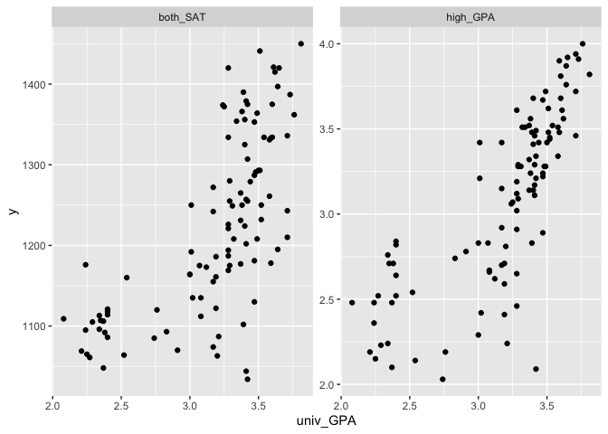
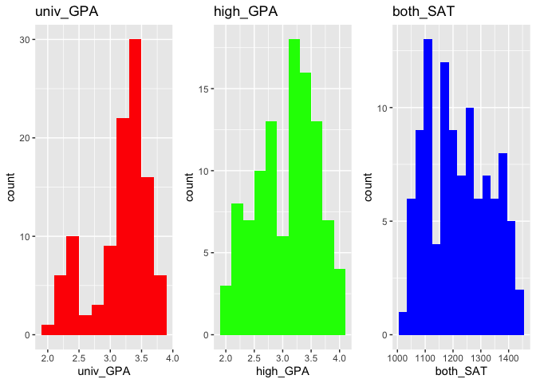
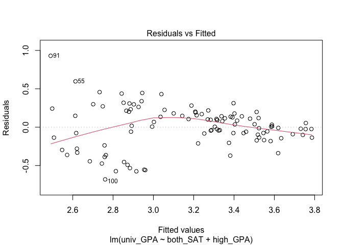
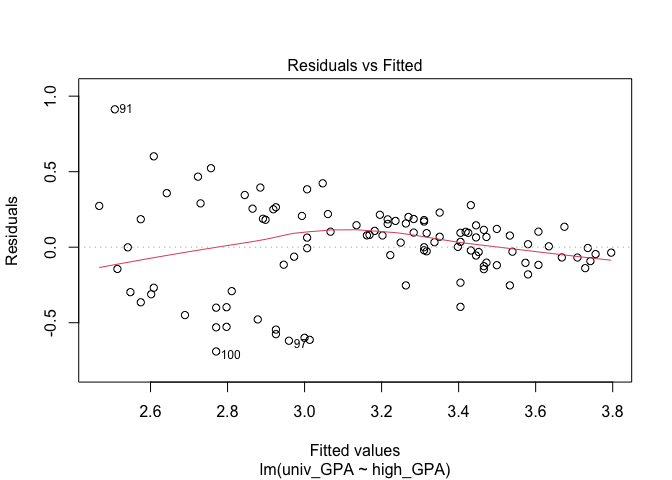

SAT and College Grades
================
Daniel Heitz
2023-04-19

- [Grading Rubric](#grading-rubric)
  - [Individual](#individual)
  - [Due Date](#due-date)
- [Obtain the Data](#obtain-the-data)
  - [**q1** Visit the SAT and College GPA case study page, scroll to the
    bottom, and click the `Open Data with Excel` button. This will allow
    you to download an `xls` file. Save the file to your `data` folder,
    load the data as `df_sat`, and perform your “first checks” against
    these data. Answer the questions
    below:](#q1-visit-the-sat-and-college-gpa-case-study-page-scroll-to-the-bottom-and-click-the-open-data-with-excel-button-this-will-allow-you-to-download-an-xls-file-save-the-file-to-your-data-folder-load-the-data-as-df_sat-and-perform-your-first-checks-against-these-data-answer-the-questions-below)
- [Analysis with Hypothesis Testing](#analysis-with-hypothesis-testing)
  - [View 1: Correlations](#view-1-correlations)
    - [**q2** Create a *single* plot that shows `univ_GPA` against
      *both* `high_GPA` and `both_SAT`. Visually compare the two
      trends.](#q2-create-a-single-plot-that-shows-univ_gpa-against-both-high_gpa-and-both_sat-visually-compare-the-two-trends)
    - [Hypothesis Testing with a Correlation
      Coefficient](#hypothesis-testing-with-a-correlation-coefficient)
    - [**q3** Plot histograms for `both_SAT, high_GPA, univ_GPA`.
      Which—if any—of the variables look approximately normally
      distributed.](#q3-plot-histograms-for-both_sat-high_gpa-univ_gpa-whichif-anyof-the-variables-look-approximately-normally-distributed)
    - [**q4** Use the function `cor.test()` to construct confidence
      intervals for `corr[high_GPA, univ_GPA` and
      `corr[both_SAT, univ_GPA]`. Answer the questions
      below.](#q4-use-the-function-cortest-to-construct-confidence-intervals-for-corrhigh_gpa-univ_gpa-and-corrboth_sat-univ_gpa-answer-the-questions-below)
    - [**q5** Use the bootstrap to approximate a confidence interval for
      `corr[high_GPA, univ_GPA`. Compare your results—both the estimate
      and confidence interval—to your results from
      q4.](#q5-use-the-bootstrap-to-approximate-a-confidence-interval-for-corrhigh_gpa-univ_gpa-compare-your-resultsboth-the-estimate-and-confidence-intervalto-your-results-from-q4)
  - [View 2: Modeling](#view-2-modeling)
    - [Hypothesis Testing with a
      Model](#hypothesis-testing-with-a-model)
    - [**q6** Fit a linear model predicting `univ_GPA` with the
      predictor `both_SAT`. Assess the model to determine how effective
      a predictor `both_SAT` is for `univ_GPA`. Interpret the resulting
      confidence interval for the coefficient on
      `both_SAT`.](#q6-fit-a-linear-model-predicting-univ_gpa-with-the-predictor-both_sat-assess-the-model-to-determine-how-effective-a-predictor-both_sat-is-for-univ_gpa-interpret-the-resulting-confidence-interval-for-the-coefficient-on-both_sat)
    - [**q7** Fit a model predicting `univ_GPA` using both `high_GPA`
      and `both_SAT`. Compare the prediction accuracy and hypothesis
      test
      results.](#q7-fit-a-model-predicting-univ_gpa-using-both-high_gpa-and-both_sat-compare-the-prediction-accuracy-and-hypothesis-test-results)
  - [Synthesize](#synthesize)
    - [**q8** Using the results from all previous q’s, answer the
      following
      questions.](#q8-using-the-results-from-all-previous-qs-answer-the-following-questions)
- [End Notes](#end-notes)

*Purpose*: How do we apply hypothesis testing to investigating data? In
this challenge you’ll practice using hypothesis testing tools to make
sense of a dataset.

*Reading*: - [Harvard Study Says SATs Should Be Optional: Here’s
Why](https://www.csmonitor.com/USA/USA-Update/2016/0120/Harvard-study-says-SATs-should-be-optional.-Here-s-why)
(Optional); easy-to-read news article on colleges going SAT-free -
[Norm-Referenced Tests and Race-Blind
Admissions](https://cshe.berkeley.edu/publications/norm-referenced-tests-and-race-blind-admissions-case-eliminating-sat-and-act-university)
(Optional); technical report on relationship between the SAT/ACT and
non-academic factors

*Credit*: This is based on a [case
study](http://onlinestatbook.com/2/case_studies/sat.html) originally
prepared by Emily Zitek, with data collected through the research of
Thomas MacFarland.

``` r
library(tidyverse)
```

    ## ── Attaching packages ─────────────────────────────────────── tidyverse 1.3.2 ──
    ## ✔ ggplot2 3.4.0      ✔ purrr   1.0.1 
    ## ✔ tibble  3.1.8      ✔ dplyr   1.0.10
    ## ✔ tidyr   1.2.1      ✔ stringr 1.5.0 
    ## ✔ readr   2.1.3      ✔ forcats 0.5.2 
    ## ── Conflicts ────────────────────────────────────────── tidyverse_conflicts() ──
    ## ✖ dplyr::filter() masks stats::filter()
    ## ✖ dplyr::lag()    masks stats::lag()

``` r
library(readxl)
library(broom)
library(modelr)
```

    ## 
    ## Attaching package: 'modelr'
    ## 
    ## The following object is masked from 'package:broom':
    ## 
    ##     bootstrap

``` r
library(rsample)
```

<!-- include-rubric -->

# Grading Rubric

<!-- -------------------------------------------------- -->

Unlike exercises, **challenges will be graded**. The following rubrics
define how you will be graded, both on an individual and team basis.

## Individual

<!-- ------------------------- -->

| Category    | Needs Improvement                                                                                                | Satisfactory                                                                                                               |
|-------------|------------------------------------------------------------------------------------------------------------------|----------------------------------------------------------------------------------------------------------------------------|
| Effort      | Some task **q**’s left unattempted                                                                               | All task **q**’s attempted                                                                                                 |
| Observed    | Did not document observations, or observations incorrect                                                         | Documented correct observations based on analysis                                                                          |
| Supported   | Some observations not clearly supported by analysis                                                              | All observations clearly supported by analysis (table, graph, etc.)                                                        |
| Assessed    | Observations include claims not supported by the data, or reflect a level of certainty not warranted by the data | Observations are appropriately qualified by the quality & relevance of the data and (in)conclusiveness of the support      |
| Specified   | Uses the phrase “more data are necessary” without clarification                                                  | Any statement that “more data are necessary” specifies which *specific* data are needed to answer what *specific* question |
| Code Styled | Violations of the [style guide](https://style.tidyverse.org/) hinder readability                                 | Code sufficiently close to the [style guide](https://style.tidyverse.org/)                                                 |

## Due Date

<!-- ------------------------- -->

All the deliverables stated in the rubrics above are due **at midnight**
before the day of the class discussion of the challenge. See the
[Syllabus](https://docs.google.com/document/d/1qeP6DUS8Djq_A0HMllMqsSqX3a9dbcx1/edit?usp=sharing&ouid=110386251748498665069&rtpof=true&sd=true)
for more information.

*Background*: Every year about 2 million students take the Scholastic
Aptitude Test (SAT). The exam is
[controversial](http://www.nea.org/home/73288.htm) but [extremely
consequential](https://www.csmonitor.com/2004/0518/p13s01-legn.html).
There are many claims about the SAT, but we’re going to look at just
one: Is the SAT predictive of scholastic performance in college? It
turns out this is a fairly complicated question to assess—we’ll get an
introduction to some of the complexities.

# Obtain the Data

<!-- -------------------------------------------------- -->

### **q1** Visit the [SAT and College GPA](http://onlinestatbook.com/2/case_studies/sat.html) case study page, scroll to the bottom, and click the `Open Data with Excel` button. This will allow you to download an `xls` file. Save the file to your `data` folder, load the data as `df_sat`, and perform your “first checks” against these data. Answer the questions below:

``` r
## TODO:
df_sat <- read_excel("sat.xls")
df_sat
```

    ## # A tibble: 105 × 5
    ##    high_GPA math_SAT verb_SAT comp_GPA univ_GPA
    ##       <dbl>    <dbl>    <dbl>    <dbl>    <dbl>
    ##  1     3.45      643      589     3.76     3.52
    ##  2     2.78      558      512     2.87     2.91
    ##  3     2.52      583      503     2.54     2.4 
    ##  4     3.67      685      602     3.83     3.47
    ##  5     3.24      592      538     3.29     3.47
    ##  6     2.1       562      486     2.64     2.37
    ##  7     2.82      573      548     2.86     2.4 
    ##  8     2.36      559      536     2.03     2.24
    ##  9     2.42      552      583     2.81     3.02
    ## 10     3.51      617      591     3.41     3.32
    ## # … with 95 more rows

``` r
summary(df_sat)
```

    ##     high_GPA        math_SAT        verb_SAT        comp_GPA    
    ##  Min.   :2.030   Min.   :516.0   Min.   :480.0   Min.   :2.030  
    ##  1st Qu.:2.670   1st Qu.:573.0   1st Qu.:548.0   1st Qu.:2.870  
    ##  Median :3.170   Median :612.0   Median :591.0   Median :3.210  
    ##  Mean   :3.076   Mean   :623.1   Mean   :598.6   Mean   :3.128  
    ##  3rd Qu.:3.480   3rd Qu.:675.0   3rd Qu.:645.0   3rd Qu.:3.490  
    ##  Max.   :4.000   Max.   :718.0   Max.   :732.0   Max.   :4.000  
    ##     univ_GPA    
    ##  Min.   :2.080  
    ##  1st Qu.:3.010  
    ##  Median :3.290  
    ##  Mean   :3.173  
    ##  3rd Qu.:3.470  
    ##  Max.   :3.810

**Observations**:

- Fill in the following “data dictionary”

| Column     | Meaning |
|------------|---------|
| `high_GPA` | ???     |
| `math_SAT` | ???     |
| `verb_SAT` | ???     |
| `comp_GPA` | ???     |
| `univ_GPA` | ???     |

- What information do we have about these students?
  - (Your response here)
- What kinds of information *do we not have* about these students?
  - (Your response here)
- Based on these missing variables, what possible effects could be
  present in the data that we would have *no way of detecting*?
  - (Your response here)

# Analysis with Hypothesis Testing

<!-- ----------------------------------------------------------------------- -->

We’re going to use two complementary approaches to analyze the data, the
first based on hypothesis testing of correlation coefficients, and the
second based on fitting a regression model and interpreting the
regression coefficients.

To simplify the analysis, let’s look at a composite SAT score:

``` r
## NOTE: No need to edit this
df_composite <-
  df_sat %>%
  mutate(both_SAT = math_SAT + verb_SAT)
```

## View 1: Correlations

<!-- ----------------------------------------------------------------------- -->

### **q2** Create a *single* plot that shows `univ_GPA` against *both* `high_GPA` and `both_SAT`. Visually compare the two trends.

*Hint*: One way to do this is to first *pivot* `df_composite`.

``` r
## TODO:
df_composite %>% 
  gather(key = "facet", value = "y", high_GPA, both_SAT) %>%
  ggplot(aes(x = univ_GPA, y = y)) +
  geom_point() +
  # Facet by the gathered column
  facet_wrap(~facet, scales = "free_y")
```

<!-- -->

**Observations**:

- What relationship do `univ_GPA` and `both_SAT` exhibit?
  - Positive, accelerating correlation
- What relationship do `univ_GPA` and `high_GPA` exhibit?
  - Positive, accelerating correlation

### Hypothesis Testing with a Correlation Coefficient

<!-- ------------------------- -->

We can use the idea of hypothesis testing with a correlation
coefficient. The idea is to set our null hypothesis to the case where
there is no correlation, and test to see if the data contradict that
perspective. Formally, the null (H0) and alternative (HA) hypotheses
relating to a correlation coefficient between two variables `X, Y` are:

$$\text{H0: } \text{Corr}[X, Y] = 0$$

$$\text{HA: } \text{Corr}[X, Y] \neq 0$$

The R function `cor.test` implements such a hypothesis test under the
assumption that `X, Y` are both normally distributed. First, let’s check
to see if this assumption looks reasonable for our data.

### **q3** Plot histograms for `both_SAT, high_GPA, univ_GPA`. Which—if any—of the variables look approximately normally distributed.

``` r
library(gridExtra)
```

    ## 
    ## Attaching package: 'gridExtra'

    ## The following object is masked from 'package:dplyr':
    ## 
    ##     combine

``` r
# Create the first histogram for univ_GPA
p1 <- df_composite %>%
  ggplot(aes(x = univ_GPA)) +
  geom_histogram(binwidth = 0.2, fill = "red") +
  ggtitle("univ_GPA")

# Create the second histogram for high_GPA
p2 <- df_composite %>%
  ggplot(aes(x = high_GPA)) +
  geom_histogram(binwidth = 0.2, fill = "green") +
  ggtitle("high_GPA")

# Create the third histogram for both_SAT
p3 <- df_composite %>%
  ggplot(aes(x = both_SAT)) +
  geom_histogram(binwidth = 30, fill = "blue") +
  ggtitle("both_SAT")

# Arrange the three histograms next to each other
grid.arrange(p1, p2, p3, ncol = 3)
```

<!-- -->

**Observations**:

- To what extent does `both_SAT` look like a normal distribution?
  - Its not great but its pretty good. I played around with the binwidth
    and in all of them it bore some resemblance so I’d say it probably
    is.
- To what extent does `high_GPA` look like a normal distribution?
  - Pretty good, there’s a hole in the middle but on both sides it looks
    fine, so I’d go with a fairly strong resemblance
- To what extent does `univ_GPA` look like a normal distribution?
  - It actually looks like two of them, one smaller than the other.
    Overall not very, but each peak definitely looks somewhat like one
    (though quite steep)

Keep in mind your findings as you complete q4.

### **q4** Use the function `cor.test()` to construct confidence intervals for `corr[high_GPA, univ_GPA` and `corr[both_SAT, univ_GPA]`. Answer the questions below.

``` r
## TODO: Use the function cor.test() to test the correlations between
##       high_GPA and univ_GPA, as well as between
##       both_SAT and univ_GPA
# Calculate the correlation and confidence interval between high_GPA and univ_GPA
high_univ_cor <- cor.test(df_composite$high_GPA, df_composite$univ_GPA)
high_univ_df <- tibble(
  estimate = high_univ_cor$estimate,
  conf.low = high_univ_cor$conf.int[1],
  conf.high = high_univ_cor$conf.int[2]
) %>%
  summarise(
    "Correlation between high_GPA and univ_GPA" = estimate,
    "Lower bound of confidence interval" = conf.low,
    "Upper bound of confidence interval" = conf.high
  )

# Calculate the correlation and confidence interval between both_SAT and univ_GPA
both_univ_cor <- cor.test(df_composite$both_SAT, df_composite$univ_GPA)
both_univ_df <- tibble(
  estimate = both_univ_cor$estimate,
  conf.low = both_univ_cor$conf.int[1],
  conf.high = both_univ_cor$conf.int[2]
) %>%
  summarise(
    "Correlation between both_SAT and univ_GPA" = estimate,
    "Lower bound of confidence interval" = conf.low,
    "Upper bound of confidence interval" = conf.high
  )
high_univ_df
```

    ## # A tibble: 1 × 3
    ##   `Correlation between high_GPA and univ_GPA` Lower bound of confidenc…¹ Upper…²
    ##                                         <dbl>                      <dbl>   <dbl>
    ## 1                                       0.780                      0.691   0.845
    ## # … with abbreviated variable names ¹​`Lower bound of confidence interval`,
    ## #   ²​`Upper bound of confidence interval`

``` r
both_univ_df
```

    ## # A tibble: 1 × 3
    ##   `Correlation between both_SAT and univ_GPA` Lower bound of confidenc…¹ Upper…²
    ##                                         <dbl>                      <dbl>   <dbl>
    ## 1                                       0.685                      0.567   0.775
    ## # … with abbreviated variable names ¹​`Lower bound of confidence interval`,
    ## #   ²​`Upper bound of confidence interval`

**Observations**:

- Which correlations are significantly nonzero?
  - (Your response here)
- Which of `high_GPA` and `both_SAT` seems to be more strongly
  correlated with `univ_GPA`?
  - high_GPA seems to be more strongly correlated, although the interval
    has enough overlap that I cannot say this definitively.
- How do the results here compare with the visual you created in q2?
  - It about lines up, yeah they all look similar but the GPA graphs
    both have a double peak behavior with the double peaks being more
    distinct in univ_GPA, but each peak and overall ignoring the gap all
    resemble similar normal distributions.
- Based on these results, what can we say about the predictive
  capabilities of both `high_GPA` and `both_SAT` to predict `univ_GPA`?
  - They are both fairly good predictors, especially high_GPA. Its not
    amazing, but it is definitely a strong correlation that easily gives
    us a qualitative sense.

Finally, let’s use the bootstrap to perform the same test using
*different* assumptions.

### **q5** Use the bootstrap to approximate a confidence interval for `corr[high_GPA, univ_GPA`. Compare your results—both the estimate and confidence interval—to your results from q4.

``` r
## TODO: Use the bootstrap to compute a confidence interval for corr[high_GPA, univ_GPA]
# Set the number of bootstrap replicates
# Set the number of bootstrap replicates
n_replicates <- 1000

# Create a function to calculate the correlation for a given bootstrap replicate
calc_correlation <- function(data) {
  cor(data$high_GPA, data$univ_GPA)
}

# Generate bootstrap replicates of the correlation
correlation_replicates <- map_dbl(1:n_replicates, ~ df_composite %>%
  sample_frac(replace = TRUE) %>%
  calc_correlation())

# Calculate the estimate and confidence interval for the correlation
correlation_estimate <- mean(correlation_replicates)
correlation_ci <- quantile(correlation_replicates, c(0.005, 0.995))

# Display the results
tibble(
  estimate = correlation_estimate,
  conf.low = correlation_ci[1],
  conf.high = correlation_ci[2]
) %>%
  summarise(
    "Bootstrap estimate of correlation between high_GPA and univ_GPA" = estimate,
    "Lower bound of confidence interval" = conf.low,
    "Upper bound of confidence interval" = conf.high
  )
```

    ## # A tibble: 1 × 3
    ##   Bootstrap estimate of correlation between high_GPA and univ_…¹ Lower…² Upper…³
    ##                                                            <dbl>   <dbl>   <dbl>
    ## 1                                                          0.779   0.662   0.865
    ## # … with abbreviated variable names
    ## #   ¹​`Bootstrap estimate of correlation between high_GPA and univ_GPA`,
    ## #   ²​`Lower bound of confidence interval`,
    ## #   ³​`Upper bound of confidence interval`

**Observations**:

- How does your estimate from q5 compare with your estimate from q4?
  - Its a little bigger but it does fully include the old estimate.
- How does your CI from q5 compare with your CI from q4?
  - They’re almost exactly the same, 0.780 vs 0.781.

*Aside*: When you use two different approximations to compute the same
quantity and get similar results, that’s an *encouraging sign*. Such an
outcome lends a bit more credibility to the results.

## View 2: Modeling

<!-- ------------------------- -->

Correlations are useful for relating two variables at a time. To study
the relationship among more variables we can instead use a fitted model.
Using a model, we can also help assess whether it is *worthwhile* to
measure a variable.

To begin, let’s first split the data into training and validation sets.

``` r
## NOTE: No need to edit
set.seed(101)

df_train <-
  df_composite %>%
  rowid_to_column() %>%
  slice_sample(n = 80)

df_validate <-
  df_composite %>%
  rowid_to_column() %>%
  anti_join(
    .,
    df_train,
    by = "rowid"
  )
```

### Hypothesis Testing with a Model

<!-- ------------------------- -->

We can combine the ideas of hypothesis testing with a model. Using a
model, we can express our hypotheses in terms of the model parameters.
For instance, if we were interested in whether $X$ has an affect on $Y$,
we might set up a model:

$$Y_i = \beta X_i + \epsilon_i$$

With the hypotheses:

$$\text{H0}: \beta = 0$$

$$\text{HA}: \beta \neq 0$$

In this case, we’re testing for whether $X$ has a significant effect on
$Y$. Let’s apply this idea to relating the variables `univ_GPA` and
`high_GPA`. Luckily R has built-in tools to construct a confidence
interval on the $\beta$’s in a regression \[1\]; we’ll simply use those
tools rather than do it by hand.

### **q6** Fit a linear model predicting `univ_GPA` with the predictor `both_SAT`. Assess the model to determine how effective a predictor `both_SAT` is for `univ_GPA`. Interpret the resulting confidence interval for the coefficient on `both_SAT`.

``` r
## TODO: Fit a model of univ_GPA on the predictor both_SAT
fit_basic <- lm(univ_GPA ~ both_SAT, data = df_composite)

## NOTE: The following computes confidence intervals on regression coefficients
fit_basic %>%
  tidy(
    conf.int = TRUE,
    conf.level = 0.99
  )
```

    ## # A tibble: 2 × 7
    ##   term        estimate std.error statistic  p.value conf.low conf.high
    ##   <chr>          <dbl>     <dbl>     <dbl>    <dbl>    <dbl>     <dbl>
    ## 1 (Intercept) -0.172    0.352       -0.487 6.27e- 1 -1.10      0.753  
    ## 2 both_SAT     0.00274  0.000287     9.53  8.05e-16  0.00198   0.00349

``` r
model_summary <- summary(fit_basic)

# Get the R-squared value
r_squared <- model_summary$r.squared

# Print the R-squared value
r_squared
```

    ## [1] 0.4687834

**Observations**:

- What is the confidence interval on the coefficient of `both_SAT`? Is
  this coefficient significantly different from zero?
  - 0.001984 and 0.00349. Yes I would say this is significantly
    different because the interval doesn’t include 0.
- By itself, how well does `both_SAT` predict `univ_GPA`?
  - I would say fairly decently. Its not great, the R2 value is only
    0.47. This definitely suggests a real relationship though. I would
    characterize our regression as a good ballpark estimate but not
    something we should follow religiously.

Remember from `e-model03-interp-warnings` that there are challenges with
interpreting regression coefficients! Let’s investigate that idea
further.

### **q7** Fit a model predicting `univ_GPA` using both `high_GPA` and `both_SAT`. Compare the prediction accuracy and hypothesis test results.

``` r
## TODO: Fit and assess models with predictors both_SAT + high_GPA, and high_GPA alone
# Fit the linear model with both_SAT and high_GPA as predictors
model1 <- lm(univ_GPA ~ both_SAT + high_GPA, data = df_composite)

# Summarize the model
summary(model1)
```

    ## 
    ## Call:
    ## lm(formula = univ_GPA ~ both_SAT + high_GPA, data = df_composite)
    ## 
    ## Residuals:
    ##      Min       1Q   Median       3Q      Max 
    ## -0.68072 -0.13667  0.01137  0.17012  0.92983 
    ## 
    ## Coefficients:
    ##              Estimate Std. Error t value Pr(>|t|)    
    ## (Intercept) 0.5397848  0.3177784   1.699   0.0924 .  
    ## both_SAT    0.0007918  0.0003868   2.047   0.0432 *  
    ## high_GPA    0.5414534  0.0837479   6.465 3.53e-09 ***
    ## ---
    ## Signif. codes:  0 '***' 0.001 '**' 0.01 '*' 0.05 '.' 0.1 ' ' 1
    ## 
    ## Residual standard error: 0.2772 on 102 degrees of freedom
    ## Multiple R-squared:  0.6232, Adjusted R-squared:  0.6158 
    ## F-statistic: 84.35 on 2 and 102 DF,  p-value: < 2.2e-16

``` r
# Fit the linear model with only high_GPA as predictor
model2 <- lm(univ_GPA ~ high_GPA, data = df_composite)

# Summarize the model
summary(model2)
```

    ## 
    ## Call:
    ## lm(formula = univ_GPA ~ high_GPA, data = df_composite)
    ## 
    ## Residuals:
    ##      Min       1Q   Median       3Q      Max 
    ## -0.69040 -0.11922  0.03274  0.17397  0.91278 
    ## 
    ## Coefficients:
    ##             Estimate Std. Error t value Pr(>|t|)    
    ## (Intercept)  1.09682    0.16663   6.583 1.98e-09 ***
    ## high_GPA     0.67483    0.05342  12.632  < 2e-16 ***
    ## ---
    ## Signif. codes:  0 '***' 0.001 '**' 0.01 '*' 0.05 '.' 0.1 ' ' 1
    ## 
    ## Residual standard error: 0.2814 on 103 degrees of freedom
    ## Multiple R-squared:  0.6077, Adjusted R-squared:  0.6039 
    ## F-statistic: 159.6 on 1 and 103 DF,  p-value: < 2.2e-16

``` r
# Assess the performance of model1

# Get the summary of model1
model1_summary <- summary(model1)

# Get the R-squared value for model1
r_squared1 <- model1_summary$r.squared

# Print the R-squared value for model1
cat("R-squared value for model1:", r_squared1, "\n")
```

    ## R-squared value for model1: 0.6231977

``` r
# Get the p-values for each predictor in model1
p_values1 <- model1_summary$coefficients[, 4]

# Print the p-values for model1
cat("p-values for predictors in model1:\n")
```

    ## p-values for predictors in model1:

``` r
print(p_values1)
```

    ##  (Intercept)     both_SAT     high_GPA 
    ## 9.243922e-02 4.323066e-02 3.532996e-09

``` r
# Create a residual plot for model1
plot(model1, which = 1)
```

<!-- -->

``` r
# Get the 99% confidence intervals for all coefficients in model1
ci_model1 <- confint(model1, level = 0.99)

# Print the 99% confidence intervals for all coefficients in model1
cat("99% confidence intervals for all coefficients in model1:\n")
```

    ## 99% confidence intervals for all coefficients in model1:

``` r
print(ci_model1)
```

    ##                     0.5 %      99.5 %
    ## (Intercept) -0.2943490328 1.373918578
    ## both_SAT    -0.0002235487 0.001807201
    ## high_GPA     0.3216242036 0.761282610

``` r
# Assess the performance of model2

# Get the summary of model2
model2_summary <- summary(model2)

# Get the R-squared value for model2
r_squared2 <- model2_summary$r.squared

# Print the R-squared value for model2
cat("R-squared value for model2:", r_squared2, "\n")
```

    ## R-squared value for model2: 0.6077187

``` r
# Get the p-values for each predictor in model2
p_values2 <- model2_summary$coefficients[, 4]

# Print the p-values for model2
cat("p-values for predictors in model2:\n")
```

    ## p-values for predictors in model2:

``` r
print(p_values2)
```

    ##  (Intercept)     high_GPA 
    ## 1.976679e-09 1.175613e-22

``` r
# Create a residual plot for model2
plot(model2, which = 1)
```

<!-- -->

``` r
# Get the 99% confidence intervals for all coefficients in model2
ci_model2 <- confint(model2, level = 0.99)

# Print the 99% confidence intervals for all coefficients in model2
cat("99% confidence intervals for all coefficients in model2:\n")
```

    ## 99% confidence intervals for all coefficients in model2:

``` r
print(ci_model2)
```

    ##                 0.5 %   99.5 %
    ## (Intercept) 0.6595265 1.534120
    ## high_GPA    0.5346278 0.815032

**Observations**:

- How well do these models perform, compared to the one you built in q6?
  - Even better, their R2 values are improved and both have great
    p-values.
- What is the confidence interval on the coefficient of `both_SAT` when
  including `high_GPA` as a predictor?? Is this coefficient
  significantly different from zero?
  - -0.00022 to 0.00181. This is not significantly different from zero.
- How do the hypothesis test results compare with the results in q6?
  - These results suggest that both_SAT is an inferior predictor than
    high_GPA, and actually suggests that both_SAT is not a good
    predictor in general which goes against what we found in part 6.

## Synthesize

<!-- ------------------------- -->

Before closing, let’s synthesize a bit from the analyses above.

### **q8** Using the results from all previous q’s, answer the following questions.

**Observations**:

- Between `both_SAT` and `high_GPA`, which single variable would you
  choose to predict `univ_GPA`? Why?
  - high_GPA, all the metrics favor it as a predictor of univ_GPA.
- Is `both_SAT` an effective predictor of `univ_GPA`? What specific
  pieces of evidence do you have in favor of `both_SAT` being effective?
  What specific pieces of evidence do you have against?
  - Yes I would say it is. Our bootstrap confidence intervals, the
    regression from q6, the bar graphs, and the dot plots all suggest
    there is some relationship. The evidence against is the findings in
    q7, but I more interpret that as saying that it is a significantly
    worse predictor than high_GPA, not that it isn’t able to produce any
    reasonable prediciton.

# End Notes

<!-- ----------------------------------------------------------------------- -->

\[1\] There are also assumptions underlying this kind of testing, for
more information see this [Wiki
article](https://en.wikipedia.org/wiki/Linear_regression#Assumptions).
