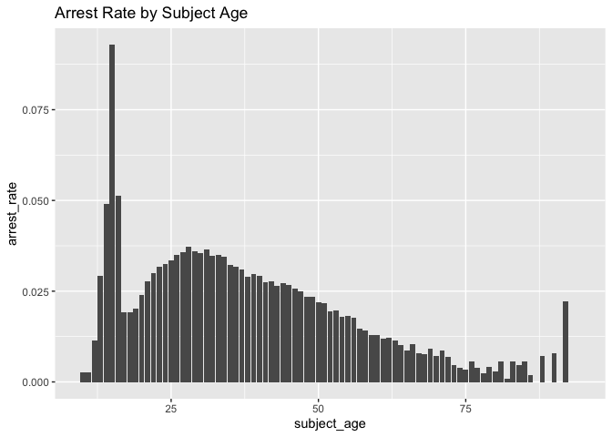
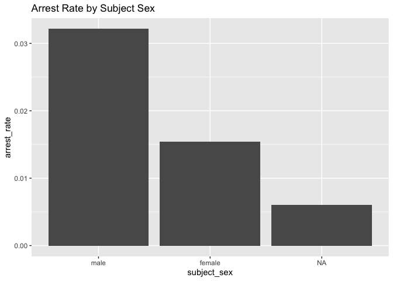
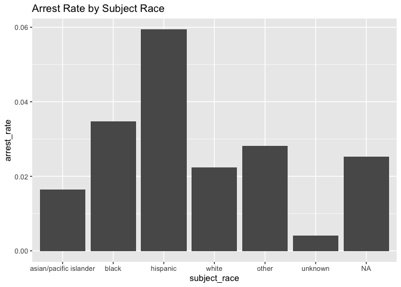

Massachusetts Highway Stops
================
Daniel Heitz
2023-05-04

- [Grading Rubric](#grading-rubric)
  - [Individual](#individual)
  - [Due Date](#due-date)
- [Setup](#setup)
  - [**q1** Go to the Stanford Open Policing Project page and download
    the Massachusetts State Police records in `Rds` format. Move the
    data to your `data` folder and match the `filename` to load the
    data.](#q1-go-to-the-stanford-open-policing-project-page-and-download-the-massachusetts-state-police-records-in-rds-format-move-the-data-to-your-data-folder-and-match-the-filename-to-load-the-data)
- [EDA](#eda)
  - [**q2** Do your “first checks” on the dataset. What are the basic
    facts about this
    dataset?](#q2-do-your-first-checks-on-the-dataset-what-are-the-basic-facts-about-this-dataset)
  - [**q3** Check the set of factor levels for `subject_race` and
    `raw_Race`. What do you note about overlap / difference between the
    two
    sets?](#q3-check-the-set-of-factor-levels-for-subject_race-and-raw_race-what-do-you-note-about-overlap--difference-between-the-two-sets)
  - [**q4** Check whether `subject_race` and `raw_Race` match for a
    large fraction of cases. Which of the two hypotheses above is most
    likely, based on your
    results?](#q4-check-whether-subject_race-and-raw_race-match-for-a-large-fraction-of-cases-which-of-the-two-hypotheses-above-is-most-likely-based-on-your-results)
  - [Vis](#vis)
    - [**q5** Compare the *arrest rate*—the fraction of total cases in
      which the subject was arrested—across different factors. Create as
      many visuals (or tables) as you need, but make sure to check the
      trends across all of the `subject` variables. Answer the questions
      under *observations*
      below.](#q5-compare-the-arrest-ratethe-fraction-of-total-cases-in-which-the-subject-was-arrestedacross-different-factors-create-as-many-visuals-or-tables-as-you-need-but-make-sure-to-check-the-trends-across-all-of-the-subject-variables-answer-the-questions-under-observations-below)
- [Modeling](#modeling)
  - [**q6** Run the following code and interpret the regression
    coefficients. Answer the the questions under *observations*
    below.](#q6-run-the-following-code-and-interpret-the-regression-coefficients-answer-the-the-questions-under-observations-below)
  - [**q7** Re-fit the logistic regression from q6 setting `"white"` as
    the reference level for `subject_race`. Interpret the the model
    terms and answer the questions
    below.](#q7-re-fit-the-logistic-regression-from-q6-setting-white-as-the-reference-level-for-subject_race-interpret-the-the-model-terms-and-answer-the-questions-below)
  - [**q8** Re-fit the model using a factor indicating the presence of
    contraband in the subject’s vehicle. Answer the questions under
    *observations*
    below.](#q8-re-fit-the-model-using-a-factor-indicating-the-presence-of-contraband-in-the-subjects-vehicle-answer-the-questions-under-observations-below)
  - [**q9** Go deeper: Pose at least one more question about the data
    and fit at least one more model in support of answering that
    question.](#q9-go-deeper-pose-at-least-one-more-question-about-the-data-and-fit-at-least-one-more-model-in-support-of-answering-that-question)
  - [Further Reading](#further-reading)

*Purpose*: In this last challenge we’ll focus on using logistic
regression to study a large, complicated dataset. Interpreting the
results of a model can be challenging—both in terms of the statistics
and the real-world reasoning—so we’ll get some practice in this
challenge.

<!-- include-rubric -->

# Grading Rubric

<!-- -------------------------------------------------- -->

Unlike exercises, **challenges will be graded**. The following rubrics
define how you will be graded, both on an individual and team basis.

## Individual

<!-- ------------------------- -->

| Category    | Needs Improvement                                                                                                | Satisfactory                                                                                                               |
|-------------|------------------------------------------------------------------------------------------------------------------|----------------------------------------------------------------------------------------------------------------------------|
| Effort      | Some task **q**’s left unattempted                                                                               | All task **q**’s attempted                                                                                                 |
| Observed    | Did not document observations, or observations incorrect                                                         | Documented correct observations based on analysis                                                                          |
| Supported   | Some observations not clearly supported by analysis                                                              | All observations clearly supported by analysis (table, graph, etc.)                                                        |
| Assessed    | Observations include claims not supported by the data, or reflect a level of certainty not warranted by the data | Observations are appropriately qualified by the quality & relevance of the data and (in)conclusiveness of the support      |
| Specified   | Uses the phrase “more data are necessary” without clarification                                                  | Any statement that “more data are necessary” specifies which *specific* data are needed to answer what *specific* question |
| Code Styled | Violations of the [style guide](https://style.tidyverse.org/) hinder readability                                 | Code sufficiently close to the [style guide](https://style.tidyverse.org/)                                                 |

## Due Date

<!-- ------------------------- -->

All the deliverables stated in the rubrics above are due **at midnight**
before the day of the class discussion of the challenge. See the
[Syllabus](https://docs.google.com/document/d/1qeP6DUS8Djq_A0HMllMqsSqX3a9dbcx1/edit?usp=sharing&ouid=110386251748498665069&rtpof=true&sd=true)
for more information.

*Background*: We’ll study data from the [Stanford Open Policing
Project](https://openpolicing.stanford.edu/data/), specifically their
dataset on Massachusetts State Patrol police stops.

``` r
library(tidyverse)
```

    ## ── Attaching packages ─────────────────────────────────────── tidyverse 1.3.2 ──
    ## ✔ ggplot2 3.4.0      ✔ purrr   1.0.1 
    ## ✔ tibble  3.1.8      ✔ dplyr   1.0.10
    ## ✔ tidyr   1.2.1      ✔ stringr 1.5.0 
    ## ✔ readr   2.1.3      ✔ forcats 0.5.2 
    ## ── Conflicts ────────────────────────────────────────── tidyverse_conflicts() ──
    ## ✖ dplyr::filter() masks stats::filter()
    ## ✖ dplyr::lag()    masks stats::lag()

``` r
library(broom)
```

# Setup

<!-- -------------------------------------------------- -->

### **q1** Go to the [Stanford Open Policing Project](https://openpolicing.stanford.edu/data/) page and download the Massachusetts State Police records in `Rds` format. Move the data to your `data` folder and match the `filename` to load the data.

*Note*: An `Rds` file is an R-specific file format. The function
`readRDS` will read these files.

``` r
## TODO: Download the data, move to your data folder, and load it
filename <- "yg821jf8611_ma_statewide_2020_04_01.rds"
df_data <- readRDS(filename)
```

# EDA

<!-- -------------------------------------------------- -->

### **q2** Do your “first checks” on the dataset. What are the basic facts about this dataset?

``` r
df_data %>% head()
```

    ## # A tibble: 6 × 24
    ##   raw_row_num…¹ date       locat…² count…³ subje…⁴ subje…⁵ subje…⁶ type  arres…⁷
    ##   <chr>         <date>     <chr>   <chr>     <int> <fct>   <fct>   <fct> <lgl>  
    ## 1 1             2007-06-06 MIDDLE… Plymou…      33 white   male    vehi… FALSE  
    ## 2 2             2007-06-07 SEEKONK Bristo…      36 white   male    vehi… FALSE  
    ## 3 3             2007-06-07 MEDFORD Middle…      56 white   female  vehi… FALSE  
    ## 4 4             2007-06-07 MEDFORD Middle…      37 white   male    vehi… FALSE  
    ## 5 5             2007-06-07 EVERETT Middle…      22 hispan… female  vehi… FALSE  
    ## 6 6             2007-06-07 MEDFORD Middle…      34 white   male    vehi… FALSE  
    ## # … with 15 more variables: citation_issued <lgl>, warning_issued <lgl>,
    ## #   outcome <fct>, contraband_found <lgl>, contraband_drugs <lgl>,
    ## #   contraband_weapons <lgl>, contraband_alcohol <lgl>, contraband_other <lgl>,
    ## #   frisk_performed <lgl>, search_conducted <lgl>, search_basis <fct>,
    ## #   reason_for_stop <chr>, vehicle_type <chr>,
    ## #   vehicle_registration_state <fct>, raw_Race <chr>, and abbreviated variable
    ## #   names ¹​raw_row_number, ²​location, ³​county_name, ⁴​subject_age, …

``` r
df_data %>% summary()
```

    ##  raw_row_number          date              location         county_name       
    ##  Length:3416238     Min.   :2007-01-01   Length:3416238     Length:3416238    
    ##  Class :character   1st Qu.:2009-04-22   Class :character   Class :character  
    ##  Mode  :character   Median :2011-07-08   Mode  :character   Mode  :character  
    ##                     Mean   :2011-07-16                                        
    ##                     3rd Qu.:2013-08-27                                        
    ##                     Max.   :2015-12-31                                        
    ##                                                                               
    ##   subject_age                     subject_race     subject_sex     
    ##  Min.   :10.00    asian/pacific islander: 166842   male  :2362238  
    ##  1st Qu.:25.00    black                 : 351610   female:1038377  
    ##  Median :34.00    hispanic              : 338317   NA's  :  15623  
    ##  Mean   :36.47    white                 :2529780                   
    ##  3rd Qu.:46.00    other                 :  11008                   
    ##  Max.   :94.00    unknown               :  17017                   
    ##  NA's   :158006   NA's                  :   1664                   
    ##          type         arrest_made     citation_issued warning_issued 
    ##  pedestrian:      0   Mode :logical   Mode :logical   Mode :logical  
    ##  vehicular :3416238   FALSE:3323303   FALSE:1244039   FALSE:2269244  
    ##                       TRUE :92019     TRUE :2171283   TRUE :1146078  
    ##                       NA's :916       NA's :916       NA's :916      
    ##                                                                      
    ##                                                                      
    ##                                                                      
    ##      outcome        contraband_found contraband_drugs contraband_weapons
    ##  warning :1146078   Mode :logical    Mode :logical    Mode :logical     
    ##  citation:2171283   FALSE:28256      FALSE:36296      FALSE:53237       
    ##  summons :      0   TRUE :27474      TRUE :19434      TRUE :2493        
    ##  arrest  :  92019   NA's :3360508    NA's :3360508    NA's :3360508     
    ##  NA's    :   6858                                                       
    ##                                                                         
    ##                                                                         
    ##  contraband_alcohol contraband_other frisk_performed search_conducted
    ##  Mode :logical      Mode :logical    Mode :logical   Mode :logical   
    ##  FALSE:3400070      FALSE:51708      FALSE:51029     FALSE:3360508   
    ##  TRUE :16168        TRUE :4022       TRUE :3602      TRUE :55730     
    ##                     NA's :3360508    NA's :3361607                   
    ##                                                                      
    ##                                                                      
    ##                                                                      
    ##          search_basis     reason_for_stop    vehicle_type      
    ##  k9            :      0   Length:3416238     Length:3416238    
    ##  plain view    :      0   Class :character   Class :character  
    ##  consent       :   6903   Mode  :character   Mode  :character  
    ##  probable cause:  25898                                        
    ##  other         :  18228                                        
    ##  NA's          :3365209                                        
    ##                                                                
    ##  vehicle_registration_state   raw_Race        
    ##  MA     :3053713            Length:3416238    
    ##  CT     :  82906            Class :character  
    ##  NY     :  69059            Mode  :character  
    ##  NH     :  51514                              
    ##  RI     :  39375                              
    ##  (Other): 109857                              
    ##  NA's   :   9814

Note that we have both a `subject_race` and `race_Raw` column. There are
a few possibilities as to what `race_Raw` represents:

- `race_Raw` could be the race of the police officer in the stop
- `race_Raw` could be an unprocessed version of `subject_race`

Let’s try to distinguish between these two possibilities.

### **q3** Check the set of factor levels for `subject_race` and `raw_Race`. What do you note about overlap / difference between the two sets?

``` r
# Check factor levels for subject_race
subject_race_levels <- levels(df_data$subject_race)
print(subject_race_levels)
```

    ## [1] "asian/pacific islander" "black"                  "hispanic"              
    ## [4] "white"                  "other"                  "unknown"

``` r
# Check unique values for race_Raw
race_Raw_unique <- unique(df_data$raw_Race)
print(race_Raw_unique)
```

    ## [1] "White"                                        
    ## [2] "Hispanic"                                     
    ## [3] "Black"                                        
    ## [4] "Asian or Pacific Islander"                    
    ## [5] "Middle Eastern or East Indian (South Asian)"  
    ## [6] "American Indian or Alaskan Native"            
    ## [7] NA                                             
    ## [8] "None - for no operator present citations only"
    ## [9] "A"

**Observations**:

- What are the unique values for `subject_race`? asian/pacific islander,
  black, hispanic, white, other, and unknown
- What are the unique values for `raw_Race`? White, Hispanic, Black,
  Asian or Pacific Islander, Middle Eastern or East Indian (South
  Asian), American Indian or Alaskan Native, NA, None - for no operator
  present citations only, A.
- What is the overlap between the two sets? asian, black, hispanic, and
  white directly correspond, though with syntactical differences
- What is the difference between the two sets? Middle Eastern is not a
  category in subject_race. Also None - no operator is not there. I
  don’t know what “A” is. Also there is NA, but that is not a string NA
  that is a null value meaning the data is absent.

### **q4** Check whether `subject_race` and `raw_Race` match for a large fraction of cases. Which of the two hypotheses above is most likely, based on your results?

*Note*: Just to be clear, I’m *not* asking you to do a *statistical*
hypothesis test.

``` r
## TODO: Devise your own way to test the hypothesis posed above.
# Define the mappings between subject_race and raw_Race values
race_mappings <- c("black" = "Black", "asian/pacific islander" = "Asian or Pacific Islander", "hispanic" = "Hispanic", "white" = "White")

# Exclude rows with missing values in subject_race or raw_Race columns
df_data_no_na <- df_data %>%
  filter(!is.na(subject_race) & !is.na(raw_Race))

# Create a new column indicating whether subject_race and raw_Race can be mapped
df_data_no_na <- df_data_no_na %>%
  mutate(race_match = ifelse(race_mappings[subject_race] == raw_Race, TRUE, FALSE))

# Calculate the fraction of rows where subject_race and raw_Race can be mapped (ignoring missing values)
match_fraction <- mean(df_data_no_na$race_match, na.rm = TRUE)
cat("Fraction of rows where subject_race and raw_Race can be mapped:", match_fraction)
```

    ## Fraction of rows where subject_race and raw_Race can be mapped: 0.8469085

**Observations**

Between the two hypotheses:

- `race_Raw` could be the race of the police officer in the stop
- `race_Raw` could be an unprocessed version of `subject_race`

which is most plausible, based on your results?

- The second one, they usually match (85%) which suggests race_Raw is
  unprocessed. And while not definitive evidence, the name race_Raw
  suggests its raw race data, that has not been processed. Conveniently
  there is a subject_race column.

## Vis

<!-- ------------------------- -->

### **q5** Compare the *arrest rate*—the fraction of total cases in which the subject was arrested—across different factors. Create as many visuals (or tables) as you need, but make sure to check the trends across all of the `subject` variables. Answer the questions under *observations* below.

(Note: Create as many chunks and visuals as you need)

``` r
# Calculate arrest rate by subject_age
arrest_rate_by_age <- df_data %>%
  group_by(subject_age) %>%
  summarize(arrest_rate = mean(arrest_made, na.rm = TRUE))

# Create scatter plot
ggplot(arrest_rate_by_age, aes(x = subject_age, y = arrest_rate)) +
  geom_col() +
  labs(title = "Arrest Rate by Subject Age")
```

    ## Warning: Removed 1 rows containing missing values (`position_stack()`).

<!-- -->

``` r
# Calculate arrest rate by subject_sex
arrest_rate_by_sex <- df_data %>%
  group_by(subject_sex) %>%
  summarize(arrest_rate = mean(arrest_made, na.rm = TRUE))

# Create scatter plot
ggplot(arrest_rate_by_sex, aes(x = subject_sex, y = arrest_rate)) +
  geom_col() +
  labs(title = "Arrest Rate by Subject Sex")
```

<!-- -->

``` r
# Calculate arrest rate by subject_race
arrest_rate_by_sex <- df_data %>%
  group_by(subject_race) %>%
  summarize(arrest_rate = mean(arrest_made, na.rm = TRUE))

# Create scatter plot
ggplot(arrest_rate_by_sex, aes(x = subject_race, y = arrest_rate)) +
  geom_col() +
  labs(title = "Arrest Rate by Subject Race")
```

<!-- -->

**Observations**:

- How does `arrest_rate` tend to vary with `subject_age`?
  - Peaks at 15, goes down at 18, rises again until around 28, then
    declines until the very end when it jumps around from 0 to something
    high, I think that’s a product of lack of data at the very end but
    there may be a trend.
- How does `arrest_rate` tend to vary with `subject_sex`?
  - Men have double the arrest rate of women
- How does `arrest_rate` tend to vary with `subject_race`?
  - Hispanic is the highest by far, asian/pacific islander is the lowest
    (other than unknown). Black is a little higher than white, white is
    a little higher and asian/PI.

# Modeling

<!-- -------------------------------------------------- -->

We’re going to use a model to study the relationship between `subject`
factors and arrest rate, but first we need to understand a bit more
about *dummy variables*

### **q6** Run the following code and interpret the regression coefficients. Answer the the questions under *observations* below.

``` r
## NOTE: No need to edit; inspect the estimated model terms.
fit_q6 <-
  glm(
    formula = arrest_made ~ subject_age + subject_race + subject_sex,
    data = df_data %>%
      filter(
        !is.na(arrest_made),
        subject_race %in% c("white", "black", "hispanic")
      ),
    family = "binomial"
  )

fit_q6 %>% tidy()
```

    ## # A tibble: 5 × 5
    ##   term                 estimate std.error statistic   p.value
    ##   <chr>                   <dbl>     <dbl>     <dbl>     <dbl>
    ## 1 (Intercept)           -2.67    0.0132      -202.  0        
    ## 2 subject_age           -0.0142  0.000280     -50.5 0        
    ## 3 subject_racehispanic   0.513   0.0119        43.3 0        
    ## 4 subject_racewhite     -0.380   0.0103       -37.0 3.12e-299
    ## 5 subject_sexfemale     -0.755   0.00910      -83.0 0

**Observations**:

- Which `subject_race` levels are included in fitting the model?
  - All of them
- Which `subject_race` levels have terms in the model?
  - white and hispanic.

You should find that each factor in the model has a level *missing* in
its set of terms. This is because R represents factors against a
*reference level*: The model treats one factor level as “default”, and
each factor model term represents a change from that “default” behavior.
For instance, the model above treats `subject_sex==male` as the
reference level, so the `subject_sexfemale` term represents the *change
in probability* of arrest due to a person being female (rather than
male).

The this reference level approach to coding factors is necessary for
[technical
reasons](https://www.andrew.cmu.edu/user/achoulde/94842/lectures/lecture10/lecture10-94842.html#why-is-one-of-the-levels-missing-in-the-regression),
but it complicates interpreting the model results. For instance; if we
want to compare two levels, neither of which are the reference level, we
have to consider the difference in their model coefficients. But if we
want to compare all levels against one “baseline” level, then we can
relevel the data to facilitate this comparison.

By default `glm` uses the first factor level present as the reference
level. Therefore we can use
`mutate(factor = fct_relevel(factor, "desired_level"))` to set our
`"desired_level"` as the reference factor.

### **q7** Re-fit the logistic regression from q6 setting `"white"` as the reference level for `subject_race`. Interpret the the model terms and answer the questions below.

``` r
## TODO: Re-fit the logistic regression, but set "white" as the reference
## level for subject_race
fit_q7 <-
  glm(
    formula = arrest_made ~ subject_age + relevel(subject_race, ref = "white") + subject_sex,
    data = df_data %>%
      filter(
        !is.na(arrest_made),
        subject_race %in% c("white", "black", "hispanic")
      ),
    family = "binomial"
  )

fit_q7 %>% tidy()
```

    ## # A tibble: 5 × 5
    ##   term                                         estim…¹ std.e…² stati…³   p.value
    ##   <chr>                                          <dbl>   <dbl>   <dbl>     <dbl>
    ## 1 "(Intercept)"                                -3.05   1.09e-2  -279.  0        
    ## 2 "subject_age"                                -0.0142 2.80e-4   -50.5 0        
    ## 3 "relevel(subject_race, ref = \"white\")blac…  0.380  1.03e-2    37.0 3.12e-299
    ## 4 "relevel(subject_race, ref = \"white\")hisp…  0.893  8.59e-3   104.  0        
    ## 5 "subject_sexfemale"                          -0.755  9.10e-3   -83.0 0        
    ## # … with abbreviated variable names ¹​estimate, ²​std.error, ³​statistic

**Observations**:

- Which `subject_race` level has the highest probability of being
  arrested, according to this model? Which has the lowest probability?
  - hispanic has the highest, white has the lowest.
- What could explain this difference in probabilities of arrest across
  race? List **multiple** possibilities.
  - Different races commmit different amounts of crimes of different
    types. We cannot say why this would happen based on the data, but
    assuming the arrests are all made reasonably fairly this drastic of
    a difference is not simply uncertainty. There are a number of
    reasons one race could be responsible for more crimes such as
    poverty, upbringing, or geographic location to name a few. It is
    also possible that these arrests are unfair. We have no reason to
    believe they are but simultaneously we have nothing proving that
    they are so we cannot discount the possibility.
- Look at the sent of variables in the dataset; do any of the columns
  relate to a potential explanation you listed?
  - type, contraband_found, and reason_for_stop are possible
    explanations.

One way we can explain differential arrest rates is to include some
measure indicating the presence of an arrestable offense. We’ll do this
in a particular way in the next task.

### **q8** Re-fit the model using a factor indicating the presence of contraband in the subject’s vehicle. Answer the questions under *observations* below.

``` r
fit_q8 <-
  glm(
    formula = arrest_made ~ subject_age + subject_race + subject_sex + contraband_found,
    data = df_data %>%
      filter(
        !is.na(arrest_made),
        subject_race %in% c("white", "black", "hispanic")
      ),
    family = "binomial"
  )

fit_q8 %>% tidy()
```

    ## # A tibble: 6 × 5
    ##   term                 estimate std.error statistic   p.value
    ##   <chr>                   <dbl>     <dbl>     <dbl>     <dbl>
    ## 1 (Intercept)           -1.77    0.0387      -45.9  0        
    ## 2 subject_age            0.0225  0.000866     26.0  2.19e-149
    ## 3 subject_racehispanic   0.272   0.0315        8.62 6.99e- 18
    ## 4 subject_racewhite      0.0511  0.0270        1.90 5.80e-  2
    ## 5 subject_sexfemale     -0.306   0.0257      -11.9  1.06e- 32
    ## 6 contraband_foundTRUE   0.609   0.0192       31.7  4.29e-221

**Observations**:

- How does controlling for found contraband affect the `subject_race`
  terms in the model?
  - Reduces the variance drastically. This is extremely odd but also
    fascinating as it shows that race is correlated to likelihood of
    holding contraband. It doesn’t explain all of it, but it roughly
    zeros the subject_age skew as well as the skew between black and
    white. Hispanics still have elevated chances even taking this into
    account but those chances are not as elevated.
- What does the *finding of contraband* tell us about the stop? What
  does it *not* tell us about the stop?
  - It tells us that the officer searched them and/or the vehicle and
    found contraband such as drugs, alcohol, or illegal weapons.

### **q9** Go deeper: Pose at least one more question about the data and fit at least one more model in support of answering that question.

``` r
fit_q9 <-
  glm(
    formula = arrest_made ~ subject_age + subject_race + subject_sex + vehicle_type,
    data = df_data %>%
      filter(
        !is.na(arrest_made),
        subject_race %in% c("white", "black", "hispanic")
      ),
    family = "binomial"
  )

fit_q9 %>% tidy()
```

    ## # A tibble: 9 × 5
    ##   term                    estimate std.error statistic   p.value
    ##   <chr>                      <dbl>     <dbl>     <dbl>     <dbl>
    ## 1 (Intercept)              -3.80    0.0290     -131.   0        
    ## 2 subject_age              -0.0124  0.000280    -44.4  0        
    ## 3 subject_racehispanic      0.516   0.0119       43.4  0        
    ## 4 subject_racewhite        -0.383   0.0103      -37.2  6.41e-303
    ## 5 subject_sexfemale        -0.799   0.00912     -87.5  0        
    ## 6 vehicle_typeMotorcycle    1.29    0.0531       24.3  7.87e-131
    ## 7 vehicle_typePassenger     1.12    0.0256       43.7  0        
    ## 8 vehicle_typeTaxi/Livery  -0.566   0.105        -5.38 7.32e-  8
    ## 9 vehicle_typeTrailer      -1.01    0.231        -4.38 1.20e-  5

**Observations**:

- My question was how vehicle type influences the fit. Commercial is the
  baseline. Trailers are the least likely to be pulled over, while
  motorcycles are the most, closely followed by passenger cars. Taxis
  are well below Commercial but not below trailer. Very interesting.
  Makes some degree of sense, usually people aren’t joyriding or street
  racing in taxis, delivery trucks, or while towing.

## Further Reading

<!-- -------------------------------------------------- -->

- Stanford Open Policing Project
  [findings](https://openpolicing.stanford.edu/findings/).
